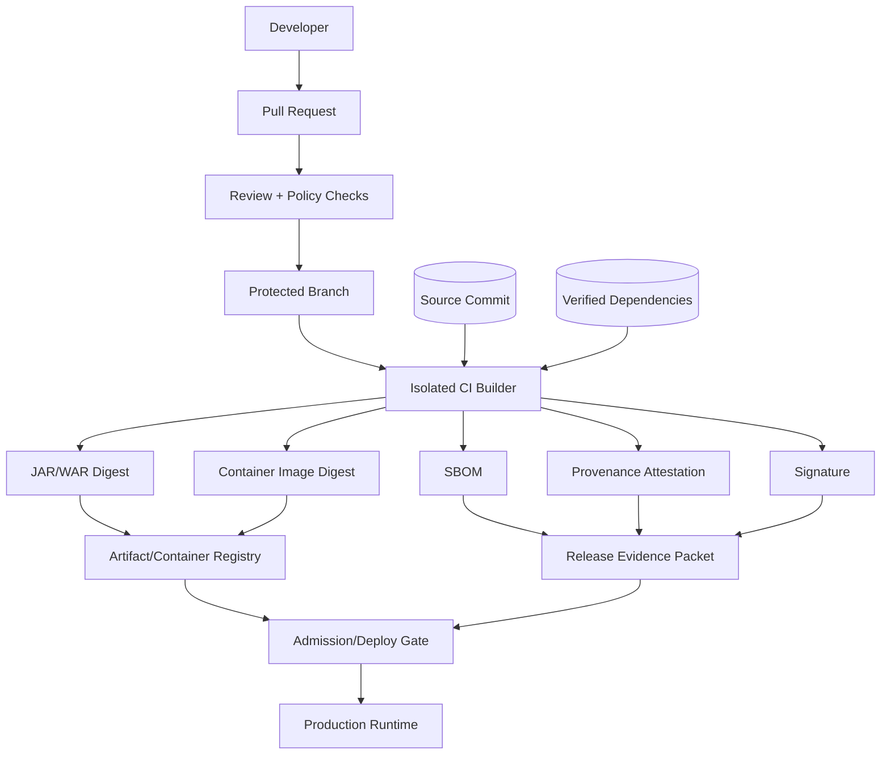
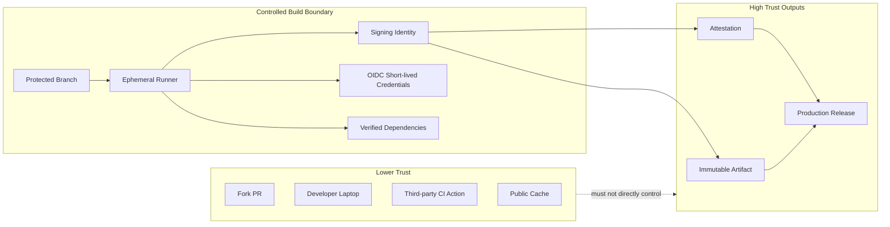
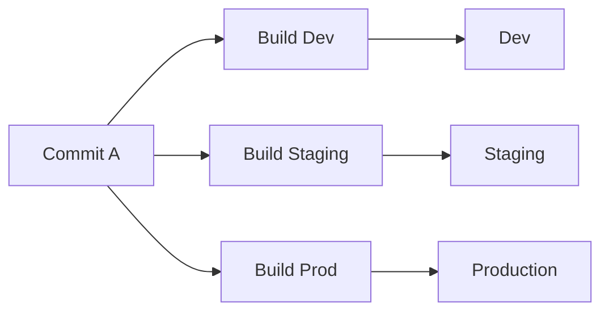
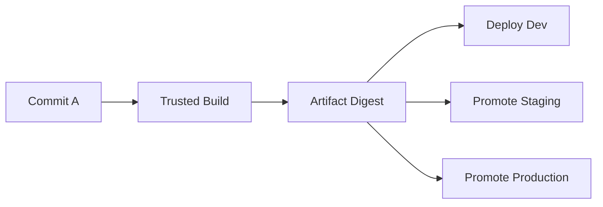
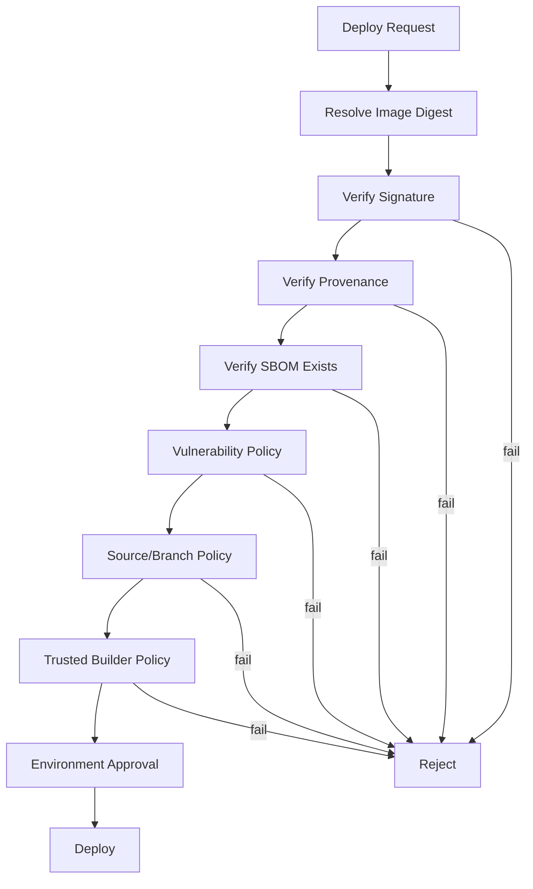

------
title: Learn Java Security, Cryptography and Integrity - Part 027
description: Build and release integrity for Java systems using artifact signing, immutable releases, provenance, CI trust boundaries, SLSA, Sigstore, in-toto, and policy-driven promotion.
series: learn-java-security-cryptography-integrity
seriesTitle: Learn Java Security, Cryptography and Integrity
order: 27
partTitle: Build/Release Signing, Provenance & SLSA
tags:
  - java
  - security
  - supply-chain-security
  - slsa
  - provenance
  - sigstore
  - ci-cd
  - release-engineering
  - secure-engineering
date: 2026-06-30
---

# Part 027 — Build/Release Signing, Provenance & SLSA

Di Part 026 kita mengamankan **dependency yang masuk** ke build. Part ini mengamankan **artifact yang keluar** dari build: JAR/WAR, container image, deployment manifest, SBOM, attestation, dan release evidence. Tujuannya bukan sekadar “build sukses”, tetapi build yang **verifiable**: siapa yang membangun, dari source mana, dengan builder apa, menghasilkan digest apa, lalu bagaimana artifact tersebut dipromosikan ke production.

Supply-chain security sering gagal bukan karena tidak ada scanner, tetapi karena organisasi tidak bisa menjawab pertanyaan sederhana saat incident:

> “Binary yang berjalan di production ini berasal dari commit mana, dibangun oleh pipeline mana, memakai dependency apa, ditandatangani oleh identitas mana, dan apakah ada bukti bahwa artifact ini tidak diubah setelah build?”

Target part ini: kamu mampu mendesain release pipeline Java yang punya **artifact integrity, provenance, signing, promotion gates, and audit-grade evidence**. Kita tidak mengulang Maven/Gradle basic. Kita fokus ke trust boundary dan release correctness.

Referensi baseline:

- SLSA specification v1.2: <https://slsa.dev/spec/v1.2/>
- NIST SP 800-218 Secure Software Development Framework: <https://csrc.nist.gov/pubs/sp/800/218/final>
- Sigstore Cosign container signing: <https://docs.sigstore.dev/cosign/signing/signing_with_containers/>
- in-toto Attestation Framework: <https://in-toto.io/>
- OpenVEX: <https://openvex.dev/>
- CycloneDX: <https://cyclonedx.org/>
- SPDX: <https://spdx.dev/>
- Reproducible Builds: <https://reproducible-builds.org/>
- OCI Image Spec: <https://github.com/opencontainers/image-spec>
- Maven Central publishing requirements: <https://central.sonatype.org/publish/requirements/>
- Gradle Dependency Verification: <https://docs.gradle.org/current/userguide/dependency_verification.html>

---

## 1. Kaufman Deconstruction: Skill yang Harus Dikuasai

Build/release integrity bisa dipecah menjadi sub-skill berikut:

1. **Artifact identity** — memahami identity artifact sebagai digest, bukan nama/tag semata.
2. **Build trust boundary** — mengetahui siapa/apa yang dipercaya: developer, repository, CI runner, secrets, plugin, cache, registry, deployer.
3. **Immutable release discipline** — memastikan release tidak berubah setelah dipromosikan.
4. **Signing semantics** — membedakan checksum, signature, certificate, transparency log, dan keyless signing.
5. **Provenance literacy** — membaca attestation: subject digest, builder identity, source material, invocation, parameters, environment.
6. **SLSA mapping** — menerjemahkan SLSA ke control praktis, bukan sekadar badge.
7. **Promotion governance** — dev → staging → production memakai artifact sama, bukan rebuild ulang tanpa bukti.
8. **Policy enforcement** — menolak deploy jika signature/provenance/SBOM tidak valid.
9. **Incident traceability** — menjawab “apa yang terdampak” dari digest, commit, dependency, dan deployment.
10. **Evidence packaging** — menghasilkan bukti untuk audit/security review/regulatory defensibility.

Minimal effective practice:

- Build satu Java service menjadi JAR dan container image.
- Pin base image by digest.
- Generate SBOM.
- Sign image by digest.
- Generate provenance attestation.
- Enforce deploy hanya untuk image digest yang punya valid signature + provenance.
- Simpan release evidence packet.

---

## 2. Mental Model: Release Bukan File, Release Adalah Chain of Custody

Artifact production chain:



Security invariant:

> **Production must run only immutable artifacts whose digest, source, builder, dependencies, and authorization path can be verified.**

Jika production deploy memakai `my-service:latest`, rebuild manual, mutable artifact, shared CI runner tanpa isolation, atau bypass emergency tanpa evidence, chain of custody putus.

---

## 3. Artifact Identity: Nama Bukan Identitas

Nama artifact adalah label. Identitas artifact adalah digest.

| Object | Weak identity | Stronger identity |
|---|---|---|
| Maven artifact | `com.acme:case-service:1.4.0` | repository + GAV + checksum/signature + timestamp + provenance |
| JAR file | `case-service.jar` | SHA-256 digest + signature + source commit attestation |
| Container image | `case-service:1.4.0` | OCI digest `sha256:...` + signature + SBOM + provenance |
| Helm chart | `case-service-1.4.0.tgz` | chart digest + signed package + referenced image digests |
| Deployment manifest | `deployment.yaml` | Git commit + manifest digest + reviewed promotion record |

Anti-pattern:

```yaml
image: registry.example.com/case-service:latest
```

Better:

```yaml
image: registry.example.com/case-service@sha256:3d4f...
```

Tag bisa berubah. Digest merepresentasikan content-addressed identity. Release policy harus berbicara dalam digest.

---

## 4. Threat Model Build/Release Java

| Threat | Example | Impact | Primary Control |
|---|---|---|---|
| Build script tampering | PR mengubah Gradle task untuk exfiltrate token | CI credential theft | protected branch, review, workflow permissions |
| CI runner compromise | Shared runner menyisakan state/cache berbahaya | poisoned artifact | ephemeral runner, isolation, cache policy |
| Mutable artifact | JAR/image diganti setelah approval | production drift | immutable registry, digest pinning |
| Unsigned release | Tidak ada verifiable producer identity | artifact spoofing | signing + verification gate |
| Provenance forgery | Attestation dibuat oleh actor tidak dipercaya | false assurance | trusted builder identity, transparency, policy |
| Dependency confusion during build | Resolver mengambil artifact publik | malicious code execution | repository allowlist, dependency verification |
| Build cache poisoning | Cache memuat output dari input berbeda | injected binary | cache isolation, content-addressed cache |
| Secret leakage | CI logs/env mengandung token | lateral movement | least-privilege OIDC, masking, short-lived tokens |
| Deployment bypass | Manual kubectl deploy image unknown | uncontrolled production | admission control, RBAC, release gate |
| Rebuild-on-promote | Staging dan prod menjalankan binary berbeda | untraceable behavior | build once, promote same digest |
| Unpinned base image | `eclipse-temurin:25-jre` berubah | silent drift | pin by digest, update deliberately |
| Artifact repository compromise | Registry serves modified image | malicious runtime | signature verification at deploy |

---

## 5. Release Integrity Invariants

Gunakan invariant berikut sebagai review rubric:

1. **Source invariant** — setiap release menunjuk ke immutable source revision.
2. **Builder invariant** — release dibangun oleh builder/pipeline yang diizinkan.
3. **Input invariant** — dependency, plugin, base image, dan build parameters bisa diketahui.
4. **Output invariant** — artifact diidentifikasi dengan cryptographic digest.
5. **Signature invariant** — artifact/attestation ditandatangani oleh trusted identity/key.
6. **Provenance invariant** — ada bukti machine-readable tentang bagaimana artifact dibuat.
7. **Promotion invariant** — environment naik level memakai artifact digest yang sama.
8. **Policy invariant** — production deploy menolak artifact yang tidak memenuhi signature/provenance/SBOM policy.
9. **Evidence invariant** — release evidence bisa diambil ulang untuk incident dan audit.
10. **Revocation invariant** — artifact yang compromised bisa diblokir melalui policy, bukan hanya diumumkan di chat.

---

## 6. Build Trust Boundary

CI/CD sering menjadi trust boundary paling kritis karena menyentuh source, credentials, signing identity, registry token, deploy token, SBOM, dan artifact.



Rules:

- PR dari fork tidak boleh punya akses ke production secrets.
- Workflow file changes harus direview ekstra ketat.
- Build runner harus ephemeral untuk release-grade artifact.
- Token registry/deploy/signing harus short-lived dan scoped.
- Build output harus immutable begitu keluar dari trusted builder.
- Release job harus bergantung pada artifact digest, bukan rebuild lokal.

---

## 7. Checksums, Signatures, Attestations, and Provenance

Banyak tim mencampur istilah ini. Perbedaannya penting.

| Mechanism | Menjawab | Tidak menjawab |
|---|---|---|
| Checksum | “Content ini berubah atau tidak?” | “Siapa yang membuat?” |
| Signature | “Identity/key ini menyetujui content ini?” | “Bagaimana content dibuat?” |
| Certificate | “Key/identity ini terikat ke subject apa?” | “Artifact-nya aman?” |
| Transparency log | “Signature pernah dipublikasikan dan bisa diaudit?” | “Code bebas vulnerability?” |
| SBOM | “Komponen apa saja di dalam artifact?” | “Artifact dibangun oleh pipeline yang sah?” |
| Provenance attestation | “Artifact dibuat dari source/input/builder apa?” | “Semua dependency bebas exploit?” |
| VEX | “Apakah vulnerability tertentu exploitable untuk artifact ini?” | “Artifact tidak diubah?” |

Signature tanpa provenance hanya mengatakan “seseorang menandatangani artifact”. Provenance tanpa policy hanya menjadi dokumentasi. Policy tanpa enforcement menjadi checklist.

---

## 8. Java Artifact Surfaces

Java release bisa menghasilkan banyak artifact:

| Artifact | Security concern |
|---|---|
| Thin JAR | runtime classpath harus dikontrol |
| Fat/Uber JAR | shaded dependency bisa menyembunyikan vulnerable code |
| WAR/EAR | app server dependency interaction |
| Native image | build-time dependency/code initialization risk |
| Container image | base image, OS packages, user, capabilities |
| Helm/Kustomize manifests | image digest, env, secrets, securityContext |
| SBOM | completeness dan mapping ke release digest |
| Provenance attestation | builder/source identity |
| Migration scripts | privileged DB changes |
| Config bundle | feature flags, endpoint, policy |

Invariant:

> **Release identity must cover every artifact that changes production behavior.**

Jangan hanya sign container image sementara migration script atau config bundle bisa mengubah privilege, schema, atau authorization behavior.

---

## 9. Build Once, Promote by Digest

Bad release flow:



Problem:

- Dependency resolution bisa berbeda.
- Base image bisa berubah.
- Build plugin bisa menghasilkan output berbeda.
- Secret/build arg bisa berbeda.
- Tidak ada jaminan staging artifact sama dengan production artifact.

Better:



Rule:

> Build once. Promote the same digest. Environment differences masuk sebagai runtime configuration yang terkontrol, bukan rebuild.

---

## 10. SLSA sebagai Maturity Model, Bukan Badge

SLSA membantu mengatur expectation supply-chain integrity. Pakai SLSA untuk memetakan control, bukan sekadar menempel badge di README.

Praktik mapping sederhana:

| Capability | Baseline | Stronger |
|---|---|---|
| Source control | protected branch | branch protection + signed commits/tags + review policy |
| Build | scripted CI | ephemeral isolated trusted builder |
| Provenance | generated manually | generated by builder, signed, non-forgeable by developer |
| Artifact | named by tag/version | content-addressed digest |
| Dependencies | scanner only | verification + SBOM + provenance input |
| Deploy | manual deploy allowed | admission verifies signature/provenance |
| Evidence | scattered logs | release evidence packet |

SLSA bukan pengganti threat model. SLSA tidak otomatis membuktikan aplikasi bebas vulnerability. Ia membantu membuktikan bahwa artifact yang kamu jalankan berasal dari proses build yang dikontrol.

---

## 11. Provenance: Apa yang Harus Dibaca

Sebuah provenance attestation minimal harus membuat kamu bisa menjawab:

- Artifact digest apa yang menjadi subject?
- Source repository apa?
- Commit/ref apa?
- Builder identity apa?
- Workflow/pipeline apa?
- Build trigger apa?
- Build parameters apa?
- Dependency/material apa yang dipakai?
- Waktu build kapan?
- Siapa/apa yang menandatangani attestation?

Pseudo-shape:

```json
{
  "subject": [
    {
      "name": "registry.example.com/case-service",
      "digest": { "sha256": "..." }
    }
  ],
  "predicateType": "https://slsa.dev/provenance/v1",
  "predicate": {
    "buildDefinition": {
      "buildType": "https://github.com/actions/workflow",
      "externalParameters": {
        "source": "git+https://github.com/acme/case-service@refs/tags/v1.4.0"
      }
    },
    "runDetails": {
      "builder": { "id": "https://github.com/actions/runner/..." }
    }
  }
}
```

Review question:

> Apakah provenance dibuat oleh trusted builder atau oleh script yang bisa diubah developer di PR?

Jika developer bisa mengubah script untuk menghasilkan provenance palsu, provenance tidak punya kekuatan assurance tinggi.

---

## 12. Signing Strategy untuk Java Release

Ada beberapa level signing.

### 12.1 Maven/JAR Publishing Signing

Untuk library publik, ecosystem Maven sering memakai PGP signing karena repository/publishing workflow mengharuskannya. Ini berguna untuk distribusi library, tetapi untuk internal service production biasanya belum cukup karena:

- signature sering melekat ke artifact library, bukan container runtime;
- tidak selalu mengikat artifact ke CI builder;
- tidak otomatis diverifikasi saat deploy;
- key management PGP sering rapuh di organisasi besar.

Gunakan bila kamu publish library. Jangan anggap ini menggantikan release provenance.

### 12.2 JAR Signing

`jarsigner` bisa menandatangani JAR. Ini berguna untuk use case tertentu seperti plugin, applet era lama, atau distribusi komponen yang perlu verifikasi class/resource. Namun untuk microservice containerized, signature JAR jarang menjadi enforcement boundary utama.

Risk:

- JAR bisa ditandatangani tapi container image berisi entrypoint/config/agent berbahaya.
- Runtime bisa memuat Java agent atau classpath tambahan di luar signed JAR.
- Verification harus benar-benar dilakukan sebelum execution.

### 12.3 Container Image Signing

Untuk service modern, signing container image by digest sering lebih praktis karena deployment unit adalah image.

Example conceptual commands:

```bash
# Build and push image
IMAGE="registry.example.com/case-service"
TAG="1.4.0"
docker build -t "$IMAGE:$TAG" .
docker push "$IMAGE:$TAG"

# Resolve immutable digest
DIGEST="$(crane digest "$IMAGE:$TAG")"
REF="$IMAGE@$DIGEST"

# Sign immutable reference
cosign sign "$REF"

# Attach SBOM/provenance as attestations
cosign attest --predicate sbom.cdx.json --type cyclonedx "$REF"
cosign attest --predicate provenance.json --type slsaprovenance "$REF"
```

Principle:

> Sign immutable digest references, not mutable tags.

### 12.4 Keyless Signing

Keyless signing memakai OIDC identity dari CI dan short-lived certificate. Benefit:

- tidak menyimpan long-lived private key di CI;
- identity bisa dikaitkan ke repo/workflow;
- transparency log bisa membantu audit;
- rotation burden lebih rendah.

Risk yang tetap harus dikontrol:

- workflow permissions;
- branch protection;
- trusted builder identity;
- policy verification subject;
- replay/bypass deploy path.

---

## 13. CI Credentials: Prefer Short-Lived, Scoped, and Auditable

Bad:

```text
CI_SECRET_PROD_DEPLOY_TOKEN = long-lived token with cluster-admin
CI_SECRET_SIGNING_KEY = long-lived private key stored in repo/org secret
```

Better:

- CI obtains short-lived credentials through OIDC federation.
- Token scope limited to one repository/workflow/environment.
- Production deployment requires environment protection/approval.
- Signing identity is derived from trusted workflow identity.
- Secrets are not exposed to fork PRs.
- Logs redact values and disable debug echoing.

CI should be treated like a production system. It can create production code.

---

## 14. Build Isolation and Hermeticity

Ideal build properties:

| Property | Meaning | Why it matters |
|---|---|---|
| Ephemeral | clean machine/container per build | avoids state poisoning |
| Isolated | build cannot see unnecessary networks/secrets | reduces exfiltration |
| Scripted | build steps are versioned | repeatable review |
| Pinned | tool/dependency/base image versions pinned | avoids silent drift |
| Verifiable | outputs have digest/signature/provenance | deploy can enforce |
| Reproducible-ish | same inputs tend to same output | easier audit/diff |

Hermetic build penuh sulit untuk banyak Java projects karena Maven/Gradle dependency resolution, plugin downloads, timestamped archives, generated metadata, dan remote repositories. Tetapi kamu tetap bisa bergerak ke arah yang lebih deterministic:

- gunakan lockfile/dependency verification;
- pin JDK distribution/version;
- pin container base image by digest;
- disable dynamic versions (`1.+`, `latest.release`);
- avoid build-time network selain artifact repositories allowlisted;
- normalize archive timestamps bila tooling mendukung;
- jangan embed build machine path/random value ke artifact;
- simpan build metadata di provenance, bukan tersembunyi di binary.

---

## 15. Build Cache Poisoning

Cache mempercepat build, tapi cache juga trust boundary.

Threat:

- PR berbahaya menulis cache key yang dipakai release build.
- Cache dari branch tidak dipercaya dipakai protected branch.
- Build output cache tidak mengikat input digest.
- Dependency cache berisi artifact tampered.

Controls:

- pisahkan cache trusted dan untrusted branch;
- jangan restore release cache dari fork PR;
- gunakan dependency verification setelah restore cache;
- cache keyed by lockfile + toolchain + OS + branch trust level;
- invalidate cache saat build plugin berubah;
- jangan cache secrets atau generated credentials;
- release build boleh lebih lambat jika integrity lebih kuat.

---

## 16. Base Image Discipline

Bad Dockerfile:

```dockerfile
FROM eclipse-temurin:25-jre
COPY target/app.jar /app/app.jar
CMD ["java", "-jar", "/app/app.jar"]
```

Masalah:

- tag mutable;
- user default bisa root;
- tidak ada digest pinning;
- tidak ada SBOM/provenance tie-in;
- tidak ada minimal runtime control.

Better concept:

```dockerfile
FROM eclipse-temurin:25-jre@sha256:<pinned-digest>

RUN addgroup --system app && adduser --system --ingroup app app
WORKDIR /app
COPY --chown=app:app target/case-service.jar /app/case-service.jar
USER app:app

ENTRYPOINT ["java", "-jar", "/app/case-service.jar"]
```

Part 028 akan membahas runtime hardening lebih detail. Di part ini, poin pentingnya: base image adalah build input dan release material. Ia harus masuk SBOM/provenance dan diupdate dengan process yang disengaja.

---

## 17. Release Evidence Packet

Setiap production release harus punya evidence packet. Ini bisa berupa folder/object storage record/ticket attachment.

Isi minimum:

```text
release-id: CASE-SERVICE-2026.06.30-001
service: case-service
version: 1.4.0
source-repo: https://github.com/acme/case-service
source-commit: <git-sha>
release-branch/tag: refs/tags/v1.4.0
builder: github-actions://acme/case-service/.github/workflows/release.yml
jdk: 25.0.x
build-tool: Gradle 9.x or Maven 4.x
artifact-digest:
  jar: sha256:...
  image: sha256:...
sbom:
  cyclonedx: sbom.cdx.json sha256:...
provenance:
  slsa: provenance.intoto.jsonl sha256:...
signatures:
  image: cosign signature reference
policy-results:
  dependency-scan: pass/waived
  container-scan: pass/waived
  license-policy: pass/waived
  sast: pass/waived
approvals:
  engineering-owner: ...
  security-exception: ...
deployment:
  staging-digest: sha256:...
  prod-digest: sha256:...
rollback:
  previous-prod-digest: sha256:...
```

Evidence packet bukan birokrasi. Ia mengurangi MTTR saat incident.

---

## 18. Promotion Gates

A release gate harus memutuskan berdasarkan artifact evidence, bukan trust pada manusia yang menjalankan deploy.

Gate example:



Policy examples:

- image must be referenced by digest;
- image digest must have valid signature;
- signing identity must match trusted CI workflow;
- provenance source repo must match expected repository;
- source ref must be protected branch or signed release tag;
- builder id must be from allowed builder set;
- SBOM must exist and match digest;
- critical vulnerabilities must be fixed or have approved VEX/waiver;
- production namespace denies unsigned images.

---

## 19. Example: GitHub Actions Release Shape

Conceptual workflow:

```yaml
name: release

on:
  push:
    tags:
      - "v*"

permissions:
  contents: read
  id-token: write
  packages: write

jobs:
  build:
    runs-on: ubuntu-latest
    environment: release
    steps:
      - uses: actions/checkout@v4
        with:
          fetch-depth: 0

      - name: Set up JDK
        uses: actions/setup-java@v4
        with:
          distribution: temurin
          java-version: "25"

      - name: Build and test
        run: ./gradlew clean test bootJar --no-daemon

      - name: Generate SBOM
        run: ./gradlew cyclonedxBom --no-daemon

      - name: Build image
        run: |
          docker build -t ghcr.io/acme/case-service:${GITHUB_REF_NAME} .
          docker push ghcr.io/acme/case-service:${GITHUB_REF_NAME}

      - name: Resolve digest
        id: digest
        run: |
          DIGEST=$(crane digest ghcr.io/acme/case-service:${GITHUB_REF_NAME})
          echo "image=ghcr.io/acme/case-service@${DIGEST}" >> "$GITHUB_OUTPUT"

      - name: Sign image
        run: cosign sign --yes "${{ steps.digest.outputs.image }}"

      - name: Attest SBOM
        run: |
          cosign attest --yes \
            --predicate build/reports/bom.json \
            --type cyclonedx \
            "${{ steps.digest.outputs.image }}"
```

Hardening notes:

- Pin third-party actions by commit SHA for stricter assurance.
- Restrict workflow permissions; default token should not be broad.
- Use environment protection for release/prod.
- Do not expose secrets to fork PRs.
- Prefer OIDC federation over static cloud credentials.
- Ensure provenance is generated by trusted builder, not hand-written script when higher assurance is required.

---

## 20. Policy-as-Code Examples

Policy language can be OPA/Rego, Kyverno, admission controller config, or platform-specific rules. The important part is semantic.

Pseudo-policy:

```rego
package release.policy

default allow = false

allow {
  input.image.digest != ""
  input.signature.verified == true
  input.signature.identity in data.trusted_signers
  input.provenance.verified == true
  input.provenance.source_repo == "https://github.com/acme/case-service"
  input.provenance.builder_id in data.trusted_builders
  input.sbom.exists == true
  input.vulnerability_policy.status == "pass"
}
```

Policy should produce a decision with reason:

```json
{
  "allow": false,
  "reason": "image signature identity does not match trusted release workflow",
  "artifact": "registry.example.com/case-service@sha256:..."
}
```

Audit-grade systems need explainable denial, not just “403”.

---

## 21. Release Signing Failure Modes

| Failure | Why it is dangerous | Fix |
|---|---|---|
| Signing mutable tag | Later tag update invalidates assumption | sign digest |
| Signature verified but identity ignored | Any signer accepted | verify expected identity/key |
| Provenance exists but not verified | Attestation spoof possible | verify signature + subject digest |
| Signing key in CI secret | key theft compromises all future releases | use KMS/HSM/keyless or scoped key |
| Manual emergency deploy bypasses gate | attacker waits for exception path | controlled break-glass with evidence |
| SBOM generated from source, not artifact | SBOM mismatch | generate/attach to final artifact |
| Rebuild per environment | prod artifact differs from tested artifact | build once, promote digest |
| Allow latest tag | silent update | digest pinning |
| Untrusted cache | build output influenced by PR | cache isolation |
| No revocation/blocklist | compromised artifact remains deployable | denylist digest/signature policy |

---

## 22. VEX and Vulnerability Exceptions

A vulnerability finding is not always exploitable in a specific artifact. VEX helps encode statements like:

- not affected;
- affected;
- fixed;
- under investigation.

But VEX can become dangerous if used as “paper shield”. Require:

- exact product/artifact digest;
- vulnerability ID;
- justification;
- reviewer;
- expiration date;
- compensating controls;
- re-evaluation trigger when code path/config changes.

Good exception:

```yaml
vulnerability: CVE-20xx-yyyy
artifact: registry.example.com/case-service@sha256:...
status: not_affected
justification: vulnerable module is not packaged in final image
validated_by: security-review-1234
expires: 2026-08-31
```

Bad exception:

```yaml
CVE ignored because scanner noisy.
```

---

## 23. Reproducible Builds: Useful, But Not a Silver Bullet

Reproducible builds mean independent builds can produce identical output from same source/input. Benefit:

- detects hidden build influence;
- improves auditability;
- strengthens confidence in release process;
- helps compare source vs binary.

Java challenges:

- timestamps in JAR metadata;
- generated build-info properties;
- file ordering;
- OS path differences;
- annotation processors;
- plugin versions;
- embedded Git/build time;
- native dependencies.

Practical target:

- deterministic archive configuration;
- fixed build timezone/locale;
- pinned toolchain;
- no dynamic dependency versions;
- stable generated metadata;
- provenance records unavoidable non-determinism.

Even if builds are not fully reproducible, provenance + signing + policy still provide strong operational assurance.

---

## 24. Secure Release ADR Template

```mdx
# ADR: Release Integrity for case-service

## Context
case-service handles enforcement case evidence and regulatory workflow decisions. Production releases must be traceable to approved source and immutable artifact digest.

## Decision
- Build once in trusted CI from protected release tag.
- Produce JAR, container image, SBOM, and SLSA provenance.
- Sign final image by digest using CI OIDC identity.
- Production deployment references image digest only.
- Admission policy verifies signature, source repo, builder id, and SBOM existence.
- Emergency deploy requires break-glass approval and post-release evidence packet within 24 hours.

## Security Invariants
- No mutable tag in production.
- No unsigned image in production.
- No artifact without source commit mapping.
- No rebuild during promotion.

## Consequences
- Release pipeline is slightly slower.
- Manual hotfix path is constrained.
- Incident traceability improves.
```

---

## 25. Java-Specific Release Review Checklist

### Source and Build

- [ ] Release source is protected branch or signed tag.
- [ ] Workflow changes require code owner review.
- [ ] Build uses pinned JDK distribution/version.
- [ ] Maven/Gradle wrapper is checked in and verified.
- [ ] Dynamic dependency versions are disallowed.
- [ ] Dependency verification or lock metadata is enabled.
- [ ] Build plugins are reviewed as trusted code.
- [ ] Annotation processors are explicitly allowed.

### Artifact

- [ ] JAR/WAR digest recorded.
- [ ] Container image digest recorded.
- [ ] Image references base image by digest.
- [ ] SBOM generated from final artifact/image.
- [ ] Shaded dependencies are represented in SBOM or documented.
- [ ] Build metadata does not leak secrets.

### Signing and Provenance

- [ ] Image/JAR/significant artifacts are signed.
- [ ] Signature is over digest, not mutable tag.
- [ ] Provenance subject digest matches final artifact.
- [ ] Provenance builder is trusted.
- [ ] Signing identity is scoped to release workflow.
- [ ] Keyless/KMS/HSM strategy has rotation/revocation model.

### Promotion

- [ ] Staging and production use same digest.
- [ ] Production manifest pins digest.
- [ ] Admission policy verifies signature/provenance.
- [ ] Emergency bypass is logged and reviewed.
- [ ] Release evidence packet is stored.

---

## 26. Lab: Build a Verifiable Java Release

Goal: produce a minimal release evidence packet.

Steps:

1. Pick a Java service.
2. Generate JAR.
3. Generate SBOM.
4. Build container image.
5. Push image to registry.
6. Resolve image digest.
7. Sign image digest.
8. Attach SBOM attestation.
9. Generate provenance attestation.
10. Create `release-evidence.md` with source commit, artifact digest, SBOM path, signature reference, provenance path, and deployment environment.

Expected output:

```text
release-evidence/
  release.md
  sbom.cdx.json
  provenance.intoto.jsonl
  image-digest.txt
  policy-result.json
```

Stretch:

- reject deployment if image uses tag without digest;
- reject if signature identity mismatch;
- reject if provenance source repo mismatch.

---

## 27. Interview-Level Questions

1. Why is signing `:latest` weaker than signing `@sha256`?
2. What does provenance prove that a signature alone does not?
3. Why is CI runner isolation part of artifact integrity?
4. How can build cache poisoning affect release integrity?
5. Why is “build again in production” an anti-pattern?
6. What is the difference between SBOM and VEX?
7. Why can a signed artifact still be vulnerable?
8. What controls prevent manual deploy bypass?
9. How would you respond if a signing identity is compromised?
10. How do you prove which customers were affected by a vulnerable image digest?

---

## 28. Common Anti-Patterns

| Anti-pattern | Correction |
|---|---|
| “CI passed, so artifact is trusted” | CI must produce verifiable signed output |
| “We use tags for release identity” | use digest for production identity |
| “We have SBOM, therefore secure” | SBOM is inventory, not assurance by itself |
| “Only security team can approve release security” | platform should enforce policy automatically |
| “Emergency deploy can bypass everything” | break-glass must be controlled and auditable |
| “Provenance generated by arbitrary script is enough” | provenance must be tied to trusted builder identity |
| “Signing key is just another CI secret” | use KMS/HSM/keyless with scoped identity |
| “Staging rebuild is close enough” | promote same digest |
| “Scanner found nothing, ship it” | scanner is one control, not complete proof |
| “Release evidence lives in Slack” | store structured evidence packet |

---

## 29. Summary

Build/release integrity is about preserving trust from source to production. For Java systems, that means treating JARs, images, manifests, SBOMs, provenance, and release approvals as one coherent chain of custody.

Core takeaways:

- Artifact identity is digest, not name or tag.
- Build once; promote the same digest.
- Sign immutable artifact references.
- Generate provenance that binds artifact to source and builder.
- CI is a high-trust production system.
- SBOM is inventory; signature is integrity/identity; provenance is origin/process evidence.
- SLSA is a control map, not a magic badge.
- Production deploy should enforce signature/provenance/SBOM policy automatically.
- Release evidence must survive incident response and audit.

Next part: **Container, Cloud Runtime & JVM Hardening** — how to run trusted artifacts with minimum runtime blast radius.
