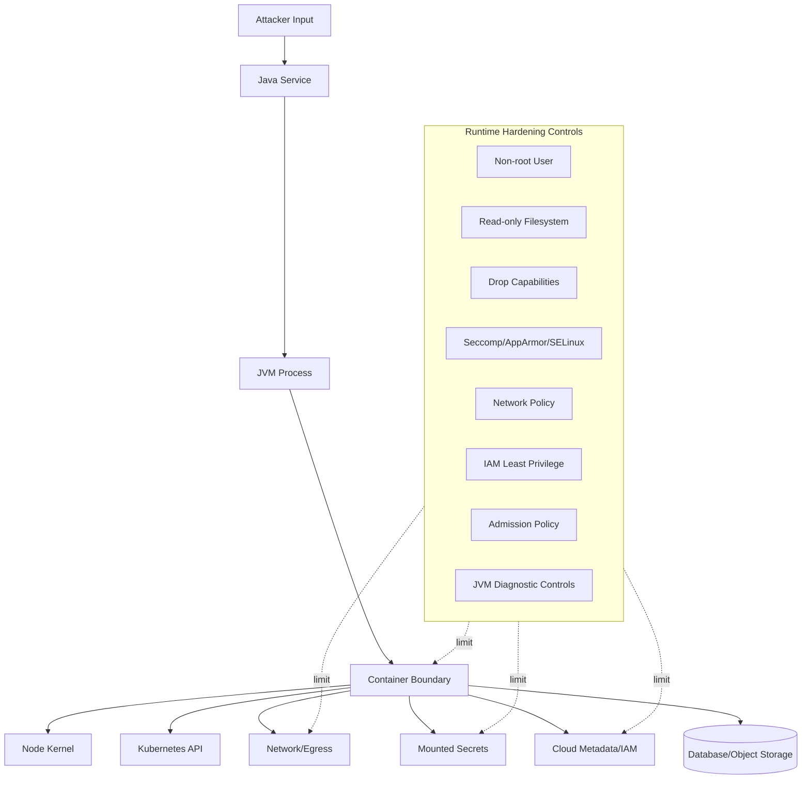
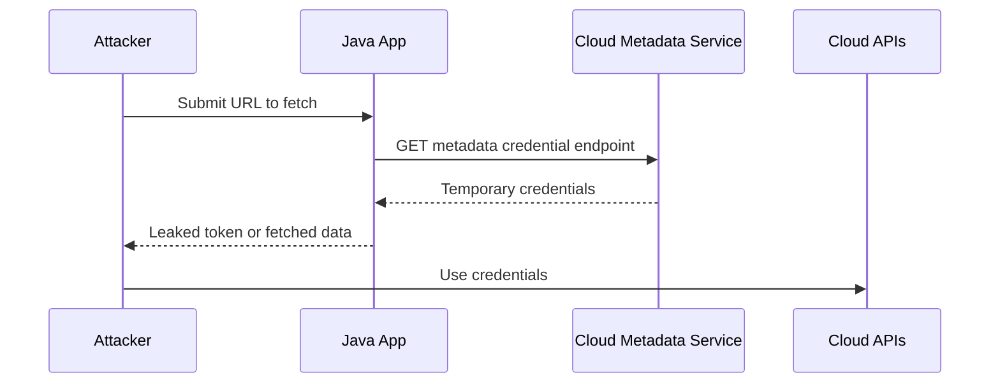

------
title: Learn Java Security, Cryptography and Integrity - Part 028
description: Container, cloud runtime, and JVM hardening for Java production systems: least privilege, Kubernetes security context, pod security standards, secrets, egress, metadata service protection, and JVM runtime controls.
series: learn-java-security-cryptography-integrity
seriesTitle: Learn Java Security, Cryptography and Integrity
order: 28
partTitle: Container, Cloud Runtime & JVM Hardening
tags:
  - java
  - security
  - container-security
  - kubernetes
  - cloud-security
  - jvm-hardening
  - runtime-security
  - secure-engineering
date: 2026-06-30
---

# Part 028 — Container, Cloud Runtime & JVM Hardening

Part 027 memastikan artifact yang masuk production bisa dipercaya. Part ini menjawab pertanyaan berikutnya:

> “Setelah artifact dipercaya, bagaimana kita menjalankannya supaya compromise satu service tidak berubah menjadi compromise cluster, cloud account, database, secrets, atau tenant lain?”

Runtime hardening bukan pengganti secure coding, TLS, authorization, dependency security, atau signing. Runtime hardening adalah **blast-radius control**. Ketika aplikasi Java terkena RCE, SSRF, deserialization bug, vulnerable dependency, atau logic abuse, runtime boundary menentukan seberapa jauh attacker bisa bergerak.

Target part ini: kamu mampu mendesain container/cloud/JVM runtime profile untuk Java service production: non-root, minimal image, read-only filesystem, restricted capabilities, egress control, workload identity, secret handling, metadata service defense, safe JVM flags, and admission policy.

Referensi baseline:

- Docker Engine Security: <https://docs.docker.com/engine/security/>
- Docker Build Best Practices: <https://docs.docker.com/build/building/best-practices/>
- OWASP Docker Security Cheat Sheet: <https://cheatsheetseries.owasp.org/cheatsheets/Docker_Security_Cheat_Sheet.html>
- Kubernetes Pod Security Standards: <https://kubernetes.io/docs/concepts/security/pod-security-standards/>
- Kubernetes Security Context: <https://kubernetes.io/docs/tasks/configure-pod-container/security-context/>
- Kubernetes Network Policies: <https://kubernetes.io/docs/concepts/services-networking/network-policies/>
- Kubernetes Secrets: <https://kubernetes.io/docs/concepts/configuration/secret/>
- Oracle Java Tools `jlink`: <https://docs.oracle.com/en/java/javase/25/docs/specs/man/jlink.html>
- JVM in Containers resource ergonomics: <https://docs.oracle.com/en/java/javase/25/gctuning/>
- OWASP Secrets Management Cheat Sheet: <https://cheatsheetseries.owasp.org/cheatsheets/Secrets_Management_Cheat_Sheet.html>

---

## 1. Kaufman Deconstruction: Skill yang Harus Dikuasai

Runtime hardening bisa dipecah menjadi sub-skill:

1. **Container image minimization** — hanya memasukkan runtime yang diperlukan.
2. **Linux privilege model** — user, group, capabilities, seccomp, AppArmor/SELinux, read-only FS.
3. **Kubernetes workload security** — `securityContext`, Pod Security Standards, service account, admission, network policy.
4. **Cloud identity boundary** — workload identity, IAM least privilege, metadata service protection.
5. **Secret exposure control** — secret mount, rotation, heap dump/log risk, file permissions.
6. **JVM runtime control** — memory, diagnostics, JMX, debugging, agents, classpath/module surface.
7. **Egress and lateral movement** — DNS, outbound allowlist, service-to-service boundary.
8. **Runtime observability security** — signals without leaking secrets/PII.
9. **Incident containment** — kill switch, revoke identity, quarantine workload, rollout/rollback.
10. **Policy enforcement** — admission rejects workloads that violate runtime invariants.

Minimal effective practice:

- Build a Java container image with non-root user.
- Deploy with `runAsNonRoot`, `allowPrivilegeEscalation: false`, `readOnlyRootFilesystem: true`, `capabilities.drop: ["ALL"]`.
- Disable unnecessary service account token automount.
- Add network policy with explicit egress.
- Verify app still works with writable `/tmp` only.

---

## 2. Mental Model: Runtime Boundary Is a Damage Limiter



Security invariant:

> **Assume application compromise is possible; runtime controls must prevent that compromise from becoming infrastructure compromise.**

This is the “assume breach” mindset applied to Java services.

---

## 3. Runtime Threat Model

| Threat | Example | Runtime impact if weak |
|---|---|---|
| RCE in Java app | template injection, deserialization, vulnerable library | attacker executes commands as container user |
| SSRF | app fetches attacker-controlled URL | metadata credential theft |
| Path traversal | write arbitrary file | overwrite config, plant webshell, modify logs |
| Secret read | env vars/files/heap dump exposed | database/cloud credential compromise |
| Container breakout aid | privileged container/capabilities | host compromise |
| Lateral movement | unrestricted egress | scan internal network, call admin services |
| Kubernetes API abuse | mounted service account token broad RBAC | secret listing, pod creation |
| Debug endpoint exposure | remote debug/JMX/Actuator public | arbitrary execution/data leak |
| Writable root FS | attacker persists tooling | stealth/persistence inside container |
| Over-permissive IAM | workload can access broad cloud APIs | account-wide compromise |
| No resource limits | DoS through memory/thread/file growth | node/service instability |
| Log/trace leakage | secret/PII in logs | compliance breach |

---

## 4. Runtime Security Invariants

Use these invariants in every Java service review:

1. **No root process** — application does not run as UID 0.
2. **No privilege escalation** — container cannot gain more privileges after start.
3. **No unnecessary Linux capabilities** — drop all; add only documented exceptions.
4. **No privileged container** — never for application workloads.
5. **Read-only root filesystem** — writes only to explicit ephemeral volumes.
6. **No broad Kubernetes token** — service account least privilege; disable token if not needed.
7. **No broad cloud IAM** — workload identity scoped to exact resources/actions.
8. **No open egress** — outbound network is allowlisted where feasible.
9. **No mutable production image** — image pinned by digest and verified.
10. **No public diagnostics** — JMX/debug/Actuator/admin endpoints protected or disabled.
11. **No secrets in logs/env/heap dumps** — secret exposure surfaces controlled.
12. **No unbounded resources** — CPU/memory/ephemeral storage limits appropriate.

---

## 5. Container Image Hardening for Java

### 5.1 Multi-Stage Build

Separate build tools from runtime image.

```dockerfile
# syntax=docker/dockerfile:1
FROM eclipse-temurin:25-jdk@sha256:<pinned-digest> AS build
WORKDIR /workspace
COPY gradlew settings.gradle.kts build.gradle.kts ./
COPY gradle ./gradle
RUN ./gradlew dependencies --no-daemon
COPY src ./src
RUN ./gradlew clean test bootJar --no-daemon

FROM eclipse-temurin:25-jre@sha256:<pinned-digest> AS runtime
RUN addgroup --system app && adduser --system --ingroup app app
WORKDIR /app
COPY --from=build --chown=app:app /workspace/build/libs/app.jar /app/app.jar
USER app:app
ENTRYPOINT ["java", "-jar", "/app/app.jar"]
```

Principles:

- Build stage can contain compiler/tools.
- Runtime stage contains only what is needed to run.
- Base images pinned by digest.
- App runs as non-root.
- No package manager needed in runtime if avoidable.

### 5.2 Minimal Runtime with `jlink`

For some services, you can build a custom Java runtime image using `jlink`.

Conceptual flow:

```bash
jdeps --ignore-missing-deps --print-module-deps build/libs/app.jar

jlink \
  --add-modules java.base,java.logging,java.net.http,jdk.crypto.ec \
  --strip-debug \
  --no-man-pages \
  --no-header-files \
  --compress=2 \
  --output build/runtime
```

Benefits:

- smaller runtime surface;
- fewer unused Java modules;
- smaller image;
- reduced patch exposure.

Trade-offs:

- framework reflection/dynamic loading may need careful module discovery;
- debugging can be harder;
- native dependencies and agents need testing;
- CVE scanning must understand custom runtime composition.

Do not use `jlink` blindly. Use it when you can test compatibility and patch process.

---

## 6. Non-Root Is Necessary, Not Sufficient

Running as non-root reduces damage, but it does not make application safe.

Bad:

```dockerfile
FROM eclipse-temurin:25-jre
COPY app.jar /app.jar
ENTRYPOINT ["java", "-jar", "/app.jar"]
```

Better:

```dockerfile
FROM eclipse-temurin:25-jre@sha256:<pinned-digest>
RUN addgroup --system --gid 10001 app \
 && adduser --system --uid 10001 --ingroup app app
WORKDIR /app
COPY --chown=10001:10001 app.jar /app/app.jar
USER 10001:10001
ENTRYPOINT ["java", "-jar", "/app/app.jar"]
```

Kubernetes should also enforce it. Do not rely only on Dockerfile.

---

## 7. Kubernetes `securityContext` Baseline

Example deployment fragment:

```yaml
apiVersion: apps/v1
kind: Deployment
metadata:
  name: case-service
spec:
  template:
    spec:
      automountServiceAccountToken: false
      securityContext:
        runAsNonRoot: true
        runAsUser: 10001
        runAsGroup: 10001
        fsGroup: 10001
        seccompProfile:
          type: RuntimeDefault
      containers:
        - name: case-service
          image: registry.example.com/case-service@sha256:<digest>
          securityContext:
            allowPrivilegeEscalation: false
            readOnlyRootFilesystem: true
            capabilities:
              drop:
                - ALL
          volumeMounts:
            - name: tmp
              mountPath: /tmp
            - name: app-cache
              mountPath: /app/cache
          resources:
            requests:
              cpu: "250m"
              memory: "512Mi"
            limits:
              cpu: "1"
              memory: "1Gi"
      volumes:
        - name: tmp
          emptyDir:
            medium: Memory
            sizeLimit: 128Mi
        - name: app-cache
          emptyDir:
            sizeLimit: 512Mi
```

Notes:

- `automountServiceAccountToken: false` if the app does not call Kubernetes API.
- `readOnlyRootFilesystem` requires explicit writable paths.
- `emptyDir.medium: Memory` is useful for small temp secrets/files but counts against memory.
- `fsGroup` may be needed for mounted volumes.
- `RuntimeDefault` seccomp is a sane default for most workloads.

---

## 8. Pod Security Standards

Kubernetes Pod Security Standards define policy profiles. For security-sensitive workloads, aim toward **Restricted** profile unless compatibility prevents it.

Restricted-style expectations:

- no privileged containers;
- no host namespaces;
- no hostPath volumes except tightly controlled exceptions;
- non-root execution;
- restricted capabilities;
- seccomp profile;
- no privilege escalation;
- safer volume types.

Platform principle:

> Developers should not need to remember every hardening flag. Admission policy should reject unsafe workload specs.

Use namespace-level enforcement plus policy-as-code for organization-specific controls like signed image requirement, digest pinning, approved registries, and service account restrictions.

---

## 9. Capabilities, Seccomp, AppArmor, SELinux

Linux capabilities split root privilege into smaller pieces. Most Java application workloads need none.

Bad:

```yaml
securityContext:
  privileged: true
```

Better:

```yaml
securityContext:
  allowPrivilegeEscalation: false
  capabilities:
    drop: ["ALL"]
  seccompProfile:
    type: RuntimeDefault
```

Add capabilities only with explicit justification. Example: binding to low port should not require `NET_BIND_SERVICE` if you can expose service on high container port and map through Kubernetes Service/Ingress.

Seccomp/AppArmor/SELinux reduce syscall/kernel attack surface. They are not application security controls, but they matter when app compromise attempts to interact with kernel primitives.

---

## 10. Read-Only Filesystem and Writable Paths

`readOnlyRootFilesystem: true` breaks apps that write logs/temp/cache to arbitrary locations. That is useful friction.

Java service should explicitly configure writable locations:

- `/tmp` for temporary files;
- `/app/cache` for bounded cache;
- mounted volume for upload staging if required;
- stdout/stderr for logs;
- no write to application code directory;
- no write to `/root`, `/home`, `/var` unless explicitly mounted.

Spring Boot example:

```bash
java \
  -Djava.io.tmpdir=/tmp \
  -jar /app/app.jar
```

Logback/log4j should write to stdout in container environments, not local rotating files by default.

---

## 11. Service Account and Kubernetes API Access

A common blast-radius mistake: every pod gets a service account token mounted and that account has broad RBAC.

Rules:

- If app does not call Kubernetes API: `automountServiceAccountToken: false`.
- If app needs API: create dedicated service account.
- Bind only exact verbs/resources/namespaces required.
- Avoid wildcard verbs/resources.
- Avoid cluster-wide role unless necessary.
- Rotate/revoke identity during incident.

Bad RBAC:

```yaml
rules:
  - apiGroups: ["*"]
    resources: ["*"]
    verbs: ["*"]
```

Better:

```yaml
rules:
  - apiGroups: [""]
    resources: ["configmaps"]
    resourceNames: ["case-service-runtime-config"]
    verbs: ["get"]
```

---

## 12. Cloud Workload Identity and Metadata Service Defense

In cloud environments, the most dangerous secret may not be in Kubernetes Secret. It may be reachable through workload identity or metadata service.

SSRF path:



Controls:

- SSRF allowlist at application boundary.
- Block metadata IP from app egress unless needed.
- Use workload identity scoped to exact cloud resource/action.
- Prefer audience-bound short-lived tokens.
- Deny broad object storage/list/admin permissions.
- Monitor unusual metadata access.
- Use cloud-provider metadata protections where available.

IAM invariant:

> A compromised workload should not have enough cloud permission to expand its own blast radius.

---

## 13. Network Egress Control

Many clusters allow all outbound traffic by default. For a compromised Java app, that means:

- data exfiltration;
- internal port scanning;
- metadata service access;
- calling admin endpoints;
- command-and-control callback.

Network policy example:

```yaml
apiVersion: networking.k8s.io/v1
kind: NetworkPolicy
metadata:
  name: case-service-egress
spec:
  podSelector:
    matchLabels:
      app: case-service
  policyTypes:
    - Egress
  egress:
    - to:
        - namespaceSelector:
            matchLabels:
              name: database
      ports:
        - protocol: TCP
          port: 5432
    - to:
        - namespaceSelector:
            matchLabels:
              name: observability
      ports:
        - protocol: TCP
          port: 4317
```

Reality check:

- DNS egress needs explicit handling.
- Some CNIs enforce NetworkPolicy; some do not unless plugin supports it.
- Service mesh policy can complement network policy, not replace all L3/L4 controls.
- Egress allowlist requires ownership and maintenance.

---

## 14. Secrets in Runtime

Secrets exposure surfaces:

| Surface | Risk |
|---|---|
| Environment variables | visible in process metadata/dumps/platform UI depending setup |
| Mounted files | permission/path leakage |
| Logs | accidental print |
| Exception messages | secret included in URI/header |
| Heap dumps | credentials/tokens in memory |
| Thread dumps | URLs/headers in stack/local vars sometimes exposed by tooling |
| Metrics/traces | labels/spans contain token/user data |
| Debug endpoints | reveal config/env |

Guidelines:

- prefer platform secret manager or mounted secret file with tight permissions;
- avoid putting secrets in command-line arguments;
- never log full connection strings with credentials;
- disable heap dumps to world-readable paths;
- restrict diagnostic endpoints;
- design rotation without restart where feasible;
- use separate secret per environment/service;
- scope secret to one purpose.

Java-specific note: `String` secrets can remain in heap until GC and appear in dumps. You cannot reliably zeroize all framework-managed secrets. Therefore operational control over dumps/logs/diagnostic access is mandatory.

---

## 15. JVM Diagnostics: Useful and Dangerous

Diagnostics are powerful. Treat them as privileged interfaces.

### 15.1 Remote Debug

Never expose JDWP in production.

Bad:

```bash
-agentlib:jdwp=transport=dt_socket,server=y,suspend=n,address=*:5005
```

Risk: remote debug can enable code execution or sensitive inspection.

### 15.2 JMX

JMX can expose operations, memory, threads, MBeans, and sometimes application control.

Rules:

- disable remote JMX unless required;
- bind to localhost/private network only;
- require TLS/authentication;
- do not expose through public ingress;
- monitor access;
- prefer platform-native metrics export over broad JMX remote access.

### 15.3 Heap Dumps

Heap dumps are sensitive data artifacts.

Review:

- Where are heap dumps written?
- Who can read them?
- Are they uploaded to support tools?
- Are secrets/PII present?
- Are dumps encrypted at rest?
- Is retention bounded?

Avoid defaulting to:

```bash
-XX:+HeapDumpOnOutOfMemoryError -XX:HeapDumpPath=/tmp
```

unless `/tmp` handling, access, encryption, and retention are controlled.

---

## 16. JVM Resource Controls in Containers

Modern JVMs are container-aware, but you still need explicit operational decisions.

Risk areas:

- heap too large causes OOMKill;
- heap too small causes GC thrash;
- native memory/thread stacks/direct buffers not accounted in `-Xmx`;
- CPU limit affects GC/JIT behavior;
- unbounded thread pools exhaust memory;
- no ephemeral storage limit causes node pressure.

Practical baseline:

```bash
JAVA_TOOL_OPTIONS="\
  -XX:MaxRAMPercentage=70 \
  -XX:InitialRAMPercentage=30 \
  -XX:+ExitOnOutOfMemoryError \
  -Djava.io.tmpdir=/tmp"
```

Notes:

- Tune percentages based on direct buffers, metaspace, thread stacks, native libraries, and sidecars.
- `ExitOnOutOfMemoryError` can be safer than limping in corrupted state for stateless services.
- Do not enable diagnostic flags that expose data without a handling process.
- Set resource requests/limits to match SLO and capacity planning.

---

## 17. Java Agents and Runtime Instrumentation

Java agents can transform bytecode and observe sensitive data. Treat them as privileged code.

Examples:

- APM agents;
- security agents;
- profiling agents;
- OpenTelemetry Java agent;
- custom instrumentation.

Controls:

- pin agent version;
- include agent in SBOM;
- verify agent artifact integrity;
- restrict agent configuration;
- prevent arbitrary `JAVA_TOOL_OPTIONS` injection;
- review what data agent exports;
- ensure endpoint/credentials for telemetry are scoped;
- have a kill switch for agent-caused production issues.

Anti-pattern:

```yaml
env:
  - name: JAVA_TOOL_OPTIONS
    valueFrom:
      configMapKeyRef:
        name: shared-runtime-config
        key: javaToolOptions
```

A broadly editable ConfigMap that controls `JAVA_TOOL_OPTIONS` can become code-execution-adjacent because it can add agents, debug flags, or unsafe system properties.

---

## 18. Admin Endpoints: Actuator, Health, Metrics, Internal APIs

Spring Boot Actuator and similar endpoints are useful but often overexposed.

Risky endpoints:

- `/actuator/env`
- `/actuator/heapdump`
- `/actuator/threaddump`
- `/actuator/logfile`
- `/actuator/configprops`
- `/actuator/beans`
- custom admin endpoints

Rules:

- expose minimal health/readiness publicly;
- keep sensitive endpoints internal and authenticated;
- avoid returning full exception/config/env;
- split liveness/readiness/startup probes from human diagnostics;
- protect metrics labels from PII/token leakage;
- prefer pull from trusted observability plane, not public internet.

Example conceptual config:

```yaml
management:
  endpoints:
    web:
      exposure:
        include: health,info,prometheus
  endpoint:
    health:
      probes:
        enabled: true
      show-details: never
```

---

## 19. Admission Control: Make Safe Runtime the Default

Human checklists are not enough. Admission should enforce invariants.

Policy examples:

- image must be digest-pinned;
- image must come from approved registry;
- image signature/provenance must verify;
- `runAsNonRoot: true` required;
- `allowPrivilegeEscalation: false` required;
- `capabilities.drop` includes `ALL`;
- `readOnlyRootFilesystem: true` required for eligible workloads;
- no privileged container;
- no hostPath unless approved;
- service account token automount disabled unless needed;
- resource requests/limits required;
- restricted namespace labels required.

Pseudo-policy:

```rego
package kubernetes.runtime

deny[msg] {
  input.kind == "Deployment"
  container := input.spec.template.spec.containers[_]
  not contains(container.image, "@sha256:")
  msg := sprintf("container %s must use digest-pinned image", [container.name])
}

deny[msg] {
  container := input.spec.template.spec.containers[_]
  container.securityContext.allowPrivilegeEscalation != false
  msg := sprintf("container %s must disable privilege escalation", [container.name])
}
```

---

## 20. Runtime Profiles by Workload Type

| Workload | Runtime profile |
|---|---|
| Stateless REST service | non-root, read-only FS, no K8s token, egress to DB/cache/observability only |
| Batch job | non-root, bounded temp storage, short-lived IAM, no inbound service |
| File processing service | isolated upload volume, malware scanner boundary, egress restricted, resource limits |
| Admin/control-plane service | strong authn/authz, dedicated namespace, stricter audit, minimal operators |
| Stream consumer | no inbound public traffic, egress to broker/db only, idempotency controls |
| Plugin execution service | sandbox stronger than container, separate node pool, no broad secrets |

Do not use one universal profile for all Java services. Use a baseline plus explicit exception model.

---

## 21. Container Is Not a Sandbox for Hostile Code

A standard container is an isolation mechanism, not a complete sandbox for executing hostile user code. If your Java system runs untrusted scripts/plugins/submissions, consider stronger isolation:

- separate process and user;
- separate namespace/node pool;
- gVisor/Kata/Firecracker-style sandboxing;
- VM isolation;
- strict CPU/memory/time limits;
- no network by default;
- no secrets mounted;
- content scanning;
- audit and deterministic output capture.

Security Manager is not a modern Java sandboxing answer. Design isolation outside the JVM for hostile code.

---

## 22. Incident Containment Playbook

When a Java service is suspected compromised:

1. Identify running image digest.
2. Freeze release evidence packet.
3. Revoke workload identity/cloud credentials.
4. Scale deployment to zero or isolate namespace if needed.
5. Block egress if exfil suspected.
6. Snapshot logs and relevant forensic artifacts with chain of custody.
7. Rotate secrets mounted to the workload.
8. Check Kubernetes API access by service account.
9. Check cloud API calls by workload identity.
10. Deploy fixed digest through normal signed release path.
11. Add regression policy/test that would reduce blast radius next time.

Runtime hardening makes steps 3–8 bounded and knowable.

---

## 23. Runtime Hardening Checklist

### Image

- [ ] Runtime image is minimal.
- [ ] Base image pinned by digest.
- [ ] Image signed and verified before deploy.
- [ ] SBOM exists for final image.
- [ ] No package manager/debug tooling unless justified.
- [ ] App user is non-root.
- [ ] File ownership matches runtime UID/GID.

### Pod/Container

- [ ] `runAsNonRoot: true`.
- [ ] `allowPrivilegeEscalation: false`.
- [ ] `capabilities.drop: ["ALL"]`.
- [ ] `readOnlyRootFilesystem: true` where feasible.
- [ ] Writable paths are explicit and bounded.
- [ ] `seccompProfile: RuntimeDefault`.
- [ ] No privileged container.
- [ ] No host namespaces.
- [ ] No unsafe hostPath mounts.
- [ ] Resource requests/limits set.

### Identity and Network

- [ ] Service account token disabled unless needed.
- [ ] RBAC least privilege.
- [ ] Cloud IAM least privilege.
- [ ] Metadata service access blocked or justified.
- [ ] Egress network policy exists.
- [ ] Internal admin endpoints not public.

### JVM

- [ ] Remote debug disabled.
- [ ] Remote JMX disabled or strongly protected.
- [ ] Heap dump handling controlled.
- [ ] `JAVA_TOOL_OPTIONS` cannot be arbitrarily changed by broad actors.
- [ ] Java agents are pinned, reviewed, and included in SBOM.
- [ ] Memory flags align with container limits.
- [ ] Temporary directory explicit.

### Secrets and Observability

- [ ] Secrets not logged.
- [ ] Secrets not passed as command-line args.
- [ ] Secret files have tight permissions.
- [ ] Rotation path exists.
- [ ] Metrics/traces avoid PII/secrets in labels/spans.
- [ ] Diagnostic artifacts have access control and retention.

---

## 24. Lab: Harden a Java Deployment

Take an existing Java service and make these changes:

1. Pin image by digest.
2. Add non-root user to Dockerfile.
3. Set Kubernetes `runAsNonRoot`, `runAsUser`, `runAsGroup`.
4. Drop all capabilities.
5. Disable privilege escalation.
6. Enable read-only root filesystem.
7. Add explicit `/tmp` `emptyDir`.
8. Disable service account token automount.
9. Add resource requests/limits.
10. Add minimal egress policy.
11. Disable remote debug/JMX.
12. Verify app still passes readiness/liveness probes.

Expected failure to fix:

- app writes to current working directory;
- framework writes temp files outside `/tmp`;
- logging tries to create local files;
- UID cannot read mounted config;
- health check exposes too much detail;
- outbound DNS blocked accidentally;
- memory limit too low for JVM non-heap memory.

---

## 25. Code Review Questions

1. What happens if this service gets RCE?
2. Can attacker write to root filesystem?
3. Can attacker read Kubernetes service account token?
4. Can attacker access cloud metadata credentials?
5. What cloud APIs can this workload call?
6. Can attacker reach internal admin services through egress?
7. Are secrets visible in env/logs/heap dumps?
8. Can `JAVA_TOOL_OPTIONS` inject a Java agent?
9. Are debug/JMX/Actuator endpoints exposed?
10. Is the running image digest signed and provenance-verified?
11. Are resource limits enough to prevent noisy-neighbor DoS?
12. Is there an incident process to revoke this workload identity quickly?

---

## 26. Common Anti-Patterns

| Anti-pattern | Correction |
|---|---|
| Running as root because “inside container” | run non-root and enforce in Kubernetes |
| Relying on Dockerfile only | enforce with admission/securityContext |
| Open egress by default | explicit egress policy for sensitive workloads |
| Broad service account permissions | disable token or use least privilege RBAC |
| Cloud IAM wildcard permissions | resource/action-scoped workload identity |
| Heap dumps to `/tmp` with no control | controlled path, encryption, access, retention |
| Public Actuator/JMX/debug | disable or strongly protect |
| Writable root filesystem | read-only root + explicit volumes |
| Privileged container for convenience | separate operational workflow; avoid for apps |
| Mutable image tags in manifests | digest pinning |
| Shared ConfigMap controls `JAVA_TOOL_OPTIONS` | restrict who can modify runtime flags |
| Treating container as hostile-code sandbox | use stronger isolation for hostile code |

---

## 27. Summary

Runtime hardening limits the damage when application-level controls fail. For Java systems, the important move is to connect container, Kubernetes, cloud IAM, network, secrets, and JVM diagnostics into one coherent blast-radius model.

Core takeaways:

- Trusted artifact is not enough; runtime must be least-privilege.
- Run as non-root and enforce it at platform level.
- Drop Linux capabilities and disable privilege escalation.
- Prefer read-only root filesystem with explicit writable paths.
- Disable Kubernetes service account token unless needed.
- Scope cloud workload identity tightly and defend metadata service access.
- Restrict egress to reduce exfiltration and lateral movement.
- Treat JVM debug, JMX, heap dumps, and Java agents as privileged surfaces.
- Use admission policy to make safe deployment automatic.
- Containers are not complete sandboxes for hostile code.

Next part: **Secure Observability, Logging & Sensitive Data Control** — how to produce useful security signals without leaking secrets, PII, or evidence integrity.
