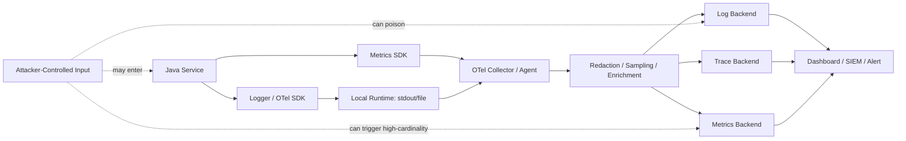
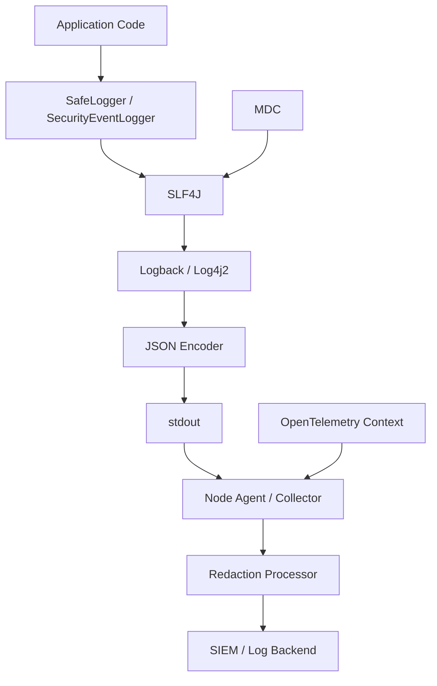
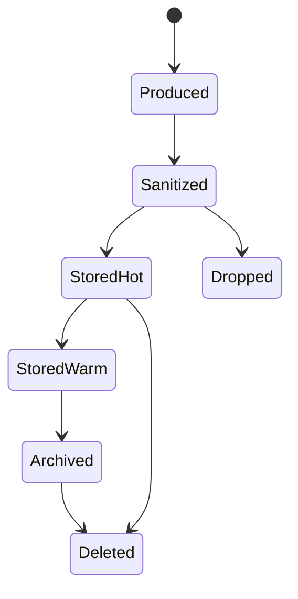
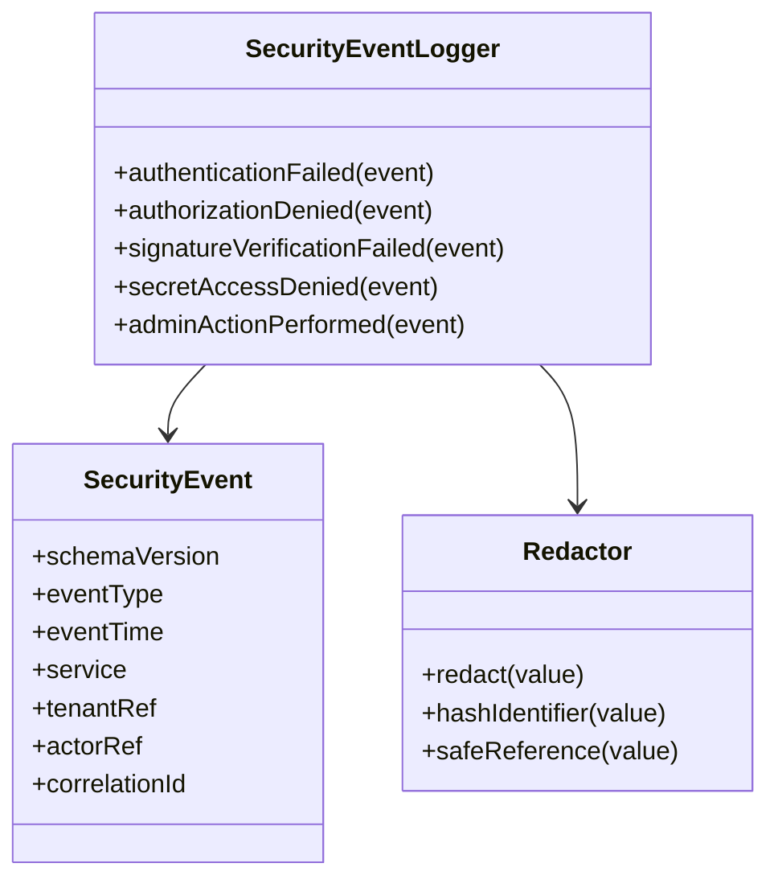
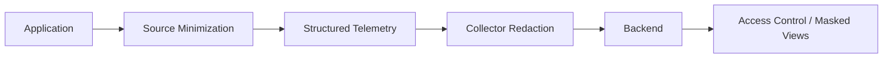

------
title: Learn Java Security, Cryptography and Integrity - Part 029
description: Secure observability untuk aplikasi Java: logging yang aman, telemetry hygiene, sensitive-data control, trace/log leakage prevention, security signals, dan operational controls.
series: learn-java-security-cryptography-integrity
seriesTitle: Learn Java Security, Cryptography and Integrity
order: 29
partTitle: Secure Observability, Logging & Sensitive Data Control
tags:
  - java
  - security
  - observability
  - logging
  - opentelemetry
  - sensitive-data
  - secure-engineering
date: 2026-06-30
---

# Part 029 — Secure Observability, Logging & Sensitive Data Control

> Target part ini: kamu mampu mendesain observability untuk sistem Java yang **berguna untuk debugging, operasi, deteksi keamanan, dan forensic readiness**, tanpa mengubah observability pipeline menjadi sumber kebocoran data, kebocoran secret, atau jalur manipulasi bukti.

Part sebelumnya sudah membahas tamper-evident audit trail sebagai evidence system. Part ini berbeda: kita membahas **production observability** — logs, metrics, traces, events, alerts, dashboards, dan telemetry pipeline — sebagai sistem operasional yang harus aman, minim data sensitif, dan tetap cukup informatif untuk incident response.

Security observability yang baik bukan berarti “log sebanyak mungkin”. Security observability yang baik berarti:

1. mencatat event yang benar,
2. dengan struktur yang konsisten,
3. tanpa membocorkan sensitive data,
4. tidak bisa mudah dimanipulasi attacker,
5. dapat dikorelasikan lintas service,
6. punya retention dan access control yang sesuai,
7. bisa menghasilkan signal yang actionable.

OWASP Logging Cheat Sheet menekankan bahwa log dapat mengandung personal/sensitive information dan harus dilindungi dari misuse seperti tampering, unauthorized access, modification, dan deletion. OpenTelemetry juga menekankan bahwa telemetry dapat tanpa sengaja menangkap sensitive/personal information dan perlu handling khusus.

---

## 1. Kaufman Deconstruction

Menurut pendekatan Josh Kaufman, skill yang kompleks harus dipecah menjadi sub-skill kecil yang bisa dipraktikkan dan diukur. Untuk secure observability, skill map-nya seperti ini:

```mermaid
graph TD
  A[Secure Observability] --> B[Event Selection]
  A --> C[Structured Logging]
  A --> D[Sensitive Data Control]
  A --> E[Telemetry Integrity]
  A --> F[Correlation & Traceability]
  A --> G[Alert Engineering]
  A --> H[Retention & Access Control]
  A --> I[Review & Testing]

  B --> B1[Security-Relevant Events]
  B --> B2[Operational Events]
  B --> B3[Audit Boundary Awareness]

  C --> C1[Schema]
  C --> C2[Field Semantics]
  C --> C3[Log Injection Defense]

  D --> D1[Classification]
  D --> D2[Redaction]
  D --> D3[Tokenization/Hashing]
  D --> D4[Trace/Metrics Hygiene]

  E --> E1[Tamper Resistance]
  E --> E2[Transport Security]
  E --> E3[Collector Hardening]

  F --> F1[Correlation ID]
  F --> F2[Trace Context]
  F --> F3[Actor/Tenant Binding]

  G --> G1[Detection Rules]
  G --> G2[Noise Control]
  G --> G3[Runbook Linkage]
```



### Minimum effective learning target

Setelah part ini, kamu harus bisa menjawab dengan jelas:

- Data apa yang **tidak boleh** masuk log, metric label, trace attribute, baggage, exception, atau dashboard?
- Event keamanan apa yang harus tercatat untuk auth, authz, data access, admin action, secret/key usage, dan integration failure?
- Bagaimana memastikan logging tetap aman saat input berasal dari attacker?
- Bagaimana membuat log/trace berguna untuk incident response tanpa melanggar privacy/minimization?
- Bagaimana menguji bahwa aplikasi tidak membocorkan token, password, credential, PII, secret, atau raw payload sensitif?

---

## 2. Mental Model: Observability Is a Data Product With Attack Surface

Observability sering diperlakukan sebagai “side effect” aplikasi. Itu salah. Dalam sistem production, observability adalah **data product** yang punya:

- producer: application, sidecar, agent, collector;
- transport: stdout, filebeat, OTLP, syslog, Kafka, HTTP exporter;
- processor: redactor, sampler, enricher, aggregator;
- storage: log backend, trace backend, SIEM, data lake;
- consumer: developer, SRE, security analyst, auditor;
- policy: retention, access, masking, export, deletion;
- failure mode: leakage, tampering, flooding, missing signal, false positives.



Security implication: attacker-controlled data can reach your observability plane. If you log user input, exception messages, headers, query strings, payloads, file names, or claims blindly, attacker can:

- leak secrets into logs;
- inject fake log lines;
- poison dashboards;
- create high-cardinality metrics that increase cost or degrade backend performance;
- hide malicious actions in noise;
- exfiltrate sensitive data through third-party telemetry providers;
- trigger retention violations.

---

## 3. Four Different Things: Logs, Metrics, Traces, Audit

Do not collapse these concepts.

| Surface | Primary Question | Typical Payload | Security Risk | Security Use |
|---|---|---|---|---|
| Logs | “What happened?” | structured events, errors, state transitions | sensitive-data leakage, injection, excessive detail | investigation, detection, debugging |
| Metrics | “How much/how often/how slow?” | counters, gauges, histograms, labels | high-cardinality leakage, tenant/user leakage | anomaly detection, SLO, abuse detection |
| Traces | “Where did request time go?” | spans, attributes, propagation context | header/payload leakage, cross-tenant correlation leak | distributed investigation |
| Audit Trail | “Who did what, under what authority, to what object?” | evidence-grade security event | missing proof, tampering, ambiguous actor | accountability, regulatory evidence |

Audit trail was covered in Part 023. This part may mention audit, but only to clarify boundary.

### Practical rule

- **Logs** can be verbose but must be sanitized.
- **Metrics** must avoid sensitive/high-cardinality labels.
- **Traces** must avoid payload/secret attributes and baggage leaks.
- **Audit** must be complete, immutable enough, and semantically precise.

---

## 4. Security Invariants for Observability

Use these as non-negotiable rules.

### Invariant 1 — Sensitive data minimization

Telemetry must not include raw secrets, credentials, session tokens, refresh tokens, private keys, OTPs, password reset tokens, full payment data, or unnecessary personal data.

### Invariant 2 — Structured events only for important security signals

Security-relevant logs should be structured. Free-text logs are hard to detect, correlate, parse, and verify.

### Invariant 3 — Input data is hostile even inside logs

Log output is an interpreter boundary. Newlines, tabs, terminal escape sequences, JSON-breaking characters, and unbounded strings must be controlled.

### Invariant 4 — Correlation IDs are not identity

A correlation ID identifies a flow, not a user. Actor, tenant, client, subject, and authority must be explicitly represented where needed.

### Invariant 5 — Observability must degrade safely

If telemetry backend fails, the business request should usually continue unless the event is evidence-critical. But the system must expose telemetry failure as an operational alert.

### Invariant 6 — Security signals need owner and runbook

An alert without owner and response procedure is noise.

### Invariant 7 — Log access is production data access

Anyone who can read logs may read sensitive operational data. Log access must be least-privilege, monitored, and time-bound.

---

## 5. Sensitive Data Taxonomy

A serious team defines a telemetry data classification table. Example:

| Class | Examples | Allowed in Logs? | Allowed in Traces? | Allowed as Metrics Label? | Handling |
|---|---|---:|---:|---:|---|
| Secret | password, API key, private key, refresh token, session cookie | No | No | No | never collect; redact at source and collector |
| Authentication material | OTP, magic link, reset token, authorization code | No | No | No | never collect; store hash only if operationally required |
| Sensitive identity | NIK, SSN, passport, full DOB | Usually no | No | No | tokenize/hash with strict need |
| Personal data | email, phone, address, name | limited | limited | usually no | minimize; consider keyed hash or internal ID |
| Financial data | PAN, bank account, card token | usually no | no | no | comply with domain rules; mask/tokenize |
| Authorization context | roles, scopes, tenant ID, policy decision | yes, selected | yes, selected | tenant maybe with caution | structured, avoid excessive detail |
| Technical identifiers | request ID, trace ID, object ID | yes | yes | maybe | ensure not guessable secret |
| Security outcome | login failed, access denied, risk score band | yes | yes | yes | structured signal |

### The hidden trap: “It is just metadata”

Metadata can be sensitive. Examples:

- tenant ID can expose customer relationship;
- object ID can expose business volume;
- endpoint name can expose internal capability;
- trace topology can expose architecture;
- error class can reveal implementation;
- metric label with user ID can leak personal data and explode cardinality.

---

## 6. Redaction, Masking, Tokenization, Hashing

These terms are often confused.

| Technique | What It Does | Reversible? | Good For | Bad For |
|---|---|---:|---|---|
| Redaction | removes value | no | secrets, tokens, passwords | analysis needing grouping |
| Masking | shows partial value | partly | display/debug with limited reveal | secrets; attackers can combine partials |
| Tokenization | replaces with mapped token | yes through vault/system | regulated identifiers | complex lifecycle, access control |
| Hashing | deterministic digest | no, but brute-force possible | grouping non-secret high-entropy values | low-entropy PII like email unless keyed |
| HMAC/keyed hash | deterministic keyed digest | no without key | grouping sensitive identifiers | key management required |

### Practical guidance

- Passwords, access tokens, refresh tokens, private keys: **redact**.
- Email/phone for correlation: prefer **keyed hash** or internal subject ID.
- Payment/regulated identifiers: use **tokenization** through approved boundary.
- Request body: do not log by default; log schema/size/content type/result.
- Headers: allowlist, never dump all headers.

---

## 7. Java Logging Architecture

A typical Java application uses a facade plus implementation:

- facade: SLF4J;
- implementation: Logback or Log4j2;
- structured encoder: JSON encoder;
- context propagation: MDC/thread context;
- export path: stdout, file, OTLP, collector, sidecar;
- runtime environment: container, Kubernetes, cloud logging agent.



### Rule: application code should not assemble ad-hoc security strings

Bad:

```java
log.info("Login failed for user=" + email + " password=" + password);
```

Better:

```java
securityEvents.authenticationFailed(
    new AuthenticationFailureEvent(
        safeSubjectRef(subjectRef),
        clientRef,
        FailureReason.BAD_CREDENTIALS,
        requestContext
    )
);
```

The application should expose security semantics, not random strings.

---

## 8. Structured Security Event Schema

Define a minimal schema and version it.

```json
{
  "schema_version": "security-event.v1",
  "event_type": "authorization.denied",
  "event_time": "2026-06-30T10:15:30.123Z",
  "service": "case-api",
  "environment": "prod",
  "trace_id": "4bf92f3577b34da6a3ce929d0e0e4736",
  "correlation_id": "req-01J...",
  "tenant_ref": "tenant_9f3a",
  "actor_ref": "subject_7c12",
  "client_ref": "oauth-client-risk-engine",
  "source_ip_class": "public",
  "action": "case.read",
  "object_type": "case",
  "object_ref": "case_8842",
  "decision": "deny",
  "reason_code": "missing_scope",
  "risk_level": "medium"
}
```

### Field principles

- Use stable machine-readable `event_type`.
- Use references, not raw personal identifiers.
- Use reason codes, not full internal policy dumps.
- Use `schema_version` for compatibility.
- Include service/environment to support multi-service investigation.
- Include trace/correlation IDs for navigation, not as security proof.
- Include action/object/decision for authorization events.

---

## 9. Security Event Taxonomy

Minimum event families for Java enterprise systems:

| Family | Event Examples | Notes |
|---|---|---|
| Authentication | login success/failure, MFA challenge, recovery started/completed, suspicious login | avoid passwords, OTP, reset token |
| Session | session created, renewed, revoked, logout, refresh token rotation | log token family ID, not token |
| Authorization | access denied, privilege escalation attempt, policy override, admin grant | include action/object/decision |
| Data access | sensitive object viewed/exported/deleted, bulk read, search over sensitive data | avoid raw data values |
| Administrative action | role change, config change, key policy change, feature flag for security control | high-value alert candidates |
| Secret/key usage | KMS decrypt, key rotation, signing operation, failed key lookup | do not log key material |
| Integration | webhook verification failed, invalid signature, replay detected, partner cert changed | include partner ref |
| Input boundary | validation failure, parser rejection, SSRF blocked, file upload rejected | avoid raw payload |
| Abuse signal | rate-limit triggered, credential stuffing pattern, enumeration attempt | aggregate carefully |
| Observability health | telemetry exporter failed, redaction rule error, collector dropped events | detect blind spots |

---

## 10. Java Example: Safe Security Event Logger

A basic design is to make unsafe logging harder.

```java
import org.slf4j.Logger;
import org.slf4j.LoggerFactory;

import java.time.Instant;
import java.util.Map;
import java.util.Objects;

public final class SecurityEventLogger {
    private static final Logger log = LoggerFactory.getLogger("SECURITY_EVENT");

    public void authorizationDenied(AuthzDenied event) {
        Objects.requireNonNull(event, "event");

        // Use structured logging support when available.
        // This compact example emits JSON manually only to show the shape.
        log.warn("{}", Json.safeObject(Map.of(
            "schema_version", "security-event.v1",
            "event_type", "authorization.denied",
            "event_time", Instant.now().toString(),
            "service", event.service(),
            "tenant_ref", Ref.safe(event.tenantRef()),
            "actor_ref", Ref.safe(event.actorRef()),
            "action", Ref.safe(event.action()),
            "object_type", Ref.safe(event.objectType()),
            "object_ref", Ref.safe(event.objectRef()),
            "decision", "deny",
            "reason_code", Ref.safe(event.reasonCode()),
            "correlation_id", Ref.safe(event.correlationId())
        )));
    }

    public record AuthzDenied(
        String service,
        String tenantRef,
        String actorRef,
        String action,
        String objectType,
        String objectRef,
        String reasonCode,
        String correlationId
    ) {}
}
```

Supporting utility:

```java
import com.fasterxml.jackson.core.JsonProcessingException;
import com.fasterxml.jackson.databind.ObjectMapper;

import java.util.Map;

final class Json {
    private static final ObjectMapper MAPPER = new ObjectMapper();

    static String safeObject(Map<String, ?> fields) {
        try {
            return MAPPER.writeValueAsString(fields);
        } catch (JsonProcessingException e) {
            return "{\"schema_version\":\"security-event.v1\",\"event_type\":\"logging.serialization_failed\"}";
        }
    }
}
```

And reference sanitizer:

```java
final class Ref {
    private static final int MAX_LENGTH = 128;

    static String safe(String value) {
        if (value == null || value.isBlank()) return "unknown";

        String normalized = value
            .replace('\r', '_')
            .replace('\n', '_')
            .replace('\t', '_');

        if (normalized.length() > MAX_LENGTH) {
            return normalized.substring(0, MAX_LENGTH) + "...";
        }
        return normalized;
    }
}
```

This is not a full production logger, but it demonstrates the invariant: security logs must be structured, bounded, and sanitized.

---

## 11. Log Injection and Log Forging

Log injection happens when attacker-controlled input changes how logs are interpreted.

Example attack input:

```text
alice@example.com\n{"event_type":"admin.role_granted","actor_ref":"attacker"}
```

Bad log:

```java
log.info("login failed user={}", username);
```

If the backend treats newline-delimited JSON as event boundary, an attacker can forge extra log entries.

### Defenses

- Use JSON encoder that escapes fields correctly.
- Do not manually concatenate JSON.
- Strip/control CRLF from reference-like fields.
- Bound field length.
- Use allowlisted fields for security events.
- Avoid logging raw payloads.
- Avoid terminal escape sequences in interactive logs.

---

## 12. Exception Logging Without Data Leakage

Exceptions often carry sensitive information through message strings.

Bad:

```java
try {
    paymentGateway.charge(request);
} catch (PaymentException e) {
    log.error("Charge failed for request {}", request, e);
}
```

Problems:

- request may include card token, billing address, user data;
- exception message may include provider response body;
- stack traces can expose internal packages and architecture;
- repeated failures can flood logs with sensitive data.

Better:

```java
try {
    paymentGateway.charge(request);
} catch (PaymentException e) {
    log.error("payment.charge_failed provider={} request_ref={} reason_code={}",
        Ref.safe(providerRef),
        Ref.safe(request.id()),
        Ref.safe(e.reasonCode()),
        e instanceof RetryablePaymentException ? e : null
    );
    throw e;
}
```

For high-risk boundaries, prefer mapping external exception into internal reason code before logging.

---

## 13. MDC, Correlation ID, and Context Leakage

Mapped Diagnostic Context is useful but dangerous if treated casually.

Common fields:

- `correlation_id`
- `trace_id`
- `tenant_ref`
- `actor_ref`
- `client_ref`
- `request_path_template`
- `deployment_unit`

Avoid:

- raw email,
- username if personal,
- session ID,
- access token,
- request body,
- `Authorization` header,
- raw query string,
- sensitive object content.

### Java pattern with try/finally

```java
import org.slf4j.MDC;

public final class LoggingContext implements AutoCloseable {
    private final String[] keys;

    private LoggingContext(String... keys) {
        this.keys = keys;
    }

    public static LoggingContext putRequestContext(RequestContext ctx) {
        MDC.put("correlation_id", Ref.safe(ctx.correlationId()));
        MDC.put("tenant_ref", Ref.safe(ctx.tenantRef()));
        MDC.put("actor_ref", Ref.safe(ctx.actorRef()));
        return new LoggingContext("correlation_id", "tenant_ref", "actor_ref");
    }

    @Override
    public void close() {
        for (String key : keys) {
            MDC.remove(key);
        }
    }
}
```

Usage:

```java
try (LoggingContext ignored = LoggingContext.putRequestContext(ctx)) {
    service.handle(command);
}
```

### Threading warning

MDC is thread-local in common implementations. In async code, thread pools, virtual threads, reactive pipelines, or executor handoff, context propagation must be explicit and tested. Otherwise, logs may be missing context or, worse, use stale context from a different request.

---

## 14. OpenTelemetry Hygiene

OpenTelemetry is powerful because it propagates context across services. That also means mistakes propagate across services.

### Trace attribute rules

Allowed examples:

```text
service.name=case-api
http.route=/cases/{caseId}
http.request.method=GET
app.tenant_ref=tenant_9f3a
app.case_ref=case_8842
security.decision=deny
security.reason_code=missing_scope
```

Avoid:

```text
http.request.header.authorization=Bearer eyJ...
http.request.body={...}
user.email=alice@example.com
password=...
reset_token=...
```

### Baggage is especially dangerous

Baggage propagates application-defined key/value pairs downstream. Do not put sensitive data in baggage. Treat baggage like an outbound header to every participating service.

### Collector as second line of defense

Application-side minimization is first line. Collector redaction is second line. Do not rely only on collector redaction because:

- bad telemetry may still exist locally;
- redaction config can drift;
- third-party agents may export before redaction;
- sampling may preserve sensitive spans;
- processors may not cover all fields.

---

## 15. Metrics Security

Metrics can leak sensitive data through labels.

Bad:

```text
login_failure_total{email="alice@example.com", reason="bad_password"} 1
case_read_total{tenant="big-bank", case_id="CASE-2026-000012"} 1
```

Better:

```text
login_failure_total{reason="bad_credentials", auth_surface="password"} 1
case_read_total{object_type="case", outcome="success"} 1
```

### Cardinality risk

High-cardinality labels can:

- explode storage cost;
- overload metrics backend;
- reveal user/customer/object population;
- become DoS vector if attacker controls label values.

### Metric label invariant

A metric label must be:

- low-cardinality;
- non-secret;
- non-personal unless explicitly approved;
- not attacker-controlled raw input;
- stable enough for dashboard/alert semantics.

---

## 16. Sensitive Data in HTTP Logging

HTTP request/response logging is one of the most common leakage sources.

### Dangerous by default

- full URL with query string;
- all headers;
- request body;
- response body;
- cookies;
- multipart file names/content;
- upstream/downstream error bodies;
- debug proxy logs.

### Safer approach

Log:

- method;
- route template, not raw path if path has identifiers;
- status code;
- duration bucket;
- request size;
- response size;
- client classification;
- correlation ID;
- selected safe reason code.

Example:

```java
log.info("http.request_completed method={} route={} status={} duration_ms={} correlation_id={}",
    request.method(),
    routeTemplate,
    response.status(),
    duration.toMillis(),
    Ref.safe(correlationId)
);
```

Avoid:

```java
log.info("request={} headers={} body={}", request.getRequestURI(), headers, body);
```

---

## 17. Security Alert Engineering

Logs are not enough. You need detection rules.

| Signal | Possible Detection | Common Noise Problem | Better Design |
|---|---|---|---|
| Login failures | threshold per subject/IP/client | NAT/shared IP noise | combine velocity, reputation, subject, ASN, device change |
| Access denied | repeated deny on sensitive object | normal user mistakes | alert on deny after policy probing pattern |
| Signature verification failed | invalid HMAC/JWT/webhook | client bugs | separate invalid format, invalid key id, bad signature, replay |
| Role change | admin privilege granted | legitimate admin ops | alert outside change window or without ticket ref |
| Secret access | unusual KMS decrypt volume | batch job | baseline per service/key/environment |
| Telemetry gap | no logs from service | deployments | correlate with health checks and exporter errors |

### Alert quality criteria

A good security alert has:

- clear condition;
- severity rationale;
- owner;
- runbook;
- suppression rule;
- expected false-positive causes;
- evidence fields;
- link to trace/log query;
- test event.

---

## 18. Access Control for Observability Backends

Log backend access is production data access.

Minimum controls:

- role-based access per environment;
- separation for production vs staging;
- field-level masking where supported;
- just-in-time elevated access;
- query audit logs;
- retention policy;
- export/download restrictions;
- break-glass procedure;
- monitoring for bulk export;
- legal/privacy deletion workflow if applicable.

### Anti-pattern

“Developers can access all production logs because they need debugging.”

Better:

- default: limited production log access;
- elevated access with ticket/timebox;
- sensitive fields redacted before storage;
- replayable sanitized traces for debugging;
- incident room with auditable access.

---

## 19. Retention and Data Lifecycle

Observability data has lifecycle:



Design questions:

- How long do we need hot searchable logs?
- Which security events need longer retention?
- Which fields must be removed before storage?
- Which fields require restricted access?
- Which backends replicate data to third parties?
- How do we delete or reprocess telemetry after a redaction bug?
- What happens when a secret was accidentally logged?

### Secret accidentally logged: response checklist

1. Identify scope: value, services, timeframe, backends.
2. Revoke/rotate secret immediately.
3. Stop further leakage at source.
4. Purge/redact backend if possible.
5. Invalidate caches/exports.
6. Review access logs for who viewed/exported it.
7. Add regression test/redaction rule.
8. Document incident and preventive control.

---

## 20. Secure Observability for Multi-Tenant Systems

Multi-tenant systems need special care.

### Risks

- tenant identifier leaks in shared dashboards;
- support engineer sees unrelated tenant data;
- trace spans cross tenant boundary;
- metrics labels reveal tenant volume;
- alert notifications include sensitive tenant data;
- screenshots of dashboards leak customer names.

### Controls

- use tenant reference, not customer legal name;
- avoid tenant as high-cardinality metrics label unless backend access is controlled;
- separate dashboards for internal vs customer-facing;
- row/field-level access if backend supports it;
- sanitize alert notification payloads;
- test tenant isolation in telemetry queries;
- restrict trace search by tenant where possible.

---

## 21. Pattern: Security Event Logger as Domain Boundary

Instead of scattering `log.warn(...)` everywhere, centralize security event construction.



Benefits:

- consistent schema;
- easier redaction testing;
- stable detection rules;
- code review surface is smaller;
- security can evolve event schema without hunting random log lines.

---

## 22. Pattern: Redaction at Source and Pipeline

Use two layers.



### Source minimization

- do not create sensitive telemetry in the first place;
- structured safe event APIs;
- safe exception mapping;
- no raw body/header dumps.

### Pipeline redaction

- denylist known secret patterns;
- allowlist approved attributes;
- redact before export to third-party backend;
- detect unknown sensitive fields;
- alert on redaction count spikes.

---

## 23. Testing Secure Observability

Testing should prove absence of obvious leaks and presence of required signals.

### Test 1 — No token in logs

```java
@Test
void loginFailureDoesNotLogPasswordOrToken() {
    var appender = new InMemoryAppender("SECURITY_EVENT");
    appender.start();

    authenticationService.login("alice@example.com", "P@ssw0rd!", "Bearer abc.def.ghi");

    String output = appender.joinedMessages();
    assertThat(output).doesNotContain("P@ssw0rd!");
    assertThat(output).doesNotContain("abc.def.ghi");
    assertThat(output).contains("authentication.failed");
}
```

### Test 2 — Log injection is neutralized

```java
@Test
void attackerControlledUsernameCannotForgeLogLine() {
    String username = "alice@example.com\n{\"event_type\":\"admin.role_granted\"}";

    securityEvents.authenticationFailed(username, "bad_credentials", requestContext);

    String output = testLogs.singleLine();
    assertThat(output).doesNotContain("\n{\"event_type\":\"admin.role_granted\"}");
    assertThat(output).contains("authentication.failed");
}
```

### Test 3 — Required security event exists

```java
@Test
void authorizationDeniedEmitsStructuredSecurityEvent() {
    assertThatThrownBy(() -> caseService.readCase(actorWithoutScope, caseId))
        .isInstanceOf(AccessDeniedException.class);

    assertThat(testSecurityEvents.events())
        .anySatisfy(event -> {
            assertThat(event.type()).isEqualTo("authorization.denied");
            assertThat(event.action()).isEqualTo("case.read");
            assertThat(event.objectType()).isEqualTo("case");
            assertThat(event.decision()).isEqualTo("deny");
        });
}
```

---

## 24. Common Anti-Patterns

### Anti-pattern 1 — Debug logging raw payloads

```java
log.debug("request body: {}", body);
```

Even debug logs can be enabled accidentally, collected in staging, or captured by support bundles.

### Anti-pattern 2 — Logging all headers

```java
log.info("headers={}", headers);
```

Headers may contain `Authorization`, cookies, API keys, internal routing data, or personal data.

### Anti-pattern 3 — Metrics by user ID

```text
request_total{user_id="123"}
```

This leaks identity and explodes cardinality.

### Anti-pattern 4 — Treating CORS/auth failures as “noise”

Repeated browser boundary failures may be probing, misconfiguration, or active attack. Log structured reason codes with rate controls.

### Anti-pattern 5 — Logging stack traces for expected security denials

Access denied is often expected. Do not flood logs with stack traces. Emit structured security event instead.

### Anti-pattern 6 — Putting secrets in OpenTelemetry baggage

Baggage propagates. Do not put tokens, email, tenant legal names, or sensitive state in it.

### Anti-pattern 7 — Relying only on backend redaction

By the time backend redaction runs, data may already exist in local stdout, sidecar buffers, collector queues, or exported copies.

---

## 25. Design Review Checklist

Use this checklist for PRs and architecture reviews.

### Event selection

- [ ] Are auth/authz/session/admin/security-boundary events captured?
- [ ] Are success and failure events differentiated?
- [ ] Are reason codes stable and non-sensitive?
- [ ] Are event schemas versioned?
- [ ] Are important security events alertable?

### Data minimization

- [ ] No passwords, OTPs, tokens, reset links, API keys, private keys.
- [ ] No raw request/response body by default.
- [ ] No full headers dump.
- [ ] No full query string for sensitive endpoints.
- [ ] PII has explicit justification and approved handling.

### Logging safety

- [ ] User input is escaped/sanitized/bounded.
- [ ] Logs are structured.
- [ ] No manual JSON concatenation.
- [ ] CRLF/log forging is tested.
- [ ] Exceptions are mapped before logging where needed.

### Telemetry pipeline

- [ ] Collector/exporter uses TLS where applicable.
- [ ] Redaction rules exist at pipeline boundary.
- [ ] Telemetry backend access is least-privilege.
- [ ] Retention is defined.
- [ ] Alert exists for telemetry export failure or ingestion gap.

### Metrics/traces

- [ ] Metric labels are low-cardinality and non-sensitive.
- [ ] Trace attributes do not include body/header/token/PII.
- [ ] Baggage does not include sensitive data.
- [ ] Tenant/user/object references are safe and intentional.

---

## 26. Lab: Secure Observability Hardening

### Scenario

You own a Java service `case-api` with endpoints:

- `POST /login`
- `GET /cases/{caseId}`
- `POST /cases/{caseId}/decision`
- `POST /webhooks/payment-provider`
- `POST /admin/roles`

### Task A — Define telemetry schema

Create structured events for:

- login success;
- login failure;
- MFA failure;
- authorization denied;
- admin role granted;
- webhook signature failed;
- case decision submitted;
- telemetry exporter failed.

For each field, classify:

- safe;
- sensitive;
- derived;
- forbidden.

### Task B — Build redaction tests

Write tests proving logs do not include:

- password;
- authorization header;
- cookie;
- reset token;
- raw webhook body;
- email unless intentionally hashed;
- private key material;
- full exception response from payment provider.

### Task C — Build alert candidates

Define alert rules for:

- repeated access denied on same object;
- signature verification failures above baseline;
- admin role changes outside change window;
- sudden drop to zero security events;
- redaction processor errors;
- high KMS decrypt failure rate.

### Task D — Write incident runbook

Write runbook for “secret accidentally logged”. Include detection, rotation, purge, access review, and regression test.

---

## 27. Production Readiness Rubric

| Level | Description |
|---|---|
| L1 | Basic logs exist, but raw payload/header leakage is possible. |
| L2 | Structured logs for major flows; some redaction; inconsistent schema. |
| L3 | Security event taxonomy, redaction tests, safe context propagation, backend access control. |
| L4 | Detection rules, telemetry health alerts, retention policy, field-level minimization, incident runbooks. |
| L5 | Observability treated as governed data product with schema lifecycle, automated leak tests, access audit, and continuous tuning. |

For a top-tier engineering environment, aim for L4 as default and L5 for regulated/high-risk domains.

---

## 28. What to Remember

Secure observability is not “more logs”. It is **controlled visibility**.

The right model:

```text
observe enough to operate and investigate,
collect little enough to avoid creating a new breach surface,
structure enough to automate detection,
protect enough to preserve trust.
```

Your logs, traces, metrics, dashboards, and alerts are part of the system’s security boundary. Treat them as production data, not debug leftovers.

---

## References

- OWASP Logging Cheat Sheet — https://cheatsheetseries.owasp.org/cheatsheets/Logging_Cheat_Sheet.html
- OWASP Logging Vocabulary Cheat Sheet — https://cheatsheetseries.owasp.org/cheatsheets/Logging_Vocabulary_Cheat_Sheet.html
- OWASP Top 10 2025 A09 Security Logging and Alerting Failures — https://owasp.org/Top10/2025/A09_2025-Security_Logging_and_Alerting_Failures/
- OpenTelemetry Security — https://opentelemetry.io/docs/security/
- OpenTelemetry Handling Sensitive Data — https://opentelemetry.io/docs/security/handling-sensitive-data/
- NIST SP 800-92 Guide to Computer Security Log Management — https://csrc.nist.gov/publications/detail/sp/800-92/final
- CWE-117 Improper Output Neutralization for Logs — https://cwe.mitre.org/data/definitions/117.html
- CWE-532 Insertion of Sensitive Information into Log File — https://cwe.mitre.org/data/definitions/532.html
