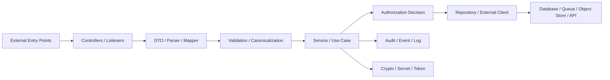
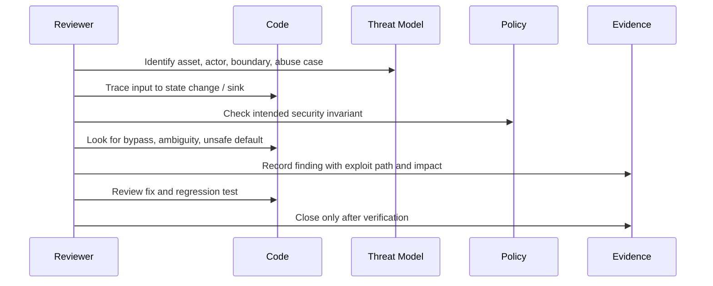
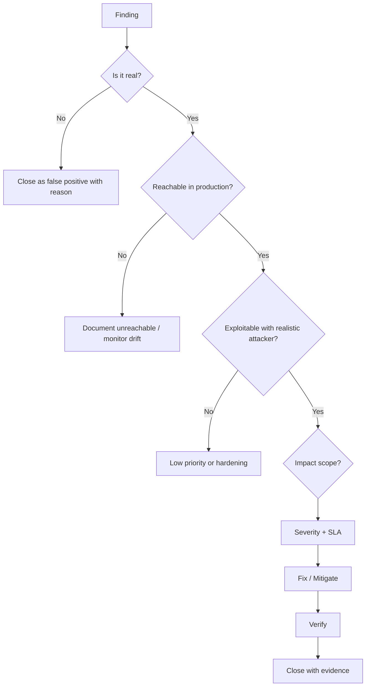
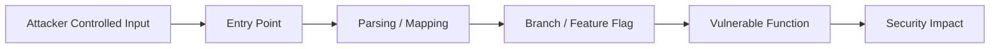
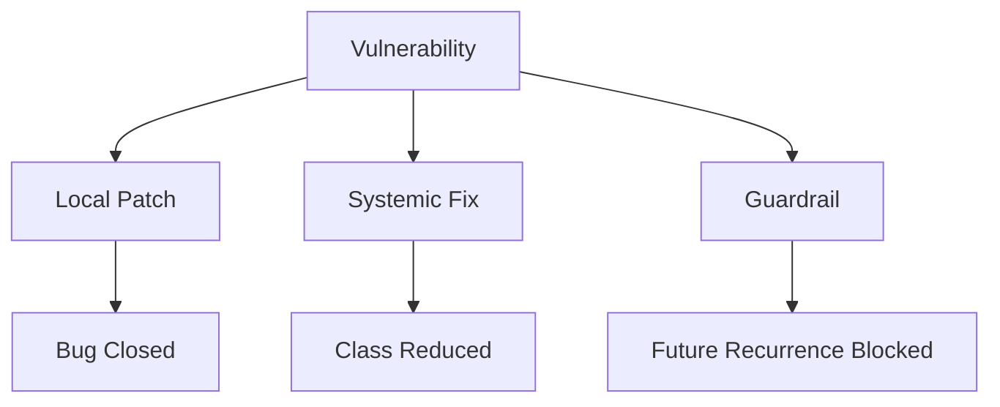
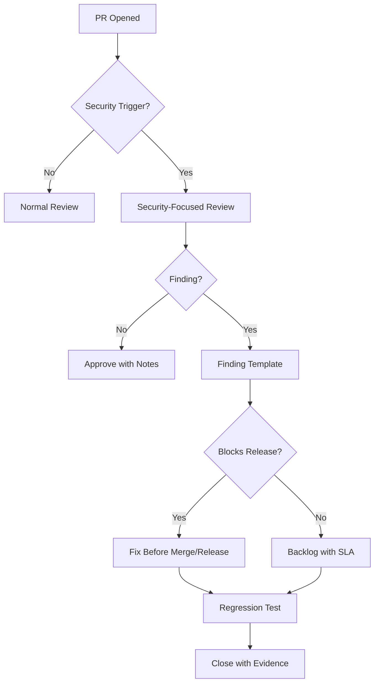
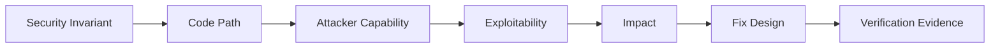

------
title: Learn Java Security, Cryptography and Integrity - Part 031
description: Secure code review dan vulnerability triage untuk sistem Java: review heuristics, exploitability reasoning, CVSS/EPSS/KEV, reachability, false positive handling, fix verification, dan review workflow.
series: learn-java-security-cryptography-integrity
seriesTitle: Learn Java Security, Cryptography and Integrity
order: 31
partTitle: Secure Code Review & Vulnerability Triage
tags:
  - java
  - security
  - secure-code-review
  - vulnerability-triage
  - appsec
  - cvss
  - epss
  - secure-engineering
date: 2026-06-30
---

# Part 031 — Secure Code Review & Vulnerability Triage

> Target part ini: kamu mampu melakukan secure code review dan vulnerability triage seperti engineer senior: tidak hanya mencari pattern berbahaya, tetapi memahami **exploitability**, **reachability**, **blast radius**, **business impact**, **fix quality**, dan **release decision**.

Security review yang baik bukan checklist kosmetik. Ia adalah proses engineering untuk menjawab lima pertanyaan:

1. **Apa security property yang seharusnya dijaga?**
2. **Di mana property itu bisa dilanggar oleh attacker, insider, sistem lain, atau bug operasional?**
3. **Apakah bug tersebut reachable di deployment nyata?**
4. **Apa dampaknya terhadap asset dan proses bisnis?**
5. **Apakah fix benar-benar menghilangkan class of bug, atau hanya menutup gejala?**

OWASP Code Review Guide menempatkan manual code review sebagai aktivitas penting dalam SDLC karena scanner otomatis tidak cukup untuk business logic, context-specific vulnerabilities, dan security implementation nuance. Secure Code Review Cheat Sheet juga menekankan bahwa review manual melengkapi SAST/DAST dengan analisis human-context seperti logic, flow, authentication, authorization, dan cryptographic implementation.

---

## 1. Kaufman Deconstruction

Kita pecah skill ini menjadi beberapa sub-skill yang bisa dilatih secara sengaja.

```mermaid
graph TD
  A[Secure Code Review & Vulnerability Triage] --> B[Security Reading]
  A --> C[Threat-to-Code Mapping]
  A --> D[Exploitability Reasoning]
  A --> E[Impact & Blast Radius]
  A --> F[Prioritization]
  A --> G[Fix Design]
  A --> H[Fix Verification]
  A --> I[Review Operating Model]

  B --> B1[Entry Points]
  B --> B2[Trust Boundaries]
  B --> B3[Dangerous Sinks]
  B --> B4[Security Invariants]

  C --> C1[Abuse Case]
  C --> C2[Attacker Capability]
  C --> C3[Dataflow]
  C --> C4[Control Flow]

  D --> D1[Reachability]
  D --> D2[Preconditions]
  D --> D3[Exploit Chain]
  D --> D4[Mitigations]

  E --> E1[Asset]
  E --> E2[Tenant Scope]
  E --> E3[Privilege Scope]
  E --> E4[Evidence & Compliance]

  F --> F1[CVSS]
  F --> F2[EPSS]
  F --> F3[KEV]
  F --> F4[Internal Context]

  G --> G1[Local Patch]
  G --> G2[Systemic Fix]
  G --> G3[Guardrail]
  G --> G4[Test]
```



### Minimum effective learning target

Setelah menyelesaikan part ini, kamu harus bisa:

- membaca pull request Java dengan lensa security property, bukan hanya style dan correctness;
- mengidentifikasi entry point, trust boundary, sanitizer, sink, dan authorization decision;
- membedakan vulnerability, weakness, exploitability, dan business risk;
- menilai temuan SAST/SCA menggunakan reachability dan runtime context;
- menulis bug report yang actionable, bukan alarmist;
- merancang fix yang menghilangkan root cause;
- memverifikasi fix dengan negative test dan regression test;
- membuat vulnerability triage policy yang adil untuk engineering team.

---

## 2. Mental Model: Review Is Property Verification

Functional review bertanya: “apakah kode melakukan yang diminta?”

Secure review bertanya: “apakah kode **tidak bisa disalahgunakan** untuk melanggar invariant?”

Contoh invariant:

- user hanya boleh membaca case milik tenant yang authorized;
- webhook hanya diterima jika signature valid dan belum replay;
- token akses tidak boleh diterima dari issuer yang salah;
- audit event tidak boleh bisa diubah setelah commit;
- file upload tidak boleh diproses sebagai executable/script;
- plaintext secret tidak boleh keluar ke log, trace, exception, heap dump, atau response;
- encryption tidak boleh memakai IV/nonce yang reuse dengan key yang sama;
- external URL tidak boleh bisa mengakses metadata service internal;
- deserializer tidak boleh menerima arbitrary object graph dari input publik.

Secure code review bukan pencarian kata `eval`, `Cipher`, atau `ObjectInputStream` saja. Review harus menguji apakah invariant masih benar ketika input, actor, sequence, deployment, dependency, dan failure mode berubah.

---

## 3. Vocabulary yang Harus Presisi

| Istilah | Makna | Contoh |
|---|---|---|
| Weakness | Pola desain/implementasi yang rawan | Missing authorization check, weak random, unsafe parser config |
| Vulnerability | Weakness yang bisa dieksploitasi dalam konteks nyata | Endpoint produksi bisa baca object tenant lain |
| Exploitability | Kemungkinan dan kemudahan bug dieksploitasi | Perlu auth? perlu race? perlu internal network? |
| Reachability | Apakah vulnerable code path bisa dicapai dari deployment nyata | Library vulnerable ada, tapi method tidak pernah dipanggil |
| Impact | Kerugian jika berhasil dieksploitasi | Data exposure, fraud, privilege escalation, evidence tampering |
| Blast radius | Cakupan dampak | Satu object, satu user, satu tenant, semua tenant |
| Compensating control | Kontrol lain yang menurunkan risiko | WAF, egress policy, mTLS, read-only token, network segmentation |
| Residual risk | Risiko setelah fix/mitigation | Masih ada manual process yang bisa bypass |

Kesalahan umum engineer adalah mencampur semua istilah ini menjadi “critical”. Itu buruk untuk AppSec dan buruk untuk delivery. Severity harus menjelaskan **mengapa ini penting**, bukan hanya bagaimana ini terlihat.

---

## 4. Review Map untuk Aplikasi Java

Saat membuka codebase Java, jangan mulai dari file acak. Buat peta.



### Entry point yang harus dicari

- HTTP controller: Spring MVC/WebFlux, JAX-RS, servlet filter.
- Message listener: Kafka, RabbitMQ, JMS, SQS, pub/sub.
- Scheduler/job: Quartz, Spring Scheduler, Batch.
- Webhook receiver.
- File upload/import pipeline.
- Admin endpoint.
- Actuator/management endpoint.
- CLI/internal maintenance tool.
- gRPC endpoint.
- Deserialization/parser boundary.
- Template rendering boundary.
- External callback/redirect handler.

### Dangerous sink yang harus dicari

- database query builder;
- command execution;
- file path construction;
- URL fetcher / HTTP client;
- XML parser;
- object deserialization;
- template engine;
- expression language;
- crypto primitive;
- token parser;
- redirect URL;
- log/audit writer;
- dynamic class loading/reflection;
- privileged cloud API call;
- policy decision cache.

Review yang matang menghubungkan entry point ke sink melalui dataflow dan authorization decision.

---

## 5. Secure Review Loop

Gunakan loop ini untuk review PR atau baseline review.



### Review prompt yang efektif

Untuk setiap perubahan, tanyakan:

1. Apa input baru yang diterima sistem?
2. Siapa actor yang bisa mengontrol input tersebut?
3. Apakah input melewati trust boundary?
4. Apakah input diubah menjadi authority, path, query, command, class, template, redirect, policy, atau crypto parameter?
5. Apakah ada authorization decision yang memakai object yang benar?
6. Apakah tenant/user ownership diverifikasi dekat dengan state access?
7. Apakah error path membuka data, token, stack trace, atau internal topology?
8. Apakah log/trace membawa PII/secret?
9. Apakah retry, replay, concurrency, atau async processing bisa mengubah security result?
10. Apakah test negatif membuktikan bypass tidak bisa terjadi?

---

## 6. Java-Specific Review Heuristics

### 6.1 Controller bukan authorization boundary yang cukup

Banyak bug authorization muncul karena controller punya check, tetapi service bisa dipanggil dari path lain.

```java
@GetMapping("/cases/{id}")
public CaseDto getCase(@PathVariable UUID id, Principal principal) {
    // Weak: controller checks may be forgotten by another caller.
    if (!tenantGuard.canAccessCase(principal, id)) {
        throw new AccessDeniedException("denied");
    }
    return mapper.toDto(caseService.getCase(id));
}
```

Lebih kuat: service/use-case menerima subject dan object reference, lalu enforce invariant di tempat state access.

```java
public CaseView getCase(SecuritySubject subject, CaseId caseId) {
    CaseRecord record = caseRepository.findById(caseId)
        .orElseThrow(NotFoundException::new);

    authorization.require(subject, "case:read", record.resourceRef());

    audit.record(SecurityEvent.caseViewed(subject.id(), record.id(), record.tenantId()));
    return CaseView.from(record);
}
```

Review question:

- Apakah service bisa dipanggil dari listener, job, CLI, atau endpoint lain?
- Apakah repository query sudah tenant-scoped?
- Apakah object reference yang dicek sama dengan object yang dikembalikan?

---

### 6.2 `Optional` dan null-handling bisa menyembunyikan authorization bypass

Anti-pattern:

```java
public CaseRecord loadVisibleCase(User user, UUID id) {
    return repo.findById(id)
        .filter(c -> c.tenantId().equals(user.tenantId()))
        .orElse(null);
}
```

Masalah:

- caller bisa memperlakukan `null` sebagai “buat baru” atau fallback;
- alasan denial hilang;
- audit denial tidak tercatat;
- sulit membedakan not found vs forbidden.

Lebih baik:

```java
public CaseRecord loadAuthorizedCase(SecuritySubject subject, CaseId id, Action action) {
    CaseRecord record = repo.findById(id).orElseThrow(NotFoundException::new);
    authorization.require(subject, action.value(), record.resourceRef());
    return record;
}
```

Invariant: authorization failure harus eksplisit, terukur, dan tidak berubah menjadi default success path.

---

### 6.3 Object mapper tidak boleh dipercaya sebagai security validator

Jackson/MapStruct/Bean Validation bisa membantu struktur data, tetapi tidak otomatis memastikan business authorization.

Anti-pattern:

```java
public record UpdateCaseRequest(
    UUID caseId,
    UUID assignedOfficerId,
    String status
) {}
```

Jika caller boleh mengirim `assignedOfficerId`, reviewer harus bertanya:

- Apakah user boleh assign officer?
- Apakah officer berada di tenant/region yang sama?
- Apakah state transition mengizinkan assignment?
- Apakah actor punya authority untuk target status?
- Apakah ID target diverifikasi dari database, bukan hanya format UUID?

Validation annotation seperti `@NotNull` hanya validasi bentuk. Security invariant harus berada di use-case/policy layer.

---

### 6.4 SAST finding pada crypto harus dibaca sebagai “misuse risk”

Contoh temuan:

```java
Cipher cipher = Cipher.getInstance("AES/CBC/PKCS5Padding");
```

Jangan langsung berhenti di “CBC insecure”. Review lengkap:

- Apakah ada authentication tag/HMAC?
- Apakah IV random dan unik?
- Apakah MAC diverifikasi sebelum decrypt?
- Apakah error padding bocor sebagai oracle?
- Apakah ciphertext punya metadata version/key ID?
- Apakah ada migration path ke AEAD?
- Apakah data lama harus tetap bisa dibuka?

Triage yang baik menghasilkan fix plan, bukan hanya komentar “gunakan GCM”.

---

### 6.5 `String` untuk secret sering menjadi data exposure smell

```java
String apiKey = request.getHeader("X-Api-Key");
log.info("calling partner with apiKey={}", apiKey);
```

Review smell:

- secret bisa masuk log;
- secret immutable dan sulit dihapus dari memory;
- secret mungkin muncul di exception, trace, heap dump;
- header propagation bisa membawa secret ke service lain.

Fix tidak selalu “pakai char[]” secara buta. Pada banyak Java framework, secret sudah menjadi `String` di boundary. Yang lebih penting:

- jangan log secret;
- mask/redact di structured logging;
- batasi lifetime;
- jangan propagasi tanpa tujuan;
- simpan credential di vault/KMS;
- gunakan token dengan scope dan expiry;
- lakukan rotation.

---

## 7. Review by Security Domain

### 7.1 Authentication review

Cari:

- custom password hashing;
- password reset token tanpa expiry/replay protection;
- MFA bypass pada account recovery;
- login response membocorkan user enumeration;
- session dibuat sebelum auth final;
- remember-me token stateless tanpa revocation;
- OAuth/OIDC token diterima tanpa issuer/audience validation;
- refresh token tidak rotate;
- account lockout menyebabkan DoS;
- device trust tanpa revalidation.

Review invariant:

> Setiap authenticated session harus berasal dari authenticator yang valid, binding ke subject yang benar, punya lifetime terbatas, dan bisa direvokasi sesuai risk event.

### 7.2 Authorization review

Cari:

- endpoint checks tetapi service tidak enforce;
- IDOR/BOLA;
- tenant filter opsional;
- admin role yang terlalu global;
- policy cache tanpa invalidation;
- `createdBy` dianggap sama dengan owner;
- background job memakai superuser tanpa scoping;
- partial update mengubah field sensitif;
- state transition tanpa guard.

Review invariant:

> Setiap state read/write harus punya subject, action, object, context, dan decision yang bisa diaudit.

### 7.3 Cryptography review

Cari:

- custom crypto;
- algorithm string tanpa mode/padding jelas;
- ECB/CBC tanpa integrity;
- IV/nonce reuse;
- static key di source;
- key ID hilang;
- signature atas data non-canonical;
- verify hasil signature tetapi tidak mengikat signer ke business authority;
- password hashing memakai fast hash;
- token dibuat dari `Random` atau timestamp.

Review invariant:

> Crypto primitive harus menjaga property yang benar, memakai parameter aman, punya key lifecycle, dan punya versioned metadata untuk migration.

### 7.4 Parser/deserialization review

Cari:

- `ObjectInputStream` pada input tidak dipercaya;
- polymorphic Jackson default typing;
- XML parser tanpa secure processing;
- template input user;
- YAML dengan object construction;
- expression language dari konfigurasi user;
- zip extraction tanpa path normalization;
- parser error yang bocor detail internal.

Review invariant:

> Data dari untrusted boundary harus diperlakukan sebagai data, bukan instruksi, class, expression, path, URL, atau object graph.

### 7.5 Distributed integrity review

Cari:

- idempotency key tidak scoped per actor/action;
- webhook signature diverifikasi setelah body diparsing ulang;
- retry membuat double effect;
- event consumer tidak dedupe;
- outbox event bisa berbeda dari DB commit;
- status transition tidak atomic;
- audit log ditulis sebelum transaction commit tanpa correlation;
- clock dari client dipercaya.

Review invariant:

> Duplicate, replay, retry, reordering, dan partial failure tidak boleh menghasilkan unauthorized atau inconsistent state.

---

## 8. Vulnerability Triage: Dari Finding ke Decision

Triage bukan debating game. Triage adalah routing decision:

- fix immediately;
- fix before release;
- fix in normal backlog;
- mitigate temporarily;
- accept risk with owner and expiry;
- close as not exploitable with evidence;
- escalate incident/security review.



### Triage inputs

| Input | Menjawab | Contoh |
|---|---|---|
| CVSS | Technical severity | Remote unauthenticated RCE vs local low-impact issue |
| EPSS | Likelihood exploited in wild within 30 days | CVE with high probability should be prioritized |
| CISA KEV | Evidence of known exploitation | Patch deadline elevated |
| Asset criticality | Business importance | Case management, payment, identity, evidence store |
| Exposure | Internet/internal/batch-only | Public endpoint vs internal admin job |
| Reachability | Code path used? | Vulnerable dependency method reachable? |
| Privilege required | Attacker precondition | Anonymous, authenticated, admin, insider |
| Data class | Sensitivity | PII, secrets, credentials, evidence, financial data |
| Compensating controls | Risk reduction | mTLS, egress deny, WAF, network segmentation |
| Fix complexity | Delivery trade-off | Config change vs protocol migration |

CVSS alone is insufficient because CVSS captures technical characteristics, not your actual deployment, tenant exposure, exploit telemetry, compensating controls, or business impact. CVSS v4.0 explicitly separates Base, Threat, Environmental, dan Supplemental metrics; consumers are expected to enrich severity with threat and environmental context.

---

## 9. CVSS, EPSS, KEV, and Internal Context

### 9.1 CVSS

CVSS is useful for normalized severity communication. Use it to understand technical characteristics, but never treat it as the only prioritization signal.

Good usage:

- “CVSS base is high because exploit is network reachable and affects confidentiality.”
- “Environmental score is lower because vulnerable service is not exposed and feature is disabled.”
- “Environmental score is higher because service stores regulated evidence records.”

Bad usage:

- “CVSS says 9.8, therefore everything else stops.”
- “CVSS says 5.3, therefore ignore.”
- “Scanner severity equals business risk.”

### 9.2 EPSS

EPSS estimates probability of exploitation in the wild in the next 30 days. It is useful for prioritizing known CVEs, especially when backlog is large.

Use EPSS for:

- patch sequencing;
- vulnerability backlog burn-down;
- alert prioritization;
- risk dashboard.

Do not use EPSS for:

- custom application logic bug with no CVE;
- deciding that low-EPSS vulnerability is safe forever;
- replacing threat modeling.

### 9.3 CISA KEV

If a CVE appears in KEV, treat it as externally validated exploitation evidence. KEV should typically override normal backlog prioritization for exposed or reachable assets.

### 9.4 Internal context

Internal context is often the missing piece:

- Is the component internet-facing?
- Is it used by a privileged workflow?
- Is tenant isolation involved?
- Is data regulated?
- Is a workaround available?
- Can we disable the feature?
- Is the vulnerable package shaded/transitive but unused?
- Does exploit require a configuration we do not enable?
- Is there an egress/network policy that blocks exploit completion?

The top 1% engineer does not worship external scores. They combine external signals with deployment reality and produce a defensible decision.

---

## 10. Reachability Analysis

Reachability asks whether vulnerable code can be reached by attacker-controlled input in a real deployment.



### Reachability dimensions

| Dimension | Question |
|---|---|
| Input reachability | Can attacker control data entering the vulnerable path? |
| Control-flow reachability | Is the vulnerable function called under realistic conditions? |
| Configuration reachability | Is the vulnerable feature enabled? |
| Dependency reachability | Is vulnerable dependency present and loaded? |
| Environment reachability | Is required OS/JVM/cloud condition present? |
| Privilege reachability | Does attacker have needed role/session/network? |
| Impact reachability | Can the code path actually affect protected asset? |

### Example: vulnerable XML library

Finding: SCA reports XXE CVE in XML parser.

Triage questions:

- Does the application parse XML at all?
- Which endpoint accepts XML?
- Is XML from untrusted user, partner, or internal batch?
- Does parser configuration disable external entities?
- Is outbound network/file access restricted?
- Is the parser in vulnerable version loaded at runtime?
- Is vulnerable feature invoked by our code path?
- Is there test proving external entity is rejected?

Outcome can be:

- critical: public XML endpoint, vulnerable parser, network egress open;
- medium: internal partner endpoint, mTLS, parser hardened;
- low/unreachable: package present, XML feature unused, parser never instantiated;
- false positive: dependency tree has old version in test scope only.

Document the reasoning. Do not close as “false positive” without evidence.

---

## 11. Writing Actionable Findings

Bad finding:

> SQL injection found. Fix immediately.

Better finding:

> `CaseSearchRepository.search()` builds an SQL fragment using `sortBy` from HTTP query parameter without allowlisting column names. An authenticated tenant user can inject arbitrary `ORDER BY` expression. I verified the path through `GET /cases?sortBy=...`. Impact appears limited to read query manipulation, but because the repository joins cross-tenant tables before tenant filtering, this may expose case metadata across tenants. Recommended fix: replace free-form sort with enum allowlist and apply tenant predicate before dynamic ordering. Add regression tests for malicious sort values and cross-tenant result isolation.

A good finding contains:

- vulnerable location;
- affected entry point;
- attacker capability;
- exploit path;
- impact;
- evidence;
- recommended fix;
- test expectation;
- severity rationale;
- owner and due date.

### Finding template

```mdx
## Finding: <short title>

Severity: <Critical/High/Medium/Low>
Confidence: <High/Medium/Low>
Status: <Open/Mitigated/Fixed/Accepted>
Affected component: <service/module/path>
Entry point: <endpoint/listener/job>
Asset: <data/process/system>
Actor: <anonymous/authenticated/partner/admin/internal>

### Summary
<one paragraph>

### Exploit path
1. <step>
2. <step>
3. <impact>

### Evidence
- Code: `<class/method>`
- Test/log/request: `<reference>`
- Runtime/deployment context: `<reference>`

### Impact
<confidentiality/integrity/availability/accountability impact + blast radius>

### Recommended fix
<specific engineering change>

### Verification
<negative tests, integration tests, config checks, scanning evidence>

### Residual risk
<remaining risk or assumptions>
```

---

## 12. False Positives and False Negatives

### False positive handling

False positive does not mean “tool is bad”. It means the flagged condition does not violate a security property in the actual context.

Good close reason:

> Closed as not exploitable because the vulnerable dependency is present only in test scope and is not packaged in the production artifact. Verified with `mvn dependency:tree`, container layer inspection, and runtime classpath dump.

Bad close reason:

> Not an issue, internal only.

“Internal only” is not a security argument by itself. Internal systems still have insiders, compromised credentials, SSRF, lateral movement, CI/CD abuse, and partner integration risk.

### False negative handling

Scanner may miss:

- business logic authorization bypass;
- state machine violation;
- race condition;
- tenant leakage through report export;
- unsafe object ownership assumption;
- replay from idempotency bug;
- cryptographic misuse that still compiles;
- insecure recovery flow;
- policy drift between services.

That is why Part 030 and Part 031 must be paired: tools find known patterns; review finds broken intent.

---

## 13. Fix Design: Patch, Refactor, Guardrail

A mature fix considers three levels.

### Level 1 — Local patch

Fix the immediate bug.

Example: add missing authorization check in endpoint.

Fast, but may not prevent recurrence.

### Level 2 — Systemic fix

Move invariant enforcement to the correct layer.

Example: authorization in use-case service, repository tenant scoping, policy engine shared across entry points.

Better, but may require refactoring.

### Level 3 — Guardrail

Make recurrence harder.

Examples:

- ArchUnit rule: controllers must not call repositories directly;
- integration test template for every endpoint;
- security linter rule for dangerous crypto strings;
- centralized URL fetcher for SSRF defense;
- typed `TenantScopedId` instead of raw UUID;
- wrapper for request signing verification;
- dependency verification and SBOM gate;
- centralized audit writer with tamper-evident chain.



The best fix is not always the biggest. Use risk, blast radius, and release pressure. But when the same issue repeats, local patching is no longer engineering; it is whack-a-mole.

---

## 14. Verification: Close Only with Evidence

Do not close security findings because “developer says fixed”. Close with evidence.

### Verification types

| Finding type | Verification evidence |
|---|---|
| Missing authorization | Negative integration test for unauthorized subject/object/action |
| Injection | Malicious payload test + safe query/binding inspection |
| SSRF | Blocked internal IP/DNS rebinding test + egress policy check |
| Deserialization | Test rejects unexpected class/object graph |
| Crypto misuse | Test vectors, metadata validation, nonce uniqueness test |
| Token validation | Invalid issuer/audience/algorithm/key tests |
| Secret exposure | Log/trace scan test and redaction assertion |
| Dependency CVE | Upgraded version + reachability/context evidence |
| TLS config | Protocol/cipher/cert validation test |
| Audit integrity | Tamper verification fails as expected |

### Authorization regression test example

```java
@Test
void userCannotReadCaseFromAnotherTenant() {
    SecuritySubject alice = subjects.user("alice", tenantA);
    CaseRecord caseB = fixtures.caseInTenant(tenantB);

    assertThatThrownBy(() -> caseUseCase.getCase(alice, caseB.id()))
        .isInstanceOf(AccessDeniedException.class);

    assertThat(auditEvents.last())
        .extracting("type", "subject", "object")
        .contains("ACCESS_DENIED", alice.id(), caseB.id());
}
```

### Token validation regression test example

```java
@Test
void rejectsTokenFromWrongIssuer() {
    String token = jwtFactory.issueToken(
        "https://evil.example",
        "case-api",
        Map.of("sub", "user-123")
    );

    assertThatThrownBy(() -> tokenVerifier.verify(token))
        .isInstanceOf(InvalidTokenException.class)
        .hasMessageContaining("issuer");
}
```

### Crypto misuse regression example

```java
@Test
void rejectsCiphertextWithModifiedAssociatedData() {
    EncryptedRecord encrypted = encryption.encrypt(
        plaintext,
        AssociatedData.of("tenant", "tenant-a")
    );

    AssociatedData tampered = AssociatedData.of("tenant", "tenant-b");

    assertThatThrownBy(() -> encryption.decrypt(encrypted, tampered))
        .isInstanceOf(SecurityException.class);
}
```

---

## 15. Secure Code Review for Pull Requests

PR review must be fast enough for developer workflow. Do not attempt full threat modeling for every small change. Use risk triggers.

### Risk triggers for deeper review

Escalate if PR introduces:

- new public endpoint;
- new authentication/authorization logic;
- new tenant/object access path;
- new external integration;
- new webhook/callback;
- new file upload/import/export;
- new parser or deserializer;
- new crypto/key/token logic;
- new secrets/config handling;
- new admin operation;
- new background job that mutates state;
- new dependency with privileged behavior;
- bypass/exception path;
- data retention/deletion behavior;
- audit/evidence behavior;
- security-relevant configuration change.

### PR comment style

Poor:

> This is insecure.

Better:

> This moves tenant filtering from repository query to in-memory filtering after fetching by ID. That weakens our tenant isolation invariant because future callers may reuse `findById` without the filter. Can we enforce tenant scope in the repository method or make the method require `TenantId`? Please add a negative test where a user from tenant A attempts to read a case from tenant B.

Good review comments explain the invariant and propose a fix path.

---

## 16. Baseline Review for Legacy Java Systems

For legacy systems, diff review is not enough. Use baseline review in layers.

### Phase 1 — Asset and boundary inventory

- entry points;
- data stores;
- external integrations;
- identity providers;
- secrets and keys;
- privileged jobs;
- admin interfaces;
- audit/evidence stores;
- file/object storage;
- network egress paths.

### Phase 2 — High-risk path review

Prioritize:

- login/recovery/session;
- authorization and tenant isolation;
- payment/case/evidence state changes;
- upload/import parsers;
- webhook receivers;
- report/export;
- admin operations;
- crypto/key handling;
- audit trail;
- external calls.

### Phase 3 — Tool-assisted sweep

Use SAST/SCA/secrets scan/container scan as coverage multipliers.

### Phase 4 — Findings normalization

Merge duplicates, cluster by root cause, create fix epics.

### Phase 5 — Guardrails

Create tests, architecture rules, libraries, CI gates, and templates.

---

## 17. Code Review Checklist

### Entry point and boundary

- [ ] All new inputs have explicit trust classification.
- [ ] DTO validation is not mistaken for authorization.
- [ ] Parser configuration is safe.
- [ ] File/path/URL/redirect boundaries are canonicalized and allowlisted.
- [ ] Errors do not expose sensitive internals.

### Authentication/session

- [ ] Token/session origin is validated.
- [ ] Issuer/audience/expiry/algorithm/key are checked.
- [ ] Session renewal and revocation are defined.
- [ ] Recovery/MFA flows do not bypass stronger controls.

### Authorization

- [ ] Every state read/write has subject-action-object-context.
- [ ] Tenant/object ownership is enforced near data access.
- [ ] Admin/service accounts are scoped.
- [ ] Deny-by-default is explicit.
- [ ] Negative tests cover unauthorized access.

### Crypto/secrets

- [ ] No custom crypto.
- [ ] Approved algorithms and modes are used.
- [ ] Nonce/IV/key lifecycle is correct.
- [ ] Secrets are not logged or returned.
- [ ] Key IDs and version metadata exist.

### Distributed integrity

- [ ] Idempotency/replay/retry behavior is safe.
- [ ] Async consumers verify authority and freshness.
- [ ] Events do not create unauthorized state transitions.
- [ ] Audit is correlated and tamper-aware.

### Dependency/runtime

- [ ] Dependency changes are justified.
- [ ] Vulnerable dependency reachability is assessed.
- [ ] Container/JVM config does not widen attack surface.
- [ ] Actuator/admin/debug endpoints are protected.

---

## 18. Vulnerability Triage SLA Example

This is an example. Real SLA depends on organization, regulation, product risk, and incident context.

| Severity | Example | Default action |
|---|---|---|
| Critical | Internet-facing unauthenticated RCE, auth bypass, cross-tenant data exposure, signing key leak | Immediate mitigation; fix before release; incident review if exposed |
| High | Authenticated privilege escalation, SSRF to sensitive internal service, exploitable deserialization, major secret exposure | Fix in current sprint or emergency patch depending exposure |
| Medium | Stored XSS in low-privilege admin area, limited information disclosure, dependency CVE with constrained reachability | Fix in planned security backlog with due date |
| Low | Hardening issue, missing header with low exploitability, unused vulnerable test dependency | Fix opportunistically or track as hygiene |

### Override rules

Escalate severity if:

- asset is regulated or evidentiary;
- exploit is in CISA KEV;
- EPSS is high and asset is exposed;
- exploit is being observed in logs;
- finding affects identity, authorization, crypto key, or audit integrity;
- blast radius is cross-tenant or platform-wide;
- attacker preconditions are weak;
- fix is simple and risk of delay is unjustified.

De-escalate only with evidence:

- code path unreachable;
- feature disabled and cannot be enabled by attacker;
- vulnerable dependency not packaged;
- exploit precondition impossible in deployment;
- compensating control blocks exploit path;
- asset has no meaningful confidentiality/integrity/availability impact.

---

## 19. Anti-Patterns

### Anti-pattern 1 — Security review as gatekeeping theater

Symptoms:

- reviewer appears only at the end;
- comments are vague;
- fixes are demanded without explanation;
- no test added;
- same issue repeats.

Better: review early, explain invariant, add guardrail.

### Anti-pattern 2 — Severity inflation

Everything becomes critical. Engineers stop trusting security findings.

Better: separate severity, confidence, exploitability, exposure, and business impact.

### Anti-pattern 3 — Closing with “internal only”

Internal systems are still reachable by compromised accounts, SSRF, VPN users, CI runners, partner integrations, and lateral movement.

Better: describe concrete network, identity, and egress controls.

### Anti-pattern 4 — Fixing scanner output, not vulnerability

Example: suppressing warning without addressing unsafe design.

Better: understand property violation and add negative regression test.

### Anti-pattern 5 — Local patch for repeated systemic flaw

If every endpoint needs manual tenant check, one will be missed.

Better: enforce tenant scoping in repository/query/policy architecture.

---

## 20. Practice Lab

### Lab 1 — Review an endpoint

Given:

```java
@PostMapping("/cases/{caseId}/assign")
public ResponseEntity<Void> assign(
    @PathVariable UUID caseId,
    @RequestBody AssignOfficerRequest request,
    Principal principal
) {
    caseService.assignOfficer(caseId, request.officerId(), principal.getName());
    return ResponseEntity.noContent().build();
}
```

Service:

```java
@Transactional
public void assignOfficer(UUID caseId, UUID officerId, String username) {
    User user = userRepository.findByUsername(username).orElseThrow();
    CaseRecord record = caseRepository.findById(caseId).orElseThrow();
    Officer officer = officerRepository.findById(officerId).orElseThrow();

    if (!user.roles().contains("CASE_MANAGER")) {
        throw new AccessDeniedException("denied");
    }

    record.assignTo(officer.id());
    audit.log("assigned case " + caseId + " to " + officerId);
}
```

Find at least 8 issues.

Expected review directions:

- role-only check ignores tenant/region/case ownership;
- officer may belong to another tenant/region;
- case state may not permit assignment;
- `CASE_MANAGER` may be global string role;
- audit lacks structured actor/object/context/outcome;
- no denial audit;
- `caseId` and `officerId` are raw UUIDs without domain typing;
- repository fetches by ID before tenant scoping;
- no concurrency/version check;
- no negative tests;
- username from `Principal` must map to authenticated subject with stable ID;
- no check whether actor can assign to this specific officer;
- error semantics may reveal existence of case/officer.

### Lab 2 — Triage a dependency CVE

Scenario:

- `legacy-xml-helper` has a high CVSS CVE for XXE.
- It is transitive through `reporting-core`.
- Public endpoint `/reports/import` accepts XML from tenant admins.
- The XML parser is configured with secure processing in one code path, but batch job uses default parser.
- Egress to internet is blocked, but file access is not.

Write triage.

Expected decision:

- likely high, not simply medium, because XML is untrusted and batch path may be reachable through uploaded report processing;
- egress block reduces network exfiltration, but local file disclosure or SSRF-to-internal may remain depending parser behavior;
- fix should include dependency upgrade, centralized parser factory, negative XXE test, container filesystem restriction, and import pipeline test;
- verify both public and batch paths.

---

## 21. Engineering Operating Model

### Lightweight PR workflow



### Roles

| Role | Responsibility |
|---|---|
| Feature engineer | Owns implementation and initial self-review |
| Tech lead | Checks invariants, architecture consistency, and systemic fix |
| AppSec | Supports high-risk review, triage, policy, and tooling |
| SRE/platform | Validates runtime/network/secret controls |
| Product/risk owner | Accepts residual business risk when needed |

Security must not become “AppSec owns the risk”. Engineering owns the system. AppSec provides expertise and guardrails.

---

## 22. Top 1% Review Habits

1. They ask for the invariant before arguing about implementation.
2. They trace actual dataflow from boundary to sink.
3. They separate vulnerability from exploitability and risk.
4. They use scores as inputs, not decisions.
5. They demand evidence for closure.
6. They prefer systemic fixes for repeated classes.
7. They write tests that encode abuse cases.
8. They think in attacker preconditions and failure modes.
9. They are precise enough that developers trust them.
10. They understand business impact without exaggerating.

---

## 23. Summary

Secure code review and vulnerability triage are not about memorizing bug names. They are about verifying that security properties survive real code, real deployment, real dependencies, and real operational constraints.

The core model:



If you can explain all seven nodes, you are doing real security engineering.

---

## References

- OWASP Code Review Guide: https://owasp.org/www-project-code-review-guide/
- OWASP Secure Code Review Cheat Sheet: https://cheatsheetseries.owasp.org/cheatsheets/Secure_Code_Review_Cheat_Sheet.html
- OWASP Risk Rating Methodology: https://owasp.org/www-community/OWASP_Risk_Rating_Methodology
- FIRST CVSS v4.0 Specification: https://www.first.org/cvss/specification-document
- FIRST EPSS: https://www.first.org/epss/
- CISA Known Exploited Vulnerabilities Catalog: https://www.cisa.gov/known-exploited-vulnerabilities-catalog
- NIST Secure Software Development Framework SP 800-218: https://csrc.nist.gov/pubs/sp/800/218/final
- OWASP Top 10 2025: https://owasp.org/www-project-top-ten/
