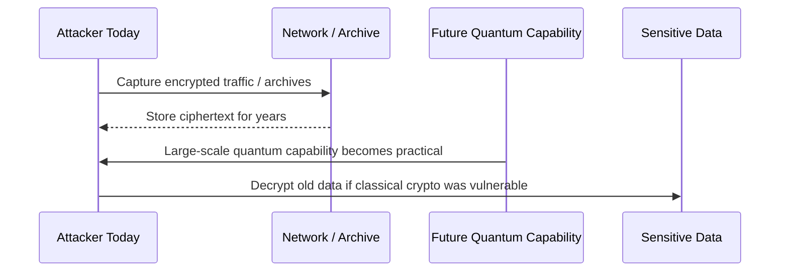
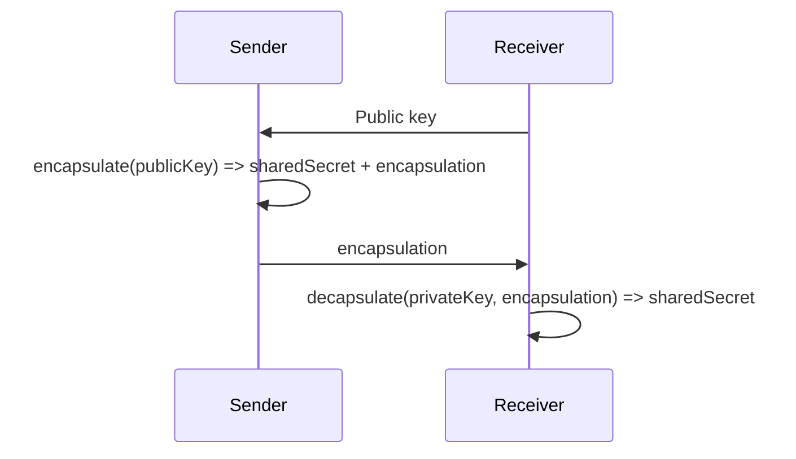
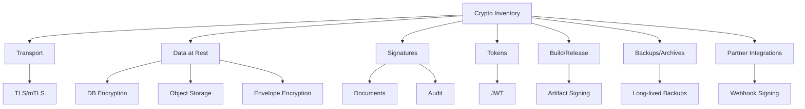
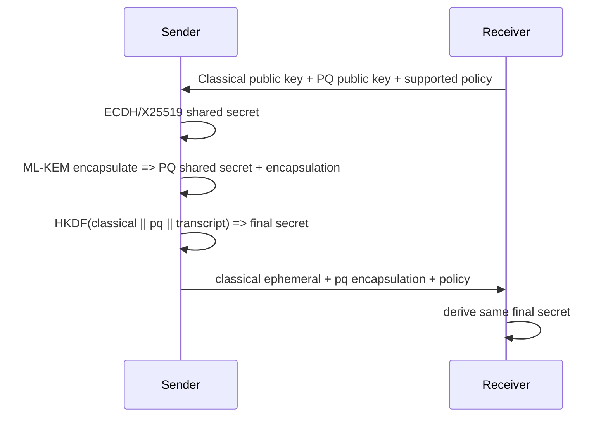
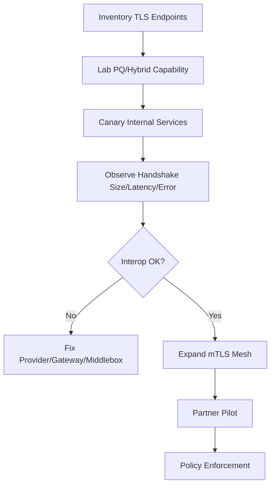
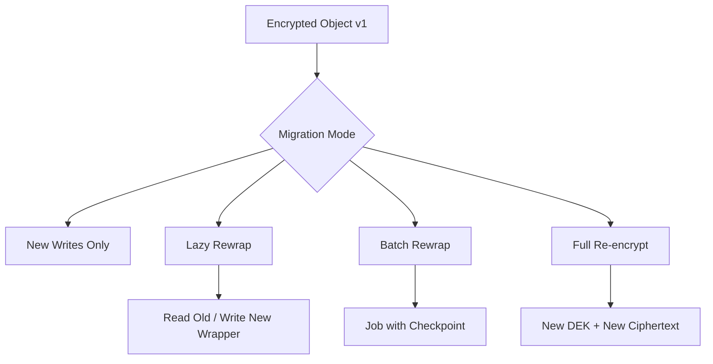
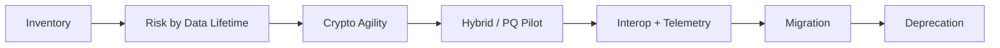

------
title: Learn Java Security, Cryptography and Integrity - Part 032
description: Post-Quantum Cryptography dan crypto migration untuk engineer Java: quantum risk, ML-KEM, ML-DSA, SLH-DSA, hybrid migration, crypto inventory, algorithm agility, long-lived data, dan migration roadmap.
series: learn-java-security-cryptography-integrity
seriesTitle: Learn Java Security, Cryptography and Integrity
order: 32
partTitle: Post-Quantum Cryptography & Crypto Migration
tags:
  - java
  - security
  - cryptography
  - post-quantum-cryptography
  - pqc
  - crypto-migration
  - key-management
  - secure-engineering
date: 2026-06-30
---

# Part 032 — Post-Quantum Cryptography & Crypto Migration

> Target part ini: kamu mampu memahami post-quantum cryptography dari sudut engineering Java: bukan sekadar tahu nama algoritma, tetapi mampu membuat **crypto inventory**, menilai **quantum risk**, mendesain **algorithm agility**, menjalankan **hybrid migration**, dan menghindari migrasi crypto yang merusak availability, interoperability, atau auditability.

Post-quantum cryptography bukan hanya topik akademik. Ia adalah masalah engineering lifecycle. Sistem enterprise menyimpan data bertahun-tahun, menandatangani dokumen yang harus dapat diverifikasi lama, dan memakai protokol yang tersebar di service, library, gateway, mobile app, partner API, HSM, KMS, certificate authority, build pipeline, dan arsip.

NIST merilis tiga standar PQC utama pada Agustus 2024:

- **FIPS 203 — ML-KEM** untuk key encapsulation;
- **FIPS 204 — ML-DSA** untuk digital signatures;
- **FIPS 205 — SLH-DSA** untuk stateless hash-based signatures.

NIST juga menyatakan organisasi harus mulai bermigrasi ke quantum-resistant cryptography dan mengidentifikasi penggunaan algoritma rentan untuk direncanakan penggantian atau pembaruannya. NIST menyebut ML-KEM, ML-DSA, dan SLH-DSA sebagai fondasi sebagian besar deployment PQC, dengan algoritma tambahan seperti FN-DSA/Falcon dan HQC masih dalam proses standardisasi lanjutan.

---

## 1. Kaufman Deconstruction

Kita pecah skill PQC migration menjadi sub-skill yang bisa dilatih.

```mermaid
graph TD
  A[PQC & Crypto Migration] --> B[Quantum Threat Model]
  A --> C[Crypto Inventory]
  A --> D[Algorithm Agility]
  A --> E[PQC Primitives]
  A --> F[Hybrid Migration]
  A --> G[Protocol Integration]
  A --> H[Key & Certificate Lifecycle]
  A --> I[Testing & Interoperability]
  A --> J[Governance]

  B --> B1[Harvest Now Decrypt Later]
  B --> B2[Long-Lived Signatures]
  B --> B3[Identity/PKI Risk]

  C --> C1[TLS]
  C --> C2[JWT/Signature]
  C --> C3[Envelope Encryption]
  C --> C4[Database/File Archives]
  C --> C5[Build Signing]

  D --> D1[Versioned Metadata]
  D --> D2[Provider Abstraction]
  D --> D3[Policy Configuration]
  D --> D4[Rollback Strategy]

  E --> E1[ML-KEM]
  E --> E2[ML-DSA]
  E --> E3[SLH-DSA]

  F --> F1[Classical + PQ]
  F --> F2[Combiner]
  F --> F3[Downgrade Resistance]
```



### Minimum effective learning target

Setelah menyelesaikan part ini, kamu harus bisa:

- menjelaskan mengapa RSA/ECC terancam quantum computer skala besar, sedangkan AES/SHA punya risk profile berbeda;
- membedakan KEM, key agreement, encryption, dan digital signature;
- memahami peran ML-KEM, ML-DSA, dan SLH-DSA;
- membuat crypto inventory untuk aplikasi Java enterprise;
- menilai data mana yang terkena risiko harvest-now-decrypt-later;
- mendesain envelope format yang crypto-agile;
- menyusun migration roadmap yang tidak memutus interoperability;
- memahami kapan hybrid mode dibutuhkan;
- menguji migration dengan test vector, backward compatibility, dan negative tests.

---

## 2. Mental Model: Quantum Risk Is Time-Shifted Risk

Bug biasa sering berdampak sekarang. Quantum risk sering berdampak nanti.



Ini disebut **harvest now, decrypt later**. Jika data harus tetap rahasia selama 10–30 tahun, migrasi tidak bisa menunggu quantum computer benar-benar tersedia.

Contoh high-risk:

- health records;
- regulatory investigation evidence;
- confidential enforcement documents;
- identity documents;
- long-term financial records;
- trade secrets;
- national security data;
- long-lived customer contracts;
- private keys/certificates yang melindungi arsip lama;
- backups yang disimpan jangka panjang.

Contoh lower-risk:

- short-lived telemetry;
- temporary access token dengan TTL menit;
- public release notes;
- cache ephemeral;
- data yang sudah public.

PQC migration bukan “semua diganti besok”. Ia dimulai dari data lifetime dan cryptographic dependency map.

---

## 3. Classical Crypto Risk Under Quantum Computing

| Primitive | Classical use | Quantum impact | Migration implication |
|---|---|---|---|
| RSA key exchange/encryption | Legacy TLS, envelope key wrapping | Broken by large-scale quantum via Shor's algorithm | Replace with PQ/hybrid KEM; avoid new RSA encryption designs |
| RSA signatures | Certificates, artifact signing, document signing | Broken by large-scale quantum | Plan PQ/hybrid signatures for long-lived trust |
| ECDH/X25519 | TLS key agreement, service key exchange | Broken by large-scale quantum | Hybrid key exchange migration |
| ECDSA/EdDSA | JWT, certs, signatures | Broken by large-scale quantum | PQ signature migration for long-lived verification |
| AES-128 | Symmetric encryption | Grover gives quadratic search speedup model | Prefer AES-256 for long-term high-value confidentiality |
| AES-256 | Symmetric encryption | Stronger margin | Generally acceptable with correct mode/key management |
| SHA-256/SHA-384 | Hashing/signature/hash chain | Grover affects preimage margin; collision model differs | Prefer SHA-384/SHA-512 where long-term margin matters |
| HMAC | Integrity/authentication | Symmetric primitive; impacted less dramatically | Use sufficient key size and modern hash |

Key point: PQC migration does not mean throwing away all symmetric crypto. It mainly targets public-key encryption/key establishment and signatures.

---

## 4. KEM vs Key Agreement vs Encryption

Java engineers often think “public-key encryption” means encrypting data directly with RSA. Modern protocols usually do not work that way.

### Key agreement

Two parties contribute key material and derive a shared secret.

Example classical: ECDH/X25519.

### KEM — Key Encapsulation Mechanism

A KEM produces:

- a shared secret;
- a ciphertext/encapsulation that lets the private-key holder recover the same shared secret.



ML-KEM is a KEM, not general-purpose file encryption. You use the shared secret to derive symmetric keys, then use AEAD such as AES-GCM or ChaCha20-Poly1305 for data.

### Digital signature

Signature proves that a holder of private signing key signed a specific message representation.

ML-DSA and SLH-DSA are signature algorithms. They are not encryption.

---

## 5. The NIST PQC Standards

### 5.1 ML-KEM — FIPS 203

ML-KEM is based on CRYSTALS-Kyber. Its role is key establishment.

Use cases:

- TLS key establishment through PQ/hybrid key exchange;
- envelope encryption key wrapping;
- secure session bootstrap;
- service-to-service protected key establishment;
- future secure messaging protocols.

Engineering implications:

- ciphertext and public key sizes are larger than classical ECDH;
- protocol message size may increase;
- gateways/load balancers may need updates;
- libraries and providers must be validated;
- key lifecycle and metadata must identify algorithm/parameter set.

### 5.2 ML-DSA — FIPS 204

ML-DSA is based on CRYSTALS-Dilithium. Its role is digital signatures.

Use cases:

- document signing;
- artifact signing;
- service token signing in future ecosystems;
- certificate signatures;
- audit/evidence signing;
- release provenance signing.

Engineering implications:

- signatures/public keys are larger than ECDSA/EdDSA;
- protocols and storage columns may need size changes;
- detached signature formats must carry algorithm metadata;
- verification libraries must be standardized across services;
- migration must preserve old signature verification.

### 5.3 SLH-DSA — FIPS 205

SLH-DSA is stateless hash-based signature, based on SPHINCS+.

Use cases:

- backup signature option;
- environments wanting diversity from lattice assumptions;
- long-term signatures where performance/size trade-off is acceptable.

Engineering implications:

- signatures are generally larger/slower than ML-DSA;
- good as algorithmic diversity/backup;
- not automatically the best default for high-throughput token signing.

---

## 6. Java Platform Reality

Java SE has a provider-based cryptography architecture. That is good for migration because algorithms can be introduced by providers, but it also creates operational risk if provider choice is implicit.

Relevant Java concepts from earlier parts:

- `Security` providers;
- `KeyPairGenerator`;
- `KeyFactory`;
- `KeyAgreement`;
- `KEM`;
- `Signature`;
- `Cipher`;
- `Mac`;
- `SecretKeyFactory`;
- keystore/truststore;
- JSSE;
- PKCS#11 provider;
- Bouncy Castle or other provider ecosystem.

Important: availability of PQC algorithm names in a Java runtime depends on JDK version, provider, security policy, and ecosystem support. Do not design a production PQC migration assuming every service can call `Signature.getInstance("ML-DSA")` today and interoperate. Design capability detection, provider pinning, test vectors, and fallback/rollback.

### Provider capability probe

```java
import java.security.Provider;
import java.security.Security;
import java.util.Comparator;

public final class ProviderCapabilities {
    public static void main(String[] args) {
        for (Provider provider : Security.getProviders()) {
            System.out.println("Provider: " + provider.getName() + " " + provider.getVersionStr());
            provider.getServices().stream()
                .filter(s -> s.getType().equalsIgnoreCase("Signature")
                          || s.getType().equalsIgnoreCase("KEM")
                          || s.getType().equalsIgnoreCase("KeyPairGenerator"))
                .sorted(Comparator.comparing(Provider.Service::getType)
                    .thenComparing(Provider.Service::getAlgorithm))
                .forEach(s -> System.out.printf("  %-18s %s%n", s.getType(), s.getAlgorithm()));
        }
    }
}
```

Use this in environment verification, not as the only migration mechanism.

---

## 7. Crypto Inventory

You cannot migrate what you cannot find.

A crypto inventory maps every cryptographic use to:

- algorithm;
- mode/parameter;
- provider;
- key type/size;
- key location;
- owner;
- data protected;
- data lifetime;
- protocol/format;
- interoperability partners;
- rotation process;
- verification process;
- migration blocker.



### Inventory table template

| Field | Example |
|---|---|
| System | case-management-api |
| Crypto purpose | TLS service-to-service, JWT verification, evidence file encryption |
| Algorithm | ECDHE P-256, Ed25519, AES-256-GCM |
| Provider | SunJSSE, SunEC, KMS provider |
| Key owner | Platform IAM, Security Engineering, Partner X |
| Key location | HSM/KMS/keystore/env/partner JWKS |
| Data protected | Investigation evidence attachments |
| Confidentiality lifetime | 20 years |
| Signature verification lifetime | 15 years |
| External dependency | Partner gateway only supports ECDSA P-256 |
| Migration priority | High |
| Blocker | Partner support and certificate profile |
| Test evidence | interop suite, test vector, canary |

---

## 8. Quantum Risk Prioritization

Prioritize by risk equation:

```text
PQC priority = data lifetime × sensitivity × exposure × algorithm vulnerability × migration complexity × external dependency
```

### High priority candidates

- TLS protecting long-lived sensitive traffic that can be captured;
- archived encrypted data using RSA/ECDH-wrapped keys;
- document signatures that must be trusted for years;
- certificate chains that anchor long-term identity;
- artifact/release signing for supply-chain trust;
- backup encryption keys and old key wrapping;
- cross-organization APIs with public internet exposure;
- regulatory evidence stores.

### Lower priority candidates

- short-lived session tokens that expire quickly and are not archived;
- ephemeral data with low sensitivity;
- internal flows with short retention and strong network controls;
- test-only cryptography;
- data already protected by symmetric encryption with adequate key size.

Do not confuse “lower priority” with “never”. It only means sequence migration rationally.

---

## 9. Algorithm Agility Architecture

Crypto agility means you can change algorithm without rewriting the business system.

### Bad envelope

```json
{
  "ciphertext": "base64..."
}
```

This is not migratable. It lacks algorithm, key ID, nonce, tag, associated data, version, and encoding.

### Better envelope

```json
{
  "version": 3,
  "purpose": "evidence-file-content",
  "algorithm": "AES-256-GCM",
  "keyWrap": {
    "algorithm": "ML-KEM-768+X25519-HYBRID",
    "keyId": "kms://evidence/wrapping-key/2026-06",
    "encapsulation": "base64...",
    "wrappedDek": "base64..."
  },
  "nonce": "base64...",
  "aad": {
    "tenantId": "tenant-123",
    "caseId": "case-456",
    "objectId": "file-789"
  },
  "ciphertext": "base64...",
  "tag": "base64..."
}
```

### Agility invariants

- Every encrypted/signed object has versioned metadata.
- Verification/decryption policy rejects unknown unsafe algorithms.
- Old algorithms can be verified/decrypted during migration but not used for new writes.
- Algorithm choice is policy-driven, not scattered string literals.
- Key ID is explicit.
- Associated data binds ciphertext to business context.
- Test vectors exist per envelope version.
- There is a rollback plan for new writes.

---

## 10. Policy-Driven Crypto Selection

Avoid this:

```java
Cipher.getInstance("RSA/ECB/OAEPWithSHA-256AndMGF1Padding");
```

Not because OAEP is automatically wrong, but because scattered algorithm strings make migration hard.

Prefer a narrow crypto service with policy.

```java
public enum CryptoPurpose {
    EVIDENCE_FILE,
    WEBHOOK_SIGNATURE,
    AUDIT_CHAIN,
    RELEASE_ATTESTATION
}

public record CryptoPolicy(
    CryptoPurpose purpose,
    String envelopeVersion,
    String contentEncryptionAlgorithm,
    String keyEstablishmentAlgorithm,
    String signatureAlgorithm,
    String providerName
) {}

public interface CryptoPolicyResolver {
    CryptoPolicy currentPolicy(CryptoPurpose purpose);
    CryptoPolicy policyForEnvelope(String version);
}
```

Then enforce at boundary:

```java
public final class EvidenceEncryptionService {
    private final CryptoPolicyResolver policies;
    private final KeyWrappingService keyWrapping;
    private final AeadService aead;

    public EncryptedObject encrypt(EvidencePlaintext plaintext, EvidenceContext context) {
        CryptoPolicy policy = policies.currentPolicy(CryptoPurpose.EVIDENCE_FILE);
        DataEncryptionKey dek = DataEncryptionKey.generate();

        WrappedKey wrapped = keyWrapping.wrap(dek, policy.keyEstablishmentAlgorithm(), context);
        AeadResult result = aead.encrypt(
            dek,
            plaintext.bytes(),
            AssociatedData.from(context)
        );

        return EncryptedObject.of(policy, wrapped, result, context);
    }
}
```

This abstraction is not for aesthetic purity. It makes migration measurable and testable.

---

## 11. Hybrid Migration

Hybrid mode combines classical and post-quantum mechanisms so security does not depend on one family alone during transition.

Why hybrid?

- PQC implementation maturity is still evolving;
- protocols and providers need interoperability testing;
- some systems require assurance from classical algorithms during transition;
- downgrade protection is easier when both parties prove support;
- partner ecosystems migrate at different speeds.

### Simplified hybrid KEM model



### Hybrid combiner invariant

Never invent an ad-hoc combiner casually.

At minimum:

- combine both shared secrets through a proper KDF such as HKDF;
- bind protocol transcript/context into KDF input;
- include algorithm identifiers;
- prevent downgrade by authenticating negotiated algorithms;
- fail closed if required component is missing;
- use test vectors;
- rely on vetted protocol/provider where possible.

---

## 12. Downgrade Resistance

Migration creates downgrade risk.

Bad negotiation:

```text
client: I support PQ
attacker strips PQ support
server: OK, use old classical-only mode
```

Better:

- server has policy for required algorithms by client/service class;
- negotiated algorithm is bound into transcript/signature;
- clients advertise capabilities through authenticated channel where possible;
- failure to meet required PQ policy fails closed;
- telemetry records algorithm used;
- canary detects unexpected fallback.

### Telemetry fields

- crypto purpose;
- envelope version;
- key ID;
- algorithm family;
- provider;
- operation: encrypt/decrypt/sign/verify/wrap/unwrap;
- fallback reason;
- partner/system ID;
- success/failure;
- latency and payload size.

Do not log secrets, keys, plaintext, shared secret, private key material, or raw sensitive ciphertext unless explicitly safe and controlled.

---

## 13. TLS and mTLS Migration

Most Java teams will first encounter PQC through TLS/mTLS libraries, gateways, service mesh, JDK/provider updates, or cloud load balancers.

### Things to inventory

- JDK version and JSSE provider;
- TLS termination points: ingress, service mesh, load balancer, application server;
- certificate algorithms;
- key exchange groups;
- client libraries;
- partner TLS requirements;
- private CA capability;
- certificate size limits;
- handshake size/latency;
- middlebox compatibility;
- monitoring support;
- rollback mechanism.

### Migration strategy



Important: application code may not directly implement TLS PQC. In many enterprises, this migration is platform-owned. Java engineers still need to understand impact on client config, trust material, observability, and failure modes.

---

## 14. Signatures and Long-Term Verification

Signatures are trickier than encryption migration because old signatures may need to remain verifiable for years.

### Signature migration concerns

- What documents/artifacts are signed?
- How long must signatures remain valid?
- What timestamping authority is used?
- What certificate chain anchors trust?
- What happens when old algorithm is deprecated?
- Can verifier support multiple algorithms?
- Are signature formats large enough?
- Are algorithms encoded unambiguously?
- Is canonicalization stable?
- Are public keys discoverable after key rotation?

### Signature envelope example

```json
{
  "version": 2,
  "payloadDigest": {
    "algorithm": "SHA-384",
    "value": "base64..."
  },
  "signature": {
    "algorithm": "ML-DSA-65",
    "keyId": "sigkey://evidence/2026-q3",
    "value": "base64..."
  },
  "signingContext": {
    "purpose": "regulatory-evidence-finalization",
    "tenantId": "tenant-123",
    "caseId": "case-456",
    "timestamp": "2026-06-30T02:00:00Z"
  },
  "certificateOrPublicKeyRef": "pki://evidence-ca/cert/2026-q3"
}
```

### Verification policy

```java
public enum SignaturePolicyResult {
    ACCEPT_CURRENT,
    ACCEPT_LEGACY,
    REJECT_DEPRECATED_FOR_NEW_DATA,
    REJECT_UNKNOWN,
    REJECT_COMPROMISED_KEY
}
```

Do not delete old verification capability until retention and legal requirements are satisfied.

---

## 15. JWT/OIDC Token Signing and PQC

JWT ecosystems are sensitive to algorithm support. Moving token signatures to PQC is not just changing `alg`.

Questions:

- Do all resource servers support the new algorithm?
- Can JWKS represent and distribute PQ public keys consistently?
- Are token size limits compatible with larger signatures?
- Do proxies/header limits break?
- Is token TTL short enough that classical signatures are acceptable for now?
- Are tokens archived as evidence?
- Does library ecosystem support constant-time and safe verification?
- Can issuer run dual-signing or parallel token format during migration?

For many systems, token signing may migrate later than long-lived document signing because access tokens are short-lived. But high-assurance identity ecosystems and archived identity assertions require earlier planning.

---

## 16. Build/Release Signing and Supply Chain

Part 027 covered artifact signing and provenance. PQC affects this because build signatures may need long-term verification.

High-value artifacts:

- container images;
- Maven artifacts;
- release bundles;
- SBOMs;
- provenance attestations;
- deployment manifests;
- regulatory evidence exports;
- database migration packages.

Migration approach:

- support multi-signature: classical + PQ;
- preserve old verifier;
- add algorithm metadata to provenance;
- test offline verification;
- ensure artifact registry supports larger signatures/metadata;
- define cutoff date for new releases;
- keep verification roots discoverable.

---

## 17. Data-at-Rest Migration

Data-at-rest usually uses symmetric encryption, but key wrapping and envelope formats may rely on public-key cryptography.

### Migration patterns

#### Pattern A — New writes only

New data uses PQ/hybrid wrapping. Old data remains old until read/rewritten.

Good for large archives where immediate re-encryption is expensive.

#### Pattern B — Lazy rewrap

When object is read, unwrap old DEK and rewrap using new algorithm.

Requires careful concurrency and audit.

#### Pattern C — Batch rewrap

Process archive in controlled migration job.

Requires rate limiting, resumability, integrity check, and rollback.

#### Pattern D — Full re-encrypt

Decrypt and encrypt content under new DEK and new wrapping.

Most expensive and highest operational risk, but may be needed if content encryption is also changing.



### Rewrap invariant

- plaintext exposure is minimized;
- old and new metadata are both auditable;
- object digest is verified before and after;
- operation is idempotent;
- failures can resume safely;
- key usage is logged without exposing secrets;
- old key is not destroyed before verification and retention policy allow.

---

## 18. Migration Roadmap

### Phase 0 — Governance and policy

- define crypto owner;
- define allowed algorithms;
- define deprecation policy;
- define exception process;
- define evidence requirements;
- align with compliance/legal retention.

### Phase 1 — Crypto inventory

- scan source for crypto APIs;
- inspect TLS endpoints;
- inspect KMS/HSM usage;
- inspect certificates;
- inspect artifact signing;
- inspect JWT/OIDC;
- inspect archives/backups;
- inspect partner integrations.

### Phase 2 — Risk scoring

Classify by:

- data sensitivity;
- confidentiality lifetime;
- verification lifetime;
- exposure;
- algorithm family;
- external dependency;
- migration complexity.

### Phase 3 — Agility foundation

- versioned envelopes;
- central crypto policy;
- provider pinning;
- test vectors;
- telemetry;
- fallback/rollback;
- dual-read/single-write strategy.

### Phase 4 — Lab and interop

- provider capability tests;
- protocol compatibility;
- payload size testing;
- latency testing;
- failure mode testing;
- key rotation simulation.

### Phase 5 — Pilot

- internal low-risk service;
- shadow verification;
- dual signature;
- canary traffic;
- rollback drill.

### Phase 6 — Production migration

- high-priority long-lived data;
- service-to-service TLS/mTLS;
- document signatures;
- release signing;
- partner integrations;
- archive rewrap.

### Phase 7 — Deprecation

- stop new writes with old algorithm;
- verify old data migration progress;
- restrict legacy verification/decrypt policy;
- retire old keys after retention and legal approval;
- update incident response playbooks.

---

## 19. Testing Strategy

### Unit tests

- known-answer tests from provider/test vectors;
- envelope serialization/deserialization;
- unknown algorithm rejection;
- key ID resolution;
- associated data mismatch;
- tampered ciphertext/signature;
- invalid encapsulation;
- policy cutoff date.

### Integration tests

- provider installed and pinned;
- HSM/KMS integration;
- cross-service encrypt/decrypt;
- signature verify across versions;
- TLS handshake compatibility;
- registry/provenance verification;
- partner API compatibility.

### Performance tests

- key generation latency;
- encapsulation/decapsulation latency;
- signing/verification latency;
- payload size increase;
- TLS handshake overhead;
- memory allocation;
- GC impact;
- throughput under concurrency.

### Failure tests

- provider missing;
- algorithm disabled;
- unknown key ID;
- expired key;
- corrupted envelope;
- downgrade attempt;
- partial migration failure;
- rewrap job restart;
- old verifier removed accidentally.

---

## 20. Java Test Example: Algorithm Policy Rejection

```java
@Test
void rejectsDeprecatedAlgorithmForNewEncryption() {
    CryptoPolicyResolver resolver = new InMemoryPolicyResolver(Map.of(
        CryptoPurpose.EVIDENCE_FILE,
        new CryptoPolicy(
            CryptoPurpose.EVIDENCE_FILE,
            "v3",
            "AES-256-GCM",
            "ML-KEM-768+X25519-HYBRID",
            null,
            "ApprovedProvider"
        )
    ));

    assertThatThrownBy(() -> resolver.policyForEnvelope("v1-new-write"))
        .isInstanceOf(DeprecatedCryptoPolicyException.class);
}
```

## 21. Java Test Example: Legacy Read, New Write

```java
@Test
void decryptsLegacyEnvelopeButWritesCurrentEnvelope() {
    EncryptedObject legacy = fixtures.encryptedEvidenceV1();

    EvidencePlaintext plaintext = encryption.decrypt(legacy, context);
    EncryptedObject migrated = encryption.encrypt(plaintext, context);

    assertThat(migrated.version()).isEqualTo("v3");
    assertThat(migrated.keyWrap().algorithm())
        .isEqualTo("ML-KEM-768+X25519-HYBRID");
    assertThat(encryption.decrypt(migrated, context)).isEqualTo(plaintext);
}
```

## 22. Java Test Example: Downgrade Rejection

```java
@Test
void rejectsDowngradeWhenPolicyRequiresHybridKem() {
    PeerCapabilities peer = new PeerCapabilities(
        Set.of("X25519"),
        Instant.now()
    );

    CryptoPolicy policy = policies.currentPolicy(CryptoPurpose.EVIDENCE_FILE);

    assertThatThrownBy(() -> negotiation.negotiate(policy, peer))
        .isInstanceOf(CryptoDowngradeException.class)
        .hasMessageContaining("required hybrid KEM");
}
```

---

## 23. Operational Metrics

Track migration as engineering program, not vague aspiration.

| Metric | Meaning |
|---|---|
| Crypto inventory coverage | Percentage of systems with complete crypto inventory |
| Classical-only high-risk flows | Count of high-risk flows still using RSA/ECC-only key establishment/signature |
| Versioned envelope coverage | Percentage of encrypted/signed objects with algorithm metadata |
| New writes using current policy | Percentage of new objects using approved algorithm version |
| Legacy decrypt/verify count | Frequency of legacy algorithm usage |
| Downgrade fallback count | Unexpected fallback events |
| Provider drift | Runtime provider/version mismatch from approved baseline |
| PQ/hybrid handshake error rate | Interop health |
| Rewrap progress | Archive migration completion |
| Partner readiness | External integration support status |

Metrics should be visible to platform, AppSec, service owners, and risk owners.

---

## 24. Anti-Patterns

### Anti-pattern 1 — “We use AES, so we are quantum-safe”

Maybe for content encryption, but what wraps the AES key? What signs the metadata? What protects TLS key establishment? What certifies the public key?

### Anti-pattern 2 — “We will wait until the JDK supports everything by default”

Waiting may be acceptable for low-risk short-lived data. It is not acceptable for long-lived confidential archives or long-lived signatures. Inventory and agility can start now.

### Anti-pattern 3 — Algorithm string scattered everywhere

This makes migration expensive and unsafe.

### Anti-pattern 4 — PQC without interoperability testing

Larger keys/signatures can break headers, proxies, database columns, message limits, JWT size assumptions, certificate chain size, and mobile network behavior.

### Anti-pattern 5 — Removing old verification too early

Old signatures and encrypted archives may need to be verified/decrypted for years. Migration must separate “not allowed for new writes” from “not readable/verifiable”.

### Anti-pattern 6 — Custom hybrid combiner

Combining secrets incorrectly can destroy security. Prefer vetted protocols/providers. If application-level hybrid is unavoidable, use reviewed KDF construction, transcript binding, and test vectors.

### Anti-pattern 7 — No downgrade telemetry

Fallback can silently become permanent. Track it.

---

## 25. Decision Record Template

```mdx
# ADR: PQC Migration for <System/Purpose>

Date: YYYY-MM-DD
Status: Proposed / Accepted / Deprecated
Owner: <team>

## Context
<system, data lifetime, current algorithms, external dependencies>

## Risk
- Quantum risk category: <high/medium/low>
- Harvest-now-decrypt-later concern: <yes/no>
- Signature verification lifetime: <duration>
- External constraints: <partners/platform/JDK/HSM>

## Decision
- New write algorithm: <algorithm/version>
- Legacy read policy: <allowed/restricted>
- Provider: <provider/version>
- Key management: <KMS/HSM/keystore>
- Migration pattern: <new writes/lazy rewrap/batch/full reencrypt>

## Verification
- Test vectors:
- Interop tests:
- Performance tests:
- Negative tests:
- Rollback test:

## Telemetry
<fields and dashboards>

## Rollout
<canary, expansion, cutoff, deprecation>

## Residual Risk
<what remains and who accepts it>
```

---

## 26. Practice Lab

### Lab 1 — Build a crypto inventory

Pick one Java service and identify:

- TLS/mTLS configuration;
- JWT/OIDC algorithms;
- database/object encryption;
- password hashing;
- HMAC/webhook signing;
- audit signatures/hash chains;
- artifact signing;
- key storage;
- certificate chain;
- backup encryption.

Output a table with algorithm, provider, key owner, data lifetime, and migration priority.

### Lab 2 — Design a versioned envelope

Design envelope format for evidence attachments that must remain confidential for 20 years.

Requirements:

- support old AES-GCM + KMS wrapping;
- support future ML-KEM hybrid wrapping;
- bind tenant/case/object ID as AAD;
- support key rotation;
- support lazy rewrap;
- reject downgrade for new writes.

### Lab 3 — Triage JWT PQC priority

Scenario:

- access tokens expire in 10 minutes;
- ID tokens are stored in audit logs for 7 years;
- current signature is ES256;
- all services validate via JWKS;
- gateway header limit is 8 KB.

Expected reasoning:

- short-lived access token confidentiality is not main PQC concern;
- archived ID tokens create long-term signature verification concern;
- larger PQ signatures may break header limits;
- dual signature or detached evidence record may be better than simply replacing JWT alg immediately;
- migration must preserve old verification and include token-size tests.

---

## 27. Top 1% Mental Model

A strong engineer does not ask: “Which PQC algorithm should I use?” first.

They ask:

1. What cryptographic property do we need?
2. For how long must it hold?
3. Which assets are vulnerable to future quantum capability?
4. Where are public-key primitives used today?
5. Which systems can change algorithms safely?
6. Which external parties block migration?
7. What metadata is missing for agility?
8. How do we test interoperability and downgrade resistance?
9. How do we keep legacy verification without allowing legacy new writes?
10. What evidence proves migration progress?

That is the difference between crypto curiosity and crypto engineering.

---

## 28. Summary

PQC migration is not a single library upgrade. It is a long-running engineering program across data, protocols, identity, signatures, archives, certificates, build systems, partners, and runtime providers.

The core model:



For Java systems, the provider-based architecture helps, but only if you control provider versions, algorithm policy, metadata, test vectors, and rollout. The goal is not “use PQC everywhere tomorrow”. The goal is to make the system able to migrate safely, starting with data and trust relationships that must survive the longest.

---

## References

- NIST Post-Quantum Cryptography Project: https://csrc.nist.gov/projects/post-quantum-cryptography
- NIST release: First three finalized post-quantum encryption standards: https://www.nist.gov/news-events/news/2024/08/nist-releases-first-3-finalized-post-quantum-encryption-standards
- FIPS 203 — Module-Lattice-Based Key-Encapsulation Mechanism Standard: https://csrc.nist.gov/pubs/fips/203/final
- FIPS 204 — Module-Lattice-Based Digital Signature Standard: https://csrc.nist.gov/pubs/fips/204/final
- FIPS 205 — Stateless Hash-Based Digital Signature Standard: https://csrc.nist.gov/pubs/fips/205/final
- NIST NCCoE Migration to Post-Quantum Cryptography: https://www.nccoe.nist.gov/crypto-agility-considerations-migrating-post-quantum-cryptographic-algorithms
- Java Cryptography Architecture Reference Guide: https://docs.oracle.com/en/java/javase/25/security/java-cryptography-architecture-jca-reference-guide.html
- Java `javax.crypto.KEM`: https://docs.oracle.com/en/java/javase/25/docs/api/java.base/javax/crypto/KEM.html
- RFC 9180 — Hybrid Public Key Encryption: https://www.rfc-editor.org/rfc/rfc9180
- RFC 5869 — HKDF: https://www.rfc-editor.org/rfc/rfc5869
