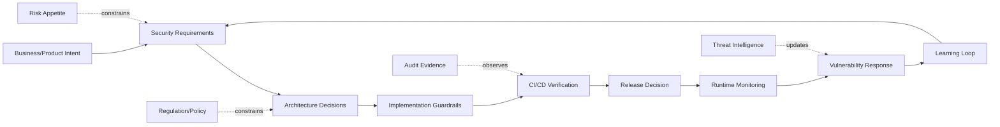
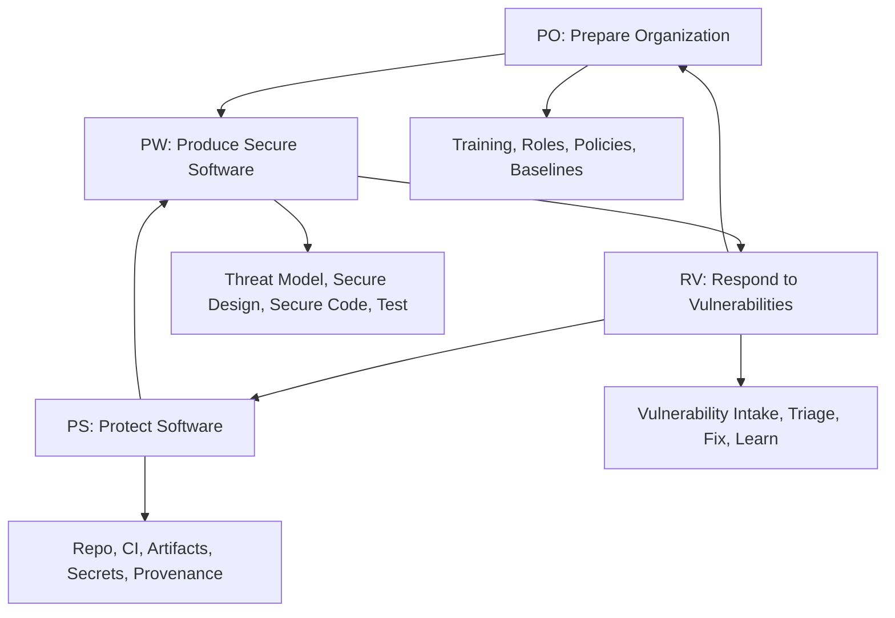
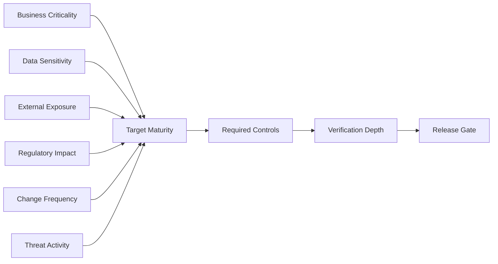
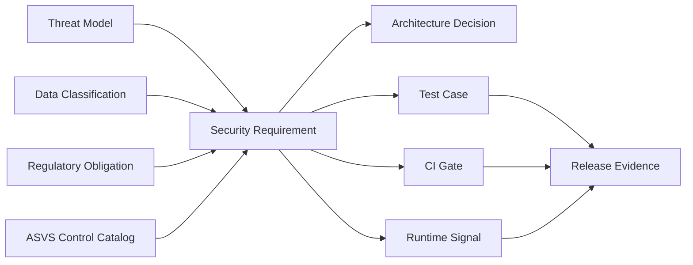
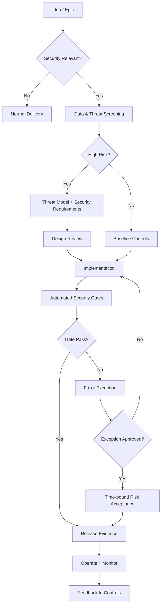
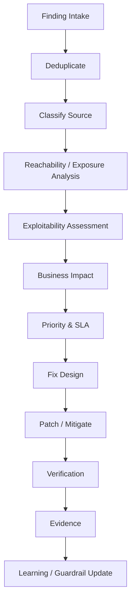
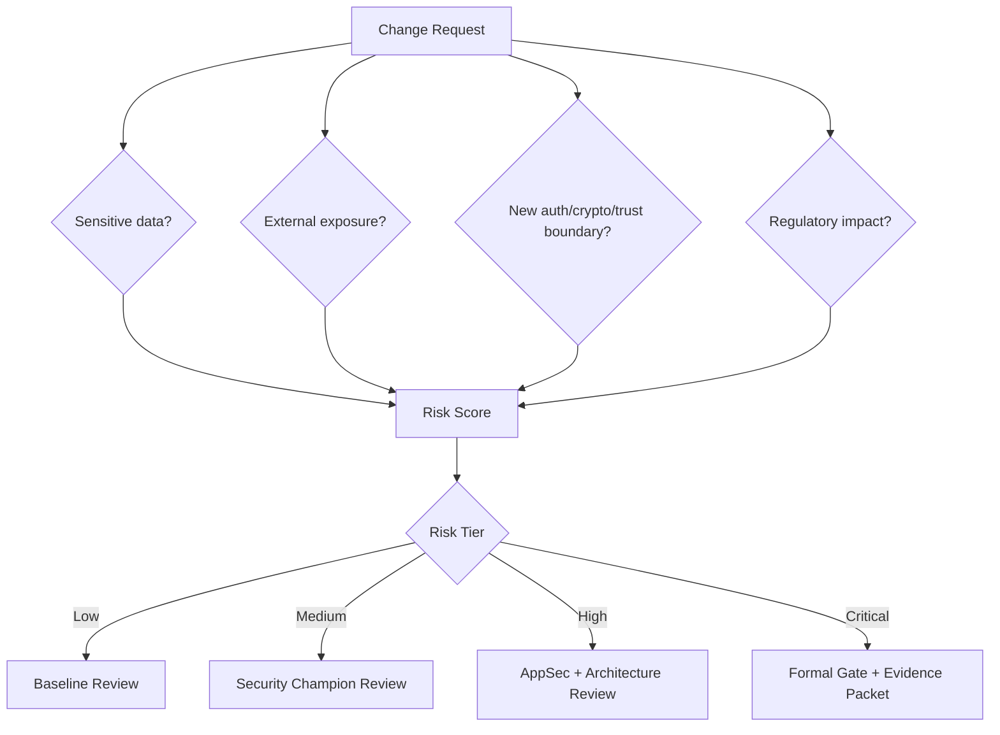
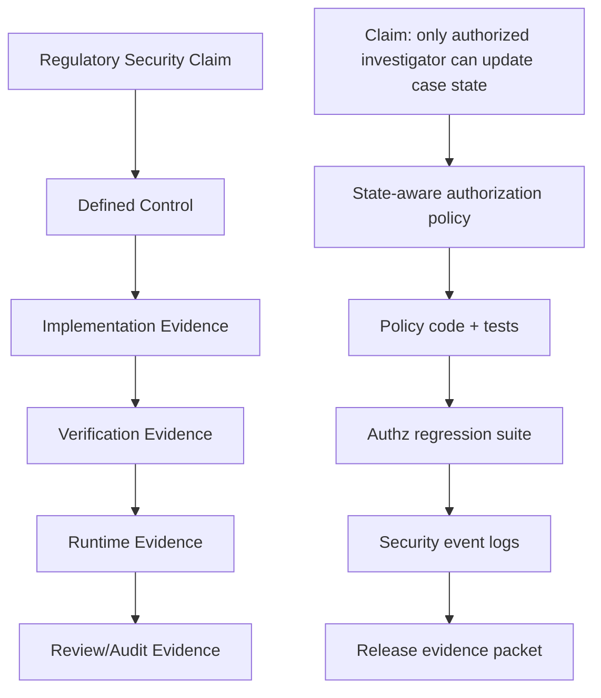

------
title: Learn Java Security, Cryptography and Integrity - Part 033
description: Secure-by-design governance, NIST SSDF, OWASP SAMM, ASVS, secure engineering operating model, policy-as-code, guardrails, exception management, dan security metrics untuk organisasi Java enterprise.
series: learn-java-security-cryptography-integrity
seriesTitle: Learn Java Security, Cryptography and Integrity
order: 33
partTitle: Secure-by-Design Governance, SSDF, SAMM & Operating Model
tags:
  - java
  - security
  - secure-by-design
  - ssdf
  - samm
  - governance
  - secure-sdlc
  - policy-as-code
  - engineering-operating-model
date: 2026-06-30
---

# Part 033 — Secure-by-Design Governance, SSDF, SAMM & Operating Model

> Target part ini: kamu mampu mengubah semua security knowledge dari Part 001–032 menjadi **operating model engineering**: siapa bertanggung jawab atas apa, decision apa yang harus tertulis, guardrail apa yang otomatis, evidence apa yang dikumpulkan, exception apa yang boleh diterima, dan metrik apa yang membuktikan security benar-benar membaik.

Security yang bagus tidak lahir dari checklist di akhir sprint. Ia lahir dari sistem kerja yang membuat keputusan aman menjadi jalur paling mudah, sedangkan keputusan berisiko harus terlihat, terbatas, disetujui, dan punya expiry.

Di level engineer senior/top-tier, pertanyaan bukan lagi “pakai library apa?” tetapi:

- bagaimana memastikan semua service Java baru punya baseline security yang sama tanpa perlu heroics;
- bagaimana membuktikan bahwa threat model sudah memengaruhi desain, bukan hanya dokumen;
- bagaimana membuat vulnerability triage objektif, cepat, dan audit-ready;
- bagaimana memastikan supply-chain integrity bukan sekadar scan dependency;
- bagaimana membuat exception tidak berubah menjadi permanent bypass;
- bagaimana mengukur security sebagai engineering capability, bukan sebagai ritual compliance.

Part ini mengikat standar seperti **NIST SSDF**, **OWASP SAMM**, **OWASP ASVS**, dan secure-by-design principle ke proses engineering sehari-hari.

---

## 1. Kaufman Deconstruction

Kita pecah skill secure-by-design governance menjadi beberapa sub-skill yang bisa dilatih secara terpisah.

```mermaid
graph TD
  A[Secure-by-Design Operating Model] --> B[Security Ownership]
  A --> C[Secure SDLC Integration]
  A --> D[Requirements & Verification]
  A --> E[Guardrails & Policy-as-Code]
  A --> F[Risk & Exception Management]
  A --> G[Vulnerability Response]
  A --> H[Metrics & Maturity]
  A --> I[Evidence & Auditability]
  A --> J[Developer Enablement]

  B --> B1[Product Owner]
  B --> B2[Tech Lead]
  B --> B3[Security Champion]
  B --> B4[Platform/SRE]
  B --> B5[AppSec]

  C --> C1[Ideation]
  C --> C2[Design]
  C --> C3[Build]
  C --> C4[Test]
  C --> C5[Release]
  C --> C6[Operate]
  C --> C7[Retire]

  D --> D1[ASVS Mapping]
  D --> D2[Threat Model Output]
  D --> D3[Security Acceptance Criteria]
  D --> D4[Verification Evidence]

  E --> E1[Secure Templates]
  E --> E2[CI Gates]
  E --> E3[OPA/Conftest]
  E --> E4[Dependency Policy]
  E --> E5[Runtime Baselines]

  F --> F1[Risk Register]
  F --> F2[Exception TTL]
  F --> F3[Compensating Controls]
  F --> F4[Risk Acceptance Authority]
```



### Minimum effective target

Setelah part ini, kamu harus bisa:

1. membuat operating model security untuk tim Java enterprise;
2. memetakan SSDF/SAMM/ASVS ke aktivitas engineering nyata;
3. mendefinisikan ownership per lifecycle stage;
4. membuat policy-as-code gate untuk dependency, container, IaC, secrets, dan release;
5. membuat exception process yang tidak menjadi “lubang permanen”;
6. membuat security metrics yang actionable, bukan vanity metric;
7. membuat evidence packet yang bisa dipakai audit, incident review, dan regulatory defensibility.

---

## 2. Mental Model: Governance Bukan Birokrasi, Tapi Control Plane

Kesalahan umum: governance dianggap dokumen, approval, dan checklist.

Mental model yang lebih kuat:

> **Security governance adalah control plane yang mengatur bagaimana keputusan security dibuat, dieksekusi, diverifikasi, dan dibuktikan.**

Dalam distributed system, data plane memproses traffic; control plane mengatur policy, routing, identity, limit, dan configuration. Dalam engineering organization, delivery team adalah data plane; governance adalah control plane.



Governance yang buruk menghasilkan dua failure mode ekstrem:

| Failure Mode | Gejala | Dampak |
|---|---|---|
| Paper governance | Dokumen lengkap, tetapi tidak memengaruhi code/release | Compliance theater |
| Tool-only governance | Banyak scanner, tidak ada risk owner/decision model | Alert fatigue dan bypass |

Operating model yang matang menggabungkan keduanya: policy yang jelas, guardrail otomatis, exception yang terkontrol, dan evidence yang bisa diuji.

---

## 3. Mapping NIST SSDF ke Engineering Java

NIST SSDF membagi praktik secure software development menjadi empat kelompok besar:

- **PO — Prepare the Organization**
- **PS — Protect the Software**
- **PW — Produce Well-Secured Software**
- **RV — Respond to Vulnerabilities**

Untuk engineer, mapping praktisnya seperti ini:

| SSDF Area | Makna Engineering | Contoh Java Enterprise |
|---|---|---|
| PO | Organisasi siap membuat software aman | Secure coding standard, champion model, golden path, training, baseline architecture |
| PS | Lindungi software, source, build, artifact, secrets | Branch protection, signed release, SBOM, artifact provenance, secret scanning |
| PW | Produce secure software | Threat model, secure requirement, ASVS mapping, secure framework defaults, code review, tests |
| RV | Respond to vulnerabilities | SCA triage, incident intake, patch SLA, exploitability assessment, remediation evidence |

### 3.1 SSDF sebagai lifecycle control



SSDF tidak boleh dipahami sebagai sequential waterfall. Ia adalah feedback loop:

- incident memperbarui secure coding standard;
- vulnerability memperbarui template dan CI policy;
- recurring review finding menjadi guardrail baru;
- audit gap menjadi evidence automation;
- production exploit attempt menjadi abuse test.

### 3.2 Contoh mapping SSDF ke artefak repo

```text
service-payment/
  .github/
    workflows/
      build.yml
      security.yml
  docs/security/
    threat-model.md
    security-requirements.md
    exception-register.md
    data-classification.md
    release-evidence-template.md
  policies/
    dependency-policy.rego
    container-policy.rego
    secrets-policy.yml
  src/test/security/
    AuthorizationRegressionTest.java
    WebhookReplayTest.java
    CryptoMisuseTest.java
  sbom/
    cyclonedx.json
  provenance/
    release-intoto-attestation.jsonl
```

Operating model yang bagus membuat security artefact hidup bersama code, bukan disimpan di drive terpisah yang tidak pernah dibaca.

---

## 4. Mapping OWASP SAMM ke Program Maturity

OWASP SAMM berguna untuk menjawab pertanyaan: “capability security organisasi kita sudah matang di mana, dan naik levelnya harus dari mana?”

SAMM melihat software assurance melalui fungsi bisnis dan praktik security. Untuk Java platform team, kita bisa menyederhanakannya menjadi:

| SAMM Function | Fokus | Pertanyaan Engineering |
|---|---|---|
| Governance | Strategy, policy, education | Apakah security punya ownership, target, dan training yang jelas? |
| Design | Threat assessment, requirements, architecture | Apakah desain yang risk-heavy direview sebelum implementasi? |
| Implementation | Secure build, deployment, defect management | Apakah pipeline mencegah insecure dependency/build/deploy? |
| Verification | Architecture assessment, requirements-driven testing, security testing | Apakah control diuji sesuai requirement? |
| Operations | Incident, environment, operational management | Apakah runtime dan incident response siap? |

### 4.1 Security maturity bukan “semua harus level maksimum”

Maturity harus berbasis risk. Payment service, identity service, evidence archive, dan public marketing site tidak harus punya kedalaman yang sama.



Contoh target maturity:

| Service Type | Target |
|---|---|
| Internal low-risk batch report | Lightweight baseline, dependency scanning, logging control |
| Public API gateway | Strong authn/authz, abuse testing, WAF integration, rate limit, high observability |
| Identity provider | Highest assurance, formal review, HSM/KMS, independent test, strict change control |
| Evidence/audit archive | Tamper-evident storage, retention, immutable logs, strong access control, legal review |
| Case management workflow | Strong state-transition control, auditability, role separation, authorization regression test |

### 4.2 SAMM assessment template

```mdx
## Security Maturity Assessment

Service: case-management-api
Owner: Enforcement Platform Team
Criticality: High
Data Classification: Confidential / Regulatory Evidence
External Exposure: Partner API + Internal UI

### Governance
- Policy coverage: partial
- Security owner: assigned
- Training: completed for tech lead, not all engineers
- Gap: no exception expiry process

### Design
- Threat model: current for v2 workflow
- Abuse cases: missing for bulk evidence import
- Gap: no formal authorization matrix for investigator handoff

### Implementation
- Secure build: signed image, SBOM available
- Secret scanning: enabled
- Gap: no deny policy for unsafe crypto algorithm

### Verification
- SAST/SCA: enabled
- Authz regression: partial
- Gap: no replay test for partner callbacks

### Operations
- Security events: structured
- Incident runbook: partial
- Gap: no evidence packet generation after security-sensitive release
```

---

## 5. ASVS sebagai Requirement Catalog, Bukan Checklist Pasif

OWASP ASVS berguna sebagai katalog technical security requirements. Tetapi cara memakainya menentukan apakah ia efektif.

Cara lemah:

> “Centang semua requirement yang kelihatannya relevan.”

Cara kuat:

> “Petakan threat dan data sensitivity ke ASVS control, jadikan acceptance criteria, lalu buktikan lewat test/evidence.”



### 5.1 Contoh requirement yang baik

Requirement buruk:

> Sistem harus aman.

Requirement lumayan:

> API harus memvalidasi JWT.

Requirement kuat:

> Semua endpoint `/cases/{caseId}/evidence/**` wajib melakukan object-level authorization terhadap `caseId` menggunakan current assignment, delegation, dan conflict-of-interest rule. Authorization tidak boleh hanya bergantung pada role global. Setiap deny harus menghasilkan structured security event tanpa membocorkan existence case ke user tidak berwenang. Requirement diverifikasi oleh regression test untuk investigator assigned, investigator unassigned, supervisor, external reviewer, dan revoked assignment.

Perhatikan struktur requirement kuat:

- asset jelas;
- scope jelas;
- rule jelas;
- negative condition jelas;
- observability jelas;
- verification jelas.

---

## 6. Operating Model: Roles, Ownership, and Accountability

Security ownership sering gagal karena semua orang “peduli”, tetapi tidak ada yang accountable.

### 6.1 RACI sederhana

| Aktivitas | Product | Tech Lead | Engineer | Security Champion | AppSec | Platform/SRE | Compliance |
|---|---:|---:|---:|---:|---:|---:|---:|
| Data classification | A | C | C | C | C | I | R |
| Threat model | C | A/R | R | R | C | C | C |
| Security requirements | A | R | C | C | C | I | C |
| Secure implementation | I | A | R | C | C | I | I |
| Code review | I | A | R | R | C | I | I |
| CI policy | I | C | C | C | C | A/R | I |
| Release risk decision | A | R | C | C | C | C | C |
| Exception approval | A | R | I | C | C | C | C |
| Incident response | C | R | R | C | C | A/R | C |

Keterangan:

- **R** = Responsible
- **A** = Accountable
- **C** = Consulted
- **I** = Informed

RACI bukan untuk memperlambat tim. Ia mencegah ambiguity saat ada vulnerability, audit finding, atau incident.

### 6.2 Security champion yang benar

Security champion bukan “mini AppSec” yang menjadi bottleneck. Ia adalah engineer di tim yang membantu security decision masuk ke workflow tim.

Tugas security champion:

- menjaga threat model tetap hidup;
- membantu review design yang risk-heavy;
- menjaga checklist service baseline;
- melakukan first-pass triage finding;
- mengubah recurring issue menjadi guardrail;
- menjadi bridge antara AppSec dan delivery team.

Anti-pattern:

- champion hanya nama di spreadsheet;
- champion tidak punya waktu eksplisit;
- champion disuruh approve semua risk tanpa authority;
- champion dianggap pengganti AppSec untuk area high-risk.

---

## 7. Secure SDLC yang Tidak Memperlambat Delivery

Secure SDLC efektif bukan berarti semua perubahan harus lewat review manual. Yang harus manual adalah keputusan high-risk dan exception. Yang repeatable harus otomatis.

### 7.1 Security lifecycle by change type

| Change Type | Security Activity Minimum |
|---|---|
| UI text/layout change | Baseline CI only |
| Internal business logic low-risk | Code review + unit test + SCA/SAST baseline |
| New endpoint | Authn/authz requirement + API abuse test + OpenAPI review |
| New data class | Data classification + logging/redaction review + retention review |
| New integration/partner callback | Trust boundary review + request signing/replay defense test |
| New crypto usage | Crypto design record + approved library + misuse test |
| New identity/auth flow | Threat model + AppSec review + negative tests + session/recovery review |
| New release pipeline | Supply-chain review + provenance + signing + rollback test |
| High-risk exception | Risk acceptance + compensating control + TTL + revalidation |

### 7.2 Lifecycle gates



The key idea: do lightweight screening early, automate the boring things, and reserve manual attention for risk-heavy decisions.

---

## 8. Security Requirements as Code-adjacent Artifacts

Security requirement yang hanya ada di Jira sering hilang setelah ticket closed. Untuk sistem high-risk, requirement perlu dekat dengan code.

### 8.1 Structure

```text
docs/security/
  data-classification.md
  threat-model.md
  security-requirements.md
  authorization-matrix.md
  crypto-decisions.md
  security-test-plan.md
  exception-register.md
  release-evidence.md
```

### 8.2 Example: security requirement record

```md
# SEC-CASE-017: Case Evidence Object Authorization

Status: Active
Owner: Enforcement Platform Team
Risk: High
Related threats: T-CASE-003, T-EVID-002
ASVS mapping: Access Control / Data Protection / Logging

## Requirement
A user may access evidence only when all conditions are true:
1. user is authenticated with current session assurance >= AAL2-equivalent;
2. user has active assignment, supervision right, or explicit delegation for the case;
3. case is not sealed, unless user has sealed-case clearance;
4. user is not blocked by conflict-of-interest rule;
5. requested action is allowed in current case state.

## Deny behavior
- Return generic 404/403 based on endpoint exposure rule.
- Emit `security.authorization.denied` event.
- Do not log evidence content or secret token.

## Verification
- `EvidenceAuthorizationRegressionTest`
- `SealedCaseAccessTest`
- `DelegationRevocationTest`
- runtime metric: `authorization.denied{resource=evidence}`
```

This artifact is not paperwork. It is an executable design contract when tied to tests and monitoring.

---

## 9. Policy-as-Code Guardrails

Manual review does not scale. Guardrails should encode non-negotiable requirements.

### 9.1 Guardrail categories

| Category | Guardrail Example |
|---|---|
| Dependency | Ban known malicious packages, enforce dependency verification, fail on reachable critical vulnerability |
| Crypto | Ban `MD5`, `SHA1withRSA`, `AES/ECB`, hardcoded keys, insecure random |
| Container | Non-root, read-only filesystem, no privileged container, pinned base image digest |
| Kubernetes | Restricted pod security, no hostPath, no hostNetwork, resource limits |
| Secrets | Block committed secrets, block env dump logging, require vault/KMS reference |
| IaC | Public bucket deny, encryption required, network egress restrictions |
| Release | Require SBOM, provenance, signature, vulnerability summary |
| Observability | Block known sensitive fields from logs/traces |

### 9.2 Example: Rego policy for container baseline

```rego
package container.security

default allow = false

allow {
  input.user != "root"
  input.readOnlyRootFilesystem == true
  input.privileged == false
  input.allowPrivilegeEscalation == false
  input.image.digest != ""
}

deny[msg] {
  input.user == "root"
  msg := "container must not run as root"
}

deny[msg] {
  not input.readOnlyRootFilesystem
  msg := "container filesystem must be read-only"
}

deny[msg] {
  input.privileged == true
  msg := "privileged container is forbidden"
}

deny[msg] {
  input.image.digest == ""
  msg := "image must be pinned by digest"
}
```

### 9.3 Example: Java crypto lint rule idea

Policy-as-code tidak selalu Rego. Untuk Java, beberapa guardrail bisa berupa static analysis rule.

```java
// BAD: explicitly banned
Cipher cipher = Cipher.getInstance("AES/ECB/PKCS5Padding");

// BAD: random for security token
String token = Long.toHexString(new Random().nextLong());

// BAD: weak digest for integrity decision
MessageDigest md = MessageDigest.getInstance("MD5");
```

Expected CI result:

```text
SEC-CRYPTO-001 failed:
- AES/ECB is forbidden for data protection.
- Use approved AEAD profile: AES/GCM/NoPadding with 96-bit nonce and 128-bit tag.
- Crypto exception requires security decision record and AppSec approval.
```

### 9.4 Guardrail design principle

Good guardrails are:

- precise;
- explainable;
- fast;
- overrideable only through controlled exception;
- tied to secure alternative;
- versioned;
- measurable.

Bad guardrails are:

- noisy;
- context-blind;
- impossible to satisfy;
- undocumented;
- silently bypassed;
- owned by nobody.

---

## 10. Golden Paths for Java Teams

Secure-by-design requires golden paths. A team should not have to assemble security from scratch for every service.

### 10.1 Golden path components

| Layer | Golden Path |
|---|---|
| Service bootstrap | Spring Boot/Quarkus template with secure defaults |
| Authn | Standard OIDC resource server config |
| Authz | Shared policy enforcement abstraction |
| Logging | Structured logger with redaction filter |
| Secrets | Vault/KMS client wrapper and config convention |
| Crypto | Approved crypto facade for envelope encryption/request signing |
| API | OpenAPI conventions, validation, error response model |
| Build | Gradle/Maven template with dependency verification and SBOM |
| Container | Base image, non-root user, read-only FS, healthcheck |
| Observability | OpenTelemetry baseline with sensitive attribute policy |
| Testing | Authz regression helpers, misuse tests, fuzzing hooks |
| Release | Provenance/signing workflow template |

### 10.2 Example: approved crypto facade

```java
public interface DataProtector {
    ProtectedPayload encrypt(byte[] plaintext, EncryptionContext context);
    byte[] decrypt(ProtectedPayload payload, EncryptionContext context);
}

public record EncryptionContext(
        String tenantId,
        String purpose,
        String dataClass,
        String keyAlias
) {}

public record ProtectedPayload(
        String profile,
        String keyId,
        String algorithm,
        String nonceBase64,
        String aadBase64,
        String ciphertextBase64,
        String tagBase64
) {}
```

The purpose of the facade is not abstraction theater. It centralizes:

- approved algorithms;
- envelope metadata;
- key ID handling;
- AAD discipline;
- telemetry;
- rotation compatibility;
- misuse tests.

---

## 11. Risk Acceptance and Exception Management

A secure operating model must admit reality: sometimes a release ships with known risk. The danger is not accepting risk; the danger is accepting it invisibly and forever.

### 11.1 Exception invariant

> **Every exception must have owner, reason, scope, compensating control, expiry, and revalidation trigger.**

### 11.2 Exception record template

```md
# Security Exception SEC-EX-2026-014

Status: Approved
Owner: Payment Platform Tech Lead
Approver: Product Director + AppSec Lead
Created: 2026-06-30
Expires: 2026-08-15
Scope: payment-reconciliation-worker only

## Control bypassed
Container read-only filesystem requirement.

## Reason
Vendor reconciliation binary writes temporary working files to `/opt/vendor/tmp`.

## Risk
If worker is compromised, writable filesystem increases persistence and tampering risk.

## Compensating controls
- Run as non-root.
- Network egress restricted to vendor endpoint and internal queue.
- Temp directory mounted as size-limited ephemeral volume.
- File integrity monitoring enabled for application directory.
- No secrets mounted as files.

## Remediation plan
Replace vendor binary with patched version supporting configurable temp directory.

## Revalidation trigger
- Any severity high vulnerability in vendor binary.
- Any incident involving worker container.
- Expiry date.
```

### 11.3 Exception anti-patterns

| Anti-pattern | Why Dangerous |
|---|---|
| “Temporary” exception without expiry | Becomes permanent control bypass |
| Exception approved by same person who benefits from bypass | Conflict of interest |
| No compensating control | Risk accepted without reduction |
| No scope | Bypass copied to unrelated services |
| No evidence | Cannot defend decision later |
| No revalidation trigger | Threat changes but decision stays stale |

---

## 12. Vulnerability Management as Engineering Flow

Vulnerability management must be integrated into engineering, not run as monthly spreadsheet panic.

### 12.1 Flow



### 12.2 Finding source taxonomy

| Source | Example | Handling |
|---|---|---|
| SCA | CVE in transitive dependency | Reachability, version fix, mitigation, dependency replacement |
| SAST | Potential SQL injection | Source/sink review, exploitability, test, fix pattern |
| DAST | Reflected XSS | Reproduce, input/output boundary fix, regression test |
| Pentest | Business logic bypass | Threat model update, authz invariant, policy test |
| Incident | Exploit attempt or breach | Incident response, containment, root cause, control update |
| Vendor advisory | Framework vulnerability | Patch window, compatibility test, release risk |
| Threat intel | Active exploit campaign | Exposure check, emergency mitigation |

### 12.3 Prioritization model

Priority should consider:

- severity score;
- exploit availability;
- active exploitation;
- internet exposure;
- authentication requirement;
- data sensitivity;
- privilege gained;
- reachability in the application;
- compensating controls;
- blast radius;
- regulatory impact;
- fix complexity;
- rollback risk.

Do not blindly sort by CVSS. A critical vulnerability in unreachable test dependency may be lower priority than a medium authorization bug in a public case API.

---

## 13. Secure Metrics That Actually Help

Bad metrics create gaming behavior. Good metrics improve feedback loops.

### 13.1 Avoid vanity metrics

| Weak Metric | Problem |
|---|---|
| Number of findings | More scanning can increase count without increasing risk |
| Percent teams trained | Training attendance does not prove secure behavior |
| Number of policies | Policies can exist without enforcement |
| Number of exceptions | Needs context: risk, expiry, recurrence |
| Average CVSS | Ignores reachability and business impact |

### 13.2 Stronger metrics

| Metric | Why Useful |
|---|---|
| Mean time to triage exploitable findings | Measures response capability |
| Percent high-risk services with current threat model | Measures design coverage |
| Percent security requirements with automated verification | Measures enforceability |
| Expired exceptions count | Measures governance hygiene |
| Repeat finding rate by category | Shows where guardrails/training fail |
| Percent releases with SBOM + signature + provenance | Measures supply-chain baseline |
| Authz regression coverage for critical resources | Measures object-level access control confidence |
| Secrets leak recurrence rate | Measures secrets management maturity |
| Time from incident root cause to guardrail update | Measures learning loop |

### 13.3 Security scorecard example

```md
# Monthly Secure Engineering Scorecard

Platform: Enforcement Case Management
Period: 2026-06

## Design
- Critical services with current threat model: 9/10
- High-risk changes with security requirement record: 100%
- Open design risks past due: 1

## Build/Release
- Releases with SBOM: 100%
- Releases with signed provenance: 92%
- Dependency verification enabled: 10/10 services
- Critical reachable vulnerabilities past SLA: 0

## Runtime
- Services running as non-root: 100%
- Services with restricted egress: 8/10
- Sensitive log policy violations: 3, down from 9

## Governance
- Active exceptions: 5
- Expired exceptions: 0
- Repeat findings: object-level authorization test gaps in 2 services

## Next actions
1. Add reusable authz regression harness to service template.
2. Enforce egress policy on remaining 2 services.
3. Move provenance gate from warning to blocking.
```

---

## 14. Evidence Packet for Release and Audit

For high-risk systems, every security-sensitive release should produce evidence.

### 14.1 Release evidence packet

```text
release-evidence/
  release-summary.md
  artifact-digests.txt
  sbom.cdx.json
  provenance.intoto.jsonl
  image-signature.txt
  dependency-risk-summary.md
  security-test-results.xml
  sast-summary.sarif
  dast-summary.md
  threat-model-delta.md
  exception-delta.md
  approvals.md
  rollback-plan.md
```

### 14.2 Evidence design rule

Evidence must answer:

- what was released;
- who approved it;
- what source/build produced it;
- what dependencies were included;
- what controls passed;
- what risks were accepted;
- what changed since prior release;
- how to roll back;
- how to verify production state matches approved artifact.

### 14.3 Evidence anti-pattern

- screenshots instead of machine-readable evidence;
- evidence manually edited after the fact;
- release ticket says “security passed” without artifacts;
- build logs not retained long enough;
- no link between artifact digest and deployment;
- approvals via chat without retention;
- exception not tied to release.

---

## 15. Secure-by-Design Decision Records

Security decision must survive team turnover. Use decision records.

### 15.1 Template

```md
# Security Decision Record: SDR-2026-011

Title: Use request-level HMAC signing for partner case-status callbacks
Status: Accepted
Date: 2026-06-30
Owner: Integration Platform Team

## Context
Partner callbacks arrive over mutual TLS, but some partner environments terminate TLS at gateway and forward requests internally. We need message-level integrity and replay resistance.

## Decision
Require HMAC-SHA-256 request signing over canonical method, path, query, timestamp, nonce, and SHA-256 body hash. Reject if timestamp window exceeds 5 minutes or nonce was previously seen for the key ID.

## Alternatives
1. TLS only: rejected because it does not protect after TLS termination.
2. JWT bearer token: rejected because it authenticates sender but does not bind raw request body.
3. Digital signature: deferred; partner key management maturity varies.

## Consequences
- Partners must manage shared secret rotation.
- Receiver must store nonce replay cache.
- Canonicalization must be versioned and tested with vectors.

## Verification
- `PartnerCallbackSignatureTest`
- `ReplayWindowTest`
- contract test vectors in `docs/security/signing-test-vectors.json`
```

### 15.2 Decision records should exist for

- custom crypto usage;
- token/session architecture;
- public API trust boundary;
- authorization model;
- sensitive data storage;
- logging/redaction policy;
- dependency exception;
- build/release trust model;
- runtime network posture;
- incident/risk acceptance.

---

## 16. Secure Defaults and “Paved Road” Enforcement

Secure-by-design means product teams get safe defaults without becoming security experts.

### 16.1 Java service baseline

```yaml
service_security_baseline:
  authentication:
    oidc_resource_server: required
    token_validation:
      issuer: pinned
      audience: required
      jwks_cache: bounded
  authorization:
    object_level_authorization: required_for_external_api
    deny_by_default: true
  transport:
    tls_min_version: "1.2"
    mtls_internal: required_for_sensitive_services
  secrets:
    source: vault_or_kms
    no_plain_env_for_high_value_secrets: true
  crypto:
    approved_profiles:
      - AES-256-GCM-envelope-v1
      - HMAC-SHA-256-request-signing-v1
  logging:
    structured: true
    redaction_policy: required
    security_events: required
  build:
    sbom: required
    provenance: required
    signature: required
  runtime:
    non_root: true
    read_only_fs: true
    restricted_egress: true
```

### 16.2 Enforcement matrix

| Control | Default | Enforcement |
|---|---|---|
| OIDC validation | Service template | Integration test + config check |
| Object authz | Shared authorization library | Regression test harness |
| Approved crypto | Crypto facade | Static analysis + dependency allowlist |
| Secrets via vault/KMS | Platform config | Secret scanning + runtime config validation |
| SBOM/provenance | CI template | Release gate |
| Non-root runtime | Dockerfile template | Container policy gate |
| Sensitive logging | Logging library | Unit tests + telemetry scanning |

---

## 17. Engineering Security Review Types

Not all reviews are the same.

| Review Type | Trigger | Output |
|---|---|---|
| Threat modeling | New high-risk feature/system | Threats, mitigations, security requirements |
| Architecture security review | New trust boundary/auth/crypto/storage model | Decision record, risks, constraints |
| Code review | Every merge | Code-level security issues, tests |
| Crypto review | New cryptographic use | Approved profile or rejection |
| Supply-chain review | New build/release/dependency pattern | Provenance/signing/SBOM controls |
| Privacy/data review | New personal/sensitive data handling | Classification, retention, minimization |
| Operational readiness review | Before production | Runbooks, alerts, incident handling |
| Post-incident review | After security event | Root cause, guardrail update, learning |

### 17.1 Review depth should follow risk



---

## 18. Regulatory Defensibility

For regulatory systems, the bar is not merely “no exploit found.” You need defensible reasoning.

Regulatory defensibility means:

- decisions were made by authorized people;
- rules were explicit before action;
- access was based on role/assignment/state, not arbitrary discretion;
- evidence is tamper-evident;
- audit trail supports reconstruction;
- exceptions are documented and bounded;
- release evidence proves the deployed system matched approved controls;
- incident handling is traceable.

### 18.1 Defensible security argument



A defensible system does not rely on “trust us.” It presents a chain of reasoning and evidence.

---

## 19. Common Governance Anti-Patterns

### 19.1 Compliance-first, risk-second

Symptom: team optimizes for passing audit, not reducing exploitability.

Fix:

- map compliance control to actual threat;
- define security invariant;
- verify invariant with test/evidence;
- keep evidence machine-readable.

### 19.2 Central AppSec bottleneck

Symptom: every decision waits for a small security team.

Fix:

- create golden paths;
- train security champions;
- automate guardrails;
- reserve AppSec for high-risk design and exception.

### 19.3 Scanner-driven security

Symptom: build fails on noisy findings, but business logic vulnerabilities pass.

Fix:

- combine scanner with threat model and abuse tests;
- prioritize reachability/exploitability;
- add custom tests for authz, replay, state transitions.

### 19.4 Permanent exceptions

Symptom: exception register grows forever.

Fix:

- require TTL;
- require compensating controls;
- block expired exceptions;
- review exceptions in release readiness.

### 19.5 Security requirements detached from code

Symptom: requirements exist in docs but implementation diverges.

Fix:

- keep requirement in repo;
- link to tests;
- link to runtime metrics;
- update during design change.

---

## 20. Practical Implementation Roadmap

### Phase 1 — Baseline hygiene

- Create security baseline for Java services.
- Enable dependency scanning and secret scanning.
- Create service security inventory.
- Require owner per service.
- Define data classification.
- Add standard logging redaction.
- Create exception register.

### Phase 2 — Design integration

- Require threat model for high-risk changes.
- Introduce security requirement records.
- Map critical services to ASVS controls.
- Establish security champion model.
- Create architecture review trigger criteria.

### Phase 3 — Automation

- Add policy-as-code gates.
- Enforce SBOM/provenance/signing.
- Add crypto misuse checks.
- Add authz regression harness.
- Create release evidence packet automation.

### Phase 4 — Maturity and feedback

- Run SAMM assessment.
- Add security metrics dashboard.
- Track repeat finding categories.
- Convert incident lessons into guardrails.
- Create executive risk reporting grounded in engineering data.

---

## 21. Lab: Build a Secure Engineering Operating Model for One Service

Choose one existing Java service.

### Step 1 — Classify

Document:

- service owner;
- data classification;
- external/internal exposure;
- authn/authz model;
- dependencies;
- runtime platform;
- critical workflows.

### Step 2 — Map controls

Create table:

| Risk | Control | Verification | Evidence |
|---|---|---|---|
| Unauthorized case access | Object-level authz | Regression tests | Test report + policy code |
| Secret leakage | Vault + redaction | Secret scan + log test | CI result |
| Dependency compromise | Dependency verification + SCA | Build gate | SBOM + scan report |
| Tampered release | Signing + provenance | Release gate | Signature + attestation |

### Step 3 — Add one guardrail

Pick one recurring problem and automate it.

Examples:

- block `AES/ECB` usage;
- block root container;
- require `aud` validation in JWT resource server config;
- block sensitive field logging;
- require SBOM artifact.

### Step 4 — Create exception process

Create one synthetic exception and force yourself to define:

- owner;
- scope;
- reason;
- expiry;
- compensating control;
- evidence;
- remediation plan.

### Step 5 — Review maturity

Assess one level up: what would make this service easier to secure next month?

---

## 22. Production Checklist

### Governance

- [ ] Each service has an accountable owner.
- [ ] Each critical service has current data classification.
- [ ] High-risk systems have security requirements in repo.
- [ ] Threat models are updated for trust boundary changes.
- [ ] Security exceptions have owner, scope, TTL, and compensating controls.
- [ ] Expired exceptions block release or escalate.

### Build and release

- [ ] Dependency scanning exists.
- [ ] Dependency verification or equivalent integrity control exists.
- [ ] SBOM is generated for release artifacts.
- [ ] Release artifacts are signed or have trusted provenance.
- [ ] CI/CD secrets are scoped and rotated.
- [ ] Branch protection and review rules are enforced.

### Runtime

- [ ] Services run as non-root where possible.
- [ ] Sensitive services have restricted egress.
- [ ] Secrets are loaded from approved secret manager/KMS.
- [ ] Logs and traces apply sensitive-data policy.
- [ ] Security events are structured and monitored.

### Verification

- [ ] Authz regression tests cover critical resources.
- [ ] Abuse cases exist for public APIs.
- [ ] Crypto usage follows approved profiles.
- [ ] High-risk release has evidence packet.
- [ ] Vulnerability triage considers reachability and exposure.

---

## 23. Interview-Grade Questions

1. How do you prevent secure SDLC from becoming a manual bottleneck?
2. What is the difference between SSDF and SAMM in practical engineering terms?
3. Why is ASVS better treated as a requirement catalog than as a passive checklist?
4. What makes a security exception safe enough to accept temporarily?
5. How do you design a metric that improves behavior instead of creating gaming?
6. How do you prove that a security requirement is implemented and still active in production?
7. How should vulnerability prioritization handle CVSS, reachability, and active exploitation?
8. How do you turn recurring code review findings into scalable guardrails?
9. What evidence should exist for a high-risk release?
10. How do you make secure-by-design work for autonomous delivery teams?

---

## 24. Summary

Secure-by-design governance is not paperwork. It is the engineering control plane for security decisions.

The core mental model:

- SSDF helps define secure development practices.
- SAMM helps assess and improve maturity.
- ASVS helps express technical security requirements.
- Policy-as-code turns repeated rules into guardrails.
- Golden paths make secure behavior easy.
- Exception management keeps real-world risk visible and bounded.
- Evidence packets make release decisions defensible.
- Metrics must drive better engineering behavior, not prettier dashboards.

At top-tier level, security is not a final review step. It is an operating system for building software where safety, integrity, and accountability are normal outcomes of the delivery process.

---

## 25. References

- NIST SP 800-218, Secure Software Development Framework (SSDF)
- OWASP Software Assurance Maturity Model (SAMM)
- OWASP Application Security Verification Standard (ASVS)
- OWASP Secure Coding Practices
- OWASP Secure Code Review Guide
- OWASP Software Component Verification Standard
- CISA Secure by Design Principles
- SLSA Supply-chain Levels for Software Artifacts
- Open Policy Agent / Rego documentation
- CycloneDX and SPDX SBOM specifications
