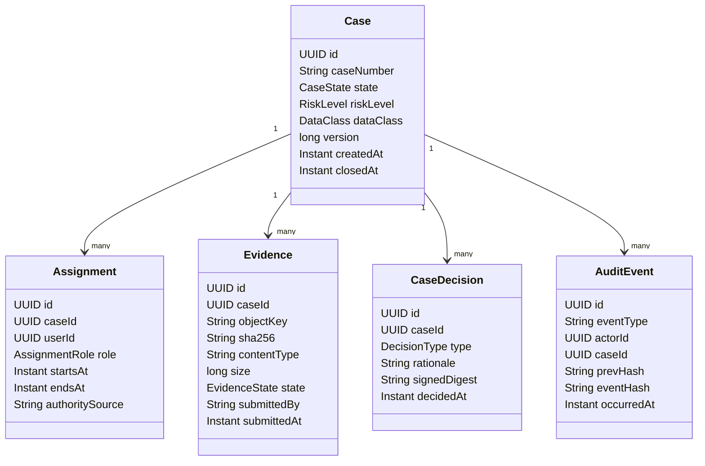
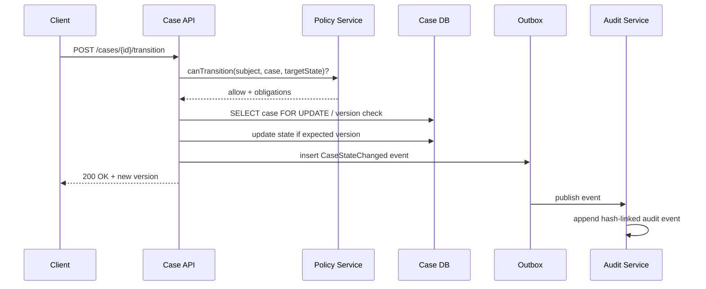
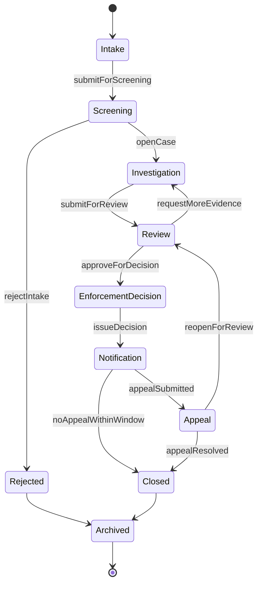
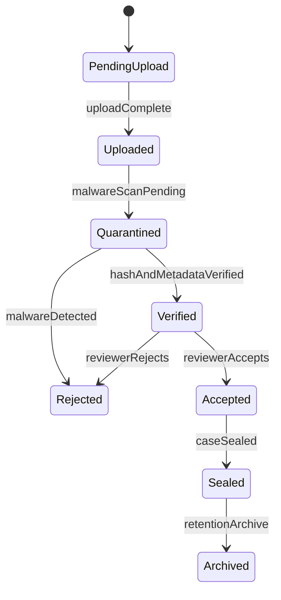
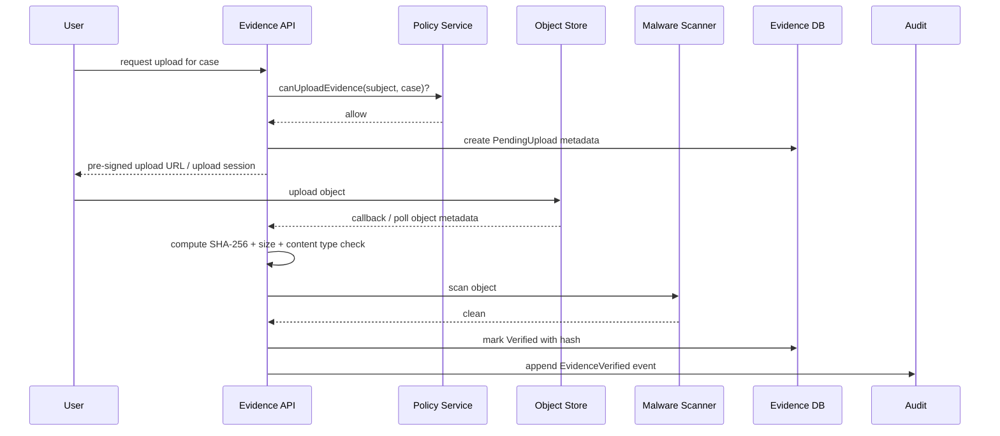
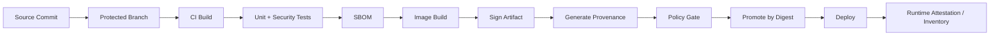
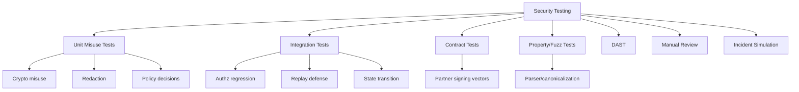
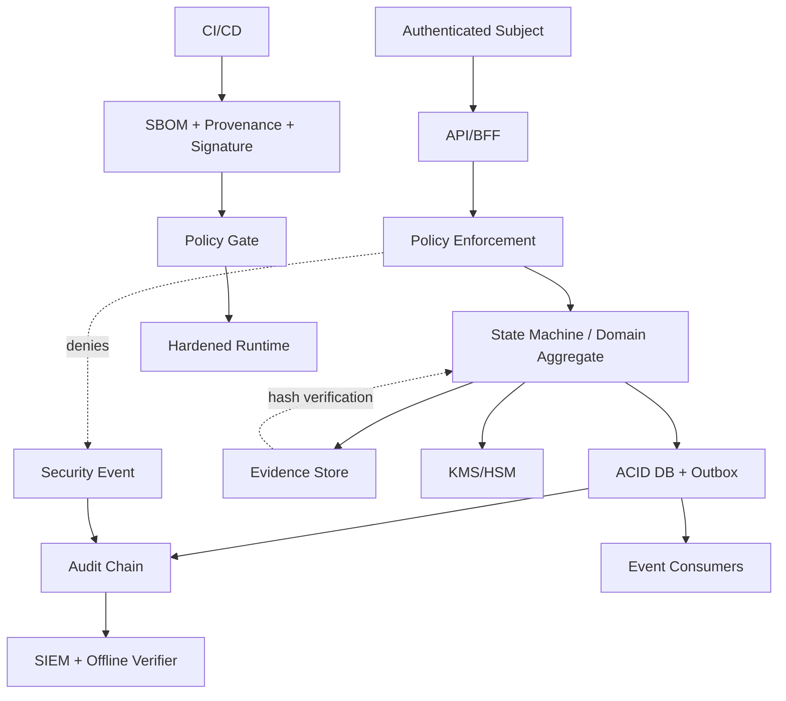

------
title: Learn Java Security, Cryptography and Integrity - Part 034
description: Capstone end-to-end untuk secure regulatory case management platform: threat model, identity, authorization, state machine integrity, evidence handling, audit trail, crypto, supply-chain, runtime, testing, incident readiness, dan defensible architecture.
series: learn-java-security-cryptography-integrity
seriesTitle: Learn Java Security, Cryptography and Integrity
order: 34
partTitle: Capstone: Secure Regulatory Case Management Platform
tags:
  - java
  - security
  - capstone
  - regulatory-systems
  - case-management
  - integrity
  - audit-trail
  - threat-modeling
  - secure-architecture
date: 2026-06-30
---

# Part 034 — Capstone: Secure Regulatory Case Management Platform

> Target part ini: kamu mampu merancang secure Java platform untuk **regulatory case management** yang memiliki identity, authorization, integrity, auditability, evidence handling, workflow state control, secure API, supply-chain integrity, runtime hardening, dan incident readiness. Ini bukan “contoh aplikasi CRUD”; ini adalah capstone yang menggabungkan seluruh seri.

Regulatory case management memiliki security profile yang berat karena sistem ini menyimpan keputusan, bukti, assignment, komunikasi, pemeriksaan, status enforcement, dan audit trail yang bisa berdampak hukum. Kesalahan authorization, log yang tidak defensible, evidence yang bisa diubah tanpa jejak, atau workflow state transition yang bisa dibypass dapat menciptakan kerusakan lebih besar daripada sekadar data leak.

Kita akan mendesain platform bernama **RegCaseX**.

---

## 1. Problem Statement

RegCaseX adalah platform Java untuk lifecycle enforcement case:

1. intake laporan/temuan;
2. screening dan classification;
3. case creation;
4. assignment investigator;
5. evidence collection;
6. review dan escalation;
7. enforcement decision;
8. notification ke pihak terkait;
9. appeal/reconsideration;
10. closure dan archival.

### Security goals

| Goal | Meaning |
|---|---|
| Confidentiality | Case/evidence hanya bisa dilihat oleh user berwenang |
| Integrity | Case state, evidence metadata, dan audit trail tidak bisa dimodifikasi tanpa otorisasi dan jejak |
| Availability | Critical workflow tetap berjalan walau ada partial outage |
| Accountability | Setiap action bisa dikaitkan dengan actor, authority, time, reason, dan source |
| Non-repudiation support | Sistem menyimpan evidence yang mendukung pembuktian tindakan, tanpa mengklaim magic legal certainty |
| Regulatory defensibility | Keputusan teknis bisa dijelaskan, diuji, dan diaudit |

---

## 2. Kaufman Deconstruction for the Capstone

```mermaid
graph TD
  A[Secure Regulatory Case Platform] --> B[Domain Model]
  A --> C[Threat Model]
  A --> D[Identity & Session]
  A --> E[Authorization]
  A --> F[Workflow Integrity]
  A --> G[Evidence Integrity]
  A --> H[Audit & Logging]
  A --> I[Crypto & Key Management]
  A --> J[API Security]
  A --> K[Supply Chain]
  A --> L[Runtime Hardening]
  A --> M[Testing & Incident Readiness]

  B --> B1[Case]
  B --> B2[Evidence]
  B --> B3[Assignment]
  B --> B4[Decision]
  B --> B5[Appeal]

  E --> E1[RBAC]
  E --> E2[ABAC]
  E --> E3[State-aware Policy]
  E --> E4[Conflict of Interest]

  F --> F1[State Machine]
  F --> F2[Transition Guard]
  F --> F3[Optimistic Locking]
  F --> F4[Outbox]

  G --> G1[Hash]
  G --> G2[Object Storage]
  G --> G3[Chain of Custody]
  G --> G4[Tamper Evidence]
```



Minimum effective output dari capstone:

- architecture decision yang masuk akal;
- security invariants yang eksplisit;
- state machine yang enforceable;
- authorization matrix yang tidak role-only;
- evidence integrity model;
- audit trail yang defensible;
- Java implementation skeleton;
- test strategy;
- incident and release evidence model.

---

## 3. Domain Model

### 3.1 Core entities



### 3.2 Critical domain invariants

| Invariant | Why It Matters |
|---|---|
| Case state transition must be explicit and guarded | Prevents workflow bypass |
| Evidence content hash is immutable after acceptance | Detects tampering |
| Assignment determines object-level access | Prevents global role overreach |
| Conflict-of-interest blocks access even for powerful roles | Prevents insider abuse |
| Decision must reference case version and evidence set digest | Prevents decision/evidence mismatch |
| Audit event is append-only and hash-linked | Supports tamper evidence |
| Sealed case requires elevated clearance and reason | Protects sensitive/active cases |
| Every external callback must be signed and replay-resistant | Prevents forged state updates |

---

## 4. System Context and Trust Boundaries

```mermaid
flowchart LR
  U[Internal User Browser] --> WAF[WAF / Edge]
  Partner[External Partner System] --> APIGW[API Gateway]
  WAF --> BFF[Case UI BFF]
  APIGW --> CaseAPI[Case API]
  BFF --> CaseAPI
  CaseAPI --> AuthZ[Policy Decision Service]
  CaseAPI --> DB[(Case DB)]
  CaseAPI --> Obj[(Evidence Object Store)]
  CaseAPI --> Audit[Audit Service]
  CaseAPI --> Outbox[(Outbox)]
  Audit --> AuditStore[(Append-only Audit Store)]
  CaseAPI --> KMS[KMS / HSM]
  IdP[Identity Provider] --> BFF
  IdP --> APIGW
  SIEM[SIEM] <-- Audit
  SIEM <-- CaseAPI

  subgraph Boundary1[Public/External Boundary]
    Partner
    U
  end

  subgraph Boundary2[Edge Trust Boundary]
    WAF
    APIGW
  end

  subgraph Boundary3[Application Trust Boundary]
    BFF
    CaseAPI
    AuthZ
    Audit
  end

  subgraph Boundary4[Data Trust Boundary]
    DB
    Obj
    AuditStore
    KMS
  end
```

### 4.1 Trust boundary rules

| Boundary | Main Risk | Required Control |
|---|---|---|
| Browser to edge | Session theft, CSRF, XSS, clickjacking | Secure cookies, CSRF, CSP, session assurance |
| Partner to gateway | Forged callbacks, replay, schema abuse | mTLS + request signing + timestamp/nonce |
| Gateway to service | Header spoofing | Strip/rewrite identity headers, signed internal identity context |
| Service to database | Injection, privilege overreach | Parameterized queries, least privilege DB account |
| Service to object store | Evidence tampering | Hash verification, object lock, signed metadata |
| Service to KMS | Key misuse | scoped key alias, envelope metadata, audit |
| App to audit store | Log tampering | append-only, hash chain, external anchoring |

---

## 5. Threat Model

### 5.1 Assets

| Asset | Classification | Security Need |
|---|---|---|
| Case metadata | Confidential | Authz, integrity, audit |
| Evidence file | Confidential/Restricted | Encryption, hash, access control, retention |
| Investigator notes | Confidential | Access control, redaction, audit |
| Enforcement decision | High integrity | Signature/digest, approval workflow, audit |
| Assignment record | High integrity | State control, audit, COI enforcement |
| Audit trail | High integrity | Append-only, tamper evidence, retention |
| API signing key | Secret | KMS/vault, rotation, scoped usage |
| Release artifact | Integrity critical | SBOM, signature, provenance |

### 5.2 Threats

| Threat | Scenario | Control |
|---|---|---|
| Unauthorized case read | User guesses `caseId` | Object-level authz, generic deny, security event |
| Assignment manipulation | Insider changes assignment to access case | Dual control for sensitive assignment, audit, alert |
| Evidence replacement | Attacker swaps file in storage | Content hash, object lock, verification on read |
| State bypass | Direct API call moves case from screening to enforcement | State-machine guard, transition policy, version check |
| Replay callback | Partner callback replayed to reopen/close case | HMAC signature, timestamp, nonce cache, idempotency key |
| Token confusion | API accepts token for wrong audience/issuer | Strict OIDC validation |
| Log leakage | Evidence content/token appears in traces | Redaction policy, sensitive field scanner |
| Build compromise | Malicious dependency or unsigned artifact deployed | SCA, dependency verification, SBOM, provenance, signature gate |
| Privilege escalation | Global admin role used to bypass sealed case rule | State-aware ABAC, break-glass workflow, audit |
| Audit tampering | Delete/modify audit rows | Append-only store, hash chain, external anchor |

---

## 6. Architecture Style

RegCaseX should avoid a giant monolith of implicit rules. But microservices are not magic. The architecture should match security boundaries and consistency requirements.

### 6.1 Suggested bounded contexts

| Context | Responsibility | Security Concern |
|---|---|---|
| Case Lifecycle | Case creation, state transition, assignment | Workflow integrity, authz |
| Evidence Management | Upload, metadata, hash verification, storage | Evidence integrity, malware scanning boundary |
| Decision Management | Enforcement decision, approvals, rationale | Non-repudiation support, dual control |
| Audit Service | Append-only security/domain events | Tamper evidence |
| Policy Service | Centralized authorization decision | Consistency and explainability |
| Notification Integration | Outbound notifications and partner callbacks | Request signing, replay defense |

### 6.2 Transaction boundary decision

High-integrity operations should use local ACID transaction for case state + outbox event.



Why not publish directly to Kafka inside request transaction? Because DB update could commit while event publish fails, or event publish succeeds while DB update rolls back. Transactional outbox preserves integrity between state change and event emission.

---

## 7. Identity and Authentication

### 7.1 User types

| User Type | Authentication Requirement |
|---|---|
| Internal investigator | OIDC + MFA/passkey preferred |
| Supervisor | OIDC + MFA/passkey + elevated approval for sensitive action |
| External reviewer | Federated OIDC/SAML with strict issuer mapping |
| Partner system | mTLS + request signing + key rotation |
| Batch worker | Workload identity + short-lived credential |
| Break-glass admin | Strong MFA + just-in-time access + mandatory reason |

### 7.2 Token validation invariant

Every service accepting bearer tokens must validate:

- issuer;
- audience;
- expiry;
- not-before when relevant;
- signature algorithm allowlist;
- key ID resolved from trusted JWKS;
- tenant/realm mapping;
- required assurance/authentication context;
- scope/permission is not enough without object authorization.

### 7.3 Spring Security resource server skeleton

```java
@Bean
SecurityFilterChain apiSecurity(HttpSecurity http) throws Exception {
    return http
            .csrf(csrf -> csrf.disable()) // API uses bearer token; browser BFF handles CSRF separately
            .oauth2ResourceServer(oauth -> oauth.jwt(jwt -> jwt.jwtAuthenticationConverter(jwtConverter())))
            .authorizeHttpRequests(auth -> auth
                    .requestMatchers("/actuator/health").permitAll()
                    .anyRequest().authenticated())
            .build();
}

@Bean
JwtDecoder jwtDecoder() {
    NimbusJwtDecoder decoder = NimbusJwtDecoder
            .withJwkSetUri("https://idp.example.gov/.well-known/jwks.json")
            .build();

    OAuth2TokenValidator<Jwt> issuer = JwtValidators.createDefaultWithIssuer("https://idp.example.gov");
    OAuth2TokenValidator<Jwt> audience = token ->
            token.getAudience().contains("regcasex-case-api")
                    ? OAuth2TokenValidatorResult.success()
                    : OAuth2TokenValidatorResult.failure(new OAuth2Error("invalid_token", "invalid audience", null));

    decoder.setJwtValidator(new DelegatingOAuth2TokenValidator<>(issuer, audience));
    return decoder;
}
```

Do not stop at `.authenticated()`. This only proves a subject exists. It does not prove the subject can access a specific case.

---

## 8. Authorization Model

### 8.1 Subject-action-object-context

```java
public record AuthorizationRequest(
        Subject subject,
        Action action,
        Resource resource,
        CaseContext context
) {}

public record Subject(
        UUID userId,
        Set<String> roles,
        Set<String> clearance,
        String tenantId,
        AuthAssurance assurance
) {}

public record Resource(
        ResourceType type,
        UUID id,
        UUID caseId,
        DataClass dataClass
) {}

public record CaseContext(
        CaseState state,
        RiskLevel riskLevel,
        boolean sealed,
        long caseVersion,
        Set<Assignment> activeAssignments,
        Set<ConflictFlag> conflicts
) {}
```

### 8.2 Authorization invariants

| Invariant | Example |
|---|---|
| Deny by default | Unknown action/resource is denied |
| Role is necessary but not sufficient | Investigator role still needs assignment |
| State matters | Draft evidence can be edited; accepted evidence cannot |
| Conflict overrides role | Assigned investigator with COI flag is denied |
| Sealed case requires clearance and reason | Supervisor role alone is not enough |
| Decision action requires dual control | Creator cannot be sole approver |
| Break-glass is exceptional | Requires reason, short TTL, alert, post-review |

### 8.3 Policy decision result

```java
public record AuthorizationDecision(
        boolean allowed,
        String policyId,
        String reasonCode,
        List<String> obligations
) {
    public static AuthorizationDecision deny(String policyId, String reasonCode) {
        return new AuthorizationDecision(false, policyId, reasonCode, List.of());
    }
}
```

Example obligation:

- `REQUIRE_REASON`
- `EMIT_SECURITY_EVENT`
- `MASK_SENSITIVE_FIELDS`
- `REQUIRE_STEP_UP_AUTH`
- `REQUIRE_SECOND_APPROVER`

### 8.4 Authorization matrix

| Action | Case State | Investigator Assigned | Supervisor | External Reviewer | Break-glass Admin |
|---|---|---:|---:|---:|---:|
| Read case metadata | Any non-sealed | Allow | Allow | Conditional | Allow with reason |
| Read sealed case | Any sealed | Conditional clearance | Conditional clearance | Deny | Allow with reason + alert |
| Upload evidence | Investigation | Allow | Allow | Deny | Deny unless delegated |
| Accept evidence | Investigation/Review | Deny if uploader | Allow | Deny | Allow with reason |
| Transition to enforcement | Review | Deny | Allow with dual control | Deny | Deny by default |
| Close case | Enforcement/Appeal complete | Deny | Allow | Deny | Allow with reason |
| Delete evidence | Any | Deny | Deny | Deny | Deny; use legal retention process |

This table should become tests, not just documentation.

---

## 9. Workflow State Machine Integrity

### 9.1 Case state machine



### 9.2 Transition guard

```java
public interface CaseTransitionGuard {
    TransitionDecision evaluate(CaseAggregate current,
                                CaseTransitionCommand command,
                                Subject subject);
}

public record CaseTransitionCommand(
        UUID caseId,
        CaseState expectedState,
        CaseState targetState,
        long expectedVersion,
        String reason,
        String idempotencyKey
) {}

public record TransitionDecision(
        boolean allowed,
        String reasonCode,
        List<String> obligations
) {}
```

### 9.3 Transition implementation sketch

```java
@Transactional
public CaseView transition(CaseTransitionCommand command, Subject subject) {
    CaseAggregate current = caseRepository.findForUpdate(command.caseId())
            .orElseThrow(NotFoundException::new);

    if (current.version() != command.expectedVersion()) {
        throw new ConflictException("case version changed");
    }

    if (current.state() != command.expectedState()) {
        throw new InvalidTransitionException("unexpected state");
    }

    TransitionDecision decision = transitionGuard.evaluate(current, command, subject);
    if (!decision.allowed()) {
        securityEvents.authorizationDenied(subject, current.id(), decision.reasonCode());
        throw new AccessDeniedException("transition denied");
    }

    CaseAggregate updated = current.transitionTo(command.targetState(), command.reason(), subject.userId());
    caseRepository.save(updated);

    outbox.insert(CaseEvents.stateChanged(updated, command.idempotencyKey()));
    auditBuffer.record(AuditEvents.caseStateChanged(subject, current, updated, command.reason()));

    return CaseView.from(updated);
}
```

Important details:

- state transition uses expected state and expected version;
- authorization is state-aware;
- idempotency key prevents duplicate command effects;
- audit event is created in the same consistency boundary or via reliable outbox;
- direct DB updates bypassing aggregate must be forbidden.

---

## 10. Evidence Upload and Integrity

### 10.1 Evidence lifecycle



### 10.2 Evidence upload sequence



### 10.3 Evidence metadata

```java
public record EvidenceMetadata(
        UUID evidenceId,
        UUID caseId,
        String objectKey,
        String sha256Base64,
        long sizeBytes,
        String detectedMimeType,
        String declaredMimeType,
        EvidenceState state,
        Instant submittedAt,
        UUID submittedBy,
        long version
) {}
```

### 10.4 Evidence integrity rules

- never trust client-supplied hash as proof; compute server-side;
- never use original filename as storage key;
- reject ambiguous/polyglot file types when risk is high;
- store immutable content once accepted;
- use object lock or versioning for accepted evidence;
- verify hash on read for high-value evidence;
- link evidence set digest to decisions;
- never log file content or pre-signed URL;
- scanning boundary must fail closed for high-risk evidence.

### 10.5 Evidence set digest

A decision should reference the exact evidence set considered.

```java
public String evidenceSetDigest(List<EvidenceMetadata> acceptedEvidence) {
    MessageDigest sha256 = MessageDigest.getInstance("SHA-256");

    acceptedEvidence.stream()
            .sorted(Comparator.comparing(EvidenceMetadata::evidenceId))
            .forEach(e -> updateUtf8(sha256,
                    e.evidenceId() + "|" + e.sha256Base64() + "|" + e.sizeBytes() + "\n"));

    return Base64.getEncoder().encodeToString(sha256.digest());
}
```

This does not replace file hash. It binds a decision to a set of evidence references.

---

## 11. Audit Trail and Tamper Evidence

### 11.1 Audit event envelope

```java
public record AuditEnvelope(
        UUID eventId,
        Instant occurredAt,
        String eventType,
        UUID actorId,
        String actorAuthority,
        UUID caseId,
        String sourceIpHash,
        String userAgentHash,
        String requestId,
        String payloadHash,
        String previousEventHash,
        String eventHash,
        String keyId,
        String mac
) {}
```

### 11.2 Hash-linked audit event

```java
public AuditEnvelope seal(AuditDraft draft, String previousHash, SecretKey macKey, String keyId) {
    String canonical = canonicalize(draft, previousHash);
    byte[] eventHash = sha256(canonical.getBytes(StandardCharsets.UTF_8));
    byte[] mac = hmacSha256(macKey, eventHash);

    return new AuditEnvelope(
            draft.eventId(),
            draft.occurredAt(),
            draft.eventType(),
            draft.actorId(),
            draft.actorAuthority(),
            draft.caseId(),
            draft.sourceIpHash(),
            draft.userAgentHash(),
            draft.requestId(),
            draft.payloadHash(),
            previousHash,
            base64(eventHash),
            keyId,
            base64(mac)
    );
}
```

### 11.3 Audit invariants

| Invariant | Explanation |
|---|---|
| Append-only | No update/delete path for audit events |
| Hash-linked | Missing/modified event breaks chain |
| Actor-bound | Event records authenticated actor and authority source |
| Request-bound | Event contains request/correlation ID |
| Content-minimized | Sensitive content is hashed/redacted, not dumped |
| Time-sourced | Uses trusted server time, optionally anchored externally |
| Separately stored | Audit trail not only in same mutable application DB |
| Verifiable | Offline verifier can check chain and MAC/signature |

### 11.4 Event types that matter

- `case.created`
- `case.state.changed`
- `case.assignment.added`
- `case.assignment.revoked`
- `case.sealed`
- `case.unsealed`
- `evidence.upload.requested`
- `evidence.verified`
- `evidence.accepted`
- `decision.drafted`
- `decision.approved`
- `decision.issued`
- `authorization.denied`
- `breakglass.access.granted`
- `security.exception.used`
- `external.callback.accepted`
- `external.callback.rejected`

---

## 12. Cryptography and Key Management

### 12.1 Crypto use cases

| Use Case | Primitive/Profile |
|---|---|
| Evidence file encryption | Envelope encryption with AES-GCM data key wrapped by KMS |
| Request signing | HMAC-SHA-256 or digital signature over canonical request |
| Audit event sealing | HMAC/signature over event hash chain |
| Decision evidence digest | SHA-256/strong digest over canonical evidence set |
| Token/session | OIDC tokens validated, not custom encrypted tokens |
| Password | Strong password hashing handled by identity provider |
| Release artifact | Sigstore/cosign or equivalent signing/provenance |

### 12.2 Key registry

```yaml
keys:
  evidence-data-key:
    type: data-encryption-key
    algorithm: AES-256-GCM
    owner: evidence-platform
    wrapping: kms://regcasex/evidence-master-key
    rotation: 90d
    cryptoperiod: 1y
  partner-webhook-hmac:
    type: mac-key
    algorithm: HMAC-SHA-256
    owner: integration-platform
    rotation: 180d
    supports_dual_validation: true
  audit-chain-mac:
    type: mac-key
    algorithm: HMAC-SHA-256
    owner: audit-platform
    rotation: 180d
    storage: hsm
```

### 12.3 Envelope encryption metadata

```json
{
  "profile": "REGCASEX-EVIDENCE-AES-GCM-V1",
  "keyId": "kms://regcasex/evidence-master-key/2026-06",
  "algorithm": "AES-256-GCM",
  "nonce": "base64...",
  "aad": "caseId|evidenceId|profile|version",
  "ciphertextRef": "object://evidence-bucket/...",
  "tag": "base64..."
}
```

AAD should bind ciphertext to context. Evidence encrypted for one case should not be silently replayable as evidence for another case.

---

## 13. API Security

### 13.1 API design rules

- All external APIs require authentication.
- All object APIs require object-level authorization.
- State mutation requires idempotency key.
- High-risk state mutation requires expected version.
- Partner callbacks require request signing and replay defense.
- Error response must not leak case existence to unauthorized users.
- Public IDs should not expose sequential internal IDs.
- Rate limiting should be per actor, tenant, and sensitive action.
- OpenAPI contract must mark security requirements explicitly.

### 13.2 Example endpoint design

```http
POST /cases/{caseId}/transitions
Authorization: Bearer <token>
Idempotency-Key: 8f6f3d54-4fae-4e21-8e0f-979fb53e3c41
Content-Type: application/json

{
  "expectedState": "INVESTIGATION",
  "targetState": "REVIEW",
  "expectedVersion": 17,
  "reason": "All required evidence collected"
}
```

Server checks:

1. JWT valid;
2. user has assignment and required assurance;
3. target transition allowed;
4. expected state/version match;
5. idempotency key not used with different payload;
6. transition persisted;
7. outbox/audit event created.

### 13.3 Partner callback signing

Canonical string:

```text
v1
POST
/partner/cases/status
caseId=...
x-regcasex-timestamp:2026-06-30T09:00:00Z
x-regcasex-nonce:...
sha256-body:...
```

Headers:

```http
X-RegCaseX-Key-Id: partner-a-2026-06
X-RegCaseX-Timestamp: 2026-06-30T09:00:00Z
X-RegCaseX-Nonce: 3f5b...
X-RegCaseX-Signature: base64(hmac_sha256(secret, canonical))
```

Replay defense:

- reject timestamp outside window;
- reject nonce already seen for key ID;
- store accepted callback idempotency key;
- sign raw body hash, not parsed JSON object;
- keep versioned canonicalization profile.

---

## 14. Data Model and Database Security

### 14.1 Case table sketch

```sql
CREATE TABLE cases (
    id UUID PRIMARY KEY,
    case_number VARCHAR(64) NOT NULL UNIQUE,
    state VARCHAR(64) NOT NULL,
    risk_level VARCHAR(32) NOT NULL,
    data_class VARCHAR(32) NOT NULL,
    sealed BOOLEAN NOT NULL DEFAULT FALSE,
    version BIGINT NOT NULL,
    created_at TIMESTAMP NOT NULL,
    updated_at TIMESTAMP NOT NULL
);

CREATE TABLE case_assignments (
    id UUID PRIMARY KEY,
    case_id UUID NOT NULL REFERENCES cases(id),
    user_id UUID NOT NULL,
    role VARCHAR(64) NOT NULL,
    starts_at TIMESTAMP NOT NULL,
    ends_at TIMESTAMP NULL,
    authority_source VARCHAR(128) NOT NULL,
    created_by UUID NOT NULL,
    created_at TIMESTAMP NOT NULL
);

CREATE TABLE evidence_metadata (
    id UUID PRIMARY KEY,
    case_id UUID NOT NULL REFERENCES cases(id),
    object_key VARCHAR(512) NOT NULL,
    sha256_base64 VARCHAR(128) NOT NULL,
    size_bytes BIGINT NOT NULL,
    state VARCHAR(64) NOT NULL,
    version BIGINT NOT NULL,
    submitted_by UUID NOT NULL,
    submitted_at TIMESTAMP NOT NULL
);
```

### 14.2 DB least privilege

Use separate DB roles/accounts:

| Account | Capability |
|---|---|
| `case_api_rw` | Read/write case tables through app only |
| `audit_writer` | Insert audit events only |
| `audit_reader` | Read audit events for verifier/reporting |
| `migration_runner` | Schema migration, not used by runtime |
| `reporting_ro` | Read-only reporting views, masked fields |

Runtime app should not own schema migration privileges.

---

## 15. Outbox and Event Integrity

### 15.1 Outbox table

```sql
CREATE TABLE outbox_events (
    id UUID PRIMARY KEY,
    aggregate_type VARCHAR(64) NOT NULL,
    aggregate_id UUID NOT NULL,
    event_type VARCHAR(128) NOT NULL,
    event_version INT NOT NULL,
    payload_json TEXT NOT NULL,
    payload_sha256 VARCHAR(128) NOT NULL,
    idempotency_key VARCHAR(128),
    created_at TIMESTAMP NOT NULL,
    published_at TIMESTAMP NULL
);
```

### 15.2 Event invariants

- event schema is versioned;
- event payload hash is stored;
- consumers are idempotent;
- audit-critical events are never silently dropped;
- poison messages go to quarantine with alert;
- replayed events do not duplicate side effects;
- event ordering assumptions are explicit.

---

## 16. Observability Without Data Leakage

### 16.1 Structured log fields

Allowed:

```json
{
  "event": "case.transition.denied",
  "caseIdHash": "...",
  "actorId": "...",
  "reasonCode": "COI_BLOCKED",
  "requestId": "...",
  "policyId": "CASE_TRANSITION_V3",
  "timestamp": "2026-06-30T09:00:00Z"
}
```

Avoid:

```json
{
  "evidenceText": "full extracted document content...",
  "authorizationHeader": "Bearer eyJ...",
  "presignedUrl": "https://object-store/...signature=...",
  "fullDecisionRationaleContainingPII": "..."
}
```

### 16.2 Security signals

- spike in `authorization.denied` by actor;
- repeated access to sealed cases;
- break-glass access;
- callback signature failures;
- replay rejection;
- evidence hash mismatch;
- audit chain verification failure;
- anomalous assignment changes;
- high-risk state transitions outside business pattern;
- expired exception usage.

---

## 17. Supply Chain and Release Integrity

### 17.1 Release requirements

Every production release must have:

- source commit;
- build workflow ID;
- artifact digest;
- container image digest;
- SBOM;
- vulnerability summary;
- signed provenance;
- deployment approval;
- security exception delta;
- rollback plan.

### 17.2 Build/release flow



### 17.3 Deployment policy

Deploy only if:

- artifact digest matches approved release;
- signature/provenance valid;
- no expired security exception;
- critical reachable vulnerabilities are within policy;
- required runtime controls are present;
- migration plan/rollback plan exists for schema changes.

---

## 18. Runtime Hardening

### 18.1 Container baseline

- non-root user;
- read-only root filesystem;
- no privileged mode;
- no hostPath for app containers;
- resource limits;
- restricted egress;
- secrets mounted through approved mechanism;
- short-lived workload identity;
- network policy;
- image pinned by digest;
- JVM flags documented and versioned.

### 18.2 JVM runtime considerations

- Do not rely on Security Manager sandboxing.
- Run with least privilege at OS/container level.
- Disable debug endpoints in production.
- Protect heap dumps/thread dumps because they can contain secrets/PII.
- Control JMX exposure.
- Avoid logging environment and system properties wholesale.
- Use platform-level isolation for untrusted file processing.

---

## 19. Security Testing Strategy

### 19.1 Test pyramid



### 19.2 Critical tests

| Test | Purpose |
|---|---|
| `CaseObjectAuthorizationTest` | Prevent BOLA/IDOR |
| `SealedCaseAccessTest` | Verify clearance + reason enforcement |
| `ConflictOfInterestPolicyTest` | Ensure COI overrides role |
| `CaseTransitionGuardTest` | Prevent invalid workflow transitions |
| `EvidenceHashVerificationTest` | Detect evidence tampering |
| `WebhookReplayTest` | Reject replayed callback |
| `AuditChainVerifierTest` | Detect missing/modified audit event |
| `SensitiveLoggingTest` | Prevent token/PII leak |
| `ReleasePolicyTest` | Ensure artifact cannot deploy without evidence |

### 19.3 Example authorization regression test

```java
@Test
void unassignedInvestigatorCannotReadCaseEvidence() {
    Subject user = subject("investigator-2", Set.of("INVESTIGATOR"));
    CaseContext context = caseContext()
            .state(CaseState.INVESTIGATION)
            .activeAssignments(Set.of(assignment("investigator-1", "PRIMARY")))
            .sealed(false)
            .build();

    AuthorizationDecision decision = policy.evaluate(new AuthorizationRequest(
            user,
            Action.READ_EVIDENCE,
            evidenceResource("case-123", "evidence-999"),
            context
    ));

    assertThat(decision.allowed()).isFalse();
    assertThat(decision.reasonCode()).isEqualTo("NO_ACTIVE_ASSIGNMENT");
}
```

---

## 20. Incident Readiness

### 20.1 Incident scenarios

| Scenario | Immediate Action |
|---|---|
| Evidence hash mismatch | Quarantine evidence, block decision use, investigate storage/object version |
| Audit chain break | Freeze audit exports, verify anchors/backups, escalate |
| Partner signing key leak | Revoke key, switch to secondary, reject old key, notify partner |
| Unauthorized sealed case access | Disable account/session, review break-glass, notify compliance |
| Critical dependency exploit | Determine reachability, patch/mitigate, emergency release |
| Build provenance mismatch | Block deployment, investigate CI/build system compromise |
| Token validation bypass | Rotate keys if needed, patch validators, invalidate sessions |

### 20.2 Evidence preservation

During incident:

- preserve relevant audit events;
- snapshot affected object versions;
- preserve deployment digest/provenance;
- preserve identity/session logs;
- record response decisions;
- maintain chain of custody for exported evidence;
- avoid ad-hoc DB updates that destroy forensic value.

---

## 21. Security Decision Records for RegCaseX

Minimum SDRs:

1. authorization model and policy enforcement location;
2. case state machine and transition guard;
3. evidence storage and hash verification model;
4. audit trail tamper-evidence model;
5. partner callback signing profile;
6. OIDC issuer/audience/assurance mapping;
7. key management and rotation model;
8. release signing/provenance model;
9. runtime hardening baseline;
10. break-glass access model.

Example:

```md
# SDR-REGCASEX-004: Evidence Integrity Model

Status: Accepted

## Decision
Accepted evidence is immutable. The system computes SHA-256 server-side after upload, stores hash in evidence metadata, enables object versioning/object lock, and verifies hash before evidence is used in enforcement decision packet.

## Rationale
Regulatory decision must be bound to exact evidence content. Metadata-only audit is insufficient because object storage content could be replaced outside application path.

## Consequences
- Evidence processing must handle hash verification failure.
- Object lifecycle policy must preserve accepted versions.
- Large files require streaming digest.
- Decision service must reference evidence set digest.
```

---

## 22. Failure Mode Analysis

| Component | Failure | Impact | Mitigation |
|---|---|---|---|
| Policy Service | Unavailable | Case actions blocked | Local cached deny-safe policy for read-only low-risk, fail closed for mutation |
| KMS | Unavailable | Cannot decrypt/upload evidence | Retry/backoff, queue non-critical processing, availability SLO |
| Audit Service | Unavailable | Security event loss risk | Local durable outbox, block high-risk mutation if audit cannot be guaranteed |
| Object Store | Partial outage | Evidence unavailable | Retry, multi-zone storage, decision workflow aware of unavailable evidence |
| IdP | Unavailable | Login/session refresh impact | Session TTL strategy, emergency access policy |
| DB | Write conflict | Transition failure | Optimistic lock retry for safe commands, explicit conflict response |
| Malware Scanner | Down | Evidence verification blocked | Fail closed for restricted evidence, quarantine |
| SIEM | Down | Alert delay | Buffer/forwarder retry, local audit unaffected |
| CI Signing | Fails | Release blocked | Fix pipeline, no unsigned release except emergency process |

---

## 23. Capstone Review Checklist

### Identity

- [ ] Token issuer and audience are pinned.
- [ ] Authentication assurance is mapped to sensitive actions.
- [ ] Break-glass access has reason, TTL, alert, and review.
- [ ] Service-to-service identity is workload-based and short-lived.

### Authorization

- [ ] Object-level authorization exists for case/evidence/decision.
- [ ] Role-only access is insufficient for sensitive resources.
- [ ] Case state and assignment are included in policy context.
- [ ] Conflict-of-interest blocks access.
- [ ] Authorization denial emits safe security event.

### Workflow integrity

- [ ] All state transitions go through transition guard.
- [ ] Expected state and version are required for mutation.
- [ ] Idempotency keys prevent duplicate side effects.
- [ ] Direct database update path is controlled.

### Evidence integrity

- [ ] Server computes evidence hash.
- [ ] Accepted evidence is immutable/versioned.
- [ ] Decision references evidence set digest.
- [ ] Evidence read path can verify hash.
- [ ] Malware scanning fail mode is defined.

### Audit

- [ ] Audit events are append-only.
- [ ] Audit chain is hash-linked/MACed/signed.
- [ ] Audit content is minimized and redacted.
- [ ] Offline verifier exists.
- [ ] Audit retention matches regulatory need.

### API

- [ ] Partner callbacks are signed and replay-resistant.
- [ ] CORS is not used as authorization.
- [ ] Browser workflows have CSRF defense.
- [ ] Error responses avoid case existence leaks.

### Supply chain/runtime

- [ ] SBOM, signature, and provenance exist.
- [ ] Runtime image is pinned by digest.
- [ ] Container runs as non-root.
- [ ] Sensitive logs are blocked/redacted.
- [ ] Secrets are not committed or dumped.

---

## 24. Final Architecture Summary



The architecture is secure not because it has many tools, but because its invariants are explicit:

- identity is verified;
- authorization is contextual;
- workflow transitions are guarded;
- evidence is immutable and hash-bound;
- audit is append-only and tamper-evident;
- crypto has key lifecycle;
- APIs are replay-resistant;
- release artifacts are traceable;
- runtime is least privilege;
- tests prove the controls.

---

## 25. Capstone Exercise

Build a minimal RegCaseX slice:

1. `CaseAggregate` with state machine and optimistic version.
2. `PolicyService` with subject-action-object-context model.
3. `EvidenceMetadataService` with server-side SHA-256.
4. `AuditChainService` with hash-linked events.
5. `PartnerCallbackVerifier` with HMAC + timestamp + nonce.
6. `CaseTransitionGuardTest` with invalid transitions.
7. `AuthorizationRegressionTest` for BOLA/IDOR.
8. `AuditChainVerifierTest` for tamper detection.
9. CI policy that blocks unsafe crypto usage.
10. Release evidence folder with SBOM placeholder, digest, and decision record.

Do not start with full UI. Start with invariants and tests. UI without invariant enforcement is security theater.

---

## 26. Interview-Grade Questions

1. Why is role-based authorization insufficient for regulatory case access?
2. How do you bind an enforcement decision to the exact evidence considered?
3. What is the difference between audit logging and tamper-evident audit trail?
4. How should a case state transition be protected against race conditions and replay?
5. When should audit service failure block business mutation?
6. How do you prevent a partner callback from being forged or replayed?
7. How would you design break-glass access without making it a universal bypass?
8. Why should release artifact digest be part of regulatory evidence?
9. How do you avoid leaking sensitive data through observability?
10. What incident evidence would you preserve after an unauthorized sealed-case access?

---

## 27. Summary

RegCaseX is a capstone because it forces every security topic to become concrete:

- OAuth/OIDC proves identity, but object-level authorization decides access.
- State machine integrity prevents workflow bypass.
- Evidence hashing and immutability protect decision basis.
- Audit chain design supports defensible reconstruction.
- KMS/HSM and crypto metadata prevent ad-hoc cryptography.
- Request signing protects partner integration beyond TLS termination.
- SBOM, provenance, signing, and runtime hardening protect delivery integrity.
- Tests convert security requirements into executable confidence.

A top-tier engineer does not merely add security controls. They design systems where critical business invariants are hard to violate, easy to verify, and possible to defend under audit or incident pressure.

---

## 28. References

- Java Security Overview and JCA/JCE documentation
- Java Secure Socket Extension (JSSE) documentation
- OWASP ASVS
- OWASP Authorization Cheat Sheet
- OWASP Logging Cheat Sheet
- OWASP File Upload Cheat Sheet
- OWASP SSRF Prevention Cheat Sheet
- NIST SP 800-218 SSDF
- NIST SP 800-57 Key Management
- NIST SP 800-63 Digital Identity Guidelines
- RFC 9421 HTTP Message Signatures
- RFC 8785 JSON Canonicalization Scheme
- SLSA Supply-chain Levels for Software Artifacts
- Kubernetes Pod Security Standards
