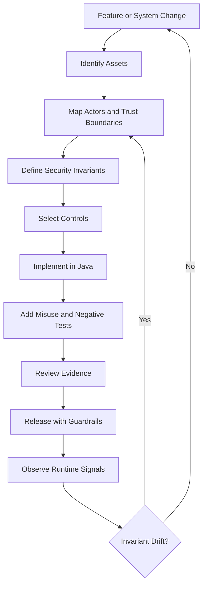
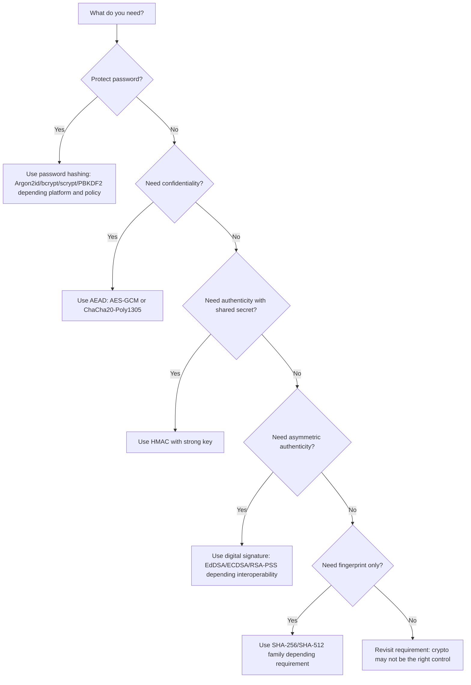
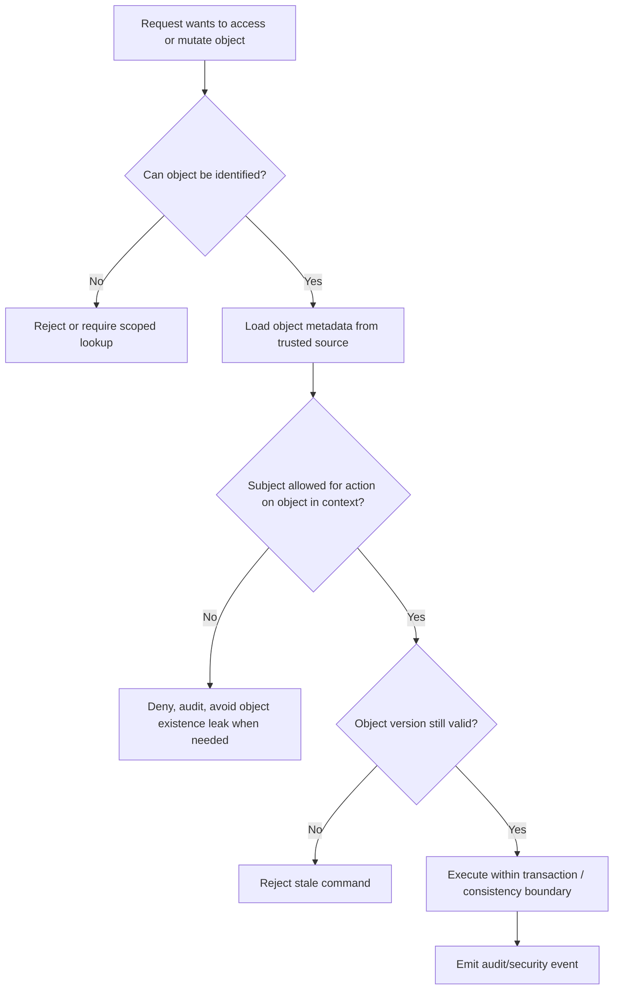
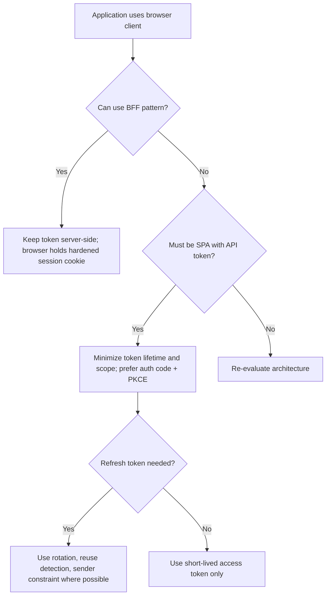
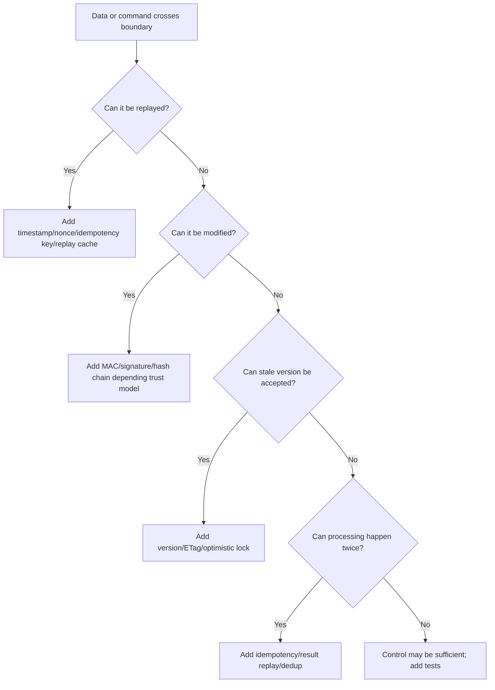
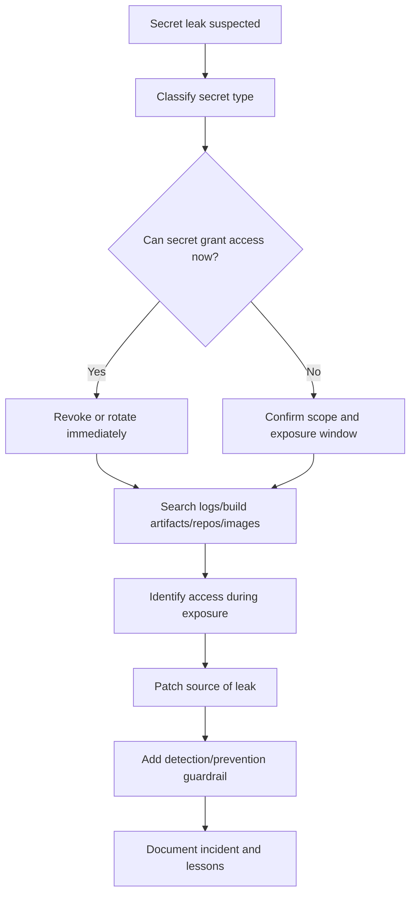

------
title: Learn Java Security, Cryptography and Integrity - Part 035
description: Field guide terakhir untuk mengoperasikan Java security secara production-grade: checklist, playbook, decision tree, review rubric, final assessment, dan peta praktik setelah menyelesaikan seri.
series: learn-java-security-cryptography-integrity
seriesTitle: Learn Java Security, Cryptography and Integrity
order: 35
partTitle: Field Guide, Checklists, Playbooks & Final Assessment
tags:
  - java
  - security
  - cryptography
  - integrity
  - secure-engineering
  - field-guide
  - checklist
  - playbook
  - final-assessment
date: 2026-06-30
---

# Part 035 — Field Guide, Checklists, Playbooks & Final Assessment

Part ini adalah **bagian terakhir** dari seri `learn-java-security-cryptography-integrity`.

Tujuannya bukan menambah teori baru, tetapi mengubah seluruh materi sebelumnya menjadi **field guide** yang bisa dipakai saat:

- merancang sistem Java baru,
- melakukan security review sebelum release,
- menilai design existing system,
- melakukan triage vulnerability,
- membangun security operating model,
- menilai readiness diri sendiri sebagai engineer security-aware.

Mental model utama:

> Security production-grade bukan kumpulan library, annotation, framework, atau checklist statis. Security adalah kemampuan sistem untuk mempertahankan invariant penting ketika input, actor, dependency, runtime, network, clock, identity, dan proses delivery tidak sepenuhnya bisa dipercaya.

Di level top engineer, pertanyaannya bukan lagi:

> “Pakai algoritma apa?”

Tetapi:

> “Invariant apa yang harus tetap benar, siapa yang bisa melanggarnya, boundary mana yang memvalidasi, evidence apa yang membuktikan, dan bagaimana kita tahu ketika invariant itu gagal?”

---

## 1. Kaufman Closure: Apa Skill Ini Sebenarnya?

Dalam framework Josh Kaufman, belajar efektif dimulai dengan deconstruction, lalu cukup belajar untuk self-correct, menghilangkan hambatan praktik, dan deliberate practice.

Setelah 34 part sebelumnya, skill Java Security, Cryptography and Integrity bisa didekonstruksi menjadi 9 kemampuan operasional.

| Capability | Pertanyaan inti | Bukti kompetensi |
|---|---|---|
| Threat modeling | Apa yang bisa disalahgunakan? | Threat model punya asset, actor, trust boundary, attack path, dan invariant. |
| Secure design | Apa yang harus tetap benar? | Requirement security bisa diuji dan bukan sekadar “harus aman”. |
| Secure coding boundary | Di mana data tidak dipercaya berubah menjadi trusted? | Input validation, canonicalization, output encoding, parser hardening, dan authorization terjadi di boundary yang tepat. |
| Cryptography engineering | Data apa yang butuh confidentiality, integrity, authenticity, freshness? | Crypto envelope punya algorithm metadata, key id, nonce/IV, AAD, version, dan migration path. |
| Identity & access | Siapa melakukan apa terhadap objek mana dalam konteks apa? | Authn, session, OAuth/OIDC, RBAC/ABAC/ReBAC, dan object-level authorization konsisten. |
| Distributed integrity | Bagaimana mencegah replay, double execution, tampering, stale decision? | Idempotency, optimistic concurrency, versioning, event ordering, and reconciliation terdesain. |
| Evidence & audit | Bagaimana membuktikan apa yang terjadi? | Audit trail append-only, tamper-evident, actor-bound, time-aware, dan verifiable. |
| Supply-chain & runtime | Apakah yang kita build sama dengan yang kita deploy dan jalankan? | SBOM, provenance, signing, policy gate, non-root runtime, least privilege, and egress control. |
| Operating model | Bagaimana security tetap jalan saat tim tumbuh? | Security requirement, review rubric, exception process, metrics, and incident playbook tersedia. |

---

## 2. The Security Engineering Loop

Gunakan loop ini untuk setiap fitur penting.



Loop ini sengaja tidak dimulai dari tool. Tool hanya berguna setelah invariant jelas.

Contoh invariant yang baik:

```text
A case officer can approve an enforcement action only if:
1. the officer is currently assigned to the case,
2. the case is in REVIEW_READY state,
3. there is no newer version of the case after the officer opened the review screen,
4. the approval command is bound to the officer identity and request id,
5. the approval creates a tamper-evident audit event,
6. downstream publication uses the exact approved evidence version.
```

Itu jauh lebih kuat daripada requirement seperti:

```text
System must be secure and only authorized users can approve.
```

---

## 3. Master Checklist: Secure Java System Readiness

Checklist ini dipakai untuk menilai sistem Java production sebelum release atau saat architecture review.

### 3.1 Asset and Trust Boundary

| Check | Good signal | Bad signal |
|---|---|---|
| Asset inventory jelas | Data, credential, key, event, file, decision, audit record, token, dan artifact terdaftar | Tim hanya bicara endpoint dan table |
| Trust boundary eksplisit | Diagram menunjukkan browser, API, worker, database, broker, object storage, KMS, IdP, CI/CD | Semua service dianggap internal dan trusted |
| Actor model lengkap | Human user, service account, admin, batch job, support engineer, attacker, compromised dependency | Hanya ada “user” |
| Abuse case tersedia | Ada misuse path untuk privilege escalation, replay, stale data, tampering, exfiltration | Hanya happy path |

### 3.2 Authentication and Session

| Check | Expected engineering decision |
|---|---|
| Password storage | Password tidak dienkripsi reversible; gunakan password hashing yang didesain untuk password storage, dengan salt unik dan parameter yang bisa dinaikkan. |
| MFA/passkey | High-risk action memakai step-up atau phishing-resistant authentication bila risiko menuntut. |
| Recovery | Account recovery tidak lebih lemah dari login utama. |
| Session token | Token cukup random, cookie hardened, rotation saat privilege change, revocation path jelas. |
| Browser storage | Access token tidak asal disimpan di tempat yang mudah dieksfiltrasi oleh XSS. |
| Service authentication | Service-to-service authentication memakai mTLS, signed token, workload identity, atau mekanisme kuat lain; bukan shared static secret tanpa lifecycle. |

### 3.3 Authorization

| Check | Expected engineering decision |
|---|---|
| Deny by default | Default policy menolak akses jika rule tidak ditemukan. |
| Object-level check | Setiap object access memverifikasi subject-action-object-context, bukan hanya role global. |
| Tenant isolation | Tenant boundary enforced di query, policy, cache key, search index, file path, and event stream. |
| Admin access | Admin action tetap punya authorization, audit, reason code, dan ideally approval/dual control untuk high-risk action. |
| Policy drift | Policy punya owner, version, test matrix, dan regression tests. |
| Cache safety | Authorization decision cache mempertimbangkan subject, object, action, tenant, policy version, and expiry. |

### 3.4 Cryptography and Key Management

| Check | Expected engineering decision |
|---|---|
| Primitive sesuai tujuan | Hash untuk fingerprint, HMAC untuk authenticity dengan shared secret, signature untuk asymmetric authenticity, AEAD untuk confidentiality + integrity. |
| No custom crypto | Tidak ada homemade cipher, homemade MAC, homemade token format tanpa review ketat. |
| AEAD usage | AES-GCM/ChaCha20-Poly1305 memakai nonce/IV unik per key dan AAD untuk context binding. |
| Envelope metadata | Ciphertext menyimpan version, algorithm, key id, nonce/IV, tag, AAD reference, and created-at. |
| Key lifecycle | Key generation, storage, rotation, revocation, destruction, and compromise response terdokumentasi. |
| Crypto agility | Migration path tersedia untuk mengganti algorithm/provider/key tanpa rewrite data total. |
| Provider decision | Provider JCA/JCE dipilih secara eksplisit untuk requirement seperti FIPS, HSM, PKCS#11, performance, atau interoperability. |

### 3.5 Data Integrity and Distributed Systems

| Check | Expected engineering decision |
|---|---|
| Idempotency | Command eksternal atau payment-like operation memakai idempotency key dan result replay yang aman. |
| Freshness | High-risk command punya timestamp/version/nonce/window untuk mencegah replay dan stale action. |
| Versioning | Aggregate update memakai optimistic concurrency atau equivalent guard. |
| Event integrity | Event punya schema version, event id, producer identity, causality/correlation id, and deduplication strategy. |
| Outbox/inbox | Cross-boundary side effect memakai outbox/inbox atau compensating pattern yang jelas. |
| Derived data | Projection/search/report bisa direkonsiliasi terhadap source of truth. |

### 3.6 Files, Parsers, and Serialization

| Check | Expected engineering decision |
|---|---|
| File upload | Extension allowlist, generated filename, size limit, storage isolation, scan pipeline, and authorization. |
| MIME trust | `Content-Type` dari client tidak dipercaya sebagai authority. |
| Parser hardening | XML/JSON/YAML/CSV parser dikonfigurasi untuk mencegah XXE, expansion attack, duplicate key ambiguity, and unsafe polymorphic binding. |
| Java serialization | Tidak menerima native Java serialized object dari untrusted input. Jika legacy unavoidable, gunakan allowlist filter dan migration plan. |
| Canonicalization | Data yang di-hash/sign punya canonical form yang deterministic. |

### 3.7 Observability, Audit, and Evidence

| Check | Expected engineering decision |
|---|---|
| Security event taxonomy | Login, logout, authz deny, privilege change, key use, data export, policy change, admin action, and suspicious replay tercatat. |
| Sensitive data control | Log, trace, metric, error page, and audit payload tidak membocorkan secret, token, password, private key, PII yang tidak perlu. |
| Tamper evidence | Audit event penting hash-chained, signed/HMACed, anchored, atau disimpan di append-only store. |
| Actor binding | Audit event menyimpan actor, authority source, session/service identity, reason, and target object version. |
| Operational signal | Alert mendeteksi invariant violation, bukan hanya CPU tinggi. |

### 3.8 Supply Chain, Build, and Runtime

| Check | Expected engineering decision |
|---|---|
| Dependency verification | Maven/Gradle dependency source, checksum/signature, lock, and repository policy dikontrol. |
| SBOM | Artifact punya SBOM dan vulnerability triage path. |
| Build provenance | Release bisa membuktikan source, build workflow, artifact digest, signer, and promotion path. |
| Container hardening | Non-root user, read-only filesystem jika memungkinkan, dropped capabilities, no privileged container, resource limit, and restricted egress. |
| Secret delivery | Secret tidak baked ke image, log, artifact, or build output. |
| Runtime identity | Workload identity scoped minimal, rotated, and observable. |

---

## 4. Decision Trees

Decision tree membantu mengurangi keputusan ad-hoc.

### 4.1 Crypto Primitive Decision Tree



Rule of thumb:

- **Never encrypt passwords** for storage.
- **Never use plain hash as authentication** if attacker can choose input and compare result.
- **Never use encryption without integrity** for sensitive data.
- **Never design a token format** without expiry, audience, issuer, key id, signature/MAC, and validation rules.
- **Never sign ambiguous data**; canonicalize first.

### 4.2 Authorization Placement Decision Tree



Authz check yang baik dekat dengan object dan mutation, bukan hanya di controller.

### 4.3 Token Storage Decision Tree



### 4.4 Data Integrity Control Decision Tree



---

## 5. Review Rubrics

### 5.1 Architecture Review Rubric

Use this rubric when reviewing a new service, module, or high-risk feature.

| Area | Questions |
|---|---|
| Business criticality | What decision, money, legal status, personal data, enforcement state, or operational capability does this feature affect? |
| Asset classification | What must remain confidential, integral, available, auditable, non-replayable, or non-repudiable? |
| Trust boundary | Where does input cross from untrusted to trusted? Where does authority cross service boundary? |
| Identity | What identity is used: human, service, workload, batch, admin, delegated actor? |
| Authorization | Is access checked against object and context? How does tenant isolation work? |
| Crypto | What property is crypto expected to provide? What is key lifecycle? How is metadata stored? |
| Integrity | How do we handle replay, stale command, duplicate event, out-of-order processing, and tampering? |
| Observability | What security events prove normal and abnormal behavior? |
| Failure mode | Does failure deny safely? Does degraded mode accidentally bypass control? |
| Operations | Who owns policy, key, alert, incident response, and exception approval? |

### 5.2 Secure Code Review Rubric

Read code by boundary, not by file order.

| Boundary | Review focus |
|---|---|
| Controller/API | Request size, authentication, CSRF/CORS, schema validation, object lookup leakage, idempotency. |
| Service layer | Authorization near business decision, transaction boundary, state transition invariant, stale update protection. |
| Repository/query | Tenant filter, injection prevention, optimistic locking, data classification, soft delete pitfalls. |
| Messaging | Producer identity, schema version, idempotent consumer, dedup, replay, poison message handling. |
| Crypto utility | Algorithm, mode, nonce/IV, key id, provider, envelope format, error handling, test vectors. |
| File handling | Filename, path traversal, MIME trust, temporary file lifecycle, scanning, storage access policy. |
| Logging | Secret/PII leakage, log injection, audit completeness, tamper evidence. |
| Config | Secret source, dangerous default, environment-specific drift, debug flags, fail-open fallback. |
| Dependency | Unsafe transitive dependency, vulnerable version, unwanted module, dependency confusion. |

### 5.3 Vulnerability Triage Rubric

Do not triage only by CVSS. Ask:

1. **Reachability** — Can attacker reach vulnerable code path?
2. **Exploit precondition** — Does attacker need auth, tenant membership, network adjacency, specific state, or secret?
3. **Impact type** — Confidentiality, integrity, availability, privilege, evidence, regulatory exposure?
4. **Blast radius** — Single object, tenant, environment, region, all customers?
5. **Compensating control** — Is there WAF, egress block, sandbox, allowlist, disabled feature, authentication, or runtime restriction?
6. **Exploit maturity** — Is exploit public, weaponized, actively exploited, or theoretical?
7. **Fix risk** — Does patch change behavior, crypto format, schema, or migration path?
8. **Verification** — What test proves fix and prevents regression?

Output triage should look like this:

```text
Finding: Unsafe XML parser accepts external entity expansion in document import.
Reachability: Authenticated case officer can upload XML import file.
Impact: SSRF and local file disclosure possible if parser resolves external entities.
Blast radius: Per import worker pod; possible internal metadata endpoint exposure if egress open.
Severity decision: High.
Immediate mitigation: Disable external entity and DTD processing, block metadata IP egress, add size limits.
Permanent fix: Harden parser factory, add malicious corpus tests, add import sandbox policy.
Evidence: Negative test with XXE payload fails closed; runtime egress policy denies metadata endpoint.
Owner: Case ingestion team.
```

---

## 6. Playbooks

### 6.1 Playbook: Designing a New Secure Java API

1. Define assets and actor types.
2. Draw trust boundary and data flow.
3. Define security invariants.
4. Choose authentication model.
5. Define authorization rule as subject-action-object-context.
6. Define request validation and canonicalization.
7. Define idempotency/replay protection.
8. Define error behavior and object existence leakage policy.
9. Define audit event schema.
10. Add negative tests before release.

Minimal API security design record:

```md
# Security Design Record: Approve Enforcement Action API

## Asset
- Enforcement action approval decision
- Evidence bundle version
- Audit trail

## Actors
- Assigned officer
- Supervisor
- Service account: notification-worker
- Malicious authenticated user

## Trust Boundaries
- Browser -> API
- API -> database
- API -> audit event store
- API -> notification outbox

## Invariants
- Only assigned officer or authorized supervisor can approve.
- Approval applies to the reviewed evidence version only.
- Duplicate approval command returns same result, not a second approval.
- Every approval produces tamper-evident audit event.

## Controls
- Session auth + step-up for high-risk action
- Object-level authz
- Optimistic lock on case version
- Idempotency key
- Audit event hash chain

## Negative Tests
- User from another tenant cannot approve.
- Assigned officer cannot approve stale version.
- Replay of same request does not create duplicate transition.
- Tampered evidence hash fails verification.
```

### 6.2 Playbook: Crypto Design Review

Use this whenever code encrypts, decrypts, signs, verifies, hashes, derives keys, or creates tokens.

1. State the required security property.
2. Identify attacker capability.
3. Select primitive based on property, not familiarity.
4. Define key owner and lifecycle.
5. Define algorithm/provider/version metadata.
6. Define nonce/IV/randomness requirement.
7. Define associated data/canonical data.
8. Define error handling and logging rules.
9. Define rotation and migration.
10. Add test vectors and misuse tests.

Crypto design smell list:

- `Cipher.getInstance("AES")`
- `SHA-256(password)` for password storage
- static IV or reused nonce
- encryption without authentication
- custom JWT-like token
- catch-all crypto exception that returns plaintext fallback
- decrypting before verifying metadata/context
- no key id in ciphertext
- no algorithm/version metadata
- signing JSON without canonicalization
- logging plaintext secret or decrypted payload

### 6.3 Playbook: Suspected Secret Leak



Actions:

- Rotate leaked secret, do not only delete from repository.
- Check CI logs, artifact registry, container layers, ticket comments, paste tools, chat, and telemetry.
- Review access logs for usage during exposure window.
- Add pre-commit scanning and server-side secret scanning.
- Replace long-lived static secret with workload identity or short-lived credential where possible.

### 6.4 Playbook: Dependency Vulnerability

1. Identify exact artifact, version, path, and module.
2. Determine whether vulnerable code is reachable.
3. Check whether exploit is public/active.
4. Decide: upgrade, patch, disable feature, replace dependency, or add compensating control.
5. Generate regression test if vulnerability is app-reachable.
6. Update SBOM and release evidence.
7. Record risk acceptance only with expiry and owner.

Good vulnerability ticket:

```text
Artifact: org.example:parser-lib:1.2.3
Path: api-service -> ingestion-module -> parser-lib
Finding: CVE affecting expression evaluation in parser templates
Reachability: reachable through /imports endpoint when XML template option enabled
Exploitability: authenticated user can upload crafted template
Impact: remote code execution inside import worker pod
Fix: upgrade to 1.2.8 and disable template extension by default
Compensating control: import worker runs non-root, no cloud metadata egress, read-only filesystem
Verification: malicious template test fails; SBOM updated; container redeployed by digest
```

### 6.5 Playbook: Authorization Bug

1. Freeze or limit affected action if high-impact.
2. Identify object types and tenants affected.
3. Query audit logs for suspicious cross-object or cross-tenant access.
4. Add missing object-level authorization check near mutation/read boundary.
5. Add regression test for same role but different object/tenant.
6. Review caches, projections, search indexes, exports, and async consumers.
7. Notify stakeholders if data exposure occurred.

Common root causes:

- Controller checks role, service method assumes object ownership.
- Query fetches by id without tenant filter.
- Cache key lacks tenant/user/policy version.
- Export endpoint uses broader repository method than UI list endpoint.
- Admin/support endpoint bypasses normal policy engine.

### 6.6 Playbook: Audit Integrity Failure

Use this if audit data is missing, mutable, inconsistent, or unverifiable.

1. Classify affected audit event types.
2. Identify whether source business action is still reliable.
3. Compare application state, database history, outbox, broker offsets, and log records.
4. Reconstruct evidence with confidence level.
5. Patch producer transaction boundary.
6. Add outbox or atomic append mechanism.
7. Add verifier job for hash chain, sequence gaps, and actor binding.
8. Document gap and remediation evidence.

---

## 7. Java Security Field Patterns

### 7.1 Security Invariant as Code Comment

Use comments only when they state invariant that code enforces.

```java
// Security invariant:
// Approval must apply to the exact case version reviewed by the officer.
// Without this guard, a stale browser tab can approve evidence added later.
if (!command.reviewedVersion().equals(caseAggregate.version())) {
    throw new StaleDecisionException(caseId);
}
```

Bad comment:

```java
// Check security
checkPermission(user);
```

### 7.2 Fail Closed Without Becoming Unusable

Fail closed means unsafe action is denied when security dependency is uncertain. It does not mean every partial outage must take the whole platform down.

| Dependency failure | Safer behavior |
|---|---|
| Policy engine unavailable | Deny high-risk mutations; allow low-risk read only if cached policy is fresh and explicitly permitted. |
| KMS unavailable | Do not decrypt by fallback key; queue retry if business acceptable. |
| Audit sink unavailable | For critical action, fail transaction or write to durable local outbox; never silently drop. |
| IdP/JWKS unavailable | Use cached keys until safe expiry; do not accept unsigned token or skip issuer validation. |
| Revocation service unavailable | Step-up or deny high-risk action; do not assume token is valid forever. |

### 7.3 Evidence Packet Pattern

For sensitive decision systems, release or business action should produce evidence packet.

```json
{
  "actionId": "act_2026_00091",
  "actionType": "CASE_APPROVED",
  "actor": {
    "type": "HUMAN_USER",
    "subjectId": "usr_123",
    "authnMethod": "PASSKEY",
    "sessionIdHash": "..."
  },
  "authority": {
    "policyVersion": "case-policy-2026.06.1",
    "decisionId": "pdp_dec_789"
  },
  "target": {
    "caseId": "case_456",
    "caseVersion": 17,
    "evidenceHash": "sha256:..."
  },
  "integrity": {
    "eventHash": "sha256:...",
    "previousEventHash": "sha256:...",
    "signatureKeyId": "audit-signing-2026-q2"
  }
}
```

The packet should be independently verifiable enough to answer:

- Who acted?
- Under what authority?
- Against which object version?
- With what evidence?
- When did it happen?
- Was the audit event modified later?

---

## 8. Final Assessment

The final assessment is designed to test engineering judgment, not memorization.

### 8.1 Level 1 — Recognize Dangerous Defaults

You should immediately notice problems like:

```java
Cipher cipher = Cipher.getInstance("AES");
```

```java
String passwordHash = sha256(password);
```

```java
if (user.hasRole("OFFICER")) {
    approveCase(caseId);
}
```

```java
objectMapper.enableDefaultTyping();
```

```java
DocumentBuilderFactory.newInstance().newDocumentBuilder().parse(input);
```

```java
log.info("token={}", accessToken);
```

Expected response is not just “bad”. You should explain:

- what invariant is missing,
- how it can be exploited,
- what safe alternative is,
- how to test the fix.

### 8.2 Level 2 — Design Secure Flow

Design an API for approving a regulatory enforcement action.

Minimum answer should include:

- authenticated actor identity,
- object-level authorization,
- tenant boundary,
- state transition guard,
- optimistic lock/stale decision prevention,
- idempotency,
- audit event,
- evidence hash,
- notification outbox,
- negative tests.

### 8.3 Level 3 — Review Crypto Envelope

Given encrypted database field:

```json
{
  "ciphertext": "...",
  "iv": "..."
}
```

Identify missing fields:

- algorithm,
- key id,
- version,
- authentication tag if not included,
- associated data/context,
- created-at,
- rotation status,
- provider/format identifier if needed.

Explain why each matters.

### 8.4 Level 4 — Incident Reasoning

A dependency vulnerability is reported in a JSON parser.

You should be able to produce:

- reachability analysis,
- exploit preconditions,
- affected data flows,
- runtime compensating controls,
- patch strategy,
- regression test,
- SBOM/provenance update,
- risk acceptance criteria if patch delayed.

### 8.5 Level 5 — Operating Model

You are ready at a senior/top-tier level when you can define:

- which teams own which security controls,
- how exception approval works,
- how key rotation is rehearsed,
- how authz policy changes are tested,
- how audit gaps are detected,
- how release provenance is verified,
- how production drift is measured,
- how incidents feed back into design standards.

---

## 9. 20-Hour Deliberate Practice Plan

This plan compresses the series into practice blocks.

### Hour 0–2: Threat Model One Real System

Pick an existing Java service.

Deliverables:

- data flow diagram,
- asset list,
- actor list,
- trust boundaries,
- top 10 abuse cases,
- 5 security invariants.

### Hour 2–5: Secure One Critical API

Choose one mutation endpoint.

Add or verify:

- object-level authorization,
- idempotency,
- optimistic locking,
- audit event,
- negative tests.

### Hour 5–8: Crypto and Secrets Review

Inventory:

- encryption usage,
- password storage,
- token generation,
- signing/HMAC,
- key ids,
- secret sources,
- rotation path.

Fix at least one dangerous default.

### Hour 8–11: Parser, File, and Injection Boundary

Review all input interpreters:

- SQL/query builder,
- XML parser,
- JSON binding,
- file upload,
- template/expression language,
- SSRF-capable HTTP client.

Add malicious corpus tests.

### Hour 11–14: Audit and Observability

Add security events for:

- auth failure,
- authorization deny,
- privilege change,
- high-risk decision,
- export/download,
- policy change,
- key usage error,
- replay attempt.

Add redaction tests.

### Hour 14–17: Supply Chain and Runtime

Produce:

- SBOM,
- dependency vulnerability report,
- release artifact digest,
- provenance/attestation if tooling available,
- container runtime hardening checklist.

### Hour 17–20: Final Review and Playbook

Write one security design record and one incident playbook for the system.

Final output:

```text
1 threat model
1 critical API secured
1 crypto/secrets review
1 parser/file/injection review
1 audit event taxonomy
1 supply-chain/runtime checklist
1 incident playbook
```

---

## 10. Security Review Templates

### 10.1 Pull Request Security Checklist

```md
## Security PR Checklist

- [ ] Does this PR introduce a new trust boundary?
- [ ] Does it process untrusted input?
- [ ] Does it access or mutate tenant/object-scoped data?
- [ ] Is object-level authorization enforced near the operation?
- [ ] Are stale updates/replay/duplicate commands handled?
- [ ] Does it log sensitive data?
- [ ] Does it introduce crypto, token, secret, or key handling?
- [ ] Does it parse XML/JSON/YAML/file/template/expression input?
- [ ] Does it add dependency or change build/release behavior?
- [ ] Are there negative/misuse tests?
- [ ] Is audit evidence sufficient for high-risk action?
```

### 10.2 Security Design Record Template

```md
# Security Design Record

## Context
What feature/system is being designed?

## Assets
What needs confidentiality, integrity, availability, auditability, freshness, or non-repudiation?

## Actors
Who can act? Include human, service, admin, batch, support, attacker, compromised component.

## Trust Boundaries
Where does data/authority cross boundary?

## Threats and Abuse Cases
What can be misused?

## Security Invariants
What must always remain true?

## Controls
What prevents or detects invariant violation?

## Failure Behavior
What happens if IdP/KMS/policy/audit/broker/database is unavailable?

## Tests
What negative tests prove the control?

## Observability
What events, metrics, traces, and alerts are needed?

## Operations
Who owns rotation, policy, incident response, review, and exception?

## Residual Risk
What remains and who accepted it until when?
```

### 10.3 Crypto Decision Record Template

```md
# Crypto Decision Record

## Data / Operation
What is protected?

## Security Property
Confidentiality / integrity / authenticity / freshness / non-repudiation.

## Threat Model
What attacker can observe, modify, replay, or compromise?

## Primitive
Chosen algorithm/mode/signature/MAC/KDF and reason.

## Key Management
Key owner, storage, KMS/HSM/provider, key id, rotation, destruction.

## Envelope Format
Version, algorithm, key id, nonce/IV, ciphertext, tag, AAD, timestamp.

## Misuse Resistance
How nonce reuse, wrong key, wrong context, replay, and downgrade are prevented.

## Migration Plan
How to re-encrypt, rotate, or support old versions safely.

## Tests
Known-answer tests, negative tests, tamper tests, wrong-context tests.
```

---

## 11. Common Anti-Patterns and Better Replacements

| Anti-pattern | Why dangerous | Better replacement |
|---|---|---|
| “Internal network is trusted” | Lateral movement makes internal calls attacker-controlled after compromise | Authenticate and authorize service-to-service calls; use least privilege and egress controls |
| “Role check in controller is enough” | Object-level privilege escalation | Enforce subject-action-object-context policy near domain operation |
| “We encrypted it, so it is safe” | Encryption may lack integrity, key lifecycle, context binding, or access control | Use AEAD + key management + authz + logging + rotation |
| “JWT valid signature means valid access” | Token may have wrong issuer/audience/scope/tenant/time | Validate complete token semantics and map to policy decision |
| “CORS protects API” | CORS is browser read-sharing policy, not authorization | Use proper authn/authz/CSRF strategy |
| “Hash proves authenticity” | Plain hash is not keyed and attacker can recompute | Use HMAC or digital signature |
| “Audit is just logs” | Logs can be incomplete, mutable, or semantically weak | Design audit as evidence with actor, object version, integrity, and retention |
| “Patch CVEs by severity only” | High CVSS may be unreachable; medium may be internet-facing critical path | Triage by reachability, exploitability, impact, blast radius, and compensating controls |
| “Sandbox with Security Manager” | Modern JDK has permanently disabled Security Manager | Use process/container isolation, OS sandbox, least privilege, separate worker, and runtime policy |

---

## 12. Final Mental Models

### 12.1 Boundary First

Every serious security bug is easier to reason about when you ask:

```text
Where did untrusted input, identity, authority, data, code, or artifact cross a boundary?
```

Examples:

- Browser to API: CSRF, session, CORS, token storage.
- API to domain: authorization, state transition, validation.
- API to database: injection, tenant isolation, stale update.
- API to broker: replay, duplicate event, schema compatibility.
- Build to runtime: provenance, signing, digest pinning.
- Runtime to cloud metadata: SSRF and egress control.
- App to KMS/HSM: key identity and access control.

### 12.2 Invariant Over Control

A control is only useful if it protects an invariant.

Weak:

```text
Use AES-GCM.
```

Strong:

```text
No attacker can modify encrypted case evidence without detection, and ciphertext can only be decrypted under the case-id, tenant-id, and evidence-version context for which it was created.
```

### 12.3 Evidence Over Assertion

Do not say:

```text
The build is secure.
```

Show:

```text
Artifact digest X was built from commit Y by workflow Z, with dependency set D, SBOM S, signer K, provenance P, and deployed by digest to environment E.
```

### 12.4 Migration Over Perfection

Top engineers do not only choose today’s safe algorithm. They design so tomorrow’s safer algorithm can replace it.

This applies to:

- crypto algorithms,
- key providers,
- identity provider,
- authorization policy engine,
- dependency versions,
- audit storage,
- signing format,
- token format,
- PQC migration.

### 12.5 Security Is a System Property

Security fails when local correctness does not compose globally.

Examples:

- Correct token validation but missing object authorization.
- Strong encryption but leaked key in CI log.
- Good audit event but not atomically persisted with business action.
- Signed artifact but runtime pulls mutable tag.
- Good RBAC but cache key ignores tenant.
- Good TLS but SSRF can reach metadata service.

---

## 13. Completion Criteria for This Series

You have completed this series when you can do the following without relying on templates blindly:

1. Draw trust boundaries for a Java system.
2. Define security invariants for critical workflows.
3. Translate threats into testable requirements.
4. Review Java crypto usage and detect misuse.
5. Design key lifecycle and rotation plan.
6. Configure and reason about TLS/mTLS boundaries.
7. Validate OAuth/OIDC token semantics correctly.
8. Enforce object-level authorization consistently.
9. Defend against replay, stale command, duplicate processing, and tampering.
10. Design tamper-evident audit trails.
11. Harden parser, file upload, and serialization boundaries.
12. Triage dependency vulnerabilities based on reachability and impact.
13. Produce release evidence with SBOM/provenance/signing/digest.
14. Harden Java runtime in container/cloud environment.
15. Build security review, incident response, and governance loops.

---

## 14. References and Baseline Standards

Use these as primary references when revisiting the series:

- Java SE Security Overview and Java Cryptography Architecture documentation.
- Java Secure Socket Extension documentation.
- OWASP Application Security Verification Standard.
- OWASP Top 10.
- OWASP Cheat Sheet Series: Authentication, Authorization, Cryptographic Storage, Key Management, Password Storage, Logging, SSRF, XXE, File Upload, CSRF, CORS, Deserialization.
- OWASP Web Security Testing Guide.
- OWASP Software Assurance Maturity Model.
- NIST SP 800-218 Secure Software Development Framework.
- NIST SP 800-57 Key Management.
- NIST SP 800-63 Digital Identity Guidelines.
- NIST SP 800-90 series for random bit generation.
- NIST FIPS 203, 204, and 205 for post-quantum cryptography standards.
- RFC 8725 JWT Best Current Practices.
- RFC 9421 HTTP Message Signatures.
- RFC 8785 JSON Canonicalization Scheme.
- SLSA specification.
- CycloneDX and SPDX SBOM specifications.

---

## 15. Series Closure

This is the final part of **Learn Java Security, Cryptography and Integrity**.

The most important habit to keep after this series:

> Before choosing a framework, annotation, cipher, token, cloud setting, or scanner, first write the invariant.

A top engineer can move across implementation details because the mental model is stable:

```text
Asset -> Actor -> Boundary -> Threat -> Invariant -> Control -> Test -> Evidence -> Operation
```

That is the compact form of the entire series.

