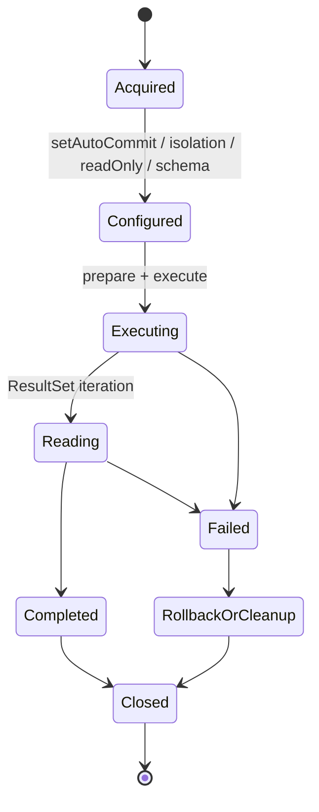
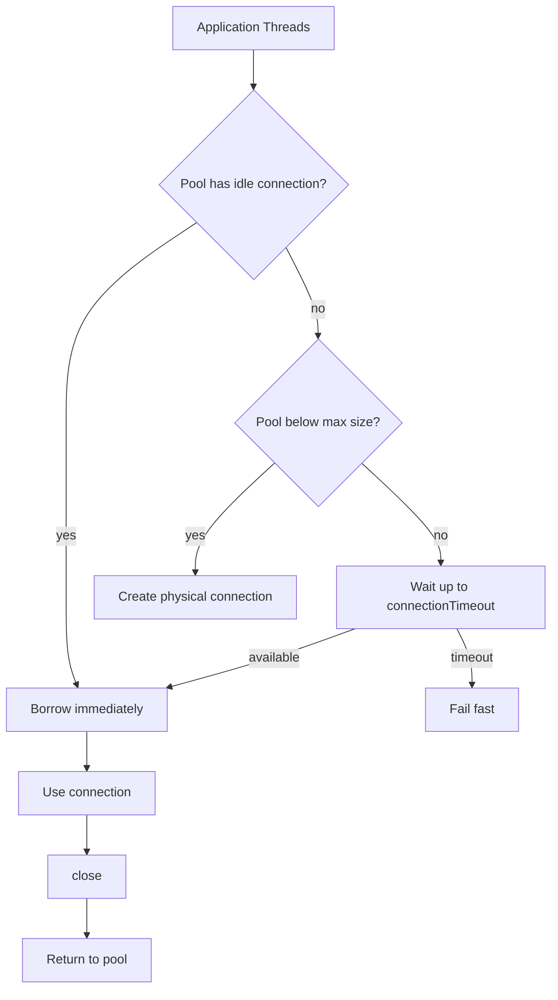
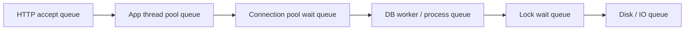
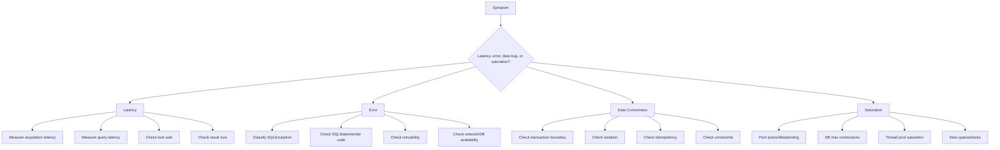

# Part 001 — Kaufman Skill Map: JDBC as a System Boundary

## 1. Tujuan Part Ini

Part ini bukan tutorial `SELECT * FROM users`.

Kita akan membangun **peta skill** untuk menguasai Java SQL/JDBC secara production-grade. Targetnya adalah kamu bisa melihat JDBC bukan sebagai sekumpulan API kecil, tetapi sebagai **boundary sistem** antara:

- Java application runtime
- thread dan executor
- connection pool
- JDBC driver
- network
- database session
- transaction engine
- lock manager
- storage engine
- observability pipeline
- incident response

Seorang engineer yang hanya “bisa JDBC” biasanya memahami pola berikut:

```java
try (Connection connection = dataSource.getConnection();
     PreparedStatement statement = connection.prepareStatement("select * from users where id = ?")) {
    statement.setLong(1, id);
    try (ResultSet rs = statement.executeQuery()) {
        // map row
    }
}
```

Seorang engineer yang benar-benar kuat akan bertanya:

- Connection ini physical atau logical?
- Siapa pemilik transaction boundary?
- Berapa lama connection dipinjam dari pool?
- Apa yang terjadi jika query blocking karena lock?
- Timeout mana yang aktif: pool acquisition, query, lock, socket, HTTP, atau transaction?
- Apa query ini aman terhadap SQL injection?
- Apa operation ini idempotent jika di-retry?
- Apa commit berhasil jika client menerima network error saat commit?
- Apakah result set ini streaming atau seluruhnya dimaterialisasi ke memory?
- Apakah pool size selaras dengan kapasitas database dan jumlah instance service?
- Bagaimana mendeteksi connection leak sebelum menjadi outage?
- Bagaimana membuktikan root cause saat active connection penuh?

Itulah scope series ini.

---

## 2. Cara Membaca Series Ini

Series ini mengikuti pendekatan dari Josh Kaufman dalam *The First 20 Hours*: pecah skill menjadi sub-skill kecil, pelajari cukup untuk self-correction, hilangkan hambatan praktik, lalu latihan dengan sengaja.

Namun karena target kita bukan level pemula, struktur ini akan diterapkan secara lebih engineering-oriented:

| Kaufman Principle | Adaptasi untuk JDBC Production Engineering |
|---|---|
| Deconstruct the skill | Pecah JDBC menjadi API model, connection lifecycle, transaction model, timeout model, pooling model, error model, observability model |
| Learn enough to self-correct | Pahami invariants, metrics, exception taxonomy, lock behavior, transaction semantics, driver differences |
| Remove practice barriers | Sediakan template minimal, diagnostic checklist, mental model, decision table |
| Practice deliberately | Simulasi leak, pool exhaustion, deadlock, timeout, retry, batch load, transaction ambiguity |

Tujuan akhirnya bukan menghafal API, tetapi memiliki **keluwesan diagnosis dan desain**.

---

## 3. Apa yang Sengaja Tidak Diulang

Kamu sudah menyelesaikan series sebelumnya tentang Java core, types, patterns, DSA, dan language fundamentals. Karena itu, series ini tidak akan mengulang:

- basic Java syntax
- try/catch/finally dasar
- OOP dasar
- generic collection dasar
- record/class/interface/enum dasar
- design pattern umum secara generik
- thread/concurrency dasar kecuali relevan dengan JDBC
- basic SQL secara terlalu elementary
- ORM/JPA sebagai topik utama

Kita akan tetap memakai konsep tersebut ketika diperlukan, tetapi hanya sebagai alat untuk memahami JDBC boundary.

---

## 4. Core Mental Model

JDBC terlihat sederhana karena API-nya kecil. Tetapi perilaku produksinya muncul dari interaksi antar layer.

```mermaid
flowchart LR
    A[HTTP / Message / Batch Request] --> B[Application Thread]
    B --> C[Service / Use Case Boundary]
    C --> D[Transaction Boundary]
    D --> E[DataSource]
    E --> F[Connection Pool]
    F --> G[Logical JDBC Connection]
    G --> H[JDBC Driver]
    H --> I[Network Socket]
    I --> J[Database Backend Session]
    J --> K[Transaction Engine]
    K --> L[Lock / MVCC Manager]
    L --> M[Storage Engine]
```



Ketika kode memanggil:

```java
Connection connection = dataSource.getConnection();
```

itu bukan sekadar “membuat object Java”. Dalam sistem production, call tersebut dapat berarti:

1. mengambil logical connection dari pool,
2. menunggu queue karena semua connection sedang aktif,
3. membuat physical connection baru jika pool belum penuh,
4. gagal karena database menolak connection,
5. gagal karena timeout,
6. gagal karena credential/TLS/network/DNS,
7. mengembalikan proxy connection yang harus dikembalikan ke pool lewat `close()`.

JDBC adalah boundary yang kecil di permukaan, tetapi berat di implikasi.

---

## 5. Vocabulary yang Harus Konsisten

Sebelum masuk ke detail, kita perlu vocabulary yang presisi.

| Istilah | Arti Praktis |
|---|---|
| JDBC | Standard Java API untuk mengakses data source tabular, terutama relational database |
| Driver | Implementasi vendor yang menerjemahkan JDBC API ke protocol database tertentu |
| DataSource | Abstraction/factory untuk memperoleh connection; preferred dibanding `DriverManager` untuk aplikasi production |
| Connection | Handle ke database session atau logical wrapper atas physical connection |
| Physical connection | Koneksi nyata ke database, biasanya socket + authenticated DB session |
| Logical connection | Object/proxy yang diberikan pool ke aplikasi; `close()` mengembalikan ke pool, bukan selalu menutup socket |
| Statement | Object untuk menjalankan SQL literal |
| PreparedStatement | Statement dengan parameter binding; utama untuk safety dan performa |
| ResultSet | Cursor hasil query |
| Transaction | Unit atomic/consistent dari operasi database |
| Auto-commit | Mode JDBC di mana setiap statement committed otomatis sebagai transaction terpisah |
| Isolation | Aturan visibilitas antar transaction concurrent |
| Pool | Resource manager yang membatasi dan mendaur ulang physical connection |
| Borrow | Proses mengambil logical connection dari pool |
| Return | Proses mengembalikan logical connection ke pool lewat `close()` |
| Leak | Connection tidak dikembalikan ke pool sesuai lifecycle |
| Timeout | Batas waktu eksplisit untuk mencegah blocking tak terkendali |
| Retryability | Apakah operasi aman/valid untuk dicoba ulang setelah error |

Vocabulary ini penting karena banyak incident JDBC terjadi akibat istilah yang dicampuradukkan. Misalnya, “connection ditutup” bisa berarti physical socket closed atau logical connection returned to pool. Dua hal itu sangat berbeda.

---

## 6. Skill Decomposition

Untuk menjadi sangat kuat di area ini, skill JDBC perlu dipecah menjadi beberapa lapisan.

### 6.1 API Layer

Kamu harus memahami object utama:

- `DriverManager`
- `DataSource`
- `Connection`
- `Statement`
- `PreparedStatement`
- `CallableStatement`
- `ResultSet`
- `ResultSetMetaData`
- `DatabaseMetaData`
- `SQLException`
- `SQLWarning`
- `Savepoint`

Targetnya bukan hafal semua method, tetapi tahu:

- siapa membuat object,
- siapa menutup object,
- object mana yang stateful,
- object mana yang tidak thread-safe untuk dipakai bersama,
- method mana yang mengubah session state,
- method mana yang blocking,
- exception mana yang perlu diklasifikasikan.

### 6.2 Lifecycle Layer

Setiap resource JDBC punya lifecycle.



Lifecycle bugs umum:

- connection tidak ditutup,
- result set dibiarkan terbuka,
- statement tidak ditutup,
- transaction tidak rollback saat exception,
- connection state tidak di-reset sebelum dikembalikan ke pool,
- long-running transaction menahan lock,
- connection dipinjam terlalu lama karena external API call di dalam transaction.

### 6.3 Transaction Layer

Transaction bukan fitur tambahan; ia adalah pusat correctness.

Kamu harus bisa menjawab:

- Kapan transaction dimulai?
- Kapan commit terjadi?
- Siapa yang melakukan rollback?
- Apakah operation read-only?
- Isolation level apa yang diperlukan?
- Apa risiko lost update?
- Apakah retry aman?
- Apakah ada side effect di luar database?
- Bagaimana menangani commit uncertainty?

Transaction boundary yang buruk akan menghasilkan bug yang sulit direproduksi:

- data inconsistent,
- duplicate insert,
- stale decision,
- lock escalation,
- deadlock,
- event terkirim tetapi data rollback,
- data commit tetapi external API gagal,
- order diproses dua kali.

### 6.4 Pooling Layer

Connection pool bukan magic performance booster.

Pool adalah **bounded concurrency controller** untuk database connection.



Pool membantu reuse connection, tetapi tidak menghilangkan limit database. Jika database hanya mampu memproses 20 query concurrent dengan baik, menaikkan pool menjadi 200 biasanya hanya memindahkan bottleneck menjadi lock contention, CPU saturation, memory pressure, atau queueing di database.

### 6.5 Error Layer

`SQLException` tidak boleh dianggap satu kategori.

Perlu dibedakan:

- syntax error,
- constraint violation,
- duplicate key,
- deadlock,
- lock timeout,
- serialization failure,
- connection acquisition timeout,
- authentication failure,
- network failure,
- database failover,
- query cancellation,
- statement timeout,
- pool exhaustion.

Masing-masing punya tindakan berbeda. Ada yang harus gagal permanen, ada yang boleh retry, ada yang harus membuka circuit, ada yang harus memperbaiki query, ada yang harus mengurangi concurrency.

### 6.6 Observability Layer

JDBC production engineering tanpa observability adalah tebak-tebakan.

Minimal kamu perlu melihat:

- active connection,
- idle connection,
- pending threads,
- acquisition latency,
- timeout count,
- borrow duration,
- query latency,
- transaction duration,
- slow query,
- deadlock count,
- lock wait,
- DB max connection usage,
- per endpoint DB time,
- correlation ID dari request ke DB session/log.

### 6.7 Architecture Layer

JDBC tidak berdiri sendiri. Ia memengaruhi desain use case dan service boundary.

Pertanyaan architecture-level:

- Apakah satu use case perlu satu transaction?
- Apakah query read dan write perlu pool berbeda?
- Apakah batch job harus memakai pool terpisah dari API traffic?
- Apakah event publish harus dilakukan dengan outbox?
- Apakah operasi ini perlu idempotency key?
- Apakah retry dilakukan di layer yang tepat?
- Apakah transaction menyentuh aggregate yang terlalu luas?
- Apakah schema constraint mendukung invariant domain?

---

## 7. The JDBC Golden Path

Golden path adalah baseline implementasi yang benar sebelum optimisasi.

```java
public final class JdbcTransactionRunner {
    private final DataSource dataSource;

    public JdbcTransactionRunner(DataSource dataSource) {
        this.dataSource = dataSource;
    }

    public <T> T inTransaction(SqlWork<T> work) throws SQLException {
        try (Connection connection = dataSource.getConnection()) {
            boolean previousAutoCommit = connection.getAutoCommit();
            try {
                connection.setAutoCommit(false);
                T result = work.execute(connection);
                connection.commit();
                return result;
            } catch (SQLException | RuntimeException e) {
                try {
                    connection.rollback();
                } catch (SQLException rollbackFailure) {
                    e.addSuppressed(rollbackFailure);
                }
                throw e;
            } finally {
                connection.setAutoCommit(previousAutoCommit);
            }
        }
    }

    @FunctionalInterface
    public interface SqlWork<T> {
        T execute(Connection connection) throws SQLException;
    }
}
```

Contoh ini bukan final pattern untuk semua aplikasi, tetapi menunjukkan invariant penting:

1. connection diperoleh dari `DataSource`,
2. transaction boundary eksplisit,
3. commit hanya setelah semua work sukses,
4. rollback saat failure,
5. rollback failure tidak menutupi original failure,
6. connection tetap dikembalikan lewat try-with-resources,
7. connection state dipulihkan sebelum return ke pool.

Pada framework seperti Spring, detail ini sering disembunyikan oleh `@Transactional`, tetapi behavior dasarnya tetap sama.

---

## 8. Invariants yang Harus Dipegang

Invariants adalah aturan yang jika dilanggar sering menghasilkan bug produksi.

### 8.1 Connection Ownership Invariants

- Siapa yang membuka connection harus jelas.
- Siapa yang menutup connection harus jelas.
- Connection tidak boleh disimpan sebagai shared mutable field.
- Connection tidak boleh dipakai lintas request secara manual.
- Connection dari pool harus selalu dikembalikan.
- `close()` pada pooled connection harus dianggap sebagai “return”, bukan selalu “physical close”.

### 8.2 Transaction Invariants

- Transaction boundary harus mengikuti use-case boundary, bukan kebetulan method DAO.
- Semua write yang harus atomic harus berada dalam transaction yang sama.
- External side effect tidak boleh dilakukan sembarangan di tengah transaction.
- Commit uncertainty harus dianggap mungkin pada distributed/networked system.
- Retry write harus memiliki idempotency guard.
- Long-running transaction adalah production risk.

### 8.3 SQL Execution Invariants

- Value input harus dibind lewat parameter, bukan string concatenation.
- Identifier dinamis seperti table/column/order direction harus melalui allowlist.
- Query harus punya batas cardinality yang dipahami.
- Query latency harus bisa diobservasi.
- Query besar harus mempertimbangkan fetch size/streaming/pagination.

### 8.4 Pool Invariants

- Pool size adalah limit concurrency ke database.
- Pool size harus dikaitkan dengan database capacity dan jumlah instance aplikasi.
- Pool exhaustion adalah gejala, bukan diagnosis final.
- Menambah pool size dapat memperburuk outage jika bottleneck sebenarnya ada di DB.
- Batch/background job sebaiknya tidak menghabiskan pool API latency-sensitive.

### 8.5 Timeout Invariants

- Tidak boleh ada blocking path tanpa timeout yang rasional.
- Timeout luar harus lebih besar dari timeout dalam, tetapi tidak terlalu besar.
- Query timeout berbeda dari pool acquisition timeout.
- Lock timeout berbeda dari socket timeout.
- Retry tanpa timeout hanya memperpanjang failure.

---

## 9. What Top-Tier Engineers Notice

Engineer kuat biasanya melihat hal-hal yang tidak terlihat oleh engineer biasa.

### 9.1 Mereka Melihat Waktu Pinjam Connection

Banyak orang hanya mengukur query latency. Padahal connection bisa dipinjam selama:

- validasi input,
- call service lain,
- transformasi data besar,
- logging sink lambat,
- publish event,
- serialisasi response.

Yang penting bukan hanya “query berapa ms”, tetapi “connection ditahan berapa lama”.

### 9.2 Mereka Membedakan Queue

Sebuah request lambat bisa menunggu di beberapa queue:



Tanpa membedakan queue, diagnosis sering salah.

Contoh salah diagnosis:

> “Connection pool penuh, naikkan maximumPoolSize.”

Padahal mungkin:

- query lambat karena missing index,
- transaction menahan lock,
- downstream DB saturated,
- request membuat N+1 query,
- batch job memakai pool yang sama,
- connection leak,
- statement timeout tidak dikonfigurasi.

### 9.3 Mereka Mendesain Failure Path

Happy path JDBC mudah. Failure path sulit.

Pertanyaan failure path:

- Jika `executeUpdate()` sukses tetapi `commit()` gagal, status data apa?
- Jika rollback juga gagal, apa yang dicatat?
- Jika deadlock terjadi, operation mana yang aman di-retry?
- Jika connection acquisition timeout, apakah request boleh retry?
- Jika pool exhausted, apakah service harus degrade atau fail?
- Jika DB failover, apakah connection lama valid?

### 9.4 Mereka Memakai Database Constraint sebagai Guardrail

Correctness tidak boleh hanya bergantung pada aplikasi.

Gunakan:

- primary key,
- unique constraint,
- foreign key,
- check constraint,
- optimistic version column,
- idempotency table,
- transactional outbox table.

JDBC adalah cara mengeksekusi operasi, bukan pengganti invariant database.

---

## 10. Diagnostic Thinking Model

Ketika ada masalah JDBC, jangan langsung lompat ke solusi. Gunakan model berikut.



Empat kategori utama:

1. **Latency** — operasi lambat.
2. **Error** — exception/failure eksplisit.
3. **Data correctness** — data salah/inconsistent.
4. **Saturation** — pool/thread/DB penuh.

Setiap kategori punya jalur diagnosis berbeda.

---

## 11. Anti-Pattern yang Akan Kita Serang Sepanjang Series

### 11.1 DriverManager Everywhere

```java
Connection connection = DriverManager.getConnection(url, user, password);
```

Masalahnya bukan `DriverManager` selalu salah. Masalahnya adalah jika ini tersebar di banyak tempat:

- sulit konfigurasi pooling,
- sulit observability,
- sulit credential rotation,
- sulit testing,
- sulit timeout management,
- sulit dependency injection,
- sulit membedakan read/write datasource.

Production code umumnya harus bergantung pada `DataSource`.

### 11.2 Connection as Singleton Field

```java
public class UserRepository {
    private final Connection connection;
}
```

Ini hampir selalu desain buruk untuk aplikasi server:

- connection stateful,
- transaction state melekat,
- tidak aman untuk concurrent request,
- gagal saat connection stale,
- membuat lifecycle kabur.

### 11.3 Transaction Boundary di DAO Kecil

```java
public void insertUser(User user) {
    try (Connection c = dataSource.getConnection()) {
        c.setAutoCommit(false);
        // insert user
        c.commit();
    }
}
```

Jika setiap DAO mengatur transaction sendiri, use case yang butuh beberapa operasi atomic menjadi sulit.

Transaction boundary seharusnya sering berada di service/use-case layer.

### 11.4 External Call Inside Transaction

```java
connection.setAutoCommit(false);
insertOrder(connection, order);
paymentClient.charge(order); // dangerous inside DB transaction
connection.commit();
```

Risiko:

- transaction terlalu lama,
- lock ditahan selama network call,
- payment sukses tetapi commit gagal,
- commit sukses tetapi response payment ambiguous,
- retry menyebabkan double charge.

### 11.5 Blind Retry

```java
catch (SQLException e) {
    retry();
}
```

Retry tanpa klasifikasi dapat memperburuk masalah.

Retry harus mempertimbangkan:

- jenis error,
- apakah transaction sudah commit,
- apakah operation idempotent,
- apakah constraint mencegah duplikasi,
- apakah retry punya backoff,
- apakah ada retry budget.

### 11.6 Oversized Pool

```properties
maximumPoolSize=200
```

Jika ada 10 instance aplikasi, artinya potensi 2.000 DB connection. Bisa jadi database tidak didesain untuk itu.

Pool besar bisa menyebabkan:

- DB context switching,
- memory pressure,
- lock contention,
- overload lebih cepat,
- p95/p99 latency memburuk.

### 11.7 No Timeout

Tanpa timeout, failure menjadi antrian panjang.

Minimal perlu memikirkan:

- HTTP/request timeout,
- executor timeout,
- connection acquisition timeout,
- query timeout,
- lock timeout,
- socket timeout,
- transaction timeout.

---

## 12. Practice Strategy untuk 20 Jam Pertama

Berikut rencana latihan intensif. Bukan berarti kamu akan selesai seluruh materi dalam 20 jam, tetapi ini adalah blok awal untuk mendapatkan traction cepat.

### Jam 1–2: Peta Stack dan API

Latihan:

- baca object model JDBC,
- buat program kecil dengan `DataSource`,
- jalankan `SELECT 1`,
- log lifecycle connection/statement/resultset,
- amati kapan resource ditutup.

Output:

- kamu bisa menjelaskan stack dari thread aplikasi sampai DB session.

### Jam 3–4: PreparedStatement dan Mapping

Latihan:

- tulis query parameterized,
- bind null,
- bind temporal type,
- map result set ke record Java,
- coba dynamic SQL dengan allowlist.

Output:

- kamu bisa membedakan value binding vs identifier composition.

### Jam 5–7: Transaction Manual

Latihan:

- buat transaction runner,
- simulasi failure sebelum commit,
- simulasi failure setelah statement pertama,
- pastikan rollback,
- catat suppressed rollback failure.

Output:

- kamu bisa menulis transaction boundary manual yang benar.

### Jam 8–10: Isolation dan Lock

Latihan:

- buka dua connection,
- jalankan dua transaction concurrent,
- reproduksi blocking,
- reproduksi lost update atau serialization conflict sesuai database,
- ukur lock wait.

Output:

- kamu tidak lagi melihat isolation sebagai teori textbook saja.

### Jam 11–13: HikariCP dan Pool Exhaustion

Latihan:

- konfigurasi HikariCP kecil,
- buat query lambat,
- pinjam connection tanpa close untuk simulasi leak,
- amati active/idle/pending,
- trigger acquisition timeout.

Output:

- kamu bisa membedakan leak, slow query, dan pool too small.

### Jam 14–16: Timeout dan Retry

Latihan:

- set connection timeout,
- set query timeout,
- set lock timeout jika database mendukung,
- klasifikasikan `SQLException`,
- buat retry hanya untuk error transient tertentu.

Output:

- kamu bisa mendesain failure behavior, bukan hanya menangkap exception.

### Jam 17–18: Batch dan Streaming

Latihan:

- insert batch 1.000/10.000 rows,
- coba batch size berbeda,
- baca result besar dengan fetch size,
- amati memory.

Output:

- kamu memahami trade-off throughput, lock duration, memory, transaction size.

### Jam 19–20: Incident Drill

Latihan:

- buat skenario pool exhausted,
- buat skenario deadlock,
- buat skenario slow query,
- buat skenario duplicate insert karena retry,
- tulis postmortem singkat.

Output:

- kamu punya diagnostic muscle, bukan hanya pengetahuan API.

---

## 13. Skill Checkpoints

Gunakan checkpoint berikut untuk mengukur level.

### Level 1 — API User

Kamu bisa:

- membuka connection,
- menjalankan prepared statement,
- membaca result set,
- menutup resource,
- menjalankan commit/rollback sederhana.

Ini belum cukup untuk production-grade engineering.

### Level 2 — Safe JDBC Practitioner

Kamu bisa:

- memakai `DataSource`,
- menghindari SQL injection untuk value,
- mengelola transaction manual,
- memakai try-with-resources dengan benar,
- membedakan query/update/batch,
- melakukan basic exception handling.

Ini cukup untuk feature kecil.

### Level 3 — Production JDBC Engineer

Kamu bisa:

- mendesain pool size,
- mendesain timeout end-to-end,
- membaca pool metrics,
- mengklasifikasikan error,
- menangani retry dengan idempotency,
- memahami isolation dan lock behavior,
- menguji failure path.

Ini level senior practical.

### Level 4 — System-Level Database Boundary Engineer

Kamu bisa:

- menghubungkan JDBC behavior dengan architecture,
- mendiagnosis incident multi-layer,
- memisahkan workload pool,
- mendesain transaction + outbox,
- menghindari cascading failure,
- membuat engineering standard untuk tim,
- melakukan review desain database access layer.

Ini target series.

---

## 14. Capstone yang Akan Dibangun Bertahap

Sepanjang series, kita akan menggunakan satu domain kecil: **case enforcement workflow**.

Domain ini cocok karena memiliki:

- case lifecycle,
- assignment,
- escalation,
- audit trail,
- decision log,
- document metadata,
- status transition,
- concurrent update,
- deadline/SLA,
- reporting query,
- batch escalation job,
- event publishing.

Contoh table yang akan muncul:

```sql
case_file
case_assignment
case_status_history
case_decision
case_audit_event
case_escalation_queue
case_outbox_event
```

Kita tidak akan membangun aplikasi penuh, tetapi akan memakai domain ini untuk latihan:

- transaction boundary,
- optimistic locking,
- idempotency,
- audit insert,
- outbox pattern,
- batch escalation,
- read query optimization,
- pool separation,
- incident simulation.

---

## 15. Minimal Baseline Code untuk Series

Kode-kode berikut bukan framework final, tetapi baseline vocabulary.

### 15.1 Minimal DataSource-Oriented Repository

```java
public final class CaseRepository {
    private final DataSource dataSource;

    public CaseRepository(DataSource dataSource) {
        this.dataSource = dataSource;
    }

    public Optional<CaseFile> findById(long caseId) throws SQLException {
        String sql = """
            select id, case_number, status, assigned_to, created_at, updated_at
            from case_file
            where id = ?
            """;

        try (Connection connection = dataSource.getConnection();
             PreparedStatement statement = connection.prepareStatement(sql)) {

            statement.setLong(1, caseId);

            try (ResultSet rs = statement.executeQuery()) {
                if (!rs.next()) {
                    return Optional.empty();
                }
                return Optional.of(mapCaseFile(rs));
            }
        }
    }

    private static CaseFile mapCaseFile(ResultSet rs) throws SQLException {
        return new CaseFile(
            rs.getLong("id"),
            rs.getString("case_number"),
            rs.getString("status"),
            rs.getString("assigned_to"),
            rs.getObject("created_at", OffsetDateTime.class),
            rs.getObject("updated_at", OffsetDateTime.class)
        );
    }
}
```

Hal yang benar:

- repository bergantung pada `DataSource`, bukan membuat koneksi sendiri via hard-coded credential,
- resource ditutup dengan try-with-resources,
- value dibind dengan parameter,
- mapping terlokalisasi.

Hal yang belum dibahas:

- timeout,
- read-only transaction,
- exception translation,
- metrics,
- fetch size,
- schema portability,
- testing.

Itu akan dibahas bertahap.

### 15.2 Minimal Use-Case Transaction Boundary

```java
public final class AssignCaseUseCase {
    private final JdbcTransactionRunner tx;

    public AssignCaseUseCase(JdbcTransactionRunner tx) {
        this.tx = tx;
    }

    public void assign(long caseId, String assignee) throws SQLException {
        tx.inTransaction(connection -> {
            CaseFile current = loadCaseForUpdate(connection, caseId);
            ensureAssignable(current);
            updateAssignment(connection, caseId, assignee);
            insertAuditEvent(connection, caseId, "ASSIGNED", assignee);
            return null;
        });
    }
}
```

Hal penting:

- use case memegang transaction boundary,
- beberapa operasi database menjadi atomic,
- audit event masuk dalam transaction yang sama,
- repository/helper menerima `Connection` ketika ikut transaction.

---

## 16. Learning Contract untuk Series Ini

Setiap part setelah ini akan mengikuti pola:

1. **Problem framing** — kenapa topik ini penting.
2. **Mental model** — model internal yang harus kamu punya.
3. **API surface** — method/class utama yang relevan.
4. **Production behavior** — apa yang terjadi di sistem nyata.
5. **Correct implementation** — contoh kode yang aman.
6. **Failure modes** — bagaimana ini rusak di production.
7. **Patterns** — desain yang disarankan.
8. **Anti-patterns** — desain yang harus dihindari.
9. **Review checklist** — cara mengevaluasi kode/desain.
10. **Practice drill** — latihan deliberate.

---

## 17. Ringkasan Part 001

Kita sudah membentuk peta skill:

- JDBC adalah boundary sistem, bukan hanya API kecil.
- Skill perlu dipecah menjadi API, lifecycle, transaction, pooling, error, observability, dan architecture.
- Target utama adalah memahami invariants dan failure modes.
- Connection pool adalah bounded concurrency controller, bukan magic speed booster.
- Transaction boundary adalah pusat correctness.
- Timeout dan observability wajib untuk production readiness.
- Series ini akan membangun kemampuan dari API-level sampai incident-level.

Part berikutnya akan masuk ke **Java SQL Stack**: module `java.sql`, package `java.sql`, package `javax.sql`, driver, `DriverManager`, `DataSource`, network, dan database session.

---

## References

- Oracle Java SE 25 API — `java.sql` module: https://docs.oracle.com/en/java/javase/25/docs/api/java.sql/module-summary.html
- Oracle Java SE 25 API — `java.sql` package: https://docs.oracle.com/en/java/javase/25/docs/api/java.sql/java/sql/package-summary.html
- Oracle Java SE 25 API — `javax.sql.DataSource`: https://docs.oracle.com/en/java/javase/25/docs/api/java.sql/javax/sql/DataSource.html
- Oracle Java SE 25 API — `DriverManager`: https://docs.oracle.com/en/java/javase/25/docs/api/java.sql/java/sql/DriverManager.html
- JSR 221 JDBC 4.3 Specification: https://jcp.org/aboutJava/communityprocess/mrel/jsr221/index3.html
- HikariCP official repository: https://github.com/brettwooldridge/HikariCP
