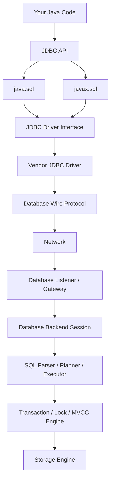
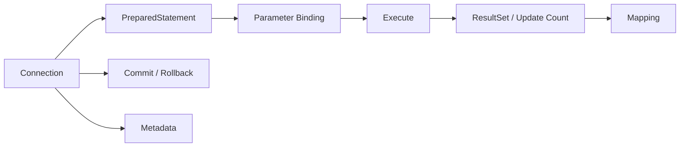
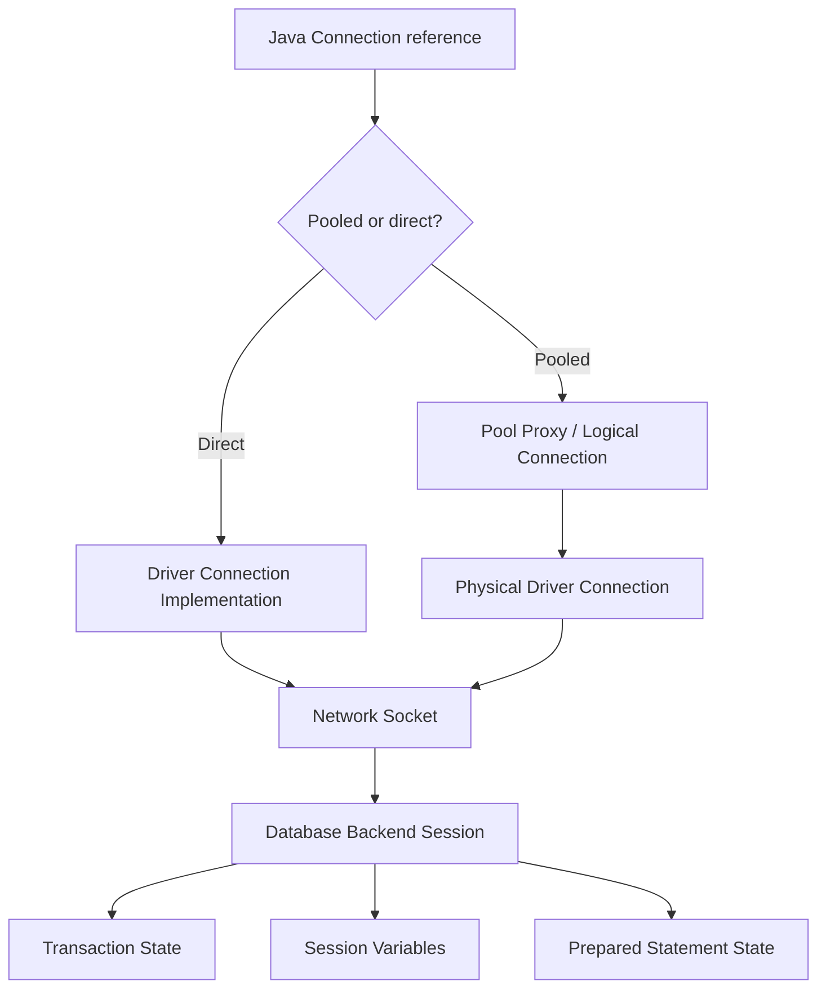
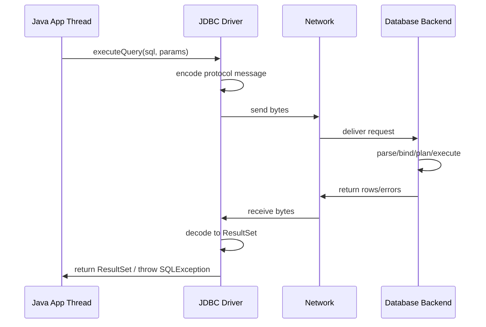
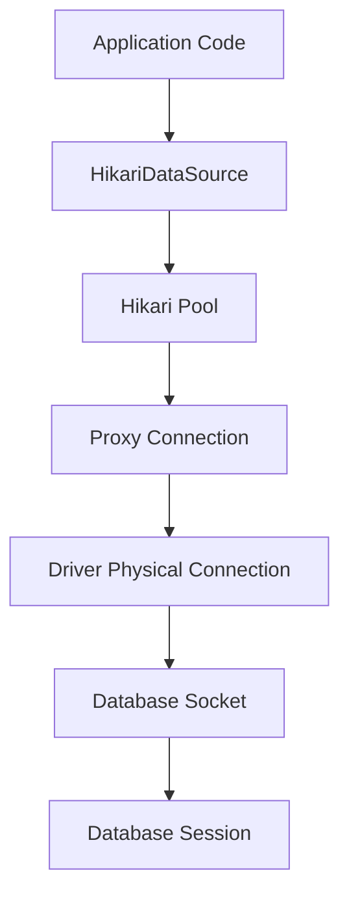
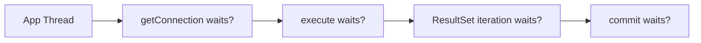

# Part 002 — The Java SQL Stack: `java.sql`, `javax.sql`, Driver, Database, Network

## 1. Tujuan Part Ini

Part ini membedah stack Java SQL/JDBC dari atas sampai bawah.

Kita akan menjawab:

- Apa sebenarnya module `java.sql`?
- Apa isi package `java.sql`?
- Apa peran package `javax.sql`?
- Mengapa production code sebaiknya memakai `DataSource`?
- Bagaimana JDBC driver ditemukan dan dipakai?
- Apa bedanya Java `Connection`, physical connection, socket, dan database session?
- Di mana pooling masuk?
- Kenapa detail ini penting untuk reliability?

Mental model ini wajib sebelum masuk ke `Connection`, `Statement`, transaction, dan HikariCP.

---

## 2. JDBC dalam Java Platform

JDBC adalah standard API Java untuk mengakses data source tabular, terutama relational database.

Pada Java modern, JDBC berada dalam module:

```java
java.sql
```

Module ini mengekspor package penting:

```txt
java.sql
javax.sql
```

Secara praktis:

- `java.sql` adalah core API untuk connection, statement, result set, transaction primitive, metadata, dan exception.
- `javax.sql` melengkapi core API dengan server-side/data-source oriented API seperti `DataSource`, pooled connection, row set, dan event/listener tertentu.

Jangan tertipu oleh nama `javax`. Dalam konteks JDBC, `javax.sql` tetap bagian dari Java SE modern dan sangat relevan untuk aplikasi Java production.

---

## 3. High-Level Stack



Yang penting: JDBC bukan database. JDBC adalah **contract** antara Java code dan driver. Driver-lah yang memahami detail vendor database.

Misalnya:

- PostgreSQL JDBC driver memahami PostgreSQL wire protocol.
- MySQL Connector/J memahami MySQL protocol.
- Microsoft JDBC Driver memahami SQL Server protocol.
- Oracle JDBC driver memahami Oracle database protocol.

Kode aplikasi berbicara lewat interface umum. Driver menerjemahkan.

---

## 4. `java.sql`: Core JDBC API

Package `java.sql` menyediakan API untuk mengakses dan memproses data dari data source, umumnya relational database.

Core class/interface yang akan sering muncul:

| Type | Peran |
|---|---|
| `DriverManager` | Service lama untuk mengelola driver dan membuat connection langsung |
| `Driver` | Interface driver JDBC |
| `Connection` | Handle ke database session / logical connection |
| `Statement` | Menjalankan SQL tanpa parameter binding |
| `PreparedStatement` | Menjalankan SQL dengan parameter binding |
| `CallableStatement` | Memanggil stored procedure/function |
| `ResultSet` | Cursor hasil query |
| `ResultSetMetaData` | Metadata kolom result set |
| `DatabaseMetaData` | Metadata database/driver/schema capability |
| `SQLException` | Exception utama JDBC |
| `SQLWarning` | Warning non-fatal dari operasi SQL |
| `Savepoint` | Marker rollback parsial dalam transaction |
| `Types` | Konstanta tipe SQL/JDBC |
| `Date`, `Time`, `Timestamp` | Legacy temporal JDBC types |

### 4.1 Apa yang Harus Dipahami dari `java.sql`

Jangan memandang `java.sql` sebagai daftar class. Pahami sebagai model interaksi:



`Connection` adalah akar sebagian besar operasi. Dari connection kamu membuat statement, mengatur transaction, mengatur isolation, membaca metadata, dan mengelola savepoint.

---

## 5. `javax.sql`: DataSource-Oriented API

Package `javax.sql` melengkapi JDBC core API. Untuk aplikasi production, interface paling penting adalah:

```java
javax.sql.DataSource
```

`DataSource` adalah factory untuk mendapatkan `Connection`.

```java
Connection connection = dataSource.getConnection();
```

Secara desain, `DataSource` lebih cocok untuk production karena:

- configuration bisa dikelola di satu tempat,
- bisa dibungkus oleh connection pool,
- bisa di-inject ke repository/service,
- bisa diganti untuk test,
- mendukung separation read/write datasource,
- lebih mudah diobservasi,
- lebih mudah diintegrasikan dengan container/framework.

### 5.1 Jenis DataSource

Secara konseptual ada beberapa bentuk:

| Jenis | Deskripsi |
|---|---|
| Basic driver `DataSource` | Membuat physical connection langsung ke database |
| Pooled `DataSource` | Mengembalikan logical connection dari pool |
| XA `DataSource` | Digunakan untuk distributed transaction / two-phase commit scenario |

Untuk kebanyakan microservice modern, yang umum adalah pooled `DataSource`, misalnya melalui HikariCP.

---

## 6. `DriverManager` vs `DataSource`

### 6.1 `DriverManager`

`DriverManager` adalah service untuk mengelola sekumpulan JDBC driver dan membuat connection berdasarkan JDBC URL.

Contoh:

```java
try (Connection connection = DriverManager.getConnection(
        "jdbc:postgresql://localhost:5432/app",
        "app_user",
        "secret")) {
    // use connection
}
```

Ini berguna untuk:

- script kecil,
- proof of concept,
- tool lokal,
- eksperimen driver,
- contoh sederhana.

Tetapi untuk aplikasi production besar, menyebarkan `DriverManager.getConnection()` di banyak tempat biasanya buruk.

### 6.2 `DataSource`

`DataSource` memindahkan detail connection acquisition ke abstraction.

```java
public final class CaseRepository {
    private final DataSource dataSource;

    public CaseRepository(DataSource dataSource) {
        this.dataSource = dataSource;
    }

    public Optional<String> findStatus(long caseId) throws SQLException {
        String sql = "select status from case_file where id = ?";

        try (Connection connection = dataSource.getConnection();
             PreparedStatement statement = connection.prepareStatement(sql)) {

            statement.setLong(1, caseId);

            try (ResultSet rs = statement.executeQuery()) {
                if (!rs.next()) {
                    return Optional.empty();
                }
                return Optional.of(rs.getString("status"));
            }
        }
    }
}
```

Repository tidak tahu apakah connection berasal dari:

- driver langsung,
- HikariCP,
- test fake/stub,
- read replica pool,
- container-managed datasource,
- wrapper observability.

Itulah nilai abstraction.

### 6.3 Comparison Table

| Aspect | `DriverManager` | `DataSource` |
|---|---|---|
| Connection acquisition | Static call | Instance abstraction |
| Configuration | Sering tersebar | Bisa terpusat |
| Dependency injection | Tidak natural | Natural |
| Pooling | Tidak built-in sebagai usage pattern | Natural via pooled DataSource |
| Testing | Lebih sulit | Mudah diganti |
| Observability wrapper | Sulit jika tersebar | Lebih mudah |
| Production recommendation | Hindari sebagai default app design | Preferred baseline |

---

## 7. JDBC Driver Discovery

Dulu, aplikasi sering memanggil:

```java
Class.forName("org.postgresql.Driver");
```

Tujuannya memaksa driver class loaded agar mendaftarkan dirinya ke `DriverManager`.

Pada JDBC modern, driver discovery umumnya memanfaatkan Java service provider mechanism. Driver jar dapat menyediakan provider configuration sehingga `DriverManager` bisa menemukan driver yang tersedia.

Namun, sebagai engineer production, detail pentingnya bukan sekadar apakah perlu `Class.forName`. Detail pentingnya:

- driver jar harus ada di classpath/module path,
- versi driver harus kompatibel dengan Java dan database,
- driver behavior bisa berbeda antar vendor,
- driver punya configuration properties sendiri,
- driver bisa menentukan default timeout, SSL behavior, prepared statement behavior, fetch behavior, dan timezone handling.

### 7.1 Driver adalah Runtime Dependency yang Serius

Jangan perlakukan driver sebagai dependency pasif.

Driver memengaruhi:

- connection handshake,
- authentication,
- TLS,
- socket options,
- query protocol,
- prepared statement implementation,
- batch rewrite behavior,
- generated keys,
- timestamp conversion,
- streaming result set,
- cancellation,
- error code mapping,
- failover support.

Upgrade driver bisa mengubah behavior produksi. Maka driver upgrade harus dites seperti dependency kritikal.

---

## 8. JDBC URL

JDBC URL adalah string yang dipakai untuk memilih driver dan memberi tahu lokasi/config data source.

Format umum:

```txt
jdbc:<subprotocol>:<subname>
```

Contoh:

```txt
jdbc:postgresql://localhost:5432/enforcement
jdbc:mysql://localhost:3306/enforcement
jdbc:sqlserver://localhost:1433;databaseName=enforcement
jdbc:oracle:thin:@//localhost:1521/FREEPDB1
```

JDBC URL sering mengandung konfigurasi penting seperti:

- host,
- port,
- database/schema/service name,
- SSL mode,
- socket timeout,
- connect timeout,
- timezone behavior,
- prepared statement cache,
- application name,
- failover host,
- replica routing.

### 8.1 Anti-Pattern: URL sebagai Tempat Sampah Konfigurasi

Masalah umum:

```txt
jdbc:postgresql://db/prod?ssl=false&connectTimeout=0&socketTimeout=0&ApplicationName=unknown
```

Jika semua konfigurasi diselipkan di URL tanpa standard, sulit dilakukan:

- review security,
- timeout governance,
- environment comparison,
- incident diagnosis,
- safe rollout.

Lebih baik buat configuration object/properties yang eksplisit dan terdokumentasi.

---

## 9. Connection: Object, Socket, Session

Salah satu sumber bug terbesar adalah menyamakan `Connection` dengan satu hal saja.

`java.sql.Connection` bisa merepresentasikan beberapa level:



### 9.1 Java Connection Reference

Ini object yang kamu pegang di kode Java.

```java
Connection connection = dataSource.getConnection();
```

Ia memiliki method seperti:

- `prepareStatement`
- `setAutoCommit`
- `commit`
- `rollback`
- `setTransactionIsolation`
- `setReadOnly`
- `setSchema`
- `close`

### 9.2 Logical Connection

Jika memakai pool, connection yang kamu terima biasanya proxy/wrapper.

Ketika kamu memanggil:

```java
connection.close();
```

biasanya yang terjadi:

- connection dikembalikan ke pool,
- state tertentu di-reset,
- physical socket tetap hidup,
- connection bisa dipinjam lagi oleh request lain.

Ini sebabnya `close()` tetap wajib meskipun connection berasal dari pool.

### 9.3 Physical Connection

Physical connection adalah koneksi nyata ke database.

Biasanya melibatkan:

- TCP socket,
- TLS session jika aktif,
- authentication,
- database backend process/thread/session,
- server-side resource.

Physical connection mahal untuk dibuat dibanding reuse, sehingga pooling berguna.

### 9.4 Database Session

Database session adalah state di sisi database yang terkait dengan connection.

Session dapat menyimpan:

- current transaction,
- isolation level,
- current schema/catalog,
- session variables,
- temporary table,
- prepared statement server-side,
- lock yang sedang dipegang,
- application name,
- client address,
- role/user.

Karena session state bisa melekat pada physical connection, pool harus berhati-hati mengembalikan connection ke kondisi bersih sebelum dipakai ulang.

---

## 10. Production Implication: Connection State Pollution

Bayangkan request A melakukan:

```java
connection.setReadOnly(true);
connection.setTransactionIsolation(Connection.TRANSACTION_SERIALIZABLE);
connection.setSchema("reporting");
```

Lalu connection dikembalikan ke pool tanpa reset yang benar. Request B meminjam physical connection yang sama dan tiba-tiba berjalan dengan:

- schema salah,
- isolation terlalu tinggi,
- read-only aktif,
- auto-commit tidak sesuai.

Pool modern biasanya melakukan state tracking/reset, tetapi jangan desain aplikasi dengan mengandalkan magic. Buat state explicit dan scoped.

Pattern yang baik:

```java
try (Connection connection = dataSource.getConnection()) {
    boolean oldReadOnly = connection.isReadOnly();
    int oldIsolation = connection.getTransactionIsolation();

    try {
        connection.setReadOnly(true);
        connection.setTransactionIsolation(Connection.TRANSACTION_READ_COMMITTED);
        // execute read work
    } finally {
        connection.setReadOnly(oldReadOnly);
        connection.setTransactionIsolation(oldIsolation);
    }
}
```

Dalam framework, sebagian ini dikelola transaction manager. Tetapi pemahaman manual tetap penting untuk debugging.

---

## 11. Network Boundary

JDBC call terlihat seperti method call biasa:

```java
statement.executeQuery();
```

Tetapi sebenarnya itu bisa melibatkan network round-trip.



Akibatnya, JDBC operation dapat gagal karena:

- DNS issue,
- TCP connect timeout,
- TLS handshake failure,
- packet loss,
- firewall idle timeout,
- database restart,
- failover,
- socket read timeout,
- network partition,
- driver protocol error.

Maka `SQLException` bukan hanya “SQL salah”.

---

## 12. Database Backend Session

Ketika physical connection dibuat, database biasanya membuat backend session atau context untuk client tersebut.

Session ini dapat:

- mengeksekusi statement,
- menyimpan transaction state,
- memegang lock,
- mengalokasikan memory,
- memakai worker/process/thread,
- muncul di monitoring database.

Contoh observability yang sering dicari di database:

- client address,
- application name,
- username,
- query aktif,
- wait event,
- transaction start time,
- lock wait,
- idle in transaction,
- backend PID/session ID.

Top-tier engineer menghubungkan Java-side metric dengan DB-side session.

Misalnya:

| Java-side Signal | DB-side Signal yang Perlu Dicari |
|---|---|
| Hikari active connections tinggi | session aktif/idle/idle-in-transaction |
| pending threads tinggi | DB worker saturated atau lock wait |
| query latency tinggi | slow query, wait event, missing index |
| timeout saat borrow | connection leak atau long query/transaction |
| deadlock exception | deadlock graph/log di database |
| socket timeout | network issue atau DB tidak merespons |

---

## 13. Stack dengan HikariCP

Jika memakai HikariCP, bentuk stack menjadi:



Yang perlu dipahami:

- aplikasi memanggil `HikariDataSource.getConnection()`,
- Hikari memberi proxy/logical connection,
- proxy membungkus physical driver connection,
- `close()` pada proxy mengembalikan connection ke pool,
- Hikari mengelola lifecycle physical connection,
- Hikari punya timeout, max lifetime, idle timeout, validation, leak detection, metrics.

Contoh minimal:

```java
HikariConfig config = new HikariConfig();
config.setJdbcUrl("jdbc:postgresql://localhost:5432/enforcement");
config.setUsername("app_user");
config.setPassword("secret");
config.setMaximumPoolSize(10);
config.setConnectionTimeout(2_000);
config.setPoolName("enforcement-api");

HikariDataSource dataSource = new HikariDataSource(config);
```

Jangan membuat `HikariDataSource` per request. Pool harus dibuat sebagai application-level resource dan ditutup saat aplikasi shutdown.

---

## 14. Threading Model

JDBC call umumnya blocking.



Thread aplikasi dapat blocking saat:

- menunggu connection dari pool,
- membuat physical connection,
- mengirim query,
- menunggu lock,
- membaca result set,
- menunggu commit fsync/replication tergantung DB config,
- rollback,
- menutup/validasi connection.

Implikasi:

- JDBC latency mengikat thread aplikasi.
- Pool exhaustion dapat membuat thread pool ikut penuh.
- Thread pool yang penuh dapat menyebabkan cascading failure.
- Reactive/non-blocking stack tidak otomatis menyelesaikan masalah jika driver JDBC tetap blocking.

---

## 15. Basic Direct JDBC Example

Contoh ini berguna untuk memahami API, bukan rekomendasi architecture final.

```java
public final class DirectJdbcExample {
    public static void main(String[] args) throws Exception {
        String url = "jdbc:postgresql://localhost:5432/enforcement";
        String user = "app_user";
        String password = "secret";

        try (Connection connection = DriverManager.getConnection(url, user, password);
             PreparedStatement statement = connection.prepareStatement(
                 "select id, case_number, status from case_file where id = ?"
             )) {

            statement.setLong(1, 1001L);

            try (ResultSet rs = statement.executeQuery()) {
                while (rs.next()) {
                    long id = rs.getLong("id");
                    String caseNumber = rs.getString("case_number");
                    String status = rs.getString("status");

                    System.out.printf("%d %s %s%n", id, caseNumber, status);
                }
            }
        }
    }
}
```

Kelebihan:

- sederhana,
- jelas untuk belajar,
- resource cleanup eksplisit.

Kekurangan untuk production app:

- credential/url hard-coded jika tidak dieksternalisasi,
- tidak ada pooling,
- tidak ada dependency injection,
- tidak ada metrics,
- tidak ada timeout governance,
- sulit testing jika pola ini tersebar.

---

## 16. DataSource-Based Example

Lebih cocok untuk aplikasi server.

```java
public final class CaseStatusDao {
    private final DataSource dataSource;

    public CaseStatusDao(DataSource dataSource) {
        this.dataSource = dataSource;
    }

    public Optional<CaseStatusView> findStatus(long caseId) throws SQLException {
        String sql = """
            select id, case_number, status, updated_at
            from case_file
            where id = ?
            """;

        try (Connection connection = dataSource.getConnection();
             PreparedStatement statement = connection.prepareStatement(sql)) {

            statement.setLong(1, caseId);

            try (ResultSet rs = statement.executeQuery()) {
                if (!rs.next()) {
                    return Optional.empty();
                }

                return Optional.of(new CaseStatusView(
                    rs.getLong("id"),
                    rs.getString("case_number"),
                    rs.getString("status"),
                    rs.getObject("updated_at", OffsetDateTime.class)
                ));
            }
        }
    }
}
```

`DataSource` bisa berasal dari HikariCP:

```java
public final class DataSourceFactory {
    public static DataSource create() {
        HikariConfig config = new HikariConfig();
        config.setJdbcUrl(System.getenv("JDBC_URL"));
        config.setUsername(System.getenv("JDBC_USER"));
        config.setPassword(System.getenv("JDBC_PASSWORD"));
        config.setMaximumPoolSize(10);
        config.setConnectionTimeout(2_000);
        config.setPoolName("case-service-main");
        return new HikariDataSource(config);
    }
}
```

Repository tidak berubah ketika kita mengganti direct driver connection menjadi pooled connection. Itu desain yang baik.

---

## 17. Common Misconceptions

### 17.1 “Connection Itu Murah”

Physical connection tidak murah. Ia bisa melibatkan:

- DNS lookup,
- TCP handshake,
- TLS handshake,
- authentication,
- database process/thread/session allocation,
- setup session state.

Membuat connection per query di aplikasi high-throughput adalah recipe untuk latency dan load buruk.

### 17.2 “Pool Besar Selalu Lebih Cepat”

Pool besar hanya memperbesar concurrency ke database. Jika DB bottleneck, pool besar bisa memperburuk latency.

Lebih banyak concurrent query dapat berarti:

- lebih banyak lock contention,
- lebih banyak CPU context switching,
- lebih banyak memory per session,
- lebih banyak queue di DB,
- lebih buruk p99 latency.

### 17.3 “close() Berarti Socket Ditutup”

Pada pooled connection, `close()` biasanya berarti return ke pool. Physical socket mungkin tetap hidup.

Tetapi dari perspektif aplikasi, kamu tetap wajib memanggil `close()`.

### 17.4 “SQLException Berarti Query Salah”

`SQLException` bisa berasal dari:

- SQL syntax,
- constraint,
- timeout,
- network,
- connection closed,
- deadlock,
- failover,
- authentication,
- unsupported feature,
- driver bug.

Klasifikasi error wajib.

### 17.5 “Auto-Commit Aman untuk Semua”

Auto-commit berguna untuk statement tunggal yang independent. Tetapi untuk use case multi-step, auto-commit bisa menghasilkan partial update.

Contoh buruk:

```java
insertAssignment(caseId, assignee); // committed
insertAudit(caseId, "ASSIGNED");   // fails
```

Hasilnya assignment berubah tetapi audit tidak ada.

---

## 18. Production Design Questions

Sebelum menulis JDBC access layer, jawab pertanyaan berikut.

### 18.1 Connection Acquisition

- Dari mana `DataSource` berasal?
- Apakah memakai pool?
- Berapa `maximumPoolSize`?
- Berapa `connectionTimeout`?
- Apakah ada pool terpisah untuk read/write/batch?
- Bagaimana shutdown pool dilakukan?

### 18.2 Transaction Boundary

- Siapa pemilik transaction?
- Apakah DAO boleh commit sendiri?
- Apakah transaction boleh melewati network call?
- Apakah read operation butuh read-only transaction?
- Isolation level default apa?

### 18.3 Timeout

- Berapa timeout acquire connection?
- Berapa statement timeout?
- Berapa lock timeout?
- Berapa socket timeout?
- Bagaimana urutan timeout antar layer?

### 18.4 Observability

- Apakah pool metrics diekspos?
- Apakah slow query terlihat?
- Apakah acquisition latency terlihat?
- Apakah correlation ID masuk log?
- Apakah DB bisa menunjukkan application name?

### 18.5 Error and Retry

- Error mana yang retryable?
- Apakah write operation idempotent?
- Bagaimana duplicate dicegah?
- Apakah deadlock di-retry?
- Bagaimana ambiguous commit ditangani?

---

## 19. JDBC Stack Review Checklist

Gunakan checklist ini untuk review codebase.

### 19.1 Good Signals

- Repository menerima `DataSource` via constructor/dependency injection.
- Connection selalu ditutup dengan try-with-resources.
- Statement dan result set selalu ditutup.
- SQL value memakai parameter binding.
- Transaction boundary ada di service/use-case layer.
- Pool configuration eksplisit.
- Timeout configuration eksplisit.
- Metrics pool tersedia.
- Driver version dikelola dan diuji.
- Credential tidak hard-coded.

### 19.2 Warning Signals

- `DriverManager.getConnection()` tersebar di banyak class.
- `Connection` disimpan sebagai singleton field.
- DAO melakukan commit/rollback sendiri tanpa orchestration.
- Query dibangun dengan string concatenation dari user input.
- Tidak ada timeout.
- Tidak ada metrics pool.
- Pool size besar tanpa reasoning.
- Batch job memakai pool yang sama dengan API utama.
- Long transaction melakukan HTTP call.
- Semua `SQLException` diperlakukan sama.

### 19.3 Critical Smells

- Connection leak di path exception.
- `autoCommit=false` tanpa rollback di catch.
- Retry write tanpa idempotency.
- Pool exhausted tapi solusi hanya menaikkan pool size.
- `idle in transaction` tinggi di database.
- Query besar tanpa pagination/fetch strategy.
- `select *` di endpoint latency-sensitive.
- Migration berjalan saat traffic tanpa lock impact assessment.

---

## 20. Mini Drill

### Drill 1 — Draw Your Stack

Gambar stack service kamu:

```txt
Endpoint / Consumer
  -> Service
  -> Transaction boundary
  -> Repository
  -> DataSource
  -> Pool
  -> Driver
  -> DB session
  -> Transaction / lock engine
```

Lalu jawab:

- Di mana connection dipinjam?
- Di mana connection dikembalikan?
- Di mana transaction dimulai?
- Di mana commit/rollback?
- Di mana timeout diterapkan?
- Di mana metrics diambil?

### Drill 2 — Find Direct DriverManager Usage

Cari:

```txt
DriverManager.getConnection
```

Untuk setiap usage, klasifikasikan:

| Usage | Aman? | Kenapa? | Perlu diganti DataSource? |
|---|---|---|---|
| CLI lokal | mungkin | scope kecil | belum tentu |
| service production | risk | config/pooling sulit | ya |
| migration tool | tergantung | lifecycle berbeda | tergantung |
| test helper | mungkin | isolated | belum tentu |

### Drill 3 — Identify Connection State

Cari usage:

```txt
setAutoCommit
setReadOnly
setTransactionIsolation
setSchema
setCatalog
```

Pastikan:

- state diset untuk scope jelas,
- state dikembalikan jika perlu,
- framework transaction manager tidak dilanggar,
- tidak ada hidden state pollution.

---

## 21. Ringkasan Part 002

Kita sudah membedah stack Java SQL/JDBC:

- `java.sql` adalah core JDBC API.
- `javax.sql` menyediakan abstraction penting seperti `DataSource`.
- `DataSource` adalah baseline yang lebih baik untuk production dibanding menyebar `DriverManager`.
- JDBC driver adalah runtime dependency penting yang menerjemahkan API Java ke database protocol.
- `Connection` bisa berarti Java object, logical pooled handle, physical connection, socket, dan database session.
- Network boundary membuat JDBC call bisa gagal karena banyak hal selain SQL error.
- Connection state harus dipahami agar tidak terjadi state pollution.
- HikariCP masuk sebagai pooled `DataSource` yang memberi logical connection dan mengelola physical connection.
- JDBC call umumnya blocking, sehingga timeout dan pool design memengaruhi thread-level reliability.

Part berikutnya akan masuk ke **JDBC Core Object Model**: `Connection`, `Statement`, `PreparedStatement`, `CallableStatement`, `ResultSet`, metadata, dan exception sebagai object graph yang punya lifecycle dan ownership jelas.

---

## References

- Oracle Java SE 25 API — `java.sql` module: https://docs.oracle.com/en/java/javase/25/docs/api/java.sql/module-summary.html
- Oracle Java SE 25 API — `java.sql` package: https://docs.oracle.com/en/java/javase/25/docs/api/java.sql/java/sql/package-summary.html
- Oracle Java SE 25 API — `javax.sql` package: https://docs.oracle.com/en/java/javase/25/docs/api/java.sql/javax/sql/package-summary.html
- Oracle Java SE 25 API — `javax.sql.DataSource`: https://docs.oracle.com/en/java/javase/25/docs/api/java.sql/javax/sql/DataSource.html
- Oracle Java SE 25 API — `DriverManager`: https://docs.oracle.com/en/java/javase/25/docs/api/java.sql/java/sql/DriverManager.html
- JSR 221 JDBC 4.3 Specification: https://jcp.org/aboutJava/communityprocess/mrel/jsr221/index3.html
- HikariCP official repository: https://github.com/brettwooldridge/HikariCP
