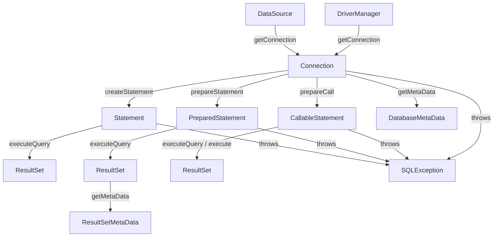
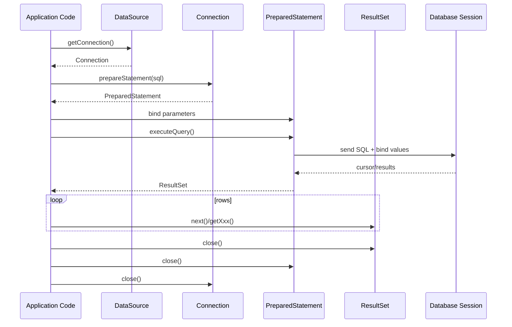

# Part 003 — JDBC Core Object Model: Connection, Statement, PreparedStatement, CallableStatement, ResultSet

## 1. Tujuan Part Ini

Part ini membangun pemahaman **object model inti JDBC**.

JDBC sering terlihat kecil karena contoh dasarnya hanya memakai empat object:

```java
try (Connection connection = dataSource.getConnection();
     PreparedStatement statement = connection.prepareStatement(
         "select id, email from users where id = ?"
     )) {

    statement.setLong(1, userId);

    try (ResultSet rs = statement.executeQuery()) {
        if (rs.next()) {
            return new User(rs.getLong("id"), rs.getString("email"));
        }
        return null;
    }
}
```

Tetapi secara production-grade, contoh di atas menyembunyikan banyak hal:

- `Connection` bukan sekadar object Java; ia adalah handle ke **database session**.
- `PreparedStatement` bukan sekadar string SQL; ia membawa parameter binding, execution state, timeout, cursor hint, dan result ownership.
- `ResultSet` bukan sekadar list row; ia sering merepresentasikan **cursor** yang bisa menahan resource di driver atau database.
- `SQLException` bukan sekadar exception; ia membawa SQLState, vendor code, chain, dan signal retryability.
- `close()` bukan detail kosmetik; ia menentukan apakah cursor, statement, session state, dan pooled connection kembali bersih.

Target part ini: setelah selesai, kamu harus bisa membaca kode JDBC dan langsung melihat **ownership**, **lifecycle**, **transaction implication**, dan **failure surface**.

---

## 2. Kaufman Deconstruction

Mengikuti pendekatan Kaufman, kita pecah skill “memahami JDBC object model” menjadi sub-skill kecil:

| Sub-skill | Yang Harus Dikuasai | Pertanyaan Self-Correction |
|---|---|---|
| Connection model | Memahami connection sebagai session + transaction context | Apakah connection ini physical, logical, pooled, atau raw? |
| Statement model | Memilih `Statement`, `PreparedStatement`, atau `CallableStatement` | Apakah SQL ini punya parameter value? Apakah perlu stored procedure? |
| Execution model | Memahami kapan query dikirim, kapan result dibuat, kapan resource dibuka | Apakah eksekusi menghasilkan rows, update count, generated keys, atau multiple results? |
| ResultSet model | Membaca row dengan cursor semantics | Apakah data ini streaming, buffered, forward-only, scrollable, read-only? |
| Metadata model | Menggunakan `DatabaseMetaData` dan `ResultSetMetaData` dengan hati-hati | Apakah introspection ini aman dan murah di path runtime? |
| Exception model | Mengklasifikasi error database | Apakah error ini transient, non-transient, recoverable, atau constraint violation? |
| Ownership model | Menentukan siapa yang harus menutup resource | Apakah setiap resource punya owner yang jelas? |

Prinsip besarnya:

> JDBC object tidak boleh dipahami sebagai POJO biasa. Banyak object JDBC adalah facade/proxy terhadap resource eksternal.

---

## 3. Big Picture: Object Relationship



Hubungan ownership umumnya:

```txt
DataSource owns pool or connection factory
Connection owns transaction/session context
Statement owns execution configuration and produced ResultSet
ResultSet owns cursor/read state
SQLException owns diagnostic information
```

Dalam kode manual, urutan close yang aman adalah:

```txt
ResultSet -> Statement -> Connection
```

Dengan `try-with-resources`, urutan close berjalan otomatis secara reverse order dari deklarasi resource.

---

## 4. `Connection`: Session, Transaction Context, and State Container

Dokumentasi Java mendeskripsikan `Connection` sebagai connection atau session dengan database tertentu. SQL statement dieksekusi dan result dikembalikan dalam konteks connection tersebut.

Secara mental model, `Connection` membawa beberapa hal sekaligus:

| Aspek | Arti Praktis |
|---|---|
| Database session | Server-side session/backend process/thread/context di database |
| Transaction context | Auto-commit, commit, rollback, isolation, savepoint |
| Statement factory | Membuat `Statement`, `PreparedStatement`, `CallableStatement` |
| Session state | Schema/catalog, read-only, client info, timezone/session variable tertentu |
| Error boundary | Banyak operasi pada connection bisa gagal karena database/network/driver |
| Resource boundary | Menutup connection mengakhiri atau mengembalikan resource, tergantung pooled atau non-pooled |

### 4.1 Connection Bukan “Database”

Kesalahan umum:

```txt
Aplikasi punya connection ke database.
```

Lebih presisi:

```txt
Satu object Connection merepresentasikan satu session/logical handle ke data source.
Dalam pooled environment, object yang kamu pegang biasanya proxy logical connection,
bukan physical socket mentah.
```

Satu aplikasi bisa punya banyak connection. Satu connection tidak boleh dipakai sembarangan lintas thread. Satu connection juga tidak otomatis berarti satu transaction global untuk seluruh aplikasi.

### 4.2 Connection sebagai Transaction Boundary

Beberapa method penting:

```java
connection.setAutoCommit(false);
connection.commit();
connection.rollback();
connection.setTransactionIsolation(Connection.TRANSACTION_READ_COMMITTED);
connection.setReadOnly(true);
```

Pada JDBC manual, **transaction melekat ke connection**.

Artinya:

- Jika dua DAO memakai connection berbeda, mereka tidak berada dalam transaction JDBC yang sama.
- Jika satu service membuka transaction lalu repository diam-diam membuka connection baru, atomicity bisa rusak.
- Jika connection dikembalikan ke pool dalam state yang tidak bersih, request berikutnya bisa terkena efek state lama.

Contoh bug:

```java
public void createOrder(Order order) throws SQLException {
    try (Connection connection = dataSource.getConnection()) {
        connection.setAutoCommit(false);

        orderDao.insert(order);          // BUG: DAO membuka connection sendiri
        inventoryDao.reserve(order);     // BUG: DAO membuka connection sendiri

        connection.commit();             // commit connection yang tidak dipakai DAO
    }
}
```

Perbaikan minimal:

```java
public void createOrder(Order order) throws SQLException {
    try (Connection connection = dataSource.getConnection()) {
        connection.setAutoCommit(false);
        try {
            orderDao.insert(connection, order);
            inventoryDao.reserve(connection, order);
            connection.commit();
        } catch (SQLException e) {
            connection.rollback();
            throw e;
        }
    }
}
```

Kita akan bahas transaction runner dan boundary pattern lebih dalam di part 010–014.

---

## 5. `Statement`: Raw SQL Execution Object

`Statement` adalah object untuk mengeksekusi SQL statis tanpa parameter binding.

Contoh:

```java
try (Statement statement = connection.createStatement();
     ResultSet rs = statement.executeQuery("select count(*) from users")) {

    rs.next();
    long count = rs.getLong(1);
}
```

### 5.1 Kapan `Statement` Valid Digunakan?

Gunakan `Statement` hanya ketika:

- SQL benar-benar statis.
- Tidak ada value dari user/request/input eksternal.
- Tidak ada parameter dinamis.
- Query administratif internal yang aman.
- DDL/migration utility tertentu dengan input terkontrol.

Contoh acceptable:

```java
try (Statement statement = connection.createStatement()) {
    statement.execute("create table if not exists health_check (id bigint primary key)");
}
```

Contoh berbahaya:

```java
String sql = "select * from users where email = '" + email + "'";
try (Statement statement = connection.createStatement();
     ResultSet rs = statement.executeQuery(sql)) {
    // SQL injection risk
}
```

### 5.2 Statement Carries Execution Configuration

`Statement` bukan hanya “executor”. Ia bisa membawa konfigurasi seperti:

```java
statement.setQueryTimeout(3);
statement.setFetchSize(500);
statement.setMaxRows(1000);
```

Namun beberapa behavior bersifat driver-specific. Jangan menganggap semua driver menafsirkan fetch size, timeout, cursor behavior, atau cancellation dengan cara identik.

### 5.3 Statement and ResultSet Ownership

Umumnya, result set dibuat oleh statement. Jika statement ditutup, result set yang dihasilkan juga tidak boleh lagi dipakai.

Anti-pattern:

```java
ResultSet findUsers(Connection connection) throws SQLException {
    try (Statement statement = connection.createStatement()) {
        return statement.executeQuery("select * from users");
    } // statement closed here, returned ResultSet is invalid/unsafe
}
```

Perbaikan:

```java
List<User> findUsers(Connection connection) throws SQLException {
    String sql = "select id, email from users";
    try (Statement statement = connection.createStatement();
         ResultSet rs = statement.executeQuery(sql)) {

        List<User> users = new ArrayList<>();
        while (rs.next()) {
            users.add(new User(rs.getLong("id"), rs.getString("email")));
        }
        return users;
    }
}
```

Rule:

> Jangan return `ResultSet` dari method repository kecuali kamu sedang membangun abstraction streaming yang sangat eksplisit dan lifecycle-nya dikendalikan dengan ketat.

---

## 6. `PreparedStatement`: SQL Template + Parameter Binding

`PreparedStatement` merepresentasikan SQL statement yang diprepare/precompiled dan dapat menerima parameter.

Contoh:

```java
String sql = "select id, email, status from users where email = ?";

try (PreparedStatement statement = connection.prepareStatement(sql)) {
    statement.setString(1, email);

    try (ResultSet rs = statement.executeQuery()) {
        if (!rs.next()) {
            return Optional.empty();
        }

        User user = new User(
            rs.getLong("id"),
            rs.getString("email"),
            rs.getString("status")
        );
        return Optional.of(user);
    }
}
```

### 6.1 PreparedStatement Solves Value Binding, Not Every Dynamic SQL Problem

Prepared statement aman untuk **value**, bukan identifier.

Valid:

```java
where email = ?
```

Tidak valid:

```java
select * from ?
order by ?
```

Table name, column name, sort direction, dan SQL keyword tidak bisa diparameterisasi sebagai value placeholder biasa.

Untuk identifier dinamis, gunakan allowlist:

```java
enum UserSortField {
    CREATED_AT("created_at"),
    EMAIL("email");

    private final String column;

    UserSortField(String column) {
        this.column = column;
    }

    String column() {
        return column;
    }
}

String sql = "select id, email from users order by " + sortField.column() + " limit ?";
try (PreparedStatement statement = connection.prepareStatement(sql)) {
    statement.setInt(1, limit);
    // execute
}
```

### 6.2 Parameter Index Starts at 1

JDBC parameter index dimulai dari `1`, bukan `0`.

```java
statement.setLong(1, id);
statement.setString(2, status);
```

Kesalahan index biasanya tertangkap cepat, tetapi dalam dynamic query builder yang kompleks, mismatch parameter order bisa menjadi bug serius.

### 6.3 Binding Null

Jangan selalu memakai `setObject(index, null)` tanpa memahami driver behavior. Gunakan `setNull` ketika tipe SQL diketahui:

```java
if (middleName == null) {
    statement.setNull(2, Types.VARCHAR);
} else {
    statement.setString(2, middleName);
}
```

### 6.4 Binding Date/Time

JDBC modern mendukung `setObject()` untuk banyak tipe `java.time`, tetapi behavior spesifik tetap tergantung driver dan database.

Contoh:

```java
statement.setObject(1, LocalDate.now());
statement.setObject(2, OffsetDateTime.now(ZoneOffset.UTC));
```

Kita akan bahas detail temporal correctness di part 009.

### 6.5 Reusing PreparedStatement

Prepared statement bisa dipakai berkali-kali dengan parameter berbeda:

```java
String sql = "insert into audit_log(entity_id, action) values (?, ?)";

try (PreparedStatement statement = connection.prepareStatement(sql)) {
    for (AuditEvent event : events) {
        statement.setLong(1, event.entityId());
        statement.setString(2, event.action());
        statement.addBatch();
    }
    statement.executeBatch();
}
```

Namun jangan cache `PreparedStatement` sebagai field singleton. Ia terikat ke connection tertentu dan membawa state.

Anti-pattern:

```java
class UserDao {
    private PreparedStatement cachedStatement; // dangerous
}
```

---

## 7. `CallableStatement`: Stored Procedure Boundary

`CallableStatement` digunakan untuk memanggil stored procedure atau database routine.

Contoh sederhana:

```java
try (CallableStatement statement = connection.prepareCall("{call close_account(?)}")) {
    statement.setLong(1, accountId);
    statement.execute();
}
```

Contoh dengan output parameter:

```java
try (CallableStatement statement = connection.prepareCall("{call calculate_score(?, ?)}")) {
    statement.setLong(1, userId);
    statement.registerOutParameter(2, Types.INTEGER);

    statement.execute();

    int score = statement.getInt(2);
}
```

### 7.1 Kapan Stored Procedure Boundary Masuk Akal?

Stored procedure bisa masuk akal ketika:

- logic harus dekat dengan data karena alasan performa atau atomicity,
- ada legacy database contract,
- security model database membutuhkan controlled procedure interface,
- operasi batch kompleks lebih efisien di database,
- integrasi dengan sistem lama sudah berbasis procedure.

Namun ada trade-off:

| Keuntungan | Risiko |
|---|---|
| Mengurangi round-trip | Logic tersebar antara app dan DB |
| Bisa memanfaatkan fitur DB vendor | Portability turun |
| Dekat dengan lock/transaction engine | Testing/versioning bisa lebih sulit |
| Cocok untuk legacy contract | Observability aplikasi bisa kurang jelas |

Rule:

> Gunakan `CallableStatement` ketika stored procedure memang bagian dari architecture contract, bukan karena aplikasi tidak punya boundary service yang jelas.

---

## 8. `ResultSet`: Cursor, Not Collection

`ResultSet` adalah representasi hasil query. Secara mental model, ia adalah cursor yang bergerak dari row ke row.

```java
while (rs.next()) {
    long id = rs.getLong("id");
    String email = rs.getString("email");
}
```

### 8.1 `next()` Moves the Cursor

Sebelum memanggil `next()`, cursor belum berada pada row valid.

```java
try (ResultSet rs = statement.executeQuery()) {
    if (rs.next()) {
        // now current row is valid
    }
}
```

Anti-pattern:

```java
try (ResultSet rs = statement.executeQuery()) {
    return rs.getString("email"); // invalid: cursor not positioned
}
```

### 8.2 Column Access by Name vs Index

By name:

```java
rs.getString("email")
```

By index:

```java
rs.getString(2)
```

Trade-off:

| Access | Pros | Cons |
|---|---|---|
| By name | Lebih readable, resilient terhadap urutan column | Bisa sedikit overhead, tergantung driver |
| By index | Potensi lebih cepat, cocok untuk mapper hot path | Rentan jika SELECT order berubah |

Untuk kebanyakan aplikasi bisnis, by name lebih maintainable. Untuk mapper low-level yang sangat hot dan terkontrol, by index bisa dipertimbangkan.

### 8.3 Null Semantics

JDBC primitive getter punya masalah: `getLong`, `getInt`, `getBoolean` tidak bisa mengembalikan `null`.

Contoh:

```java
long parentId = rs.getLong("parent_id");
if (rs.wasNull()) {
    // parent_id was SQL NULL
}
```

Alternatif lebih eksplisit:

```java
Long parentId = rs.getObject("parent_id", Long.class);
```

Namun dukungan typed `getObject` dapat bervariasi tergantung driver dan tipe database. Untuk domain penting, tulis mapper helper sendiri.

Contoh helper:

```java
static Long nullableLong(ResultSet rs, String column) throws SQLException {
    long value = rs.getLong(column);
    return rs.wasNull() ? null : value;
}
```

### 8.4 ResultSet Type and Concurrency

Saat membuat statement, kita bisa meminta result set dengan karakteristik tertentu:

```java
PreparedStatement statement = connection.prepareStatement(
    sql,
    ResultSet.TYPE_FORWARD_ONLY,
    ResultSet.CONCUR_READ_ONLY
);
```

Tipe umum:

| Type | Arti |
|---|---|
| `TYPE_FORWARD_ONLY` | Cursor hanya maju |
| `TYPE_SCROLL_INSENSITIVE` | Cursor bisa scroll, tidak sensitif terhadap perubahan setelah query |
| `TYPE_SCROLL_SENSITIVE` | Cursor bisa scroll dan mungkin sensitif terhadap perubahan |

Concurrency:

| Concurrency | Arti |
|---|---|
| `CONCUR_READ_ONLY` | Data hanya dibaca |
| `CONCUR_UPDATABLE` | ResultSet bisa digunakan untuk update row, jika driver/database mendukung |

Rule praktis:

> Default-kan ke forward-only read-only. Scrollable/updatable result set adalah fitur khusus, bukan default design untuk service modern.

---

## 9. `ResultSetMetaData`: Shape of the Result

`ResultSetMetaData` memberi informasi tentang column dalam result set:

```java
try (ResultSet rs = statement.executeQuery()) {
    ResultSetMetaData metaData = rs.getMetaData();
    int columnCount = metaData.getColumnCount();

    for (int i = 1; i <= columnCount; i++) {
        String columnName = metaData.getColumnName(i);
        String typeName = metaData.getColumnTypeName(i);
        int jdbcType = metaData.getColumnType(i);
    }
}
```

Use case valid:

- generic CSV export,
- admin/debug tooling,
- migration validation,
- data browser,
- dynamic reporting,
- framework/library code.

Use case yang perlu dicurigai:

- domain mapper runtime yang terus introspect metadata setiap query,
- hot path service request yang tidak butuh dynamic schema,
- menghindari explicit mapping karena malas mendefinisikan contract.

Rule:

> Metadata API powerful, tetapi introspection bukan pengganti domain contract.

---

## 10. `DatabaseMetaData`: Capabilities and Schema Discovery

`DatabaseMetaData` diperoleh dari connection:

```java
DatabaseMetaData metaData = connection.getMetaData();
String productName = metaData.getDatabaseProductName();
String productVersion = metaData.getDatabaseProductVersion();
boolean supportsBatch = metaData.supportsBatchUpdates();
```

Use case valid:

- framework initialization,
- migration tooling,
- compatibility check,
- schema introspection,
- generic database browser,
- diagnostics.

Hati-hati:

- Beberapa metadata call bisa mahal.
- Beberapa call bisa mengakses system catalog.
- Behavior dan completeness bisa berbeda antar vendor.
- Jangan taruh metadata discovery berat di request path.

Contoh anti-pattern:

```java
public User findById(long id) throws SQLException {
    DatabaseMetaData md = connection.getMetaData(); // unnecessary in hot path
    // query user
}
```

---

## 11. `SQLException`: Diagnostic Object, Not Just Failure Signal

`SQLException` membawa informasi lebih kaya daripada message string.

Contoh:

```java
catch (SQLException e) {
    log.error("Database error. sqlState={}, vendorCode={}, message={}",
        e.getSQLState(),
        e.getErrorCode(),
        e.getMessage(),
        e
    );
    throw e;
}
```

Informasi penting:

| Field | Arti |
|---|---|
| Message | Deskripsi error dari driver/database |
| SQLState | Kode standar/class error SQL |
| Vendor code | Kode spesifik database vendor |
| Next exception | Chain error tambahan |
| Subclass | Sinyal transient/non-transient/recoverable tertentu |

### 11.1 Jangan Hanya Log Message

Anti-pattern:

```java
catch (SQLException e) {
    log.error("DB failed: " + e.getMessage());
}
```

Masalah:

- stack trace hilang,
- SQLState hilang,
- vendor code hilang,
- chain exception hilang,
- retry classification sulit,
- incident diagnosis lambat.

Lebih baik:

```java
catch (SQLException e) {
    log.error("Database operation failed. sqlState={}, vendorCode={}",
        e.getSQLState(),
        e.getErrorCode(),
        e
    );
    throw translate(e);
}
```

### 11.2 Exception Chain

`SQLException` bisa punya next exception:

```java
for (Throwable throwable : e) {
    log.error("SQL exception chain item", throwable);
}
```

Jangan asumsikan root cause selalu ada di exception pertama.

---

## 12. Object Lifecycle Invariants

Core invariant JDBC manual:

```txt
A resource must not outlive the resource that created it.
```

Praktisnya:

```txt
ResultSet must not outlive Statement
Statement must not outlive Connection
Connection must not outlive transaction/use-case scope
```

Diagram lifecycle:



Dengan try-with-resources:

```java
try (Connection connection = dataSource.getConnection();
     PreparedStatement statement = connection.prepareStatement(SQL);
     ResultSet rs = statement.executeQuery()) {

    while (rs.next()) {
        // map row
    }
}
```

Namun ketika parameter binding dibutuhkan, biasanya result set dibuka dalam nested block:

```java
try (Connection connection = dataSource.getConnection();
     PreparedStatement statement = connection.prepareStatement(SQL)) {

    statement.setLong(1, id);

    try (ResultSet rs = statement.executeQuery()) {
        // map row
    }
}
```

---

## 13. Why Returning JDBC Objects Is Usually Wrong

Public API repository sebaiknya tidak membocorkan object JDBC.

Anti-pattern:

```java
public ResultSet findActiveUsers() throws SQLException {
    Connection connection = dataSource.getConnection();
    PreparedStatement statement = connection.prepareStatement(
        "select id, email from users where active = true"
    );
    return statement.executeQuery();
}
```

Masalah:

- Siapa yang close `ResultSet`?
- Siapa yang close `PreparedStatement`?
- Siapa yang close `Connection`?
- Bagaimana jika caller lupa?
- Bagaimana jika caller membaca lambat dan menahan connection terlalu lama?
- Bagaimana transaction boundary dijaga?

Lebih baik return domain object:

```java
public List<User> findActiveUsers(Connection connection) throws SQLException {
    String sql = "select id, email from users where active = true";

    try (PreparedStatement statement = connection.prepareStatement(sql);
         ResultSet rs = statement.executeQuery()) {

        List<User> users = new ArrayList<>();
        while (rs.next()) {
            users.add(mapUser(rs));
        }
        return users;
    }
}
```

Untuk streaming besar, buat abstraction yang eksplisit:

```java
@FunctionalInterface
interface RowHandler<T> {
    void handle(T row) throws SQLException;
}

public void streamActiveUsers(Connection connection, RowHandler<User> handler) throws SQLException {
    String sql = "select id, email from users where active = true";

    try (PreparedStatement statement = connection.prepareStatement(sql);
         ResultSet rs = statement.executeQuery()) {

        while (rs.next()) {
            handler.handle(mapUser(rs));
        }
    }
}
```

Dengan model ini, repository tetap mengendalikan lifecycle resource.

---

## 14. Ownership Pattern: Caller-Owned Connection, Callee-Owned Statement

Pattern manual yang baik:

```txt
Service/use-case owns Connection and transaction.
Repository/DAO owns PreparedStatement and ResultSet.
```

Contoh:

```java
public final class TransferService {
    private final DataSource dataSource;
    private final AccountRepository accountRepository;

    public void transfer(long fromAccountId, long toAccountId, BigDecimal amount) throws SQLException {
        try (Connection connection = dataSource.getConnection()) {
            connection.setAutoCommit(false);
            try {
                accountRepository.debit(connection, fromAccountId, amount);
                accountRepository.credit(connection, toAccountId, amount);
                connection.commit();
            } catch (SQLException e) {
                rollbackQuietly(connection, e);
                throw e;
            }
        }
    }
}
```

Repository:

```java
public final class AccountRepository {
    public void debit(Connection connection, long accountId, BigDecimal amount) throws SQLException {
        String sql = """
            update accounts
               set balance = balance - ?
             where id = ?
               and balance >= ?
            """;

        try (PreparedStatement statement = connection.prepareStatement(sql)) {
            statement.setBigDecimal(1, amount);
            statement.setLong(2, accountId);
            statement.setBigDecimal(3, amount);

            int updated = statement.executeUpdate();
            if (updated != 1) {
                throw new InsufficientBalanceException(accountId);
            }
        }
    }
}
```

Ownership clarity:

| Resource | Owner | Why |
|---|---|---|
| Connection | Service/use-case transaction boundary | Satu use-case bisa memanggil banyak repository dalam satu transaction |
| PreparedStatement | Repository method | Repository tahu SQL dan parameter |
| ResultSet | Repository method | Repository tahu mapping dan cursor lifecycle |

---

## 15. Generated Keys

Insert sering butuh primary key yang dihasilkan database.

```java
String sql = "insert into users(email, status) values (?, ?)";

try (PreparedStatement statement = connection.prepareStatement(
        sql,
        Statement.RETURN_GENERATED_KEYS
     )) {

    statement.setString(1, email);
    statement.setString(2, status);
    statement.executeUpdate();

    try (ResultSet keys = statement.getGeneratedKeys()) {
        if (!keys.next()) {
            throw new SQLException("No generated key returned");
        }
        long id = keys.getLong(1);
    }
}
```

Caveat:

- Behavior generated keys bisa berbeda antar database/driver.
- Batch generated keys punya kompleksitas tambahan.
- Beberapa database lebih cocok memakai `RETURNING` clause.
- Jangan menganggap semua insert pasti mengembalikan satu key.

---

## 16. Batch State in Statement Objects

Statement membawa batch state.

```java
try (PreparedStatement statement = connection.prepareStatement(
        "insert into tags(name) values (?)"
     )) {

    for (String tag : tags) {
        statement.setString(1, tag);
        statement.addBatch();
    }

    int[] counts = statement.executeBatch();
}
```

Rule:

- Batch adalah stateful.
- Jangan reuse statement tanpa memahami batch state.
- Tangani partial failure dengan hati-hati.
- Batch besar bisa menahan memory/lock/transaction terlalu lama.

Kita akan bahas batch secara khusus di part 026.

---

## 17. Statement Configuration as Local Policy

Beberapa konfigurasi statement adalah policy per operation.

Contoh:

```java
try (PreparedStatement statement = connection.prepareStatement(sql)) {
    statement.setQueryTimeout(2);
    statement.setFetchSize(1000);
    statement.setMaxRows(10_000);

    try (ResultSet rs = statement.executeQuery()) {
        // read
    }
}
```

Gunakan ini untuk membedakan workload:

| Workload | Policy |
|---|---|
| Request path API | Timeout pendek, max rows jelas |
| Admin export | Fetch size besar, streaming, timeout lebih longgar |
| Batch job | Chunking, explicit transaction boundary |
| Health check | Timeout sangat pendek |

Anti-pattern:

```java
// Semua query tanpa timeout, tanpa max rows, tanpa workload classification.
```

---

## 18. Mapping Pattern: Keep It Boring

Mapper row sebaiknya eksplisit, kecil, dan mudah diuji.

```java
private static User mapUser(ResultSet rs) throws SQLException {
    return new User(
        rs.getLong("id"),
        rs.getString("email"),
        UserStatus.valueOf(rs.getString("status")),
        rs.getObject("created_at", OffsetDateTime.class)
    );
}
```

Untuk nullable field:

```java
private static UserProfile mapProfile(ResultSet rs) throws SQLException {
    return new UserProfile(
        rs.getLong("user_id"),
        rs.getString("display_name"),
        nullableString(rs, "bio"),
        nullableLong(rs, "avatar_file_id")
    );
}
```

Rule:

- Jangan sembunyikan terlalu banyak magic di mapper.
- Jangan membuat reflection mapper generik untuk domain kritikal tanpa observability dan test kuat.
- Jangan mapping `BigDecimal` ke `double` untuk uang.
- Jangan mapping timestamp tanpa timezone thinking.

---

## 19. Bad Pattern Catalog

### 19.1 Connection as Field

```java
class UserRepository {
    private final Connection connection;
}
```

Mengapa buruk:

- transaction boundary menjadi kabur,
- tidak thread-safe,
- stale connection risk,
- pool lifecycle rusak,
- sulit test,
- connection bisa ditahan terlalu lama.

### 19.2 Statement as Field

```java
class UserRepository {
    private PreparedStatement findById;
}
```

Mengapa buruk:

- statement terikat connection,
- parameter state bisa bocor,
- tidak thread-safe,
- close lifecycle tidak jelas.

### 19.3 ResultSet Escapes Scope

```java
return resultSet;
```

Mengapa buruk:

- caller harus tahu resource yang harus ditutup,
- connection bisa tertahan,
- cursor bisa leak,
- transaction bisa hidup terlalu lama.

### 19.4 Catch and Ignore SQLException

```java
catch (SQLException ignored) {
}
```

Mengapa buruk:

- rollback mungkin tidak terjadi,
- data inconsistency disembunyikan,
- incident diagnosis hilang,
- pool state bisa rusak.

### 19.5 Build SQL with Values by Concatenation

```java
String sql = "select * from users where email = '" + email + "'";
```

Mengapa buruk:

- SQL injection,
- escaping error,
- query plan/cache behavior buruk,
- observability lebih sulit.

---

## 20. Good Pattern Catalog

### 20.1 Try-With-Resources for Every JDBC Resource

```java
try (Connection connection = dataSource.getConnection();
     PreparedStatement statement = connection.prepareStatement(sql)) {

    statement.setLong(1, id);

    try (ResultSet rs = statement.executeQuery()) {
        // map
    }
}
```

### 20.2 Explicit Transaction Ownership

```java
try (Connection connection = dataSource.getConnection()) {
    connection.setAutoCommit(false);
    try {
        repositoryA.doSomething(connection);
        repositoryB.doSomething(connection);
        connection.commit();
    } catch (SQLException e) {
        connection.rollback();
        throw e;
    }
}
```

### 20.3 PreparedStatement for Values

```java
where email = ?
```

### 20.4 Allowlist for Identifiers

```java
order by created_at desc
```

built from enum/allowlist, not raw request value.

### 20.5 Mapper as Boundary

```java
private static User mapUser(ResultSet rs) throws SQLException
```

Simple, explicit, testable.

---

## 21. Code Review Checklist

Gunakan checklist ini saat review kode JDBC:

### Resource Lifecycle

- Apakah setiap `Connection`, `Statement`, dan `ResultSet` ditutup?
- Apakah close order aman?
- Apakah ada `ResultSet`/`Statement` yang keluar dari scope?
- Apakah connection ditahan lebih lama dari perlu?

### Transaction Boundary

- Siapa owner transaction?
- Apakah semua repository dalam use-case memakai connection yang sama?
- Apakah rollback terjadi pada exception?
- Apakah auto-commit state jelas?

### SQL Safety

- Apakah value memakai parameter binding?
- Apakah dynamic identifier memakai allowlist?
- Apakah query punya batas row/timeout jika di request path?

### Error Handling

- Apakah `SQLException` dilog dengan SQLState/vendor code?
- Apakah exception tidak ditelan?
- Apakah retry tidak dilakukan sembarangan?

### Mapping

- Apakah nullable primitive ditangani?
- Apakah money memakai `BigDecimal`?
- Apakah timestamp mapping jelas?

---

## 22. Deliberate Practice

### Exercise 1 — Find the Ownership Bug

Kode:

```java
public ResultSet findOrders(long customerId) throws SQLException {
    Connection connection = dataSource.getConnection();
    PreparedStatement statement = connection.prepareStatement(
        "select id, total from orders where customer_id = ?"
    );
    statement.setLong(1, customerId);
    return statement.executeQuery();
}
```

Tugas:

- Identifikasi semua resource leak.
- Jelaskan siapa yang seharusnya menjadi owner resource.
- Rewrite menjadi method yang return `List<OrderSummary>`.

### Exercise 2 — Fix Transaction Boundary

Kode:

```java
public void approveInvoice(long invoiceId) throws SQLException {
    try (Connection connection = dataSource.getConnection()) {
        connection.setAutoCommit(false);
        invoiceRepository.markApproved(invoiceId);
        ledgerRepository.recordApproval(invoiceId);
        connection.commit();
    }
}
```

Tugas:

- Temukan bug boundary.
- Rewrite agar kedua repository berpartisipasi dalam transaction yang sama.
- Tambahkan rollback path.

### Exercise 3 — Classify JDBC Objects

Untuk setiap object berikut, jawab apakah aman disimpan sebagai field singleton service:

- `DataSource`
- `Connection`
- `PreparedStatement`
- `ResultSet`
- `DatabaseMetaData`

Jawaban ringkas:

| Object | Aman sebagai field singleton? | Reason |
|---|---:|---|
| `DataSource` | Ya | Thread-safe tergantung implementation, lazim sebagai shared factory/pool |
| `Connection` | Tidak | Session/transaction/resource handle |
| `PreparedStatement` | Tidak | Terikat connection dan stateful |
| `ResultSet` | Tidak | Cursor/read state |
| `DatabaseMetaData` | Biasanya tidak perlu | Dapat diambil saat init/diagnostic; jangan jadikan runtime dependency sembarangan |

---

## 23. Summary

JDBC core object model bisa diringkas dengan beberapa rule:

1. `Connection` adalah session + transaction context, bukan sekadar object transport.
2. `Statement` adalah execution object dengan lifecycle dan configuration.
3. `PreparedStatement` adalah default untuk SQL dengan value parameter.
4. `CallableStatement` adalah boundary ke stored procedure.
5. `ResultSet` adalah cursor, bukan collection.
6. Metadata API berguna, tetapi jangan dipakai sebagai pengganti explicit contract.
7. `SQLException` adalah diagnostic object; jangan buang SQLState/vendor code.
8. Resource ownership harus eksplisit.
9. Jangan biarkan JDBC object bocor keluar dari scope yang mengelola lifecycle-nya.
10. Service/use-case sebaiknya memiliki connection/transaction; repository memiliki statement/result set.

Part berikutnya akan memperbesar satu object paling berbahaya: **Connection lifecycle** dari borrow sampai close, terutama dalam konteks pooled connection.

---

## 24. References

- Java SE 25 `java.sql` package documentation: `https://docs.oracle.com/en/java/javase/25/docs/api/java.sql/java/sql/package-summary.html`
- Java SE 25 `Connection` documentation: `https://docs.oracle.com/en/java/javase/25/docs/api/java.sql/java/sql/Connection.html`
- Java SE 25 `Statement` documentation: `https://docs.oracle.com/en/java/javase/25/docs/api/java.sql/java/sql/Statement.html`
- Java SE 25 `PreparedStatement` documentation: `https://docs.oracle.com/en/java/javase/25/docs/api/java.sql/java/sql/PreparedStatement.html`
- Java SE 25 `DataSource` documentation: `https://docs.oracle.com/en/java/javase/25/docs/api/java.sql/javax/sql/DataSource.html`
