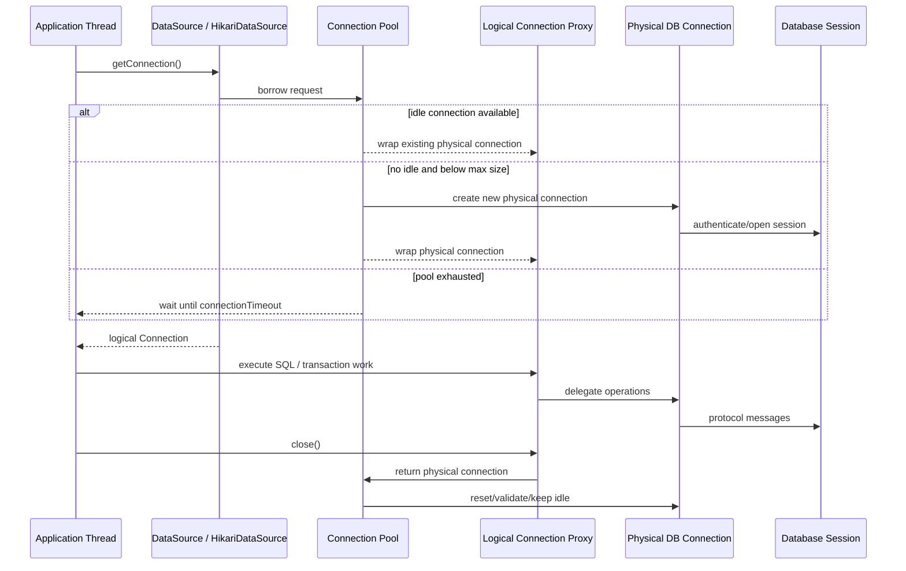
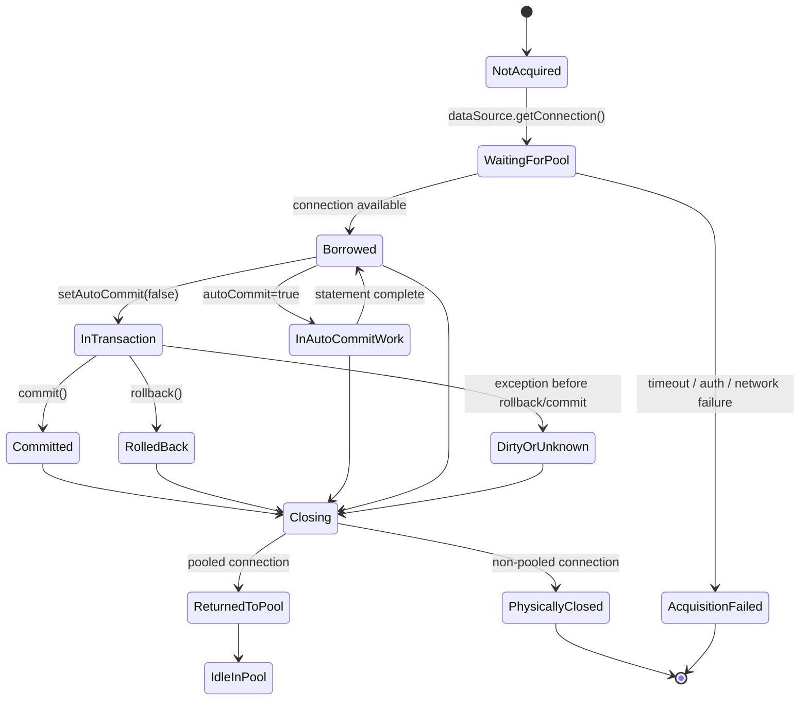
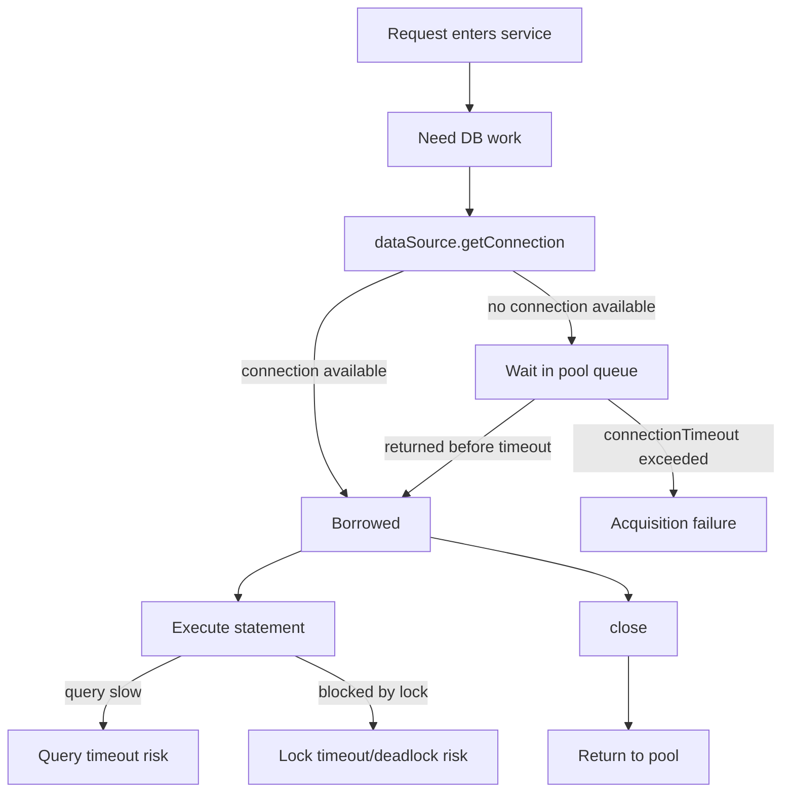
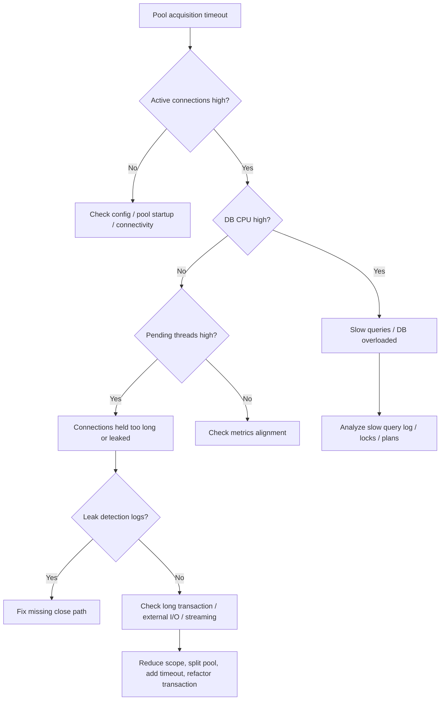

# Part 004 — Connection Lifecycle: From Borrow to Close

## 1. Tujuan Part Ini

Part ini fokus pada lifecycle `Connection`, object JDBC yang paling sering disalahpahami.

Di kode sederhana, connection terlihat seperti resource biasa:

```java
try (Connection connection = dataSource.getConnection()) {
    // use connection
}
```

Tetapi di production, `Connection` adalah pusat dari beberapa risiko:

- connection leak,
- pool exhaustion,
- transaction menggantung,
- session state bocor ke request berikutnya,
- lock tertahan terlalu lama,
- stale connection setelah network/database failover,
- thread blocking saat menunggu pool,
- rollback tidak terjadi,
- close dianggap selalu physical close padahal pooled close biasanya return-to-pool.

Target part ini: kamu mampu melihat lifecycle connection sebagai **state machine**, bukan sebagai “buka-tutup koneksi”.

---

## 2. Core Mental Model

Dalam sistem modern, `Connection` yang diterima dari `DataSource` biasanya adalah **logical connection** atau proxy dari pool.

```txt
Application code does not usually own the physical database connection.
Application code borrows a logical connection from a pool.
Calling close() usually returns it to the pool, not necessarily closes the socket.
```

Diagram besar:



Critical point:

> Dalam pooled environment, `close()` adalah semantic return. Kamu tetap wajib memanggilnya.

Jika tidak dipanggil, pool menganggap connection masih dipinjam.

---

## 3. Kaufman Deconstruction

Skill connection lifecycle bisa dipecah menjadi:

| Sub-skill | Fokus | Self-Correction Question |
|---|---|---|
| Acquisition | Dari mana connection diperoleh | Apakah dari `DataSource`, pool, atau `DriverManager`? |
| Ownership | Siapa yang bertanggung jawab menutup | Apakah caller yang borrow juga close? |
| Scope | Berapa lama connection dipakai | Apakah connection hidup selama satu operation, transaction, request, stream, atau job? |
| State | Apa state connection saat dipinjam/dikembalikan | Auto-commit, isolation, read-only, schema, catalog, session variables? |
| Failure path | Apa yang terjadi saat exception | Apakah rollback dan close tetap terjadi? |
| Pool semantics | Apa arti `close()` | Physical close atau return-to-pool? |
| Leak detection | Bagaimana tahu ada leak | Metrics, timeout, stack trace, active/pending connection? |
| Reset and validation | Bagaimana memastikan connection reusable | Apakah pool/driver reset state dengan benar? |

---

## 4. Connection Lifecycle State Machine



State yang paling berbahaya adalah:

```txt
Borrowed too long
InTransaction too long
DirtyOrUnknown then returned incorrectly
Not closed
```

---

## 5. Acquisition: `DataSource.getConnection()`

`DataSource` adalah abstraction utama untuk memperoleh connection. Dalam production application, biasanya ia merepresentasikan pool seperti HikariCP.

```java
try (Connection connection = dataSource.getConnection()) {
    // use connection
}
```

Dari perspektif aplikasi, `getConnection()` bisa:

- langsung mengembalikan idle connection,
- membuat physical connection baru jika pool belum penuh,
- menunggu connection dikembalikan jika pool exhausted,
- gagal karena timeout acquisition,
- gagal karena authentication,
- gagal karena database down,
- gagal karena network/DNS/TLS issue.

Jangan treat `getConnection()` sebagai operasi lokal murah tanpa failure.

### 5.1 Acquisition Belongs Near the Boundary

Connection sebaiknya diperoleh sedekat mungkin dengan use-case boundary.

Baik:

```java
public void approveOrder(long orderId) throws SQLException {
    try (Connection connection = dataSource.getConnection()) {
        connection.setAutoCommit(false);
        try {
            orderRepository.approve(connection, orderId);
            auditRepository.record(connection, orderId, "APPROVED");
            connection.commit();
        } catch (SQLException e) {
            connection.rollback();
            throw e;
        }
    }
}
```

Buruk:

```java
class OrderRepository {
    private final Connection connection;

    OrderRepository(Connection connection) {
        this.connection = connection;
    }
}
```

Mengapa buruk:

- lifecycle connection melekat ke object repository,
- repository sulit dipakai lintas transaction,
- connection bisa hidup selama umur bean,
- thread-safety rusak,
- pool bisa exhausted.

---

## 6. Borrow-Use-Return Pattern

Pattern normal untuk pooled connection:

```txt
borrow -> use -> close/return
```

Dalam kode:

```java
try (Connection connection = dataSource.getConnection()) {
    executeWork(connection);
}
```

`try-with-resources` menjamin `close()` dipanggil saat keluar dari block, termasuk saat exception.

Namun untuk transaction manual, perlu rollback eksplisit:

```java
try (Connection connection = dataSource.getConnection()) {
    connection.setAutoCommit(false);
    try {
        businessOperation(connection);
        connection.commit();
    } catch (SQLException | RuntimeException e) {
        try {
            connection.rollback();
        } catch (SQLException rollbackError) {
            e.addSuppressed(rollbackError);
        }
        throw e;
    }
}
```

Perhatikan:

- `close()` bukan pengganti `rollback()` yang jelas.
- Beberapa driver/pool mungkin melakukan cleanup saat close, tetapi production code tidak boleh bergantung pada behavior implisit untuk correctness.
- Rollback failure harus disimpan sebagai suppressed exception agar diagnosa tidak hilang.

Helper:

```java
static void rollbackQuietly(Connection connection, Throwable original) {
    try {
        connection.rollback();
    } catch (SQLException rollbackError) {
        original.addSuppressed(rollbackError);
    }
}
```

---

## 7. Physical Connection vs Logical Connection

Perbedaan ini fundamental.

| Type | Arti | Siapa Owner? |
|---|---|---|
| Physical connection | Actual database protocol connection/socket/session | Pool/driver |
| Logical connection | Object yang diberikan ke application code | Application until close |
| Proxy connection | Wrapper yang intercept `close()`, state mutation, validation | Pool |

Dalam pool:

```java
Connection connection = hikariDataSource.getConnection();
```

Object itu sering bukan class driver asli. Ia bisa proxy yang:

- mencatat waktu borrow,
- intercept `close()`,
- mengembalikan physical connection ke pool,
- mendeteksi leak,
- reset state,
- expose metrics,
- mencegah usage setelah close.

Jangan bergantung pada concrete class connection.

Anti-pattern:

```java
PostgresqlConnection pg = (PostgresqlConnection) dataSource.getConnection();
```

Lebih baik gunakan `unwrap` jika benar-benar perlu API vendor:

```java
PGConnection pgConnection = connection.unwrap(PGConnection.class);
```

Gunakan hanya di boundary yang terisolasi dan punya fallback/guard.

---

## 8. What Does `close()` Mean?

### 8.1 Non-Pooled Connection

Jika connection dibuat langsung via driver/`DriverManager`, `close()` biasanya menutup physical connection/session.

```java
try (Connection connection = DriverManager.getConnection(url, user, password)) {
    // use
} // physical close
```

### 8.2 Pooled Connection

Jika connection berasal dari pool, `close()` biasanya:

- menandai logical connection closed,
- mengembalikan physical connection ke pool,
- melakukan state reset/cleanup sesuai pool,
- membuat physical connection bisa dipinjam request lain.

```java
try (Connection connection = dataSource.getConnection()) {
    // use
} // return to pool
```

Critical rule:

> Jangan menghindari `close()` karena takut menutup database connection. Pada pooled connection, `close()` justru cara mengembalikannya.

Anti-pattern:

```java
Connection connection = dataSource.getConnection();
// no close because "pool will manage it"
```

Pool tidak bisa mengembalikan connection yang masih dianggap borrowed.

---

## 9. Connection Scope

Connection scope sebaiknya sekecil mungkin tetapi cukup besar untuk transaction boundary.

| Scope | Biasanya Baik? | Catatan |
|---|---:|---|
| One query | Ya untuk read sederhana | Auto-commit mode atau read-only operation |
| One use-case transaction | Ya | Pattern umum service-layer transaction |
| Whole HTTP request | Tergantung | Bisa buruk jika request melakukan external call/processing lama |
| Whole stream/export | Hati-hati | Bisa menahan connection lama; butuh explicit design |
| Whole batch job | Buruk | Gunakan chunking transaction |
| Singleton application lifetime | Sangat buruk | Leak/pool starvation/stale session |

Rule:

```txt
Hold a connection for the duration of database work, not for the duration of unrelated application work.
```

Buruk:

```java
try (Connection connection = dataSource.getConnection()) {
    Order order = orderRepository.find(connection, orderId);
    PaymentResult payment = paymentClient.charge(order); // external API while holding connection
    orderRepository.markPaid(connection, orderId, payment.id());
}
```

Lebih baik:

```java
Order order;
try (Connection connection = dataSource.getConnection()) {
    order = orderRepository.find(connection, orderId);
}

PaymentResult payment = paymentClient.charge(order);

try (Connection connection = dataSource.getConnection()) {
    connection.setAutoCommit(false);
    try {
        orderRepository.markPaid(connection, orderId, payment.id());
        outboxRepository.insertPaymentCaptured(connection, orderId, payment.id());
        connection.commit();
    } catch (SQLException e) {
        connection.rollback();
        throw e;
    }
}
```

Namun ini membawa problem consistency/idempotency yang akan dibahas di part 021 dan 025.

---

## 10. Thread Ownership

`Connection` tidak boleh dipakai sembarangan lintas thread.

Anti-pattern:

```java
Connection connection = dataSource.getConnection();

CompletableFuture<Void> a = CompletableFuture.runAsync(() -> repositoryA.save(connection));
CompletableFuture<Void> b = CompletableFuture.runAsync(() -> repositoryB.save(connection));

CompletableFuture.allOf(a, b).join();
connection.close();
```

Masalah:

- JDBC connection umumnya tidak didesain untuk concurrent use oleh banyak thread.
- Transaction state menjadi race-prone.
- Statement/result set interleaving bisa kacau.
- Driver behavior tidak portable.
- Error handling dan rollback menjadi ambigu.

Rule:

> Treat `Connection` as single-thread confined unless a specific driver documentation and architecture explicitly prove otherwise. Even then, prefer not to share.

Untuk parallel query, gunakan connection terpisah dan desain transaction semantics secara eksplisit. Jangan memaksakan satu transaction JDBC dipakai paralel lintas thread.

---

## 11. Connection State That Can Leak

Connection membawa state. Dalam pooled environment, state ini harus dikembalikan ke default sebelum physical connection dipakai request lain.

State penting:

| State | Example | Risiko Jika Bocor |
|---|---|---|
| Auto-commit | `setAutoCommit(false)` | Request berikutnya tidak auto-commit |
| Isolation | `setTransactionIsolation(...)` | Query berikutnya memakai isolation tidak diharapkan |
| Read-only | `setReadOnly(true)` | Write berikutnya gagal/dioptimisasi salah |
| Catalog/schema | `setCatalog`, `setSchema` | Query menyasar schema salah |
| Holdability | cursor holdability | Cursor behavior berbeda |
| Client info | `setClientInfo` | Observability salah |
| Session variables | `set timezone`, `set role`, vendor-specific | Security/logic bug |
| Warnings | SQL warnings | Diagnostic noise |

Modern pool seperti HikariCP dirancang untuk mengelola/reset state tertentu, tetapi kamu tetap harus menulis code dengan asumsi:

```txt
Any state you change must be intentional, scoped, and preferably restored or configured centrally.
```

### 11.1 Auto-Commit Leak

Bug klasik:

```java
Connection connection = dataSource.getConnection();
connection.setAutoCommit(false);
repository.save(connection, entity);
connection.close(); // no commit/rollback path shown
```

Jika pool tidak membersihkan dengan benar atau code path rusak, connection bisa kembali dengan transaction state buruk.

Pattern benar:

```java
try (Connection connection = dataSource.getConnection()) {
    connection.setAutoCommit(false);
    try {
        repository.save(connection, entity);
        connection.commit();
    } catch (Throwable t) {
        rollbackQuietly(connection, t);
        throw t;
    }
}
```

### 11.2 Isolation Leak

```java
connection.setTransactionIsolation(Connection.TRANSACTION_SERIALIZABLE);
```

Jika ini dilakukan ad hoc tanpa restore atau pool reset, request lain bisa terkena isolation lebih mahal.

Lebih baik:

- Set isolation di transaction boundary.
- Dokumentasikan alasan.
- Hindari mengubah isolation di repository method tersembunyi.
- Gunakan framework transaction manager jika available.

---

## 12. State Reset: Who Is Responsible?

Ada tiga lapisan responsibility:

| Layer | Responsibility |
|---|---|
| Application code | Jangan membuat state mutation liar; commit/rollback eksplisit; close selalu |
| Pool | Reset/validate connection sebelum reuse sesuai kemampuan/config |
| Driver/database | Menjalankan protocol/session semantics |

Jangan melempar semua tanggung jawab ke pool. Pool adalah safety net dan performance component, bukan pengganti transaction discipline.

Checklist setelah operation:

```txt
Did I commit or rollback?
Did I close all statements/result sets?
Did I close the connection?
Did I avoid external calls while holding it?
Did I avoid storing it beyond scope?
Did I avoid mutating connection state in deep repository code?
```

---

## 13. Connection Acquisition Timeout vs Query Timeout

Banyak engineer mencampur timeout.

```txt
connectionTimeout != queryTimeout != socketTimeout != lockTimeout
```

| Timeout | Terjadi Saat | Contoh Failure |
|---|---|---|
| Pool acquisition timeout | Menunggu connection dari pool | Pool exhausted |
| Query timeout | Statement execution terlalu lama | Query slow/blocking |
| Lock timeout | Menunggu lock database terlalu lama | Row locked by another transaction |
| Socket timeout | Network read/write macet | Network partition |
| Transaction timeout | Whole transaction melebihi budget | Long transaction |

Connection lifecycle berhubungan langsung dengan acquisition timeout: jika semua connection borrowed terlalu lama, request baru akan menunggu sampai timeout.

Diagram:



Part 020 akan membahas timeout design end-to-end.

---

## 14. Connection Leak

Connection leak terjadi ketika application code meminjam connection tetapi tidak mengembalikannya.

Contoh sederhana:

```java
public User findById(long id) throws SQLException {
    Connection connection = dataSource.getConnection();
    PreparedStatement statement = connection.prepareStatement(
        "select id, email from users where id = ?"
    );
    statement.setLong(1, id);
    ResultSet rs = statement.executeQuery();

    if (rs.next()) {
        return mapUser(rs); // leak: rs, statement, connection not closed
    }
    return null; // leak too
}
```

Leak pattern sering tidak langsung terlihat karena:

- hanya terjadi pada exception path,
- hanya terjadi pada early return,
- hanya terjadi pada rare branch,
- hanya terjadi saat stream tidak dikonsumsi penuh,
- hanya terjadi saat future/callback gagal,
- hanya terjadi saat custom abstraction lupa close.

### 14.1 Leak Symptoms

Gejala production:

- active connections terus naik,
- idle connections turun ke nol,
- pending threads naik,
- request latency naik,
- pool acquisition timeout,
- database CPU belum tentu tinggi,
- thread dump menunjukkan banyak thread menunggu pool,
- leak detection log menunjukkan stack trace peminjam connection.

### 14.2 Leak Detection Is Not a Fix

HikariCP punya `leakDetectionThreshold`, tetapi itu alat diagnosis, bukan solusi utama.

Rule:

```txt
Use leak detection to find lifecycle bugs.
Use try-with-resources and ownership discipline to prevent them.
```

---

## 15. Long-Held Connection

Tidak semua pool exhaustion berasal dari leak. Kadang connection ditutup, tetapi ditahan terlalu lama.

Contoh:

```java
try (Connection connection = dataSource.getConnection()) {
    List<Customer> customers = repository.findCustomers(connection);

    for (Customer customer : customers) {
        emailClient.send(customer.email()); // slow external I/O while holding connection
    }
}
```

Connection tidak leak, tetapi lifetime terlalu panjang.

Lebih baik:

```java
List<Customer> customers;
try (Connection connection = dataSource.getConnection()) {
    customers = repository.findCustomers(connection);
}

for (Customer customer : customers) {
    emailClient.send(customer.email());
}
```

Untuk data sangat besar, jangan langsung load semua. Gunakan job design yang memisahkan DB page/chunk dari external work.

---

## 16. Transaction Holds Connection

Transaction manual menahan connection sepanjang transaction.

```java
connection.setAutoCommit(false);
// work
connection.commit();
```

Semakin lama transaction:

- semakin lama connection borrowed,
- semakin lama lock/snapshot bisa tertahan,
- semakin besar risiko deadlock/blocking,
- semakin buruk pool availability,
- semakin buruk vacuum/cleanup behavior pada beberapa database MVCC,
- semakin besar blast radius saat failure.

Rule:

> Keep transactions short, deterministic, and free from unrelated I/O.

Buruk:

```java
try (Connection connection = dataSource.getConnection()) {
    connection.setAutoCommit(false);
    orderRepository.insert(connection, order);
    fraudApi.check(order); // external call inside transaction
    orderRepository.markChecked(connection, order.id());
    connection.commit();
}
```

Lebih baik gunakan state machine/outbox/saga/idempotency sesuai kebutuhan. Ini akan dibahas di part 021.

---

## 17. `isClosed()` Is Not a Health Check

`connection.isClosed()` hanya memberi tahu apakah object connection sudah ditutup menurut driver/proxy. Ia bukan health check lengkap bahwa database masih reachable dan query akan sukses.

Anti-pattern:

```java
if (!connection.isClosed()) {
    // assume DB is healthy
}
```

Lebih tepat:

- Untuk pool: biarkan pool validation bekerja.
- Untuk app health check: jalankan query ringan dengan timeout pendek, atau gunakan `isValid(timeout)` jika sesuai.
- Untuk request path: tetap handle `SQLException`.

Contoh:

```java
boolean valid = connection.isValid(2);
```

Tetapi jangan menjalankan validation manual di setiap query normal. Itu menambah round-trip dan latency.

---

## 18. Connection Validation

Pool perlu memastikan connection idle masih valid, terutama setelah:

- database restart,
- failover,
- network idle timeout,
- load balancer timeout,
- firewall timeout,
- credential rotation,
- server closes idle session.

HikariCP menyediakan mekanisme validation dan konfigurasi seperti `validationTimeout`, `keepaliveTime`, dan `maxLifetime`. Detail konfigurasinya akan dibahas di part 017–018.

Mental model:

```txt
maxLifetime prevents very old physical connections from living forever.
keepalive can prevent idle infrastructure from silently killing connections.
validationTimeout limits how long validation may block.
```

Jangan mengatur nilai ini sembarangan. Ia harus selaras dengan:

- database timeout,
- network/load balancer idle timeout,
- cloud managed database behavior,
- failover characteristics,
- application latency budget.

---

## 19. Connection Close Failure

`close()` bisa melempar `SQLException`.

Dengan try-with-resources, exception saat close dapat menjadi suppressed exception jika ada exception utama.

Contoh:

```java
try (Connection connection = dataSource.getConnection()) {
    businessWork(connection);
}
```

Jika `businessWork` throw exception dan `close()` juga gagal, Java menyimpan close failure sebagai suppressed exception.

Saat logging, pastikan stack trace lengkap tidak hilang.

Anti-pattern:

```java
try {
    connection.close();
} catch (SQLException ignored) {
}
```

Jika harus close manual:

```java
try {
    connection.close();
} catch (SQLException closeError) {
    log.warn("Failed to close JDBC connection", closeError);
}
```

Untuk transaction rollback failure:

```java
catch (Throwable original) {
    try {
        connection.rollback();
    } catch (SQLException rollbackError) {
        original.addSuppressed(rollbackError);
    }
    throw original;
}
```

---

## 20. Connection Lifetime in Batch Jobs

Batch job sering menjadi sumber masalah karena engineer menahan satu connection untuk seluruh job.

Buruk:

```java
try (Connection connection = dataSource.getConnection()) {
    connection.setAutoCommit(false);
    for (Record record : millionRecords) {
        repository.insert(connection, record);
    }
    connection.commit();
}
```

Masalah:

- transaction raksasa,
- lock/snapshot lama,
- rollback mahal,
- pool connection tertahan lama,
- redo/WAL/log pressure,
- memory driver/database bisa naik,
- failure di akhir membuang semua progress.

Lebih baik chunking:

```java
for (List<Record> chunk : chunks(records, 1000)) {
    try (Connection connection = dataSource.getConnection()) {
        connection.setAutoCommit(false);
        try {
            repository.insertBatch(connection, chunk);
            connection.commit();
        } catch (Throwable t) {
            rollbackQuietly(connection, t);
            throw t;
        }
    }
}
```

Namun chunking harus didesain dengan idempotency/progress tracking agar restart aman.

---

## 21. Streaming and Connection Lifetime

Streaming result set bisa menghemat memory, tetapi memperpanjang connection lifetime.

Contoh:

```java
try (Connection connection = dataSource.getConnection();
     PreparedStatement statement = connection.prepareStatement(sql);
     ResultSet rs = statement.executeQuery()) {

    while (rs.next()) {
        exportWriter.write(mapRow(rs));
    }
}
```

Risiko:

- connection ditahan selama export,
- transaction/snapshot bisa panjang,
- client lambat membuat DB resource tertahan,
- jika output network lambat, DB connection ikut tertahan,
- pool untuk request normal bisa habis.

Pattern mitigasi:

- Gunakan pool terpisah untuk export/reporting.
- Gunakan pagination/chunking jika consistency requirement memungkinkan.
- Gunakan timeout dan cancellation.
- Jangan kirim data ke client lambat sambil menahan transaction kritikal.
- Batasi concurrency export.

---

## 22. Connection and Frameworks

Framework seperti Spring sering menyembunyikan lifecycle connection.

Contoh dengan Spring `@Transactional`:

```java
@Transactional
public void approveOrder(long orderId) {
    orderRepository.approve(orderId);
    auditRepository.record(orderId, "APPROVED");
}
```

Di balik layar, transaction manager bisa:

- mengambil connection dari `DataSource`,
- bind connection ke thread,
- set auto-commit false,
- commit/rollback di akhir method,
- mengembalikan connection ke pool.

Tetapi mental model tetap sama:

```txt
Connection is still borrowed.
Transaction is still tied to a connection.
Long method means long borrowed connection.
External call inside transaction is still dangerous.
```

Framework mengurangi boilerplate, bukan menghapus physics.

---

## 23. Lifecycle-Safe Utility Pattern

Untuk JDBC manual, buat utility kecil agar lifecycle konsisten.

```java
public final class JdbcExecutor {
    private final DataSource dataSource;

    public JdbcExecutor(DataSource dataSource) {
        this.dataSource = dataSource;
    }

    public <T> T inConnection(SqlFunction<Connection, T> work) throws SQLException {
        try (Connection connection = dataSource.getConnection()) {
            return work.apply(connection);
        }
    }

    public <T> T inTransaction(SqlFunction<Connection, T> work) throws SQLException {
        try (Connection connection = dataSource.getConnection()) {
            connection.setAutoCommit(false);
            try {
                T result = work.apply(connection);
                connection.commit();
                return result;
            } catch (Throwable t) {
                rollbackQuietly(connection, t);
                throw t;
            }
        }
    }

    private static void rollbackQuietly(Connection connection, Throwable original) {
        try {
            connection.rollback();
        } catch (SQLException rollbackError) {
            original.addSuppressed(rollbackError);
        }
    }
}
```

Functional interface:

```java
@FunctionalInterface
public interface SqlFunction<T, R> {
    R apply(T value) throws SQLException;
}
```

Usage:

```java
User user = jdbcExecutor.inConnection(connection ->
    userRepository.findById(connection, userId)
);

jdbcExecutor.inTransaction(connection -> {
    orderRepository.insert(connection, order);
    auditRepository.insert(connection, order.id(), "CREATED");
    return null;
});
```

Caveat:

- Utility ini bagus untuk manual JDBC.
- Jika memakai Spring transaction manager, jangan membuat competing transaction abstraction sembarangan.
- Pastikan exception translation strategy jelas.

---

## 24. Lifecycle Anti-Patterns

### 24.1 Open Connection Too Early

```java
try (Connection connection = dataSource.getConnection()) {
    validateRequest(request); // CPU-only work
    enrichFromExternalApi(request); // network work
    repository.save(connection, request);
}
```

Perbaikan:

```java
validateRequest(request);
enrichFromExternalApi(request);

try (Connection connection = dataSource.getConnection()) {
    repository.save(connection, request);
}
```

### 24.2 Close Connection Too Late

```java
Connection connection = dataSource.getConnection();
// pass through many layers
// eventually maybe closed
```

Perbaikan: letakkan ownership di use-case boundary dan gunakan try-with-resources.

### 24.3 Hide Connection Acquisition in Deep DAO

```java
public void debit(long accountId, BigDecimal amount) {
    try (Connection connection = dataSource.getConnection()) {
        // update
    }
}
```

Ini tidak selalu salah untuk single operation, tetapi buruk jika method harus ikut transaction lebih besar.

Lebih fleksibel:

```java
public void debit(Connection connection, long accountId, BigDecimal amount) throws SQLException {
    // update using caller-owned connection
}
```

Atau sediakan dua API dengan jelas:

```java
public void debitStandalone(long accountId, BigDecimal amount);
public void debitInTransaction(Connection connection, long accountId, BigDecimal amount);
```

### 24.4 Swallow Rollback Failure

```java
catch (SQLException e) {
    try { connection.rollback(); } catch (SQLException ignored) {}
    throw e;
}
```

Lebih baik attach suppressed exception.

### 24.5 Store Connection in ThreadLocal Manually

```java
static final ThreadLocal<Connection> CURRENT = new ThreadLocal<>();
```

Berbahaya jika tidak dikelola sangat hati-hati:

- leak antar request dalam thread pool,
- close tidak jelas,
- nested transaction kacau,
- async boundary rusak,
- framework transaction manager bisa konflik.

Jika butuh thread-bound transaction, gunakan framework yang memang mengelola lifecycle tersebut.

---

## 25. Code Review Checklist

### Acquisition

- Apakah connection diperoleh dari `DataSource`, bukan `DriverManager` scattered?
- Apakah acquisition terjadi sedekat mungkin dengan DB work?
- Apakah path failure `getConnection()` ditangani?

### Scope

- Apakah connection ditahan hanya selama DB work?
- Apakah ada external API call saat connection masih borrowed?
- Apakah ada CPU-heavy work saat connection masih borrowed?
- Apakah streaming/export menahan connection terlalu lama?

### Transaction

- Apakah `setAutoCommit(false)` diikuti commit/rollback jelas?
- Apakah rollback failure disimpan sebagai suppressed/logged?
- Apakah transaction terlalu panjang?

### Cleanup

- Apakah try-with-resources digunakan?
- Apakah `ResultSet`, `Statement`, dan `Connection` punya owner jelas?
- Apakah early return tetap menutup resource?
- Apakah exception path tetap close?

### Pool Semantics

- Apakah developer memahami `close()` sebagai return-to-pool?
- Apakah ada connection disimpan sebagai field?
- Apakah ada penggunaan lintas thread?
- Apakah pool metrics dapat membuktikan leak/long-held connection?

---

## 26. Incident Mini-Playbook: Pool Exhaustion

Saat terjadi pool exhaustion, jangan langsung menaikkan `maximumPoolSize`.

Triage:



Data yang harus dikumpulkan:

- active/idle/pending connection metrics,
- acquisition timeout count,
- thread dump,
- slow query log,
- database active session view,
- lock wait/deadlock logs,
- recent deploy changes,
- connection leak detection logs,
- request traces showing DB span duration.

Decision:

| Finding | Likely Fix |
|---|---|
| Missing close | Fix lifecycle bug |
| External call while holding connection | Move external call outside transaction/connection scope |
| Slow query | Fix query/index/plan |
| Lock wait | Fix transaction order/scope/isolation |
| Pool too small but DB has capacity | Tune pool size carefully |
| Pool too large causing DB overload | Reduce pool/concurrency |

---

## 27. Deliberate Practice

### Exercise 1 — Reduce Connection Lifetime

Refactor kode berikut:

```java
try (Connection connection = dataSource.getConnection()) {
    RequestData data = parseLargeJson(requestBody);
    fraudClient.validate(data);
    repository.insert(connection, data);
}
```

Target:

- Connection hanya dipinjam saat DB operation.
- External call tidak dilakukan saat connection borrowed.
- Error path tetap jelas.

### Exercise 2 — Fix Transaction and Rollback

Kode:

```java
Connection connection = dataSource.getConnection();
connection.setAutoCommit(false);
repositoryA.update(connection);
repositoryB.update(connection);
connection.commit();
connection.close();
```

Tugas:

- Tambahkan try-with-resources.
- Tambahkan rollback path.
- Tambahkan suppressed rollback error handling.

### Exercise 3 — Detect Leak from Metrics

Kondisi:

```txt
maximumPoolSize = 20
active = 20
idle = 0
pending = 80
DB CPU = 15%
slow query log = quiet
leak detection logs = several stack traces in UserExportService
```

Pertanyaan:

- Apakah menaikkan pool size solusi utama?
- Apa root cause paling mungkin?
- Data tambahan apa yang perlu dilihat?
- Refactor seperti apa yang mungkin dibutuhkan?

Jawaban arah:

- Menaikkan pool size bukan solusi utama.
- Kemungkinan connection ditahan lama/leak di export service.
- Lihat trace duration, thread dump, lifecycle close, streaming behavior.
- Pisahkan export pool, chunking, close discipline, limit concurrency, avoid writing to slow client while holding DB cursor.

---

## 28. Summary

Connection lifecycle production-grade memiliki beberapa invariant:

1. Borrow connection hanya saat butuh DB work.
2. Tutup connection selalu, terutama pooled connection.
3. Pada pool, `close()` berarti return-to-pool, bukan alasan untuk menghindarinya.
4. Jangan simpan `Connection` sebagai field singleton.
5. Jangan share `Connection` lintas thread.
6. Jangan lakukan external I/O saat connection/transaction masih terbuka kecuali benar-benar didesain.
7. Jika auto-commit dimatikan, commit/rollback harus eksplisit.
8. Connection state mutation harus scoped dan intentional.
9. Pool exhaustion bisa berasal dari leak, long-held connection, slow query, lock, atau sizing buruk.
10. Framework mengurangi boilerplate, tetapi tidak menghapus lifecycle physics.

Part berikutnya akan masuk ke **Statement Execution Model**: `executeQuery`, `executeUpdate`, `execute`, generated keys, batch, update count, dan multiple results.

---

## 29. References

- Java SE 25 `Connection` documentation: `https://docs.oracle.com/en/java/javase/25/docs/api/java.sql/java/sql/Connection.html`
- Java SE 25 `DataSource` documentation: `https://docs.oracle.com/en/java/javase/25/docs/api/java.sql/javax/sql/DataSource.html`
- Java SE 25 `Statement` documentation: `https://docs.oracle.com/en/java/javase/25/docs/api/java.sql/java/sql/Statement.html`
- HikariCP configuration and lifecycle reference: `https://github.com/brettwooldridge/HikariCP`
