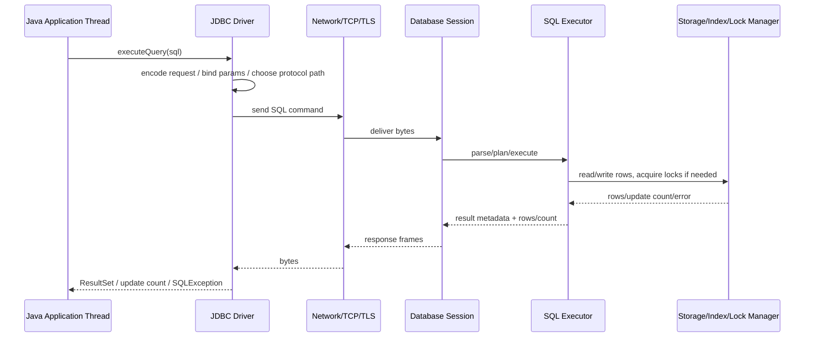
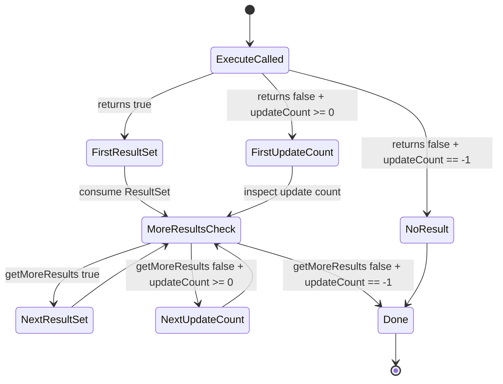

# Part 005 — Statement Execution Model: Execute, Query, Update, Batch

## 1. Tujuan Part Ini

Di part sebelumnya kita membahas object model JDBC dan lifecycle `Connection`. Sekarang kita masuk ke **execution model**: bagaimana SQL benar-benar dikirim lewat JDBC, bagaimana hasilnya direpresentasikan, dan bagaimana memilih method yang tepat.

Bagian ini penting karena banyak kode JDBC terlihat benar, tetapi rapuh di production karena salah memahami hal-hal berikut:

- kapan memakai `executeQuery()`
- kapan memakai `executeUpdate()`
- kapan memakai `execute()`
- bagaimana membaca update count
- bagaimana mengambil generated keys
- bagaimana batch dieksekusi dan gagal
- bagaimana timeout dan cancel diposisikan
- bagaimana statement lifecycle berhubungan dengan transaction lifecycle

Target akhirnya: kamu tidak hanya tahu template JDBC, tetapi bisa menjawab **apa contract execution yang sedang kamu pakai**, **apa failure mode-nya**, dan **apa invariant yang harus dijaga**.

---

## 2. Mental Model: SQL Execution Is a Protocol, Not Just a Method Call

Saat kita memanggil:

```java
statement.executeQuery("select * from accounts where id = 10");
```

secara mental mudah melihatnya sebagai function call biasa. Padahal secara sistem, ini lebih dekat ke protokol berlapis:



Beberapa konsekuensi penting:

1. **Method call Java bisa selesai sebelum seluruh data dikonsumsi.**  
   Untuk query besar, `executeQuery()` dapat mengembalikan `ResultSet`, tetapi rows bisa masih dibaca bertahap saat `ResultSet.next()`.

2. **Statement execution dapat memegang resource database.**  
   Cursor, lock, temporary buffer, transaction state, dan server-side prepared statement bisa hidup lebih lama dari satu baris kode Java.

3. **Statement execution berada di dalam state `Connection`.**  
   Auto-commit, transaction isolation, read-only flag, schema, catalog, dan session variables dapat memengaruhi hasil.

4. **Timeout harus dilihat end-to-end.**  
   Query timeout tidak sama dengan pool acquisition timeout, lock timeout, socket timeout, atau HTTP request timeout.

5. **Driver behavior tidak 100% identik antar database.**  
   JDBC memberi common API, bukan menghapus seluruh perbedaan vendor.

---

## 3. Tiga Method Eksekusi Utama

JDBC menyediakan beberapa bentuk execution. Tiga yang paling penting:

| Method | Digunakan Untuk | Return Utama | Biasanya Dipakai Untuk |
|---|---|---|---|
| `executeQuery()` | SQL yang menghasilkan `ResultSet` tunggal | `ResultSet` | `SELECT` |
| `executeUpdate()` | SQL yang menghasilkan update count | `int` | `INSERT`, `UPDATE`, `DELETE`, DDL tertentu |
| `execute()` | SQL yang bisa menghasilkan result set, update count, atau multiple results | `boolean` | stored procedure, vendor-specific command, SQL campuran |

Ada juga varian modern:

| Method | Mengapa Ada |
|---|---|
| `executeLargeUpdate()` | Untuk update count yang bisa melebihi kapasitas `int` |
| `executeBatch()` | Untuk mengirim banyak command sebagai batch |
| `executeLargeBatch()` | Untuk batch dengan update count besar |

Rule praktis:

> Gunakan method paling spesifik yang cocok dengan bentuk hasil SQL.

Jangan memakai `execute()` untuk semua hal hanya karena fleksibel. Fleksibilitasnya membuat contract lebih sulit dibaca, lebih sulit di-review, dan lebih rawan salah handling.

---

## 4. `executeQuery()`: Contract untuk Result Set

`executeQuery()` digunakan saat kamu mengharapkan satu `ResultSet`.

Contoh:

```java
public Optional<Account> findAccountById(DataSource dataSource, long accountId) throws SQLException {
    String sql = """
        select id, owner_name, balance_cents, status
        from accounts
        where id = ?
        """;

    try (Connection connection = dataSource.getConnection();
         PreparedStatement statement = connection.prepareStatement(sql)) {

        statement.setLong(1, accountId);

        try (ResultSet rs = statement.executeQuery()) {
            if (!rs.next()) {
                return Optional.empty();
            }

            Account account = new Account(
                rs.getLong("id"),
                rs.getString("owner_name"),
                rs.getLong("balance_cents"),
                rs.getString("status")
            );

            if (rs.next()) {
                throw new SQLException("Expected one account row, got multiple rows for id=" + accountId);
            }

            return Optional.of(account);
        }
    }
}
```

Perhatikan invariant yang sengaja dibuat:

- query memakai `PreparedStatement`
- parameter dibind, bukan concat
- `ResultSet` ditutup eksplisit lewat try-with-resources
- cardinality diperiksa: tidak ada row, satu row, atau lebih dari satu row
- method domain mengembalikan `Optional`, bukan `null`

### 4.1 Jangan Lupakan Cardinality Contract

Banyak bug muncul bukan karena SQL syntax salah, tetapi karena code tidak menyatakan ekspektasi cardinality.

| Ekspektasi | Contract Code |
|---|---|
| 0 atau 1 row | `Optional<T>` dan check row kedua |
| Tepat 1 row | throw jika 0 row atau >1 row |
| Banyak row terbatas | `List<T>` dengan limit eksplisit |
| Banyak row besar | streaming/chunking, bukan list besar |
| Existential check | `select 1 ... limit 1`, bukan load entity penuh |

Contoh utility untuk exactly-one:

```java
public Account getRequiredAccount(Connection connection, long accountId) throws SQLException {
    String sql = """
        select id, owner_name, balance_cents, status
        from accounts
        where id = ?
        """;

    try (PreparedStatement statement = connection.prepareStatement(sql)) {
        statement.setLong(1, accountId);

        try (ResultSet rs = statement.executeQuery()) {
            if (!rs.next()) {
                throw new NoSuchElementException("Account not found: " + accountId);
            }

            Account account = mapAccount(rs);

            if (rs.next()) {
                throw new IllegalStateException("Duplicate account id detected: " + accountId);
            }

            return account;
        }
    }
}
```

Dalam sistem regulatori, ledger, enforcement lifecycle, atau case management, cardinality yang salah bisa berarti:

- case salah ditugaskan
- escalation rule dobel jalan
- status lifecycle bergerak berdasarkan row ambigu
- audit evidence tidak konsisten
- duplicate action dikirim ke downstream

---

## 5. `executeUpdate()`: Contract untuk Mutasi dan Update Count

`executeUpdate()` digunakan untuk SQL yang menghasilkan update count.

Contoh:

```java
public boolean closeCase(Connection connection, long caseId, String closedBy) throws SQLException {
    String sql = """
        update enforcement_case
        set status = 'CLOSED',
            closed_by = ?,
            closed_at = current_timestamp
        where id = ?
          and status <> 'CLOSED'
        """;

    try (PreparedStatement statement = connection.prepareStatement(sql)) {
        statement.setString(1, closedBy);
        statement.setLong(2, caseId);

        int updated = statement.executeUpdate();

        if (updated > 1) {
            throw new IllegalStateException("Expected to update at most one case, updated=" + updated);
        }

        return updated == 1;
    }
}
```

Update count bukan sekadar angka. Ia adalah **concurrency signal**.

| Update Count | Interpretasi Umum |
|---|---|
| `0` | row tidak ada, condition tidak cocok, optimistic concurrency gagal, operation idempotent no-op |
| `1` | satu row termutasi sesuai ekspektasi |
| `>1` | valid untuk bulk operation, bug untuk single-entity command |

### 5.1 Update Count sebagai Guardrail State Machine

Dalam lifecycle system, update count sering menjadi guardrail untuk transisi state.

```java
public boolean transitionCase(
    Connection connection,
    long caseId,
    String expectedStatus,
    String nextStatus
) throws SQLException {
    String sql = """
        update enforcement_case
        set status = ?,
            updated_at = current_timestamp
        where id = ?
          and status = ?
        """;

    try (PreparedStatement statement = connection.prepareStatement(sql)) {
        statement.setString(1, nextStatus);
        statement.setLong(2, caseId);
        statement.setString(3, expectedStatus);

        int updated = statement.executeUpdate();

        if (updated > 1) {
            throw new IllegalStateException("State transition updated multiple cases: " + updated);
        }

        return updated == 1;
    }
}
```

Ini membuat database ikut menjaga invariant:

> Case hanya boleh pindah status jika masih berada pada status yang diharapkan.

Tanpa condition `and status = ?`, dua thread bisa sama-sama merasa berhasil melakukan transisi.

### 5.2 `executeLargeUpdate()`

`executeUpdate()` mengembalikan `int`. Untuk operasi yang mungkin memengaruhi lebih dari `Integer.MAX_VALUE` row, JDBC menyediakan `executeLargeUpdate()` yang mengembalikan `long`.

Dalam aplikasi enterprise biasa, operasi single-command update miliaran row seharusnya jarang. Jika ada, itu bukan hanya masalah tipe return; itu masalah desain operasional:

- apakah lock duration aman?
- apakah replication lag bisa melonjak?
- apakah transaction log cukup?
- apakah rollback bisa sangat mahal?
- apakah operation perlu chunking?
- apakah maintenance window diperlukan?

Gunakan `executeLargeUpdate()` saat benar-benar perlu, tetapi jangan jadikan itu alasan menjalankan bulk mutation raksasa tanpa strategi operasional.

---

## 6. `execute()`: Contract untuk Hasil yang Tidak Tunggal

`execute()` mengembalikan `boolean`:

- `true` jika hasil pertama adalah `ResultSet`
- `false` jika hasil pertama adalah update count atau tidak ada result

Method ini berguna untuk SQL yang bentuk hasilnya tidak sederhana, misalnya:

- stored procedure yang mengembalikan multiple result sets
- command vendor-specific
- statement yang bisa menghasilkan update count dan result set
- migration/administrative tooling tertentu

Contoh membaca multiple results:

```java
public void runProcedure(Connection connection, long caseId) throws SQLException {
    String sql = "{ call recompute_case_risk(?) }";

    try (CallableStatement statement = connection.prepareCall(sql)) {
        statement.setLong(1, caseId);

        boolean hasResultSet = statement.execute();

        while (true) {
            if (hasResultSet) {
                try (ResultSet rs = statement.getResultSet()) {
                    while (rs.next()) {
                        // process result set
                    }
                }
            } else {
                int updateCount = statement.getUpdateCount();
                if (updateCount == -1) {
                    break;
                }
                // process update count if relevant
            }

            hasResultSet = statement.getMoreResults();
        }
    }
}
```

Untuk mayoritas kode aplikasi, penggunaan `execute()` sebaiknya dibatasi. Ia membuat code harus menangani state machine hasil eksekusi.



Rule praktis:

> Kalau kamu tahu SQL harus menghasilkan `ResultSet`, pakai `executeQuery()`. Kalau kamu tahu SQL harus menghasilkan update count, pakai `executeUpdate()`. Pakai `execute()` hanya saat contract hasil memang variatif.

---

## 7. Generated Keys

Generated keys sering muncul pada insert:

```java
public long createCase(Connection connection, String title, String createdBy) throws SQLException {
    String sql = """
        insert into enforcement_case (title, status, created_by, created_at)
        values (?, 'OPEN', ?, current_timestamp)
        """;

    try (PreparedStatement statement = connection.prepareStatement(
        sql,
        Statement.RETURN_GENERATED_KEYS
    )) {
        statement.setString(1, title);
        statement.setString(2, createdBy);

        int inserted = statement.executeUpdate();
        if (inserted != 1) {
            throw new SQLException("Expected one inserted case, inserted=" + inserted);
        }

        try (ResultSet keys = statement.getGeneratedKeys()) {
            if (!keys.next()) {
                throw new SQLException("No generated key returned for enforcement_case insert");
            }
            long id = keys.getLong(1);
            if (keys.next()) {
                throw new SQLException("Multiple generated keys returned for single insert");
            }
            return id;
        }
    }
}
```

### 7.1 Generated Keys Are Not a Universal Abstraction

JDBC menyediakan API standar, tetapi detail generated key bisa bergantung pada database dan driver:

- apakah perlu `Statement.RETURN_GENERATED_KEYS`
- apakah perlu nama kolom generated key
- apakah composite key didukung dengan baik
- apakah batch insert mengembalikan semua keys
- apakah trigger-generated key dikembalikan
- bagaimana sequence/identity bekerja

Untuk sistem besar, pattern yang sering lebih eksplisit adalah:

```java
UUID caseId = UUID.randomUUID();
```

lalu insert dengan ID dari aplikasi:

```java
String sql = """
    insert into enforcement_case (id, title, status, created_by, created_at)
    values (?, ?, 'OPEN', ?, current_timestamp)
    """;
```

Trade-off:

| Strategy | Kelebihan | Risiko |
|---|---|---|
| DB-generated identity | sederhana, terpusat di DB | perlu round-trip/read generated key, portability nuance |
| DB sequence | kuat untuk DB tertentu | vendor-specific, perlu sequence management |
| App-generated UUID | idempotency lebih mudah, bisa compose object graph sebelum insert | ukuran index, locality, storage overhead |
| App-generated sortable ID | bagus untuk distributed system tertentu | perlu generator yang benar |

Untuk workflow enforcement/case management, app-generated ID sering berguna karena command bisa dibuat idempotent sejak awal.

---

## 8. Batch Execution

Batch execution memungkinkan beberapa command dikirim dalam satu batch.

Contoh:

```java
public int[] insertCaseEvents(Connection connection, List<CaseEvent> events) throws SQLException {
    String sql = """
        insert into case_event (case_id, event_type, payload_json, created_at)
        values (?, ?, ?, current_timestamp)
        """;

    try (PreparedStatement statement = connection.prepareStatement(sql)) {
        for (CaseEvent event : events) {
            statement.setLong(1, event.caseId());
            statement.setString(2, event.eventType());
            statement.setString(3, event.payloadJson());
            statement.addBatch();
        }

        return statement.executeBatch();
    }
}
```

Batch bukan berarti transaction otomatis. Transaction tetap dikontrol oleh `Connection`.

```java
public void appendEventsAtomically(DataSource dataSource, List<CaseEvent> events) throws SQLException {
    try (Connection connection = dataSource.getConnection()) {
        boolean previousAutoCommit = connection.getAutoCommit();
        connection.setAutoCommit(false);
        try {
            insertCaseEvents(connection, events);
            connection.commit();
        } catch (SQLException | RuntimeException e) {
            try {
                connection.rollback();
            } catch (SQLException rollbackFailure) {
                e.addSuppressed(rollbackFailure);
            }
            throw e;
        } finally {
            connection.setAutoCommit(previousAutoCommit);
        }
    }
}
```

### 8.1 Batch Size Matters

Batch terlalu kecil tidak memberi banyak manfaat. Batch terlalu besar bisa menyebabkan:

- memory pressure di driver
- packet besar
- lock duration panjang
- transaction log besar
- rollback mahal
- replication lag
- connection terlalu lama dipinjam
- timeout

Rule awal yang masuk akal:

| Workload | Starting Batch Size |
|---|---:|
| small OLTP insert | 50–200 |
| event append | 100–500 |
| bulk import | 500–2.000, diuji dengan real DB |
| row besar / JSON besar / BLOB | jauh lebih kecil |

Angka tersebut bukan hukum. Final value harus berasal dari measurement.

### 8.2 Batch Failure Semantics

`executeBatch()` dapat melempar `BatchUpdateException`. Exception ini dapat membawa partial update counts.

```java
try {
    int[] counts = statement.executeBatch();
} catch (BatchUpdateException e) {
    int[] partialCounts = e.getUpdateCounts();
    // Gunakan untuk observability/debugging, bukan untuk asumsi recovery sembarangan.
    throw e;
}
```

Hal yang harus dipahami:

- beberapa driver berhenti pada failure pertama
- beberapa driver bisa melanjutkan sebagian
- update count bisa berisi `Statement.SUCCESS_NO_INFO`
- update count bisa berisi `Statement.EXECUTE_FAILED`
- jika transaction aktif, kamu biasanya rollback seluruh batch
- jika auto-commit aktif, sebagian command mungkin sudah committed

Karena itu, batch production sebaiknya berjalan dalam transaction eksplisit kecuali ada alasan kuat sebaliknya.

---

## 9. Statement Timeout dan Cancellation

JDBC `Statement` memiliki `setQueryTimeout(int seconds)`.

Contoh:

```java
try (PreparedStatement statement = connection.prepareStatement(sql)) {
    statement.setQueryTimeout(5);
    try (ResultSet rs = statement.executeQuery()) {
        while (rs.next()) {
            // map rows
        }
    }
}
```

Namun jangan salah paham: query timeout bukan solusi tunggal.

| Timeout | Tempat | Tujuan |
|---|---|---|
| Pool acquisition timeout | Connection pool | Membatasi waktu menunggu connection tersedia |
| Query timeout | JDBC statement/driver | Membatasi waktu eksekusi statement |
| Lock timeout | Database | Membatasi waktu menunggu lock |
| Transaction timeout | Framework/app | Membatasi total durasi transaction |
| Socket timeout | Driver/network | Membatasi blocking network read/write |
| HTTP timeout | API edge/client | Membatasi total request/response |

`setQueryTimeout()` juga bisa memiliki nuance per driver. Ada driver yang menerjemahkannya ke server-side cancel, ada yang bergantung pada mekanisme client/driver, dan ada yang punya batasan tertentu.

### 9.1 Cancellation

`Statement.cancel()` mencoba membatalkan statement yang sedang berjalan.

```java
Future<?> future = executor.submit(() -> {
    try (PreparedStatement statement = connection.prepareStatement(sql)) {
        runningStatement.set(statement);
        statement.executeQuery();
    } catch (SQLException e) {
        throw new RuntimeException(e);
    }
});

// from another thread
Statement statement = runningStatement.get();
if (statement != null) {
    statement.cancel();
}
```

Dalam praktik, cancellation harus diperlakukan sebagai best effort. Setelah cancellation atau timeout, pastikan state connection masih valid sebelum dikembalikan ke pool. Framework/pool biasanya punya mekanisme validation, tetapi application code tetap tidak boleh mengabaikan exception path.

---

## 10. Fetch Size Is Not Execution Mode, But It Affects Execution Behavior

Fetch size biasanya dibahas bersama `ResultSet`, tetapi relevan untuk execution model karena memengaruhi bagaimana rows dikirim dari database ke driver.

```java
try (PreparedStatement statement = connection.prepareStatement(sql)) {
    statement.setFetchSize(500);

    try (ResultSet rs = statement.executeQuery()) {
        while (rs.next()) {
            processRow(rs);
        }
    }
}
```

Konsekuensi:

- fetch size terlalu kecil → banyak round-trip
- fetch size terlalu besar → memory pressure
- driver/database bisa mengabaikan atau menafsirkan berbeda
- streaming behavior sering memerlukan konfigurasi spesifik driver
- transaction bisa tetap terbuka selama cursor dibaca

Jangan menganggap `setFetchSize()` otomatis membuat streaming production-grade di semua database.

---

## 11. Auto-Commit dan Statement Execution

Default JDBC connection sering berada dalam auto-commit mode. Dalam auto-commit, setiap statement secara efektif menjadi transaction sendiri.

Contoh:

```java
try (Connection connection = dataSource.getConnection()) {
    // default auto-commit biasanya true
    try (PreparedStatement statement = connection.prepareStatement(sql)) {
        statement.executeUpdate();
    }
    // commit terjadi otomatis setelah statement selesai
}
```

Untuk single statement yang independen, auto-commit bisa valid.

Untuk multi-step use case, auto-commit adalah bahaya:

```java
// Dangerous: each statement can commit independently if auto-commit=true
insertCase(connection, command);
insertCaseAuditEvent(connection, command);
publishOutboxMessage(connection, command);
```

Jika step kedua gagal setelah step pertama committed, data menjadi tidak konsisten.

Production-grade rule:

> Setiap use case yang membutuhkan atomicity lintas lebih dari satu SQL statement harus punya transaction boundary eksplisit.

---

## 12. Execution Method Decision Table

Gunakan tabel ini saat code review.

| Need | Recommended Method | Notes |
|---|---|---|
| Read rows | `executeQuery()` | Pastikan cardinality dan resource close jelas |
| Insert/update/delete single entity | `executeUpdate()` | Check update count |
| Bulk mutation | `executeUpdate()` / `executeLargeUpdate()` | Pertimbangkan chunking |
| Insert dan butuh generated key | `prepareStatement(sql, RETURN_GENERATED_KEYS)` + `executeUpdate()` | Check exactly one key jika single insert |
| Multiple rows insert/update | `addBatch()` + `executeBatch()` | Transaction eksplisit biasanya lebih aman |
| Stored procedure multiple result | `execute()` | Harus consume result set/update count dengan benar |
| Unknown arbitrary SQL tool | `execute()` | Cocok untuk admin tool, bukan business logic umum |
| Very large update count | `executeLargeUpdate()` | Jangan abaikan risk operasional |

---

## 13. Anti-Patterns

### 13.1 Memakai `execute()` untuk Semua SQL

```java
statement.execute(sql);
```

Masalah:

- contract tidak jelas
- caller harus inspect result type
- update count sering diabaikan
- generated keys tidak dipikirkan
- code review sulit

Lebih baik:

```java
try (ResultSet rs = statement.executeQuery()) { ... }
```

atau:

```java
int updated = statement.executeUpdate();
```

---

### 13.2 Mengabaikan Update Count

```java
statement.executeUpdate();
```

Masalah:

- optimistic concurrency failure tidak terdeteksi
- row tidak ada dianggap sukses
- update multiple row tidak sengaja tidak ketahuan
- state transition bisa silently fail

Lebih baik:

```java
int updated = statement.executeUpdate();
if (updated != 1) {
    throw new IllegalStateException("Expected one row, updated=" + updated);
}
```

Untuk idempotent operation, `0` mungkin valid, tetapi harus eksplisit.

---

### 13.3 Auto-Commit untuk Multi-Step Use Case

```java
insertCase(connection, caseData);
insertAudit(connection, caseData);
insertOutbox(connection, event);
```

Jika auto-commit true, setiap statement bisa committed sendiri-sendiri.

Lebih baik:

```java
connection.setAutoCommit(false);
try {
    insertCase(connection, caseData);
    insertAudit(connection, caseData);
    insertOutbox(connection, event);
    connection.commit();
} catch (Exception e) {
    connection.rollback();
    throw e;
}
```

---

### 13.4 Batch Besar Tanpa Chunking

```java
for (Record record : millionsOfRecords) {
    statement.addBatch();
}
statement.executeBatch();
```

Masalah:

- memory driver meledak
- transaction terlalu besar
- lock terlalu lama
- rollback mahal
- observability sulit

Lebih baik:

```java
int batchSize = 500;
int pending = 0;

for (Record record : records) {
    bind(statement, record);
    statement.addBatch();
    pending++;

    if (pending == batchSize) {
        statement.executeBatch();
        statement.clearBatch();
        pending = 0;
    }
}

if (pending > 0) {
    statement.executeBatch();
}
```

---

### 13.5 Tidak Menutup `ResultSet`

```java
ResultSet rs = statement.executeQuery();
while (rs.next()) {
    ...
}
```

Masalah:

- cursor/resource bisa bocor
- statement tidak cepat bebas
- connection lebih lama dipakai
- pool exhaustion lebih mungkin

Lebih baik:

```java
try (ResultSet rs = statement.executeQuery()) {
    while (rs.next()) {
        ...
    }
}
```

---

## 14. Production Review Checklist

Gunakan checklist ini untuk review kode JDBC yang mengeksekusi SQL.

### Execution Contract

- [ ] Apakah method execution sesuai hasil SQL?
- [ ] Apakah `execute()` hanya dipakai jika hasil memang variatif?
- [ ] Apakah `executeQuery()` dipakai untuk query yang menghasilkan result set?
- [ ] Apakah `executeUpdate()` dipakai untuk mutation?
- [ ] Apakah `executeLargeUpdate()` dipertimbangkan untuk update count sangat besar?

### Result Handling

- [ ] Apakah `ResultSet` selalu ditutup?
- [ ] Apakah cardinality diperiksa?
- [ ] Apakah mapping row menangani null dengan benar?
- [ ] Apakah query besar tidak dimuat seluruhnya ke memory tanpa batas?

### Update Handling

- [ ] Apakah update count diperiksa?
- [ ] Apakah `0 row updated` ditangani sebagai business signal?
- [ ] Apakah `>1 row updated` valid atau dianggap bug?
- [ ] Apakah generated keys diperiksa?

### Batch Handling

- [ ] Apakah batch size dibatasi?
- [ ] Apakah batch berjalan dalam transaction yang disengaja?
- [ ] Apakah partial failure dipahami?
- [ ] Apakah retry batch aman/idempotent?

### Timeout and Failure

- [ ] Apakah statement timeout diset untuk query berisiko?
- [ ] Apakah timeout hierarchy jelas?
- [ ] Apakah exception path melakukan rollback jika perlu?
- [ ] Apakah connection dikembalikan ke pool cepat?

---

## 15. Deliberate Practice

### Latihan 1 — Refactor Execution Contract

Ambil kode berikut:

```java
public void run(Connection connection, String sql) throws SQLException {
    Statement statement = connection.createStatement();
    statement.execute(sql);
    statement.close();
}
```

Refactor menjadi tiga method:

1. `query(...)`
2. `updateExactlyOne(...)`
3. `runAdministrativeCommand(...)`

Setiap method harus memiliki contract berbeda.

### Latihan 2 — Update Count as Concurrency Guard

Buat function untuk transition entity:

```txt
OPEN -> UNDER_REVIEW -> APPROVED -> CLOSED
```

Syarat:

- update hanya berhasil jika current state sesuai expected state
- `0` update berarti conflict/no-op
- `>1` update dianggap invariant violation
- function tidak membuka connection sendiri; connection diberikan oleh caller

### Latihan 3 — Batch Incident Analysis

Skenario:

- job import 3 juta rows
- batch size 50.000
- transaction tunggal
- database mulai lambat
- pool active connection penuh
- HTTP request lain timeout

Jelaskan:

- apa root cause paling mungkin
- metrics apa yang dicek
- perubahan desain apa yang perlu dilakukan
- bagaimana chunking dan transaction boundary diperbaiki

---

## 16. Ringkasan

Execution model JDBC harus dilihat sebagai contract, bukan hanya method call.

Poin terpenting:

- `executeQuery()` untuk hasil `ResultSet`
- `executeUpdate()` untuk mutation/update count
- `execute()` untuk hasil variatif/multiple results
- update count adalah signal penting untuk correctness dan concurrency
- generated keys harus diperlakukan sebagai contract eksplisit
- batch butuh transaction, batch size, dan failure semantics yang jelas
- timeout harus dilihat sebagai hierarchy, bukan satu angka
- resource harus ditutup cepat agar connection tidak tertahan

Jika kamu menguasai part ini, kamu mulai bisa membaca kode JDBC dari sudut pandang production behavior: **apa yang dikirim, apa yang diharapkan, apa yang ditahan, apa yang bisa gagal, dan bagaimana membuktikannya**.

---

## 17. Referensi Resmi

- Java SE 25 — `java.sql.Statement`
- Java SE 25 — `java.sql.PreparedStatement`
- Java SE 25 — `java.sql.ResultSet`
- Java SE 25 — `java.sql.BatchUpdateException`
- JDBC 4.3 Specification — JSR 221
