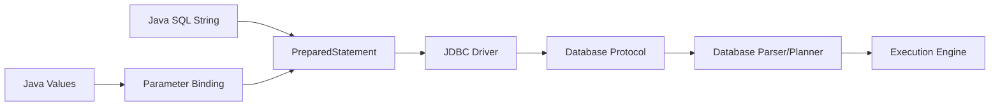
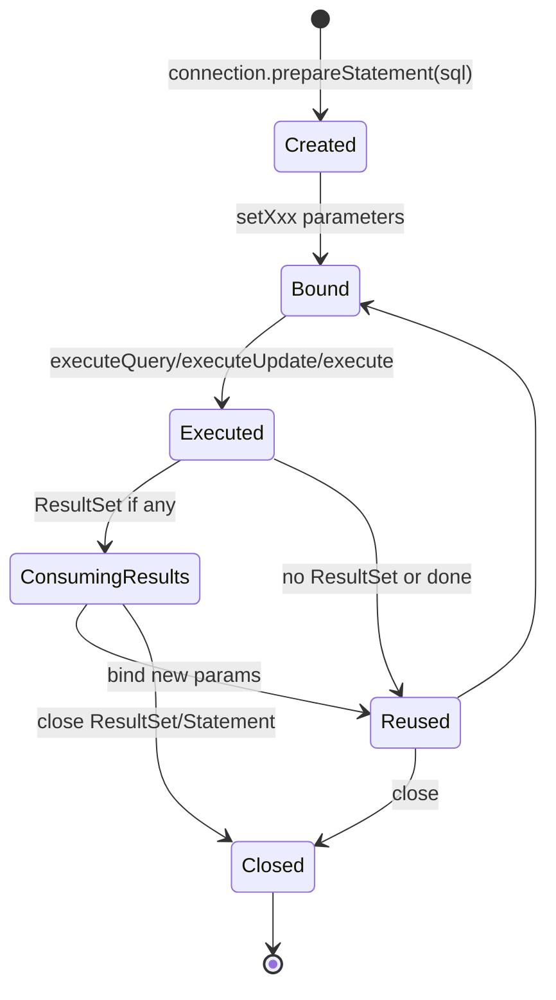

# Part 006 — PreparedStatement Deep Dive: Binding, Type Mapping, Injection Defense

## 1. Tujuan Part Ini

`PreparedStatement` adalah salah satu API JDBC yang paling sering dipakai, tetapi juga paling sering disederhanakan secara berlebihan.

Penjelasan umum biasanya berhenti pada:

> Pakai `PreparedStatement` agar aman dari SQL injection.

Itu benar, tetapi belum cukup untuk engineer senior. Di production, kamu juga harus paham:

- apa yang benar-benar bisa diparameterisasi
- apa yang tidak bisa diparameterisasi
- bagaimana binding tipe Java ke tipe SQL
- bagaimana menangani `NULL`
- kapan `setObject()` aman dan kapan ambigu
- bagaimana membangun dynamic SQL tanpa injection
- bagaimana menangani `IN` clause
- bagaimana prepared statement berinteraksi dengan query plan dan driver
- bagaimana binding salah bisa menyebabkan bug correctness atau performance

Part ini membangun mental model bahwa `PreparedStatement` bukan sekadar cara menghindari concat string, tetapi **boundary contract antara Java value, SQL text, driver, dan database planner**.

---

## 2. Mental Model: SQL Template + Bound Values

`PreparedStatement` memisahkan dua hal:

1. SQL text dengan placeholder
2. nilai parameter yang dibind ke placeholder

Contoh:

```java
String sql = """
    select id, title, status
    from enforcement_case
    where status = ?
      and assigned_to = ?
    order by created_at desc
    limit ?
    """;

try (PreparedStatement statement = connection.prepareStatement(sql)) {
    statement.setString(1, "OPEN");
    statement.setString(2, officerId);
    statement.setInt(3, 50);

    try (ResultSet rs = statement.executeQuery()) {
        while (rs.next()) {
            // map row
        }
    }
}
```

Mental model:



Important distinction:

- placeholder `?` merepresentasikan **value expression**
- placeholder bukan pengganti arbitrary SQL syntax

Kamu bisa bind:

```sql
where status = ?
```

Kamu tidak bisa bind identifier seperti ini:

```sql
select * from ?
```

atau:

```sql
order by ?
```

Pada kasus tertentu database mungkin menerima parameter dalam `ORDER BY`, tetapi itu biasanya diperlakukan sebagai constant expression, bukan nama kolom dinamis. Jangan desain dynamic identifier dengan asumsi placeholder dapat mengganti grammar SQL.

---

## 3. Parameter Index Dimulai dari 1

JDBC parameter index dimulai dari `1`, bukan `0`.

```java
statement.setString(1, status);
statement.setLong(2, caseId);
```

Kesalahan umum:

```java
statement.setString(0, status); // wrong
```

Untuk query pendek, ini mudah terlihat. Untuk query panjang dengan banyak parameter, risiko meningkat.

Pattern yang lebih aman:

```java
int i = 1;
statement.setString(i++, filter.status());
statement.setString(i++, filter.assignedTo());
statement.setTimestamp(i++, Timestamp.from(filter.createdAfter()));
statement.setInt(i++, filter.limit());
```

Namun pattern `i++` juga bisa berbahaya jika SQL dinamis tidak sinkron dengan binding. Untuk dynamic SQL, lebih baik gunakan helper yang menyimpan SQL fragment dan binder bersama-sama.

---

## 4. Basic Binding Methods

JDBC menyediakan banyak method `setXxx`.

| Java Value | Common Binding Method | Notes |
|---|---|---|
| `String` | `setString` | Untuk VARCHAR/TEXT-like value |
| `int` / `Integer` | `setInt` / `setObject` | `setInt` tidak bisa menerima null |
| `long` / `Long` | `setLong` / `setObject` | cocok untuk BIGINT |
| `boolean` / `Boolean` | `setBoolean` / `setObject` | mapping tergantung DB/driver |
| `BigDecimal` | `setBigDecimal` | untuk money/decimal precise value |
| `byte[]` | `setBytes` | untuk binary kecil/sedang |
| `InputStream` | `setBinaryStream` | untuk binary besar/streaming |
| `LocalDate` | `setObject` | JDBC modern mendukung `java.time` |
| `LocalDateTime` | `setObject` | hati-hati timezone semantics |
| `OffsetDateTime` | `setObject` | tergantung DB support |
| `Instant` | sering via `Timestamp.from` atau driver-specific | harus jelas timezone/instant semantics |
| `UUID` | `setObject` atau `setString` | tergantung DB/driver |

Contoh binding eksplisit:

```java
String sql = """
    insert into penalty_decision (
        case_id,
        amount,
        currency,
        effective_date,
        created_by
    ) values (?, ?, ?, ?, ?)
    """;

try (PreparedStatement statement = connection.prepareStatement(sql)) {
    statement.setLong(1, decision.caseId());
    statement.setBigDecimal(2, decision.amount());
    statement.setString(3, decision.currency());
    statement.setObject(4, decision.effectiveDate()); // LocalDate
    statement.setString(5, decision.createdBy());

    int inserted = statement.executeUpdate();
    if (inserted != 1) {
        throw new SQLException("Expected one penalty_decision insert, inserted=" + inserted);
    }
}
```

---

## 5. Null Handling: The Part Many Engineers Get Wrong

Primitive binding methods cannot represent null.

```java
statement.setInt(1, value); // int, not nullable
```

Jika value berupa `Integer`, kamu perlu handle null:

```java
Integer riskScore = command.riskScore();
if (riskScore == null) {
    statement.setNull(1, Types.INTEGER);
} else {
    statement.setInt(1, riskScore);
}
```

Atau gunakan `setObject` dengan SQL type:

```java
statement.setObject(1, riskScore, Types.INTEGER);
```

### 5.1 Why `setNull` Needs SQL Type

Database tidak cukup hanya tahu “null”. Ia perlu tahu null untuk tipe apa.

```sql
where reviewed_at is ?
```

bukan SQL yang tepat. Biasanya null dipakai dengan syntax khusus:

```sql
where reviewed_at is null
```

Tetapi untuk insert/update:

```sql
set risk_score = ?
```

placeholder perlu diberi value null bertipe tertentu:

```java
statement.setNull(1, Types.INTEGER);
```

### 5.2 Generic Nullable Binder

Helper kecil bisa mengurangi noise:

```java
static void setNullableString(PreparedStatement statement, int index, String value) throws SQLException {
    if (value == null) {
        statement.setNull(index, Types.VARCHAR);
    } else {
        statement.setString(index, value);
    }
}

static void setNullableLong(PreparedStatement statement, int index, Long value) throws SQLException {
    if (value == null) {
        statement.setNull(index, Types.BIGINT);
    } else {
        statement.setLong(index, value);
    }
}
```

Untuk codebase besar, kamu bisa membuat `JdbcBinder` kecil:

```java
final class JdbcBinder {
    private final PreparedStatement statement;
    private int index = 1;

    JdbcBinder(PreparedStatement statement) {
        this.statement = statement;
    }

    JdbcBinder string(String value) throws SQLException {
        if (value == null) {
            statement.setNull(index++, Types.VARCHAR);
        } else {
            statement.setString(index++, value);
        }
        return this;
    }

    JdbcBinder longValue(Long value) throws SQLException {
        if (value == null) {
            statement.setNull(index++, Types.BIGINT);
        } else {
            statement.setLong(index++, value);
        }
        return this;
    }

    JdbcBinder integer(Integer value) throws SQLException {
        if (value == null) {
            statement.setNull(index++, Types.INTEGER);
        } else {
            statement.setInt(index++, value);
        }
        return this;
    }
}
```

Penggunaan:

```java
JdbcBinder binder = new JdbcBinder(statement);
binder.string(command.status())
      .longValue(command.caseId())
      .integer(command.riskScore());
```

Trade-off: helper ini menyederhanakan binding, tetapi jangan sampai menyembunyikan SQL type semantics.

---

## 6. `setObject()`: Powerful, But Do Not Use Blindly

`setObject()` tampak nyaman:

```java
statement.setObject(1, value);
```

Kelebihan:

- bisa mengurangi overload method
- cocok untuk tipe modern seperti `LocalDate`
- berguna untuk tipe vendor-specific seperti UUID pada beberapa driver

Risiko:

- driver harus menebak mapping
- null tanpa SQL type bisa ambigu
- mapping bisa berbeda antar database/driver
- performance/plan bisa berubah karena tipe parameter dianggap berbeda
- precision/scale bisa tidak sesuai untuk numeric

Lebih aman untuk boundary penting:

```java
statement.setObject(1, value, Types.NUMERIC);
```

atau:

```java
statement.setObject(1, value, JDBCType.NUMERIC);
```

Untuk uang:

```java
statement.setBigDecimal(1, amount);
```

bukan:

```java
statement.setObject(1, amount.doubleValue()); // wrong direction
```

---

## 7. SQL Injection Boundary

`PreparedStatement` melindungi value binding dari SQL injection.

Aman:

```java
String sql = "select * from users where email = ?";
try (PreparedStatement statement = connection.prepareStatement(sql)) {
    statement.setString(1, emailFromRequest);
    ...
}
```

Tidak aman:

```java
String sql = "select * from users where email = '" + emailFromRequest + "'";
```

Jika input:

```txt
' OR '1'='1
```

maka SQL bisa berubah makna.

Dengan parameter binding, input tetap value, bukan SQL grammar.

### 7.1 Yang Tidak Bisa Diamankan dengan Placeholder

Placeholder tidak bisa digunakan untuk semua bagian SQL.

| SQL Part | Bisa Pakai `?`? | Strategy Aman |
|---|---:|---|
| literal value di `where status = ?` | ya | bind parameter |
| value di `insert values (?)` | ya | bind parameter |
| limit/offset value | biasanya ya | bind integer, clamp range |
| table name | tidak | allowlist identifier |
| column name | tidak | allowlist identifier |
| sort direction | tidak | enum/allowlist |
| SQL operator dinamis | tidak langsung | map dari enum ke fixed fragment |
| raw predicate dari user | tidak | jangan izinkan, gunakan query builder terbatas |

---

## 8. Safe Dynamic SQL

Dynamic SQL tidak otomatis salah. Yang salah adalah dynamic SQL tanpa boundary.

Contoh requirement:

- filter by optional status
- filter by assigned officer
- optional created date range
- sort by created date or risk score
- sort direction asc/desc
- limit max 100

### 8.1 Bad Dynamic SQL

```java
String sql = "select * from enforcement_case where 1=1";

if (status != null) {
    sql += " and status = '" + status + "'";
}

sql += " order by " + sortBy + " " + direction;
```

Masalah:

- value injection
- identifier injection
- direction injection
- query sulit diaudit
- parameter order tidak jelas

### 8.2 Safe Dynamic SQL with Fragment + Binder

```java
public List<CaseSummary> searchCases(Connection connection, CaseSearchFilter filter) throws SQLException {
    StringBuilder sql = new StringBuilder("""
        select id, title, status, assigned_to, risk_score, created_at
        from enforcement_case
        where 1 = 1
        """);

    List<SqlBinder> binders = new ArrayList<>();

    if (filter.status() != null) {
        sql.append(" and status = ?\n");
        binders.add((statement, index) -> {
            statement.setString(index, filter.status());
            return index + 1;
        });
    }

    if (filter.assignedTo() != null) {
        sql.append(" and assigned_to = ?\n");
        binders.add((statement, index) -> {
            statement.setString(index, filter.assignedTo());
            return index + 1;
        });
    }

    if (filter.createdAfter() != null) {
        sql.append(" and created_at >= ?\n");
        binders.add((statement, index) -> {
            statement.setObject(index, filter.createdAfter());
            return index + 1;
        });
    }

    sql.append(" order by ")
       .append(toSafeSortColumn(filter.sortBy()))
       .append(' ')
       .append(toSafeSortDirection(filter.direction()))
       .append("\n limit ?");

    int safeLimit = Math.min(Math.max(filter.limit(), 1), 100);
    binders.add((statement, index) -> {
        statement.setInt(index, safeLimit);
        return index + 1;
    });

    try (PreparedStatement statement = connection.prepareStatement(sql.toString())) {
        int index = 1;
        for (SqlBinder binder : binders) {
            index = binder.bind(statement, index);
        }

        try (ResultSet rs = statement.executeQuery()) {
            List<CaseSummary> results = new ArrayList<>();
            while (rs.next()) {
                results.add(mapCaseSummary(rs));
            }
            return results;
        }
    }
}

@FunctionalInterface
interface SqlBinder {
    int bind(PreparedStatement statement, int index) throws SQLException;
}
```

Safe identifier mapping:

```java
private static String toSafeSortColumn(CaseSort sort) {
    return switch (sort) {
        case CREATED_AT -> "created_at";
        case RISK_SCORE -> "risk_score";
        case STATUS -> "status";
    };
}

private static String toSafeSortDirection(SortDirection direction) {
    return switch (direction) {
        case ASC -> "asc";
        case DESC -> "desc";
    };
}
```

Key invariant:

> User input boleh memilih opsi yang sudah kita definisikan, tetapi tidak boleh langsung menjadi SQL grammar.

---

## 9. Handling `IN (...)` Clauses

Prepared statement tidak otomatis menerima list untuk satu placeholder pada SQL standar:

```sql
where id in (?)
```

lalu:

```java
statement.setObject(1, List.of(1L, 2L, 3L));
```

Ini biasanya bukan solusi portable.

### 9.1 Placeholder Expansion

Pattern umum:

```java
public List<CaseSummary> findCasesByIds(Connection connection, List<Long> ids) throws SQLException {
    if (ids.isEmpty()) {
        return List.of();
    }

    String placeholders = ids.stream()
        .map(id -> "?")
        .collect(Collectors.joining(", "));

    String sql = """
        select id, title, status
        from enforcement_case
        where id in (%s)
        """.formatted(placeholders);

    try (PreparedStatement statement = connection.prepareStatement(sql)) {
        int index = 1;
        for (Long id : ids) {
            statement.setLong(index++, id);
        }

        try (ResultSet rs = statement.executeQuery()) {
            List<CaseSummary> results = new ArrayList<>();
            while (rs.next()) {
                results.add(mapCaseSummary(rs));
            }
            return results;
        }
    }
}
```

Ini aman karena SQL fragment yang dibuat hanya berisi `?`, bukan value user.

### 9.2 Batasi Ukuran List

`IN` clause besar bisa buruk:

- SQL text terlalu panjang
- parse cost tinggi
- plan cache fragmentasi
- database punya batas jumlah parameter
- network payload besar

Guardrail:

```java
if (ids.size() > 1000) {
    throw new IllegalArgumentException("Too many ids: " + ids.size());
}
```

Untuk list sangat besar, pertimbangkan:

- temporary table
- staging table
- join dengan table input
- array parameter vendor-specific
- chunked query

### 9.3 Empty List Semantics

Jangan menghasilkan:

```sql
where id in ()
```

Itu invalid di banyak database.

Pilih salah satu contract:

```java
if (ids.isEmpty()) return List.of();
```

atau generate predicate false:

```sql
where 1 = 0
```

Contract harus eksplisit.

---

## 10. LIKE Queries and Escaping

`PreparedStatement` mencegah injection value, tetapi tidak otomatis mengatur wildcard semantics.

```java
String sql = "select * from enforcement_case where title like ?";
statement.setString(1, "%" + userInput + "%");
```

Ini aman dari SQL injection, tetapi user input `%` atau `_` tetap menjadi wildcard pattern.

Jika kamu ingin literal search, escape wildcard:

```java
static String escapeLike(String input) {
    return input
        .replace("\\", "\\\\")
        .replace("%", "\\%")
        .replace("_", "\\_");
}
```

SQL:

```sql
where title like ? escape '\'
```

Binding:

```java
statement.setString(1, "%" + escapeLike(term) + "%");
```

Perhatikan: escaping bisa berbeda nuansanya antar database, terutama terkait backslash, collation, case sensitivity, dan index usage.

---

## 11. Prepared Statement and Query Planning

Nama `PreparedStatement` sering membuat orang menyimpulkan:

> Query pasti di-precompile sekali dan plan-nya selalu reuse.

Realitanya lebih nuanced.

Ada beberapa kemungkinan:

- driver melakukan client-side substitution/protocol binding
- database menerima parse/prepare/execute protocol
- statement server-side prepared setelah threshold tertentu
- plan generic vs custom tergantung database
- parameter value dapat memengaruhi plan
- driver/pool dapat menutup statement saat connection returned

Jadi, manfaat `PreparedStatement` meliputi:

- safety dari injection untuk values
- pemisahan SQL text dan values
- potensi reuse parse/plan tergantung driver/database
- type-aware binding
- lebih mudah observability jika SQL text stabil

Tetapi jangan menjanjikan performance improvement universal tanpa measurement.

### 11.1 Stable SQL Text Helps Observability

Prepared statement membuat SQL text lebih stabil:

```sql
select * from enforcement_case where id = ?
```

bukan:

```sql
select * from enforcement_case where id = 123
select * from enforcement_case where id = 456
select * from enforcement_case where id = 789
```

Ini membantu:

- query normalization
- slow query grouping
- metrics aggregation
- database statement statistics
- log privacy karena value tidak selalu masuk SQL text

---

## 12. Identifier Allowlist Pattern

Dynamic sort sering menjadi sumber injection.

Bad:

```java
String sql = "select * from cases order by " + request.getSort();
```

Good:

```java
enum CaseSortField {
    CREATED_AT,
    UPDATED_AT,
    RISK_SCORE
}

static String sortColumn(CaseSortField field) {
    return switch (field) {
        case CREATED_AT -> "created_at";
        case UPDATED_AT -> "updated_at";
        case RISK_SCORE -> "risk_score";
    };
}
```

Untuk direction:

```java
enum SortDirection {
    ASC,
    DESC
}

static String sortDirection(SortDirection direction) {
    return switch (direction) {
        case ASC -> "asc";
        case DESC -> "desc";
    };
}
```

Lalu:

```java
String sql = """
    select id, title, status, risk_score
    from enforcement_case
    where status = ?
    order by %s %s
    limit ?
    """.formatted(sortColumn(sortField), sortDirection(direction));
```

Nilai tetap dibind:

```java
statement.setString(1, status);
statement.setInt(2, limit);
```

---

## 13. Avoiding Parameter/SQL Drift

SQL dinamis rawan drift: jumlah `?` tidak sama dengan jumlah binding.

Bad:

```java
StringBuilder sql = new StringBuilder("where 1=1");

if (filter.status() != null) {
    sql.append(" and status = ?");
}

if (filter.assignedTo() != null) {
    sql.append(" and assigned_to = ?");
}

PreparedStatement ps = connection.prepareStatement(sql.toString());
ps.setString(1, filter.status());
ps.setString(2, filter.assignedTo());
```

Jika `status == null` tetapi `assignedTo != null`, binding salah.

Better: SQL fragment dan binder dibuat bersama.

```java
record SqlPart(String text, SqlValueBinder binder) {}

@FunctionalInterface
interface SqlValueBinder {
    int bind(PreparedStatement statement, int index) throws SQLException;
}
```

Setiap conditional fragment membawa binder sendiri.

---

## 14. Domain-Specific Binding

Untuk codebase besar, binding raw type bisa bocor ke mana-mana.

Misalnya:

```java
statement.setString(1, caseStatus.name());
```

lebih baik dibungkus:

```java
static void setCaseStatus(PreparedStatement statement, int index, CaseStatus status) throws SQLException {
    statement.setString(index, status.name());
}
```

Atau dengan binder:

```java
binder.caseStatus(command.status());
```

Manfaat:

- satu tempat untuk mapping enum
- mudah audit perubahan representation
- mencegah typo string status
- mencegah null handling tidak konsisten
- bisa menambahkan validation domain

Untuk regulatory/enforcement system, ini penting karena status dan lifecycle biasanya punya konsekuensi audit.

---

## 15. Binding and Index Usage

Parameter binding yang salah tipe dapat memengaruhi index usage.

Contoh buruk:

```java
statement.setString(1, String.valueOf(caseId));
```

untuk kolom `case_id BIGINT`.

Database mungkin perlu cast:

```sql
where case_id = '123'
```

Tergantung database, ini bisa:

- tetap pakai index
- cast parameter ke BIGINT
- cast kolom ke TEXT dan merusak index usage
- menghasilkan plan buruk

Better:

```java
statement.setLong(1, caseId);
```

Rule:

> Bind Java value sedekat mungkin dengan tipe SQL kolom.

---

## 16. PreparedStatement Lifecycle

Basic lifecycle:



A `PreparedStatement` can often be reused for multiple executions within the same connection scope:

```java
try (PreparedStatement statement = connection.prepareStatement(sql)) {
    for (CaseEvent event : events) {
        statement.setLong(1, event.caseId());
        statement.setString(2, event.type());
        statement.setString(3, event.payloadJson());
        statement.executeUpdate();
    }
}
```

Untuk banyak row, batch biasanya lebih baik:

```java
try (PreparedStatement statement = connection.prepareStatement(sql)) {
    for (CaseEvent event : events) {
        statement.setLong(1, event.caseId());
        statement.setString(2, event.type());
        statement.setString(3, event.payloadJson());
        statement.addBatch();
    }
    statement.executeBatch();
}
```

Jangan menyimpan `PreparedStatement` sebagai field singleton. Ia terikat ke `Connection`, dan `Connection` tidak thread-safe untuk pemakaian bebas lintas thread.

---

## 17. Common Anti-Patterns

### 17.1 PreparedStatement Palsu

```java
String sql = "select * from users where email = '" + email + "'";
PreparedStatement statement = connection.prepareStatement(sql);
```

Ini tetap rawan injection karena value sudah masuk SQL text sebelum statement dibuat.

Correct:

```java
String sql = "select * from users where email = ?";
PreparedStatement statement = connection.prepareStatement(sql);
statement.setString(1, email);
```

---

### 17.2 Dynamic Order By dari User Input

```java
String sql = "select * from cases order by " + sort;
```

Correct dengan allowlist:

```java
String sql = "select * from cases order by " + sortColumn(sortField);
```

---

### 17.3 Null Binding Tidak Eksplisit

```java
statement.setObject(1, null);
```

Lebih baik:

```java
statement.setNull(1, Types.VARCHAR);
```

atau:

```java
statement.setObject(1, value, Types.VARCHAR);
```

---

### 17.4 Semua Tipe Di-bind sebagai String

```java
statement.setString(1, String.valueOf(amount));
statement.setString(2, String.valueOf(createdAt));
statement.setString(3, String.valueOf(caseId));
```

Masalah:

- type conversion pindah ke database
- index usage bisa buruk
- timezone/formatting risk
- precision risk
- error terjadi di runtime dengan message vendor-specific

Correct:

```java
statement.setBigDecimal(1, amount);
statement.setObject(2, createdAt);
statement.setLong(3, caseId);
```

---

### 17.5 `IN (?)` dengan String Join Value

```java
String ids = request.ids().stream()
    .map(String::valueOf)
    .collect(Collectors.joining(","));

String sql = "select * from cases where id in (" + ids + ")";
```

Masalah:

- injection jika input tidak kuat typed
- SQL text tidak stabil
- validasi sulit

Correct:

```java
String placeholders = request.ids().stream()
    .map(id -> "?")
    .collect(Collectors.joining(","));

String sql = "select * from cases where id in (" + placeholders + ")";
```

lalu bind setiap ID.

---

## 18. Security Review Checklist

Untuk setiap penggunaan `PreparedStatement`, review:

- [ ] Apakah semua user-provided values dibind sebagai parameter?
- [ ] Apakah table/column/sort/operator dinamis memakai allowlist?
- [ ] Apakah `LIKE` wildcard semantics disengaja?
- [ ] Apakah limit/offset diclamp?
- [ ] Apakah `IN` clause punya batas ukuran?
- [ ] Apakah null binding menyebut SQL type?
- [ ] Apakah tipe Java sesuai tipe SQL kolom?
- [ ] Apakah money menggunakan `BigDecimal`, bukan floating point?
- [ ] Apakah timestamp semantics jelas?
- [ ] Apakah error message tidak membocorkan SQL/value sensitif?
- [ ] Apakah raw SQL logging melakukan redaction?

---

## 19. Correctness Review Checklist

- [ ] Apakah jumlah `?` sama dengan jumlah binder?
- [ ] Apakah urutan parameter benar?
- [ ] Apakah optional filter tidak membuat parameter drift?
- [ ] Apakah empty list ditangani eksplisit?
- [ ] Apakah generated key contract jelas?
- [ ] Apakah update count diperiksa?
- [ ] Apakah query cardinality jelas?
- [ ] Apakah domain enum mapping terpusat?
- [ ] Apakah nullable field ditangani konsisten?

---

## 20. Performance Review Checklist

- [ ] Apakah query text stabil untuk observability/plan reuse?
- [ ] Apakah binding tipe mendukung index usage?
- [ ] Apakah `IN` list tidak terlalu besar?
- [ ] Apakah batch dipakai untuk repeated insert/update?
- [ ] Apakah fetch size dipertimbangkan untuk query besar?
- [ ] Apakah statement timeout diset untuk query berisiko?
- [ ] Apakah dynamic SQL menghasilkan terlalu banyak shape query?
- [ ] Apakah plan regression dapat dilacak via normalized SQL?

---

## 21. Deliberate Practice

### Latihan 1 — Rewrite Unsafe Query

Refactor kode berikut:

```java
String sql = "select * from enforcement_case where status = '" + status + "' " +
             "order by " + sortBy + " " + direction;
```

Syarat:

- `status` harus dibind
- `sortBy` harus enum allowlist
- `direction` harus enum allowlist
- limit harus diclamp max 100
- empty/invalid input harus punya contract jelas

### Latihan 2 — Build Safe `IN` Clause Helper

Buat helper:

```java
SqlFragment inClause(String columnName, List<Long> ids)
```

Syarat:

- column name berasal dari allowlist, bukan raw user input
- empty list menghasilkan predicate false atau return empty list di caller
- maksimal 1000 ids
- binder menjaga urutan parameter

### Latihan 3 — Diagnose Binding Performance Bug

Skenario:

- kolom `case_id` bertipe BIGINT
- query memakai `where case_id = ?`
- aplikasi bind dengan `setString`
- query lambat setelah data membesar

Analisis:

- mengapa ini bisa merusak index usage?
- bagaimana membuktikan dengan query plan?
- bagaimana memperbaiki binding?
- bagaimana mencegah regresi lewat code review/test?

---

## 22. Ringkasan

`PreparedStatement` adalah fondasi JDBC production-grade, tetapi nilainya bukan hanya “anti SQL injection”.

Poin penting:

- placeholder hanya untuk values, bukan arbitrary SQL grammar
- parameter index dimulai dari 1
- null harus dibind dengan SQL type yang jelas
- `setObject()` berguna tetapi tidak boleh dipakai membabi buta
- dynamic SQL aman jika value binding dan identifier allowlist dipisah
- `IN` clause butuh placeholder expansion atau strategi vendor-specific
- `LIKE` query tetap butuh wildcard escaping jika ingin literal search
- binding tipe yang salah bisa memengaruhi correctness dan performance
- SQL fragment dan binder harus dijaga agar tidak drift

Jika part 005 mengajarkan **cara mengeksekusi statement**, part 006 mengajarkan **cara membentuk statement dengan aman dan benar**.

---

## 23. Referensi Resmi

- Java SE 25 — `java.sql.PreparedStatement`
- Java SE 25 — `java.sql.Statement`
- Java SE 25 — `java.sql.Types`
- Java SE 25 — `java.sql.JDBCType`
- JDBC 4.3 Specification — JSR 221
