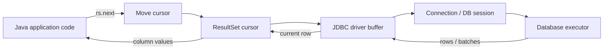
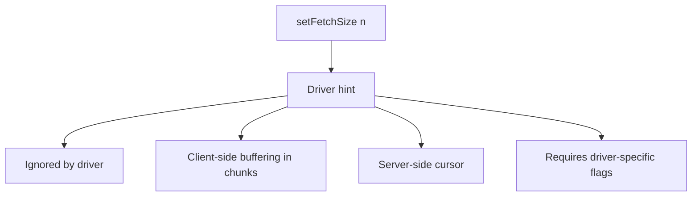
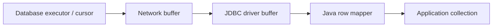
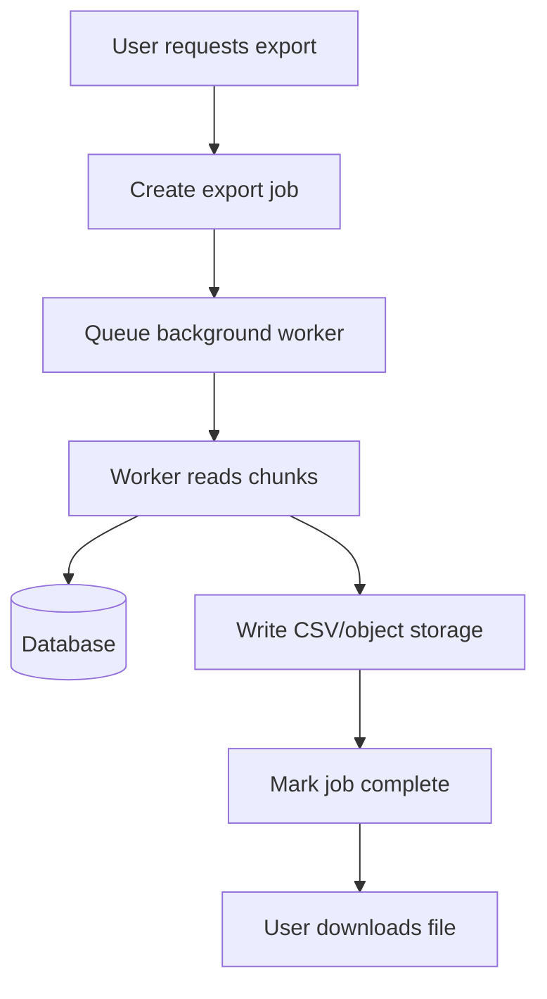

# Part 007 — ResultSet Deep Dive: Cursor, Streaming, Fetch Size, Memory Pressure

## 1. Tujuan Part Ini

`ResultSet` sering terlihat sederhana:

```java
while (rs.next()) {
    // read columns
}
```

Tetapi di production, `ResultSet` adalah salah satu tempat paling sering terjadi bug yang mahal:

- query mengembalikan terlalu banyak row dan menghabiskan heap
- cursor dibiarkan hidup terlalu lama sehingga connection tidak bisa kembali ke pool
- `getInt()` pada kolom nullable dibaca sebagai `0` tanpa `wasNull()`
- mapper membaca kolom yang salah karena label berubah
- fetch size tidak bekerja sesuai asumsi karena driver membutuhkan konfigurasi khusus
- streaming result memegang transaction dan server-side resource terlalu lama
- operasi read-only ternyata tetap memblokir writer karena isolation dan cursor behavior

Part ini membangun mental model bahwa `ResultSet` bukan collection Java. `ResultSet` adalah **cursor over database result** yang ownership-nya terikat ke `Statement`, `Connection`, driver, dan kadang resource server-side di database.

> Target: setelah part ini, kamu bisa mendesain pembacaan data besar dengan sadar memory, sadar connection ownership, sadar driver behavior, dan sadar correctness.

---

## 2. Mental Model: ResultSet Bukan List

`ResultSet` adalah view bergerak terhadap hasil query.

Secara konseptual:



Ada beberapa implikasi penting:

1. `ResultSet` tidak selalu memuat semua row di memory aplikasi.
2. Driver boleh melakukan buffering.
3. Database boleh menahan cursor/server resource.
4. `ResultSet` valid selama parent `Statement`/`Connection` masih valid.
5. Membaca `ResultSet` terlalu lama berarti connection juga tertahan terlalu lama.

Jadi, pertanyaan yang benar bukan hanya:

> Bagaimana mengambil data?

Tetapi:

> Seberapa banyak data diambil, kapan diambil, siapa yang menahan resource, dan kapan resource dilepas?

---

## 3. Cursor Model

`ResultSet` memiliki cursor.

Awalnya cursor berada **sebelum row pertama**.

```java
try (PreparedStatement ps = connection.prepareStatement(sql);
     ResultSet rs = ps.executeQuery()) {

    while (rs.next()) {
        long id = rs.getLong("id");
        String status = rs.getString("status");
    }
}
```

`rs.next()` melakukan dua hal:

1. memindahkan cursor ke row berikutnya
2. mengembalikan `true` jika row tersedia

Jika tidak ada row lagi, `next()` mengembalikan `false`.

### 3.1 Current Row Invariant

Banyak method `ResultSet` membutuhkan cursor berada pada current row yang valid.

Valid:

```java
if (rs.next()) {
    String name = rs.getString("name");
}
```

Tidak valid:

```java
String name = rs.getString("name"); // cursor belum berada di row apa pun
```

Invariant:

> Column value hanya boleh dibaca setelah `next()` berhasil mengembalikan `true`.

---

## 4. ResultSet Type

Saat membuat statement, JDBC memungkinkan kita meminta karakteristik result set tertentu.

```java
PreparedStatement ps = connection.prepareStatement(
    sql,
    ResultSet.TYPE_FORWARD_ONLY,
    ResultSet.CONCUR_READ_ONLY
);
```

Tiga tipe utama:

| Type | Meaning | Production Default Recommendation |
|---|---|---|
| `TYPE_FORWARD_ONLY` | Cursor hanya maju | Default untuk query biasa |
| `TYPE_SCROLL_INSENSITIVE` | Bisa scroll, tidak sensitif terhadap perubahan setelah query | Gunakan jarang |
| `TYPE_SCROLL_SENSITIVE` | Bisa scroll dan mungkin sensitif terhadap perubahan | Hindari kecuali benar-benar perlu |

### 4.1 Forward-Only Bias

Untuk service backend, kebanyakan query harus `TYPE_FORWARD_ONLY`.

Alasannya:

- lebih sederhana
- lebih mudah distream
- memory behavior lebih masuk akal
- driver/database tidak perlu menyediakan scrollable cursor
- mapper menjadi stateless

Jika kamu butuh `absolute()`, `previous()`, atau `last()`, biasanya itu sinyal bahwa query/model pembacaan datamu perlu dievaluasi ulang.

---

## 5. ResultSet Concurrency

Concurrency mode menentukan apakah result set bisa dipakai untuk update row.

| Mode | Meaning | Recommendation |
|---|---|---|
| `CONCUR_READ_ONLY` | hanya baca | default production |
| `CONCUR_UPDATABLE` | bisa update via result set | hindari untuk service code |

Contoh updatable result set:

```java
Statement st = connection.createStatement(
    ResultSet.TYPE_SCROLL_INSENSITIVE,
    ResultSet.CONCUR_UPDATABLE
);

ResultSet rs = st.executeQuery("select id, status from task");
while (rs.next()) {
    rs.updateString("status", "DONE");
    rs.updateRow();
}
```

Secara API ini valid, tetapi untuk application service modern biasanya buruk.

Kenapa?

- update intent tersembunyi di cursor operation
- sulit direview
- sulit mengontrol optimistic concurrency
- sulit logging/audit
- sulit mengoptimalkan SQL
- behavior sangat driver/database-dependent

Production guideline:

> Gunakan explicit `UPDATE ... WHERE ...` daripada updatable `ResultSet`.

---

## 6. ResultSet Holdability

Holdability menentukan apakah cursor tetap terbuka setelah commit.

Konstanta umum:

- `ResultSet.HOLD_CURSORS_OVER_COMMIT`
- `ResultSet.CLOSE_CURSORS_AT_COMMIT`

Contoh:

```java
PreparedStatement ps = connection.prepareStatement(
    sql,
    ResultSet.TYPE_FORWARD_ONLY,
    ResultSet.CONCUR_READ_ONLY,
    ResultSet.CLOSE_CURSORS_AT_COMMIT
);
```

Di service backend, biasanya kamu ingin cursor tidak hidup lebih lama dari transaction.

Rule:

> Jangan desain business flow yang membutuhkan cursor tetap hidup setelah commit.

Jika kamu perlu membaca banyak data dan commit per chunk, gunakan query pagination/keyset/chunking, bukan cursor yang ditahan melewati commit tanpa alasan kuat.

---

## 7. Fetch Size: Hint, Not Contract

`fetchSize` memberi petunjuk kepada driver tentang jumlah row yang sebaiknya diambil per round trip atau per batch internal.

```java
try (PreparedStatement ps = connection.prepareStatement(sql)) {
    ps.setFetchSize(500);

    try (ResultSet rs = ps.executeQuery()) {
        while (rs.next()) {
            process(rs);
        }
    }
}
```

Namun, `fetchSize` bukan kontrak universal.

Driver dapat:

- mengabaikannya
- menggunakannya sebagai hint
- membutuhkan konfigurasi tambahan
- melakukan prefetch besar
- melakukan streaming hanya dalam mode tertentu

Mental model:



Jangan pernah menganggap `setFetchSize(100)` berarti heap hanya berisi 100 row.

Yang benar:

> Verifikasi dengan driver docs, metrics, heap profile, query logs, dan test data besar.

---

## 8. Memory Pressure: Where Rows Can Accumulate

Rows bisa tertahan di beberapa tempat:



Bahaya terbesar biasanya bukan `ResultSet` saja, tetapi kombinasi:

```java
List<Customer> customers = new ArrayList<>();

while (rs.next()) {
    customers.add(mapCustomer(rs));
}
```

Jika query mengembalikan 5 juta row, yang membunuh aplikasi bukan `while` loop, tetapi keputusan untuk mengumpulkan semuanya ke `List`.

### 8.1 Streaming Processing

Untuk data besar, gunakan consumer/callback:

```java
public void streamOpenCases(Connection connection, Consumer<CaseRow> consumer) throws SQLException {
    String sql = """
        select id, status, created_at
        from enforcement_case
        where status = ?
        order by id
        """;

    try (PreparedStatement ps = connection.prepareStatement(sql)) {
        ps.setString(1, "OPEN");
        ps.setFetchSize(500);

        try (ResultSet rs = ps.executeQuery()) {
            while (rs.next()) {
                consumer.accept(mapCaseRow(rs));
            }
        }
    }
}
```

Tetapi callback streaming juga punya risiko:

- consumer bisa lambat
- connection tertahan selama consumer bekerja
- transaction bisa hidup terlalu lama
- lock/MVCC snapshot bisa tertahan
- error di tengah stream perlu strategy

Jadi streaming bukan “gratis”. Streaming memindahkan risiko dari heap ke resource lifetime.

---

## 9. Do Not Return ResultSet from DAO

Anti-pattern:

```java
public ResultSet findOpenCases(Connection connection) throws SQLException {
    PreparedStatement ps = connection.prepareStatement("select * from enforcement_case where status = 'OPEN'");
    return ps.executeQuery();
}
```

Masalah:

- siapa yang menutup `ResultSet`?
- siapa yang menutup `PreparedStatement`?
- berapa lama connection tertahan?
- caller harus tahu SQL resource lifecycle
- ownership bocor ke layer lain

Lebih baik:

```java
public List<CaseSummary> findOpenCases(Connection connection, int limit) throws SQLException {
    String sql = """
        select id, case_number, status, created_at
        from enforcement_case
        where status = ?
        order by created_at desc
        limit ?
        """;

    try (PreparedStatement ps = connection.prepareStatement(sql)) {
        ps.setString(1, "OPEN");
        ps.setInt(2, limit);

        try (ResultSet rs = ps.executeQuery()) {
            List<CaseSummary> result = new ArrayList<>();
            while (rs.next()) {
                result.add(mapCaseSummary(rs));
            }
            return result;
        }
    }
}
```

Atau untuk stream yang dikontrol:

```java
public void forEachOpenCase(
    Connection connection,
    int fetchSize,
    Consumer<CaseSummary> consumer
) throws SQLException {
    String sql = """
        select id, case_number, status, created_at
        from enforcement_case
        where status = ?
        order by id
        """;

    try (PreparedStatement ps = connection.prepareStatement(sql)) {
        ps.setString(1, "OPEN");
        ps.setFetchSize(fetchSize);

        try (ResultSet rs = ps.executeQuery()) {
            while (rs.next()) {
                consumer.accept(mapCaseSummary(rs));
            }
        }
    }
}
```

Rule:

> DAO boleh mengembalikan domain data, page, iterator yang owning lifecycle-nya jelas, atau menjalankan callback. DAO tidak boleh membocorkan `ResultSet` mentah ke layer atas.

---

## 10. Column Access: Label vs Index

JDBC mendukung akses kolom by index dan by label.

```java
long id = rs.getLong(1);
String status = rs.getString(2);
```

```java
long id = rs.getLong("id");
String status = rs.getString("status");
```

### 10.1 Access by Index

Kelebihan:

- bisa sedikit lebih cepat
- cocok untuk mapper internal yang stabil
- menghindari ambiguity label duplicate

Kekurangan:

- fragile terhadap perubahan urutan select
- sulit dibaca
- bug bisa silent

### 10.2 Access by Label

Kelebihan:

- lebih readable
- lebih tahan terhadap perubahan urutan kolom
- cocok untuk tutorial dan code review

Kekurangan:

- alias harus konsisten
- duplicate label bisa membingungkan
- mungkin sedikit overhead

Recommendation:

Untuk codebase enterprise, gunakan column label eksplisit dengan alias yang stabil:

```java
String sql = """
    select
        c.id as case_id,
        c.case_number as case_number,
        c.status as case_status,
        c.created_at as created_at
    from enforcement_case c
    where c.id = ?
    """;
```

Mapper:

```java
private CaseSummary mapCaseSummary(ResultSet rs) throws SQLException {
    return new CaseSummary(
        rs.getLong("case_id"),
        rs.getString("case_number"),
        rs.getString("case_status"),
        rs.getObject("created_at", OffsetDateTime.class)
    );
}
```

---

## 11. Null Handling: Primitive Getter Trap

This is one of the most important correctness sections.

JDBC primitive getters cannot return `null`.

Example:

```java
int score = rs.getInt("risk_score");
```

If `risk_score` is SQL `NULL`, `getInt()` returns `0`.

To distinguish real `0` from `NULL`, call `wasNull()` immediately after reading:

```java
int rawScore = rs.getInt("risk_score");
Integer riskScore = rs.wasNull() ? null : rawScore;
```

Why immediately?

Because `wasNull()` reports whether the **last column read** was SQL `NULL`.

Buggy:

```java
int score = rs.getInt("risk_score");
String status = rs.getString("status");
boolean scoreWasNull = rs.wasNull(); // now refers to status, not risk_score
```

Safer helper:

```java
static Integer nullableInt(ResultSet rs, String column) throws SQLException {
    int value = rs.getInt(column);
    return rs.wasNull() ? null : value;
}

static Long nullableLong(ResultSet rs, String column) throws SQLException {
    long value = rs.getLong(column);
    return rs.wasNull() ? null : value;
}
```

For nullable object-friendly types:

```java
String comment = rs.getString("comment"); // returns null if SQL NULL
BigDecimal amount = rs.getBigDecimal("amount"); // returns null if SQL NULL
```

But avoid assuming all getters behave identically across primitive/object categories.

Rule:

> For nullable numeric/boolean columns, either use `getObject(column, Type.class)` when driver supports it correctly, or wrap primitive getter + immediate `wasNull()`.

Example:

```java
Integer riskScore = rs.getObject("risk_score", Integer.class);
Boolean approved = rs.getObject("approved", Boolean.class);
```

Still validate driver/database behavior in integration tests.

---

## 12. Mapping ResultSet to Domain Objects

A mapper should be:

- deterministic
- side-effect free
- small
- tied to explicit selected columns
- testable
- not responsible for connection/statement lifecycle

Example:

```java
record CaseSummary(
    long id,
    String caseNumber,
    String status,
    OffsetDateTime createdAt,
    Integer riskScore
) {}

static CaseSummary mapCaseSummary(ResultSet rs) throws SQLException {
    return new CaseSummary(
        rs.getLong("case_id"),
        rs.getString("case_number"),
        rs.getString("status"),
        rs.getObject("created_at", OffsetDateTime.class),
        rs.getObject("risk_score", Integer.class)
    );
}
```

### 12.1 Mapper Should Not Query Again

Bad:

```java
static CaseDetails mapCase(ResultSet rs, Connection connection) throws SQLException {
    long id = rs.getLong("id");
    List<Event> events = loadEvents(connection, id); // hidden N+1 query
    return new CaseDetails(id, events);
}
```

This hides expensive behavior inside mapping.

Better:

- query with join if appropriate
- use explicit second query at service layer
- load child data in batch
- use separate query plan

Mapper invariant:

> A row mapper maps the current row. It does not perform hidden IO.

---

## 13. One-to-Many Mapping Without ORM

JDBC returns rows. Domain models often have nested collections.

Example result:

```sql
select
    c.id as case_id,
    c.case_number,
    e.id as event_id,
    e.event_type,
    e.created_at as event_created_at
from enforcement_case c
left join enforcement_event e on e.case_id = c.id
where c.id = ?
order by c.id, e.created_at
```

Naive mapping duplicates parent objects.

Better accumulator:

```java
record EventRow(long id, String type, OffsetDateTime createdAt) {}

final class CaseAggregateBuilder {
    private final long caseId;
    private final String caseNumber;
    private final List<EventRow> events = new ArrayList<>();

    CaseAggregateBuilder(long caseId, String caseNumber) {
        this.caseId = caseId;
        this.caseNumber = caseNumber;
    }

    void addEvent(EventRow event) {
        events.add(event);
    }

    CaseAggregate build() {
        return new CaseAggregate(caseId, caseNumber, List.copyOf(events));
    }
}
```

Single aggregate by ID:

```java
CaseAggregateBuilder builder = null;

while (rs.next()) {
    if (builder == null) {
        builder = new CaseAggregateBuilder(
            rs.getLong("case_id"),
            rs.getString("case_number")
        );
    }

    Long eventId = rs.getObject("event_id", Long.class);
    if (eventId != null) {
        builder.addEvent(new EventRow(
            eventId,
            rs.getString("event_type"),
            rs.getObject("event_created_at", OffsetDateTime.class)
        ));
    }
}

return builder == null ? Optional.empty() : Optional.of(builder.build());
```

For many parents, use `LinkedHashMap<Long, Builder>` to preserve ordering.

---

## 14. Pagination vs Streaming

There are two common strategies for large reads:

1. streaming cursor
2. chunked pagination

### 14.1 Streaming Cursor

Good when:

- processing is simple and fast
- connection can be held for the whole read
- transaction duration is acceptable
- driver supports streaming behavior clearly
- result set is processed once

Bad when:

- downstream processing is slow
- consumer calls external API
- job may run for minutes/hours
- you need commit per chunk
- you need resumability

### 14.2 Chunked Pagination

Good when:

- you need resumability
- you want shorter transactions
- you want release connection between chunks
- you want progress checkpointing
- you want retry per chunk

Prefer keyset pagination for large ordered datasets:

```sql
select id, case_number, status
from enforcement_case
where id > ?
order by id
limit ?
```

Java loop:

```java
long lastSeenId = 0L;
int pageSize = 1_000;

while (true) {
    List<CaseSummary> page = findPageAfterId(connection, lastSeenId, pageSize);
    if (page.isEmpty()) {
        break;
    }

    for (CaseSummary row : page) {
        process(row);
        lastSeenId = row.id();
    }
}
```

Avoid offset pagination for very large tables:

```sql
select ...
from enforcement_case
order by id
limit 1000 offset 1000000
```

Offset can become increasingly expensive because the database still has to walk/skip many rows.

---

## 15. Resource Lifecycle

Basic pattern:

```java
try (PreparedStatement ps = connection.prepareStatement(sql);
     ResultSet rs = ps.executeQuery()) {

    while (rs.next()) {
        process(rs);
    }
}
```

This ensures:

- `ResultSet` closes
- `PreparedStatement` closes
- connection remains owned by caller

If method owns the connection:

```java
try (Connection connection = dataSource.getConnection();
     PreparedStatement ps = connection.prepareStatement(sql);
     ResultSet rs = ps.executeQuery()) {

    while (rs.next()) {
        process(rs);
    }
}
```

Close order is reverse declaration order.

Important:

> Closing a `Statement` generally closes its current `ResultSet`. But do not rely on implicit cleanup as your main design. Use try-with-resources.

---

## 16. ResultSet and Transaction Duration

A long-lived `ResultSet` often means a long-lived transaction or session state.

Even for read queries, this can matter:

- database may hold MVCC snapshot
- vacuum/cleanup may be delayed in MVCC databases
- locks may be retained depending on isolation and query
- connection remains borrowed from pool
- failover/cancellation behavior becomes harder

Bad pattern:

```java
try (Connection connection = dataSource.getConnection()) {
    connection.setAutoCommit(false);

    try (PreparedStatement ps = connection.prepareStatement(sql);
         ResultSet rs = ps.executeQuery()) {
        while (rs.next()) {
            callExternalApi(rs); // slow IO inside DB transaction
        }
    }

    connection.commit();
}
```

Better:

1. read IDs in bounded chunks
2. commit/release connection
3. call external systems outside transaction
4. write results with idempotency

---

## 17. Fetch Size and Auto-Commit Interaction

Some drivers require auto-commit to be disabled for server-side cursors or streaming behavior. Some require URL flags. Some treat fetch size as client-side prefetch only.

Do not memorize one universal rule.

Use this diagnostic checklist:

```txt
When fetchSize appears ignored:
1. Check driver documentation.
2. Check whether autoCommit must be false.
3. Check whether result set must be TYPE_FORWARD_ONLY.
4. Check whether a URL flag enables server-side cursor/fetch.
5. Check whether query includes clauses that force full materialization.
6. Check heap usage with a large dataset.
7. Check database session/cursor metrics if available.
8. Check network round trips and query log timing.
```

Engineering rule:

> Treat streaming behavior as driver-specific until proven by integration test.

---

## 18. Query Shape Matters More Than ResultSet Tricks

Do not compensate for bad query shape with fetch size.

Bad:

```sql
select *
from enforcement_case
```

Better:

```sql
select id, case_number, status, created_at
from enforcement_case
where status = ?
order by created_at desc
limit ?
```

Key principles:

- select only needed columns
- filter early
- limit bounded UI queries
- use covering indexes where appropriate
- avoid reading large text/blob columns accidentally
- separate summary query from detail query
- avoid unbounded export through request/response endpoint

`ResultSet` tuning is not a substitute for proper SQL design.

---

## 19. BLOB/CLOB Columns in ResultSet

Large objects require special care.

Avoid:

```java
byte[] document = rs.getBytes("document_blob");
```

This can load the entire object into heap.

Prefer streaming when appropriate:

```java
try (InputStream in = rs.getBinaryStream("document_blob")) {
    transferToStorage(in);
}
```

But remember:

- stream is tied to current row/result set/connection
- you must consume before moving cursor depending on driver behavior
- you must not close connection while stream is active
- slow downstream storage keeps DB resource open

For very large files, ask whether the database should store bytes at all, or whether object storage plus metadata is better.

---

## 20. ResultSet Metadata

`ResultSetMetaData` describes returned columns.

```java
ResultSetMetaData meta = rs.getMetaData();
int columns = meta.getColumnCount();

for (int i = 1; i <= columns; i++) {
    System.out.printf(
        "%s %s %d%n",
        meta.getColumnLabel(i),
        meta.getColumnTypeName(i),
        meta.getPrecision(i)
    );
}
```

Useful for:

- generic export tools
- diagnostics
- schema inspection
- debugging dynamic queries
- data migration utilities

Avoid using metadata-heavy dynamic mapping in core business code unless you are building infrastructure.

Business mappers should usually be explicit.

---

## 21. ResultSet in API Design

Avoid exposing `ResultSet` outside infrastructure boundary.

Bad service API:

```java
ResultSet searchCases(SearchFilter filter);
```

Better service API:

```java
List<CaseSummary> searchCases(SearchFilter filter, PageRequest pageRequest);
```

Or streaming with explicit lifecycle:

```java
void forEachMatchingCase(SearchFilter filter, Consumer<CaseSummary> consumer);
```

Or advanced explicit closeable abstraction:

```java
interface CloseableRowStream<T> extends AutoCloseable {
    boolean next() throws SQLException;
    T current() throws SQLException;
    void close() throws SQLException;
}
```

But if you build such abstraction, you own all lifecycle complexity.

---

## 22. Mapping for Regulatory Systems

For enforcement/case-management systems, reading data is not just technical. It has defensibility implications.

Common query categories:

| Query Type | ResultSet Risk | Design Rule |
|---|---|---|
| case search | unbounded result | enforce limit and stable ordering |
| audit trail | large append-only result | keyset pagination |
| evidence document | large binary | stream carefully or object storage |
| dashboard count | expensive aggregation | pre-aggregate/cache if needed |
| export | memory pressure | async job + chunking |
| escalation queue | concurrency race | order + lock/claim strategy |

Example: escalation queue reader.

Bad:

```sql
select *
from escalation_task
where status = 'READY'
```

Better:

```sql
select id, case_id, priority, due_at
from escalation_task
where status = ?
  and due_at <= ?
order by priority desc, due_at asc, id asc
limit ?
```

Why?

- bounded
- deterministic
- auditable
- stable for pagination/claiming
- avoids accidental full queue load

---

## 23. Common Anti-Patterns

### 23.1 Returning `ResultSet` from Repository

Leaks resource lifecycle to caller.

### 23.2 Unbounded `select *`

Turns database into accidental heap loader.

### 23.3 Building Giant List by Default

```java
List<Row> allRows = new ArrayList<>();
while (rs.next()) {
    allRows.add(map(rs));
}
```

Fine for bounded query. Dangerous for unknown cardinality.

### 23.4 Slow Work Inside ResultSet Loop

```java
while (rs.next()) {
    emailClient.send(...);
}
```

Keeps DB resources open while waiting on external IO.

### 23.5 Nullable Primitive Bug

```java
int value = rs.getInt("nullable_column");
```

Without `wasNull()` or `getObject(...)`, `NULL` can become `0`.

### 23.6 Assuming Fetch Size Works Universally

`setFetchSize(1000)` is not a portability guarantee.

### 23.7 Mapper With Hidden Queries

Creates N+1 query pattern and hides IO.

### 23.8 Column Position Fragility

Mapper reads index `3`, query changes select order, bug appears silently.

---

## 24. Production Checklist

Before approving a JDBC read path, ask:

```txt
Cardinality
- Can this query return unbounded rows?
- Is there a limit or chunking strategy?
- Is ordering deterministic?

Columns
- Are only required columns selected?
- Are large columns excluded unless needed?
- Are aliases stable?

Lifecycle
- Who owns ResultSet closure?
- Who owns Statement closure?
- How long is connection held?
- Can downstream processing delay resource release?

Null correctness
- Are nullable primitive columns handled correctly?
- Are SQL NULL and default value distinguishable?

Streaming
- Is fetchSize verified for this driver?
- Is transaction duration acceptable?
- Is processing fast enough?

Failure
- What happens after partial processing?
- Is retry safe?
- Is progress checkpointed if needed?

Observability
- Can we see query latency?
- Can we see rows processed?
- Can we see pool pressure?
- Can we identify slow consumers?
```

---

## 25. Mini Case Study: Export Endpoint That Kills Production

Initial implementation:

```java
@GetMapping("/cases/export")
public List<CaseExportRow> exportCases() {
    return repository.findAllCasesForExport();
}
```

Repository:

```java
public List<CaseExportRow> findAllCasesForExport() throws SQLException {
    try (Connection c = dataSource.getConnection();
         PreparedStatement ps = c.prepareStatement("select * from enforcement_case");
         ResultSet rs = ps.executeQuery()) {

        List<CaseExportRow> rows = new ArrayList<>();
        while (rs.next()) {
            rows.add(mapExportRow(rs));
        }
        return rows;
    }
}
```

Symptoms:

- heap spikes
- GC pressure
- API timeout
- pool exhaustion
- database CPU high
- user retries make it worse

Better design:



Repository chunk:

```java
public List<CaseExportRow> findExportPageAfterId(long lastId, int limit) throws SQLException {
    String sql = """
        select id, case_number, status, created_at, closed_at
        from enforcement_case
        where id > ?
        order by id
        limit ?
        """;

    try (Connection c = dataSource.getConnection();
         PreparedStatement ps = c.prepareStatement(sql)) {
        ps.setLong(1, lastId);
        ps.setInt(2, limit);

        try (ResultSet rs = ps.executeQuery()) {
            List<CaseExportRow> rows = new ArrayList<>(limit);
            while (rs.next()) {
                rows.add(mapExportRow(rs));
            }
            return rows;
        }
    }
}
```

Key improvement:

- bounded memory
- resumable progress
- shorter connection hold time
- explicit job status
- less user-driven retry pressure

---

## 26. Deliberate Practice

### Exercise 1 — Nullable Column Audit

Find every `getInt`, `getLong`, `getBoolean`, `getDouble` in a JDBC codebase.

For each:

1. check whether database column is nullable
2. replace with `getObject(column, Type.class)` or helper using `wasNull()`
3. add integration test for SQL `NULL`

### Exercise 2 — Unbounded Query Review

Search for:

```sql
select *
```

and repository methods returning `List<T>` without limit.

Classify:

- safe bounded by primary key
- safe bounded by unique key
- unsafe unbounded
- export/reporting candidate

### Exercise 3 — Streaming Verification

Create a table with 1 million rows.

Test:

- no fetch size
- fetch size 100
- fetch size 1000
- auto-commit true/false where relevant
- driver-specific streaming flags where relevant

Observe:

- heap usage
- connection hold time
- database session state
- query duration

### Exercise 4 — Mapper Contract

Write mapper tests where SQL aliases intentionally change.

Goal:

- detect fragile mapper behavior
- enforce explicit aliasing
- avoid accidental column order dependency

---

## 27. Summary

`ResultSet` is deceptively simple.

The senior-level model is:

```txt
ResultSet = cursor + driver buffer + statement ownership + connection/session lifetime + database resource behavior
```

Main rules:

- do not treat `ResultSet` as `List`
- do not expose raw `ResultSet` outside infrastructure boundary
- always close result sets and statements
- keep connection hold time short
- treat fetch size as driver-specific until verified
- handle nullable primitive columns explicitly
- avoid slow external work while result set is open
- prefer bounded query, keyset pagination, and chunking for large workloads

Next part goes deeper into the type boundary: Java types, JDBC types, database types, precision, scale, temporal values, vendor-specific types, and how type mapping bugs create production correctness defects.
