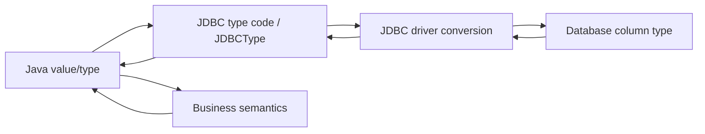

# Part 008 — SQL Type Mapping: Java Types, JDBC Types, Database Types

## 1. Tujuan Part Ini

Type mapping adalah boundary correctness.

Banyak engineer menganggap mapping Java ↔ SQL sebagai detail kecil:

```java
ps.setString(1, value);
rs.getString("column");
```

Tetapi bug type mapping bisa berdampak besar:

- uang berubah karena memakai `double`
- timestamp salah timezone
- `NULL` berubah menjadi `0` atau `false`
- UUID disimpan sebagai string tanpa normalisasi
- JSON disimpan sebagai text lalu query/indexing buruk
- enum rename merusak data lama
- numeric overflow baru muncul setelah data production membesar
- kolom `varchar` dipakai untuk semua hal dan kehilangan constraint
- `setObject()` ambigu karena driver tidak tahu target SQL type

Part ini membangun mental model bahwa type mapping adalah **contract tiga arah**:

```txt
Java type <-> JDBC type <-> Database vendor type
```

Jika salah satu sisi ambigu, correctness dan performance bisa rusak.

---

## 2. Mental Model: Three-Layer Type Contract



Contoh:

```txt
Business semantics: exact monetary amount
Java type: BigDecimal
JDBC type: DECIMAL / NUMERIC
Database type: numeric(19, 4) or decimal(19, 4)
```

Jika kamu mengganti Java type menjadi `double`, business semantics rusak.

Jika kamu mengganti database type menjadi `float`, business semantics rusak.

Jika kamu bind dengan `setObject()` tanpa target type dan driver salah infer, query plan/performance bisa terganggu.

---

## 3. JDBC Type Vocabulary

JDBC menyediakan dua representasi umum untuk SQL type:

1. `java.sql.Types` — integer constants
2. `java.sql.JDBCType` — enum implementing `SQLType`

Contoh `Types`:

```java
ps.setNull(1, Types.VARCHAR);
ps.setNull(2, Types.DECIMAL);
ps.setNull(3, Types.TIMESTAMP_WITH_TIMEZONE);
```

Contoh `JDBCType`:

```java
ps.setObject(1, amount, JDBCType.DECIMAL);
ps.setObject(2, status, JDBCType.VARCHAR);
```

`Types` lebih tua dan masih sangat sering dipakai. `JDBCType` memberi representasi enum yang lebih type-safe untuk API modern yang menerima `SQLType`.

Important:

> JDBC type adalah generic SQL type. Database vendor tetap punya tipe spesifik yang tidak selalu map 1:1.

Contoh:

| JDBC Generic | PostgreSQL | MySQL | Oracle | SQL Server |
|---|---|---|---|---|
| `VARCHAR` | `varchar`, `text` | `varchar`, `text` | `varchar2`, `clob` | `varchar`, `nvarchar` |
| `DECIMAL` | `numeric` | `decimal` | `number` | `decimal`, `numeric` |
| `BOOLEAN` | `boolean` | `boolean`/`tinyint(1)` behavior depends on schema/driver | often modeled differently | `bit` |
| `TIMESTAMP_WITH_TIMEZONE` | `timestamptz` semantics | varies | `timestamp with time zone` | `datetimeoffset` |
| `OTHER` | `uuid`, `jsonb`, etc. | vendor-specific | vendor-specific | vendor-specific |

Rule:

> Do not stop at Java type. Always know the database column type and driver mapping behavior.

---

## 4. Mapping Table: Practical Defaults

| Business Value | Preferred Java Type | JDBC Type | Database Type Guidance |
|---|---|---|---|
| identifier numeric | `long` / `Long` | `BIGINT` | `bigint`, sequence/identity |
| identifier UUID | `UUID` | often `OTHER` or `VARCHAR` depending driver | native UUID if available |
| status enum | Java enum or value object | `VARCHAR` or vendor enum | stable code, not display label |
| money | `BigDecimal` | `DECIMAL` / `NUMERIC` | fixed precision/scale |
| quantity count | `int`/`long` | `INTEGER`/`BIGINT` | match expected range |
| ratio/measurement approximate | `double` only if approximate is acceptable | `DOUBLE` | avoid for money |
| business date | `LocalDate` | `DATE` | date without time |
| wall-clock local time | `LocalTime` | `TIME` | use carefully |
| event instant | `Instant` / `OffsetDateTime` | `TIMESTAMP_WITH_TIMEZONE` or vendor equivalent | normalize semantics |
| free text | `String` | `VARCHAR`/`CLOB` | size, collation, indexing considered |
| binary small | `byte[]` | `VARBINARY` | bounded size |
| binary large | `InputStream`/`Blob` | `BLOB` | consider object storage |
| JSON document | `String`, JSON library type, vendor object | `OTHER`/`VARCHAR` | native JSON/JSONB if queryable |
| boolean flag | `boolean`/`Boolean` | `BOOLEAN` | nullable semantics explicit |

This table is not universal. It is a starting point for engineering decisions.

---

## 5. Strings: VARCHAR, TEXT, CHAR, NVARCHAR, CLOB

### 5.1 `String` Is Not One Type

A Java `String` can map to many database types:

- `CHAR`
- `VARCHAR`
- `LONGVARCHAR`
- `NCHAR`
- `NVARCHAR`
- `LONGNVARCHAR`
- `CLOB`
- `NCLOB`
- vendor-specific `TEXT`

Choosing “string” is not enough.

You must decide:

- max length
- unicode requirements
- collation
- case sensitivity
- indexing behavior
- sorting behavior
- uniqueness semantics
- trailing spaces behavior
- whether value is code, label, or free text

### 5.2 Code vs Label

Bad schema:

```sql
status varchar(255)
```

Better:

```sql
status varchar(32) not null
```

Even better when appropriate:

```sql
status_code varchar(32) not null
```

Why?

- status is a code, not a user-facing label
- bounded length communicates domain
- constraints can protect data
- indexes are smaller
- reviews are easier

### 5.3 CHAR Trap

`CHAR(n)` pads values in many databases.

For business codes, `varchar(n)` is usually safer unless fixed-width semantics are truly intended.

Bad:

```sql
country_code char(3)
```

Potential issue: trailing-space comparison and driver behavior can surprise you.

Better:

```sql
country_code varchar(3)
```

unless fixed-width is a formal requirement.

---

## 6. Numeric Types

### 6.1 Exact vs Approximate

Numeric decision starts with one question:

> Is this value exact or approximate?

Exact:

- money
- count
- quantity
- legal penalty amount
- threshold
- percentage stored as fixed decimal

Approximate:

- sensor reading
- statistical score
- ML confidence
- geospatial approximate value

### 6.2 Money Requires BigDecimal

Bad:

```java
double penaltyAmount = rs.getDouble("penalty_amount");
```

Better:

```java
BigDecimal penaltyAmount = rs.getBigDecimal("penalty_amount");
```

Binding:

```java
ps.setBigDecimal(1, penaltyAmount);
```

Schema:

```sql
penalty_amount numeric(19, 4) not null
```

Why not `double`?

Because binary floating point cannot exactly represent many decimal values.

For regulatory/financial systems, this is not just a technical problem. It is an auditability problem.

### 6.3 Precision and Scale

For `numeric(19, 4)`:

- precision = total digits
- scale = digits after decimal point

Example:

```txt
123456789012345.6789
```

Precision 19, scale 4.

Engineering rule:

> Precision and scale are part of the domain contract. They should not be incidental database defaults.

### 6.4 BigDecimal Equality Trap

Java `BigDecimal` has scale-sensitive `equals()`:

```java
new BigDecimal("1.0").equals(new BigDecimal("1.00")); // false
```

But:

```java
new BigDecimal("1.0").compareTo(new BigDecimal("1.00")); // 0
```

For domain equality, often use `compareTo()` or normalize scale.

```java
BigDecimal normalized = amount.setScale(4, RoundingMode.UNNECESSARY);
```

But never normalize silently if rounding could hide data quality errors.

---

## 7. Integer Types and Overflow

Map ranges deliberately.

| SQL Type | Java Primitive | Wrapper | Notes |
|---|---|---|---|
| `SMALLINT` | `short` | `Short` | rare in business code |
| `INTEGER` | `int` | `Integer` | common count/status numeric code |
| `BIGINT` | `long` | `Long` | IDs, large counters |

Bug example:

```java
int id = rs.getInt("id");
```

If database column is `BIGINT`, use:

```java
long id = rs.getLong("id");
```

For nullable:

```java
Long parentId = rs.getObject("parent_id", Long.class);
```

Guideline:

> IDs should almost always be `long`/`Long` or `UUID`, not `int`, unless schema and lifetime cardinality prove otherwise.

---

## 8. Boolean Types

Java:

```java
boolean active = rs.getBoolean("active");
```

Problem:

If SQL value is `NULL`, primitive getter returns `false` unless you check `wasNull()`.

Safer for nullable column:

```java
Boolean active = rs.getObject("active", Boolean.class);
```

Schema decision:

```sql
active boolean not null default true
```

or:

```sql
review_required boolean null
```

But nullable boolean is often a smell because it creates three states:

1. true
2. false
3. unknown/not evaluated/not applicable

If three states are real, model them explicitly:

```sql
review_state varchar(32) not null
-- NOT_REQUIRED, REQUIRED, COMPLETED
```

Avoid encoding workflow state as nullable boolean if the domain is richer than yes/no.

---

## 9. Dates and Times: Preview Before Dedicated Part

Part 009 will go deep into temporal correctness. Here we establish the mapping vocabulary.

| Business Meaning | Java Type | SQL Type |
|---|---|---|
| calendar date | `LocalDate` | `DATE` |
| local time | `LocalTime` | `TIME` |
| local date-time without offset | `LocalDateTime` | `TIMESTAMP` |
| instant/global event time | `Instant` or `OffsetDateTime` | `TIMESTAMP_WITH_TIMEZONE` or vendor equivalent |
| legacy date/time | `java.sql.Date`, `Time`, `Timestamp` | legacy JDBC APIs |

Modern JDBC drivers commonly support `java.time` through `setObject()` and `getObject(column, Type.class)`, but behavior must be integration-tested with your database and driver.

Example:

```java
ps.setObject(1, LocalDate.now());
ps.setObject(2, OffsetDateTime.now(ZoneOffset.UTC));
```

Reading:

```java
LocalDate dueDate = rs.getObject("due_date", LocalDate.class);
OffsetDateTime createdAt = rs.getObject("created_at", OffsetDateTime.class);
```

Rule:

> Choose temporal types by business meaning, not convenience.

---

## 10. UUID

UUID can be stored as:

1. native UUID type, if database supports it
2. `char(36)` / `varchar(36)`
3. binary 16 bytes

Java type:

```java
UUID id = UUID.randomUUID();
```

Binding options vary by driver:

```java
ps.setObject(1, id);
```

or:

```java
ps.setString(1, id.toString());
```

Native UUID benefits:

- type validation by database
- compact semantics
- better operator support in some databases
- less accidental malformed value

String UUID drawbacks:

- larger than binary/native representation
- allows invalid strings unless constrained
- collation/index behavior may be less optimal

Guideline:

> Prefer native UUID when database and driver support are mature in your stack. Otherwise make string/binary representation explicit and test it.

---

## 11. Enum Mapping

Java enum:

```java
enum CaseStatus {
    OPEN,
    UNDER_REVIEW,
    CLOSED
}
```

Common mapping:

```java
ps.setString(1, status.name());
```

Reading:

```java
CaseStatus status = CaseStatus.valueOf(rs.getString("status"));
```

This is simple but has risks:

- renaming enum constant breaks old data
- deleting enum constant breaks reads
- display labels should not be stored as codes
- database may accept invalid strings unless constrained

Better value-object style:

```java
enum CaseStatus {
    OPEN("OPEN"),
    UNDER_REVIEW("UNDER_REVIEW"),
    CLOSED("CLOSED");

    private final String code;

    CaseStatus(String code) {
        this.code = code;
    }

    public String code() {
        return code;
    }

    public static CaseStatus fromCode(String code) {
        for (CaseStatus status : values()) {
            if (status.code.equals(code)) {
                return status;
            }
        }
        throw new IllegalArgumentException("Unknown case status: " + code);
    }
}
```

Schema:

```sql
status varchar(32) not null
```

Add check constraint where possible:

```sql
status in ('OPEN', 'UNDER_REVIEW', 'CLOSED')
```

For high-change domains, consider lookup table instead of DB enum type.

Guideline:

> Store stable codes, not Java implementation names unless you are willing to treat enum constant names as persistent schema.

---

## 12. JSON and Semi-Structured Data

JSON mapping depends heavily on database.

Options:

1. store JSON as text
2. use native JSON/JSONB type
3. decompose into relational tables
4. hybrid: relational key fields + JSON detail

Java representation:

- `String`
- `JsonNode`
- domain object serialized/deserialized
- vendor-specific object wrapper

Example with text binding:

```java
ps.setString(1, objectMapper.writeValueAsString(payload));
```

Example with generic object binding may require vendor-specific handling:

```java
ps.setObject(1, jsonValue);
```

Decision criteria:

| Need | Better Choice |
|---|---|
| query inside JSON | native JSON/JSONB with indexes |
| strict relational integrity | normalized tables |
| rare opaque payload | text or JSON column |
| audit snapshot | JSON can be reasonable |
| frequent partial update | native JSON operations or relational model |

Anti-pattern:

```sql
payload text not null
```

used as an excuse to avoid schema design for core business data.

Rule:

> JSON is acceptable for extensibility and snapshots. It is dangerous as a replacement for the domain model of core workflow state.

---

## 13. Arrays

JDBC has `Array` support:

```java
Array sqlArray = connection.createArrayOf("varchar", new String[] {"A", "B"});
ps.setArray(1, sqlArray);
```

Reading:

```java
Array array = rs.getArray("tags");
String[] tags = (String[]) array.getArray();
```

However, arrays are database-dependent.

Use arrays when:

- database supports them well
- query patterns benefit from them
- cardinality is small and bounded
- relational integrity is not required for each element

Avoid arrays when:

- you need foreign keys per element
- element lifecycle matters
- you query/filter/update individual elements heavily
- array grows unbounded

Often a join table is better:

```sql
case_tag (
    case_id bigint not null,
    tag_code varchar(64) not null,
    primary key (case_id, tag_code)
)
```

---

## 14. Binary Data: VARBINARY, BLOB, and Object Storage

Small binary:

```java
ps.setBytes(1, digestBytes);
byte[] digest = rs.getBytes("digest");
```

Large binary:

```java
try (InputStream input = file.openStream()) {
    ps.setBinaryStream(1, input);
}
```

Reading large binary:

```java
try (InputStream input = rs.getBinaryStream("content")) {
    copy(input, output);
}
```

Design question:

> Should the database store the bytes or only metadata and object-storage pointer?

Database BLOB can be reasonable when:

- transactional consistency with metadata is mandatory
- binary size is bounded
- access frequency is low/moderate
- backup/restore strategy accepts it

Object storage is often better when:

- files are large
- serving/download path dominates
- CDN/object lifecycle policies matter
- DB backup size is a concern

For evidence/regulatory systems, defensibility also matters:

- checksum/hash
- immutable storage
- chain of custody
- versioning
- access audit

---

## 15. NULL as Type and Value

SQL `NULL` is not a Java value. It means absence/unknown/not applicable depending on schema semantics.

Binding null requires type information:

```java
ps.setNull(1, Types.VARCHAR);
ps.setNull(2, Types.BIGINT);
ps.setNull(3, Types.TIMESTAMP_WITH_TIMEZONE);
```

Why not always:

```java
ps.setObject(1, null);
```

Because the driver/database may not know target type, especially in ambiguous SQL.

Better:

```java
if (comment == null) {
    ps.setNull(1, Types.VARCHAR);
} else {
    ps.setString(1, comment);
}
```

For object API:

```java
ps.setObject(1, value, JDBCType.VARCHAR);
```

Rule:

> SQL NULL should be bound with explicit target type in reusable infrastructure code.

---

## 16. `setObject()` Is Powerful but Not Magic

`setObject()` is convenient:

```java
ps.setObject(1, value);
```

But it can be ambiguous.

Potential issues:

- driver chooses unexpected SQL type
- database performs implicit casts
- index usage changes
- null has no type
- vendor-specific type requires special handling
- temporal conversion may surprise you

Prefer explicit setter when obvious:

```java
ps.setLong(1, id);
ps.setString(2, status);
ps.setBigDecimal(3, amount);
```

Prefer typed `setObject` when useful:

```java
ps.setObject(1, localDate, JDBCType.DATE);
ps.setObject(2, createdAt, JDBCType.TIMESTAMP_WITH_TIMEZONE);
```

Decision:

| Situation | Recommended Binding |
|---|---|
| simple primitive/string | explicit setter |
| nullable known type | `setNull` or typed `setObject` |
| `java.time` | typed `setObject` + integration test |
| vendor type like UUID/JSON | driver-specific tested binding |
| infrastructure generic binder | explicit mapping table |

---

## 17. `getObject(column, Class<T>)`

Modern JDBC allows typed retrieval:

```java
Long parentId = rs.getObject("parent_id", Long.class);
LocalDate dueDate = rs.getObject("due_date", LocalDate.class);
OffsetDateTime createdAt = rs.getObject("created_at", OffsetDateTime.class);
UUID id = rs.getObject("id", UUID.class);
```

Benefits:

- handles nullable wrapper types naturally
- clearer target type
- avoids primitive null trap

Caveats:

- driver support varies by type
- vendor-specific types may not map cleanly
- temporal behavior must be tested
- UUID/JSON behavior may be database-specific

Rule:

> Use `getObject(column, Class<T>)` where it improves null/type correctness, but verify behavior in integration tests against the real database driver.

---

## 18. Schema Is Part of Type Mapping

Java code alone cannot guarantee type correctness.

Bad:

```sql
amount varchar(255)
created_at varchar(255)
status varchar(255)
```

Better:

```sql
amount numeric(19, 4) not null
created_at timestamp with time zone not null
status varchar(32) not null
```

Even better with constraints:

```sql
amount numeric(19, 4) not null check (amount >= 0)
status varchar(32) not null check (status in ('OPEN', 'UNDER_REVIEW', 'CLOSED'))
```

Type mapping is a collaboration between:

- Java model
- JDBC binding
- database schema
- database constraint
- migration strategy
- tests

---

## 19. Type Mapping and Query Plans

Wrong type binding can affect performance.

Example risk:

```java
ps.setString(1, "12345");
```

for numeric column:

```sql
where customer_id = ?
```

The database may need implicit cast.

Depending on database, this can:

- prevent index usage
- cause full scan
- change plan stability
- produce runtime conversion errors

Better:

```java
ps.setLong(1, customerId);
```

Another risk:

```java
ps.setObject(1, value);
```

where `value` type is generic and inferred poorly.

Engineering rule:

> Bind values using the same semantic type as the target column.

---

## 20. Domain Value Objects

For high-value domains, do not pass raw primitive/string everywhere.

Example:

```java
record CaseNumber(String value) {
    CaseNumber {
        if (value == null || !value.matches("CASE-[0-9]{8}")) {
            throw new IllegalArgumentException("Invalid case number");
        }
    }
}
```

Binding:

```java
ps.setString(1, caseNumber.value());
```

Reading:

```java
CaseNumber caseNumber = new CaseNumber(rs.getString("case_number"));
```

Value objects help preserve invariants before data reaches JDBC.

Useful candidates:

- `CaseNumber`
- `OfficerId`
- `Money`
- `RiskScore`
- `EscalationPriority`
- `WorkflowState`
- `TenantId`

But avoid overengineering every column into a wrapper. Use value objects where they protect real invariants.

---

## 21. Type Mapping in Multi-Tenant Systems

Multi-tenant systems often have type-sensitive columns:

```sql
tenant_id varchar(64) not null
```

or:

```sql
tenant_id uuid not null
```

Rules:

- `tenant_id` type must be consistent across all tables
- bind tenant ID with the same Java type everywhere
- avoid converting tenant ID to string in some queries and UUID in others
- include tenant ID in composite indexes deliberately
- never allow nullable tenant ID unless explicitly global row

Bad:

```java
ps.setString(1, tenantId.toString());
```

in one repository, and:

```java
ps.setObject(1, tenantId);
```

in another, against the same column.

Consistency matters for correctness, index usage, and reviewability.

---

## 22. Versioning and Compatibility

Type changes are dangerous migrations.

Examples:

- `int` → `bigint`
- `varchar(32)` → `varchar(64)`
- `varchar` → native enum
- `text` → `jsonb`
- `timestamp` → `timestamp with time zone`
- `numeric(10,2)` → `numeric(19,4)`

Before type migration, check:

```txt
Data compatibility
- Can all existing values be converted?
- Are there invalid legacy values?
- Is precision lost?
- Is timezone meaning changed?

Application compatibility
- Do old and new app versions both work during deployment?
- Is rollback possible?
- Do prepared statement bindings still match?
- Are indexes rebuilt or invalidated?

Operational impact
- Does migration rewrite table?
- Does it lock table?
- Does it require backfill?
- How long does it run?
```

For zero-downtime migrations, use expand/contract pattern.

Example:

1. add new column
2. dual-write
3. backfill
4. verify
5. switch reads
6. stop writing old column
7. drop old column later

---

## 23. Common Anti-Patterns

### 23.1 `String` for Everything

```sql
amount varchar(255)
due_date varchar(255)
metadata varchar(4000)
```

Loses constraints, queryability, and type safety.

### 23.2 `double` for Money

Incorrect for exact decimal value.

### 23.3 Nullable Primitive Reads

```java
int score = rs.getInt("risk_score");
```

`NULL` becomes `0` unless checked.

### 23.4 Blind `setObject()`

```java
ps.setObject(1, value);
```

without knowing target type.

### 23.5 Enum Name as Permanent Schema by Accident

```java
ps.setString(1, status.name());
```

This is okay only if enum names are intentionally stable persisted codes.

### 23.6 Temporal Type Chosen by Convenience

```java
LocalDateTime createdAt;
```

for globally meaningful event time.

### 23.7 JSON as Escape Hatch

Using JSON to avoid schema design for core workflow state.

### 23.8 Inconsistent ID Types

`long` in one service, `String` in another, `UUID` in database.

---

## 24. Code Pattern: Explicit Binder

A small binder makes type decisions visible.

```java
final class JdbcBinds {
    private JdbcBinds() {}

    static void setNullableString(PreparedStatement ps, int index, String value) throws SQLException {
        if (value == null) {
            ps.setNull(index, Types.VARCHAR);
        } else {
            ps.setString(index, value);
        }
    }

    static void setNullableLong(PreparedStatement ps, int index, Long value) throws SQLException {
        if (value == null) {
            ps.setNull(index, Types.BIGINT);
        } else {
            ps.setLong(index, value);
        }
    }

    static void setMoney(PreparedStatement ps, int index, BigDecimal value) throws SQLException {
        if (value == null) {
            ps.setNull(index, Types.DECIMAL);
            return;
        }
        ps.setBigDecimal(index, value.setScale(4, RoundingMode.UNNECESSARY));
    }

    static void setCaseStatus(PreparedStatement ps, int index, CaseStatus status) throws SQLException {
        if (status == null) {
            ps.setNull(index, Types.VARCHAR);
        } else {
            ps.setString(index, status.code());
        }
    }
}
```

This is not about hiding JDBC. It is about making type policy reusable and reviewable.

---

## 25. Code Pattern: Explicit Readers

```java
final class JdbcReads {
    private JdbcReads() {}

    static Integer nullableInt(ResultSet rs, String column) throws SQLException {
        int value = rs.getInt(column);
        return rs.wasNull() ? null : value;
    }

    static Long nullableLong(ResultSet rs, String column) throws SQLException {
        long value = rs.getLong(column);
        return rs.wasNull() ? null : value;
    }

    static CaseStatus caseStatus(ResultSet rs, String column) throws SQLException {
        String code = rs.getString(column);
        if (code == null) {
            throw new SQLException("Required status column is null: " + column);
        }
        return CaseStatus.fromCode(code);
    }

    static BigDecimal money(ResultSet rs, String column) throws SQLException {
        BigDecimal value = rs.getBigDecimal(column);
        if (value == null) {
            throw new SQLException("Required money column is null: " + column);
        }
        return value.setScale(4, RoundingMode.UNNECESSARY);
    }
}
```

These helpers should be small and boring.

Do not build a half-ORM accidentally unless you intend to own that abstraction.

---

## 26. Testing Type Mapping

Unit tests are not enough. You need integration tests with the real driver and database.

Test matrix:

```txt
Numeric
- max value
- min value
- scale boundary
- rounding rejection
- null value

String
- max length
- unicode
- case sensitivity if relevant
- trailing spaces if relevant

Temporal
- UTC instant
- non-UTC offset
- DST boundary
- date-only field

Enum
- known code
- unknown code
- removed legacy code

UUID
- bind and read round-trip
- invalid value rejection if string storage

JSON
- valid JSON
- invalid JSON
- query/index path if native JSON

Nullable
- SQL NULL for every nullable primitive-like field
```

Example:

```java
@Test
void readsNullableRiskScoreAsNull() throws Exception {
    long id = insertCaseWithNullRiskScore();

    CaseSummary row = repository.findById(id).orElseThrow();

    assertThat(row.riskScore()).isNull();
}
```

---

## 27. Type Mapping Review Checklist

```txt
For each column/value:
- What is the business meaning?
- Is the value exact or approximate?
- Is NULL allowed? What does NULL mean?
- What is the Java type?
- What is the JDBC type?
- What is the database column type?
- Is precision/scale explicit?
- Is length explicit?
- Is timezone meaning explicit?
- Are constraints present?
- Is binding explicit?
- Is reading null-safe?
- Is there an integration test?
- Could wrong binding affect index usage?
- Is migration/rollback safe if this type changes?
```

---

## 28. Mini Case Study: Risk Score Bug

Schema:

```sql
risk_score integer null
```

Meaning:

- `NULL` = not assessed yet
- `0` = assessed and no risk
- `1..100` = assessed risk score

Buggy mapper:

```java
int riskScore = rs.getInt("risk_score");
return new CaseSummary(id, riskScore);
```

Problem:

- `NULL` becomes `0`
- unassessed cases look like no-risk cases
- escalation logic skips them
- audit report is wrong

Fix:

```java
Integer riskScore = rs.getObject("risk_score", Integer.class);
return new CaseSummary(id, riskScore);
```

Better domain model:

```java
sealed interface RiskAssessment permits NotAssessed, AssessedRisk {}
record NotAssessed() implements RiskAssessment {}
record AssessedRisk(int score) implements RiskAssessment {}
```

Mapping:

```java
Integer rawScore = rs.getObject("risk_score", Integer.class);
RiskAssessment risk = rawScore == null
    ? new NotAssessed()
    : new AssessedRisk(rawScore);
```

Key lesson:

> SQL type mapping can alter business semantics if absence/default/value are not modeled explicitly.

---

## 29. Mini Case Study: Penalty Amount Precision

Buggy schema:

```sql
penalty_amount double precision not null
```

Buggy Java:

```java
double amount = 0.1 + 0.2;
ps.setDouble(1, amount);
```

This is unacceptable for exact monetary/legal values.

Better schema:

```sql
penalty_amount numeric(19, 4) not null
```

Better Java:

```java
BigDecimal amount = new BigDecimal("0.3000");
ps.setBigDecimal(1, amount);
```

Better domain:

```java
record Money(BigDecimal amount, String currency) {
    Money {
        amount = amount.setScale(4, RoundingMode.UNNECESSARY);
        if (currency == null || currency.length() != 3) {
            throw new IllegalArgumentException("Invalid currency");
        }
    }
}
```

Schema:

```sql
penalty_amount numeric(19, 4) not null,
penalty_currency char(3) not null
```

Even here, evaluate `char(3)` vs `varchar(3)` based on database behavior.

---

## 30. Summary

Type mapping is not a mechanical detail. It is a production correctness boundary.

Strong mental model:

```txt
Business semantics determine Java type.
Java type determines JDBC binding.
JDBC binding must match database column type.
Database constraints enforce the invariant.
Integration tests prove the driver behavior.
```

Main rules:

- use `BigDecimal` for exact decimal/money
- do not use `double` for exact values
- handle nullable primitive columns explicitly
- bind null with explicit SQL type
- treat `setObject()` as powerful but potentially ambiguous
- prefer stable codes for enums
- choose temporal types by meaning
- test UUID/JSON/vendor-specific mapping against the real driver
- do not use `String` as a universal escape hatch
- make schema constraints part of the type contract

Next part focuses deeply on temporal correctness: `java.sql.Date`, `Time`, `Timestamp`, `java.time`, timezone, `Instant`, `OffsetDateTime`, business date, audit timestamp, DST, and production time bugs.
