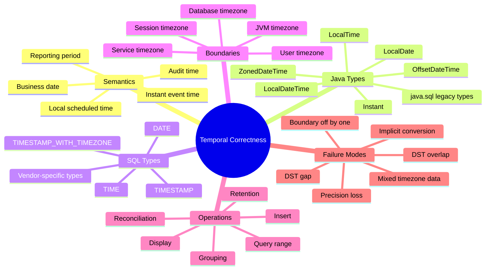
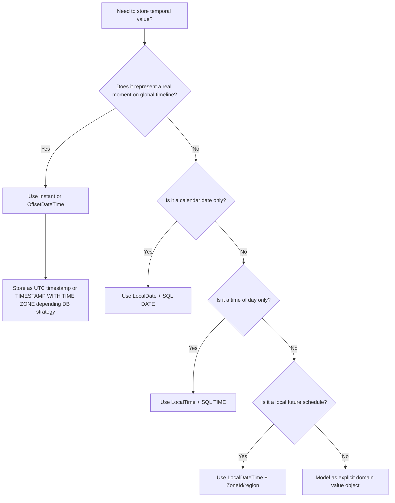

# Part 009 — Time, Time Zone, and Temporal Correctness in JDBC

## 1. Tujuan Part Ini

Bug waktu adalah bug yang sering lolos code review karena terlihat seperti detail formatting:

```java
rs.getTimestamp("created_at").toLocalDateTime();
```

Padahal temporal correctness menyentuh hal yang lebih fundamental:

- kapan sebuah event benar-benar terjadi
- tanggal bisnis mana yang berlaku
- zona waktu siapa yang dipakai
- apakah timestamp bisa diaudit ulang
- apakah laporan harian konsisten lintas negara
- apakah data masih benar saat daylight saving time berubah
- apakah query range memakai boundary yang benar
- apakah database, JVM, dan user timezone diam-diam berbeda

Part ini membangun mental model bahwa waktu bukan satu tipe data. Waktu adalah beberapa konsep berbeda yang kebetulan sering disimpan memakai kolom yang mirip.

Target setelah part ini:

- bisa memilih Java type dan SQL type berdasarkan semantic intent
- tahu kapan memakai `Instant`, `LocalDate`, `LocalDateTime`, atau `OffsetDateTime`
- memahami risiko `java.sql.Date`, `java.sql.Time`, dan `java.sql.Timestamp`
- bisa mendesain audit timestamp, business date, reporting period, dan event time dengan benar
- bisa menghindari bug timezone, DST, range query, dan implicit conversion

---

## 2. Kaufman Deconstruction: Pecah Skill Waktu Menjadi Unit Kecil

Jangan mulai dari pertanyaan “pakai timestamp atau timestamptz?”. Mulai dari skill decomposition.



Top-tier engineer tidak hanya tahu API. Ia tahu **semantic invariant** di balik setiap kolom temporal.

---

## 3. Mental Model: Temporal Value Bukan Sekadar “Tanggal”

Ada minimal lima konsep berbeda yang sering dicampur:

| Concept | Makna | Contoh | Java Type Umum | SQL Type Umum |
|---|---|---|---|---|
| Instant event time | Titik waktu global | request diterima pada 2026-06-27T10:15:30Z | `Instant` / `OffsetDateTime` | `TIMESTAMP WITH TIME ZONE` atau UTC `TIMESTAMP` |
| Business date | Tanggal domain tanpa jam | tanggal settlement 2026-06-27 | `LocalDate` | `DATE` |
| Local scheduled time | Waktu lokal tanpa instant final | meeting Jakarta 09:00 | `LocalDateTime` + zone context | `TIMESTAMP` + zone column |
| Time of day | Jam tanpa tanggal | cutoff setiap 17:00 | `LocalTime` | `TIME` |
| Reporting period | Window business | laporan bulan Juni 2026 | value object | date range / period columns |

Kesalahan paling umum: memakai satu tipe untuk semua konsep.

Contoh buruk:

```java
// Semua dianggap timestamp.
LocalDateTime createdAt;
LocalDateTime settlementDate;
LocalDateTime cutoffTime;
LocalDateTime billingMonth;
```

Contoh lebih benar:

```java
record PaymentAudit(
        Instant createdAt,
        LocalDate settlementDate,
        LocalTime dailyCutoffTime,
        YearMonth billingMonth
) {}
```

`YearMonth` tidak langsung punya JDBC mapping standar sederhana, tetapi sebagai domain type ia jauh lebih ekspresif daripada `String` atau `LocalDateTime` palsu.

---

## 4. Legacy JDBC Temporal Types

JDBC memiliki tipe legacy dari package `java.sql`:

- `java.sql.Date`
- `java.sql.Time`
- `java.sql.Timestamp`

Mereka dibuat sebelum `java.time` ada. Mereka masih muncul di banyak API lama dan driver behavior, tetapi untuk domain model modern sebaiknya jangan dijadikan tipe utama.

### 4.1 `java.sql.Date`

`java.sql.Date` merepresentasikan SQL `DATE`.

Masalah mental model:

- namanya `Date`, tetapi maksudnya tanggal SQL
- ia subclass dari `java.util.Date`, sehingga secara historis membawa baggage waktu/millis
- domain modern lebih jelas memakai `LocalDate`

Lebih baik:

```java
LocalDate settlementDate = rs.getObject("settlement_date", LocalDate.class);
```

Daripada:

```java
Date settlementDate = rs.getDate("settlement_date");
```

### 4.2 `java.sql.Time`

`java.sql.Time` merepresentasikan SQL `TIME`.

Lebih baik gunakan `LocalTime` untuk domain modern:

```java
LocalTime cutoff = rs.getObject("cutoff_time", LocalTime.class);
```

### 4.3 `java.sql.Timestamp`

`java.sql.Timestamp` merepresentasikan SQL `TIMESTAMP` dan memiliki fractional seconds sampai nanosecond precision.

Namun sering menimbulkan ambiguitas:

- apakah timestamp itu UTC?
- apakah timezone database/session memengaruhi konversi?
- apakah precision database sama dengan Java?
- apakah nilainya event instant atau local datetime?

Gunakan `Timestamp` sebagai compatibility layer jika perlu, bukan sebagai model domain utama.

```java
Timestamp ts = Timestamp.from(instant);
Instant instant = ts.toInstant();
```

Tetapi lebih disukai untuk JDBC modern:

```java
ps.setObject(1, instant);
Instant createdAt = rs.getObject("created_at", Instant.class);
```

Catatan penting: dukungan detail `Instant`/`OffsetDateTime` bisa berbeda antar driver dan database. Untuk portability tinggi, uji dengan driver production yang sama.

---

## 5. `java.time` sebagai Vocabulary Utama

Java modern menyediakan vocabulary yang lebih akurat:

| Java Type | Makna | Gunakan Untuk | Hindari Untuk |
|---|---|---|---|
| `Instant` | titik waktu global UTC | audit, event time, ordering global | jadwal lokal masa depan tanpa zone |
| `LocalDate` | tanggal tanpa waktu/zone | business date, birth date, settlement date | event timestamp |
| `LocalTime` | waktu harian tanpa tanggal/zone | cutoff time, opening hour | event timestamp |
| `LocalDateTime` | tanggal+jam lokal tanpa zone/offset | jadwal lokal dengan zone terpisah | audit/event global |
| `OffsetDateTime` | tanggal+jam dengan offset | timestamp dengan offset eksplisit | business date |
| `ZonedDateTime` | tanggal+jam dengan region zone rules | scheduling/display logic | storage raw lintas DB tanpa strategi |

Rule of thumb:

- **Event happened** → `Instant`
- **Business date** → `LocalDate`
- **Wall-clock appointment** → `LocalDateTime` + `ZoneId`
- **External timestamp includes offset** → `OffsetDateTime`
- **UI display** → convert from `Instant` to user's `ZoneId`

---

## 6. Semantic Decision Tree



Kunci: jangan pilih tipe berdasarkan bentuk data. Pilih tipe berdasarkan **apa yang ingin dibuktikan benar**.

---

## 7. Database Time Zone: Empat Zona yang Sering Tertukar

Dalam aplikasi distributed, biasanya ada minimal empat zona waktu:


| Zone | Contoh | Risiko |
|---|---|---|
| User timezone | `Asia/Jakarta`, `America/New_York` | display/reporting salah |
| JVM default timezone | container/app runtime | berubah karena image/env |
| DB session timezone | session per connection | pooled connection bisa membawa state |
| DB server timezone | host/database config | implicit default berbeda antar env |

Production invariant yang sehat:

```txt
Storage strategy eksplisit.
Conversion strategy eksplisit.
Display timezone eksplisit.
Tidak bergantung pada default timezone diam-diam.
```

Anti-pattern:

```java
LocalDateTime now = LocalDateTime.now();
ps.setObject(1, now);
```

Kenapa berbahaya?

- `LocalDateTime.now()` memakai JVM default timezone
- value tidak menyimpan zone/offset
- saat dibaca di environment berbeda, semantik bisa berubah
- untuk audit, ini bukan event instant yang defensible

Lebih baik:

```java
Instant now = clock.instant();
ps.setObject(1, now);
```

Dengan dependency-injected `Clock`:

```java
final class AuditClock {
    private final Clock clock;

    AuditClock(Clock clock) {
        this.clock = clock;
    }

    Instant now() {
        return clock.instant();
    }
}
```

---

## 8. Audit Timestamp: Gunakan Instant Semantik, Bukan LocalDateTime

Audit timestamp menjawab pertanyaan:

```txt
Kapan perubahan ini terjadi secara global dan dapat diaudit ulang?
```

Itu adalah `Instant`.

Contoh domain:

```java
record CaseStatusChange(
        UUID caseId,
        String fromStatus,
        String toStatus,
        Instant changedAt,
        String changedBy
) {}
```

SQL design umum:

```sql
CREATE TABLE case_status_history (
    id              BIGINT PRIMARY KEY,
    case_id          UUID NOT NULL,
    from_status      VARCHAR(50) NOT NULL,
    to_status        VARCHAR(50) NOT NULL,
    changed_at       TIMESTAMP NOT NULL,
    changed_by       VARCHAR(100) NOT NULL
);
```

Jika strategi organisasi adalah “store UTC in `TIMESTAMP`”, maka invariant harus eksplisit:

```txt
All values in changed_at are UTC instants.
Application writes only UTC.
Application reads as Instant.
Database/session timezone must not reinterpret value.
```

Alternatif beberapa database menyediakan `TIMESTAMP WITH TIME ZONE`, tetapi behavior vendor berbeda. Jangan menganggap semua database menyimpan timezone region asli. Banyak database menyimpan normalized instant atau offset-aware value, bukan zone seperti `Asia/Jakarta`.

Checklist audit timestamp:

- field domain memakai `Instant` atau `OffsetDateTime`, bukan `LocalDateTime`
- semua write path memakai injected `Clock`
- precision database diketahui
- tidak ada conversion via default timezone
- migration/backfill jelas timezone asalnya
- query range memakai half-open interval

---

## 9. Business Date: Jangan Pakai Timestamp Jika Maknanya Tanggal Domain

Business date menjawab pertanyaan:

```txt
Tanggal bisnis mana yang berlaku menurut aturan domain?
```

Contoh:

- settlement date
- invoice date
- filing date
- due date
- effective date
- birth date

Gunakan `LocalDate`:

```java
record Invoice(
        UUID id,
        LocalDate invoiceDate,
        LocalDate dueDate,
        Instant createdAt
) {}
```

SQL:

```sql
CREATE TABLE invoice (
    id            UUID PRIMARY KEY,
    invoice_date  DATE NOT NULL,
    due_date      DATE NOT NULL,
    created_at    TIMESTAMP NOT NULL
);
```

Anti-pattern:

```sql
invoice_date TIMESTAMP NOT NULL
```

Lalu semua diisi `2026-06-27 00:00:00`.

Kenapa buruk?

- midnight di timezone mana?
- query equality/range rentan salah
- index dan constraint tidak mengekspresikan domain
- laporan harian bisa bergeser jika conversion timezone terjadi

---

## 10. Local Scheduled Time: Jadwal Masa Depan Butuh Zone Rules

Untuk jadwal masa depan, `Instant` saja kadang tidak cukup.

Misal:

```txt
Meeting setiap Senin 09:00 di Jakarta.
```

Ini bukan hanya instant. Ini adalah aturan lokal. Jika disimpan sebagai satu `Instant`, kamu kehilangan maksud “jam 09:00 Jakarta”. Untuk event tunggal yang sudah final, instant cukup. Untuk schedule/repetition, butuh local time dan zone.

Model yang lebih baik:

```java
record ScheduledMeeting(
        UUID id,
        LocalDateTime localStart,
        ZoneId zoneId
) {
    Instant toInstant() {
        return localStart.atZone(zoneId).toInstant();
    }
}
```

SQL:

```sql
CREATE TABLE scheduled_meeting (
    id            UUID PRIMARY KEY,
    local_start   TIMESTAMP NOT NULL,
    zone_id       VARCHAR(64) NOT NULL
);
```

Kenapa simpan `zone_id` bukan hanya offset?

Karena offset seperti `+07:00` tidak berisi historical/future daylight saving rules. Region zone seperti `Asia/Jakarta` atau `Europe/Berlin` berisi rule set.

Untuk Jakarta, offset relatif stabil. Untuk region dengan DST, local time masa depan bisa dipengaruhi aturan zone.

---

## 11. DST Gap and Overlap

Daylight Saving Time menghasilkan dua kategori bug:

1. **Gap** — local time tertentu tidak pernah terjadi
2. **Overlap** — local time tertentu terjadi dua kali

Contoh konseptual:

```txt
02:30 local time mungkin tidak ada saat jam maju.
01:30 local time mungkin terjadi dua kali saat jam mundur.
```

Jika sistem kamu hanya menyimpan `LocalDateTime`, kamu tidak bisa membedakan dua instant yang berbeda pada overlap.

Contoh prinsip:

```java
ZoneId zone = ZoneId.of("America/New_York");
LocalDateTime local = LocalDateTime.of(2026, 11, 1, 1, 30);
ZonedDateTime zdt = local.atZone(zone);
Instant instant = zdt.toInstant();
```

Pada overlap, Java akan memilih offset default sesuai rules. Untuk aplikasi scheduling kritikal, pilihan offset harus disadari, bukan kebetulan.

Checklist DST:

- simpan `ZoneId` untuk local scheduled events
- simpan `Instant` untuk actual occurrence
- validasi local time saat create schedule
- jangan hitung “1 hari” sebagai `24 hours` untuk business calendar
- gunakan `Period` untuk kalender, `Duration` untuk durasi timeline

---

## 12. Range Query: Gunakan Half-Open Interval

Bug umum pada query tanggal:

```sql
WHERE created_at BETWEEN '2026-06-01' AND '2026-06-30'
```

Masalah:

- apakah `2026-06-30` berarti midnight awal hari atau akhir hari?
- bagaimana dengan fractional seconds?
- bagaimana jika precision database microseconds/milliseconds/nanoseconds berbeda?
- bagaimana dengan timezone conversion?

Gunakan half-open interval:

```sql
WHERE created_at >= ?
  AND created_at < ?
```

Java:

```java
LocalDate reportDate = LocalDate.of(2026, 6, 27);
ZoneId reportZone = ZoneId.of("Asia/Jakarta");

Instant start = reportDate.atStartOfDay(reportZone).toInstant();
Instant end = reportDate.plusDays(1).atStartOfDay(reportZone).toInstant();

try (PreparedStatement ps = connection.prepareStatement("""
        SELECT id, created_at, amount
        FROM payment
        WHERE created_at >= ?
          AND created_at < ?
        ORDER BY created_at
        """)) {
    ps.setObject(1, start);
    ps.setObject(2, end);

    try (ResultSet rs = ps.executeQuery()) {
        while (rs.next()) {
            // map row
        }
    }
}
```

Invariant:

```txt
All temporal range queries use [startInclusive, endExclusive).
```

Ini menghindari bug `23:59:59.999` yang gagal saat precision database lebih tinggi.

---

## 13. Reporting by User Timezone vs Storage Timezone

Misal semua event disimpan sebagai UTC instant:

```txt
created_at = 2026-06-26T18:30:00Z
```

Di Jakarta, itu:

```txt
2026-06-27 01:30 Asia/Jakarta
```

Jika user meminta laporan “tanggal 27 Juni 2026” berdasarkan waktu Jakarta, query harus mengubah window lokal ke UTC instant, bukan melakukan `DATE(created_at) = '2026-06-27'` secara sembarangan.

Benar:

```java
ZoneId reportZone = ZoneId.of("Asia/Jakarta");
LocalDate date = LocalDate.of(2026, 6, 27);

Instant start = date.atStartOfDay(reportZone).toInstant();
Instant end = date.plusDays(1).atStartOfDay(reportZone).toInstant();
```

SQL:

```sql
WHERE created_at >= ?
  AND created_at < ?
```

Anti-pattern:

```sql
WHERE DATE(created_at) = ?
```

Kenapa buruk?

- sering merusak penggunaan index karena function di kolom
- timezone yang dipakai bisa session/database timezone, bukan user timezone
- semantic reporting menjadi tersembunyi di database expression

Jika memakai function-based index atau generated column untuk reporting, tetap buat timezone strategy eksplisit.

---

## 14. Precision: Java Nanoseconds vs Database Precision

`Instant` dan `Timestamp` bisa membawa nanosecond component. Database bisa punya precision berbeda:

- seconds
- milliseconds
- microseconds
- nanoseconds

Jika database menyimpan microseconds, value `2026-06-27T10:15:30.123456789Z` mungkin menjadi `2026-06-27T10:15:30.123456Z`.

Test penting:

```java
Instant original = Instant.parse("2026-06-27T10:15:30.123456789Z");

insert(original);
Instant loaded = load();

assertThat(loaded).isEqualTo(original); // mungkin gagal
```

Lebih baik definisikan precision contract:

```java
Instant normalizeToMicros(Instant value) {
    long micros = value.getEpochSecond() * 1_000_000L + value.getNano() / 1_000;
    return Instant.ofEpochSecond(micros / 1_000_000L, (micros % 1_000_000L) * 1_000L);
}
```

Atau dalam test:

```java
assertThat(loaded).isEqualTo(original.truncatedTo(ChronoUnit.MICROS));
```

Tapi jangan asal truncate tanpa memastikan database precision.

---

## 15. Application Clock vs Database Clock

Ada dua sumber waktu umum:

1. application clock
2. database clock

### 15.1 Application Clock

Contoh:

```java
Instant now = clock.instant();
```

Kelebihan:

- mudah dites
- konsisten dengan event application
- bisa dikendalikan dalam integration test

Risiko:

- clock antar instance bisa drift jika NTP buruk
- database-generated timestamp bisa berbeda

### 15.2 Database Clock

Contoh:

```sql
created_at TIMESTAMP NOT NULL DEFAULT CURRENT_TIMESTAMP
```

Kelebihan:

- konsisten di database untuk row creation
- berguna untuk audit database-side

Risiko:

- susah dites deterministik
- timezone/session behavior harus jelas
- application tidak tahu exact value sampai reload/returning
- mixed strategy bisa membingungkan

### 15.3 Pilih Satu Strategy per Use Case

Untuk high-integrity system, strategy harus eksplisit:

```txt
created_at generated by application clock, validated as UTC instant.
updated_at generated by application clock.
db_inserted_at generated by database clock for ingestion diagnostics.
```

Atau:

```txt
created_at generated by database default.
Application reads generated value via RETURNING / generated keys / reload.
```

Anti-pattern: sebagian code mengisi `created_at`, sebagian membiarkan DB default, sebagian memakai trigger.

---

## 16. Insert and Read Patterns

### 16.1 Insert `Instant`

```java
void insertAudit(Connection connection, UUID caseId, Instant changedAt) throws SQLException {
    try (PreparedStatement ps = connection.prepareStatement("""
            INSERT INTO case_audit(case_id, changed_at)
            VALUES (?, ?)
            """)) {
        ps.setObject(1, caseId);
        ps.setObject(2, changedAt);
        ps.executeUpdate();
    }
}
```

Jika driver tidak mendukung `Instant` dengan baik, fallback eksplisit:

```java
ps.setTimestamp(2, Timestamp.from(changedAt));
```

Tetapi pastikan timezone strategy database/session tidak menafsirkan ulang nilai secara diam-diam.

### 16.2 Read `Instant`

```java
Instant changedAt = rs.getObject("changed_at", Instant.class);
```

Fallback:

```java
Timestamp ts = rs.getTimestamp("changed_at");
Instant changedAt = ts.toInstant();
```

### 16.3 Insert `LocalDate`

```java
ps.setObject(1, invoiceDate);
```

Fallback:

```java
ps.setDate(1, java.sql.Date.valueOf(invoiceDate));
```

### 16.4 Read `LocalDate`

```java
LocalDate invoiceDate = rs.getObject("invoice_date", LocalDate.class);
```

Fallback:

```java
LocalDate invoiceDate = rs.getDate("invoice_date").toLocalDate();
```

### 16.5 Insert `OffsetDateTime`

```java
OffsetDateTime receivedAt = OffsetDateTime.parse("2026-06-27T17:15:30+07:00");
ps.setObject(1, receivedAt);
```

Use case:

- external payload membawa offset
- ingin mempertahankan offset observed dari source
- database mendukung type yang sesuai

Tetapi jangan asumsikan region zone tersimpan. Offset `+07:00` bukan `Asia/Jakarta`.

---

## 17. Null Handling untuk Temporal Values

Jangan ubah null temporal menjadi sentinel value seperti `1970-01-01` kecuali domain benar-benar mengharuskannya.

Buruk:

```java
LocalDate closedDate = Optional.ofNullable(rs.getDate("closed_date"))
        .map(Date::toLocalDate)
        .orElse(LocalDate.of(1970, 1, 1));
```

Lebih baik:

```java
Date sqlDate = rs.getDate("closed_date");
LocalDate closedDate = sqlDate == null ? null : sqlDate.toLocalDate();
```

Atau model domain:

```java
record CaseRecord(
        UUID id,
        Instant openedAt,
        Optional<Instant> closedAt
) {}
```

Namun hati-hati memakai `Optional` sebagai field entity jika framework/serialization tidak cocok. Secara konsep, optionality harus eksplisit.

---

## 18. Temporal Values and Connection State

Beberapa database/driver menggunakan session timezone. Dalam pool, connection adalah resource yang dipakai ulang. Jika satu request mengubah session timezone, request lain bisa terdampak.

Anti-pattern:

```java
try (Statement st = connection.createStatement()) {
    st.execute("SET TIME ZONE 'Asia/Jakarta'");
}
// connection dikembalikan ke pool dengan session state berubah
```

Lebih aman:

- jangan ubah session timezone per request kecuali pool reset menjamin state bersih
- set session timezone sekali saat connection initialization jika memang strategy global
- lebih baik lakukan conversion di aplikasi dengan `ZoneId` eksplisit

Jika memakai `connectionInitSql`, pahami bahwa itu berjalan saat physical connection dibuat, bukan setiap borrow.

---

## 19. Temporal Correctness in Regulatory / Case Management Systems

Untuk sistem enforcement lifecycle dan case management, temporal modeling biasanya punya beberapa waktu sekaligus:

| Field | Semantic | Recommended Type |
|---|---|---|
| `received_at` | kapan laporan diterima sistem | `Instant` |
| `submitted_at` | kapan user submit di channel tertentu | `Instant` + source metadata |
| `filing_date` | tanggal resmi pengajuan | `LocalDate` |
| `effective_from` | tanggal aturan/status mulai berlaku | `LocalDate` atau `Instant`, tergantung domain |
| `sla_due_at` | deadline konkret | `Instant` |
| `business_due_date` | deadline berdasarkan kalender bisnis | `LocalDate` + calendar rules |
| `hearing_local_time` | jadwal hearing lokal | `LocalDateTime` + `ZoneId` |
| `updated_at` | audit update | `Instant` |

Jangan menggabungkan semuanya ke `created_at` dan `updated_at`. Sistem regulatory sering membutuhkan defensibility:

```txt
Apa yang terjadi?
Kapan terjadi?
Menurut timezone/kalender siapa?
Apakah tanggal itu tanggal bisnis atau instant teknis?
Apakah nilai bisa direkonstruksi saat audit?
```

---

## 20. Querying SLA and Deadline Correctly

Deadline konkret:

```java
Instant now = clock.instant();
```

SQL:

```sql
SELECT id, sla_due_at
FROM case_item
WHERE status = 'OPEN'
  AND sla_due_at < ?
```

Binding:

```java
ps.setObject(1, now);
```

Business due date:

```sql
SELECT id, due_date
FROM filing
WHERE status = 'OPEN'
  AND due_date < ?
```

Binding:

```java
LocalDate today = LocalDate.now(businessZone);
ps.setObject(1, today);
```

Keduanya tidak sama:

- `sla_due_at < now` adalah timeline comparison
- `due_date < today` adalah calendar/domain comparison

Jika kamu memakai `Instant` untuk semua due date, kamu harus menjelaskan timezone dan cutoff. Jika kamu memakai `LocalDate` untuk SLA jam-menit-detik, kamu kehilangan precision.

---

## 21. Data Migration and Backfill

Temporal migration berbahaya karena data lama sering tidak punya timezone eksplisit.

Contoh legacy column:

```sql
created_at VARCHAR(30) -- '2026-06-27 10:15:30'
```

Pertanyaan wajib sebelum migrasi:

- string ini local time timezone apa?
- apakah timezone berubah sepanjang sejarah?
- apakah beberapa source memakai timezone berbeda?
- apakah ada DST overlap/gap?
- precision apa yang tersedia?
- apakah value ini event time atau ingestion time?

Migration code harus eksplisit:

```java
ZoneId assumedLegacyZone = ZoneId.of("Asia/Jakarta");
LocalDateTime legacyLocal = LocalDateTime.parse(value, formatter);
Instant migrated = legacyLocal.atZone(assumedLegacyZone).toInstant();
```

Tambahkan audit column bila perlu:

```sql
legacy_created_at_raw VARCHAR(30),
legacy_timezone_assumption VARCHAR(64),
migrated_at TIMESTAMP NOT NULL
```

Untuk data regulatori, jangan hapus bukti asumsi migrasi terlalu cepat.

---

## 22. Anti-Patterns

### 22.1 `LocalDateTime.now()` untuk Audit

```java
LocalDateTime createdAt = LocalDateTime.now();
```

Masalah:

- implicit JVM timezone
- bukan global instant
- tidak punya offset
- sulit direkonsiliasi lintas service/region

Gunakan:

```java
Instant createdAt = clock.instant();
```

### 22.2 Menyimpan Tanggal Bisnis sebagai Midnight Timestamp

```sql
settlement_date TIMESTAMP NOT NULL -- 2026-06-27 00:00:00
```

Gunakan:

```sql
settlement_date DATE NOT NULL
```

### 22.3 `BETWEEN` untuk End-of-Day

```sql
WHERE created_at BETWEEN ? AND ?
```

Gunakan:

```sql
WHERE created_at >= ? AND created_at < ?
```

### 22.4 Mengandalkan Default Timezone

```java
LocalDate today = LocalDate.now();
```

Untuk business logic:

```java
LocalDate today = LocalDate.now(ZoneId.of("Asia/Jakarta"));
```

Atau:

```java
LocalDate today = LocalDate.now(clock.withZone(businessZone));
```

### 22.5 Function di Kolom Indexed untuk Reporting

```sql
WHERE DATE(created_at) = ?
```

Risiko:

- index tidak efektif
- timezone session tersembunyi
- boundary ambiguity

Gunakan range query.

### 22.6 Mixed Temporal Strategy

Sebagian service:

```java
ps.setObject(1, Instant.now());
```

Sebagian:

```sql
DEFAULT CURRENT_TIMESTAMP
```

Sebagian:

```java
ps.setObject(1, LocalDateTime.now());
```

Hasilnya: audit timeline sulit dipercaya.

---

## 23. Production Checklist

Sebelum approve schema temporal, tanyakan:

- Apa semantic field ini: instant, date, local schedule, duration, atau period?
- Java type apa yang mengekspresikan semantic tersebut?
- SQL type apa yang paling sesuai?
- Apakah timezone disimpan, dinormalisasi, atau disediakan dari context?
- Apakah conversion terjadi di aplikasi atau database?
- Apakah query range memakai half-open interval?
- Apakah precision database diketahui?
- Apakah test round-trip temporal sudah ada?
- Apakah DST edge case relevan?
- Apakah migration/backfill punya timezone assumption eksplisit?
- Apakah audit timestamp berasal dari satu clock strategy?
- Apakah pooled connection bisa membawa session timezone state?

---

## 24. Deliberate Practice

### Latihan 1 — Klasifikasikan Field

Untuk setiap field, pilih Java type dan SQL type:

```txt
created_at
invoice_date
payment_received_at
hearing_time
sla_due_at
business_due_date
cutoff_time
billing_month
```

Jawaban yang baik tidak hanya menyebut tipe, tapi menjelaskan semantic invariant.

### Latihan 2 — Refactor Anti-Pattern

Kode awal:

```java
LocalDateTime now = LocalDateTime.now();

try (PreparedStatement ps = connection.prepareStatement("""
        INSERT INTO case_event(case_id, event_date, created_at)
        VALUES (?, ?, ?)
        """)) {
    ps.setObject(1, caseId);
    ps.setObject(2, now);
    ps.setObject(3, now);
    ps.executeUpdate();
}
```

Refactor:

```java
Instant createdAt = clock.instant();
LocalDate eventDate = LocalDate.now(businessZone);

try (PreparedStatement ps = connection.prepareStatement("""
        INSERT INTO case_event(case_id, event_date, created_at)
        VALUES (?, ?, ?)
        """)) {
    ps.setObject(1, caseId);
    ps.setObject(2, eventDate);
    ps.setObject(3, createdAt);
    ps.executeUpdate();
}
```

### Latihan 3 — Rancang Query Laporan Harian

Requirement:

```txt
User di Asia/Jakarta ingin semua payment yang terjadi pada 2026-06-27 menurut waktu Jakarta.
Data disimpan sebagai UTC instant di payment.created_at.
```

Solusi:

```java
ZoneId zone = ZoneId.of("Asia/Jakarta");
LocalDate date = LocalDate.of(2026, 6, 27);
Instant start = date.atStartOfDay(zone).toInstant();
Instant end = date.plusDays(1).atStartOfDay(zone).toInstant();
```

SQL:

```sql
WHERE created_at >= ?
  AND created_at < ?
```

---

## 25. Key Takeaways

- Temporal correctness dimulai dari semantic intent, bukan dari tipe database.
- `Instant` cocok untuk event/audit global.
- `LocalDate` cocok untuk tanggal bisnis.
- `LocalDateTime` tidak menyimpan timezone/offset; jangan pakai untuk audit global.
- Jadwal lokal masa depan butuh `LocalDateTime` + `ZoneId`.
- Query temporal production sebaiknya memakai half-open interval.
- Hindari default timezone diam-diam.
- Precision database harus dites.
- Pooled connection dan session timezone bisa menciptakan state leak.
- Untuk sistem regulatori, temporal assumptions harus defensible dan bisa diaudit.

---

## 26. Referensi

- Oracle Java SE 25 — `java.sql.Timestamp`: https://docs.oracle.com/en/java/javase/25/docs/api/java.sql/java/sql/Timestamp.html
- Oracle Java SE 25 — `java.sql.Date`: https://docs.oracle.com/en/java/javase/25/docs/api/java.sql/java/sql/Date.html
- Oracle Java SE 25 — `java.sql.Time`: https://docs.oracle.com/en/java/javase/25/docs/api/java.sql/java/sql/Time.html
- Oracle Java SE 25 — `PreparedStatement`: https://docs.oracle.com/en/java/javase/25/docs/api/java.sql/java/sql/PreparedStatement.html
- Oracle Java SE 25 — `ResultSet`: https://docs.oracle.com/en/java/javase/25/docs/api/java.sql/java/sql/ResultSet.html
- JSR 221 JDBC API Specification 4.3: https://jcp.org/aboutJava/communityprocess/mrel/jsr221/index3.html
