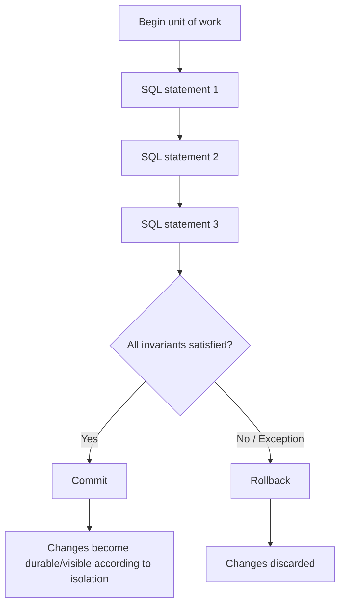
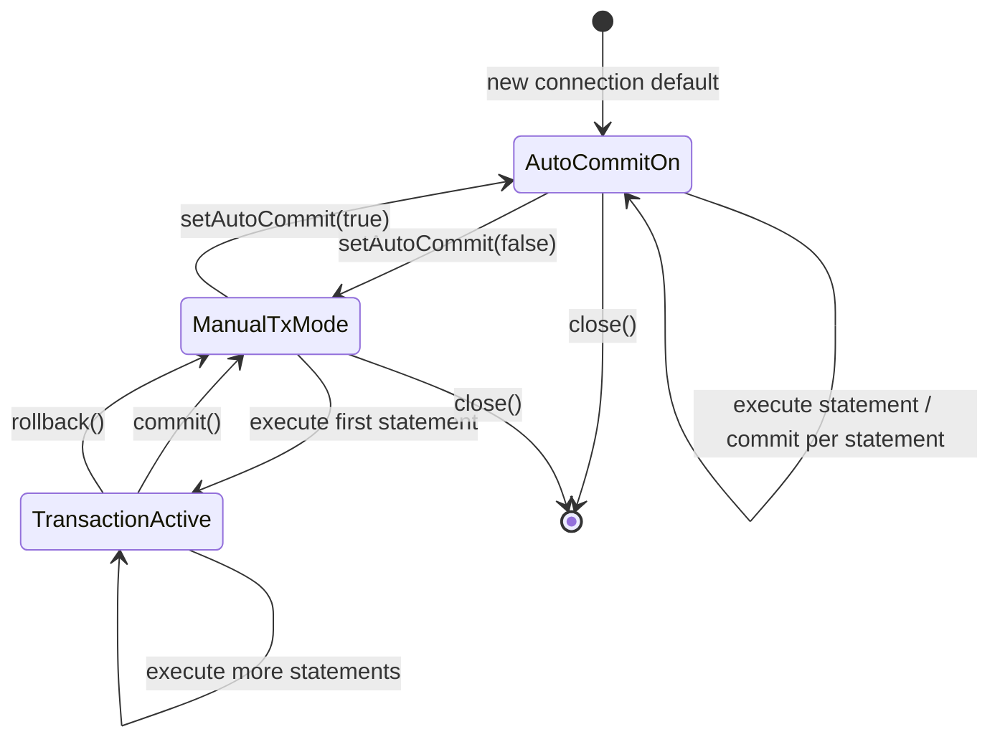
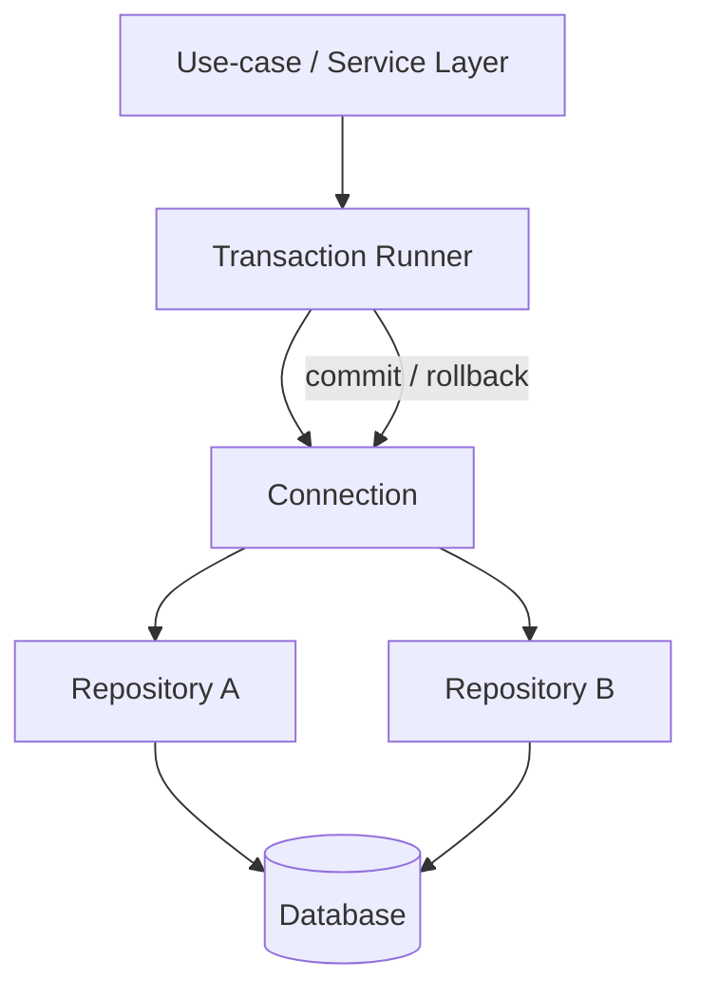
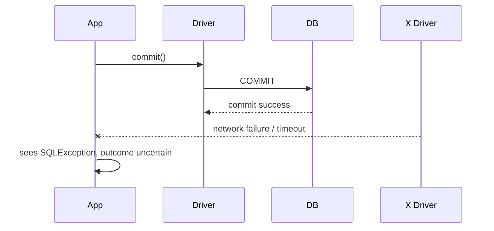

# Part 010 — Transaction Fundamentals: Auto-Commit, Commit, Rollback

## 1. Tujuan Part Ini

Transaction adalah boundary konsistensi. Dalam JDBC, boundary itu terlihat sederhana:

```java
connection.setAutoCommit(false);
try {
    // SQL statements
    connection.commit();
} catch (Exception e) {
    connection.rollback();
    throw e;
}
```

Tetapi versi production-nya lebih kompleks:

- kapan transaction benar-benar dimulai?
- siapa pemilik connection?
- siapa yang boleh commit?
- siapa yang wajib rollback?
- apa yang terjadi jika rollback gagal?
- apa yang terjadi jika commit sukses di database tetapi response network gagal?
- apakah `close()` melakukan rollback?
- apakah pooled connection kembali dengan state bersih?
- apakah auto-commit dipulihkan?
- apakah transaction boundary mengikuti use case atau DAO?

Part ini membangun mental model fundamental transaction sebelum masuk isolation, lock, savepoint, framework transaction, retry, dan pooling.

Target setelah part ini:

- memahami auto-commit sebagai mode transaction, bukan detail kecil
- bisa menulis transaction manual yang aman
- bisa membedakan statement failure, transaction failure, rollback failure, dan commit uncertainty
- bisa mendesain ownership rule transaction di service/repository layer
- bisa menghindari anti-pattern umum seperti nested transaction palsu, commit di DAO, dan connection state leak

---

## 2. Mental Model: Transaction sebagai Unit of Consistency

Transaction adalah unit kerja yang harus terlihat oleh database sebagai satu perubahan konsisten.



Transaction bukan hanya “beberapa query dibungkus”. Transaction adalah tempat kamu menjaga invariant:

```txt
Jika status case berubah ke ESCALATED, harus ada row audit history.
Jika payment dibuat, ledger entry harus dibuat.
Jika stock dikurangi, reservation harus dicatat.
Jika assignment berpindah owner, queue lama dan queue baru harus konsisten.
```

---

## 3. JDBC Auto-Commit: Default yang Sering Dilupakan

Secara JDBC, connection baru default-nya berada dalam auto-commit mode.

Dalam auto-commit mode:

```txt
Setiap SQL statement dieksekusi dan di-commit sebagai transaction individual.
```

Contoh:

```java
try (Connection connection = dataSource.getConnection()) {
    try (PreparedStatement ps = connection.prepareStatement("""
            UPDATE account SET balance = balance - ? WHERE id = ?
            """)) {
        ps.setBigDecimal(1, amount);
        ps.setLong(2, fromAccountId);
        ps.executeUpdate(); // committed when statement completes in auto-commit mode
    }
}
```

Ini aman untuk operasi single-statement yang memang atomic di database.

Tetapi tidak aman untuk multi-statement invariant:

```java
// Auto-commit true: DANGEROUS for transfer.
debit(fromAccount, amount);   // committed
credit(toAccount, amount);    // may fail
```

Jika `credit` gagal, `debit` sudah committed. Invariant transfer rusak.

---

## 4. Auto-Commit as a State Machine



Important nuance:

- `setAutoCommit(false)` mengubah mode connection.
- Transaction biasanya mulai ketika statement pertama dieksekusi dalam manual mode.
- `commit()` atau `rollback()` mengakhiri transaction saat ini.
- Setelah `commit()`/`rollback()`, connection tetap dalam manual transaction mode sampai `setAutoCommit(true)` dipanggil atau pool reset state.

Pada pooled connection, jangan mengandalkan “nanti pool pasti reset”. Kode transaction tetap harus rapi.

---

## 5. Basic Manual Transaction Pattern

Pattern dasar:

```java
void transfer(DataSource dataSource, long fromId, long toId, BigDecimal amount) throws SQLException {
    try (Connection connection = dataSource.getConnection()) {
        boolean previousAutoCommit = connection.getAutoCommit();
        connection.setAutoCommit(false);

        try {
            debit(connection, fromId, amount);
            credit(connection, toId, amount);

            connection.commit();
        } catch (Exception failure) {
            rollbackQuietly(connection, failure);
            throw failure;
        } finally {
            connection.setAutoCommit(previousAutoCommit);
        }
    }
}

private void rollbackQuietly(Connection connection, Exception originalFailure) {
    try {
        connection.rollback();
    } catch (SQLException rollbackFailure) {
        originalFailure.addSuppressed(rollbackFailure);
    }
}
```

Kenapa simpan `previousAutoCommit`?

Karena connection adalah stateful. Dalam kode library yang menerima connection dari luar, kamu tidak selalu tahu state awalnya.

Namun dalam aplikasi yang memakai pool dan transaction owner jelas, sering dibuat invariant lebih kuat:

```txt
All borrowed connections must enter application transaction runner with known autoCommit=true.
Transaction runner restores state before returning connection.
```

---

## 6. Minimal Transaction Runner

Agar semua transaction path konsisten, buat abstraction kecil.

```java
@FunctionalInterface
interface SqlWork<T> {
    T execute(Connection connection) throws Exception;
}

final class JdbcTransactionRunner {
    private final DataSource dataSource;

    JdbcTransactionRunner(DataSource dataSource) {
        this.dataSource = dataSource;
    }

    <T> T inTransaction(SqlWork<T> work) throws Exception {
        try (Connection connection = dataSource.getConnection()) {
            boolean previousAutoCommit = connection.getAutoCommit();
            connection.setAutoCommit(false);

            try {
                T result = work.execute(connection);
                connection.commit();
                return result;
            } catch (Exception failure) {
                rollbackAndSuppress(connection, failure);
                throw failure;
            } finally {
                restoreAutoCommit(connection, previousAutoCommit);
            }
        }
    }

    private void rollbackAndSuppress(Connection connection, Exception originalFailure) {
        try {
            connection.rollback();
        } catch (SQLException rollbackFailure) {
            originalFailure.addSuppressed(rollbackFailure);
        }
    }

    private void restoreAutoCommit(Connection connection, boolean previousAutoCommit) throws SQLException {
        if (connection.getAutoCommit() != previousAutoCommit) {
            connection.setAutoCommit(previousAutoCommit);
        }
    }
}
```

Usage:

```java
transactionRunner.inTransaction(connection -> {
    caseRepository.updateStatus(connection, caseId, "ESCALATED");
    auditRepository.insertHistory(connection, caseId, "ESCALATED", clock.instant());
    return null;
});
```

Manfaat:

- commit/rollback logic satu tempat
- rollback failure tidak menutupi original failure
- connection ownership jelas
- repository tidak commit sendiri
- test lebih mudah

---

## 7. Ownership Rule: Siapa yang Boleh Commit?

Top-tier JDBC code punya rule ownership eksplisit.

```txt
Layer yang membuka transaction adalah satu-satunya layer yang boleh commit/rollback.
```

Biasanya:

- service/use-case layer menentukan transaction boundary
- repository/DAO menerima connection dan menjalankan SQL
- repository/DAO tidak commit/rollback
- helper low-level tidak close connection yang tidak ia buka



Buruk:

```java
class AccountRepository {
    void debit(long id, BigDecimal amount) throws SQLException {
        try (Connection c = dataSource.getConnection()) {
            c.setAutoCommit(false);
            // update
            c.commit();
        }
    }
}
```

Kenapa buruk?

- tiap repository membuat transaction sendiri
- use case multi-repository tidak bisa atomic
- sulit mengatur retry/isolation/timeout konsisten
- connection lifecycle tersebar

Lebih baik:

```java
class AccountRepository {
    void debit(Connection c, long id, BigDecimal amount) throws SQLException {
        try (PreparedStatement ps = c.prepareStatement("""
                UPDATE account
                SET balance = balance - ?
                WHERE id = ?
                """)) {
            ps.setBigDecimal(1, amount);
            ps.setLong(2, id);
            ps.executeUpdate();
        }
    }
}
```

---

## 8. Transaction Scope: Jangan Terlalu Sempit, Jangan Terlalu Lebar

Transaction scope harus mengikuti invariant.

### 8.1 Terlalu Sempit

```java
updateCaseStatus(caseId, "ESCALATED"); // committed
insertAuditHistory(caseId);             // fails
```

Status berubah tanpa audit. Tidak defensible.

### 8.2 Terlalu Lebar

```java
connection.setAutoCommit(false);

updateCaseStatus(connection, caseId);
callExternalNotificationApi(); // slow, unreliable
insertAuditHistory(connection, caseId);

connection.commit();
```

Masalah:

- transaction menahan lock saat call eksternal
- pool connection tertahan
- failure eksternal membuat DB transaction lama
- retry external call bisa menggandakan side effect

Lebih baik:

- simpan state + outbox event dalam transaction
- commit cepat
- publisher async mengirim notifikasi

```txt
Transaction contains durable state change and durable intent to notify.
External side effect happens after commit.
```

Outbox pattern akan dibahas di part architecture transaction.

---

## 9. Exception Path: Statement Failure Tidak Selalu Sama dengan Transaction End

Dalam manual transaction mode, jika satu statement gagal, transaction belum tentu otomatis rollback. Behavior detail bisa berbeda antar database/driver, tetapi application code tidak boleh bergantung pada ambiguity.

Pattern aman:

```java
try {
    step1(connection);
    step2(connection);
    step3(connection);
    connection.commit();
} catch (Exception failure) {
    rollbackAndSuppress(connection, failure);
    throw failure;
}
```

Jangan lanjutkan transaction setelah statement failure kecuali kamu benar-benar tahu state database dan driver.

Buruk:

```java
try {
    insertRow(connection);
} catch (SQLException ignored) {
    // continue anyway
}
updateOtherRow(connection);
connection.commit();
```

Jika error adalah constraint violation yang memang expected dan kamu punya compensating logic, gunakan pattern eksplisit. Pada part savepoint nanti, kita bahas partial rollback.

---

## 10. Rollback Failure

Rollback bisa gagal.

Contoh penyebab:

- connection already broken
- network failure
- database session killed
- timeout
- driver failure

Jangan menimpa original exception.

Buruk:

```java
catch (SQLException e) {
    connection.rollback(); // if this throws, original e lost
    throw e;
}
```

Lebih baik:

```java
catch (Exception failure) {
    try {
        connection.rollback();
    } catch (SQLException rollbackFailure) {
        failure.addSuppressed(rollbackFailure);
    }
    throw failure;
}
```

Kenapa penting?

Saat incident, original exception biasanya menjelaskan root cause awal. Rollback failure adalah secondary failure. Keduanya penting, tetapi original tidak boleh hilang.

---

## 11. Commit Failure and Ambiguous Commit

Commit failure lebih serius daripada rollback failure.

Misal:

```java
connection.commit(); // throws SQLException
```

Apa artinya?

Tidak selalu berarti database tidak commit.

Kemungkinan:

1. commit ditolak database → transaction tidak committed
2. commit berhasil di database, tetapi response network gagal → application mengira gagal
3. connection putus sebelum database memproses commit → tidak pasti

Ini disebut **ambiguous commit**.



Implikasi:

- jangan asal retry transaction non-idempotent setelah commit failure
- gunakan idempotency key / natural key / unique constraint
- desain operation agar bisa direkonsiliasi
- simpan business operation id
- baca ulang state jika memungkinkan

Contoh:

```sql
CREATE TABLE payment_request (
    request_id UUID PRIMARY KEY,
    account_id  UUID NOT NULL,
    amount      NUMERIC(19, 4) NOT NULL,
    created_at  TIMESTAMP NOT NULL
);
```

Jika commit ambiguous, retry insert dengan `request_id` yang sama akan terkena unique constraint atau idempotent upsert, bukan membuat payment ganda.

Retry akan dibahas lebih dalam di part retry/idempotency.

---

## 12. Close Behavior: Jangan Jadikan `close()` sebagai Transaction Strategy

Saat connection ditutup dalam manual transaction mode dengan transaction belum selesai, driver/database/pool biasanya akan membersihkan state, sering dengan rollback. Tetapi kode aplikasi jangan mengandalkan ini sebagai logic utama.

Buruk:

```java
try (Connection connection = dataSource.getConnection()) {
    connection.setAutoCommit(false);
    updateSomething(connection);
    // no commit / no rollback
}
```

Lebih baik:

```java
try (Connection connection = dataSource.getConnection()) {
    connection.setAutoCommit(false);
    try {
        updateSomething(connection);
        connection.commit();
    } catch (Exception e) {
        rollbackAndSuppress(connection, e);
        throw e;
    }
}
```

`try-with-resources` menjamin `close()`, bukan menjamin business transaction decision.

---

## 13. Auto-Commit Restoration and Pool Hygiene

Dalam pool, `connection.close()` biasanya mengembalikan logical connection ke pool, bukan menutup physical connection. Pool akan berusaha mereset state tertentu, tetapi application code tetap harus menjaga hygiene.

State yang perlu diperhatikan:

- auto-commit
- isolation level
- read-only
- catalog/schema
- network timeout
- session variables

Jika transaksi manual meninggalkan `autoCommit=false`, borrower berikutnya bisa terkena bug berbahaya.

Contoh failure:

```txt
Request A borrows connection.
Request A setAutoCommit(false).
Request A throws before restoring.
Connection returned dirty.
Request B borrows same physical connection.
Request B expects auto-commit true.
Request B writes data but never commits.
Unexpected rollback/lock/visibility bug occurs.
```

Pool modern biasanya defensive, tetapi jangan menjadikan pool sebagai pengganti discipline.

---

## 14. Read-Only Transactions

Read-only transaction adalah hint/setting yang bisa membantu database/driver, tetapi bukan security guarantee universal.

JDBC:

```java
connection.setReadOnly(true);
```

Pattern:

```java
try (Connection connection = dataSource.getConnection()) {
    boolean previousReadOnly = connection.isReadOnly();
    boolean previousAutoCommit = connection.getAutoCommit();

    connection.setReadOnly(true);
    connection.setAutoCommit(false);

    try {
        List<CaseRecord> records = queryOpenCases(connection);
        connection.commit();
        return records;
    } catch (Exception e) {
        rollbackAndSuppress(connection, e);
        throw e;
    } finally {
        connection.setReadOnly(previousReadOnly);
        connection.setAutoCommit(previousAutoCommit);
    }
}
```

Kenapa read-only transaction untuk query?

- konsistent snapshot pada isolation tertentu
- membantu database optimasi pada beberapa vendor
- mendokumentasikan intent
- mencegah accidental write pada beberapa database/driver

Namun jangan asumsikan `setReadOnly(true)` selalu memblokir write di semua database. Tetap gunakan privilege database yang tepat.

---

## 15. Transaction Timeout vs Query Timeout

JDBC core tidak menyediakan satu transaction timeout universal yang otomatis berlaku untuk semua statement seperti beberapa framework. Yang sering tersedia:

- statement query timeout
- driver socket timeout
- framework transaction timeout
- database lock timeout
- pool acquisition timeout

Untuk manual JDBC, kamu biasanya set query timeout di statement:

```java
try (PreparedStatement ps = connection.prepareStatement(sql)) {
    ps.setQueryTimeout(5); // seconds
    ps.executeUpdate();
}
```

Tapi ini bukan full transaction timeout. Jika transaction berisi banyak statement dan business logic panjang, kamu harus mengontrol scope sendiri.

Anti-pattern:

```java
connection.setAutoCommit(false);
longComputation();
updateDatabase(connection);
moreLongComputation();
connection.commit();
```

Transaction harus pendek. Lakukan computation sebelum transaction jika tidak perlu lock/snapshot.

---

## 16. Update Count as Transaction Guard

Dalam transaction, update count sering menjadi guard invariant.

Contoh optimistic transition:

```java
int updated;
try (PreparedStatement ps = connection.prepareStatement("""
        UPDATE case_item
        SET status = ?, updated_at = ?
        WHERE id = ?
          AND status = ?
        """)) {
    ps.setString(1, "ESCALATED");
    ps.setObject(2, clock.instant());
    ps.setObject(3, caseId);
    ps.setString(4, "OPEN");
    updated = ps.executeUpdate();
}

if (updated != 1) {
    throw new ConcurrentCaseModificationException(caseId);
}
```

Lalu dalam transaction yang sama:

```java
insertCaseHistory(connection, caseId, "OPEN", "ESCALATED");
```

Invariant:

```txt
If status transition succeeds, audit history is inserted before commit.
If status transition does not affect exactly one row, transaction rolls back.
```

---

## 17. Transaction Boundary in Case Management Example

Requirement:

```txt
Escalate a case from OPEN to ESCALATED.
Must insert audit history.
Must enqueue internal review task.
Must publish notification eventually.
```

Transactional part:

```java
transactionRunner.inTransaction(connection -> {
    int updated = caseRepository.transitionStatus(
            connection,
            caseId,
            "OPEN",
            "ESCALATED",
            clock.instant()
    );

    if (updated != 1) {
        throw new IllegalStateException("Case is not OPEN or was concurrently modified");
    }

    caseHistoryRepository.insert(
            connection,
            caseId,
            "OPEN",
            "ESCALATED",
            clock.instant(),
            actorId
    );

    reviewTaskRepository.create(
            connection,
            caseId,
            "ESCALATION_REVIEW"
    );

    outboxRepository.insert(
            connection,
            UUID.randomUUID(),
            "CaseEscalated",
            caseId.toString(),
            clock.instant()
    );

    return null;
});
```

Non-transactional external side effect:

```txt
Outbox publisher later sends notification after commit.
```

Kenapa notification tidak dikirim dalam transaction?

- external API tidak ikut rollback database
- jika commit gagal setelah notification terkirim, dunia luar sudah melihat event palsu
- jika notification gagal, transaction database tidak perlu ditahan lama

---

## 18. Nested Transaction Illusion

JDBC `Connection` tidak memberi nested transaction sejati. Jika method B dipanggil dari method A dan keduanya memanggil `setAutoCommit(false)`/`commit()`, kamu tidak otomatis punya nested transaction.

Buruk:

```java
void serviceA() throws Exception {
    transactionRunner.inTransaction(c -> {
        repoA.update(c);
        serviceB(); // opens another connection and commits independently
        return null;
    });
}

void serviceB() throws Exception {
    transactionRunner.inTransaction(c -> {
        repoB.update(c);
        return null;
    });
}
```

Masalah:

- serviceB commit meskipun serviceA nanti rollback
- atomicity use case rusak
- lock order sulit dipahami

Solusi manual JDBC:

- pass connection/context eksplisit
- larang nested transaction runner kecuali strategy jelas
- gunakan savepoint untuk partial rollback jika memang diperlukan
- gunakan framework transaction jika complexity meningkat

---

## 19. Transaction Context Object

Untuk kode besar, daripada pass `Connection` telanjang ke semua method, bisa buat context eksplisit.

```java
record JdbcUnitOfWork(Connection connection, Instant startedAt, UUID operationId) {}
```

Repository:

```java
void insertHistory(JdbcUnitOfWork uow, CaseHistory history) throws SQLException {
    try (PreparedStatement ps = uow.connection().prepareStatement("""
            INSERT INTO case_history(id, case_id, from_status, to_status, changed_at)
            VALUES (?, ?, ?, ?, ?)
            """)) {
        ps.setObject(1, history.id());
        ps.setObject(2, history.caseId());
        ps.setString(3, history.fromStatus());
        ps.setString(4, history.toStatus());
        ps.setObject(5, history.changedAt());
        ps.executeUpdate();
    }
}
```

Manfaat:

- connection ownership tetap jelas
- operation id bisa dipakai untuk logging
- bisa membawa deadline/timeout context
- bisa dikembangkan untuk metrics

Jangan over-engineer untuk aplikasi kecil, tetapi untuk system besar, context eksplisit mengurangi implicit magic.

---

## 20. Logging Transaction Events

Untuk observability, log boundary transaction pada level yang sesuai.

Contoh structured log konseptual:

```txt
transaction.started operationId=... useCase=EscalateCase
transaction.committed operationId=... durationMs=42
transaction.rolled_back operationId=... durationMs=37 reason=ConcurrentCaseModificationException
transaction.rollback_failed operationId=... original=... rollback=...
transaction.commit_ambiguous operationId=... error=...
```

Jangan log SQL parameter sensitif sembarangan. Untuk PII/regulatory data, logging harus mengikuti security policy.

Metrics minimal:

- transaction duration
- commit count
- rollback count
- rollback failure count
- commit failure count
- transaction by use case
- active connection duration

---

## 21. Transaction and Thread Boundaries

JDBC `Connection` tidak boleh dipakai bebas lintas thread.

Buruk:

```java
connection.setAutoCommit(false);
CompletableFuture<Void> f1 = runAsync(() -> repoA.update(connection));
CompletableFuture<Void> f2 = runAsync(() -> repoB.update(connection));
CompletableFuture.allOf(f1, f2).join();
connection.commit();
```

Masalah:

- JDBC connection umumnya tidak didesain untuk concurrent use
- statement/resultset lifecycle bisa tabrakan
- error handling kacau
- lock ordering tidak deterministik

Rule:

```txt
One connection is owned by one transaction execution flow.
Do not use the same JDBC connection concurrently across threads.
```

Jika butuh parallelism, gunakan connection/transaction terpisah dengan invariant yang memang mengizinkan partial success/failure.

---

## 22. Transaction with Auto-Generated Keys

Generated key sering bagian dari transaction.

```java
long caseId;
try (PreparedStatement ps = connection.prepareStatement("""
        INSERT INTO case_item(status, created_at)
        VALUES (?, ?)
        """, Statement.RETURN_GENERATED_KEYS)) {
    ps.setString(1, "OPEN");
    ps.setObject(2, clock.instant());
    ps.executeUpdate();

    try (ResultSet keys = ps.getGeneratedKeys()) {
        if (!keys.next()) {
            throw new SQLException("No generated key returned");
        }
        caseId = keys.getLong(1);
    }
}

insertInitialHistory(connection, caseId);
```

Jika `insertInitialHistory` gagal, rollback harus membatalkan insert case juga. Generated key bukan alasan untuk commit lebih awal.

---

## 23. DDL and Transaction

DDL transaction behavior berbeda antar database.

Beberapa database mendukung transactional DDL untuk banyak operasi. Beberapa melakukan implicit commit pada DDL tertentu. Jangan menganggap DDL dan DML selalu punya semantics sama.

Rule:

- migration tool harus memahami database vendor behavior
- jangan campur DDL ad-hoc dalam application transaction biasa
- schema migration harus punya playbook locking/rollback sendiri

Anti-pattern:

```java
connection.setAutoCommit(false);
execute("ALTER TABLE ...");
execute("UPDATE ...");
connection.rollback(); // assume ALTER rolled back everywhere
```

Ini tidak portable dan berbahaya.

---

## 24. Anti-Patterns

### 24.1 Commit di DAO

```java
class UserDao {
    void updateUser(User user) {
        try (Connection c = dataSource.getConnection()) {
            c.setAutoCommit(false);
            update(c, user);
            c.commit();
        }
    }
}
```

Masalah: use-case layer kehilangan kontrol atomicity.

### 24.2 No Rollback on Exception

```java
connection.setAutoCommit(false);
updateA(connection);
updateB(connection); // throws
connection.commit();
```

Tidak ada rollback eksplisit.

### 24.3 Swallow Exception then Commit

```java
try {
    updateA(connection);
    updateB(connection);
} catch (SQLException ignored) {
    // continue
}
connection.commit();
```

Ini hampir selalu salah kecuali ada savepoint/compensation yang jelas.

### 24.4 Transaction Around External Call

```java
connection.setAutoCommit(false);
updateDb(connection);
paymentGateway.charge(card, amount);
connection.commit();
```

Jika commit gagal setelah charge sukses, state inconsistent.

### 24.5 Retry After Commit Failure Without Idempotency

```java
try {
    runTransaction();
} catch (SQLException e) {
    runTransaction(); // may duplicate
}
```

Commit outcome bisa ambiguous.

### 24.6 Long User Think-Time Transaction

```txt
Open transaction.
Show form to user.
Wait user input.
Commit after user clicks approve.
```

Ini menahan resource terlalu lama dan menciptakan lock/pool exhaustion.

### 24.7 Same Connection Across Threads

```java
parallelStream.forEach(x -> repo.update(connection, x));
```

Tidak aman.

---

## 25. Code Review Checklist

Saat review transaction JDBC manual, cek:

- Apakah transaction boundary mengikuti use case/invariant?
- Apakah layer yang membuka transaction adalah satu-satunya yang commit/rollback?
- Apakah semua SQL dalam satu invariant memakai connection yang sama?
- Apakah rollback terjadi pada semua exception path?
- Apakah rollback failure disimpan sebagai suppressed exception?
- Apakah commit failure dianggap potentially ambiguous?
- Apakah operation id/idempotency key tersedia untuk retry?
- Apakah connection state dipulihkan?
- Apakah transaction pendek?
- Apakah tidak ada external API call di dalam transaction?
- Apakah update count divalidasi?
- Apakah generated key dipakai tanpa commit prematur?
- Apakah connection tidak dipakai lintas thread?
- Apakah timeout/observability memadai?

---

## 26. Deliberate Practice

### Latihan 1 — Temukan Boundary yang Salah

Kode:

```java
void escalate(UUID caseId) throws Exception {
    caseRepository.updateStatus(caseId, "ESCALATED");
    auditRepository.insert(caseId, "ESCALATED");
    notificationClient.send(caseId);
}
```

Pertanyaan:

- Apakah update status dan audit atomic?
- Apakah notification harus di dalam transaction?
- Apa yang terjadi jika audit gagal?
- Apa yang terjadi jika notification sukses tapi DB gagal?

Refactor target:

- transaction untuk status + audit + outbox
- notification via outbox setelah commit

### Latihan 2 — Perbaiki Rollback Handling

Kode buruk:

```java
try {
    connection.setAutoCommit(false);
    updateA(connection);
    updateB(connection);
    connection.commit();
} catch (SQLException e) {
    connection.rollback();
    throw e;
}
```

Perbaikan:

```java
try {
    connection.setAutoCommit(false);
    updateA(connection);
    updateB(connection);
    connection.commit();
} catch (Exception e) {
    try {
        connection.rollback();
    } catch (SQLException rollbackFailure) {
        e.addSuppressed(rollbackFailure);
    }
    throw e;
}
```

### Latihan 3 — Design Idempotent Transaction

Requirement:

```txt
Create payment only once per external request id.
If commit outcome ambiguous, retry must not duplicate payment.
```

Schema idea:

```sql
CREATE TABLE payment_request (
    request_id UUID PRIMARY KEY,
    account_id UUID NOT NULL,
    amount NUMERIC(19, 4) NOT NULL,
    created_at TIMESTAMP NOT NULL
);
```

Application rule:

```txt
Retry with same request_id.
If row exists, read and return existing result.
If insert succeeds, continue.
```

---

## 27. Key Takeaways

- Auto-commit means each statement is its own transaction.
- Manual transaction mode requires explicit commit or rollback.
- Transaction boundary should follow consistency invariant, not repository convenience.
- The layer that opens transaction must own commit/rollback.
- Rollback can fail; preserve original exception and suppress rollback exception.
- Commit failure can be ambiguous; design idempotency and reconciliation.
- `close()` is not a substitute for transaction decision.
- Pooled connection state must be restored or reset.
- Avoid external calls inside DB transaction.
- Keep transaction short and observable.

---

## 28. Referensi

- Oracle Java SE 25 — `Connection`: https://docs.oracle.com/en/java/javase/25/docs/api/java.sql/java/sql/Connection.html
- Oracle Java SE 25 — `Statement`: https://docs.oracle.com/en/java/javase/25/docs/api/java.sql/java/sql/Statement.html
- Oracle Java SE 25 — `PreparedStatement`: https://docs.oracle.com/en/java/javase/25/docs/api/java.sql/java/sql/PreparedStatement.html
- Oracle Java Tutorials — Using Transactions: https://docs.oracle.com/javase/tutorial/jdbc/basics/transactions.html
- JSR 221 JDBC API Specification 4.3: https://jcp.org/aboutJava/communityprocess/mrel/jsr221/index3.html
