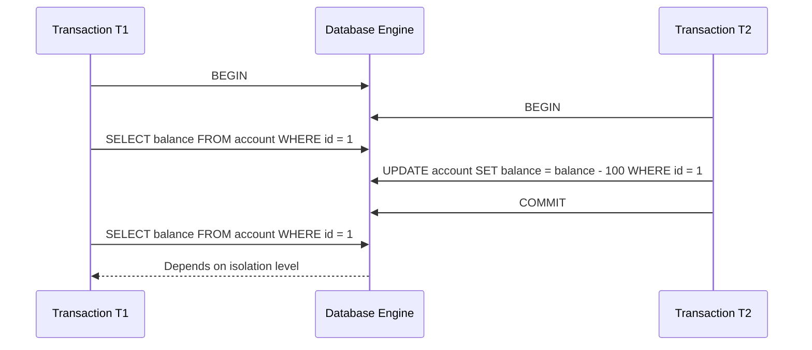
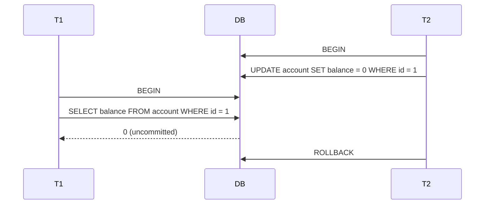
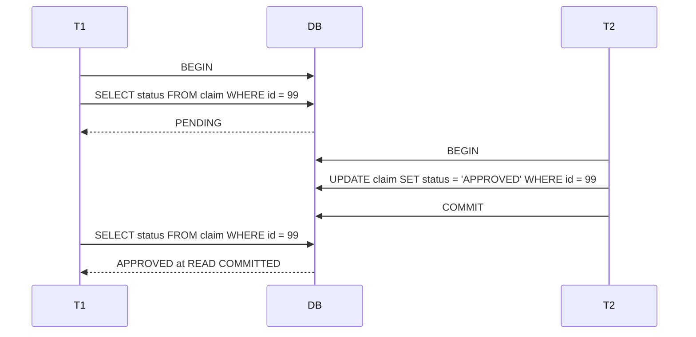
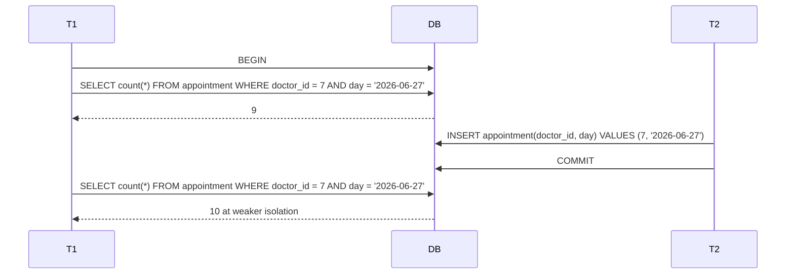
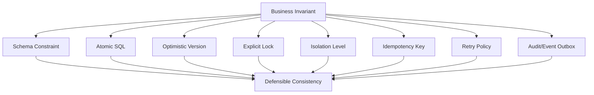

# Part 011 — Transaction Isolation: Read Phenomena and Real Database Behavior

## 1. Tujuan Part Ini

Part sebelumnya membahas transaction boundary: `setAutoCommit(false)`, `commit()`, dan `rollback()`.

Part ini menjawab pertanyaan yang lebih sulit:

> Ketika dua atau lebih transaction berjalan bersamaan, **data apa yang boleh dilihat**, **perubahan apa yang boleh saling menimpa**, dan **anomali apa yang masih mungkin terjadi**?

Di level junior, isolation sering dihafal sebagai tabel:

| Isolation | Dirty Read | Non-Repeatable Read | Phantom Read |
|---|---:|---:|---:|
| Read Uncommitted | possible | possible | possible |
| Read Committed | prevented | possible | possible |
| Repeatable Read | prevented | prevented | possible |
| Serializable | prevented | prevented | prevented |

Tabel itu berguna sebagai awal, tapi tidak cukup untuk production.

Engineer senior perlu memahami:

1. JDBC hanya menyediakan **API untuk meminta isolation level**, bukan menjamin semua database berperilaku identik.
2. SQL standard read phenomena tidak mencakup semua anomaly penting, misalnya lost update dan write skew.
3. MVCC database dan lock-based database bisa memberi behavior yang berbeda walaupun nama isolation level sama.
4. Isolation adalah trade-off antara correctness, concurrency, latency, retry rate, dan operational complexity.
5. Correctness tidak boleh hanya bergantung pada isolation; sering kali perlu constraint, optimistic locking, idempotency, atau explicit locking.

Part ini membangun mental model agar kamu bisa memilih isolation level dengan sadar, mendeteksi anomaly, dan mendesain transaction yang defensible.

---

## 2. Kaufman Skill Slice

Untuk menguasai transaction isolation dengan cepat, skill ini dipecah menjadi unit kecil:

| Slice | Yang Harus Dikuasai | Mengapa Penting |
|---|---|---|
| Vocabulary | Dirty read, non-repeatable read, phantom, lost update, write skew | Tanpa bahasa yang presisi, debugging concurrency menjadi spekulatif |
| JDBC API | `setTransactionIsolation`, constants, `getTransactionIsolation` | Boundary Java ke DB |
| DB behavior | PostgreSQL, MySQL/InnoDB, Oracle, SQL Server tidak identik | Production tidak berjalan di textbook |
| Workload reasoning | Read-only, write-write, read-then-write, invariant enforcement | Isolation dipilih berdasarkan workload |
| Failure signal | Serialization failure, deadlock, lock timeout, stale update count | Signal menentukan retry atau abort |
| Design pattern | Constraints, version columns, `SELECT FOR UPDATE`, optimistic locking | Isolation bukan satu-satunya alat correctness |

Tujuan praktis setelah part ini:

- Bisa menjelaskan **anomaly apa yang mungkin terjadi** pada transaction tertentu.
- Bisa memilih isolation level berdasarkan invariant bisnis.
- Bisa menulis test dua-connection untuk membuktikan behavior database.
- Bisa menghindari false confidence: “sudah transaction berarti aman”.

---

## 3. Mental Model: Isolation Adalah Kontrak Visibilitas

Transaction memiliki dua sisi:

1. **Atomicity**: semua perubahan dalam transaction commit bersama atau rollback bersama.
2. **Isolation**: transaction concurrent tidak saling melihat/mengganggu secara sembarangan.

Isolation bukan hanya soal “apakah data sudah commit”. Isolation adalah kontrak tentang:

- snapshot mana yang dibaca,
- lock apa yang diambil,
- apakah range predicate dilindungi,
- apakah concurrent write dideteksi,
- apakah anomaly dikembalikan sebagai error,
- apakah aplikasi harus retry.

Diagram sederhana:



Di `READ_COMMITTED`, query kedua T1 mungkin melihat nilai baru.

Di `REPEATABLE_READ` pada database MVCC tertentu, query kedua T1 mungkin tetap melihat snapshot lama.

Di `SERIALIZABLE`, database berusaha membuat hasil seolah-olah transaction berjalan satu per satu, atau menggagalkan salah satu transaction jika tidak bisa.

---

## 4. JDBC Isolation API

JDBC menyediakan isolation constants di `java.sql.Connection`:

```java
Connection.TRANSACTION_NONE;
Connection.TRANSACTION_READ_UNCOMMITTED;
Connection.TRANSACTION_READ_COMMITTED;
Connection.TRANSACTION_REPEATABLE_READ;
Connection.TRANSACTION_SERIALIZABLE;
```

Pemakaian dasar:

```java
try (Connection connection = dataSource.getConnection()) {
    int previousIsolation = connection.getTransactionIsolation();
    boolean previousAutoCommit = connection.getAutoCommit();

    try {
        connection.setTransactionIsolation(Connection.TRANSACTION_SERIALIZABLE);
        connection.setAutoCommit(false);

        // business SQL

        connection.commit();
    } catch (SQLException e) {
        safeRollback(connection, e);
        throw e;
    } finally {
        connection.setAutoCommit(previousAutoCommit);
        connection.setTransactionIsolation(previousIsolation);
    }
}
```

Tetapi ada aturan penting:

1. Jangan mengubah isolation level sembarangan di tengah transaction.
2. Pada pooled connection, restore state sebelum connection dikembalikan.
3. Jangan mengasumsikan semua driver/database mendukung semua level.
4. Periksa actual isolation jika correctness kritikal.
5. Pilih isolation per use case, bukan global default tanpa analisis.

JDBC documentation menyatakan bahwa constants di `Connection` adalah possible transaction isolation levels, dan perubahan isolation saat transaction sedang berjalan bersifat implementation-defined. Karena itu, set isolation sebelum transaction dimulai.

---

## 5. Empat Isolation Level dari Perspektif JDBC

### 5.1 `TRANSACTION_READ_UNCOMMITTED`

Makna textbook:

- Dirty read mungkin terjadi.
- Non-repeatable read mungkin terjadi.
- Phantom read mungkin terjadi.

Dirty read berarti transaction membaca perubahan transaction lain yang belum commit.

Contoh risiko:

```text
T2 update invoice status = PAID tetapi belum commit.
T1 membaca invoice sebagai PAID dan mengirim receipt.
T2 rollback.
Receipt sudah terkirim untuk payment yang tidak pernah commit.
```

Dalam banyak sistem production, `READ_UNCOMMITTED` jarang layak dipakai untuk logic bisnis.

Use case terbatas:

- approximate analytics,
- debugging non-critical,
- query monitoring tertentu,
- workload yang benar-benar toleran terhadap dirty/inconsistent view.

Tetapi banyak MVCC database tidak benar-benar memberi dirty read walaupun level ini diminta. Contoh: PostgreSQL memetakan `READ UNCOMMITTED` ke behavior `READ COMMITTED`.

### 5.2 `TRANSACTION_READ_COMMITTED`

Makna umum:

- Transaction hanya membaca data yang sudah commit.
- Dirty read dicegah.
- Non-repeatable read masih mungkin.
- Phantom read masih mungkin.

Ini sering menjadi default database karena memberi trade-off bagus antara correctness dan concurrency.

Contoh non-repeatable read:

```text
T1: SELECT status FROM case WHERE id = 10; -- OPEN
T2: UPDATE case SET status = 'CLOSED' WHERE id = 10; COMMIT;
T1: SELECT status FROM case WHERE id = 10; -- CLOSED
```

Dalam transaction yang sama, T1 melihat row yang sama berubah.

Apakah ini bug? Tergantung invariant.

Tidak masalah jika transaction hanya melakukan read reporting ringan.

Masalah jika business decision membutuhkan stable view:

```text
T1 reads current exposure.
T2 changes exposure.
T1 approves limit using stale first read and fresh second read inconsistently.
```

### 5.3 `TRANSACTION_REPEATABLE_READ`

Makna textbook:

- Dirty read dicegah.
- Non-repeatable read dicegah.
- Phantom read masih mungkin menurut definisi JDBC/SQL klasik.

Tetapi real database behavior berbeda.

Pada MVCC database, repeatable read sering berarti transaction melihat snapshot stabil sejak transaction mulai. Pada MySQL/InnoDB, default isolation adalah `REPEATABLE READ`, dan InnoDB menggunakan next-key locks untuk beberapa operasi sehingga phantom dapat dicegah dalam skenario tertentu.

Repeatable read cocok untuk:

- read-your-snapshot operation,
- consistent report kecil-menengah,
- business operation yang butuh row yang sudah dibaca tetap stabil,
- menghindari non-repeatable read tanpa serializable cost.

Tetapi repeatable read belum otomatis menjamin semua invariant multi-row.

Contoh write skew masih mungkin pada snapshot isolation style:

```text
Invariant: at least one doctor must be on call.

T1 reads: doctor A on_call=true, doctor B on_call=true
T2 reads: doctor A on_call=true, doctor B on_call=true
T1 sets doctor A on_call=false
T2 sets doctor B on_call=false
T1 commit
T2 commit

Final: no doctor on call
Invariant broken.
```

Masing-masing transaction membaca snapshot valid, tetapi kombinasi commit melanggar invariant.

### 5.4 `TRANSACTION_SERIALIZABLE`

Makna ideal:

- Hasil concurrent transactions setara dengan beberapa urutan serial.
- Dirty read, non-repeatable read, phantom read dicegah.
- Anomaly seperti write skew seharusnya dicegah atau salah satu transaction digagalkan.

Serializable bukan berarti “tidak ada concurrency”. Implementasi modern bisa tetap concurrent dengan MVCC/SSI, tetapi harus mendeteksi conflict.

Konsekuensi application-level:

- kamu harus siap menghadapi serialization failure,
- transaction perlu retry-safe,
- transaction harus pendek,
- external side effect tidak boleh dilakukan sebelum commit,
- retry perlu idempotency.

Serializable cocok untuk:

- invariant finansial,
- limit enforcement,
- allocation scarce resource,
- regulatory state transition yang harus defensible,
- workflow escalation yang tidak boleh double-process,
- rule enforcement lintas row/entity.

Serializable tidak cocok jika:

- transaction panjang,
- ada user think time,
- ada external API call di dalam transaction,
- workload sangat conflict-heavy tanpa retry design,
- query tidak terindeks sehingga predicate range terlalu luas.

---

## 6. Read Phenomena dengan Timeline

### 6.1 Dirty Read

Dirty read terjadi ketika T1 membaca write dari T2 yang belum commit.



Problem:

- T1 mengambil keputusan dari data yang tidak pernah menjadi fakta committed.
- Audit trail bisa salah.
- Event bisa terkirim berdasarkan state palsu.

Mitigation:

- Jangan gunakan read uncommitted untuk business decision.
- Gunakan read committed atau lebih kuat.

### 6.2 Non-Repeatable Read

T1 membaca row yang sama dua kali dan mendapatkan nilai berbeda karena T2 commit di antara dua read.



Problem:

- decision logic bisa membaca kombinasi state yang tidak konsisten.
- validation awal tidak lagi valid saat write akhir.

Mitigation:

- repeatable read,
- explicit row lock,
- optimistic version check,
- single atomic conditional update.

### 6.3 Phantom Read

T1 membaca sekumpulan row berdasarkan predicate. T2 insert/update row baru yang memenuhi predicate. T1 membaca predicate lagi dan mendapat row tambahan.



Problem:

- quota/limit bisa dilanggar,
- uniqueness yang tidak dideklarasikan sebagai constraint bisa rusak,
- range validation tidak stabil.

Mitigation:

- unique/check/exclusion constraints,
- serializable isolation,
- predicate/range locks where supported,
- atomic insert with constraint,
- advisory lock for high-level resource if necessary.

---

## 7. Beyond SQL Phenomena: Lost Update and Write Skew

SQL classic phenomena tidak cukup. Dua anomaly yang sangat penting: lost update dan write skew.

### 7.1 Lost Update

Lost update terjadi ketika dua transaction membaca value yang sama, lalu masing-masing menulis value baru berdasarkan read lama. Update pertama hilang tertimpa update kedua.

```text
Initial balance = 100

T1 reads 100
T2 reads 100
T1 writes 80
T2 writes 70
Final balance = 70

Expected if both debits applied = 50
```

Kode raw JDBC yang rentan:

```java
long balance = selectBalance(connection, accountId);
long newBalance = balance - amount;
updateBalance(connection, accountId, newBalance);
```

Lebih aman dengan atomic update:

```sql
UPDATE account
SET balance = balance - ?
WHERE id = ?
  AND balance >= ?;
```

Lalu cek update count:

```java
int updated = ps.executeUpdate();
if (updated != 1) {
    throw new InsufficientBalanceException(accountId);
}
```

Atau optimistic locking:

```sql
UPDATE account
SET balance = ?, version = version + 1
WHERE id = ?
  AND version = ?;
```

Lost update bisa dicegah dengan beberapa cara:

| Strategy | Kapan Cocok |
|---|---|
| Atomic SQL update | Counter, balance, stock, quota |
| Optimistic locking | Aggregate row dengan version |
| `SELECT ... FOR UPDATE` | Critical row mutation |
| Serializable isolation | Invariant kompleks lintas row |
| Constraint | Invariant bisa diekspresikan di schema |

### 7.2 Write Skew

Write skew terjadi ketika dua transaction membaca kondisi global yang sama, lalu menulis row berbeda sehingga invariant global rusak.

Contoh:

```text
Invariant: minimal satu reviewer aktif untuk policy X.

T1 sees reviewer A and B active.
T2 sees reviewer A and B active.
T1 deactivates reviewer A.
T2 deactivates reviewer B.
Both commit.
Final: zero active reviewer.
```

Kenapa row lock biasa belum cukup?

- T1 hanya update row A.
- T2 hanya update row B.
- Tidak ada write-write conflict di row yang sama.
- Conflict ada pada invariant predicate: `count(active reviewer) >= 1`.

Mitigation:

1. Serializable isolation.
2. Constraint khusus jika bisa diekspresikan.
3. Lock parent/resource row.
4. Advisory lock keyed by invariant domain.
5. Materialized counter row dengan atomic update.

Pattern parent-row lock:

```sql
SELECT id
FROM policy
WHERE id = ?
FOR UPDATE;

SELECT count(*)
FROM policy_reviewer
WHERE policy_id = ?
  AND active = true;

UPDATE policy_reviewer
SET active = false
WHERE id = ?;
```

Dengan lock pada parent `policy`, semua mutation reviewer untuk policy yang sama diserialisasi.

---

## 8. JDBC Isolation Constants vs Real Database Behavior

JDBC constants memberi bahasa umum. Database memberi implementasi nyata.

| JDBC Constant | Intent Umum | Hal yang Harus Dicek |
|---|---|---|
| `READ_UNCOMMITTED` | Allow dirty read | Banyak DB tidak benar-benar expose dirty read |
| `READ_COMMITTED` | Only committed reads | Snapshot per statement atau locking behavior? |
| `REPEATABLE_READ` | Stable row reads | Apakah phantom dicegah? Apakah snapshot isolation? |
| `SERIALIZABLE` | Equivalent to serial order | Lock-based atau SSI? Error code retry apa? |

Rule:

> Jangan memilih isolation berdasarkan nama saja. Pilih berdasarkan documented behavior dari database target dan test dengan dua connection.

---

## 9. PostgreSQL Behavior Snapshot

PostgreSQL menggunakan MVCC. Behavior penting yang perlu diingat:

- `READ UNCOMMITTED` diperlakukan seperti `READ COMMITTED`.
- `READ COMMITTED` adalah default PostgreSQL.
- Pada `READ COMMITTED`, setiap statement melihat snapshot baru dari data committed pada awal statement.
- `REPEATABLE READ` melihat snapshot transaction-level.
- `SERIALIZABLE` menggunakan Serializable Snapshot Isolation dan dapat menggagalkan transaction dengan serialization error.

Konsekuensi desain:

- Pada `READ COMMITTED`, dua select dalam transaction yang sama bisa melihat hasil berbeda.
- Pada `REPEATABLE READ`, read stabil, tetapi konflik tertentu bisa muncul saat update.
- Pada `SERIALIZABLE`, aplikasi harus menangani retry.

Pseudo-code retry untuk serialization failure:

```java
public <T> T withSerializableRetry(SqlWork<T> work) throws SQLException {
    int maxAttempts = 3;

    for (int attempt = 1; attempt <= maxAttempts; attempt++) {
        try (Connection connection = dataSource.getConnection()) {
            connection.setTransactionIsolation(Connection.TRANSACTION_SERIALIZABLE);
            connection.setAutoCommit(false);

            try {
                T result = work.execute(connection);
                connection.commit();
                return result;
            } catch (SQLException e) {
                rollbackQuietly(connection, e);

                if (isSerializationFailure(e) && attempt < maxAttempts) {
                    sleepWithBackoff(attempt);
                    continue;
                }
                throw e;
            }
        }
    }

    throw new IllegalStateException("unreachable");
}

private boolean isSerializationFailure(SQLException e) {
    return "40001".equals(e.getSQLState());
}
```

Caveat:

- Retry harus membungkus seluruh transaction, bukan statement terakhir saja.
- Jangan mengirim email/event/payment call di dalam block yang akan diretry.
- Side effect harus setelah commit atau melalui outbox.

---

## 10. MySQL/InnoDB Behavior Snapshot

InnoDB mendukung empat isolation level standar: `READ UNCOMMITTED`, `READ COMMITTED`, `REPEATABLE READ`, dan `SERIALIZABLE`.

Hal penting:

- Default InnoDB umumnya `REPEATABLE READ`.
- InnoDB memakai consistent read untuk snapshot reads.
- InnoDB dapat memakai record lock, gap lock, dan next-key lock.
- Locking behavior bergantung pada isolation, index, predicate, dan apakah query adalah locking read.

Contoh perbedaan penting:

```sql
SELECT * FROM account WHERE id = 1;
```

Ini consistent read biasa.

```sql
SELECT * FROM account WHERE id = 1 FOR UPDATE;
```

Ini locking read dan mengambil lock untuk mencegah concurrent modification.

Konsekuensi desain:

- Missing index dapat memperluas lock scope.
- Range query bisa mengambil next-key lock.
- Deadlock adalah kondisi normal pada workload concurrent; aplikasi harus siap retry transaksi tertentu.
- `REPEATABLE READ` tidak berarti semua business invariant otomatis aman.

---

## 11. Oracle and SQL Server: Why You Must Read Vendor Docs

Oracle database historically menggunakan read consistency dan memiliki default `READ COMMITTED`. Serializable behavior berbasis snapshot dapat menghasilkan error jika concurrent update membuat serializable execution tidak mungkin.

SQL Server memiliki beberapa mode:

- lock-based `READ COMMITTED`,
- Read Committed Snapshot Isolation jika diaktifkan,
- Snapshot Isolation jika diaktifkan,
- Serializable dengan range locks.

Pelajaran besarnya:

> JDBC level adalah vocabulary. Database engine adalah semantics.

Dalam architecture review, selalu tulis:

```text
Database target: PostgreSQL 16 / MySQL 8.4 / Oracle 19c / SQL Server 2022
Default isolation: ...
Isolation requested by app: ...
Actual behavior tested: ...
Retryable SQLState/vendor code: ...
Invariant protected by: isolation / constraint / lock / version / idempotency
```

---

## 12. Isolation Level Selection Framework

Gunakan pertanyaan berikut.

### 12.1 Apakah Operation Read-Only?

Jika hanya read-only:

| Need | Candidate |
|---|---|
| Latest committed per statement cukup | Read committed |
| Consistent snapshot dalam beberapa query | Repeatable read / database snapshot mode |
| Regulatory/audit report harus exact terhadap cut-off | Repeatable read atau serializable, tergantung DB dan data size |

Read-only bukan berarti murah. Long read-only transaction bisa:

- menahan vacuum cleanup pada MVCC DB,
- memperpanjang version retention,
- meningkatkan replication lag,
- membuat query membaca snapshot lama.

### 12.2 Apakah Operation Read-Then-Write Row yang Sama?

Contoh:

```text
Read account balance → decide → update same account
```

Preferensi:

1. Atomic conditional update jika bisa.
2. Optimistic locking jika aggregate-oriented.
3. `SELECT FOR UPDATE` jika perlu inspect lalu mutate.
4. Serializable jika invariant tidak bisa diekspresikan lokal.

### 12.3 Apakah Operation Menjaga Invariant Lintas Row?

Contoh:

- max 10 active sessions per user,
- at least one approver must remain,
- no overlapping booking,
- total exposure <= limit,
- case cannot have two active enforcement actions of same type.

Preferensi:

1. Constraint jika bisa:
   - unique constraint,
   - check constraint,
   - exclusion constraint,
   - foreign key,
   - partial unique index.
2. Parent/resource row lock.
3. Serializable + retry.
4. Advisory lock untuk invariant domain khusus.

### 12.4 Apakah Ada External Side Effect?

Jika transaction melakukan:

- HTTP call,
- publish message,
- send email,
- call payment provider,
- write file,
- call another service,

maka isolation tidak menyelesaikan masalah side effect.

Gunakan:

- outbox pattern,
- after-commit hook,
- idempotency key,
- saga/compensation,
- state machine dengan durable state.

---

## 13. Pattern: Atomic Conditional Update

Atomic conditional update sering lebih kuat dan murah daripada read-then-write.

Contoh reserve stock:

```sql
UPDATE inventory
SET available = available - ?
WHERE sku = ?
  AND available >= ?;
```

Java:

```java
public boolean reserveStock(Connection connection, String sku, int quantity) throws SQLException {
    String sql = """
        UPDATE inventory
        SET available = available - ?
        WHERE sku = ?
          AND available >= ?
        """;

    try (PreparedStatement ps = connection.prepareStatement(sql)) {
        ps.setInt(1, quantity);
        ps.setString(2, sku);
        ps.setInt(3, quantity);
        return ps.executeUpdate() == 1;
    }
}
```

Invariant yang dilindungi:

```text
available never goes below zero
```

Kelebihan:

- satu statement,
- lock scope minimal,
- tidak ada lost update,
- update count menjadi correctness signal.

Keterbatasan:

- hanya cocok jika invariant bisa diekspresikan dalam satu row/statement.
- untuk invariant lintas row, perlu constraint/lock/serializable.

---

## 14. Pattern: Optimistic Locking with Version Column

Schema:

```sql
ALTER TABLE case_file ADD COLUMN version BIGINT NOT NULL DEFAULT 0;
```

Read:

```sql
SELECT id, status, assigned_officer, version
FROM case_file
WHERE id = ?;
```

Update:

```sql
UPDATE case_file
SET status = ?,
    assigned_officer = ?,
    version = version + 1
WHERE id = ?
  AND version = ?;
```

Java:

```java
public void updateCase(Connection connection, CaseFile caseFile) throws SQLException {
    String sql = """
        UPDATE case_file
        SET status = ?,
            assigned_officer = ?,
            version = version + 1
        WHERE id = ?
          AND version = ?
        """;

    try (PreparedStatement ps = connection.prepareStatement(sql)) {
        ps.setString(1, caseFile.status().name());
        ps.setString(2, caseFile.assignedOfficer());
        ps.setLong(3, caseFile.id());
        ps.setLong(4, caseFile.version());

        int updated = ps.executeUpdate();
        if (updated != 1) {
            throw new OptimisticConflictException(caseFile.id());
        }
    }
}
```

Optimistic locking cocok jika:

- conflict jarang,
- user atau service bisa retry/reload,
- aggregate row menjadi concurrency boundary,
- kamu ingin menghindari lock yang ditahan lama.

Tidak cocok jika:

- conflict sangat sering,
- operation tidak idempotent,
- invariant lintas banyak row tidak tercakup oleh satu version,
- external side effect sudah terjadi sebelum conflict diketahui.

---

## 15. Pattern: Pessimistic Locking with `SELECT FOR UPDATE`

Contoh:

```sql
SELECT id, balance
FROM account
WHERE id = ?
FOR UPDATE;
```

Setelah row dikunci, transaction lain yang ingin mengubah row yang sama akan blocking atau gagal tergantung database dan timeout.

Java:

```java
public void transfer(Connection connection, long fromAccount, long toAccount, BigDecimal amount)
        throws SQLException {

    long first = Math.min(fromAccount, toAccount);
    long second = Math.max(fromAccount, toAccount);

    Account a = selectAccountForUpdate(connection, first);
    Account b = selectAccountForUpdate(connection, second);

    // Determine debit/credit after locks are acquired in stable order.
    debit(connection, fromAccount, amount);
    credit(connection, toAccount, amount);
}
```

Kenapa lock order penting?

Jika transaction A lock account 1 lalu 2, sementara transaction B lock account 2 lalu 1, deadlock mudah terjadi.

Lock order invariant:

```text
For multi-row locks, acquire locks in deterministic global order.
```

Pessimistic locking cocok jika:

- conflict cukup sering,
- operation pendek,
- row set kecil,
- failure/retry lebih mahal daripada menunggu lock,
- data critical.

Tidak cocok jika:

- transaction panjang,
- ada external call,
- query tidak terindeks,
- row/range terlalu luas,
- user interaction terjadi di dalam transaction.

---

## 16. Pattern: Constraint as Concurrency Control

Constraint adalah concurrency control yang sering lebih baik daripada manual check.

Anti-pattern:

```sql
SELECT count(*) FROM user_role
WHERE user_id = ? AND role = 'PRIMARY_APPROVER';

-- if count = 0, then insert
INSERT INTO user_role(user_id, role) VALUES (?, 'PRIMARY_APPROVER');
```

Dua transaction bisa sama-sama membaca count 0, lalu sama-sama insert.

Lebih baik:

```sql
CREATE UNIQUE INDEX uq_primary_approver
ON user_role(user_id)
WHERE role = 'PRIMARY_APPROVER';
```

Lalu:

```sql
INSERT INTO user_role(user_id, role)
VALUES (?, 'PRIMARY_APPROVER');
```

Jika duplicate, database menolak.

Java handler:

```java
try {
    insertPrimaryApprover(connection, userId);
} catch (SQLException e) {
    if (isUniqueViolation(e)) {
        throw new PrimaryApproverAlreadyExistsException(userId, e);
    }
    throw e;
}
```

Manfaat:

- invariant enforced di satu tempat,
- aman terhadap race condition,
- tidak bergantung pada semua caller melakukan check yang sama,
- lebih defensible untuk audit.

---

## 17. Testing Isolation dengan Dua Connection

Jangan hanya percaya teori. Buat test yang memaksa interleaving.

Skeleton:

```java
ExecutorService executor = Executors.newFixedThreadPool(2);
CountDownLatch t1ReadDone = new CountDownLatch(1);
CountDownLatch t2CommitDone = new CountDownLatch(1);

Future<?> t1 = executor.submit(() -> {
    try (Connection c1 = dataSource.getConnection()) {
        c1.setAutoCommit(false);
        c1.setTransactionIsolation(Connection.TRANSACTION_READ_COMMITTED);

        String first = selectStatus(c1, caseId);
        t1ReadDone.countDown();

        t2CommitDone.await();

        String second = selectStatus(c1, caseId);
        c1.commit();

        assertThat(first).isNotEqualTo(second);
    }
    return null;
});

Future<?> t2 = executor.submit(() -> {
    t1ReadDone.await();

    try (Connection c2 = dataSource.getConnection()) {
        c2.setAutoCommit(false);
        updateStatus(c2, caseId, "APPROVED");
        c2.commit();
    }

    t2CommitDone.countDown();
    return null;
});
```

Catatan:

- Gunakan real database, bukan hanya embedded substitute.
- Buat interleaving eksplisit dengan latch.
- Set timeout agar test tidak hang.
- Jalankan beberapa kali untuk detect flaky concurrency behavior.
- Assert bukan hanya output, tapi SQLState/error code jika conflict diharapkan.

---

## 18. Isolation and Connection Pool State

Transaction isolation adalah state pada connection/session.

Pada pool:

```text
Request A borrows connection
Request A sets isolation SERIALIZABLE
Request A returns connection without reset
Request B borrows same logical/physical connection
Request B unexpectedly runs SERIALIZABLE
```

Pool/framework yang baik biasanya reset state tertentu, tetapi jangan bergantung pada kebetulan.

Rules:

1. Jika mengubah isolation manual, restore di `finally`.
2. Jika pakai Spring `@Transactional(isolation = ...)`, biarkan transaction manager mengatur boundary.
3. Jangan campur manual isolation mutation dengan framework transaction kecuali sangat jelas.
4. Observability harus mencatat jika transaction tertentu memakai isolation non-default.

Helper:

```java
public final class IsolationScope implements AutoCloseable {
    private final Connection connection;
    private final int previousIsolation;

    public IsolationScope(Connection connection, int isolation) throws SQLException {
        this.connection = connection;
        this.previousIsolation = connection.getTransactionIsolation();
        connection.setTransactionIsolation(isolation);
    }

    @Override
    public void close() throws SQLException {
        connection.setTransactionIsolation(previousIsolation);
    }
}
```

Pemakaian:

```java
try (IsolationScope ignored = new IsolationScope(connection, Connection.TRANSACTION_SERIALIZABLE)) {
    // transaction work
}
```

Tetap lebih baik: centralize di transaction runner.

---

## 19. Isolation Decision Table

| Use Case | Recommended Starting Point | Additional Guardrail |
|---|---|---|
| Simple lookup by id | Read committed | None, unless stale read matters |
| Dashboard/report approximate | Read committed | Time range cut-off |
| Multi-query consistent report | Repeatable read/snapshot | Avoid long transaction |
| Debit/credit same account row | Read committed + atomic update or row lock | Update count check |
| Transfer between two accounts | Row locks in deterministic order | Transaction short, retry deadlock |
| Unique business key creation | Read committed | Unique constraint |
| Quota reservation | Atomic conditional update | Constraint/counter row |
| No overlapping booking | Constraint/exclusion if possible | Serializable or resource lock |
| Cross-row invariant | Serializable or parent lock | Retry/idempotency |
| Regulatory state transition | Read committed + optimistic version, or serializable for multi-entity invariant | Audit + outbox |
| Batch mutation | Read committed usually | Chunking + idempotency |

---

## 20. Anti-Patterns

### 20.1 “Transaction = Safe”

Salah.

Transaction tanpa isolation yang cukup tetap bisa menghasilkan anomaly.

### 20.2 Read-Then-Insert tanpa Constraint

```sql
SELECT count(*) ...
INSERT ...
```

Ini race-prone jika tidak ada constraint.

### 20.3 Global Serializable Tanpa Retry Design

Serializable bisa menggagalkan transaction. Jika aplikasi tidak punya retry policy, kamu hanya memindahkan bug menjadi error spike.

### 20.4 Long Transaction untuk User Flow

```text
BEGIN
show form to user
wait 5 minutes
UPDATE
COMMIT
```

Ini menahan resource terlalu lama dan rawan conflict.

### 20.5 Mengandalkan Isolation untuk External Side Effect

Isolation hanya mengatur database transaction. Ia tidak otomatis rollback email, Kafka publish, atau HTTP call.

### 20.6 Set Isolation di Connection lalu Tidak Reset

Pada pooled connection, ini bisa mencemari request lain.

### 20.7 Menganggap PostgreSQL dan MySQL Sama

Nama isolation sama tidak berarti behavior sama.

### 20.8 Menyelesaikan Race dengan Sleep

`sleep()` tidak membuat concurrency benar. Ia hanya membuat race lebih sulit direproduksi.

---

## 21. Practical Diagnostic Questions

Ketika ada bug concurrency, tanyakan:

1. Transaction apa saja yang menyentuh data ini?
2. Apakah operasi read-then-write?
3. Apakah invariant berada pada satu row, banyak row, atau predicate/range?
4. Isolation level actual apa?
5. Database target apa dan behavior documented-nya bagaimana?
6. Apakah ada unique/check/FK/exclusion constraint?
7. Apakah update count dicek?
8. Apakah ada version column?
9. Apakah ada explicit lock?
10. Apakah transaction melakukan external side effect?
11. Apakah error code deadlock/serialization ditangani?
12. Apakah test concurrency dua-connection tersedia?

---

## 22. Mental Model: Correctness Layers

Jangan jadikan isolation sebagai satu-satunya tembok.



Best engineering bukan “pakai isolation paling tinggi”. Best engineering adalah memilih kombinasi guardrail yang paling sederhana, terbukti, observable, dan sesuai workload.

---

## 23. Mini Case Study: Case Escalation Race

### Problem

Regulatory case management system memiliki invariant:

```text
A case may have at most one active escalation of type ENFORCEMENT_REVIEW.
```

Naive implementation:

```sql
SELECT count(*)
FROM case_escalation
WHERE case_id = ?
  AND type = 'ENFORCEMENT_REVIEW'
  AND active = true;

INSERT INTO case_escalation(case_id, type, active)
VALUES (?, 'ENFORCEMENT_REVIEW', true);
```

Race:

```text
T1 count = 0
T2 count = 0
T1 insert
T2 insert
Final: duplicate active escalation
```

### Better Design

Schema guardrail:

```sql
CREATE UNIQUE INDEX uq_active_enforcement_review
ON case_escalation(case_id, type)
WHERE active = true;
```

Application:

```java
try {
    insertEscalation(connection, caseId, EscalationType.ENFORCEMENT_REVIEW);
} catch (SQLException e) {
    if (isUniqueViolation(e)) {
        throw new DuplicateActiveEscalationException(caseId, e);
    }
    throw e;
}
```

Optional application state machine:

```text
CASE_OPEN -> ESCALATION_PENDING -> ESCALATED -> CLOSED
```

With optimistic version on `case_file` if transition itself must be serialized.

### Why This Is Better

- Database enforces invariant across all callers.
- Race becomes deterministic constraint violation.
- Application handles violation as business conflict.
- Audit can explain why second escalation was rejected.

---

## 24. Practice Plan

### Exercise 1 — Non-Repeatable Read

Create two JDBC connections. Under `READ_COMMITTED`, prove that T1 can see a changed row after T2 commits.

Then repeat under `REPEATABLE_READ` and observe behavior.

### Exercise 2 — Lost Update

Implement naive read-modify-write counter increment with two concurrent transactions.

Then fix using:

1. atomic update,
2. optimistic version,
3. `SELECT FOR UPDATE`.

Compare behavior.

### Exercise 3 — Write Skew

Model “at least one active reviewer must remain”.

Try to break it under snapshot/repeatable read.

Fix using:

1. parent row lock,
2. serializable isolation,
3. schema design if possible.

### Exercise 4 — Retry Serializable

Run a conflict workload under serializable isolation. Capture SQLState and implement bounded retry with backoff.

### Exercise 5 — Architecture Review

Pick one existing service operation and document:

```text
Operation:
Invariant:
Rows read:
Rows written:
Predicate/range involved:
Isolation level:
Constraint guardrail:
Locking strategy:
Retry behavior:
External side effect:
Test coverage:
```

---

## 25. Key Takeaways

1. Isolation controls visibility and concurrency anomalies; it is not just a config flag.
2. JDBC constants are portable vocabulary, not identical cross-database semantics.
3. `READ_COMMITTED` is often a good default but not enough for all invariants.
4. `REPEATABLE_READ` gives stronger read stability but may not prevent all business anomalies.
5. `SERIALIZABLE` gives strongest correctness model but requires retry-safe transaction design.
6. Lost update and write skew matter more in real systems than textbook tables suggest.
7. Constraints, atomic updates, optimistic locking, and explicit locks are often better targeted tools than simply raising isolation globally.
8. Test isolation behavior with real database and two explicit connections.
9. In pooled environments, isolation state must be managed carefully.
10. Correctness is layered: schema, SQL, transaction, application, retry, and observability.

---

## 26. References

- Java SE 25 `java.sql.Connection` documentation.
- Java SE 25 `java.sql.Statement` documentation.
- PostgreSQL current documentation: Transaction Isolation.
- MySQL documentation: InnoDB Transaction Isolation Levels and Locking.
- JDBC 4.3 Specification.

