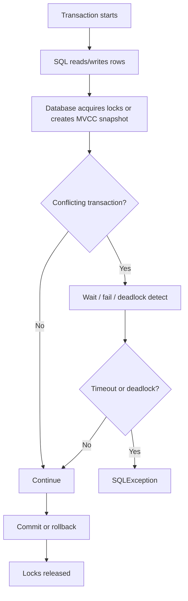
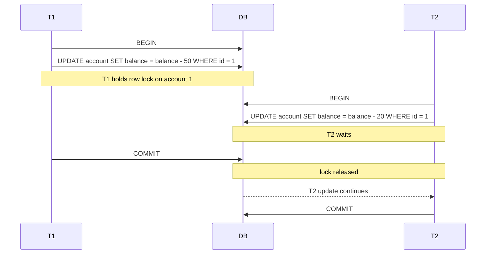
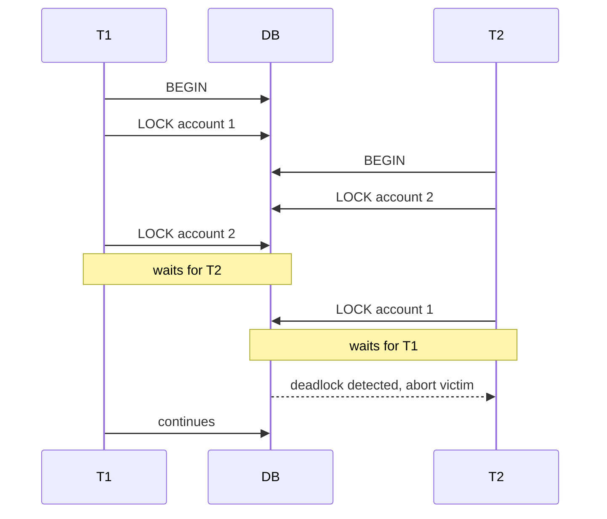
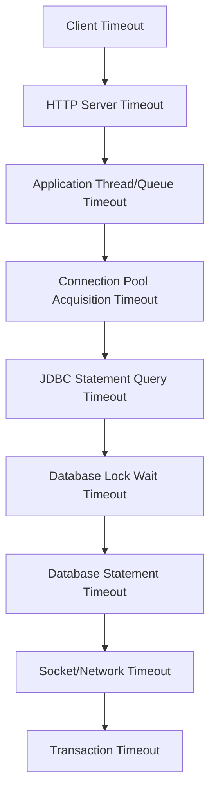
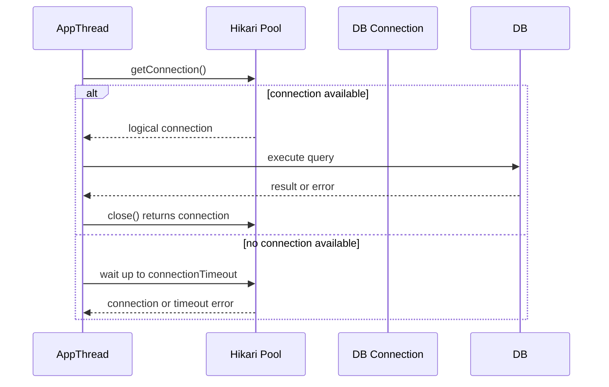
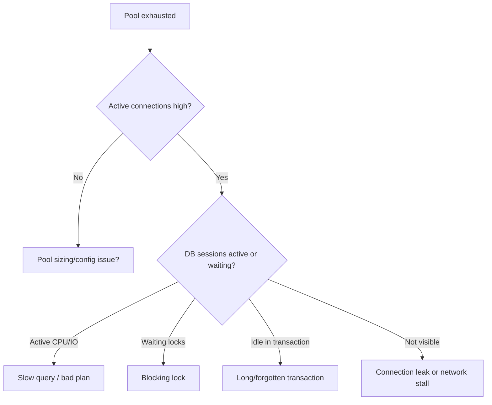
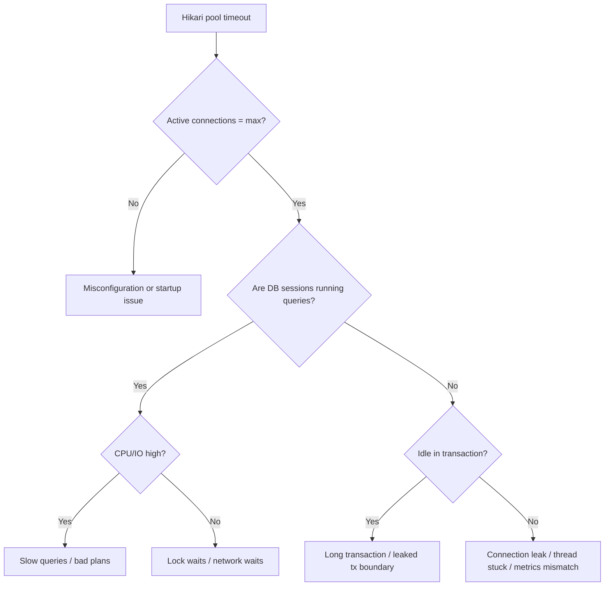
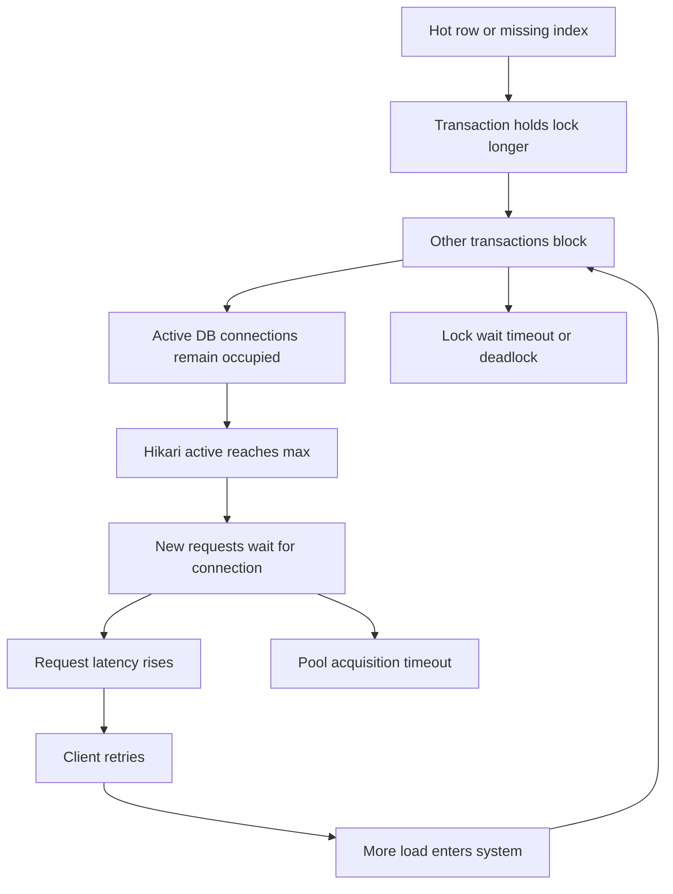

# Part 012 — Locking, Blocking, Deadlock, and Timeout Semantics

## 1. Tujuan Part Ini

Part sebelumnya membahas isolation: visibilitas data dan anomaly.

Part ini membahas sisi operational dari concurrency:

- lock,
- blocking,
- deadlock,
- timeout,
- cancellation,
- retry,
- incident diagnosis.

Di production, masalah JDBC/database jarang muncul sebagai “isolation level salah” secara eksplisit. Yang terlihat biasanya:

```text
HTTP latency naik
thread pool penuh
Hikari pool exhausted
query timeout
lock wait timeout
deadlock spike
CPU database rendah tapi aplikasi stuck
connection acquisition timeout
```

Untuk engineer senior, kemampuan pentingnya adalah membedakan:

| Gejala | Kemungkinan Root Cause |
|---|---|
| Waiting connection from pool | pool exhaustion, connection leak, DB slow, long transaction |
| Query timeout | slow query, blocking lock, network issue, bad plan |
| Lock wait timeout | transaction lain menahan lock terlalu lama |
| Deadlock | cyclic lock dependency |
| Commit lambat | WAL/fsync/replication/constraint/index pressure |
| Rollback lambat | undo/cleanup work, large transaction |

Satu prinsip utama:

> Jangan menyelesaikan semua timeout dengan menaikkan angka timeout. Timeout adalah signal desain, bukan sekadar konfigurasi.

---

## 2. Kaufman Skill Slice

Agar cepat mahir, locking dan timeout dipecah menjadi skill kecil:

| Slice | Skill | Output Praktis |
|---|---|---|
| Lock vocabulary | row lock, range lock, gap lock, table lock, advisory lock | Bisa membaca database lock view |
| Blocking model | siapa menunggu siapa | Bisa menemukan blocker dan victim |
| Deadlock model | cyclic wait | Bisa mengurangi deadlock dengan lock order |
| Timeout taxonomy | pool/query/lock/socket/transaction/http | Bisa desain timeout hierarchy |
| JDBC API | `setQueryTimeout`, `cancel`, exceptions | Bisa set timeout dan handle failure |
| Design mitigation | shorter tx, indexes, lock order, retry | Bisa memperbaiki root cause |
| Incident playbook | metrics + DB introspection + thread dump | Bisa debug production outage |

---

## 3. Mental Model: Lock Adalah Kontrak Eksklusivitas Sementara

Lock adalah mekanisme database untuk mengontrol concurrent access.

Lock bukan selalu buruk. Lock adalah harga untuk correctness.

Masalah muncul ketika:

- lock diambil terlalu luas,
- lock ditahan terlalu lama,
- lock diambil dalam urutan yang tidak konsisten,
- query tidak terindeks sehingga lock range membesar,
- transaction melakukan kerja non-database saat lock masih ditahan,
- timeout tidak didesain berlapis,
- retry dilakukan tanpa idempotency.

Flow sederhana:



Important:

```text
Most transactional locks are released at commit/rollback, not when the statement finishes.
```

Karena itu transaction duration sangat penting.

---

## 4. Lock Types You Must Recognize

Nama dan detail lock berbeda per database, tetapi konsep berikut umum.

### 4.1 Row Lock

Lock pada row tertentu.

Contoh:

```sql
UPDATE account
SET balance = balance - 100
WHERE id = 1;
```

Transaction lain yang ingin update row `account.id = 1` bisa menunggu.

Row lock bagus jika:

- predicate menggunakan index,
- row set kecil,
- transaction pendek.

### 4.2 Table Lock

Lock pada table. Bisa eksplisit atau efek samping operasi tertentu.

Contoh situasi:

- DDL,
- migration,
- table rewrite,
- explicit `LOCK TABLE`,
- beberapa bulk operation,
- missing index yang menyebabkan lock escalation pada database tertentu.

Table lock berbahaya di workload online karena memblokir banyak transaksi.

### 4.3 Range / Predicate Lock

Lock yang melindungi rentang nilai atau predicate.

Contoh invariant:

```text
Tidak boleh ada booking yang overlap untuk resource yang sama.
```

Query:

```sql
SELECT *
FROM booking
WHERE resource_id = ?
  AND start_at < ?
  AND end_at > ?
FOR UPDATE;
```

Jika database hanya lock row yang sudah ada, insert row baru yang overlap masih bisa terjadi. Beberapa database/isolation memakai range/predicate lock untuk mencegah phantom.

### 4.4 Gap Lock / Next-Key Lock

Istilah yang sering muncul di InnoDB.

- Record lock: lock index record.
- Gap lock: lock gap antar index records.
- Next-key lock: kombinasi record lock + gap lock.

Tujuannya mencegah phantom pada range tertentu.

Konsekuensi:

- range query bisa memblokir insert,
- index design sangat memengaruhi lock scope,
- missing/wrong index bisa membuat lock lebih luas dari dugaan.

### 4.5 Advisory Lock

Advisory lock adalah lock eksplisit berdasarkan key aplikasi, bukan row tertentu.

Contoh use case:

```text
Serialize all operations for tenant_id=123.
Serialize all recalculation jobs for account group X.
Prevent concurrent import for same file.
```

Kelebihan:

- bisa melindungi invariant yang tidak cocok dengan row lock,
- key bisa domain-specific.

Risiko:

- discipline harus konsisten di semua caller,
- bisa menjadi global bottleneck,
- observability harus jelas,
- salah key bisa menyebabkan under-locking atau over-locking.

---

## 5. Blocking: Waiting Is Not Always a Bug

Blocking terjadi ketika transaction harus menunggu lock yang dipegang transaction lain.

Contoh:



Blocking acceptable jika:

- durasi pendek,
- predictable,
- timeout lebih kecil dari user-facing timeout,
- tidak membentuk cascading failure.

Blocking berbahaya jika:

- transaction holder idle,
- holder melakukan external API call,
- query holder full table scan,
- pool semua connection habis menunggu lock,
- request thread semua blocked.

---

## 6. Deadlock: Cyclic Waiting

Deadlock terjadi ketika beberapa transaction saling menunggu lock dalam siklus.

Contoh klasik transfer:



Database biasanya mendeteksi deadlock dan menggagalkan salah satu transaction sebagai victim.

Important:

```text
Deadlock is not necessarily a database bug.
It is often an application lock-ordering bug or workload conflict signal.
```

---

## 7. Deadlock Prevention: Deterministic Lock Ordering

Jika operation perlu lock banyak entity, ambil lock dalam urutan global yang konsisten.

Bad:

```java
transfer(1, 2); // locks 1 then 2
transfer(2, 1); // locks 2 then 1
```

Better:

```java
long first = Math.min(fromAccountId, toAccountId);
long second = Math.max(fromAccountId, toAccountId);

selectAccountForUpdate(connection, first);
selectAccountForUpdate(connection, second);

// after locks acquired, perform debit/credit using original direction
```

Rule:

```text
Every code path that locks the same resource type must use the same ordering rule.
```

Untuk multi-type resources, definisikan hierarchy:

```text
Tenant -> Case -> EnforcementAction -> PaymentHold -> AuditRecord
```

Jangan ada code path yang lock `AuditRecord` lalu `Case` jika code lain lock `Case` lalu `AuditRecord`.

---

## 8. Lock Scope Depends on Query Shape

Dua query yang secara bisnis mirip bisa punya lock behavior sangat berbeda.

### 8.1 Indexed Point Lookup

```sql
SELECT *
FROM case_file
WHERE id = ?
FOR UPDATE;
```

Jika `id` primary key, lock scope kecil.

### 8.2 Non-Indexed Predicate

```sql
SELECT *
FROM case_file
WHERE external_reference = ?
FOR UPDATE;
```

Jika `external_reference` tidak diindeks:

- database mungkin scan banyak row,
- lock bisa lebih luas,
- query lebih lama,
- blocking window lebih panjang,
- deadlock risk naik.

### 8.3 Range Predicate

```sql
SELECT *
FROM booking
WHERE resource_id = ?
  AND start_at < ?
  AND end_at > ?
FOR UPDATE;
```

Lock behavior bergantung pada index:

```sql
CREATE INDEX idx_booking_resource_time
ON booking(resource_id, start_at, end_at);
```

Tanpa index yang sesuai, database tidak bisa membatasi pencarian dengan efisien.

Rule:

> Every locking query deserves an index review.

---

## 9. Timeout Taxonomy

Timeout bukan satu hal. Dalam Java/JDBC service, ada banyak timeout berlapis.



Jika urutannya salah, sistem bisa gagal buruk.

Contoh buruk:

```text
Client timeout: 2s
HTTP server timeout: 60s
Hikari connectionTimeout: 30s
DB query timeout: unlimited
DB lock timeout: unlimited
```

Akibat:

- client sudah pergi,
- server thread masih menunggu,
- pool connection tetap dipakai,
- DB tetap menjalankan query,
- request baru ikut mengantri,
- cascading failure.

Prinsip desain:

```text
Inner operation timeout should usually be shorter than outer request deadline.
```

Contoh lebih sehat:

```text
Client deadline: 5s
Server request budget: 4500ms
Pool acquisition timeout: 200ms
Query timeout: 1500ms
Lock wait timeout: 500ms
Retry budget: at most one retry if idempotent
```

Angka harus disesuaikan workload. Yang penting adalah hierarchy dan budget.

---

## 10. JDBC `Statement.setQueryTimeout`

JDBC menyediakan:

```java
statement.setQueryTimeout(seconds);
```

Maknanya: driver diberi timeout dalam detik untuk statement execution. Jika timeout terlampaui, driver menentukan bahwa timeout terjadi dan setidaknya mencoba cancel statement yang sedang berjalan, lalu melempar `SQLTimeoutException` untuk banyak method eksekusi.

Contoh:

```java
try (PreparedStatement ps = connection.prepareStatement(sql)) {
    ps.setQueryTimeout(2);
    try (ResultSet rs = ps.executeQuery()) {
        while (rs.next()) {
            // map row
        }
    }
}
```

Caveat penting:

1. Granularity dalam detik, bukan milidetik.
2. Behavior cancellation driver-specific.
3. Timeout bisa mencakup execution, tapi behavior detail berbeda antar driver.
4. Timeout bukan pengganti lock timeout di database.
5. Timeout bukan pengganti request deadline.
6. Query timeout yang terjadi saat transaction terbuka harus diikuti rollback kecuali kamu tahu connection masih valid dan transaction state aman.

Pattern:

```java
connection.setAutoCommit(false);
try (PreparedStatement ps = connection.prepareStatement(sql)) {
    ps.setQueryTimeout(2);
    ps.executeUpdate();
    connection.commit();
} catch (SQLException e) {
    rollbackQuietly(connection, e);
    throw e;
}
```

---

## 11. `Statement.cancel()`

JDBC juga menyediakan:

```java
statement.cancel();
```

Intent-nya adalah meminta driver/database membatalkan statement yang sedang berjalan.

Tetapi cancellation bukan magic:

- bisa best-effort,
- bisa terlambat,
- bisa bergantung pada driver,
- bisa butuh koneksi/protocol message tambahan,
- bisa meninggalkan transaction dalam state yang harus di-rollback.

Use case:

- request cancelled,
- application deadline exceeded,
- admin cancellation,
- async query control.

Namun di server application biasa, lebih sering kamu memakai:

- query timeout,
- database statement timeout,
- request deadline,
- connection pool timeout,
- framework transaction timeout.

---

## 12. Lock Wait Timeout vs Query Timeout

Ini sering tertukar.

| Timeout | Layer | Apa yang Dibatasi |
|---|---|---|
| Pool acquisition timeout | Hikari/pool | Waktu menunggu connection tersedia |
| Query timeout | JDBC driver | Waktu statement execution menurut driver |
| Lock wait timeout | Database | Waktu menunggu lock |
| Statement timeout | Database | Waktu statement berjalan di DB |
| Socket timeout | Driver/network | Waktu network read/write |
| Transaction timeout | Framework/app/db | Durasi transaction |
| HTTP timeout | Web/client | Durasi request-response |

Contoh:

```text
Query lambat karena menunggu lock.
```

Yang bisa terjadi:

- DB lock wait timeout lebih dulu → SQLState/vendor error lock timeout.
- JDBC query timeout lebih dulu → `SQLTimeoutException`.
- HTTP timeout lebih dulu → client pergi, server masih kerja jika tidak cancel.
- Hikari leak detection log muncul jika connection ditahan terlalu lama.

Root cause sama, signal bisa beda tergantung timeout mana yang lebih pendek.

---

## 13. HikariCP Timeout Is Not Query Timeout

HikariCP `connectionTimeout` mengatur berapa lama thread menunggu untuk mendapatkan connection dari pool.

Itu bukan:

- query timeout,
- lock timeout,
- transaction timeout,
- socket timeout,
- max query duration.

Contoh salah paham:

```properties
spring.datasource.hikari.connection-timeout=30000
```

Ini tidak berarti query akan timeout dalam 30 detik.

Jika pool habis, thread akan menunggu maksimal 30 detik untuk borrow connection. Jika berhasil borrow, query bisa berjalan jauh lebih lama jika tidak ada timeout lain.

Mental model:



---

## 14. Transaction Timeout

Transaction timeout membatasi total durasi transaction.

Dalam plain JDBC tidak ada standard `connection.setTransactionTimeout(...)` universal.

Transaction timeout biasanya disediakan oleh:

- framework transaction manager,
- application server/JTA,
- database setting,
- custom transaction runner dengan deadline,
- statement timeout per statement.

Custom runner dengan deadline:

```java
public <T> T inTransaction(Duration timeout, SqlWork<T> work) throws SQLException {
    long deadlineNanos = System.nanoTime() + timeout.toNanos();

    try (Connection connection = dataSource.getConnection()) {
        connection.setAutoCommit(false);

        try {
            T result = work.execute(new DeadlineConnection(connection, deadlineNanos));
            connection.commit();
            return result;
        } catch (Exception e) {
            rollbackQuietly(connection, e);
            throw e;
        }
    }
}
```

Dalam implementasi real, `DeadlineConnection` bisa menghitung remaining budget sebelum setiap statement dan set query timeout sesuai sisa waktu.

Caveat:

- `Statement.setQueryTimeout` dalam detik, sehingga budget milidetik perlu dibulatkan hati-hati.
- Deadline harus juga diteruskan ke external dependency jika ada.
- Lebih baik hindari external dependency di dalam transaction.

---

## 15. Connection Leak vs Long Query vs Blocking Lock

Tiga gejala ini bisa sama-sama terlihat sebagai pool exhaustion.

### 15.1 Connection Leak

Connection dipinjam dan tidak dikembalikan.

Gejala:

- active connection naik dan tidak turun,
- idle connection turun ke nol,
- pending threads naik,
- leak detection log menunjuk stack borrow,
- DB mungkin tidak terlihat sangat sibuk.

Root cause:

```java
Connection c = dataSource.getConnection();
// no close
```

atau resource tidak tertutup pada exception path.

### 15.2 Long Query

Connection dikembalikan, tetapi query memang lama.

Gejala:

- active connection tinggi selama query berjalan,
- DB CPU/IO tinggi,
- slow query log aktif,
- explain plan buruk,
- timeout terjadi di statement.

### 15.3 Blocking Lock

Query terlihat “lama”, tetapi sebenarnya menunggu lock.

Gejala:

- DB CPU mungkin rendah,
- banyak session wait lock,
- satu/few blocker menahan lock,
- application thread stuck pada execute/update,
- lock wait timeout/deadlock muncul.

Diagnostic path:



---

## 16. `idle in transaction`: A Production Smell

`idle in transaction` berarti connection memiliki transaction terbuka tetapi sedang tidak menjalankan query.

Ini berbahaya karena:

- lock bisa masih ditahan,
- MVCC snapshot masih ditahan,
- vacuum/cleanup bisa terganggu,
- pool connection tidak kembali,
- transaction duration membesar,
- conflict probability naik.

Common causes:

```java
connection.setAutoCommit(false);
selectSomething(connection);
callExternalService(); // bad inside tx
updateSomething(connection);
connection.commit();
```

Atau:

```java
connection.setAutoCommit(false);
try {
    doWork(connection);
    return response; // forgot commit/rollback in path
} finally {
    connection.close();
}
```

Walaupun close pada pooled connection bisa rollback/reset, jangan jadikan itu flow normal.

Rule:

```text
A transaction should be short, bounded, and doing database work only.
```

---

## 17. Designing Safe Timeout Hierarchy

### 17.1 Define Request Budget

Misalnya endpoint harus p99 < 1s dan hard timeout 3s.

Budget:

```text
HTTP request deadline: 3000ms
Input validation: 50ms
Connection acquisition: 100ms
Transaction work: 2000ms
DB lock wait: 300ms
Each query: 700ms
Response serialization: 100ms
Buffer: 450ms
```

### 17.2 Fail Fast on Pool Acquisition

Jika pool habis, menunggu 30s sering memperparah outage.

Untuk latency-sensitive API, pool acquisition timeout yang lebih kecil dapat lebih sehat.

```properties
spring.datasource.hikari.connection-timeout=200
```

Angka ini hanya contoh. Sesuaikan dengan workload.

### 17.3 Limit Lock Wait

Jika operation tidak boleh menunggu lock lama, set database lock timeout/session setting jika database mendukung.

Conceptual example:

```sql
SET LOCAL lock_timeout = '500ms';
```

Kemudian execute transaction.

Caveat: syntax berbeda per database.

### 17.4 Limit Statement Duration

Gunakan statement/query timeout.

```java
ps.setQueryTimeout(1);
```

Atau database statement timeout jika tersedia.

### 17.5 Rollback on Timeout

Setelah timeout pada statement dalam manual transaction:

```java
catch (SQLException e) {
    rollbackQuietly(connection, e);
    throw classify(e);
}
```

Jangan lanjutkan transaction seolah-olah tidak terjadi apa-apa kecuali kamu tahu persis database/driver behavior.

---

## 18. Retry Semantics for Deadlock and Lock Timeout

Tidak semua error boleh diretry.

### 18.1 Deadlock

Deadlock victim biasanya aman untuk retry jika:

- seluruh transaction bisa diulang,
- operation idempotent,
- tidak ada external side effect sebelum commit,
- retry bounded,
- backoff/jitter digunakan.

### 18.2 Lock Timeout

Lock timeout lebih tricky.

Retry bisa benar jika:

- conflict transient,
- operation idempotent,
- user/request budget masih ada.

Retry bisa buruk jika:

- blocker long-running,
- retry storm menambah pressure,
- lock timeout menandakan design bottleneck,
- request sudah melewati deadline.

### 18.3 Query Timeout

Query timeout tidak otomatis retryable.

Jika query timeout karena bad plan, retry hanya menambah beban.

Jika timeout karena temporary lock, retry mungkin berguna.

Butuh classification.

```java
public enum DbFailureKind {
    DEADLOCK_RETRYABLE,
    SERIALIZATION_RETRYABLE,
    LOCK_TIMEOUT_MAYBE_RETRYABLE,
    QUERY_TIMEOUT_NOT_AUTOMATICALLY_RETRYABLE,
    UNIQUE_VIOLATION_BUSINESS_CONFLICT,
    CONNECTION_FAILURE_MAYBE_RETRYABLE,
    UNKNOWN
}
```

---

## 19. SQLState and Vendor Code Classification

JDBC exposes:

```java
SQLException e;
e.getSQLState();
e.getErrorCode();
e.getNextException();
```

Classification should consider:

- SQLState class,
- vendor error code,
- exception subclass,
- operation idempotency,
- transaction phase,
- whether commit outcome is known.

Example utility:

```java
public final class SqlFailureClassifier {
    public DbFailureKind classify(SQLException e) {
        for (SQLException current = e; current != null; current = current.getNextException()) {
            String state = current.getSQLState();

            if ("40001".equals(state)) {
                return DbFailureKind.SERIALIZATION_RETRYABLE;
            }

            if ("40P01".equals(state)) {
                return DbFailureKind.DEADLOCK_RETRYABLE;
            }

            if ("23505".equals(state) || "23000".equals(state)) {
                return DbFailureKind.UNIQUE_VIOLATION_BUSINESS_CONFLICT;
            }
        }

        if (e instanceof SQLTimeoutException) {
            return DbFailureKind.QUERY_TIMEOUT_NOT_AUTOMATICALLY_RETRYABLE;
        }

        return DbFailureKind.UNKNOWN;
    }
}
```

Caveat:

- SQLState values differ by database.
- `23000` is broad integrity constraint violation class in some systems.
- Vendor code is often needed for accurate classification.
- Never blindly copy classifier across DB vendors.

---

## 20. Incident Playbook: Lock Storm

A lock storm terjadi ketika banyak sessions saling menunggu, biasanya karena satu/few blocker.

### 20.1 Symptoms

- p95/p99 latency naik tajam.
- Hikari active connections mendekati max.
- Hikari pending threads naik.
- DB CPU tidak selalu tinggi.
- Banyak queries “running” tapi sebenarnya waiting lock.
- Error lock timeout/deadlock naik.

### 20.2 First Questions

1. Apakah pool exhausted karena connection leak atau DB wait?
2. Query apa yang paling banyak waiting?
3. Session mana blocker paling atas?
4. Transaction blocker sudah berapa lama berjalan?
5. Apakah blocker idle in transaction?
6. Apakah ada deployment/migration/job baru?
7. Apakah ada missing index menyebabkan lock luas?
8. Apakah deadlock atau simple blocking?

### 20.3 Immediate Mitigation

Tergantung environment dan authority:

- stop offending job,
- kill/terminate blocker session jika aman,
- rollback migration,
- reduce traffic to endpoint,
- disable feature flag,
- lower concurrency of worker,
- temporarily shed load,
- scale app only jika DB bukan bottleneck lock.

Jangan langsung:

- menaikkan pool size,
- menaikkan timeout,
- restart semua app instance,
- retry agresif.

Tindakan itu bisa memperparah DB pressure.

### 20.4 After Incident Fix

- Tambah index untuk locking predicate.
- Pendekkan transaction.
- Pindahkan external call keluar transaction.
- Tambahkan lock ordering.
- Tambahkan lock timeout yang sehat.
- Tambahkan retry bounded untuk deadlock/serialization.
- Tambahkan dashboard lock wait dan pool pending.
- Tambahkan concurrency test.

---

## 21. Incident Playbook: Deadlock Spike

### 21.1 Symptoms

- Deadlock errors meningkat.
- Workload tertentu gagal sporadis.
- Retry bisa berhasil.
- Tidak selalu ada latency tinggi sebelum error.

### 21.2 Common Causes

- inconsistent lock order,
- batch update dengan order tidak deterministik,
- multiple indexes causing different access paths,
- foreign key checks,
- trigger side effects,
- concurrent upsert,
- range locks,
- high conflict hot rows.

### 21.3 Fix Patterns

1. Deterministic ordering:

```sql
SELECT id
FROM account
WHERE id IN (?, ?)
ORDER BY id
FOR UPDATE;
```

2. Smaller transaction.
3. Proper indexes.
4. Split hot counter/resource.
5. Retry deadlock victim.
6. Avoid mixed access patterns.

Bad retry:

```java
while (true) {
    try {
        doTransaction();
        break;
    } catch (SQLException e) {
        // retry forever
    }
}
```

Better retry:

```java
for (int attempt = 1; attempt <= maxAttempts; attempt++) {
    try {
        return doTransaction();
    } catch (SQLException e) {
        if (!isDeadlock(e) || attempt == maxAttempts) {
            throw e;
        }
        sleep(jitteredBackoff(attempt));
    }
}
```

---

## 22. Incident Playbook: Pool Exhaustion

### 22.1 Symptoms

- `SQLTransientConnectionException` or Hikari timeout waiting for connection.
- active = max.
- pending > 0.
- request latency high.

### 22.2 Diagnosis Tree



### 22.3 Fixes

Do not start with “increase maximumPoolSize”.

First determine:

- Are connections busy doing useful DB work?
- Are they waiting locks?
- Are they leaked?
- Is DB max connection near limit?
- Is the pool per instance multiplied by many replicas?

Pool size increase helps only if:

- DB has capacity,
- workload benefits from more concurrency,
- bottleneck is not lock contention,
- thread pool/request concurrency is controlled.

If bottleneck is lock contention, bigger pool makes more transactions wait on same locks.

---

## 23. Code Pattern: Transaction Runner with Timeout and Classification

```java
public final class JdbcTransactionRunner {
    private final DataSource dataSource;
    private final SqlFailureClassifier classifier;

    public JdbcTransactionRunner(DataSource dataSource, SqlFailureClassifier classifier) {
        this.dataSource = dataSource;
        this.classifier = classifier;
    }

    public <T> T run(TransactionOptions options, SqlWork<T> work) throws SQLException {
        int attempts = Math.max(1, options.maxAttempts());

        for (int attempt = 1; attempt <= attempts; attempt++) {
            try (Connection connection = dataSource.getConnection()) {
                configure(connection, options);

                try {
                    T result = work.execute(connection);
                    connection.commit();
                    return result;
                } catch (SQLException e) {
                    rollbackQuietly(connection, e);

                    DbFailureKind kind = classifier.classify(e);
                    if (shouldRetry(kind, options, attempt, attempts)) {
                        sleep(options.backoff().delay(attempt));
                        continue;
                    }

                    throw e;
                } catch (RuntimeException e) {
                    rollbackQuietly(connection, e);
                    throw e;
                }
            }
        }

        throw new IllegalStateException("unreachable");
    }

    private void configure(Connection connection, TransactionOptions options) throws SQLException {
        connection.setAutoCommit(false);

        if (options.isolationLevel() != null) {
            connection.setTransactionIsolation(options.isolationLevel());
        }

        if (options.readOnly() != null) {
            connection.setReadOnly(options.readOnly());
        }
    }

    private boolean shouldRetry(
            DbFailureKind kind,
            TransactionOptions options,
            int attempt,
            int maxAttempts
    ) {
        if (attempt >= maxAttempts) {
            return false;
        }

        if (!options.idempotent()) {
            return false;
        }

        return kind == DbFailureKind.DEADLOCK_RETRYABLE
            || kind == DbFailureKind.SERIALIZATION_RETRYABLE;
    }
}
```

Important:

- Retry wraps the whole transaction.
- Only retry idempotent or safely deduplicated operations.
- Rollback before retry.
- Do not retry after external side effect unless outbox/idempotency exists.

---

## 24. Code Pattern: Locking Query with Deterministic Ordering

```java
public List<Account> lockAccounts(Connection connection, Collection<Long> accountIds)
        throws SQLException {

    List<Long> sortedIds = accountIds.stream()
            .distinct()
            .sorted()
            .toList();

    String placeholders = sortedIds.stream()
            .map(id -> "?")
            .collect(java.util.stream.Collectors.joining(", "));

    String sql = """
        SELECT id, balance, version
        FROM account
        WHERE id IN (%s)
        ORDER BY id
        FOR UPDATE
        """.formatted(placeholders);

    try (PreparedStatement ps = connection.prepareStatement(sql)) {
        for (int i = 0; i < sortedIds.size(); i++) {
            ps.setLong(i + 1, sortedIds.get(i));
        }

        try (ResultSet rs = ps.executeQuery()) {
            List<Account> accounts = new ArrayList<>();
            while (rs.next()) {
                accounts.add(mapAccount(rs));
            }
            return accounts;
        }
    }
}
```

Caveats:

- Dynamic placeholder generation is safe for values if all values are bound.
- Do not concatenate raw user input as identifiers.
- Large `IN` list has limits; use temp table/batch strategy if needed.
- Validate that `ORDER BY` actually shapes lock acquisition as expected for your database.

---

## 25. Code Pattern: Avoid External Calls Inside Lock Window

Bad:

```java
connection.setAutoCommit(false);

CaseFile caseFile = selectCaseForUpdate(connection, caseId);
RiskScore score = riskService.calculate(caseFile); // external call while lock held
updateCaseRisk(connection, caseId, score);

connection.commit();
```

Better:

```java
CaseFile snapshot;

try (Connection connection = dataSource.getConnection()) {
    connection.setAutoCommit(false);
    snapshot = selectCaseSnapshot(connection, caseId);
    connection.commit();
}

RiskScore score = riskService.calculate(snapshot);

try (Connection connection = dataSource.getConnection()) {
    connection.setAutoCommit(false);

    CaseFile current = selectCaseForUpdate(connection, caseId);
    validateStillApplicable(current, snapshot);
    updateCaseRisk(connection, caseId, score);

    connection.commit();
}
```

Alternative:

- store request for async risk scoring,
- use outbox,
- use optimistic version check,
- make risk scoring idempotent.

---

## 26. Observability Requirements

Minimum metrics:

| Metric | Why |
|---|---|
| Hikari active connections | Detect pool saturation |
| Hikari idle connections | Capacity visibility |
| Hikari pending threads | Pool wait pressure |
| Connection acquisition time | Pool bottleneck |
| Query duration | Slow SQL detection |
| Transaction duration | Long lock/snapshot risk |
| Lock wait count/time | Blocking diagnosis |
| Deadlock count | Concurrency design signal |
| Timeout count by type | Distinguish pool/query/lock/socket |
| Rollback count | Failure trend |
| Retry count/success | Retry health |

Minimum logs on DB failure:

```text
operation_name
transaction_name
sql_operation_type, not necessarily full SQL with PII
sql_state
vendor_code
failure_kind
attempt
transaction_duration_ms
connection_acquisition_ms
query_timeout_seconds
isolation_level
read_only
pool_name
correlation_id
```

Do not log raw SQL values containing PII/secrets.

---

## 27. Mermaid: End-to-End Failure Propagation



This feedback loop is why timeout design and retry budget matter.

---

## 28. Anti-Patterns

### 28.1 Increase Pool Size to Fix Lock Contention

If many transactions wait on the same lock, bigger pool increases waiters.

### 28.2 Infinite Query Timeout

Unbounded query execution can consume connection and thread resources until outer systems fail.

### 28.3 HTTP Timeout Shorter Than DB Work Without Cancellation

Client leaves but DB keeps working.

### 28.4 External API Call Inside Transaction

Locks are held while waiting for network.

### 28.5 Unordered Batch Updates

Batch updates of multiple ids without stable ordering increase deadlock risk.

### 28.6 Missing Index on Locking Predicate

Lock scope and duration explode.

### 28.7 Retry Everything

Retrying unique violations, bad SQL, or non-idempotent operations creates duplicates and load storms.

### 28.8 Swallow Timeout and Continue Transaction

After a timeout, transaction state may be unsafe. Rollback unless proven otherwise.

### 28.9 Treat Deadlock as Rare Impossible Event

Deadlock is normal under concurrency. Design for bounded retry.

### 28.10 Use Sleep to Avoid Deadlock

Sleep changes timing, not correctness.

---

## 29. Review Checklist

Before approving a transaction-heavy code path, ask:

### Transaction Duration

- Is transaction short?
- Any external call inside transaction?
- Any file/network/user interaction inside transaction?
- Is result streaming holding transaction open?

### Locking

- Which rows/ranges are locked?
- Are predicates indexed?
- Is lock order deterministic?
- Are parent/resource locks needed?
- Is `FOR UPDATE` necessary and scoped?

### Timeout

- Pool acquisition timeout defined?
- Query timeout defined?
- DB lock/statement timeout defined if needed?
- Request deadline propagated?
- Transaction timeout exists at framework/app level?

### Retry

- Which errors are retryable?
- Is operation idempotent?
- Is retry bounded?
- Is backoff/jitter used?
- Are side effects after commit/outbox?

### Observability

- Is transaction duration measured?
- Is SQLState/vendor code logged?
- Are pool metrics visible?
- Are lock waits visible?
- Is correlation ID connected to DB session/query?

---

## 30. Practice Plan

### Exercise 1 — Create Blocking

Open two connections.

T1:

```sql
BEGIN;
UPDATE account SET balance = balance - 10 WHERE id = 1;
-- do not commit yet
```

T2:

```sql
BEGIN;
UPDATE account SET balance = balance - 20 WHERE id = 1;
-- observe blocking
```

Then commit T1 and observe T2 proceed.

### Exercise 2 — Create Deadlock

T1:

```sql
BEGIN;
UPDATE account SET balance = balance - 10 WHERE id = 1;
UPDATE account SET balance = balance + 10 WHERE id = 2;
```

T2, interleaved opposite:

```sql
BEGIN;
UPDATE account SET balance = balance - 10 WHERE id = 2;
UPDATE account SET balance = balance + 10 WHERE id = 1;
```

Observe database abort one transaction.

Fix with deterministic ordering.

### Exercise 3 — Pool Exhaustion by Blocking

Configure small Hikari pool, e.g. 3.

Create one blocker transaction.

Launch many workers that wait on same locked row.

Observe:

- active connections,
- pending threads,
- acquisition timeout,
- DB lock wait.

### Exercise 4 — Timeout Hierarchy

Set:

- pool acquisition timeout,
- query timeout,
- database lock timeout if available,
- request timeout in test harness.

Observe which timeout fires first.

### Exercise 5 — Incident Report

Write a postmortem-style analysis:

```text
Symptom:
Timeline:
Top SQL:
Blocker:
Victims:
Pool metrics:
Thread state:
Root cause:
Why timeout hierarchy helped/failed:
Permanent fix:
Regression test:
```

---

## 31. Key Takeaways

1. Locks are not bad; uncontrolled lock duration and scope are bad.
2. Most transactional locks are released at commit/rollback, so transaction duration is critical.
3. Blocking is waiting; deadlock is cyclic waiting.
4. Deterministic lock ordering is one of the simplest deadlock prevention tools.
5. Query shape and indexing directly affect lock scope.
6. Hikari `connectionTimeout` is pool acquisition timeout, not query timeout.
7. JDBC `setQueryTimeout` is useful but driver/database behavior can vary.
8. Lock timeout, query timeout, socket timeout, transaction timeout, and HTTP timeout are different layers.
9. Retry only classified, idempotent, bounded cases.
10. Pool exhaustion is a symptom; root cause may be leak, slow query, blocking lock, or bad timeout hierarchy.
11. Observability must connect app metrics, pool metrics, DB wait state, and SQL failure classification.
12. Never fix lock contention by blindly increasing pool size.

---

## 32. References

- Java SE 25 `java.sql.Statement` documentation.
- Java SE 25 `java.sql.Connection` documentation.
- HikariCP official configuration documentation.
- PostgreSQL current documentation on transaction isolation and locking behavior.
- MySQL/InnoDB documentation on locking and transaction isolation levels.
- JDBC 4.3 Specification.

