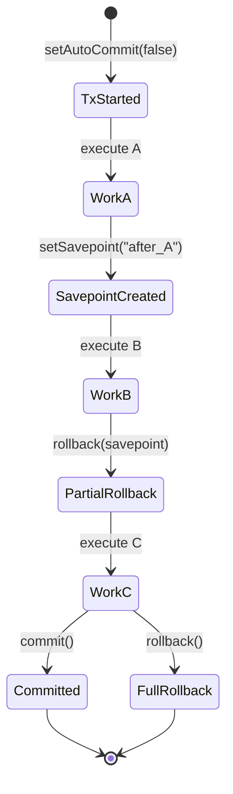
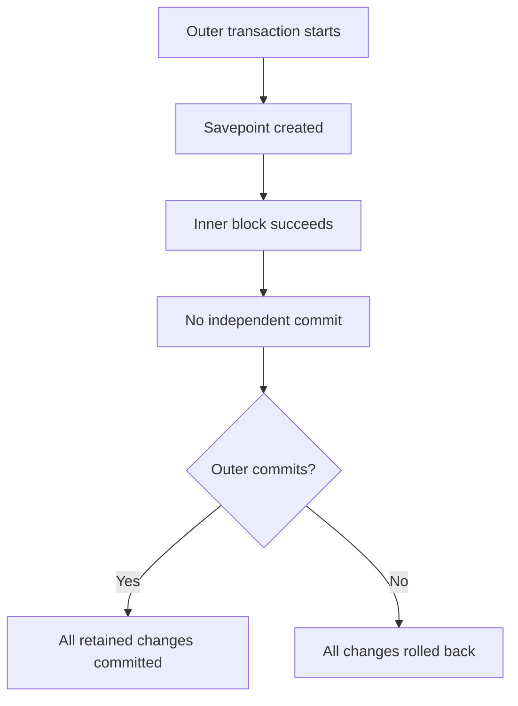
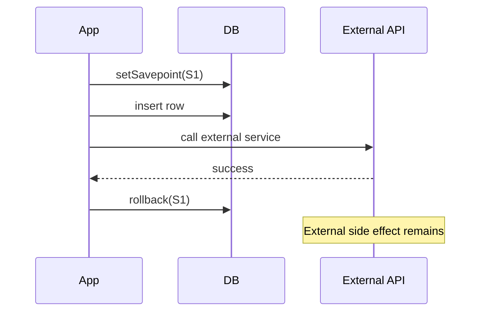
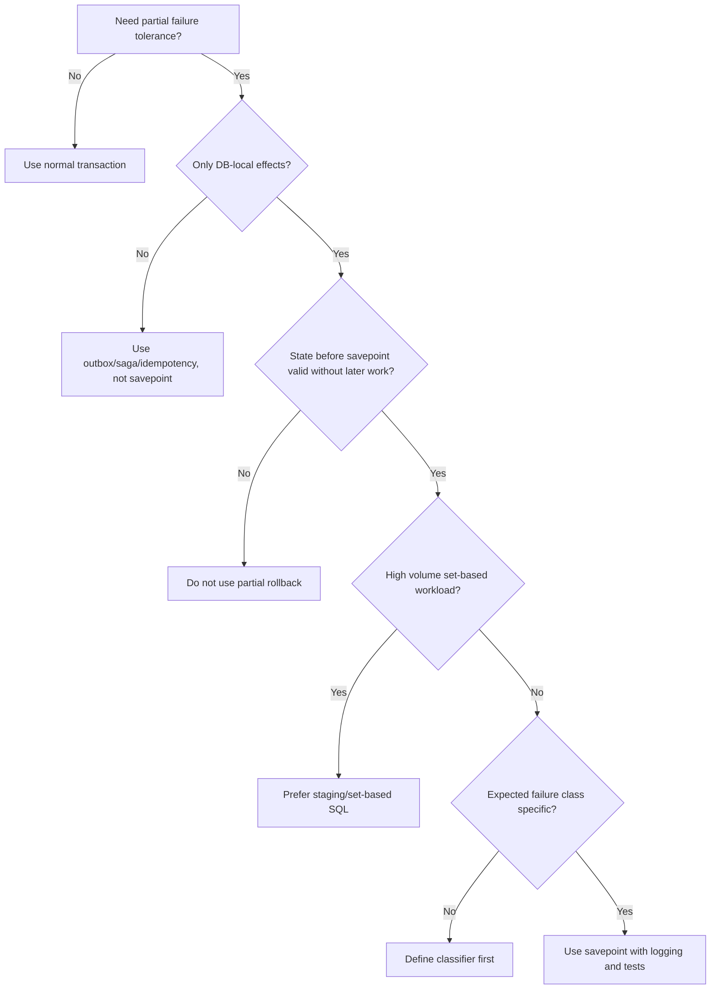

# Part 013 — Savepoints and Partial Rollback

> Target skill: mampu menggunakan JDBC savepoint sebagai alat kontrol transaksi granular, bukan sebagai “transaction nested” palsu yang menyembunyikan boundary design yang buruk.

Di part sebelumnya kita sudah membahas transaction isolation, locking, blocking, deadlock, dan timeout. Sekarang kita masuk ke mekanisme yang lebih halus: **savepoint**.

Savepoint terlihat sederhana:

```java
Savepoint sp = connection.setSavepoint();
connection.rollback(sp);
connection.releaseSavepoint(sp);
```

Namun dalam sistem production, savepoint sering disalahgunakan karena engineer mengira savepoint adalah nested transaction. Itu asumsi yang berbahaya.

Savepoint bukan transaction baru. Savepoint adalah **marker di dalam transaction yang sedang berjalan**. Marker itu memungkinkan sebagian perubahan setelah marker tersebut dibatalkan, sementara perubahan sebelum marker tetap berada di transaction yang sama.

Mental model yang benar:



Jika transaction akhirnya di-`commit`, perubahan yang masih tersisa di dalam transaction menjadi permanen. Jika transaction akhirnya di-`rollback()` penuh, seluruh perubahan dalam transaction dibatalkan, termasuk perubahan sebelum savepoint.

---

## 1. Kaufman Skill Deconstruction

Untuk menguasai savepoint secara efektif, kita pecah skill ini menjadi beberapa sub-skill kecil.

| Sub-skill | Yang harus dikuasai |
|---|---|
| Semantics | Memahami savepoint sebagai marker dalam transaction, bukan nested transaction |
| API usage | Menggunakan `setSavepoint`, `rollback(savepoint)`, dan `releaseSavepoint` dengan benar |
| Failure handling | Menangani error saat rollback partial, release, dan commit akhir |
| Boundary design | Menentukan kapan partial rollback masuk akal dan kapan menandakan desain use case buruk |
| Framework interaction | Memahami konflik savepoint manual dengan transaction manager seperti Spring |
| Observability | Mengetahui bagaimana savepoint memengaruhi debugging transaction panjang |
| Anti-pattern detection | Mengenali savepoint yang dipakai untuk menyembunyikan side effect, retry buruk, atau service boundary kacau |

Tujuan 20 jam pertama untuk topik ini bukan menghafal API. Tujuannya adalah mampu menjawab:

1. **Apa yang boleh dibatalkan sebagian?**
2. **Apa yang harus tetap atomic?**
3. **Apa konsekuensi lock, timeout, dan data consistency-nya?**
4. **Apakah savepoint menyederhanakan sistem, atau justru menyembunyikan desain transaksi yang salah?**

---

## 2. Mental Model: Transaction Timeline

Bayangkan transaction sebagai timeline linear.

```txt
BEGIN
  A1
  A2
  SAVEPOINT S1
  B1
  B2
  SAVEPOINT S2
  C1
  C2
COMMIT
```

Jika kita melakukan:

```java
connection.rollback(s2);
```

Maka `C1` dan `C2` dibatalkan, tetapi `A1`, `A2`, `B1`, dan `B2` tetap ada dalam transaction.

Jika setelah itu kita melakukan:

```java
connection.rollback(s1);
```

Maka `B1`, `B2`, dan semua perubahan setelah `S1` dibatalkan. `A1` dan `A2` masih tersisa.

Jika akhirnya:

```java
connection.commit();
```

Maka hanya perubahan yang tersisa yang commit.

Jika akhirnya:

```java
connection.rollback();
```

Maka semua perubahan sejak awal transaction dibatalkan.

Ini berarti savepoint punya dua sifat penting:

1. **Local undo**: rollback ke savepoint hanya menghapus perubahan setelah marker.
2. **Global dependency**: semua perubahan tetap bergantung pada commit/rollback akhir transaction.

---

## 3. JDBC Savepoint API

JDBC menyediakan interface `java.sql.Savepoint` dan method terkait di `Connection`.

API utama:

```java
Savepoint setSavepoint() throws SQLException;
Savepoint setSavepoint(String name) throws SQLException;
void rollback(Savepoint savepoint) throws SQLException;
void releaseSavepoint(Savepoint savepoint) throws SQLException;
```

`Savepoint` sendiri menyediakan:

```java
int getSavepointId() throws SQLException;
String getSavepointName() throws SQLException;
```

Ada dua jenis savepoint:

| Jenis | Dibuat dengan | Identitas |
|---|---|---|
| Unnamed savepoint | `setSavepoint()` | ID dari driver/database |
| Named savepoint | `setSavepoint("name")` | Nama yang kita berikan |

Contoh paling dasar:

```java
connection.setAutoCommit(false);

try {
    insertOrder(connection, order);

    Savepoint afterOrder = connection.setSavepoint("after_order");

    try {
        insertOptionalAuditDetails(connection, order);
    } catch (SQLException auditFailure) {
        connection.rollback(afterOrder);
    } finally {
        tryRelease(connection, afterOrder);
    }

    connection.commit();
} catch (SQLException e) {
    safeRollback(connection, e);
    throw e;
} finally {
    connection.setAutoCommit(true);
}
```

Perhatikan struktur di atas. Savepoint hanya dipakai untuk operasi opsional. Jika operasi utama gagal, transaction tetap rollback penuh.

---

## 4. Savepoint Is Not Nested Transaction

Ini poin paling penting.

Nested transaction berarti transaction child bisa commit/rollback secara independen terhadap parent. Savepoint tidak seperti itu.



Savepoint tidak punya `commit(savepoint)`. Yang ada hanya:

- rollback ke savepoint
- release savepoint
- commit seluruh transaction
- rollback seluruh transaction

Jadi, jangan membuat mental model seperti ini:

```txt
outer transaction
  inner transaction A commits
  inner transaction B rolls back
outer transaction commits
```

Yang benar:

```txt
one transaction
  marker A
  optional work
  maybe rollback to marker A
one final commit/rollback
```

---

## 5. Invariant Savepoint

Gunakan invariant berikut saat membaca atau menulis code dengan savepoint.

### Invariant 1 — Savepoint hanya valid dalam transaction aktif

Savepoint meaningful ketika auto-commit off dan transaction sedang berjalan.

```java
connection.setAutoCommit(false);
Savepoint sp = connection.setSavepoint();
```

Jika auto-commit true, setiap statement biasanya commit sendiri. Savepoint menjadi tidak masuk akal atau bisa ditolak oleh driver/database.

### Invariant 2 — Rollback ke savepoint tidak mengakhiri transaction

Setelah:

```java
connection.rollback(sp);
```

Transaction masih aktif. Kita masih harus memilih:

```java
connection.commit();
// atau
connection.rollback();
```

### Invariant 3 — Savepoint tidak menghapus lock secara universal seperti full rollback

Beberapa lock yang diperoleh setelah savepoint dapat dilepas setelah rollback ke savepoint, tetapi behavior detail bisa bergantung database engine. Jangan mendesain correctness dengan asumsi lock release granular tanpa verifikasi database spesifik.

### Invariant 4 — Savepoint tidak membatalkan side effect eksternal

Jika setelah savepoint kita melakukan:

- kirim email
- publish Kafka message
- call external API
- tulis file
- panggil payment gateway

Rollback ke savepoint tidak membatalkan semua itu.



Ini alasan savepoint harus dibatasi untuk efek yang benar-benar berada di bawah transaction database yang sama.

---

## 6. Good Use Cases

Savepoint bukan fitur harian untuk semua operasi. Ia berguna untuk kasus tertentu.

### 6.1 Optional sub-operation inside one use case

Contoh: operasi utama harus berhasil, tetapi detail non-kritis boleh gagal.

```java
connection.setAutoCommit(false);

try {
    createCase(connection, command);

    Savepoint beforeOptionalEnrichment = connection.setSavepoint("before_optional_enrichment");

    try {
        insertDerivedSearchTokens(connection, command);
    } catch (SQLException e) {
        connection.rollback(beforeOptionalEnrichment);
        log.warn("Search token enrichment failed, continuing without enrichment", e);
    } finally {
        releaseQuietly(connection, beforeOptionalEnrichment);
    }

    connection.commit();
} catch (SQLException e) {
    rollbackQuietly(connection);
    throw e;
}
```

Syarat agar ini valid:

- data utama tetap valid tanpa enrichment
- enrichment bisa dibangun ulang nanti
- failure enrichment tidak boleh membuat state utama ambiguous
- observability mencatat bahwa enrichment gagal

### 6.2 Bulk import dengan row-level tolerance

Misalnya import 10.000 baris. Kita ingin transaction chunk tetap commit, tetapi baris invalid dilewati.

```java
connection.setAutoCommit(false);

int success = 0;
int failed = 0;

try {
    for (ImportRow row : rows) {
        Savepoint beforeRow = connection.setSavepoint();
        try {
            insertImportedRow(connection, row);
            success++;
        } catch (SQLException e) {
            connection.rollback(beforeRow);
            failed++;
            recordRejectedRow(row, e);
        } finally {
            releaseQuietly(connection, beforeRow);
        }
    }

    connection.commit();
} catch (SQLException e) {
    rollbackQuietly(connection);
    throw e;
}
```

Namun ini harus dievaluasi hati-hati. Savepoint per row bisa mahal. Untuk volume tinggi, strategi yang sering lebih baik:

- validasi sebelum insert
- staging table
- bulk load
- rejected rows table
- chunked transaction
- constraint-driven validation

Savepoint per row berguna saat correctness lebih penting dari throughput, atau volume cukup kecil.

### 6.3 Fallback strategy dalam satu transaction

Contoh: coba insert path baru, jika gagal karena constraint tertentu, fallback ke update.

```java
Savepoint beforePreferredPath = connection.setSavepoint("before_preferred_path");

try {
    insertPreferredRepresentation(connection, entity);
} catch (SQLException e) {
    if (isDuplicateKey(e)) {
        connection.rollback(beforePreferredPath);
        updateExistingRepresentation(connection, entity);
    } else {
        throw e;
    }
} finally {
    releaseQuietly(connection, beforePreferredPath);
}
```

Tetapi untuk upsert, database-native UPSERT biasanya lebih baik:

- PostgreSQL: `INSERT ... ON CONFLICT ...`
- MySQL: `INSERT ... ON DUPLICATE KEY UPDATE`
- SQL Server/Oracle: perlu desain hati-hati terhadap `MERGE` semantics dan race condition

Savepoint fallback lebih cocok saat fallback path tidak bisa diekspresikan aman sebagai satu SQL statement.

---

## 7. Bad Use Cases

### 7.1 Menutupi transaction boundary yang salah

Code seperti ini biasanya bau desain:

```java
void processLargeWorkflow(Connection connection) throws SQLException {
    Savepoint s1 = connection.setSavepoint("user");
    createUser(connection);

    Savepoint s2 = connection.setSavepoint("billing");
    createBillingProfile(connection);

    Savepoint s3 = connection.setSavepoint("notification");
    createNotificationRecord(connection);

    // Banyak conditional rollback di sini...
}
```

Pertanyaan yang harus diajukan:

- Apakah semua operasi benar-benar harus dalam satu transaction?
- Apakah ada aggregate boundary yang berbeda?
- Apakah ada external side effect?
- Apakah workflow seharusnya saga/process manager, bukan satu transaction panjang?
- Apakah compensating action lebih tepat?

Savepoint yang terlalu banyak biasanya menandakan transaction melakukan terlalu banyak tanggung jawab.

### 7.2 Menggunakan savepoint untuk retry tanpa idempotency

Ini berbahaya:

```java
Savepoint sp = connection.setSavepoint();
try {
    chargeCustomerSomehow(); // external side effect
    insertPaymentRecord(connection);
} catch (Exception e) {
    connection.rollback(sp);
    retry();
}
```

Rollback database tidak menghapus charge yang sudah terjadi.

### 7.3 Membungkus setiap DAO dengan savepoint

Misalnya setiap repository method otomatis membuat savepoint agar “aman”. Ini biasanya salah.

```java
class UserRepository {
    void save(Connection c, User user) throws SQLException {
        Savepoint sp = c.setSavepoint();
        try {
            // insert/update
        } catch (SQLException e) {
            c.rollback(sp);
            throw e;
        }
    }
}
```

Repository tidak seharusnya diam-diam menentukan partial rollback policy. Itu keputusan use-case/service layer.

### 7.4 Savepoint sebagai pengganti validasi input

Jika invalid data bisa dideteksi sebelum write, lakukan sebelum write.

Savepoint bukan excuse untuk:

- tidak validasi command
- tidak memahami constraint
- tidak membuat domain invariant eksplisit
- tidak mendesain schema dengan benar

---

## 8. Named vs Unnamed Savepoints

### Unnamed savepoint

```java
Savepoint sp = connection.setSavepoint();
```

Kelebihan:

- sederhana
- tidak perlu naming convention
- cocok untuk local block pendek

Kekurangan:

- kurang informatif untuk debugging
- ID generated oleh driver/database

### Named savepoint

```java
Savepoint sp = connection.setSavepoint("before_optional_audit_insert");
```

Kelebihan:

- lebih readable
- membantu log dan debugging
- cocok untuk use case kompleks

Kekurangan:

- nama harus unik/cukup deskriptif
- beberapa database punya aturan identifier/naming tertentu
- jangan masukkan user input sebagai nama savepoint

Rule praktis:

- Untuk helper internal kecil: unnamed cukup.
- Untuk workflow yang ingin diobservasi: named savepoint lebih baik.

---

## 9. Release Savepoint

`releaseSavepoint(savepoint)` memberi sinyal bahwa savepoint tidak lagi dibutuhkan.

```java
Savepoint sp = connection.setSavepoint("before_optional_step");
try {
    optionalStep(connection);
} catch (SQLException e) {
    connection.rollback(sp);
} finally {
    releaseQuietly(connection, sp);
}
```

Helper aman:

```java
static void releaseQuietly(Connection connection, Savepoint savepoint) {
    if (savepoint == null) {
        return;
    }

    try {
        connection.releaseSavepoint(savepoint);
    } catch (SQLException ignored) {
        // Savepoint may already be invalid after rollback/commit depending on DB/driver.
        // Do not hide the original failure because release failed.
    }
}
```

Kenapa `releaseQuietly` tidak melempar exception?

Karena release failure biasanya bukan failure utama. Jika release savepoint gagal di `finally`, kita tidak ingin menimpa exception asli dari operasi bisnis.

Namun jangan selalu ignore tanpa observability. Pada code production, minimal lakukan debug log jika release gagal sering terjadi.

---

## 10. Failure Handling Semantics

Savepoint memperkenalkan failure path baru.

### 10.1 Operation fails, rollback to savepoint succeeds

Ini path ideal.

```java
Savepoint sp = connection.setSavepoint();
try {
    optionalWork(connection);
} catch (SQLException e) {
    connection.rollback(sp);
    log.warn("Optional work rolled back", e);
}
```

Transaction masih dapat dilanjutkan.

### 10.2 Operation fails, rollback to savepoint fails

Ini path serius.

```java
Savepoint sp = connection.setSavepoint();
try {
    optionalWork(connection);
} catch (SQLException original) {
    try {
        connection.rollback(sp);
    } catch (SQLException rollbackFailure) {
        original.addSuppressed(rollbackFailure);
        throw original;
    }
}
```

Jika rollback ke savepoint gagal, kita tidak lagi tahu kondisi transaction dengan aman. Biasanya pilihan paling aman adalah full rollback transaction.

```java
catch (SQLException original) {
    try {
        connection.rollback(sp);
    } catch (SQLException rollbackToSavepointFailure) {
        original.addSuppressed(rollbackToSavepointFailure);
        rollbackQuietly(connection);
        throw original;
    }
}
```

### 10.3 Commit akhir gagal setelah partial rollback sukses

Partial rollback sukses bukan jaminan transaction commit sukses.

Commit akhir masih bisa gagal karena:

- connection/network failure
- serialization failure
- deadlock detected late
- database crash/failover
- deferred constraint
- timeout

Jika commit gagal, hasilnya bisa ambigu. Ini akan dibahas lebih dalam di part retry/idempotency, tetapi rule awalnya:

> Jangan retry transaction yang menghasilkan side effect kecuali operation idempotent dan punya deduplication guard.

---

## 11. A Reusable Savepoint Helper

Untuk code JDBC manual, kita bisa membuat helper yang eksplisit.

```java
@FunctionalInterface
interface SqlRunnable {
    void run() throws SQLException;
}

public final class JdbcSavepoints {
    private JdbcSavepoints() {}

    public static boolean tryOptional(
            Connection connection,
            String savepointName,
            SqlRunnable operation
    ) throws SQLException {
        Savepoint savepoint = connection.setSavepoint(savepointName);
        try {
            operation.run();
            return true;
        } catch (SQLException operationFailure) {
            try {
                connection.rollback(savepoint);
                return false;
            } catch (SQLException rollbackFailure) {
                operationFailure.addSuppressed(rollbackFailure);
                throw operationFailure;
            }
        } finally {
            releaseQuietly(connection, savepoint);
        }
    }

    private static void releaseQuietly(Connection connection, Savepoint savepoint) {
        try {
            connection.releaseSavepoint(savepoint);
        } catch (SQLException ignored) {
            // keep original exception path clean
        }
    }
}
```

Usage:

```java
boolean auditInserted = JdbcSavepoints.tryOptional(
        connection,
        "before_audit_insert",
        () -> insertAuditDetail(connection, command)
);

if (!auditInserted) {
    log.warn("Audit detail insert skipped for commandId={}", command.id());
}
```

Namun helper ini harus dipakai hati-hati. Jangan membuat savepoint invisible. Nama method `tryOptional` sengaja eksplisit agar pembaca tahu bahwa operasi boleh gagal.

---

## 12. Savepoint and Domain Semantics

Savepoint harus mengikuti domain semantics, bukan sekadar technical convenience.

Pertanyaan domain:

| Pertanyaan | Dampak |
|---|---|
| Apakah data sebelum savepoint valid tanpa data setelahnya? | Jika tidak, partial rollback invalid |
| Apakah step setelah savepoint bisa direkonsiliasi nanti? | Jika ya, savepoint mungkin valid |
| Apakah failure harus terlihat ke user/operator? | Jika ya, log/metric/event diperlukan |
| Apakah rollback partial mengubah invariant aggregate? | Jika ya, jangan gunakan savepoint |
| Apakah side effect eksternal terjadi setelah savepoint? | Jika ya, rollback partial tidak cukup |

Contoh regulatory/case-management domain:

- Membuat enforcement case utama: wajib.
- Membuat derived search index dalam table internal: optional, bisa rebuild.
- Membuat audit event legal: mungkin wajib, tidak boleh silent skip.
- Mengirim notification email: external side effect, jangan bergantung pada savepoint.

Jadi desain yang baik:

```txt
Transaction:
  create case
  create required audit row
  optionally create derived internal projection with savepoint
Commit
After commit:
  publish outbox event
  send notification asynchronously
```

---

## 13. Savepoint with Constraints

Savepoint sering digunakan bersama constraint violation.

Contoh: proses import yang ingin skip duplicate row.

```java
Savepoint beforeRow = connection.setSavepoint();
try {
    insertRow(connection, row);
} catch (SQLException e) {
    if (isUniqueViolation(e)) {
        connection.rollback(beforeRow);
        recordDuplicate(row);
    } else {
        throw e;
    }
} finally {
    releaseQuietly(connection, beforeRow);
}
```

Pastikan classifier exception spesifik.

Jangan lakukan ini:

```java
catch (SQLException e) {
    connection.rollback(beforeRow);
    recordRejected(row);
}
```

Itu terlalu luas. Bisa saja error-nya:

- connection lost
- disk full
- permission denied
- syntax error
- deadlock
- lock timeout
- schema mismatch

Semua itu tidak boleh diperlakukan sebagai “row rejected” biasa.

Pattern yang benar:

```java
catch (SQLException e) {
    if (isExpectedRowLevelViolation(e)) {
        connection.rollback(beforeRow);
        recordRejected(row, e);
    } else {
        throw e;
    }
}
```

---

## 14. Savepoint in Bulk Import

Ada tiga model import umum.

### Model A — Fail-fast transaction

```txt
begin
  insert row 1
  insert row 2
  insert row 3 fails
rollback all
```

Gunakan jika semua rows harus valid sebagai satu unit.

### Model B — Savepoint per row

```txt
begin
  savepoint row1
  insert row1 ok
  savepoint row2
  insert row2 fails
  rollback to row2
  savepoint row3
  insert row3 ok
commit successful rows
```

Gunakan jika:

- rows independen
- volume sedang
- ingin atomic per row di dalam chunk
- duplicate/invalid row expected

### Model C — Staging table + set-based validation

```txt
load raw rows into staging
run validation queries
insert valid rows with set-based SQL
record invalid rows
commit chunk
```

Gunakan untuk volume besar.

Rule engineering:

> Jika import volume besar dan rule bisa diekspresikan sebagai SQL set operation, staging table biasanya lebih baik daripada savepoint per row.

---

## 15. Savepoint and Locks

Savepoint dapat mempersingkat dampak sebagian operasi gagal, tetapi bukan alat utama untuk lock management.

Contoh buruk:

```java
connection.setAutoCommit(false);

Savepoint sp = connection.setSavepoint();
selectForUpdateManyRows(connection);
try {
    updateRows(connection);
} catch (SQLException e) {
    connection.rollback(sp);
}

// transaction tetap dibuka lama
callMoreDatabaseWork(connection);
connection.commit();
```

Masalahnya bukan hanya rollback partial. Masalahnya transaction tetap panjang dan mungkin tetap memegang lock penting.

Untuk lock-heavy workload, optimasi yang sering lebih benar:

- kecilkan transaction scope
- pakai deterministic lock ordering
- pakai optimistic locking
- pakai chunking
- pakai `SELECT ... FOR UPDATE SKIP LOCKED` jika cocok
- hindari user/external wait dalam transaction

---

## 16. Savepoint and Auto-Commit

Savepoint harus dipakai dengan auto-commit disabled.

Pattern:

```java
boolean oldAutoCommit = connection.getAutoCommit();
try {
    connection.setAutoCommit(false);
    // work with savepoints
    connection.commit();
} catch (SQLException e) {
    rollbackQuietly(connection);
    throw e;
} finally {
    connection.setAutoCommit(oldAutoCommit);
}
```

Namun dalam aplikasi dengan connection pool, lebih baik transaction runner yang mengatur state ini, bukan setiap method bebas mengubah auto-commit.

```java
public final class TransactionRunner {
    private final DataSource dataSource;

    public TransactionRunner(DataSource dataSource) {
        this.dataSource = dataSource;
    }

    public <T> T inTransaction(SqlFunction<Connection, T> callback) throws SQLException {
        try (Connection connection = dataSource.getConnection()) {
            boolean oldAutoCommit = connection.getAutoCommit();
            try {
                connection.setAutoCommit(false);
                T result = callback.apply(connection);
                connection.commit();
                return result;
            } catch (SQLException | RuntimeException e) {
                rollbackQuietly(connection, e);
                throw e;
            } finally {
                connection.setAutoCommit(oldAutoCommit);
            }
        }
    }
}
```

Savepoint usage lalu terjadi di callback, dengan transaction ownership jelas.

---

## 17. Savepoint and Spring Transaction Management

Jika memakai Spring, jangan sembarang memanggil savepoint manual pada connection yang dikelola Spring tanpa memahami transaction manager.

Spring transaction biasanya mengikat connection ke thread. Jika kita mengambil connection langsung dari `DataSource` di dalam method `@Transactional`, kita bisa tidak mendapatkan connection yang sama kecuali melalui utility/framework yang benar.

Prinsipnya:

- Transaction manager harus menjadi owner transaction boundary.
- Repository tidak boleh membuat transaction sendiri.
- Savepoint manual harus konsisten dengan transaction manager.
- Nested transaction behavior di Spring dapat menggunakan savepoint untuk JDBC transaction manager, tetapi semantics-nya tetap bukan nested physical transaction independen.

Untuk series ini, Spring akan dibahas khusus di part 022. Untuk sekarang, rule-nya:

> Jika transaction dikelola framework, gunakan mekanisme framework untuk nested/partial rollback, atau pastikan connection yang dipakai adalah connection transaction-bound yang sama.

---

## 18. Savepoint Naming Convention

Untuk named savepoint, gunakan nama yang menjelaskan boundary, bukan implementasi random.

Baik:

```txt
before_optional_projection_insert
before_row_import
before_duplicate_fallback
before_enrichment
```

Buruk:

```txt
sp1
step2
rollback_here
foo
```

Jangan pakai user input:

```java
connection.setSavepoint(userProvidedName); // avoid
```

Alasan:

- potensi invalid identifier
- log noise
- susah korelasi
- database-specific escaping

---

## 19. Observability for Savepoint Usage

Savepoint failure yang di-skip diam-diam adalah technical debt.

Minimal capture:

- savepoint name
- operation name
- command/request id
- exception SQLState/vendor code
- apakah rollback partial berhasil
- apakah transaction commit akhir berhasil
- jumlah row skipped/rejected untuk bulk process

Contoh metric:

```txt
jdbc.savepoint.rollback.count{operation="import_row", reason="duplicate_key"}
jdbc.savepoint.rollback.failure.count{operation="optional_projection"}
jdbc.import.rejected_rows{reason="constraint_violation"}
```

Structured log:

```java
log.warn(
    "Optional JDBC step rolled back to savepoint operation={} savepoint={} sqlState={} vendorCode={} commandId={}",
    operationName,
    savepointName,
    e.getSQLState(),
    e.getErrorCode(),
    commandId,
    e
);
```

---

## 20. Testing Savepoint Behavior

Unit test tidak cukup. Savepoint behavior harus dites dengan database nyata untuk database target.

### 20.1 Test partial rollback

```java
@Test
void rollbackToSavepointKeepsEarlierChanges() throws Exception {
    try (Connection c = dataSource.getConnection()) {
        c.setAutoCommit(false);

        insertAccount(c, "A");
        Savepoint sp = c.setSavepoint("after_a");
        insertAccount(c, "B");

        c.rollback(sp);
        c.commit();
    }

    assertThat(findAccount("A")).isPresent();
    assertThat(findAccount("B")).isEmpty();
}
```

### 20.2 Test full rollback after savepoint

```java
@Test
void fullRollbackRemovesChangesBeforeAndAfterSavepoint() throws Exception {
    try (Connection c = dataSource.getConnection()) {
        c.setAutoCommit(false);

        insertAccount(c, "A");
        Savepoint sp = c.setSavepoint();
        insertAccount(c, "B");
        c.rollback(sp);
        c.rollback();
    }

    assertThat(findAccount("A")).isEmpty();
    assertThat(findAccount("B")).isEmpty();
}
```

### 20.3 Test expected violation only

```java
@Test
void duplicateRowCanBeSkippedButSyntaxErrorCannot() {
    // duplicate key should be classified as row-level expected violation
    // syntax error should fail the whole transaction
}
```

---

## 21. Code Review Checklist

Saat melihat savepoint di pull request, tanyakan:

- Apakah transaction owner jelas?
- Apakah auto-commit dipastikan false?
- Apakah savepoint hanya dipakai untuk DB-local effect?
- Apakah rollback partial tidak melanggar domain invariant?
- Apakah exception classifier spesifik?
- Apakah rollback-to-savepoint failure ditangani?
- Apakah release savepoint tidak menimpa exception asli?
- Apakah ada observability untuk partial rollback?
- Apakah volume operasi membuat savepoint per row mahal?
- Apakah staging/upsert/set-based SQL lebih tepat?
- Apakah framework transaction manager sedang aktif?

---

## 22. Common Anti-Patterns

| Anti-pattern | Kenapa buruk | Alternatif |
|---|---|---|
| Savepoint dianggap nested transaction | Commit tetap hanya di transaction luar | Desain boundary transaction eksplisit |
| Savepoint setelah external API call | Rollback DB tidak membatalkan side effect | Outbox/saga/idempotency |
| Catch semua `SQLException` lalu skip row | Menyembunyikan failure serius | Classify SQLState/vendor code |
| Savepoint per DAO method | Repository mengambil policy transaction | Service/use-case transaction boundary |
| Savepoint per row untuk import besar | Overhead tinggi | Staging table/set-based validation |
| Tidak release savepoint | Resource tidak jelas | `finally releaseQuietly` |
| Savepoint tanpa metric/log | Silent data degradation | Structured observability |
| Mengubah auto-commit sembarangan | State leak ke pool | Transaction runner/framework |

---

## 23. Production Decision Framework

Gunakan flow berikut.



---

## 24. Mini Capstone

Implementasikan import chunk dengan requirement berikut:

- Satu chunk berisi maksimal 500 rows.
- Transaction per chunk.
- Duplicate key harus direkam sebagai rejected row, bukan menggagalkan chunk.
- Syntax error atau connection failure harus menggagalkan seluruh chunk.
- Partial rollback harus menggunakan savepoint per row.
- Metrics harus mencatat success/rejected/fatal.
- Commit dilakukan hanya setelah semua row diproses.

Skeleton:

```java
public ImportResult importChunk(List<ImportRow> rows) throws SQLException {
    try (Connection c = dataSource.getConnection()) {
        c.setAutoCommit(false);
        ImportResult result = new ImportResult();

        try {
            for (ImportRow row : rows) {
                Savepoint sp = c.setSavepoint();
                try {
                    insertRow(c, row);
                    result.success++;
                } catch (SQLException e) {
                    if (isDuplicateKey(e)) {
                        c.rollback(sp);
                        result.rejected++;
                        recordRejected(c, row, e);
                    } else {
                        throw e;
                    }
                } finally {
                    releaseQuietly(c, sp);
                }
            }

            c.commit();
            return result;
        } catch (SQLException e) {
            rollbackQuietly(c, e);
            throw e;
        }
    }
}
```

Refinement yang harus kamu pikirkan:

- Apakah `recordRejected` harus ikut transaction yang sama?
- Jika `recordRejected` gagal, apakah row duplicate tetap boleh dianggap rejected?
- Apakah duplicate key classifier berbeda untuk PostgreSQL/MySQL/Oracle?
- Apakah savepoint per row acceptable untuk volume real?
- Apakah rejected row lebih baik disimpan di staging table?

---

## 25. Summary

Savepoint adalah alat yang berguna, tetapi sempit.

Pegangan utama:

1. Savepoint adalah marker dalam transaction, bukan nested transaction.
2. Rollback ke savepoint tidak mengakhiri transaction.
3. Commit/rollback akhir tetap menentukan nasib semua perubahan yang tersisa.
4. Savepoint hanya membatalkan efek database dalam transaction yang sama.
5. Savepoint tidak membatalkan external side effect.
6. Savepoint harus mengikuti domain invariant.
7. Untuk bulk besar, staging/set-based processing sering lebih baik.
8. Jika rollback ke savepoint gagal, transaction harus dianggap tidak aman dan biasanya perlu full rollback.
9. Jika framework mengelola transaction, jangan bypass framework sembarangan.
10. Savepoint yang benar selalu punya observability dan test dengan database nyata.

Di part berikutnya, kita akan menutup blok transaksi manual dengan **connection management patterns without frameworks**: bagaimana merancang DAO/repository/transaction runner yang bersih, testable, dan aman tanpa bergantung pada Spring atau ORM.

---

## References

- Oracle Java SE 25 — `java.sql.Connection`: https://docs.oracle.com/en/java/javase/25/docs/api/java.sql/java/sql/Connection.html
- Oracle Java SE 8 — `java.sql.Savepoint`: https://docs.oracle.com/javase/8/docs/api/java/sql/Savepoint.html
- Oracle Java SE 25 — `java.sql.SQLException`: https://docs.oracle.com/en/java/javase/25/docs/api/java.sql/java/sql/SQLException.html
