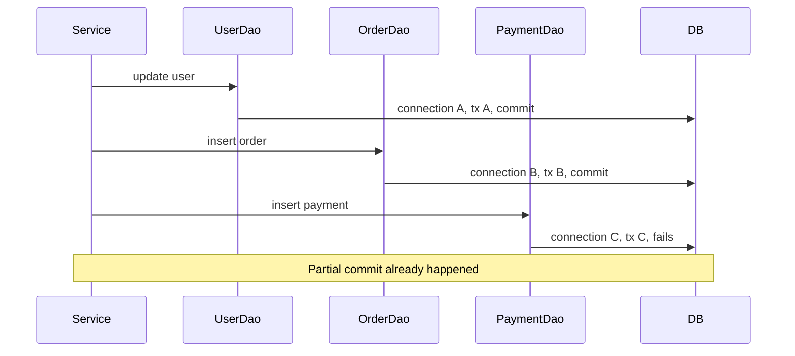
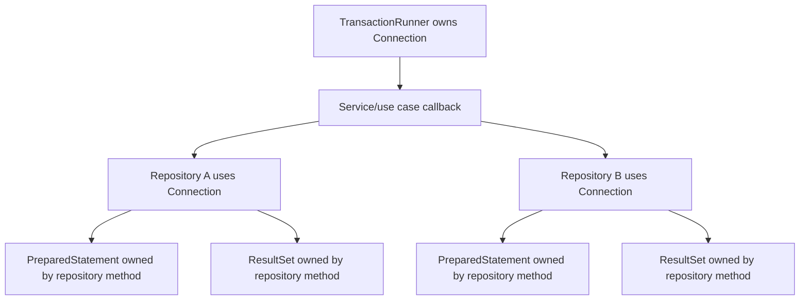
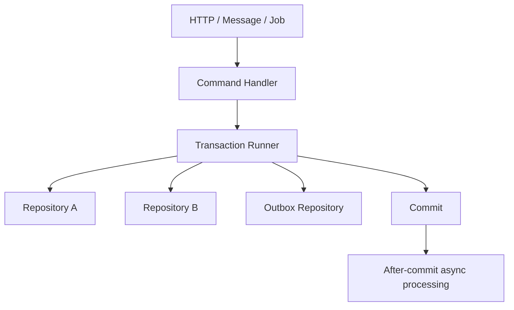
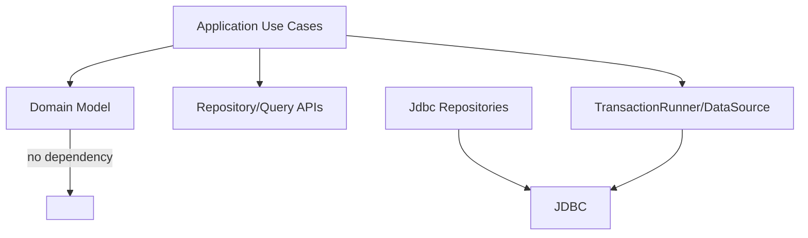

# Part 014 — Connection Management Patterns Without Frameworks

> Target skill: mampu menulis JDBC manual yang bersih, aman, testable, dan production-grade tanpa bergantung pada Spring, JPA, atau framework transaction manager.

Banyak engineer belajar JDBC dari contoh sederhana:

```java
try (Connection c = DriverManager.getConnection(url, user, password);
     PreparedStatement ps = c.prepareStatement("select * from users where id = ?")) {
    ps.setLong(1, id);
    try (ResultSet rs = ps.executeQuery()) {
        // map result
    }
}
```

Contoh ini valid untuk demo, tetapi belum cukup untuk production.

Masalah production bukan hanya “bagaimana query jalan”, melainkan:

- siapa owner connection?
- siapa owner transaction?
- kapan connection di-close?
- apakah repository boleh commit?
- bagaimana beberapa repository ikut transaction yang sama?
- bagaimana exception diterjemahkan?
- bagaimana timeout dan rollback diatur?
- bagaimana test integration dibuat tanpa global state?
- bagaimana mencegah connection leak?

Part ini membangun pola connection management tanpa framework. Ini penting bahkan jika nanti memakai Spring, karena Spring transaction management sebenarnya mengotomasi pola-pola yang sama.

---

## 1. The Core Problem

JDBC memberi API level rendah. Ia tidak memaksa arsitektur.

Kita bisa menulis code seperti ini:

```java
class UserDao {
    User findById(long id) throws SQLException {
        try (Connection c = DriverManager.getConnection(url, user, password)) {
            // query
        }
    }
}
```

Dan ini:

```java
class OrderService {
    void placeOrder(Command command) throws SQLException {
        userDao.updateUser(...);
        orderDao.insertOrder(...);
        paymentDao.insertPayment(...);
    }
}
```

Tetapi jika setiap DAO membuka connection sendiri, kita tidak punya satu transaction untuk use case tersebut.



Ini bukan transaction per use case. Ini kumpulan transaction kecil yang kebetulan dipanggil berurutan.

Untuk code production, kita butuh pemisahan yang jelas:

| Concern | Owner yang benar |
|---|---|
| Mendapatkan connection | Connection provider / DataSource layer |
| Membuka transaction | Transaction runner / service boundary |
| Commit/rollback | Transaction owner |
| Menjalankan SQL | DAO/repository |
| Mapping row | Mapper |
| Translasi error | Boundary adapter |
| Menutup resource statement/result set | DAO/repository method |
| Menutup connection | Transaction runner / connection owner |

---

## 2. The Golden Rule

> Method yang menerima `Connection` sebagai parameter tidak boleh menutup connection itu, tidak boleh commit, dan tidak boleh rollback kecuali kontraknya secara eksplisit mengatakan ia adalah transaction owner.

Ini rule utama untuk JDBC manual.

Contoh repository yang benar:

```java
final class AccountRepository {
    Account findById(Connection c, long id) throws SQLException {
        String sql = """
                select id, owner_name, balance
                from account
                where id = ?
                """;

        try (PreparedStatement ps = c.prepareStatement(sql)) {
            ps.setLong(1, id);
            try (ResultSet rs = ps.executeQuery()) {
                if (!rs.next()) {
                    return null;
                }
                return mapAccount(rs);
            }
        }
    }
}
```

Repository ini:

- menggunakan connection yang diberikan
- menutup `PreparedStatement`
- menutup `ResultSet`
- tidak menutup `Connection`
- tidak commit
- tidak rollback
- tidak mengubah auto-commit

Itu membuat repository bisa ikut transaction milik service/use-case.

---

## 3. Resource Ownership Model

JDBC resource ownership harus eksplisit.



Ownership matrix:

| Resource | Created by | Closed by |
|---|---|---|
| `Connection` | transaction runner / connection provider | same owner |
| `PreparedStatement` | repository method | same repository method |
| `ResultSet` | repository method | same repository method |
| `Savepoint` | use-case/helper inside transaction | same block/helper |
| `Blob`/`Clob`/stream | method that opens it | same method or caller by explicit contract |

Code review smell:

```java
void save(Connection c, User user) throws SQLException {
    try (c) { // bad: closes caller-owned connection
        // ...
    }
}
```

Never do this unless the method contract says it owns the connection.

---

## 4. Pattern 1 — Query Method Owns Only Statement and ResultSet

For read-only single query:

```java
public Optional<User> findById(Connection c, long id) throws SQLException {
    String sql = """
            select id, email, display_name, status, created_at
            from app_user
            where id = ?
            """;

    try (PreparedStatement ps = c.prepareStatement(sql)) {
        ps.setLong(1, id);

        try (ResultSet rs = ps.executeQuery()) {
            if (!rs.next()) {
                return Optional.empty();
            }
            return Optional.of(mapUser(rs));
        }
    }
}
```

This method is composable because it does not decide transaction semantics.

Bad version:

```java
public Optional<User> findById(long id) throws SQLException {
    try (Connection c = dataSource.getConnection()) {
        // query
    }
}
```

This is not always wrong. It is acceptable for a simple standalone read where no transaction composition is needed. But if every repository only exposes this style, service-layer transactions become hard.

A better design is often to expose both:

```java
public Optional<User> findById(Connection c, long id) throws SQLException { ... }

public Optional<User> findById(long id) throws SQLException {
    try (Connection c = dataSource.getConnection()) {
        return findById(c, id);
    }
}
```

The first method is composable. The second is convenience.

---

## 5. Pattern 2 — Transaction Runner

A transaction runner centralizes transaction lifecycle.

```java
@FunctionalInterface
public interface SqlFunction<T> {
    T apply(Connection connection) throws SQLException;
}

public final class TransactionRunner {
    private final DataSource dataSource;

    public TransactionRunner(DataSource dataSource) {
        this.dataSource = dataSource;
    }

    public <T> T inTransaction(SqlFunction<T> callback) throws SQLException {
        try (Connection c = dataSource.getConnection()) {
            boolean oldAutoCommit = c.getAutoCommit();

            try {
                c.setAutoCommit(false);
                T result = callback.apply(c);
                c.commit();
                return result;
            } catch (SQLException | RuntimeException e) {
                rollbackQuietly(c, e);
                throw e;
            } finally {
                restoreAutoCommit(c, oldAutoCommit);
            }
        }
    }

    private static void rollbackQuietly(Connection c, Exception original) {
        try {
            c.rollback();
        } catch (SQLException rollbackFailure) {
            original.addSuppressed(rollbackFailure);
        }
    }

    private static void restoreAutoCommit(Connection c, boolean oldAutoCommit) throws SQLException {
        if (c.getAutoCommit() != oldAutoCommit) {
            c.setAutoCommit(oldAutoCommit);
        }
    }
}
```

Usage:

```java
public void transferMoney(TransferCommand command) throws SQLException {
    tx.inTransaction(c -> {
        Account from = accounts.findByIdForUpdate(c, command.fromAccountId())
                .orElseThrow();
        Account to = accounts.findByIdForUpdate(c, command.toAccountId())
                .orElseThrow();

        from.withdraw(command.amount());
        to.deposit(command.amount());

        accounts.updateBalance(c, from.id(), from.balance());
        accounts.updateBalance(c, to.id(), to.balance());

        ledger.insertEntry(c, command);
        return null;
    });
}
```

Benefit:

- one connection
- one transaction
- one commit/rollback point
- repository stays simple
- no hidden transaction inside DAO

---

## 6. Pattern 3 — Read-Only Connection Runner

Not every operation needs explicit transaction mode. But read-only operations still need consistent connection acquisition and cleanup.

```java
public final class ConnectionRunner {
    private final DataSource dataSource;

    public ConnectionRunner(DataSource dataSource) {
        this.dataSource = dataSource;
    }

    public <T> T withConnection(SqlFunction<T> callback) throws SQLException {
        try (Connection c = dataSource.getConnection()) {
            return callback.apply(c);
        }
    }
}
```

Usage:

```java
public Optional<UserProfile> getProfile(long userId) throws SQLException {
    return connectionRunner.withConnection(c -> {
        Optional<User> user = users.findById(c, userId);
        if (user.isEmpty()) {
            return Optional.empty();
        }
        List<Role> roles = rolesRepository.findByUserId(c, userId);
        return Optional.of(new UserProfile(user.get(), roles));
    });
}
```

This pattern lets multiple reads share one connection without pretending they need a write transaction.

Caveat: if you need repeatable read semantics across multiple queries, you still need explicit transaction with chosen isolation.

---

## 7. Pattern 4 — Unit of Work Without ORM

A manual unit of work is a use-case scoped object that carries the shared connection and repositories.

```java
public final class JdbcUnitOfWork {
    private final Connection connection;
    private final AccountRepository accounts;
    private final LedgerRepository ledger;

    public JdbcUnitOfWork(Connection connection) {
        this.connection = connection;
        this.accounts = new AccountRepository();
        this.ledger = new LedgerRepository();
    }

    public AccountRepository accounts() {
        return accounts;
    }

    public LedgerRepository ledger() {
        return ledger;
    }

    public Connection connection() {
        return connection;
    }
}
```

Runner:

```java
public <T> T inUnitOfWork(SqlUnitFunction<T> callback) throws SQLException {
    return inTransaction(c -> callback.apply(new JdbcUnitOfWork(c)));
}
```

Usage:

```java
public void closeCase(CloseCaseCommand command) throws SQLException {
    tx.inUnitOfWork(uow -> {
        CaseRecord record = uow.cases().findByIdForUpdate(uow.connection(), command.caseId())
                .orElseThrow();

        record.close(command.reason());

        uow.cases().updateStatus(uow.connection(), record);
        uow.audit().insert(uow.connection(), AuditEvent.caseClosed(record.id()));
        uow.outbox().insert(uow.connection(), CaseClosedEvent.from(record));
        return null;
    });
}
```

This becomes useful when use cases touch many repositories and you want to avoid passing raw `Connection` everywhere manually.

But do not over-abstract too early. For smaller systems, passing `Connection` explicitly is clearer.

---

## 8. Pattern 5 — Repository with Explicit Transaction Participation

A repository should make its transaction assumptions visible.

Good:

```java
class CaseRepository {
    Optional<CaseRecord> findById(Connection c, long id) throws SQLException { ... }

    Optional<CaseRecord> findByIdForUpdate(Connection c, long id) throws SQLException { ... }

    void insert(Connection c, CaseRecord record) throws SQLException { ... }

    void updateStatus(Connection c, long id, CaseStatus status) throws SQLException { ... }
}
```

Less good:

```java
class CaseRepository {
    void insert(CaseRecord record) {
        // opens connection, starts transaction, commits
    }
}
```

The second form hides transaction participation.

Naming also matters:

- `findById` means normal read.
- `findByIdForUpdate` means lock-taking read.
- `insert` means write but not transaction owner.
- `saveAndCommit` would be explicit, but usually should not exist in repository.

---

## 9. Pattern 6 — Transaction Script for Use Cases

For many business operations, a transaction script is clearer than over-engineered repository choreography.

```java
public final class ApproveApplicationUseCase {
    private final TransactionRunner tx;
    private final ApplicationRepository applications;
    private final DecisionRepository decisions;
    private final OutboxRepository outbox;

    public void approve(ApproveApplicationCommand command) throws SQLException {
        tx.inTransaction(c -> {
            Application app = applications.findByIdForUpdate(c, command.applicationId())
                    .orElseThrow(() -> new NotFoundException("Application not found"));

            if (!app.canApprove()) {
                throw new IllegalStateException("Application cannot be approved from " + app.status());
            }

            app.approve(command.approvedBy(), command.reason());

            applications.update(c, app);
            decisions.insert(c, Decision.approved(app.id(), command.approvedBy()));
            outbox.insert(c, OutboxEvent.applicationApproved(app.id()));

            return null;
        });
    }
}
```

This is boring in a good way.

The transaction boundary maps to a business command. Repositories are persistence details. Outbox avoids external side effect inside the transaction.

---

## 10. Pattern 7 — Exception Translation Boundary

Raw JDBC throws checked `SQLException`. In application code, you may not want `SQLException` to leak everywhere.

A minimal exception hierarchy:

```java
public class DataAccessException extends RuntimeException {
    public DataAccessException(String message, Throwable cause) {
        super(message, cause);
    }
}

public final class DuplicateKeyDataAccessException extends DataAccessException {
    public DuplicateKeyDataAccessException(String message, Throwable cause) {
        super(message, cause);
    }
}

public final class TransientDataAccessException extends DataAccessException {
    public TransientDataAccessException(String message, Throwable cause) {
        super(message, cause);
    }
}
```

Translator:

```java
public final class SqlExceptionTranslator {
    public DataAccessException translate(String operation, SQLException e) {
        String sqlState = e.getSQLState();

        if (isUniqueViolation(sqlState, e.getErrorCode())) {
            return new DuplicateKeyDataAccessException(operation + " failed: duplicate key", e);
        }

        if (isTransient(sqlState, e)) {
            return new TransientDataAccessException(operation + " failed transiently", e);
        }

        return new DataAccessException(operation + " failed", e);
    }
}
```

At boundary:

```java
public void approve(ApproveApplicationCommand command) {
    try {
        tx.inTransaction(c -> {
            // JDBC work
            return null;
        });
    } catch (SQLException e) {
        throw translator.translate("approve application", e);
    }
}
```

Keep translator close to infrastructure. Domain code should not depend on vendor error codes.

---

## 11. Pattern 8 — Query Object for Complex Reads

For complex reporting/query use cases, avoid placing huge SQL strings randomly inside service methods.

```java
public final class CaseSearchQuery {
    public List<CaseSearchRow> execute(Connection c, CaseSearchCriteria criteria) throws SQLException {
        SqlBuilder sql = buildSql(criteria);

        try (PreparedStatement ps = c.prepareStatement(sql.text())) {
            sql.bind(ps);
            try (ResultSet rs = ps.executeQuery()) {
                List<CaseSearchRow> rows = new ArrayList<>();
                while (rs.next()) {
                    rows.add(mapRow(rs));
                }
                return rows;
            }
        }
    }
}
```

This pattern is useful when read model differs from aggregate write model.

Keep in mind:

- Query object should still not own transaction unless explicit.
- Dynamic SQL must use parameter binding for values.
- Dynamic identifiers/order-by must be allowlisted.

---

## 12. Pattern 9 — Command Handler Owns Transaction Boundary

In application architecture, transaction boundary usually belongs around a command/use case.



Good boundary:

```txt
one command = one transaction boundary
```

Examples:

- approve application
- close case
- assign investigator
- record payment
- import one chunk
- create order

Bad boundary:

```txt
one repository method = one transaction boundary
```

This prevents atomic multi-repository operations.

---

## 13. Handling Runtime Exceptions

A transaction runner must rollback on both `SQLException` and runtime exceptions.

```java
try {
    c.setAutoCommit(false);
    T result = callback.apply(c);
    c.commit();
    return result;
} catch (SQLException | RuntimeException e) {
    rollbackQuietly(c, e);
    throw e;
}
```

Why runtime?

Because mapper/domain code can throw:

- `IllegalStateException`
- `IllegalArgumentException`
- `NullPointerException`
- custom domain exception

If runtime exception happens after writes, transaction must not commit.

For checked business exceptions, you need either:

- callback interface that throws `Exception`, or
- wrap business exception into runtime exception, or
- separate domain validation before transaction

Be explicit. Do not accidentally commit because the runner only catches `SQLException`.

---

## 14. Commit Failure and Ambiguous Outcome

Connection management code must treat commit as a risky operation.

```java
try {
    T result = callback.apply(c);
    c.commit();
    return result;
} catch (SQLException e) {
    rollbackQuietly(c, e);
    throw e;
}
```

This common pattern is mostly okay, but commit failure can be ambiguous. If `commit()` throws because the connection broke, the database may or may not have committed.

For high-stakes commands, design idempotency:

- command id
- request id
- unique business key
- outbox event id
- deduplication table

Do not rely on “catch commit exception then retry blindly”.

Retry safety will be covered later, but transaction runner should preserve suppressed rollback failures and surface original exception clearly.

---

## 15. State Hygiene with Pooled Connections

Even before we deep dive into pooling, manual JDBC code must be pool-safe.

A connection returned by a pool is often a proxy to a physical connection. When `close()` is called, it returns to pool. Bad state can leak if not reset by pool or if driver/pool cannot infer everything.

State to care about:

- auto-commit
- isolation level
- read-only
- catalog/schema
- network timeout
- session variables
- temporary tables
- prepared statements/cursors

Transaction runner should restore state it changes.

Example:

```java
public <T> T inReadOnlyTransaction(SqlFunction<T> callback) throws SQLException {
    try (Connection c = dataSource.getConnection()) {
        boolean oldAutoCommit = c.getAutoCommit();
        boolean oldReadOnly = c.isReadOnly();
        int oldIsolation = c.getTransactionIsolation();

        try {
            c.setAutoCommit(false);
            c.setReadOnly(true);
            c.setTransactionIsolation(Connection.TRANSACTION_READ_COMMITTED);

            T result = callback.apply(c);
            c.commit();
            return result;
        } catch (SQLException | RuntimeException e) {
            rollbackQuietly(c, e);
            throw e;
        } finally {
            c.setTransactionIsolation(oldIsolation);
            c.setReadOnly(oldReadOnly);
            c.setAutoCommit(oldAutoCommit);
        }
    }
}
```

But be careful: state restore itself can fail. If restore fails, connection may be unsafe to reuse. Good pools usually handle broken connections, but application code should not casually swallow all restore errors if state correctness matters.

---

## 16. Timeout Placement Without Frameworks

Manual JDBC code should set timeouts deliberately.

Statement-level timeout:

```java
try (PreparedStatement ps = c.prepareStatement(sql)) {
    ps.setQueryTimeout(3); // seconds
    // bind and execute
}
```

Connection acquisition timeout is usually configured at DataSource/pool level, not here.

Transaction timeout is not a standard core JDBC feature in the same way framework transaction timeout is. Without framework, you need design constraints:

- statement query timeout
- lock timeout at database/session level
- application deadline
- executor/cancellation policy
- pool acquisition timeout

Avoid this:

```java
// no timeout anywhere
ps.executeQuery();
```

A hanging query can hold:

- app thread
- JDBC connection
- DB session
- transaction locks
- pool capacity

---

## 17. Mapping Pattern

Keep row mapping deterministic and local.

```java
private User mapUser(ResultSet rs) throws SQLException {
    return new User(
            rs.getLong("id"),
            rs.getString("email"),
            rs.getString("display_name"),
            UserStatus.valueOf(rs.getString("status")),
            rs.getObject("created_at", OffsetDateTime.class)
    );
}
```

For nullable primitives:

```java
long ownerId = rs.getLong("owner_id");
Long nullableOwnerId = rs.wasNull() ? null : ownerId;
```

Better for nullable numeric columns:

```java
Long ownerId = rs.getObject("owner_id", Long.class);
```

Mapper should not:

- execute additional queries silently
- mutate database
- depend on global connection
- hide `SQLException`
- apply business transitions

Mapper maps rows. Domain service applies business behavior.

---

## 18. Generated Keys Pattern

For insert that needs generated key:

```java
public long insert(Connection c, NewUser user) throws SQLException {
    String sql = """
            insert into app_user(email, display_name, status)
            values (?, ?, ?)
            """;

    try (PreparedStatement ps = c.prepareStatement(sql, Statement.RETURN_GENERATED_KEYS)) {
        ps.setString(1, user.email());
        ps.setString(2, user.displayName());
        ps.setString(3, "ACTIVE");

        int updated = ps.executeUpdate();
        if (updated != 1) {
            throw new SQLException("Expected one inserted row, got " + updated);
        }

        try (ResultSet keys = ps.getGeneratedKeys()) {
            if (!keys.next()) {
                throw new SQLException("Insert succeeded but no generated key returned");
            }
            return keys.getLong(1);
        }
    }
}
```

In production, generated key behavior can vary with database/driver, especially batch inserts. Test it against your actual DB.

---

## 19. Optimistic Locking Pattern

Manual JDBC should use update count as correctness signal.

```java
public void updateStatus(Connection c, long id, long version, CaseStatus newStatus) throws SQLException {
    String sql = """
            update case_record
            set status = ?, version = version + 1, updated_at = current_timestamp
            where id = ? and version = ?
            """;

    try (PreparedStatement ps = c.prepareStatement(sql)) {
        ps.setString(1, newStatus.name());
        ps.setLong(2, id);
        ps.setLong(3, version);

        int updated = ps.executeUpdate();
        if (updated == 0) {
            throw new OptimisticConflictException("Case was modified concurrently: " + id);
        }
        if (updated != 1) {
            throw new SQLException("Expected one row updated, got " + updated);
        }
    }
}
```

This pattern avoids silent lost updates.

---

## 20. Pessimistic Locking Pattern

When the use case requires exclusive access:

```java
public Optional<CaseRecord> findByIdForUpdate(Connection c, long id) throws SQLException {
    String sql = """
            select id, status, assigned_to, version
            from case_record
            where id = ?
            for update
            """;

    try (PreparedStatement ps = c.prepareStatement(sql)) {
        ps.setLong(1, id);
        try (ResultSet rs = ps.executeQuery()) {
            if (!rs.next()) {
                return Optional.empty();
            }
            return Optional.of(mapCase(rs));
        }
    }
}
```

Rules:

- acquire locks in deterministic order
- keep transaction short
- never wait for user/external API while holding lock
- set lock/statement timeout where appropriate
- test deadlock behavior

---

## 21. Outbox Pattern Boundary

Without framework, it is tempting to publish messages inside transaction:

```java
applications.update(c, app);
kafka.publish(event); // bad inside DB transaction
```

If DB rolls back after publish, message refers to non-existent state. If publish fails after DB update, state changes without event.

Better:

```java
tx.inTransaction(c -> {
    applications.update(c, app);
    outbox.insert(c, OutboxEvent.applicationApproved(app.id()));
    return null;
});
```

A separate worker publishes committed outbox rows.

This gives atomicity between business state and message intent, because both are DB writes in same transaction.

---

## 22. Testing Without Frameworks

A framework-free JDBC module should still be easy to test.

Recommended layers:

| Test type | Scope |
|---|---|
| Mapper unit test | ResultSet mapping helper if isolated |
| Repository integration test | SQL against real database |
| Transaction runner test | commit/rollback behavior |
| Use-case integration test | multi-repository transaction semantics |
| Failure injection test | duplicate key, timeout, deadlock, rollback path |

Example transaction runner test:

```java
@Test
void rollsBackOnRuntimeException() {
    assertThrows(RuntimeException.class, () -> {
        tx.inTransaction(c -> {
            users.insert(c, newUser("a@example.com"));
            throw new RuntimeException("boom");
        });
    });

    assertThat(users.findByEmail("a@example.com")).isEmpty();
}
```

Repository tests should run against the same DB engine you use in production where possible.

---

## 23. Anti-Pattern Catalog

### 23.1 DAO opens and commits its own transaction

```java
class OrderDao {
    void insert(Order order) throws SQLException {
        try (Connection c = dataSource.getConnection()) {
            c.setAutoCommit(false);
            // insert
            c.commit();
        }
    }
}
```

Problem: cannot compose multiple DAO calls atomically.

Better: DAO receives connection.

### 23.2 Connection stored as field

```java
class UserRepository {
    private final Connection connection;
}
```

Problem:

- connection is not thread-safe as shared mutable session
- transaction state leaks
- long-lived session holds resources
- pool cannot manage lifecycle properly

Better: pass connection per operation/use case.

### 23.3 Static global connection

```java
static Connection CONNECTION;
```

This is almost always wrong.

### 23.4 Closing caller-owned connection

```java
void update(Connection c) throws SQLException {
    try (c) {
        // bad
    }
}
```

Problem: breaks caller transaction.

### 23.5 Swallowing SQLException

```java
catch (SQLException e) {
    log.error("DB error", e);
}
```

Problem: caller may commit after failed write.

### 23.6 Auto-commit toggled in repository

```java
void save(Connection c, Entity e) {
    c.setAutoCommit(false);
    // ...
    c.commit();
}
```

Problem: repository hijacks transaction owner.

### 23.7 Frameworkless code with no transaction runner

If every service manually repeats transaction boilerplate, inconsistencies appear:

- one path forgets rollback
- one path forgets restore auto-commit
- one path catches wrong exception
- one path logs incorrectly
- one path closes connection too early

Centralize lifecycle.

---

## 24. Production-Grade Minimal Architecture

A practical framework-free module can look like this:

```txt
infrastructure/
  DataSourceFactory.java
  TransactionRunner.java
  ConnectionRunner.java
  SqlExceptionTranslator.java

repository/
  UserRepository.java
  CaseRepository.java
  OutboxRepository.java

application/
  ApproveCaseUseCase.java
  AssignCaseUseCase.java
  ImportCasesJob.java

domain/
  CaseRecord.java
  CaseStatus.java
  DomainException.java
```

Dependency direction:



For small systems, interfaces may be unnecessary. But keep boundaries conceptually clean.

---

## 25. DataSource Factory Before Pooling

Even before HikariCP, do not scatter connection construction.

```java
public final class DataSourceFactory {
    public static DataSource createBasicDataSource(DbConfig config) {
        // Placeholder before HikariCP part.
        // In production, use a real DataSource implementation/pool.
        SimpleDriverDataSource ds = new SimpleDriverDataSource();
        ds.setUrl(config.jdbcUrl());
        ds.setUsername(config.username());
        ds.setPassword(config.password());
        return ds;
    }
}
```

If not using Spring's `SimpleDriverDataSource`, use vendor DataSource or pool implementation. The important architectural rule is:

> Application code depends on `DataSource`, not on scattered `DriverManager.getConnection()` calls.

`DriverManager` is acceptable for tiny demos, CLI experiments, or bootstrapping tests, but `DataSource` is the right abstraction for production connection acquisition.

---

## 26. Practical Example: Case Assignment Use Case

Repository:

```java
public final class CaseRepository {
    public Optional<CaseRecord> findByIdForUpdate(Connection c, long caseId) throws SQLException {
        String sql = """
                select id, status, assigned_to, version
                from case_record
                where id = ?
                for update
                """;

        try (PreparedStatement ps = c.prepareStatement(sql)) {
            ps.setLong(1, caseId);
            try (ResultSet rs = ps.executeQuery()) {
                if (!rs.next()) {
                    return Optional.empty();
                }
                return Optional.of(mapCase(rs));
            }
        }
    }

    public void assign(Connection c, long caseId, String assignee, long version) throws SQLException {
        String sql = """
                update case_record
                set assigned_to = ?, version = version + 1, updated_at = current_timestamp
                where id = ? and version = ?
                """;

        try (PreparedStatement ps = c.prepareStatement(sql)) {
            ps.setString(1, assignee);
            ps.setLong(2, caseId);
            ps.setLong(3, version);

            int updated = ps.executeUpdate();
            if (updated == 0) {
                throw new OptimisticConflictException("Case changed concurrently: " + caseId);
            }
            if (updated != 1) {
                throw new SQLException("Expected 1 row updated, got " + updated);
            }
        }
    }
}
```

Use case:

```java
public final class AssignCaseUseCase {
    private final TransactionRunner tx;
    private final CaseRepository cases;
    private final AuditRepository audit;
    private final OutboxRepository outbox;

    public void assign(AssignCaseCommand command) {
        try {
            tx.inTransaction(c -> {
                CaseRecord record = cases.findByIdForUpdate(c, command.caseId())
                        .orElseThrow(() -> new NotFoundException("Case not found"));

                if (!record.canAssignTo(command.assignee())) {
                    throw new IllegalStateException("Case cannot be assigned");
                }

                cases.assign(c, record.id(), command.assignee(), record.version());
                audit.insert(c, AuditEvent.caseAssigned(record.id(), command.assignee()));
                outbox.insert(c, OutboxEvent.caseAssigned(record.id(), command.assignee()));

                return null;
            });
        } catch (SQLException e) {
            throw translate("assign case", e);
        }
    }
}
```

Properties:

- one use case transaction
- lock held only during DB work
- no external publish inside transaction
- repositories do not commit
- update count checked
- audit and outbox are atomic with state change

---

## 27. Checklist: Framework-Free JDBC Readiness

Before calling a JDBC module production-ready, verify:

- Connection acquisition centralized through `DataSource`.
- Transaction lifecycle centralized through runner or equivalent.
- Repository methods receiving `Connection` do not close it.
- Repository methods do not commit/rollback unless explicitly transaction owner.
- Statements and result sets are always closed by try-with-resources.
- Auto-commit changes are restored.
- Isolation/read-only changes are restored.
- Update counts are checked for writes.
- Generated keys are validated.
- SQL exceptions are translated/classified at boundary.
- Timeout policy exists.
- No external API calls inside DB transaction.
- Integration tests run against real database engine.
- Rollback path is tested.
- Duplicate/concurrent update behavior is tested.
- Observability captures operation, SQLState, vendor code, and latency.

---

## 28. Summary

Connection management without framework is not hard, but it must be disciplined.

The core model:

```txt
DataSource owns connection creation.
TransactionRunner owns transaction lifecycle.
Service/use-case owns business transaction boundary.
Repository owns SQL statement and result mapping.
Mapper owns row-to-object conversion.
Exception translator owns vendor/JDBC error classification.
```

Rules to remember:

1. If a method receives a `Connection`, it usually must not close it.
2. If a method receives a `Connection`, it usually must not commit or rollback.
3. Transaction boundary belongs to use case/service command, not random DAO methods.
4. Use try-with-resources for statement/result set.
5. Centralize transaction lifecycle to avoid inconsistent rollback behavior.
6. Treat commit failure as potentially ambiguous.
7. Check update count for correctness.
8. Keep external side effects out of transaction; use outbox.
9. Test against the actual database engine.
10. Prefer boring, explicit ownership over clever hidden magic.

In the next part, we move from manual connection handling to **`DataSource` deep dive**: why production Java should prefer `DataSource`, how it differs from `DriverManager`, what vendor/container/pool implementations mean, and how it becomes the foundation for HikariCP.

---

## References

- Oracle Java SE 25 — `java.sql.Connection`: https://docs.oracle.com/en/java/javase/25/docs/api/java.sql/java/sql/Connection.html
- Oracle Java SE 25 — `javax.sql.DataSource`: https://docs.oracle.com/en/java/javase/25/docs/api/java.sql/javax/sql/DataSource.html
- Oracle Java SE 25 — `java.sql.PreparedStatement`: https://docs.oracle.com/en/java/javase/25/docs/api/java.sql/java/sql/PreparedStatement.html
- Oracle Java SE 25 — `java.sql.ResultSet`: https://docs.oracle.com/en/java/javase/25/docs/api/java.sql/java/sql/ResultSet.html
- Oracle Java SE 25 — `java.sql.SQLException`: https://docs.oracle.com/en/java/javase/25/docs/api/java.sql/java/sql/SQLException.html
