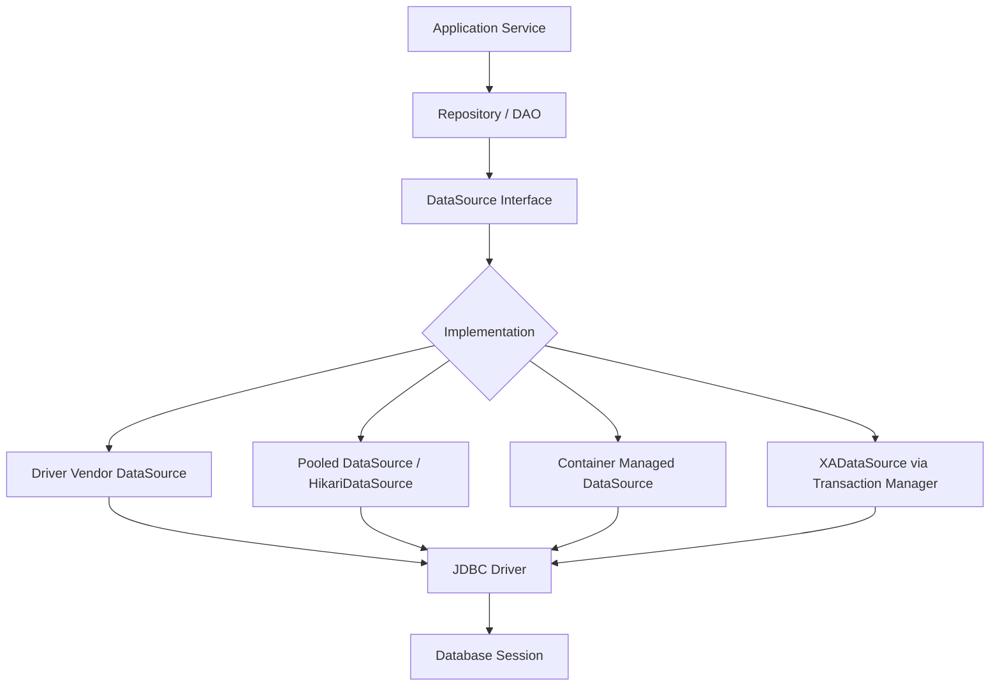
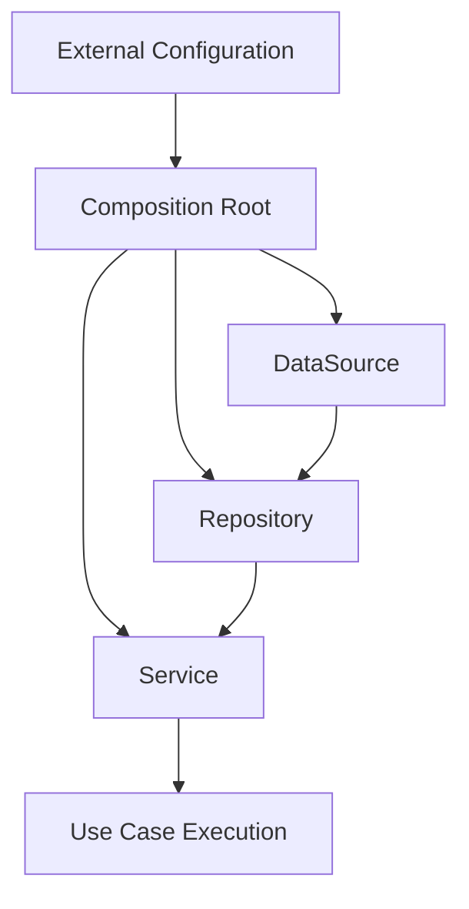
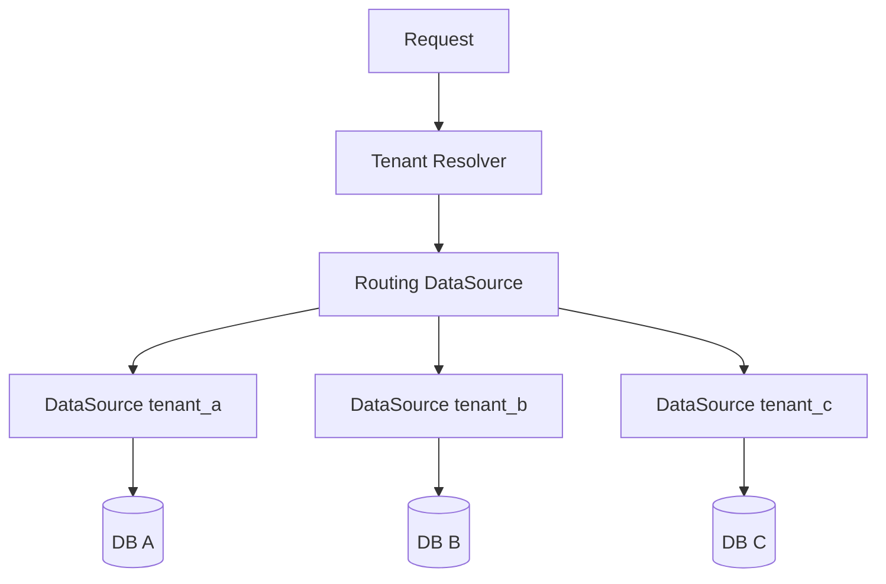

# Part 015 — DataSource Deep Dive: Why Production Code Should Prefer It

## 1. Tujuan Part Ini

Di part sebelumnya kita sudah membangun pola connection management manual tanpa framework. Sekarang kita naik satu level: **bagaimana aplikasi production seharusnya memperoleh `Connection`**.

Topik intinya adalah `javax.sql.DataSource`.

Kalimat paling penting:

> Production code should depend on `DataSource`, not scatter `DriverManager.getConnection()` across the codebase.

Ini bukan sekadar preferensi gaya coding. Ini adalah perbedaan antara:

- connection acquisition yang bisa dikonfigurasi, dipool, diamankan, dimonitor, dan diuji; versus
- connection acquisition yang tersebar, sulit dikontrol, sulit dimigrasikan, dan sering menjadi sumber coupling operasional.

Dokumentasi Java mendeskripsikan `DataSource` sebagai factory untuk connection ke physical data source, alternatif dari `DriverManager`, dan sebagai preferred means untuk memperoleh connection.

Part ini akan membahas:

- apa itu `DataSource`;
- kenapa `DataSource` lebih cocok untuk production;
- bagaimana relasinya dengan driver, pool, framework, dan container;
- apa saja jenis implementasi `DataSource`;
- bagaimana menulis kode yang bergantung pada abstraction, bukan detail vendor;
- migration path dari `DriverManager`;
- security, testability, observability, dan anti-pattern.

---

## 2. Mental Model: `DataSource` adalah Connection Factory Boundary

Secara sederhana:

```java
Connection connection = dataSource.getConnection();
```

Namun secara arsitektural, baris itu berarti:

```txt
Application code asks a connection factory for a database session handle.
The factory decides how to provide it.
```

Factory tersebut bisa:

- membuat physical connection baru;
- mengembalikan logical connection dari pool;
- menggunakan credential default;
- menggunakan credential runtime;
- melakukan validation;
- menerapkan timeout;
- mengembalikan proxy connection;
- melakukan wrapping untuk metrics/tracing;
- dikelola container;
- mengikuti JNDI lookup;
- mendukung distributed transaction melalui XA implementation.

Application code tidak perlu tahu semua detail itu.

Itulah nilai `DataSource`.



Kunci desainnya:

> Application layer bergantung pada kontrak `DataSource`, bukan cara connection dibuat.

---

## 3. Masalah yang Diselesaikan `DataSource`

`DriverManager` bukan salah. Ia adalah mekanisme awal JDBC dan tetap valid. Masalahnya muncul ketika `DriverManager` dipakai langsung di banyak tempat.

Contoh buruk:

```java
public final class UserDao {
    public User findById(long id) throws SQLException {
        try (Connection connection = DriverManager.getConnection(
                "jdbc:postgresql://db.internal:5432/app",
                "app_user",
                "secret")) {
            // query...
        }
    }
}
```

Kode ini terlihat sederhana, tapi menyimpan banyak utang desain:

- URL database hard-coded;
- credential raw di code;
- tidak ada pooling;
- sulit testing;
- sulit rotasi credential;
- sulit observability;
- sulit failover;
- sulit mengganti driver/pool;
- tiap call bisa membuka physical connection baru;
- connection acquisition policy tersebar di banyak class.

Dengan `DataSource`:

```java
public final class UserDao {
    private final DataSource dataSource;

    public UserDao(DataSource dataSource) {
        this.dataSource = Objects.requireNonNull(dataSource);
    }

    public Optional<User> findById(long id) throws SQLException {
        String sql = """
                SELECT id, email, status
                FROM users
                WHERE id = ?
                """;

        try (Connection connection = dataSource.getConnection();
             PreparedStatement statement = connection.prepareStatement(sql)) {

            statement.setLong(1, id);

            try (ResultSet rs = statement.executeQuery()) {
                if (!rs.next()) {
                    return Optional.empty();
                }

                return Optional.of(new User(
                        rs.getLong("id"),
                        rs.getString("email"),
                        rs.getString("status")
                ));
            }
        }
    }
}
```

Sekarang DAO hanya tahu:

- saya butuh connection;
- saya minta ke factory;
- saya kembalikan setelah selesai.

Detail connection acquisition dipindahkan keluar dari domain data access.

---

## 4. `DriverManager` vs `DataSource`

### 4.1 `DriverManager`

`DriverManager` adalah service yang memilih driver yang sesuai dengan JDBC URL.

```java
Connection connection = DriverManager.getConnection(
        "jdbc:postgresql://localhost:5432/app",
        "app_user",
        "secret"
);
```

Ia cocok untuk:

- script kecil;
- demo;
- learning;
- command-line utility sederhana;
- migration tool kecil yang sengaja standalone;
- fallback/testing tertentu.

Ia kurang cocok sebagai dependency langsung di production business code.

### 4.2 `DataSource`

`DataSource` adalah interface:

```java
public interface DataSource extends CommonDataSource, Wrapper {
    Connection getConnection() throws SQLException;
    Connection getConnection(String username, String password) throws SQLException;
}
```

Production application biasanya menerima `DataSource` dari:

- dependency injection container;
- application server;
- Spring Boot auto-configuration;
- Micronaut/Quarkus configuration;
- manual factory di composition root;
- test fixture;
- wrapper observability layer.

### 4.3 Perbandingan Praktis

| Dimension | `DriverManager` | `DataSource` |
|---|---|---|
| Abstraction | Static global facility | Injectable connection factory |
| Configuration | Biasanya inline atau property manual | Externalized dan container-friendly |
| Pooling | Tidak inheren | Bisa pooled implementation |
| Testability | Sulit dimock/diganti | Mudah diganti dengan fake/test container |
| Security | Sering raw credential | Bisa integrated secret management |
| Observability | Perlu wrapping manual | Bisa instrumented/wrapped |
| Lifecycle | Tersebar | Centralized |
| Framework support | Terbatas | Native integration |
| Production suitability | Rendah jika tersebar | Tinggi |

---

## 5. DataSource Bukan Selalu Pool

Ini salah satu misconception besar:

> `DataSource` tidak otomatis berarti connection pool.

`DataSource` adalah interface. Implementasinya bisa:

1. **basic DataSource** yang membuat physical connection baru;
2. **pooled DataSource** yang mengembalikan connection dari pool;
3. **XADataSource** yang dipakai untuk distributed transaction;
4. **wrapper DataSource** untuk metrics, logging, tracing, routing, read/write split, multi-tenancy, atau security.

Contoh:

```txt
DataSource interface
├── Vendor simple DataSource
├── HikariDataSource
├── Application server managed DataSource
├── RoutingDataSource
├── LazyConnectionDataSourceProxy
├── TransactionAwareDataSourceProxy
└── XA-capable infrastructure
```

Kalau kamu menulis kode terhadap `DataSource`, kamu bisa mengganti implementation tanpa mengubah DAO.

Itulah intinya.

---

## 6. Tiga Jenis Implementasi `DataSource`

Dokumentasi `DataSource` menyebut beberapa tipe implementasi. Dalam praktik enterprise, kamu akan bertemu tiga kategori besar.

### 6.1 Basic Implementation

Basic implementation membuat connection biasa.

Misalnya vendor driver menyediakan class seperti:

```java
// Nama class berbeda per vendor.
PGSimpleDataSource ds = new PGSimpleDataSource();
ds.setServerNames(new String[] { "localhost" });
ds.setPortNumbers(new int[] { 5432 });
ds.setDatabaseName("app");
ds.setUser("app_user");
ds.setPassword("secret");
```

Kelebihan:

- lebih structured daripada raw URL;
- config bisa typed;
- tetap mengikuti `DataSource` interface.

Kekurangan:

- belum tentu pooled;
- setiap `getConnection()` bisa membuat physical connection baru;
- tidak cukup untuk high-throughput services.

### 6.2 Pooled Implementation

Pooled implementation mengelola sekumpulan physical connections dan mengembalikan logical connection ke caller.

Contoh HikariCP:

```java
HikariConfig config = new HikariConfig();
config.setJdbcUrl("jdbc:postgresql://localhost:5432/app");
config.setUsername("app_user");
config.setPassword("secret");
config.setMaximumPoolSize(10);

DataSource dataSource = new HikariDataSource(config);
```

Caller tetap melihat:

```java
try (Connection connection = dataSource.getConnection()) {
    // use connection
}
```

Namun `close()` biasanya berarti:

```txt
return logical connection to the pool
```

bukan:

```txt
close physical database session immediately
```

### 6.3 XA / Distributed Transaction Implementation

XA implementation biasanya dipakai oleh transaction manager untuk distributed transaction.

Contoh use case:

- satu business transaction mencakup dua database;
- database + JMS broker dalam satu 2-phase commit;
- legacy application server dengan global transaction.

Namun di modern microservices, XA sering dihindari dan diganti dengan:

- outbox pattern;
- saga;
- idempotent consumer;
- event-driven consistency;
- compensating action.

Kita tidak akan masuk terlalu dalam ke XA di series ini, tetapi kamu perlu tahu bahwa `javax.sql` menyediakan abstraction untuk skenario tersebut.

---

## 7. The Composition Root Rule

Dependency seperti `DataSource` sebaiknya dibuat di **composition root**.

Composition root adalah tempat aplikasi meng-wire infrastructure:

- main method;
- DI container configuration;
- application module initializer;
- Spring `@Configuration`;
- Quarkus/Micronaut configuration;
- server bootstrap.

Contoh sederhana tanpa framework:

```java
public final class AppModule implements AutoCloseable {
    private final HikariDataSource dataSource;
    private final UserRepository userRepository;
    private final UserService userService;

    public AppModule(DatabaseConfig db) {
        HikariConfig hikari = new HikariConfig();
        hikari.setJdbcUrl(db.jdbcUrl());
        hikari.setUsername(db.username());
        hikari.setPassword(db.password());
        hikari.setMaximumPoolSize(db.maximumPoolSize());
        hikari.setPoolName("app-main-db");

        this.dataSource = new HikariDataSource(hikari);
        this.userRepository = new JdbcUserRepository(dataSource);
        this.userService = new UserService(userRepository);
    }

    public UserService userService() {
        return userService;
    }

    @Override
    public void close() {
        dataSource.close();
    }
}
```

Repository tidak membuat pool.

Service tidak membuat pool.

Controller tidak membuat pool.

Hanya composition root yang membuat infrastructure object.

---

## 8. Dependency Direction yang Benar

Desain buruk:

```txt
Service
  └── Repository
        └── DriverManager + hard-coded JDBC URL
```

Desain lebih baik:

```txt
Composition Root
  ├── creates DataSource
  ├── injects DataSource into Repository
  └── injects Repository into Service
```

Diagram:



Ingat rule ini:

> Business code boleh menggunakan abstraction infrastructure, tetapi tidak boleh membangun detail infrastructure secara tersebar.

---

## 9. `DataSource` dan Transaction Boundary

`DataSource` hanya menyediakan connection.

Ia tidak otomatis menentukan transaction boundary.

Contoh tanpa transaction eksplisit:

```java
try (Connection connection = dataSource.getConnection()) {
    // default often autoCommit = true
}
```

Contoh transaction manual:

```java
try (Connection connection = dataSource.getConnection()) {
    boolean previousAutoCommit = connection.getAutoCommit();
    connection.setAutoCommit(false);

    try {
        debit(connection, sourceAccountId, amount);
        credit(connection, targetAccountId, amount);
        connection.commit();
    } catch (Exception e) {
        connection.rollback();
        throw e;
    } finally {
        connection.setAutoCommit(previousAutoCommit);
    }
}
```

Masalahnya bukan `DataSource`.

Masalahnya adalah siapa yang memegang connection dan menentukan transaction scope.

Rule:

> `DataSource` is a connection acquisition boundary. Transaction management is a connection usage boundary.

Jangan mencampur keduanya sembarangan.

---

## 10. Pattern: Transaction Runner dengan `DataSource`

Part 014 sudah membahas transaction runner. Sekarang kita tempatkan `DataSource` sebagai provider.

```java
@FunctionalInterface
public interface SqlWork<T> {
    T execute(Connection connection) throws SQLException;
}

public final class TransactionRunner {
    private final DataSource dataSource;

    public TransactionRunner(DataSource dataSource) {
        this.dataSource = Objects.requireNonNull(dataSource);
    }

    public <T> T inTransaction(SqlWork<T> work) throws SQLException {
        try (Connection connection = dataSource.getConnection()) {
            boolean previousAutoCommit = connection.getAutoCommit();
            connection.setAutoCommit(false);

            try {
                T result = work.execute(connection);
                connection.commit();
                return result;
            } catch (SQLException | RuntimeException e) {
                rollbackQuietly(connection, e);
                throw e;
            } finally {
                connection.setAutoCommit(previousAutoCommit);
            }
        }
    }

    private static void rollbackQuietly(Connection connection, Exception original) {
        try {
            connection.rollback();
        } catch (SQLException rollbackFailure) {
            original.addSuppressed(rollbackFailure);
        }
    }
}
```

Repository menerima `Connection` saat ikut dalam transaction:

```java
public final class AccountRepository {
    public void debit(Connection connection, long accountId, BigDecimal amount) throws SQLException {
        String sql = """
                UPDATE accounts
                SET balance = balance - ?
                WHERE id = ?
                  AND balance >= ?
                """;

        try (PreparedStatement statement = connection.prepareStatement(sql)) {
            statement.setBigDecimal(1, amount);
            statement.setLong(2, accountId);
            statement.setBigDecimal(3, amount);

            int updated = statement.executeUpdate();
            if (updated != 1) {
                throw new InsufficientFundsException(accountId);
            }
        }
    }
}
```

Service menentukan boundary:

```java
public final class TransferService {
    private final TransactionRunner tx;
    private final AccountRepository accounts;

    public TransferService(TransactionRunner tx, AccountRepository accounts) {
        this.tx = tx;
        this.accounts = accounts;
    }

    public void transfer(long from, long to, BigDecimal amount) throws SQLException {
        tx.inTransaction(connection -> {
            accounts.debit(connection, from, amount);
            accounts.credit(connection, to, amount);
            return null;
        });
    }
}
```

Ini lebih eksplisit daripada tiap repository memanggil `dataSource.getConnection()` sendiri-sendiri untuk operasi yang seharusnya atomic.

---

## 11. Pattern: Connection Runner untuk Read-Only Single Operation

Untuk operasi sederhana tanpa transaction multi-step, connection runner cukup:

```java
@FunctionalInterface
public interface ConnectionWork<T> {
    T execute(Connection connection) throws SQLException;
}

public final class ConnectionRunner {
    private final DataSource dataSource;

    public ConnectionRunner(DataSource dataSource) {
        this.dataSource = Objects.requireNonNull(dataSource);
    }

    public <T> T withConnection(ConnectionWork<T> work) throws SQLException {
        try (Connection connection = dataSource.getConnection()) {
            return work.execute(connection);
        }
    }
}
```

Usage:

```java
public Optional<User> findUser(long id) throws SQLException {
    return connectionRunner.withConnection(connection -> repository.findById(connection, id));
}
```

Perhatikan bedanya:

- `ConnectionRunner` mengelola acquisition/release;
- `TransactionRunner` mengelola acquisition/release + commit/rollback.

---

## 12. DataSource di Framework: Spring sebagai Contoh

Dalam Spring, application code biasanya tidak membuat `DataSource` manual di repository. `DataSource` di-wire sebagai bean.

```java
@Repository
public class JdbcUserRepository {
    private final JdbcTemplate jdbcTemplate;

    public JdbcUserRepository(DataSource dataSource) {
        this.jdbcTemplate = new JdbcTemplate(dataSource);
    }
}
```

Spring Boot bisa auto-configure `DataSource` dari properties:

```properties
spring.datasource.url=jdbc:postgresql://db.internal:5432/app
spring.datasource.username=app_user
spring.datasource.password=${DB_PASSWORD}
spring.datasource.hikari.maximum-pool-size=10
```

Namun mental modelnya tetap sama:

```txt
Repository -> JdbcTemplate -> DataSource -> Pool -> JDBC Driver -> DB
```

`@Transactional` juga pada akhirnya membutuhkan connection yang diambil dari `DataSource` dan dibound ke thread selama transaction berlangsung.

Jangan menganggap framework menghilangkan JDBC. Framework hanya mengelola lifecycle, exception translation, proxy, dan integration.

---

## 13. JNDI dan Container-Managed DataSource

Di application server tradisional, `DataSource` bisa dikelola container dan diakses via JNDI.

Contoh konseptual:

```java
Context context = new InitialContext();
DataSource dataSource = (DataSource) context.lookup("java:comp/env/jdbc/AppDataSource");
```

Dalam model ini:

- aplikasi tidak menyimpan credential;
- pool dikelola server;
- admin bisa mengubah config tanpa rebuild aplikasi;
- transaction manager container bisa ikut mengelola resource;
- monitoring bisa tersedia di level server.

Ini umum di:

- Jakarta EE;
- WebLogic;
- WebSphere;
- Tomcat dengan resource config;
- legacy enterprise applications.

Modern cloud-native apps lebih sering membuat pool di dalam process aplikasi melalui library seperti HikariCP, tapi prinsipnya sama: code bergantung pada `DataSource`, bukan detail pembuatan connection.

---

## 14. Security Boundary

`DataSource` adalah tempat natural untuk mengontrol credential dan access policy.

### 14.1 Jangan Hard-Code Credential

Buruk:

```java
DriverManager.getConnection(url, "root", "root123");
```

Lebih baik:

```java
DatabaseConfig config = loadFromEnvironmentOrSecretManager();
DataSource dataSource = createDataSource(config);
```

Credential harus datang dari:

- environment variable;
- secret manager;
- Kubernetes secret;
- Vault;
- cloud secret store;
- injected runtime config;
- container-managed resource.

### 14.2 Least Privilege

Gunakan DB user dengan privilege minimal.

Contoh:

| Service | DB User | Privilege |
|---|---|---|
| order-service | `order_app` | CRUD pada schema order |
| reporting-service | `reporting_ro` | read-only pada view/reporting schema |
| migration job | `migration_owner` | DDL, dipakai terbatas |
| admin task | `admin_tool` | controlled privileged operations |

Anti-pattern:

```txt
Every service uses the same database superuser.
```

### 14.3 Credential Rotation

Dengan `DataSource` centralized, credential rotation lebih mungkin dilakukan tanpa memburu string credential di seluruh codebase.

Namun hati-hati:

- pool memegang physical connections yang sudah authenticated;
- mengganti secret tidak otomatis mengganti semua active physical connections;
- perlu strategy: restart rolling, pool refresh, maxLifetime, atau dual credential window.

---

## 15. Observability Boundary

Karena semua acquisition lewat `DataSource`, kita bisa membungkusnya.

Contoh wrapper sederhana:

```java
public final class ObservedDataSource implements DataSource {
    private final DataSource delegate;
    private final Timer acquisitionTimer;

    public ObservedDataSource(DataSource delegate, Timer acquisitionTimer) {
        this.delegate = delegate;
        this.acquisitionTimer = acquisitionTimer;
    }

    @Override
    public Connection getConnection() throws SQLException {
        long start = System.nanoTime();
        try {
            return delegate.getConnection();
        } finally {
            acquisitionTimer.record(System.nanoTime() - start, TimeUnit.NANOSECONDS);
        }
    }

    @Override
    public Connection getConnection(String username, String password) throws SQLException {
        long start = System.nanoTime();
        try {
            return delegate.getConnection(username, password);
        } finally {
            acquisitionTimer.record(System.nanoTime() - start, TimeUnit.NANOSECONDS);
        }
    }

    // Other DataSource methods delegate...
}
```

Biasanya kamu tidak perlu menulis semua ini sendiri karena pool/framework/observability library sudah menyediakan integration. Tetapi mental model ini penting.

Metrics yang relevan di boundary `DataSource`:

- connection acquisition latency;
- acquisition timeout count;
- active connections;
- idle connections;
- pending waiters;
- max pool size;
- connection creation failure;
- validation failure;
- pool suspension/failover events;
- credential/auth failure.

---

## 16. Testability: `DataSource` Membuat JDBC Code Mudah Diuji

Jika repository menerima `DataSource`, test bisa mengganti source-nya.

### 16.1 Integration Test dengan Test Database

```java
DataSource testDataSource = createTestDataSource();
UserRepository repository = new UserRepository(testDataSource);
```

### 16.2 Fake DataSource untuk Failure Injection

```java
public final class FailingDataSource implements DataSource {
    @Override
    public Connection getConnection() throws SQLException {
        throw new SQLTransientConnectionException("simulated acquisition failure");
    }

    @Override
    public Connection getConnection(String username, String password) throws SQLException {
        throw new SQLTransientConnectionException("simulated acquisition failure");
    }

    // delegate/throw UnsupportedOperationException for the remaining methods in test code
}
```

Test:

```java
@Test
void returnsServiceUnavailableWhenConnectionCannotBeAcquired() {
    UserService service = new UserService(new UserRepository(new FailingDataSource()));

    assertThrows(DatabaseUnavailableException.class, () -> service.loadUser(100L));
}
```

### 16.3 Proxy DataSource untuk Leak Detection Test

Kamu juga bisa membungkus `DataSource` untuk menghitung open/close:

```txt
borrow count == close count
```

Ini membantu mendeteksi path yang lupa menutup connection.

---

## 17. Multi-Tenancy dan Routing DataSource

Dalam sistem multi-tenant, `DataSource` bisa menjadi routing boundary.

Ada beberapa model:

### 17.1 Shared Database, Shared Schema

Tenant dibedakan oleh kolom `tenant_id`.

`DataSource` biasanya sama.

Risiko utama:

- query lupa filter tenant;
- index harus mempertimbangkan tenant;
- row-level security bisa membantu.

### 17.2 Shared Database, Separate Schema

Tenant memiliki schema berbeda.

`DataSource` bisa sama, tetapi connection perlu set schema/catalog.

Risiko:

- schema state leak antar request;
- pooled connection harus reset state;
- tenant context harus jelas.

### 17.3 Separate Database per Tenant

Routing `DataSource` memilih pool berdasarkan tenant.



Risiko besar:

- jumlah pool meledak;
- total DB connections sulit dikendalikan;
- tenant idle tetap memakan resource;
- failover per tenant kompleks;
- observability harus tagged per tenant.

Rule:

> Routing DataSource adalah infrastructure pattern, bukan alasan untuk menyembunyikan tenant boundary dari domain model.

---

## 18. Read/Write Split DataSource

Beberapa sistem memakai primary untuk write dan replica untuk read.

```txt
Write DataSource -> primary database
Read DataSource  -> read replica
```

Repository bisa dibuat eksplisit:

```java
public final class UserQueryRepository {
    private final DataSource readDataSource;
}

public final class UserCommandRepository {
    private final DataSource writeDataSource;
}
```

Atau menggunakan routing berdasarkan transaction read-only flag.

Risiko:

- replication lag;
- read-your-writes tidak terjamin;
- transaction consistency bisa pecah;
- stale reads;
- debugging lebih sulit.

Jangan pakai read/write split tanpa explicit consistency model.

Pertanyaan design review:

- Apakah endpoint ini butuh read-your-writes?
- Apakah stale data acceptable?
- Berapa replication lag yang bisa ditoleransi?
- Apakah audit/reporting boleh eventually consistent?
- Bagaimana fallback jika replica tertinggal?

---

## 19. DataSource dan Connection State

Connection memiliki state:

- auto-commit;
- transaction isolation;
- read-only flag;
- catalog;
- schema;
- network timeout;
- holdability;
- session variables;
- temporary tables;
- prepared statement cache;
- role/user context pada database tertentu.

Jika `DataSource` adalah pooled implementation, connection yang sama bisa dipakai oleh request berbeda.

Maka state leak adalah risiko nyata.

Contoh buruk:

```java
try (Connection connection = dataSource.getConnection()) {
    connection.setSchema("tenant_a");
    // work...
}
```

Jika pool tidak mereset schema atau app tidak mengembalikan schema, request berikutnya bisa terkena state tenant sebelumnya.

Rule:

> Any connection state you mutate must be restored, or you must prove the pool/framework resets it.

---

## 20. DataSource Lifecycle

`DataSource` bukan selalu perlu ditutup, karena interface `DataSource` sendiri tidak extends `AutoCloseable`.

Namun implementasi pool seperti `HikariDataSource` harus ditutup saat aplikasi shutdown.

Contoh:

```java
HikariDataSource dataSource = new HikariDataSource(config);

Runtime.getRuntime().addShutdownHook(new Thread(dataSource::close));
```

Dalam framework, lifecycle biasanya dikelola container.

Rule:

> Close borrowed `Connection` after each use. Close pool `DataSource` only at application shutdown.

Jangan lakukan ini:

```java
public void handleRequest() {
    HikariDataSource ds = createDataSource();
    try (Connection c = ds.getConnection()) {
        // work
    } finally {
        ds.close();
    }
}
```

Itu membuat pool per request. Ini anti-pattern berat.

---

## 21. Configuration Externalization

Production `DataSource` config harus externalized.

Contoh config object:

```java
public record DatabaseConfig(
        String jdbcUrl,
        String username,
        String password,
        int maximumPoolSize,
        Duration connectionTimeout,
        Duration maxLifetime,
        String poolName
) {}
```

Factory:

```java
public final class DataSourceFactory {
    public static HikariDataSource create(DatabaseConfig db) {
        HikariConfig config = new HikariConfig();
        config.setJdbcUrl(db.jdbcUrl());
        config.setUsername(db.username());
        config.setPassword(db.password());
        config.setMaximumPoolSize(db.maximumPoolSize());
        config.setConnectionTimeout(db.connectionTimeout().toMillis());
        config.setMaxLifetime(db.maxLifetime().toMillis());
        config.setPoolName(db.poolName());
        return new HikariDataSource(config);
    }
}
```

Config source bisa berbeda:

- local dev: `.env`;
- CI: environment variable;
- Kubernetes: Secret + ConfigMap;
- cloud: secret manager;
- application server: JNDI;
- test: Testcontainers generated URL.

---

## 22. DataSource Factory Pattern

Agar setup tidak tersebar, gunakan factory.

```java
public interface DataSourceProvider {
    DataSource dataSource();
}
```

Atau:

```java
public final class JdbcModule {
    private final HikariDataSource dataSource;
    private final TransactionRunner transactionRunner;

    public JdbcModule(DatabaseConfig config) {
        this.dataSource = DataSourceFactory.create(config);
        this.transactionRunner = new TransactionRunner(dataSource);
    }

    public DataSource dataSource() {
        return dataSource;
    }

    public TransactionRunner transactionRunner() {
        return transactionRunner;
    }

    public void shutdown() {
        dataSource.close();
    }
}
```

Keuntungan:

- satu tempat untuk pool config;
- satu tempat untuk validation;
- satu tempat untuk observability wrapper;
- satu tempat untuk secret handling;
- mudah test;
- mudah migration.

---

## 23. Validating DataSource at Startup

Production service biasanya perlu fail fast jika DB config salah.

Contoh startup validation:

```java
public static void validate(DataSource dataSource) {
    try (Connection connection = dataSource.getConnection()) {
        if (!connection.isValid(2)) {
            throw new IllegalStateException("Database connection is not valid");
        }
    } catch (SQLException e) {
        throw new IllegalStateException("Cannot connect to database", e);
    }
}
```

Namun jangan berlebihan.

Startup validation menjawab:

- credential benar?
- URL benar?
- database reachable?
- driver available?

Startup validation tidak menjamin:

- database akan tetap available;
- schema lengkap;
- query performa baik;
- lock tidak terjadi;
- pool sizing benar.

Untuk schema readiness, gunakan migration validation atau health check yang lebih spesifik.

---

## 24. Health Check Design

Health check menggunakan `DataSource` harus hati-hati.

Buruk:

```sql
SELECT COUNT(*) FROM huge_table
```

Lebih baik:

```sql
SELECT 1
```

Namun health check juga tidak boleh menyebabkan pool pressure.

Pertimbangkan:

- timeout sangat pendek;
- frequency tidak terlalu tinggi;
- jangan health check memakai semua instance bersamaan tanpa jitter;
- bedakan liveness dan readiness;
- jangan query mahal;
- jangan membuka transaction panjang.

Readiness DB berarti:

```txt
this instance can currently acquire a connection and execute a minimal validation query within budget
```

Bukan berarti:

```txt
all application queries are healthy
```

---

## 25. Exception Translation Boundary

`DataSource.getConnection()` bisa melempar `SQLException`.

Application boundary sering menerjemahkan exception:

```java
try {
    return repository.findUser(id);
} catch (SQLTransientConnectionException e) {
    throw new DatabaseUnavailableException("Cannot acquire database connection", e);
} catch (SQLException e) {
    throw new DataAccessFailureException("Database operation failed", e);
}
```

Jangan terjemahkan terlalu dini di low-level utility kalau informasi penting hilang.

Simbol penting:

- SQLState;
- vendor error code;
- exception class;
- message;
- operation name;
- query name;
- correlation ID;
- pool name;
- tenant ID jika relevan.

---

## 26. Migration dari `DriverManager` ke `DataSource`

### 26.1 Step 1 — Identifikasi Semua Call Site

Cari:

```txt
DriverManager.getConnection
Class.forName("...Driver")
jdbc:
```

### 26.2 Step 2 — Buat `DataSource` di Composition Root

```java
DataSource dataSource = DataSourceFactory.create(config);
```

### 26.3 Step 3 — Inject ke Repository

Sebelum:

```java
public UserDao() {}
```

Sesudah:

```java
public UserDao(DataSource dataSource) {
    this.dataSource = dataSource;
}
```

### 26.4 Step 4 — Hilangkan Credential dari DAO

DAO tidak boleh tahu username/password.

### 26.5 Step 5 — Tambahkan Transaction Runner

Jika operasi multi-repository harus atomic, jangan biarkan masing-masing repository mengambil connection sendiri.

### 26.6 Step 6 — Tambahkan Pooling

Ganti implementation `DataSource` menjadi HikariCP atau pool lain di composition root.

### 26.7 Step 7 — Tambahkan Metrics dan Health Check

Bukan setelah incident. Dari awal.

---

## 27. Anti-Pattern: `DataSource` Static Global

Buruk:

```java
public final class Database {
    public static final DataSource DATA_SOURCE = createDataSource();
}
```

Masalah:

- hidden dependency;
- sulit test;
- sulit multiple database;
- sulit lifecycle;
- sulit override config;
- berpotensi init order bug;
- mempersulit dependency graph.

Lebih baik:

```java
public final class UserRepository {
    private final DataSource dataSource;

    public UserRepository(DataSource dataSource) {
        this.dataSource = dataSource;
    }
}
```

---

## 28. Anti-Pattern: Satu Method Membuat DataSource Berulang Kali

Buruk:

```java
public void insertAudit(AuditEvent event) throws SQLException {
    HikariDataSource ds = new HikariDataSource(config());
    try (Connection c = ds.getConnection()) {
        // insert
    } finally {
        ds.close();
    }
}
```

Kenapa buruk:

- membuat pool berulang;
- membuka/menutup physical connections terus-menerus;
- kehilangan manfaat pooling;
- bisa menghantam DB dengan connection storm;
- metric pool tidak stabil;
- latency naik.

Rule:

> A pool is an application-level resource, not an operation-level resource.

---

## 29. Anti-Pattern: Repository Mengambil Connection Sendiri dalam Use Case Atomic

Buruk:

```java
public void transfer(long from, long to, BigDecimal amount) {
    accountRepository.debit(from, amount);  // opens connection A
    accountRepository.credit(to, amount);   // opens connection B
}
```

Jika `debit()` commit sukses lalu `credit()` gagal, data rusak.

Lebih benar:

```java
transactionRunner.inTransaction(connection -> {
    accountRepository.debit(connection, from, amount);
    accountRepository.credit(connection, to, amount);
    return null;
});
```

`DataSource` mempermudah acquisition, tapi transaction design tetap tanggung jawab architecture.

---

## 30. Anti-Pattern: Mencampur Pooled dan Non-Pooled Path

Buruk:

```java
// Most code
Connection c1 = hikariDataSource.getConnection();

// Some legacy code
Connection c2 = DriverManager.getConnection(url, user, pass);
```

Akibat:

- pool metrics tidak mencerminkan total DB usage;
- DB max connections bisa terlampaui;
- timeout behavior beda;
- transaction behavior beda;
- incident diagnosis membingungkan.

Rule:

> A service should have one authoritative connection acquisition path per database role.

Database role contohnya:

- main write DB;
- read replica;
- audit DB;
- reporting DB.

---

## 31. DataSource Review Checklist

Gunakan checklist ini saat code review atau architecture review.

### 31.1 Dependency

- Apakah repository menerima `DataSource` atau `Connection`, bukan membuat sendiri?
- Apakah `DriverManager` tidak tersebar di business code?
- Apakah `DataSource` dibuat di composition root?
- Apakah lifecycle pool jelas?

### 31.2 Transaction

- Apakah operation multi-step memakai satu connection?
- Apakah transaction boundary berada di service/use-case layer?
- Apakah repository tidak diam-diam commit sendiri?
- Apakah auto-commit state jelas?

### 31.3 Security

- Apakah credential externalized?
- Apakah DB user least privilege?
- Apakah rotasi credential dipikirkan?
- Apakah TLS/SSL config jelas jika dibutuhkan?

### 31.4 Operations

- Apakah pool name meaningful?
- Apakah metrics tersedia?
- Apakah health check murah dan timeout pendek?
- Apakah acquisition timeout dipantau?
- Apakah DB max connections dihitung terhadap jumlah instance?

### 31.5 Testing

- Apakah repository bisa diuji dengan test `DataSource`?
- Apakah failure acquisition bisa diuji?
- Apakah integration test memakai database realistis?

---

## 32. Practice: Refactor Legacy DriverManager Code

Ambil kode ini:

```java
public final class InvoiceDao {
    public Invoice find(long id) throws SQLException {
        Connection c = DriverManager.getConnection(
                "jdbc:postgresql://localhost:5432/billing",
                "postgres",
                "postgres"
        );

        PreparedStatement ps = c.prepareStatement(
                "SELECT id, customer_id, total FROM invoices WHERE id = ?"
        );
        ps.setLong(1, id);
        ResultSet rs = ps.executeQuery();

        if (!rs.next()) {
            return null;
        }

        return new Invoice(
                rs.getLong("id"),
                rs.getLong("customer_id"),
                rs.getBigDecimal("total")
        );
    }
}
```

Masalah yang harus kamu temukan:

- connection tidak ditutup;
- statement tidak ditutup;
- result set tidak ditutup;
- credential hard-coded;
- `DriverManager` langsung di DAO;
- null return;
- tidak ada dependency injection;
- tidak ada query timeout;
- tidak ada exception translation;
- tidak ada test seam.

Refactor minimal:

```java
public final class InvoiceDao {
    private final DataSource dataSource;

    public InvoiceDao(DataSource dataSource) {
        this.dataSource = Objects.requireNonNull(dataSource);
    }

    public Optional<Invoice> find(long id) throws SQLException {
        String sql = """
                SELECT id, customer_id, total
                FROM invoices
                WHERE id = ?
                """;

        try (Connection connection = dataSource.getConnection();
             PreparedStatement statement = connection.prepareStatement(sql)) {

            statement.setQueryTimeout(2);
            statement.setLong(1, id);

            try (ResultSet rs = statement.executeQuery()) {
                if (!rs.next()) {
                    return Optional.empty();
                }

                return Optional.of(new Invoice(
                        rs.getLong("id"),
                        rs.getLong("customer_id"),
                        rs.getBigDecimal("total")
                ));
            }
        }
    }
}
```

Refactor berikutnya:

- inject `ConnectionRunner` jika banyak method read sederhana;
- inject transaction runner untuk use case atomic;
- pindahkan query timeout ke policy/helper;
- tambahkan mapper;
- tambahkan integration test.

---

## 33. Engineering Principle

`DataSource` adalah salah satu boundary paling penting dalam JDBC architecture.

Ia membuat code:

- lebih mudah dikonfigurasi;
- lebih mudah dites;
- lebih aman;
- lebih observable;
- lebih mudah dimigrasikan;
- lebih siap untuk pooling;
- lebih siap untuk framework;
- lebih siap untuk production incident analysis.

Namun `DataSource` bukan obat semua masalah.

Ia tidak otomatis memperbaiki:

- transaction boundary yang salah;
- isolation yang salah;
- query lambat;
- lock contention;
- pool oversizing;
- credential privilege berlebihan;
- missing observability.

Mental model final:

```txt
DataSource answers: where do connections come from?
Transaction manager answers: how long is one connection used atomically?
Connection pool answers: how many physical sessions are allowed and reused?
Repository answers: what SQL is executed?
Service/use-case answers: what business state transition must be atomic?
```

---

## 34. Ringkasan

Di part ini kita belajar bahwa:

- `DataSource` adalah preferred abstraction untuk memperoleh JDBC connection di production code;
- `DriverManager` masih valid, tapi sebaiknya tidak tersebar di business/repository code;
- `DataSource` tidak otomatis pooled;
- pooled implementation seperti HikariCP tetap diekspos sebagai `DataSource`;
- transaction boundary berbeda dari connection acquisition boundary;
- `DataSource` harus dibuat di composition root;
- repository sebaiknya menerima dependency, bukan membuat infrastructure;
- credential, observability, health check, dan lifecycle lebih mudah dikontrol jika acquisition path centralized;
- static global `DataSource`, pool per request, dan mixed acquisition path adalah anti-pattern serius.

Part berikutnya akan masuk ke **connection pooling fundamentals**: kenapa pool ada, bagaimana memodelkannya sebagai bounded resource, dan kenapa pool bukan throughput multiplier yang bisa dinaikkan sembarangan.

---

## 35. Referensi

- Java SE 25 API — `javax.sql.DataSource`
- Java SE 25 API — `javax.sql` package summary
- Java SE 25 API — `java.sql.DriverManager`
- Java SE 25 API — `java.sql.Connection`
- JDBC 4.3 Specification
- HikariCP GitHub Documentation
