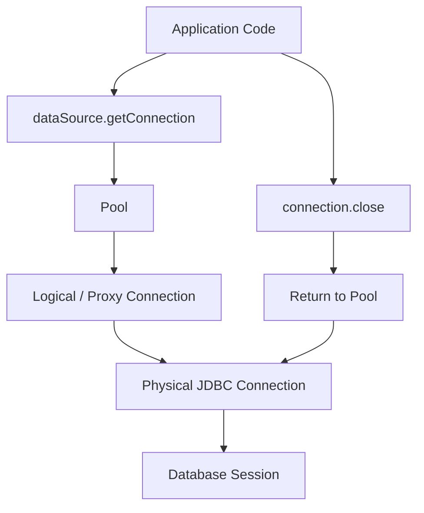
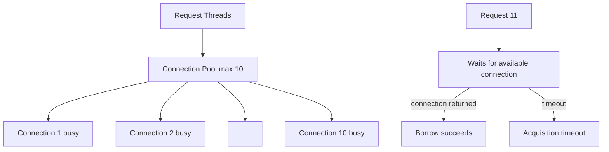
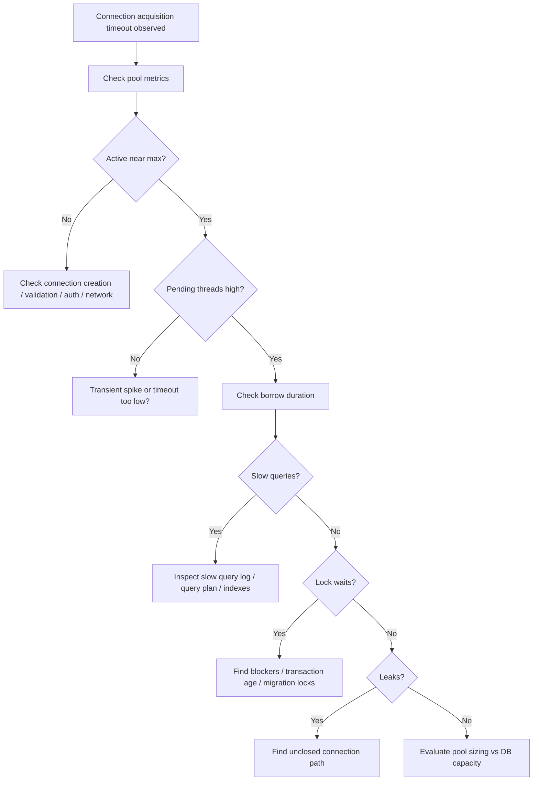
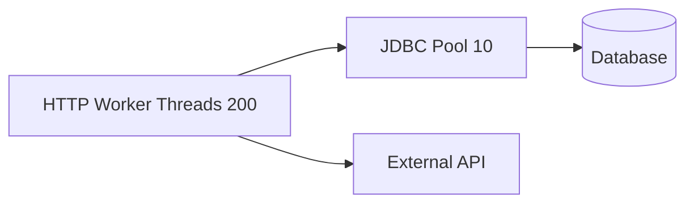
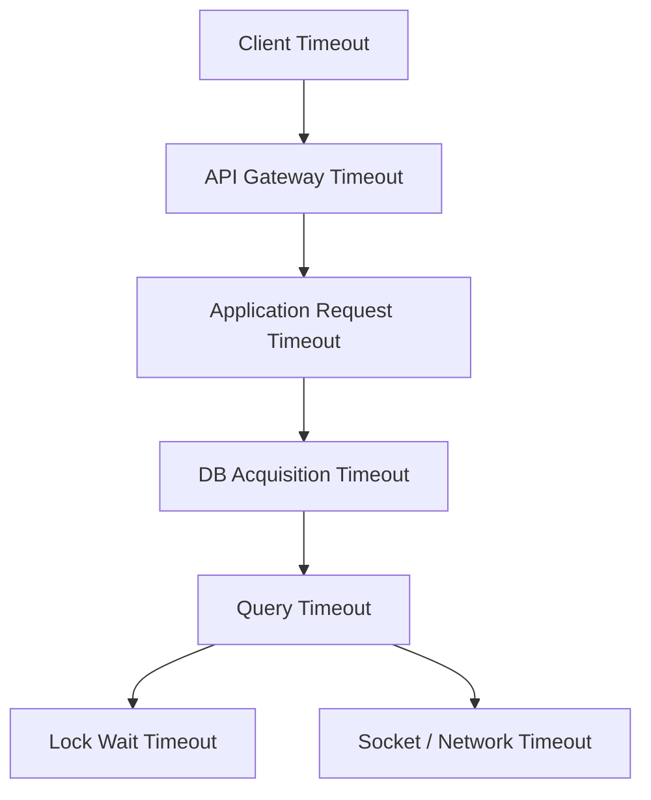

# Part 016 — Connection Pooling Fundamentals: Why Pools Exist and What They Are Not

## 1. Tujuan Part Ini

Part ini membangun mental model connection pooling sebelum kita membahas HikariCP secara detail.

Kamu mungkin sudah tahu bahwa pool “menyimpan connection agar bisa dipakai ulang”. Itu benar, tapi belum cukup untuk production.

Seorang senior engineer harus bisa menjawab:

- kenapa pool diperlukan;
- apa sebenarnya yang dipool;
- apa bedanya logical connection dan physical connection;
- kenapa pool adalah bounded resource;
- kenapa memperbesar pool sering memperburuk masalah;
- bagaimana pool berinteraksi dengan thread, request, transaction, lock, DB CPU, dan DB max connections;
- bagaimana membaca gejala pool exhaustion;
- bagaimana membedakan masalah pool dari masalah query, lock, atau downstream database;
- bagaimana membuat sizing yang masuk akal.

Kalimat paling penting:

> Connection pool is not a performance multiplier. It is a bounded concurrency control mechanism for expensive database sessions.

---

## 2. Masalah Dasar: Membuat Database Connection Itu Mahal

Membuka physical database connection bukan operasi gratis.

Tergantung driver dan database, prosesnya bisa melibatkan:

- DNS resolution;
- TCP handshake;
- TLS handshake;
- database protocol negotiation;
- authentication;
- session initialization;
- setting parameter session;
- allocating server process/thread/memory;
- allocating backend session resources;
- optionally preparing caches;
- optionally running initialization SQL.

Jika setiap request membuat physical connection baru, sistem akan membayar overhead ini terus-menerus.

Buruk:

```txt
Request 1 -> open physical connection -> query -> close
Request 2 -> open physical connection -> query -> close
Request 3 -> open physical connection -> query -> close
...
```

Lebih baik:

```txt
App startup -> create limited physical connections
Request 1 -> borrow -> query -> return
Request 2 -> borrow -> query -> return
Request 3 -> borrow -> query -> return
```

Connection pooling mengurangi overhead connection creation dan memberi batas concurrency ke database.

---

## 3. Apa yang Sebenarnya Dipool?

Yang dipool bukan object Java biasa.

Yang dipool adalah physical database sessions yang direpresentasikan oleh driver connection.

Dalam pool modern, application code biasanya menerima logical/proxy connection.



Saat memakai pool:

```java
try (Connection connection = dataSource.getConnection()) {
    // use connection
}
```

`connection.close()` biasanya berarti:

```txt
return this logical connection to the pool
```

bukan:

```txt
terminate database TCP/session immediately
```

Physical connection bisa tetap hidup dan dipakai request berikutnya.

---

## 4. Pool as Bounded Resource

Pool memiliki ukuran maksimum.

Misalnya:

```txt
maximumPoolSize = 10
```

Artinya pada satu application instance, maksimal ada 10 connection aktif/idle yang dimiliki pool untuk database tersebut.

Jika 10 connection sedang dipakai dan request ke-11 meminta connection:

- request menunggu di queue pool;
- jika ada connection kembali sebelum timeout, request mendapat connection;
- jika tidak, request gagal dengan acquisition timeout.



Ini bukan bug. Ini safety mechanism.

Tanpa batas, aplikasi bisa membuka terlalu banyak DB sessions dan menjatuhkan database.

---

## 5. Lifecycle Pool: Idle, Active, Pending

Tiga angka pool paling dasar:

| Metric | Makna |
|---|---|
| Active | Connection sedang dipinjam aplikasi |
| Idle | Connection tersedia di pool |
| Pending / Waiting | Thread menunggu connection |

Interpretasi sederhana:

```txt
Active high, Idle low, Pending high -> pool pressure
Active low, Pending high -> suspicious: acquisition stuck, pool bug, validation/connect issue
Active high, DB CPU low -> likely locks, long transactions, network, app holding connection
Active high, DB CPU high -> likely real query load or poor query/index
```

Pool metric harus selalu dibaca bersama:

- request rate;
- request latency;
- query latency;
- transaction duration;
- DB CPU;
- DB connection count;
- lock wait;
- slow query log;
- thread pool saturation.

---

## 6. What Pooling Solves

Connection pooling menyelesaikan beberapa masalah nyata.

### 6.1 Mengurangi Connection Creation Cost

Connection dibuat ulang lebih jarang.

Ini mengurangi:

- latency;
- authentication overhead;
- server allocation churn;
- TLS handshake overhead;
- startup cost per request.

### 6.2 Membatasi Concurrency ke Database

Pool bertindak seperti bulkhead.

Jika aplikasi memiliki 200 HTTP worker threads, bukan berarti 200 thread boleh langsung membuka 200 DB sessions.

Pool membatasi:

```txt
maximum simultaneous DB sessions from this instance
```

### 6.3 Membantu Reuse Session

Session reuse bisa membantu:

- prepared statement caching di driver/database tertentu;
- avoiding repeated session setup;
- reduced churn;
- stable DB resource usage.

### 6.4 Memberikan Metrics Boundary

Pool memberi observability:

- active connections;
- idle connections;
- pending threads;
- acquisition timeout;
- connection creation;
- connection lifetime;
- leak detection signal.

### 6.5 Mengontrol Failure Behavior

Pool acquisition timeout memungkinkan aplikasi gagal lebih cepat dibanding menunggu tak terbatas.

---

## 7. What Pooling Does Not Solve

Pool bukan solusi untuk semua masalah database.

### 7.1 Pool Tidak Membuat Query Lambat Menjadi Cepat

Jika query butuh 5 detik karena missing index, pool tidak memperbaikinya.

Malah pool bisa membuat masalah terlihat lebih besar karena lebih banyak request menunggu connection.

### 7.2 Pool Tidak Menghilangkan Lock Contention

Jika transaction saling block, memperbesar pool bisa menambah jumlah transaction yang ikut antre pada lock yang sama.

Akibat:

- lebih banyak active connections;
- lebih banyak blocked sessions;
- latency naik;
- deadlock meningkat;
- DB memory naik.

### 7.3 Pool Tidak Menggantikan Transaction Design

Jika aplikasi memegang connection sambil call external API, pool akan habis walaupun query sedikit.

Buruk:

```java
try (Connection connection = dataSource.getConnection()) {
    connection.setAutoCommit(false);
    repository.insertPendingOrder(connection, order);

    paymentGateway.charge(card, amount); // external call inside transaction

    repository.markPaid(connection, order.id());
    connection.commit();
}
```

Masalah:

- connection ditahan selama network call;
- transaction ditahan lama;
- lock bisa ditahan lama;
- pool bisa habis;
- external failure membuat state kompleks.

### 7.4 Pool Tidak Mengatasi DB Capacity Limit

Jika database hanya mampu menjalankan 20 query concurrent secara efisien, pool 100 tidak membuat DB mampu 100.

Biasanya justru:

- context switching meningkat;
- lock contention meningkat;
- cache pressure meningkat;
- latency tail meningkat.

---

## 8. Pool adalah Queueing System

Pool memiliki karakter queueing.

```txt
arrival rate: request yang butuh DB connection
service time: durasi connection dipinjam
servers: jumlah connection dalam pool
queue: pending borrowers
```

Jika arrival rate naik atau service time naik, pending borrower bisa naik.

Durasi borrow bukan hanya waktu query.

Borrow duration mencakup:

```txt
connection acquired
  -> prepare statement
  -> execute query/update
  -> iterate result set
  -> mapping
  -> business logic inside transaction
  -> maybe other SQL
  -> commit/rollback
connection returned
```

Maka optimasi pool pressure bisa dilakukan dengan:

- mempercepat query;
- mengurangi jumlah query per request;
- memperpendek transaction;
- tidak melakukan work non-DB saat memegang connection;
- streaming dengan benar;
- memindahkan CPU-heavy mapping setelah data dibaca jika aman;
- memperbaiki index;
- mengurangi lock wait;
- memperbaiki pagination;
- menyesuaikan pool size jika memang DB capacity tersedia.

---

## 9. Little's Law Intuition

Kita tidak perlu matematika rumit, tetapi intuisi queueing penting.

Little's Law secara intuitif:

```txt
concurrency ≈ throughput × latency
```

Jika service melayani 100 request/detik, dan setiap request memegang connection rata-rata 50 ms:

```txt
required average DB concurrency ≈ 100 × 0.05 = 5 connections
```

Jika query melambat menjadi 500 ms:

```txt
required average DB concurrency ≈ 100 × 0.5 = 50 connections
```

Tanpa traffic naik pun, pool bisa habis hanya karena borrow duration naik.

Itulah kenapa pool exhaustion sering merupakan symptom, bukan root cause.

---

## 10. Pool Exhaustion: Symptom, Not Diagnosis

Pool exhaustion berarti:

```txt
Threads could not acquire connection within configured timeout.
```

Itu belum menjawab kenapa.

Possible root causes:

| Category | Example |
|---|---|
| Slow query | missing index, bad plan, large scan |
| Lock wait | blocked transaction, migration lock, hot row |
| Long transaction | external call inside transaction |
| Connection leak | code path tidak close connection |
| Pool too small | legitimate workload > configured concurrency |
| DB overloaded | CPU/IO saturated |
| Network issue | driver waiting on socket |
| Connection creation failure | DB max connections reached, auth issue |
| ResultSet streaming slow | app slowly consumes data while holding connection |
| Thread starvation | request thread stuck holding connection |

Jangan langsung menaikkan pool size.

Diagnosis dulu.

---

## 11. Incident Flow: Pool Exhaustion



Incident response harus mengikuti bukti.

---

## 12. Connection Leak

Connection leak terjadi saat code meminjam connection tetapi tidak mengembalikannya.

Buruk:

```java
Connection connection = dataSource.getConnection();
PreparedStatement statement = connection.prepareStatement(sql);
ResultSet rs = statement.executeQuery();
// no close
```

Lebih buruk:

```java
public class UserRepository {
    private Connection connection;

    public UserRepository(DataSource dataSource) throws SQLException {
        this.connection = dataSource.getConnection();
    }
}
```

Leak bisa:

- langsung terlihat saat traffic tinggi;
- perlahan menghabiskan pool;
- hanya terjadi pada exception path;
- hanya terjadi pada rare branch;
- hanya terjadi saat mapper melempar exception;
- hanya terjadi saat early return.

Gunakan `try-with-resources`.

```java
try (Connection connection = dataSource.getConnection();
     PreparedStatement statement = connection.prepareStatement(sql);
     ResultSet rs = statement.executeQuery()) {
    // use rs
}
```

Namun ingat: jika `ResultSet` dibuat setelah statement, kadang kamu perlu nested block agar resource lifecycle jelas.

---

## 13. Pool Size: Kenapa Lebih Besar Tidak Selalu Lebih Baik

Misalnya satu DB mampu memproses 16 concurrent heavy queries secara efektif.

Jika kamu set pool ke 100:

```txt
100 active DB sessions compete for CPU, IO, locks, memory
```

Kemungkinan hasil:

- average latency naik;
- p95/p99 latency naik tajam;
- lock wait naik;
- DB CPU saturated;
- cache locality turun;
- context switching naik;
- failover lebih berat;
- recovery lebih lambat.

Pool terlalu kecil juga buruk:

- request menunggu padahal DB masih idle;
- throughput underutilized;
- acquisition timeout palsu;
- head-of-line blocking.

Tujuannya bukan pool terbesar.

Tujuannya:

```txt
small enough to protect DB, large enough to keep intended workload flowing
```

---

## 14. Multi-Instance Math

Pool size harus dikalikan jumlah instance.

Jika:

```txt
maximumPoolSize = 20
application instances = 12
```

Maka worst-case DB connections dari service itu:

```txt
20 × 12 = 240 connections
```

Jika ada 5 services:

```txt
service-a: 12 × 20 = 240
service-b: 8 × 15 = 120
service-c: 20 × 10 = 200
service-d: 4 × 30 = 120
service-e: 6 × 10 = 60
Total = 740 potential connections
```

Bandingkan dengan:

- DB `max_connections`;
- reserved admin connections;
- migration jobs;
- BI/reporting tools;
- replicas;
- connection overhead memory;
- failover capacity.

In Kubernetes/autoscaling, ini lebih penting:

```txt
maxReplicas × maximumPoolSize
```

bukan current replica count saja.

---

## 15. Separate Pools for Different Workloads

Kadang satu pool untuk semua workload menyebabkan head-of-line blocking.

Contoh:

- API request pendek;
- report query panjang;
- background batch job;
- audit write;
- outbox publisher.

Jika semua memakai pool sama, batch job bisa menghabiskan connection dan API ikut timeout.

Solusi bisa berupa separate pools:

```txt
mainApiDataSource      max 10
reportingDataSource    max 3
batchDataSource        max 2
auditDataSource        max 5
```

Namun jangan asal pecah pool.

Setiap pool menambah total possible DB connections.

Gunakan separate pool jika:

- workload latency profile sangat berbeda;
- prioritas berbeda;
- timeout berbeda;
- database role berbeda;
- isolation resource dibutuhkan;
- kamu punya observability per pool.

---

## 16. Pooling and Thread Pools

HTTP thread pool dan JDBC pool berinteraksi erat.

Jika HTTP worker = 200 dan DB pool = 10, maka maksimal 10 thread bisa aktif menggunakan DB pada waktu yang sama. Sisanya bisa:

- menunggu connection;
- melakukan non-DB work;
- menunggu downstream lain.

Masalah terjadi jika banyak thread block menunggu connection.



Bad smell:

```txt
HTTP threads mostly waiting for DB connection
```

Kemungkinan:

- pool terlalu kecil;
- query terlalu lambat;
- connection dipegang terlalu lama;
- external call terjadi saat memegang connection;
- lock wait;
- leak.

Jangan menyamakan:

```txt
JDBC pool size = HTTP thread pool size
```

Itu sering salah.

---

## 17. Pooling and Transactions

Connection biasanya dipinjam selama transaction berlangsung.

Jika transaction lama, connection lama ditahan.

Transaction duration bisa panjang karena:

- query lambat;
- banyak query;
- result set besar;
- lock wait;
- remote API call;
- CPU-heavy mapping;
- user interaction;
- file IO;
- message broker call;
- retry loop di dalam transaction.

Rule:

> Keep transactions short, bounded, and database-focused.

Bukan berarti semua harus satu query. Tapi semua yang berada dalam transaction harus punya alasan kuat.

---

## 18. Pooling and Locks

Lock wait membuat connection tetap active.

Contoh:

```txt
Tx A locks row account_id=1
Tx B tries to update account_id=1 and waits
```

Selama Tx B menunggu lock:

- connection B tetap active;
- pool slot B tidak tersedia;
- thread B menunggu;
- request B latency naik;
- request lain bisa menunggu pool.

Jika banyak request menunggu row hot yang sama, pool bisa penuh oleh blocked sessions.

Menaikkan pool size memperbanyak blocked sessions.

Solusi lebih tepat bisa:

- lock ordering;
- shorter transaction;
- optimistic locking;
- queue per aggregate/key;
- partitioning hot key;
- idempotent async processing;
- database constraint design;
- retry with backoff untuk deadlock/serialization failure.

---

## 19. Pooling and ResultSet Streaming

Streaming large result set menahan connection selama stream dibaca.

Contoh:

```java
try (Connection connection = dataSource.getConnection();
     PreparedStatement statement = connection.prepareStatement(sql);
     ResultSet rs = statement.executeQuery()) {

    while (rs.next()) {
        processSlowly(rs);
    }
}
```

Jika `processSlowly` melakukan network call atau CPU-heavy work, connection tertahan lama.

Pattern yang lebih baik tergantung kasus:

- baca chunk kecil lalu release connection;
- gunakan keyset pagination;
- pisahkan read dan processing pipeline;
- gunakan batch processing dengan checkpoint;
- stream hanya jika memang perlu dan pool disiapkan untuk itu;
- gunakan separate pool untuk long-running export/report.

---

## 20. Warm Pool vs Lazy Pool

Beberapa pool bisa membuat connection secara lazy atau menjaga minimum idle.

Konsep:

- **lazy creation**: connection dibuat saat dibutuhkan;
- **minimum idle**: pool mencoba menjaga sejumlah connection idle;
- **eager initialization**: pool membuat connection saat startup.

Trade-off:

| Strategy | Kelebihan | Kekurangan |
|---|---|---|
| Lazy | startup cepat, resource hemat | request awal bisa kena connection creation latency |
| Minimum idle | latency lebih stabil | idle resource terpakai |
| Eager | fail fast config salah | startup bisa lambat/gagal saat DB belum siap |

Untuk service critical, sering lebih baik fail fast saat config DB salah. Namun untuk dependency optional, lazy/degraded mode mungkin masuk akal.

---

## 21. Connection Validation

Pool harus tahu apakah connection masih valid sebelum diberikan ke aplikasi.

Cara umum:

- JDBC `Connection.isValid(timeout)`;
- test query seperti `SELECT 1`;
- driver-specific validation;
- keepalive.

Validasi terlalu sering bisa menambah overhead.

Validasi terlalu jarang bisa memberi stale connection ke aplikasi.

Risiko stale connection:

- DB restart;
- network idle timeout;
- firewall/NAT timeout;
- load balancer closes idle socket;
- database failover;
- server closes session due to lifetime policy.

Pool modern biasanya punya strategi validation dan lifetime management.

---

## 22. Connection Lifetime

Physical connection tidak seharusnya hidup selamanya.

Alasan membatasi lifetime:

- load balancer idle/lifetime timeout;
- database server session policy;
- credential rotation;
- failover recovery;
- memory/session state cleanup;
- avoid synchronized mass expiration.

Namun lifetime terlalu pendek buruk:

- connection churn tinggi;
- authentication overhead naik;
- latency naik;
- DB connection storm.

Rule:

> Connection lifetime should be shorter than infrastructure-enforced lifetime, but not so short that it causes churn.

Di HikariCP detailnya akan kita bahas di part 017–018.

---

## 23. Acquisition Timeout

Acquisition timeout adalah batas waktu menunggu connection dari pool.

Contoh:

```txt
connectionTimeout = 30000 ms
```

Jika pool penuh dan tidak ada connection kembali dalam 30 detik, borrower gagal.

Acquisition timeout harus lebih kecil dari timeout upstream.

Misalnya:

```txt
HTTP request timeout = 2s
JDBC acquisition timeout = 30s
```

Ini buruk. Request sudah dianggap timeout oleh client, tapi thread aplikasi masih menunggu DB connection.

Lebih baik:

```txt
HTTP request timeout = 2s
JDBC acquisition timeout = 200-500ms for latency-sensitive path
Query timeout = within remaining budget
```

Angka pasti tergantung sistem, tapi hierarchy harus masuk akal.

---

## 24. Timeout Hierarchy



Prinsip:

- inner timeout harus menghormati outer timeout;
- jangan biarkan DB wait lebih lama daripada request budget;
- setiap timeout harus punya error handling yang jelas;
- timeout harus diobservasi sebagai metric;
- retry harus bounded dan idempotent.

---

## 25. Backpressure and Load Shedding

Pool bisa menjadi backpressure point.

Saat pool penuh, aplikasi punya pilihan:

- menunggu;
- fail fast;
- return 503/429;
- degrade response;
- serve cache;
- enqueue work;
- reject low-priority request;
- shed batch/report workload.

Jika semua request dibiarkan menunggu lama, sistem bisa mengalami cascading failure.

Better failure mode:

```txt
fail fast for non-critical DB acquisition under pressure
```

Daripada:

```txt
all worker threads block until the whole service becomes unresponsive
```

---

## 26. Pool and Circuit Breaker

Connection pool bukan circuit breaker.

Pool hanya membatasi dan mengantri connection borrowing.

Circuit breaker memutus sementara call ke dependency yang dianggap gagal/saturated.

Keduanya bisa bekerja bersama:

```txt
Pool acquisition failures increase error rate
Circuit breaker opens
New requests fail fast or degrade
DB gets time to recover
```

Namun hati-hati:

- circuit breaker pada DB write path bisa menyebabkan data loss jika tidak ada queue/outbox;
- read path lebih mudah degrade dengan cache;
- write path butuh idempotency dan retry strategy.

---

## 27. Common Pool Metrics and How to Read Them

### 27.1 Active Connections

Jika active sering mencapai max:

- workload tinggi;
- query lama;
- lock wait;
- transaction terlalu panjang;
- leak;
- pool terlalu kecil.

### 27.2 Idle Connections

Idle selalu nol bukan selalu buruk, tapi jika dibarengi pending tinggi, itu pressure.

Idle terlalu banyak mungkin berarti pool terlalu besar atau minimum idle terlalu tinggi.

### 27.3 Pending Threads

Pending tinggi adalah sinyal langsung borrower menunggu.

Jika pending tinggi dan request latency naik, lihat:

- active near max;
- borrow duration;
- DB metrics;
- thread dump;
- lock wait;
- slow query.

### 27.4 Acquisition Time

Naiknya acquisition latency biasanya gejala awal sebelum timeout.

### 27.5 Timeout Count

Timeout count harus jadi alert candidate, terutama jika bukan workload batch yang expected.

---

## 28. Pool Sizing First Principles

Mulai dari pertanyaan ini:

1. Berapa DB concurrency yang benar-benar mampu diproses database?
2. Berapa instance aplikasi maksimal?
3. Berapa request membutuhkan DB?
4. Berapa lama rata-rata connection dipinjam?
5. Berapa p95/p99 borrow duration?
6. Apakah workload short-lived atau long-running?
7. Apakah ada lock contention?
8. Apakah ada external call di transaction?
9. Apakah ada batch/reporting workload?
10. Apa timeout budget?

Rumus kasar:

```txt
per_instance_pool_budget <= database_connection_budget_for_service / max_instance_count
```

Lalu validasi dengan load test dan production telemetry.

Jangan mulai dari angka random.

---

## 29. Example: Pool Sizing Scenario

Misalnya:

```txt
DB max_connections = 300
Reserved admin/migration = 30
Other services budget = 150
Budget for order-service = 120
Max order-service instances = 12
```

Maka upper bound kasar:

```txt
120 / 12 = 10 connections per instance
```

Jadi `maximumPoolSize = 10` mungkin starting point.

Jika load test menunjukkan:

```txt
active avg = 4
active p95 = 8
pending near zero
DB CPU healthy
latency healthy
```

Pool 10 cukup.

Jika:

```txt
active = 10 constantly
pending high
DB CPU low
queries fast
```

Mungkin pool terlalu kecil atau application holds connection unnecessarily.

Jika:

```txt
active = 10 constantly
pending high
DB CPU high
slow queries high
```

Menaikkan pool mungkin memperburuk DB. Optimalkan query/index/workload.

Jika:

```txt
active = 10 constantly
pending high
DB CPU low
lock wait high
```

Root cause lock contention, bukan pool size.

---

## 30. Misleading Metric: Database CPU Low

DB CPU rendah tidak selalu berarti pool harus dinaikkan.

DB bisa idle CPU karena sessions menunggu:

- lock;
- IO;
- network;
- disk;
- replication;
- checkpoint;
- connection establishment;
- client consuming result slowly.

Selalu lihat wait events / lock views / slow query / thread dump.

---

## 31. Pool per Database Role

Jika aplikasi menggunakan beberapa DB role, pisahkan secara eksplisit.

```java
public record DatabaseResources(
        DataSource writeDataSource,
        DataSource readDataSource,
        DataSource auditDataSource
) {}
```

Jangan sembunyikan semua di satu routing layer tanpa observability.

Minimal metrics harus tagged:

- pool name;
- database role;
- service;
- environment;
- tenant jika relevan;
- instance/pod.

---

## 32. Pooling in Batch Jobs

Batch job punya karakter berbeda dari request-response API.

Risiko batch:

- memegang connection lama;
- transaction besar;
- lock besar;
- result set besar;
- batch write terlalu besar;
- mengganggu API pool;
- retry menghasilkan duplicate work.

Pattern:

- separate pool untuk batch;
- chunking;
- checkpoint;
- idempotency;
- bounded transaction;
- sleep/backoff;
- query by keyset;
- monitor rows/sec dan DB impact.

Jangan biarkan batch job memakai pool API utama tanpa limit.

---

## 33. Pooling in Serverless or Short-Lived Processes

Serverless dan short-lived process menambah tantangan:

- instance bisa scale cepat;
- setiap instance bisa punya pool sendiri;
- cold start membuka connections;
- DB connection limit cepat habis;
- process freeze/thaw memengaruhi idle connection;
- connection storm saat traffic spike.

Solusi tergantung platform:

- gunakan pool kecil;
- gunakan external connection proxy jika tersedia;
- gunakan database proxy;
- limit concurrency;
- fail fast;
- hindari membuat pool besar per function instance;
- pakai HTTP/data API jika sesuai.

Mental model tetap:

```txt
total possible connections = instances × pool size
```

---

## 34. Anti-Pattern: Pool Size sebagai Obat Semua Penyakit

Gejala:

```txt
Connection timeout terjadi.
Tim menaikkan maximumPoolSize dari 10 ke 50.
Timeout turun sebentar.
DB CPU naik.
Latency p99 memburuk.
Deadlock meningkat.
Incident kedua terjadi.
```

Ini pattern klasik.

Pertanyaan sebelum menaikkan pool:

- Apa active connection duration?
- Query mana yang lambat?
- Ada lock wait?
- Ada leak?
- DB masih punya capacity?
- Total connection budget aman?
- Apakah timeout hierarchy benar?
- Apakah request menahan connection saat external call?
- Apakah batch/reporting mengambil pool API?

Pool size tuning tanpa diagnosis adalah gambling.

---

## 35. Anti-Pattern: Unbounded Application Concurrency in Front of Bounded Pool

Misalnya:

```txt
HTTP workers = 1000
DB pool = 10
request timeout = 60s
connection timeout = 30s
```

Saat DB lambat, ratusan thread bisa menunggu pool, menyebabkan:

- memory naik;
- context switching;
- latency tail parah;
- thread starvation;
- cascading failure;
- health check gagal;
- autoscaler menambah instance;
- total DB pressure naik.

Solusi:

- request concurrency limit;
- shorter acquisition timeout;
- bulkhead per endpoint/workload;
- backpressure;
- queue limit;
- load shedding;
- async job untuk non-critical workload.

---

## 36. Anti-Pattern: Holding Connection While Doing CPU/IO Work

Buruk:

```java
try (Connection connection = dataSource.getConnection()) {
    List<Row> rows = loadRows(connection);
    byte[] report = generateLargePdf(rows); // CPU/memory heavy
    uploadToS3(report);                     // network IO
}
```

Lebih baik:

```java
List<Row> rows;
try (Connection connection = dataSource.getConnection()) {
    rows = loadRows(connection);
}

byte[] report = generateLargePdf(rows);
uploadToS3(report);
```

Atau untuk data besar:

- chunk;
- checkpoint;
- stream to file carefully;
- separate export worker;
- separate pool;
- avoid one massive transaction.

---

## 37. Anti-Pattern: Ignoring DB Max Connections

Aplikasi sering hanya melihat config sendiri.

Buruk:

```txt
Each service sets maximumPoolSize=50 because it feels safe.
```

Jika ada 20 pods:

```txt
1000 potential connections from one service
```

Database bisa jatuh sebelum aplikasi mencapai throughput yang diinginkan.

Selalu hitung secara platform-wide.

---

## 38. Anti-Pattern: No Pool Metrics

Tanpa pool metrics, incident diagnosis menjadi tebak-tebakan.

Minimum metrics:

- active;
- idle;
- pending;
- max;
- acquisition latency;
- acquisition timeout count;
- connection creation count/failure;
- connection lifetime/eviction;
- leak detection events;
- pool name.

Tanpa ini, log error seperti:

```txt
Connection is not available, request timed out
```

tidak cukup untuk root cause.

---

## 39. Practice: Diagnose Pool Exhaustion

Skenario:

```txt
API latency p99 naik dari 400 ms ke 8 s.
Log menunjukkan connection acquisition timeout.
Pool max = 20.
Active = 20 hampir konstan.
Idle = 0.
Pending = 50-120.
DB CPU = 25%.
Slow query log tidak menunjukkan query CPU-heavy.
DB lock view menunjukkan banyak session waiting pada table orders.
Migration job sedang ALTER TABLE orders.
```

Diagnosis:

```txt
Pool exhaustion adalah symptom.
Root cause kemungkinan lock contention akibat migration DDL pada hot table.
```

Action:

- hentikan/rollback migration jika aman;
- identifikasi blocker;
- turunkan traffic atau degrade endpoint terkait;
- jangan langsung menaikkan pool;
- evaluasi migration strategy online;
- tambahkan lock timeout untuk migration;
- tambahkan playbook deployment schema.

Skenario kedua:

```txt
Active naik perlahan dari 2 ke 20 dalam 30 menit.
Idle turun ke 0.
Pending naik.
DB CPU rendah.
Tidak ada slow query.
Thread dump menunjukkan beberapa code path selesai tanpa close connection.
```

Diagnosis:

```txt
Connection leak.
```

Action:

- aktifkan leak detection;
- cari path tanpa try-with-resources;
- audit exception branch;
- tambahkan integration test;
- deploy fix;
- restart instance jika pool sudah rusak.

---

## 40. Pooling Design Checklist

### 40.1 Capacity

- Berapa DB connection budget total?
- Berapa max replica aplikasi?
- Berapa service lain memakai DB yang sama?
- Ada reserved admin/migration connections?
- Ada reporting/BI tools?

### 40.2 Workload

- Query pendek atau panjang?
- Transaction pendek atau panjang?
- Ada streaming result?
- Ada batch job?
- Ada reporting query?
- Ada hot row/table?

### 40.3 Timeout

- Acquisition timeout lebih kecil dari request timeout?
- Query timeout diset?
- Lock timeout diset di DB/session jika perlu?
- Socket timeout dipahami?
- Retry punya budget?

### 40.4 Observability

- Active/idle/pending visible?
- Acquisition latency visible?
- Timeout count alert?
- Query latency visible?
- Lock wait visible?
- Transaction duration visible?

### 40.5 Safety

- Connection selalu ditutup?
- Transaction tidak mencakup external API?
- Pool tidak dibuat per request?
- Batch punya limit?
- Read/write pool dipisah jika perlu?

---

## 41. Mental Model Final

Connection pool adalah kontrol concurrency antara aplikasi dan database.

```txt
Application concurrency is usually much larger than safe database concurrency.
The pool is the valve.
```

Jika valve terlalu kecil, aplikasi underutilized.

Jika valve terlalu besar, database bisa drowned.

Jika request memegang connection terlalu lama, valve penuh walaupun traffic tidak naik.

Jika database lock/query lambat, valve penuh karena service time naik.

Jika code leak connection, valve perlahan tertutup permanen.

Pool tuning yang baik selalu melihat:

```txt
traffic × borrow duration × DB capacity × instance count × failure mode
```

---

## 42. Ringkasan

Di part ini kita belajar bahwa:

- connection pool mengurangi cost physical connection creation;
- pool juga membatasi concurrency ke database;
- pooled `Connection.close()` biasanya mengembalikan logical connection ke pool;
- pool memiliki active, idle, dan pending borrowers;
- pool exhaustion adalah symptom, bukan root cause;
- memperbesar pool tanpa diagnosis sering memperburuk DB;
- pool sizing harus mempertimbangkan DB capacity dan jumlah instance;
- timeout hierarchy harus dirancang dari request budget ke DB budget;
- pool metrics wajib untuk production;
- transaction, lock, streaming, dan external call sangat memengaruhi borrow duration;
- separate pool berguna untuk workload berbeda, tetapi menambah total connection budget;
- connection pool bukan circuit breaker, bukan query optimizer, dan bukan pengganti transaction design.

Part berikutnya akan masuk ke **HikariCP fundamentals**: architecture, lifecycle, logical connection proxy, housekeeper, validation, shutdown, dan minimum viable production config.

---

## 43. Referensi

- Java SE 25 API — `javax.sql.DataSource`
- Java SE 25 API — `java.sql.Connection`
- Java SE 25 API — `java.sql.DriverManager`
- JDBC 4.3 Specification
- HikariCP GitHub Documentation
- PostgreSQL Documentation — connection and server resource behavior
- MySQL Documentation — connection handling and InnoDB concurrency behavior
