# Part 017 — HikariCP Fundamentals: Architecture, Defaults, and Lifecycle

## 1. Tujuan Part Ini

Part sebelumnya membangun mental model connection pooling secara umum. Sekarang kita masuk ke HikariCP.

Target part ini bukan sekadar “cara install HikariCP”. Targetnya adalah memahami HikariCP sebagai komponen runtime yang mengontrol concurrency ke database, membungkus physical JDBC connection, menjaga lifecycle connection, melakukan validation, memberikan metrics, dan menjadi salah satu titik paling penting dalam reliability aplikasi database-backed.

Setelah part ini, kamu harus bisa menjelaskan:

- apa peran `HikariDataSource`;
- apa peran `HikariConfig`;
- apa yang terjadi saat pool dibuat;
- apa yang terjadi saat aplikasi memanggil `getConnection()`;
- apa yang terjadi saat aplikasi memanggil `Connection.close()`;
- apa bedanya logical connection dan physical connection di HikariCP;
- kenapa HikariCP tidak boleh dibuat per request;
- kapan connection divalidasi;
- kenapa pool perlu ditutup saat aplikasi shutdown;
- apa yang harus dimonitor;
- apa anti-pattern paling berbahaya saat memakai HikariCP.

Kalimat penting:

> HikariCP is not just a faster way to create connections. It is a runtime concurrency boundary between application execution and database session capacity.

---

## 2. Posisi HikariCP Dalam Stack JDBC

Secara konseptual, HikariCP berada di antara aplikasi dan JDBC driver.

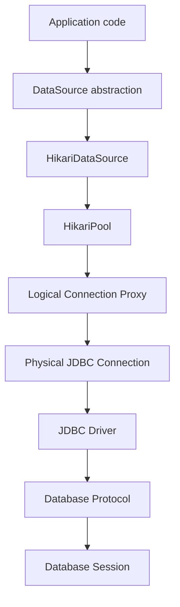

Aplikasi idealnya tidak bergantung langsung pada `DriverManager`. Aplikasi bergantung pada `DataSource`. Dalam production modern, implementasi `DataSource` tersebut sering berupa `HikariDataSource`.

Artinya:

```java
DataSource dataSource = hikariDataSource;

try (Connection connection = dataSource.getConnection()) {
    // use JDBC
}
```

Yang dilihat aplikasi adalah `DataSource` dan `Connection` standar JDBC. Yang terjadi di bawahnya adalah pool management.

---

## 3. Mental Model Utama: HikariCP Mengelola Physical Connection, Aplikasi Meminjam Logical Connection

Saat memakai HikariCP, jangan membayangkan `getConnection()` selalu membuka koneksi baru ke database.

Yang lebih akurat:

1. HikariCP memiliki sejumlah physical database connection.
2. Aplikasi memanggil `dataSource.getConnection()`.
3. HikariCP mencari physical connection yang idle.
4. HikariCP mengembalikan logical/proxy `Connection` ke aplikasi.
5. Aplikasi memakai connection tersebut.
6. Aplikasi memanggil `close()`.
7. HikariCP tidak selalu menutup physical connection.
8. HikariCP mengembalikan physical connection ke pool setelah state dibersihkan/diatur ulang.

Diagram lifecycle:

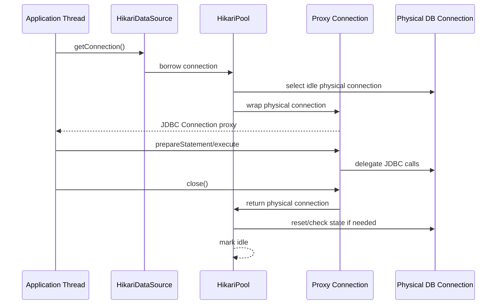

The important trap:

> In pooled JDBC, `Connection.close()` usually means “return to pool”, not “close TCP/database session now”.

Tetapi dari perspektif aplikasi, kontraknya tetap sama: selalu tutup connection setelah digunakan.

---

## 4. HikariCP Bukan API Baru Untuk SQL

HikariCP tidak mengganti JDBC.

HikariCP tidak menyediakan:

- query builder;
- ORM;
- mapper;
- migration engine;
- transaction framework;
- SQL dialect abstraction;
- retry framework;
- slow query analyzer;
- statement cache di layer pool.

HikariCP menyediakan:

- `DataSource` implementation;
- physical connection pooling;
- connection acquisition timeout;
- connection validation;
- lifecycle retirement;
- leak detection log;
- optional metrics integration;
- optional JMX management;
- pool suspension support jika diaktifkan;
- fast low-overhead connection borrow/return path.

Karena itu, batas tanggung jawabnya harus jelas:

| Concern | HikariCP Responsibility? | Catatan |
|---|---:|---|
| Membuka physical DB connection | Ya | Via driver/DataSource |
| Reuse connection | Ya | Dengan bounded pool |
| Menentukan SQL benar/salah | Tidak | Tanggung jawab aplikasi/DB |
| Membuat query cepat | Tidak langsung | Pool hanya mengurangi connection acquisition overhead |
| Mencegah SQL injection | Tidak | Gunakan `PreparedStatement` |
| Mengelola transaction boundary | Tidak secara high-level | Aplikasi/Spring/JTA yang menentukan |
| Rollback otomatis saat bug aplikasi | Tidak boleh diasumsikan | Harus ada transaction discipline |
| Menyelesaikan deadlock | Tidak | Deadlock adalah DB concurrency issue |
| Menentukan pool size terbaik | Tidak otomatis | Engineer harus sizing berdasarkan workload |
| Observability pool | Sebagian | Metrics/JMX tersedia, tapi integrasi tetap perlu |

---

## 5. HikariConfig: Configuration Object

`HikariConfig` adalah object konfigurasi.

Contoh minimal programmatic configuration:

```java
import com.zaxxer.hikari.HikariConfig;
import com.zaxxer.hikari.HikariDataSource;

import javax.sql.DataSource;

public final class DataSources {

    public static DataSource createMainDataSource() {
        HikariConfig config = new HikariConfig();
        config.setJdbcUrl("jdbc:postgresql://localhost:5432/appdb");
        config.setUsername("app_user");
        config.setPassword("secret");
        config.setMaximumPoolSize(10);
        config.setPoolName("main-db-pool");

        return new HikariDataSource(config);
    }
}
```

Dalam aplikasi Spring Boot, biasanya konfigurasi dibaca dari properties/YAML dan Spring Boot membuat `HikariDataSource`. Tapi mental modelnya tetap sama: ada object config, lalu ada data source/pool runtime.

Contoh Spring Boot style:

```yaml
spring:
  datasource:
    url: jdbc:postgresql://localhost:5432/appdb
    username: app_user
    password: ${APP_DB_PASSWORD}
    hikari:
      pool-name: main-db-pool
      maximum-pool-size: 10
      connection-timeout: 1000
      validation-timeout: 500
      max-lifetime: 1740000
```

Part ini tidak membahas setiap konfigurasi secara detail. Itu tugas part 018. Di sini kita fokus pada lifecycle.

---

## 6. HikariDataSource: DataSource + Pool Lifecycle

`HikariDataSource` adalah implementasi `DataSource` yang dimiliki HikariCP.

Ia punya dua peran:

1. Expose API `DataSource` ke aplikasi.
2. Mengelola lifecycle pool internal.

Karena itu `HikariDataSource` bukan object ringan yang bebas dibuat kapan saja. Membuat `HikariDataSource` berarti membuat pool runtime.

Contoh benar:

```java
public final class ApplicationCompositionRoot {

    private final HikariDataSource dataSource;

    public ApplicationCompositionRoot(AppConfig appConfig) {
        HikariConfig config = new HikariConfig();
        config.setJdbcUrl(appConfig.jdbcUrl());
        config.setUsername(appConfig.dbUsername());
        config.setPassword(appConfig.dbPassword());
        config.setMaximumPoolSize(appConfig.maximumPoolSize());
        config.setPoolName("main-db-pool");

        this.dataSource = new HikariDataSource(config);
    }

    public DataSource dataSource() {
        return dataSource;
    }

    public void shutdown() {
        dataSource.close();
    }
}
```

Contoh salah:

```java
public User findById(long id) {
    HikariConfig config = new HikariConfig();
    config.setJdbcUrl("jdbc:postgresql://localhost:5432/appdb");
    config.setUsername("app_user");
    config.setPassword("secret");

    try (HikariDataSource ds = new HikariDataSource(config);
         Connection connection = ds.getConnection()) {
        // query
    }
}
```

Masalah contoh salah:

- membuat pool setiap call;
- membuka physical connection berulang;
- menghancurkan manfaat pooling;
- menambah latency;
- menambah churn ke DB;
- berisiko connection storm;
- sulit dimonitor;
- lifecycle kacau.

Rule:

> One application instance should usually create a small, explicit number of long-lived pools during startup, then close them during shutdown.

---

## 7. Startup Lifecycle

Saat `HikariDataSource` dibuat, HikariCP memvalidasi konfigurasi dan menyiapkan pool.

Secara sederhana:

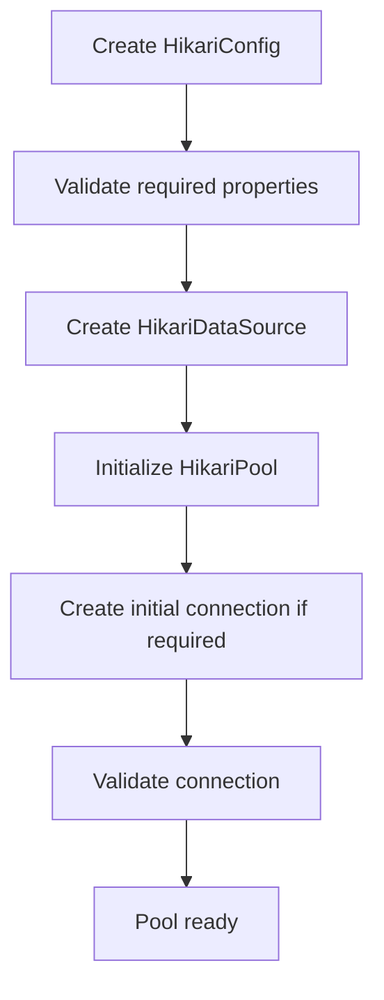

Hal yang perlu dipahami:

- Startup dapat fail-fast jika pool tidak bisa memperoleh initial connection.
- Startup behavior dipengaruhi `initializationFailTimeout`.
- Beberapa konfigurasi membuat pool mencoba connection saat startup.
- Beberapa konfigurasi mengizinkan startup berjalan walau DB belum siap, tetapi request pertama bisa gagal.
- Dalam service production, pilihan fail-fast vs lazy start harus disesuaikan dengan deployment model.

### 7.1 Fail-Fast Startup

Fail-fast berarti aplikasi gagal start jika database tidak tersedia atau config salah.

Kelebihan:

- config error terdeteksi cepat;
- deployment gagal sebelum menerima traffic;
- lebih aman untuk service yang wajib DB-ready;
- cocok untuk strict readiness.

Kekurangan:

- saat DB maintenance, service bisa restart-loop;
- dalam environment tertentu, dependency ordering bisa menyulitkan;
- tidak cocok untuk worker yang bisa idle sampai DB siap.

### 7.2 Lazy/Background Startup

Lazy startup berarti aplikasi bisa start meskipun pool belum berhasil membuat connection.

Kelebihan:

- lebih toleran terhadap temporary dependency unavailability;
- cocok untuk beberapa batch/worker/deployment orchestration tertentu.

Kekurangan:

- readiness bisa misleading jika tidak hati-hati;
- request pertama bisa gagal;
- config error bisa muncul terlambat;
- incident lebih sulit jika startup tampak sukses tetapi DB path rusak.

Rule praktis:

> For synchronous APIs that cannot serve without the database, prefer failing readiness until the pool can acquire and validate connections.

---

## 8. Borrow Lifecycle: Apa Yang Terjadi Saat `getConnection()`

Saat aplikasi memanggil:

```java
Connection connection = dataSource.getConnection();
```

HikariCP melakukan kira-kira:

1. cek pool masih berjalan;
2. cari idle connection;
3. jika ada, pinjamkan;
4. jika tidak ada dan total connection belum mencapai `maximumPoolSize`, coba membuat connection baru;
5. jika tidak ada dan pool sudah penuh, thread menunggu;
6. jika menunggu lebih lama dari `connectionTimeout`, throw `SQLException`;
7. jika connection tersedia, kembalikan proxy `Connection`.

Diagram:

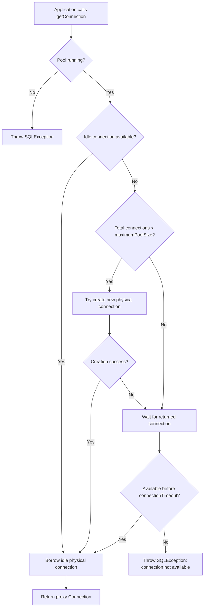

Important invariant:

> `connectionTimeout` is pool acquisition timeout, not SQL execution timeout.

Jika `getConnection()` timeout, artinya aplikasi tidak berhasil mendapatkan connection dari pool dalam batas waktu. Penyebabnya bisa:

- pool terlalu kecil untuk workload;
- query lambat;
- transaction terlalu panjang;
- connection leak;
- DB lambat membuat connection baru;
- lock contention membuat connection ditahan lama;
- thread concurrency terlalu tinggi;
- service downstream call dilakukan sambil transaction terbuka;
- pool tidak bisa membuat connection karena DB max connection tercapai;
- network/database outage.

---

## 9. Return Lifecycle: Apa Yang Terjadi Saat `close()`

Kode benar:

```java
try (Connection connection = dataSource.getConnection()) {
    // use connection
}
```

Saat block selesai, `close()` dipanggil otomatis.

Pada pooled connection:

- aplikasi tidak boleh memakai connection lagi setelah `close()`;
- HikariCP mengembalikan physical connection ke pool;
- state connection perlu dipastikan aman untuk borrower berikutnya;
- jika connection sudah broken, connection dapat dievakuasi/ditutup dan diganti.

Diagram:

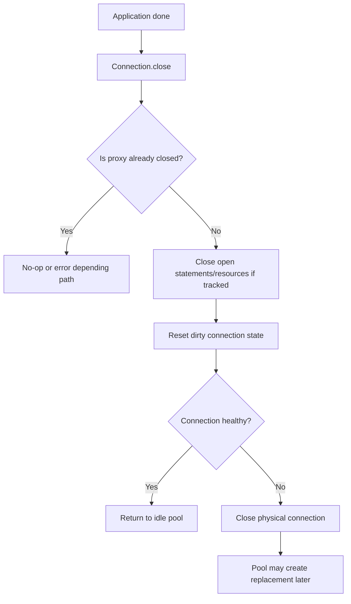

Yang harus diingat:

> The borrower owns the logical connection. The pool owns the physical connection.

Aplikasi wajib:

- meminjam connection sependek mungkin;
- menutup connection selalu;
- tidak menyimpan connection sebagai field;
- tidak mengirim connection ke thread lain;
- tidak return connection ke caller yang tidak jelas ownership-nya;
- tidak memanggil async operation dengan connection yang masih terbuka.

---

## 10. Logical Connection Proxy

HikariCP mengembalikan proxy object, bukan membiarkan aplikasi bebas memegang physical connection secara mentah.

Proxy ini memungkinkan HikariCP:

- intercept `close()` agar connection dikembalikan ke pool;
- melacak state yang berubah;
- menangani leak detection;
- mencegah penggunaan setelah close;
- membersihkan statement tracking tertentu;
- menjaga lifecycle physical connection.

Contoh bug:

```java
Connection connection = dataSource.getConnection();
connection.close();
connection.prepareStatement("select 1"); // bug: use-after-close
```

Dalam pooled environment, bug ini tetap bug walaupun physical connection mungkin masih hidup di pool. Logical handle sudah selesai.

---

## 11. State Reset: Kenapa Ini Penting

Connection punya state. Ini sering dilupakan.

State yang bisa berubah:

- auto-commit;
- transaction isolation;
- read-only flag;
- catalog;
- schema;
- network timeout;
- holdability;
- session variables melalui SQL;
- role/user context tergantung database;
- time zone/session settings tergantung database;
- temporary table state tergantung database.

HikariCP dapat mengelola beberapa state JDBC-level yang diketahui. Tetapi jangan menganggap semua state database-level otomatis aman.

Contoh berbahaya:

```java
try (Connection connection = dataSource.getConnection()) {
    try (Statement statement = connection.createStatement()) {
        statement.execute("set search_path to tenant_123");
    }
}

// borrower berikutnya mungkin tidak sadar session setting berubah,
// tergantung database/driver/pool reset behavior.
```

Lebih aman:

- gunakan schema qualified table jika memungkinkan;
- gunakan connection init SQL hanya untuk state global yang benar-benar berlaku untuk semua borrower;
- hindari session mutation dinamis;
- jika wajib multi-tenant by schema, desain reset eksplisit dan test leakage;
- pisahkan pool jika state default berbeda secara fundamental.

Rule:

> Any mutable session state must be treated as contamination risk unless you can prove it is reset before the next borrower.

---

## 12. HikariCP Housekeeper

HikariCP memiliki background housekeeping tasks. Tujuannya menjaga pool tetap sehat dan sesuai lifecycle policy.

Secara konseptual, housekeeper bertugas pada area seperti:

- retirement connection yang melewati `maxLifetime`;
- menjaga minimum idle connection jika dikonfigurasi;
- idle connection cleanup;
- keepalive untuk idle connection jika dikonfigurasi;
- pool maintenance periodic.

Jangan membayangkan housekeeper sebagai thread yang membuat query aplikasi lebih cepat. Ia adalah maintenance mechanism.

Important point:

> HikariCP relies on accurate timers for performance and reliability. Mesin yang clock-nya tidak stabil dapat menghasilkan behavior pool yang sulit didiagnosis.

Implikasi production:

- pastikan NTP/time sync benar;
- jangan suspend VM/container secara brutal lalu berharap timer behavior selalu ideal;
- monitor pause besar akibat GC atau host scheduling;
- jangan mengubah internal unsupported system properties.

---

## 13. Connection Validation

Connection bisa mati saat idle karena:

- database restart;
- network device idle timeout;
- firewall/NAT timeout;
- TCP half-open;
- failover;
- server-side connection kill;
- credential/session invalidation;
- long stop-the-world pause.

Pool perlu memastikan connection yang diberikan masih usable.

HikariCP modern mengandalkan JDBC4 `Connection.isValid()` jika driver mendukung. `connectionTestQuery` biasanya hanya untuk driver lama yang tidak mendukung JDBC4 validation.

Mental model:

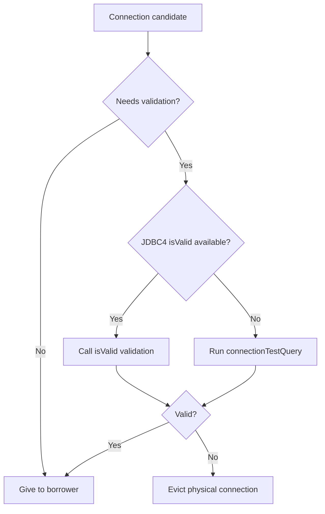

Guideline:

- Jangan set `connectionTestQuery` jika driver JDBC4 bekerja dengan benar.
- Gunakan `validationTimeout` yang lebih kecil dari `connectionTimeout`.
- Validation bukan pengganti query timeout.
- Validation bukan bukti bahwa query bisnis akan cepat.

---

## 14. Keepalive: Menjaga Idle Connection Tidak Dibunuh Diam-Diam

Beberapa infrastruktur memutus idle TCP connection secara diam-diam. Jika pool menyimpan idle connection terlalu lama, borrower berikutnya bisa mendapat connection yang tampak ada tapi sebenarnya rusak.

HikariCP punya `keepaliveTime` untuk idle connection. Saat waktunya tiba, connection idle dikeluarkan sebentar, diping/validasi, lalu dikembalikan.

Tetapi keepalive bukan solusi universal.

Ada beberapa layer keepalive:

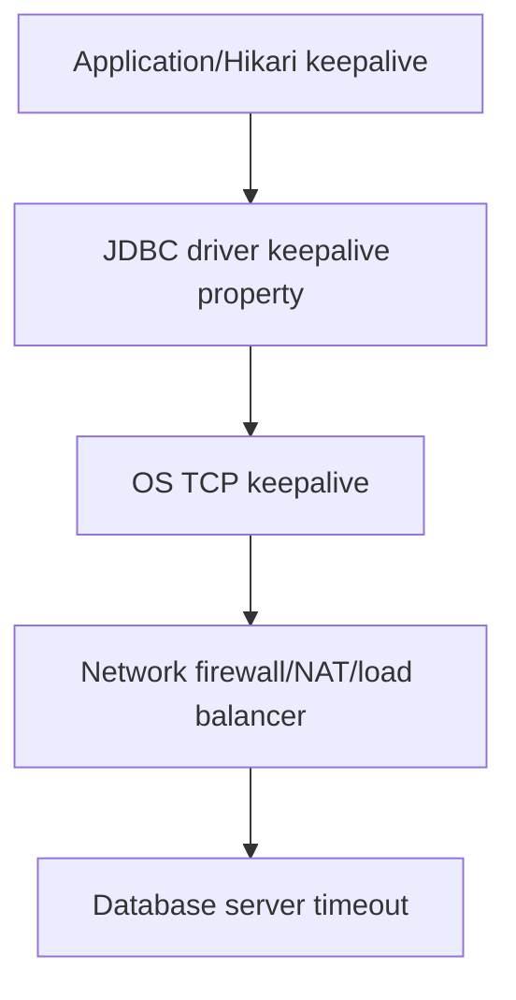

Rule:

> Hikari keepalive should be coordinated with database, driver, OS, and network idle timeout policies.

Jika firewall membunuh idle connection setelah 5 menit, jangan set keepalive lebih lama dari itu. Jika database membunuh connection setelah 30 menit, `maxLifetime` sebaiknya lebih pendek dari limit tersebut.

---

## 15. `maxLifetime`: Retirement, Bukan Query Timeout

`maxLifetime` mengontrol umur maksimum physical connection dalam pool.

Connection yang sedang dipakai tidak akan dihentikan secara paksa hanya karena melewati `maxLifetime`. Ia akan retired setelah dikembalikan.

Mental model:

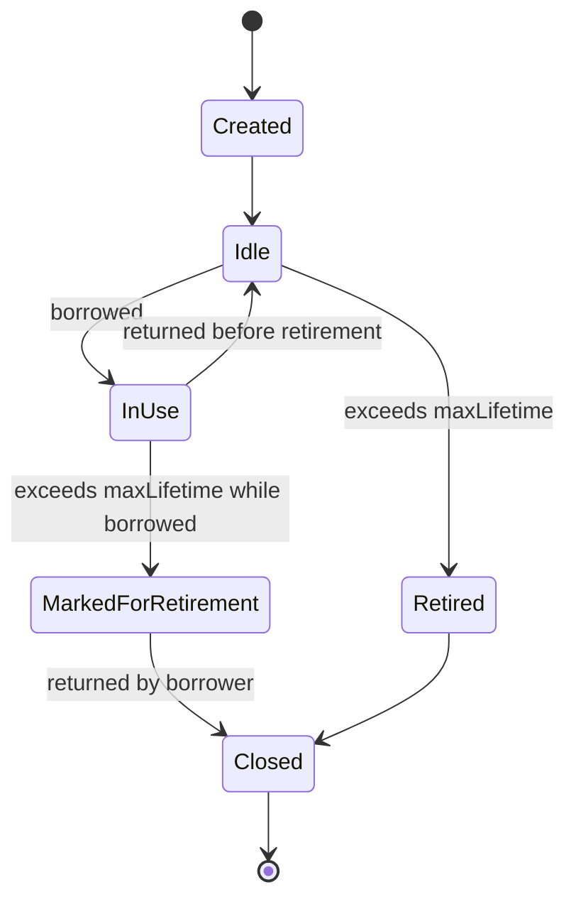

Tujuan `maxLifetime`:

- menghindari connection hidup lebih lama dari policy database/infrastructure;
- mengurangi risiko stale long-lived sessions;
- melakukan churn terkendali;
- mencegah mass death jika diset dengan attenuation internal.

Anti-pattern:

```yaml
maximum-pool-size: 20
max-lifetime: 30000 # terlalu pendek untuk banyak workload
```

Dampak:

- connection churn tinggi;
- authentication overhead naik;
- DB session creation spike;
- latency meningkat;
- pool tampak “sibuk” tanpa query bisnis meningkat.

---

## 16. `minimumIdle`: Fixed Pool vs Elastic Pool

HikariCP secara umum merekomendasikan tidak mengatur `minimumIdle` secara eksplisit agar pool bertindak seperti fixed-size pool, karena default `minimumIdle` sama dengan `maximumPoolSize`.

Mental model:

- Fixed pool: pool mencoba mempertahankan sejumlah connection tetap.
- Elastic pool: pool bisa turun ke idle minimum dan naik saat demand.

Fixed pool cocok untuk:

- latency predictability;
- steady workload;
- service API utama;
- database connection creation yang mahal;
- spike demand yang perlu responsif.

Elastic pool cocok jika:

- traffic sangat jarang;
- connection mahal untuk dipertahankan;
- banyak service kecil sharing DB max connection;
- cold-start latency bisa diterima.

Namun elastic pool bukan free lunch. Saat spike datang, connection perlu dibuat, dan creation bisa lambat.

Rule:

> Do not set `minimumIdle` lower than `maximumPoolSize` just because it looks resource efficient. Model spike behavior first.

---

## 17. Pool Suspension

HikariCP dapat mendukung pool suspension jika `allowPoolSuspension` diaktifkan. Saat pool suspended, request `getConnection()` dapat ditahan sampai pool resumed.

Ini bukan setting umum.

Use case valid:

- planned failover automation;
- controlled database switchover;
- operator-driven maintenance;
- advanced infrastructure orchestration.

Risk:

- thread bisa menumpuk;
- timeout behavior berbeda;
- aplikasi bisa tampak hang;
- perlu operational discipline yang kuat.

Rule:

> Do not enable pool suspension unless you have an explicit operational playbook for suspend/resume.

---

## 18. JMX dan Metrics

HikariCP dapat expose management/monitoring via JMX jika `registerMbeans` diaktifkan. HikariCP juga mendukung integrasi metric registry tertentu secara programmatic.

Minimal metrics yang harus kamu pahami:

| Metric | Arti | Interpretasi |
|---|---|---|
| active connections | connection sedang dipinjam | Tinggi terus-menerus bisa normal atau bottleneck |
| idle connections | connection tersedia | Nol terus-menerus berarti pool selalu terpakai penuh |
| total connections | physical connection dalam pool | Harus <= `maximumPoolSize` |
| pending threads | thread menunggu connection | Sinyal pressure paling penting |
| connection acquisition time | waktu menunggu `getConnection()` | Naik saat pool/DB pressure |
| connection timeout count | gagal acquire connection | SLO-impacting symptom |
| connection creation time | waktu membuat physical connection | Naik saat DB/network/auth bermasalah |

Diagram observability:

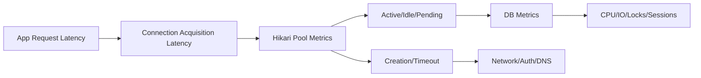

Rule:

> Never debug database latency from application request latency alone. Split acquisition latency, execution latency, and transaction duration.

---

## 19. Logging: Pool Name Matters

Set `poolName`.

Contoh:

```java
config.setPoolName("orders-write-db");
```

Atau:

```yaml
spring:
  datasource:
    hikari:
      pool-name: orders-write-db
```

Kenapa penting?

- log lebih mudah dibaca;
- metrics lebih mudah dicari;
- JMX object lebih jelas;
- multi-pool app tidak ambigu;
- incident response lebih cepat.

Anti-pattern:

```text
HikariPool-1 - Connection is not available
```

Lebih baik:

```text
orders-write-db - Connection is not available
```

Saat incident, nama pool yang jelas mengurangi waktu diagnosis.

---

## 20. Dependency dan Artifact

Untuk Java modern, artifact HikariCP umumnya:

```xml
<dependency>
  <groupId>com.zaxxer</groupId>
  <artifactId>HikariCP</artifactId>
  <version>7.1.0</version>
</dependency>
```

Versi aktual harus mengikuti compatibility project dan dependency management yang dipakai. Jika memakai Spring Boot, biasanya Spring Boot BOM mengelola versi HikariCP.

Rule:

> In framework-managed applications, prefer the platform BOM unless you have a specific reason to override the HikariCP version.

Kenapa?

- menghindari dependency mismatch;
- menjaga compatibility dengan auto-configuration;
- memudahkan patching via platform upgrade;
- mengurangi dependency drift.

---

## 21. Minimal Production Configuration

Contoh minimal yang masuk akal untuk service kecil, bukan angka universal:

```java
HikariConfig config = new HikariConfig();
config.setPoolName("orders-write-db");
config.setJdbcUrl("jdbc:postgresql://db.example.com:5432/orders");
config.setUsername("orders_app");
config.setPassword(System.getenv("ORDERS_DB_PASSWORD"));

config.setMaximumPoolSize(10);
config.setConnectionTimeout(1_000);
config.setValidationTimeout(500);
config.setMaxLifetime(1_740_000); // 29 minutes, example only

HikariDataSource dataSource = new HikariDataSource(config);
```

Kenapa ini belum final?

Karena angka harus ditentukan dari:

- DB max connections;
- jumlah instance aplikasi;
- average query time;
- p95/p99 query time;
- transaction duration;
- request concurrency;
- lock behavior;
- failover/network behavior;
- workload read/write split;
- SLO.

Part 019 akan khusus membahas sizing.

---

## 22. Lifecycle Dengan Transaction Runner

HikariCP harus dipakai dengan connection ownership yang jelas.

Contoh transaction runner:

```java
@FunctionalInterface
public interface SqlWork<T> {
    T execute(Connection connection) throws SQLException;
}

public final class JdbcTransactionRunner {

    private final DataSource dataSource;

    public JdbcTransactionRunner(DataSource dataSource) {
        this.dataSource = dataSource;
    }

    public <T> T inTransaction(SqlWork<T> work) throws SQLException {
        try (Connection connection = dataSource.getConnection()) {
            boolean previousAutoCommit = connection.getAutoCommit();
            connection.setAutoCommit(false);

            try {
                T result = work.execute(connection);
                connection.commit();
                return result;
            } catch (Throwable error) {
                try {
                    connection.rollback();
                } catch (SQLException rollbackError) {
                    error.addSuppressed(rollbackError);
                }
                throw error;
            } finally {
                connection.setAutoCommit(previousAutoCommit);
            }
        }
    }
}
```

Catatan:

- runner meminjam satu connection;
- semua repository menerima connection yang sama;
- commit/rollback berada di satu tempat;
- `close()` mengembalikan connection ke HikariCP;
- state auto-commit dipulihkan defensively.

Dalam Spring, pola ini digantikan oleh `@Transactional` dan `DataSourceTransactionManager`, tetapi prinsipnya sama: satu transaction boundary harus memiliki ownership connection yang jelas.

---

## 23. Interaction Dengan Spring Boot

Spring Boot secara umum menggunakan HikariCP sebagai default connection pool jika dependency tersedia. Tetapi penggunaan Spring Boot tidak menghapus kebutuhan memahami HikariCP.

Contoh konfigurasi:

```yaml
spring:
  datasource:
    url: jdbc:postgresql://db.example.com:5432/orders
    username: orders_app
    password: ${ORDERS_DB_PASSWORD}
    hikari:
      pool-name: orders-write-db
      maximum-pool-size: 10
      connection-timeout: 1000
      validation-timeout: 500
      max-lifetime: 1740000
      leak-detection-threshold: 0
```

Interaction penting:

- Spring meminjam connection dari `DataSource`;
- transaction manager dapat bind connection ke thread;
- `JdbcTemplate` menggunakan connection dari transaction context jika ada;
- `@Transactional` tidak membuat HikariCP berbeda, ia hanya mengatur transaction boundary;
- jika tidak ada transaction aktif, operation bisa berjalan auto-commit;
- pool exhaustion tetap mungkin walau memakai Spring.

Anti-pattern Spring:

```java
@Service
public class BadService {

    private final DataSource dataSource;

    public BadService(DataSource dataSource) {
        this.dataSource = dataSource;
    }

    @Transactional
    public void doWork() throws Exception {
        try (Connection c = dataSource.getConnection()) {
            // manual connection outside Spring transaction expectation
        }
    }
}
```

Masalahnya bukan selalu “pasti salah”, tetapi mudah mencampur connection yang dikelola Spring transaction dengan manual borrow yang tidak ikut transaction yang sama. Kalau perlu raw JDBC di Spring, gunakan `JdbcTemplate` atau `DataSourceUtils` sesuai konteks framework.

---

## 24. HikariCP Tidak Menyediakan Statement Cache

HikariCP secara sengaja tidak menyediakan prepared statement cache di layer pool.

Alasannya penting secara arsitektur:

- statement cache di pool biasanya per connection;
- jika ada 250 query umum dan 20 connection, pool-level cache bisa berarti ribuan statement object/plan handle;
- driver/database biasanya lebih tahu cara caching yang benar;
- driver-level caching bisa memanfaatkan database-specific capability;
- pool-level statement cache bisa memperburuk memory dan plan pressure.

Guideline:

> Configure statement caching in the JDBC driver/database layer when needed, not in HikariCP.

Contoh untuk PostgreSQL/MySQL/Oracle berbeda. Jangan copy-paste property driver lintas database.

---

## 25. Shutdown Lifecycle

Pool harus ditutup saat aplikasi shutdown.

Jika menggunakan Spring Boot, lifecycle biasanya dikelola container. Jika membuat manual, panggil `close()`.

```java
public final class App implements AutoCloseable {

    private final HikariDataSource dataSource;

    public App(HikariDataSource dataSource) {
        this.dataSource = dataSource;
    }

    @Override
    public void close() {
        dataSource.close();
    }
}
```

Kenapa penting?

- physical connection ditutup;
- background thread dihentikan;
- metrics/JMX lifecycle bersih;
- test tidak leak thread;
- redeploy tidak meninggalkan resource;
- DB tidak melihat session menggantung.

Anti-pattern dalam test:

```java
static HikariDataSource dataSource = new HikariDataSource(config);
// never closed
```

Dampak:

- test suite hang;
- thread leak warning;
- connection leak ke database test;
- flaky integration test.

---

## 26. Readiness dan Health Check

Health check harus membedakan:

1. proses aplikasi hidup;
2. pool object ada;
3. pool bisa menyediakan connection;
4. database bisa menjalankan query validasi ringan;
5. dependency bisnis benar-benar siap.

Readiness API yang terlalu dangkal:

```text
200 OK karena application process up
```

Padahal DB path rusak.

Readiness yang lebih berguna:

- acquire connection dengan timeout kecil;
- validate connection;
- optional lightweight query seperti `select 1` jika sesuai database;
- tidak menjalankan query mahal;
- tidak membuka transaction panjang;
- tidak mengganggu pool saat traffic tinggi;
- punya timeout yang lebih ketat dari request path.

Namun hati-hati:

> Health checks themselves can become load if every pod probes too frequently and every probe borrows from the same constrained pool.

Untuk environment besar, pertimbangkan:

- probe interval rasional;
- lightweight validation;
- dedicated health strategy;
- metrics-based alerting selain health endpoint.

---

## 27. Common Lifecycle Anti-Patterns

### 27.1 Membuat Pool Per Request

```java
public void handle(Request request) {
    HikariDataSource ds = new HikariDataSource(config);
    // use ds
    ds.close();
}
```

Ini menghancurkan pooling.

### 27.2 Tidak Menutup Connection

```java
Connection c = dataSource.getConnection();
PreparedStatement ps = c.prepareStatement("select * from users");
ResultSet rs = ps.executeQuery();
// forgot close
```

Gunakan try-with-resources.

### 27.3 Menyimpan Connection Sebagai Field

```java
public final class UserRepository {
    private final Connection connection;
}
```

Connection bukan singleton dependency. `DataSource` adalah dependency. `Connection` adalah short-lived borrowed resource.

### 27.4 Transaction Terlalu Panjang

```java
@Transactional
public void process() {
    repository.updateStatus();
    externalPaymentClient.charge(); // bad inside DB transaction
    repository.insertAudit();
}
```

Connection ditahan saat menunggu external API.

### 27.5 Pool Size Sebagai Obat Semua Masalah

```yaml
maximum-pool-size: 200
```

Jika masalahnya slow query atau lock contention, memperbesar pool dapat membuat DB makin overload.

### 27.6 Mengaktifkan Leak Detection Permanen Dengan Threshold Rendah

Leak detection berguna untuk diagnosis. Tapi threshold yang terlalu rendah bisa menghasilkan false positive pada query/transaction yang memang lama.

### 27.7 Tidak Menamai Pool

Default name membuat incident multi-pool lebih sulit.

---

## 28. Failure Mode: Connection Acquisition Timeout

Pesan umum:

```text
Connection is not available, request timed out after 1000ms
```

Interpretasi benar:

> A thread waited for a connection from the pool and none became available before `connectionTimeout`.

Jangan langsung simpulkan pool terlalu kecil.

Diagnosis awal:

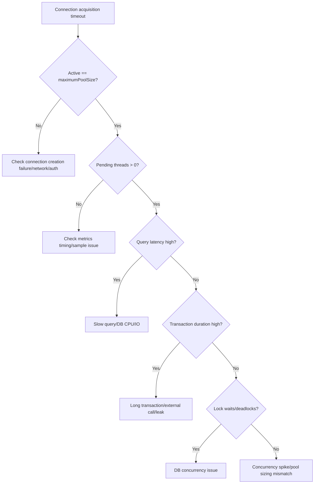

First questions:

- berapa active connections saat timeout?
- berapa pending threads?
- apakah idle nol?
- apakah query latency naik?
- apakah transaction duration naik?
- apakah DB CPU/IO saturated?
- apakah lock wait naik?
- apakah ada connection leak log?
- apakah service instance baru scale out?
- apakah DB max connections tercapai?

---

## 29. Failure Mode: Database Restart atau Network Partition

Saat database restart atau network partition terjadi:

- physical connections bisa mati;
- idle connections bisa stale;
- in-use query gagal;
- borrow berikutnya bisa gagal sampai pool mengganti connection;
- connection creation bisa lambat/gagal;
- request latency naik;
- retry storm bisa terjadi jika aplikasi retry agresif.

HikariCP membantu dengan validation dan connection replacement, tetapi tidak bisa membuat database tersedia.

Playbook:

1. Pastikan timeout pendek dan berlapis.
2. Pastikan retry punya budget dan jitter.
3. Pastikan pool tidak terlalu besar sehingga reconnect storm membanjiri DB.
4. Pastikan TCP keepalive/driver/network setting benar.
5. Pastikan readiness mencerminkan DB availability.
6. Pastikan failover behavior driver dipahami.

---

## 30. Failure Mode: Pool Goes Healthy But Database Is Slow

Pool metrics bisa tampak seperti masalah pool:

- active tinggi;
- idle nol;
- pending naik;
- acquisition timeout.

Tetapi root cause bisa di database:

- query plan berubah;
- index hilang/tidak dipakai;
- vacuum/statistics issue;
- lock contention;
- disk IO saturated;
- CPU saturated;
- replication lag;
- checkpoint pressure;
- temp file spill;
- connection storm dari service lain.

Rule:

> Pool exhaustion is often a symptom, not a root cause.

---

## 31. Failure Mode: Connection Leak

Connection leak artinya aplikasi meminjam connection tapi tidak mengembalikannya.

Common causes:

- tidak pakai try-with-resources;
- exception path tidak close;
- return `ResultSet` keluar method;
- streaming result tidak ditutup;
- async callback memegang connection;
- manual transaction runner bug;
- framework misuse.

Contoh leak:

```java
public ResultSet findUsers() throws SQLException {
    Connection connection = dataSource.getConnection();
    PreparedStatement ps = connection.prepareStatement("select * from users");
    return ps.executeQuery(); // connection ownership escaped
}
```

Benar:

```java
public List<User> findUsers() throws SQLException {
    String sql = "select id, name from users";

    try (Connection connection = dataSource.getConnection();
         PreparedStatement ps = connection.prepareStatement(sql);
         ResultSet rs = ps.executeQuery()) {

        List<User> users = new ArrayList<>();
        while (rs.next()) {
            users.add(new User(rs.getLong("id"), rs.getString("name")));
        }
        return users;
    }
}
```

Leak detection dapat membantu menemukan stack trace borrower yang menahan connection terlalu lama. Tetapi leak detection bukan pengganti ownership discipline.

---

## 32. HikariCP Dalam Multi-Pool Architecture

Kadang satu aplikasi punya lebih dari satu pool.

Contoh:

- write pool;
- read replica pool;
- reporting pool;
- admin/maintenance pool;
- tenant-specific pool;
- separate pool untuk long-running batch.

Diagram:

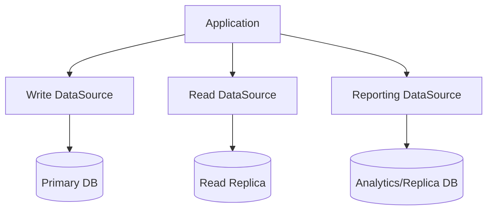

Keuntungan:

- workload isolation;
- timeout bisa beda;
- pool size bisa beda;
- metrics lebih jelas;
- batch tidak menghabiskan connection API utama.

Risiko:

- total connection math lebih kompleks;
- transaction lintas pool bukan lokal transaction biasa;
- read-after-write consistency issue;
- operational config bertambah;
- credential/secrets bertambah.

Rule:

> Separate pools are useful when they isolate genuinely different workload classes. They are dangerous when used to hide unclear boundaries.

---

## 33. HikariCP dan Container/Kubernetes

Dalam Kubernetes, pool sizing harus dikalikan jumlah pod.

Jika:

- `maximumPoolSize = 20`;
- replica = 10;
- service punya satu pool;

maka service bisa membuka sampai 200 physical DB connections.

Jika ada dua pool per pod, total bisa 400.

Formula awal:

```text
max_service_connections = pod_count × pools_per_pod × maximumPoolSize
```

Tapi formula sebenarnya harus mempertimbangkan:

- rolling deployment surge;
- HPA scale out;
- blue/green deployment;
- canary overlap;
- migration jobs;
- admin tools;
- other services sharing database;
- DB reserved connections.

Anti-pattern:

```yaml
# Looks harmless per pod, dangerous at fleet level
maximum-pool-size: 30
replicas: 30
```

Total potensi: 900 DB sessions.

---

## 34. Production Readiness Checklist

Sebelum HikariCP config dianggap production-ready, jawab:

### Identity

- Apakah pool punya `poolName` eksplisit?
- Apakah metrics label memuat service/environment/pool?
- Apakah log pool mudah dicari?

### Capacity

- Apakah `maximumPoolSize` dihitung terhadap jumlah instance?
- Apakah DB max connections cukup?
- Apakah ada reserved connection untuk admin/failover?
- Apakah batch workload dipisahkan?

### Lifecycle

- Apakah pool dibuat sekali saat startup?
- Apakah pool ditutup saat shutdown?
- Apakah test menutup pool?
- Apakah readiness menunggu DB jika service wajib DB?

### Timeout

- Apakah `connectionTimeout` masuk akal terhadap API SLO?
- Apakah `validationTimeout < connectionTimeout`?
- Apakah query timeout dikonfigurasi di layer statement/framework?
- Apakah DB lock timeout dipahami?

### Resilience

- Apakah `maxLifetime` lebih pendek dari DB/network forced lifetime?
- Apakah keepalive/TCP keepalive dikonfigurasi sesuai infrastructure?
- Apakah retry punya budget?
- Apakah DB failover sudah diuji?

### Observability

- Apakah active/idle/pending dimonitor?
- Apakah acquisition latency dimonitor?
- Apakah timeout count dimonitor?
- Apakah DB lock/query latency dikorelasikan?
- Apakah leak detection bisa diaktifkan saat investigasi?

---

## 35. Deliberate Practice

### Practice 1 — Explain Borrow/Return Lifecycle

Ambil kode service yang memakai `DataSource`. Jelaskan dengan diagram:

- kapan connection dipinjam;
- siapa pemilik connection;
- kapan connection ditutup;
- apa yang terjadi jika exception;
- apakah transaction boundary jelas;
- apakah ada path yang bisa leak.

### Practice 2 — Find Pool Creation Bugs

Cari di codebase:

```text
new HikariDataSource
new HikariConfig
DriverManager.getConnection
```

Klasifikasikan:

- composition root valid;
- test setup valid;
- per request bug;
- hidden pool creation;
- duplicate pool tanpa alasan.

### Practice 3 — Draw Capacity Formula

Untuk satu service:

- jumlah pod normal;
- jumlah pod saat rolling deployment;
- jumlah pool per pod;
- `maximumPoolSize` tiap pool;
- DB max connections;
- connection reserved.

Hitung worst-case.

### Practice 4 — Simulate Leak

Buat endpoint/test yang sengaja tidak close connection. Aktifkan leak detection di environment lokal. Amati:

- stack trace leak;
- active connections naik;
- idle connections turun;
- pending threads muncul;
- acquisition timeout setelah pool habis.

### Practice 5 — Simulate Slow Query

Buat query yang tidur/menunggu lock. Bedakan gejala:

- slow execution;
- active connection high;
- pending threads high;
- pool timeout;
- DB lock wait.

Tujuannya bukan merusak sistem, tapi membangun intuisi bahwa pool exhaustion sering gejala downstream.

---

## 36. Ringkasan

HikariCP adalah connection pool JDBC production-grade yang bekerja melalui `DataSource`. Aplikasi meminjam logical/proxy connection, sedangkan HikariCP mengelola physical database connection.

Hal yang harus tertanam:

- buat pool sekali saat startup;
- tutup pool saat shutdown;
- selalu close borrowed connection;
- `close()` pada pooled connection berarti return to pool;
- `connectionTimeout` adalah timeout menunggu connection dari pool;
- pool exhaustion sering gejala query/transaction/lock yang buruk;
- `poolName` penting untuk observability;
- HikariCP tidak menggantikan transaction design, query tuning, atau retry discipline;
- metrics pool harus dikorelasikan dengan metrics database;
- pool size harus dihitung di level fleet, bukan hanya per instance.

Part berikutnya akan membahas konfigurasi HikariCP secara detail: `maximumPoolSize`, `minimumIdle`, `connectionTimeout`, `idleTimeout`, `maxLifetime`, `keepaliveTime`, `validationTimeout`, `leakDetectionThreshold`, `autoCommit`, `readOnly`, `transactionIsolation`, `connectionInitSql`, dan lainnya.

---

## 37. Referensi

- HikariCP GitHub README — configuration, lifecycle notes, metrics, JMX, defaults, and design philosophy: https://github.com/brettwooldridge/HikariCP
- Java SE 25 `DataSource`: https://docs.oracle.com/en/java/javase/25/docs/api/java.sql/javax/sql/DataSource.html
- Java SE 25 `Connection`: https://docs.oracle.com/en/java/javase/25/docs/api/java.sql/java/sql/Connection.html
