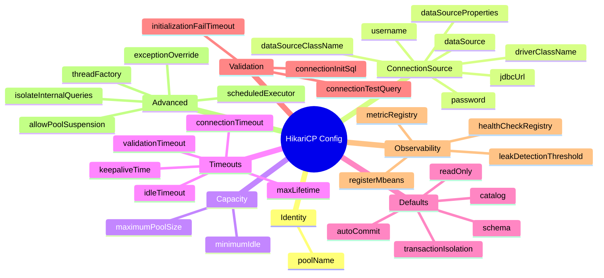
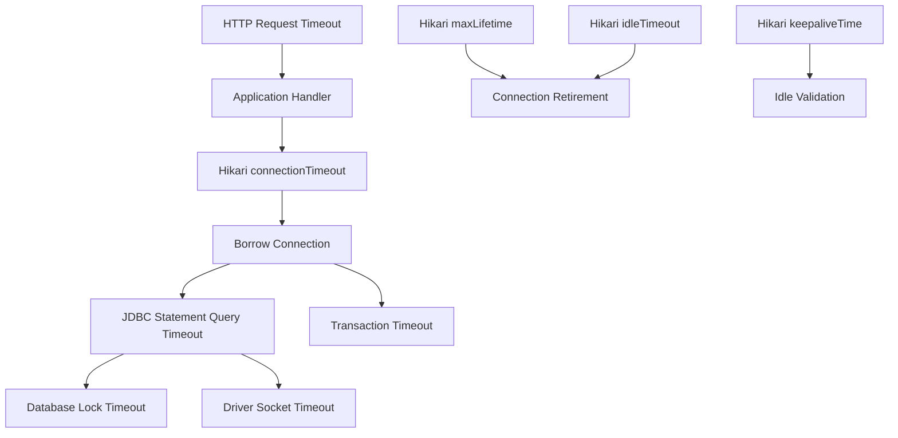

# Part 018 — HikariCP Configuration Deep Dive

## 1. Tujuan Part Ini

Part ini membahas konfigurasi HikariCP secara detail.

Kita tidak akan memperlakukan konfigurasi sebagai daftar property yang dihafal. Kita akan melihat setiap property sebagai control surface untuk capacity, latency, lifecycle, validation, transaction defaults, recovery, dan observability.

Setelah part ini, kamu harus bisa:

- membedakan konfigurasi essential, frequently used, dan advanced;
- menjelaskan efek `maximumPoolSize` terhadap concurrency database;
- menjelaskan efek `minimumIdle` terhadap fixed/elastic pool behavior;
- membedakan `connectionTimeout`, `validationTimeout`, `idleTimeout`, `maxLifetime`, dan `keepaliveTime`;
- mengatur `autoCommit`, `readOnly`, dan `transactionIsolation` tanpa merusak transaction boundary;
- memakai `leakDetectionThreshold` sebagai diagnostic tool, bukan obat;
- memilih antara `jdbcUrl` dan `dataSourceClassName` secara sadar;
- menghindari anti-pattern konfigurasi umum;
- membuat baseline config untuk API, batch, read replica, dan local development.

Kalimat penting:

> HikariCP configuration is not tuning by folklore. It is an explicit expression of workload shape, database capacity, infrastructure timeout, and failure policy.

---

## 2. Configuration Surface Map

Secara mental, konfigurasi HikariCP bisa dibagi menjadi beberapa kelompok.



Tujuan konfigurasi bukan “mengisi semua property”. Tujuan konfigurasi adalah membuat behavior eksplisit pada area yang berpengaruh.

Rule:

> The best HikariCP configuration is usually small, intentional, observable, and workload-specific.

---

## 3. Baseline: Jangan Mulai Dari 30 Knob

Untuk kebanyakan service, baseline awal cukup kecil:

```yaml
spring:
  datasource:
    url: jdbc:postgresql://db.example.com:5432/orders
    username: orders_app
    password: ${ORDERS_DB_PASSWORD}
    hikari:
      pool-name: orders-write-db
      maximum-pool-size: 10
      connection-timeout: 1000
      validation-timeout: 500
      max-lifetime: 1740000
```

Lalu tambahkan property lain hanya jika ada alasan:

- `minimumIdle` jika ingin elastic behavior;
- `keepaliveTime` jika ada idle connection drop policy;
- `leakDetectionThreshold` saat investigasi leak;
- `readOnly` untuk pool khusus read-only;
- `transactionIsolation` jika semua workload pool tersebut butuh default isolation tertentu;
- `connectionInitSql` jika semua session perlu initialization yang sama;
- `registerMbeans` jika JMX diperlukan.

Anti-pattern:

```yaml
spring:
  datasource:
    hikari:
      maximum-pool-size: 100
      minimum-idle: 100
      connection-timeout: 30000
      idle-timeout: 600000
      max-lifetime: 1800000
      leak-detection-threshold: 2000
      connection-test-query: SELECT 1
      auto-commit: false
      read-only: false
      transaction-isolation: TRANSACTION_SERIALIZABLE
```

Masalahnya bukan semua property itu selalu salah. Masalahnya: konfigurasi seperti ini sering copy-paste tanpa workload model.

---

## 4. `jdbcUrl`

`jdbcUrl` adalah cara paling umum mengonfigurasi URL JDBC driver.

Contoh:

```java
config.setJdbcUrl("jdbc:postgresql://db.example.com:5432/orders");
```

Spring Boot:

```yaml
spring:
  datasource:
    url: jdbc:postgresql://db.example.com:5432/orders
```

Use when:

- driver lebih umum dikonfigurasi via JDBC URL;
- framework/platform menggunakan URL;
- kamu butuh quick explicit setup;
- driver discovery via URL bekerja.

Catatan:

- banyak driver menerima parameter lewat URL;
- HikariCP juga mendukung `addDataSourceProperty`;
- untuk konfigurasi kompleks, driver-specific properties kadang lebih jelas daripada URL panjang.

Contoh:

```java
config.setJdbcUrl("jdbc:postgresql://db.example.com:5432/orders");
config.addDataSourceProperty("tcpKeepAlive", "true");
config.addDataSourceProperty("ApplicationName", "orders-service");
```

Rule:

> Keep JDBC URLs readable. Push driver-specific operational settings into named properties when that improves clarity.

---

## 5. `dataSourceClassName`

`dataSourceClassName` meminta HikariCP membuat vendor `DataSource` class secara reflectively.

Contoh konseptual:

```java
HikariConfig config = new HikariConfig();
config.setDataSourceClassName("org.postgresql.ds.PGSimpleDataSource");
config.addDataSourceProperty("serverName", "db.example.com");
config.addDataSourceProperty("portNumber", "5432");
config.addDataSourceProperty("databaseName", "orders");
```

Use when:

- vendor driver menyediakan `DataSource` yang jelas;
- kamu ingin konfigurasi property strongly separated;
- environment/container mengelola `DataSource` vendor;
- kamu menghindari URL parameter yang sulit diaudit.

Tetapi banyak aplikasi modern memakai `jdbcUrl` karena lebih sederhana dan kompatibel dengan framework.

Rule:

> Prefer consistency with your platform. `jdbcUrl` is common and pragmatic; `dataSourceClassName` can be cleaner for explicit vendor DataSource configuration.

---

## 6. `dataSource`

`dataSource` adalah programmatic path untuk membungkus instance `DataSource` yang sudah dibuat.

Contoh:

```java
PGSimpleDataSource pg = new PGSimpleDataSource();
pg.setServerNames(new String[] {"db.example.com"});
pg.setDatabaseName("orders");
pg.setUser("orders_app");
pg.setPassword(secret);

HikariConfig config = new HikariConfig();
config.setDataSource(pg);
config.setMaximumPoolSize(10);

HikariDataSource hikari = new HikariDataSource(config);
```

Use when:

- dependency injection sudah membuat vendor `DataSource`;
- perlu custom driver setup programmatic;
- container menyediakan `DataSource`;
- credential injection tidak cocok dengan `username/password` biasa.

Catatan:

- jika `dataSource` diset langsung, beberapa property source lain bisa diabaikan;
- pastikan ownership lifecycle jelas;
- jangan membungkus pooled DataSource lain di HikariCP kecuali benar-benar paham konsekuensinya.

Anti-pattern:

```text
App -> HikariCP -> Another pool -> Driver -> DB
```

Double pooling membuat metrics dan timeout membingungkan.

---

## 7. `username` dan `password`

`username` dan `password` digunakan HikariCP saat memperoleh connection dari underlying driver/DataSource.

Contoh:

```java
config.setUsername("orders_app");
config.setPassword(System.getenv("ORDERS_DB_PASSWORD"));
```

Guideline:

- jangan hard-code password;
- gunakan secret manager/env injection;
- pastikan log tidak mencetak password;
- gunakan user database dengan least privilege;
- pisahkan user read-only dan write jika perlu;
- rencanakan rotation.

Masalah production yang sering terjadi:

- password rotated tetapi pool lama masih punya connection valid sementara connection baru gagal;
- semua connection akhirnya retired lalu pool tidak bisa membuat connection baru;
- gejala muncul terlambat setelah `maxLifetime`/idle churn.

Playbook rotation:

1. deploy credential baru yang valid paralel jika database mendukung;
2. reload/restart service secara terkendali;
3. monitor connection creation failure;
4. pastikan old credential dicabut setelah semua instance berganti;
5. test failure mode di staging.

---

## 8. `driverClassName`

Pada JDBC modern, driver biasanya ditemukan dari `jdbcUrl` melalui service provider mechanism. `driverClassName` jarang perlu di-set.

Contoh hanya jika perlu:

```java
config.setDriverClassName("org.postgresql.Driver");
```

Use when:

- driver lama tidak auto-register;
- environment classpath/module path bermasalah;
- error message jelas meminta driver class;
- beberapa embedded/custom driver membutuhkan explicit class.

Anti-pattern:

```yaml
driver-class-name: copied.from.blog.Driver
```

Jika URL sudah cukup dan driver modern bekerja, property ini tidak menambah nilai.

---

## 9. `maximumPoolSize`

`maximumPoolSize` adalah batas maksimum physical connection dalam pool, termasuk idle dan in-use.

Ini adalah salah satu property paling penting.

```java
config.setMaximumPoolSize(10);
```

Mental model:

```text
maximumPoolSize = max concurrent database sessions from this pool in this application instance
```

Jika pool penuh dan tidak ada idle connection, `getConnection()` menunggu sampai:

- connection dikembalikan; atau
- `connectionTimeout` tercapai.

### 9.1 Kenapa Tidak Selalu Lebih Besar Lebih Baik

Database punya kapasitas terbatas:

- CPU cores;
- IO bandwidth;
- memory per session;
- lock manager pressure;
- worker process/thread capacity;
- max connections;
- cache locality;
- query plan/concurrency behavior.

Jika pool terlalu besar:

- lebih banyak query berjalan bersamaan;
- DB bisa saturated;
- lock contention naik;
- latency p95/p99 memburuk;
- timeout meningkat;
- failover recovery lebih berat;
- connection storm lebih parah.

### 9.2 Fleet-Level Math

Jika ada 12 pod dan tiap pod punya pool size 10:

```text
12 × 10 = 120 possible DB sessions
```

Jika rolling deployment max surge 25%:

```text
15 × 10 = 150 possible DB sessions
```

Jika ada read pool dan write pool:

```text
15 × 10 × 2 = 300 possible DB sessions
```

Rule:

> Size pools against database capacity and fleet topology, not against one JVM in isolation.

### 9.3 Initial Sizing Heuristic

Untuk service API umum:

1. mulai kecil;
2. ukur acquisition latency;
3. ukur query latency;
4. ukur DB CPU/IO/lock;
5. naikkan perlahan jika DB masih punya kapasitas dan pending tinggi karena pool terlalu ketat;
6. jangan naikkan jika DB sudah saturated atau lock wait tinggi.

Part 019 akan membahas sizing lebih formal.

---

## 10. `minimumIdle`

`minimumIdle` adalah jumlah minimum idle connection yang HikariCP coba pertahankan.

Default HikariCP sama dengan `maximumPoolSize`, sehingga behavior cenderung fixed-size pool jika tidak diubah.

Contoh elastic:

```java
config.setMaximumPoolSize(20);
config.setMinimumIdle(5);
```

Artinya:

- pool bisa naik sampai 20;
- saat idle, pool bisa turun dan mempertahankan sekitar 5 idle connection;
- saat spike, pool mungkin perlu membuat connection baru.

### 10.1 Fixed Pool

```yaml
maximum-pool-size: 20
# minimum-idle not set
```

Kelebihan:

- latency lebih predictable;
- siap menghadapi spike;
- menghindari connection creation saat traffic naik;
- cocok untuk service penting.

Kekurangan:

- mempertahankan lebih banyak DB session;
- kurang cocok untuk workload sangat jarang.

### 10.2 Elastic Pool

```yaml
maximum-pool-size: 20
minimum-idle: 3
```

Kelebihan:

- lebih hemat connection saat idle;
- cocok untuk low-traffic/background service;
- bisa membantu fleet dengan banyak service kecil.

Kekurangan:

- spike bisa kena connection creation latency;
- DB bisa menerima burst connection creation;
- tuning lebih sulit.

Rule:

> Do not set `minimumIdle` only because “idle connections look wasteful”. Idle capacity may be deliberate latency insurance.

---

## 11. `connectionTimeout`

`connectionTimeout` adalah maksimum waktu client menunggu connection dari pool.

Default HikariCP: 30 detik. Minimum acceptable: 250 ms.

Contoh:

```java
config.setConnectionTimeout(1_000);
```

Makna:

```text
If no connection is available within 1000 ms, throw SQLException.
```

Ini bukan:

- query timeout;
- transaction timeout;
- socket read timeout;
- lock timeout;
- database execution timeout.

### 11.1 Cara Memilih

Pilih berdasarkan SLO.

Jika HTTP endpoint punya timeout 2 detik, `connectionTimeout` 30 detik tidak masuk akal. Request akan menunggu connection lebih lama daripada budget response.

Contoh:

```text
API timeout budget: 2000 ms
DB query p95 target: 150 ms
DB query p99 target: 500 ms
Connection acquisition budget: 100-300 ms normal, 1000 ms degraded
```

Maka:

```yaml
connection-timeout: 500 # or 1000 depending degradation policy
```

### 11.2 Trade-Off

Terlalu pendek:

- false failure saat spike kecil;
- request gagal padahal bisa selesai jika menunggu sedikit;
- retry bisa memperburuk load.

Terlalu panjang:

- thread menumpuk;
- request timeout di upstream lebih dulu;
- cascading failure;
- user latency buruk;
- pool pressure tersembunyi.

Rule:

> `connectionTimeout` should be shorter than the caller's useful waiting budget.

---

## 12. `validationTimeout`

`validationTimeout` adalah batas waktu untuk menguji apakah connection masih hidup.

Default HikariCP: 5 detik. Minimum acceptable: 250 ms. Nilainya harus lebih kecil dari `connectionTimeout`.

Contoh:

```java
config.setValidationTimeout(500);
```

Guideline:

- buat lebih pendek dari acquisition timeout;
- jangan samakan dengan query timeout bisnis;
- validation harus ringan;
- jika validation sering lambat, itu sinyal network/DB/driver issue.

Anti-pattern:

```yaml
connection-timeout: 1000
validation-timeout: 5000
```

Ini tidak konsisten: validation bisa lebih lama dari budget acquire.

---

## 13. `idleTimeout`

`idleTimeout` mengontrol berapa lama connection boleh idle sebelum bisa retired.

Default HikariCP: 10 menit. Berlaku hanya jika `minimumIdle < maximumPoolSize`. Jika pool fixed-size dengan `minimumIdle == maximumPoolSize`, idle retirement tidak punya efek seperti yang sering dibayangkan.

Contoh:

```yaml
maximum-pool-size: 20
minimum-idle: 5
idle-timeout: 300000 # 5 minutes
```

Makna:

- connection idle di atas minimum idle bisa ditutup setelah idle timeout;
- connection tidak retired sebelum timeout;
- ada variasi scheduling internal, jadi jangan mengharapkan presisi detik.

Use when:

- elastic pool;
- ingin mengurangi idle session;
- workload intermittent;
- database connection budget terbatas.

Do not use as:

- query timeout;
- transaction timeout;
- leak protection;
- DB failover fix.

---

## 14. `maxLifetime`

`maxLifetime` adalah maksimum umur physical connection dalam pool.

Default HikariCP: 30 menit. Minimum acceptable: 30 detik. HikariCP merekomendasikan nilainya beberapa detik lebih pendek dari limit connection yang dipaksakan oleh database atau infrastruktur.

Contoh:

```yaml
max-lifetime: 1740000 # 29 minutes
```

### 14.1 Kenapa Perlu Lebih Pendek Dari Infrastructure Limit

Misal load balancer/firewall/database memutus connection pada 30 menit.

Jika `maxLifetime` juga 30 menit atau lebih panjang, connection bisa dibunuh dari luar saat pool mengira connection masih sehat.

Lebih aman:

```text
infrastructure forced lifetime: 30 minutes
Hikari maxLifetime: 29 minutes or slightly less
```

### 14.2 In-Use Connection Tidak Dibunuh Paksa

Jika connection sedang dipakai saat melewati `maxLifetime`, HikariCP tidak memutus operation di tengah. Connection akan retired setelah dikembalikan.

Implication:

- long transaction bisa membuat connection hidup melewati target lifetime;
- `maxLifetime` bukan transaction timeout;
- query panjang tetap perlu timeout lain.

### 14.3 Terlalu Pendek Itu Buruk

Jika `maxLifetime` terlalu pendek:

- connection churn naik;
- authentication overhead naik;
- DB sees frequent session open/close;
- latency spike;
- resource churn;
- observability noisy.

Rule:

> Set `maxLifetime` from real database/network connection lifetime policies, not from random blog defaults.

---

## 15. `keepaliveTime`

`keepaliveTime` mengontrol seberapa sering HikariCP mencoba menjaga idle connection tetap hidup.

Default HikariCP: 2 menit. Minimum acceptable: 30 detik. Nilainya harus lebih kecil dari `maxLifetime`. Keepalive hanya terjadi pada idle connection.

Saat keepalive:

1. idle connection dikeluarkan sementara dari pool;
2. HikariCP melakukan ping/validation;
3. connection dikembalikan jika valid;
4. connection diganti jika invalid.

### 15.1 Use Case

Use when:

- firewall/NAT membunuh idle connection;
- database/server punya idle session timeout;
- cloud networking silently drops idle TCP;
- traffic rendah membuat connection lama idle;
- kamu ingin stale connection terdeteksi sebelum borrower bisnis kena error.

### 15.2 Jangan Tabrak Dengan Policy Lain

Koordinasikan:

- database idle timeout;
- network idle timeout;
- driver keepalive;
- OS TCP keepalive;
- Hikari `maxLifetime`;
- Hikari `keepaliveTime`.

Contoh:

```text
network idle drop: 10 minutes
keepaliveTime: 5 minutes
maxLifetime: 29 minutes
```

Anti-pattern:

```text
network idle drop: 5 minutes
keepaliveTime: 10 minutes
```

Keepalive datang terlambat.

---

## 16. `connectionTestQuery`

`connectionTestQuery` adalah SQL yang dijalankan untuk validasi connection.

Contoh:

```java
config.setConnectionTestQuery("SELECT 1");
```

Namun untuk driver JDBC4 modern, HikariCP merekomendasikan tidak mengatur property ini dan membiarkan `Connection.isValid()` digunakan.

Use when:

- driver tidak mendukung JDBC4 `isValid()`;
- HikariCP log menunjukkan driver tidak compliant;
- ada kebutuhan vendor-specific validation yang benar-benar terbukti.

Do not use by default:

```yaml
connection-test-query: SELECT 1
```

Masalah:

- menambah query validation yang mungkin tidak perlu;
- bisa salah untuk database tertentu;
- dapat menutupi driver issue;
- sering copy-paste.

Rule:

> If the driver is JDBC4-compliant, prefer not setting `connectionTestQuery`.

---

## 17. `leakDetectionThreshold`

`leakDetectionThreshold` mengatur berapa lama connection boleh berada di luar pool sebelum HikariCP log kemungkinan leak.

Default: 0, disabled. Minimum untuk enabling: 2000 ms.

Contoh diagnosis:

```yaml
leak-detection-threshold: 5000
```

Makna:

```text
If a borrowed connection is not returned within 5 seconds, log possible leak.
```

### 17.1 Leak Detection Bukan Timeout

Leak detection tidak membatalkan query. Ia log stack trace untuk membantu diagnosis.

Jika connection akhirnya dikembalikan, bisa jadi itu bukan leak permanen, melainkan long-held connection.

Penyebab false positive:

- query memang lama;
- batch operation lama;
- transaction lama;
- report export streaming;
- debugger breakpoint;
- GC pause;
- host pause.

### 17.2 Cara Memakai

Gunakan untuk:

- local debugging;
- staging investigation;
- temporary production incident diagnosis dengan threshold rasional;
- menemukan code path yang tidak close connection.

Jangan gunakan sebagai:

- permanent low-threshold alert tanpa konteks;
- pengganti metrics transaction duration;
- query timeout;
- pool exhaustion solution.

Rule:

> Leak detection is a flashlight, not a seatbelt.

---

## 18. `autoCommit`

`autoCommit` mengontrol default auto-commit behavior connection yang dikembalikan dari pool.

Default HikariCP: true.

Contoh:

```yaml
auto-commit: true
```

### 18.1 Default True

Cocok jika:

- aplikasi memakai JDBC manual sederhana;
- setiap statement berdiri sendiri;
- transaction manager/framework akan mengubah auto-commit saat transaction aktif;
- kamu ingin default JDBC behavior.

### 18.2 Setting False Global

```yaml
auto-commit: false
```

Bisa valid, tetapi berisiko jika code tidak disiplin commit/rollback.

Risiko:

- statement SELECT bisa membuka transaction dan menahannya;
- idle in transaction;
- lock/version retention;
- connection kembali ke pool dengan state ambigu jika code buruk;
- repository tanpa transaction runner bisa lupa commit.

Dalam framework seperti Spring, biasanya biarkan framework/transaction manager mengatur auto-commit sesuai transaction boundary.

Rule:

> Do not globally set `autoCommit=false` unless every connection use path has explicit transaction ownership.

---

## 19. `readOnly`

`readOnly` mengatur default read-only mode connection dari pool.

Default HikariCP: false.

Contoh untuk read replica pool:

```yaml
spring:
  datasource:
    reader:
      hikari:
        pool-name: orders-read-db
        read-only: true
```

Use when:

- pool khusus read-only;
- database/driver memanfaatkan read-only hint;
- ingin guardrail terhadap accidental write;
- read replica connection.

Caveat:

- tidak semua database enforce read-only dengan cara sama;
- `Connection.setReadOnly(true)` bisa menjadi hint, bukan hard security boundary;
- least privilege DB user tetap lebih kuat;
- transaction read-only dari framework bisa override/berinteraksi.

Rule:

> Use `readOnly=true` as an optimization/guardrail, not as the only authorization boundary.

---

## 20. `transactionIsolation`

`transactionIsolation` mengatur default isolation level connection dari pool.

Contoh:

```yaml
transaction-isolation: TRANSACTION_READ_COMMITTED
```

Valid values mengikuti constant `Connection`, misalnya:

- `TRANSACTION_READ_UNCOMMITTED`;
- `TRANSACTION_READ_COMMITTED`;
- `TRANSACTION_REPEATABLE_READ`;
- `TRANSACTION_SERIALIZABLE`.

Use when:

- semua workload pool tersebut memang butuh default isolation tertentu;
- database default tidak sesuai requirement;
- kamu ingin explicit consistency policy;
- pool dipisahkan per workload.

Risiko:

- isolation tinggi bisa menambah contention;
- database berbeda punya semantics berbeda;
- framework transaction bisa override;
- setting global bisa terlalu kasar.

Anti-pattern:

```yaml
transaction-isolation: TRANSACTION_SERIALIZABLE
```

Tanpa workload analysis, ini bisa menurunkan throughput dan meningkatkan serialization failure/deadlock/lock wait.

Rule:

> Set isolation at the narrowest boundary that expresses the business consistency requirement.

Sering kali boundary yang tepat adalah transaction/use-case, bukan pool global.

---

## 21. `catalog` dan `schema`

`catalog` dan `schema` mengatur default catalog/schema connection.

Contoh:

```java
config.setSchema("orders");
```

Use when:

- database mendukung schema/catalog;
- semua query pool berada di schema yang sama;
- kamu ingin menghindari unqualified name ambiguity;
- environment punya default schema tidak stabil.

Caveat:

- schema behavior database berbeda;
- multi-tenant per schema perlu reset discipline;
- dynamic schema switching via connection state berisiko leak;
- qualified table names sering lebih eksplisit.

Anti-pattern:

```java
try (Connection c = dataSource.getConnection()) {
    c.setSchema(tenantSchema);
    // do work
}
```

Jika reset tidak dijamin, borrower berikutnya bisa terkena tenant/schema salah.

Rule:

> Dynamic schema mutation is session state. Treat it as contamination unless isolated or reset-tested.

---

## 22. `connectionInitSql`

`connectionInitSql` adalah SQL yang dieksekusi setelah physical connection baru dibuat sebelum masuk pool.

Contoh:

```yaml
connection-init-sql: "SET application_name = 'orders-service'"
```

Use when:

- semua session harus memiliki setting sama;
- ingin tagging DB session;
- ingin set timezone/session parameter global;
- driver property tidak menyediakan setting tersebut.

Risiko:

- SQL invalid membuat connection creation gagal;
- setting berlaku untuk semua borrower;
- hidden behavior sulit diketahui pembaca code;
- bisa membuat startup/pool fill gagal;
- database-specific.

Good use:

```sql
SET application_name = 'orders-service'
```

Risky use:

```sql
SET search_path = dynamic_tenant
```

Rule:

> `connectionInitSql` is for stable pool-wide session initialization, not per-request context.

---

## 23. `initializationFailTimeout`

`initializationFailTimeout` mengontrol apakah pool fail-fast saat startup jika tidak bisa memperoleh initial connection.

Default HikariCP: 1 ms after `connectionTimeout` semantics path as documented by HikariCP.

Simplified behavior:

- positive value: try to acquire/validate initial connection, fail if cannot within configured startup window;
- zero: attempt validation; if cannot obtain connection, pool may start but later acquisition can fail;
- negative: bypass initial connection attempt and start immediately, connection acquisition happens later/background.

Use fail-fast when:

- service tidak berguna tanpa DB;
- deployment harus gagal jika config salah;
- readiness harus strict;
- dependency order stabil.

Use lazy when:

- service bisa hidup tanpa DB sementara;
- worker idle sampai DB ready;
- special orchestration membutuhkan app process up dulu.

Rule:

> Startup success must mean something operationally. Do not make the app look healthy if its mandatory database path is broken.

---

## 24. `poolName`

`poolName` adalah nama pool untuk logging, metrics, dan JMX.

Contoh:

```yaml
pool-name: orders-write-db
```

Gunakan pola nama eksplisit:

```text
<service>-<workload>-<database>
orders-write-db
orders-read-replica
billing-reporting-db
case-management-main-db
```

Kenapa penting:

- incident logs jelas;
- metrics dashboard jelas;
- JMX jelas;
- multi-pool tidak ambigu;
- alert message actionable.

Rule:

> Every production pool should have an explicit name.

---

## 25. `metricRegistry`

`metricRegistry` memungkinkan integrasi dengan Codahale/Dropwizard metrics secara programmatic.

Contoh konseptual:

```java
MetricRegistry registry = new MetricRegistry();

HikariConfig config = new HikariConfig();
config.setMetricRegistry(registry);
```

Dalam aplikasi modern, metrics sering dikelola oleh framework/observability stack seperti Micrometer/Spring Boot Actuator. Prinsipnya tetap sama: expose pool metrics ke monitoring system.

Metrics minimum:

- active connections;
- idle connections;
- total connections;
- pending threads;
- acquisition time;
- connection creation time;
- timeout count;
- usage time.

Rule:

> Pool metrics are mandatory for production systems that care about latency and reliability.

---

## 26. `healthCheckRegistry`

`healthCheckRegistry` memungkinkan HikariCP melaporkan health via Dropwizard health checks.

Dalam banyak framework modern, health check berada di layer aplikasi. Yang penting bukan property spesifiknya, tapi design health check-nya.

Health check yang baik:

- punya timeout ketat;
- tidak menjalankan query mahal;
- tidak menghabiskan pool di traffic tinggi;
- tidak menghasilkan false healthy saat DB mandatory rusak;
- dibedakan antara liveness dan readiness.

Rule:

> Liveness checks should not depend on DB. Readiness checks often should, if the service cannot serve without DB.

---

## 27. `registerMbeans`

`registerMbeans` mengaktifkan JMX MBeans.

Default: false.

Contoh:

```yaml
register-mbeans: true
```

Use when:

- operator menggunakan JMX;
- ingin inspect pool runtime;
- legacy monitoring memakai JMX;
- debugging production dengan tool JMX yang disetujui.

Caveat:

- JMX exposure perlu security;
- containerized environment tidak selalu expose JMX;
- metrics system modern mungkin lebih cocok;
- jangan mengandalkan JMX manual sebagai satu-satunya monitoring.

---

## 28. `isolateInternalQueries`

`isolateInternalQueries` menentukan apakah query internal pool seperti validation query diisolasi dalam transaction sendiri ketika `autoCommit` disabled.

Default: false.

Use case jarang.

Jika `autoCommit=true`, property ini biasanya tidak relevan.

Pertimbangkan hanya jika:

- `autoCommit=false` global;
- internal validation query punya efek transaction yang perlu diisolasi;
- kamu paham driver/database behavior.

Rule:

> If you think you need `isolateInternalQueries`, first question why pool-level `autoCommit=false` is necessary.

---

## 29. `allowPoolSuspension`

`allowPoolSuspension` memungkinkan pool suspended/resumed melalui JMX.

Default: false.

Use case:

- advanced failover automation;
- planned database maintenance;
- controlled cutover;
- operator playbook.

Risk:

- `getConnection()` bisa menunggu tanpa normal timeout semantics;
- thread pile-up;
- apparent application hang;
- recovery bergantung operator/tooling.

Rule:

> Keep `allowPoolSuspension=false` unless you have a tested suspend/resume operation model.

---

## 30. `threadFactory` dan `scheduledExecutor`

Property ini advanced dan programmatic.

Use when:

- app server/container membatasi thread creation;
- perlu naming/policy thread khusus;
- restricted runtime environment;
- ingin shared scheduled executor yang dikelola platform.

Contoh konseptual:

```java
config.setThreadFactory(runnable -> {
    Thread thread = new Thread(runnable);
    thread.setName("hikari-orders-" + thread.threadId());
    thread.setDaemon(true);
    return thread;
});
```

Caveat:

- jangan membuat executor yang bisa mati diam-diam;
- jangan share executor yang overloaded;
- pahami lifecycle shutdown;
- ikuti rekomendasi HikariCP untuk scheduled executor jika mengatur sendiri.

Rule:

> Most applications should not customize HikariCP internal executors unless their runtime environment requires it.

---

## 31. `exceptionOverride` dan `exceptionOverrideClassName`

Property ini memungkinkan custom adjudication apakah connection harus di-evict saat SQLException tertentu.

Use case sangat advanced:

- driver/vendor error classification khusus;
- known benign SQLState yang tidak seharusnya evict connection;
- known severe error yang harus force evict;
- platform database custom.

Risiko:

- salah klasifikasi membuat broken connection tetap di pool;
- terlalu agresif evict menyebabkan churn;
- debugging lebih sulit;
- behavior menyimpang dari default HikariCP.

Rule:

> Do not customize exception eviction unless you have vendor-specific evidence and production-grade tests.

---

## 32. Driver Properties

HikariCP bukan satu-satunya tempat konfigurasi. Banyak behavior penting ada di JDBC driver.

Contoh area driver-specific:

- TCP keepalive;
- socket timeout;
- login timeout;
- prepared statement cache;
- server-side prepare threshold;
- SSL/TLS mode;
- application name;
- read replica/load balancing behavior;
- failover host list;
- batch rewrite optimization;
- timezone behavior.

Contoh:

```java
config.addDataSourceProperty("tcpKeepAlive", "true");
config.addDataSourceProperty("ApplicationName", "orders-service");
```

Catatan:

- nama property berbeda per driver;
- jangan gunakan property PostgreSQL untuk MySQL atau sebaliknya;
- driver property sering lebih menentukan network failure behavior daripada HikariCP property;
- dokumentasi driver wajib dibaca.

Rule:

> HikariCP controls the pool. The JDBC driver controls many protocol-level details. Tune both at the right layer.

---

## 33. Timeout Taxonomy Dalam HikariCP Context

Jangan mencampur timeout.

| Timeout | Layer | Mengontrol |
|---|---|---|
| `connectionTimeout` | HikariCP | Waktu menunggu connection dari pool |
| `validationTimeout` | HikariCP | Waktu validasi connection |
| `idleTimeout` | HikariCP | Waktu idle sebelum eligible retired |
| `maxLifetime` | HikariCP | Umur maksimum physical connection |
| `keepaliveTime` | HikariCP | Interval ping idle connection |
| `Statement.setQueryTimeout` | JDBC statement | Batas execution statement |
| lock timeout | Database | Waktu menunggu lock |
| socket timeout | Driver/network | Waktu baca/tulis socket |
| HTTP timeout | Upstream/server | Request budget |
| transaction timeout | Framework/DB | Durasi transaction |

Diagram:



Rule:

> A production timeout strategy must be layered. One timeout cannot represent all failure modes.

---

## 34. Baseline Config: API Service

Example for synchronous API with DB as mandatory dependency:

```yaml
spring:
  datasource:
    url: jdbc:postgresql://db.example.com:5432/orders
    username: orders_app
    password: ${ORDERS_DB_PASSWORD}
    hikari:
      pool-name: orders-write-db
      maximum-pool-size: 10
      connection-timeout: 750
      validation-timeout: 250
      max-lifetime: 1740000
      keepalive-time: 120000
```

Rationale:

- explicit pool name;
- bounded concurrency;
- acquisition timeout below API budget;
- validation timeout tight;
- max lifetime shorter than common 30-minute infra policy example;
- keepalive enabled if infra idle drop risk exists.

What still needs workload tuning:

- pool size;
- query timeout;
- lock timeout;
- retry budget;
- read/write separation;
- DB driver properties.

---

## 35. Baseline Config: Read-Only Replica Pool

```yaml
app:
  datasource:
    reader:
      url: jdbc:postgresql://replica.example.com:5432/orders
      username: orders_reader
      password: ${ORDERS_READER_DB_PASSWORD}
      hikari:
        pool-name: orders-read-replica-db
        maximum-pool-size: 20
        connection-timeout: 500
        validation-timeout: 250
        read-only: true
        max-lifetime: 1740000
```

Additional architecture concerns:

- read-after-write consistency;
- replica lag;
- routing logic;
- fallback to primary or fail closed;
- different query timeout for reports vs API reads;
- least privilege read-only DB user.

Rule:

> A read-only pool is not just a Hikari property. It is an architectural consistency boundary.

---

## 36. Baseline Config: Batch Worker

Batch worker often has different shape:

- fewer concurrent jobs;
- longer transaction/query duration;
- chunked processing;
- lower request latency pressure;
- higher risk of holding connection long.

Example:

```yaml
app:
  datasource:
    batch:
      url: jdbc:postgresql://db.example.com:5432/orders
      username: orders_batch
      password: ${ORDERS_BATCH_DB_PASSWORD}
      hikari:
        pool-name: orders-batch-db
        maximum-pool-size: 4
        connection-timeout: 2000
        validation-timeout: 500
        max-lifetime: 1740000
        leak-detection-threshold: 0
```

Why smaller pool?

- batch can overload DB quickly;
- long operations hold connections;
- chunking is more important than raw concurrency;
- API workload should be protected.

Rule:

> Batch pools should usually be smaller and isolated from latency-sensitive API pools.

---

## 37. Baseline Config: Local Development

Local config should be convenient but not train bad habits.

```yaml
spring:
  datasource:
    url: jdbc:postgresql://localhost:5432/appdb
    username: app
    password: app
    hikari:
      pool-name: local-app-db
      maximum-pool-size: 5
      connection-timeout: 2000
      validation-timeout: 500
```

Avoid:

```yaml
maximum-pool-size: 100
```

Local machine can hide production constraints. Keep config realistic.

---

## 38. Anti-Pattern Catalog

### 38.1 Cargo-Cult Pool Size

```yaml
maximum-pool-size: 100
```

No workload model, no DB capacity math.

### 38.2 Copy-Paste `connectionTestQuery`

```yaml
connection-test-query: SELECT 1
```

Unnecessary for JDBC4 drivers unless evidence says otherwise.

### 38.3 `connectionTimeout` Longer Than Caller Budget

```yaml
connection-timeout: 30000
```

For an API with 2-second upstream timeout, this creates thread pile-up.

### 38.4 `autoCommit=false` Without Transaction Discipline

Global manual transaction mode without guaranteed commit/rollback path.

### 38.5 Permanent Low Leak Threshold

```yaml
leak-detection-threshold: 2000
```

Can spam false positives for legitimate long queries. Use intentionally.

### 38.6 `maxLifetime` Too Close To Infrastructure Kill

If infra kills at 30 minutes and `maxLifetime` is also 30 minutes, external kill can win.

### 38.7 Elastic Pool Without Spike Model

```yaml
maximum-pool-size: 30
minimum-idle: 1
```

Looks efficient but spike pays connection creation latency.

### 38.8 Session Mutation Without Reset

Using `connectionInitSql` or runtime `SET` commands for per-request context.

### 38.9 Double Pooling

Wrapping a pooled DataSource inside HikariCP.

### 38.10 No Pool Name

Harder incident response.

---

## 39. Configuration Review Checklist

### Identity

- [ ] Is `poolName` explicit?
- [ ] Does the name include service/workload/database role?
- [ ] Are metrics tagged with pool name?

### Source

- [ ] Is `jdbcUrl` or `dataSourceClassName` chosen intentionally?
- [ ] Are driver-specific properties documented?
- [ ] Are credentials injected securely?
- [ ] Is double pooling avoided?

### Capacity

- [ ] Is `maximumPoolSize` justified?
- [ ] Is fleet-level max connection calculated?
- [ ] Are rolling deploy/HPA/canary considered?
- [ ] Are batch/reporting workloads isolated if needed?

### Timeouts

- [ ] Is `connectionTimeout` below caller useful waiting budget?
- [ ] Is `validationTimeout < connectionTimeout`?
- [ ] Is query timeout configured elsewhere?
- [ ] Is lock timeout understood?
- [ ] Is socket timeout configured at driver/network layer if needed?

### Lifecycle

- [ ] Is `maxLifetime` shorter than DB/network forced lifetime?
- [ ] Is `keepaliveTime` coordinated with idle timeout policy?
- [ ] Is `idleTimeout` meaningful given `minimumIdle`?
- [ ] Is startup behavior intentional via `initializationFailTimeout`?

### Transaction Defaults

- [ ] Is `autoCommit` appropriate?
- [ ] Is `readOnly` only used where semantically valid?
- [ ] Is `transactionIsolation` set at correct boundary?
- [ ] Are schema/catalog defaults safe?

### Observability

- [ ] Are active/idle/pending monitored?
- [ ] Is acquisition latency monitored?
- [ ] Are timeout errors alerted?
- [ ] Can leak detection be enabled temporarily?
- [ ] Are DB metrics correlated?

---

## 40. Decision Framework

When changing a HikariCP property, ask:

1. What symptom are we fixing?
2. Which layer owns that symptom?
3. Is this property on the correct layer?
4. What trade-off does the change introduce?
5. How will we observe improvement or regression?
6. What is the rollback plan?
7. Does the change hold at fleet scale?

Examples:

| Symptom | Bad Reaction | Better Question |
|---|---|---|
| Pool timeout | Increase max pool to 100 | Why are connections held so long? |
| Slow request | Increase connectionTimeout | Is acquisition slow or query execution slow? |
| Stale connection | Increase pool size | What kills idle/lifetime connections? |
| Leak log | Disable leak detection | Is it real leak or long transaction? |
| DB overloaded | Add more app connections | Should concurrency be reduced? |
| Replica lag | Increase read pool | Is routing/consistency design wrong? |

---

## 41. Deliberate Practice

### Practice 1 — Annotate A Config

Ambil Hikari config dari project nyata. Untuk setiap property, tulis:

- tujuan;
- default jika tidak diset;
- alasan nilai saat ini;
- risiko jika dinaikkan;
- risiko jika diturunkan;
- metric yang membuktikan nilai itu benar.

Jika tidak bisa menjawab, property itu kandidat cleanup atau perlu dokumentasi.

### Practice 2 — Timeout Budget Table

Buat tabel:

| Layer | Timeout | Current | Target | Reason |
|---|---:|---:|---:|---|
| HTTP gateway | ? | ? | ? | ? |
| app server | ? | ? | ? | ? |
| Hikari acquisition | ? | ? | ? | ? |
| JDBC query | ? | ? | ? | ? |
| DB lock | ? | ? | ? | ? |
| socket | ? | ? | ? | ? |

Tujuan: memastikan timeout tidak saling bertabrakan.

### Practice 3 — Fleet Capacity Math

Hitung:

```text
normal pods × maxPoolSize
rolling surge pods × maxPoolSize
canary + blue/green overlap
all services sharing same DB
reserved admin connections
```

Bandingkan dengan DB max connections.

### Practice 4 — Config Diff Review

Ambil PR yang mengubah Hikari config. Review dengan pertanyaan:

- symptom apa yang di-address?
- apakah ada benchmark/metric?
- apakah change aman saat scale-out?
- apakah rollback mudah?
- apakah DB team perlu approve?

### Practice 5 — Simulate Infra Idle Drop

Di environment test, simulasikan idle connection drop atau restart DB. Amati:

- error pertama yang muncul;
- apakah pool recover;
- berapa connection creation time;
- apakah retry storm terjadi;
- apakah keepalive/maxLifetime membantu.

---

## 42. Ringkasan

HikariCP configuration harus dibaca sebagai reliability design, bukan sekadar performance tuning.

Yang paling penting:

- `maximumPoolSize` membatasi physical DB session concurrency per pool per instance;
- `minimumIdle` menentukan fixed vs elastic behavior;
- `connectionTimeout` adalah acquisition timeout, bukan query timeout;
- `validationTimeout` harus lebih kecil dari acquisition budget;
- `idleTimeout` hanya meaningful dalam elastic pool;
- `maxLifetime` harus lebih pendek dari database/network forced lifetime;
- `keepaliveTime` harus disesuaikan dengan idle drop policy;
- `connectionTestQuery` biasanya tidak perlu untuk driver JDBC4 modern;
- `leakDetectionThreshold` adalah diagnostic tool;
- `autoCommit`, `readOnly`, dan `transactionIsolation` adalah semantic defaults yang harus sejalan dengan transaction design;
- `poolName`, metrics, dan JMX/monitoring menentukan kualitas incident response;
- driver properties sama pentingnya untuk network/protocol behavior.

Konfigurasi terbaik adalah konfigurasi yang bisa dijelaskan, diuji, dimonitor, dan dikaitkan dengan workload nyata.

Part berikutnya akan membahas pool sizing secara lebih formal: queueing, database capacity, workload shape, Little's Law intuition, multi-instance math, dan trade-off antara throughput, latency, dan stability.

---

## 43. Referensi

- HikariCP GitHub README — official configuration defaults and guidance: https://github.com/brettwooldridge/HikariCP
- Java SE 25 `DataSource`: https://docs.oracle.com/en/java/javase/25/docs/api/java.sql/javax/sql/DataSource.html
- Java SE 25 `Connection`: https://docs.oracle.com/en/java/javase/25/docs/api/java.sql/java/sql/Connection.html
- Java SE 25 `Statement`: https://docs.oracle.com/en/java/javase/25/docs/api/java.sql/java/sql/Statement.html
