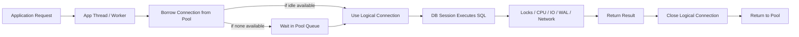
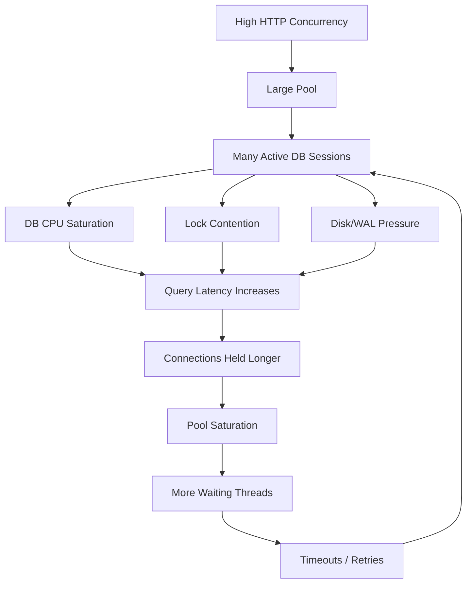
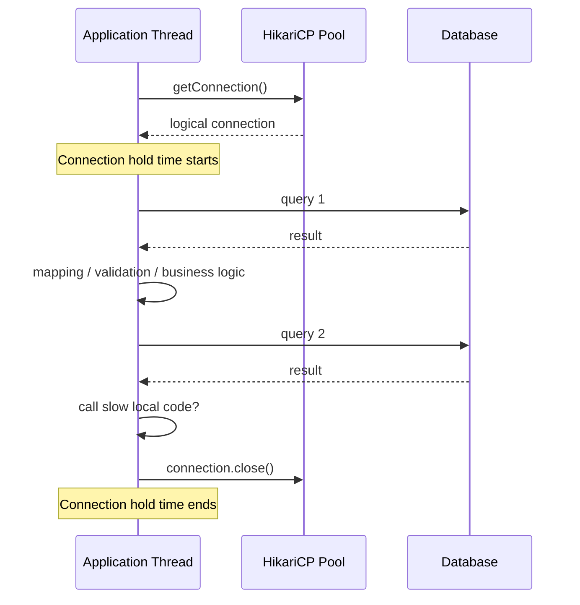
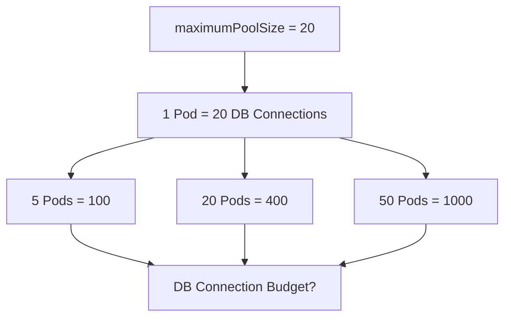
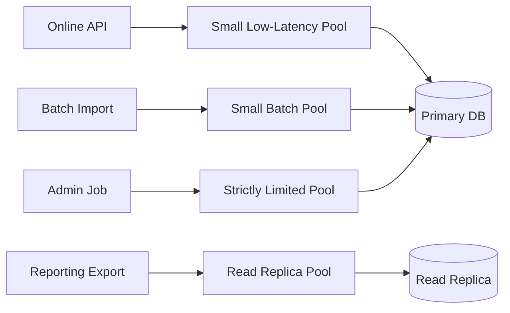
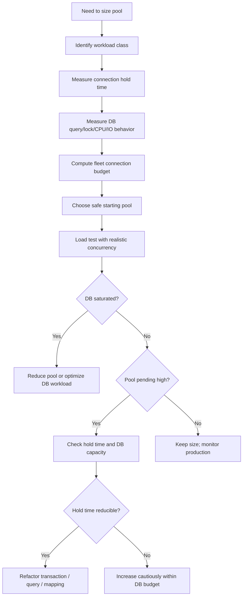
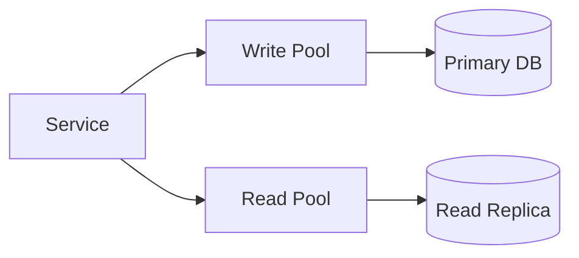
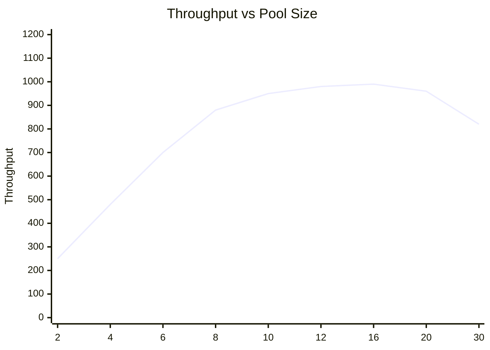

------
title: Learn Java SQL, JDBC, Transactions, Connection Management & HikariCP - Part 019
description: Pool sizing dengan queueing, database capacity, workload shape, fleet math, deadlock risk, dan tuning HikariCP berbasis evidence.
series: learn-java-sql-jdbc
seriesTitle: Learn Java SQL, JDBC, Transactions, Connection Management & HikariCP
order: 19
partTitle: Pool Sizing: Queueing, Database Capacity, and Workload Shape
tags:
- java
- jdbc
- sql
- hikaricp
- connection-pooling
- performance
- reliability
- transactions
- series
date: 2026-06-27
---

# Part 019 — Pool Sizing: Queueing, Database Capacity, and Workload Shape

> Target skill: mampu menentukan, membuktikan, dan mempertahankan ukuran connection pool berdasarkan kapasitas database, bentuk workload, jumlah instance aplikasi, latency query, transaction duration, dan failure mode — bukan berdasarkan angka default, intuisi, atau copy-paste konfigurasi.

Di part sebelumnya kita membahas konfigurasi HikariCP. Part ini menjawab pertanyaan yang biasanya paling banyak menimbulkan debat:

> `maximumPoolSize` harus berapa?

Jawaban senior bukan angka. Jawaban senior adalah **model**.

Connection pool adalah **resource governor**. Pool menentukan berapa banyak pekerjaan database yang boleh berjalan paralel dari satu process aplikasi. Jika terlalu kecil, request menunggu terlalu lama di pool. Jika terlalu besar, database overload, context switching meningkat, lock contention memburuk, latency naik, dan throughput justru turun.

Skill yang ingin kita kuasai bukan “setting pool ke 10/20/50”, melainkan:

- memahami pool sebagai queue + bounded concurrency;
- menghitung budget koneksi di level fleet, bukan hanya satu instance;
- membedakan workload CPU-bound, IO-bound, lock-bound, dan transaction-bound;
- membaca signal dari metrics;
- melakukan eksperimen tuning yang defensible;
- mengenali anti-pattern pool sizing yang terlihat masuk akal tetapi merusak production.

---

## 1. Core Mental Model

Satu request database melewati beberapa stage:



`maximumPoolSize` membatasi jumlah `D/E/F` yang dapat berjalan bersamaan dari satu application instance.

Artinya:

```txt
maximumPoolSize != max users
maximumPoolSize != max HTTP threads
maximumPoolSize != target TPS
maximumPoolSize == max concurrent database sessions owned by this pool
```

Pool tidak membuat database lebih cepat. Pool hanya mengontrol berapa banyak pekerjaan database yang diperbolehkan masuk secara bersamaan.

---

## 2. The Most Important Invariant

> **Pool size must be derived from database capacity and workload duration, not from application concurrency alone.**

HTTP server bisa menerima 500 concurrent requests. Itu tidak berarti database harus diberi 500 koneksi.

Jika 500 request semuanya masuk ke DB secara bersamaan, efeknya bisa seperti ini:



Bigger pool dapat menciptakan feedback loop negatif:

1. lebih banyak query aktif;
2. database makin lambat;
3. connection makin lama dipegang;
4. pool makin penuh;
5. request makin lama menunggu;
6. retry menambah beban;
7. sistem collapse.

---

## 3. What Pool Sizing Actually Optimizes

Pool sizing menyeimbangkan tiga hal:

| Objective | Jika terlalu rendah | Jika terlalu tinggi |
|---|---|---|
| Throughput | DB underutilized, request menunggu padahal DB masih mampu | DB overloaded, throughput turun karena contention |
| Latency | acquisition wait tinggi | query latency dan lock wait tinggi |
| Reliability | request cepat timeout walau DB sehat | cascading failure saat DB melambat |
| Fairness | long job bisa memblokir short request jika satu pool | semua request berebut DB dan saling merusak |
| Cost | kapasitas DB tidak terpakai | DB butuh scale-up mahal tanpa throughput sepadan |

Pool size yang benar adalah pool size yang menjaga **database tetap berada di throughput plateau**, bukan di saturation cliff.

---

## 4. Pool as a Queueing System

Model sederhana:

```txt
arrival rate  = request database per second
service time  = waktu rata-rata connection dipegang
concurrency   = arrival rate × service time
```

Ini intuisi dari Little's Law:

```txt
L = λ × W
```

Dalam konteks pool:

```txt
required active connections ≈ database operations per second × average connection hold time
```

Contoh:

```txt
200 DB operations/second
average connection hold time = 40 ms = 0.04 s
active connections needed ≈ 200 × 0.04 = 8
```

Jika P95 connection hold time 200 ms:

```txt
200 × 0.2 = 40
```

Tetapi hati-hati: angka 40 bukan otomatis `maximumPoolSize = 40`. Itu adalah estimasi concurrency demand. Kita masih harus cek:

- DB CPU capacity;
- DB max connections;
- jumlah application instances;
- lock contention;
- query mix;
- transaction duration;
- retry behavior;
- SLO latency;
- backpressure strategy.

---

## 5. Connection Hold Time Is the Key Variable

Pool sizing buruk sering terjadi karena engineer hanya melihat query execution time, bukan **connection hold time**.

Connection hold time adalah durasi sejak aplikasi berhasil borrow connection sampai `close()` dipanggil.



Jika query hanya 10 ms tetapi aplikasi memegang connection 300 ms karena mapping, serialization, logging, remote call, atau business logic, pool melihatnya sebagai 300 ms occupancy.

### Rule

> Optimize connection hold time before increasing pool size.

Hal yang memperpanjang hold time:

- transaction terlalu besar;
- membaca result set besar;
- mapping object mahal di dalam transaction;
- memanggil service eksternal saat transaction terbuka;
- menulis audit/log sinkron di dalam transaction;
- lazy loading tidak terkendali;
- batch job memakai pool request online;
- lock wait;
- slow query;
- retry di dalam transaction.

---

## 6. The Database Is the Real Bottleneck

Aplikasi sering horizontally scalable. Database sering tidak semudah itu.

Karena itu pool sizing harus dimulai dari database:

```txt
DB total usable connections
- reserved admin connections
- migration/job connections
- monitoring/replication/tooling
- other services
= connection budget for this service family
```

Lalu dibagi ke jumlah instance:

```txt
per-instance max pool <= service connection budget / max live instances
```

Contoh:

```txt
Database max connections              = 300
Reserved for admin/emergency          = 20
Reserved for migrations/jobs/tools    = 30
Other services                        = 100
Budget for service A                  = 150
Max pods for service A                = 15
Per-pod maximumPoolSize upper bound   = 150 / 15 = 10
```

Jika setiap pod diset `maximumPoolSize = 30`, maka saat autoscaling ke 15 pod:

```txt
15 × 30 = 450 potential DB connections
```

Padahal budget hanya 150. Ini bukan tuning. Ini incident yang tinggal menunggu traffic spike.

---

## 7. Per-Instance Thinking Is Dangerous in Kubernetes

Di environment autoscaling, satu config kecil bisa berlipat menjadi beban besar.



Kesalahan umum:

```yaml
spring:
  datasource:
    hikari:
      maximum-pool-size: 30
```

Terlihat wajar pada local/staging satu instance. Berbahaya pada production 40 pods.

Lebih defensible:

```txt
maxPoolPerPod = floor(serviceDbConnectionBudget / maxExpectedPods)
```

Dan maxExpectedPods harus mempertimbangkan:

- normal replica count;
- peak autoscale count;
- rolling deployment surge;
- blue/green deployment overlap;
- canary instance;
- job/worker instance;
- failover behavior.

### Rolling Deployment Trap

Jika normal 20 pods dan deployment strategy memungkinkan `maxSurge = 25%`, maka sementara bisa ada 25 pods.

```txt
effective max pods = normal pods + surge pods
```

Pool sizing harus memperhitungkan keadaan sementara ini, karena incident sering terjadi saat deploy.

---

## 8. HikariCP Official Sizing Intuition

HikariCP wiki terkenal dengan formula awal:

```txt
connections = ((core_count * 2) + effective_spindle_count)
```

Formula ini diarahkan untuk memperkirakan jumlah active database connections yang optimal dekat kapasitas database, dengan `core_count` mengacu pada core database server, bukan application server. Di era SSD dan cache besar, `effective_spindle_count` sering mendekati 0 untuk active dataset yang fully cached.

Gunakan formula ini sebagai **starting hypothesis**, bukan hukum alam.

Misalnya database 8 physical cores, active dataset mostly cached:

```txt
connections ≈ 8 × 2 + 0 = 16
```

Itu bukan berarti setiap application pod boleh punya 16 koneksi. Itu lebih dekat ke total active connection target untuk database workload tertentu.

Jika service A hanya satu dari beberapa service, connection budget service A adalah sebagian dari total tersebut.

---

## 9. CPU-Bound vs IO-Bound vs Lock-Bound Workload

Pool sizing harus mengikuti bentuk workload.

### 9.1 CPU-Bound Query

Contoh:

- aggregation berat;
- sort besar;
- join kompleks;
- expression/function heavy;
- JSON processing di DB;
- full-text search tanpa index optimal.

Signal:

- DB CPU tinggi;
- active sessions banyak running di CPU;
- query latency naik saat concurrency naik;
- disk tidak dominan.

Sizing implication:

- pool besar biasanya memperburuk;
- turunkan concurrency;
- optimalkan query/index;
- consider read replica atau materialized view.

### 9.2 IO-Bound Query

Contoh:

- table scan;
- random disk read;
- cold cache;
- large index scan;
- WAL/fsync bottleneck pada write.

Signal:

- IO wait tinggi;
- buffer cache miss;
- disk latency tinggi;
- query lambat walau CPU tidak penuh.

Sizing implication:

- sedikit tambahan concurrency bisa membantu overlap IO;
- terlalu banyak concurrency tetap merusak;
- index/cache/schema lebih penting daripada pool size.

### 9.3 Lock-Bound Workload

Contoh:

- update row/account/order yang sama;
- batch job menyentuh range yang sama dengan online traffic;
- long transaction;
- foreign key/check constraint lock;
- migration DDL.

Signal:

- DB CPU tidak penuh;
- active sessions menunggu lock;
- query latency spike;
- deadlock/lock timeout meningkat;
- pool active penuh karena sessions blocked.

Sizing implication:

- menaikkan pool size hampir selalu memperburuk;
- pendekkan transaction;
- ubah lock ordering;
- shard hotspot;
- gunakan optimistic concurrency;
- pisahkan batch pool.

### 9.4 Transaction-Bound Workload

Contoh:

- service method membuka transaction lalu melakukan banyak hal;
- transaction memuat banyak aggregate;
- external API call di tengah transaction;
- stream result besar dalam transaction.

Signal:

- connection hold time tinggi;
- query time individual rendah;
- active pool tinggi;
- pending thread meningkat.

Sizing implication:

- jangan langsung tambah pool;
- kurangi transaction duration;
- pindahkan non-DB work keluar transaction;
- desain use-case boundary ulang.

---

## 10. Workload Classes Need Different Pools

Satu pool untuk semua workload sering menjadi fairness bug.

Contoh buruk:

```txt
Online request pool, batch import, scheduled reconciliation, reporting export
semuanya memakai DataSource yang sama.
```

Efek:

- batch job memenuhi pool;
- online request timeout;
- retry menambah tekanan;
- batch makin lambat;
- semua terlihat seperti “database slow”.

Lebih baik:



Design principle:

> Pools should represent workload contracts.

Workload contract mencakup:

- latency expectation;
- concurrency limit;
- transaction duration;
- retry behavior;
- read/write target;
- failure isolation;
- operational priority.

---

## 11. Pool Sizing Decision Flow

Gunakan flow berikut sebelum menyentuh angka:



---

## 12. Starting Point Strategy

A reasonable production process:

1. compute hard upper bound from DB connection budget;
2. choose conservative starting value;
3. run load test with realistic traffic mix;
4. observe active/pending/acquisition latency/query latency/DB CPU/locks;
5. tune one variable at a time;
6. document why the final number exists.

### Example: Online API

Facts:

```txt
DB usable connection budget for service: 80
Max production pods including surge: 10
Hard upper bound per pod: 8
Typical query latency: 20-40 ms
P95 connection hold time: 70 ms
Request DB ops: 1-3 per request
DB CPU at peak with pool=8: 55%
Pool pending rarely > 0
```

Decision:

```txt
maximumPoolSize = 8
minimumIdle     = omitted or equal under fixed-size strategy
```

No reason to increase. Database still healthy, pool wait low, connection budget respected.

### Example: Batch Worker

Facts:

```txt
Batch job performs long writes
Transactions are chunked every 500 rows
P95 connection hold time = 3 seconds
Online API shares primary DB
Lock contention observed during batch window
```

Decision:

```txt
Batch pool maximumPoolSize = 2 or 3
Online pool separate and protected
Batch scheduled outside peak if possible
```

Increasing batch pool to 20 would likely reduce job wall time slightly at first, then harm online traffic and increase lock contention.

---

## 13. Fixed-Size vs Elastic Pool

HikariCP recommends treating `minimumIdle` carefully. If `minimumIdle` is omitted, HikariCP behaves closer to a fixed-size pool where it tries to maintain connections up to `maximumPoolSize` depending on configuration and demand.

### Fixed-size style

```properties
maximumPoolSize=10
# minimumIdle omitted
```

Useful when:

- traffic is steady;
- connection creation is expensive;
- latency predictability matters;
- DB budget is stable;
- you want fewer cold-start surprises.

### Elastic style

```properties
maximumPoolSize=10
minimumIdle=2
idleTimeout=600000
```

Useful when:

- traffic is bursty;
- you want fewer idle DB sessions;
- occasional connection creation latency is acceptable.

But do not confuse elastic pool with infinite capacity. `maximumPoolSize` is still the hard concurrency cap.

---

## 14. The `maximumPoolSize = HTTP thread count` Anti-Pattern

This anti-pattern appears logical:

> “If Tomcat has 200 worker threads, Hikari should have 200 connections.”

It is usually wrong.

Why?

- Not every request needs DB at the same time.
- DB cannot efficiently execute 200 concurrent heavy queries just because HTTP can accept 200 requests.
- Many requests spend time in JSON parsing, validation, network IO, template rendering, cache, downstream calls.
- Connection pool is a backpressure point; removing it shifts queueing to the database.

Better:

```txt
HTTP concurrency controls request admission.
Connection pool controls DB concurrency.
They are related, but not equal.
```

---

## 15. The “Increase Pool to Fix Timeout” Trap

A Hikari acquisition timeout means a thread waited longer than `connectionTimeout` for a connection.

It does not automatically mean pool is too small.

Possible causes:

| Symptom | Possible cause | Better action |
|---|---|---|
| Active = max, pending high, DB CPU low | connection leak or long hold time | inspect leak, transaction duration |
| Active = max, DB lock wait high | lock contention | fix locking/transaction design |
| Active = max, DB CPU high | DB saturated | reduce pool or optimize query |
| Active low, pending high | pool creation/validation issue | inspect network/driver/config |
| Pending spike after deploy | too many pods/surge | fleet budget, rollout config |

Before increasing pool size, ask:

```txt
Are connections busy doing useful work, waiting on locks, waiting on network, or leaked?
```

---

## 16. Hikari Metrics to Watch

At minimum, expose these per pool:

| Metric | Meaning | Diagnostic value |
|---|---|---|
| Active connections | currently borrowed | high means DB concurrency at cap |
| Idle connections | ready to borrow | low/zero during load is normal if active high |
| Pending threads | waiting for connection | direct pool pressure signal |
| Total connections | active + idle | confirms pool growth |
| Connection acquisition time | time to borrow | user-visible latency before SQL starts |
| Connection usage/hold time | time borrowed | detects long transaction/mapping/leak |
| Timeout count | failed acquisition | reliability breach |

Golden interpretation:

```txt
High pending + high active + high DB CPU
= database saturated or pool allows too much DB concurrency.

High pending + high active + low DB CPU + high lock wait
= concurrency is blocked, not compute-bound.

High pending + high active + long hold time + normal query latency
= application holds connections too long.
```

---

## 17. Application Metrics Must Be Paired With Database Metrics

Pool metrics alone are insufficient.

Pair them with database-side signals:

| Application signal | Database signal to pair |
|---|---|
| Active connections | active sessions / running queries |
| Pending threads | DB CPU, lock wait, IO wait |
| Acquisition latency | connection count, session state |
| Query latency | slow query log / execution plan |
| Transaction duration | long-running transactions |
| Timeout count | lock timeout/deadlock/network errors |

Without DB-side metrics, you may misdiagnose a database lock storm as a pool problem.

---

## 18. Pool Sizing for Read/Write Split

If application uses primary + read replica:



Sizing must consider:

- primary write capacity;
- replica read capacity;
- replication lag;
- consistency requirement;
- transaction routing;
- fallback behavior.

Anti-pattern:

```txt
If replica fails, route all read traffic to primary with same read pool size.
```

That can overload primary instantly.

Safer fallback:

- reduce read concurrency when falling back;
- protect write traffic;
- reject/reporting degrade;
- use circuit breaker;
- apply endpoint-level rate limits.

---

## 19. Nested Connection Demand and Pool-Locking

Some workflows require more than one connection per thread. Examples:

- nested transactions with `REQUIRES_NEW`;
- audit write on separate transaction;
- outbox write via separate transaction;
- read from one DB and write to another;
- sharded DB fan-out;
- accidental nested `DataSource.getConnection()` calls.

HikariCP FAQ mentions a resource allocation formula to avoid pool-locking:

```txt
pool size = Tn × (Cm - 1) + 1
```

Where:

```txt
Tn = maximum number of concurrent threads
Cm = maximum number of simultaneous connections held by one thread
```

This formula is useful to understand deadlock risk, but dangerous as a scaling prescription.

Example:

```txt
Tn = 100 HTTP threads
Cm = 2 connections per request
pool size = 100 × (2 - 1) + 1 = 101
```

If you blindly allocate 101 connections per pod across 20 pods, you destroy DB capacity.

Better conclusion:

> If a request can hold multiple connections concurrently, fix the design before scaling the pool.

Common fixes:

- remove nested connection acquisition;
- avoid `REQUIRES_NEW` in hot path;
- serialize DB work on one connection;
- separate audit/outbox via same transaction when semantically correct;
- use async outbox worker with separate limited pool;
- reduce HTTP concurrency for that endpoint.

---

## 20. Pool Sizing and Transaction Propagation

Frameworks can hide nested connection demand.

Example with Spring:

```java
@Transactional
public void approveCase(UUID caseId) {
    caseRepository.markApproved(caseId);
    auditService.writeAuditInNewTransaction(caseId); // REQUIRES_NEW
}
```

If `auditService.writeAuditInNewTransaction()` uses `PROPAGATION_REQUIRES_NEW`, it may suspend the outer transaction and borrow another connection.

At scale, this creates two problems:

1. each request may need more than one connection;
2. outer connections remain held while inner connections are awaited.

This can produce pool-locking even when no query is slow.

Safer alternative:

```java
@Transactional
public void approveCase(UUID caseId) {
    caseRepository.markApproved(caseId);
    auditRepository.insertAuditEvent(caseId); // same transaction
}
```

Or:

```java
@Transactional
public void approveCase(UUID caseId) {
    caseRepository.markApproved(caseId);
    outboxRepository.insertAuditEvent(caseId); // same transaction
}

// separate worker publishes asynchronously with its own small pool
```

---

## 21. Pool Sizing and Long-Running Reads

Large exports are dangerous because they hold connections for a long time.

Example:

```java
try (Connection connection = dataSource.getConnection();
     PreparedStatement ps = connection.prepareStatement("select * from events");
     ResultSet rs = ps.executeQuery()) {

    while (rs.next()) {
        writer.write(map(rs));
    }
}
```

If `writer.write()` writes to slow network storage, the DB connection remains held while the app is writing output.

Better architecture:

- use pagination with bounded page size;
- release connection between pages;
- write to export storage outside connection hold;
- route export to read replica;
- use separate export pool;
- limit concurrent exports.

---

## 22. Pool Sizing and Batch Writes

Batch writers can be either efficient or destructive.

Good batch pattern:

```txt
small pool
bounded chunk size
short transaction per chunk
idempotent resume
lock-aware ordering
separate from online pool
```

Bad batch pattern:

```txt
large pool
huge transaction
random update order
same pool as online API
retry entire job on failure
no lock timeout
```

Connection pool should enforce batch humility:

```properties
batch.hikari.maximumPoolSize=2
batch.hikari.connectionTimeout=2000
```

The batch may take longer, but the system remains stable.

---

## 23. Pool Sizing for Multi-Tenant Systems

Multi-tenant platforms add fairness concerns.

If all tenants share one pool, a noisy tenant can consume all connections.

Options:

| Strategy | Pros | Cons |
|---|---|---|
| One shared pool | simple, efficient | poor tenant isolation |
| Pool per tenant | strong isolation | connection explosion |
| Pool per tenant tier | balanced | more routing complexity |
| App-level concurrency limiter per tenant | protects shared pool | needs careful implementation |
| DB-level resource management | strong governance | vendor-specific |

For many SaaS systems, one shared pool plus per-tenant concurrency/rate limits is more scalable than pool-per-tenant.

---

## 24. A Practical Sizing Worksheet

Use this worksheet during design review.

```txt
1. Database facts
   - DB engine/version:
   - CPU cores:
   - Memory:
   - Storage type:
   - max_connections:
   - reserved connections:
   - existing service usage:

2. Application deployment
   - normal pods:
   - max autoscale pods:
   - deployment surge:
   - worker/job instances:

3. Workload
   - online read QPS:
   - online write QPS:
   - batch schedule:
   - reporting/export load:
   - average connection hold time:
   - P95/P99 connection hold time:
   - average query latency:
   - P95/P99 query latency:

4. Failure signals
   - lock wait observed?
   - deadlock observed?
   - slow query observed?
   - pool timeout observed?
   - DB CPU saturation observed?
   - IO wait observed?

5. Proposed pool
   - maximumPoolSize:
   - connectionTimeout:
   - maxLifetime:
   - separate pools required?
   - fallback behavior:
   - monitoring alerts:
```

---

## 25. Load Test Methodology

Do not tune pool size using synthetic `select 1` tests.

A useful test must include:

- realistic traffic mix;
- read/write ratio;
- transaction duration;
- payload size;
- result set size;
- lock contention scenarios;
- batch/reporting overlap;
- autoscale/fleet simulation;
- retry behavior;
- failure injection.

### Stepwise experiment

1. start with conservative pool;
2. run baseline traffic;
3. record DB CPU, locks, query latency, pool pending;
4. increase pool by small increments;
5. stop when throughput plateaus or latency rises sharply;
6. choose a value before the cliff, not at the cliff.



The correct pool is rarely the maximum throughput point. It is usually lower, with better latency headroom.

---

## 26. Choosing `connectionTimeout` with Pool Size

Pool size and `connectionTimeout` interact.

Small pool + long timeout:

```txt
Requests queue for a long time.
User latency worsens.
Threads remain occupied.
Backpressure is delayed.
```

Small pool + short timeout:

```txt
Requests fail fast when DB concurrency budget is exhausted.
System protects itself.
Caller must handle graceful degradation.
```

Large pool + long timeout:

```txt
Worst case: DB overloaded, application threads stuck, retries pile up.
```

For online request path, prefer bounded wait:

```properties
spring.datasource.hikari.connection-timeout=1000
```

But only if the caller has sane fallback/error behavior. A short timeout without graceful handling becomes user-visible noise.

---

## 27. Alerting Guidelines

Alert on symptoms that indicate user-visible or imminent failure.

Bad alert:

```txt
active connections > 80% for 5 minutes
```

High active can be normal during peak.

Better alerts:

```txt
pending threads > 0 for sustained period
connection acquisition P95 > threshold
pool timeout count > 0
active=max AND DB CPU > 85%
active=max AND lock wait rising
connection usage P99 > threshold
```

A good alert points to a diagnostic path.

---

## 28. Anti-Pattern Catalog

### Anti-pattern 1: Pool size equals HTTP thread count

Symptom:

```txt
maximumPoolSize=200 because server.tomcat.threads.max=200
```

Why bad:

- lets too much concurrency hit DB;
- ignores DB capacity;
- hides queueing until DB is overloaded.

Fix:

- size DB concurrency separately;
- use HTTP backpressure/rate limits;
- protect pool.

### Anti-pattern 2: Increase pool on every timeout

Why bad:

- timeout may be caused by slow query, lock, leak, or DB saturation;
- bigger pool can amplify the root cause.

Fix:

- inspect active/pending/hold time/DB waits first.

### Anti-pattern 3: One pool for everything

Why bad:

- batch/reporting can starve online traffic.

Fix:

- separate pools by workload class.

### Anti-pattern 4: Pool-per-tenant without global budget

Why bad:

- 100 tenants × 10 connections = 1000 possible sessions.

Fix:

- shared pool + tenant limiter or tiered pools.

### Anti-pattern 5: Ignoring deployment surge

Why bad:

- connection count spikes during rollout.

Fix:

- include surge in fleet math.

### Anti-pattern 6: Large pool to mask long transactions

Why bad:

- makes bad transaction design scale until DB fails.

Fix:

- reduce connection hold time.

### Anti-pattern 7: Same pool for OLTP and export

Why bad:

- long reads consume scarce OLTP connections.

Fix:

- export pool/read replica/limit concurrency.

---

## 29. A Production-Grade Pool Sizing Example

Assume service `case-command-service`.

### Facts

```txt
DB: PostgreSQL primary
DB physical cores: 16
DB max_connections: 500
Reserved admin/emergency: 30
Reserved migrations/monitoring/tools: 40
Other services: 230
Budget for case-command-service: 200
Normal pods: 12
Max autoscale pods: 18
Deployment surge: 4
Effective max pods: 22
```

### Hard per-pod budget

```txt
floor(200 / 22) = 9
```

### Workload

```txt
Online writes: short transactions, 1-4 statements
P95 connection hold time: 85 ms
P99 connection hold time: 180 ms
Peak DB ops from service: 700 ops/sec
```

Estimated active concurrency at P95:

```txt
700 × 0.085 = 59.5 active connections fleet-wide
```

Per pod at 18 active pods:

```txt
59.5 / 18 = 3.3
```

But we need headroom for uneven load, spikes, and P99.

Proposed:

```properties
maximumPoolSize=8
connectionTimeout=1000
```

Why not 20?

```txt
22 pods × 20 = 440 possible connections
```

That violates service budget and can starve other services.

### Validation

Load test with 8:

```txt
DB CPU peak: 62%
pool pending P95: 0
acquisition P99: 12 ms
pool timeout: 0
lock wait: stable
throughput: target met
```

Decision:

```txt
Keep maximumPoolSize=8.
Do not increase without new evidence.
```

---

## 30. Code: Documenting Pool Sizing as Configuration

A good config should be accompanied by reasoning.

```yaml
spring:
  datasource:
    hikari:
      pool-name: case-command-primary
      maximum-pool-size: 8
      connection-timeout: 1000
      max-lifetime: 1740000
      keepalive-time: 300000
      validation-timeout: 1000
```

Add an architectural decision record:

```md
# ADR: HikariCP Pool Size for case-command-service

## Decision
Set `maximumPoolSize=8` per pod for the primary write pool.

## Context
- DB connection budget for this service: 200
- Max effective pods including surge: 22
- Hard per-pod budget: 9
- P95 connection hold time: 85 ms
- Load test met target throughput with no sustained pending threads

## Consequences
- DB concurrency remains bounded during autoscale and deploy surge
- Requests fail fast after 1s of pool wait
- Batch/reporting workloads must not use this pool
```

This is the difference between “config” and “engineering decision”.

---

## 31. Review Checklist

Before approving pool config, ask:

- What database connection budget does this service own?
- How many app instances can exist during autoscale and deployment surge?
- Is `maximumPoolSize × maxInstances` within budget?
- What is P95/P99 connection hold time?
- Are long-running jobs using the same pool?
- Are there nested transactions requiring multiple connections per thread?
- What happens when pool acquisition times out?
- Are pool metrics exported per pool name?
- Are DB lock/CPU/IO metrics correlated with pool metrics?
- Is the proposed size backed by load test or production measurement?
- Is there an ADR or config comment explaining the number?

---

## 32. Deliberate Practice

### Exercise 1 — Fleet Budget

Given:

```txt
DB max_connections = 800
Reserved = 100
Other services = 350
Service pods normal = 20
Max autoscale = 35
Deployment surge = 5
```

Compute:

- service connection budget;
- effective max pods;
- max safe per-pod pool.

Expected reasoning:

```txt
service budget = 800 - 100 - 350 = 350
effective max pods = 35 + 5 = 40
safe per-pod pool <= floor(350 / 40) = 8
```

### Exercise 2 — Timeout Diagnosis

Scenario:

```txt
Hikari pending threads high
active=max
DB CPU 35%
lock wait high
query plans normal
```

Question:

```txt
Should you increase maximumPoolSize?
```

Expected answer:

```txt
No. The system is lock-bound. More connections will create more blocked sessions.
Fix transaction duration, lock ordering, hotspot access, or batch overlap.
```

### Exercise 3 — Hidden Hold Time

Scenario:

```txt
SQL execution P95 = 15 ms
connection usage P95 = 600 ms
pool timeout occurs under load
```

Question:

```txt
Where do you investigate?
```

Expected answer:

```txt
Between borrow and close: mapping, serialization, external calls, streaming, transaction boundary, lazy loading, or slow local processing while connection is held.
```

---

## 33. Key Takeaways

- Pool size is a **bounded DB concurrency decision**, not a user concurrency decision.
- The database connection budget must be calculated at **fleet level**.
- `maximumPoolSize × maxInstances` is often the most important hidden risk.
- Connection hold time matters more than query time alone.
- Bigger pools can reduce throughput when DB becomes saturated or lock-bound.
- Separate pools by workload class when latency, duration, or priority differs.
- Pool timeout is a symptom; diagnose active, pending, hold time, DB CPU, lock wait, and IO before tuning.
- A pool size without documented reasoning is operational debt.

Next: Part 020 will build the timeout hierarchy around the pool: HTTP timeout, connection acquisition timeout, query timeout, lock timeout, transaction timeout, socket timeout, retry budget, and graceful degradation.

---

## References

- Java SE 25 `java.sql.Statement` documentation for query timeout behavior.
- Java SE 25 `SQLTimeoutException` documentation.
- HikariCP README and configuration documentation.
- HikariCP Wiki: About Pool Sizing.
- HikariCP Wiki: FAQ on pool-locking and minimum pool sizing.
