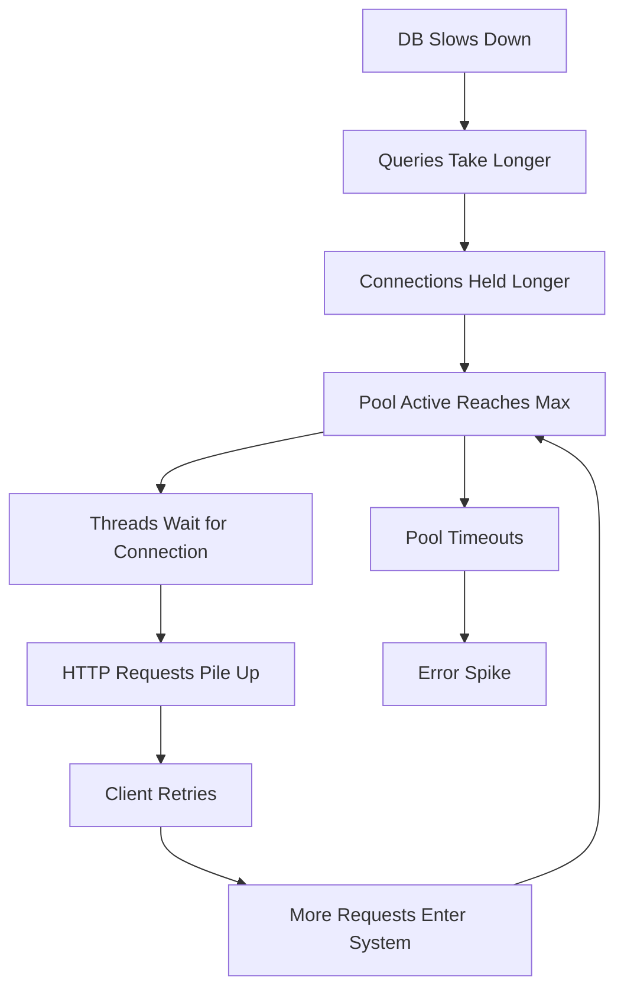
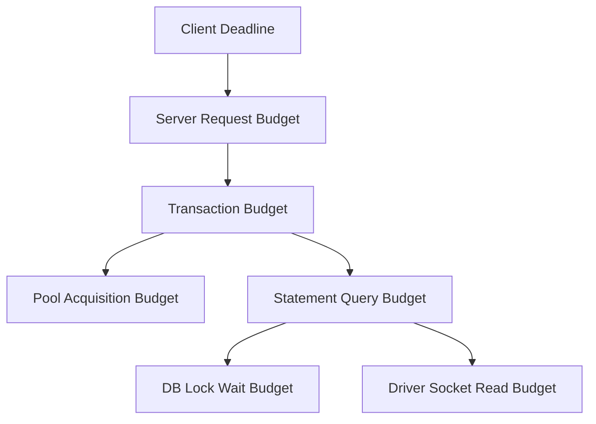
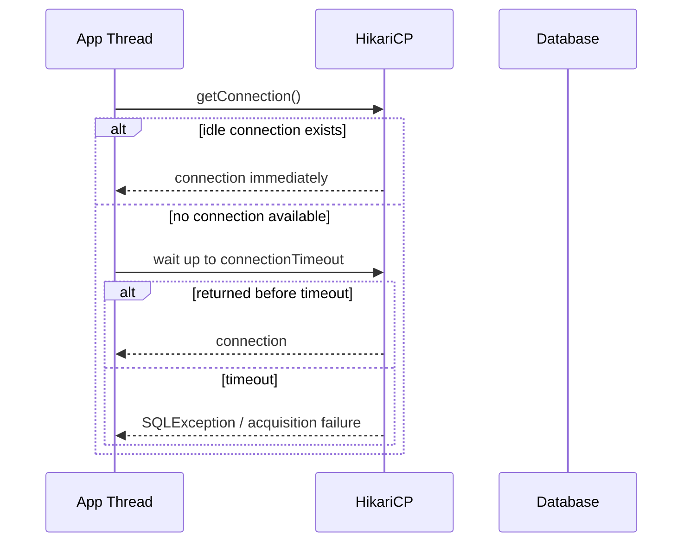
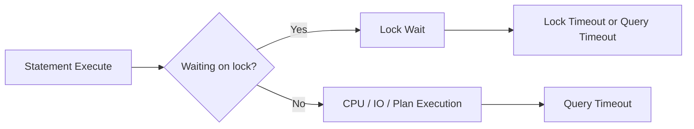
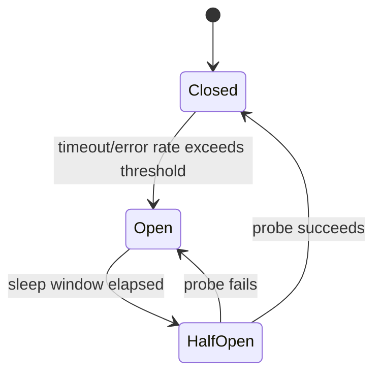
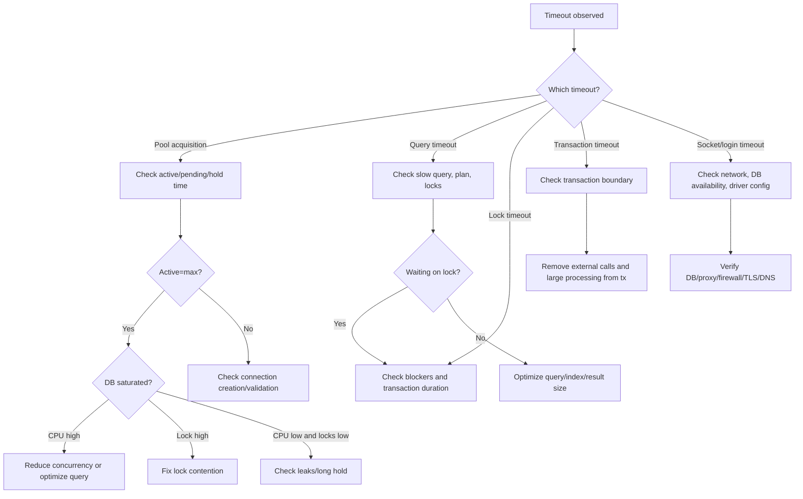

------
title: Learn Java SQL, JDBC, Transactions, Connection Management & HikariCP - Part 020
description: Timeout design untuk JDBC/HikariCP: fail fast, graceful degradation, retry budget, lock timeout, query timeout, transaction timeout, dan cascading failure prevention.
series: learn-java-sql-jdbc
seriesTitle: Learn Java SQL, JDBC, Transactions, Connection Management & HikariCP
order: 20
partTitle: Timeout Design: Fail Fast, Degrade Gracefully, Avoid Cascading Failure
tags:
- java
- jdbc
- sql
- hikaricp
- timeout
- reliability
- resilience
- transactions
- series
date: 2026-06-27
---

# Part 020 — Timeout Design: Fail Fast, Degrade Gracefully, Avoid Cascading Failure

> Target skill: mampu mendesain timeout end-to-end untuk Java/JDBC/HikariCP sehingga sistem gagal secara terkendali, tidak menahan resource terlalu lama, tidak memperparah database yang sedang sakit, dan tetap memberikan failure signal yang bisa didiagnosis.

Timeout bukan detail konfigurasi. Timeout adalah bagian dari **control system**.

Dalam sistem Java + JDBC, timeout menentukan:

- berapa lama request boleh menunggu connection dari pool;
- berapa lama query boleh berjalan;
- berapa lama transaction boleh hidup;
- berapa lama lock boleh ditunggu;
- berapa lama socket/network boleh menggantung;
- kapan retry boleh dilakukan;
- kapan caller harus menerima error/degradation;
- kapan sistem harus menolak pekerjaan baru untuk melindungi dirinya.

Tanpa timeout, sistem tidak gagal cepat. Sistem **membeku perlahan**.

Dengan timeout yang salah, sistem gagal terlalu agresif atau justru melakukan retry storm.

Part ini membangun mental model timeout yang konsisten dari HTTP boundary sampai database lock.

---

## 1. The Core Problem

Database dependency berbeda dari dependency biasa:

- connection adalah resource terbatas;
- transaction bisa memegang lock;
- query lambat bisa menahan thread aplikasi;
- retry bisa menggandakan beban;
- failure sering parsial, bukan mati total;
- commit bisa ambiguous;
- pool bisa menjadi queue tersembunyi.

Timeout design yang buruk menghasilkan pola berikut:



Tujuan timeout design adalah memutus loop ini secepat mungkin dengan kerusakan minimal.

---

## 2. Timeout Taxonomy

Timeout berbeda memiliki arti berbeda. Menyamakan semua timeout adalah bug.

| Timeout | Layer | Meaning | Failure tells you |
|---|---|---|---|
| HTTP/client timeout | caller boundary | caller tidak mau menunggu lagi | user-visible deadline exceeded |
| server request timeout | app boundary | request terlalu lama diproses | app overload/dependency slow |
| pool acquisition timeout | HikariCP | thread gagal borrow connection | pool saturated/leak/DB slow |
| query timeout | JDBC statement | SQL execution terlalu lama | query/lock/DB/network issue |
| lock wait timeout | database | lock tidak didapat tepat waktu | contention/hotspot/long tx |
| transaction timeout | framework/app | transaction terlalu lama | boundary terlalu besar/dependency slow |
| socket/read timeout | driver/network | network read/write menggantung | network/DB/driver issue |
| login/connect timeout | driver/DataSource | membuka koneksi terlalu lama | DB unreachable/network/auth |
| retry timeout/budget | resilience layer | total retry window habis | operation not safely completed |

Timeout harus disusun sebagai hierarchy, bukan angka acak.

---

## 3. Timeout Hierarchy

Prinsip dasar:

> Inner resource timeout should usually fire before outer user deadline.

Jika HTTP timeout 2 detik tetapi query timeout 30 detik, request bisa dibatalkan caller tetapi query tetap menahan connection/DB session terlalu lama.

Contoh hierarchy untuk online request:

```txt
Client deadline / HTTP timeout          2000 ms
Application endpoint budget             1800 ms
Pool acquisition timeout                 100-300 ms or 1000 ms depending workload
Transaction timeout                      1200-1500 ms
Query timeout                            500-1000 ms
Lock wait timeout                        100-500 ms for hot OLTP writes
Socket read timeout                      slightly above query timeout or driver-specific
```

Tidak ada angka universal. Tetapi urutannya harus masuk akal.



---

## 4. The Most Important Invariant

> No operation should wait longer for a scarce internal resource than the caller is willing to wait for the whole operation.

Jika caller timeout 3 detik, jangan biarkan thread menunggu 30 detik untuk connection.

Bad:

```properties
server.request.timeout=3s
spring.datasource.hikari.connection-timeout=30s
```

Efek:

- caller sudah pergi;
- request thread masih menunggu pool;
- saat akhirnya dapat connection, hasil mungkin tidak berguna;
- pressure tetap hidup setelah demand sudah expired.

Better:

```properties
server.request.timeout=3s
spring.datasource.hikari.connection-timeout=500ms
```

Tetapi ini harus disertai error handling yang jelas.

---

## 5. HikariCP `connectionTimeout`

`connectionTimeout` adalah waktu maksimum thread menunggu connection dari pool.

Ini bukan query timeout. Ini bukan DB lock timeout.



### What acquisition timeout means

A pool acquisition timeout can mean:

- pool too small for healthy workload;
- connection leak;
- connections held too long;
- database queries slow;
- lock contention;
- DB/network unavailable;
- too many app instances;
- nested transaction/pool-locking;
- batch/reporting occupying pool.

It does **not** automatically mean:

```txt
increase maximumPoolSize
```

---

## 6. Choosing `connectionTimeout`

For latency-sensitive online APIs:

```txt
connectionTimeout should be short enough to avoid hidden queues.
```

Example:

```yaml
spring:
  datasource:
    hikari:
      connection-timeout: 500
```

This says:

> If DB concurrency budget is exhausted for 500 ms, fail fast and let caller handle it.

For background jobs:

```yaml
batch:
  datasource:
    hikari:
      connection-timeout: 5000
```

Longer wait may be acceptable because user-facing latency is not direct.

### Guideline

| Workload | Typical stance |
|---|---|
| Online OLTP | short acquisition timeout |
| Admin operation | moderate timeout |
| Batch worker | moderate/longer, but bounded |
| Export/report | separate pool, explicit timeout |
| Critical internal command | short wait + retry with idempotency |

---

## 7. JDBC `setQueryTimeout`

JDBC provides `Statement#setQueryTimeout(int seconds)`. The driver must apply this limit to `execute`, `executeQuery`, and `executeUpdate`. If exceeded, a `SQLTimeoutException` may be thrown.

Example:

```java
try (Connection connection = dataSource.getConnection();
     PreparedStatement ps = connection.prepareStatement("""
         select id, status
         from enforcement_case
         where assignee_id = ?
         order by created_at desc
         limit 100
         """)) {

    ps.setObject(1, assigneeId);
    ps.setQueryTimeout(1); // seconds

    try (ResultSet rs = ps.executeQuery()) {
        while (rs.next()) {
            // map row
        }
    }
}
```

### Important caveats

- `setQueryTimeout` is in seconds, not milliseconds.
- Driver behavior can differ in cancellation mechanics.
- Query timeout may not kill the database backend immediately in every driver/database combination.
- Query timeout does not replace lock timeout.
- Query timeout does not replace transaction timeout.
- Query timeout should be paired with observability.

---

## 8. Query Timeout vs Lock Timeout

A query can be slow because it is executing or because it is waiting for a lock.

These are different.



If your database supports lock timeout, set it deliberately for hot OLTP paths.

Example PostgreSQL-style intent:

```sql
SET LOCAL lock_timeout = '250ms';
SET LOCAL statement_timeout = '1000ms';
```

In JDBC transaction:

```java
try (Connection connection = dataSource.getConnection()) {
    connection.setAutoCommit(false);

    try (Statement st = connection.createStatement()) {
        st.execute("set local lock_timeout = '250ms'");
        st.execute("set local statement_timeout = '1000ms'");
    }

    // execute OLTP writes

    connection.commit();
} catch (SQLException e) {
    // rollback and classify
}
```

This is database-specific. Abstract the intent, but do not pretend all databases behave identically.

---

## 9. Transaction Timeout

Transaction timeout is a budget for the whole transaction, not just one statement.

Transaction duration includes:

- connection acquisition if transaction manager borrows early;
- all SQL statements;
- lock waits;
- result mapping inside transaction;
- business logic inside transaction;
- flush/commit time;
- rollback time after failure.

Bad transaction:

```java
@Transactional
public void approve(UUID caseId) {
    caseRepository.lockCase(caseId);
    externalRiskClient.check(caseId); // remote call inside transaction
    caseRepository.approve(caseId);
}
```

Even if each SQL statement is fast, the transaction is unsafe because lock/connection may be held during a remote call.

Better:

```java
public void approve(UUID caseId) {
    RiskResult risk = externalRiskClient.check(caseId);

    transactionTemplate.executeWithoutResult(status -> {
        caseRepository.lockCase(caseId);
        caseRepository.approve(caseId, risk.summary());
    });
}
```

Timeout design cannot compensate for bad transaction boundaries.

---

## 10. Timeout Budgeting by Use Case

Start from the user/business deadline.

Example: `Approve Case` endpoint SLO P95 < 1.5s.

Budget:

```txt
Total server budget:                  1500 ms
Request parsing/auth/validation:       100 ms
External pre-check:                    400 ms
DB transaction total:                  600 ms
Response serialization:                100 ms
Buffer/headroom:                       300 ms
```

Inside DB transaction:

```txt
Pool acquisition:                      100 ms
Lock wait:                             150 ms
Statement execution total:             300 ms
Commit:                                 50 ms
```

This forces design clarity:

- if pool wait exceeds 100 ms, fail fast;
- if lock cannot be acquired quickly, return conflict/retryable response;
- if query exceeds 300 ms, investigate plan/index;
- if external check often takes >400 ms, it should not be inside DB transaction.

---

## 11. Fail Fast vs Wait Longer

Fail fast is not always correct. It is correct when waiting makes the system worse or the result useless.

### Fail fast is usually good for:

- online request under tight deadline;
- scarce resource acquisition;
- hot row lock contention;
- overload protection;
- dependency outage;
- user action that can be retried safely.

### Waiting longer can be acceptable for:

- offline batch;
- admin maintenance;
- idempotent background reconciliation;
- low-priority reporting;
- queue workers with backoff.

But even background jobs need bounds. Infinite wait creates stuck workers and hides failure.

---

## 12. Graceful Degradation

A short timeout without degradation strategy creates noisy failures.

Graceful degradation examples:

| Operation | Degradation |
|---|---|
| dashboard count | return stale cached value |
| search facet | omit expensive facet |
| export | queue job instead of synchronous export |
| recommendation read | return empty/default recommendations |
| audit enrichment | persist minimal event, enrich async |
| regulatory command write | fail clearly; do not fake success |

For command paths that mutate state, degradation must preserve correctness.

Never “degrade” a write by pretending it succeeded.

---

## 13. Timeout and Retry Interaction

Retry without timeout is dangerous. Timeout without retry may be insufficient for transient errors.

The correct model is:

```txt
deadline = total allowed time
attempt timeout = max time per try
retry budget = how many attempts fit safely inside deadline
backoff = delay between attempts
idempotency = guard against duplicate effects
```

Bad:

```txt
HTTP deadline = 2s
query timeout = 2s
retry count = 3
```

Worst case:

```txt
3 attempts × 2s = 6s, not counting backoff
```

Better:

```txt
HTTP deadline = 2s
attempt timeout = 400ms
max attempts = 2
backoff = 50-150ms jitter
remaining time checked before retry
```

---

## 14. Retryable vs Non-Retryable Timeout

Not all timeouts are retryable.

| Failure | Retry? | Condition |
|---|---|---|
| pool acquisition timeout | sometimes | if system has headroom and retry budget exists |
| query timeout on read | sometimes | if read is idempotent and not caused by overload |
| lock timeout | often | if operation is idempotent and backoff used |
| deadlock victim | often | if transaction is idempotent |
| timeout after commit uncertainty | dangerous | must resolve state first |
| socket timeout during write/commit | dangerous | commit may be ambiguous |

Ambiguous commit is especially important.

If the connection drops during `commit()`, application may not know whether database committed or rolled back. Retrying blindly can duplicate side effects unless operation is idempotent.

---

## 15. Idempotency as Timeout Infrastructure

Timeout-safe systems are usually idempotent systems.

For commands:

```sql
create table command_deduplication (
    idempotency_key varchar(128) primary key,
    command_type varchar(100) not null,
    result_reference varchar(200),
    created_at timestamp not null
);
```

Simplified pattern:

```java
@Transactional
public ApprovalResult approve(ApproveCommand command) {
    if (dedupRepository.exists(command.idempotencyKey())) {
        return dedupRepository.previousResult(command.idempotencyKey());
    }

    ApprovalResult result = approvalRepository.approve(command.caseId());
    dedupRepository.store(command.idempotencyKey(), result.reference());
    return result;
}
```

Now retry after transient timeout is safer because duplicate command can be recognized.

---

## 16. Circuit Breaker and Pool Timeout

A circuit breaker can prevent request storms when DB is unhealthy, but it must be driven by meaningful signals.

Signals:

- pool acquisition timeout rate;
- DB connection failure rate;
- query timeout rate;
- deadlock/lock timeout rate;
- request latency;
- database health/readiness.

Do not open circuit on one slow request. Do not keep circuit closed while pool timeouts are continuous.



For command services, circuit open should usually return a clear temporary failure, not silently enqueue unless business semantics support asynchronous processing.

---

## 17. Bulkheads: Separate Timeout Policies per Workload

Use separate pools and timeout policies for different workload classes.

```yaml
online:
  datasource:
    hikari:
      pool-name: online-primary
      maximum-pool-size: 8
      connection-timeout: 300

batch:
  datasource:
    hikari:
      pool-name: batch-primary
      maximum-pool-size: 2
      connection-timeout: 5000

reporting:
  datasource:
    hikari:
      pool-name: reporting-replica
      maximum-pool-size: 4
      connection-timeout: 1000
```

Why:

- online should fail fast;
- batch can wait but must not starve online;
- reporting should not overload primary;
- observability becomes clearer per pool.

---

## 18. Timeout Design for Online Reads

Online read goals:

- return quickly;
- avoid tying up request threads;
- protect DB during slow queries;
- degrade when possible.

Recommended stance:

```txt
short pool acquisition timeout
bounded query timeout
read replica when appropriate
cache fallback for non-critical data
no huge result sets
pagination required
```

Example:

```java
public List<CaseSummary> findRecentCases(UUID userId) throws SQLException {
    try (Connection c = dataSource.getConnection();
         PreparedStatement ps = c.prepareStatement("""
             select id, title, status, updated_at
             from enforcement_case
             where assignee_id = ?
             order by updated_at desc
             limit 50
             """)) {

        ps.setObject(1, userId);
        ps.setQueryTimeout(1);

        try (ResultSet rs = ps.executeQuery()) {
            List<CaseSummary> out = new ArrayList<>();
            while (rs.next()) {
                out.add(mapSummary(rs));
            }
            return out;
        }
    }
}
```

If query timeout fires frequently, do not just raise it. Check index, execution plan, table bloat, lock wait, and result size.

---

## 19. Timeout Design for Command Writes

Command writes require correctness first.

Recommended stance:

```txt
short lock timeout for hot rows
bounded transaction timeout
idempotency key
retry only classified transient failures
no remote calls inside transaction
clear conflict response when lock cannot be acquired
```

Example behavior:

| Failure | Response |
|---|---|
| lock timeout on case row | 409/423 conflict, retryable message |
| deadlock victim | retry internally once if idempotent |
| constraint violation | 409 business conflict, no retry |
| pool timeout | 503 temporary overload |
| ambiguous commit | resolve by idempotency key/state lookup |

---

## 20. Timeout Design for Batch Jobs

Batch jobs should be slower rather than destructive.

Recommended stance:

```txt
small dedicated pool
chunked transactions
bounded lock timeout
retry chunk with backoff
checkpoint progress
idempotent writes
stop or slow down when online DB pressure rises
```

Bad batch:

```java
@Transactional
public void importAll(List<Row> rows) {
    for (Row row : rows) {
        repository.upsert(row);
    }
}
```

Better:

```java
public void importAll(List<Row> rows) {
    for (List<Row> chunk : partition(rows, 500)) {
        retryTransient(() -> transactionTemplate.executeWithoutResult(status -> {
            for (Row row : chunk) {
                repository.upsert(row);
            }
        }));
    }
}
```

Each chunk has a bounded transaction and retry surface.

---

## 21. Driver-Level Socket and Login Timeouts

Pool and query timeout do not cover all network states.

Depending on driver/database, you may need driver properties such as:

- connect timeout;
- socket timeout;
- login timeout;
- TCP keepalive;
- SSL handshake timeout;
- read timeout.

These are vendor-specific. The key principle:

> A broken network path must not leave application threads blocked indefinitely.

Example conceptual config:

```properties
spring.datasource.hikari.data-source-properties.connectTimeout=1000
spring.datasource.hikari.data-source-properties.socketTimeout=3000
spring.datasource.hikari.data-source-properties.tcpKeepAlive=true
```

The exact property names depend on the JDBC driver. Always verify against your driver documentation.

---

## 22. Hikari `maxLifetime`, `keepaliveTime`, and Timeout Ecology

These are not request timeouts, but they affect reliability.

### `maxLifetime`

Defines maximum lifetime of a connection in the pool. It should generally be shorter than infrastructure/database-side connection kill time.

If database/proxy kills idle connections at 30 minutes and Hikari keeps them for 30 minutes or more, application may receive stale connection errors.

### `keepaliveTime`

Keeps idle connections alive by periodically testing them, and must be less than `maxLifetime`.

### `validationTimeout`

Bounds how long connection validation may take.

Example:

```yaml
spring:
  datasource:
    hikari:
      max-lifetime: 1740000      # 29 minutes
      keepalive-time: 300000     # 5 minutes
      validation-timeout: 1000
```

Design intent:

```txt
avoid stale connections
avoid long validation hangs
retire connections before infrastructure kills them
```

---

## 23. Timeout Layering Example

Suppose an online API has a 2-second SLA.

```yaml
server:
  tomcat:
    threads:
      max: 100

spring:
  datasource:
    hikari:
      pool-name: case-command-primary
      maximum-pool-size: 8
      connection-timeout: 300
      validation-timeout: 1000
      max-lifetime: 1740000
      keepalive-time: 300000
```

Transaction-level policy:

```java
TransactionTemplate tx = new TransactionTemplate(transactionManager);
tx.setTimeout(1); // seconds
```

Statement-level policy:

```java
ps.setQueryTimeout(1); // seconds
```

Database-level lock policy:

```sql
SET LOCAL lock_timeout = '250ms';
```

Endpoint-level policy:

```txt
HTTP server deadline: 2s
DB transaction: <= 1s
Pool wait: <= 300ms
Lock wait: <= 250ms
Query: <= 1s
```

This keeps failure inside the user deadline.

---

## 24. Timeout Error Mapping

Application should map timeout failures intentionally.

| Failure | Suggested classification | Example response |
|---|---|---|
| pool acquisition timeout | dependency overload | 503 Service Unavailable |
| query timeout read | dependency slow | 503 or fallback |
| lock timeout command | concurrency conflict | 409 Conflict or 423 Locked |
| transaction timeout | internal timeout | 503/500 depending context |
| socket timeout | dependency/network failure | 503 |
| login timeout | dependency unavailable | fail startup/readiness or 503 |
| client cancelled | caller gave up | stop work if possible |

Do not collapse all of these into `500 Internal Server Error` without classification. You lose operational signal.

---

## 25. Observability for Timeout Design

You need metrics at each layer.

### Application metrics

- request latency by endpoint;
- request timeout count;
- pool acquisition latency;
- pool pending threads;
- pool timeout count;
- connection usage/hold time;
- transaction duration;
- query latency by operation name;
- retry attempts;
- circuit breaker state.

### Database metrics

- active sessions;
- lock waits;
- deadlocks;
- slow query log;
- statement timeout count;
- CPU usage;
- IO wait;
- connection count;
- long-running transactions.

### Logs should include

- pool name;
- operation name;
- transaction id/correlation id;
- SQL operation label, not raw PII SQL;
- timeout type;
- elapsed time;
- retry attempt;
- idempotency key presence;
- row/entity id where safe.

---

## 26. Mermaid: Timeout Diagnosis Tree



---

## 27. Handling Client Cancellation

If client disconnects or times out, the application may still be working unless cancellation propagates.

Risk:

```txt
Client gives up at 2s.
Server keeps query running for 30s.
Connection remains held.
DB remains loaded.
Result is discarded.
```

Mitigation:

- use server request timeout;
- use query timeout shorter than client deadline;
- propagate cancellation in reactive/async stacks;
- design idempotent command handling;
- avoid starting expensive DB work after deadline is nearly exhausted.

In synchronous servlet stacks, cancellation propagation can be limited. Defensive statement/transaction timeouts remain important.

---

## 28. Deadline Propagation

A mature system passes a remaining time budget through layers.

Conceptual interface:

```java
public record Deadline(Instant expiresAt) {
    public Duration remaining() {
        return Duration.between(Instant.now(), expiresAt);
    }

    public boolean expired() {
        return !remaining().isPositive();
    }
}
```

Repository method can apply bounded timeout:

```java
public CaseRecord loadCase(UUID id, Deadline deadline) throws SQLException {
    Duration remaining = deadline.remaining();
    if (remaining.toMillis() < 100) {
        throw new TimeoutException("not enough time left to query database");
    }

    int queryTimeoutSeconds = Math.max(1, (int) Math.ceil(remaining.toMillis() / 1000.0));

    try (Connection c = dataSource.getConnection();
         PreparedStatement ps = c.prepareStatement("select * from enforcement_case where id = ?")) {
        ps.setObject(1, id);
        ps.setQueryTimeout(queryTimeoutSeconds);
        try (ResultSet rs = ps.executeQuery()) {
            return mapSingle(rs);
        }
    }
}
```

This is simplified, but the principle matters: timeout should be a budget, not scattered constants.

---

## 29. Avoiding Retry Storms

Retry storm happens when clients/app retry while dependency is already overloaded.

Bad:

```txt
DB slow
pool timeouts increase
all clients retry immediately
load doubles
DB becomes slower
```

Safer retry policy:

- retry only known transient failures;
- require idempotency for writes;
- use exponential backoff with jitter;
- respect total deadline;
- stop retrying when pool/DB is saturated;
- use circuit breaker or adaptive concurrency;
- do not retry at every layer independently.

### One-layer retry rule

Prefer one responsible retry layer. Avoid:

```txt
client retries × gateway retries × service retries × repository retries
```

Three layers with 3 attempts each can produce:

```txt
3 × 3 × 3 = 27 attempts
```

That is how transient slowness becomes outage.

---

## 30. Timeout Policy Template

For every database operation class, define:

```txt
Operation name:
Workload class: online read / online command / batch / reporting
User-visible deadline:
Pool:
Pool acquisition timeout:
Transaction timeout:
Query timeout:
Lock timeout:
Retry policy:
Idempotency mechanism:
Fallback/degradation:
Metrics:
Alert threshold:
```

Example:

```txt
Operation name: approve_case
Workload class: online command
User-visible deadline: 2s
Pool: case-command-primary
Pool acquisition timeout: 300ms
Transaction timeout: 1s
Query timeout: 1s
Lock timeout: 250ms
Retry policy: one retry for deadlock/serialization failure only
Idempotency mechanism: command idempotency key
Fallback/degradation: no fake success; return retryable conflict/503
Metrics: approve_case latency, tx duration, lock timeout count, pool acquisition
Alert threshold: pool timeout > 0.5% for 5m, lock timeout > baseline × 3
```

---

## 31. Code Pattern: Timeout-Aware Transaction Runner

A simple manual JDBC runner can encode timeout intent.

```java
public final class JdbcTransactionRunner {
    private final DataSource dataSource;

    public JdbcTransactionRunner(DataSource dataSource) {
        this.dataSource = Objects.requireNonNull(dataSource);
    }

    public <T> T inTransaction(TransactionOptions options, SqlWork<T> work) throws SQLException {
        try (Connection connection = dataSource.getConnection()) {
            boolean previousAutoCommit = connection.getAutoCommit();
            int previousIsolation = connection.getTransactionIsolation();
            boolean previousReadOnly = connection.isReadOnly();

            try {
                connection.setAutoCommit(false);
                connection.setReadOnly(options.readOnly());
                if (options.isolation() != null) {
                    connection.setTransactionIsolation(options.isolation());
                }

                applyDatabaseLocalTimeouts(connection, options);

                T result = work.execute(connection, options);
                connection.commit();
                return result;
            } catch (Throwable t) {
                try {
                    connection.rollback();
                } catch (SQLException rollbackFailure) {
                    t.addSuppressed(rollbackFailure);
                }
                throw t;
            } finally {
                connection.setReadOnly(previousReadOnly);
                connection.setTransactionIsolation(previousIsolation);
                connection.setAutoCommit(previousAutoCommit);
            }
        }
    }

    private void applyDatabaseLocalTimeouts(Connection connection, TransactionOptions options) throws SQLException {
        if (options.postgresLockTimeoutMillis() == null && options.postgresStatementTimeoutMillis() == null) {
            return;
        }

        try (Statement st = connection.createStatement()) {
            if (options.postgresLockTimeoutMillis() != null) {
                st.execute("set local lock_timeout = '" + options.postgresLockTimeoutMillis() + "ms'");
            }
            if (options.postgresStatementTimeoutMillis() != null) {
                st.execute("set local statement_timeout = '" + options.postgresStatementTimeoutMillis() + "ms'");
            }
        }
    }
}

@FunctionalInterface
interface SqlWork<T> {
    T execute(Connection connection, TransactionOptions options) throws SQLException;
}

public record TransactionOptions(
        boolean readOnly,
        Integer isolation,
        Integer queryTimeoutSeconds,
        Integer postgresLockTimeoutMillis,
        Integer postgresStatementTimeoutMillis
) {}
```

In repository:

```java
try (PreparedStatement ps = connection.prepareStatement(SQL)) {
    ps.setQueryTimeout(options.queryTimeoutSeconds());
    // bind parameters
    // execute
}
```

In production, avoid string-building local timeout SQL unless values are controlled numeric config. The example keeps it simple to show the pattern.

---

## 32. Anti-Pattern Catalog

### Anti-pattern 1: Timeout longer than caller deadline

```txt
HTTP timeout: 2s
Query timeout: 30s
Pool acquisition timeout: 30s
```

Fix:

```txt
inner timeout must respect outer deadline
```

### Anti-pattern 2: Only pool timeout configured

Pool timeout limits waiting for connection, not query duration. A borrowed connection can still run forever.

Fix:

```txt
configure statement/query/transaction/driver timeouts too
```

### Anti-pattern 3: Infinite background jobs

Batch jobs with no timeout can hang forever and hold locks or connections.

Fix:

```txt
chunk + timeout + checkpoint + retry budget
```

### Anti-pattern 4: Retry all timeout exceptions

Timeout might mean overload. Retrying overload worsens overload.

Fix:

```txt
classify failure and require retry budget/idempotency
```

### Anti-pattern 5: Hide write failure with fallback success

Returning success when command write failed breaks correctness.

Fix:

```txt
degrade reads; preserve write correctness
```

### Anti-pattern 6: One global timeout constant

Different operations have different semantics.

Fix:

```txt
operation-class timeout policy
```

### Anti-pattern 7: Timeout not observable

If logs only say `SQLException`, on-call cannot know which layer failed.

Fix:

```txt
log timeout type, operation name, elapsed time, pool name, retry attempt
```

---

## 33. Incident Playbook: Pool Timeout Spike

When pool acquisition timeout spikes:

1. Check which pool name is affected.
2. Check active/idle/pending metrics.
3. Check connection usage/hold time P95/P99.
4. Check DB CPU, locks, IO wait, active sessions.
5. Check recent deploy/scale-up/cron/batch/migration.
6. Check leak detection logs.
7. Check slow query and transaction duration.
8. Disable or throttle non-critical batch/reporting.
9. Avoid increasing pool size unless DB has capacity and root cause is healthy underprovisioning.
10. Document root cause and update timeout/pool policy.

Decision table:

| Finding | Action |
|---|---|
| DB CPU high | reduce DB concurrency, optimize query, scale DB if needed |
| Lock wait high | identify blockers, shorten tx, kill safe blocker, fix lock ordering |
| Hold time high but SQL fast | move non-DB work outside connection scope |
| Leak logs present | fix missing close/transaction path |
| Batch started | throttle/stop batch, separate pool |
| New pods deployed | check fleet connection budget/surge |

---

## 34. Incident Playbook: Query Timeout Spike

1. Identify operation/query label.
2. Check if timeout occurs during lock wait or execution.
3. Compare query plan before/after.
4. Check table/index statistics.
5. Check recent data volume growth.
6. Check deployment changing SQL shape.
7. Check blocking transaction.
8. Check DB CPU/IO.
9. Decide: rollback deploy, add index, kill blocker, throttle traffic, or degrade.

Never simply increase query timeout without answering:

```txt
Why did the query become slower, and is waiting longer safe?
```

---

## 35. Design Review Checklist

Before approving timeout config:

- What is the outer request deadline?
- Is pool acquisition timeout shorter than useful remaining deadline?
- Is query timeout set for critical operations?
- Is transaction timeout set where framework supports it?
- Is lock timeout configured for hot write paths?
- Are driver socket/connect/login timeouts configured?
- Are timeout failures classified separately?
- Which failures are retryable?
- Is idempotency present for retried writes?
- Is there backoff with jitter?
- Are retries limited by total deadline?
- Are batch/reporting timeout policies separate from online traffic?
- Are timeout metrics and logs available per operation/pool?
- What is the graceful degradation behavior?
- Does any operation hold transaction while calling remote service?

---

## 36. Deliberate Practice

### Exercise 1 — Fix the Timeout Hierarchy

Given:

```txt
Client timeout: 2s
Hikari connectionTimeout: 30s
Query timeout: none
Transaction timeout: none
Socket timeout: none
```

Propose a safer online API hierarchy.

Expected answer:

```txt
Client/server deadline: 2s
Pool acquisition: 100-500ms depending traffic
Transaction timeout: about 1s-1.5s
Query timeout: about 1s or operation-specific
Lock timeout: short for hot writes, e.g. 100-500ms
Driver connect/socket timeout: bounded and verified by driver docs
```

### Exercise 2 — Classify Timeout

Scenario:

```txt
approve_case frequently fails with lock timeout after 250ms.
Deadlocks are low.
DB CPU is 40%.
Same case IDs appear repeatedly.
```

Likely root cause:

```txt
hot row/entity contention or long transaction holding case lock.
```

Wrong fix:

```txt
increase maximumPoolSize
```

Better fix:

```txt
inspect blockers, shorten transaction, enforce command serialization per case, optimistic versioning, or queue per aggregate.
```

### Exercise 3 — Retry Budget

Given:

```txt
Endpoint deadline: 1500ms
Pool acquisition timeout: 300ms
Query timeout: 800ms
Retry count: 3
Backoff: 200ms
```

Worst case:

```txt
3 × (300 + 800) + 2 × 200 = 3700ms
```

This violates endpoint deadline.

Fix:

```txt
reduce attempts, use remaining deadline before each attempt, shorten attempt timeout, or avoid retry in synchronous path.
```

---

## 37. Key Takeaways

- Timeout is a system design tool, not just config hygiene.
- Inner timeouts must respect outer deadlines.
- Pool acquisition timeout, query timeout, lock timeout, transaction timeout, and socket timeout mean different things.
- A pool timeout is a symptom, not proof that pool is too small.
- Query timeout does not replace lock timeout or transaction timeout.
- Retry requires idempotency, classification, backoff, jitter, and total deadline awareness.
- Short timeout without graceful degradation creates noise; long timeout without backpressure creates collapse.
- Timeout failures must be observable by layer, operation, pool, elapsed time, and retry attempt.

Next: Part 021 will move from low-level timeout/pool mechanics into application architecture: where transaction boundaries belong, how commands should be structured, how side effects interact with transactions, and why outbox patterns exist.

---

## References

- Java SE 25 `Statement#setQueryTimeout` documentation.
- Java SE 25 `SQLTimeoutException` documentation.
- HikariCP README and configuration documentation.
- HikariCP wiki and FAQ on pool sizing and pool-locking.
- PostgreSQL documentation for transaction/session-local timeout concepts such as `lock_timeout` and `statement_timeout`.
