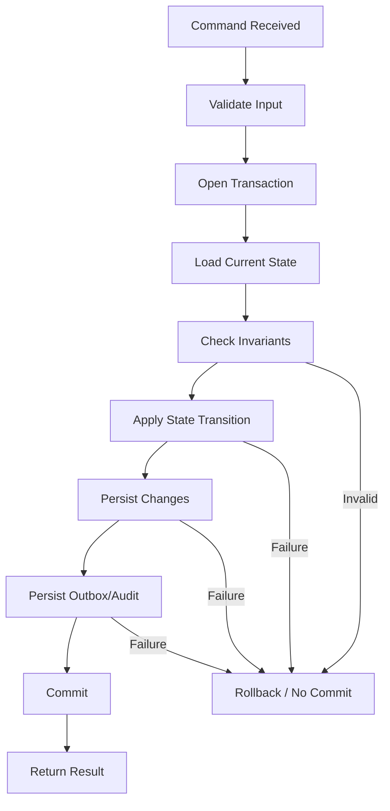
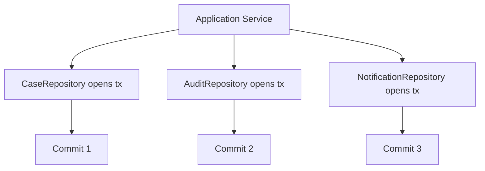
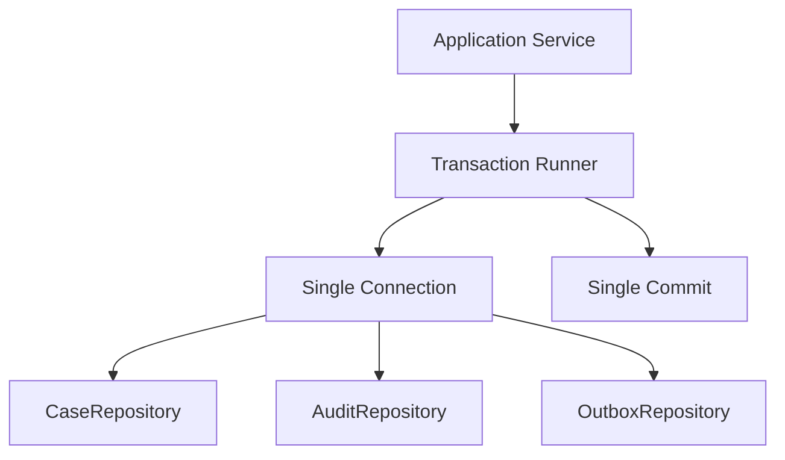
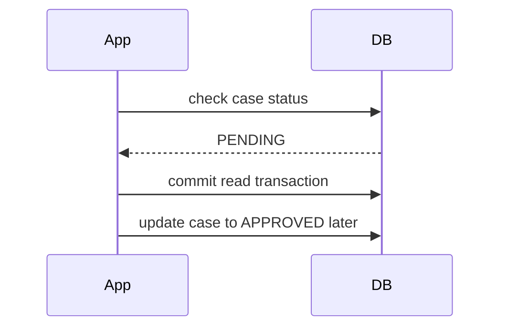
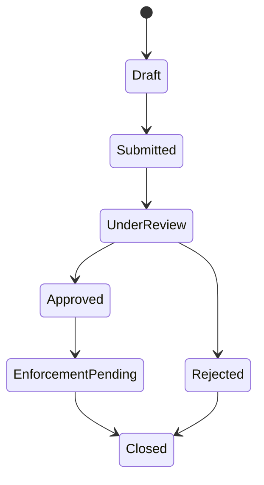
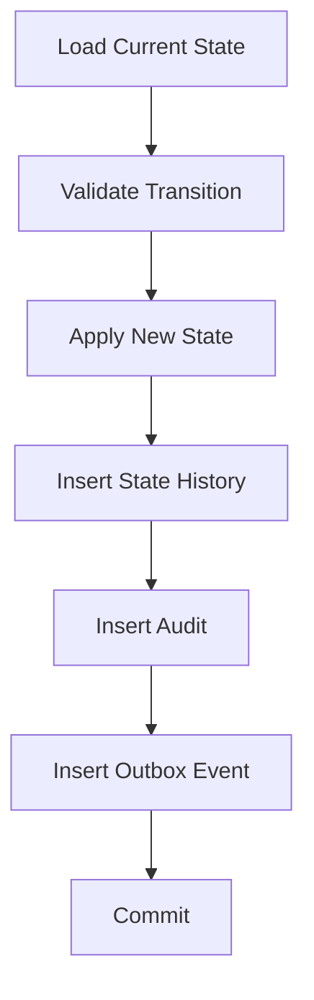
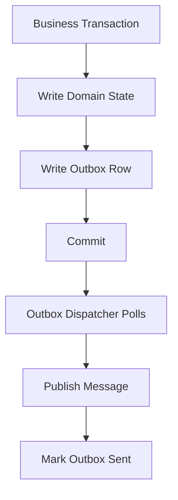
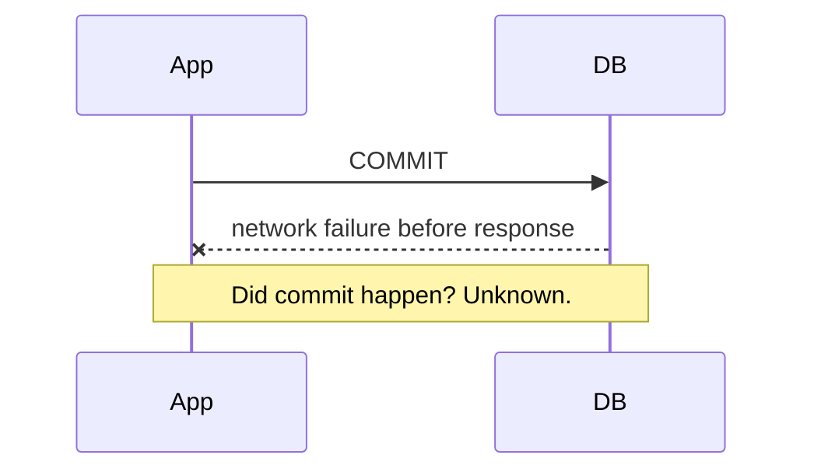
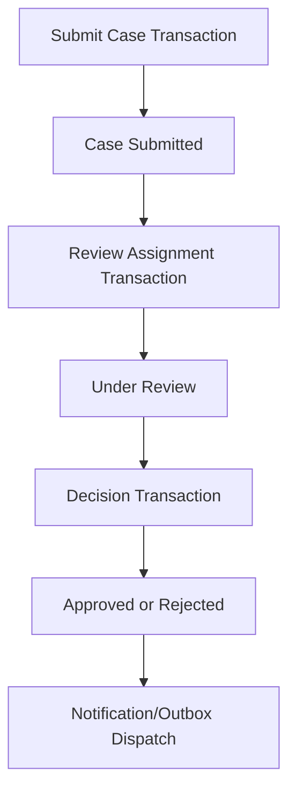
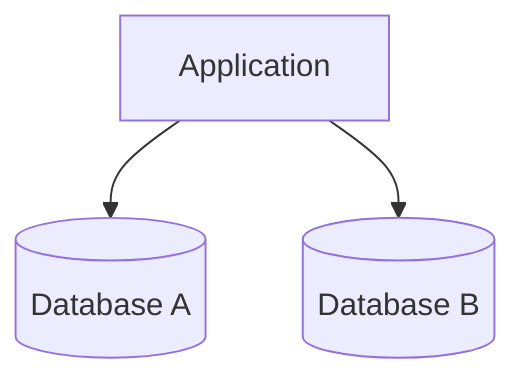

------
title: Learn Java SQL, JDBC, Transactions, Connection Management & HikariCP - Part 021
description: Transaction management sebagai keputusan arsitektur aplikasi: use-case boundary, consistency boundary, idempotency, side effects, outbox, retries, dan failure modelling.
series: learn-java-sql-jdbc
seriesTitle: Learn Java SQL, JDBC, Transactions, Connection Management & HikariCP
order: 21
partTitle: Transaction Management in Application Architecture
tags:
- java
- jdbc
- sql
- transactions
- architecture
- reliability
- consistency
- outbox
- series
date: 2026-06-27
---

# Part 021 — Transaction Management in Application Architecture

> Target skill: mampu menempatkan transaction boundary pada level use-case/application architecture, bukan sekadar memanggil `setAutoCommit(false)`, `commit()`, dan `rollback()` di tempat yang kebetulan terlihat nyaman.

Pada part sebelumnya, transaction dipelajari dari sisi mekanik JDBC:

- auto-commit;
- manual commit/rollback;
- isolation;
- locking;
- timeout;
- savepoint;
- connection ownership.

Part ini naik satu lapis: **transaction management sebagai keputusan arsitektur**.

Pertanyaan utamanya bukan lagi:

> “Bagaimana cara commit?”

Tetapi:

> “Perubahan apa yang harus menjadi satu unit konsistensi, siapa pemilik boundary-nya, side effect apa yang tidak boleh terjadi di dalamnya, dan bagaimana sistem pulih jika failure terjadi di titik yang tidak nyaman?”

Di sistem production, bug transaction jarang terlihat sebagai syntax error. Biasanya muncul sebagai:

- data setengah berubah;
- duplicate event;
- status workflow meloncat;
- email terkirim tetapi database rollback;
- payment captured tetapi order gagal;
- case escalation tercatat tetapi assignment tidak berubah;
- lock storm karena transaction memegang row terlalu lama;
- retry membuat data dobel;
- audit trail tidak cocok dengan state akhir.

Engineer top-tier tidak hanya tahu API transaction. Mereka tahu **di mana transaction harus hidup**.

---

## 1. Mental Model: Transaction Is a Consistency Boundary

Transaction bukan sekadar block kode. Transaction adalah boundary konsistensi.

Artinya, semua perubahan di dalam boundary tersebut harus memenuhi prinsip:

> Either all relevant state transitions become visible together, or none of them should become durable.

Dalam aplikasi bisnis, transaction biasanya merepresentasikan satu **business command**:

- create order;
- assign case;
- approve request;
- escalate enforcement action;
- mark invoice as paid;
- reserve inventory;
- publish domain event;
- close investigation;
- create audit entry.

Transaction yang baik punya bentuk seperti ini:



The key point: transaction begins **after cheap request validation**, and ends **before slow/non-transactional side effects**.

---

## 2. JDBC View of the Architecture Boundary

At JDBC level, transaction boundary is explicit:

```java
connection.setAutoCommit(false);
try {
    // SQL work
    connection.commit();
} catch (Exception e) {
    connection.rollback();
    throw e;
}
```

At architecture level, the same boundary should map to a use-case:

```java
public CaseAssignmentResult assignCase(AssignCaseCommand command) {
    return transactionRunner.inTransaction(connection -> {
        CaseRecord c = caseRepository.findForUpdate(connection, command.caseId());
        Officer officer = officerRepository.findActive(connection, command.officerId());

        c.assignTo(officer.id(), clock.instant());

        caseRepository.updateAssignment(connection, c);
        auditRepository.insert(connection, AuditEntry.caseAssigned(c.id(), officer.id()));
        outboxRepository.insert(connection, DomainEvent.caseAssigned(c.id(), officer.id()));

        return new CaseAssignmentResult(c.id(), c.status());
    });
}
```

The architectural invariant is:

> The application service owns the transaction; repositories participate in it.

Repositories should not silently open independent transactions for a single use-case unless explicitly designed that way.

---

## 3. The Transaction Ownership Rule

A clean JDBC architecture usually follows this rule:

| Layer | Responsibility |
|---|---|
| Controller/transport | Parse request, auth context, call application service |
| Application service / command handler | Own transaction boundary |
| Domain model | Enforce business invariants/state transition logic |
| Repository/DAO | Execute SQL using provided connection |
| Transaction runner | Open/commit/rollback/cleanup connection |
| Outbox dispatcher | Deliver already-committed events asynchronously |

Bad ownership pattern:



If `Commit 1` succeeds and `Commit 2` fails, the use-case is partially applied.

Good ownership pattern:



The rule is simple:

> One business command, one transaction owner, one commit decision.

---

## 4. What Should Be Inside a Transaction?

Put inside transaction:

- reads needed to check invariants;
- writes that must become durable together;
- audit records that must match the state transition;
- outbox rows for events/messages that must be emitted after commit;
- idempotency records;
- optimistic locking version updates;
- reservation rows;
- state-machine transition history.

Avoid inside transaction:

- HTTP calls to other services;
- email sending;
- Kafka/RabbitMQ publishing directly;
- file upload to external object storage, unless carefully staged;
- slow report generation;
- waiting for user input;
- long CPU-heavy processing;
- network calls with unclear timeout;
- sleeps/backoffs;
- synchronous webhook delivery.

The reason is not purity. It is resource safety:

- transaction holds a connection;
- connection consumes pool capacity;
- transaction may hold locks;
- locks block other transactions;
- external calls are not rolled back by database rollback;
- long transaction increases deadlock and timeout risk.

---

## 5. Transaction Boundary Placement

### 5.1 Too narrow

A transaction is too narrow when each repository commits independently:

```java
caseRepository.assign(caseId, officerId);      // commits
historyRepository.insertAssignment(caseId);    // commits
outboxRepository.insertEvent(event);           // commits
```

Failure mode:

- assignment committed;
- history insert failed;
- event not emitted;
- audit and state diverge.

### 5.2 Too wide

A transaction is too wide when it includes unrelated slow work:

```java
transactionRunner.inTransaction(connection -> {
    caseRepository.assign(connection, caseId, officerId);
    auditRepository.insert(connection, audit);

    externalHrClient.validateOfficerStillActive(officerId); // dangerous
    emailClient.sendAssignmentEmail(caseId, officerId);     // dangerous

    return null;
});
```

Failure mode:

- DB locks held while waiting for remote service;
- pool active grows;
- remote timeout causes rollback after long wait;
- email may be sent even if transaction rolls back;
- cascading failure spreads from remote dependency into database layer.

### 5.3 Useful boundary

A better design:

```java
OfficerSnapshot officer = externalHrClient.getOfficerSnapshot(officerId);

transactionRunner.inTransaction(connection -> {
    CaseRecord c = caseRepository.findForUpdate(connection, caseId);

    c.assignTo(officer.id(), clock.instant());

    caseRepository.updateAssignment(connection, c);
    auditRepository.insert(connection, AuditEntry.caseAssigned(c.id(), officer.id()));
    outboxRepository.insert(connection, DomainEvent.caseAssigned(c.id(), officer.id()));

    return null;
});
```

Even better, if HR data is needed for consistency, replicate/cache it locally and validate from local database state.

---

## 6. Command Handler Pattern

A command handler is a natural transaction owner.

```java
public final class ApproveCaseHandler {
    private final TransactionRunner tx;
    private final CaseRepository cases;
    private final AuditRepository audits;
    private final OutboxRepository outbox;
    private final Clock clock;

    public ApproveCaseHandler(
            TransactionRunner tx,
            CaseRepository cases,
            AuditRepository audits,
            OutboxRepository outbox,
            Clock clock
    ) {
        this.tx = tx;
        this.cases = cases;
        this.audits = audits;
        this.outbox = outbox;
        this.clock = clock;
    }

    public ApprovalResult handle(ApproveCaseCommand command) throws SQLException {
        validateCheapInput(command);

        return tx.inTransaction(connection -> {
            CaseRecord c = cases.findForUpdate(connection, command.caseId())
                    .orElseThrow(() -> new NotFoundException("case not found"));

            c.approve(command.approverId(), clock.instant());

            cases.updateStatus(connection, c);
            audits.insert(connection, AuditEntry.caseApproved(c.id(), command.approverId(), clock.instant()));
            outbox.insert(connection, DomainEvent.caseApproved(c.id(), c.version()));

            return new ApprovalResult(c.id(), c.status(), c.version());
        });
    }
}
```

This design makes transaction ownership visible:

- input validation before transaction;
- database state read inside transaction;
- invariant checks inside transaction;
- state mutation inside transaction;
- audit/outbox inside transaction;
- external side effects outside transaction.

---

## 7. Application Service vs Repository Transaction Boundary

A common question:

> “Should the repository open the transaction?”

For simple CRUD scripts, maybe acceptable.

For application architecture, usually no.

Reason:

A repository knows a table/aggregate access pattern. It does not know the whole use-case consistency boundary.

Example:

```java
class CaseRepository {
    void assign(Connection connection, CaseId id, OfficerId officerId) {
        // SQL only
    }
}
```

This repository can participate in many use-cases:

- initial assignment;
- reassignment;
- escalation;
- bulk balancing;
- manual override;
- auto-routing;
- rollback from appeal.

Each use-case has different invariants and side effects. Therefore, the application layer owns transaction orchestration.

---

## 8. Transaction and Domain Invariants

Transactions exist to protect invariants.

Examples:

| Invariant | Transaction implication |
|---|---|
| A case cannot be approved twice | Check current state and update atomically |
| A case must have exactly one active assignee | Update old/new assignment rows in same transaction |
| Audit history must match state transition | Insert audit row in same transaction as state update |
| An event must be emitted for every committed transition | Insert outbox row in same transaction |
| A retry must not duplicate command effect | Insert/check idempotency key in same transaction |
| Version must advance with mutation | Update `version = version + 1` in same write |

A weak design separates invariant into multiple transactions:



Between check and update, another transaction may modify the same row.

Better:

```sql
UPDATE cases
SET status = 'APPROVED', version = version + 1
WHERE id = ?
  AND status = 'PENDING'
```

Then inspect update count.

The update count becomes a concurrency signal.

---

## 9. Aggregate Boundary and Transaction Boundary

Domain-driven design often says one aggregate should be modified in one transaction. This is useful, but not absolute.

In database-backed systems, transaction boundary should be based on **invariant scope**.

Ask:

1. Which rows must change together?
2. Which invariants must be true at commit time?
3. Which side effects must correspond exactly to committed state?
4. Which updates can be eventually consistent?
5. What is the cost of locking these rows together?
6. What happens during retry?

Example:

Case escalation may involve:

- `cases` row;
- `case_status_history` row;
- `case_assignment` row;
- `audit_log` row;
- `outbox` row.

Those are different tables, but one consistency boundary.

Do not confuse “one aggregate” with “one table”.

---

## 10. State Machines and Transactional Transitions

For lifecycle-heavy systems, the cleanest model is often:



Each transition should be transactional:



Important invariant:

> A visible state transition without its history/audit/event is a corrupt transition.

Therefore, state update, transition history, audit, and outbox usually belong in one transaction.

---

## 11. External Side Effects and the Outbox Pattern

The classic bug:

```java
transactionRunner.inTransaction(connection -> {
    orderRepository.markPaid(connection, orderId);
    messageBroker.publish(new OrderPaid(orderId)); // not transactional with DB
    return null;
});
```

Failure scenarios:

| Scenario | Result |
|---|---|
| DB update succeeds, broker publish fails, transaction commits | State changed, event missing |
| Broker publish succeeds, DB commit fails | Event emitted for state that does not exist |
| Broker publish succeeds, process crashes before commit | Event emitted, DB unknown |

Outbox moves the side effect intent into the transaction:

```java
transactionRunner.inTransaction(connection -> {
    orderRepository.markPaid(connection, orderId);
    outboxRepository.insert(connection, new OutboxMessage("OrderPaid", payload));
    return null;
});
```

Then a separate dispatcher sends messages after commit:



Outbox does not eliminate all distributed systems complexity. It changes the problem from “atomic database + broker commit” to “reliable eventually-consistent delivery with idempotent consumers”.

That is usually a much better problem.

---

## 12. Idempotency as a Transactional Concern

Retries are unavoidable:

- client retry;
- service retry;
- job retry;
- message redelivery;
- deadlock retry;
- serialization failure retry;
- timeout uncertainty.

Without idempotency, retry can duplicate business effects.

A robust command often stores an idempotency record in the same transaction:

```sql
CREATE TABLE idempotency_keys (
    key             VARCHAR(128) PRIMARY KEY,
    command_type    VARCHAR(100) NOT NULL,
    response_hash   VARCHAR(128),
    created_at      TIMESTAMP NOT NULL
);
```

Use pattern:

```java
return tx.inTransaction(connection -> {
    boolean firstAttempt = idempotencyRepository.tryInsert(connection, command.idempotencyKey());

    if (!firstAttempt) {
        return idempotencyRepository.loadPreviousResult(connection, command.idempotencyKey());
    }

    CaseRecord c = cases.findForUpdate(connection, command.caseId())
            .orElseThrow();

    c.assignTo(command.officerId(), clock.instant());
    cases.updateAssignment(connection, c);
    audits.insert(connection, AuditEntry.caseAssigned(c.id(), command.officerId()));

    AssignmentResult result = new AssignmentResult(c.id(), c.version());
    idempotencyRepository.storeResult(connection, command.idempotencyKey(), result);

    return result;
});
```

Key invariant:

> The idempotency key and the business effect must commit together.

If idempotency is stored outside the transaction, it may lie.

---

## 13. Transaction and Retry Safety

Not every transaction can be safely retried.

Safe retry usually requires:

- idempotency key;
- deterministic command semantics;
- no non-transactional side effect inside transaction;
- bounded retry count;
- backoff and jitter;
- clear retryable exception classification;
- ability to detect duplicate effect.

Retryable examples:

- serialization failure;
- deadlock victim;
- lock timeout for idempotent command;
- transient connection failure before statement execution.

Dangerous retry examples:

- ambiguous commit;
- insert without natural key/idempotency key;
- command that sends email inside transaction;
- command that calls payment capture inside transaction;
- command that increments counter without deduplication.

Ambiguous commit deserves special attention.



If the app retries blindly, it may duplicate the effect. The correct response is often:

- query by idempotency key/natural key;
- reconcile state;
- return previous result if committed;
- fail safely if uncertain.

---

## 14. Read-Only Transactions Are Still Transactions

A read-only use-case may still need transaction semantics:

- consistent snapshot;
- repeatable pagination;
- stable audit/report result;
- lock-free MVCC snapshot depending on DB;
- protection against reading half of a logical view.

But read-only transactions should be short.

Dangerous pattern:

```java
transactionRunner.inReadOnlyTransaction(connection -> {
    List<Row> rows = reportRepository.loadLargeReport(connection);
    renderPdf(rows); // slow CPU/file work while connection is held
    return null;
});
```

Better:

```java
List<Row> rows = transactionRunner.inReadOnlyTransaction(connection ->
        reportRepository.loadReportSnapshot(connection, criteria)
);

return pdfRenderer.render(rows);
```

For very large reports, even this may be wrong. Use snapshot tables, asynchronous export jobs, keyset pagination, or streaming with explicit resource controls.

---

## 15. Locking as an Architectural Decision

Pessimistic locking can be correct:

```sql
SELECT *
FROM cases
WHERE id = ?
FOR UPDATE
```

But it has architectural consequences:

- connection is held;
- row lock is held;
- other transactions may block;
- deadlock risk increases;
- timeout design becomes critical;
- user-facing latency may increase.

Optimistic locking can be better:

```sql
UPDATE cases
SET status = ?, version = version + 1
WHERE id = ?
  AND version = ?
```

Then:

- update count `1` means success;
- update count `0` means conflict or stale read;
- caller can retry, refresh, or return conflict.

Rule of thumb:

| Scenario | Usually better |
|---|---|
| Short critical state transition | Optimistic update or short pessimistic lock |
| High contention queue claiming | Pessimistic lock / skip locked / atomic claim query |
| User edit form over minutes | Optimistic locking |
| Financial ledger append | Unique constraints + append-only + idempotency |
| Workflow transition | Conditional update + history insert |
| Long-running business process | Saga/process manager, not one DB transaction |

---

## 16. Long-Running Business Process Is Not a Long Transaction

Some business processes take minutes, hours, or days:

- case investigation;
- approval workflow;
- settlement lifecycle;
- dispute handling;
- regulatory enforcement;
- onboarding verification;
- loan approval;
- fulfillment pipeline.

Do not model these as one database transaction.

Instead, model each step as a short transaction:



The process is long-running. The transaction is short-running.

This distinction is one of the most important architecture boundaries in database-backed systems.

---

## 17. Transaction Boundary and Validation

Validation has layers.

### 17.1 Before transaction

Do cheap deterministic checks before opening transaction:

- required field present;
- string length;
- enum value;
- syntactic date validity;
- basic authorization context;
- request shape.

This avoids wasting connection pool capacity.

### 17.2 Inside transaction

Do state-dependent checks inside transaction:

- current status allows transition;
- referenced row exists;
- assignee is active in local authoritative table;
- version matches;
- idempotency key is unused;
- quota/capacity still available;
- uniqueness still holds.

These checks need database state and must be protected by isolation/locking/constraints.

### 17.3 After transaction

Do non-transactional follow-up after commit:

- send email;
- publish external message if not using outbox dispatcher;
- invalidate cache;
- trigger async projection;
- schedule job.

Prefer outbox for anything that must correspond reliably to committed state.

---

## 18. Cache and Transaction Boundary

Cache invalidation inside transaction is tricky.

Bad pattern:

```java
transactionRunner.inTransaction(connection -> {
    caseRepository.updateStatus(connection, caseId, APPROVED);
    cache.evict("case:" + caseId); // non-transactional side effect
    return null;
});
```

If transaction rolls back after cache eviction, cache may be unnecessarily invalidated. Usually safe but noisy.

Worse:

```java
transactionRunner.inTransaction(connection -> {
    caseRepository.updateStatus(connection, caseId, APPROVED);
    cache.put("case:" + caseId, approvedDto); // dangerous
    return null;
});
```

If transaction rolls back, cache contains state that never committed.

Safer options:

- evict after commit;
- use transaction synchronization callback if framework supports it;
- publish outbox event and let cache/projection update asynchronously;
- use short TTL if consistency requirement is weak.

---

## 19. Transaction and Audit Trail

Audit should usually be part of the same transaction as the audited mutation.

If state changes but audit fails, many domains prefer rollback.

```java
tx.inTransaction(connection -> {
    cases.updateStatus(connection, caseId, APPROVED);
    audit.insert(connection, AuditEntry.statusChanged(caseId, APPROVED, actorId));
    return null;
});
```

Why?

Audit is not just logging. In regulated or accountability-heavy systems, audit is part of correctness.

Important audit invariants:

- every material state transition has audit;
- audit timestamp is consistent with commit boundary as much as practical;
- actor/system identity is captured;
- before/after state is reconstructable;
- audit write failure should be visible;
- audit records are append-only or tamper-evident where required.

Anti-pattern:

```java
cases.updateStatus(...); // commits
auditLogger.log(...);    // async best-effort only
```

This is acceptable only for operational logs, not authoritative audit.

---

## 20. Transaction and Domain Events

A domain event means:

> Something meaningful happened in the domain.

But an event should not usually be externally visible before the transaction commits.

Inside transaction:

```java
outbox.insert(connection, new DomainEventEnvelope(
        UUID.randomUUID(),
        "CaseApproved",
        caseId,
        payload,
        clock.instant()
));
```

After commit:

- dispatcher publishes;
- consumer handles idempotently;
- outbox row is marked sent or retried.

Do not confuse:

| Thing | Transactional? | Purpose |
|---|---:|---|
| Domain event object in memory | No | Capture domain meaning |
| Outbox row | Yes | Durable delivery intent |
| Broker message | No, relative to DB | External delivery |
| Consumer side effect | Separate transaction | Downstream reaction |

---

## 21. Multi-Database Transaction Boundary

If one use-case updates two databases, do not assume JDBC local transaction protects both.

Example:



With local JDBC transactions:

- commit A may succeed;
- commit B may fail;
- rollback A may no longer be possible.

Options:

1. avoid cross-database write in one use-case;
2. choose one source of truth and replicate asynchronously;
3. use outbox/inbox;
4. use saga/process manager;
5. use distributed transaction/XA only when operationally justified.

XA is not a magic default. It adds coordination cost and failure complexity.

For most service architectures, outbox + idempotent consumers is usually simpler operationally.

---

## 22. Nested Use-Cases and Transaction Composition

A subtle architecture bug:

```java
public void approveCase(CaseId id) {
    tx.inTransaction(conn -> {
        cases.approve(conn, id);
        notifyApproval(id); // internally opens another transaction
        return null;
    });
}
```

Nested use-case calls often hide transaction boundaries.

Better:

- separate pure domain operation from transactional orchestration;
- make transaction propagation explicit;
- avoid application service calling another application service unless boundary is known;
- expose lower-level collaborator that accepts current `Connection` or participates in current transaction.

Example:

```java
public void approveCase(CaseId id) {
    tx.inTransaction(conn -> {
        Approval approval = approvalDomainService.approve(conn, id);
        outbox.insert(conn, DomainEvent.caseApproved(approval.caseId()));
        return null;
    });
}
```

---

## 23. Transaction Runner With Policy

A production-grade transaction runner should centralize policy:

- connection acquisition;
- auto-commit restore;
- isolation setting;
- read-only flag;
- timeout/deadline if supported;
- commit;
- rollback;
- exception wrapping;
- metrics;
- logging;
- leak-safe cleanup.

Example skeleton:

```java
public final class TransactionRunner {
    private final DataSource dataSource;

    public TransactionRunner(DataSource dataSource) {
        this.dataSource = dataSource;
    }

    public <T> T inTransaction(TransactionOptions options, SqlWork<T> work) throws SQLException {
        try (Connection connection = dataSource.getConnection()) {
            boolean previousAutoCommit = connection.getAutoCommit();
            boolean previousReadOnly = connection.isReadOnly();
            int previousIsolation = connection.getTransactionIsolation();

            try {
                connection.setAutoCommit(false);
                connection.setReadOnly(options.readOnly());

                if (options.isolation() != null) {
                    connection.setTransactionIsolation(options.isolation().jdbcLevel());
                }

                T result = work.execute(connection);
                connection.commit();
                return result;
            } catch (Throwable failure) {
                try {
                    connection.rollback();
                } catch (SQLException rollbackFailure) {
                    failure.addSuppressed(rollbackFailure);
                }
                throw failure;
            } finally {
                try {
                    connection.setReadOnly(previousReadOnly);
                    connection.setTransactionIsolation(previousIsolation);
                    connection.setAutoCommit(previousAutoCommit);
                } catch (SQLException resetFailure) {
                    // In a pool, reset failure may cause connection eviction depending on pool/driver.
                    throw resetFailure;
                }
            }
        }
    }
}
```

In real code, carefully handle checked exceptions and avoid throwing from finally in a way that hides the primary exception. The skeleton is for architectural shape.

---

## 24. Transaction Boundary and Observability

A transaction should be observable as a unit.

Capture:

- use-case name;
- transaction duration;
- connection acquisition duration;
- commit duration;
- rollback count;
- rollback failure count;
- isolation level;
- read-only flag;
- number of statements if available;
- lock timeout/deadlock classification;
- retry attempt count;
- idempotency key presence;
- outbox row count;
- correlation/request ID.

Example log fields:

```json
{
  "event": "transaction.completed",
  "use_case": "case.approve",
  "duration_ms": 84,
  "connection_acquire_ms": 3,
  "commit_ms": 7,
  "read_only": false,
  "isolation": "READ_COMMITTED",
  "outcome": "committed",
  "retry_attempt": 0
}
```

Avoid logging raw SQL parameters if they contain PII/secrets.

---

## 25. Transaction Boundary and Authorization

Authorization can be split:

Before transaction:

- caller has broad permission to attempt operation;
- token/session is valid;
- role allows command type.

Inside transaction:

- caller has access to this specific row/entity;
- current state allows actor to perform transition;
- assignment/ownership is still valid;
- row has not moved to another tenant/partition.

Example:

```java
validateCanAttemptApproval(actor);

return tx.inTransaction(connection -> {
    CaseRecord c = cases.findForUpdate(connection, command.caseId()).orElseThrow();

    authorizationPolicy.requireCanApprove(actor, c);
    c.approve(actor.id(), clock.instant());

    cases.updateStatus(connection, c);
    audits.insert(connection, AuditEntry.caseApproved(c.id(), actor.id()));
    return result(c);
});
```

Do not rely only on pre-transaction authorization when authorization depends on mutable database state.

---

## 26. Transaction Boundary and Tenant Safety

Multi-tenant systems need tenant constraints inside every transactional query.

Bad:

```sql
UPDATE cases
SET status = ?
WHERE id = ?
```

Better:

```sql
UPDATE cases
SET status = ?
WHERE tenant_id = ?
  AND id = ?
```

Tenant invariant:

> Every read/write inside the transaction must be tenant-scoped unless intentionally global.

Transaction boundary should carry tenant context explicitly:

```java
record TransactionContext(
        TenantId tenantId,
        ActorId actorId,
        String correlationId
) {}
```

Then repositories require it:

```java
cases.updateStatus(connection, context.tenantId(), caseId, APPROVED);
```

---

## 27. Transaction Boundary and Schema Constraints

Application transaction logic should not replace database constraints.

Use constraints as guardrails:

- primary key;
- foreign key;
- unique constraint;
- check constraint;
- not-null constraint;
- exclusion/partial unique constraint where supported;
- version column;
- generated identity;
- immutable append-only table design where needed.

Example idempotency guard:

```sql
CREATE UNIQUE INDEX uq_case_command_key
ON case_commands(tenant_id, idempotency_key);
```

Then application handles duplicate key as known idempotency signal.

Top-tier design combines:

- application invariant checks for business clarity;
- database constraints for race-condition safety.

---

## 28. Transaction Boundary Decision Framework

Use this checklist when designing a use-case:

### 28.1 State

- What rows/tables are read?
- What rows/tables are written?
- Which rows must change atomically?
- Which rows are append-only?
- Which rows are high-contention?

### 28.2 Invariants

- What must be true before commit?
- What should happen on concurrent modification?
- Can the invariant be enforced by a conditional update?
- Can the invariant be enforced by a unique constraint?
- Does isolation level matter?

### 28.3 Side effects

- What external messages/emails/webhooks are needed?
- Are they allowed to happen before commit?
- Should they be represented by outbox rows?
- Are consumers idempotent?

### 28.4 Failure

- What if connection acquisition times out?
- What if statement times out?
- What if lock wait times out?
- What if deadlock occurs?
- What if commit result is unknown?
- What if dispatcher publishes duplicate message?

### 28.5 Operation

- How long should transaction normally last?
- What metric proves transaction is healthy?
- What alert indicates degradation?
- What dashboard connects app transaction to DB wait event?

---

## 29. Common Anti-Patterns

### 29.1 Transaction per DAO method

Looks modular, breaks atomic use-case consistency.

### 29.2 Transaction around external API call

Holds locks/connections while waiting on remote systems.

### 29.3 Publish message inside transaction

Broker publish is not rolled back with DB rollback.

### 29.4 Audit outside transaction

State can commit without authoritative audit.

### 29.5 Idempotency outside transaction

Retry guard can diverge from business effect.

### 29.6 Long-running workflow as one transaction

Database transaction should not span human or long async process.

### 29.7 Swallow exception and commit anyway

Partial failure becomes durable corruption.

### 29.8 Open transaction before validation

Consumes pool capacity for invalid requests.

### 29.9 Hidden nested transaction

Service A calls Service B and Service B starts/commits independently.

### 29.10 Retry without idempotency

May duplicate writes or side effects.

---

## 30. Practical Design Example: Case Escalation

Requirement:

> Escalate a case from `UNDER_REVIEW` to `ESCALATED`, assign escalation team, record audit, and notify downstream workflow.

Bad design:

```java
caseRepository.updateStatus(caseId, ESCALATED);      // transaction 1
assignmentRepository.assign(caseId, teamId);         // transaction 2
auditRepository.logEscalation(caseId, actorId);      // transaction 3
messageBroker.publish(new CaseEscalated(caseId));    // external side effect
```

Failure can create impossible state.

Better design:

```java
public EscalationResult escalate(EscalateCaseCommand command) throws SQLException {
    validateCheapInput(command);

    return tx.inTransaction(connection -> {
        CaseRecord c = cases.findForUpdate(connection, command.caseId())
                .orElseThrow(() -> new NotFoundException("case not found"));

        if (!c.status().equals(CaseStatus.UNDER_REVIEW)) {
            throw new InvalidTransitionException(c.status(), CaseStatus.ESCALATED);
        }

        c.escalate(command.teamId(), clock.instant());

        cases.updateStatusAndTeam(connection, c);
        caseHistory.insert(connection, CaseHistory.transition(c.id(), UNDER_REVIEW, ESCALATED));
        audits.insert(connection, AuditEntry.caseEscalated(c.id(), command.actorId()));
        outbox.insert(connection, DomainEvent.caseEscalated(c.id(), c.version()));

        return new EscalationResult(c.id(), c.status(), c.version());
    });
}
```

This design gives one commit decision for:

- status;
- assignment;
- history;
- audit;
- event intent.

---

## 31. Practice: Review a Transaction Boundary

Given this code:

```java
public void closeCase(CloseCaseCommand command) {
    tx.inTransaction(conn -> {
        CaseRecord c = cases.find(conn, command.caseId()).orElseThrow();
        c.close(command.reason());
        cases.update(conn, c);
        return null;
    });

    emailClient.sendClosedEmail(command.caseId());
    auditRepository.insertClosed(command.caseId(), command.actorId());
}
```

Problems:

1. Audit is outside transaction.
2. Email can be sent even if audit fails.
3. Email delivery is not durable/retryable.
4. `find` may need lock or conditional update depending on concurrency model.
5. No outbox event.
6. No idempotency key.

Improved:

```java
public void closeCase(CloseCaseCommand command) {
    tx.inTransaction(conn -> {
        CaseRecord c = cases.findForUpdate(conn, command.caseId()).orElseThrow();
        c.close(command.reason(), clock.instant());

        cases.update(conn, c);
        auditRepository.insertClosed(conn, command.caseId(), command.actorId());
        outboxRepository.insert(conn, DomainEvent.caseClosed(command.caseId()));

        return null;
    });
}
```

Email is sent by outbox consumer after commit.

---

## 32. Senior-Level Review Checklist

Before approving transaction-related code, ask:

- What is the business command?
- Where does transaction start and end?
- Who owns commit decision?
- Are repositories opening hidden transactions?
- Are all state changes that must be atomic inside one boundary?
- Are authoritative audit records inside the same transaction?
- Are domain events represented by outbox rows?
- Are external calls outside transaction?
- Is idempotency stored with the business effect?
- Are concurrency conflicts detected?
- Are update counts checked?
- Are constraints used as guardrails?
- Is retry safe?
- Is ambiguous commit handled?
- Is transaction duration bounded?
- Are locks held for the shortest practical time?
- Is observability sufficient?

---

## 33. Summary

Transaction management at architecture level is about **consistency boundary design**.

The best rule:

> Put exactly the state changes that must be atomic into one short transaction. Put external side effects outside the transaction, but persist their intent inside the transaction when reliability matters.

A strong Java/JDBC engineer should be able to explain:

- why the application service usually owns transaction boundary;
- why repositories should usually accept a connection or participate in existing transaction;
- why outbox is often needed;
- why idempotency belongs inside transaction;
- why long-running workflows are not long transactions;
- why commit uncertainty changes retry design;
- why audit and state transition often belong together;
- why timeout, locking, and pool capacity are architectural constraints.

This part completes the transition from JDBC mechanics to application architecture.

Next, we map the same mental model onto Spring transaction management.

---

## References

- Java SE 25 `Connection` API: `setAutoCommit`, `commit`, `rollback`, isolation, read-only state.
- Spring Framework Reference: Transaction Management.
- Spring Framework Javadoc: `TransactionSynchronizationManager`.
- Patterns: transactional outbox, idempotent consumer, unit of work, command handler, optimistic concurrency.
