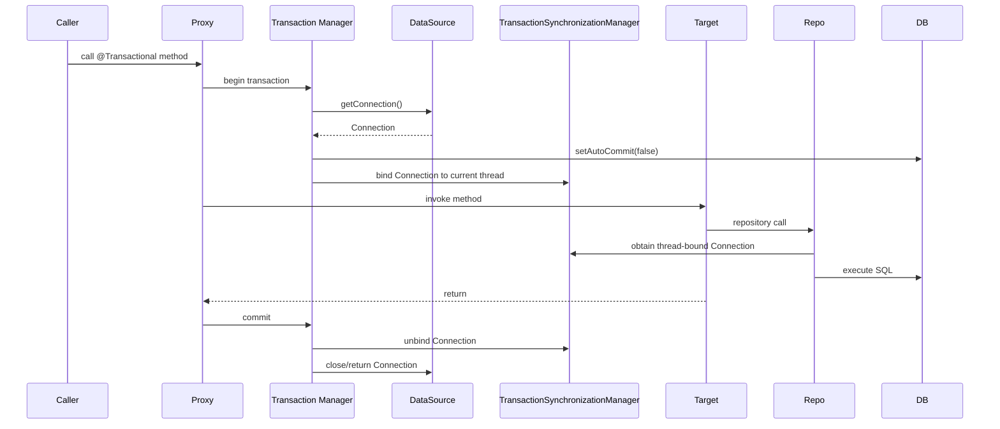
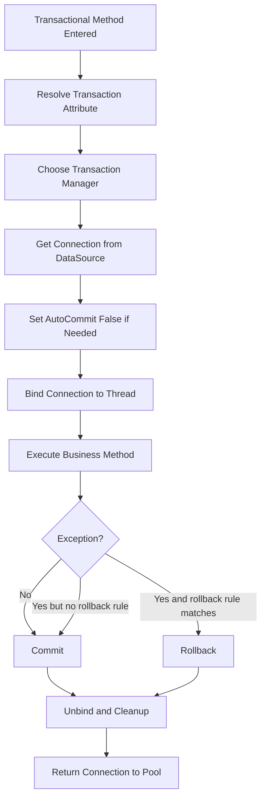
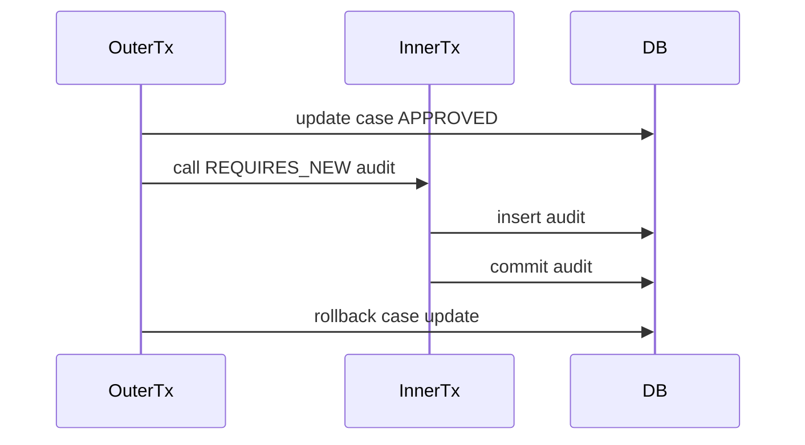

------
title: Learn Java SQL, JDBC, Transactions, Connection Management & HikariCP - Part 022
description: Spring transaction management dari lensa JDBC: DataSourceTransactionManager, thread-bound Connection, TransactionSynchronizationManager, @Transactional, propagation, rollback rules, self-invocation, dan pitfalls.
series: learn-java-sql-jdbc
seriesTitle: Learn Java SQL, JDBC, Transactions, Connection Management & HikariCP
order: 22
partTitle: Spring Transaction Management Through JDBC Lens
tags:
- java
- jdbc
- sql
- spring
- transactions
- datasource
- hikaricp
- architecture
- series
date: 2026-06-27
---

# Part 022 — Spring Transaction Management Through JDBC Lens

> Target skill: mampu memahami Spring transaction management sebagai orchestration di atas JDBC `Connection`, bukan sebagai magic annotation. Setelah part ini, `@Transactional` harus terasa seperti shorthand untuk connection acquisition, auto-commit control, commit/rollback, resource binding, dan cleanup policy.

Spring transaction sering dipelajari dari permukaan:

```java
@Transactional
public void approveCase(...) {
    ...
}
```

Tetapi engineer production perlu tahu apa yang sebenarnya terjadi:

- connection diperoleh dari `DataSource`;
- transaction manager mematikan auto-commit;
- connection di-bind ke thread saat ini;
- repository/JdbcTemplate mengambil connection yang sama;
- commit/rollback dilakukan di akhir method;
- connection dikembalikan ke pool;
- propagation menentukan apakah method ikut transaction lama atau membuat transaction baru;
- rollback rules menentukan exception mana yang menyebabkan rollback;
- proxy/AOP menentukan apakah annotation benar-benar aktif.

Spring tidak menghapus JDBC semantics. Spring menyembunyikan sebagian boilerplate dan menambahkan policy layer.

---

## 1. The Core Mental Model

Without Spring:

```java
try (Connection connection = dataSource.getConnection()) {
    connection.setAutoCommit(false);
    try {
        repositoryA.doWork(connection);
        repositoryB.doWork(connection);
        connection.commit();
    } catch (Exception e) {
        connection.rollback();
        throw e;
    }
}
```

With Spring:

```java
@Transactional
public void doUseCase() {
    repositoryA.doWork();
    repositoryB.doWork();
}
```

Conceptually, Spring does something like:



This is the correct intuition:

> `@Transactional` is not a database feature. It is an application-side transaction interceptor that coordinates JDBC resources through a transaction manager.

---

## 2. The Main Spring Transaction Components

| Component | Role |
|---|---|
| `PlatformTransactionManager` | Core abstraction for begin/commit/rollback |
| `DataSourceTransactionManager` | JDBC transaction manager for one `DataSource` |
| `TransactionDefinition` | Propagation, isolation, timeout, read-only, name |
| `TransactionStatus` | Runtime state of current transaction |
| `TransactionSynchronizationManager` | Thread-bound resource and synchronization holder |
| `DataSourceUtils` | Gets Spring-managed connection from `DataSource` |
| `TransactionTemplate` | Programmatic transaction helper |
| `@Transactional` | Declarative transaction metadata |
| `JdbcTemplate` | JDBC helper that participates in Spring transactions |

At JDBC level, the most important one is `DataSourceTransactionManager`.

It manages a transaction for a single JDBC `DataSource`.

---

## 3. DataSourceTransactionManager Through JDBC Eyes

`DataSourceTransactionManager` is effectively the Spring version of the transaction runner from part 014 and part 021.

It is responsible for:

- obtaining a `Connection` from `DataSource`;
- applying transaction settings;
- binding connection to the current thread;
- committing or rolling back;
- cleaning up;
- restoring connection state as needed;
- returning connection to the pool.

Conceptual flow:



The magic is mostly orchestration.

The database still sees a normal JDBC transaction.

---

## 4. Thread-Bound Connection

Spring transaction management for imperative JDBC is thread-bound.

That means:

- transaction context is associated with the current thread;
- repository code called on the same thread can reuse the same connection;
- code running on another thread does not automatically see the transaction;
- `@Async`, manual thread creation, executor tasks, and reactive flows require separate transaction thinking.

Example problem:

```java
@Transactional
public void approveCase(CaseId id) {
    caseRepository.approve(id);

    CompletableFuture.runAsync(() -> {
        auditRepository.insertAudit(id); // not in same transaction
    });
}
```

The async audit insert is not part of the original JDBC transaction.

Safer approach:

```java
@Transactional
public void approveCase(CaseId id) {
    caseRepository.approve(id);
    auditRepository.insertAudit(id);
    outboxRepository.insertCaseApprovedEvent(id);
}
```

Then deliver asynchronous effects after commit.

---

## 5. Why DataSourceUtils Matters

Inside Spring-managed JDBC code, do not casually call:

```java
Connection connection = dataSource.getConnection();
```

If a transaction is active, direct `dataSource.getConnection()` may bypass Spring's thread-bound connection depending on setup and wrapper usage.

Spring-aware infrastructure uses `DataSourceUtils`:

```java
Connection connection = DataSourceUtils.getConnection(dataSource);
```

`JdbcTemplate` already does this for you.

Therefore:

- if using `JdbcTemplate`, it participates automatically;
- if writing low-level Spring-integrated JDBC utility, use Spring's utilities;
- if writing framework-independent code, pass `Connection` explicitly or keep it outside Spring assumptions.

Bad mixed style:

```java
@Transactional
public void useCase() throws SQLException {
    jdbcTemplate.update("update cases set status = ? where id = ?", "APPROVED", id);

    try (Connection c = dataSource.getConnection()) {
        // May be a separate connection/transaction depending on context.
        doManualSql(c);
    }
}
```

Better:

```java
@Transactional
public void useCase() {
    jdbcTemplate.update("update cases set status = ? where id = ?", "APPROVED", id);
    customJdbcDao.doManualSqlUsingJdbcTemplateOrDataSourceUtils(id);
}
```

---

## 6. `@Transactional` Is Usually Proxy-Based

In common Spring applications, declarative transaction management is applied through proxy/AOP.

That means the transactional behavior happens when a caller invokes the method through the Spring proxy.

Important consequence:

```java
@Service
public class CaseService {

    public void outer(CaseId id) {
        inner(id); // self-invocation
    }

    @Transactional
    public void inner(CaseId id) {
        // transaction may not start when called via this.inner()
    }
}
```

This is the self-invocation problem.

Because `outer()` calls `inner()` on `this`, the call may not pass through the proxy that applies transaction advice.

Better options:

1. put transaction on the externally-called method;
2. split inner transactional method into another Spring bean;
3. use `TransactionTemplate` for explicit boundary;
4. use AspectJ mode if deliberately configured and understood.

Best simple design:

```java
@Transactional
public void outer(CaseId id) {
    // transaction boundary is visible at use-case method
    doWork(id);
}
```

---

## 7. Transaction Propagation

Propagation controls what happens when a transactional method is called while another transaction may already exist.

### 7.1 REQUIRED

Default and most common.

> Join existing transaction if present; otherwise create new one.

```java
@Transactional
public void approveCase(...) {
    repository.update(...);
    auditService.record(...); // joins same tx if REQUIRED
}
```

Use for normal use-case composition.

Risk: hidden composition can make transaction wider than expected.

### 7.2 REQUIRES_NEW

> Suspend existing transaction and start a new independent transaction.

Useful for rare cases like independent audit attempt, but dangerous if misunderstood.

```java
@Transactional(propagation = Propagation.REQUIRES_NEW)
public void recordOperationalAudit(...) {
    ...
}
```

Failure mode:

- inner transaction commits;
- outer transaction rolls back;
- audit says something happened even though business state did not commit.

Sometimes desired, often not.

### 7.3 NESTED

> Use savepoint within existing transaction where supported.

This maps closer to JDBC savepoint semantics, not a fully independent transaction.

If outer transaction rolls back, nested work rolls back too.

Use carefully.

### 7.4 SUPPORTS

> Join transaction if present; otherwise run non-transactionally.

Can be useful for read helpers, but can make behavior context-dependent.

### 7.5 NOT_SUPPORTED

> Suspend transaction and run without transaction.

Useful for work that must not hold transaction resources, such as some slow reads or external interaction orchestration.

### 7.6 MANDATORY

> Require existing transaction; fail if none exists.

Useful for internal repository-like service that must never own boundary.

### 7.7 NEVER

> Fail if transaction exists.

Rare but useful to prevent dangerous calls inside transactions.

---

## 8. Propagation Failure Models

Propagation is not just syntax. It changes durability and failure semantics.

Example with `REQUIRES_NEW`:

```java
@Transactional
public void approveCase(CaseId id) {
    caseRepository.approve(id);
    auditService.recordApprovalRequiresNew(id);
    throw new RuntimeException("later failure");
}
```

If audit uses `REQUIRES_NEW`:



Result:

- audit committed;
- case approval rolled back.

This may be correct for operational trace, but wrong for authoritative audit.

Always ask:

> Should this inner work survive if the outer use-case rolls back?

---

## 9. Isolation in `@Transactional`

Spring lets you set isolation:

```java
@Transactional(isolation = Isolation.READ_COMMITTED)
public void approveCase(...) {
    ...
}
```

This maps to JDBC/database isolation settings through the transaction manager.

Important caveats:

- database behavior still varies by vendor;
- changing isolation inside an existing transaction may not behave as expected;
- default isolation usually means database default;
- isolation does not replace constraints;
- higher isolation can increase blocking/retry pressure;
- Spring setting only matters when a new physical transaction is started.

If a method joins an existing transaction, its declared isolation may not become effective as a new database transaction setting.

Therefore, isolation should be part of the outer use-case boundary design, not hidden deep inside helper services.

---

## 10. Read-Only Transactions

Spring supports:

```java
@Transactional(readOnly = true)
public CaseView loadCase(CaseId id) {
    return repository.findView(id);
}
```

Read-only is a hint and policy marker. Depending on transaction manager/database/driver, it may affect connection read-only state or optimization behavior.

Do not treat read-only as a security control.

Bad assumption:

> “readOnly=true guarantees no writes can happen.”

Better understanding:

> readOnly=true communicates intent and may enable optimizations or enforcement depending on infrastructure, but correctness should not rely solely on it.

Use it for:

- clearer intent;
- avoiding accidental write paths in code review;
- potential database/ORM optimizations;
- transaction classification/metrics.

Avoid long read-only transactions for large report rendering.

---

## 11. Timeout in `@Transactional`

Spring supports transaction timeout metadata:

```java
@Transactional(timeout = 3)
public void approveCase(...) {
    ...
}
```

But transaction timeout is not the same as all other timeouts.

You still need to reason about:

- Hikari `connectionTimeout`;
- JDBC query timeout;
- database lock timeout;
- socket timeout;
- HTTP/request timeout;
- retry budget.

A Spring transaction timeout that is longer than the caller timeout may be useless. The caller may give up while transaction still runs.

A query timeout that is longer than transaction timeout may also be incoherent.

Timeouts should be designed from outer deadline inward.

---

## 12. Rollback Rules

Spring declarative transactions default to rolling back on unchecked exceptions (`RuntimeException`) and `Error`, but not necessarily checked exceptions unless configured.

Example pitfall:

```java
@Transactional
public void importFile(...) throws IOException {
    caseRepository.insert(...);
    if (badFile) {
        throw new IOException("invalid file");
    }
}
```

If `IOException` is checked and rollback rule is not configured, behavior may surprise teams.

Be explicit when needed:

```java
@Transactional(rollbackFor = IOException.class)
public void importFile(...) throws IOException {
    ...
}
```

But avoid using broad rollback rules as a substitute for clear exception taxonomy.

Recommended approach:

- domain validation exception: usually rollback if thrown after mutation;
- transient database exception: rollback and maybe retry;
- checked integration exception: avoid inside transaction if possible;
- business rejection before mutation: no transaction needed or rollback harmless.

---

## 13. Catching Exceptions Inside `@Transactional`

Dangerous pattern:

```java
@Transactional
public void approveCase(CaseId id) {
    try {
        caseRepository.approve(id);
        auditRepository.insert(id);
    } catch (Exception e) {
        log.warn("failed", e);
    }
}
```

If exception is swallowed, the transaction interceptor may see normal return and commit partial work.

Better:

```java
@Transactional
public void approveCase(CaseId id) {
    try {
        caseRepository.approve(id);
        auditRepository.insert(id);
    } catch (Exception e) {
        throw new CaseApprovalFailedException(id, e);
    }
}
```

Or explicitly mark rollback-only if handling is required:

```java
TransactionAspectSupport.currentTransactionStatus().setRollbackOnly();
```

Use rollback-only sparingly. It couples business code to Spring transaction mechanics.

---

## 14. UnexpectedRollbackException

Common scenario:

```java
@Transactional
public void outer() {
    try {
        inner();
    } catch (RuntimeException ignored) {
        // continue
    }
}

@Transactional
public void inner() {
    repository.update();
    throw new RuntimeException("boom");
}
```

If `inner()` participates in the same transaction and marks it rollback-only, `outer()` may continue, but commit later fails because the transaction can no longer commit.

Mental model:

> Once a transaction is marked rollback-only, catching the exception does not make the transaction committable again.

Design options:

- let exception propagate;
- isolate optional work using `REQUIRES_NEW` if independent;
- do optional work after commit;
- use savepoint/nested semantics if appropriate;
- avoid partial failure inside one business transaction unless explicitly modelled.

---

## 15. `TransactionTemplate`

`TransactionTemplate` gives explicit programmatic transaction boundary while still using Spring infrastructure.

```java
public ApprovalResult approveCase(ApproveCaseCommand command) {
    return transactionTemplate.execute(status -> {
        CaseRecord c = caseRepository.findForUpdate(command.caseId())
                .orElseThrow();

        c.approve(command.actorId(), clock.instant());
        caseRepository.update(c);
        auditRepository.insert(AuditEntry.caseApproved(c.id(), command.actorId()));
        outboxRepository.insert(DomainEvent.caseApproved(c.id()));

        return new ApprovalResult(c.id(), c.version());
    });
}
```

Advantages:

- transaction boundary is visible in code;
- useful for dynamic transaction options;
- avoids self-invocation proxy surprises;
- good for complex orchestration where annotation is too implicit.

Disadvantages:

- more verbose;
- can spread transaction mechanics into application code;
- less declarative.

Use it when explicit boundary improves correctness.

---

## 16. JdbcTemplate Participation

`JdbcTemplate` participates in Spring-managed transactions because it obtains connections through Spring-aware utilities.

Example:

```java
@Repository
public class CaseJdbcRepository {
    private final JdbcTemplate jdbc;

    public CaseJdbcRepository(JdbcTemplate jdbc) {
        this.jdbc = jdbc;
    }

    public void approve(CaseId id, long expectedVersion) {
        int updated = jdbc.update("""
            UPDATE cases
            SET status = 'APPROVED', version = version + 1
            WHERE id = ? AND version = ? AND status = 'UNDER_REVIEW'
            """, id.value(), expectedVersion);

        if (updated != 1) {
            throw new OptimisticConflictException(id);
        }
    }
}
```

Application service:

```java
@Transactional
public void approveCase(ApproveCaseCommand command) {
    caseRepository.approve(command.caseId(), command.expectedVersion());
    auditRepository.insertApproval(command.caseId(), command.actorId());
    outboxRepository.insertCaseApproved(command.caseId());
}
```

All repository calls use the same Spring-bound connection for the transaction.

---

## 17. Mixing Raw JDBC and Spring JDBC

If you must mix raw JDBC with Spring:

Prefer:

```java
Connection connection = DataSourceUtils.getConnection(dataSource);
try {
    // use connection
} finally {
    DataSourceUtils.releaseConnection(connection, dataSource);
}
```

But often better:

- use `JdbcTemplate.execute(ConnectionCallback<T>)`;
- use `JdbcTemplate` extension points;
- keep raw JDBC in framework-independent modules and pass connection explicitly;
- avoid hidden `dataSource.getConnection()` in transactional call paths.

Example:

```java
jdbcTemplate.execute((ConnectionCallback<Void>) connection -> {
    try (PreparedStatement ps = connection.prepareStatement(SQL)) {
        // bind and execute
    }
    return null;
});
```

This keeps connection acquisition aligned with Spring transaction context.

---

## 18. `@Transactional` Placement

Good placement:

```java
@Service
public class CaseApprovalService {
    @Transactional
    public ApprovalResult approve(ApproveCaseCommand command) {
        ...
    }
}
```

This maps transaction to use-case.

Questionable placement:

```java
@Repository
public class CaseRepository {
    @Transactional
    public void update(...) {
        ...
    }
}
```

This may create transaction per repository method, hiding consistency boundary.

Sometimes repository-level transaction is acceptable for simple standalone operations, but for complex business use-cases, put boundary higher.

Rule:

> `@Transactional` should usually describe a business operation boundary, not a table access method.

---

## 19. Visibility, Final Methods, and Proxy Shape

Because common Spring transaction support is proxy-based, method and class shape matter.

Potential issues:

- self-invocation bypasses proxy;
- final methods/classes may interfere with subclass-based proxies;
- private methods are not transactional entry points;
- object must be managed by Spring container;
- direct `new SomeService()` bypasses Spring;
- annotation on interface/class/method follows Spring's resolution rules.

Senior practice:

- put `@Transactional` on public service methods called from outside the bean;
- avoid relying on private helper annotations;
- keep boundary obvious;
- write an integration test proving rollback occurs.

---

## 20. Transaction and HikariCP

Spring transaction management does not change HikariCP fundamentals.

When a transaction starts:

- Spring borrows a connection from HikariCP;
- the connection remains checked out for transaction duration;
- all SQL in the transaction uses that connection;
- after commit/rollback, connection is returned to pool.

Therefore, this method holds a pool connection while the remote call runs:

```java
@Transactional
public void approveCase(CaseId id) {
    caseRepository.approve(id);
    remoteClient.notifyApproval(id); // holds DB connection while waiting
    auditRepository.insert(id);
}
```

The annotation does not make this safe.

Better:

```java
@Transactional
public void approveCase(CaseId id) {
    caseRepository.approve(id);
    auditRepository.insert(id);
    outboxRepository.insertApprovalEvent(id);
}
```

Then remote notification is handled after commit.

Pool metrics can reveal this bug:

- active connections high;
- pending threads increasing;
- transaction duration high;
- slow remote dependency correlated;
- DB itself not necessarily overloaded initially.

---

## 21. Transaction and `@Async`

`@Async` changes thread.

Because imperative Spring transactions are thread-bound, an async method does not automatically participate in caller transaction.

Bad assumption:

```java
@Transactional
public void submitCase(CaseId id) {
    caseRepository.submit(id);
    asyncAuditService.recordSubmission(id); // separate thread, separate tx context
}
```

Better:

- audit inside the transaction if authoritative;
- outbox event inside transaction if asynchronous delivery needed;
- async consumer uses its own transaction to process outbox/message.

Example:

```java
@Transactional
public void submitCase(CaseId id) {
    caseRepository.submit(id);
    auditRepository.insertSubmission(id);
    outboxRepository.insertCaseSubmitted(id);
}
```

---

## 22. Transaction Events and After-Commit Actions

Spring has transaction synchronization/event mechanisms for after-commit behavior.

Conceptually:

- run business DB changes in transaction;
- register callback/event;
- execute callback after successful commit.

This can be useful for cache eviction or local in-process notifications.

But be careful:

- after-commit callback is not durable if process crashes;
- it should not replace outbox for reliable inter-service messaging;
- failure after commit cannot roll back database state;
- callback should be fast and failure-isolated.

Rule:

| Need | Prefer |
|---|---|
| Reliable external event | Outbox |
| Best-effort local cache eviction | After-commit callback/event |
| Authoritative audit | Same DB transaction |
| Slow remote call | Outbox/async job |

---

## 23. Testing Spring Transactions

You need tests that prove transaction behavior, not just method return values.

### 23.1 Rollback test

```java
@Test
void rollsBackAuditWhenCaseUpdateFails() {
    assertThrows(RuntimeException.class, () -> service.approveWithForcedFailure(caseId));

    assertThat(caseRepository.find(caseId).status()).isEqualTo(UNDER_REVIEW);
    assertThat(auditRepository.findByCase(caseId)).isEmpty();
}
```

### 23.2 Self-invocation test

Create a test that would fail if transaction is not active.

```java
@Test
void transactionalBoundaryIsActuallyApplied() {
    assertThrows(RuntimeException.class, () -> service.outerMethodThatFailsAfterWrite());
    assertThat(repository.countRows()).isZero();
}
```

### 23.3 Propagation test

For `REQUIRES_NEW`, prove the independent commit/rollback behavior explicitly.

### 23.4 Integration DB test

Use a real database when testing:

- isolation;
- lock timeout;
- deadlock;
- generated keys;
- upsert semantics;
- JSON/UUID mapping;
- vendor-specific SQL.

Do not rely only on in-memory database behavior for transaction semantics.

---

## 24. Spring Test Transaction Gotcha

Spring tests often run each test in a transaction that rolls back at the end, depending on test configuration.

This is convenient but can hide production behavior:

- commit callbacks may not run as expected;
- after-commit events may not fire if test rolls back;
- constraints deferred until commit may not be tested;
- outbox dispatcher behavior may be hidden;
- transaction propagation differs from production call graph.

For transaction-sensitive tests, intentionally commit or use test utilities/configuration to verify real commit behavior.

---

## 25. Exception Translation

Spring JDBC translates `SQLException` into `DataAccessException` hierarchy.

This is useful because application code usually should not handle vendor-specific `SQLException` everywhere.

But translation does not decide business retry by itself.

You still need a retry policy that understands:

- duplicate key;
- optimistic conflict;
- deadlock;
- lock timeout;
- serialization failure;
- connection acquisition failure;
- query timeout;
- ambiguous commit.

Do not retry every `DataAccessException`.

---

## 26. Declarative vs Programmatic Transactions

| Style | Best for | Risks |
|---|---|---|
| `@Transactional` | Common service method boundaries | Proxy/self-invocation surprises, hidden propagation |
| `TransactionTemplate` | Explicit dynamic boundaries | More verbose, framework mechanics visible |
| Manual JDBC | Framework-independent modules | Boilerplate, easy cleanup mistakes |

A mature codebase may use all three carefully:

- `@Transactional` for normal application services;
- `TransactionTemplate` for precise orchestration;
- manual JDBC in low-level libraries that do not depend on Spring;
- `JdbcTemplate` for most SQL execution within Spring services.

---

## 27. Design Example: Approval Use-Case in Spring

```java
@Service
public class CaseApprovalService {
    private final CaseRepository cases;
    private final AuditRepository audits;
    private final OutboxRepository outbox;
    private final Clock clock;

    public CaseApprovalService(
            CaseRepository cases,
            AuditRepository audits,
            OutboxRepository outbox,
            Clock clock
    ) {
        this.cases = cases;
        this.audits = audits;
        this.outbox = outbox;
        this.clock = clock;
    }

    @Transactional
    public ApprovalResult approve(ApproveCaseCommand command) {
        validateCheapInput(command);

        CaseRecord c = cases.findForUpdate(command.caseId())
                .orElseThrow(() -> new NotFoundException("case not found"));

        c.approve(command.actorId(), clock.instant());

        cases.updateStatus(c);
        audits.insert(AuditEntry.caseApproved(c.id(), command.actorId(), clock.instant()));
        outbox.insert(DomainEvent.caseApproved(c.id(), c.version()));

        return new ApprovalResult(c.id(), c.status(), c.version());
    }
}
```

Repository with `JdbcTemplate`:

```java
@Repository
public class JdbcCaseRepository implements CaseRepository {
    private final JdbcTemplate jdbc;

    public JdbcCaseRepository(JdbcTemplate jdbc) {
        this.jdbc = jdbc;
    }

    @Override
    public Optional<CaseRecord> findForUpdate(CaseId id) {
        return jdbc.query("""
            SELECT id, status, version, assigned_to
            FROM cases
            WHERE id = ?
            FOR UPDATE
            """, rs -> {
            if (!rs.next()) {
                return Optional.empty();
            }
            return Optional.of(mapCase(rs));
        }, id.value());
    }

    @Override
    public void updateStatus(CaseRecord c) {
        int updated = jdbc.update("""
            UPDATE cases
            SET status = ?, version = ?
            WHERE id = ? AND version = ?
            """, c.status().name(), c.version(), c.id().value(), c.previousVersion());

        if (updated != 1) {
            throw new OptimisticConflictException(c.id());
        }
    }
}
```

The repository does not own transaction. It participates in the service boundary.

---

## 28. Production Anti-Patterns

### 28.1 `@Transactional` on everything

This hides transaction duration and makes boundaries meaningless.

### 28.2 Repository-level transaction by default

Can create accidental transaction-per-method design.

### 28.3 Remote calls inside transaction

Still holds Hikari connection and possibly DB locks.

### 28.4 Catch and swallow exception

May convert rollback into commit.

### 28.5 Self-invocation

Annotation may not apply.

### 28.6 `REQUIRES_NEW` to “fix rollback issue”

Often creates inconsistent audit/state behavior.

### 28.7 Assuming readOnly prevents all writes

It is not a universal enforcement mechanism.

### 28.8 Assuming async joins transaction

Thread-bound transaction context does not automatically cross async boundaries.

### 28.9 Mixing `DataSource.getConnection()` with `JdbcTemplate`

Can accidentally use another connection.

### 28.10 Hiding transaction boundary in helper methods

Makes failure semantics impossible to review.

---

## 29. Code Review Checklist

When reviewing Spring transaction code, ask:

- Is `@Transactional` placed on the use-case boundary?
- Is the method invoked through Spring proxy?
- Is there self-invocation?
- Are there remote calls inside the transaction?
- Are authoritative audit writes in the same transaction?
- Are events written to outbox instead of directly published?
- Are checked exceptions configured correctly for rollback?
- Are exceptions swallowed?
- Does propagation match business consistency?
- Is `REQUIRES_NEW` truly intended?
- Is `NESTED` supported and semantically correct?
- Are repository methods joining the same connection?
- Is raw JDBC using Spring-aware connection access?
- Is transaction timeout aligned with query/pool/request timeout?
- Does test coverage prove rollback/commit behavior?

---

## 30. Summary

Spring transaction management is a policy layer over the same JDBC realities:

- `Connection` still represents database session/transaction context;
- auto-commit still matters;
- commit/rollback still define durability;
- isolation still belongs to the database;
- HikariCP connection is still held for transaction duration;
- transaction context is usually thread-bound;
- `@Transactional` is applied through an interceptor/proxy model;
- propagation changes commit/rollback semantics;
- rollback rules matter;
- external side effects are still not database-transactional.

The best practical mental model:

> Spring makes the common path safer and less verbose, but it does not remove the need to design transaction boundaries deliberately.

If you understand Spring transactions through JDBC, debugging becomes easier:

- pool exhaustion means transactions hold connections too long;
- self-invocation means interceptor may not run;
- swallowed exception means commit may happen;
- `REQUIRES_NEW` means independent commit boundary;
- async means separate thread and likely separate transaction;
- direct connection access can bypass Spring resource binding;
- outbox is still needed for reliable external side effects.

Next, we will examine `JdbcTemplate` and `NamedParameterJdbcTemplate` as safer JDBC layers.

---

## References

- Spring Framework Reference: Transaction Management.
- Spring Framework Javadoc: `TransactionSynchronizationManager`.
- Spring Framework Javadoc/source: `DataSourceTransactionManager`.
- Java SE 25 `Connection` API: auto-commit, commit, rollback, isolation, read-only.
