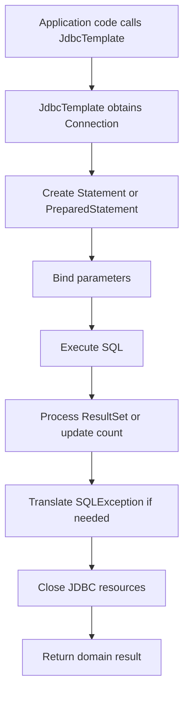
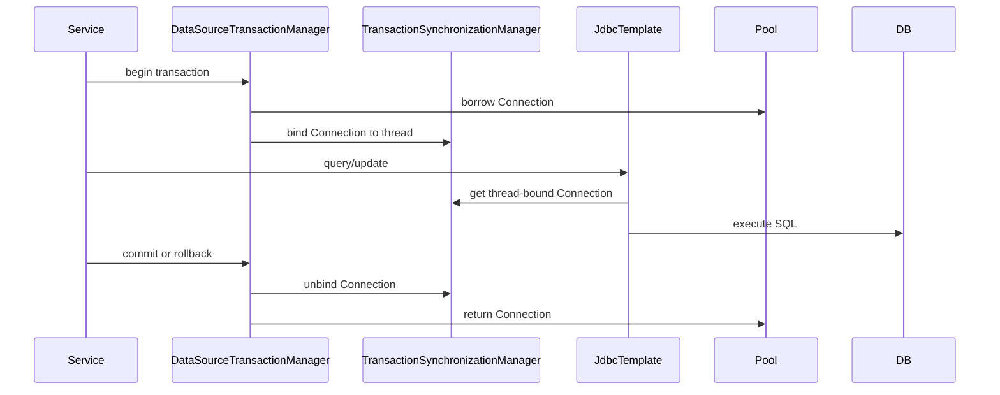

------
title: Learn Java SQL, JDBC, Transactions, Connection Management & HikariCP - Part 023
description: JdbcTemplate dan NamedParameterJdbcTemplate sebagai layer JDBC yang lebih aman: resource cleanup, exception translation, RowMapper, ResultSetExtractor, batch, generated keys, transaction participation, dan boundaries.
series: learn-java-sql-jdbc
seriesTitle: Learn Java SQL, JDBC, Transactions, Connection Management & HikariCP
order: 23
partTitle: JdbcTemplate and NamedParameterJdbcTemplate as Safer JDBC Layers
tags:
- java
- jdbc
- sql
- spring
- jdbctemplate
- transactions
- datasource
- architecture
- series
date: 2026-06-27
---

# Part 023 — JdbcTemplate and NamedParameterJdbcTemplate as Safer JDBC Layers

> Target skill: mampu memakai Spring `JdbcTemplate` dan `NamedParameterJdbcTemplate` sebagai layer JDBC yang mengurangi boilerplate tanpa kehilangan kontrol atas SQL, transaction boundary, type mapping, performance, dan error semantics.

`JdbcTemplate` bukan ORM.

Ia tidak membuat aggregate model otomatis, tidak menyembunyikan SQL, tidak menyelesaikan transaction design, dan tidak mengubah database menjadi object graph.

`JdbcTemplate` adalah **workflow executor** untuk JDBC:

- obtain connection;
- create statement/prepared statement;
- bind parameters;
- execute SQL;
- iterate `ResultSet`;
- map rows/results;
- translate `SQLException`;
- close resources.

Ia menyelesaikan bagian JDBC yang repetitif dan rawan bocor, tetapi tetap membiarkan engineer mengontrol SQL dan boundary arsitektural.

Spring documentation menyebut `JdbcTemplate` sebagai central class di JDBC core package. Ia menangani creation dan release resource agar aplikasi tidak mudah lupa menutup connection, statement, atau result set. Itu poin utamanya.

---

## 1. Why JdbcTemplate Exists

Raw JDBC memberi kontrol penuh, tetapi banyak boilerplate:

```java
public Account findById(long accountId) throws SQLException {
    String sql = """
        select id, owner_name, balance, version
        from account
        where id = ?
        """;

    try (Connection c = dataSource.getConnection();
         PreparedStatement ps = c.prepareStatement(sql)) {

        ps.setLong(1, accountId);

        try (ResultSet rs = ps.executeQuery()) {
            if (!rs.next()) {
                throw new NotFoundException("account not found: " + accountId);
            }

            return new Account(
                rs.getLong("id"),
                rs.getString("owner_name"),
                rs.getBigDecimal("balance"),
                rs.getLong("version")
            );
        }
    }
}
```

Ini benar, tetapi ada banyak tempat error:

- lupa close `ResultSet`;
- lupa close `PreparedStatement`;
- lupa close `Connection`;
- salah translate `SQLException`;
- mapping tersebar;
- binding berulang;
- transaction participation sulit jika setiap method mengambil connection sendiri;
- exception checked `SQLException` bocor ke domain/application layer.

Dengan `JdbcTemplate`:

```java
public Account findById(long accountId) {
    String sql = """
        select id, owner_name, balance, version
        from account
        where id = ?
        """;

    return jdbcTemplate.queryForObject(sql, accountRowMapper, accountId);
}
```

Yang berubah bukan SQL semantics. Yang berubah adalah **resource workflow**.

---

## 2. Mental Model: Template Method for JDBC Workflow

`JdbcTemplate` menerapkan pola template method:



Application code hanya menyediakan bagian yang variatif:

- SQL string;
- parameters;
- `RowMapper`;
- `ResultSetExtractor`;
- `PreparedStatementSetter`;
- `KeyHolder`;
- callback custom jika perlu.

Resource management menjadi responsibility template.

---

## 3. What JdbcTemplate Does Not Do

Ini penting untuk mencegah overtrust.

`JdbcTemplate` **tidak** otomatis:

- memilih isolation level yang benar;
- mendesain transaction boundary;
- mencegah lost update;
- membuat query optimal;
- menambah index;
- memilih timeout end-to-end;
- menjamin retry aman;
- menghindari N+1 query;
- mengubah bad schema menjadi good schema;
- menggantikan observability database.

Dengan kata lain:

> `JdbcTemplate` removes accidental JDBC complexity, not essential data consistency complexity.

---

## 4. Basic Setup

Minimal setup:

```java
@Configuration
class JdbcConfig {

    @Bean
    JdbcTemplate jdbcTemplate(DataSource dataSource) {
        JdbcTemplate jdbcTemplate = new JdbcTemplate(dataSource);
        jdbcTemplate.setQueryTimeout(3); // seconds; still align with global deadline
        return jdbcTemplate;
    }

    @Bean
    NamedParameterJdbcTemplate namedParameterJdbcTemplate(JdbcTemplate jdbcTemplate) {
        return new NamedParameterJdbcTemplate(jdbcTemplate);
    }
}
```

Dalam Spring Boot, bean ini biasanya tersedia otomatis jika `DataSource` tersedia. Tetapi senior engineer tetap perlu tahu bahwa di bawahnya semua kembali ke `DataSource`.

---

## 5. Repository Boundary with JdbcTemplate

Contoh boundary yang sehat:

```java
@Repository
public class AccountJdbcRepository {

    private final JdbcTemplate jdbcTemplate;

    public AccountJdbcRepository(JdbcTemplate jdbcTemplate) {
        this.jdbcTemplate = jdbcTemplate;
    }

    public Account findById(AccountId accountId) {
        String sql = """
            select id, owner_name, balance, status, version
            from account
            where id = ?
            """;

        return jdbcTemplate.queryForObject(
            sql,
            accountRowMapper(),
            accountId.value()
        );
    }

    private static RowMapper<Account> accountRowMapper() {
        return (rs, rowNum) -> new Account(
            new AccountId(rs.getLong("id")),
            rs.getString("owner_name"),
            rs.getBigDecimal("balance"),
            AccountStatus.valueOf(rs.getString("status")),
            rs.getLong("version")
        );
    }
}
```

Repository tetap berisi SQL. Application service tetap mengatur use case.

```java
@Service
public class TransferService {

    private final AccountJdbcRepository accounts;

    @Transactional
    public void transfer(AccountId from, AccountId to, BigDecimal amount) {
        Account source = accounts.findByIdForUpdate(from);
        Account target = accounts.findByIdForUpdate(to);

        source.debit(amount);
        target.credit(amount);

        accounts.save(source);
        accounts.save(target);
    }
}
```

Transaction boundary tetap di application service, bukan tersembunyi di repository.

---

## 6. Transaction Participation

`JdbcTemplate` secara normal mengambil connection melalui Spring infrastructure. Jika ada Spring transaction aktif, `JdbcTemplate` ikut memakai connection yang sudah di-bind ke thread.



Implikasi:

- repository tidak perlu menerima `Connection` sebagai parameter jika memakai Spring transaction;
- semua repository call dalam satu thread dan transaction akan memakai connection yang sama;
- async boundary memutus thread-bound context;
- self-invocation dapat membuat `@Transactional` tidak aktif;
- `JdbcTemplate` tidak menggantikan transaction manager.

---

## 7. RowMapper: Row-Level Mapping

`RowMapper<T>` cocok ketika satu row menjadi satu object.

```java
private static final RowMapper<CustomerSummary> CUSTOMER_SUMMARY_MAPPER = (rs, rowNum) ->
    new CustomerSummary(
        rs.getLong("id"),
        rs.getString("name"),
        rs.getString("segment"),
        rs.getObject("last_order_at", OffsetDateTime.class)
    );
```

Penggunaan:

```java
public List<CustomerSummary> findActiveCustomers() {
    String sql = """
        select id, name, segment, last_order_at
        from customer
        where status = 'ACTIVE'
        order by last_order_at desc
        limit 100
        """;

    return jdbcTemplate.query(sql, CUSTOMER_SUMMARY_MAPPER);
}
```

Rules:

- mapper harus pure;
- mapper tidak melakukan query lain;
- mapper tidak memanggil service;
- mapper tidak punya side effect;
- mapper tidak menyembunyikan default business value tanpa alasan;
- mapper sebaiknya eksplisit terhadap kolom yang dibutuhkan.

Anti-pattern:

```java
RowMapper<Order> badMapper = (rs, rowNum) -> {
    Order order = new Order(rs.getLong("id"));
    order.setCustomer(customerRepository.findById(rs.getLong("customer_id"))); // N+1 query
    return order;
};
```

Mapper seperti ini membuat query cardinality tidak terlihat.

---

## 8. ResultSetExtractor: Whole-Result Mapping

`ResultSetExtractor<T>` cocok ketika mapping membutuhkan seluruh result set, misalnya join one-to-many.

```java
public OrderDetails findOrderDetails(long orderId) {
    String sql = """
        select
            o.id as order_id,
            o.order_no,
            o.status,
            i.id as item_id,
            i.sku,
            i.quantity
        from orders o
        left join order_item i on i.order_id = o.id
        where o.id = ?
        order by i.id
        """;

    return jdbcTemplate.query(sql, rs -> {
        OrderDetails order = null;
        List<OrderItem> items = new ArrayList<>();

        while (rs.next()) {
            if (order == null) {
                order = new OrderDetails(
                    rs.getLong("order_id"),
                    rs.getString("order_no"),
                    OrderStatus.valueOf(rs.getString("status")),
                    items
                );
            }

            long itemId = rs.getLong("item_id");
            if (!rs.wasNull()) {
                items.add(new OrderItem(
                    itemId,
                    rs.getString("sku"),
                    rs.getInt("quantity")
                ));
            }
        }

        if (order == null) {
            throw new NotFoundException("order not found: " + orderId);
        }

        return order;
    }, orderId);
}
```

Gunakan `ResultSetExtractor` saat mapping adalah **result-level**, bukan row-level.

---

## 9. RowCallbackHandler: Streaming Side Effects Carefully

`RowCallbackHandler` memproses row satu per satu tanpa mengembalikan list.

```java
public void exportActiveCustomers(Writer writer) {
    String sql = """
        select id, name, email
        from customer
        where status = 'ACTIVE'
        order by id
        """;

    jdbcTemplate.query(sql, rs -> {
        writer.write(rs.getLong("id") + "," + rs.getString("email") + "\n");
    });
}
```

Namun hati-hati:

- query masih berjalan selama callback berjalan;
- connection tetap dipinjam;
- transaction bisa panjang;
- output IO lambat dapat menahan connection;
- error di tengah export harus punya recovery strategy.

Untuk export besar, pertimbangkan:

- pagination/keyset pagination;
- dedicated read pool;
- statement fetch size;
- read-only transaction;
- streaming response timeout;
- backpressure.

---

## 10. Query Methods: Know the Shape

Pilih method berdasarkan cardinality dan shape.

| Expected Result | Method | Notes |
|---|---|---|
| 0..N rows | `query(sql, rowMapper, args...)` | Return `List<T>` |
| exactly 1 row | `queryForObject(...)` | Throws if zero or many |
| 0..1 row | `query(...)` then handle list | Avoid exception-as-control-flow if absence is normal |
| scalar | `queryForObject(sql, Type.class, args...)` | Count, sum, status |
| update count | `update(...)` | Check returned count |
| complex result | `query(sql, ResultSetExtractor, args...)` | One-to-many mapping |
| custom statement | `execute(...)` | Rare, but useful |

Example optional lookup:

```java
public Optional<Account> findOptionalById(long id) {
    String sql = """
        select id, owner_name, balance, version
        from account
        where id = ?
        """;

    List<Account> result = jdbcTemplate.query(sql, accountRowMapper(), id);
    return result.stream().findFirst();
}
```

Do not use `queryForObject` when absence is a valid business outcome unless exception mapping is intentional.

---

## 11. Update Count as Correctness Signal

`update()` returns affected row count.

That count is not cosmetic. It is often a concurrency invariant.

```java
public void updateWithOptimisticLock(Account account) {
    String sql = """
        update account
        set balance = ?, version = version + 1
        where id = ? and version = ?
        """;

    int updated = jdbcTemplate.update(
        sql,
        account.balance(),
        account.id().value(),
        account.version()
    );

    if (updated != 1) {
        throw new OptimisticLockFailureException("account changed concurrently: " + account.id());
    }
}
```

Rules:

- `insert` expected count often `1`;
- `update by primary key` expected count often `1`;
- `delete by primary key` may be `0` or `1` depending idempotency semantics;
- `bulk update` should validate expected bounds;
- optimistic locking requires checking count.

Anti-pattern:

```java
jdbcTemplate.update(sql, args); // count ignored despite being invariant
```

---

## 12. Generated Keys

For insert with generated key:

```java
public long insert(CustomerDraft draft) {
    String sql = """
        insert into customer(name, email, status)
        values (?, ?, ?)
        """;

    KeyHolder keyHolder = new GeneratedKeyHolder();

    jdbcTemplate.update(connection -> {
        PreparedStatement ps = connection.prepareStatement(sql, Statement.RETURN_GENERATED_KEYS);
        ps.setString(1, draft.name());
        ps.setString(2, draft.email());
        ps.setString(3, "ACTIVE");
        return ps;
    }, keyHolder);

    Number key = keyHolder.getKey();
    if (key == null) {
        throw new IllegalStateException("database did not return generated key");
    }

    return key.longValue();
}
```

Production notes:

- generated key behavior is driver/database specific;
- multi-row insert generated keys need extra care;
- prefer application-generated IDs when idempotency/distributed workflow needs stable identity before insert;
- generated keys are not a replacement for unique business constraints.

---

## 13. NamedParameterJdbcTemplate

Positional parameters become hard to maintain for large queries.

```java
String sql = """
    select id, case_no, status, assigned_team
    from enforcement_case
    where status = :status
      and priority >= :minPriority
      and created_at >= :createdFrom
    order by created_at desc
    limit :limit
    """;

MapSqlParameterSource params = new MapSqlParameterSource()
    .addValue("status", "OPEN")
    .addValue("minPriority", 3)
    .addValue("createdFrom", OffsetDateTime.now().minusDays(7))
    .addValue("limit", 100);

List<CaseSummary> cases = namedJdbcTemplate.query(sql, params, caseSummaryMapper());
```

Benefits:

- parameter readability;
- safer refactoring;
- easier optional filters;
- cleaner SQL review;
- built-in expansion for collection parameters in many common cases.

---

## 14. Handling `IN (...)` Parameters

With `NamedParameterJdbcTemplate`:

```java
public List<Account> findByIds(Collection<Long> ids) {
    if (ids.isEmpty()) {
        return List.of();
    }

    String sql = """
        select id, owner_name, balance, version
        from account
        where id in (:ids)
        """;

    return namedJdbcTemplate.query(
        sql,
        Map.of("ids", ids),
        accountRowMapper()
    );
}
```

Important edge cases:

- empty list must be handled before SQL;
- huge list can exceed driver/database parameter limits;
- order of returned rows is not guaranteed unless `order by` exists;
- large list may perform worse than temp table, staging table, or join.

For large `IN` workloads, consider:

- chunking;
- temp table;
- table-valued parameter where available;
- bulk load to staging table;
- join with derived table;
- changing access pattern.

---

## 15. BeanPropertyRowMapper: Convenient but Dangerous as Default

Spring provides reflection-based mappers such as `BeanPropertyRowMapper`.

They are useful for prototypes and simple DTOs:

```java
List<CustomerDto> customers = jdbcTemplate.query(
    "select id, name, email from customer",
    new BeanPropertyRowMapper<>(CustomerDto.class)
);
```

But for critical systems, explicit mappers are usually better.

Risks:

- silent mapping mismatch;
- weaker compile-time signal;
- reflection overhead;
- accidental coupling to property names;
- unclear null handling;
- domain invariant bypass.

Use explicit mapping when:

- field semantics matter;
- null is meaningful;
- enum conversion matters;
- money/time/status are involved;
- security/audit data is involved;
- code review needs exact mapping visibility.

---

## 16. Exception Translation

Raw JDBC throws checked `SQLException`. Spring translates it into `DataAccessException` hierarchy.

Example:

```java
try {
    jdbcTemplate.update(sql, args);
} catch (DuplicateKeyException e) {
    throw new EmailAlreadyRegisteredException(email, e);
} catch (DataAccessResourceFailureException e) {
    throw new DatabaseUnavailableException(e);
}
```

This helps because application code can handle semantic failures without depending directly on vendor-specific `SQLException` everywhere.

But do not oversimplify:

- exception translation is only as good as SQLState/vendor metadata;
- retry still requires idempotency;
- some errors need inspecting root cause;
- application-specific translation still belongs near boundary.

Bad pattern:

```java
catch (DataAccessException e) {
    throw new RuntimeException("database error");
}
```

This destroys diagnostic information.

---

## 17. Custom Exception Translation Boundary

A good repository translates database failures into application-relevant failures where appropriate.

```java
public void insertUser(UserDraft draft) {
    try {
        jdbcTemplate.update("""
            insert into app_user(email, display_name)
            values (?, ?)
            """, draft.email(), draft.displayName());
    } catch (DuplicateKeyException e) {
        throw new UserEmailAlreadyExists(draft.email(), e);
    }
}
```

Do not translate everything.

Translate when:

- the database failure corresponds to domain/application concept;
- callers can make a different decision;
- error response should be stable;
- retry policy depends on classification.

Keep original cause.

---

## 18. Batch Operations

Simple batch:

```java
public int[] insertEvents(List<AuditEvent> events) {
    String sql = """
        insert into audit_event(event_id, actor_id, action, occurred_at)
        values (?, ?, ?, ?)
        """;

    return jdbcTemplate.batchUpdate(sql, new BatchPreparedStatementSetter() {
        @Override
        public void setValues(PreparedStatement ps, int i) throws SQLException {
            AuditEvent event = events.get(i);
            ps.setObject(1, event.id());
            ps.setLong(2, event.actorId());
            ps.setString(3, event.action());
            ps.setObject(4, event.occurredAt());
        }

        @Override
        public int getBatchSize() {
            return events.size();
        }
    });
}
```

Batch rules:

- do not batch unbounded lists;
- choose batch size based on latency, memory, lock duration, and driver behavior;
- commit in chunks for large jobs;
- know whether partial failure returns update counts;
- avoid mixing business transaction and massive batch transaction unless required.

---

## 19. PreparedStatementCreator and PreparedStatementSetter

Use lower-level callbacks when you need control over statement creation.

Example: set fetch size and query timeout:

```java
public void streamCases(RowCallbackHandler handler) {
    String sql = """
        select id, case_no, status
        from enforcement_case
        where status = 'OPEN'
        order by id
        """;

    jdbcTemplate.query(connection -> {
        PreparedStatement ps = connection.prepareStatement(
            sql,
            ResultSet.TYPE_FORWARD_ONLY,
            ResultSet.CONCUR_READ_ONLY
        );
        ps.setFetchSize(500);
        ps.setQueryTimeout(10);
        return ps;
    }, handler);
}
```

This preserves `JdbcTemplate` cleanup while allowing statement-level tuning.

---

## 20. Query Timeout with JdbcTemplate

`JdbcTemplate#setQueryTimeout` sets default query timeout for statements created by the template.

```java
JdbcTemplate template = new JdbcTemplate(dataSource);
template.setQueryTimeout(3);
```

Still, timeout design must align with:

- HTTP/gRPC deadline;
- thread pool queue timeout;
- Hikari `connectionTimeout`;
- DB lock timeout;
- statement timeout;
- transaction timeout;
- retry policy.

A query timeout longer than caller timeout is often useless because the caller has already gone away.

---

## 21. Fetch Size and Streaming

For large reads:

```java
jdbcTemplate.query(connection -> {
    PreparedStatement ps = connection.prepareStatement("""
        select id, payload
        from event_log
        where created_at >= ?
        order by id
        """);
    ps.setObject(1, from);
    ps.setFetchSize(1_000);
    return ps;
}, rs -> {
    process(rs.getLong("id"), rs.getString("payload"));
});
```

Caveats:

- fetch size behavior is driver-specific;
- transaction may need to remain open;
- connection remains borrowed;
- processing callback duration matters;
- slow downstream processing causes database/session pressure.

Do not confuse streaming with free memory. It shifts pressure from heap to connection/session duration.

---

## 22. Dynamic SQL with Named Parameters

Dynamic filters can be safe if values are still bound.

```java
public List<CaseSummary> search(CaseSearchCriteria criteria) {
    StringBuilder sql = new StringBuilder("""
        select id, case_no, status, priority, created_at
        from enforcement_case
        where 1 = 1
        """);

    MapSqlParameterSource params = new MapSqlParameterSource();

    if (criteria.status() != null) {
        sql.append(" and status = :status");
        params.addValue("status", criteria.status().name());
    }

    if (criteria.minPriority() != null) {
        sql.append(" and priority >= :minPriority");
        params.addValue("minPriority", criteria.minPriority());
    }

    sql.append(" order by created_at desc limit :limit");
    params.addValue("limit", criteria.limit());

    return namedJdbcTemplate.query(sql.toString(), params, caseSummaryMapper());
}
```

This is acceptable when:

- structure is controlled by code;
- values are parameters;
- identifiers are allowlisted;
- generated SQL can be logged/debugged safely;
- test coverage includes query variants.

Unsafe:

```java
sql.append(" order by " + request.sortBy());
```

Safe identifier allowlist:

```java
enum CaseSort {
    CREATED_AT("created_at"),
    PRIORITY("priority"),
    CASE_NO("case_no");

    private final String column;

    CaseSort(String column) {
        this.column = column;
    }

    public String column() {
        return column;
    }
}
```

---

## 23. JdbcTemplate vs ORM vs jOOQ vs Raw JDBC

| Tool | Strength | Weakness |
|---|---|---|
| Raw JDBC | Maximum control, no framework dependency | Boilerplate, resource/error risk |
| JdbcTemplate | SQL control with safer workflow | Manual mapping, no SQL DSL |
| NamedParameterJdbcTemplate | Better readability for parameters | Still string SQL |
| jOOQ | Type-safe SQL DSL, strong for complex SQL | Dependency/licensing/design trade-offs |
| JPA/Hibernate | Object graph/persistence context | Hidden queries, flush semantics, N+1 risk |
| MyBatis | SQL control with mapper abstraction | XML/mapper discipline needed |

For regulatory/enforcement systems, `JdbcTemplate` is often excellent for:

- explicit SQL;
- predictable transaction behavior;
- audit queries;
- reports;
- state-machine persistence;
- idempotent command tables;
- outbox writes;
- operational playbooks.

---

## 24. Pattern: Command Repository with Optimistic Locking

```java
@Repository
public class CaseCommandRepository {

    private final JdbcTemplate jdbcTemplate;

    public CaseCommandRepository(JdbcTemplate jdbcTemplate) {
        this.jdbcTemplate = jdbcTemplate;
    }

    public EnforcementCase loadForCommand(CaseId caseId) {
        return jdbcTemplate.queryForObject("""
            select id, case_no, state, assigned_team, version
            from enforcement_case
            where id = ?
            """, caseMapper(), caseId.value());
    }

    public void save(EnforcementCase c) {
        int updated = jdbcTemplate.update("""
            update enforcement_case
            set state = ?, assigned_team = ?, version = version + 1
            where id = ? and version = ?
            """,
            c.state().name(),
            c.assignedTeam(),
            c.id().value(),
            c.version()
        );

        if (updated != 1) {
            throw new OptimisticLockFailureException("case modified concurrently: " + c.id());
        }
    }
}
```

This pattern keeps:

- SQL explicit;
- concurrency invariant visible;
- domain state transition outside mapper;
- transaction boundary at service layer.

---

## 25. Pattern: Idempotency Record with Unique Constraint

```java
@Transactional
public CommandResult handle(Command command) {
    boolean inserted = idempotencyRepository.tryInsert(command.idempotencyKey());
    if (!inserted) {
        return idempotencyRepository.findResult(command.idempotencyKey());
    }

    CommandResult result = performBusinessChange(command);
    idempotencyRepository.storeResult(command.idempotencyKey(), result);
    outboxRepository.enqueue(result.toEvent());
    return result;
}
```

Repository:

```java
public boolean tryInsert(String key) {
    try {
        int updated = jdbcTemplate.update("""
            insert into idempotency_key(idempotency_key, status, created_at)
            values (?, 'PROCESSING', current_timestamp)
            """, key);
        return updated == 1;
    } catch (DuplicateKeyException e) {
        return false;
    }
}
```

Here database constraint is intentionally part of correctness.

---

## 26. Pattern: Outbox Write with Same Transaction

```java
@Transactional
public void approveCase(CaseId caseId, UserId actor) {
    EnforcementCase c = cases.loadForCommand(caseId);
    c.approve(actor);
    cases.save(c);

    outbox.insert(new OutboxMessage(
        UUID.randomUUID(),
        "CASE_APPROVED",
        c.id().value(),
        serializeCaseApproved(c, actor)
    ));
}
```

Outbox repository:

```java
public void insert(OutboxMessage message) {
    int inserted = jdbcTemplate.update("""
        insert into outbox_message(id, aggregate_type, aggregate_id, event_type, payload, created_at)
        values (?, ?, ?, ?, ?, current_timestamp)
        """,
        message.id(),
        "ENFORCEMENT_CASE",
        message.aggregateId(),
        message.eventType(),
        message.payload()
    );

    if (inserted != 1) {
        throw new IllegalStateException("failed to insert outbox message: " + message.id());
    }
}
```

`JdbcTemplate` keeps SQL explicit and participates in the same transaction.

---

## 27. Pattern: Read Model Query Repository

Not every repository must hydrate domain aggregate.

```java
public List<CaseInboxRow> findInboxRows(String team, int limit) {
    return jdbcTemplate.query("""
        select
            c.id,
            c.case_no,
            c.state,
            c.priority,
            c.created_at,
            count(t.id) as open_task_count
        from enforcement_case c
        left join task t on t.case_id = c.id and t.status = 'OPEN'
        where c.assigned_team = ?
          and c.state in ('OPEN', 'UNDER_REVIEW')
        group by c.id, c.case_no, c.state, c.priority, c.created_at
        order by c.priority desc, c.created_at asc
        limit ?
        """,
        (rs, rowNum) -> new CaseInboxRow(
            rs.getLong("id"),
            rs.getString("case_no"),
            rs.getString("state"),
            rs.getInt("priority"),
            rs.getObject("created_at", OffsetDateTime.class),
            rs.getInt("open_task_count")
        ),
        team,
        limit
    );
}
```

This is often better than loading many aggregates and computing inbox view in memory.

---

## 28. Anti-Pattern Catalog

### 28.1 JdbcTemplate Everywhere Without Boundaries

Bad:

```java
@RestController
class CaseController {
    private final JdbcTemplate jdbcTemplate;

    @PostMapping("/cases/{id}/approve")
    void approve(@PathVariable long id) {
        jdbcTemplate.update("update enforcement_case set state = 'APPROVED' where id = ?", id);
    }
}
```

Why bad:

- SQL leaks into HTTP layer;
- no transaction policy;
- no domain invariant;
- no audit/outbox consistency;
- weak testability.

### 28.2 Hidden Transaction Inside Repository

Bad:

```java
public void save(Account account) {
    transactionTemplate.executeWithoutResult(status -> {
        jdbcTemplate.update(...);
    });
}
```

Repository should usually participate in transaction, not own use-case transaction.

### 28.3 Query in RowMapper

Creates hidden N+1.

### 28.4 Ignoring Update Count

Destroys optimistic locking and state transition correctness.

### 28.5 Treating DuplicateKeyException as Always Harmless

Duplicate key may mean idempotent duplicate, user conflict, data corruption, or race. Interpret it in context.

### 28.6 Huge `IN` Query

Can exceed database/driver parameter limits and produce poor plans.

### 28.7 Long Streaming Under Business Transaction

Exporting millions of rows inside business transaction can hold connection and database resources too long.

---

## 29. Testing JdbcTemplate Repositories

Unit test mapping logic separately when useful:

```java
@Test
void mapsAccountRow() throws Exception {
    ResultSet rs = mock(ResultSet.class);
    when(rs.getLong("id")).thenReturn(10L);
    when(rs.getString("owner_name")).thenReturn("Ari");
    when(rs.getBigDecimal("balance")).thenReturn(new BigDecimal("100.00"));
    when(rs.getLong("version")).thenReturn(3L);

    Account account = accountRowMapper().mapRow(rs, 0);

    assertThat(account.id().value()).isEqualTo(10L);
}
```

But SQL behavior needs integration tests with the real database engine.

Test:

- constraint violations;
- generated key behavior;
- optimistic lock count;
- null mapping;
- time/timestamp mapping;
- enum mapping;
- batch behavior;
- transaction participation;
- lock behavior if relevant.

For serious systems, do not rely only on H2 when production is PostgreSQL/MySQL/Oracle/SQL Server.

---

## 30. Observability with JdbcTemplate

At minimum, expose:

- query latency by operation name;
- row count/result size where safe;
- update count;
- exception class and SQLState class;
- pool acquisition latency;
- transaction duration;
- slow query log correlation;
- request/correlation ID;
- redacted SQL statement name.

Avoid logging:

- raw PII;
- full SQL with secrets;
- large payloads;
- unbounded parameter arrays.

Prefer operation names:

```txt
repository=CaseCommandRepository
operation=save
sqlName=case.update_state_optimistic
result.updatedRows=1
```

---

## 31. Code Review Checklist

For every `JdbcTemplate` repository:

- Is transaction boundary outside repository unless intentionally local?
- Is SQL explicit and readable?
- Are values bound, not concatenated?
- Are dynamic identifiers allowlisted?
- Is cardinality handled correctly?
- Is update count checked when it is an invariant?
- Is mapper pure?
- Does mapper avoid hidden queries?
- Are nulls handled intentionally?
- Are money/time types mapped safely?
- Are expected constraint violations translated meaningfully?
- Are query limits/pagination present for list methods?
- Is batch size bounded?
- Is timeout policy aligned with caller deadline?
- Are integration tests using production-like database semantics?

---

## 32. Deliberate Practice

### Exercise 1 — Refactor Raw JDBC to JdbcTemplate

Take a DAO that manually handles `Connection`, `PreparedStatement`, and `ResultSet`. Refactor to `JdbcTemplate` while preserving:

- SQL;
- transaction semantics;
- update count checks;
- exception meaning;
- generated key behavior;
- tests.

### Exercise 2 — Fix Hidden N+1 Mapper

Given a mapper that calls another repository per row, replace it with:

- join + `ResultSetExtractor`; or
- two-query batch load; or
- explicit query service.

### Exercise 3 — Build Idempotent Insert

Implement command table insert with unique idempotency key and translate duplicate key into previously processed response.

### Exercise 4 — Add Observability

Instrument repository methods with operation-level metrics without logging sensitive SQL parameters.

---

## 33. Summary

`JdbcTemplate` is best understood as **safe JDBC workflow orchestration**.

It helps with:

- resource cleanup;
- statement creation;
- parameter binding;
- result mapping;
- exception translation;
- transaction participation;
- reduced boilerplate.

It does not solve:

- transaction boundary design;
- concurrency correctness;
- schema design;
- query performance;
- retry safety;
- observability strategy.

The top-tier engineer uses `JdbcTemplate` not as a shortcut to avoid understanding JDBC, but as a disciplined layer after understanding JDBC deeply.

---

## References

- Spring Framework Reference — JDBC Core: https://docs.spring.io/spring-framework/reference/data-access/jdbc/core.html
- Spring Framework Javadoc — `JdbcTemplate`: https://docs.spring.io/spring-framework/docs/current/javadoc-api/org/springframework/jdbc/core/JdbcTemplate.html
- Spring Framework Javadoc — `NamedParameterJdbcTemplate`: https://docs.spring.io/spring-framework/docs/current/javadoc-api/org/springframework/jdbc/core/namedparam/NamedParameterJdbcTemplate.html
- Java SE 25 Javadoc — `DataSource`: https://docs.oracle.com/en/java/javase/25/docs/api/java.sql/javax/sql/DataSource.html
- Java SE 25 Javadoc — `PreparedStatement`: https://docs.oracle.com/en/java/javase/25/docs/api/java.sql/java/sql/PreparedStatement.html
- Java SE 25 Javadoc — `ResultSet`: https://docs.oracle.com/en/java/javase/25/docs/api/java.sql/java/sql/ResultSet.html
