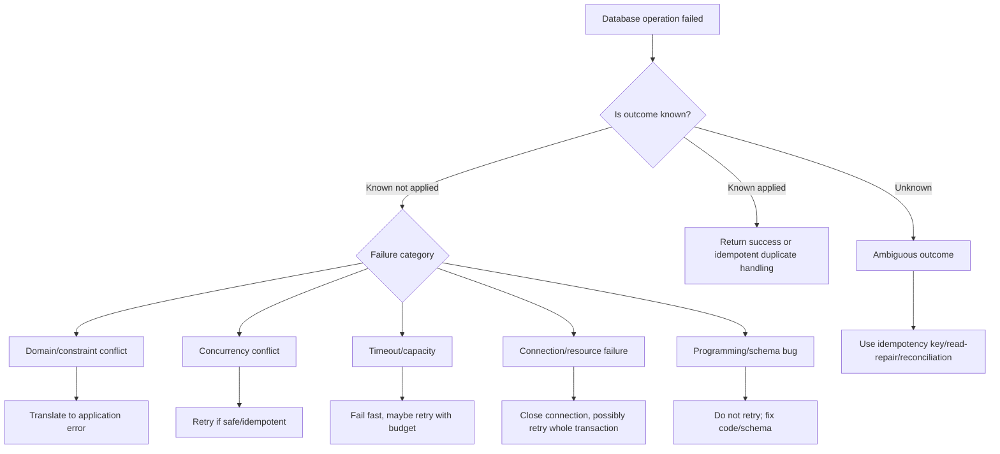
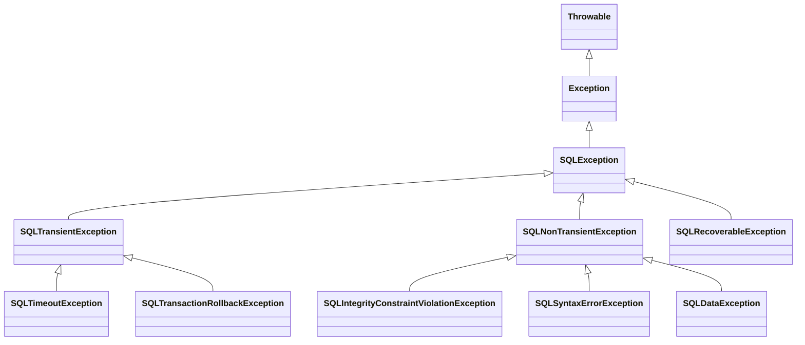
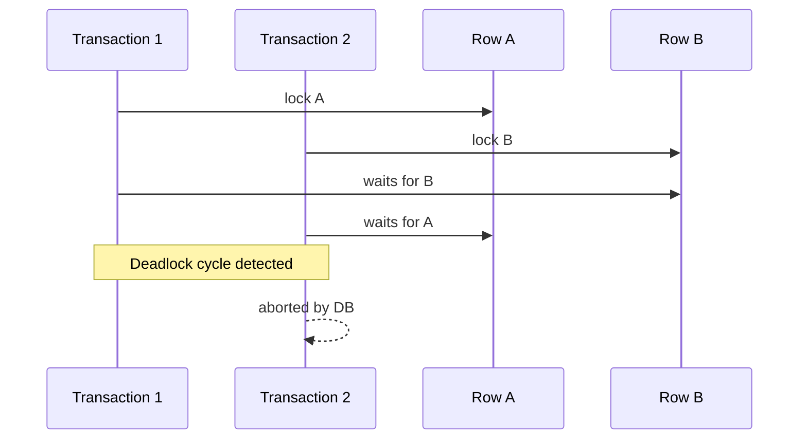
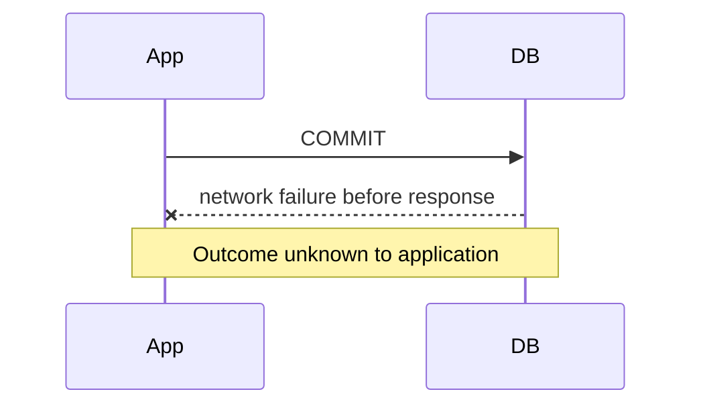

------
title: Learn Java SQL, JDBC, Transactions, Connection Management & HikariCP - Part 024
description: Error handling JDBC production-grade: SQLException, SQLState, vendor codes, Spring DataAccessException, retryability, duplicate key, deadlock, timeout, connection failure, and failure classification.
series: learn-java-sql-jdbc
seriesTitle: Learn Java SQL, JDBC, Transactions, Connection Management & HikariCP
order: 24
partTitle: Error Handling: SQLException, SQLState, Vendor Codes, Retryability
tags:
- java
- jdbc
- sql
- spring
- exceptions
- retry
- transactions
- reliability
- series
date: 2026-06-27
---

# Part 024 — Error Handling: SQLException, SQLState, Vendor Codes, Retryability

> Target skill: mampu mengklasifikasi database failure secara benar: mana yang domain conflict, mana yang transient, mana yang recoverable with new connection, mana yang non-retryable, mana yang ambiguous commit, dan mana yang harus menjadi incident signal.

Database error handling sering salah karena engineer memperlakukan semua error database sebagai satu jenis:

```java
catch (SQLException e) {
    throw new RuntimeException(e);
}
```

Atau lebih buruk:

```java
catch (Exception e) {
    retry();
}
```

Dalam production system, error database punya arti berbeda:

- duplicate key bisa berarti idempotent replay, user conflict, atau bug;
- deadlock bisa retryable, tetapi hanya jika transaction idempotent;
- lock timeout bisa retryable atau signal desain locking buruk;
- statement timeout bisa berarti query lambat, missing index, overload, atau lock wait;
- connection timeout dari pool bisa berarti leak, slow DB, pool terlalu kecil, atau traffic spike;
- network failure saat commit bisa menciptakan ambiguous outcome;
- serialization failure biasanya didesain untuk retry;
- syntax error bukan retryable;
- data truncation bukan retryable tanpa perubahan input/schema;
- `SQLRecoverableException` membutuhkan recovery seperti menutup connection dan mengambil connection baru.

Part ini membangun taxonomy agar error handling tidak sekadar “try/catch”, tapi bagian dari reliability design.

---

## 1. Mental Model: Database Failure Is a Classification Problem

Saat operasi database gagal, pertanyaan pertama bukan “retry atau tidak?”

Pertanyaan yang benar:

1. Apakah statement sampai ke database?
2. Apakah transaction masih valid?
3. Apakah commit mungkin sudah terjadi?
4. Apakah failure berasal dari input, constraint, concurrency, capacity, network, atau bug?
5. Apakah operasi aman diulang?
6. Apakah caller membutuhkan respons domain atau respons technical failure?
7. Apakah connection harus dibuang?
8. Apakah ini individual failure atau incident/systemic failure?



---

## 2. `SQLException` Anatomy

`SQLException` carries several signals:

- message/reason;
- SQLState;
- vendor-specific error code;
- cause;
- chained exceptions via `getNextException()`;
- subclass type.

Example inspection:

```java
static void logSqlException(SQLException e) {
    SQLException current = e;
    while (current != null) {
        log.warn(
            "SQL failure: class={}, sqlState={}, vendorCode={}, message={}",
            current.getClass().getName(),
            current.getSQLState(),
            current.getErrorCode(),
            current.getMessage()
        );
        current = current.getNextException();
    }
}
```

Do not rely only on the message string. Message strings are not stable contracts.

Use, in order:

1. exception subclass;
2. SQLState class;
3. vendor error code;
4. operation context;
5. transaction state;
6. idempotency model.

---

## 3. JDBC Exception Hierarchy

Simplified hierarchy:



Important intent:

- `SQLTransientException`: operation may succeed if retried without application-level intervention.
- `SQLNonTransientException`: retrying same operation likely fails unless cause is corrected.
- `SQLRecoverableException`: operation may succeed if application performs recovery steps, at minimum closing current connection and getting a new one.

But do not treat the hierarchy as perfect. Drivers differ. Some drivers throw generic `SQLException` with SQLState/vendor code.

---

## 4. SQLState: Portable-ish Signal

SQLState is a five-character code. The first two characters are the class.

Common classes:

| SQLState Class | General Meaning |
|---|---|
| `23` | Integrity constraint violation |
| `40` | Transaction rollback |
| `42` | Syntax error or access rule violation |
| `08` | Connection exception |
| `22` | Data exception |
| `28` | Invalid authorization |
| `53` | Insufficient resources, common in PostgreSQL |
| `55` | Object not in prerequisite state, common in PostgreSQL |
| `57` | Operator intervention, common in PostgreSQL |
| `58` | System error, common in PostgreSQL |

SQLState is useful, but not enough.

Example:

- `23505` in PostgreSQL means unique violation;
- `40001` often means serialization failure;
- `40P01` in PostgreSQL means deadlock detected;
- MySQL often exposes vendor error codes such as `1062` duplicate entry or `1213` deadlock.

A production classifier often combines SQLState and vendor code.

---

## 5. Vendor Codes Matter

Vendor error codes are not portable, but they are operationally important.

Example classifier skeleton:

```java
public enum DbFailureKind {
    DUPLICATE_KEY,
    FOREIGN_KEY_VIOLATION,
    CHECK_CONSTRAINT_VIOLATION,
    SERIALIZATION_FAILURE,
    DEADLOCK,
    LOCK_TIMEOUT,
    QUERY_TIMEOUT,
    CONNECTION_FAILURE,
    POOL_TIMEOUT,
    DATA_ERROR,
    SYNTAX_OR_SCHEMA_ERROR,
    AUTHORIZATION_ERROR,
    UNKNOWN
}
```

Classifier:

```java
public final class SqlFailureClassifier {

    public DbFailureKind classify(Throwable error) {
        SQLException sql = findSqlException(error);
        if (sql == null) {
            return DbFailureKind.UNKNOWN;
        }

        String state = sql.getSQLState();
        int vendorCode = sql.getErrorCode();

        if (state != null) {
            if (state.startsWith("23")) {
                return classifyConstraint(state, vendorCode);
            }
            if ("40001".equals(state)) {
                return DbFailureKind.SERIALIZATION_FAILURE;
            }
            if ("40P01".equals(state)) {
                return DbFailureKind.DEADLOCK;
            }
            if (state.startsWith("08")) {
                return DbFailureKind.CONNECTION_FAILURE;
            }
            if (state.startsWith("42")) {
                return DbFailureKind.SYNTAX_OR_SCHEMA_ERROR;
            }
            if (state.startsWith("22")) {
                return DbFailureKind.DATA_ERROR;
            }
        }

        // MySQL examples
        if (vendorCode == 1062) {
            return DbFailureKind.DUPLICATE_KEY;
        }
        if (vendorCode == 1213) {
            return DbFailureKind.DEADLOCK;
        }
        if (vendorCode == 1205) {
            return DbFailureKind.LOCK_TIMEOUT;
        }

        if (sql instanceof SQLTimeoutException) {
            return DbFailureKind.QUERY_TIMEOUT;
        }
        if (sql instanceof SQLIntegrityConstraintViolationException) {
            return DbFailureKind.CHECK_CONSTRAINT_VIOLATION;
        }

        return DbFailureKind.UNKNOWN;
    }

    private DbFailureKind classifyConstraint(String state, int vendorCode) {
        if ("23505".equals(state) || vendorCode == 1062) {
            return DbFailureKind.DUPLICATE_KEY;
        }
        return DbFailureKind.CHECK_CONSTRAINT_VIOLATION;
    }

    private SQLException findSqlException(Throwable error) {
        Throwable current = error;
        while (current != null) {
            if (current instanceof SQLException sql) {
                return sql;
            }
            current = current.getCause();
        }
        return null;
    }
}
```

Do not copy this blindly. Build classifiers per database family and driver.

---

## 6. Spring `DataAccessException` Layer

When using Spring JDBC, raw `SQLException` is commonly translated into `DataAccessException` subclasses.

Examples:

- `DuplicateKeyException`;
- `DataIntegrityViolationException`;
- `CannotAcquireLockException`;
- `DeadlockLoserDataAccessException`;
- `QueryTimeoutException`;
- `CannotGetJdbcConnectionException`;
- `DataAccessResourceFailureException`;
- `BadSqlGrammarException`;
- `UncategorizedSQLException`.

This is useful because application code does not need to catch checked `SQLException` everywhere.

However:

- Spring translation does not remove the need for operation context;
- raw SQLState/vendor code may still matter;
- retry safety still depends on idempotency and transaction outcome;
- some translated exceptions are broad.

Example:

```java
try {
    repository.insertUser(user);
} catch (DuplicateKeyException e) {
    throw new EmailAlreadyUsed(user.email(), e);
} catch (CannotGetJdbcConnectionException e) {
    throw new ServiceTemporarilyUnavailable(e);
}
```

---

## 7. Constraint Violations: Domain Signal or Bug?

Constraint violations are not all equal.

### Duplicate Key

Possible meanings:

1. User tries to register an email already used.
2. Idempotent command was replayed.
3. Sequence/ID generator bug.
4. Concurrent process inserted same natural key.
5. Data migration duplicate.

Same database error, different application meaning.

```java
try {
    userRepository.insert(draft);
} catch (DuplicateKeyException e) {
    throw new EmailAlreadyRegistered(draft.email(), e);
}
```

For idempotency:

```java
try {
    commandRepository.insertIdempotencyKey(key);
} catch (DuplicateKeyException e) {
    return commandRepository.findPreviousResult(key);
}
```

The classifier cannot decide this alone. Operation context decides.

### Foreign Key Violation

Possible meanings:

- client referenced missing parent;
- application did not validate aggregate existence;
- race where parent was deleted;
- migration/order issue;
- event processing out of order.

Do not blindly return “bad request” without understanding the invariant.

### Check Constraint Violation

Often indicates:

- input validation missed;
- domain invariant bug;
- backward-incompatible deployment;
- schema stricter than application model.

---

## 8. Deadlock

A deadlock means two or more transactions wait on each other cyclically. Database aborts one transaction.



Deadlock is often retryable **only if**:

- entire transaction can be retried;
- no external side effect escaped transaction;
- idempotency protects duplicate effects;
- retry budget exists;
- retry uses backoff/jitter;
- code does not retry inside partially failed transaction.

Bad:

```java
try {
    updateA();
    updateB();
} catch (DeadlockLoserDataAccessException e) {
    updateB(); // wrong: transaction may be invalid and partial logic is unsafe
}
```

Better:

```java
retryPolicy.execute(() -> transactionTemplate.execute(status -> {
    performWholeUseCase(command);
    return null;
}));
```

Best structural fix:

- consistent lock ordering;
- shorter transactions;
- narrower indexes;
- smaller batch chunks;
- avoid scanning updates;
- avoid interactive/user wait inside transaction.

---

## 9. Serialization Failure

Serialization failure is common under stricter isolation or optimistic concurrency control in MVCC databases.

It usually means: database could not serialize concurrent transactions as if they ran one by one.

This is often intended to be retried at transaction level.

Pattern:

```java
public <T> T runSerializableWithRetry(Supplier<T> operation) {
    return retrySerialization.execute(() ->
        transactionTemplate.execute(status -> operation.get())
    );
}
```

Rules:

- retry whole transaction;
- do not retry only failed statement;
- ensure deterministic command processing;
- protect external effects with outbox/idempotency;
- limit attempts;
- record retry count metric.

---

## 10. Lock Timeout vs Deadlock vs Query Timeout

These are different.

| Failure | Meaning | Typical Response |
|---|---|---|
| Deadlock | DB detected cyclic wait and aborted one transaction | Retry whole transaction if safe; fix lock ordering |
| Lock timeout | Transaction waited too long for lock | Maybe retry; inspect contention and index/path |
| Query timeout | Statement exceeded execution timeout | Maybe fail fast; inspect plan/lock/downstream deadline |
| Pool timeout | App could not borrow connection from pool | Incident signal; inspect active/pending/leak/DB latency |
| Socket timeout | Network read/write timed out | Connection likely suspect; maybe retry whole operation |

Do not solve all of these with the same code.

---

## 11. Pool Timeout Is Not a SQL Error

HikariCP `connectionTimeout` failure may not be a `SQLException` from the database statement. It means the application could not borrow a connection from the pool within the configured timeout.

Possible causes:

- connection leak;
- slow queries;
- long transactions;
- pool too small for workload;
- database saturated;
- downstream traffic spike;
- thread pool too large;
- nested connection acquisition;
- batch/export holding connections;
- DB failover/reconnect storm.

Do not treat pool timeout as “retry query”.

Investigate:

- active connections;
- idle connections;
- pending threads;
- borrow latency;
- transaction duration;
- slow query log;
- lock wait graph;
- application thread dump;
- leak detection logs.

---

## 12. Connection Failure and `SQLRecoverableException`

Connection failure means the session may be broken.

Examples:

- database restarted;
- network partition;
- socket closed;
- failover;
- authentication expired;
- protocol error;
- stale connection.

If a driver throws `SQLRecoverableException`, the intent is that application recovery includes closing current connection and getting a new one before retrying the whole transaction.

Pattern:

```java
try {
    transactionRunner.run(() -> performWork(command));
} catch (SQLRecoverableException e) {
    // with raw JDBC: ensure current connection is closed/discarded
    // then retry whole transaction if operation is safe
}
```

In pooled environments, closing a broken logical connection should allow pool/driver to discard or validate according to configuration. But do not assume a transaction can continue on the same connection.

---

## 13. Ambiguous Commit

The hardest failure: application calls `commit()`, then network fails before receiving response.

Possibilities:

- commit succeeded, response lost;
- commit failed;
- database is uncertain from client perspective.



Retrying blindly can duplicate effects.

Correct strategies:

- idempotency key;
- natural unique constraint;
- command table;
- outbox with deterministic event ID;
- read-after-failure reconciliation;
- external correlation ID;
- compensating workflow if needed.

Example:

```java
public PaymentResult submit(PaymentCommand command) {
    try {
        return transactionTemplate.execute(status -> processPayment(command));
    } catch (CannotGetJdbcConnectionException | DataAccessResourceFailureException e) {
        return reconcileByIdempotencyKey(command.idempotencyKey())
            .orElseThrow(() -> new PaymentOutcomeUnknown(command.idempotencyKey(), e));
    }
}
```

Ambiguous commit is why idempotency is not optional for financial/regulatory command processing.

---

## 14. Retryability Matrix

| Failure Kind | Retry? | Requirements |
|---|---:|---|
| Duplicate key as business conflict | No | Translate to domain/application response |
| Duplicate key as idempotent replay | No new execution | Return previous result |
| Serialization failure | Usually yes | Retry whole transaction, bounded attempts |
| Deadlock | Often yes | Whole transaction retry, backoff, idempotency |
| Lock timeout | Maybe | Understand contention; retry with budget |
| Query timeout | Maybe | Only if deadline remains and operation safe |
| Pool timeout | Rarely immediate | Usually fail fast; inspect systemic pressure |
| Connection failure before statement | Maybe | New connection, retry if safe |
| Connection failure during commit | Dangerous | Reconcile outcome first |
| Syntax/schema error | No | Fix code/deployment/schema |
| Data truncation/type error | No | Fix input/schema/mapping |
| Auth/permission error | No | Fix config/privilege |
| Resource exhausted | Maybe later | Backoff/circuit breaker; incident handling |

---

## 15. Idempotency Is the Gate for Retry

A retry policy without idempotency is a duplicate generator.

Idempotency can be implemented with:

- idempotency key table;
- deterministic command ID;
- natural unique key;
- unique outbox event ID;
- optimistic locking version;
- state transition guard;
- external provider idempotency key.

Example state transition guard:

```java
int updated = jdbcTemplate.update("""
    update enforcement_case
    set state = 'APPROVED', approved_at = current_timestamp
    where id = ? and state = 'UNDER_REVIEW'
    """, caseId);

if (updated == 0) {
    throw new InvalidCaseStateTransition(caseId);
}
```

This makes repeated approval safer: the second attempt does not silently mutate again.

---

## 16. Retry Should Wrap the Transaction Boundary

Wrong:

```java
@Transactional
public void approveCase(Command command) {
    retry(() -> repository.updateCase(command));
    retry(() -> repository.insertAudit(command));
}
```

This can produce partial semantic retry.

Better:

```java
public void approveCase(Command command) {
    retry(() -> transactionTemplate.executeWithoutResult(status -> {
        service.approveCaseInTransaction(command);
    }));
}
```

The retry unit should usually be the same as the transaction unit.

---

## 17. Backoff, Jitter, and Retry Budget

Retry rules:

- small bounded attempts;
- exponential backoff;
- jitter;
- do not retry after caller deadline;
- do not retry non-idempotent side effects;
- record retry metrics;
- stop retrying during systemic outage if circuit breaker is open.

Example policy concept:

```java
RetryPolicy retryPolicy = RetryPolicy.builder()
    .maxAttempts(3)
    .retryOn(kind -> kind == SERIALIZATION_FAILURE || kind == DEADLOCK)
    .backoff(Duration.ofMillis(25), Duration.ofMillis(250), true)
    .deadlineAware(true)
    .build();
```

Avoid retry storms. During database overload, aggressive retry multiplies load.

---

## 18. Exception Translation Design

Do not expose raw database implementation details to upper layers unless they are diagnostic-only.

Repository/application boundary should translate technical failure into stable application concepts.

Example:

```java
public CaseId createCase(CreateCaseCommand command) {
    try {
        return caseRepository.insert(command);
    } catch (DuplicateKeyException e) {
        throw new CaseNumberAlreadyExists(command.caseNo(), e);
    } catch (CannotGetJdbcConnectionException e) {
        throw new CasePersistenceUnavailable(e);
    }
}
```

Stable application errors:

- `CaseNumberAlreadyExists`;
- `InvalidCaseStateTransition`;
- `ConcurrentCaseModification`;
- `CasePersistenceUnavailable`;
- `CasePersistenceOutcomeUnknown`;
- `CasePersistenceBugDetected`.

This prevents controllers/workflow engines from branching on vendor error code.

---

## 19. Logging Failure Correctly

Good log fields:

```txt
operation=case.approve
repository=CaseCommandRepository
sqlName=case.update_state_optimistic
failureKind=DEADLOCK
sqlState=40P01
vendorCode=0
transactionId=...
correlationId=...
attempt=2
elapsedMs=184
```

Avoid:

- dumping full SQL with PII;
- logging credentials/JDBC URL secrets;
- logging huge payloads;
- losing root cause;
- swallowing chained exceptions;
- converting all failures to “database error”.

---

## 20. Metrics and Alerts

Track by failure kind, not only exception class.

Metrics:

- `db.operation.errors{operation,kind}`;
- `db.operation.retries{operation,kind}`;
- `db.operation.retry_exhausted{operation,kind}`;
- `db.pool.timeout.count`;
- `db.connection.failures`;
- `db.deadlock.count`;
- `db.serialization_failure.count`;
- `db.constraint_violation.count{constraint?}`;
- `db.query.timeout.count`;
- transaction duration percentile;
- pool pending threads.

Alert examples:

- pool timeout count > 0 for critical service;
- deadlock spike above baseline;
- duplicate key spike for idempotency table may indicate client retry storm;
- `BadSqlGrammarException` after deployment;
- connection failures after DB failover;
- lock timeout spike on specific command.

---

## 21. Incident Playbook: Deadlock Spike

Symptoms:

- increased `SQLTransactionRollbackException` or Spring deadlock exception;
- aborted transactions;
- retry count rises;
- latency rises;
- maybe pool active count rises.

Investigate:

1. Which operations produce deadlocks?
2. Which SQL statements participate?
3. Did deployment change statement order?
4. Did batch job start?
5. Are indexes missing causing broad locks/scans?
6. Are transactions too long?
7. Is lock acquisition order inconsistent?
8. Are retries amplifying load?

Immediate mitigation:

- reduce concurrency for offending job;
- pause batch processor;
- lower retry attempts if storming;
- route traffic/read-only mode if needed.

Permanent fix:

- consistent lock ordering;
- narrower update predicates;
- proper indexes;
- smaller chunks;
- shorter transaction boundary;
- optimistic concurrency where appropriate.

---

## 22. Incident Playbook: Pool Timeout

Symptoms:

- `Connection is not available, request timed out` style errors;
- pending threads grow;
- active connections near max;
- request latency spike;
- CPU may or may not be high.

Triage:

1. Are connections leaked?
2. Are queries slow?
3. Are transactions long?
4. Is DB blocked on locks?
5. Did traffic spike?
6. Did instance count scale up and exceed DB max connections?
7. Did DB failover cause reconnect storm?
8. Are background jobs sharing the same pool?

Avoid immediate blind pool-size increase. It may overload the database further.

---

## 23. Incident Playbook: Duplicate Key Spike

Duplicate key spike can mean different things.

Questions:

1. Which constraint?
2. Which operation?
3. Is it an idempotency table?
4. Is client retrying aggressively?
5. Did ID generator regress?
6. Was sequence reset?
7. Did deployment change natural key normalization?
8. Is there a race that should be guarded with upsert?

Response differs:

- idempotency duplicate: may be healthy under retry;
- user email duplicate: normal validation conflict;
- primary key duplicate: serious generation bug;
- migration duplicate: data correction needed.

---

## 24. Pattern: Constraint-Aware Insert

```java
public UserId register(RegisterUserCommand command) {
    try {
        UserId id = UserId.newId();
        int inserted = jdbcTemplate.update("""
            insert into app_user(id, email, display_name, created_at)
            values (?, ?, ?, current_timestamp)
            """,
            id.value(),
            normalizeEmail(command.email()),
            command.displayName()
        );

        if (inserted != 1) {
            throw new IllegalStateException("unexpected insert count: " + inserted);
        }

        return id;
    } catch (DuplicateKeyException e) {
        throw new EmailAlreadyRegistered(command.email(), e);
    }
}
```

The unique constraint is not just a database detail. It is a correctness guard.

---

## 25. Pattern: Retry Whole Transaction on Serialization Failure

```java
public void handle(Command command) {
    retryPolicy.execute(context -> transactionTemplate.executeWithoutResult(status -> {
        commandHandler.handleInsideTransaction(command);
    }));
}
```

The inside method must not:

- call external API directly;
- send email directly;
- publish message directly;
- mutate static/global state;
- rely on non-repeatable random side effects unless persisted deterministically.

Use outbox for external effects.

---

## 26. Pattern: Outcome Reconciliation

For ambiguous commit:

```java
public CommandResult execute(Command command) {
    try {
        return transactionTemplate.execute(status -> process(command));
    } catch (DataAccessResourceFailureException e) {
        return commandResultRepository.findByIdempotencyKey(command.idempotencyKey())
            .orElseThrow(() -> new OutcomeUnknown(command.idempotencyKey(), e));
    }
}
```

This is safer than blindly retrying.

---

## 27. Anti-Pattern Catalog

### 27.1 Retry Every SQLException

Bad:

```java
catch (SQLException e) {
    retry(operation);
}
```

Why bad:

- syntax errors will never succeed;
- duplicate insert can duplicate side effects;
- ambiguous commit can double-process;
- overload gets worse;
- transaction may be invalid.

### 27.2 Swallow Constraint Violation

Bad:

```java
catch (DuplicateKeyException ignored) {
    return;
}
```

This hides whether duplicate was expected or corruption.

### 27.3 String-Matching Exception Message

Bad:

```java
if (e.getMessage().contains("duplicate")) { ... }
```

Messages vary by database, locale, driver, and version.

### 27.4 Lose Root Cause

Bad:

```java
throw new RuntimeException("failed");
```

Always preserve cause.

### 27.5 Retry Inside Failed Transaction

After serious SQL errors, transaction may be marked rollback-only or connection state may be invalid. Retry at transaction boundary.

### 27.6 Treat Timeout as Cancellation Guarantee

Timeout does not always mean the database immediately stopped all work. Understand driver/database cancellation behavior.

### 27.7 Alert Only on HTTP 500

Database failure classification should be visible before it becomes generic API failure.

---

## 28. Code Review Checklist

For database error handling:

- Are duplicate key errors translated by operation context?
- Are update counts checked where required?
- Are deadlock/serialization failures retried only at transaction boundary?
- Is retry bounded with backoff/jitter?
- Is idempotency present for retried commands?
- Are external side effects protected by outbox or equivalent?
- Is ambiguous commit handled?
- Are pool timeouts treated as capacity/lifecycle signal?
- Are SQLState/vendor code logged safely?
- Are chained SQL exceptions preserved?
- Are syntax/schema errors non-retryable?
- Are timeout metrics separated by pool/query/lock/socket?
- Does exception translation preserve original cause?
- Are business exceptions stable and not vendor-specific?

---

## 29. Deliberate Practice

### Exercise 1 — Build a Classifier

Implement a database failure classifier for your primary database:

- duplicate key;
- foreign key violation;
- check constraint;
- deadlock;
- serialization failure;
- lock timeout;
- query timeout;
- connection failure;
- syntax/schema error.

Test it with real database exceptions if possible.

### Exercise 2 — Retry-Safe Command Handler

Take a command handler that mutates database and publishes message. Refactor to:

- transaction boundary;
- outbox;
- idempotency key;
- retry whole transaction only for retryable concurrency failures.

### Exercise 3 — Incident Drill

Simulate:

- duplicate key spike;
- deadlock;
- pool timeout;
- query timeout;
- DB restart during request.

For each, write expected logs, metrics, alert, and mitigation.

### Exercise 4 — Ambiguous Commit Drill

Create a design note for what happens if commit response is lost. Define:

- idempotency storage;
- reconciliation query;
- user/API response;
- operator dashboard signal.

---

## 30. Summary

Production JDBC error handling is not about catching exceptions. It is about **preserving meaning under failure**.

A top-tier engineer classifies database failures by:

- exception type;
- SQLState;
- vendor code;
- operation context;
- transaction state;
- idempotency model;
- known vs unknown outcome;
- systemic vs individual signal.

The safest principle:

> Retry is not a fix. Retry is only correct when the operation is safe to repeat and the failure mode is actually retryable.

Next part will go deeper into retry, idempotency, and transaction safety as a design discipline.

---

## References

- Java SE 25 Javadoc — `SQLException`: https://docs.oracle.com/en/java/javase/25/docs/api/java.sql/java/sql/SQLException.html
- Java SE 25 Javadoc — `SQLTransientException`: https://docs.oracle.com/en/java/javase/25/docs/api/java.sql/java/sql/SQLTransientException.html
- Java SE 25 Javadoc — `SQLNonTransientException`: https://docs.oracle.com/en/java/javase/25/docs/api/java.sql/java/sql/SQLNonTransientException.html
- Java SE 25 Javadoc — `SQLRecoverableException`: https://docs.oracle.com/en/java/javase/25/docs/api/java.sql/java/sql/SQLRecoverableException.html
- Java SE 25 Javadoc — `SQLTimeoutException`: https://docs.oracle.com/en/java/javase/25/docs/api/java.sql/java/sql/SQLTimeoutException.html
- Spring Framework Reference — JDBC Core: https://docs.spring.io/spring-framework/reference/data-access/jdbc/core.html
- Spring Framework Javadoc — `JdbcTemplate`: https://docs.spring.io/spring-framework/docs/current/javadoc-api/org/springframework/jdbc/core/JdbcTemplate.html
