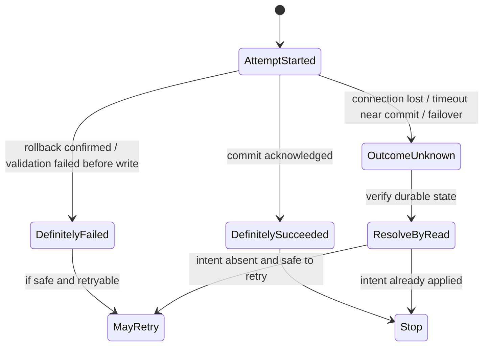
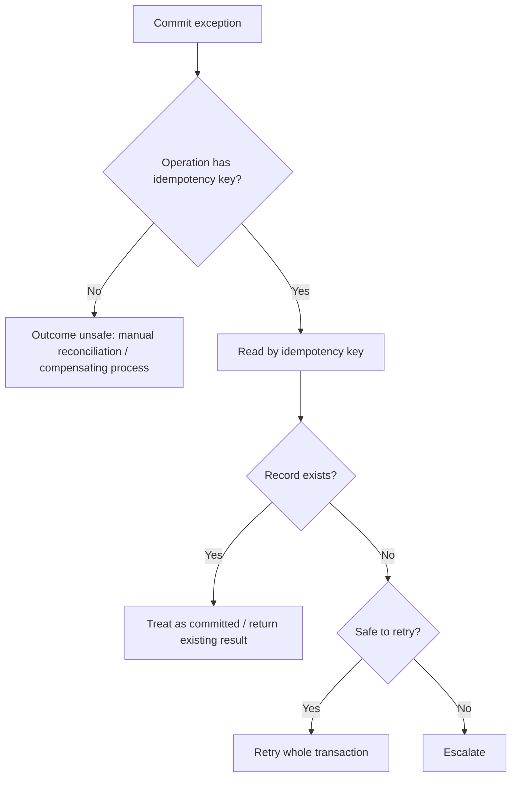
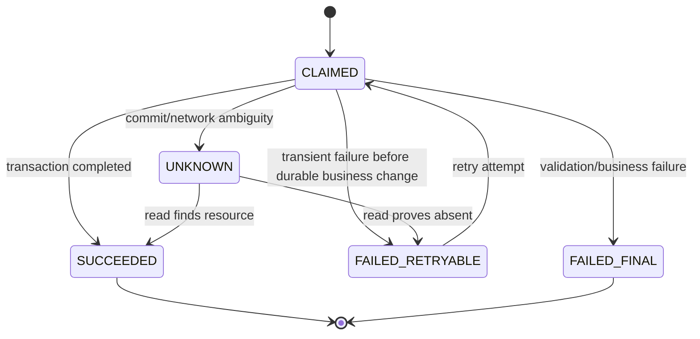
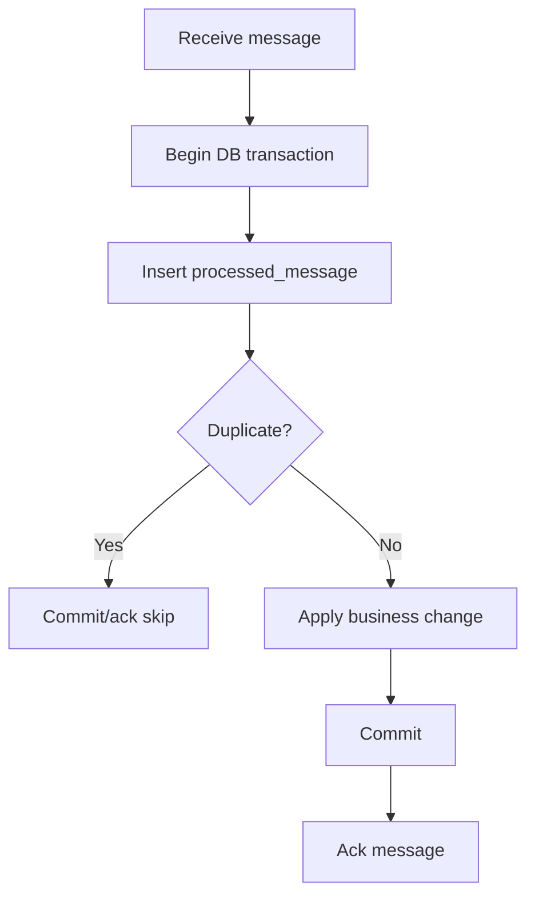

# Part 025 — Retry, Idempotency, and Transaction Safety

> Goal part ini: membuat kita mampu menjawab pertanyaan yang jauh lebih penting daripada “boleh retry atau tidak?” yaitu: **retry apa, pada boundary mana, dengan invariant apa, dan bagaimana membuktikan bahwa retry tidak menggandakan efek bisnis?**

Pada part sebelumnya, kita sudah memetakan `SQLException`, SQLState, vendor code, transient/non-transient error, dan retryability. Part ini naik satu level: bagaimana membuat retry aman dalam sistem nyata.

Retry adalah pisau bermata dua. Ia bisa memperbaiki transient failure seperti serialization conflict, deadlock, atau network hiccup. Tetapi retry yang salah bisa menggandakan pembayaran, membuat duplicate row, mengirim email dua kali, memublikasikan message dua kali, atau memperpanjang outage karena semua request melakukan retry bersamaan.

Jadi rule utamanya:

> **Retry is not a loop. Retry is a consistency protocol.**

---

## 1. Mental Model: Retry Is Re-Executing Intent, Not Re-Executing Code

Engineer junior sering melihat retry seperti ini:

```java
for (int i = 0; i < 3; i++) {
    try {
        doDatabaseOperation();
        break;
    } catch (SQLException e) {
        // try again
    }
}
```

Engineer senior melihat retry seperti ini:

```text
Business intent
  -> deterministic command identity
  -> transaction attempt
  -> database constraints protect invariant
  -> external side effects delayed or deduplicated
  -> ambiguous outcome resolved by read/verify
```

Perbedaan paling penting:

| Weak View | Production View |
|---|---|
| Retry menjalankan ulang function | Retry menjalankan ulang intent yang punya identity |
| Error transient berarti aman retry | Retry aman hanya jika operation idempotent atau guarded |
| Exception berarti operasi gagal | Exception bisa berarti gagal, sukses, atau unknown |
| Database error cukup dilihat dari class Java | Perlu SQLState/vendor code/business context |
| Retry di semua layer makin aman | Retry di banyak layer bisa memperparah load |

---

## 2. Three Outcomes of a Database Attempt

Setiap percobaan transaksi punya tiga kemungkinan hasil:



Yang paling berbahaya adalah **OutcomeUnknown**.

Contoh:

```java
conn.commit(); // network timeout happens here
```

Apakah transaksi commit atau tidak?

Jawaban jujur: **belum tentu diketahui oleh aplikasi**.

Aplikasi kehilangan koneksi saat commit acknowledgement belum diterima. Database mungkin sudah commit, mungkin belum. Di sinilah idempotency menjadi syarat, bukan fitur tambahan.

---

## 3. Retryable Does Not Mean Safe to Retry

Ada dua dimensi yang sering dicampur:

| Dimension | Meaning |
|---|---|
| Retryable failure | Error kemungkinan hilang jika dicoba ulang |
| Retry-safe operation | Mencoba ulang tidak merusak invariant bisnis |

Contoh failure retryable tetapi operation tidak aman:

```java
void chargeCustomer(long accountId, BigDecimal amount) {
    insertLedgerDebit(accountId, amount);
    callPaymentGateway(amount);
}
```

Jika timeout terjadi setelah gateway berhasil tetapi sebelum aplikasi menerima response, retry bisa menggandakan charge.

Contoh operation retry-safe:

```java
void createPayment(UUID idempotencyKey, long accountId, BigDecimal amount) {
    insertPaymentRequest(idempotencyKey, accountId, amount);
    // unique(idempotency_key) prevents duplicate intent
}
```

Retry aman karena database punya guardrail.

---

## 4. Retry Taxonomy for JDBC Systems

Gunakan taxonomy berikut saat membaca failure.

| Failure | Typical Signal | Retry? | Requirement |
|---|---:|---:|---|
| Serialization failure | SQLState `40001` | Usually yes | Retry whole transaction |
| Deadlock victim | DB-specific; PostgreSQL `40P01` | Often yes | Retry whole transaction, fix lock ordering if frequent |
| Lock wait timeout | Vendor-specific | Sometimes | Diagnose contention; retry with backoff only if business-safe |
| Pool acquisition timeout | Hikari timeout | Usually no immediate retry | Reduce load, tune pool/workload, fail fast |
| Query timeout | `SQLTimeoutException` or vendor signal | Maybe | Know if server cancelled query; avoid blind retry |
| Connection failure before transaction starts | SQLState class `08` often | Maybe | Retry if operation not yet applied |
| Connection failure during commit | ambiguous | Do not blind retry | Resolve outcome by business key |
| Constraint violation | SQLState class `23` often | Usually no | Could mean idempotent duplicate success |
| Syntax/schema error | SQLState class `42` often | No | Fix code/migration |
| Authentication/permission | SQLState class `28` often | No | Fix configuration/security |

Important:

> SQLState membantu klasifikasi awal, tetapi keputusan final harus melibatkan business semantics.

---

## 5. The Correct Unit of Retry: Whole Transaction, Not One Statement

Retry serialization failure atau deadlock harus mengulang **seluruh transaction attempt**, bukan statement terakhir.

Salah:

```java
try {
    updateBalance(conn, from, debit);
} catch (SQLException e) {
    updateBalance(conn, from, debit); // bad: transaction state may already be invalid
}
updateBalance(conn, to, credit);
conn.commit();
```

Benar:

```java
retryTransaction(() -> {
    transferFunds(from, to, amount);
});
```

Karena transaction adalah unit consistency. Jika satu statement gagal karena konflik concurrency, seluruh read/write set transaction mungkin sudah tidak valid.

---

## 6. A Minimal Transaction Retry Runner

Berikut baseline runner manual JDBC. Ini bukan framework final, tetapi cukup untuk membentuk mental model.

```java
@FunctionalInterface
public interface SqlWork<T> {
    T run(Connection connection) throws SQLException;
}

public final class TransactionRetrier {
    private final DataSource dataSource;
    private final int maxAttempts;
    private final Duration baseBackoff;

    public TransactionRetrier(DataSource dataSource, int maxAttempts, Duration baseBackoff) {
        this.dataSource = Objects.requireNonNull(dataSource);
        this.maxAttempts = maxAttempts;
        this.baseBackoff = Objects.requireNonNull(baseBackoff);
    }

    public <T> T run(SqlWork<T> work) throws SQLException, InterruptedException {
        SQLException last = null;

        for (int attempt = 1; attempt <= maxAttempts; attempt++) {
            try (Connection connection = dataSource.getConnection()) {
                connection.setAutoCommit(false);

                try {
                    T result = work.run(connection);
                    connection.commit();
                    return result;
                } catch (SQLException | RuntimeException e) {
                    rollbackQuietly(connection, e);
                    throw e;
                }
            } catch (SQLException e) {
                last = e;

                if (!isRetryable(e) || attempt == maxAttempts) {
                    throw e;
                }

                sleepWithJitter(attempt);
            }
        }

        throw last;
    }

    private static void rollbackQuietly(Connection connection, Exception original) {
        try {
            connection.rollback();
        } catch (SQLException rollbackFailure) {
            original.addSuppressed(rollbackFailure);
        }
    }

    private boolean isRetryable(SQLException e) {
        String sqlState = e.getSQLState();
        if (sqlState == null) {
            return false;
        }

        // Serialization failure class.
        if (sqlState.equals("40001")) {
            return true;
        }

        // PostgreSQL deadlock_detected.
        if (sqlState.equals("40P01")) {
            return true;
        }

        // Connection exception class. Be careful near commit ambiguity.
        if (sqlState.startsWith("08")) {
            return false;
        }

        return e instanceof SQLTransientException;
    }

    private void sleepWithJitter(int attempt) throws InterruptedException {
        long baseMillis = baseBackoff.toMillis();
        long exponential = baseMillis * (1L << Math.min(attempt - 1, 10));
        long jitter = ThreadLocalRandom.current().nextLong(0, Math.max(1, baseMillis));
        Thread.sleep(exponential + jitter);
    }
}
```

Catatan penting:

1. Runner ini retry di level whole transaction.
2. Runner ini belum menyelesaikan ambiguous commit.
3. SQLState class `08` sengaja tidak langsung retry karena bisa terjadi pada fase berbahaya.
4. Business operation tetap harus idempotent.

---

## 7. Ambiguous Commit: The Hard Case

Ambiguous commit terjadi ketika aplikasi tidak tahu apakah `commit()` berhasil.

Contoh:

```java
try {
    conn.commit();
} catch (SQLException e) {
    // Did the database commit or not?
}
```

Kemungkinan:

| Possibility | Meaning |
|---|---|
| Commit belum sampai DB | Tidak ada perubahan durable |
| Commit sampai DB dan sukses | Perubahan sudah durable |
| Commit sampai DB tetapi response hilang | Perubahan durable tetapi aplikasi melihat exception |
| Failover di tengah jalan | Outcome perlu dibuktikan |

Solusi bukan “retry commit”. Solusi adalah **resolve by durable business key**.



---

## 8. Idempotency Key: The Simplest Reliable Primitive

Idempotency key adalah identity untuk business intent.

Contoh command:

```java
public record CreatePaymentCommand(
    UUID idempotencyKey,
    long customerId,
    BigDecimal amount,
    String currency
) {}
```

Database schema:

```sql
create table payment_request (
    id bigserial primary key,
    idempotency_key uuid not null unique,
    customer_id bigint not null,
    amount numeric(19, 4) not null,
    currency char(3) not null,
    status varchar(32) not null,
    created_at timestamptz not null default now(),
    updated_at timestamptz not null default now()
);
```

Insert pattern:

```java
public PaymentRequest createPaymentRequest(Connection conn, CreatePaymentCommand command)
        throws SQLException {

    String sql = """
        insert into payment_request
            (idempotency_key, customer_id, amount, currency, status)
        values
            (?, ?, ?, ?, 'PENDING')
        on conflict (idempotency_key) do nothing
        """;

    try (PreparedStatement ps = conn.prepareStatement(sql)) {
        ps.setObject(1, command.idempotencyKey());
        ps.setLong(2, command.customerId());
        ps.setBigDecimal(3, command.amount());
        ps.setString(4, command.currency());
        ps.executeUpdate();
    }

    return findByIdempotencyKey(conn, command.idempotencyKey())
        .orElseThrow(() -> new IllegalStateException("Insert was not visible after attempt"));
}
```

Idempotency key membuat retry menjadi lookup-or-create, bukan blind duplicate write.

---

## 9. Idempotency Is More Than a Unique Constraint

Unique constraint penting, tetapi belum cukup. Anda juga harus memastikan request yang memakai key sama membawa payload yang sama.

Masalah:

```text
key = abc
amount = 100

retry later:
key = abc
amount = 500
```

Kalau hanya `unique(idempotency_key)`, sistem mungkin mengembalikan pembayaran lama tanpa mendeteksi payload mismatch.

Lebih aman:

```sql
create table idempotency_record (
    idempotency_key uuid primary key,
    request_hash varchar(128) not null,
    resource_type varchar(64) not null,
    resource_id bigint,
    status varchar(32) not null,
    response_code int,
    created_at timestamptz not null default now()
);
```

Algorithm:

```text
1. Normalize request payload.
2. Compute stable request hash.
3. Insert idempotency key + request hash.
4. If key exists:
   - same hash: return previous/in-progress result
   - different hash: reject as idempotency conflict
5. Execute business transaction.
6. Store resource/result reference.
```

---

## 10. Natural Key vs Idempotency Key

Kadang business domain sudah punya natural key.

| Use Case | Natural Key |
|---|---|
| Invoice creation | invoice_number |
| Ledger posting | journal_entry_id |
| User registration | email, tenant_id |
| Case escalation | case_id + escalation_level |
| Outbox message | aggregate_id + event_version |

Natural key bisa menjadi idempotency guardrail.

Namun hati-hati:

| Natural Key Weakness | Example |
|---|---|
| Bisa berubah | email user bisa berubah |
| Tidak cukup granular | customer_id tidak membedakan order berbeda |
| Terlalu teknis | auto-increment id tidak dikenal caller |
| Tidak ada sebelum write | generated id baru muncul setelah insert |

Pattern production:

```text
external request idempotency key
  + domain natural key
  + database unique constraint
  + read-after-failure resolution
```

---

## 11. Unique Constraint as Concurrency Control

Unique constraint bukan hanya validasi; ia adalah concurrency primitive.

Contoh: hanya boleh ada satu active subscription per customer.

```sql
create unique index ux_active_subscription
on subscription(customer_id)
where status = 'ACTIVE';
```

Application logic:

```java
try {
    insertActiveSubscription(conn, customerId, planId);
} catch (SQLException e) {
    if (isUniqueViolation(e)) {
        return findActiveSubscription(conn, customerId);
    }
    throw e;
}
```

Kenapa ini powerful?

Karena check-then-insert di aplikasi rentan race:

```java
if (!hasActiveSubscription(conn, customerId)) {
    insertSubscription(conn, customerId); // race under concurrency
}
```

Database constraint adalah final authority.

---

## 12. Idempotent State Transition

State transition harus didesain agar repeated command tidak merusak state.

Contoh regulatory case workflow:

```text
OPEN -> UNDER_REVIEW -> ESCALATED -> ENFORCEMENT -> CLOSED
```

Command:

```text
EscalateCase(caseId, escalationId, reason)
```

Guardrail:

```sql
create table case_escalation (
    escalation_id uuid primary key,
    case_id bigint not null,
    from_state varchar(32) not null,
    to_state varchar(32) not null,
    reason text not null,
    created_at timestamptz not null default now()
);
```

Transition:

```sql
update regulatory_case
set state = 'ESCALATED', version = version + 1
where id = ?
  and state = 'UNDER_REVIEW';
```

Interpretasi `updateCount`:

| updateCount | Meaning |
|---:|---|
| 1 | Transition applied |
| 0 | Already transitioned, stale state, or invalid state |

Production code harus membedakan:

```java
int updated = updateCaseToEscalated(conn, caseId);
if (updated == 1) {
    insertEscalationRecord(conn, escalationId, caseId, reason);
    return EscalationResult.CREATED;
}

return findEscalation(conn, escalationId)
    .map(existing -> EscalationResult.ALREADY_APPLIED)
    .orElseThrow(() -> new InvalidStateTransitionException(caseId));
```

---

## 13. Retry and External Side Effects

External side effect tidak boleh dilakukan di tengah database transaction jika efeknya tidak bisa di-rollback.

Buruk:

```java
connection.setAutoCommit(false);

insertPayment(conn, payment);
emailClient.sendReceipt(payment.email());
connection.commit();
```

Jika `commit()` gagal setelah email terkirim, user menerima receipt untuk transaksi yang mungkin tidak durable.

Lebih aman: gunakan outbox.

```sql
create table outbox_event (
    id uuid primary key,
    aggregate_type varchar(64) not null,
    aggregate_id varchar(128) not null,
    event_type varchar(128) not null,
    payload jsonb not null,
    status varchar(32) not null default 'PENDING',
    created_at timestamptz not null default now(),
    published_at timestamptz
);
```

Transaction:

```java
connection.setAutoCommit(false);

insertPayment(conn, payment);
insertOutboxEvent(conn, paymentCreatedEvent);

connection.commit();
```

Publisher terpisah:

```text
read pending outbox events
publish to broker/email/webhook
mark as published
retry safely with event id
```

---

## 14. Outbox Idempotency

Outbox juga harus idempotent.

Recommended constraints:

```sql
alter table outbox_event
add constraint ux_outbox_aggregate_version
unique (aggregate_type, aggregate_id, event_type);
```

Atau jika event version penting:

```sql
unique (aggregate_type, aggregate_id, aggregate_version)
```

Consumer juga harus idempotent:

```sql
create table processed_message (
    consumer_name varchar(128) not null,
    message_id uuid not null,
    processed_at timestamptz not null default now(),
    primary key (consumer_name, message_id)
);
```

Consumer algorithm:

```text
1. Begin transaction.
2. Insert processed_message(consumer, message_id).
3. If duplicate, skip.
4. Apply business changes.
5. Commit.
```

---

## 15. Retry Budget

Retry harus punya budget. Tanpa budget, sistem overload akan makin overload.

Parameters:

| Parameter | Meaning |
|---|---|
| max attempts | Berapa kali dicoba |
| max elapsed time | Total waktu maksimum |
| backoff | Delay meningkat antar attempt |
| jitter | Randomness untuk mencegah thundering herd |
| retryable classifier | Error mana yang boleh retry |
| idempotency guard | Bukti retry aman |
| cancellation/deadline | Stop saat caller sudah timeout |

Contoh policy:

```java
public record RetryPolicy(
    int maxAttempts,
    Duration maxElapsed,
    Duration baseBackoff,
    Duration maxBackoff
) {}
```

Jangan biarkan retry database melewati timeout request upstream.

```text
HTTP request deadline: 2s
  -> pool acquisition: max 100ms
  -> DB transaction attempt: max 500ms
  -> retry budget: at most one retry if enough deadline remains
```

---

## 16. Backoff and Jitter

Tanpa jitter:

```text
100 failed requests retry after 100ms
100 failed requests retry again after 200ms
100 failed requests retry again after 400ms
```

Ini menciptakan traffic wave.

Dengan jitter:

```text
request A retry after 120ms
request B retry after 63ms
request C retry after 188ms
```

Baseline implementation:

```java
static Duration backoffWithJitter(Duration base, Duration max, int attempt) {
    long baseMillis = base.toMillis();
    long capMillis = max.toMillis();
    long exp = baseMillis * (1L << Math.min(attempt - 1, 10));
    long bounded = Math.min(exp, capMillis);
    long jitter = ThreadLocalRandom.current().nextLong(0, Math.max(1, bounded));
    return Duration.ofMillis(jitter);
}
```

Production note:

> Untuk database contention, retry terlalu cepat sering memperpanjang contention. Backoff bukan decoration; ia bagian dari concurrency control.

---

## 17. Layering: Where Should Retry Live?

Retry bisa terjadi di banyak layer:

```text
HTTP client retry
  -> API gateway retry
  -> service-level retry
  -> repository retry
  -> JDBC driver reconnect
  -> database failover retry
```

Anti-pattern: semua layer retry.

Efek:

```text
3 attempts at gateway × 3 attempts at service × 3 attempts at repository = 27 DB attempts
```

Preferred:

| Layer | Retry Responsibility |
|---|---|
| HTTP gateway | Usually avoid retrying non-idempotent writes |
| Application service | Retry whole idempotent command |
| Repository | No blind retry; expose classified failure |
| Driver/pool | Validate/reconnect physical connections, not business retry |
| Consumer worker | Retry message handling with idempotent consumer |

Rule:

> Business retry belongs near the business intent, not hidden inside low-level DAO.

---

## 18. Spring Transaction Retry Boundary

Dengan Spring, retry dan `@Transactional` ordering sangat penting.

Buruk:

```java
@Transactional
@Retryable
public void handle(Command command) {
    // retry may happen inside same broken transaction depending on proxy order
}
```

Lebih aman secara konsep:

```java
@Retryable(include = TransientDataAccessException.class)
public void handleWithRetry(Command command) {
    transactionalHandler.handle(command);
}

@Transactional
public void handle(Command command) {
    // one fresh transaction per attempt
}
```

Atau gunakan `TransactionTemplate` di dalam retry loop:

```java
retryTemplate.execute(context ->
    transactionTemplate.execute(status -> {
        service.apply(command);
        return null;
    })
);
```

Invariant:

> Setiap retry attempt harus mendapatkan transaction baru, connection state baru, dan read/write set baru.

---

## 19. Optimistic Lock Retry

Optimistic lock menggunakan version column.

```sql
update account
set balance = ?, version = version + 1
where id = ?
  and version = ?;
```

Jika `updateCount == 0`, ada concurrency conflict.

Boleh retry?

Tergantung operasi.

| Operation | Retry? | Reason |
|---|---:|---|
| Set display name | Yes | Re-read latest, apply command |
| Debit account | Maybe | Must recompute balance and validate funds |
| Approve case | Maybe | Must verify state transition still valid |
| Append ledger entry | Prefer idempotent insert | Avoid duplicate debit |

Optimistic retry harus re-read state, bukan reuse old entity.

```java
for (int attempt = 1; attempt <= maxAttempts; attempt++) {
    Account account = accountRepository.findById(conn, accountId);
    account.debit(amount);

    int updated = accountRepository.updateIfVersionMatches(conn, account);
    if (updated == 1) {
        return;
    }
}
throw new ConcurrentModificationException();
```

---

## 20. Retry and Pessimistic Lock

Pessimistic locking pattern:

```sql
select *
from account
where id = ?
for update;
```

Jika lock wait timeout terjadi, retry bisa valid jika:

1. transaction kecil,
2. command idempotent,
3. backoff ada,
4. contention bukan permanen,
5. caller deadline masih cukup.

Tetapi jika lock wait timeout sering terjadi, retry bukan root fix.

Diagnosis:

```text
long transaction?
missing index causing wide lock?
inconsistent lock ordering?
batch job competing with OLTP?
pool too large causing DB contention?
```

---

## 21. The Read-After-Failure Pattern

Saat outcome unknown, resolve dengan read.

Example:

```java
public PaymentResult createPayment(CreatePaymentCommand command) throws SQLException {
    try {
        return transactionRetrier.run(conn -> createPaymentInternal(conn, command));
    } catch (SQLException e) {
        if (couldBeAmbiguousCommit(e)) {
            return findByIdempotencyKey(command.idempotencyKey())
                .map(PaymentResult::fromExisting)
                .orElseThrow(() -> e);
        }
        throw e;
    }
}
```

Read key harus durable dan unique.

Tidak cukup membaca “latest payment for customer” karena bisa salah mengambil pembayaran lain.

---

## 22. Idempotent Insert Patterns by Database

Portable JDBC tidak mendefinisikan syntax upsert. Database berbeda.

| Database | Common Pattern |
|---|---|
| PostgreSQL | `insert ... on conflict ...` |
| MySQL | `insert ... on duplicate key update` atau `insert ignore` |
| SQL Server | guarded insert with unique constraint; careful with `MERGE` semantics |
| Oracle | `merge` atau insert + handle unique violation |

Database-specific SQL sebaiknya ditempatkan jelas di repository adapter, bukan tersebar di service.

Example interface:

```java
public interface IdempotencyRepository {
    ClaimResult claim(Connection conn, UUID key, String requestHash) throws SQLException;
    void markSucceeded(Connection conn, UUID key, String resourceType, long resourceId) throws SQLException;
    Optional<IdempotencyRecord> find(Connection conn, UUID key) throws SQLException;
}
```

---

## 23. Idempotency Record State Machine



Design choice:

- Be careful marking `FAILED_RETRYABLE` inside same transaction that rolled back.
- Sometimes idempotency claim and business write should be in one transaction.
- Sometimes separate claim table is useful to coordinate concurrent requests.
- Expiration/TTL must not delete records still needed for reconciliation.

---

## 24. Duplicate Request Race

Two identical commands arrive at same time:

```text
request A: idempotency_key = K
request B: idempotency_key = K
```

Potential behavior:

| Strategy | Behavior |
|---|---|
| Unique insert; loser reads | Simple, often enough |
| Row lock on idempotency record | Prevent duplicate concurrent execution |
| Status `IN_PROGRESS` | Caller can poll or wait |
| Return 409/425-like response | Ask client to retry later |

Claim pattern:

```sql
insert into idempotency_record(idempotency_key, request_hash, status)
values (?, ?, 'IN_PROGRESS')
on conflict (idempotency_key) do nothing;
```

Then:

```text
if inserted -> execute command
if existing same hash and succeeded -> return existing result
if existing same hash and in_progress -> return processing/retry later
if existing different hash -> reject conflict
```

---

## 25. Retry for Message Consumers

Message brokers commonly deliver at-least-once. Consumer retry must be idempotent.



If crash happens after commit before ack, broker redelivers. `processed_message` prevents duplicate effect.

---

## 26. Retry Classification Code

A classifier should preserve uncertainty.

```java
public enum RetryDecision {
    RETRY_SAFE,
    DO_NOT_RETRY,
    RESOLVE_OUTCOME_FIRST
}

public final class SqlRetryClassifier {
    public RetryDecision classify(SQLException e, TransactionPhase phase) {
        String state = e.getSQLState();

        if (state == null) {
            return RetryDecision.DO_NOT_RETRY;
        }

        if (phase == TransactionPhase.COMMIT) {
            if (state.startsWith("08") || e instanceof SQLRecoverableException) {
                return RetryDecision.RESOLVE_OUTCOME_FIRST;
            }
        }

        if (state.equals("40001") || state.equals("40P01")) {
            return RetryDecision.RETRY_SAFE;
        }

        if (state.startsWith("23")) {
            return RetryDecision.DO_NOT_RETRY;
        }

        if (e instanceof SQLTransientException) {
            return RetryDecision.RETRY_SAFE;
        }

        return RetryDecision.DO_NOT_RETRY;
    }
}
```

Transaction phase matters:

```java
public enum TransactionPhase {
    BEFORE_BEGIN,
    IN_TRANSACTION,
    COMMIT,
    AFTER_COMMIT
}
```

---

## 27. Bad Retry Smells

| Smell | Why Dangerous |
|---|---|
| `catch (Exception) { retry(); }` | Hides non-retryable bugs |
| Retry inside DAO | Loses business context |
| Retry only failed statement | Transaction state may be invalid |
| No idempotency key on write API | Duplicate business effect |
| Retry after commit exception blindly | Ambiguous commit duplicate |
| Infinite retry worker | Can overload database forever |
| No jitter | Thundering herd |
| Retry constraint violation | Usually business conflict or duplicate success |
| Retry pool timeout aggressively | Makes pool exhaustion worse |
| External API call inside DB transaction | Cannot rollback side effect |

---

## 28. Review Checklist

Use this checklist in design review.

### Operation classification

- Is this operation read-only, write, or mixed?
- Is it naturally idempotent?
- Does it create external side effects?
- Does caller provide request identity?
- Is duplicate request possible?

### Database guardrails

- Is there a unique constraint for the business invariant?
- Is optimistic versioning needed?
- Are state transitions guarded by `where state = ?`?
- Does update count have explicit interpretation?
- Is there an outbox for external side effects?

### Retry policy

- Which SQLState/vendor codes are retryable?
- Are retries whole-transaction retries?
- Is there max attempt and elapsed time?
- Is there jitter?
- Is retry deadline less than caller deadline?

### Ambiguous outcome

- What happens if `commit()` throws?
- What durable key can resolve outcome?
- Is read-after-failure deterministic?
- Is manual reconciliation possible?

### Observability

- Are retry attempts logged with attempt number?
- Are SQLState and vendor code captured?
- Are idempotency conflicts counted?
- Are ambiguous commits alerted?
- Are duplicate requests distinguishable from bugs?

---

## 29. Capstone Exercise

Design a JDBC-based command handler for this operation:

```text
Create enforcement action for case.
Rules:
- one enforcement action per case per violation code
- duplicate client request must not create duplicate action
- action creation must emit event to downstream system
- transaction can fail due to serialization/deadlock
- caller timeout is 2 seconds
```

Expected design:

1. Command has `idempotencyKey`.
2. Database has unique constraint on `idempotency_key`.
3. Database has unique constraint on `(case_id, violation_code)`.
4. Transaction creates enforcement action and outbox event.
5. Retry only whole transaction for serialization/deadlock.
6. Commit ambiguity resolved by reading idempotency record or enforcement natural key.
7. Event publisher uses outbox idempotently.
8. External side effect is outside DB transaction.

---

## 30. Summary

Retry yang benar membutuhkan tiga hal:

1. **Failure classification** — tahu error mana yang transient, permanent, atau ambiguous.
2. **Idempotency design** — tahu kenapa retry tidak menggandakan efek bisnis.
3. **Transaction boundary discipline** — retry whole transaction dengan deadline, backoff, jitter, dan durable outcome resolution.

Kalau hanya mengingat satu kalimat:

> **Never retry a write unless you can prove duplicate execution is harmless or impossible.**

---

## References

- Java SE 25 `SQLException` documentation: https://docs.oracle.com/en/java/javase/25/docs/api/java.sql/java/sql/SQLException.html
- Java SE 25 `SQLTransientException` documentation: https://docs.oracle.com/en/java/javase/25/docs/api/java.sql/java/sql/SQLTransientException.html
- Java SE 25 `Connection` documentation: https://docs.oracle.com/en/java/javase/25/docs/api/java.sql/java/sql/Connection.html
- PostgreSQL Transaction Isolation documentation: https://www.postgresql.org/docs/current/transaction-iso.html
- PostgreSQL Serialization Failure Handling documentation: https://www.postgresql.org/docs/current/mvcc-serialization-failure-handling.html
