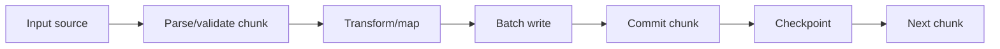
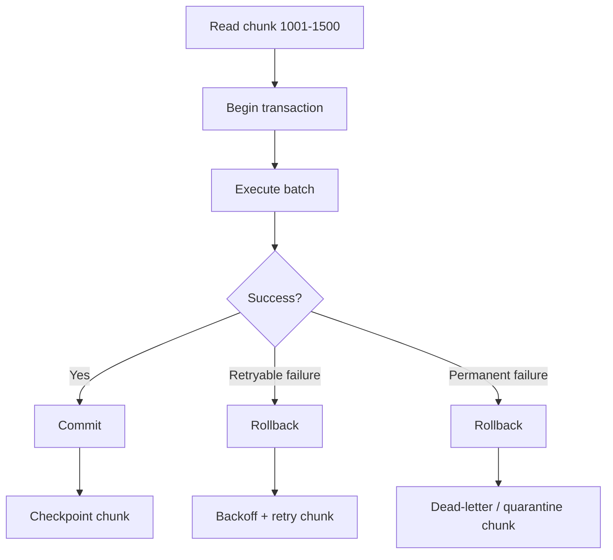
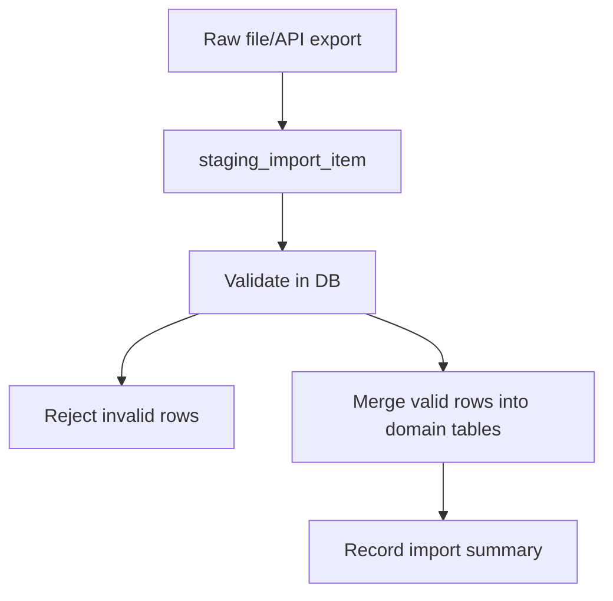
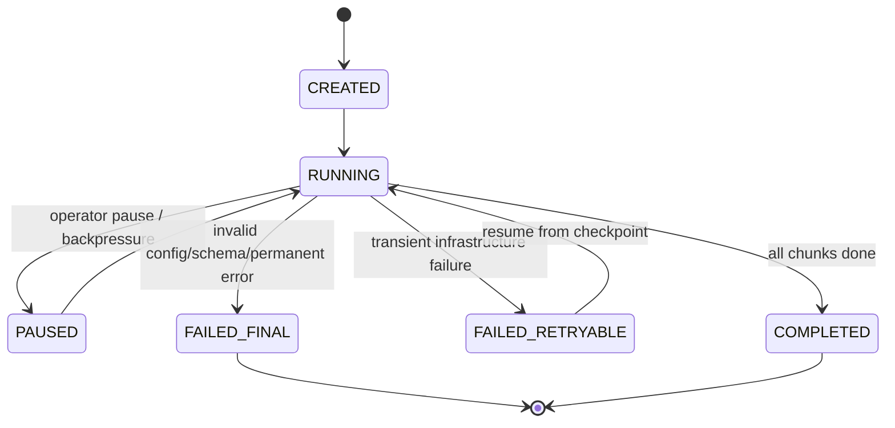

# Part 026 — Batch Processing and Bulk Data Operations

> Goal part ini: membuat kita mampu mendesain operasi bulk yang cepat, aman, observabel, dan tidak merusak database production lewat transaction raksasa, lock storm, memory pressure, atau pool starvation.

Bulk operation tampak sederhana:

```java
for (Item item : items) {
    insert(item);
}
```

Tetapi di production, bulk operation menyentuh banyak boundary sekaligus:

- JDBC statement batching
- transaction size
- memory pressure
- lock duration
- redo/WAL/binlog pressure
- index maintenance
- generated keys
- retry/idempotency
- connection pool usage
- database CPU/IO
- observability dan recovery

Batch yang baik bukan sekadar “pakai `addBatch()`”. Batch yang baik adalah desain workload.

---

## 1. Mental Model: Bulk Work Is a Pipeline, Not a Loop

Loop naive:

```text
read all input into memory
  -> open transaction
  -> insert row 1
  -> insert row 2
  -> ...
  -> insert row N
  -> commit
```

Production pipeline:



Key idea:

> Bulk processing harus punya chunk boundary, transaction boundary, checkpoint boundary, dan retry boundary yang jelas.

---

## 2. JDBC Batch API

JDBC menyediakan batch API di `Statement` dan `PreparedStatement`.

### `Statement` batch

```java
try (Statement statement = connection.createStatement()) {
    statement.addBatch("update account set status = 'INACTIVE' where id = 1");
    statement.addBatch("update account set status = 'INACTIVE' where id = 2");
    int[] counts = statement.executeBatch();
}
```

Ini jarang menjadi pilihan utama untuk data dinamis karena SQL value raw mudah mengarah ke SQL injection dan parsing overhead.

### `PreparedStatement` batch

```java
String sql = """
    insert into customer_event(customer_id, event_type, payload)
    values (?, ?, ?)
    """;

try (PreparedStatement ps = connection.prepareStatement(sql)) {
    for (CustomerEvent event : events) {
        ps.setLong(1, event.customerId());
        ps.setString(2, event.type());
        ps.setString(3, event.payloadJson());
        ps.addBatch();
    }

    int[] counts = ps.executeBatch();
}
```

Preferred pattern:

```text
PreparedStatement + parameter binding + bounded batch size + explicit transaction
```

---

## 3. What `executeBatch()` Returns

`executeBatch()` returns an `int[]` update count.

Possible values:

| Value | Meaning |
|---:|---|
| `>= 0` | Number of affected rows |
| `Statement.SUCCESS_NO_INFO` | Success, row count unknown |
| `Statement.EXECUTE_FAILED` | Failed command, if driver continues after failure |

Example:

```java
int[] counts = ps.executeBatch();

for (int i = 0; i < counts.length; i++) {
    int count = counts[i];
    if (count == Statement.EXECUTE_FAILED) {
        throw new IllegalStateException("Batch item failed at index " + i);
    }
}
```

Caveat:

> Driver behavior after a batch failure may differ. Some drivers stop at first failure; others may continue and report per-item results via `BatchUpdateException`.

---

## 4. `BatchUpdateException`

When a batch fails, JDBC can throw `BatchUpdateException`.

```java
try {
    ps.executeBatch();
} catch (BatchUpdateException e) {
    int[] partialCounts = e.getUpdateCounts();
    SQLException next = e.getNextException();
    throw e;
}
```

What to inspect:

- update counts length
- failed index if inferable
- SQLState
- vendor code
- next exceptions
- whether transaction was rolled back by app
- whether driver continued after failure

Production rule:

> If batch is inside explicit transaction and one item fails, rollback the whole chunk unless you have a deliberate partial-success design.

---

## 5. Batch Size: The Most Important Dial

Batch size balances:

| Too Small | Too Large |
|---|---|
| High round-trip overhead | High memory pressure |
| More commits | Long lock duration |
| Lower throughput | Bigger rollback cost |
| More network chatter | WAL/redo spikes |
| Less efficient driver batching | Pool connection held too long |

Baseline starting points:

```text
OLTP side-job: 100–500 rows per batch
medium import: 500–2,000 rows per batch
large offline load: benchmark database-specific path
```

These are not universal constants. Measure.

A sane adaptive loop:

```java
int batchSize = 500;
List<Row> buffer = new ArrayList<>(batchSize);

for (Row row : input) {
    buffer.add(row);
    if (buffer.size() == batchSize) {
        writeChunk(buffer);
        buffer.clear();
    }
}

if (!buffer.isEmpty()) {
    writeChunk(buffer);
}
```

---

## 6. Explicit Transaction Per Chunk

Avoid auto-commit per row.

Bad:

```java
try (Connection conn = dataSource.getConnection()) {
    // autoCommit default true
    for (Row row : rows) {
        insertOne(conn, row); // each row commits separately
    }
}
```

Also bad for huge dataset:

```java
conn.setAutoCommit(false);
for (Row row : millionsOfRows) {
    insertOne(conn, row);
}
conn.commit(); // one enormous transaction
```

Better:

```java
void writeChunk(List<Row> rows) throws SQLException {
    try (Connection conn = dataSource.getConnection()) {
        conn.setAutoCommit(false);
        try {
            insertBatch(conn, rows);
            conn.commit();
        } catch (SQLException | RuntimeException e) {
            rollbackQuietly(conn, e);
            throw e;
        }
    }
}
```

Chunk transaction gives:

- bounded rollback cost,
- shorter lock holding,
- better recovery,
- checkpoints,
- controlled resource usage.

---

## 7. Chunk Boundary and Retry Boundary

For bulk operation, retry unit should usually be one chunk.



Never retry individual row blindly if transaction state may be invalid.

---

## 8. Checkpointing

Long-running bulk job needs checkpoint.

Checkpoint examples:

| Source | Checkpoint |
|---|---|
| ID range | last processed id |
| File | byte offset / line number |
| Kafka-like source | topic partition offset |
| Time window | last processed timestamp + tie-breaker id |
| Staging table | batch id + status |

Database checkpoint table:

```sql
create table job_checkpoint (
    job_name varchar(128) primary key,
    checkpoint_value varchar(512) not null,
    updated_at timestamptz not null default now()
);
```

Update checkpoint after commit:

```java
writeChunk(rows);
checkpointRepository.save(jobName, rows.getLast().id());
```

If checkpoint and data write must be atomic, store checkpoint in the same transaction.

---

## 9. Idempotency for Bulk Jobs

Bulk retries require idempotent writes.

Options:

| Strategy | Use Case |
|---|---|
| Unique natural key | Import customers by external id |
| Upsert | Re-running same input should converge |
| Job item table | Track each input row by job id + line number |
| Processed event table | Consumer-style dedup |
| Versioned output | Append-only ledger/event model |

Example staging table:

```sql
create table import_item (
    job_id uuid not null,
    line_number bigint not null,
    external_id varchar(128) not null,
    payload jsonb not null,
    status varchar(32) not null,
    error_message text,
    primary key (job_id, line_number)
);
```

Then business table:

```sql
create unique index ux_customer_external_id
on customer(external_id);
```

This allows safe resume and retry.

---

## 10. Batch Insert Pattern

```java
public int[] insertCustomers(Connection conn, List<CustomerRow> rows) throws SQLException {
    String sql = """
        insert into customer(external_id, name, email, created_at)
        values (?, ?, ?, ?)
        """;

    try (PreparedStatement ps = conn.prepareStatement(sql)) {
        for (CustomerRow row : rows) {
            ps.setString(1, row.externalId());
            ps.setString(2, row.name());
            ps.setString(3, row.email());
            ps.setObject(4, row.createdAt());
            ps.addBatch();
        }

        return ps.executeBatch();
    }
}
```

Validation before batch:

```java
for (CustomerRow row : rows) {
    validate(row);
}
```

Why validate before opening transaction?

- avoid holding DB connection during CPU-only work,
- fail faster,
- reduce lock time,
- reduce rollback noise.

---

## 11. Batch Update Pattern

Example: mark cases as expired.

```java
public int expireCases(Connection conn, List<Long> caseIds) throws SQLException {
    String sql = """
        update regulatory_case
        set status = 'EXPIRED', updated_at = current_timestamp
        where id = ?
          and status = 'OPEN'
        """;

    int affected = 0;
    try (PreparedStatement ps = conn.prepareStatement(sql)) {
        for (Long caseId : caseIds) {
            ps.setLong(1, caseId);
            ps.addBatch();
        }

        int[] counts = ps.executeBatch();
        for (int count : counts) {
            if (count > 0) {
                affected += count;
            }
        }
    }
    return affected;
}
```

Notice the guard:

```sql
and status = 'OPEN'
```

This makes update idempotent and safe against state drift.

---

## 12. Batch Delete Pattern

Do not delete millions of rows in one transaction.

Better chunked delete:

```sql
delete from audit_log
where id in (
    select id
    from audit_log
    where created_at < ?
    order by id
    limit ?
);
```

In Java:

```java
int deleted;
do {
    deleted = transactionRunner.run(conn -> deleteOldAuditLogs(conn, cutoff, 1_000));
} while (deleted > 0);
```

Caveats:

- syntax differs by database,
- large delete can bloat table/index,
- vacuum/purge behavior matters,
- partition drop may be better than row delete.

---

## 13. Generated Keys in Batch

Generated keys with batch are driver/database-dependent in behavior and performance.

Basic JDBC form:

```java
String sql = """
    insert into order_request(customer_id, status)
    values (?, ?)
    """;

try (PreparedStatement ps = conn.prepareStatement(sql, Statement.RETURN_GENERATED_KEYS)) {
    for (OrderRow row : rows) {
        ps.setLong(1, row.customerId());
        ps.setString(2, row.status());
        ps.addBatch();
    }

    ps.executeBatch();

    try (ResultSet keys = ps.getGeneratedKeys()) {
        while (keys.next()) {
            long id = keys.getLong(1);
            // map generated id carefully
        }
    }
}
```

Pitfalls:

- key ordering may need verification per driver,
- some drivers do not return all keys efficiently,
- generated IDs complicate retry,
- natural/idempotency keys are often better for bulk imports.

For high-integrity imports, prefer client-generated UUID or natural key when practical.

---

## 14. Memory Pressure

Common memory anti-pattern:

```java
List<Row> rows = readEntireFile(file);
insertAll(rows);
```

Better:

```java
try (Stream<Row> stream = parser.stream(file)) {
    Iterator<Row> iterator = stream.iterator();
    while (iterator.hasNext()) {
        List<Row> chunk = takeNext(iterator, batchSize);
        writeChunk(chunk);
    }
}
```

But be careful with Java streams and checked exceptions. Simple iterator-based code is often clearer for production batch jobs.

Memory checklist:

- bounded input buffer,
- bounded batch buffer,
- no unbounded result accumulation,
- no full-file read unless file is known small,
- clear batch after execution,
- release references after commit.

---

## 15. `clearBatch()` and Reusing PreparedStatement

For very large loops inside one connection, use `clearBatch()` after `executeBatch()` if continuing.

```java
try (PreparedStatement ps = conn.prepareStatement(sql)) {
    int pending = 0;

    for (Row row : rows) {
        bind(ps, row);
        ps.addBatch();
        pending++;

        if (pending == batchSize) {
            ps.executeBatch();
            ps.clearBatch();
            pending = 0;
        }
    }

    if (pending > 0) {
        ps.executeBatch();
        ps.clearBatch();
    }
}
```

However, do not confuse statement batch boundary with transaction boundary. You may still want to commit after each chunk.

---

## 16. Connection Pool Impact

A bulk job can starve OLTP traffic if it holds too many connections too long.

Bad:

```text
same Hikari pool
maximumPoolSize = 20
bulk job starts 20 parallel workers
API requests cannot get connection
```

Better:

```text
apiPool maximumPoolSize = 20
batchPool maximumPoolSize = 2
batch workers limited to 2
```

Or schedule bulk jobs off-peak.

Rule:

> Bulk throughput must be capped by database health, not by how many threads the application can start.

---

## 17. Parallelism

Parallel batch is not always faster.

Parallelism increases:

- lock contention,
- index contention,
- WAL/redo pressure,
- CPU context switching,
- deadlock probability,
- connection demand.

Use partitioned parallelism only when data can be divided safely.

Examples:

| Safe-ish Partition | Reason |
|---|---|
| customer id hash range | reduces overlap |
| tenant id | natural isolation |
| date partition | aligns with physical partition |
| file shard | if no shared unique hot key |

Dangerous:

```text
10 workers updating same account/case/customer rows
```

---

## 18. Lock Pressure

Large batch update can lock many rows for long time.

```sql
update account
set status = 'SUSPENDED'
where risk_score > 900;
```

This may:

- scan many rows,
- lock many rows,
- block OLTP transactions,
- generate huge undo/redo/WAL,
- take long to rollback if cancelled.

Safer approach:

```text
1. Select candidate ids in small chunks.
2. Update by primary key chunk.
3. Commit each chunk.
4. Sleep/yield if database pressure is high.
```

Example:

```sql
select id
from account
where risk_score > 900
  and status <> 'SUSPENDED'
order by id
limit ?;
```

Then batch update by id.

---

## 19. Index and Constraint Cost

Bulk insert into heavily indexed table is expensive.

Each row may update:

- primary key index,
- unique indexes,
- foreign key checks,
- secondary indexes,
- triggers,
- materialized summary logic,
- replication stream.

Production questions:

- Is this online OLTP table?
- Can load happen into staging first?
- Can constraints be validated after load?
- Can partitions be swapped?
- Are triggers necessary for import?
- Does replication lag matter?

Do not disable constraints casually in production. Constraints protect correctness.

---

## 20. Staging Table Pattern

For complex imports, use staging.



Benefits:

- repeatable validation,
- auditability,
- partial rejection,
- easier retry,
- data quality reporting,
- smaller domain transactions.

Staging schema:

```sql
create table staging_customer_import (
    job_id uuid not null,
    line_number bigint not null,
    external_id varchar(128),
    name text,
    email text,
    raw_payload jsonb not null,
    validation_status varchar(32) not null default 'PENDING',
    error_message text,
    primary key (job_id, line_number)
);
```

---

## 21. Upsert for Bulk Operations

Upsert is useful for idempotent bulk import.

PostgreSQL-style example:

```sql
insert into customer(external_id, name, email, updated_at)
values (?, ?, ?, current_timestamp)
on conflict (external_id)
do update set
    name = excluded.name,
    email = excluded.email,
    updated_at = current_timestamp;
```

Engineering caution:

- upsert hides whether row was inserted or updated,
- update may fire triggers,
- concurrent upserts can still contend,
- changed columns should be intentional,
- audit semantics need care.

Sometimes better:

```text
insert new rows
then update changed rows explicitly
then report unchanged rows
```

---

## 22. Bulk Read: Pagination vs Streaming

Bulk read choices:

| Method | Good For | Risk |
|---|---|---|
| Offset pagination | small admin pages | slow/inconsistent for large sets |
| Keyset pagination | large stable traversal | requires ordered key |
| Cursor/streaming ResultSet | exports | long transaction/session |
| Snapshot table | repeatable batch | extra storage |

Offset pagination anti-pattern:

```sql
select * from audit_log order by id limit 1000 offset 9000000;
```

Better keyset:

```sql
select *
from audit_log
where id > ?
order by id
limit ?;
```

Java loop:

```java
long lastId = checkpoint.lastId();
while (true) {
    List<AuditLog> rows = fetchAfterId(conn, lastId, 1_000);
    if (rows.isEmpty()) {
        break;
    }

    process(rows);
    lastId = rows.get(rows.size() - 1).id();
    checkpoint.save(lastId);
}
```

---

## 23. Fetch Size in Bulk Read

`setFetchSize()` can reduce memory pressure, but behavior is driver-specific.

```java
try (PreparedStatement ps = conn.prepareStatement(sql)) {
    ps.setFetchSize(1_000);

    try (ResultSet rs = ps.executeQuery()) {
        while (rs.next()) {
            processRow(rs);
        }
    }
}
```

Caveats:

- some drivers fetch all rows unless special settings are enabled,
- streaming may hold transaction open,
- long reads can block vacuum/purge or create snapshot pressure,
- connection is held during whole stream.

For exports, isolate workload from OLTP pool when possible.

---

## 24. Chunked Write with Per-Row Error Capture

Sometimes business requires partial success.

Example: import file with invalid rows should import valid rows and report invalid rows.

Pattern:

```text
1. Load raw rows into staging.
2. Validate all rows and mark invalid.
3. Process valid rows in chunks.
4. Mark per-row success/failure.
5. Produce import report.
```

Avoid doing per-row try/catch inside one large domain transaction.

Bad:

```java
for (Row row : rows) {
    try {
        insertDomainRow(conn, row);
    } catch (SQLException e) {
        // continue inside same transaction: connection/transaction may be bad
    }
}
```

Better:

```text
staging validation catches bad input
valid subset processed by deterministic chunks
failed chunk can be split if needed
```

---

## 25. Binary Search Split for Bad Batch Item

If one row in a batch violates constraint and you need isolate it:

```text
try chunk of 500
  if fails:
    split into 250 + 250
    retry each half
      if fails:
        split again
          until single bad row found
```

This is useful for import systems but should not hide schema bugs.

Pseudo-code:

```java
void writeWithSplit(List<Row> rows) {
    if (rows.isEmpty()) return;

    try {
        writeChunk(rows);
    } catch (SQLException e) {
        if (rows.size() == 1 || !isDataError(e)) {
            quarantine(rows, e);
            return;
        }

        int mid = rows.size() / 2;
        writeWithSplit(rows.subList(0, mid));
        writeWithSplit(rows.subList(mid, rows.size()));
    }
}
```

Use with care. It increases DB attempts.

---

## 26. Batch Job State Machine



State should be durable.

```sql
create table batch_job_run (
    job_id uuid primary key,
    job_name varchar(128) not null,
    status varchar(32) not null,
    started_at timestamptz not null,
    finished_at timestamptz,
    last_checkpoint varchar(512),
    processed_count bigint not null default 0,
    failed_count bigint not null default 0
);
```

---

## 27. Timeout Design for Batch

Batch jobs need timeouts too.

| Timeout | Purpose |
|---|---|
| Pool acquisition timeout | avoid waiting forever for connection |
| Statement/query timeout | avoid stuck SQL |
| Lock timeout | avoid waiting forever on OLTP lock |
| Chunk max duration | bound transaction lifetime |
| Job max duration | operational control |

Chunk policy example:

```text
batch size: 500
statement timeout: 10s
lock timeout: 2s
max chunk attempts: 3
max job runtime: 30m
```

If chunk repeatedly times out, reduce batch size or pause job. Do not just increase timeout.

---

## 28. Observability

Metrics per job:

| Metric | Why It Matters |
|---|---|
| rows processed | throughput |
| rows failed | data quality |
| chunk duration | transaction health |
| batch execution time | database write latency |
| commit time | WAL/replication pressure signal |
| retry count | contention/failure signal |
| deadlock count | lock ordering issue |
| lock timeout count | OLTP conflict |
| pool acquisition time | pool starvation |
| DB CPU/IO | capacity signal |

Log per chunk:

```json
{
  "job": "customer-import",
  "jobId": "...",
  "chunkStart": 10001,
  "chunkEnd": 10500,
  "batchSize": 500,
  "attempt": 1,
  "durationMs": 842,
  "committed": true
}
```

Do not log full payload containing PII.

---

## 29. Backpressure

Batch job should react to production pressure.

Signals:

- API latency high,
- DB CPU high,
- replication lag high,
- lock timeout increasing,
- pool pending threads increasing,
- slow query count increasing.

Responses:

- reduce worker count,
- reduce batch size,
- sleep between chunks,
- pause job,
- switch to off-peak window,
- move to read replica for export,
- use dedicated batch pool.

Backpressure loop:

```java
if (databasePressure.isHigh()) {
    Thread.sleep(Duration.ofSeconds(5));
    batchSize = Math.max(100, batchSize / 2);
}
```

---

## 30. Schema Migration and Bulk Backfill

Backfill during migration is common.

Example:

```text
1. Add nullable column.
2. Deploy app writing both old and new column.
3. Backfill old rows in chunks.
4. Verify completeness.
5. Add not-null/constraint.
6. Remove old code/path later.
```

Do not:

```sql
alter table huge_table add column x text not null default '...';
```

without knowing database-specific locking/rewrite behavior.

Backfill loop:

```sql
update customer
set normalized_email = lower(email)
where id in (
    select id from customer
    where normalized_email is null
    order by id
    limit ?
);
```

---

## 31. Bulk Operations and HikariCP

For HikariCP, watch:

- active connections,
- idle connections,
- pending threads,
- acquisition latency,
- connection timeout count,
- connection lifetime churn,
- leak detection logs.

Bulk anti-pattern:

```java
ExecutorService executor = Executors.newFixedThreadPool(64);
for (Chunk chunk : chunks) {
    executor.submit(() -> writeChunk(chunk));
}
```

If Hikari pool has 10 connections, 54 threads wait. If each waits and upstream timeout is long, you create queue buildup.

Better:

```java
Semaphore dbConcurrency = new Semaphore(2);

executor.submit(() -> {
    dbConcurrency.acquire();
    try {
        writeChunk(chunk);
    } finally {
        dbConcurrency.release();
    }
});
```

Or use fixed worker count equal to intentional DB concurrency.

---

## 32. End-to-End Example: Import Enforcement Rules

Scenario:

```text
Import CSV of enforcement rules.
Each rule has external_rule_id, jurisdiction, violation_code, severity, effective_date.
Rules must be upserted idempotently.
Invalid rows should be reported, not abort whole import.
```

Schema:

```sql
create table enforcement_rule (
    id bigserial primary key,
    external_rule_id varchar(128) not null unique,
    jurisdiction varchar(64) not null,
    violation_code varchar(64) not null,
    severity varchar(32) not null,
    effective_date date not null,
    updated_at timestamptz not null default now()
);
```

Repository batch upsert:

```java
public int[] upsertRules(Connection conn, List<RuleRow> rows) throws SQLException {
    String sql = """
        insert into enforcement_rule
            (external_rule_id, jurisdiction, violation_code, severity, effective_date, updated_at)
        values
            (?, ?, ?, ?, ?, current_timestamp)
        on conflict (external_rule_id)
        do update set
            jurisdiction = excluded.jurisdiction,
            violation_code = excluded.violation_code,
            severity = excluded.severity,
            effective_date = excluded.effective_date,
            updated_at = current_timestamp
        """;

    try (PreparedStatement ps = conn.prepareStatement(sql)) {
        for (RuleRow row : rows) {
            ps.setString(1, row.externalRuleId());
            ps.setString(2, row.jurisdiction());
            ps.setString(3, row.violationCode());
            ps.setString(4, row.severity());
            ps.setObject(5, row.effectiveDate());
            ps.addBatch();
        }
        return ps.executeBatch();
    }
}
```

Chunk runner:

```java
public void importRules(UUID jobId, Iterator<RuleRow> source) throws SQLException {
    int batchSize = 500;
    long line = checkpointRepository.load(jobId).orElse(0L);

    while (source.hasNext()) {
        List<RuleRow> chunk = nextValidChunk(source, batchSize);
        if (chunk.isEmpty()) {
            break;
        }

        transactionRetrier.run(conn -> {
            upsertRules(conn, chunk);
            checkpointRepository.save(conn, jobId, chunk.get(chunk.size() - 1).lineNumber());
            return null;
        });
    }
}
```

Properties:

- chunk transaction,
- idempotent upsert,
- durable checkpoint,
- retry whole chunk,
- no external side effect inside transaction,
- bounded memory.

---

## 33. Common Anti-Patterns

| Anti-Pattern | Consequence |
|---|---|
| One transaction for millions of rows | huge lock/rollback/WAL pressure |
| Auto-commit per row | terrible throughput, partial unknown state |
| Load entire file into memory | OOM risk |
| Use same pool for API and bulk without limit | API starvation |
| Parallel workers equal CPU count without DB model | lock contention and pool exhaustion |
| Ignore `BatchUpdateException` counts | silent partial failure |
| No checkpoint | restart from zero or duplicate writes |
| No idempotency | unsafe retry/resume |
| Blind upsert everything | hides data drift/audit semantics |
| Batch deletes huge table online | blocking, bloat, replication lag |
| Increase batch size to fix all performance | can worsen locks and memory |
| Keep connection while parsing file | pool starvation |

---

## 34. Design Checklist

### Before writing code

- Is this OLTP path, background job, migration, import, or export?
- What is acceptable partial success behavior?
- What is retry boundary?
- What is checkpoint boundary?
- What is transaction boundary?
- What is idempotency key/natural key?
- What is maximum DB concurrency?

### JDBC implementation

- Use `PreparedStatement`.
- Use bounded batch size.
- Use explicit transaction per chunk.
- Rollback whole chunk on failure.
- Interpret update counts.
- Inspect `BatchUpdateException`.
- Use `clearBatch()` in long loops.
- Avoid holding connection during parsing/validation.

### Database safety

- Verify indexes for selection/update predicates.
- Avoid unbounded update/delete.
- Chunk by primary key/keyset.
- Know lock behavior.
- Watch replication/WAL/redo pressure.
- Avoid running against OLTP pool unconstrained.

### Operations

- Add metrics per chunk.
- Add logs per checkpoint.
- Add pause/resume.
- Add dead-letter/quarantine for bad rows.
- Add backpressure.
- Test restart from crash.

---

## 35. Summary

JDBC batch processing is not just an API feature. It is a production workload design problem.

The core rules:

1. Use `PreparedStatement` batching for repeated parameterized SQL.
2. Bound batch size.
3. Bound transaction size.
4. Make writes idempotent.
5. Use checkpointing for long-running jobs.
6. Limit database concurrency explicitly.
7. Observe chunk latency, retries, failures, pool metrics, and DB pressure.
8. Prefer staging for complex imports.
9. Avoid one giant transaction.
10. Treat retry/resume as first-class design requirements.

Kalau hanya mengingat satu kalimat:

> **A safe bulk job is a sequence of small, idempotent, observable transactions.**

---

## References

- Java SE 25 `Statement` documentation: https://docs.oracle.com/en/java/javase/25/docs/api/java.sql/java/sql/Statement.html
- Java SE 8 `PreparedStatement` documentation: https://docs.oracle.com/javase/8/docs/api/java/sql/PreparedStatement.html
- Java SE 25 `BatchUpdateException` documentation: https://download.java.net/java/early_access/loom/docs/api/java.sql/java/sql/BatchUpdateException.html
- HikariCP README: https://github.com/brettwooldridge/HikariCP
- PostgreSQL Transaction Isolation documentation: https://www.postgresql.org/docs/current/transaction-iso.html
