# Part 027 — Large Objects and Streaming Data

Di part sebelumnya kita membahas batch dan bulk operation. Sekarang kita masuk ke area yang sering disepelekan: **large objects** dan **streaming data**.

Banyak engineer menganggap BLOB/CLOB hanya "kolom besar". Itu framing yang terlalu dangkal. Dalam production system, BLOB/CLOB adalah gabungan dari:

- memory pressure di JVM,
- network transfer pressure,
- database storage pressure,
- transaction duration,
- connection hold time,
- backup/replication impact,
- observability blind spot,
- dan lifecycle ownership antara application, database, object storage, serta downstream consumer.

JDBC menyediakan API untuk menangani binary/text large data melalui `Blob`, `Clob`, stream, reader, dan method binding seperti `setBinaryStream`, `setBlob`, `setCharacterStream`, dan `setClob`. Tetapi API availability tidak berarti desainnya otomatis benar.

Target part ini: setelah selesai, kita tidak hanya tahu cara menyimpan file ke database. Kita memahami kapan itu desain yang masuk akal, kapan harus memakai object storage, bagaimana menjaga memory tetap bounded, bagaimana menghindari transaction panjang, dan bagaimana men-debug incident large object di production.

---

## 1. Kaufman Lens: Deconstruct the Skill

Skill "menguasai LOB/streaming JDBC" bisa dipecah menjadi beberapa sub-skill:

| Sub-skill | Pertanyaan Inti |
|---|---|
| Data placement | Apakah data besar memang harus berada di database? |
| Streaming write | Bagaimana upload besar dilakukan tanpa byte array raksasa? |
| Streaming read | Bagaimana download besar dilakukan tanpa load seluruh payload ke heap? |
| Transaction boundary | Berapa lama connection dan transaction ditahan? |
| Failure handling | Apa yang terjadi jika stream putus di tengah? |
| Cleanup | Siapa yang menutup stream, result set, statement, connection? |
| Observability | Bagaimana membuktikan bottleneck ada di DB, network, pool, atau client? |
| Security | Apakah payload perlu scanning, encryption, access control, audit? |

Mental model utama:

> Large object bukan sekadar value. Large object adalah **data movement workflow** yang kebetulan bisa melewati JDBC.

---

## 2. JDBC Large Object API Surface

JDBC menyediakan beberapa cara menangani data besar.

### 2.1 Binary Data

Untuk binary data:

- `byte[]`
- `InputStream`
- `Blob`
- `ResultSet#getBytes(...)`
- `ResultSet#getBinaryStream(...)`
- `ResultSet#getBlob(...)`
- `PreparedStatement#setBytes(...)`
- `PreparedStatement#setBinaryStream(...)`
- `PreparedStatement#setBlob(...)`

### 2.2 Character Data

Untuk text/character data besar:

- `String`
- `Reader`
- `Clob`
- `NClob`
- `ResultSet#getString(...)`
- `ResultSet#getCharacterStream(...)`
- `ResultSet#getClob(...)`
- `PreparedStatement#setString(...)`
- `PreparedStatement#setCharacterStream(...)`
- `PreparedStatement#setClob(...)`
- `PreparedStatement#setNCharacterStream(...)`
- `PreparedStatement#setNClob(...)`

### 2.3 Rule of Thumb

| Ukuran Data | Approach Umum |
|---|---|
| kecil, bounded, sering dipakai sebagai value | `byte[]` atau `String` bisa diterima |
| besar, tidak boleh memenuhi heap | stream/reader |
| database-specific LOB semantics dibutuhkan | `Blob`/`Clob` |
| file besar, CDN, direct browser upload, versioning | object storage + metadata di DB |

Yang penting: **jangan memilih API berdasarkan kenyamanan call site saja**. Pilih berdasarkan data lifecycle.

---

## 3. Storage Decision: Database vs Object Storage

Sebelum menulis satu baris JDBC LOB code, jawab pertanyaan desain ini:

> Apakah database adalah tempat terbaik untuk payload besar ini?

### 3.1 Menyimpan LOB di Database Masuk Akal Jika

- payload relatif kecil dan bounded;
- payload harus ikut transaction yang sama dengan metadata;
- consistency lebih penting daripada latency/throughput file delivery;
- akses file jarang dan mostly internal;
- backup/restore database memang harus mencakup payload;
- access control harus mengikuti row-level authorization;
- payload bagian integral dari aggregate, bukan asset eksternal.

Contoh:

- PDF final kecil untuk dokumen compliance;
- signature image kecil;
- generated report archive yang harus immutable;
- payload audit yang harus atomically terkait dengan event bisnis.

### 3.2 Object Storage Lebih Masuk Akal Jika

- file besar;
- file sering diunduh;
- perlu CDN;
- perlu multipart upload;
- perlu lifecycle policy;
- perlu virus scanning asynchronous;
- perlu presigned URL;
- perlu versioning object;
- database backup tidak boleh membengkak;
- database replication tidak boleh membawa payload besar.

Contoh:

- video;
- image original resolusi besar;
- attachment user upload ukuran puluhan MB/GB;
- export file besar;
- data lake ingestion object.

### 3.3 Hybrid Pattern: Metadata in DB, Payload in Object Storage

Pattern production yang sering paling sehat:

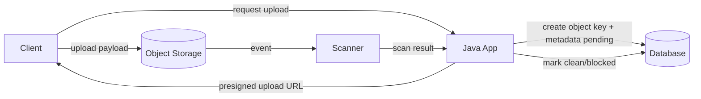

Metadata di DB:

- `object_key`
- `file_name`
- `content_type`
- `size_bytes`
- `sha256`
- `status`
- `owner_id`
- `created_at`
- `scan_status`
- `version`

Payload di object storage.

Keuntungan:

- DB transaction tetap pendek;
- file delivery tidak melewati DB;
- object lifecycle bisa dikendalikan;
- scanning bisa async;
- metadata tetap queryable;
- authorization tetap bisa dikelola oleh aplikasi.

---

## 4. Anti-Mental Model: "BLOB = File System di Database"

BLOB bukan file system.

Database tidak otomatis menjadi tempat terbaik untuk file hanya karena ada tipe `BLOB`.

Masalah umum jika database dipakai sebagai file store tanpa desain:

- backup membengkak;
- restore lambat;
- replication lag;
- query cache/page cache terganggu;
- table bloat;
- vacuum/cleanup cost;
- transaction log/WAL/binlog besar;
- connection ditahan selama transfer;
- pool exhaustion ketika banyak download besar;
- aplikasi gagal karena heap penuh.

Rule:

> Simpan large object di database hanya jika ada alasan consistency, atomicity, governance, atau operational simplicity yang lebih kuat daripada cost-nya.

---

## 5. Writing Binary Data: Bad, Better, Safer

### 5.1 Bad: Load Entire File into `byte[]`

```java
byte[] bytes = Files.readAllBytes(path);

try (Connection connection = dataSource.getConnection();
     PreparedStatement ps = connection.prepareStatement("""
         insert into document_file(id, file_name, content_type, payload)
         values (?, ?, ?, ?)
         """)) {

    ps.setObject(1, documentId);
    ps.setString(2, fileName);
    ps.setString(3, contentType);
    ps.setBytes(4, bytes);
    ps.executeUpdate();
}
```

Ini mungkin acceptable untuk file kecil dan limit ketat. Tetapi sebagai default production pattern, ini berbahaya.

Problem:

- payload masuk heap penuh;
- GC pressure tinggi;
- concurrent upload memperbanyak duplikasi byte array;
- tidak ada backpressure natural selain memory collapse;
- upload besar bisa membunuh service.

### 5.2 Better: `setBinaryStream` dengan Length

```java
public void insertDocumentFile(
        DataSource dataSource,
        UUID documentId,
        String fileName,
        String contentType,
        Path filePath
) throws SQLException, IOException {

    long size = Files.size(filePath);

    try (InputStream input = Files.newInputStream(filePath);
         Connection connection = dataSource.getConnection();
         PreparedStatement ps = connection.prepareStatement("""
             insert into document_file(id, file_name, content_type, size_bytes, payload)
             values (?, ?, ?, ?, ?)
             """)) {

        ps.setObject(1, documentId);
        ps.setString(2, fileName);
        ps.setString(3, contentType);
        ps.setLong(4, size);
        ps.setBinaryStream(5, input, size);

        int updated = ps.executeUpdate();
        if (updated != 1) {
            throw new IllegalStateException("Expected exactly one inserted row, got " + updated);
        }
    }
}
```

Keuntungan:

- heap tidak perlu menampung seluruh payload;
- API memberi driver informasi length;
- lebih friendly untuk transfer besar;
- lebih mudah dipasangi validation size.

Tetapi tetap ada trade-off:

- connection ditahan sepanjang stream dikirim;
- transaction log bisa besar;
- database session sibuk;
- query/statement timeout harus sesuai;
- request timeout harus tidak lebih pendek dari write path tanpa desain cleanup.

### 5.3 Safer: Validate Before Opening Transaction

Jangan buka connection/transaction sebelum validasi murah selesai.

```java
public void insertDocumentFile(
        DataSource dataSource,
        UUID documentId,
        String fileName,
        String contentType,
        Path filePath
) throws SQLException, IOException {

    long size = Files.size(filePath);
    validateFileName(fileName);
    validateContentType(contentType);
    validateMaxSize(size, 10 * 1024 * 1024L); // 10 MiB example limit

    String sha256 = sha256Hex(filePath);

    try (InputStream input = Files.newInputStream(filePath);
         Connection connection = dataSource.getConnection()) {

        connection.setAutoCommit(false);

        try (PreparedStatement ps = connection.prepareStatement("""
             insert into document_file(
                 id, file_name, content_type, size_bytes, sha256, payload
             ) values (?, ?, ?, ?, ?, ?)
             """)) {

            ps.setObject(1, documentId);
            ps.setString(2, fileName);
            ps.setString(3, contentType);
            ps.setLong(4, size);
            ps.setString(5, sha256);
            ps.setBinaryStream(6, input, size);
            ps.executeUpdate();

            connection.commit();
        } catch (Throwable t) {
            rollbackQuietly(connection, t);
            throw t;
        }
    }
}
```

Important subtlety:

- hash computation sebelum transaction memperpendek transaction;
- validation sebelum connection borrow mengurangi pool hold time;
- `InputStream` dibuat tepat sebelum execute;
- rollback tetap dibutuhkan karena manual transaction.

---

## 6. Writing Text Data: `String` vs `Reader` vs `Clob`

### 6.1 Small Text

Untuk text kecil/menengah yang bounded, `setString` biasanya cukup.

```java
ps.setString(1, commentBody);
```

Tetapi "bounded" harus nyata:

- ada column constraint;
- ada validation;
- ada API request size limit;
- ada test untuk large input.

### 6.2 Large Text

Untuk text besar:

```java
try (Reader reader = Files.newBufferedReader(path, StandardCharsets.UTF_8);
     Connection connection = dataSource.getConnection();
     PreparedStatement ps = connection.prepareStatement("""
         insert into report_body(id, body)
         values (?, ?)
         """)) {

    long charCount = countCharacters(path, StandardCharsets.UTF_8);

    ps.setObject(1, reportId);
    ps.setCharacterStream(2, reader, charCount);
    ps.executeUpdate();
}
```

Catatan penting:

- byte length dan character length tidak sama untuk UTF-8;
- `setCharacterStream(..., length)` memakai jumlah character, bukan byte;
- menghitung character bisa mahal;
- beberapa driver punya behavior berbeda untuk overload tanpa length.

Untuk payload text sangat besar, pertimbangkan menyimpan sebagai object storage, bukan CLOB.

---

## 7. Reading Binary Data: Avoid `getBytes()` for Large Payload

### 7.1 Bad: `getBytes()` untuk File Besar

```java
byte[] payload = rs.getBytes("payload");
```

Problem:

- seluruh payload masuk heap;
- response besar memperparah GC;
- satu request bisa memakai ratusan MB;
- concurrent download bisa menumbangkan service.

### 7.2 Better: `getBinaryStream()`

```java
public void streamDocumentFile(
        DataSource dataSource,
        UUID documentId,
        OutputStream output
) throws SQLException, IOException {

    try (Connection connection = dataSource.getConnection();
         PreparedStatement ps = connection.prepareStatement("""
             select payload
             from document_file
             where id = ?
             """)) {

        ps.setObject(1, documentId);

        try (ResultSet rs = ps.executeQuery()) {
            if (!rs.next()) {
                throw new NoSuchElementException("Document file not found: " + documentId);
            }

            try (InputStream input = rs.getBinaryStream("payload")) {
                input.transferTo(output);
            }
        }
    }
}
```

Ini menghindari byte array raksasa, tetapi tetap ada consequence penting:

- connection ditahan selama output ditulis;
- jika client lambat, DB connection ikut tertahan;
- jika response streaming langsung ke HTTP client, slow client bisa menyebabkan pool exhaustion.

### 7.3 Better for Web Download: Decouple DB Read from Slow Client Carefully

Ada trade-off.

Option A: stream langsung DB → HTTP response.

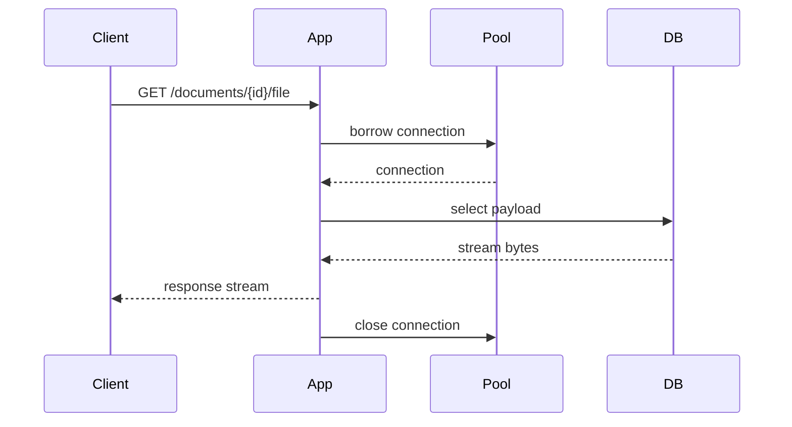

Kelebihan:

- memory rendah;
- simple.

Risiko:

- client lambat menahan DB connection;
- pool bisa habis jika banyak download;
- timeout harus end-to-end.

Option B: DB → bounded temp file → HTTP response.

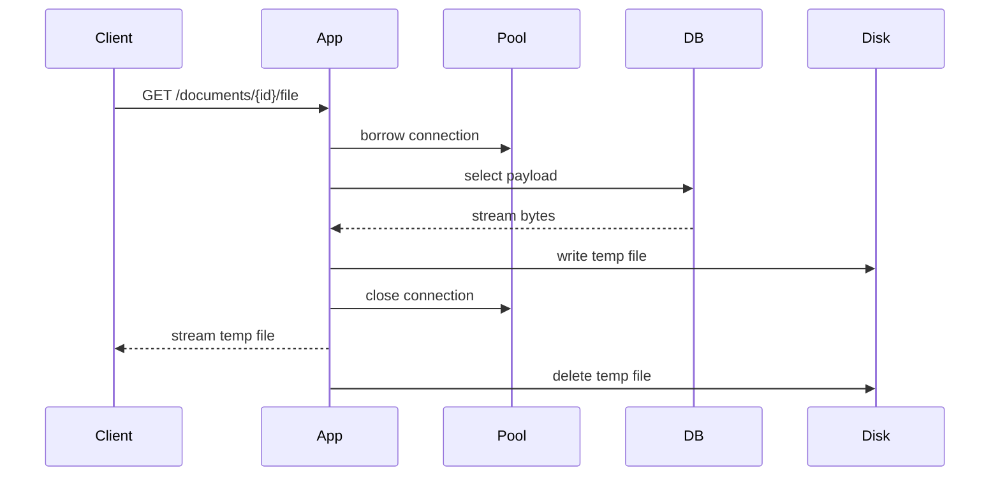

Kelebihan:

- DB connection dilepas sebelum client download selesai;
- lebih tahan slow client.

Risiko:

- butuh disk space;
- cleanup harus kuat;
- latency awal lebih besar;
- temp file security.

Option C: payload di object storage.

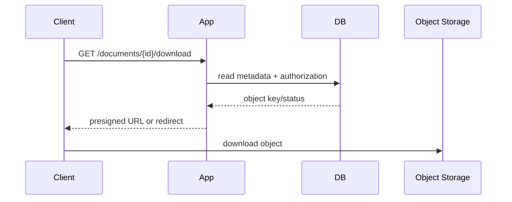

Kelebihan:

- DB tidak menanggung transfer payload;
- app tidak menjadi file proxy;
- CDN/presigned URL bisa dipakai.

Risiko:

- consistency antara DB dan object storage harus didesain;
- cleanup orphan object;
- access control harus hati-hati.

---

## 8. Transaction Duration and Connection Hold Time

LOB operation sering bermasalah bukan karena query-nya kompleks, tetapi karena **durasi transfer**.

Database connection ditahan sejak:

```txt
connection borrowed
```

sampai:

```txt
result consumed + statement closed + connection closed
```

Untuk streaming read, `ResultSet` dan `InputStream` biasanya bergantung pada statement/connection yang masih hidup. Jadi connection tidak boleh ditutup sebelum stream selesai dibaca.

```mermaid
gantt
    title LOB Read Holds Connection
    dateFormat X
    axisFormat %s

    section App
    Borrow connection      :a1, 0, 1
    Execute select         :a2, 1, 2
    Stream payload         :a3, 2, 12
    Close resources        :a4, 12, 13

    section Pool
    Connection unavailable :p1, 0, 13
```

Akibat:

- 10 concurrent download besar bisa memakai 10 pool connection selama puluhan detik;
- OLTP request kecil bisa menunggu pool;
- `connectionTimeout` naik;
- thread request menumpuk;
- cascading failure terjadi padahal database CPU rendah.

Rule:

> Untuk operasi LOB besar, ukur **connection hold time**, bukan hanya query execution time.

---

## 9. API Design: Do Not Return `InputStream` from DAO Casually

Anti-pattern:

```java
public InputStream findPayload(UUID id) throws SQLException {
    Connection connection = dataSource.getConnection();
    PreparedStatement ps = connection.prepareStatement("select payload from file where id = ?");
    ps.setObject(1, id);
    ResultSet rs = ps.executeQuery();
    rs.next();
    return rs.getBinaryStream("payload");
}
```

Ini sangat berbahaya.

Problem:

- siapa yang menutup `ResultSet`?
- siapa yang menutup `PreparedStatement`?
- siapa yang mengembalikan `Connection` ke pool?
- apa yang terjadi jika caller lupa close stream?
- bagaimana jika caller membaca stream setelah DAO method selesai?
- bagaimana mengukur connection hold time?

### 9.1 Safer Pattern: Consumer Callback

```java
public void withPayloadStream(
        UUID id,
        ThrowingConsumer<InputStream> consumer
) throws SQLException, IOException {

    try (Connection connection = dataSource.getConnection();
         PreparedStatement ps = connection.prepareStatement("""
             select payload
             from document_file
             where id = ?
             """)) {

        ps.setObject(1, id);

        try (ResultSet rs = ps.executeQuery()) {
            if (!rs.next()) {
                throw new NoSuchElementException("Document not found: " + id);
            }

            try (InputStream input = rs.getBinaryStream("payload")) {
                consumer.accept(input);
            }
        }
    }
}

@FunctionalInterface
public interface ThrowingConsumer<T> {
    void accept(T value) throws SQLException, IOException;
}
```

Keuntungan:

- ownership resource jelas;
- connection close tetap di method yang borrow;
- caller tidak bisa menyimpan stream tanpa sadar;
- instrumentation bisa mengukur durasi consumer.

### 9.2 Alternative: Return Materialized Bounded Value

Untuk file kecil:

```java
public byte[] findSmallPayload(UUID id) throws SQLException {
    try (Connection connection = dataSource.getConnection();
         PreparedStatement ps = connection.prepareStatement("""
             select payload
             from small_document_file
             where id = ?
             """)) {

        ps.setObject(1, id);

        try (ResultSet rs = ps.executeQuery()) {
            if (!rs.next()) {
                throw new NoSuchElementException("File not found: " + id);
            }
            return rs.getBytes("payload");
        }
    }
}
```

Syarat:

- ukuran benar-benar bounded;
- enforce di schema/app;
- ada limit maksimal;
- tidak dipakai untuk arbitrary upload.

---

## 10. Streaming Upload in HTTP Applications

Skenario umum:

```txt
HTTP multipart upload -> Java app -> JDBC BLOB column
```

Risiko utamanya:

- request body besar;
- multipart framework bisa buffer ke memory/disk;
- app membuka DB connection terlalu awal;
- client lambat menahan DB connection;
- upload gagal di tengah;
- transaction dibiarkan menggantung;
- timeout antara proxy/app/DB tidak selaras.

### 10.1 Bad Flow

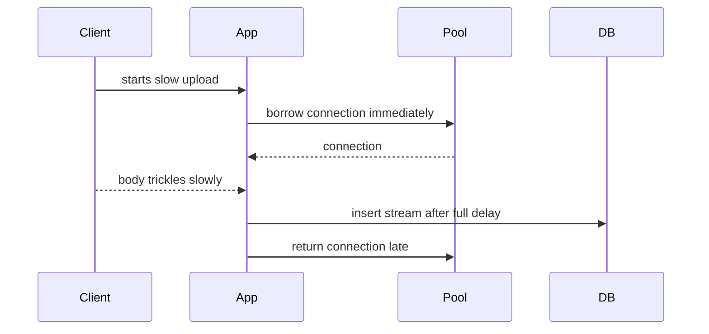

Masalah: connection dipinjam terlalu awal.

### 10.2 Better Flow

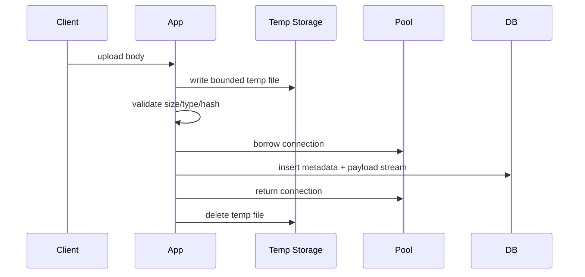

Kelebihan:

- slow client tidak menahan DB connection;
- validation bisa dilakukan sebelum transaction;
- retry/cleanup lebih jelas;
- size limit bisa ditegakkan.

Trade-off:

- perlu temp storage;
- perlu cleanup;
- ada double IO.

Untuk file besar, flow object storage biasanya lebih baik.

---

## 11. LOB and Auto-Commit

Jangan gunakan auto-commit secara asal untuk LOB write besar.

Dengan auto-commit true, setiap statement menjadi transaction sendiri. Untuk single insert BLOB, ini tampak sederhana. Tetapi failure semantics tetap perlu dipahami:

- jika stream gagal sebelum execute selesai, insert gagal;
- jika network gagal setelah DB commit tetapi sebelum app menerima success, status commit ambiguous;
- jika metadata dan payload butuh atomicity, gabungkan dalam satu transaction;
- jika ada side effect lain, jangan letakkan external call di tengah transaction.

Pattern:

```java
connection.setAutoCommit(false);
try {
    insertMetadata(...);
    insertPayloadStream(...);
    insertAuditEvent(...);
    connection.commit();
} catch (Throwable t) {
    rollbackQuietly(connection, t);
    throw t;
}
```

Tetapi jangan membuat transaction lebih panjang dari perlu. Precompute hash, validate file, scan preliminary metadata, dan prepare temp file sebelum borrow connection.

---

## 12. Chunking: When One LOB Row Is Not Enough

Kadang payload besar perlu dipecah menjadi chunks.

Schema contoh:

```sql
create table file_object (
    id uuid primary key,
    file_name varchar(255) not null,
    content_type varchar(255) not null,
    size_bytes bigint not null,
    sha256 varchar(64) not null,
    status varchar(32) not null,
    created_at timestamp not null
);

create table file_object_chunk (
    file_id uuid not null references file_object(id),
    chunk_index integer not null,
    payload bytea not null,
    primary key (file_id, chunk_index)
);
```

Keuntungan chunking:

- retry partial upload lebih mungkin;
- memory per chunk bounded;
- bisa resume;
- bisa parallelize pada storage tertentu;
- transaction per chunk lebih pendek.

Risiko:

- complexity lebih tinggi;
- reconstruct order harus benar;
- partial state harus dikelola;
- cleanup incomplete upload;
- integrity hash wajib.

Jangan membuat chunking custom kecuali benar-benar diperlukan. Untuk banyak kasus, object storage multipart upload sudah menyelesaikan masalah ini lebih baik.

---

## 13. Integrity: Size, Hash, and Content Validation

Large payload tanpa integrity metadata adalah bom waktu.

Minimal metadata:

```sql
size_bytes bigint not null,
sha256 char(64) not null,
content_type varchar(255) not null,
original_file_name varchar(255) not null
```

### 13.1 Validate Size

```java
private static void validateMaxSize(long size, long maxSize) {
    if (size < 0) {
        throw new IllegalArgumentException("Invalid negative size");
    }
    if (size > maxSize) {
        throw new IllegalArgumentException("File too large: " + size);
    }
}
```

### 13.2 Compute Hash While Streaming

Untuk menghindari membaca file dua kali, bisa pakai `DigestInputStream`.

```java
MessageDigest digest = MessageDigest.getInstance("SHA-256");
try (InputStream raw = Files.newInputStream(path);
     DigestInputStream input = new DigestInputStream(raw, digest)) {

    // Pass input into JDBC setBinaryStream or copy to temp destination.
}
byte[] hash = digest.digest();
```

Namun hati-hati: jika driver membaca stream saat `executeUpdate()`, digest baru final setelah execute selesai. Jika hash harus masuk row yang sama, lebih mudah precompute hash sebelum insert, atau gunakan staging state.

Pattern staging:

1. insert metadata dengan status `UPLOADING`;
2. stream payload;
3. update hash/status `READY` setelah sukses;
4. cleanup jika gagal.

---

## 14. Security: Large Payload Is an Attack Surface

LOB path sering menjadi attack surface:

- decompression bomb;
- oversized upload;
- malicious PDF/image;
- filename path traversal;
- content type spoofing;
- malware upload;
- PII leakage;
- unauthorized download;
- resource exhaustion via slow upload/download.

Checklist:

| Concern | Control |
|---|---|
| Size abuse | request size limit + app validation + schema max expectation |
| Slow upload | proxy/app read timeout |
| Slow download | response timeout + separate pool/object storage |
| Filename attack | store original safely, never use as path directly |
| Content type spoof | sniff/validate content when needed |
| Malware | scanning workflow |
| Unauthorized access | metadata authorization before payload access |
| PII | encryption/audit/data retention |
| DoS | rate limit + quota + bounded temp storage |

---

## 15. Observability for LOB Operations

LOB operation harus punya metrics berbeda dari query OLTP biasa.

Metrics yang penting:

- upload size histogram;
- download size histogram;
- DB connection hold time;
- stream read/write duration;
- bytes transferred;
- temp storage usage;
- failed stream count;
- client abort count;
- pool active connections during LOB;
- pending connection count;
- large-object transaction duration;
- object storage orphan count jika hybrid.

Log structured minimal:

```json
{
  "event": "document_file_downloaded",
  "document_id": "...",
  "size_bytes": 7340032,
  "duration_ms": 4210,
  "db_connection_hold_ms": 4190,
  "storage": "database_blob",
  "request_id": "..."
}
```

Untuk upload:

```json
{
  "event": "document_file_uploaded",
  "document_id": "...",
  "size_bytes": 10485760,
  "sha256": "...",
  "db_write_ms": 1830,
  "validation_ms": 210,
  "request_id": "..."
}
```

Tanpa metrics ini, incident hanya terlihat sebagai:

```txt
HikariPool-1 - Connection is not available, request timed out
```

Padahal root cause bisa berupa client download lambat.

---

## 16. Pool Isolation for LOB Workload

Untuk workload campuran, pisahkan pool.

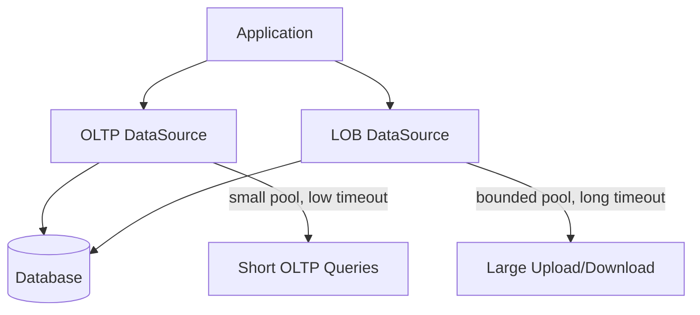

Mengapa?

- download besar tidak menghabiskan pool OLTP;
- timeout bisa beda;
- metrics lebih jelas;
- alert bisa spesifik;
- blast radius mengecil.

Contoh:

```properties
app.datasource.oltp.maximumPoolSize=16
app.datasource.oltp.connectionTimeout=250

app.datasource.lob.maximumPoolSize=4
app.datasource.lob.connectionTimeout=1000
```

Angka di atas hanya ilustrasi. Sizing harus mengikuti workload dan DB capacity.

---

## 17. Driver-Specific Behavior

JDBC API menyediakan abstraction, tetapi LOB behavior bisa sangat driver-specific.

Yang harus diuji pada driver/database nyata:

- apakah `setBinaryStream` benar-benar streaming atau buffering;
- apakah length wajib untuk streaming optimal;
- apakah `getBinaryStream` menahan cursor/server resource;
- apakah auto-commit mempengaruhi streaming;
- apakah fetch size relevan untuk LOB;
- apakah BLOB locator valid setelah transaction commit;
- apakah `Blob#free()` diperlukan/berguna;
- apakah query timeout berlaku saat stream transfer;
- bagaimana behavior saat client abort.

Rule:

> Untuk LOB, jangan percaya H2/in-memory test sebagai bukti production behavior.

Gunakan database dan driver target via integration test/Testcontainers.

---

## 18. `Blob`/`Clob` Object Lifecycle

`Blob` dan `Clob` bukan sekadar wrapper value biasa. Mereka bisa merepresentasikan locator/resource database.

Pattern aman:

```java
try (Connection connection = dataSource.getConnection();
     PreparedStatement ps = connection.prepareStatement("""
         select payload
         from document_file
         where id = ?
         """)) {

    ps.setObject(1, id);

    try (ResultSet rs = ps.executeQuery()) {
        if (!rs.next()) {
            throw new NoSuchElementException();
        }

        Blob blob = rs.getBlob("payload");
        try (InputStream input = blob.getBinaryStream()) {
            input.transferTo(output);
        } finally {
            blob.free();
        }
    }
}
```

Tetapi sering kali `getBinaryStream()` langsung lebih sederhana:

```java
try (InputStream input = rs.getBinaryStream("payload")) {
    input.transferTo(output);
}
```

Gunakan `Blob`/`Clob` jika ada alasan spesifik:

- API driver/database memerlukannya;
- butuh partial access;
- butuh metadata LOB;
- butuh explicit free.

Jika tidak, stream API biasanya lebih clean.

---

## 19. Timeout Design for LOB

Timeout LOB harus berbeda dari OLTP query kecil.

Layer timeout:

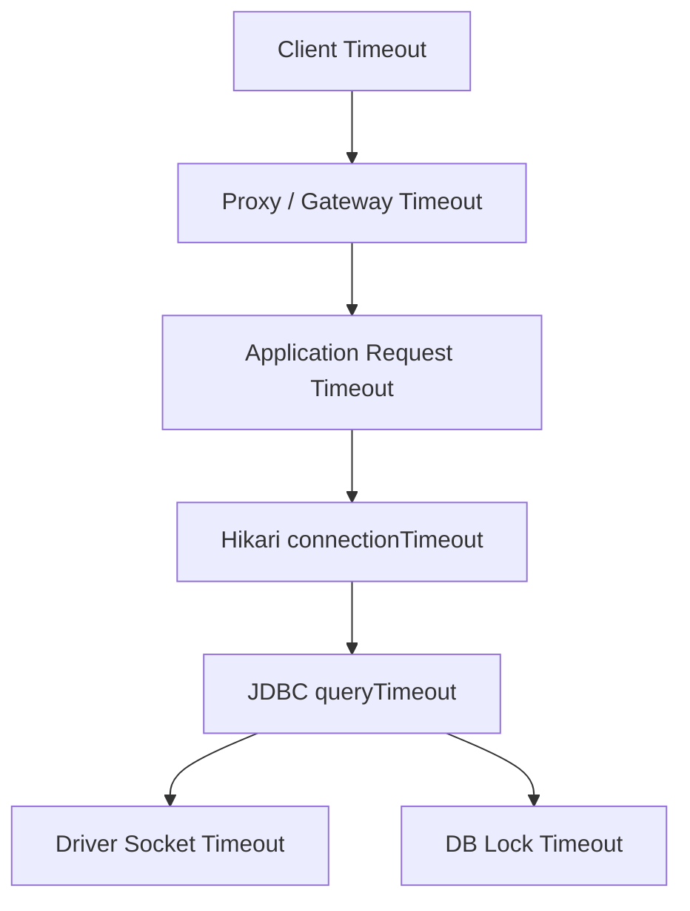

Untuk LOB:

- pool acquisition timeout sebaiknya tetap relatif pendek;
- stream transfer timeout harus mempertimbangkan size dan bandwidth;
- query timeout tidak selalu mencakup seluruh stream consumption secara identik di semua driver;
- client/proxy timeout harus lebih besar daripada expected transfer;
- jangan membuat OLTP timeout ikut longgar karena LOB.

Anti-pattern:

```txt
Karena upload file sering timeout, semua timeout aplikasi dinaikkan menjadi 5 menit.
```

Konsekuensi:

- request stuck bertahan lama;
- thread pool penuh;
- DB connection tertahan;
- failure detection lambat;
- cascading failure lebih parah.

Solusi yang lebih sehat:

- pisahkan endpoint/pool;
- gunakan object storage direct upload;
- gunakan async processing;
- enforce max size;
- desain resumable upload jika perlu.

---

## 20. Failure Modes

### 20.1 Stream Fails Mid-Write

Kemungkinan:

- client disconnect;
- temp file read error;
- DB connection reset;
- socket timeout;
- disk issue;
- payload exceeds DB limit.

Response:

- rollback transaction;
- mark upload failed jika metadata sudah dibuat;
- cleanup temp file/object;
- emit metric/log;
- do not retry blindly unless idempotency exists.

### 20.2 Commit Ambiguous After LOB Write

Kasus:

```txt
executeUpdate sukses, commit dikirim, network putus sebelum app menerima response.
```

App tidak tahu apakah DB commit berhasil.

Mitigation:

- use deterministic ID;
- unique key/idempotency key;
- hash metadata;
- read-after-failure reconciliation;
- avoid duplicate insert with generated random ID only on server side.

### 20.3 Client Abort During Download

Jika streaming DB → HTTP langsung:

- output stream throws IOException;
- app harus close JDBC resources;
- connection harus return ke pool;
- metric client abort harus dicatat;
- jangan log sebagai DB corruption.

### 20.4 Pool Exhaustion During Download Spike

Signal:

- active connections naik;
- pending threads naik;
- DB CPU tidak selalu naik;
- query latency OLTP naik karena wait pool;
- HTTP request small endpoints ikut timeout.

Mitigation:

- separate LOB pool;
- object storage redirect;
- rate limit download;
- cap concurrent downloads;
- temp-file decoupling;
- backpressure.

---

## 21. Implementation Pattern: Database LOB Repository

Contoh repository yang lebih production-minded.

```java
public final class DocumentFileRepository {
    private final DataSource dataSource;
    private final long maxSizeBytes;

    public DocumentFileRepository(DataSource dataSource, long maxSizeBytes) {
        this.dataSource = Objects.requireNonNull(dataSource);
        this.maxSizeBytes = maxSizeBytes;
    }

    public void insert(DocumentFileUpload upload) throws SQLException, IOException {
        validate(upload);

        try (InputStream input = upload.openStream();
             Connection connection = dataSource.getConnection()) {

            connection.setAutoCommit(false);

            try (PreparedStatement ps = connection.prepareStatement("""
                insert into document_file(
                    id,
                    owner_id,
                    file_name,
                    content_type,
                    size_bytes,
                    sha256,
                    payload,
                    created_at
                ) values (?, ?, ?, ?, ?, ?, ?, current_timestamp)
                """)) {

                ps.setObject(1, upload.id());
                ps.setObject(2, upload.ownerId());
                ps.setString(3, upload.fileName());
                ps.setString(4, upload.contentType());
                ps.setLong(5, upload.sizeBytes());
                ps.setString(6, upload.sha256Hex());
                ps.setBinaryStream(7, input, upload.sizeBytes());

                int updated = ps.executeUpdate();
                if (updated != 1) {
                    throw new IllegalStateException("Expected one inserted document file, got " + updated);
                }

                connection.commit();
            } catch (Throwable t) {
                rollbackQuietly(connection, t);
                throw t;
            }
        }
    }

    public void streamPayload(UUID id, OutputStream output) throws SQLException, IOException {
        long startNanos = System.nanoTime();

        try (Connection connection = dataSource.getConnection();
             PreparedStatement ps = connection.prepareStatement("""
                 select payload
                 from document_file
                 where id = ?
                 """)) {

            ps.setObject(1, id);

            try (ResultSet rs = ps.executeQuery()) {
                if (!rs.next()) {
                    throw new NoSuchElementException("Document file not found: " + id);
                }

                try (InputStream input = rs.getBinaryStream("payload")) {
                    input.transferTo(output);
                }
            }
        } finally {
            long elapsedMs = TimeUnit.NANOSECONDS.toMillis(System.nanoTime() - startNanos);
            // record metric: document_file.stream.duration
        }
    }

    private void validate(DocumentFileUpload upload) {
        if (upload.sizeBytes() < 0 || upload.sizeBytes() > maxSizeBytes) {
            throw new IllegalArgumentException("Invalid file size: " + upload.sizeBytes());
        }
        if (upload.fileName() == null || upload.fileName().isBlank()) {
            throw new IllegalArgumentException("File name is required");
        }
        if (upload.contentType() == null || upload.contentType().isBlank()) {
            throw new IllegalArgumentException("Content type is required");
        }
        if (upload.sha256Hex() == null || upload.sha256Hex().length() != 64) {
            throw new IllegalArgumentException("Invalid SHA-256");
        }
    }

    private static void rollbackQuietly(Connection connection, Throwable original) {
        try {
            connection.rollback();
        } catch (SQLException rollbackFailure) {
            original.addSuppressed(rollbackFailure);
        }
    }
}
```

Model input:

```java
public record DocumentFileUpload(
        UUID id,
        UUID ownerId,
        String fileName,
        String contentType,
        long sizeBytes,
        String sha256Hex,
        ThrowingSupplier<InputStream> streamSupplier
) {
    public InputStream openStream() throws IOException {
        return streamSupplier.get();
    }
}

@FunctionalInterface
public interface ThrowingSupplier<T> {
    T get() throws IOException;
}
```

Design notes:

- repository tidak menerima `byte[]` untuk arbitrary upload;
- stream supplier membuat ownership lebih eksplisit;
- validasi sebelum borrow connection;
- connection hold time bisa diukur;
- generated ID dari caller mendukung idempotency;
- hash disimpan untuk integrity/reconciliation.

---

## 22. Object Storage Pattern with Transactional Metadata

Untuk file besar, pattern ini sering lebih baik.

### 22.1 Tables

```sql
create table document_object (
    id uuid primary key,
    owner_id uuid not null,
    object_key varchar(1024) not null unique,
    file_name varchar(255) not null,
    content_type varchar(255) not null,
    size_bytes bigint not null,
    sha256 char(64),
    status varchar(32) not null,
    created_at timestamp not null,
    completed_at timestamp
);
```

Status:

```txt
PENDING_UPLOAD -> UPLOADED -> SCANNED_CLEAN -> READY
                             -> SCANNED_BLOCKED
                             -> EXPIRED
```

### 22.2 Flow

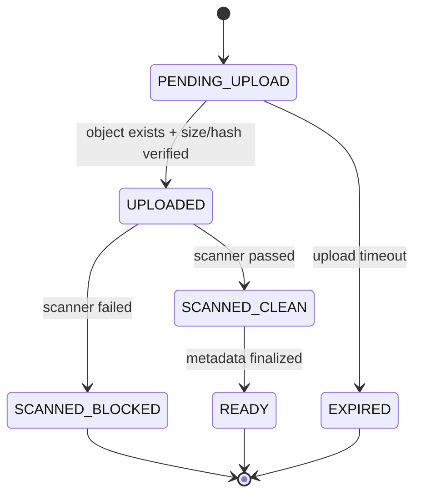

### 22.3 Consistency Problem

Database transaction cannot atomically commit together with object storage write unless you introduce distributed transaction-like complexity. Usually we do not.

Instead, design reconciliation:

- DB row pending but object missing → expire row;
- object exists but DB row missing → delete orphan;
- DB says uploaded but scan missing → reschedule scan;
- hash mismatch → block object;
- ready object but owner deleted → lifecycle cleanup.

This is a workflow, not a single transaction.

---

## 23. Testing Strategy

### 23.1 Unit Tests

Test:

- size validation;
- content type validation;
- filename sanitization;
- hash validation;
- status transitions;
- cleanup logic.

### 23.2 Integration Tests with Real DB

Test with target DB/driver:

- insert using `setBinaryStream`;
- read using `getBinaryStream`;
- large payload above normal size;
- rollback after failed stream;
- connection close after client abort simulation;
- transaction timeout behavior;
- statement timeout behavior;
- pool exhaustion with concurrent streaming;
- memory usage does not scale with file size.

### 23.3 Heap Safety Test

Pseudo-test:

```java
@Test
void streamingDownloadDoesNotMaterializeEntirePayload() {
    // Use a large payload, bounded heap, and measure memory before/after.
    // This is not a perfect unit test, but useful as regression guard.
}
```

Better: run performance/integration profile with heap cap:

```bash
java -Xmx256m -jar app.jar
```

Then test several concurrent large downloads.

---

## 24. Code Review Checklist

For every JDBC LOB change, ask:

- Is the payload size bounded?
- Is validation done before borrowing connection?
- Are streams closed deterministically?
- Does the DAO leak `InputStream` ownership?
- Is connection hold time measured?
- Is direct DB → HTTP streaming acceptable for slow clients?
- Should this use object storage instead?
- Does this operation need a separate pool?
- Is the transaction duration bounded?
- Are hash/size/content type stored?
- Is there cleanup for partial failure?
- Are retries idempotent?
- Are timeouts configured per layer?
- Is this tested with the real database driver?

---

## 25. Anti-Patterns Catalog

### 25.1 `Files.readAllBytes()` for User Upload

Bad because memory scales with file size and concurrency.

### 25.2 Returning `InputStream` from DAO Without Resource Ownership

Bad because connection/result set/statement lifecycle becomes unclear.

### 25.3 Streaming DB BLOB Directly to Slow HTTP Clients Using OLTP Pool

Bad because slow clients consume database connections.

### 25.4 Storing Large Videos in OLTP Database

Usually bad because database is not CDN/object storage.

### 25.5 No Size Limit

Bad because attacker/user can force resource exhaustion.

### 25.6 No Hash

Bad because reconciliation and integrity checks become weak.

### 25.7 Long Transaction Including Upload from Client

Bad because client network speed controls DB transaction duration.

### 25.8 Testing Only with H2

Bad because driver-specific LOB behavior matters.

### 25.9 Using One Pool for Everything

Bad because large transfer can starve normal OLTP requests.

### 25.10 Treating LOB Timeout as Query Timeout Only

Bad because stream transfer, client timeout, socket timeout, pool timeout, and lock timeout are different.

---

## 26. Production Incident Playbook

Symptom:

```txt
Connection is not available, request timed out after 30000ms
```

Ask:

1. Did active connections rise?
2. Did pending threads rise?
3. Did DB CPU rise?
4. Are many active requests file download/upload endpoints?
5. Are clients slow?
6. Is average connection hold time high?
7. Are query durations high or stream durations high?
8. Did a recent release switch from object storage to DB BLOB?
9. Did file size distribution change?
10. Are response aborts increasing?

Decision tree:

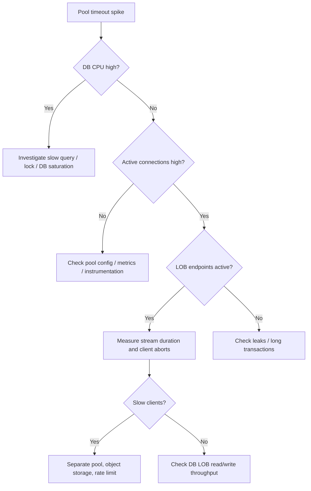

Immediate mitigations:

- rate-limit LOB endpoints;
- reduce concurrent LOB operations;
- temporarily route downloads to object storage if available;
- increase pool only if DB can handle it and root cause is verified;
- kill pathological sessions if safe;
- rollback bad release if behavior changed.

Long-term fixes:

- separate LOB pool;
- object storage pattern;
- bounded upload size;
- temp file decoupling;
- better metrics;
- connection hold-time alerting.

---

## 27. Practice Exercises

### Exercise 1 — Refactor Unsafe Upload

Given this code:

```java
byte[] bytes = multipartFile.getBytes();
ps.setBytes(1, bytes);
```

Refactor to:

- enforce max size;
- avoid materializing arbitrary file;
- use stream binding;
- store sha256;
- use explicit transaction;
- measure DB write duration.

### Exercise 2 — Diagnose Pool Exhaustion

Scenario:

```txt
At 09:00, export/download endpoint traffic increased 4x.
OLTP endpoints started timing out.
DB CPU stayed below 35%.
Hikari active=max, pending increased.
```

Explain likely root cause and propose immediate/long-term fix.

Expected reasoning:

- DB not CPU-bound;
- active=max means connections held;
- download likely holds connection during streaming;
- slow clients or large payloads can starve pool;
- fix with separate LOB pool/object storage/rate limit.

### Exercise 3 — Design Object Storage Metadata Workflow

Design:

- table schema;
- statuses;
- upload flow;
- scanner flow;
- orphan cleanup;
- download authorization.

---

## 28. Key Takeaways

- LOB is data movement, not just a column type.
- `byte[]`/`String` are acceptable only for bounded payloads.
- Use stream/reader APIs for large data, but understand connection hold time.
- Streaming DB → HTTP directly can starve your pool when clients are slow.
- Database BLOB is not a general-purpose file storage replacement.
- Object storage + DB metadata is often the better production architecture.
- Validation should happen before borrowing connection when possible.
- Resource ownership must be explicit; do not casually return `InputStream` from DAO.
- Measure connection hold time, stream duration, and payload size distribution.
- Test LOB behavior with the real database and driver.

---

## 29. References

- Oracle Java SE 25 API — `PreparedStatement`
- Oracle Java SE 25 API — `ResultSet`
- Oracle Java SE 25 API — `Blob`
- Oracle Java SE 25 API — `Clob`
- HikariCP official repository and configuration documentation
- PostgreSQL/MySQL vendor documentation for large object and binary/text column behavior when applicable

---

## 30. Next

Part 028 akan membahas **Observability: Metrics, Logs, Traces, and Database Correlation**.

Kita akan mengubah JDBC dari black box menjadi sistem yang bisa diukur:

- pool metrics;
- query latency;
- transaction duration;
- connection hold time;
- slow query correlation;
- OpenTelemetry tracing;
- structured logging;
- incident dashboards;
- alert design.
