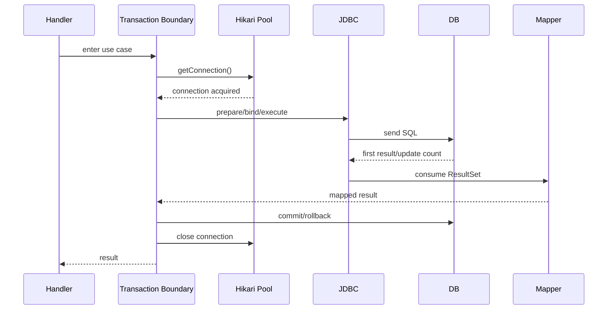
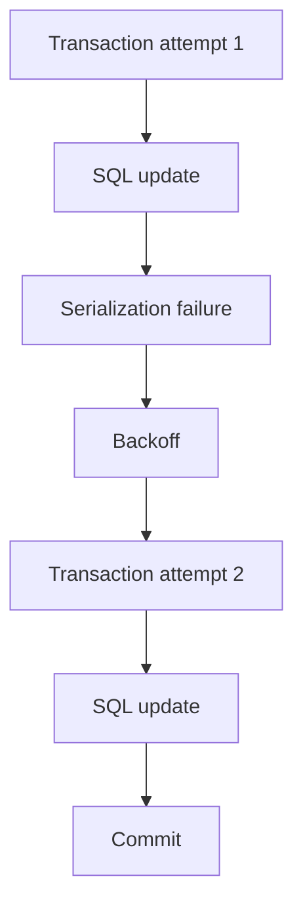
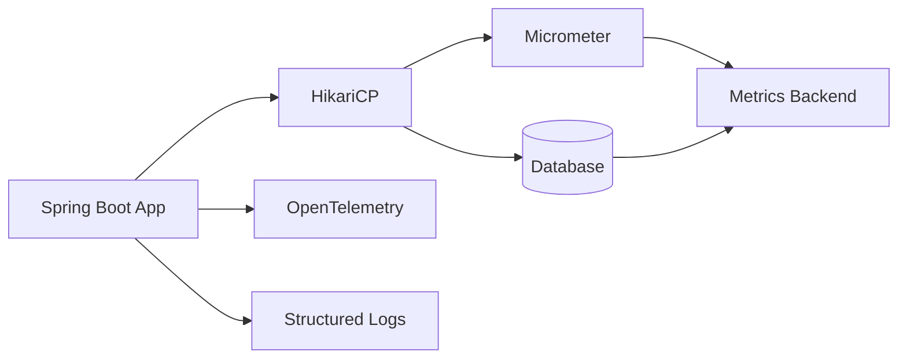

# Part 028 — Observability: Metrics, Logs, Traces, and Database Correlation

JDBC observability bukan sekadar menyalakan slow query log. Untuk sistem production, kita butuh kemampuan menjawab pertanyaan berikut dengan cepat:

- Apakah request lambat karena menunggu connection dari pool?
- Apakah connection sudah didapat tetapi query lambat?
- Apakah query cepat tetapi transaction terlalu lama?
- Apakah database CPU tinggi, lock tinggi, atau aplikasi menahan connection?
- Apakah timeout berasal dari Hikari, JDBC statement, socket, database lock, gateway, atau client?
- Apakah retry memperbaiki masalah atau memperburuk load?
- Endpoint mana yang menghabiskan pool?
- Tenant/user/workload mana yang menyebabkan connection hold time panjang?

Tanpa observability, JDBC adalah black box. Dengan observability yang benar, JDBC menjadi boundary yang bisa di-debug secara deterministic.

Target part ini: membangun observability model untuk JDBC/Hikari/database yang layak dipakai saat incident.

---

## 1. Kaufman Lens: Learn Enough to Self-Correct

Josh Kaufman menekankan belajar cukup untuk bisa mengoreksi diri. Dalam konteks JDBC, self-correction berarti:

- tahu metric apa yang membuktikan asumsi;
- tahu log apa yang kurang;
- tahu trace span mana yang harus ada;
- tahu korelasi mana yang harus dibuat antara app dan DB;
- tahu alert mana yang actionable dan mana yang noise.

Skill ini bukan "memasang dashboard". Skill ini adalah **mendesain evidence pipeline**.

Mental model:

```txt
User request
  -> application handler
  -> transaction boundary
  -> Hikari pool acquisition
  -> JDBC execution
  -> DB session/query/lock
  -> result processing
  -> connection return
  -> response
```

Observability harus bisa menunjukkan waktu dan failure di setiap tahap.

---

## 2. Three Pillars Are Not Enough Unless Correlated

Kita sering mendengar observability terdiri dari:

- metrics;
- logs;
- traces.

Benar, tetapi untuk JDBC, tiga hal ini harus dikorelasikan dengan:

- pool name;
- connection acquisition latency;
- SQL operation;
- transaction id/use-case;
- DB session/application name;
- trace id/request id;
- tenant/user/workload class;
- database slow query/lock information.

Tanpa korelasi, kita punya banyak data tetapi sedikit diagnosis.

---

## 3. The JDBC Latency Decomposition

Jangan mengukur "DB time" sebagai satu angka.

Pisahkan minimal:



Ukuran yang berbeda:

| Segment | Metric |
|---|---|
| request total | HTTP/RPC duration |
| pool wait | connection acquisition latency |
| query execution | statement execution duration |
| result consumption | result mapping/stream duration |
| transaction total | transaction duration |
| connection hold | time between borrow and close |
| commit/rollback | commit/rollback duration |

Poin penting:

> Query bisa cepat, tetapi connection hold time bisa panjang.

Contoh:

- query select BLOB cepat mengembalikan stream;
- HTTP client lambat membaca response;
- app tetap menahan connection;
- pool exhausted;
- slow query dashboard tampak normal.

---

## 4. HikariCP Metrics You Must Understand

HikariCP bisa mengekspos metrik melalui integration seperti Dropwizard metrics, Micrometer, atau JMX tergantung stack. Nama metric berbeda antar framework, tetapi konsepnya sama.

Core pool state:

| Concept | Arti |
|---|---|
| total connections | jumlah connection dalam pool |
| active connections | connection sedang dipinjam |
| idle connections | connection siap dipinjam |
| pending threads | thread menunggu connection |
| max pool size | batas connection pool |
| min idle | target idle minimum jika dikonfigurasi |

Core timing:

| Concept | Arti |
|---|---|
| connection acquisition time | waktu menunggu `getConnection()` |
| connection usage time | durasi connection dipinjam |
| connection creation time | waktu membuat physical connection |
| timeout count | jumlah gagal mendapat connection sebelum `connectionTimeout` |

### 4.1 Interpreting Pool Metrics

#### Case A — Active Max, Pending High, DB CPU High

Kemungkinan:

- DB saturated;
- queries slow;
- lock contention;
- missing index;
- too much concurrency.

#### Case B — Active Max, Pending High, DB CPU Low

Kemungkinan:

- connection leak;
- long transactions;
- slow client streaming;
- app code holds connection while doing non-DB work;
- external API call inside transaction;
- thread stuck after borrowing connection.

#### Case C — Total Connections Flapping

Kemungkinan:

- connection lifetime too short;
- database/network kills idle connections;
- pool repeatedly creates connections;
- `maxLifetime`/keepalive/socket config mismatch.

#### Case D — Idle High, Latency High

Kemungkinan:

- bottleneck bukan pool;
- app thread pool saturated;
- DB query slow after acquisition;
- CPU/GC/network bottleneck elsewhere.

---

## 5. The Most Important Custom Metric: Connection Hold Time

Hikari metrics memberi usage time, tetapi banyak organisasi tetap perlu custom instrumentation di transaction/use-case layer.

Connection hold time:

```txt
time from successful getConnection() to close()
```

Ini berbeda dari query time.

Contoh wrapper:

```java
public final class InstrumentedConnectionProvider {
    private final DataSource dataSource;
    private final MeterRegistry meterRegistry;

    public InstrumentedConnectionProvider(DataSource dataSource, MeterRegistry meterRegistry) {
        this.dataSource = dataSource;
        this.meterRegistry = meterRegistry;
    }

    public <T> T withConnection(String operation, SqlWork<T> work) throws SQLException {
        long acquireStart = System.nanoTime();

        try (Connection connection = dataSource.getConnection()) {
            long acquiredAt = System.nanoTime();
            recordTimer("jdbc.connection.acquire", operation, acquiredAt - acquireStart);

            try {
                return work.execute(connection);
            } finally {
                long finishedAt = System.nanoTime();
                recordTimer("jdbc.connection.hold", operation, finishedAt - acquiredAt);
            }
        }
    }

    private void recordTimer(String name, String operation, long nanos) {
        // meterRegistry.timer(name, "operation", operation).record(nanos, TimeUnit.NANOSECONDS);
    }
}

@FunctionalInterface
interface SqlWork<T> {
    T execute(Connection connection) throws SQLException;
}
```

Tagging warning:

- jangan tag dengan raw SQL;
- jangan tag dengan user id high cardinality;
- gunakan operation name stabil seperti `case.findById`, `document.download`, `outbox.poll`.

---

## 6. Query Timing: Where to Instrument

Kita bisa mengukur query di beberapa layer:

1. manual around `PreparedStatement#execute...`;
2. wrapper library/proxy DataSource;
3. Spring `JdbcTemplate` instrumentation;
4. OpenTelemetry Java agent/instrumentation;
5. database slow query log;
6. database native performance views.

### 6.1 Manual Timing Example

```java
long start = System.nanoTime();
try (PreparedStatement ps = connection.prepareStatement(sql)) {
    bind(ps, command);
    int updated = ps.executeUpdate();
    return updated;
} finally {
    long elapsed = System.nanoTime() - start;
    recordSqlTimer("case.close", elapsed);
}
```

Manual timing is simple but incomplete:

- tidak otomatis menangkap semua query;
- raw SQL logging bisa bocor data;
- sulit menjaga konsistensi.

### 6.2 DataSource Proxy Pattern

Beberapa organisasi membungkus `DataSource`/`Connection`/`Statement` untuk logging/timing.

Kelebihan:

- coverage luas;
- bisa record acquire/execute/commit/rollback;
- tidak perlu instrument setiap DAO.

Risiko:

- implementasi proxy JDBC bisa rumit;
- performance overhead;
- raw SQL/parameter leakage;
- incompatibility dengan driver/pool behavior.

Gunakan library matang jika perlu. Jangan menulis proxy JDBC custom besar tanpa alasan kuat.

---

## 7. Logging: What to Log and What Not to Log

Structured logs untuk JDBC harus menjawab "apa yang terjadi" tanpa membocorkan data sensitif.

### 7.1 Good SQL Operation Log

```json
{
  "event": "sql.operation.completed",
  "operation": "case.find_open_escalations",
  "db.system": "postgresql",
  "pool": "case-oltp",
  "duration_ms": 42,
  "rows": 18,
  "trace_id": "4bf92f3577b34da6a3ce929d0e0e4736",
  "request_id": "req-123",
  "success": true
}
```

### 7.2 Good Failure Log

```json
{
  "event": "sql.operation.failed",
  "operation": "case.assign_owner",
  "db.system": "postgresql",
  "pool": "case-oltp",
  "duration_ms": 312,
  "sql_state": "40001",
  "vendor_code": 0,
  "exception_class": "java.sql.SQLTransactionRollbackException",
  "retryable": true,
  "trace_id": "..."
}
```

### 7.3 Avoid

- full raw SQL with PII;
- parameter values containing names, emails, tokens, document text;
- logging every row;
- high-cardinality tags in metrics;
- stack trace for expected transient conflict at high volume;
- logging secrets from JDBC URL.

Rule:

> Log operation identity and failure classification, not sensitive payload.

---

## 8. SQL Identity: Stable Names Beat Raw SQL

Raw SQL changes often:

- whitespace;
- formatting;
- generated aliases;
- `IN` list size;
- dynamic predicates.

Better: assign stable operation names.

```java
public List<CaseEscalation> findOpenEscalations(UUID caseId) {
    return sql.observe("case.find_open_escalations", () -> {
        // JDBC code
    });
}
```

Metric:

```txt
jdbc.query.duration{operation="case.find_open_escalations", pool="case-oltp"}
```

Trace span:

```txt
name = SQL case.find_open_escalations
attributes:
  db.system = postgresql
  db.operation.name = case.find_open_escalations
  db.collection.name = case_escalation
```

This keeps cardinality bounded.

---

## 9. Trace Design for JDBC

Distributed trace should show:

```txt
HTTP request
  -> application service
    -> transaction
      -> pool acquisition
      -> SQL query/update
      -> commit
```

Example trace shape:

```mermaid
flowchart TD
    A[HTTP POST /cases/{id}/close]
    B[CaseCloseUseCase]
    C[Transaction case.close]
    D[Pool acquire case-oltp]
    E[SQL case.load_for_update]
    F[SQL case.update_status]
    G[SQL outbox.insert_event]
    H[Commit]

    A --> B --> C --> D --> E --> F --> G --> H
```

Span attributes worth keeping:

| Attribute | Example |
|---|---|
| `db.system` | `postgresql`, `mysql`, `oracle` |
| `db.name` / database identifier | logical DB name |
| `db.operation.name` | stable app operation |
| `db.query.summary` | `SELECT case by id`, not full PII SQL |
| `db.collection.name` | primary table if useful |
| `pool.name` | `case-oltp` |
| `transaction.name` | `case.close` |
| `sql.state` | on failure |
| `retry.attempt` | `0`, `1`, `2` |

Do not attach high-cardinality or sensitive attributes blindly.

---

## 10. Database Correlation: App Request to DB Session

The hardest production question:

> Which application request created this database session/query/lock?

Approaches:

### 10.1 Application Name / Session Tagging

Many databases support connection/session application name or session variables. The exact mechanism is vendor-specific.

Common metadata to tag:

- service name;
- instance/pod name;
- pool name;
- deployment version;
- environment;
- sometimes trace id for short-lived operations, if safe and supported.

Example concept:

```properties
ApplicationName=case-service
```

or driver-specific property.

Caution:

- changing session metadata per request can add overhead;
- session state must be reset in pooled connections;
- high cardinality in DB activity views can be noisy;
- avoid sensitive user/tenant values unless governance approves.

### 10.2 SQL Comments

Some systems add comments:

```sql
/* service=case-service operation=case.find_open_escalations trace=abc123 */
select ...
```

Benefits:

- visible in slow query logs;
- easier app/DB correlation.

Risks:

- SQL text cardinality can explode;
- plan cache behavior may be affected depending on DB/driver;
- trace IDs in SQL can bloat logs;
- PII leakage risk.

Use carefully. Often stable operation comments are safer than per-request comments.

```sql
/* operation=case.find_open_escalations */
select ...
```

---

## 11. Metrics Taxonomy

### 11.1 Pool Metrics

| Metric | Why It Matters |
|---|---|
| active connections | saturation/connection hold |
| idle connections | spare capacity |
| pending threads | pool wait pressure |
| total connections | pool growth/shrink |
| acquisition latency | user-facing latency due to pool |
| acquisition timeout count | failed backpressure |
| connection usage/hold time | leak/long transaction indicator |
| connection creation time | DB/network auth latency |

### 11.2 Query Metrics

| Metric | Why It Matters |
|---|---|
| query duration | slow SQL detection |
| rows returned | cardinality explosion |
| rows updated | optimistic/concurrency correctness |
| batch size | batch workload shape |
| failure count by SQLState | retry/failure classification |
| deadlock/serialization count | concurrency conflict |
| timeout count | overload/lock/query issue |

### 11.3 Transaction Metrics

| Metric | Why It Matters |
|---|---|
| transaction duration | long lock/resource hold |
| commit duration | replication/log/disk issue signal |
| rollback count | validation/conflict/failure volume |
| rollback duration | DB stress or large undo work |
| transaction retry count | contention/serialization pressure |
| transaction depth/proxy problem | bad propagation/self-invocation hints |

### 11.4 Result Consumption Metrics

| Metric | Why It Matters |
|---|---|
| result mapping duration | app CPU/mapping bottleneck |
| result rows consumed | pagination/cardinality problem |
| stream bytes | LOB/download size |
| stream duration | slow client/storage/network |

---

## 12. Histograms, Percentiles, and Cardinality

Averages lie.

Use histograms/percentiles for:

- connection acquisition latency;
- query duration;
- transaction duration;
- connection hold time;
- rows returned;
- batch size;
- payload size.

Useful percentiles:

- p50: normal path;
- p90: elevated but common;
- p95/p99: tail behavior;
- max: incident clue but noisy.

Avoid high-cardinality labels:

- raw SQL;
- user id;
- tenant id unless bounded/approved;
- request id;
- exception message;
- generated table suffix;
- dynamic file name.

Use bounded labels:

- service;
- environment;
- pool;
- operation;
- db system;
- outcome;
- SQLState class;
- retryable true/false;
- workload class.

---

## 13. Alert Design

Bad alert:

```txt
DB query p95 > 100ms
```

Why bad?

- maybe expected for batch;
- no severity context;
- no user impact;
- no action path.

Better alerts:

### 13.1 Pool Saturation Alert

Trigger:

```txt
pending_threads > 0 for 5 minutes
AND active_connections / max_connections > 0.9
```

Severity escalates if:

```txt
connection_timeout_count > 0
```

Action:

- inspect top operations by connection hold time;
- inspect DB CPU/lock;
- inspect recent deployments;
- inspect LOB/download traffic.

### 13.2 Connection Acquisition Latency Alert

Trigger:

```txt
p95 jdbc.connection.acquire > 100ms for OLTP pool
```

Action:

- check active/idle/pending;
- check pool usage time;
- check long transactions.

### 13.3 Transaction Duration Alert

Trigger:

```txt
p99 transaction.duration > SLO budget
```

Action:

- identify operation;
- inspect lock waits;
- inspect external calls inside transaction;
- inspect result streaming.

### 13.4 Deadlock/Serialization Spike Alert

Trigger:

```txt
SQLState class 40 increases sharply
```

Action:

- inspect retry behavior;
- inspect lock ordering;
- inspect recent query/transaction changes;
- inspect hot rows.

---

## 14. Dashboard Design

A useful JDBC dashboard has layers.

### 14.1 Executive Row

- request rate;
- error rate;
- request latency p95/p99;
- DB-related error rate;
- pool timeout count.

### 14.2 Pool Row

Per pool:

- active;
- idle;
- pending;
- total;
- acquisition latency;
- usage/hold time;
- timeout count;
- connection creation rate.

### 14.3 SQL Operation Row

Top N by:

- total time;
- p95 latency;
- call count;
- failure count;
- rows returned;
- rows updated;
- retry attempts.

### 14.4 Transaction Row

- transaction duration by use-case;
- commit/rollback count;
- rollback reason;
- retry count;
- long transaction samples.

### 14.5 Database Correlation Row

- DB CPU;
- active DB sessions;
- waiting/blocked sessions;
- lock wait time;
- slow query count;
- replication lag;
- connection count by app/pool.

### 14.6 LOB/Bulk Row

- payload size;
- stream duration;
- concurrent downloads/uploads;
- chunk duration;
- temp storage usage;
- client abort count.

---

## 15. Failure Classification in Observability

Do not log every SQL exception as "database error".

Classify:

| Category | Example |
|---|---|
| conflict/retryable | serialization failure, deadlock |
| timeout/acquisition | Hikari connection timeout |
| timeout/query | JDBC query timeout |
| timeout/lock | database lock wait timeout |
| constraint/business | unique/foreign key/check violation |
| connectivity | connection reset, network issue |
| authentication/config | invalid credential, missing schema |
| capacity | too many connections, disk full |
| unknown | unclassified SQLState/vendor code |

Metric labels:

```txt
jdbc.errors{category="conflict", retryable="true", sql_state_class="40"}
```

This enables better action.

---

## 16. Retry Observability

If you implement retry, observe it.

Metrics:

- attempts per operation;
- retry success rate;
- retry exhausted count;
- retry delay total;
- retry cause;
- duplicate prevented count;
- idempotency conflict count.

Trace shape:



Do not hide retries. Hidden retries make latency and load mysterious.

Log example:

```json
{
  "event": "transaction.retry",
  "operation": "case.assign_owner",
  "attempt": 2,
  "max_attempts": 3,
  "reason": "serialization_failure",
  "sql_state": "40001",
  "backoff_ms": 75,
  "trace_id": "..."
}
```

---

## 17. Transaction Boundary Logging

For critical use-cases, log transaction boundary events at debug/sample level or as metrics.

Events:

- transaction started;
- connection acquired;
- first SQL executed;
- external side effect attempted inside transaction — ideally never;
- commit started;
- commit completed;
- rollback started;
- rollback failed;
- transaction completed.

Production logs should usually avoid logging every transaction start/end at info level due to volume. Prefer metrics and traces, with logs on failure or sampled slow transactions.

### 17.1 Slow Transaction Sample Log

```json
{
  "event": "transaction.slow",
  "operation": "case.close",
  "duration_ms": 1842,
  "connection_hold_ms": 1810,
  "query_total_ms": 130,
  "result_mapping_ms": 20,
  "commit_ms": 12,
  "non_db_time_inside_tx_ms": 1648,
  "trace_id": "..."
}
```

This is powerful because it exposes a common anti-pattern:

```txt
transaction slow, but query total is small
```

Meaning: app held connection while doing non-DB work.

---

## 18. Detecting Connection Leaks

HikariCP has leak detection support, but leak detection is a diagnostic tool, not a substitute for design.

What a leak looks like:

- active connections climb and never return;
- idle approaches zero;
- pending threads rise;
- eventually connection timeout;
- heap/thread dumps show code paths after borrow;
- Hikari leak detection logs may identify stack where connection was borrowed.

False positives can happen if threshold is too low and legitimate long operations exceed it.

Use leak detection:

- temporarily during incident/reproduction;
- in staging with realistic workloads;
- with threshold above expected long transaction duration;
- alongside connection hold metrics.

Do not leave noisy leak detection as your primary observability strategy.

---

## 19. Correlating with Database Locks

When app sees timeout/slow transaction, DB may show locks.

Correlation fields:

- time window;
- database user;
- application name;
- client address/pod;
- SQL operation comment/tag;
- trace id if safely propagated;
- transaction start time;
- query start time;
- waiting/blocking session.

App metric:

```txt
transaction.duration{operation="case.assign_owner"} p99 spike
```

DB evidence:

```txt
many sessions waiting on row lock for case_assignment
```

Conclusion:

- not pool sizing issue;
- likely hot row or lock ordering/contention issue;
- tune transaction shape/index/locking strategy.

---

## 20. Slow Query Logs Are Necessary but Insufficient

Slow query logs answer:

```txt
Which SQL statements were slow inside the database?
```

They do not fully answer:

- how long app waited for pool;
- how long app held connection after query;
- how long result mapping took;
- whether client streaming held the connection;
- what request/user action triggered the query;
- whether retry multiplied load.

Use slow query logs as one signal, not the whole observability model.

---

## 21. OpenTelemetry and Java JDBC

OpenTelemetry provides APIs, SDKs, and instrumentation for traces/metrics/logs in Java. The Java agent can instrument many libraries without code changes, and Spring Boot starter/agent support includes out-of-the-box instrumentation for frameworks including JDBC depending on configuration/version.

Practical guidance:

- use auto-instrumentation as baseline;
- add manual spans around business transaction boundaries;
- name spans by stable operation, not raw dynamic SQL;
- sanitize SQL attributes;
- propagate trace id into logs;
- correlate spans with pool metrics.

Manual span concept:

```java
Span span = tracer.spanBuilder("transaction case.close").startSpan();
try (Scope ignored = span.makeCurrent()) {
    closeCase(command);
    span.setStatus(StatusCode.OK);
} catch (Exception e) {
    span.recordException(e);
    span.setStatus(StatusCode.ERROR);
    throw e;
} finally {
    span.end();
}
```

Do not rely only on JDBC auto spans. You also need business-level transaction spans.

---

## 22. Spring Boot + Hikari Observability Notes

In Spring Boot applications, HikariCP is commonly the default connection pool when available. Boot Actuator/Micrometer setups often expose DataSource/Hikari metrics depending on dependencies/configuration.

Architecture pattern:



What to verify in your real app:

- Are Hikari metrics actually exported?
- Are pool names stable and meaningful?
- Are multiple pools distinguishable?
- Are query spans too high-cardinality?
- Are SQL parameters hidden?
- Are trace IDs present in logs?
- Are DB metrics collected from the database side?

---

## 23. Naming Pools for Diagnosis

Bad:

```txt
HikariPool-1
HikariPool-2
```

Better:

```txt
case-oltp
case-reporting
case-outbox
case-lob
```

Why?

During incident, this matters:

```txt
case-lob active=max pending high
```

is very different from:

```txt
case-oltp active=max pending high
```

Set explicit pool names in Hikari configuration.

Example:

```properties
spring.datasource.hikari.pool-name=case-oltp
```

For multiple pools, ensure each has a unique meaningful name.

---

## 24. Multiple Pools: Observability Must Preserve Workload Class

If you split pools, metrics must preserve workload class.

Example:

| Pool | Workload |
|---|---|
| `case-oltp` | request/command/query path |
| `case-reporting` | long read/report path |
| `case-outbox` | message relay |
| `case-lob` | large object upload/download |
| `case-migration` | controlled maintenance jobs |

Each pool should have:

- separate dashboard row;
- separate alerts;
- separate SLO expectations;
- separate timeout budget;
- separate max size review.

Anti-pattern:

```txt
All pools are summed into one metric and alert.
```

That hides blast radius.

---

## 25. Observing Commit and Rollback

Many teams measure query time but ignore commit.

Commit can be slow due to:

- WAL/binlog flush;
- synchronous replication;
- disk pressure;
- large transaction;
- foreign key/index maintenance;
- deferred constraints;
- network issue;
- database failover.

Measure:

```java
long commitStart = System.nanoTime();
try {
    connection.commit();
} finally {
    recordTimer("jdbc.transaction.commit", operation, System.nanoTime() - commitStart);
}
```

Rollback can also be slow or fail. If rollback fails, log it as suppressed exception and emit metric.

```java
try {
    connection.rollback();
} catch (SQLException rollbackFailure) {
    original.addSuppressed(rollbackFailure);
    recordCounter("jdbc.transaction.rollback.failed", operation);
}
```

---

## 26. Observing Rows and Cardinality

A query can be "fast" but return too many rows and cause app-side pain.

Track:

- rows returned;
- rows mapped;
- rows updated;
- batch size;
- page size;
- payload bytes.

Examples:

```txt
jdbc.query.rows{returned, operation="report.find_cases"} p99 = 250000
```

This may explain:

- memory pressure;
- GC spikes;
- response latency;
- serialization cost;
- connection hold time.

Rows updated are correctness signal too:

```java
int updated = ps.executeUpdate();
if (updated != 1) {
    recordCounter("jdbc.update.unexpected_count", "operation", "case.assign_owner");
    throw new ConcurrentModificationException();
}
```

---

## 27. Sampling Strategy

Logging every SQL operation in high-throughput services can be expensive.

Strategy:

- metrics for all operations;
- traces sampled by request rate/error/latency;
- logs on error;
- logs for slow operations above threshold;
- debug SQL logs only temporarily and safely;
- database slow query log with threshold tuned per workload.

Slow operation log:

```java
if (durationMs > slowThresholdMs) {
    log.info("sql.operation.slow", kv("operation", operation), kv("duration_ms", durationMs));
}
```

Avoid enabling verbose SQL parameter logs globally in production.

---

## 28. SLO-Oriented JDBC Observability

Define SLOs per workload.

Example OLTP:

```txt
99% of case command DB boundary completes under 150ms excluding external dependencies.
0 pool acquisition timeouts in normal operation.
Connection acquisition p95 under 20ms.
```

Example reporting:

```txt
95% of report queries complete under 5s.
Reporting pool must not affect OLTP pool.
```

Example outbox:

```txt
Outbox relay lag p95 under 30s.
DB poll operation p95 under 100ms.
```

SLOs force separate measurement. Without SLOs, every latency number is contextless.

---

## 29. Incident Diagnosis Playbooks

### 29.1 Pool Timeout Incident

Signal:

```txt
SQLTransientConnectionException: Connection is not available, request timed out
```

Steps:

1. Check which pool timed out.
2. Check active/idle/pending.
3. Check acquisition latency before timeout.
4. Check top operations by connection hold time.
5. Check DB CPU and lock waits.
6. Check long transactions.
7. Check deployment changes.
8. Check traffic shape: LOB/report/batch spike?
9. Check thread dump for borrowed connections.
10. Mitigate with traffic shaping, rollback, pool isolation, or DB fix depending on evidence.

### 29.2 Slow Query Incident

Steps:

1. Identify operation name, not only raw SQL.
2. Compare app query duration vs DB slow query duration.
3. Check execution plan/index.
4. Check row count/cardinality.
5. Check lock wait.
6. Check parameter skew.
7. Check recent statistics/migration.
8. Check retry amplification.

### 29.3 Deadlock Spike

Steps:

1. Classify SQLState/vendor code.
2. Identify involved operations.
3. Inspect transaction statement order.
4. Check new code paths/migrations.
5. Check hot rows.
6. Confirm retry/idempotency behavior.
7. Fix lock ordering or reduce transaction scope.

### 29.4 DB CPU Low but App Latency High

Likely suspects:

- pool wait;
- connection leak;
- long connection hold with non-DB work;
- slow client streaming;
- app CPU/GC;
- downstream call inside transaction.

Need evidence:

- connection hold time;
- query total time;
- non-DB time inside transaction;
- thread dumps;
- endpoint breakdown.

---

## 30. Common Anti-Patterns

### 30.1 Only Monitoring Database CPU

DB CPU low does not mean JDBC layer healthy.

### 30.2 Only Monitoring Slow Queries

Slow query logs do not show pool wait or app-side connection hold.

### 30.3 Pool Metrics Without Pool Names

`HikariPool-1` is not actionable during incident.

### 30.4 Raw SQL as Metric Label

Causes high cardinality and possible data leakage.

### 30.5 No Transaction Duration Metric

Hides long transaction and external call inside transaction.

### 30.6 No Commit/Rollback Metrics

Hides replication/disk/large transaction problems.

### 30.7 Logging SQL Parameters in Production

Can leak PII/secrets.

### 30.8 Hidden Retries

Makes load amplification invisible.

### 30.9 Treating Hikari Leak Detection as Permanent Observability

Leak detection is useful, but it is not a complete metrics model.

### 30.10 No DB-App Correlation

App team and DBA team cannot connect request/operation to database session/query.

---

## 31. Review Checklist

For any service using JDBC/HikariCP:

- Are all pools explicitly named?
- Are active/idle/pending/total metrics exported per pool?
- Is acquisition latency measured?
- Is connection hold time measured?
- Are query durations measured by stable operation name?
- Are transaction durations measured?
- Are commit and rollback durations visible?
- Are SQL errors classified by SQLState/vendor code?
- Are retries visible?
- Are slow operations logged without PII?
- Are trace IDs present in logs?
- Can app operation be correlated to DB session/slow query?
- Are LOB/batch/reporting workloads separated?
- Are dashboards organized by workload/pool?
- Are alerts actionable and tied to playbooks?

---

## 32. Practice Exercises

### Exercise 1 — Build a JDBC Latency Breakdown

Instrument a transaction runner so it records:

- acquisition duration;
- transaction duration;
- commit duration;
- rollback failure count;
- connection hold duration;
- operation name.

Explain how each metric helps in incident diagnosis.

### Exercise 2 — Diagnose Three Incidents

Given:

```txt
Incident A:
active=max, pending high, DB CPU high, slow query log full.

Incident B:
active=max, pending high, DB CPU low, many document downloads.

Incident C:
query p95 normal, transaction p99 high, external payment API latency high.
```

For each:

- likely root cause;
- evidence needed;
- immediate mitigation;
- long-term fix.

### Exercise 3 — Design Dashboard

Design dashboard rows for:

- OLTP pool;
- reporting pool;
- outbox pool;
- LOB pool;
- SQL operation latency;
- transaction retry;
- DB locks.

### Exercise 4 — Remove High Cardinality

Refactor metric labels from:

```txt
jdbc.query.duration{sql="select * from case where id = '...'", userId="..."}
```

to bounded labels.

---

## 33. Key Takeaways

- JDBC observability must decompose latency: pool wait, query execution, result consumption, transaction duration, connection hold, commit/rollback.
- Hikari pool metrics are necessary but not enough; use operation-level metrics.
- Connection hold time is one of the most important signals for production JDBC.
- Stable operation names beat raw SQL for metrics/traces.
- Logs should classify failures without leaking sensitive data.
- Traces need business transaction spans, not only low-level SQL spans.
- Database correlation requires pool names, application/session tags, and aligned time windows.
- Alerts must be actionable: pending threads + active saturation + timeout count is more useful than generic latency alerts.
- Slow query logs are necessary but insufficient.
- Observability design should match workload classes: OLTP, reporting, outbox, LOB, batch.

---

## 34. References

- HikariCP official repository and configuration documentation
- HikariCP Dropwizard Metrics wiki
- OpenTelemetry Java documentation
- OpenTelemetry Java zero-code agent documentation
- Oracle Java SE JDBC API documentation
- Spring Framework JDBC and transaction documentation

---

## 35. Next

Part 029 akan membahas **Testing JDBC Code: Unit, Integration, Testcontainers, Failure Injection**.

Kita akan fokus pada cara membuktikan behavior JDBC secara realistis:

- mapper unit test;
- repository integration test;
- Testcontainers dengan database nyata;
- deadlock simulation;
- connection leak test;
- timeout test;
- pool exhaustion test;
- transaction rollback test;
- vendor behavior testing.
