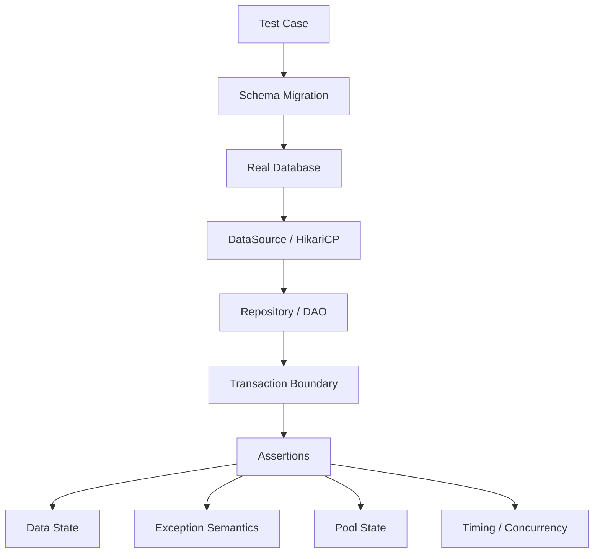
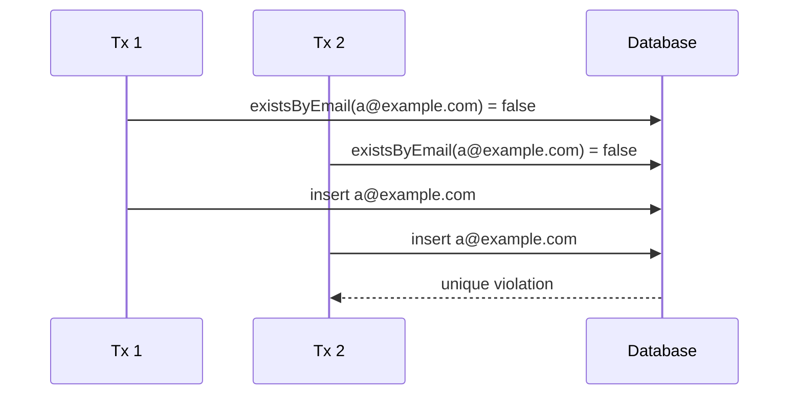
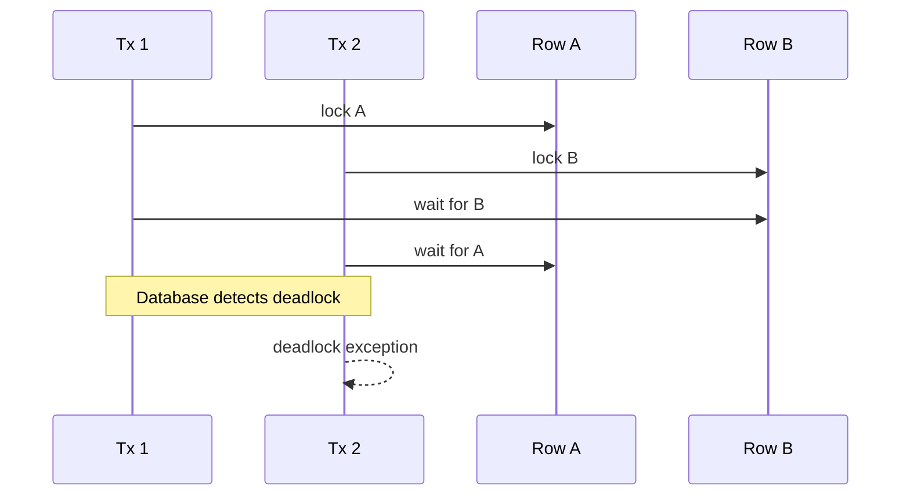
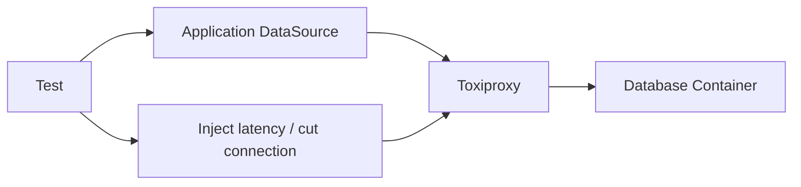

# Part 029 — Testing JDBC Code: Unit, Integration, Testcontainers, Failure Injection

JDBC testing tidak boleh berhenti di "method repository mengembalikan object yang benar". Untuk sistem production, JDBC code adalah boundary yang berinteraksi dengan:

- SQL dialect;
- schema constraint;
- transaction isolation;
- lock behavior;
- timeout;
- connection pool;
- driver behavior;
- network failure;
- database-specific type mapping;
- migration state;
- concurrency;
- rollback semantics.

Kalau test hanya memakai mock atau in-memory database yang behavior-nya berbeda jauh dari production, kita hanya membuktikan bahwa kode Java memanggil method yang benar, bukan membuktikan bahwa sistem data benar.

Target part ini: membangun testing strategy untuk JDBC yang cukup realistis, deterministic, cepat, dan mampu menangkap bug yang biasanya baru muncul saat incident.

---

## 1. Kaufman Lens: Practice the Real Skill, Not the Toy Version

Josh Kaufman menekankan deconstruction dan deliberate practice. Dalam JDBC testing, skill yang harus dilatih bukan hanya:

```txt
Can I call repository.save()?
```

Tetapi:

```txt
Can I prove that this data boundary behaves correctly under real schema, real constraints,
real isolation, real connection pooling, and realistic failure modes?
```

Kita pecah skill testing JDBC menjadi beberapa sub-skill:

| Sub-skill | Pertanyaan yang Harus Bisa Dijawab |
|---|---|
| SQL correctness | Apakah SQL valid untuk database target? |
| Mapping correctness | Apakah Java object benar-benar sesuai row? |
| Constraint correctness | Apakah unique/foreign/check constraint bekerja sebagai guardrail? |
| Transaction correctness | Apakah commit/rollback terjadi di boundary yang benar? |
| Isolation correctness | Apakah concurrent command tetap menjaga invariant? |
| Pool correctness | Apakah connection selalu dikembalikan? |
| Timeout correctness | Apakah failure berhenti cepat, bukan menggantung? |
| Retry correctness | Apakah retry aman terhadap duplicate side effect? |
| Migration correctness | Apakah test berjalan di schema yang sama dengan production? |
| Observability correctness | Apakah failure bisa didiagnosis dari logs/metrics/traces? |

Mental model:



Testing JDBC yang kuat berarti setiap layer di atas bisa diuji tanpa mengandalkan asumsi palsu.

---

## 2. Testing Pyramid untuk JDBC

Untuk JDBC, pyramid testing yang sehat biasanya seperti ini:

```txt
Many small mapper/unit tests
Several repository integration tests with real DB
Focused transaction/concurrency tests
Focused pool/timeout/failure tests
Few end-to-end tests
```

Jangan membalik pyramid menjadi:

```txt
Everything is mocked
Everything important is only tested through end-to-end
Production discovers the real behavior
```

Framework mentalnya:

| Test Type | Cocok Untuk | Tidak Cocok Untuk |
|---|---|---|
| Unit test | mapper, SQL builder pure function, retry classifier | SQL dialect, constraint, isolation |
| Integration test real DB | repository, schema, type mapping, transaction | browser/UI behavior |
| Concurrency test | invariant under race | semua scenario biasa |
| Failure injection test | timeout, pool exhaustion, retry, rollback path | happy path CRUD |
| End-to-end test | contract antar service | detail SQL mapping |

Rule praktis:

> Test JDBC code against the same database family as production.

Kalau production PostgreSQL, test kritikal sebaiknya PostgreSQL. Kalau production MySQL/InnoDB, test kritikal sebaiknya MySQL/InnoDB. H2 bisa berguna untuk fast smoke test, tetapi bukan pengganti semantic test untuk SQL dialect, locking, isolation, dan type mapping.

---

## 3. Why Mocking JDBC Is Usually Weak

Mocking `Connection`, `PreparedStatement`, dan `ResultSet` sering menghasilkan test yang brittle dan miskin informasi.

Contoh mock-heavy test:

```java
when(dataSource.getConnection()).thenReturn(connection);
when(connection.prepareStatement(anyString())).thenReturn(statement);
when(statement.executeUpdate()).thenReturn(1);

repository.renameUser(42L, "alice");

verify(statement).setString(1, "alice");
verify(statement).setLong(2, 42L);
```

Test seperti ini membuktikan:

- parameter diset pada index tertentu;
- method dipanggil;
- branch Java tertentu dilewati.

Tetapi tidak membuktikan:

- SQL valid;
- constraint benar;
- update count benar;
- transaction commit/rollback benar;
- null/type mapping benar;
- database menghasilkan error yang diharapkan;
- isolation aman terhadap race.

Mock JDBC masih punya tempat, tetapi sempit:

- menguji retry classifier tanpa database;
- menguji wrapper error handling;
- menguji pure SQL builder;
- menguji mapper jika mapper diekstrak sebagai fungsi dari row abstraction sederhana;
- menguji behavior code path yang sangat sulit dipicu dengan DB nyata.

Anti-pattern:

```txt
Repository is fully tested with mocks, therefore JDBC is safe.
```

Koreksi:

```txt
Repository mock tests are interaction tests. They do not replace integration tests.
```

---

## 4. Unit Testing Row Mapping Without Mocking ResultSet Too Much

Mapper adalah tempat bug kecil sering muncul:

- salah nama column;
- salah type getter;
- null primitive;
- timestamp conversion;
- enum invalid;
- BigDecimal scale;
- optional field;
- boolean tri-state.

Ada dua pendekatan.

### 4.1 Test Mapper Through Real Query

Ini paling realistis:

```java
@Test
void mapsUserRow() {
    jdbc.update("""
        insert into app_user(id, email, status, created_at)
        values (?, ?, ?, ?)
        """,
        1L,
        "a@example.com",
        "ACTIVE",
        OffsetDateTime.parse("2026-06-27T10:15:30Z")
    );

    User user = repository.findById(1L).orElseThrow();

    assertThat(user.id()).isEqualTo(1L);
    assertThat(user.email()).isEqualTo("a@example.com");
    assertThat(user.status()).isEqualTo(UserStatus.ACTIVE);
}
```

Keuntungan:

- mapper diuji bersama SQL dan database type;
- column alias ikut teruji;
- null/type conversion nyata.

### 4.2 Extract Mapper and Test With Minimal Fake

Kalau mapper kompleks, kita bisa membuat abstraction kecil:

```java
interface RowView {
    long getLong(String column);
    String getString(String column);
    OffsetDateTime getOffsetDateTime(String column);
    boolean isNull(String column);
}
```

Lalu mapper:

```java
final class UserMapper {
    User map(RowView row) {
        return new User(
            row.getLong("id"),
            row.getString("email"),
            UserStatus.valueOf(row.getString("status")),
            row.getOffsetDateTime("created_at")
        );
    }
}
```

Ini membuat unit test mapper lebih mudah tanpa mock `ResultSet` yang verbose.

Namun tetap butuh integration test untuk memastikan `RowView` adapter dari `ResultSet` benar.

---

## 5. Integration Testing with Real Database

Repository integration test minimal harus membuktikan:

- schema migration berhasil;
- insert/update/delete/query valid;
- constraint berjalan;
- generated keys benar;
- timestamp/type mapping benar;
- transaction rollback bekerja;
- exception diklasifikasikan dengan benar;
- connection selalu dikembalikan.

Contoh struktur test:

```txt
src/test/java
  com.example.user
    UserRepositoryIT.java
    UserTransactionIT.java
    UserConcurrencyIT.java
src/test/resources
  db/migration
    V001__create_user.sql
    V002__create_outbox.sql
```

Contoh repository:

```java
public final class UserRepository {
    private final JdbcTemplate jdbc;

    public UserRepository(JdbcTemplate jdbc) {
        this.jdbc = jdbc;
    }

    public long create(String email) {
        KeyHolder keys = new GeneratedKeyHolder();

        jdbc.update(connection -> {
            PreparedStatement ps = connection.prepareStatement("""
                insert into app_user(email, status, created_at)
                values (?, 'ACTIVE', now())
                """, Statement.RETURN_GENERATED_KEYS);
            ps.setString(1, email);
            return ps;
        }, keys);

        Number id = keys.getKey();
        if (id == null) {
            throw new IllegalStateException("Expected generated key");
        }
        return id.longValue();
    }

    public Optional<User> findByEmail(String email) {
        return jdbc.query("""
            select id, email, status, created_at
            from app_user
            where email = ?
            """, rs -> {
            if (!rs.next()) return Optional.empty();
            return Optional.of(new User(
                rs.getLong("id"),
                rs.getString("email"),
                UserStatus.valueOf(rs.getString("status")),
                rs.getObject("created_at", OffsetDateTime.class)
            ));
        }, email);
    }
}
```

Integration test:

```java
@Test
void createAndFindByEmail() {
    long id = repository.create("a@example.com");

    User user = repository.findByEmail("a@example.com").orElseThrow();

    assertThat(user.id()).isEqualTo(id);
    assertThat(user.email()).isEqualTo("a@example.com");
    assertThat(user.status()).isEqualTo(UserStatus.ACTIVE);
}
```

Ini jauh lebih bernilai daripada memverifikasi `setString(1, email)` saja.

---

## 6. Testcontainers as the Default Real-Database Tool

Testcontainers menyediakan container database disposable untuk test. Value utama untuk JDBC:

- database nyata;
- schema nyata;
- lifecycle otomatis;
- isolasi antar suite;
- cocok untuk CI;
- mengurangi gap antara local dan production;
- bisa menjalankan PostgreSQL/MySQL/MariaDB/Oracle-compatible image sesuai kebutuhan;
- bisa dikombinasikan dengan migration tool seperti Flyway atau Liquibase.

Contoh JUnit 5 + PostgreSQL:

```java
@Testcontainers
class UserRepositoryIT {

    @Container
    static PostgreSQLContainer<?> postgres = new PostgreSQLContainer<>("postgres:16-alpine")
        .withDatabaseName("app")
        .withUsername("app")
        .withPassword("secret");

    private HikariDataSource dataSource;
    private JdbcTemplate jdbc;
    private UserRepository repository;

    @BeforeEach
    void setUp() {
        HikariConfig config = new HikariConfig();
        config.setJdbcUrl(postgres.getJdbcUrl());
        config.setUsername(postgres.getUsername());
        config.setPassword(postgres.getPassword());
        config.setMaximumPoolSize(4);
        config.setConnectionTimeout(1_000);
        config.setPoolName("user-repository-test");

        dataSource = new HikariDataSource(config);
        jdbc = new JdbcTemplate(dataSource);

        migrate(dataSource);
        cleanDatabase(jdbc);

        repository = new UserRepository(jdbc);
    }

    @AfterEach
    void tearDown() {
        dataSource.close();
    }
}
```

Catatan penting:

- gunakan image version eksplisit, bukan `latest`;
- jalankan migration yang sama dengan aplikasi;
- bersihkan data secara deterministic;
- pisahkan schema setup dari test data setup;
- jangan membuat container baru untuk setiap test method kecuali perlu isolasi ekstrem;
- jangan mengandalkan order test.

---

## 7. Schema Migration in Tests

JDBC test harus memakai schema yang sama dengan production. Hindari menulis `CREATE TABLE` manual di test kalau aplikasi production memakai migration tool.

Pattern:

```java
static void migrate(DataSource dataSource) {
    Flyway.configure()
        .dataSource(dataSource)
        .locations("classpath:db/migration")
        .cleanDisabled(false)
        .load()
        .migrate();
}
```

Untuk test, ada dua strategi:

### 7.1 Migrate Once, Truncate Per Test

Cocok untuk suite besar.

```java
@BeforeAll
static void migrateOnce() {
    migrate(dataSource);
}

@BeforeEach
void clean() {
    jdbc.update("truncate table outbox_event, app_user restart identity cascade");
}
```

Keuntungan:

- cepat;
- schema stabil;
- test data bersih.

Risiko:

- truncate order harus benar;
- parallel test perlu schema isolation atau container isolation.

### 7.2 Clean and Migrate Per Test Class

Cocok untuk suite kritikal atau migration-heavy.

```java
@BeforeEach
void resetSchema() {
    Flyway flyway = Flyway.configure()
        .dataSource(dataSource)
        .cleanDisabled(false)
        .load();
    flyway.clean();
    flyway.migrate();
}
```

Keuntungan:

- isolasi kuat;
- migration path teruji.

Risiko:

- lebih lambat;
- harus hati-hati agar `clean()` tidak pernah aktif di production config.

---

## 8. Test Data Builder for Database State

Jangan membuat test sulit dibaca dengan raw SQL panjang di setiap test. Gunakan test data builder.

```java
final class UserDbFixture {
    private final JdbcTemplate jdbc;

    UserDbFixture(JdbcTemplate jdbc) {
        this.jdbc = jdbc;
    }

    long activeUser(String email) {
        return jdbc.queryForObject("""
            insert into app_user(email, status, created_at)
            values (?, 'ACTIVE', now())
            returning id
            """, Long.class, email);
    }

    long suspendedUser(String email) {
        return jdbc.queryForObject("""
            insert into app_user(email, status, created_at)
            values (?, 'SUSPENDED', now())
            returning id
            """, Long.class, email);
    }
}
```

Test menjadi fokus pada behavior:

```java
@Test
void suspendedUserCannotBeRenamed() {
    long userId = fixture.suspendedUser("old@example.com");

    assertThatThrownBy(() -> service.renameUser(userId, "new@example.com"))
        .isInstanceOf(InvalidUserStateException.class);

    assertThat(repository.findById(userId).orElseThrow().email())
        .isEqualTo("old@example.com");
}
```

Rule:

> Test fixture should hide irrelevant data setup, not hide important invariants.

---

## 9. Testing Constraints as Business Guardrails

Database constraint bukan detail implementation. Untuk banyak sistem, constraint adalah guardrail terakhir agar invariant tidak rusak saat race condition, bug aplikasi, atau retry.

Contoh unique constraint:

```sql
create table app_user (
    id bigserial primary key,
    email text not null,
    status text not null,
    created_at timestamptz not null,
    constraint uq_app_user_email unique(email),
    constraint ck_app_user_status check (status in ('ACTIVE', 'SUSPENDED'))
);
```

Test:

```java
@Test
void emailMustBeUnique() {
    repository.create("a@example.com");

    assertThatThrownBy(() -> repository.create("a@example.com"))
        .isInstanceOf(DuplicateKeyException.class);
}
```

Jangan hanya test service validation:

```java
if (repository.existsByEmail(email)) {
    throw new DuplicateEmailException(email);
}
```

Karena pattern check-then-insert bisa race:



Test yang benar membuktikan bahwa constraint menangkap duplicate, lalu aplikasi menerjemahkan error menjadi domain exception.

---

## 10. Testing Transaction Commit and Rollback

Transaction test harus membuktikan final database state, bukan hanya exception.

Contoh use case:

```java
@Transactional
public void registerUserAndOutbox(String email) {
    long userId = userRepository.create(email);
    outboxRepository.append("UserRegistered", userId);
}
```

Rollback test:

```java
@Test
void rollsBackUserIfOutboxInsertFails() {
    outboxRepository.forceFailureForTest();

    assertThatThrownBy(() -> service.registerUserAndOutbox("a@example.com"))
        .isInstanceOf(OutboxWriteException.class);

    assertThat(count("app_user")).isZero();
    assertThat(count("outbox_event")).isZero();
}
```

Kalau memakai JDBC manual:

```java
public void transfer(long from, long to, BigDecimal amount) {
    txRunner.inTransaction(connection -> {
        accountRepository.debit(connection, from, amount);
        accountRepository.credit(connection, to, amount);
        ledgerRepository.append(connection, from, to, amount);
        return null;
    });
}
```

Test rollback:

```java
@Test
void transferIsAtomic() {
    long a = fixture.account("A", new BigDecimal("100.00"));
    long b = fixture.account("B", new BigDecimal("10.00"));

    ledgerRepository.failNextAppendForTest();

    assertThatThrownBy(() -> service.transfer(a, b, new BigDecimal("20.00")))
        .isInstanceOf(LedgerException.class);

    assertThat(balance(a)).isEqualByComparingTo("100.00");
    assertThat(balance(b)).isEqualByComparingTo("10.00");
    assertThat(count("ledger_entry")).isZero();
}
```

Transaction test invariant:

```txt
After failure, database state must be equivalent to before operation.
```

---

## 11. Testing Update Count Correctness

Update count sering menjadi concurrency signal.

Contoh optimistic locking:

```java
public boolean updateEmail(long id, long expectedVersion, String email) {
    int updated = jdbc.update("""
        update app_user
        set email = ?, version = version + 1
        where id = ? and version = ?
        """, email, id, expectedVersion);

    return updated == 1;
}
```

Test:

```java
@Test
void staleVersionDoesNotUpdateRow() {
    long id = fixture.user("a@example.com", 3L);

    boolean updated = repository.updateEmail(id, 2L, "b@example.com");

    assertThat(updated).isFalse();
    assertThat(repository.findById(id).orElseThrow().email())
        .isEqualTo("a@example.com");
}
```

Anti-pattern:

```java
jdbc.update(sql, args);
return true;
```

Koreksi:

```java
int updated = jdbc.update(sql, args);
if (updated != 1) {
    throw new ConcurrentModificationException(...);
}
```

Untuk operation yang seharusnya mengubah tepat satu row, test harus assert update count behavior.

---

## 12. Testing Generated Keys

Generated key test penting karena driver/database berbeda dalam behavior generated keys.

Test minimal:

```java
@Test
void createReturnsGeneratedIdThatCanBeLoaded() {
    long id = repository.create("a@example.com");

    assertThat(id).isPositive();
    assertThat(repository.findById(id)).isPresent();
}
```

Test juga error path:

```java
@Test
void createFailsIfGeneratedKeyMissing() {
    // Usually tested with a small fake KeyHolder or special repository variant,
    // because forcing a real driver to omit generated keys is awkward.
}
```

Guideline:

- integration test normal path with real DB;
- unit test defensive path if failure sulit dipicu;
- jangan assume generated key selalu `Integer`; gunakan `Number` lalu convert hati-hati;
- untuk PostgreSQL, `returning id` sering lebih explicit daripada generic generated keys.

---

## 13. Testing Type Mapping

Type mapping test harus eksplisit untuk tipe berisiko:

- `BigDecimal`;
- timestamp/timezone;
- UUID;
- JSON/JSONB;
- enum;
- nullable boolean;
- binary data;
- arrays;
- text panjang;
- numeric overflow.

Contoh `BigDecimal`:

```java
@Test
void preservesMoneyScaleAndPrecision() {
    long id = invoiceRepository.create(new BigDecimal("1234567890.1234"));

    Invoice invoice = invoiceRepository.findById(id).orElseThrow();

    assertThat(invoice.amount()).isEqualByComparingTo("1234567890.1234");
}
```

Contoh nullable boolean:

```java
@Test
void mapsNullableBooleanWithoutPrimitiveWasNullBug() {
    long id = jdbc.queryForObject("""
        insert into consent(user_id, marketing_allowed)
        values (42, null)
        returning id
        """, Long.class);

    Consent consent = repository.findConsent(id).orElseThrow();

    assertThat(consent.marketingAllowed()).isEmpty();
}
```

Kalau mapper memakai `rs.getBoolean()` tanpa `wasNull()`, test ini akan menangkap bug karena `getBoolean()` mengembalikan `false` untuk SQL `NULL`.

---

## 14. Testing Temporal Correctness

Temporal test harus menghindari `now()` sebagai assertion utama. Gunakan fixed clock atau known timestamp.

Contoh:

```java
@Test
void storesEventInstantAsUtcInstant() {
    Instant occurredAt = Instant.parse("2026-06-27T10:15:30.123456Z");

    long id = eventRepository.append("UserRegistered", occurredAt);

    Event event = eventRepository.findById(id).orElseThrow();
    assertThat(event.occurredAt()).isEqualTo(occurredAt);
}
```

Test boundary query:

```java
@Test
void findsEventsUsingHalfOpenInterval() {
    fixture.eventAt("2026-06-27T00:00:00Z");
    fixture.eventAt("2026-06-27T23:59:59Z");
    fixture.eventAt("2026-06-28T00:00:00Z");

    List<Event> events = repository.findBetween(
        Instant.parse("2026-06-27T00:00:00Z"),
        Instant.parse("2026-06-28T00:00:00Z")
    );

    assertThat(events).hasSize(2);
}
```

Anti-pattern:

```sql
where date(created_at) = ?
```

Masalah:

- bisa membunuh index usage;
- timezone semantics tidak jelas;
- date boundary rentan salah.

Pattern:

```sql
where created_at >= ?
  and created_at < ?
```

---

## 15. Testing Isolation and Race Conditions

Concurrency bug tidak cukup diuji dengan sequential test.

Contoh invariant:

```txt
A user may have at most one ACTIVE subscription.
```

Schema guardrail:

```sql
create unique index uq_active_subscription_user
on subscription(user_id)
where status = 'ACTIVE';
```

Concurrent test:

```java
@Test
void onlyOneActiveSubscriptionCanBeCreatedConcurrently() throws Exception {
    long userId = fixture.user("a@example.com");

    ExecutorService executor = Executors.newFixedThreadPool(2);
    CyclicBarrier barrier = new CyclicBarrier(2);

    Callable<Boolean> task = () -> {
        barrier.await();
        try {
            service.activateSubscription(userId);
            return true;
        } catch (DuplicateActiveSubscriptionException e) {
            return false;
        }
    };

    Future<Boolean> r1 = executor.submit(task);
    Future<Boolean> r2 = executor.submit(task);

    List<Boolean> results = List.of(r1.get(), r2.get());

    assertThat(results).containsExactlyInAnyOrder(true, false);
    assertThat(countActiveSubscriptions(userId)).isEqualTo(1);
}
```

Key points:

- gunakan barrier agar dua thread start bersamaan;
- assert final state, bukan hanya exception;
- test harus deterministic semaksimal mungkin;
- constraint lebih reliable daripada berharap aplikasi menang race.

---

## 16. Testing Deadlock Handling

Deadlock bisa dipicu dengan dua transaction yang mengunci resource dalam urutan berbeda.

Contoh mental model:



Test skeleton:

```java
@Test
void deadlockIsTranslatedToRetryableFailure() throws Exception {
    long a = fixture.account("A");
    long b = fixture.account("B");

    ExecutorService executor = Executors.newFixedThreadPool(2);
    CyclicBarrier barrier = new CyclicBarrier(2);

    Callable<Result> t1 = () -> transferWithManualLockOrder(a, b, barrier);
    Callable<Result> t2 = () -> transferWithManualLockOrder(b, a, barrier);

    List<Result> results = List.of(
        executor.submit(t1).get(),
        executor.submit(t2).get()
    );

    assertThat(results)
        .anyMatch(Result::isSuccess)
        .anyMatch(Result::isRetryableDeadlock);
}
```

Deadlock test tidak harus ada untuk semua repository. Gunakan untuk:

- concurrency control primitive;
- retry classifier;
- transaction runner;
- critical money/state transition logic;
- incident regression test.

---

## 17. Testing Lock Timeout and Statement Timeout

Timeout test harus membedakan beberapa hal:

| Timeout | Layer | Failure Meaning |
|---|---|---|
| Pool acquisition timeout | HikariCP | tidak dapat borrow connection |
| Query timeout | JDBC statement | query terlalu lama |
| Lock wait timeout | database | menunggu lock terlalu lama |
| Transaction timeout | framework/app | transaction melebihi budget |
| Socket timeout | driver/network | network read/write menggantung |

Contoh lock timeout PostgreSQL-style:

```java
@Test
void lockTimeoutIsTranslated() throws Exception {
    long id = fixture.user("a@example.com");

    Connection c1 = dataSource.getConnection();
    c1.setAutoCommit(false);
    jdbcWith(c1).update("select * from app_user where id = ? for update", id);

    try {
        assertThatThrownBy(() -> txRunner.inTransaction(c2 -> {
            try (Statement s = c2.createStatement()) {
                s.execute("set local lock_timeout = '200ms'");
            }
            userRepository.rename(c2, id, "b@example.com");
            return null;
        })).isInstanceOf(LockTimeoutException.class);
    } finally {
        c1.rollback();
        c1.close();
    }
}
```

Pattern:

- satu connection menahan lock;
- connection lain mencoba update;
- set timeout kecil untuk deterministic test;
- assert exception translation;
- release lock di finally.

Jangan membuat test timeout dengan `Thread.sleep(60_000)`. Timeout tests harus cepat.

---

## 18. Testing Pool Exhaustion

Pool exhaustion test membuktikan bahwa aplikasi tidak menggantung saat semua connection sedang dipakai.

Contoh:

```java
@Test
void failsFastWhenPoolIsExhausted() throws Exception {
    HikariConfig config = new HikariConfig();
    config.setJdbcUrl(postgres.getJdbcUrl());
    config.setUsername(postgres.getUsername());
    config.setPassword(postgres.getPassword());
    config.setMaximumPoolSize(1);
    config.setConnectionTimeout(200);

    try (HikariDataSource ds = new HikariDataSource(config)) {
        Connection held = ds.getConnection();
        try {
            assertThatThrownBy(ds::getConnection)
                .isInstanceOf(SQLException.class)
                .hasMessageContaining("Connection is not available");
        } finally {
            held.close();
        }
    }
}
```

Apa yang diuji:

- pool benar-benar bounded;
- timeout pendek bekerja;
- caller menerima failure cepat;
- no hidden infinite wait.

Jangan pakai test ini untuk membuktikan business service. Pakai untuk config, wrapper, dan failure-mode regression.

---

## 19. Testing Connection Leak

Connection leak bisa diuji dengan pool kecil dan repeated operations.

Contoh:

```java
@Test
void repositoryDoesNotLeakConnections() throws Exception {
    HikariConfig config = testPoolConfig();
    config.setMaximumPoolSize(2);
    config.setConnectionTimeout(300);

    try (HikariDataSource ds = new HikariDataSource(config)) {
        UserRepository repo = new UserRepository(new JdbcTemplate(ds));

        for (int i = 0; i < 50; i++) {
            repo.findByEmail("missing-" + i + "@example.com");
        }

        HikariPoolMXBean mx = ds.getHikariPoolMXBean();
        assertThat(mx.getActiveConnections()).isZero();
        assertThat(mx.getThreadsAwaitingConnection()).isZero();
    }
}
```

Selain itu, aktifkan `leakDetectionThreshold` di environment test khusus:

```java
config.setLeakDetectionThreshold(2_000);
```

Catatan:

- leak detection bukan assertion utama;
- leak detection membantu menemukan stack trace peminjam connection;
- test harus tetap assert active connection kembali ke nol.

---

## 20. Testing `try-with-resources` and Exception Safety

Untuk JDBC manual, pattern ini wajib:

```java
try (Connection connection = dataSource.getConnection();
     PreparedStatement ps = connection.prepareStatement(sql)) {
    // use ps
}
```

Jika transaction manual:

```java
try (Connection connection = dataSource.getConnection()) {
    connection.setAutoCommit(false);
    try {
        work.execute(connection);
        connection.commit();
    } catch (Throwable t) {
        safeRollback(connection, t);
        throw t;
    }
}
```

Test exception safety:

```java
@Test
void returnsConnectionWhenMapperThrows() {
    assertThatThrownBy(() -> repository.queryWithFailingMapper())
        .isInstanceOf(MappingException.class);

    assertThat(pool().getActiveConnections()).isZero();
}
```

Bug umum:

```java
ResultSet rs = ps.executeQuery();
return mapper.map(rs); // ResultSet/Statement not closed on mapper failure
```

Pattern benar:

```java
try (PreparedStatement ps = connection.prepareStatement(sql);
     ResultSet rs = ps.executeQuery()) {
    return mapper.map(rs);
}
```

---

## 21. Testing Query Shape and Index Assumptions

Tidak semua query correctness bisa diuji hanya dengan result assertion. Query bisa benar secara result, tetapi buruk secara execution plan.

Contoh test ringan:

```java
@Test
void searchByEmailUsesIndex() {
    String plan = jdbc.queryForObject("""
        explain select id, email
        from app_user
        where email = 'a@example.com'
        """, String.class);

    assertThat(plan).contains("Index");
}
```

Namun hati-hati:

- execution plan bisa berubah karena statistik;
- string plan vendor-specific;
- test bisa brittle;
- jangan overuse.

Lebih baik gunakan test plan untuk query kritikal:

- high-QPS lookup;
- regulatory/audit export;
- pagination besar;
- query dengan predicate kompleks;
- query yang pernah menyebabkan incident.

Untuk PostgreSQL, `EXPLAIN (FORMAT JSON)` lebih mudah dianalisis daripada plain text.

---

## 22. Testing Pagination Correctness

Pagination test harus membuktikan stable ordering.

Anti-pattern:

```sql
select * from case_file limit 50 offset 100
```

tanpa `order by`.

Test:

```java
@Test
void paginationIsStableByCreatedAtAndId() {
    fixture.caseFile("2026-06-27T10:00:00Z", 1L);
    fixture.caseFile("2026-06-27T10:00:00Z", 2L);
    fixture.caseFile("2026-06-27T10:01:00Z", 3L);

    Page<CaseFile> page = repository.findPageAfter(null, 2);

    assertThat(page.items())
        .extracting(CaseFile::id)
        .containsExactly(1L, 2L);

    Page<CaseFile> next = repository.findPageAfter(page.nextCursor(), 2);

    assertThat(next.items())
        .extracting(CaseFile::id)
        .containsExactly(3L);
}
```

Guideline:

- order by harus deterministic;
- cursor harus mengandung semua tie-breaker;
- test duplicate timestamp;
- test insertion between pages jika workload memungkinkan.

---

## 23. Testing Batch Processing

Batch test harus memeriksa:

- partial failure behavior;
- update count;
- transaction chunking;
- idempotent restart;
- memory limit;
- duplicate row handling;
- checkpointing.

Contoh:

```java
@Test
void bulkImportCanRestartAfterFailedChunk() {
    ImportJob job = fixture.importJob(List.of(
        row("a@example.com"),
        row("b@example.com"),
        row("bad-email"),
        row("c@example.com")
    ));

    ImportResult first = importer.run(job.id(), 2);

    assertThat(first.successfulRows()).isEqualTo(2);
    assertThat(first.failedRows()).isEqualTo(1);

    ImportResult second = importer.run(job.id(), 2);

    assertThat(second.successfulRows()).isEqualTo(1);
    assertThat(countUsers()).isEqualTo(3);
}
```

Test invariant:

```txt
A rerun after failure must not duplicate committed rows.
```

Gunakan unique key/import row id sebagai idempotency guardrail.

---

## 24. Testing Outbox Pattern

Outbox test harus membuktikan atomicity antara state change dan event append.

```java
@Test
void userRegistrationAppendsOutboxAtomically() {
    service.registerUser("a@example.com");

    assertThat(count("app_user")).isEqualTo(1);
    assertThat(outboxEvents())
        .singleElement()
        .satisfies(event -> {
            assertThat(event.type()).isEqualTo("UserRegistered");
            assertThat(event.status()).isEqualTo("PENDING");
        });
}
```

Failure test:

```java
@Test
void rollbackRemovesUserIfOutboxCannotBeWritten() {
    fixture.breakOutboxConstraintForTest();

    assertThatThrownBy(() -> service.registerUser("a@example.com"))
        .isInstanceOf(DataAccessException.class);

    assertThat(count("app_user")).isZero();
    assertThat(count("outbox_event")).isZero();
}
```

Publisher test:

```java
@Test
void outboxPublisherMarksEventPublishedAfterSuccessfulSend() {
    long eventId = fixture.pendingOutboxEvent("UserRegistered");

    fakeBroker.succeed();
    publisher.publishPendingBatch();

    assertThat(outboxStatus(eventId)).isEqualTo("PUBLISHED");
}
```

Publisher failure test:

```java
@Test
void outboxPublisherDoesNotMarkPublishedWhenSendFails() {
    long eventId = fixture.pendingOutboxEvent("UserRegistered");

    fakeBroker.fail();
    publisher.publishPendingBatch();

    assertThat(outboxStatus(eventId)).isEqualTo("PENDING");
}
```

---

## 25. Testing Read-Only Transactions

Read-only transaction tests are useful when:

- framework config should enforce read-only semantics;
- separate read pool/replica user should reject writes;
- accidental write in query path is dangerous.

Example:

```java
@Test
void readOnlyServiceDoesNotWrite() {
    assertThatThrownBy(() -> readOnlyService.accidentallyWrites())
        .isInstanceOf(DataAccessException.class);
}
```

A stronger architecture test uses a read-only database user:

```sql
grant usage on schema public to app_read;
grant select on all tables in schema public to app_read;
revoke insert, update, delete on all tables in schema public from app_read;
```

Then configure a `DataSource` with `app_read` and prove writes fail.

This is better than trusting `@Transactional(readOnly = true)` alone.

---

## 26. Testing Security at the JDBC Boundary

Security tests should include SQL injection probes for any dynamic query builder.

Parameterized value test:

```java
@Test
void searchTreatsInputAsValueNotSql() {
    fixture.user("normal@example.com");

    List<User> users = repository.searchByEmail("' OR 1=1 --");

    assertThat(users).isEmpty();
}
```

Dynamic sort allowlist test:

```java
@Test
void rejectsUnknownSortColumn() {
    assertThatThrownBy(() -> repository.search(new SearchRequest(
        "alice",
        "email; drop table app_user; --",
        SortDirection.ASC
    ))).isInstanceOf(InvalidSortColumnException.class);
}
```

Do not test security only with one payload. Test the design:

- values must be bound;
- identifiers must be allowlisted;
- direction must be enum;
- limit/offset must be bounded;
- raw SQL fragments must not come from user input.

---

## 27. Failure Injection with Fake Repository vs Real DB

Not every failure needs real DB failure injection. Choose the cheapest realistic mechanism.

| Failure | Best Test Strategy |
|---|---|
| Duplicate key | Real DB constraint |
| Check constraint | Real DB constraint |
| Deadlock | Real DB concurrency test |
| Serialization failure | Real DB concurrency/isolation test |
| Mapper exception | Unit/integration with failing mapper |
| Commit failure | Wrapper-level fake connection or proxy |
| Pool timeout | Real Hikari small pool |
| Socket/network failure | Toxiproxy/container network test if critical |
| Broker failure after DB commit | Fake broker + real DB |

The principle:

```txt
Use real DB for database semantics.
Use controlled fakes for external dependencies and rare infrastructure faults.
```

---

## 28. Network Failure Testing

Network-level testing is useful for:

- failover-sensitive services;
- long-running query cancellation;
- retry classifier;
- connection validation;
- stale connection handling;
- socket timeout configuration;
- read replica routing.

Tools:

- Toxiproxy;
- Docker network manipulation;
- database restart during test;
- firewall simulation in CI environment;
- driver-specific timeout configuration.

Example mental model:



Do not overuse network tests. They are slower and can be flaky. Reserve them for:

- connection validation strategy;
- fail-fast guarantees;
- retry policy;
- incident regression.

---

## 29. Testing Observability

Observability is testable.

Examples:

```java
@Test
void logsCorrelationIdOnDatabaseFailure() {
    withCorrelationId("req-123", () -> {
        assertThatThrownBy(() -> repository.createDuplicateEmail())
            .isInstanceOf(DuplicateKeyException.class);
    });

    assertThat(logs())
        .anyMatch(log -> log.contains("req-123")
            && log.contains("duplicate")
            && log.contains("app_user"));
}
```

Metrics test:

```java
@Test
void incrementsRepositoryFailureMetric() {
    assertThatThrownBy(() -> repository.createDuplicateEmail())
        .isInstanceOf(DuplicateKeyException.class);

    assertThat(meterRegistry.counter("jdbc.repository.errors",
        "repository", "UserRepository",
        "operation", "create",
        "kind", "duplicate_key"
    ).count()).isEqualTo(1.0);
}
```

Trace/span test is often done with an in-memory exporter if tracing is critical.

Rule:

> If an incident playbook depends on a metric/log/trace, add at least one test proving the signal exists.

---

## 30. Testing Spring Transaction Boundary

Spring transaction bugs often come from:

- self-invocation;
- wrong propagation;
- checked exception rollback rule;
- `@Async` boundary;
- method not public/proxied;
- test accidentally transactional and hiding commit behavior;
- repository called outside expected transaction.

Example rollback test for checked exception:

```java
@Test
void checkedExceptionRollsBackWhenConfigured() {
    assertThatThrownBy(() -> service.operationThatThrowsCheckedException())
        .isInstanceOf(BusinessCheckedException.class);

    assertThat(count("app_user")).isZero();
}
```

If using:

```java
@Transactional(rollbackFor = BusinessCheckedException.class)
```

the test proves the rollback rule.

Self-invocation test:

```java
@Test
void internalCallDoesNotAccidentallyBypassRequiredTransaction() {
    assertThatThrownBy(() -> service.outerCallsInnerTransactionalDirectly())
        .isInstanceOf(TransactionRequiredException.class);
}
```

Be careful with test-level `@Transactional`:

```java
@SpringBootTest
@Transactional
class UserServiceTest { ... }
```

It can hide real commit behavior because each test rolls back by default. For commit/outbox tests, prefer no test-level transaction or explicitly commit.

---

## 31. Parallel Test Execution and Database Isolation

Parallel tests can corrupt each other if they share schema and mutable tables.

Options:

| Strategy | Pros | Cons |
|---|---|---|
| Single schema + truncate | Fast | Hard with parallel tests |
| Schema per test class | Good isolation | More setup complexity |
| Container per test class | Strong isolation | Slower |
| Container per suite + namespace data | Fast | Requires disciplined test data |

Schema-per-class pattern:

```java
String schema = "test_" + UUID.randomUUID().toString().replace("-", "");
jdbc.execute("create schema " + schema);
jdbc.execute("set search_path to " + schema);
```

But remember: schema name is an identifier. It cannot be bound as `?`. It must be generated internally or allowlisted, never taken from user input.

---

## 32. CI Strategy for JDBC Tests

CI constraints:

- Docker availability;
- image pull time;
- network stability;
- test parallelism;
- database startup time;
- migration time;
- flaky timeout tests;
- resource limits.

Recommendations:

1. Use pinned database images.
2. Reuse container per test suite where safe.
3. Keep timeout/failure tests small and deterministic.
4. Separate slow/failure tests into a dedicated profile if needed.
5. Run repository integration tests on every PR.
6. Run heavier concurrency/network tests at least nightly or before release.
7. Collect logs from database container on failure.
8. Use CI service containers if Testcontainers is not practical, but keep schema setup identical.

Maven profile example:

```xml
<profile>
    <id>integration-test</id>
    <build>
        <plugins>
            <plugin>
                <groupId>org.apache.maven.plugins</groupId>
                <artifactId>maven-failsafe-plugin</artifactId>
                <version>3.5.0</version>
                <executions>
                    <execution>
                        <goals>
                            <goal>integration-test</goal>
                            <goal>verify</goal>
                        </goals>
                    </execution>
                </executions>
            </plugin>
        </plugins>
    </build>
</profile>
```

Naming convention:

```txt
*Test.java  -> fast unit tests
*IT.java    -> integration tests with DB
*CT.java    -> concurrency tests, if separated
```

---

## 33. What Not to Test

Do not over-test JDBC mechanics already guaranteed by driver/framework:

- do not test that `JdbcTemplate.query()` calls `PreparedStatement.executeQuery()`;
- do not test Spring internals;
- do not assert exact generated SQL whitespace unless SQL builder output is the product;
- do not test every trivial getter/setter mapping repeatedly;
- do not duplicate database engine test suite;
- do not create slow/flaky failure tests for low-risk code.

Test your boundaries and invariants:

- SQL shape;
- domain invariant;
- transaction atomicity;
- retry safety;
- security boundary;
- pool/resource correctness;
- production failure behavior.

---

## 34. Anti-Pattern Catalog

### 34.1 Only Mock JDBC

Problem:

```txt
Tests verify calls, not data behavior.
```

Consequence:

- SQL bugs escape;
- schema bugs escape;
- transaction bugs escape;
- constraint behavior unknown.

Correction:

```txt
Use real DB integration tests for repository semantics.
```

### 34.2 H2 as Universal Substitute

Problem:

```txt
H2 behavior differs from production database.
```

Consequence:

- false confidence;
- SQL dialect drift;
- isolation/locking mismatch;
- type mapping mismatch.

Correction:

```txt
Use same database family as production for critical tests.
```

### 34.3 Test Data Coupled Across Tests

Problem:

```txt
Test A depends on row created by Test B.
```

Consequence:

- order-dependent failures;
- impossible parallelism;
- flaky CI.

Correction:

```txt
Each test owns its data setup and cleanup.
```

### 34.4 Ignoring Rollback State

Problem:

```java
assertThrows(Exception.class, () -> service.doWork());
```

without checking DB state.

Correction:

```java
assertThat(countAffectedRows()).isZero();
```

### 34.5 Slow Timeout Tests

Problem:

```txt
Test sleeps for production timeout duration.
```

Correction:

```txt
Use small test-specific timeout and deterministic blocking condition.
```

### 34.6 No Constraint Tests

Problem:

```txt
Service validation is tested, database guardrail is not.
```

Correction:

```txt
Test unique/check/foreign-key behavior directly.
```

### 34.7 Test-Level Transaction Hides Commit Bugs

Problem:

```txt
@SpringBootTest @Transactional makes every test rollback.
```

Consequence:

- outbox commit behavior not tested;
- after-commit hooks not tested;
- transaction synchronization behavior hidden.

Correction:

```txt
Use non-transactional integration tests for commit/outbox/publisher behavior.
```

---

## 35. JDBC Testing Checklist

Use this checklist during code review.

### Repository Correctness

- [ ] Repository tested against real database family.
- [ ] Schema is created using real migration scripts.
- [ ] Insert/update/delete/query happy path tested.
- [ ] Not-found path tested.
- [ ] Duplicate/constraint path tested.
- [ ] Update count behavior tested where relevant.
- [ ] Generated key behavior tested.
- [ ] Nullable fields tested.
- [ ] Temporal fields tested.
- [ ] BigDecimal/UUID/JSON/enum mapping tested if used.

### Transaction Correctness

- [ ] Commit path tested by final DB state.
- [ ] Rollback path tested by final DB state.
- [ ] Checked exception rollback rule tested if relevant.
- [ ] Outbox/state atomicity tested if relevant.
- [ ] External side effect not executed inside DB transaction unless intentionally proven safe.

### Concurrency Correctness

- [ ] Critical invariant protected by database constraint or locking strategy.
- [ ] Race condition test exists for critical invariant.
- [ ] Optimistic locking stale update tested.
- [ ] Deadlock/serialization retry classifier tested if retry is implemented.

### Pool and Resource Correctness

- [ ] Connection leak regression test exists for custom JDBC code.
- [ ] Pool exhaustion behavior tested for infrastructure wrapper.
- [ ] Statement/result resource cleanup tested on mapper exception if manual JDBC is used.
- [ ] Test pool config uses small, deterministic limits.

### Security Correctness

- [ ] SQL injection probe exists for dynamic search.
- [ ] Identifier/sort allowlist tested.
- [ ] Limit/offset bounded.
- [ ] Read-only user/write failure tested if using read-only pool.

### Observability Correctness

- [ ] Important DB failures log correlation id.
- [ ] Metrics increment on error/timeout/retry if required by playbook.
- [ ] Slow query/long transaction signal exists for critical flow.

---

## 36. Deliberate Practice

Practice 1:

```txt
Take one repository that currently only has mock tests.
Add a Testcontainers integration test using the same DB family as production.
Prove insert, query, duplicate key, rollback, and generated key behavior.
```

Practice 2:

```txt
Create a race test for a business invariant.
First make it fail without a database constraint.
Then add the constraint or locking strategy.
Make the test pass deterministically.
```

Practice 3:

```txt
Configure HikariCP maximumPoolSize=1 and connectionTimeout=200ms in a test.
Hold one connection open.
Prove second acquisition fails fast and produces the expected translated exception/metric.
```

Practice 4:

```txt
Create a SQL injection regression test for a dynamic search endpoint.
Prove values are bound and identifiers are allowlisted.
```

Practice 5:

```txt
Pick one incident scenario from your system.
Convert it into a failure-injection integration test.
The test should fail before the fix and pass after the fix.
```

---

## 37. Summary

JDBC testing yang kuat bukan hanya unit test dan bukan hanya end-to-end test. Ia adalah kombinasi deliberate:

- unit tests untuk pure logic;
- real DB integration tests untuk SQL/schema/type mapping;
- transaction tests untuk commit/rollback;
- concurrency tests untuk invariants;
- pool tests untuk resource safety;
- timeout/failure tests untuk resilience;
- security tests untuk injection boundary;
- observability tests untuk incident readiness.

Mental model utama:

```txt
Mock tests prove interactions.
Real database tests prove behavior.
Failure tests prove resilience.
Concurrency tests prove invariants.
```

Top-tier engineer tidak puas dengan "test hijau". Ia bertanya:

```txt
What exact production failure mode does this test prevent?
```

Kalau jawabannya jelas, test bernilai. Kalau tidak, test mungkin hanya ritual.

---

## References

- Testcontainers for Java documentation: https://java.testcontainers.org/
- Testcontainers PostgreSQL guide: https://testcontainers.com/guides/getting-started-with-testcontainers-for-java/
- Java SE JDBC API: https://docs.oracle.com/en/java/javase/25/docs/api/java.sql/module-summary.html
- Java SE `Connection`: https://docs.oracle.com/en/java/javase/25/docs/api/java.sql/java/sql/Connection.html
- Java SE `Statement`: https://docs.oracle.com/en/java/javase/25/docs/api/java.sql/java/sql/Statement.html
- Java SE `PreparedStatement`: https://docs.oracle.com/en/java/javase/25/docs/api/java.sql/java/sql/PreparedStatement.html
- HikariCP documentation: https://github.com/brettwooldridge/HikariCP
