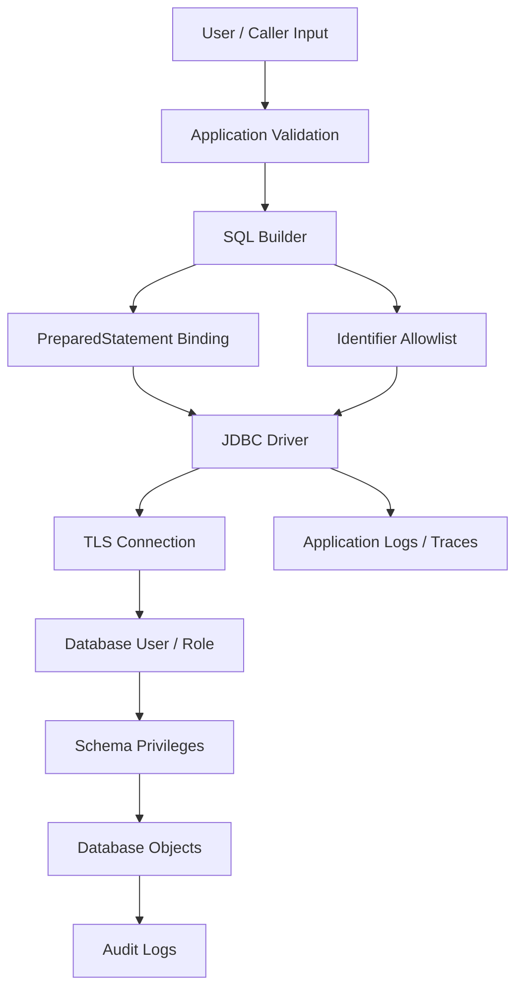
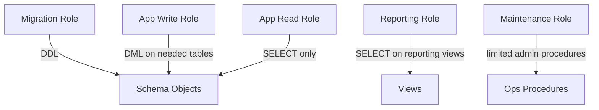
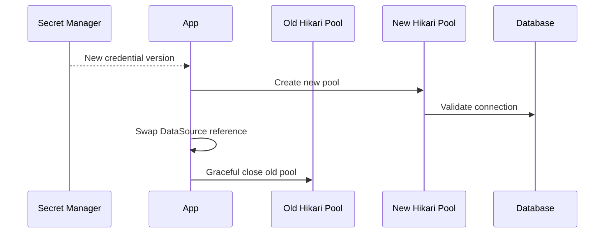
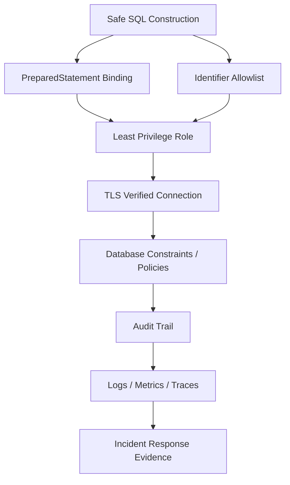

# Part 030 — Security: SQL Injection, Least Privilege, Secrets, TLS, Auditability

JDBC security bukan hanya "gunakan `PreparedStatement`". Itu penting, tetapi belum cukup.

Security di JDBC boundary mencakup:

- apakah input user pernah menjadi SQL code;
- apakah dynamic SQL memiliki allowlist;
- apakah database user punya privilege minimum;
- apakah credential disimpan dan dirotasi dengan aman;
- apakah koneksi terenkripsi dan server diverifikasi;
- apakah log tidak membocorkan secret/PII;
- apakah audit trail cukup untuk forensic dan regulatory defensibility;
- apakah migration, batch job, dan admin tooling mengikuti prinsip yang sama;
- apakah incident bisa ditelusuri tanpa membuka data sensitif.

Target part ini: membangun security mental model untuk Java/JDBC/database boundary yang bisa dipakai dalam design review, code review, threat modeling, dan production hardening.

---

## 1. Kaufman Lens: Deconstruct JDBC Security

Security terlalu luas jika dipelajari sebagai daftar rule. Kita pecah menjadi sub-skill:

| Sub-skill | Pertanyaan Utama |
|---|---|
| Injection prevention | Apakah input user bisa mengubah struktur SQL? |
| Dynamic SQL control | Apakah identifier/order/filter berasal dari allowlist? |
| Privilege minimization | Jika aplikasi compromise, damage maksimal apa? |
| Secret management | Apakah credential bisa bocor, dirotasi, dan diaudit? |
| Transport security | Apakah aplikasi benar-benar bicara ke DB yang valid melalui channel aman? |
| Data minimization | Apakah query/log/result membawa data berlebihan? |
| Auditability | Apakah kita bisa membuktikan siapa melakukan apa, kapan, dan melalui flow apa? |
| Operational safety | Apakah migration/batch/admin tools punya guardrail? |

Mental model:



Security harus kuat di semua edge, bukan hanya di satu API call.

---

## 2. Threat Model: What Can Go Wrong at the JDBC Boundary?

Ancaman utama:

1. **SQL injection**: input user mengubah struktur query.
2. **Privilege abuse**: aplikasi punya privilege lebih dari yang dibutuhkan.
3. **Credential leakage**: password/token DB bocor dari repo, log, env dump, heap dump, CI, atau dashboard.
4. **MITM / wrong server**: koneksi tidak memverifikasi server database.
5. **Sensitive data exposure**: query/log/trace membawa PII/secret berlebihan.
6. **Audit gap**: perubahan penting tidak bisa ditelusuri.
7. **Batch/admin bypass**: tool internal melewati validasi dan guardrail aplikasi.
8. **Migration accident**: migration menjalankan destructive change dengan privilege terlalu luas.
9. **Multi-tenant data leak**: query lupa tenant predicate.
10. **Stored procedure misuse**: procedure aman secara binding tetapi privilege/logic-nya terlalu luas.

Security review harus bertanya:

```txt
If this service is compromised, what database actions are possible?
If this SQL builder receives malicious input, can structure change?
If logs leak, what sensitive data is exposed?
If DB credentials rotate, will service recover safely?
If regulator asks for evidence, what can we prove?
```

---

## 3. SQL Injection: The Core Mental Model

SQL injection terjadi saat data yang seharusnya menjadi **value** diperlakukan sebagai **code**.

Bad:

```java
String sql = "select id, email from app_user where email = '" + email + "'";
try (Statement st = connection.createStatement();
     ResultSet rs = st.executeQuery(sql)) {
    ...
}
```

Jika `email` berisi:

```txt
' OR 1=1 --
```

maka struktur SQL berubah.

Good:

```java
String sql = "select id, email from app_user where email = ?";
try (PreparedStatement ps = connection.prepareStatement(sql)) {
    ps.setString(1, email);
    try (ResultSet rs = ps.executeQuery()) {
        ...
    }
}
```

Di sini SQL structure tetap:

```sql
select id, email from app_user where email = ?
```

Input user dikirim sebagai parameter value, bukan sebagai SQL syntax.

Rule utama:

```txt
Values must be bound. SQL structure must be controlled by code.
```

---

## 4. PreparedStatement Is Necessary but Not Sufficient

`PreparedStatement` melindungi **values**, bukan semua bagian SQL.

Aman:

```java
where email = ?
where created_at >= ? and created_at < ?
where status = ?
limit ?
offset ?
```

Tidak bisa dibind sebagai value biasa:

```sql
select ? from app_user       -- column identifier
from ?                       -- table identifier
order by ?                   -- identifier/direction semantics
where ? = ?                  -- left side identifier
```

Contoh salah:

```java
String sql = """
    select id, email
    from app_user
    order by """ + sortColumn + " " + direction;
```

Meskipun `where` menggunakan `PreparedStatement`, `order by` tetap injection-prone jika `sortColumn` dan `direction` berasal dari user input.

Pattern benar:

```java
enum UserSortField {
    EMAIL("email"),
    CREATED_AT("created_at"),
    ID("id");

    private final String column;

    UserSortField(String column) {
        this.column = column;
    }

    String column() {
        return column;
    }
}

enum SortDirection {
    ASC, DESC
}

String sql = """
    select id, email, created_at
    from app_user
    where status = ?
    order by %s %s, id asc
    limit ?
    """.formatted(sortField.column(), direction.name());

try (PreparedStatement ps = connection.prepareStatement(sql)) {
    ps.setString(1, status.name());
    ps.setInt(2, limit);
    ...
}
```

Why this is safe:

- `sortField` is enum, not raw string;
- `direction` is enum, not raw string;
- value parameters are bound;
- deterministic tie-breaker prevents unstable order.

---

## 5. Dynamic SQL Safety Rules

Dynamic SQL is not automatically bad. Unsafe dynamic SQL is bad.

Use this rule set:

| SQL Part | Safe Strategy |
|---|---|
| Values | Bind with `PreparedStatement` |
| Identifiers | Map from enum/allowlist to hardcoded SQL fragment |
| Operators | Enum/allowlist |
| Sort direction | Enum |
| Table names | Internal routing only; allowlist if unavoidable |
| Schema names | Internal generated/allowlisted only |
| Limit/offset | Numeric validation + upper bound + bind if supported |
| Optional predicates | Compose from known fragments |
| Raw filter language | Parse to AST, validate, compile to SQL safely |

Example optional predicates:

```java
final class UserSearchSql {
    SqlAndParams build(UserSearchRequest request) {
        List<String> predicates = new ArrayList<>();
        List<SqlParam> params = new ArrayList<>();

        predicates.add("tenant_id = ?");
        params.add(SqlParam.uuid(request.tenantId()));

        if (request.emailContains() != null) {
            predicates.add("email ilike ? escape '\\'");
            params.add(SqlParam.string("%" + escapeLike(request.emailContains()) + "%"));
        }

        if (request.status() != null) {
            predicates.add("status = ?");
            params.add(SqlParam.string(request.status().name()));
        }

        String sql = """
            select id, email, status, created_at
            from app_user
            where %s
            order by created_at desc, id desc
            limit ?
            """.formatted(String.join(" and ", predicates));

        params.add(SqlParam.integer(Math.min(request.limit(), 100)));
        return new SqlAndParams(sql, params);
    }
}
```

Important: optional fragments are hardcoded, not user-supplied.

---

## 6. Escaping Is Not the Primary Defense

Escaping has a place, but it should not be the main SQL injection defense.

Weak mindset:

```txt
Escape quotes, then concatenate.
```

Strong mindset:

```txt
Bind values. Allowlist structure. Escape only inside specific SQL semantics such as LIKE wildcard handling.
```

Example `LIKE` wildcard escape:

```java
static String escapeLike(String input) {
    return input
        .replace("\\", "\\\\")
        .replace("%", "\\%")
        .replace("_", "\\_");
}
```

Query:

```sql
where email ilike ? escape '\'
```

Binding:

```java
ps.setString(1, "%" + escapeLike(userInput) + "%");
```

This prevents `%` and `_` from becoming uncontrolled wildcards.

But this is different from SQL injection prevention. SQL injection prevention still comes from parameter binding and controlled SQL structure.

---

## 7. Stored Procedures Are Not Automatically Safe

Stored procedures can be safe if:

- parameters are bound;
- procedure does not concatenate unsafe SQL internally;
- procedure runs with appropriate privileges;
- dynamic SQL inside procedure uses safe binding/identifier allowlist;
- caller privilege is limited.

Unsafe stored procedure pattern:

```sql
execute 'select * from app_user where email = ''' || input_email || '''';
```

This is SQL injection moved into the database.

Safer procedure pattern:

```sql
select * from app_user where email = input_email;
```

or dynamic SQL with proper parameterization supported by the database.

JDBC side:

```java
try (CallableStatement cs = connection.prepareCall("{call suspend_user(?, ?)}")) {
    cs.setLong(1, userId);
    cs.setString(2, reason);
    cs.execute();
}
```

Review checklist:

- Does the procedure execute dynamic SQL?
- Does it run as definer or invoker?
- What objects can it access?
- Can app user call only intended procedures?
- Are procedure arguments audited?
- Are dangerous procedures separated from normal app role?

---

## 8. Least Privilege: Damage Boundary Design

Least privilege asks:

```txt
What is the minimum database permission this component needs?
```

Common bad setup:

```txt
Application connects as database owner/superuser.
```

Consequence:

- SQL injection can drop tables;
- app bug can modify migration metadata;
- compromise can read/write everything;
- forensic scope becomes huge;
- blast radius uncontrolled.

Better role model:



Example PostgreSQL-style role split:

```sql
-- Owner/migration role
create role app_migrator login password '...';

-- Runtime roles
create role app_write login password '...';
create role app_read login password '...';

-- Schema ownership stays with migrator/owner, not app runtime.
grant usage on schema public to app_write, app_read;

grant select, insert, update, delete on table app_user to app_write;
grant select, insert on table outbox_event to app_write;
grant usage, select on sequence app_user_id_seq to app_write;

grant select on table app_user to app_read;
revoke insert, update, delete on table app_user from app_read;
```

Principles:

- runtime app role should not own tables;
- runtime app role should not run arbitrary DDL;
- read-only paths should use read-only credentials if feasible;
- migration role should not be used by application runtime;
- admin scripts should not reuse app password casually;
- grant on views instead of base tables for reporting when possible.

---

## 9. Privilege by Workload

Different workloads need different privileges and sometimes different pools.

| Workload | Suggested Credential |
|---|---|
| normal command API | app_write |
| read-only query API | app_read |
| reporting/export | reporting_read or view-only role |
| migration | app_migrator |
| background outbox publisher | app_outbox or app_write with limited scope |
| maintenance job | dedicated maintenance role |
| break-glass admin | audited human-only role |

Why separate?

- easier audit;
- smaller blast radius;
- safer accidental query;
- easier rate limiting/pool separation;
- clearer incident response.

Example Java config:

```java
@Configuration
class DataSourceConfig {

    @Bean
    @Qualifier("writeDataSource")
    DataSource writeDataSource(WriteDbProperties props) {
        HikariConfig config = new HikariConfig();
        config.setJdbcUrl(props.jdbcUrl());
        config.setUsername(props.username());
        config.setPassword(props.password());
        config.setMaximumPoolSize(16);
        config.setPoolName("app-write-pool");
        return new HikariDataSource(config);
    }

    @Bean
    @Qualifier("readDataSource")
    DataSource readDataSource(ReadDbProperties props) {
        HikariConfig config = new HikariConfig();
        config.setJdbcUrl(props.jdbcUrl());
        config.setUsername(props.username());
        config.setPassword(props.password());
        config.setMaximumPoolSize(24);
        config.setReadOnly(true);
        config.setPoolName("app-read-pool");
        return new HikariDataSource(config);
    }
}
```

`setReadOnly(true)` is useful as a signal/hint, but stronger enforcement comes from database privileges.

---

## 10. Tenant Isolation and Query Guardrails

For multi-tenant systems, a missing tenant predicate can become a security incident.

Dangerous query:

```sql
select id, title, status
from case_file
where status = ?
```

Safer:

```sql
select id, title, status
from case_file
where tenant_id = ?
  and status = ?
```

Patterns:

1. Include `tenant_id` in primary/unique keys where appropriate.
2. Require tenant id in repository method signatures.
3. Use query builders that inject tenant predicate by construction.
4. Use database row-level security if suitable.
5. Add tests that prove cross-tenant data is not returned.
6. Avoid passing tenant id only via thread-local unless strongly controlled and tested.

Example repository signature:

```java
Optional<CaseFile> findById(TenantId tenantId, CaseFileId caseFileId);
```

Not:

```java
Optional<CaseFile> findById(CaseFileId caseFileId);
```

Security invariant:

```txt
A repository method that reads tenant-owned data must require tenant scope explicitly.
```

---

## 11. Secrets Management: Passwords Are Runtime Secrets, Not Config Text

Bad:

```properties
spring.datasource.password=SuperSecret123
```

committed to repo or shared config.

Better:

- secret manager;
- environment injection from secure runtime;
- Kubernetes secret with appropriate controls;
- Vault/Cloud secret manager;
- short-lived credentials if supported;
- rotation process;
- no secret in logs;
- no secret in exception messages;
- no secret in metrics labels;
- no secret in `toString()` of config classes.

Java config object:

```java
record DbCredentials(String username, char[] password) {
    @Override
    public String toString() {
        return "DbCredentials[username=" + username + ", password=<redacted>]";
    }
}
```

Avoid:

```java
log.info("DB config: {}", hikariConfig);
```

because config dumps may include sensitive details depending on object implementation and surrounding code.

Safe logging:

```java
log.info("Configured datasource poolName={}, jdbcHost={}, database={}",
    poolName,
    safeHost,
    databaseName
);
```

Never log:

- password;
- full JDBC URL if it contains credentials/tokens;
- secret manager response;
- private key path if sensitive;
- raw connection properties;
- SQL parameters containing PII/secret.

---

## 12. Secret Rotation and Pool Behavior

Rotating database credentials is not just a security task. It is a connection lifecycle task.

Questions:

- Does the service read credentials only at startup?
- Can the pool be rebuilt safely?
- What happens to existing physical connections?
- Are old credentials valid during a grace period?
- Does deployment roll gradually?
- Does failure create pool exhaustion?
- Are health checks detecting auth failure?

Pattern 1: restart/rolling deployment rotation.

```txt
1. Create new credential.
2. Deploy application with new credential.
3. Verify new connections succeed.
4. Wait for old connections to drain.
5. Revoke old credential.
```

Pattern 2: dynamic pool replacement.



Dynamic replacement is more complex. Use only if requirement justifies it.

Rotation test:

```txt
Can the service recover when old credentials stop working?
Does it fail fast and alert if new credentials are wrong?
```

---

## 13. JDBC URL and Credential Hygiene

Avoid credentials in JDBC URL:

```txt
jdbc:postgresql://db:5432/app?user=app&password=secret
```

Prefer separate properties:

```java
config.setJdbcUrl("jdbc:postgresql://db:5432/app");
config.setUsername(username);
config.setPassword(password);
```

Why:

- URLs are often logged;
- URLs appear in dashboards;
- URLs appear in exception messages;
- URLs may be copied into tickets;
- secret scanning may miss unusual locations.

Also avoid embedding tokens in:

- `connectionInitSql`;
- application name;
- schema name;
- pool name;
- metric labels;
- trace attributes.

---

## 14. TLS for Database Connections

TLS protects the connection between app and database from passive sniffing and certain active attacks. But TLS has modes.

Weak:

```txt
Encrypt but do not validate server certificate.
```

Better:

```txt
Encrypt and verify that the server certificate is valid for the expected database host.
```

PostgreSQL JDBC example:

```properties
jdbc:postgresql://db.example.com:5432/app?sslmode=verify-full
```

Conceptual modes:

| Mode | Meaning |
|---|---|
| disable | no TLS |
| require | TLS required but certificate verification may be weaker depending driver/config |
| verify-ca | verify certificate authority |
| verify-full | verify CA and hostname |

Use `verify-full` where possible.

For Java deployments, validate:

- truststore contains correct CA;
- hostname matches certificate;
- cert rotation process exists;
- driver properties are documented;
- local/dev exceptions do not leak into production;
- `sslmode=require` is not mistaken for full identity verification.

Anti-pattern:

```txt
ssl=true, therefore secure.
```

Better question:

```txt
Does the client verify it is talking to the intended database server?
```

---

## 15. Driver and Dependency Security

JDBC driver is executable dependency in your application.

Security practices:

- pin driver version;
- track CVEs;
- avoid abandoned drivers;
- verify compatibility with database version;
- keep HikariCP updated;
- scan dependencies in CI;
- avoid arbitrary driver loading from untrusted paths;
- avoid logging driver connection properties with secrets;
- test driver upgrade against integration suite.

Upgrade test strategy:

```txt
1. Run repository integration tests.
2. Run temporal/type mapping tests.
3. Run transaction/concurrency tests.
4. Run TLS connection test.
5. Run pool timeout/failover smoke test.
6. Compare production-like metrics in staging.
```

Driver upgrade can change:

- timestamp mapping;
- SSL defaults;
- server-side prepare behavior;
- exception vendor code/classification;
- generated keys behavior;
- fetch size/streaming behavior;
- connection validation behavior.

Treat it as a data-boundary change, not a trivial library bump.

---

## 16. Secure Error Handling

Bad error response:

```json
{
  "error": "ERROR: relation app_user does not exist; SQL: select * from app_user where email = 'a@example.com'"
}
```

Problems:

- leaks schema name;
- leaks SQL;
- may leak user input;
- helps attacker map database;
- may leak PII.

Better external response:

```json
{
  "errorCode": "USER_LOOKUP_FAILED",
  "message": "Unable to complete the request."
}
```

Internal log:

```java
log.warn("Database operation failed operation={} sqlState={} vendorCode={} correlationId={}",
    "findUserByEmail",
    sqlState,
    vendorCode,
    correlationId,
    exception
);
```

Even internal logs should avoid:

- raw password;
- full credential-bearing URL;
- full SQL with sensitive literal values;
- full request body containing PII;
- access tokens;
- private keys.

Exception translation should preserve machine-actionable classification without leaking data externally.

---

## 17. SQL Logging: Useful but Dangerous

SQL logging helps debugging, but it can leak sensitive data.

There are three levels:

| Level | Risk |
|---|---|
| SQL template only | lower risk |
| SQL + parameter values | high risk |
| SQL with inlined values | very high risk |

Safe-ish log:

```txt
operation=UserRepository.findByEmail sqlId=user.findByEmail durationMs=12 rows=1
```

Risky log:

```txt
select * from app_user where email = 'alice@example.com' and ssn = '123-45-6789'
```

Recommended pattern:

- assign SQL operation names;
- log duration, row count, SQLState, vendor code;
- log parameter categories, not raw values;
- sample slow queries carefully;
- redact or hash identifiers when needed;
- put raw SQL/parameters behind restricted debug tooling only if legally allowed.

Example:

```java
log.info("jdbc.operation completed operation={} durationMs={} rows={} tenant={} correlationId={}",
    "case.search",
    durationMs,
    rows,
    safeTenantId,
    correlationId
);
```

For regulated systems, logging policy must be explicit:

```txt
What data classes may appear in logs?
Who can access logs?
How long are logs retained?
How are logs searched/exported?
How are logs deleted or masked?
```

---

## 18. PII and Data Minimization in Queries

Do not fetch sensitive columns unless needed.

Bad:

```sql
select * from app_user where id = ?
```

Better:

```sql
select id, display_name, status
from app_user
where id = ?
```

Why:

- reduces accidental log exposure;
- reduces memory exposure;
- reduces serialization risk;
- reduces data copied into traces;
- reduces blast radius of mapper bugs;
- supports least privilege via views.

Pattern:

```sql
create view app_user_public_view as
select id, display_name, status
from app_user;

grant select on app_user_public_view to app_read;
```

Then query the view for read paths that do not need sensitive fields.

---

## 19. Auditability: Security Is Also Evidence

Auditability answers:

```txt
Who did what, to which entity, when, through which flow, and why?
```

For JDBC-backed systems, audit design may include:

- application audit table;
- database audit triggers;
- immutable event/outbox log;
- request correlation id;
- authenticated actor id;
- service account id;
- source IP/device/session;
- reason/comment for administrative action;
- before/after snapshot or diff;
- data classification;
- retention policy;
- tamper evidence.

Example audit table:

```sql
create table audit_event (
    id bigserial primary key,
    occurred_at timestamptz not null,
    actor_type text not null,
    actor_id text not null,
    action text not null,
    entity_type text not null,
    entity_id text not null,
    correlation_id text not null,
    reason text,
    metadata jsonb not null default '{}'
);
```

Application write:

```java
public void suspendUser(AdminActor actor, long userId, String reason) {
    txRunner.inTransaction(connection -> {
        userRepository.suspend(connection, userId);
        auditRepository.append(connection, new AuditEvent(
            actor.type(),
            actor.id(),
            "USER_SUSPENDED",
            "User",
            Long.toString(userId),
            correlationId.current(),
            reason
        ));
        return null;
    });
}
```

Audit invariant:

```txt
A sensitive state change and its audit event must commit or rollback together.
```

---

## 20. Audit Table vs Database Trigger

Application audit advantages:

- knows actor/user/correlation id;
- knows business reason;
- can log domain action, not just table update;
- easier to align with use cases.

Application audit weaknesses:

- can be bypassed by direct DB write;
- depends on every code path doing the right thing;
- may miss migration/admin scripts.

Database trigger audit advantages:

- catches direct table mutation;
- central at database layer;
- good for low-level forensic trail.

Database trigger audit weaknesses:

- often lacks application actor unless session variable is set;
- can be noisy;
- harder to express business action;
- schema changes affect trigger logic.

Hybrid pattern:

- application audit for domain-level evidence;
- database audit/trigger for sensitive tables or admin writes;
- session variables/application_name to propagate correlation id where supported;
- restricted direct DB access.

---

## 21. Correlation ID and DB Session Tagging

Set enough context to correlate app logs and database activity.

Options:

- application logs include correlation id;
- SQL comments with safe request id for selected queries;
- database `application_name`/session attributes;
- transaction-local setting where supported;
- audit table column.

Example PostgreSQL local setting:

```java
try (Statement st = connection.createStatement()) {
    st.execute("select set_config('app.correlation_id', '" + safeCorrelationId + "', true)");
}
```

But be careful: this example concatenates. Only use internally generated safe correlation id or bind through a function call if driver/database supports parameterized equivalent.

Safer with prepared statement:

```java
try (PreparedStatement ps = connection.prepareStatement(
    "select set_config('app.correlation_id', ?, true)")) {
    ps.setString(1, correlationId);
    ps.execute();
}
```

Then trigger/audit function may read session setting.

Security warning:

- do not put PII in correlation id;
- do not put access token in application name;
- do not include raw user input in SQL comments.

---

## 22. Read/Write Split Security

Read/write split can improve safety, but only if enforced at database privilege level.

Weak:

```java
config.setReadOnly(true);
```

Stronger:

```txt
read pool connects using DB role that cannot write.
```

Test:

```java
@Test
void readPoolCannotWrite() {
    JdbcTemplate readJdbc = new JdbcTemplate(readOnlyDataSource);

    assertThatThrownBy(() -> readJdbc.update(
        "insert into app_user(email, status, created_at) values ('x@example.com', 'ACTIVE', now())"
    )).isInstanceOf(DataAccessException.class);
}
```

Guideline:

- use separate credentials;
- use separate pool names;
- use separate metrics;
- fail fast if read datasource points to write credentials;
- do not route writes based on user input;
- avoid stale replica reads for read-after-write flows unless explicitly handled.

---

## 23. Migration Security

Migration tools often require DDL privileges. That does not mean application runtime should have them.

Separation:

```txt
CI/CD migration job -> app_migrator role
Application runtime -> app_write/app_read role
```

Migration guardrails:

- migration role is only available to deploy pipeline;
- destructive migration requires review;
- migration scripts are immutable after merge;
- migration has rollback/backout plan where possible;
- migration lock behavior understood;
- migration does not log secrets;
- migration does not run using superuser unless absolutely necessary;
- migration metadata table protected from app runtime.

Dangerous:

```sql
grant all privileges on schema public to app_write;
```

Better:

```sql
grant select, insert, update, delete on specific tables to app_write;
```

In high-regulation systems, maintain evidence:

- migration author;
- reviewer;
- approval ticket;
- deployment time;
- affected schema objects;
- post-migration validation;
- incident rollback decision if any.

---

## 24. Admin and Batch Job Security

Internal tools are not automatically safe.

Common failure:

```txt
Admin tool uses raw SQL endpoint because only trusted staff can access it.
```

This is dangerous because:

- staff accounts can be compromised;
- authorization bugs happen;
- raw SQL bypasses domain invariant;
- audit trail weak;
- blast radius massive.

Better:

- expose explicit admin operations;
- require reason/comment;
- enforce authorization per operation;
- write audit event in same transaction;
- use dedicated DB role;
- rate-limit dangerous operations;
- require dual control for destructive actions where appropriate;
- never provide arbitrary SQL execution in normal app runtime.

Batch job rules:

- use dedicated credential;
- bound batch size;
- idempotency key/checkpoint;
- least privilege on touched tables;
- safe logging;
- dry-run mode where useful;
- audit summary;
- approval for destructive backfill.

---

## 25. Row-Level Security and Database-Enforced Policy

Some databases support row-level security. It can enforce tenant/user policies inside the database.

Benefits:

- defense-in-depth;
- protects against missing predicate;
- central policy;
- useful for multi-tenant data.

Costs:

- more complex debugging;
- performance implications;
- session context must be set correctly;
- migration/admin scripts need explicit handling;
- tests must cover policy;
- developers may misunderstand invisible filters.

Pattern:

```txt
Application sets tenant context per transaction.
Database policy filters rows by tenant context.
Repository still includes tenant predicate for clarity and performance.
```

Do not use RLS as excuse for sloppy query design. Use it as defense-in-depth.

---

## 26. Encryption at Rest and Column-Level Protection

JDBC application may participate in data protection decisions:

- database encryption at rest;
- column-level encryption;
- application-level encryption;
- tokenization;
- hashing;
- masking;
- key rotation;
- deterministic vs randomized encryption trade-off.

Application-level encryption changes JDBC behavior:

- encrypted values may not be searchable;
- deterministic encryption can leak equality patterns;
- indexes may not work normally;
- length leakage may matter;
- key management becomes critical;
- migration/backfill becomes complex;
- logs must not include plaintext.

Password storage reminder:

```txt
Never store user passwords encrypted for later decryption.
Store password hashes using appropriate password hashing algorithms.
```

For this JDBC series, the key principle is:

```txt
Do not let persistence convenience drive data protection design.
```

---

## 27. Safe Handling of Sensitive Parameters

JDBC parameter binding protects SQL structure, but the parameter value may still be sensitive.

Examples:

- email;
- phone;
- national id;
- bank account;
- access token;
- API key;
- address;
- medical/regulatory data;
- case notes.

Do not log raw parameter values by default.

Create parameter classification:

```java
enum Sensitivity {
    PUBLIC,
    INTERNAL,
    PII,
    SECRET,
    REGULATED
}

record SqlParam(Object value, JDBCType type, Sensitivity sensitivity) {}
```

Logging:

```java
String safeValue(SqlParam p) {
    return switch (p.sensitivity()) {
        case PUBLIC -> String.valueOf(p.value());
        case INTERNAL -> "<internal>";
        case PII -> "<pii>";
        case SECRET -> "<secret>";
        case REGULATED -> "<regulated>";
    };
}
```

This is more intentional than blindly logging `args.toString()`.

---

## 28. Secure Configuration for HikariCP

HikariCP-related security concerns:

- credentials in config/logs;
- TLS properties;
- `connectionInitSql` containing sensitive data;
- pool name leaking environment/tenant info;
- JMX exposure;
- metrics labels leaking sensitive data;
- multiple pools with wrong credentials;
- failing open when config missing;
- long-lived old connections after credential rotation.

Config example:

```java
HikariConfig config = new HikariConfig();
config.setJdbcUrl("jdbc:postgresql://db.example.com:5432/app?sslmode=verify-full");
config.setUsername(secrets.dbUsername());
config.setPassword(secrets.dbPassword());
config.setMaximumPoolSize(16);
config.setPoolName("app-write-pool");
config.setConnectionTimeout(1_000);
config.setValidationTimeout(500);
config.setMaxLifetime(25 * 60_000);
```

Avoid:

```java
config.setPoolName("tenant-" + tenantId + "-" + secretSuffix);
```

Pool names become metric labels and logs. Keep them stable and non-sensitive.

---

## 29. SQL Firewalling and Query Allowlisting

For highly sensitive systems, consider additional controls:

- query allowlisting for known repository operations;
- database proxy policies;
- deny DDL from runtime role;
- deny `select *` on sensitive tables;
- restrict cross-schema access;
- network ACL from app subnets only;
- database audit policies;
- anomaly detection on query volume.

But do not use external controls to excuse unsafe code.

Layered model:

```txt
Safe code -> least privilege -> network restriction -> database audit -> detection/response
```

Each layer catches a different class of failure.

---

## 30. Security Testing Strategy

Security must be tested like behavior.

Test categories:

| Test | Purpose |
|---|---|
| SQL injection probe | input treated as value |
| dynamic sort allowlist | identifier not user-controlled |
| read-only role test | DB privilege enforces read-only |
| migration role separation test | runtime cannot DDL |
| PII logging test | sensitive values redacted |
| TLS smoke test | app connects with required SSL mode |
| audit atomicity test | state change and audit commit together |
| tenant isolation test | no cross-tenant read/write |
| secret config test | missing secret fails startup |

Example SQL injection test:

```java
@Test
void maliciousEmailDoesNotReturnAllUsers() {
    fixture.user("alice@example.com");
    fixture.user("bob@example.com");

    List<User> result = repository.searchByEmail("' OR 1=1 --");

    assertThat(result).isEmpty();
}
```

Example tenant isolation test:

```java
@Test
void cannotReadCaseFromOtherTenant() {
    TenantId tenantA = fixture.tenant("A");
    TenantId tenantB = fixture.tenant("B");
    CaseFileId caseId = fixture.caseFile(tenantB, "Case B");

    Optional<CaseFile> result = repository.findById(tenantA, caseId);

    assertThat(result).isEmpty();
}
```

Example audit rollback test:

```java
@Test
void auditRollsBackWithSensitiveStateChange() {
    fixture.forceAuditFailure();

    assertThatThrownBy(() -> service.suspendUser(actor, userId, "risk"))
        .isInstanceOf(AuditWriteException.class);

    assertThat(userStatus(userId)).isEqualTo("ACTIVE");
    assertThat(auditEvents()).isEmpty();
}
```

---

## 31. Code Review Checklist: SQL Injection

Ask these questions for every SQL change:

- [ ] Are all values bound through `PreparedStatement`/JdbcTemplate parameters?
- [ ] Are any SQL fragments built from user input?
- [ ] Are dynamic identifiers mapped from enums/allowlists?
- [ ] Are sort fields allowlisted?
- [ ] Is sort direction enum-based?
- [ ] Are `LIKE` wildcards escaped if user literal search is intended?
- [ ] Are limit/offset bounded?
- [ ] Is tenant predicate present for tenant-owned data?
- [ ] Are raw SQL utilities inaccessible to untrusted callers?
- [ ] Are stored procedures free from unsafe dynamic SQL?

Red flag grep patterns:

```txt
"select " +
" where " +
" order by " + request
createStatement()
executeQuery(sqlFromRequest)
String.format("select
.formatted(userInput)
```

Not every concatenation is vulnerable. But every concatenation near SQL structure deserves review.

---

## 32. Code Review Checklist: Privilege and Secrets

- [ ] Runtime role is not database owner/superuser.
- [ ] Runtime role cannot run arbitrary DDL.
- [ ] Migration role is separate from runtime role.
- [ ] Read-only workload uses read-only role where feasible.
- [ ] Reporting/export uses view/limited role where feasible.
- [ ] DB password is not committed to repository.
- [ ] DB password is not in JDBC URL.
- [ ] Config/logging redacts secrets.
- [ ] Rotation procedure exists.
- [ ] TLS mode and certificate validation are explicit.
- [ ] JMX/metrics do not expose sensitive values.
- [ ] CI logs do not print connection properties.

---

## 33. Code Review Checklist: Auditability

- [ ] Sensitive state changes create audit events.
- [ ] Audit event is atomic with state change where required.
- [ ] Audit includes actor, action, entity, timestamp, correlation id.
- [ ] Admin actions require reason/comment where appropriate.
- [ ] Direct DB/admin scripts have separate audit trail.
- [ ] Logs can correlate request to database action.
- [ ] Audit data has retention policy.
- [ ] Audit table itself has restricted write access.
- [ ] Audit events do not store unnecessary sensitive payload.
- [ ] Failure to write mandatory audit causes rollback.

---

## 34. Anti-Pattern Catalog

### 34.1 PreparedStatement with Unsafe SQL Structure

```java
String sql = "select * from app_user order by " + request.sort();
PreparedStatement ps = connection.prepareStatement(sql);
```

Problem:

```txt
Values may be safe, but structure is attacker-controlled.
```

Correction:

```txt
Use enum/allowlist for identifiers and directions.
```

### 34.2 Escaping Instead of Binding

```java
String safe = input.replace("'", "''");
String sql = "where name = '" + safe + "'";
```

Problem:

```txt
Escaping is context-sensitive and error-prone.
```

Correction:

```txt
Bind values.
```

### 34.3 Runtime App Uses Migration User

Problem:

```txt
Application can alter/drop schema if compromised.
```

Correction:

```txt
Separate migration and runtime credentials.
```

### 34.4 Read-Only Endpoint Uses Write Role

Problem:

```txt
Bug/injection in read endpoint can write data.
```

Correction:

```txt
Use read-only DB role/pool for read-only workload where justified.
```

### 34.5 Secrets in Logs

Problem:

```txt
Debug logging prints full datasource properties.
```

Correction:

```txt
Redact config and avoid credential-bearing URLs.
```

### 34.6 TLS Without Verification

Problem:

```txt
Connection is encrypted but server identity is not verified.
```

Correction:

```txt
Use certificate and hostname verification where possible.
```

### 34.7 Audit as Best-Effort Side Effect

Problem:

```java
service.changeState();
try {
    audit.log(...);
} catch (Exception ignored) {}
```

Consequence:

```txt
Sensitive state can change without audit evidence.
```

Correction:

```txt
For mandatory audit, write audit in same transaction and fail closed.
```

### 34.8 Tenant Scope Hidden in ThreadLocal Only

Problem:

```txt
Repository signature does not show tenant boundary.
```

Correction:

```txt
Pass tenant scope explicitly for tenant-owned data, or strongly enforce/test context propagation.
```

---

## 35. Production Hardening Blueprint

A strong JDBC security baseline looks like this:

```txt
Application Code
  - Values bound
  - SQL structure allowlisted
  - Tenant scope explicit
  - Sensitive logs redacted
  - Audit written atomically

Runtime DataSource
  - Separate read/write/migration credentials
  - Hikari pool names non-sensitive
  - Secret manager integration
  - TLS verify-full where supported
  - Fail-fast config validation

Database
  - Runtime role least privilege
  - Migration role separate
  - Sensitive data via views/policies where useful
  - Constraints enforce invariants
  - Audit/trigger/policy for sensitive tables

Operations
  - Credential rotation procedure
  - Dependency scanning
  - Driver upgrade test suite
  - DB access audit
  - Incident playbook
```

Mermaid view:



---

## 36. Deliberate Practice

Practice 1:

```txt
Find a repository method with dynamic search/sort.
Refactor it so values are bound and identifiers are enum/allowlist based.
Add SQL injection tests for value, sort column, and sort direction.
```

Practice 2:

```txt
Create separate app_read and app_write database users in a test database.
Prove app_read cannot insert/update/delete.
Wire read-only queries to app_read.
```

Practice 3:

```txt
Review all datasource configuration logs.
Prove DB password/JDBC URL credentials cannot appear in application logs, startup failure logs, or metrics labels.
```

Practice 4:

```txt
Enable TLS verification in a local/staging database setup.
Document truststore/certificate rotation steps.
Add a smoke test that fails when TLS requirement is removed or misconfigured.
```

Practice 5:

```txt
Pick one sensitive state transition.
Add mandatory audit write in the same transaction.
Test that audit failure rolls back the state change.
```

Practice 6:

```txt
Threat-model one batch/admin job.
Identify its credential, privilege, audit trail, dry-run behavior, and worst-case blast radius.
Reduce at least one privilege.
```

---

## 37. Summary

JDBC security is a system property.

Prepared statements are foundational, but the complete model is:

```txt
Bind values.
Allowlist structure.
Limit privileges.
Protect secrets.
Verify transport.
Minimize sensitive data.
Audit mandatory changes.
Test the guardrails.
```

Top-tier engineer does not ask only:

```txt
Is this SQL injection-safe?
```

They ask:

```txt
If this service, credential, query builder, admin tool, or log stream is compromised,
what can happen, what evidence remains, and what boundary limits the damage?
```

That is the security bar for production JDBC systems.

---

## References

- OWASP SQL Injection Prevention Cheat Sheet: https://cheatsheetseries.owasp.org/cheatsheets/SQL_Injection_Prevention_Cheat_Sheet.html
- OWASP SQL Injection overview: https://owasp.org/www-community/attacks/SQL_Injection
- Java SE `PreparedStatement`: https://docs.oracle.com/en/java/javase/25/docs/api/java.sql/java/sql/PreparedStatement.html
- Java SE `Connection`: https://docs.oracle.com/en/java/javase/25/docs/api/java.sql/java/sql/Connection.html
- PostgreSQL JDBC SSL documentation: https://jdbc.postgresql.org/documentation/ssl/
- HikariCP documentation: https://github.com/brettwooldridge/HikariCP
