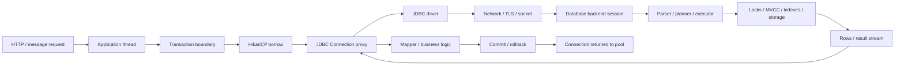
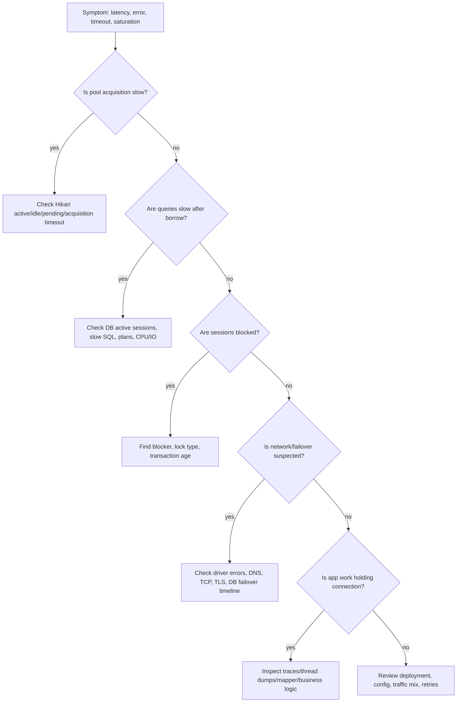
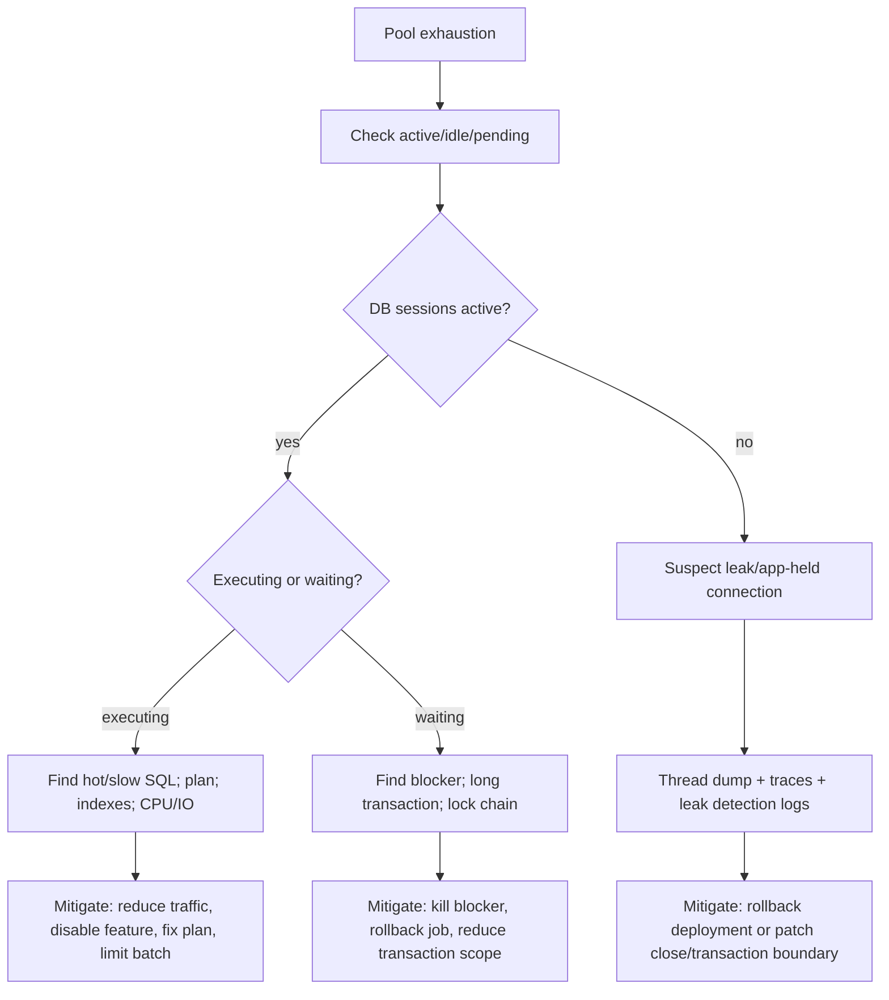
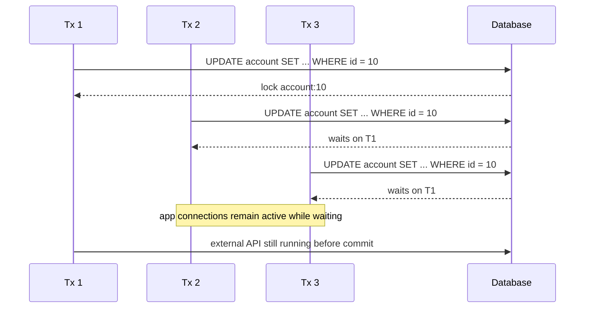
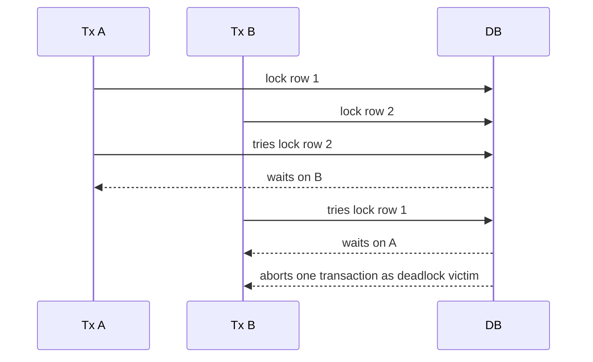
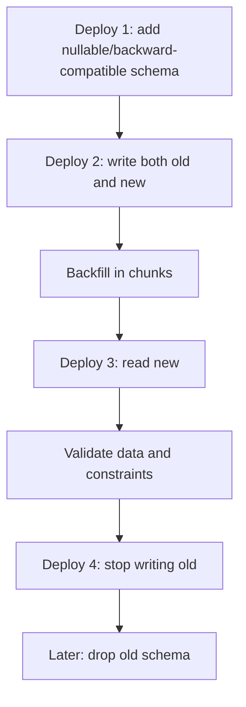

# Part 031 — Production Failure Modes and Incident Playbooks

Production JDBC incident rarely starts as "JDBC is broken".

It usually starts as one of these symptoms:

- API latency suddenly rises.
- HikariCP active connections stay near `maximumPoolSize`.
- Pending threads grow.
- A few endpoints return timeout while others remain healthy.
- Database CPU is low, but requests are stuck.
- Database CPU is high, and every service blames the database.
- Deadlocks appear after a seemingly harmless deployment.
- A migration locks a hot table.
- A failover happens, but application recovery is slower than expected.
- A batch job starves online traffic.
- A retry storm turns a small failure into a fleet-wide incident.

This part is not about memorizing individual errors. It is about building a **failure-mode mental model** and a set of incident playbooks that let us quickly answer:

1. Is the application waiting for a connection, executing SQL, waiting on locks, waiting on network, or blocked by its own transaction design?
2. Is this a local service issue, fleet-wide pool pressure, or database-side capacity/lock issue?
3. Should we mitigate by shedding traffic, reducing concurrency, killing blockers, rolling back deployment, disabling a feature, or changing database state?
4. What evidence proves the root cause?

The senior-level skill is not "knowing Hikari settings". It is the ability to connect metrics, logs, traces, thread dumps, database sessions, lock views, query plans, and deployment history into a coherent causal chain.

---

## 1. Production Mental Model

A JDBC request crosses multiple bounded resources.



When latency rises, the request may be blocked at any of these stages:

| Stage | Main wait | Typical evidence |
|---|---:|---|
| App thread queue | request waiting before handler | HTTP server queue, executor saturation |
| Pool acquisition | waiting for connection | Hikari pending threads, acquisition timeout |
| Query execution | database work | slow query log, DB CPU/IO, query plan |
| Lock wait | blocked by another transaction | lock views, blocked sessions, long transactions |
| Network/socket | packet loss, DNS, TLS, failover | socket timeout, connection reset, driver logs |
| Result mapping | app CPU/memory | heap pressure, GC, long mapper span |
| Commit | WAL/fsync/replication/constraint | commit latency, DB write pressure |
| Return to pool | leaked/held connection | active connections high, no matching close |

A bad incident response jumps to tuning. A good incident response first localizes the wait.

---

## 2. The Diagnostic Ladder

Use the same ladder every time. Do not start with random guesses.



The key questions:

- Did we get a connection quickly?
- Once we had a connection, what SQL was running?
- Was the SQL executing or waiting?
- Which transaction was holding the lock?
- Were connections returned?
- Did retries multiply the load?
- Did a deployment, migration, or batch job change the workload?

---

## 3. Evidence Checklist

Before changing config, collect evidence.

### 3.1 Application evidence

Capture:

- endpoint/consumer name;
- request rate;
- error rate;
- latency percentiles: p50, p95, p99, max;
- Hikari active, idle, pending;
- Hikari acquisition time;
- Hikari timeout count;
- transaction duration;
- query duration by SQL template;
- retry attempts;
- thread pool active/queued/rejected;
- GC pause;
- deployment timestamp;
- configuration diff.

### 3.2 Database evidence

Capture:

- active sessions;
- idle-in-transaction sessions;
- blocked/blocking sessions;
- longest transaction age;
- slowest SQL templates;
- query plans for hot SQL;
- locks held and waited;
- deadlock logs;
- CPU/IO/WAL/replication lag;
- max connection usage;
- migration/job activity.

### 3.3 Correlation evidence

Use request/correlation ID and DB session tags when possible:

```sql
-- PostgreSQL example: tag connection/session for correlation.
SET application_name = 'case-service requestId=abc123 worker=api';
```

Do not rely only on application logs. The database sees wait states that the application cannot infer.

---

## 4. Failure Mode: Pool Exhaustion

Pool exhaustion means application threads are waiting for pooled connections.

It does **not** automatically mean the pool is too small.

### 4.1 Symptoms

- Hikari active connections near `maximumPoolSize`.
- Hikari idle connections near zero.
- Pending threads > 0.
- `SQLTransientConnectionException` or messages like connection not available after `connectionTimeout`.
- API latency looks like the configured acquisition timeout.
- DB may be idle, busy, or locked depending on root cause.

### 4.2 Common causes

| Cause | Pattern |
|---|---|
| Slow query | connections held while DB executes slowly |
| Lock wait | queries blocked behind long transaction |
| Connection leak | borrowed connection never returned |
| Long transaction | external call/business work inside transaction |
| Batch job | online pool consumed by bulk workload |
| Pool-locking | nested connection acquisition inside same request |
| Retry storm | failed attempts multiply demand |
| DB max connection pressure | physical connections cannot be opened/replaced |
| Network/failover | validation/creation stalls |

### 4.3 Immediate triage

Ask:

1. Are active connections doing useful SQL?
2. Are they blocked?
3. Are they idle in transaction?
4. Are they held by app code after SQL already finished?
5. Did pending threads start after a deployment or traffic spike?

### 4.4 Playbook



### 4.5 What not to do

Do not immediately increase `maximumPoolSize`.

Increasing pool size can:

- push more concurrent work into an already saturated database;
- increase lock contention;
- increase context switching;
- consume DB max connections;
- hide leaks temporarily;
- make the next incident bigger.

Increase pool size only after proving the database can safely process more concurrent sessions and the current limit is the bottleneck.

---

## 5. Failure Mode: Connection Leak

A leak means application code borrowed a connection and failed to return it.

With HikariCP, `Connection.close()` on a pooled connection returns it to the pool. Forgetting `close()` means the pool permanently loses capacity until the connection is reclaimed or the process restarts.

### 5.1 Symptoms

- Active connections slowly climb and never return.
- Idle goes to zero over time.
- Pending grows later.
- Database sessions may show little activity.
- Leak detection logs may include stack traces.
- Restart temporarily fixes the issue.

### 5.2 Causes

- Missing try-with-resources.
- Exception path skips cleanup.
- Connection stored as field.
- ResultSet/Statement/Connection lifecycle split across layers.
- Async work uses a connection after request returns.
- Manual transaction code forgets rollback/close.
- Custom abstraction hides ownership.

### 5.3 Leak pattern

```java
Connection con = dataSource.getConnection();
PreparedStatement ps = con.prepareStatement(sql);
ResultSet rs = ps.executeQuery();
return map(rs); // if map throws, nothing is closed
```

Better:

```java
try (Connection con = dataSource.getConnection();
     PreparedStatement ps = con.prepareStatement(sql);
     ResultSet rs = ps.executeQuery()) {
    return map(rs);
}
```

### 5.4 Incident playbook

1. Check active/idle/pending trend.
2. Enable or inspect Hikari leak detection logs.
3. Capture thread dump while active connections are high.
4. Find code paths with connection borrow but missing close.
5. Search for `getConnection()` usage outside approved abstractions.
6. Roll back deployment if leak started with release.
7. Patch ownership: connection must be closed by the same boundary that borrows it.
8. Add integration test that exhausts pool if close is missing.

### 5.5 Engineering invariant

A connection must not cross an uncontrolled boundary:

- not stored in object field;
- not passed to async task;
- not cached;
- not returned from DAO;
- not shared between requests;
- not closed by a different architectural layer unless that layer explicitly owns the lifecycle.

---

## 6. Failure Mode: Slow Query Cascade

A slow query cascade occurs when one or more SQL templates become slower, causing connections to be held longer, increasing pool pressure, creating pending threads, increasing request latency, and triggering retries that add more load.

### 6.1 Symptoms

- Query p95/p99 rises.
- Hikari active rises.
- Pending threads rise after query latency rises.
- DB CPU/IO may be high.
- Slow query logs show same SQL template repeatedly.
- Retry attempts increase.

### 6.2 Causes

- Missing or unused index.
- Parameter distribution changed.
- Query plan regression.
- Data volume growth.
- Bad pagination.
- Full table scan.
- N+1 query pattern.
- Large result mapping.
- New feature adds broad filter.
- Statistics stale.

### 6.3 Playbook

1. Identify top SQL by total time, not only max time.
2. Normalize SQL by template.
3. Compare before/after deployment or data growth.
4. Run `EXPLAIN`/`EXPLAIN ANALYZE` safely in non-production or controlled production context.
5. Check rows scanned vs rows returned.
6. Check index selectivity.
7. Check result size and fetch/mapping time.
8. Mitigate:
   - disable feature flag;
   - reduce page size;
   - add selective index;
   - use keyset pagination;
   - split query;
   - cache safe reads;
   - reduce retry concurrency.

### 6.4 Anti-pattern

```txt
Symptom: pool exhausted
Wrong conclusion: increase maximumPoolSize
Actual cause: one query went from 20 ms to 4 seconds
```

Pool exhaustion can be downstream of slow SQL. Fix the slow SQL or reduce the demand. Do not only tune the pool.

---

## 7. Failure Mode: Lock Storm

A lock storm occurs when transactions block each other in a way that amplifies latency and pool pressure.

### 7.1 Symptoms

- DB CPU may be low while app latency is high.
- Many sessions are active but waiting on locks.
- Hikari active high; pending grows.
- Long transaction age.
- Update/delete endpoints affected more than reads.
- Deadlocks may appear later.

### 7.2 Common causes

- Updating rows in inconsistent order.
- Large transaction touches many rows.
- Batch job updates hot table.
- Migration locks table.
- `SELECT ... FOR UPDATE` used too broadly.
- Missing index causes update/delete to scan and lock many rows.
- Business process holds transaction during external call.
- User think-time inside transaction.

### 7.3 Lock chain model



The real bug is often not the waiting transaction. It is the blocker.

### 7.4 Playbook

1. Identify blocked sessions.
2. Identify blocking session.
3. Find transaction age and SQL of blocker.
4. Determine if blocker is legitimate, stuck, idle-in-transaction, or migration/batch.
5. Mitigate:
   - kill/terminate blocker if safe;
   - pause batch job;
   - roll back migration;
   - reduce write concurrency;
   - disable hot endpoint;
   - shorten transaction scope.
6. Post-incident:
   - enforce lock ordering;
   - chunk bulk updates;
   - add index;
   - move external calls outside transaction;
   - add lock timeout and retry-safe path.

---

## 8. Failure Mode: Deadlock Spike

A deadlock is not just slow. It is a cycle of waits. The database resolves it by aborting one transaction.

### 8.1 Typical pattern



### 8.2 Symptoms

- Deadlock errors increase.
- Individual transaction fails fast-ish after DB detection.
- Retry may succeed if operation is retry-safe.
- Deadlocks cluster around specific SQL templates.
- New deployment introduced different update ordering.

### 8.3 Root causes

- Inconsistent row access order.
- Multiple indexes updated in conflicting patterns.
- Batch workers process overlapping keys.
- Parent/child updates in different order.
- Upsert on hot unique key.
- Mixed pessimistic lock and normal update paths.

### 8.4 Playbook

1. Capture deadlock graph/log from database.
2. Identify participating statements and tables.
3. Identify access order.
4. Check recent deployment or schema/index changes.
5. Mitigate:
   - reduce concurrency;
   - partition work by key;
   - enforce deterministic lock order;
   - retry only idempotent operation;
   - use shorter transaction;
   - isolate hot workload.
6. Add regression test with concurrent workers.

### 8.5 Engineering rule

When a use case locks multiple rows/entities, it must lock them in deterministic order.

Example:

```java
List<Long> orderedIds = requestedIds.stream()
    .sorted()
    .toList();

for (Long id : orderedIds) {
    lockAccount(con, id);
}
```

This is not a micro-optimization. It is a correctness control.

---

## 9. Failure Mode: Idle in Transaction

Idle-in-transaction means a transaction is open but currently not executing SQL.

This is dangerous because it may keep locks, snapshots, resources, and connection capacity alive.

### 9.1 Symptoms

- Database shows sessions `idle in transaction`.
- Long transaction age.
- Vacuum/version cleanup issues in MVCC databases.
- Locks retained unexpectedly.
- Pool active high but SQL activity low.
- Requests wait for locks held by idle transaction.

### 9.2 Causes

- Transaction opened too early.
- External API call inside transaction.
- Waiting for user input inside transaction.
- Slow business logic after query before commit.
- Exception swallowed without rollback.
- Streaming response while transaction remains open.

### 9.3 Playbook

1. Find idle-in-transaction sessions.
2. Map session to service/endpoint/request if tagged.
3. Check transaction age.
4. Check last query.
5. Terminate if it blocks critical workload and rollback is safe.
6. Refactor:
   - open transaction later;
   - commit earlier;
   - remove external calls from transaction;
   - separate read phase and write phase;
   - use outbox for side effects.

### 9.4 Anti-pattern

```java
@Transactional
public void approveCase(ApprovalCommand command) {
    Case c = repository.findForUpdate(command.caseId());
    fraudService.callExternalScreening(c); // transaction and lock remain open
    c.approve();
    repository.save(c);
}
```

Better:

```java
public void approveCase(ApprovalCommand command) {
    ScreeningResult result = fraudService.callExternalScreening(command.caseId());

    transactionTemplate.executeWithoutResult(status -> {
        Case c = repository.findForUpdate(command.caseId());
        c.approveWith(result);
        repository.save(c);
        outbox.enqueue(CaseApprovedEvent.from(c));
    });
}
```

---

## 10. Failure Mode: Pool-Locking / Nested Connection Demand

Pool-locking happens when a request holds one connection and tries to acquire another connection before releasing the first.

### 10.1 Example

```java
transactionTemplate.executeWithoutResult(status -> {
    repository.updateMainRecord(...); // holds connection A
    auditRepository.writeAuditWithNewTransaction(...); // tries connection B
});
```

If many threads do this concurrently, the pool can deadlock at the application level.

### 10.2 Symptoms

- All active connections are held by requests waiting for another connection.
- Pending threads equal or exceed request concurrency.
- Database is not necessarily busy.
- Thread dumps show nested transaction/acquire.
- Hikari timeout occurs even though DB has capacity.

### 10.3 Mitigation

- Avoid nested transactions that require separate connection.
- Use same transaction when atomicity is required.
- Use outbox instead of separate audit connection when possible.
- If `REQUIRES_NEW` is necessary, size pool using nested demand formula and cap concurrency.
- Split workload into separate executor/pool.

### 10.4 Review question

For every `REQUIRES_NEW`, ask:

> Can this path be called while an outer transaction already holds a connection?

If yes, model worst-case connection demand explicitly.

---

## 11. Failure Mode: Database Max Connections Exhausted

Application pools are not isolated from database limits.

If a service has 20 instances and each instance has `maximumPoolSize=30`, that service alone can attempt 600 database sessions. Add migrations, workers, admin tools, read replicas, and other services: the database may reject new sessions.

### 11.1 Symptoms

- New connections fail.
- Existing connections may continue.
- Hikari cannot replenish dead/expired connections.
- Startup readiness fails.
- Failover recovery is slow because all instances reconnect simultaneously.

### 11.2 Causes

- Per-instance pool size ignores fleet size.
- Horizontal scaling without DB capacity update.
- Blue/green deployment doubles connections temporarily.
- Autoscaling surge.
- Separate pools for read/write/batch not accounted.
- Admin/migration jobs use same database user/limit.

### 11.3 Playbook

1. Calculate total configured connection demand:

```txt
fleet_demand = sum(instance_count(service) × pools_per_instance × max_pool_size)
```

2. Compare against DB max connections and reserved admin capacity.
3. Lower pool sizes or instance count if demand exceeds budget.
4. Add connection limit per database role if supported.
5. Stagger deployment/restart.
6. Use separate DB users for app, migration, admin, batch.
7. Prefer smaller pools with backpressure over allowing every instance to flood DB.

---

## 12. Failure Mode: Stale Connections and Network Failover

A connection can become invalid because the database restarts, network path changes, firewall/NAT drops idle connections, TLS session breaks, or failover moves the primary.

### 12.1 Symptoms

- First query after idle fails.
- Connection reset / broken pipe.
- SQL recoverable/transient connection errors.
- Many instances fail simultaneously after DB restart/failover.
- Hikari replaces connections over time.
- Recovery depends on validation, keepalive, socket settings, and driver behavior.

### 12.2 Key distinction

| Problem | Meaning |
|---|---|
| stale idle connection | pool has connection that network/DB already killed |
| failover | old primary unavailable; new primary may have different endpoint/state |
| DNS lag | app resolves old endpoint or caches too long |
| socket hang | driver waits because network failure is not immediately detected |
| transaction ambiguity | failure happened around commit boundary |

### 12.3 Playbook

1. Check DB restart/failover timeline.
2. Check Hikari connection creation/validation errors.
3. Check driver/network errors.
4. Ensure `maxLifetime` is lower than external connection kill time.
5. Configure keepalive where useful.
6. Verify login timeout/socket timeout at driver level.
7. Avoid infinite retries.
8. Treat commit failure as ambiguous if failure occurred during/after commit.
9. Recover through idempotency keys and read-after-failure checks.

### 12.4 Anti-pattern

```txt
A write failed with network error after commit was sent.
Wrong response: retry insert blindly.
Correct response: check idempotency key / natural key / outbox state.
```

---

## 13. Failure Mode: Migration Lock Incident

Schema migration can take locks that block application traffic.

### 13.1 Symptoms

- Incident begins exactly at migration deployment.
- Hot table queries blocked.
- Lock waits increase.
- Application pool exhausts because connections wait on DDL lock.
- Migration appears "stuck".

### 13.2 Common dangerous operations

The exact behavior depends on database, table size, version, and operation, but risky categories include:

- adding non-null column with expensive default;
- altering column type;
- creating index without online/concurrent option;
- dropping/renaming hot column/table;
- long backfill in one transaction;
- foreign key validation on large table;
- migration mixed with application deployment requiring both old and new schema simultaneously.

### 13.3 Playbook

1. Identify migration SQL currently running.
2. Identify locks held and waited.
3. Decide whether to cancel migration or let it finish.
4. If blocked traffic is severe, cancel/rollback if safe.
5. Disable app path that contends with migration if possible.
6. Post-incident:
   - use expand/contract migration;
   - separate DDL and backfill;
   - chunk backfill;
   - use online index strategy;
   - add lock timeout for migration session;
   - rehearse migration on production-like data volume.

### 13.4 Expand/contract sequence



This pattern reduces lock risk and deployment coupling.

---

## 14. Failure Mode: Batch Job Starves Online Traffic

Batch jobs often use the same database as online traffic, but their resource shape is different.

### 14.1 Symptoms

- Online latency rises during batch window.
- Hikari pool active high in worker service.
- DB CPU/IO/WAL high.
- Locks on hot tables.
- Replication lag.
- Large commits.
- Autovacuum/version cleanup pressure.

### 14.2 Causes

- Batch uses same pool as API traffic.
- Batch has too many workers.
- Large transaction touches many rows.
- Missing chunk checkpointing.
- No rate limit/backpressure.
- Query scans hot table repeatedly.
- Writes create index/WAL pressure.

### 14.3 Playbook

1. Pause or reduce batch concurrency.
2. Separate online and batch pools/users if possible.
3. Add chunk size and sleep/backoff.
4. Track checkpoint progress.
5. Use selective indexes.
6. Avoid long locks.
7. Observe DB lag and lock pressure.
8. Resume gradually.

### 14.4 Design rule

Batch jobs must have:

- explicit concurrency limit;
- explicit batch size;
- explicit transaction size;
- checkpoint/resume mechanism;
- separate pool or workload class when they can harm online traffic;
- observability per chunk;
- idempotency.

---

## 15. Failure Mode: Retry Storm

Retry is useful only when bounded and safe. Without limits, retry converts a small error into multiplied load.

### 15.1 Symptoms

- Request rate to DB exceeds user traffic.
- Same operation appears multiple times in traces.
- Error rate rises, then CPU/pool/DB load rises further.
- Cascading failure across services.
- Deadlocks or serialization failures increase after retry deployment.

### 15.2 Causes

- Retrying non-idempotent writes.
- Immediate retries without backoff.
- Multiple layers retrying independently.
- Retrying pool acquisition timeout.
- Retrying during database overload.
- No global deadline.

### 15.3 Playbook

1. Disable or reduce retry at feature/config level.
2. Check if retry is inside or outside transaction boundary.
3. Check if operation has idempotency key.
4. Add exponential backoff with jitter.
5. Add retry budget.
6. Respect request deadline.
7. Do not retry when the system is saturated unless explicitly safe and bounded.

### 15.4 Rule

Retry requires two proofs:

1. The failure is plausibly transient.
2. Re-executing the operation is safe.

Without both, retry is a data corruption or overload mechanism.

---

## 16. Failure Mode: Commit Ambiguity

Commit ambiguity is one of the most under-modeled JDBC failure modes.

A network error around `commit()` does not always mean rollback happened. The database may have committed, but the client did not receive the acknowledgement.

### 16.1 Symptoms

- Write operation returns error to caller.
- Later, data appears committed.
- Retry creates duplicate unless guarded.
- Audit/outbox mismatch if side effects are not modeled correctly.

### 16.2 Playbook

1. Treat post-commit network failure as unknown outcome.
2. Use idempotency key or natural unique key to detect prior success.
3. Read current state before retrying destructive/non-idempotent operation.
4. Ensure outbox record is in same transaction as state change.
5. Return deterministic response when prior success is found.

### 16.3 Pattern

```java
try {
    transactionTemplate.executeWithoutResult(status -> {
        repository.insertPaymentAttempt(idempotencyKey, command);
        repository.applyPayment(command);
        outbox.enqueue(PaymentAppliedEvent.of(command));
    });
    return PaymentResult.accepted(idempotencyKey);
} catch (TransientDataAccessException ex) {
    return repository.findByIdempotencyKey(idempotencyKey)
        .map(existing -> PaymentResult.accepted(existing.idempotencyKey()))
        .orElseThrow(() -> ex);
}
```

This avoids blind duplicate write after uncertain failure.

---

## 17. Failure Mode: Read Replica Lag and Read-Your-Writes Violation

If a system uses read/write splitting, a write may commit on primary before replicas catch up.

### 17.1 Symptoms

- User updates data then immediately reads old value.
- Tests pass locally but fail in distributed deployment.
- Audit/admin screens disagree temporarily.
- Retry makes it worse by repeating writes.

### 17.2 Causes

- Reading from replica immediately after write.
- No consistency token.
- Read routing ignores use-case requirements.
- Cache populated from stale replica.

### 17.3 Playbook

1. Identify which reads require read-your-writes.
2. Route those reads to primary for a bounded window.
3. Use version/checkpoint token where available.
4. Make UI tolerant of eventual consistency only where business permits.
5. Do not solve consistency by arbitrary sleep.

### 17.4 Rule

Read routing is not a performance-only decision. It is a consistency decision.

---

## 18. Failure Mode: Result Streaming Holds Connection Too Long

Streaming avoids memory blowup, but it can hold database resources and pool connection for a long time.

### 18.1 Symptoms

- Export/download endpoint consumes active connection for minutes.
- Pool pressure during reports.
- Client disconnect leaves work running.
- Long-running read transaction affects database cleanup.

### 18.2 Playbook

1. Isolate export/reporting pool.
2. Set fetch size and result streaming intentionally.
3. Apply max export size.
4. Use async job + object storage for large exports.
5. Cancel query on client disconnect where supported.
6. Avoid streaming inside write transaction.
7. Monitor connection hold time by endpoint.

### 18.3 Rule

Streaming solves memory pressure by moving the pressure to connection duration. Design for that trade-off.

---

## 19. Thread Dump Patterns

Thread dumps are useful when application metrics show saturation but database metrics do not explain it.

Look for:

- threads blocked in `HikariPool.getConnection`;
- threads blocked in JDBC driver socket read;
- threads executing mapper/business logic after SQL;
- threads waiting in external API while transaction is active;
- deadlocked Java monitors unrelated to DB;
- worker pool starvation.

Example clues:

```txt
at com.zaxxer.hikari.pool.HikariPool.getConnection(...)
at com.zaxxer.hikari.pool.HikariPool.getConnection(...)
at com.zaxxer.hikari.HikariDataSource.getConnection(...)
```

This suggests acquisition wait.

```txt
at java.net.SocketInputStream.socketRead0(...)
at org.postgresql.core.VisibleBufferedInputStream.readMore(...)
```

This suggests driver waiting on database/network response.

Do not interpret one thread stack in isolation. Correlate with DB sessions.

---

## 20. Hikari Metrics Interpretation

| Metric shape | Likely meaning | Next step |
|---|---|---|
| active high, idle zero, pending high | pool exhausted | find why connections are held |
| active high, DB active SQL high | DB/query work | inspect top SQL/plans |
| active high, DB lock waits high | blocked transactions | find blockers |
| active high, DB quiet | leak/app-held connection | thread dump/traces/leak logs |
| idle high, pending zero, latency high | not pool bottleneck | look at app/DB/query/network |
| acquisition p99 near timeout | pool contention | inspect connection hold time |
| frequent connection creation | churn/network/maxLifetime | inspect DB/network/validation |
| leak logs appear | long-held or leaked connection | verify with traces before assuming leak |

Leak detection can flag legitimate long-held operations too. Treat it as a clue, not a final verdict.

---

## 21. Incident Communication Template

During an incident, communication should separate symptom, evidence, hypothesis, action, and risk.

```txt
Symptom:
- API p99 increased from 180ms to 6s since 10:12 UTC.
- Error rate 0.2% -> 8%, mostly database connection acquisition timeout.

Evidence:
- Hikari active=30/30, idle=0, pending=120.
- DB shows 28 sessions waiting on lock held by session 12345.
- Blocker is migration ALTER TABLE case_event started at 10:10 UTC.

Hypothesis:
- Pool exhaustion is downstream of migration lock contention.

Mitigation:
- Cancelling migration session 12345.
- Pausing deployment pipeline.
- Temporarily reducing write traffic through feature flag X.

Risk:
- Migration rollback may take N minutes depending on DB state.
- Need post-incident expand/contract migration redesign.
```

This style avoids vague phrases like "DB is slow".

---

## 22. Mitigation Decision Matrix

| Root cause | Fast mitigation | Durable fix |
|---|---|---|
| connection leak | rollback/restart temporarily | lifecycle ownership + test |
| slow query | disable feature/reduce page size | index/query redesign |
| lock storm | kill blocker/reduce write concurrency | transaction scope + lock order |
| deadlock spike | reduce concurrency/retry safe victim | deterministic access order |
| migration lock | cancel/pause migration | online migration strategy |
| batch starvation | pause batch | separate pool + rate limit |
| DB max connections | lower pool/instances | fleet connection budget |
| stale connections | recycle pool/restart if needed | maxLifetime/keepalive/socket config |
| retry storm | disable retry | retry budget + idempotency |
| commit ambiguity | reconcile by key | idempotency design |

---

## 23. Post-Incident Review Framework

A useful postmortem for JDBC incident should answer:

### 23.1 Causal chain

- What changed?
- What resource saturated first?
- What symptom was downstream?
- What feedback loop amplified it?
- Why did existing guardrails not stop it?

### 23.2 Missing signal

- Did we know acquisition latency separately from query latency?
- Did we know connection hold time?
- Did we know transaction duration?
- Did we know blocked/blocking sessions?
- Did we know retry count?
- Did we have SQL template-level latency?

### 23.3 Missing control

- Could we shed traffic?
- Could we disable feature?
- Could we pause batch?
- Could we cap concurrency?
- Could migration time out instead of waiting forever?
- Could retry budget stop amplification?

### 23.4 Design correction

- Smaller transaction scope?
- Better index/query?
- Safer migration pattern?
- Pool isolation?
- Idempotency key?
- Lock ordering?
- Separate read/write/batch route?
- Better test/failure injection?

---

## 24. Production Readiness Checklist

Before a JDBC-heavy service is considered production-ready:

### Connection and pool

- [ ] `DataSource` is used as central connection factory.
- [ ] HikariCP pool lifecycle is application-scoped, not request-scoped.
- [ ] `maximumPoolSize` is justified by workload and fleet DB budget.
- [ ] `connectionTimeout` is finite and aligned with request deadline.
- [ ] `maxLifetime` is below external connection kill time.
- [ ] Pool metrics are exported.
- [ ] Connection acquisition latency is visible.
- [ ] Connection hold time is visible.

### Transaction

- [ ] Transaction boundary is at use-case/application service layer.
- [ ] External calls do not run inside database transaction.
- [ ] Long-running export/reporting does not use online write pool.
- [ ] Rollback path is explicit.
- [ ] Commit ambiguity is considered for critical writes.
- [ ] Retry is outside transaction boundary unless intentionally modeled.

### Query

- [ ] SQL templates are observable.
- [ ] Slow query threshold exists.
- [ ] Index assumptions are documented.
- [ ] Pagination is bounded.
- [ ] Large result sets use streaming or async export deliberately.

### Locking

- [ ] Multi-row writes use deterministic order.
- [ ] Lock timeout is configured where safe.
- [ ] Batch updates are chunked.
- [ ] Hot rows/tables are identified.

### Failure

- [ ] Pool exhaustion alert exists.
- [ ] Deadlock/serialization retry is idempotent.
- [ ] DB failover behavior is tested.
- [ ] Migration lock risk is reviewed.
- [ ] Batch jobs have concurrency limit.
- [ ] Runbook exists and is discoverable.

---

## 25. Capstone Exercise

You are on-call. A Java service starts returning 500 errors.

Known facts:

```txt
Time: 14:05
Deployment: no application deployment in last 2 hours
Migration: started at 14:00
Hikari maximumPoolSize: 20
Hikari active: 20
Hikari idle: 0
Hikari pending: 75
Acquisition timeout: 3000 ms
DB CPU: 20%
DB sessions: 20 from service
DB wait: 18 sessions waiting on lock
Blocking session: migration user, ALTER TABLE customer_case ADD COLUMN risk_score integer DEFAULT 0 NOT NULL
```

Questions:

1. Is the pool too small?
2. What is the root cause?
3. What should you do in the first 5 minutes?
4. What is the durable engineering fix?

Expected reasoning:

- The pool is exhausted, but it is not proven too small.
- Connections are held because sessions wait on migration lock.
- Fast mitigation is to cancel/pause migration if safe and reduce affected traffic.
- Durable fix is online/expand-contract migration with lock timeout and production-sized rehearsal.

---

## 26. Summary

Production JDBC mastery is failure modeling.

You need to distinguish:

- pool exhaustion caused by slow SQL;
- pool exhaustion caused by lock waits;
- pool exhaustion caused by leaks;
- database overload caused by too much concurrency;
- low database CPU caused by blocked transactions;
- stale connection after failover;
- retry-safe transient failure vs unsafe ambiguous write;
- batch throughput vs online latency;
- migration success in staging vs lock disaster in production.

The durable skill is to localize the wait, prove the causal chain, mitigate without amplifying the failure, and redesign the boundary so the same incident becomes less likely next time.

---

## References

- Java SE 25 `Statement` and timeout-related JDBC behavior.
- Java SE 25 `SQLTimeoutException`.
- HikariCP official README and configuration documentation.
- PostgreSQL lock management, explicit locking, and lock monitoring documentation.
- OWASP SQL Injection Prevention Cheat Sheet for security context that influences production playbooks.
