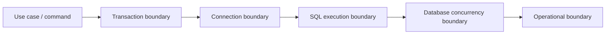
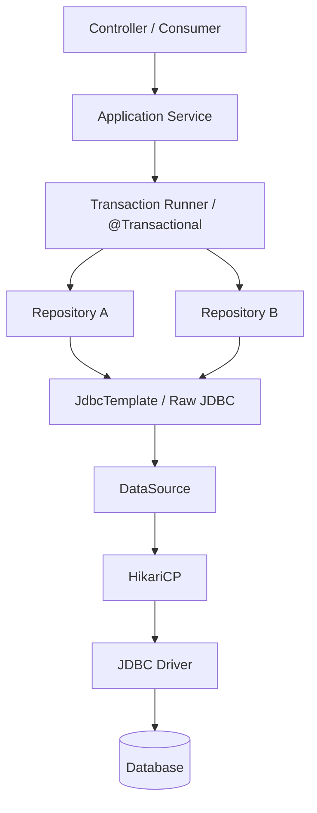
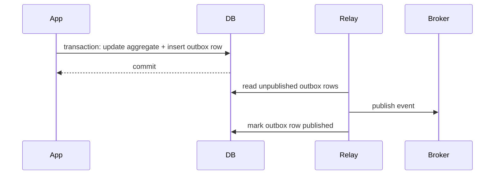
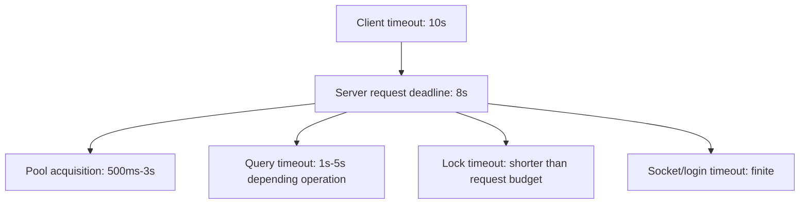
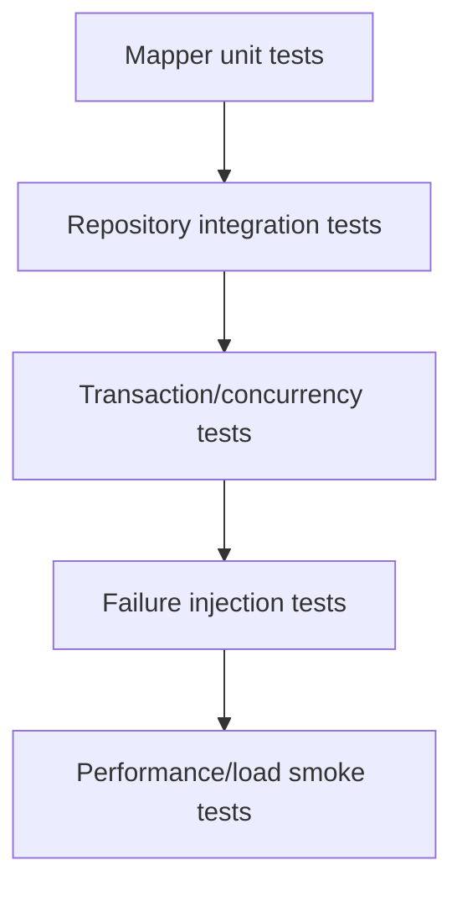
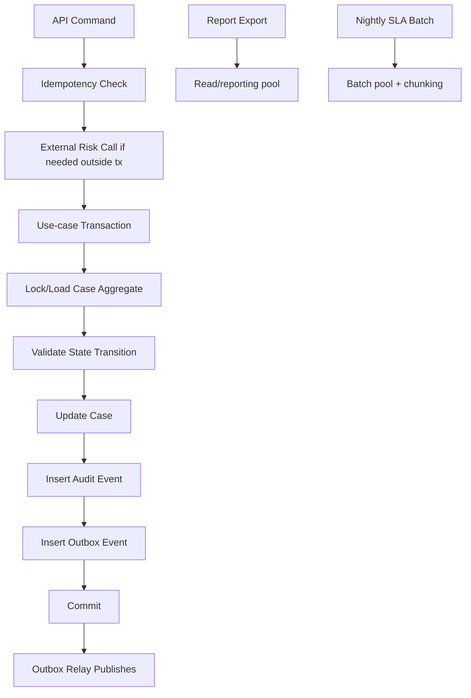

# Part 032 — Patterns, Anti-Patterns, and Final Engineering Handbook

This is the final part of the series.

The goal is not to repeat every detail from parts 001–031. The goal is to compress the series into an engineering handbook that can be used during:

- architecture review;
- code review;
- design review;
- production readiness review;
- incident response;
- performance tuning;
- migration planning;
- security review;
- team onboarding.

A top-tier Java engineer does not merely know JDBC APIs. They know the invariants that keep database access correct under load, failure, concurrency, partial deployment, schema change, and operational pressure.

---

## 1. Final Mental Model

Every database operation crosses five boundaries.



Each boundary has a different failure mode.

| Boundary | Core question | Failure if ignored |
|---|---|---|
| Use case | What invariant must be preserved? | inconsistent business state |
| Transaction | What must commit atomically? | partial writes / lock duration |
| Connection | Who owns and closes it? | leaks / pool exhaustion |
| SQL execution | What SQL shape and data volume? | slow queries / memory pressure |
| DB concurrency | What locks/isolation are needed? | deadlocks / lost updates |
| Operations | How do we observe/recover? | blind incidents / unsafe tuning |

This handbook is organized around those boundaries.

---

## 2. Golden Rules

### Rule 1 — A connection is not a database abstraction; it is a scarce session handle

A JDBC `Connection` represents a live conversation with the database. In pooled systems, it is a borrowed scarce resource.

Therefore:

- borrow late;
- return early;
- do not store it;
- do not share it across threads;
- do not pass it across uncontrolled boundaries;
- never do slow non-database work while holding it.

### Rule 2 — Transaction boundary belongs to the use case, not the DAO

DAO/repository methods should participate in a transaction; they should not casually open their own transaction.

Good mental model:

```txt
Application service owns transaction.
Repository owns SQL.
DataSource/pool owns connection acquisition.
Database owns concurrency semantics.
```

### Rule 3 — A pool is a backpressure mechanism, not a performance multiplier

Increasing pool size increases allowed concurrency. It does not guarantee increased throughput.

A larger pool can make things worse when the database is already CPU-bound, IO-bound, lock-bound, or max-connection-bound.

### Rule 4 — Timeout hierarchy must be intentional

Timeouts should form a coherent deadline model:

```txt
client/request deadline
  > app handler budget
    > pool acquisition timeout
      + query/lock/socket timeout
        < outer request timeout
```

A database operation should fail early enough for the application to release resources and return a controlled response.

### Rule 5 — Retry needs idempotency

Retrying a write without idempotency is a data corruption risk.

Every retry strategy must answer:

- Which errors are retryable?
- Is the operation safe to repeat?
- Is there a unique/idempotency key?
- What happens if commit succeeded but acknowledgement failed?
- What is the retry budget?

### Rule 6 — Isolation level names are not portable guarantees

`READ_COMMITTED`, `REPEATABLE_READ`, and `SERIALIZABLE` are not enough as design documentation.

Document the actual database behavior, including MVCC, locks, gap/range locks, serialization failures, and whether the invariant is also enforced by constraints.

### Rule 7 — Dynamic SQL must separate values from identifiers

Values should be bound with `PreparedStatement`.

Identifiers such as table name, column name, direction, and sort field cannot be parameter-bound in the same way. They require allowlists.

### Rule 8 — Batch work needs its own resource model

Batch and online workloads have different shapes. Batch must have:

- chunk size;
- concurrency limit;
- checkpointing;
- idempotency;
- pool isolation when needed;
- lock/timeout strategy.

### Rule 9 — Observability is part of the design

If we cannot answer where the request is waiting, the design is incomplete.

Minimum signals:

- pool active/idle/pending;
- acquisition latency;
- connection hold time;
- query latency by SQL template;
- transaction duration;
- rollback/commit/error counters;
- retry count;
- lock/deadlock visibility;
- correlation ID from request to DB session.

### Rule 10 — Migrations are production operations, not only schema changes

A migration can block application traffic, break old code, break new code, or exhaust DB resources.

Use expand/contract, lock timeout, chunked backfill, production-sized rehearsal, and rollback/forward-fix plan.

---

## 3. Canonical Architecture Pattern

A clean JDBC architecture separates lifecycle concerns.



Ownership:

| Layer | Owns | Must not own |
|---|---|---|
| Controller/consumer | transport validation | DB transaction |
| Application service | use-case transaction boundary | SQL string details |
| Repository | SQL and row mapping | transaction lifecycle |
| JdbcTemplate/raw JDBC | execution mechanics | business invariant |
| DataSource/HikariCP | connection acquisition/pool lifecycle | SQL semantics |
| Database | constraints/concurrency/storage | application workflow |

---

## 4. Transaction Boundary Patterns

### 4.1 Single use-case transaction

Use when all writes must commit atomically.

```java
public void approveCase(ApproveCaseCommand command) {
    transactionTemplate.executeWithoutResult(status -> {
        CaseRecord caseRecord = caseRepository.findForUpdate(command.caseId());
        caseRecord.approve(command.approverId());

        caseRepository.update(caseRecord);
        auditRepository.insert(AuditEvent.caseApproved(caseRecord));
        outboxRepository.enqueue(CaseApprovedEvent.from(caseRecord));
    });
}
```

Properties:

- one connection;
- one transaction;
- database invariant protected;
- outbox event atomic with state change;
- no external API call inside transaction.

### 4.2 Precompute outside transaction, commit inside transaction

Use when expensive work is needed but should not hold locks.

```java
public void completeReview(ReviewCommand command) {
    RiskScore score = riskEngine.calculate(command.caseId());

    transactionTemplate.executeWithoutResult(status -> {
        CaseRecord c = caseRepository.findForUpdate(command.caseId());
        c.completeReview(score);
        caseRepository.update(c);
        outboxRepository.enqueue(ReviewCompletedEvent.from(c));
    });
}
```

### 4.3 Outbox pattern for external side effects

Use when database update and message/event/API side effect must be coordinated.



This avoids holding database transaction while publishing externally.

### 4.4 Idempotent command pattern

Use for retries and ambiguous commit.

```java
transactionTemplate.executeWithoutResult(status -> {
    if (commandRepository.exists(command.idempotencyKey())) {
        return;
    }

    commandRepository.insert(command.idempotencyKey(), command.payloadHash());
    accountRepository.apply(command.accountId(), command.amount());
    outboxRepository.enqueue(AccountAdjustedEvent.from(command));
});
```

Database unique constraint on `idempotency_key` is the guardrail.

---

## 5. Connection Management Patterns

### 5.1 Raw JDBC try-with-resources

```java
public Optional<Customer> findById(long id) throws SQLException {
    String sql = """
        SELECT id, name, status
        FROM customer
        WHERE id = ?
        """;

    try (Connection con = dataSource.getConnection();
         PreparedStatement ps = con.prepareStatement(sql)) {
        ps.setLong(1, id);

        try (ResultSet rs = ps.executeQuery()) {
            if (!rs.next()) {
                return Optional.empty();
            }
            return Optional.of(mapCustomer(rs));
        }
    }
}
```

Use for small explicit code or framework-independent libraries.

### 5.2 Transaction runner

```java
public final class TransactionRunner {
    private final DataSource dataSource;

    public TransactionRunner(DataSource dataSource) {
        this.dataSource = dataSource;
    }

    public <T> T inTransaction(SqlFunction<Connection, T> callback) throws SQLException {
        try (Connection con = dataSource.getConnection()) {
            boolean oldAutoCommit = con.getAutoCommit();
            con.setAutoCommit(false);
            try {
                T result = callback.apply(con);
                con.commit();
                return result;
            } catch (Throwable t) {
                try {
                    con.rollback();
                } catch (SQLException rollbackFailure) {
                    t.addSuppressed(rollbackFailure);
                }
                throw t;
            } finally {
                con.setAutoCommit(oldAutoCommit);
            }
        }
    }
}
```

Use when avoiding Spring but still wanting consistent lifecycle.

### 5.3 JdbcTemplate repository

```java
public final class CustomerRepository {
    private final JdbcTemplate jdbcTemplate;

    public Optional<Customer> findById(long id) {
        return jdbcTemplate.query("""
            SELECT id, name, status
            FROM customer
            WHERE id = ?
            """, rs -> {
                if (!rs.next()) {
                    return Optional.empty();
                }
                return Optional.of(mapCustomer(rs));
            }, id);
    }
}
```

Use when Spring is available and resource cleanup/exception translation should be centralized.

---

## 6. SQL Construction Patterns

### 6.1 Static SQL + bound values

Preferred default.

```java
String sql = """
    SELECT id, name, status
    FROM customer
    WHERE tenant_id = ?
      AND status = ?
    ORDER BY created_at DESC
    LIMIT ?
    """;
```

### 6.2 Dynamic filter with bound values

```java
List<Object> params = new ArrayList<>();
StringBuilder sql = new StringBuilder("""
    SELECT id, name, status
    FROM customer
    WHERE tenant_id = ?
    """);
params.add(tenantId);

if (status != null) {
    sql.append(" AND status = ?");
    params.add(status.name());
}

if (createdAfter != null) {
    sql.append(" AND created_at >= ?");
    params.add(createdAfter);
}
```

### 6.3 Dynamic identifier allowlist

```java
enum CustomerSort {
    CREATED_AT("created_at"),
    NAME("name"),
    STATUS("status");

    final String column;

    CustomerSort(String column) {
        this.column = column;
    }
}

String direction = ascending ? "ASC" : "DESC";
String orderBy = sort.column + " " + direction;
```

Do not bind identifiers as normal parameters. Allowlist them.

### 6.4 IN-list expansion

```java
String placeholders = ids.stream()
    .map(id -> "?")
    .collect(Collectors.joining(", "));

String sql = "SELECT * FROM case_file WHERE id IN (" + placeholders + ")";
```

Guard against empty lists and huge lists.

---

## 7. Type Mapping Rules

| Data meaning | Java type | Notes |
|---|---|---|
| money/decimal | `BigDecimal` | never `double` for money |
| global event instant | `Instant` / `OffsetDateTime` | preserve actual instant |
| business date | `LocalDate` | no timezone instant semantics |
| local appointment time | `LocalDateTime` + zone context | do not use for global audit event alone |
| identifier | `UUID` / `long` / domain ID | avoid stringly domain model |
| status enum | enum + explicit DB representation | do not rely on ordinal |
| JSON payload | string/vendor type + schema validation | avoid unbounded opaque blob without ownership |
| binary large object | stream/object storage ref | do not load arbitrary data fully in heap |

Rules:

- Preserve domain semantics first, then map to SQL.
- Treat schema as contract.
- Avoid lossy conversions.
- Test boundary values: null, max/min, precision, timezone, DST, large payload.

---

## 8. Isolation and Concurrency Patterns

### 8.1 Unique constraint as invariant guard

```sql
CREATE UNIQUE INDEX uq_case_external_reference
ON case_file (tenant_id, external_reference);
```

Then application can safely handle duplicate insert attempt.

### 8.2 Optimistic locking

```sql
UPDATE case_file
SET status = ?, version = version + 1
WHERE id = ?
  AND version = ?
```

If update count is zero, someone else changed the row.

### 8.3 Pessimistic locking

```sql
SELECT id, status, version
FROM case_file
WHERE id = ?
FOR UPDATE
```

Use when the use case must serialize competing changes on the same row.

### 8.4 Deterministic multi-row lock order

```java
List<Long> sortedIds = ids.stream().sorted().toList();
for (Long id : sortedIds) {
    repository.lockById(id);
}
```

Prevents many deadlock patterns.

### 8.5 Serializable retry loop

```java
for (int attempt = 1; attempt <= maxAttempts; attempt++) {
    try {
        return transactionTemplate.execute(status -> performSerializableWork(command));
    } catch (CannotSerializeTransactionException ex) {
        if (attempt == maxAttempts) {
            throw ex;
        }
        sleepWithJitter(attempt);
    }
}
```

Only use if operation is retry-safe.

---

## 9. HikariCP Configuration Handbook

### 9.1 Baseline

```properties
spring.datasource.hikari.pool-name=case-service-write
spring.datasource.hikari.maximum-pool-size=12
spring.datasource.hikari.minimum-idle=12
spring.datasource.hikari.connection-timeout=3000
spring.datasource.hikari.validation-timeout=1000
spring.datasource.hikari.max-lifetime=1800000
spring.datasource.hikari.keepalive-time=0
spring.datasource.hikari.leak-detection-threshold=0
spring.datasource.hikari.auto-commit=true
```

This is not a universal config. It is a starting shape.

### 9.2 Decision table

| Setting | Design question |
|---|---|
| `maximumPoolSize` | How many concurrent DB sessions can this instance safely use? |
| `minimumIdle` | Do we want fixed-size pool behavior or elastic idle? |
| `connectionTimeout` | How long may request wait for a connection? |
| `validationTimeout` | How long may validation block? |
| `idleTimeout` | Should idle connections retire? Relevant only when min idle < max. |
| `maxLifetime` | Is it below DB/load balancer/firewall connection kill time? |
| `keepaliveTime` | Do we need periodic keepalive for idle connections? |
| `leakDetectionThreshold` | What connection hold time is suspicious in this workload? |
| `autoCommit` | Does transaction manager expect default auto-commit? |
| `readOnly` | Is this pool intentionally read-only? |
| `transactionIsolation` | Is isolation set globally or per transaction? |

### 9.3 Pool sizing worksheet

```txt
Inputs:
- DB max connections:
- Reserved admin/migration connections:
- Number of services:
- Instances per service normal:
- Instances per service during deploy surge:
- Pools per instance:
- Workload class: online / batch / report / migration
- Target DB CPU/IO headroom:

Calculation:
usable_db_connections = db_max - reserved
service_budget = negotiated slice of usable_db_connections
per_instance_pool = floor(service_budget / max_instances_during_surge)
```

### 9.4 Warning signs

- pool size equals HTTP thread count;
- all services use `maximumPoolSize=50` by copy-paste;
- batch and API share same pool without cap;
- no acquisition latency metric;
- no fleet-level connection budget;
- failover test never performed;
- leak detection enabled forever at too-low threshold in noisy production.

---

## 10. Timeout Handbook

Timeouts must be ordered.



Bad timeout model:

```txt
HTTP timeout = 5s
connectionTimeout = 30s
queryTimeout = unlimited
socketTimeout = unlimited
```

This guarantees resource retention after the client already gave up.

### Timeout checklist

- [ ] Is there an outer request deadline?
- [ ] Is pool acquisition timeout shorter than request budget?
- [ ] Are long queries intentionally allowed only for endpoints that can wait?
- [ ] Is lock timeout configured for paths where waiting is worse than failing?
- [ ] Is socket timeout finite?
- [ ] Are retries bounded by remaining deadline?
- [ ] Are timeout errors classified separately from business errors?

---

## 11. Observability Handbook

Minimum dashboard panels:

1. Request rate, error rate, p95/p99 latency.
2. Hikari active/idle/pending.
3. Hikari acquisition latency.
4. Query latency by SQL template.
5. Transaction duration by use case.
6. Connection hold time by use case.
7. Deadlock/serialization/lock timeout count.
8. DB CPU/IO/WAL/replication lag.
9. DB active sessions and wait states.
10. Retry attempts by operation.

Minimum structured log fields:

```json
{
  "requestId": "...",
  "tenantId": "...",
  "operation": "approveCase",
  "transactionId": "optional",
  "sqlTemplate": "case.updateStatus",
  "durationMs": 42,
  "rowsAffected": 1,
  "retryAttempt": 0,
  "dbErrorClass": "none"
}
```

Never log raw SQL with secrets or full PII values.

---

## 12. Security Handbook

### SQL injection defense

- Use `PreparedStatement`/parameterized queries for values.
- Use allowlists for identifiers.
- Escape `LIKE` wildcards deliberately.
- Avoid exposing raw SQL fragments from request input.
- Treat stored procedures as code with the same review requirements.

### Least privilege

Separate database roles:

| Role | Privilege |
|---|---|
| application read/write | only tables/functions needed |
| read-only reporting | no writes |
| migration | DDL only through controlled pipeline |
| batch | limited tables and rate |
| admin/break-glass | audited and rare |

### Secrets and TLS

- No hardcoded DB password.
- Use secret manager/environment injection.
- Rotate credentials.
- Verify TLS server certificate where TLS is required.
- Do not rely on encryption without authentication.
- Redact credentials in logs and config dumps.

### Auditability

A good audit trail records:

- who initiated operation;
- what changed;
- when it changed;
- why/business command;
- correlation/request ID;
- previous/next relevant state where legally appropriate;
- system actor for automated jobs.

Audit must be inside the same transaction when it represents the state change itself.

---

## 13. Testing Handbook

### Test pyramid for JDBC



### What must be tested with real DB

- SQL syntax and vendor behavior;
- type mapping;
- timestamp/timezone behavior;
- generated keys;
- constraints;
- transaction isolation;
- locks/deadlocks;
- migration compatibility;
- batch behavior;
- large object behavior;
- query plans for critical paths.

### Failure tests

- connection acquisition timeout;
- query timeout;
- lock timeout;
- deadlock victim retry;
- serialization failure retry;
- connection leak detection;
- database restart/failover;
- ambiguous commit scenario where feasible;
- duplicate command/idempotency behavior.

Do not rely only on H2/in-memory tests for production database semantics.

---

## 14. Code Review Checklist

Use this checklist for every JDBC/data-access pull request.

### SQL safety

- [ ] Are all values parameter-bound?
- [ ] Are dynamic identifiers allowlisted?
- [ ] Is `LIKE` escaped if user input is used?
- [ ] Is result size bounded?
- [ ] Is pagination stable?

### Resource lifecycle

- [ ] Are `Connection`, `Statement`, `ResultSet` closed by owner?
- [ ] Does code use try-with-resources or framework-managed lifecycle?
- [ ] Is connection stored anywhere? It should not be.
- [ ] Is connection passed to async code? It should not be.

### Transaction

- [ ] Is transaction boundary at use-case level?
- [ ] Are external calls outside transaction?
- [ ] Is rollback path correct?
- [ ] Is nested transaction intentional?
- [ ] Is idempotency present for retryable writes?

### Concurrency

- [ ] Are update counts checked?
- [ ] Are unique constraints used for invariants?
- [ ] Is optimistic/pessimistic locking appropriate?
- [ ] Are multi-row locks ordered deterministically?
- [ ] Is isolation level justified?

### Performance

- [ ] Is query indexed for expected cardinality?
- [ ] Is batch size bounded?
- [ ] Is fetch size/streaming intentional?
- [ ] Is LOB handling memory-safe?
- [ ] Is connection hold time acceptable?

### Observability

- [ ] Is SQL template identifiable?
- [ ] Are errors classified?
- [ ] Are latency and row counts measurable?
- [ ] Are retries logged/metriced?
- [ ] Can incident responders map request to DB session?

---

## 15. Architecture Review Checklist

Use this for system-level reviews.

### Data ownership

- [ ] Which service owns each table?
- [ ] Are cross-service writes avoided?
- [ ] Are read models/caches eventually consistent by design?
- [ ] Are regulatory/audit retention requirements captured?

### Transaction model

- [ ] What are the core invariants?
- [ ] Which invariants are enforced by database constraints?
- [ ] Which operations are idempotent?
- [ ] Which operations require locking?
- [ ] Which operations tolerate eventual consistency?

### Pool/resource model

- [ ] How many pools exist per instance?
- [ ] What is total fleet connection demand?
- [ ] What happens during deployment surge?
- [ ] Are batch/reporting isolated?
- [ ] What is the backpressure behavior?

### Failure model

- [ ] What happens if DB is slow?
- [ ] What happens if DB restarts?
- [ ] What happens if commit result is unknown?
- [ ] What happens if migration locks table?
- [ ] What happens if replica lags?
- [ ] What happens if pool is exhausted?

### Operational model

- [ ] Which dashboards exist?
- [ ] Which alerts exist?
- [ ] Which runbooks exist?
- [ ] Who can kill blocker sessions?
- [ ] How are migrations approved?
- [ ] How are credentials rotated?

---

## 16. Anti-Pattern Catalog

### 16.1 Connection anti-patterns

| Anti-pattern | Why dangerous | Fix |
|---|---|---|
| `DriverManager` scattered everywhere | no central config/pool/testability | inject `DataSource` |
| connection as singleton field | cross-thread/session corruption | borrow per unit of work |
| missing close | pool leak | try-with-resources/framework lifecycle |
| async uses request connection | lifecycle violation | new transaction in async worker |
| external API while holding connection | long hold time/locks | call external system outside tx |

### 16.2 Transaction anti-patterns

| Anti-pattern | Why dangerous | Fix |
|---|---|---|
| DAO owns transaction | fragmented atomicity | service/use-case boundary |
| catch exception but still commit | corrupt state | rollback on failure |
| retry inside same failed transaction | invalid state | retry whole transaction |
| long user workflow transaction | locks/session held too long | saga/workflow/outbox |
| blind retry after commit error | duplicate write | idempotency/read-after-failure |

### 16.3 SQL anti-patterns

| Anti-pattern | Why dangerous | Fix |
|---|---|---|
| string concat user values | SQL injection | parameter binding |
| unbounded select | memory/pool pressure | limit/pagination/streaming |
| offset pagination on huge table | unstable/slow | keyset pagination |
| ignore update count | lost update invisible | check affected rows |
| enum ordinal in DB | brittle schema | explicit string/code |

### 16.4 Pool anti-patterns

| Anti-pattern | Why dangerous | Fix |
|---|---|---|
| huge pool | DB overload | size by capacity/workload |
| pool per request | connection storm | app-scoped pool |
| same pool for batch/API | starvation | separate pool/concurrency cap |
| no acquisition metric | blind incident | export Hikari metrics |
| timeout > request deadline | wasted work | coherent deadline hierarchy |

### 16.5 Migration anti-patterns

| Anti-pattern | Why dangerous | Fix |
|---|---|---|
| large DDL during traffic without lock plan | outage risk | online/expand-contract |
| backfill one giant transaction | locks/WAL/rollback pain | chunked checkpointed backfill |
| deploy code requiring new schema instantly | rollout coupling | backward-compatible schema |
| no production-sized rehearsal | false confidence | rehearse with realistic data |

---

## 17. Decision Frameworks

### 17.1 Raw JDBC vs JdbcTemplate vs ORM

| Option | Use when | Avoid when |
|---|---|---|
| Raw JDBC | small library, explicit control, no framework | large app with repetitive boilerplate |
| JdbcTemplate | SQL-first app, Spring stack, explicit SQL | complex object graph persistence expected |
| ORM/JPA | aggregate persistence with object mapping benefits | high-control bulk SQL/reporting/hot paths |

This series focused on JDBC because even ORM systems eventually hit JDBC boundaries: connection, transaction, isolation, pool, timeout, and driver behavior.

### 17.2 Optimistic vs pessimistic locking

| Use optimistic when | Use pessimistic when |
|---|---|
| conflict rate low | conflict rate high |
| user edits can retry/merge | duplicate concurrent action must serialize |
| update can check version | critical invariant needs lock before decision |
| latency should not wait on lock | waiting is cheaper than retry |

### 17.3 Read replica vs primary

| Read from replica when | Read from primary when |
|---|---|
| stale data acceptable | read-your-writes required |
| reporting/search/browse | command confirmation |
| eventual consistency documented | regulatory/audit-critical freshness |
| replica lag monitored | business invariant decision depends on read |

### 17.4 Batch in same service vs separate worker

| Same service okay when | Separate worker better when |
|---|---|
| small bounded job | large/unbounded data volume |
| same concurrency profile | different pool/rate limit required |
| no online traffic impact | may starve API |
| simple operational lifecycle | needs checkpoint/resume/control plane |

---

## 18. Incident Quick Cards

### Pool exhausted

Check:

- active/idle/pending;
- acquisition latency;
- DB sessions;
- lock waits;
- connection hold time;
- recent deployment/batch/migration.

Do not immediately increase pool.

### Deadlocks

Check:

- deadlock graph;
- tables/rows involved;
- access order;
- concurrency change;
- retry safety.

Fix with deterministic order and shorter transactions.

### Slow query

Check:

- top SQL by total time;
- plan regression;
- rows scanned vs returned;
- index selectivity;
- result size;
- data growth.

Fix SQL/data access shape before pool tuning.

### Stale connection/failover

Check:

- DB restart/failover timeline;
- driver error;
- validation/creation failures;
- DNS/network;
- ambiguous commit.

Fix timeout/keepalive/maxLifetime/idempotency.

### Migration lock

Check:

- migration statement;
- blocking/blocked sessions;
- lock mode;
- traffic affected.

Mitigate by cancel/pause if safe. Fix via online migration.

---

## 19. Final Capstone: Design Review Scenario

You are designing a case management service for regulatory enforcement.

Requirements:

- Officers can create a case.
- Officers can assign a case.
- Supervisors can approve escalation.
- Every state transition must be audited.
- External risk scoring service may be called.
- Case events must be published to downstream reporting.
- Duplicate commands may arrive due to client retries.
- Reports export large result sets.
- Batch job recalculates SLA status nightly.

A strong design:



Design decisions:

- use idempotency key per command;
- transaction boundary wraps aggregate update + audit + outbox;
- external risk call happens before transaction or via async workflow;
- state transition protected by row lock or optimistic version depending conflict rate;
- audit is inserted atomically with state change;
- outbox relay decouples DB commit from broker publish;
- reporting uses separate read/report pool and bounded export strategy;
- batch uses chunks, checkpointing, and separate concurrency budget;
- pool sizing uses fleet-level DB connection budget;
- migrations use expand/contract.

Review failure questions:

- What if approval command is retried after ambiguous commit?
- What if risk service is slow?
- What if two supervisors approve simultaneously?
- What if outbox publish fails?
- What if report export takes 10 minutes?
- What if nightly batch overlaps business hours?
- What if migration locks `case_file`?
- What if read replica lags?
- What if pool is exhausted?

A top-tier engineer answers these before production finds them.

---

## 20. Personal Deliberate Practice Plan

To internalize this series, do not only read it. Build drills.

### Drill 1 — Manual JDBC transaction runner

Implement:

- transaction runner;
- repository methods;
- rollback on exception;
- rollback failure suppression;
- integration test with real DB.

### Drill 2 — Connection leak lab

Create a small app with `maximumPoolSize=2` and intentionally leak one connection. Observe active/idle/pending and leak detection.

### Drill 3 — Deadlock lab

Run two threads updating rows in opposite order. Capture deadlock. Fix by deterministic ordering.

### Drill 4 — Pool sizing lab

Simulate 20 concurrent requests with query latency 50 ms, 500 ms, and 3 seconds. Observe pending threads and acquisition latency.

### Drill 5 — Idempotency lab

Implement command table with unique idempotency key. Simulate retry after artificial failure.

### Drill 6 — Migration lab

Run unsafe migration against a table with concurrent writes. Observe lock. Redesign using expand/contract.

### Drill 7 — Observability lab

Instrument:

- query latency by template;
- connection acquisition latency;
- transaction duration;
- retry count;
- DB session application name.

---

## 21. What Mastery Looks Like

You are operating at senior/top-tier level when you can:

- explain the lifecycle of a pooled connection from borrow to return;
- diagnose pool exhaustion without guessing;
- model transaction boundary from business invariant;
- distinguish slow query, lock wait, leak, and DB overload;
- design idempotent retry for critical writes;
- interpret SQLState/vendor error code as operational signal;
- size pools using workload and fleet constraints;
- design timeout hierarchy;
- build safe dynamic SQL;
- prevent SQL injection beyond simple value binding;
- test JDBC behavior against a real database;
- plan online migrations;
- communicate incidents with evidence;
- teach others why a quick fix is unsafe.

---

## 22. Series Completion Summary

This series covered:

1. Kaufman skill map and learning strategy.
2. Java SQL stack and JDBC architecture.
3. Core JDBC object model.
4. Connection lifecycle.
5. Statement execution.
6. PreparedStatement binding and SQL safety.
7. ResultSet cursor/streaming/fetch size.
8. SQL type mapping.
9. Time and timezone correctness.
10. Transaction fundamentals.
11. Isolation and read phenomena.
12. Locking, blocking, deadlocks, and timeout semantics.
13. Savepoints and partial rollback.
14. Connection management without frameworks.
15. DataSource deep dive.
16. Connection pooling fundamentals.
17. HikariCP fundamentals.
18. HikariCP configuration.
19. Pool sizing.
20. Timeout design.
21. Transaction management in architecture.
22. Spring transaction through JDBC lens.
23. JdbcTemplate and NamedParameterJdbcTemplate.
24. SQLException, SQLState, vendor codes, retryability.
25. Retry, idempotency, transaction safety.
26. Batch and bulk operations.
27. Large objects and streaming.
28. Observability.
29. Testing and failure injection.
30. Security.
31. Production failure modes and incident playbooks.
32. Final engineering handbook.

The series is complete.

---

## 23. Final Reference Map

Keep these references close when working with JDBC systems:

- Java SE `java.sql` package and `javax.sql.DataSource` documentation.
- Java SE `Connection`, `Statement`, `PreparedStatement`, `ResultSet`, `SQLException`, and `SQLTimeoutException` documentation.
- JDBC specification.
- HikariCP official README and wiki.
- Your production database documentation for isolation, locks, deadlocks, timeout, TLS, and driver behavior.
- Spring Framework transaction and JDBC documentation if using Spring.
- OWASP SQL Injection Prevention Cheat Sheet.
- Testcontainers documentation for realistic integration testing.

---

# Series Status

✅ **Seri `learn-java-sql-jdbc` selesai di Part 032.**

File terakhir:

```txt
learn-java-sql-jdbc-part-032-patterns-anti-patterns-final-engineering-handbook.mdx
```
