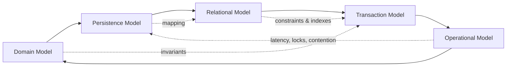
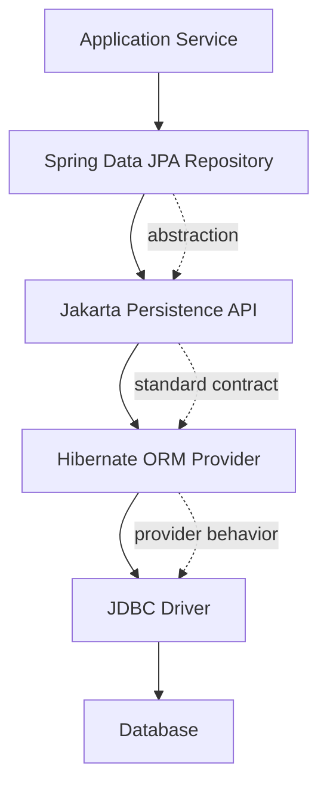
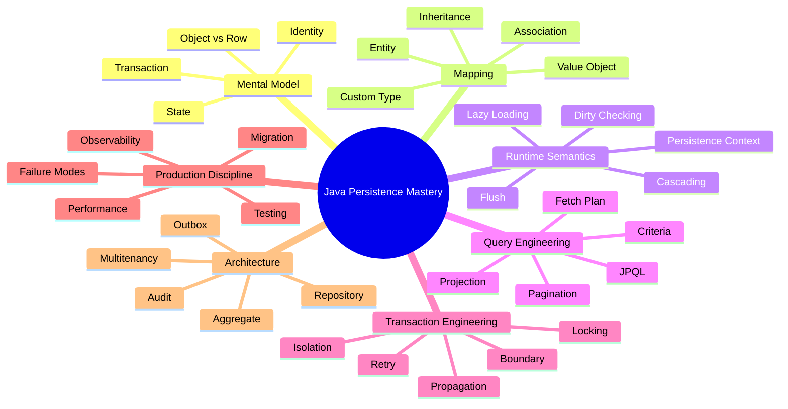
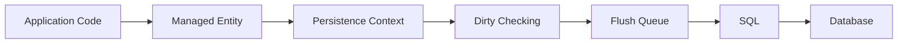
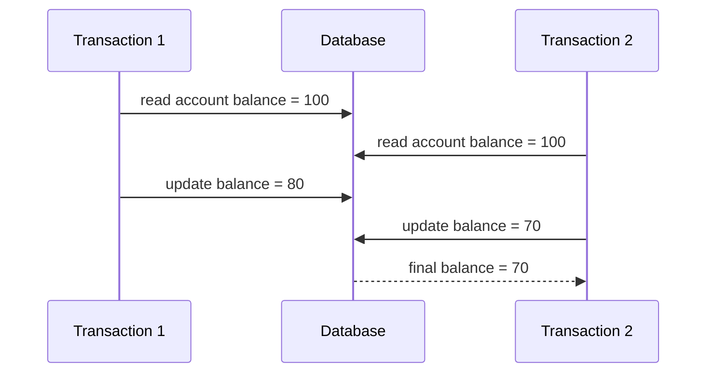
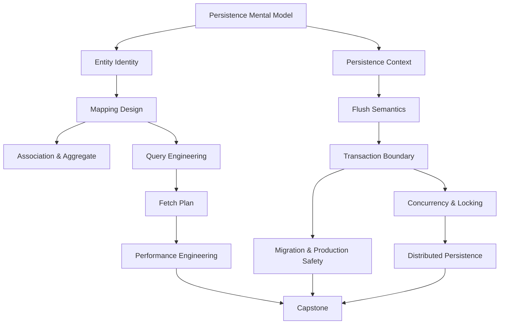
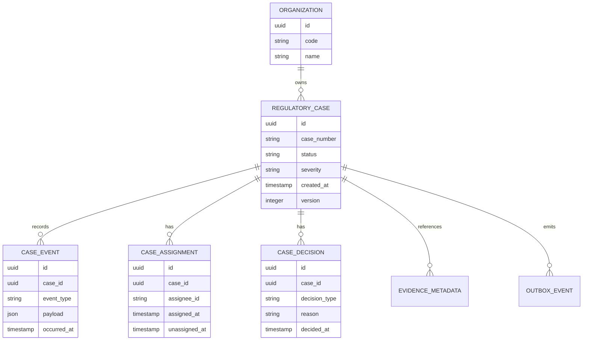
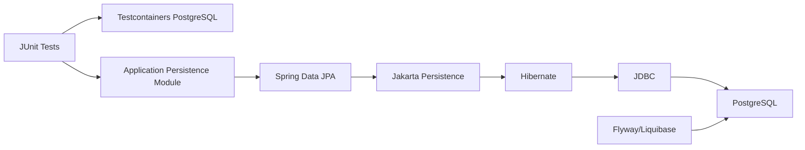

# Part 001 — Kaufman Skill Map for Persistence Mastery

## 1. Tujuan Part Ini

Part ini bukan tutorial `@Entity`, `@Table`, atau `JpaRepository`.

Part ini adalah **peta kemampuan**: bagaimana membedah Java Persistence menjadi sub-skill yang bisa dilatih secara sengaja, cepat, dan terukur berdasarkan pendekatan Josh Kaufman dalam *The First 20 Hours*.

Target akhirnya bukan “bisa CRUD pakai JPA”, tetapi mampu menjawab pertanyaan engineering seperti:

- Apakah model entity ini aman untuk domain yang berubah?
- Kapan object graph berubah menjadi query graph?
- Kapan perubahan object benar-benar berubah menjadi SQL?
- Di boundary mana transaksi harus dimulai dan diakhiri?
- Apakah repository ini menyembunyikan query cost yang berbahaya?
- Kenapa `merge()` bisa membuat data corruption halus?
- Kenapa `LAZY` tidak otomatis berarti efisien?
- Kenapa `@Transactional` kadang menyelesaikan masalah dan kadang menyembunyikan bug?
- Bagaimana memastikan persistence layer tetap benar saat traffic, data volume, dan concurrency meningkat?

Di level senior, persistence bukan sekadar cara menyimpan object. Persistence adalah **kontrak antara domain model, relational model, transaction model, dan operational model**.



Jika salah satu model dipahami secara dangkal, aplikasi masih bisa jalan di development, tetapi mulai rusak di production: query meledak, transaksi terlalu panjang, lock menumpuk, data stale, cache tidak konsisten, migration gagal, atau endpoint lambat tanpa penyebab yang jelas.

---

## 2. Baseline Teknologi Seri

Seri ini memakai baseline berikut:

| Area | Baseline | Catatan |
|---|---|---|
| Standard persistence API | Jakarta Persistence 3.2 | Baseline modern untuk Jakarta EE 11 |
| Provider utama | Hibernate ORM | Digunakan untuk contoh behavior provider yang dominan di ekosistem Java |
| Repository abstraction | Spring Data JPA | Dipakai sebagai layer di atas JPA, bukan pengganti pemahaman JPA |
| Database contoh | PostgreSQL | Relational database dengan fitur production-grade dan behavior transaksi yang jelas |
| Migration | Flyway / Liquibase | Dipakai untuk migration lifecycle, bukan `ddl-auto` production |
| Test environment | Testcontainers | Supaya behavior persistence diuji terhadap database sungguhan |
| Observability | SQL logs, metrics, traces | Digunakan untuk mengukur query count, latency, flush, dan contention |

Prinsip penting: **JPA adalah specification, Hibernate adalah implementation, Spring Data JPA adalah abstraction**.

Jangan mencampur ketiganya dalam mental model yang sama.



Ketika sesuatu tidak bekerja, engineer top-tier bertanya:

1. Apakah ini masalah domain design?
2. Apakah ini masalah JPA semantics?
3. Apakah ini masalah Hibernate behavior?
4. Apakah ini masalah Spring transaction/repository abstraction?
5. Apakah ini masalah SQL/database/index/lock/query plan?
6. Apakah ini masalah deployment/connection pool/observability?

Pemula biasanya langsung menyalahkan annotation.

---

## 3. Kaufman Framework untuk Seri Ini

Josh Kaufman menekankan bahwa belajar skill kompleks harus dimulai dengan membedah skill menjadi sub-skill, belajar secukupnya untuk bisa mengoreksi diri, menghilangkan hambatan latihan, lalu latihan terfokus selama minimal 20 jam.

Untuk Java Persistence, kita terapkan menjadi lima gerakan:

| Kaufman Step | Adaptasi untuk Java Persistence |
|---|---|
| Choose target performance level | Tentukan level: mampu design, debug, optimize, dan defend persistence architecture production-grade |
| Deconstruct the skill | Pecah menjadi mapping, lifecycle, transaction, query, fetch, concurrency, migration, testing, performance |
| Learn enough to self-correct | Belajar sinyal kesalahan: query count, flush timing, lock wait, stale data, N+1, duplicate rows, dirty checking surprise |
| Remove practice barriers | Siapkan lab environment repeatable: PostgreSQL, Testcontainers, migrations, SQL logging, profiler, sample domain |
| Practice deliberately | Latihan kecil tetapi tajam: mapping change, transaction bug, fetch plan review, optimistic locking conflict, migration rollout |

Seri ini tidak disusun berdasarkan urutan dokumentasi API. Seri ini disusun berdasarkan urutan **kemampuan mengendalikan sistem persistence**.

---

## 4. Target Performance Level

Target performance level seri ini adalah:

> Mampu merancang, mengimplementasikan, menguji, mengobservasi, dan memperbaiki persistence layer Java production-grade dengan JPA/Hibernate/Spring Data JPA tanpa bergantung pada trial-and-error annotation.

Kemampuan tersebut memiliki lima level.

### Level 1 — CRUD User

Ciri-ciri:

- Bisa membuat `@Entity`.
- Bisa membuat repository.
- Bisa `save()`, `findById()`, `delete()`.
- Bisa menulis query sederhana.

Risiko:

- Tidak tahu kapan SQL dieksekusi.
- Tidak tahu perbedaan managed dan detached entity.
- Tidak tahu cost association.
- Mengira `LAZY` selalu aman.
- Mengira `@Transactional` sekadar “biar jalan”.

Level ini cukup untuk demo, tetapi berbahaya untuk sistem besar.

### Level 2 — Annotation Operator

Ciri-ciri:

- Tahu banyak annotation: `@OneToMany`, `@ManyToOne`, `@JoinColumn`, `@Enumerated`, `@Version`.
- Bisa memperbaiki error mapping umum.
- Bisa memakai derived query Spring Data JPA.

Risiko:

- Menggunakan annotation sebagai template, bukan sebagai ekspresi desain.
- Tidak tahu owning side secara konseptual.
- Tidak bisa menjelaskan konsekuensi cascade.
- Tidak bisa membaca query plan.
- Mudah membuat object graph terlalu besar.

Level ini umum di banyak codebase enterprise.

### Level 3 — Semantics Engineer

Ciri-ciri:

- Paham entity lifecycle.
- Paham persistence context.
- Paham flush, dirty checking, first-level cache.
- Bisa membedakan entity read model dan DTO read model.
- Bisa memperkirakan SQL dari operasi entity.

Risiko yang mulai terkontrol:

- N+1.
- Lazy initialization error.
- Detached entity surprise.
- Duplicate row akibat fetch join.
- Write amplification.

Level ini adalah baseline engineer senior yang aman.

### Level 4 — Production Persistence Engineer

Ciri-ciri:

- Mendesain transaction boundary secara eksplisit.
- Bisa men-debug lock wait, deadlock, timeout, dan stale write.
- Menggunakan migration tool secara disiplin.
- Menguji repository dengan database nyata.
- Memiliki query budget dan observability.
- Bisa memilih kapan memakai JPA, native SQL, jOOQ, JDBC, atau read model materialized.

Level ini mulai mendekati top-tier karena fokusnya bukan API, tetapi **operational correctness**.

### Level 5 — Persistence Architect

Ciri-ciri:

- Mendesain persistence layer berdasarkan lifecycle data, aggregate boundary, consistency model, dan failure mode.
- Bisa menjelaskan trade-off ORM vs SQL secara objektif.
- Bisa membangun modul persistence yang tahan migration, audit, tenant isolation, concurrency, dan replay.
- Bisa melakukan review terhadap persistence design orang lain.
- Bisa membedakan bug business invariant, transaction anomaly, mapping bug, query plan issue, dan infrastructure bottleneck.

Level ini adalah target seri.

---

## 5. Deconstructing the Skill

Java Persistence terlihat seperti satu skill, padahal terdiri dari banyak sub-skill yang saling mengunci.



Kita akan membedahnya menjadi 12 sub-skill inti.

---

## 6. Sub-Skill 1 — Persistence Mental Model

Pertanyaan inti:

> Apa yang sebenarnya terjadi ketika object Java dianggap “persistent”?

Yang harus dikuasai:

- Object identity vs database identity.
- Entity state: new, managed, detached, removed.
- Persistence context sebagai identity map dan unit of work.
- Transaction sebagai boundary konsistensi.
- Database row sebagai representasi durable, bukan object.
- SQL emission sebagai efek samping terjadwal, bukan selalu langsung.

Latihan minimal:

1. Buat entity `Customer`.
2. `persist()` entity.
3. Ubah field sebelum commit.
4. Aktifkan SQL logging.
5. Amati kapan `INSERT` dan `UPDATE` muncul.
6. Ulangi dengan `flush()` manual.
7. Ulangi setelah entity detached.

Sinyal self-correction:

- Bisa menjelaskan kenapa update terjadi tanpa explicit `save()`.
- Bisa menjelaskan kenapa object yang sama dari dua `find()` dalam persistence context yang sama adalah instance yang sama.
- Bisa menjelaskan kenapa perubahan detached object tidak otomatis masuk database.

---

## 7. Sub-Skill 2 — Entity and Identity Design

Pertanyaan inti:

> Apakah entity ini punya identitas yang benar untuk domain dan database?

Yang harus dikuasai:

- Surrogate key.
- Natural key.
- Business key.
- Generated id.
- UUID.
- Composite id.
- `equals()` dan `hashCode()` untuk entity.
- Identity stability sebelum dan sesudah persist.

Anti-pattern umum:

```java
@Override
public boolean equals(Object o) {
    if (this == o) return true;
    if (!(o instanceof Order other)) return false;
    return Objects.equals(id, other.id);
}

@Override
public int hashCode() {
    return Objects.hash(id);
}
```

Kode ini terlihat normal, tetapi bisa berbahaya jika `id` masih `null` saat entity dimasukkan ke `HashSet`, lalu berubah setelah persist.

Mental model yang benar:

- Database id berguna untuk persistence identity.
- Business identity berguna untuk domain uniqueness.
- Object identity berguna di memory.
- Tidak semua identity cocok untuk `equals()`.

Latihan minimal:

1. Buat entity dengan generated `Long` id.
2. Masukkan entity baru ke `HashSet` sebelum persist.
3. Persist entity.
4. Cek apakah `contains()` masih bekerja.
5. Ulangi dengan natural immutable business key.

---

## 8. Sub-Skill 3 — Mapping Design

Pertanyaan inti:

> Apakah mapping ini menggambarkan relational model dengan jujur, atau memaksa database terlihat seperti object tree?

Yang harus dikuasai:

- `@Entity`, `@Table`, `@Column`.
- Field access vs property access.
- `@Embeddable`.
- `@AttributeConverter`.
- `@Enumerated`.
- Relationship mapping.
- Owning side.
- Join column vs join table.
- Nullable constraint.
- Unique constraint.

Kesalahan umum:

- Membuat semua association bidirectional.
- Membuat semua collection `List` tanpa order semantics.
- Menggunakan `@ManyToMany` untuk domain yang sebenarnya punya association entity.
- Menggunakan cascade pada boundary yang salah.
- Menganggap `nullable = false` cukup menggantikan database constraint.

Prinsip:

> Mapping yang baik bukan mapping yang paling mirip object graph, tetapi mapping yang paling jujur terhadap ownership, cardinality, lifecycle, dan query pattern.

---

## 9. Sub-Skill 4 — Aggregate Boundary and Cascade Semantics

Pertanyaan inti:

> Object mana yang hidup dan mati bersama?

JPA cascade sering disalahpahami. Cascade bukan “ikut load”. Cascade adalah propagasi operasi entity lifecycle.

Contoh:

```java
@OneToMany(mappedBy = "order", cascade = CascadeType.ALL, orphanRemoval = true)
private List<OrderLine> lines = new ArrayList<>();
```

Kode ini bisa benar jika `OrderLine` benar-benar tidak bermakna tanpa `Order`. Tetapi bisa salah jika child punya lifecycle independen.

Hal yang harus dikuasai:

- `CascadeType.PERSIST`.
- `CascadeType.MERGE`.
- `CascadeType.REMOVE`.
- `CascadeType.REFRESH`.
- `CascadeType.DETACH`.
- `orphanRemoval`.
- Aggregate root.
- Composition vs reference.

Rule of thumb:

| Relationship | Cascade? | Reasoning |
|---|---:|---|
| Order → OrderLine | Biasanya ya | Line adalah bagian dari Order |
| Order → Customer | Biasanya tidak | Customer punya lifecycle sendiri |
| User → Role | Hampir selalu tidak | Role shared oleh banyak user |
| Invoice → InvoiceItem | Biasanya ya | Item bagian dari invoice |
| Account → Transaction | Hati-hati | Transaction sering immutable dan audit-sensitive |

---

## 10. Sub-Skill 5 — Persistence Context Semantics

Pertanyaan inti:

> Apa isi memory JPA selama transaksi berjalan?

Persistence context adalah salah satu konsep paling penting dalam JPA. Banyak bug muncul karena engineer mengira repository langsung bicara ke database setiap saat.

Faktanya, persistence context melakukan beberapa fungsi:

- Identity map.
- First-level cache.
- Change tracker.
- Unit of work.
- Write-behind buffer.
- Managed object boundary.



Self-correction signal:

- Bisa menjelaskan mengapa dua query terhadap id yang sama bisa mengembalikan object instance yang sama.
- Bisa menjelaskan mengapa perubahan entity bisa tersimpan tanpa memanggil repository `save()`.
- Bisa menjelaskan mengapa query tertentu memicu flush sebelum `commit()`.
- Bisa menjelaskan kenapa memory bisa membengkak saat batch processing panjang.

---

## 11. Sub-Skill 6 — Flush and SQL Emission

Pertanyaan inti:

> Kapan Java object berubah menjadi SQL statement?

Di JPA, `persist()` bukan berarti SQL langsung dieksekusi. `remove()` bukan berarti row langsung hilang. Perubahan field bukan berarti `UPDATE` langsung dikirim.

SQL biasanya muncul saat:

- `flush()` manual.
- Query tertentu dieksekusi dan provider perlu menjaga konsistensi hasil.
- Transaction commit.
- Provider membutuhkan identifier dari database.

Konsekuensi:

- Exception constraint bisa muncul terlambat.
- Performance issue bisa muncul di akhir transaksi.
- Query read bisa memicu write flush.
- Urutan SQL bisa berbeda dari urutan method call.

Latihan minimal:

1. Buat dua entity dengan foreign key.
2. Persist dalam urutan berbeda.
3. Amati SQL order.
4. Tambahkan unique constraint.
5. Lihat kapan violation muncul.
6. Tambahkan query sebelum commit.
7. Amati apakah flush terjadi lebih awal.

---

## 12. Sub-Skill 7 — Query Engineering

Pertanyaan inti:

> Apakah query ini mengekspresikan kebutuhan data dengan cost yang terkendali?

Yang harus dikuasai:

- JPQL.
- HQL provider extension.
- Criteria API.
- Native query.
- Projection.
- DTO query.
- Fetch join.
- Entity graph.
- Pagination.
- Sorting.
- Query hints.

Kesalahan umum:

- Mengambil entity penuh untuk response sederhana.
- Menggunakan entity graph terlalu luas.
- Join fetch banyak collection sekaligus.
- Menggabungkan pagination dengan fetch join collection.
- Mengira repository derived query selalu efisien.

Engineering posture:

> Query bukan sekadar cara mengambil data. Query adalah kontrak latency, memory, cardinality, locking, dan consistency.

---

## 13. Sub-Skill 8 — Fetch Plan Design

Pertanyaan inti:

> Data apa yang harus diload sekarang, nanti, atau tidak pernah diload sebagai entity?

Fetch plan adalah penyebab besar perbedaan antara sistem yang “jalan di dev” dan sistem yang survive production.

Konsep inti:

- `FetchType.LAZY`.
- `FetchType.EAGER`.
- Join fetch.
- Entity graph.
- Batch fetching.
- Subselect fetching.
- DTO projection.
- Lazy initialization boundary.

Prinsip:

1. Default ke `LAZY` untuk association.
2. Desain fetch per use case, bukan per entity global.
3. Jangan biarkan serializer menentukan fetch plan.
4. Jangan expose entity langsung sebagai API response.
5. Ukur query count, jangan percaya feeling.

---

## 14. Sub-Skill 9 — Transaction Boundary Design

Pertanyaan inti:

> Unit kerja bisnis mana yang harus atomik?

JPA tidak bisa dipahami tanpa transaction boundary.

Hal yang harus dikuasai:

- Resource-local transaction.
- JTA transaction.
- Spring `@Transactional`.
- Propagation.
- Rollback semantics.
- Read-only transaction.
- Isolation level.
- Lock timeout.
- Retry policy.
- Transaction duration.

Kesalahan umum:

- Transaction terlalu kecil: invariant tidak terlindungi.
- Transaction terlalu besar: lock dan connection tertahan lama.
- Transaction bercampur network call.
- `@Transactional` diletakkan di private method dan tidak efektif.
- Mengandalkan Open Session in View untuk menyelesaikan lazy loading.

Rule of thumb:

> Transaction boundary harus mengikuti business consistency boundary, bukan mengikuti repository method boundary.

---

## 15. Sub-Skill 10 — Concurrency and Locking

Pertanyaan inti:

> Apa yang terjadi jika dua user mengubah data yang sama pada waktu bersamaan?

Hal yang harus dikuasai:

- Optimistic locking.
- `@Version`.
- Pessimistic read/write lock.
- Lost update.
- Stale write.
- Write skew.
- Phantom read.
- Deadlock.
- Retry.
- Idempotency.

Contoh lost update:



Tanpa concurrency control, update T1 hilang.

Top-tier engineer tidak hanya bertanya “pakai lock apa?”, tetapi:

- Konflik ini expected atau exceptional?
- Apakah user boleh retry?
- Apakah operation idempotent?
- Apakah invariant bisa ditegakkan oleh constraint database?
- Apakah optimistic lock cukup?
- Apakah pessimistic lock akan membuat throughput jatuh?

---

## 16. Sub-Skill 11 — Migration and Schema Evolution

Pertanyaan inti:

> Bagaimana mengubah schema tanpa merusak data dan deployment?

JPA schema generation berguna untuk development, tetapi production migration harus eksplisit.

Hal yang harus dikuasai:

- Migration file versioning.
- Expand-contract deployment.
- Backfill.
- Nullable-to-not-null migration.
- Index creation.
- Constraint rollout.
- Data migration.
- Rollback realism.
- Compatibility antara application version dan schema version.

Anti-pattern:

```yaml
spring:
  jpa:
    hibernate:
      ddl-auto: update
```

Ini berbahaya untuk production karena perubahan schema menjadi efek samping runtime aplikasi, bukan artifact deployment yang direview.

Prinsip:

> Entity mapping boleh memvalidasi schema. Migration tool harus mengubah schema.

---

## 17. Sub-Skill 12 — Production Diagnostics

Pertanyaan inti:

> Bagaimana membuktikan persistence layer benar dan efisien di production?

Hal yang harus dikuasai:

- SQL logging yang aman.
- Bind parameter logging di environment non-production.
- Query count per request.
- Slow query metrics.
- Connection pool metrics.
- Transaction duration.
- Lock wait.
- Deadlock detection.
- Hibernate statistics.
- Distributed tracing untuk database span.
- Sampling strategy.

Tanpa observability, persistence debugging berubah menjadi mistik.

Checklist minimal endpoint production:

- Berapa jumlah query per request normal?
- Query apa yang paling lambat?
- Apakah ada query tanpa index?
- Apakah ada transaksi lebih dari threshold?
- Apakah pool mendekati exhaustion?
- Apakah ada lock wait spike?
- Apakah error constraint meningkat setelah release?

---

## 18. Dependency Graph Skill

Sub-skill persistence tidak bisa dipelajari acak. Ada dependency.



Urutan seri mengikuti dependency ini. Kita tidak akan masuk Spring Data JPA repository terlalu awal, karena repository abstraction sering membuat pemula merasa sudah memahami persistence padahal belum memahami runtime semantics.

---

## 19. The 20-Hour Deliberate Practice Plan

Kaufman tidak mengatakan bahwa 20 jam cukup untuk menjadi ahli. Yang realistis: 20 jam cukup untuk melewati fase paling kikuk dan membangun self-correction loop.

Untuk engineer berpengalaman, 20 jam awal harus dipakai untuk membangun **operational intuition**.

### Hour 0 — Setup Lab

Tujuan:

- Repository latihan siap.
- PostgreSQL via Testcontainers siap.
- Migration tool siap.
- SQL logging siap.
- Hibernate statistics bisa dibaca.

Output:

- Satu project Spring Boot atau plain Jakarta Persistence.
- Test pertama yang benar-benar menyentuh PostgreSQL.
- Satu migration file initial schema.

Self-correction:

- Test gagal jika database tidak tersedia.
- Query SQL terlihat.
- Mapping divalidasi terhadap schema.

### Hours 1–2 — Entity State and Identity

Latihan:

- Buat entity sederhana.
- Coba `persist`, `find`, `detach`, `merge`, `remove`.
- Uji object identity di persistence context yang sama dan berbeda.
- Uji `equals/hashCode` sebelum/sesudah persist.

Output:

- Test lifecycle entity.
- Catatan kapan SQL muncul.
- Catatan kapan object managed/detached.

Self-correction:

- Bisa memprediksi SQL sebelum melihat log.

### Hours 3–4 — Association and Ownership

Latihan:

- Buat `Order`, `OrderLine`, `Customer`.
- Mapping many-to-one dan one-to-many.
- Coba owning side benar dan salah.
- Coba cascade benar dan salah.

Output:

- Test bahwa foreign key terisi benar.
- Test bahwa orphan removal bekerja hanya pada child yang memang owned.

Self-correction:

- Bisa menjelaskan kenapa update collection saja tidak cukup jika owning side tidak diset.

### Hours 5–6 — Persistence Context and Dirty Checking

Latihan:

- Load entity dalam transaction.
- Ubah field tanpa `save()`.
- Commit.
- Bandingkan dengan detached entity.
- Coba long transaction dengan banyak entity.

Output:

- Test dirty checking.
- Test detached mutation tidak tersimpan.
- Catatan memory growth.

Self-correction:

- Bisa menjelaskan kapan `save()` Spring Data JPA diperlukan dan kapan redundant.

### Hours 7–8 — Flush Timing

Latihan:

- Tambahkan unique constraint.
- Buat operasi yang melanggar constraint.
- Amati exception muncul di method call, flush, query, atau commit.
- Coba `FlushModeType.AUTO` dan `COMMIT`.

Output:

- Test flush behavior.
- Diagram urutan method call vs SQL.

Self-correction:

- Bisa menjelaskan kenapa error database muncul “terlambat”.

### Hours 9–10 — Query and Projection

Latihan:

- Tulis JPQL entity query.
- Tulis DTO projection.
- Tulis aggregate query.
- Bandingkan row/column yang diambil.

Output:

- Test query result.
- Catatan kapan entity tidak perlu diload.

Self-correction:

- Bisa memilih entity vs DTO berdasarkan use case.

### Hours 11–12 — Fetch Plan and N+1

Latihan:

- Buat endpoint/list query yang memicu N+1.
- Deteksi query count.
- Perbaiki dengan join fetch, entity graph, batch fetch, atau DTO projection.
- Uji pagination trap.

Output:

- Query count assertion.
- Perbandingan beberapa fetch strategy.

Self-correction:

- Bisa memperkirakan query count dari bentuk object graph.

### Hours 13–14 — Transaction Boundary

Latihan:

- Buat service method command.
- Buat read-only query.
- Buat nested service call dengan propagation berbeda.
- Simulasikan exception checked/unchecked.

Output:

- Test rollback behavior.
- Catatan propagation behavior.

Self-correction:

- Bisa menjelaskan kenapa rollback terjadi atau tidak terjadi.

### Hours 15–16 — Optimistic Locking

Latihan:

- Tambahkan `@Version`.
- Simulasikan dua transaksi mengubah entity sama.
- Tangani conflict.
- Buat retry policy terbatas.

Output:

- Test optimistic locking failure.
- Desain user-facing conflict response.

Self-correction:

- Bisa membedakan lost update, stale write, dan conflict valid.

### Hours 17–18 — Migration and Testcontainers

Latihan:

- Tambahkan kolom nullable.
- Backfill data.
- Ubah menjadi not-null.
- Tambahkan index.
- Jalankan semua test dengan migration.

Output:

- Migration expand-contract sederhana.
- Test schema validation.

Self-correction:

- Bisa menjelaskan kenapa `ddl-auto=update` tidak boleh menjadi production migration strategy.

### Hours 19–20 — Capstone Mini Review

Latihan:

- Review modul persistence kecil.
- Hitung query per use case.
- Review transaction boundary.
- Review cascade.
- Review migration.
- Review test coverage.

Output:

- Persistence design review document.
- Daftar risiko dan mitigasi.

Self-correction:

- Bisa menemukan bug sebelum production.

---

## 20. Practice Domain untuk Seri Ini

Agar latihan konsisten, seri ini akan memakai domain referensi:

> **Regulatory Case Management Persistence Module**

Domain ini cocok untuk engineer enterprise karena memiliki:

- Case lifecycle.
- Assignment.
- Decision records.
- Evidence attachment metadata.
- Audit trail.
- Escalation.
- SLA.
- Multi-tenant organization.
- Outbox event.
- State transition invariant.
- Read-heavy dashboard.
- Write-sensitive command path.

Core model awal:



Kenapa domain ini dipakai?

Karena CRUD sederhana tidak cukup untuk menguji persistence mastery. Kita butuh domain yang memaksa kita berpikir tentang:

- Identity.
- Lifecycle.
- Ownership.
- Auditability.
- Soft delete.
- Temporal records.
- Concurrency.
- Query read model.
- Event consistency.
- Tenant isolation.

---

## 21. Core Learning Invariants

Sepanjang seri, gunakan invariant berikut untuk menilai desain.

### Invariant 1 — Persistence Must Not Hide Business Truth

Jika entity mapping membuat domain terlihat lebih sederhana daripada kenyataan, mapping itu berbahaya.

Contoh:

- `Case` punya banyak `Assignment` historis, bukan satu `assignedTo` sederhana.
- `Decision` harus immutable setelah diterbitkan.
- `EvidenceMetadata` boleh berubah status scan virus, tetapi file binary mungkin disimpan di object storage.

Persistence layer harus mewakili lifecycle data secara jujur.

### Invariant 2 — Transaction Boundary Must Match Consistency Boundary

Jangan mulai transaksi hanya karena repository dipanggil.

Tanyakan:

- Business invariant apa yang harus benar setelah command selesai?
- Data mana yang harus berubah atomik?
- Apakah event harus tercatat bersama state change?
- Apakah external call boleh masuk transaksi?

### Invariant 3 — Fetch Plan Must Be Use-Case Specific

Entity mapping tidak boleh menentukan semua kebutuhan baca.

Contoh:

- Detail page butuh case + latest assignment + decisions.
- Dashboard butuh count/grouping/projection.
- Export butuh streaming/chunking.
- API list butuh DTO ringan.

Satu entity model tidak boleh dipaksa menjadi semua read model.

### Invariant 4 — Database Constraints Are Part of Domain Defense

Validasi aplikasi penting, tetapi database constraints adalah garis pertahanan terakhir.

Contoh:

- Unique case number per organization.
- Not-null status.
- Foreign key case event ke case.
- Check constraint severity.
- Unique active assignment jika domain mensyaratkan satu assignee aktif.

### Invariant 5 — Every Persistence Decision Has Operational Cost

Setiap mapping, fetch, cascade, transaction, dan index punya biaya.

Biaya bisa berupa:

- Latency.
- Memory.
- Lock duration.
- Connection usage.
- Migration risk.
- Query plan instability.
- Cache invalidation complexity.
- Debugging complexity.

---

## 22. What We Will Not Do

Agar belajar efektif, seri ini sengaja tidak melakukan beberapa hal.

### Tidak Mengulang SQL Dasar

Kita tidak akan mengulang:

- `SELECT`, `JOIN`, `GROUP BY` dasar.
- Normalisasi dasar.
- Index dasar.
- JDBC API dasar.

Namun kita akan memakai SQL untuk membuktikan efek JPA.

### Tidak Menghafal Annotation Tanpa Konteks

Annotation akan selalu dikaitkan dengan:

- Runtime behavior.
- SQL output.
- Domain ownership.
- Transaction effect.
- Failure mode.

### Tidak Menganggap Hibernate Sama Dengan JPA

Hibernate-specific feature akan diberi label eksplisit.

Contoh provider-specific:

- `@BatchSize`.
- `@Fetch`.
- Hibernate-specific type mapping.
- Hibernate statistics.
- Envers.
- Filters.
- Multi-tenancy support tertentu.

### Tidak Menganggap Spring Data JPA Sebagai Magic

Spring Data JPA akan diposisikan sebagai productivity abstraction.

Tetapi setiap repository method tetap harus dianalisis:

- Query apa yang dihasilkan?
- Transaction apa yang aktif?
- Entity state apa yang terlibat?
- Fetch plan apa yang dipakai?
- Pagination aman atau tidak?

---

## 23. Fast Feedback Loops

Top-tier learning membutuhkan feedback cepat. Untuk persistence, feedback terbaik bukan “aplikasi jalan”, tetapi sinyal konkret.

| Feedback Signal | Menjawab Pertanyaan |
|---|---|
| SQL log | SQL apa yang benar-benar dikirim? |
| Bind parameter log | Nilai apa yang dikirim ke database? |
| Query count | Apakah terjadi N+1? |
| Query plan | Apakah database memakai index yang benar? |
| Transaction duration | Apakah transaksi terlalu panjang? |
| Lock wait | Apakah concurrency mulai bermasalah? |
| Connection pool metrics | Apakah pool habis? |
| Hibernate statistics | Berapa entity load, flush, cache hit/miss? |
| Testcontainers test | Apakah behavior benar pada database nyata? |
| Migration validation | Apakah schema sesuai mapping? |

Learning rule:

> Jangan lanjut ke pattern lanjutan sebelum bisa melihat dan menjelaskan SQL dari operasi sederhana.

---

## 24. Review Rubric untuk Persistence Code

Gunakan rubric ini setiap kali melihat entity/repository/service persistence.

### 24.1 Entity Review

Pertanyaan:

- Apakah entity ini benar-benar punya identity?
- Apakah field mutable/immutable sesuai lifecycle domain?
- Apakah constraint domain terlihat di object dan database?
- Apakah `equals/hashCode` aman?
- Apakah association perlu bidirectional?
- Apakah collection type tepat?
- Apakah entity terlalu besar?
- Apakah ada field yang seharusnya value object?

### 24.2 Association Review

Pertanyaan:

- Siapa owning side?
- Apakah foreign key berada di tabel yang benar?
- Apakah child benar-benar owned?
- Apakah cascade aman?
- Apakah remove cascade bisa menghapus data shared?
- Apakah `orphanRemoval` sesuai lifecycle?
- Apakah `@ManyToMany` seharusnya association entity?

### 24.3 Query Review

Pertanyaan:

- Apakah use case butuh entity atau DTO?
- Berapa row yang mungkin dikembalikan?
- Berapa column yang diload?
- Berapa query yang terjadi?
- Apakah ada N+1?
- Apakah pagination aman?
- Apakah sorting memakai index?
- Apakah query plan stabil saat data membesar?

### 24.4 Transaction Review

Pertanyaan:

- Apa business command boundary?
- Apa invariant yang dilindungi?
- Apakah external IO terjadi dalam transaction?
- Apakah transaction terlalu panjang?
- Apakah rollback semantics jelas?
- Apakah conflict handling jelas?
- Apakah retry aman dan idempotent?

### 24.5 Production Review

Pertanyaan:

- Apakah migration explicit?
- Apakah test memakai database nyata?
- Apakah query count terukur?
- Apakah slow query bisa didiagnosis?
- Apakah connection pool dimonitor?
- Apakah lock wait terlihat?
- Apakah data corruption punya audit trail?
- Apakah release bisa rollback secara realistis?

---

## 25. Common Learning Traps

### Trap 1 — “JPA Mengurangi Kebutuhan Belajar SQL”

Salah.

JPA mengurangi boilerplate persistence untuk banyak operasi, tetapi tidak menghilangkan relational reality. Semakin tinggi level penggunaan JPA, semakin penting kemampuan membaca SQL dan query plan.

### Trap 2 — “Entity Adalah Domain Model Murni”

Kadang iya, sering tidak.

Entity JPA membawa constraint persistence:

- Constructor rule.
- Proxy behavior.
- Lazy loading.
- Mutability pressure.
- Identity lifecycle.
- Annotation coupling.

Untuk domain kompleks, perlu sadar kapan entity JPA cukup sebagai domain model dan kapan butuh domain model terpisah.

### Trap 3 — “Repository Menyembunyikan Database”

Repository boleh menyembunyikan detail akses data dari application service, tetapi tidak boleh menyembunyikan cost dan semantics dari engineer.

### Trap 4 — “N+1 Adalah Masalah Lazy Loading”

Tidak tepat.

N+1 adalah masalah fetch plan dan access pattern. Lazy loading hanya salah satu mekanisme yang membuatnya terlihat.

### Trap 5 — “Optimistic Locking Menyelesaikan Semua Concurrency”

Optimistic locking mencegah lost update pada row versioned. Ia tidak otomatis menyelesaikan semua anomaly, terutama invariant lintas-row atau lintas-aggregate.

### Trap 6 — “Migration Bisa Diurus Belakangan”

Persistence design yang tidak migration-aware biasanya mahal diperbaiki. Setiap field, enum, constraint, dan association adalah keputusan masa depan.

---

## 26. Minimum Tooling for This Series

Untuk mengikuti seri secara efektif, minimal siapkan:

- Java 21 atau lebih baru.
- Maven atau Gradle.
- PostgreSQL.
- Testcontainers.
- Hibernate ORM.
- Jakarta Persistence API.
- Spring Boot + Spring Data JPA untuk part tertentu.
- Flyway atau Liquibase.
- Logging SQL.
- IDE dengan debugger.
- Database client.

Contoh dependency konseptual:



Tool bukan tujuan. Tool hanya mempercepat feedback.

---

## 27. Mental Model Compression

Jika harus mengingat sedikit, ingat tujuh kalimat ini:

1. Entity adalah object dengan identity persistence, bukan sekadar DTO.
2. Persistence context adalah memory workspace yang melacak entity managed.
3. Transaction adalah boundary atomicity dan consistency.
4. Flush adalah saat perubahan memory disinkronkan ke database.
5. Mapping adalah kontrak antara object model dan relational model.
6. Fetch plan adalah keputusan per use case, bukan dekorasi global entity.
7. Production persistence harus dibuktikan dengan SQL, metrics, test, dan migration.

---

## 28. How to Use This Series

Untuk setiap part berikutnya, gunakan pola belajar ini:

1. Baca mental model.
2. Jalankan contoh kecil.
3. Prediksi SQL sebelum melihat log.
4. Jalankan test.
5. Bandingkan prediksi dengan output aktual.
6. Ubah satu variabel.
7. Catat failure mode.
8. Simpulkan invariant.

Jangan membaca seri ini seperti dokumentasi pasif. Treat setiap part sebagai **lab debugging**.

---

## 29. Output Setelah Menyelesaikan Seri

Setelah seluruh 35 part, kamu seharusnya bisa menghasilkan artifact engineering berikut:

- Persistence architecture decision record.
- Entity mapping review checklist.
- Transaction boundary design.
- Repository design guideline.
- Query budget per endpoint.
- Fetch plan matrix.
- Migration rollout plan.
- Concurrency conflict strategy.
- Persistence testing strategy.
- SQL observability dashboard.
- Production performance playbook.
- Anti-pattern remediation plan.

Itulah yang membedakan engineer yang “bisa JPA” dari engineer yang bisa menjaga persistence layer tetap benar saat sistem membesar.

---

## 30. Referensi Utama

Referensi ini menjadi baseline konseptual dan teknis seri:

- Jakarta Persistence 3.2 Specification — https://jakarta.ee/specifications/persistence/3.2/
- Jakarta Persistence Specification Document — https://jakarta.ee/specifications/persistence/3.2/jakarta-persistence-spec-3.2
- Hibernate ORM User Guide — https://docs.hibernate.org/stable/orm/userguide/html_single/
- Hibernate ORM Documentation — https://hibernate.org/orm/documentation/
- Spring Data JPA Reference Documentation — https://docs.spring.io/spring-data/jpa/reference/index.html
- Josh Kaufman, *The First 20 Hours: How to Learn Anything... Fast*

---

## 31. Penutup Part 001

Part ini adalah peta. Part berikutnya mulai masuk fondasi paling penting: **persistence mental model**.

Sebelum menyentuh annotation dan repository, kita harus memahami empat hal:

1. Object.
2. Row.
3. Identity.
4. Transaction.

Jika empat hal ini jelas, JPA menjadi alat yang bisa dikendalikan. Jika tidak, JPA menjadi magic layer yang menghasilkan bug mahal.
