# Part 002 — Persistence Mental Model: Object, Row, Identity, Transaction

## 1. Tujuan Part Ini

Part ini membangun mental model dasar sebelum kita masuk ke mapping JPA.

Kita akan menjawab pertanyaan:

> Ketika aplikasi Java “menyimpan object ke database”, apa yang sebenarnya terjadi?

Jawaban pemula:

> Object disimpan ke table.

Jawaban yang lebih akurat:

> Aplikasi memanipulasi object dalam memory. JPA provider mengelola sebagian object itu dalam persistence context. Pada boundary tertentu, provider menerjemahkan perubahan state object menjadi SQL terhadap row relational di dalam transaction. Database lalu menegakkan constraint, isolation, lock, durability, dan visibility.

Kalimat ini panjang karena persistence memang bukan satu mekanisme. Persistence adalah interaksi beberapa model:

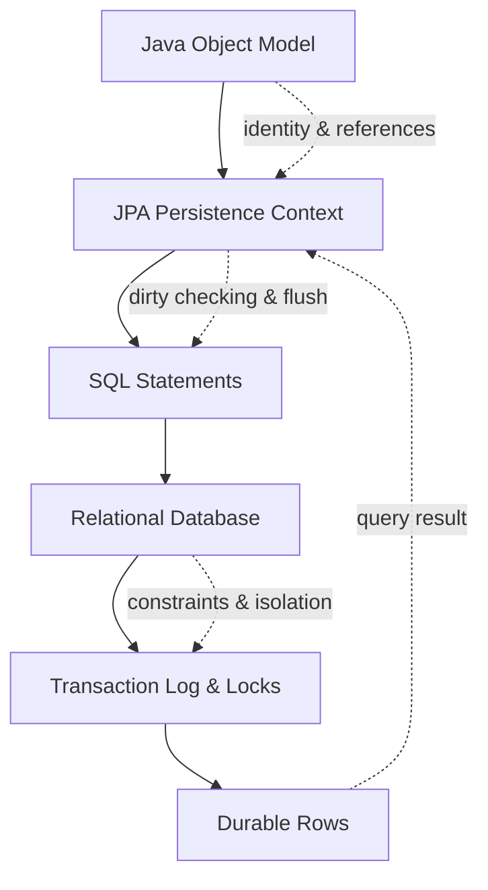

Jika mental model ini kabur, annotation terlihat seperti magic. Jika mental model ini jelas, annotation menjadi cara eksplisit untuk mengatur translasi antar model.

---

## 2. Empat Dunia Persistence

Setiap operasi persistence melibatkan empat dunia.

| Dunia | Unit Utama | Pertanyaan Kunci |
|---|---|---|
| Java object world | Object dan reference | Object mana yang ada di memory dan siapa mereferensikan siapa? |
| JPA persistence world | Managed entity dan persistence context | Object mana yang sedang dilacak JPA? |
| SQL relational world | Row, table, foreign key, index | Data durable tersimpan dalam bentuk apa? |
| Transaction world | Commit, rollback, lock, isolation | Perubahan mana yang atomik dan terlihat oleh transaksi lain? |

Kesalahan umum adalah mengira satu dunia otomatis sama dengan dunia lain.

Contoh:

- Object ada di memory bukan berarti row ada di database.
- Row ada di database bukan berarti object sedang managed.
- Object berubah field-nya bukan berarti SQL sudah dikirim.
- SQL sudah dikirim bukan berarti transaksi sudah commit.
- Transaksi commit bukan berarti cache eksternal sudah konsisten.

Persistence mastery dimulai dari kemampuan memisahkan dunia-dunia ini.

---

## 3. Object Graph vs Relational Graph

Java adalah dunia object dan reference.

Contoh sederhana:

```java
class RegulatoryCase {
    UUID id;
    String caseNumber;
    CaseStatus status;
    Organization organization;
    List<CaseEvent> events = new ArrayList<>();
}

class Organization {
    UUID id;
    String code;
    String name;
}

class CaseEvent {
    UUID id;
    RegulatoryCase regulatoryCase;
    String eventType;
    Instant occurredAt;
}
```

Dalam Java, object saling menunjuk dengan reference.

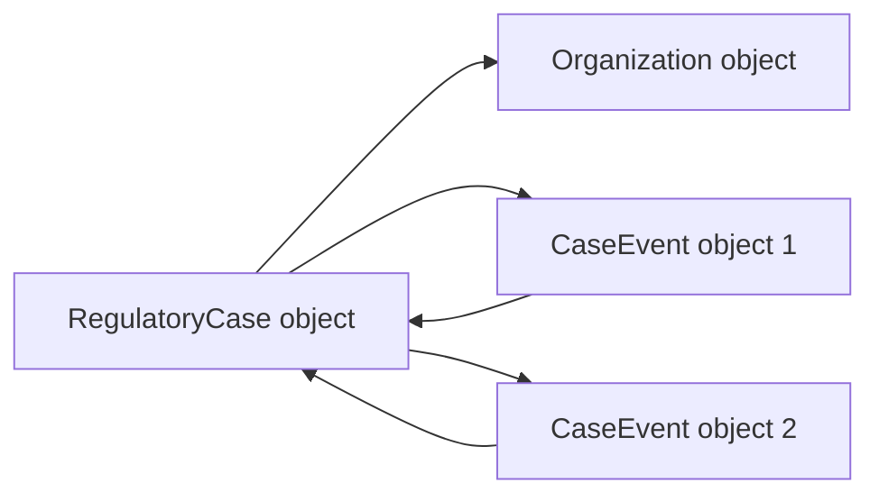

Relational database tidak menyimpan pointer object. Database menyimpan row dan relationship lewat value, terutama primary key dan foreign key.

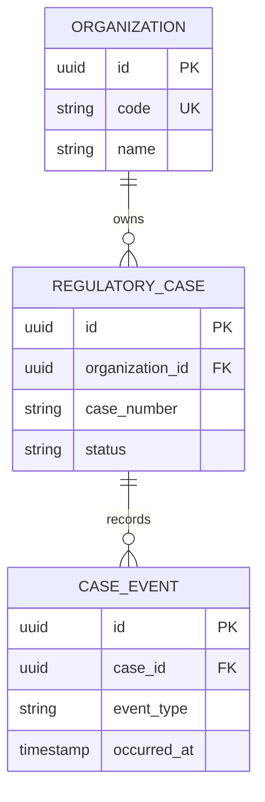

Object graph dan relational graph mirip, tetapi tidak sama.

### 3.1 Perbedaan Fundamental

| Object Model | Relational Model |
|---|---|
| Identity bisa berupa object reference | Identity biasanya primary key |
| Relationship berupa pointer/reference | Relationship berupa foreign key value |
| Navigasi bisa langsung `case.getEvents()` | Navigasi butuh query/join |
| Collection berada di object | Collection adalah banyak row |
| Object bisa mutable tanpa constraint langsung | Row constraint ditegakkan database |
| Object lifecycle berada di heap | Row lifecycle berada di transaction/database |
| Inheritance natural di OOP | Inheritance perlu strategi mapping |
| Encapsulation penting | Database butuh schema eksplisit |

JPA ada di tengah untuk menjembatani perbedaan ini.

Tetapi penting: **JPA tidak menghapus perbedaan tersebut**. JPA hanya mengelolanya dengan aturan.

---

## 4. Object-Relational Impedance Mismatch

Istilah “object-relational impedance mismatch” menggambarkan ketidaksesuaian antara cara object-oriented programming memodelkan data dan cara relational database menyimpan data.

Mismatch ini muncul dalam beberapa bentuk.

### 4.1 Identity Mismatch

Di Java:

```java
caseA == caseB
```

berarti dua reference menunjuk instance object yang sama.

Di database:

```sql
select * from regulatory_case where id = ?
```

mengambil row dengan primary key tertentu.

Dua object Java berbeda bisa merepresentasikan row database yang sama jika berada di persistence context berbeda.

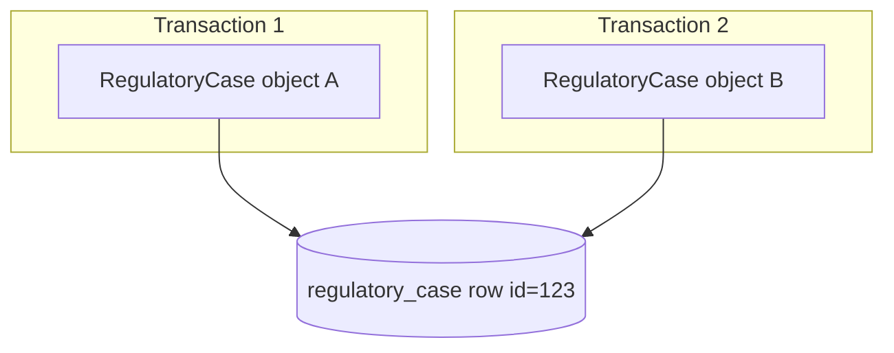

`A == B` false, tetapi `A.id.equals(B.id)` true.

Ini sangat penting untuk memahami bug detached entity, cache, equals/hashCode, dan optimistic locking.

### 4.2 Association Mismatch

Di Java:

```java
case.getOrganization().getName()
```

terlihat seperti akses memory biasa.

Dalam JPA, jika `organization` lazy dan belum diload, baris itu bisa memicu SQL.

Akses field bisa menjadi database roundtrip.

Itulah mengapa entity tidak boleh diperlakukan seperti POJO biasa ketika sudah terhubung ke persistence provider.

### 4.3 Collection Mismatch

Di Java:

```java
case.getEvents().size()
```

terlihat seperti menghitung collection.

Tetapi collection JPA bisa berupa lazy persistent collection. `size()` bisa:

- Menggunakan collection yang sudah loaded.
- Memicu `select count`.
- Memicu load semua row.
- Gagal dengan lazy initialization error jika context sudah tertutup.

Behavior tergantung provider, mapping, transaction, dan fetch state.

### 4.4 Inheritance Mismatch

OOP mendukung inheritance langsung:

```java
abstract class CaseAction {}
class AssignmentAction extends CaseAction {}
class DecisionAction extends CaseAction {}
```

Relational database tidak punya inheritance object. JPA harus memilih strategi:

- Single table.
- Joined table.
- Table per class.
- Mapped superclass.

Setiap strategi punya cost query, nullability, constraint, dan migration berbeda.

### 4.5 Transaction Mismatch

Object berubah segera di memory.

Database berubah secara durable setelah SQL dieksekusi dan transaksi commit.

Di antaranya ada zona penting:

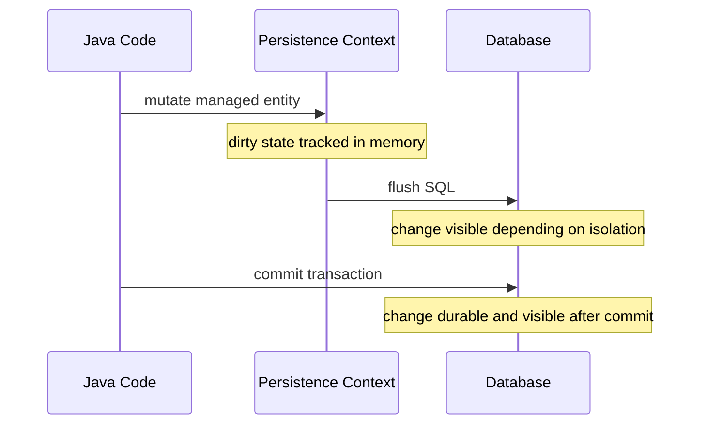

Kesalahan umum adalah mengira perubahan object sama dengan commit database.

---

## 5. Identity: Empat Jenis yang Harus Dipisahkan

Identity adalah sumber banyak bug JPA. Kita harus membedakan empat jenis identity.

### 5.1 Object Identity

Object identity adalah apakah dua reference menunjuk object yang sama.

```java
caseA == caseB
```

Ini murni Java heap identity.

### 5.2 Database Identity

Database identity adalah primary key row.

```sql
regulatory_case.id = 'f1f6...'
```

Ini identity durable di database.

### 5.3 Persistence Identity

Persistence identity adalah identity entity dalam persistence context.

Dalam satu persistence context, JPA menjamin hanya ada satu managed entity instance untuk satu database identity tertentu.

Contoh:

```java
RegulatoryCase a = entityManager.find(RegulatoryCase.class, id);
RegulatoryCase b = entityManager.find(RegulatoryCase.class, id);

assert a == b;
```

Karena persistence context bertindak sebagai identity map.

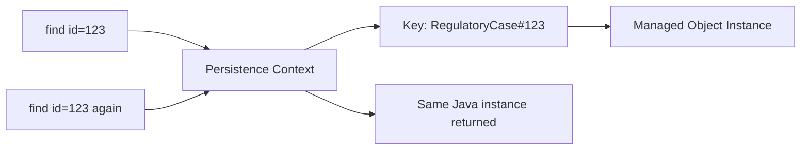

Namun di persistence context berbeda:

```java
RegulatoryCase a = tx1.find(RegulatoryCase.class, id);
RegulatoryCase b = tx2.find(RegulatoryCase.class, id);

assert a != b;
assert a.getId().equals(b.getId());
```

Object berbeda, row sama.

### 5.4 Business Identity

Business identity adalah identity yang bermakna bagi domain.

Contoh:

- `caseNumber` unik per organization.
- `organizationCode` unik global.
- `externalReferenceNumber` dari sistem regulator.

Business identity sering harus dijaga dengan unique constraint.

```sql
alter table regulatory_case
add constraint uk_case_org_case_number unique (organization_id, case_number);
```

### 5.5 Identity Comparison Matrix

| Identity Type | Scope | Contoh | Digunakan Untuk |
|---|---|---|---|
| Object identity | JVM heap | `a == b` | Reference equality |
| Database identity | Database | primary key | Row lookup, FK |
| Persistence identity | Persistence context | entity key | First-level cache, dirty checking |
| Business identity | Domain | case number | Domain uniqueness, idempotency |

Kesalahan fatal terjadi ketika identity ini dicampur.

---

## 6. Entity State Model

Dalam JPA, entity tidak hanya “ada” atau “tidak ada”. Entity punya state.

Empat state utama:

1. New/transient.
2. Managed/persistent.
3. Detached.
4. Removed.

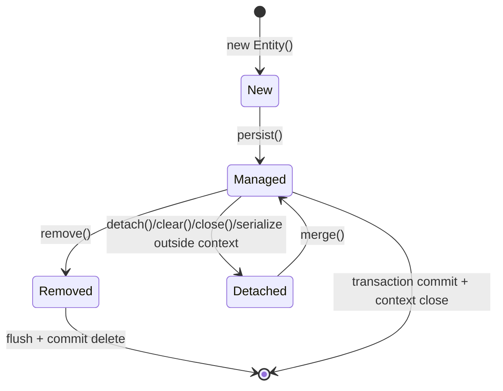

### 6.1 New / Transient

Object new adalah object Java biasa yang belum dikenal persistence context.

```java
RegulatoryCase c = new RegulatoryCase(...);
```

Ciri-ciri:

- Ada di heap.
- Belum managed.
- Belum tentu punya database id.
- Perubahan field tidak dilacak JPA.
- Tidak akan disimpan kecuali dipersist melalui entity manager atau cascade persist.

### 6.2 Managed / Persistent

Managed entity adalah entity yang berada dalam persistence context.

```java
RegulatoryCase c = entityManager.find(RegulatoryCase.class, id);
c.changeSeverity(Severity.HIGH);
```

Ciri-ciri:

- Dilacak JPA.
- Perubahan field bisa terdeteksi dirty checking.
- SQL update bisa muncul saat flush.
- Lazy association bisa diload jika context aktif.
- Identity dijaga oleh persistence context.

Managed state adalah state paling penting dalam JPA.

### 6.3 Detached

Detached entity pernah managed, tetapi persistence context yang mengelolanya sudah tidak aktif atau entity dilepaskan.

Contoh:

```java
RegulatoryCase c;

try (EntityManager em = emf.createEntityManager()) {
    c = em.find(RegulatoryCase.class, id);
}

c.changeSeverity(Severity.HIGH); // detached mutation
```

Ciri-ciri:

- Punya database identity.
- Tidak sedang dilacak persistence context.
- Perubahan tidak otomatis disimpan.
- Lazy association yang belum initialized bisa gagal saat diakses.
- Perlu `merge()` atau reload managed entity untuk menyimpan perubahan.

Detached entity sering muncul di:

- Web request setelah transaction selesai.
- Serialization/deserialization.
- Cache eksternal.
- UI form binding.
- Message payload.

### 6.4 Removed

Removed entity adalah managed entity yang dijadwalkan untuk dihapus.

```java
RegulatoryCase c = entityManager.find(RegulatoryCase.class, id);
entityManager.remove(c);
```

Ciri-ciri:

- Masih bisa ada di persistence context sampai flush.
- SQL `DELETE` belum tentu langsung dieksekusi.
- Constraint violation bisa muncul saat flush/commit.
- Cascade remove bisa menghapus child entity.

`remove()` harus dipakai hati-hati, terutama dengan cascade.

---

## 7. Persistence Context sebagai Identity Map

Persistence context adalah workspace JPA untuk entity managed.

Ia sering disederhanakan sebagai “first-level cache”, tetapi itu kurang lengkap. Persistence context adalah:

- Identity map.
- Unit of work.
- Change tracker.
- Lazy loading coordinator.
- Write-behind buffer.

### 7.1 Identity Map

Identity map memastikan satu row database hanya direpresentasikan oleh satu object managed dalam satu context.

```java
RegulatoryCase a = em.find(RegulatoryCase.class, id);
RegulatoryCase b = em.createQuery("select c from RegulatoryCase c where c.id = :id", RegulatoryCase.class)
    .setParameter("id", id)
    .getSingleResult();

assert a == b;
```

Walaupun query kedua bisa mengenai database, hasil entity akan direkonsiliasi dengan persistence context.

### 7.2 Unit of Work

Unit of work mengumpulkan perubahan dan mengirimnya sebagai batch kerja saat flush.

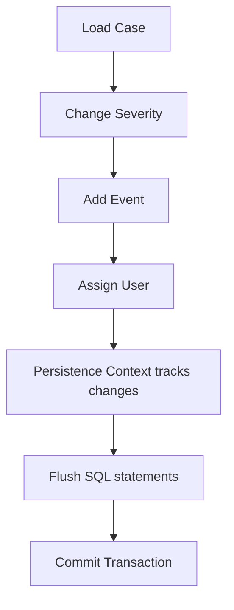

Application code bisa membuat banyak perubahan object, tetapi provider mengatur SQL sesuai dependency, foreign key, dirty state, dan flush ordering.

### 7.3 Change Tracker

JPA provider melacak perubahan managed entity.

Dengan Hibernate, dirty checking membandingkan state entity saat loaded dengan state saat flush. Detail implementasi bisa melibatkan snapshot atau bytecode enhancement.

Konsekuensi:

- Setter tidak selalu harus memanggil repository save.
- Field mutation pada managed entity cukup untuk update.
- Entity besar bisa punya cost dirty checking lebih tinggi.
- Long persistence context bisa membengkak.

### 7.4 Write-Behind

Write-behind berarti perubahan ditunda sampai flush.

Contoh:

```java
caseEntity.changeStatus(CaseStatus.ESCALATED);
caseEntity.addEvent(new CaseEvent("ESCALATED"));

// Belum tentu ada SQL di sini.
```

SQL bisa dikirim nanti:

```java
entityManager.flush();
```

atau saat query/commit.

Write-behind memungkinkan provider mengoptimalkan urutan SQL, tetapi juga membuat exception muncul terlambat.

---

## 8. Transaction: Boundary dari Kebenaran Sementara ke Kebenaran Durable

Transaction menentukan perubahan mana yang atomic.

Dalam persistence, ada tiga lapis “kebenaran”:

| Lapis | Contoh | Sifat |
|---|---|---|
| Object truth | Field object sudah berubah | Hanya benar di memory saat itu |
| Flush truth | SQL sudah dikirim ke database | Bisa rollback, visibility tergantung isolation |
| Commit truth | Transaction commit | Durable dan visible sesuai aturan database |

Contoh:

```java
@Transactional
public void escalate(UUID caseId) {
    RegulatoryCase c = repository.getReferenceById(caseId);
    c.escalate();
    c.addEvent(CaseEvent.escalated(caseId));
}
```

Dalam method ini:

1. Object state berubah.
2. Persistence context menandai dirty.
3. Saat flush, SQL `UPDATE` dan `INSERT` dikirim.
4. Saat commit berhasil, perubahan durable.
5. Jika exception menyebabkan rollback, perubahan database dibatalkan.

### 8.1 Transaction Boundary Bukan Method Boundary Semata

`@Transactional` sering dipakai di method service, tetapi konsepnya bukan “method ini butuh annotation”. Konsepnya adalah:

> Unit perubahan bisnis apa yang harus berhasil atau gagal bersama?

Contoh command:

- Escalate case.
- Record event.
- Create outbox message.
- Update SLA deadline.

Jika keempatnya harus konsisten, mereka harus berada dalam satu transaction.

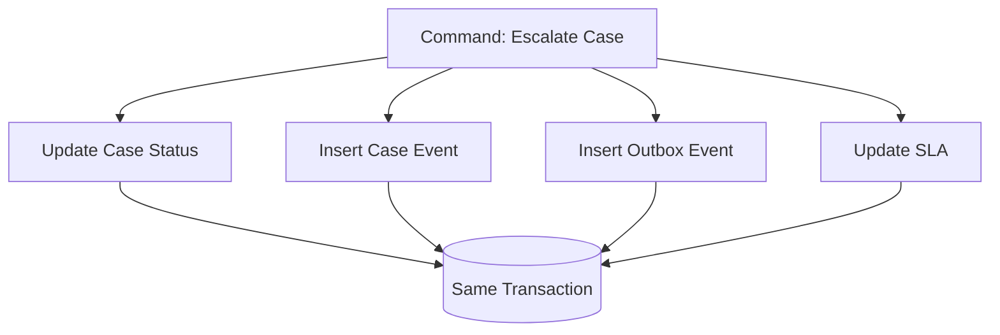

### 8.2 Transaction Terlalu Kecil

Contoh buruk:

```java
public void escalate(UUID caseId) {
    caseRepository.markEscalated(caseId);      // transaction 1
    eventRepository.recordEscalated(caseId);   // transaction 2
    outboxRepository.enqueue(...);             // transaction 3
}
```

Jika transaction 1 berhasil tetapi transaction 2 gagal, state case berubah tanpa audit event.

### 8.3 Transaction Terlalu Besar

Contoh buruk lain:

```java
@Transactional
public void escalate(UUID caseId) {
    RegulatoryCase c = repository.findById(caseId).orElseThrow();
    c.escalate();

    externalNotificationClient.send(...); // network call inside transaction

    c.addEvent(...);
}
```

Risiko:

- Connection database ditahan selama network call.
- Lock lebih lama.
- Timeout meningkat.
- Retry menjadi ambigu.
- External side effect bisa terjadi walau transaction rollback.

Prinsip:

> Database transaction sebaiknya melindungi perubahan database, bukan membungkus seluruh workflow dunia luar.

Untuk integrasi eksternal, gunakan outbox atau workflow orchestration yang eksplisit.

---

## 9. Flush: Jembatan dari Memory ke SQL

Flush adalah proses sinkronisasi persistence context ke database.

Flush bukan commit.

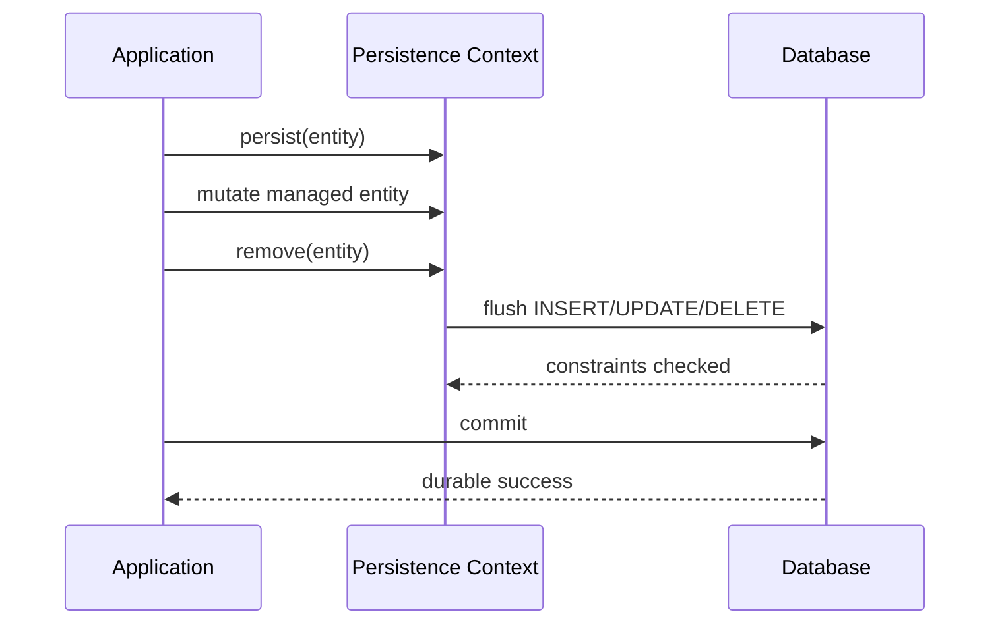

### 9.1 Kenapa Flush Penting?

Karena banyak bug muncul dari asumsi salah:

| Asumsi Salah | Realitas |
|---|---|
| `persist()` langsung insert | Belum tentu, bisa ditunda |
| Setter langsung update database | Tidak, hanya memory dirty |
| Constraint error muncul saat setter | Tidak, biasanya saat flush/commit |
| Query selalu read-only | Query bisa memicu flush dulu |
| Commit hanya formalitas | Commit menentukan durability |

### 9.2 Flush Sebelum Query

Dengan flush mode default, provider bisa melakukan flush sebelum query agar hasil query konsisten dengan perubahan pending.

Contoh:

```java
caseEntity.changeStatus(CaseStatus.CLOSED);

long closedCount = em.createQuery("""
    select count(c)
    from RegulatoryCase c
    where c.status = :status
""", Long.class)
.setParameter("status", CaseStatus.CLOSED)
.getSingleResult();
```

Agar query count melihat perubahan status pending, provider dapat melakukan flush sebelum query.

Konsekuensi:

- Query read bisa menyebabkan SQL write muncul.
- Constraint violation bisa muncul di baris query, bukan di baris perubahan object.
- Debugging stack trace bisa membingungkan.

---

## 10. Entity Bukan DTO

Entity sering disalahgunakan sebagai DTO API response.

Masalahnya:

- Entity membawa lazy association.
- Entity membawa persistence identity.
- Entity bisa managed/detached.
- Entity bisa punya bidirectional reference.
- Serializer bisa memicu query.
- Field entity tidak selalu cocok dengan API contract.
- API contract bisa memaksa persistence model menjadi tidak sehat.

Contoh buruk:

```java
@GetMapping("/cases/{id}")
public RegulatoryCase getCase(@PathVariable UUID id) {
    return repository.findById(id).orElseThrow();
}
```

Risiko:

- Lazy loading saat serialization.
- Infinite recursion pada bidirectional association.
- Data internal bocor.
- Query count tidak terkontrol.
- Entity shape menjadi API contract publik.

Contoh lebih sehat:

```java
record CaseDetailResponse(
    UUID id,
    String caseNumber,
    String status,
    String organizationName,
    List<CaseEventResponse> recentEvents
) {}
```

Entity digunakan untuk command consistency dan persistence lifecycle. DTO digunakan untuk external contract.

---

## 11. Entity Bukan Selalu Aggregate Root

Dalam Domain-Driven Design, aggregate root adalah boundary konsistensi. Dalam JPA, entity adalah object persistent.

Keduanya tidak selalu sama.

Contoh:

- `RegulatoryCase` bisa menjadi aggregate root.
- `CaseEvent` bisa entity persistent tetapi bukan aggregate root.
- `Organization` bisa aggregate root berbeda.
- `User` mungkin datang dari IAM service, bukan aggregate dalam database ini.

Kesalahan umum:

```java
@Entity
class RegulatoryCase {
    @ManyToOne(cascade = CascadeType.ALL)
    private Organization organization;
}
```

Jika `Organization` aggregate terpisah, cascade all dari case ke organization berbahaya. Menghapus case bisa ikut menghapus organization jika cascade remove aktif.

Prinsip:

> Semua aggregate root bisa entity, tetapi tidak semua entity adalah aggregate root.

---

## 12. Managed Entity Mutation: Kekuatan dan Bahaya

Salah satu fitur produktif JPA adalah dirty checking.

```java
@Transactional
public void renameOrganization(UUID id, String newName) {
    Organization org = organizationRepository.findById(id).orElseThrow();
    org.rename(newName);
}
```

Tidak ada `save()`, tetapi update bisa terjadi saat commit karena `org` managed.

Ini elegan jika dipahami. Berbahaya jika tidak.

### 12.1 Kekuatan

- Domain method bisa mengubah state tanpa persistence boilerplate.
- Unit of work bisa menyimpan beberapa perubahan bersama.
- Application service lebih bersih.
- Invariant bisa ditempatkan di entity method.

### 12.2 Bahaya

- Perubahan tidak sengaja bisa tersimpan.
- Getter yang mengembalikan mutable collection bisa menyebabkan mutation liar.
- Mapping entity langsung ke request object bisa mengubah field sensitif.
- Long transaction membuat banyak object dirty.
- Developer tidak sadar `save()` redundant atau malah salah.

Contoh bahaya:

```java
@Transactional
public void updateFromRequest(UUID id, CaseUpdateRequest request) {
    RegulatoryCase c = repository.findById(id).orElseThrow();
    mapper.copy(request, c); // dangerous blind mutation
}
```

Risiko:

- Field yang tidak boleh berubah ikut berubah.
- Null dari request menimpa value lama.
- Invariant domain dilewati.
- Audit tidak tercatat.

Lebih baik:

```java
@Transactional
public void escalate(UUID id, EscalateCaseCommand command) {
    RegulatoryCase c = repository.findById(id).orElseThrow();
    c.escalate(command.reason(), command.actorId());
    c.addEvent(CaseEvent.escalated(id, command.actorId(), command.reason()));
}
```

Mutation harus berbentuk domain operation, bukan property copying.

---

## 13. Detached Entity and the Merge Trap

Detached entity adalah sumber bug halus.

Misalnya:

```java
RegulatoryCase detached = apiRequest.toEntity();
repository.save(detached);
```

Di Spring Data JPA, `save()` bisa memanggil `persist()` atau `merge()` tergantung apakah entity dianggap baru. Untuk entity existing, merge dapat menyalin state detached ke managed instance.

Masalah:

- Detached entity mungkin tidak memuat semua field.
- Field null bisa menimpa data existing.
- Association detached bisa menyebabkan cascade tidak terduga.
- State lama dari client bisa menimpa update yang lebih baru jika tidak ada versioning.

### 13.1 Mental Model Merge

`merge()` bukan “attach object ini”.

Mental model yang lebih aman:

> `merge(detached)` menyalin state detached ke managed copy dan mengembalikan managed instance. Object detached asli tetap detached.

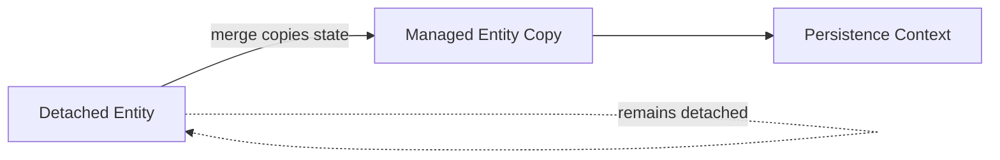

Kesalahan umum:

```java
RegulatoryCase merged = em.merge(detached);
detached.changeStatus(CLOSED); // this change is not tracked
```

Perubahan setelah merge pada detached object asli tidak otomatis dilacak.

### 13.2 Safer Pattern for Updates

Daripada merge object dari request, load managed entity lalu panggil behavior eksplisit.

```java
@Transactional
public void updateSeverity(UUID caseId, UpdateSeverityCommand command) {
    RegulatoryCase c = repository.findById(caseId).orElseThrow();
    c.changeSeverity(command.newSeverity(), command.reason(), command.actorId());
}
```

Pattern ini:

- Menjaga invariant.
- Menghindari blind overwrite.
- Memakai dirty checking secara sadar.
- Memungkinkan optimistic locking.
- Memudahkan audit event.

---

## 14. Lazy Loading: Akses Object yang Bisa Menjadi Query

Lazy loading berarti association tidak langsung diload saat entity utama diload.

Contoh:

```java
RegulatoryCase c = repository.findById(id).orElseThrow();
String orgName = c.getOrganization().getName();
```

Jika `organization` lazy, akses `getOrganization()` atau `getName()` bisa memicu query tambahan.

### 14.1 Kenapa Lazy Loading Ada?

Karena tidak semua use case butuh seluruh graph.

Tanpa lazy loading, load satu case bisa ikut load:

- Organization.
- Events.
- Decisions.
- Evidence.
- Assignments.
- SLA history.
- Audit records.

Ini bisa menjadi graph explosion.

### 14.2 Kenapa Lazy Loading Berbahaya?

Karena akses object terlihat murah padahal bisa mahal.

```java
List<RegulatoryCase> cases = repository.findOpenCases();

for (RegulatoryCase c : cases) {
    System.out.println(c.getOrganization().getName());
}
```

Jika `findOpenCases()` mengambil 100 case, loop ini bisa memicu 100 query tambahan.

Itulah N+1.

### 14.3 Lazy Initialization Error

Jika persistence context sudah tertutup:

```java
RegulatoryCase c = service.loadCase(id); // transaction ended
c.getEvents().size(); // lazy initialization failure
```

Masalah ini sering “diselesaikan” dengan Open Session in View. Tetapi itu sering hanya memindahkan query ke layer web dan membuat query count sulit dikendalikan.

Prinsip:

> Fetch plan harus ditentukan sebelum keluar dari service boundary.

---

## 15. Row Visibility and Transaction Isolation

Object yang berubah di transaction A belum tentu terlihat oleh transaction B.

```mermaid
sequenceDiagram
    participant T1 as Transaction 1
    participant DB as Database
    participant T2 as Transaction 2

    T1->>DB: update case status = CLOSED
    Note over T1,DB: not committed yet
    T2->>DB: select case status
    DB-->>T2: depends on isolation; usually old committed value
    T1->>DB: commit
    T2->>DB: select again
    DB-->>T2: depends on isolation level and snapshot
```

JPA tidak menghilangkan isolation rules database.

Masalah concurrency seperti lost update, non-repeatable read, phantom read, dan write skew tetap harus dipahami.

JPA memberi fitur seperti:

- `@Version` untuk optimistic locking.
- Lock mode untuk pessimistic locking.
- Transaction isolation configuration via framework/database.

Tetapi JPA tidak bisa otomatis memahami semua invariant bisnis.

---

## 16. Database Constraint as Final Guard

Aplikasi bisa melakukan validasi, tetapi database tetap harus menegakkan invariant penting.

Contoh invariant:

> Dalam satu organization, case number harus unik.

Aplikasi bisa cek:

```java
if (repository.existsByOrganizationIdAndCaseNumber(orgId, caseNumber)) {
    throw new DuplicateCaseNumberException();
}
```

Tetapi check ini tidak cukup dalam concurrency.

Dua transaction bisa melakukan check bersamaan dan sama-sama melihat belum ada data.

Solusi final harus melibatkan unique constraint:

```sql
alter table regulatory_case
add constraint uk_reg_case_org_number unique (organization_id, case_number);
```

Application check berguna untuk user experience. Database constraint berguna untuk correctness.

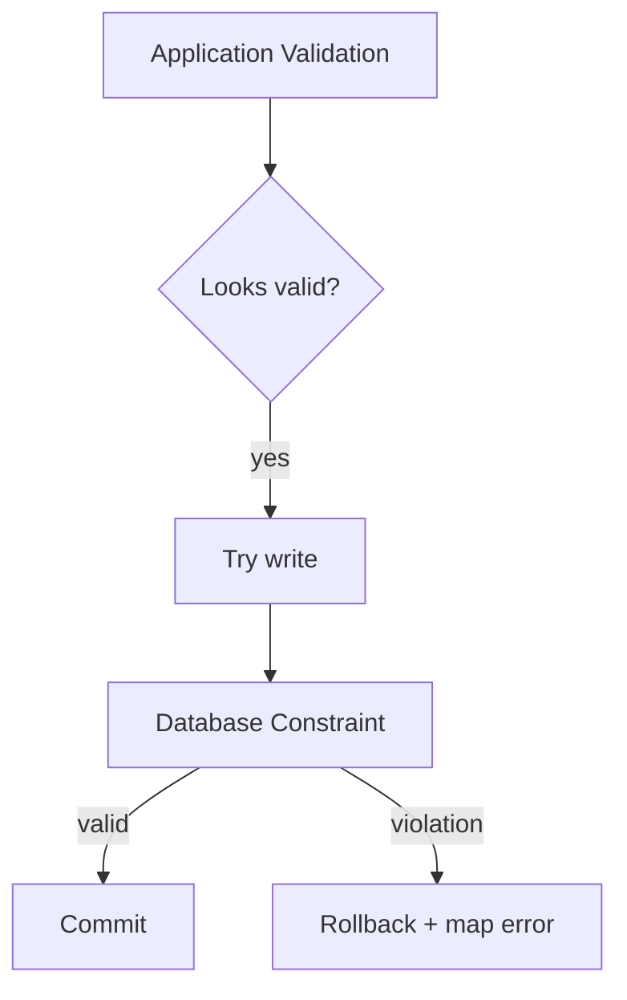

Top-tier engineer memakai keduanya.

---

## 17. Persistence Boundary in Layered Architecture

JPA entity sering bocor keluar boundary.

Arsitektur yang lebih aman:

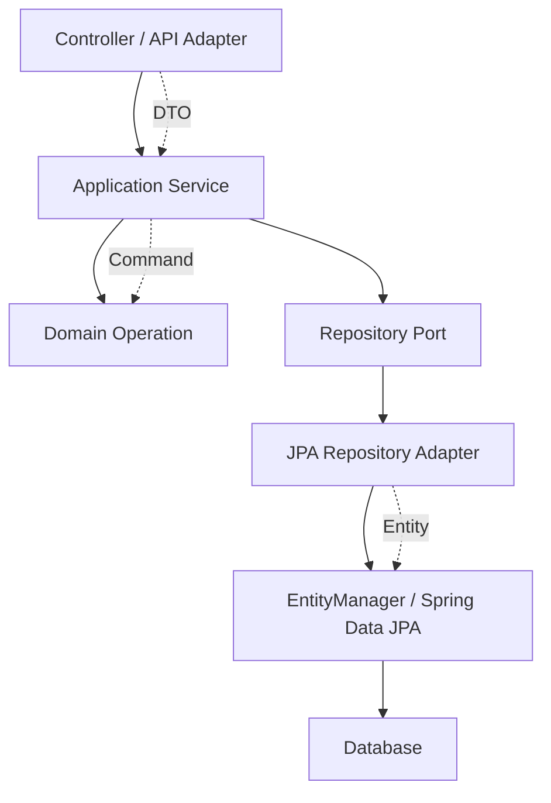

Prinsip:

- Controller menerima DTO/request.
- Application service menentukan transaction boundary.
- Domain operation mengubah state melalui method bermakna.
- Repository menyembunyikan persistence access, bukan cost.
- Entity JPA tidak perlu keluar ke API contract.

### 17.1 Entity as Internal Persistence Model

Dalam banyak sistem, entity JPA paling sehat diperlakukan sebagai internal model untuk persistence module.

Public API sebaiknya memakai DTO.

Domain command sebaiknya memakai command object.

Event sebaiknya memakai event payload eksplisit.

Ini menghindari coupling antara:

- Database schema.
- Entity mapping.
- API response.
- UI form.
- Message contract.

---

## 18. Case Study: Escalate Regulatory Case

Mari gunakan satu command untuk menggabungkan mental model.

Business requirement:

> User dapat mengeskalasi case dari `OPEN` menjadi `ESCALATED`. Sistem harus mencatat event, menyimpan actor, memperbarui severity, dan menerbitkan outbox event. Jika salah satu gagal, semua perubahan database harus rollback.

### 18.1 Entity Sketch

```java
@Entity
@Table(name = "regulatory_case")
public class RegulatoryCase {

    @Id
    private UUID id;

    @Column(name = "case_number", nullable = false)
    private String caseNumber;

    @Enumerated(EnumType.STRING)
    @Column(nullable = false)
    private CaseStatus status;

    @Enumerated(EnumType.STRING)
    @Column(nullable = false)
    private Severity severity;

    @Version
    private long version;

    protected RegulatoryCase() {
    }

    public void escalate(Severity newSeverity, String actorId, String reason) {
        if (this.status == CaseStatus.CLOSED) {
            throw new IllegalStateException("Closed case cannot be escalated");
        }
        this.status = CaseStatus.ESCALATED;
        this.severity = newSeverity;
    }
}
```

### 18.2 Service Sketch

```java
@Transactional
public void escalate(EscalateCaseCommand command) {
    RegulatoryCase c = caseRepository.findById(command.caseId())
        .orElseThrow(CaseNotFoundException::new);

    c.escalate(command.newSeverity(), command.actorId(), command.reason());

    caseEventRepository.save(CaseEvent.escalated(
        command.caseId(),
        command.actorId(),
        command.reason()
    ));

    outboxRepository.save(OutboxEvent.caseEscalated(
        command.caseId(),
        command.actorId()
    ));
}
```

### 18.3 What Happens Internally

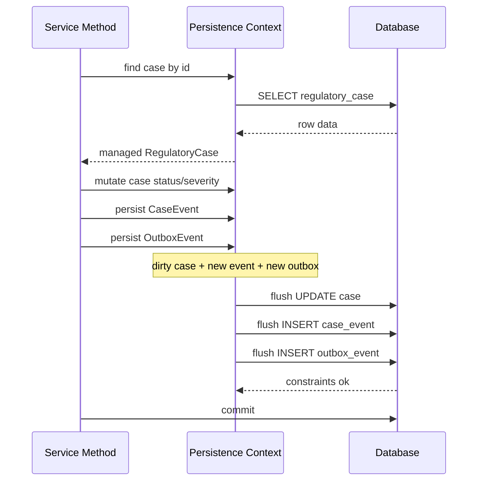

### 18.4 Failure Points

| Failure Point | Example | Expected Behavior |
|---|---|---|
| Case not found | invalid id | throw before mutation |
| Invalid status | closed case | throw domain exception, no write |
| Optimistic conflict | version changed | rollback and return conflict |
| Constraint violation | missing FK | rollback |
| Outbox insert failure | invalid payload | rollback case update and event |
| Commit failure | DB issue | transaction not durable |

This is the core production mental model: bukan hanya “save entity”, tetapi unit perubahan dengan failure semantics.

---

## 19. How to Think Before Writing Mapping

Sebelum menulis annotation, jawab pertanyaan ini.

### 19.1 Identity Questions

- Apa primary key database?
- Apa business key domain?
- Apakah business key immutable?
- Apakah id dibuat aplikasi atau database?
- Apakah entity akan dipakai dalam collection hash-based?

### 19.2 Lifecycle Questions

- Siapa yang membuat entity ini?
- Siapa yang boleh mengubah entity ini?
- Kapan entity ini dihapus?
- Apakah delete fisik diperbolehkan?
- Apakah butuh audit history?

### 19.3 Ownership Questions

- Apakah child bisa hidup tanpa parent?
- Apakah relationship shared?
- Apakah cascade persist aman?
- Apakah cascade remove aman?
- Apakah orphan removal sesuai domain?

### 19.4 Query Questions

- Use case utama mengambil data apa?
- Apakah list page butuh entity atau projection?
- Apakah detail page butuh graph lengkap?
- Apakah collection bisa besar?
- Apakah pagination diperlukan?

### 19.5 Transaction Questions

- Command apa yang harus atomic?
- Apa invariant lintas-row?
- Apakah perlu optimistic lock?
- Apakah perlu unique constraint?
- Apakah ada external side effect?

Baru setelah itu mapping ditulis.

---

## 20. Red Flags in Mental Model

Jika mendengar kalimat ini saat review, berhenti dan periksa lebih dalam.

### “Tambahkan saja `EAGER` biar tidak error.”

Ini biasanya menyembunyikan lazy initialization problem dengan graph loading yang tidak terkendali.

### “Pakai cascade all biar save otomatis.”

Cascade adalah lifecycle propagation, bukan convenience flag.

### “Return entity langsung saja dari controller.”

Ini mencampur persistence model dengan API contract.

### “`save()` dipanggil setelah setiap setter biar aman.”

Pada managed entity, ini sering redundant dan menunjukkan persistence context belum dipahami.

### “Kalau error constraint, berarti validasi aplikasinya kurang.”

Constraint database memang harus ada sebagai final guard. Aplikasi harus memetakan error dengan baik, bukan menghapus constraint.

### “N+1 nanti saja kalau sudah lambat.”

N+1 adalah design smell yang bisa dideteksi dengan query count sejak test.

### “Migration nanti generate dari entity.”

Production schema evolution harus explicit dan reviewable.

---

## 21. Mini Lab: Predict the SQL

Gunakan latihan ini untuk menguji mental model.

### 21.1 Scenario

```java
@Transactional
public void scenario(UUID caseId) {
    RegulatoryCase c1 = em.find(RegulatoryCase.class, caseId);
    RegulatoryCase c2 = em.find(RegulatoryCase.class, caseId);

    c1.changeSeverity(Severity.HIGH);

    long count = em.createQuery("""
        select count(c)
        from RegulatoryCase c
        where c.severity = :severity
    """, Long.class)
    .setParameter("severity", Severity.HIGH)
    .getSingleResult();
}
```

### 21.2 Questions

Sebelum menjalankan kode, jawab:

1. Apakah `c1 == c2`?
2. Apakah query kedua `find` pasti mengirim SQL?
3. Kapan `UPDATE` severity dikirim?
4. Apakah count query bisa memicu flush?
5. Apakah commit masih perlu jika flush sudah terjadi?

### 21.3 Expected Reasoning

1. `c1 == c2` biasanya true dalam persistence context yang sama.
2. `find` kedua bisa dilayani dari persistence context.
3. `UPDATE` muncul saat flush.
4. Count query bisa memicu flush agar query melihat perubahan pending.
5. Ya, flush bukan commit. Tanpa commit, perubahan bisa rollback.

Jika lima jawaban ini terasa natural, mental model mulai terbentuk.

---

## 22. Mini Lab: Detached Mutation

### 22.1 Scenario

```java
RegulatoryCase c = service.loadCase(caseId); // transaction ended
c.changeSeverity(Severity.HIGH);
service.doSomethingElse();
```

### 22.2 Questions

1. Apakah perubahan severity otomatis tersimpan?
2. Apakah object punya id?
3. Apakah object managed?
4. Apa cara aman menyimpan perubahan?

### 22.3 Expected Reasoning

1. Tidak otomatis.
2. Bisa punya id karena berasal dari database.
3. Tidak, karena sudah detached.
4. Load ulang managed entity dalam transaction lalu panggil domain method; hindari blind merge dari object detached.

---

## 23. Mini Lab: Constraint Race

### 23.1 Scenario

Dua request bersamaan membuat case dengan case number yang sama.

```java
@Transactional
public UUID createCase(CreateCaseCommand command) {
    if (repository.existsByOrgAndCaseNumber(command.orgId(), command.caseNumber())) {
        throw new DuplicateCaseNumberException();
    }

    RegulatoryCase c = RegulatoryCase.open(command.orgId(), command.caseNumber());
    repository.save(c);
    return c.getId();
}
```

### 23.2 Failure

Tanpa unique constraint, dua transaksi bisa lolos check.

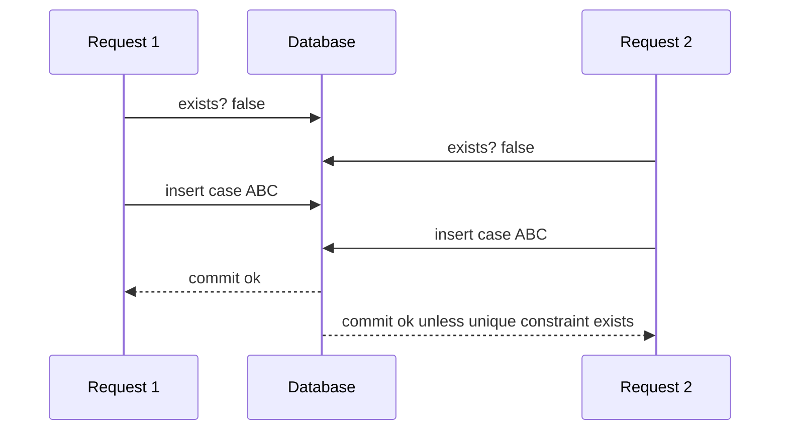

### 23.3 Correct Defense

Gunakan dua lapis:

1. Application-level existence check untuk error message cepat.
2. Database unique constraint untuk correctness final.

Saat constraint violation terjadi, map ke domain error yang tepat.

---

## 24. Persistence Mental Model Checklist

Sebelum lanjut ke Part 003, pastikan bisa menjawab ini.

### Object and Row

- Bisa menjelaskan perbedaan object reference dan foreign key.
- Bisa menjelaskan kenapa object graph tidak sama dengan relational graph.
- Bisa menjelaskan kenapa collection Java bisa berarti query database.

### Identity

- Bisa membedakan object identity, database identity, persistence identity, business identity.
- Bisa menjelaskan kenapa dua object berbeda bisa merepresentasikan row sama.
- Bisa menjelaskan risiko `equals/hashCode` berbasis generated id.

### Entity State

- Bisa membedakan new, managed, detached, removed.
- Bisa menjelaskan dirty checking.
- Bisa menjelaskan kenapa detached mutation tidak disimpan.
- Bisa menjelaskan `merge()` sebagai copy state, bukan attach object asli.

### Transaction

- Bisa membedakan mutation, flush, dan commit.
- Bisa menjelaskan kenapa query bisa memicu flush.
- Bisa menjelaskan kenapa transaction boundary harus mengikuti business consistency boundary.

### Production

- Bisa menjelaskan kenapa database constraint tetap wajib.
- Bisa menjelaskan kenapa entity tidak boleh langsung menjadi API response.
- Bisa menjelaskan kenapa lazy loading harus dikendalikan oleh fetch plan.

---

## 25. Mental Model Summary

Java Persistence harus dipikirkan sebagai pipeline:

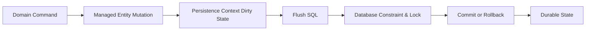

Setiap langkah punya failure mode:

| Step | Failure Mode |
|---|---|
| Domain command | invalid transition, missing permission |
| Managed mutation | accidental field overwrite |
| Persistence context | stale entity, memory growth |
| Flush | constraint violation, SQL order issue |
| Database lock | deadlock, lock timeout |
| Commit | connection failure, serialization failure |
| Durable state | cache/event inconsistency |

Top-tier persistence engineering bukan menghafal API. Ia adalah kemampuan memprediksi pipeline ini, membuktikannya dengan observability, dan mendesain agar failure mode tidak merusak data.

---

## 26. Referensi Utama

- Jakarta Persistence 3.2 Specification — https://jakarta.ee/specifications/persistence/3.2/
- Jakarta Persistence Specification Document — https://jakarta.ee/specifications/persistence/3.2/jakarta-persistence-spec-3.2
- Hibernate ORM User Guide — https://docs.hibernate.org/stable/orm/userguide/html_single/
- Hibernate ORM Documentation — https://hibernate.org/orm/documentation/
- Spring Data JPA Reference Documentation — https://docs.spring.io/spring-data/jpa/reference/index.html

---

## 27. Penutup Part 002

Part ini membentuk fondasi mental:

1. Object bukan row.
2. Reference bukan foreign key.
3. Managed bukan detached.
4. Flush bukan commit.
5. Entity bukan DTO.
6. Transaction bukan sekadar annotation.
7. Constraint database bukan optional.

Part berikutnya akan masuk ke arsitektur JPA: `EntityManager`, persistence unit, provider, datasource, transaction integration, dan posisi Hibernate/Spring Data JPA dalam stack.
