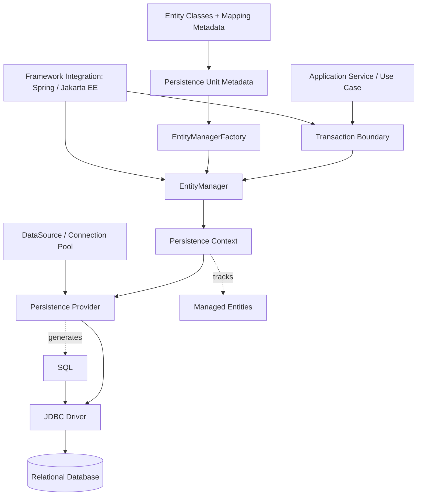
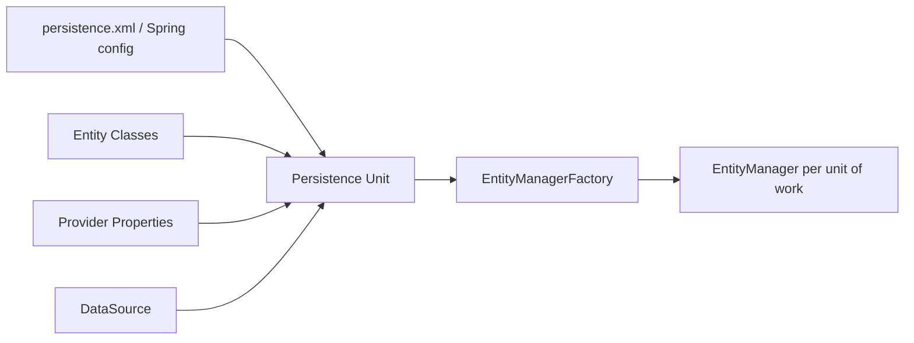
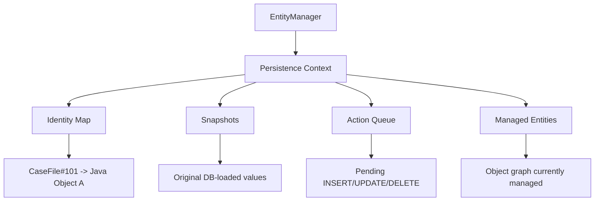
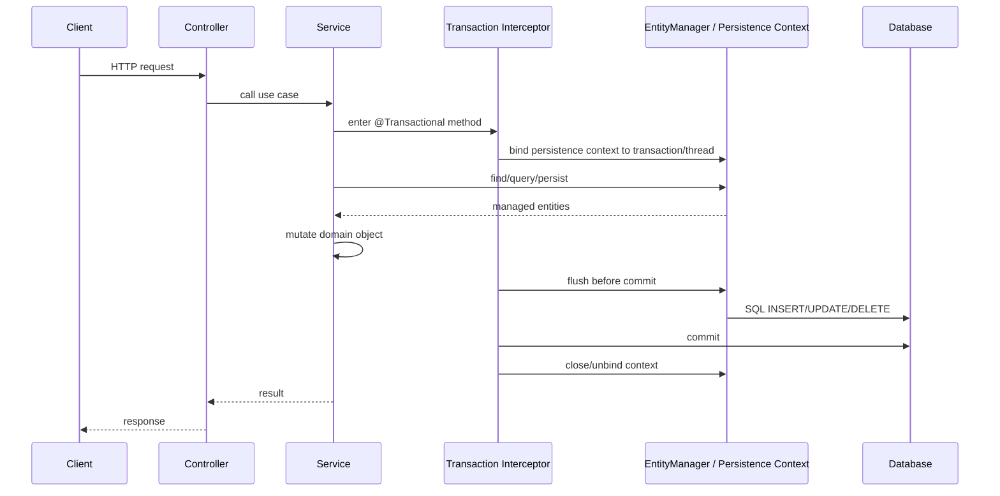
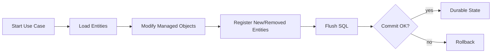
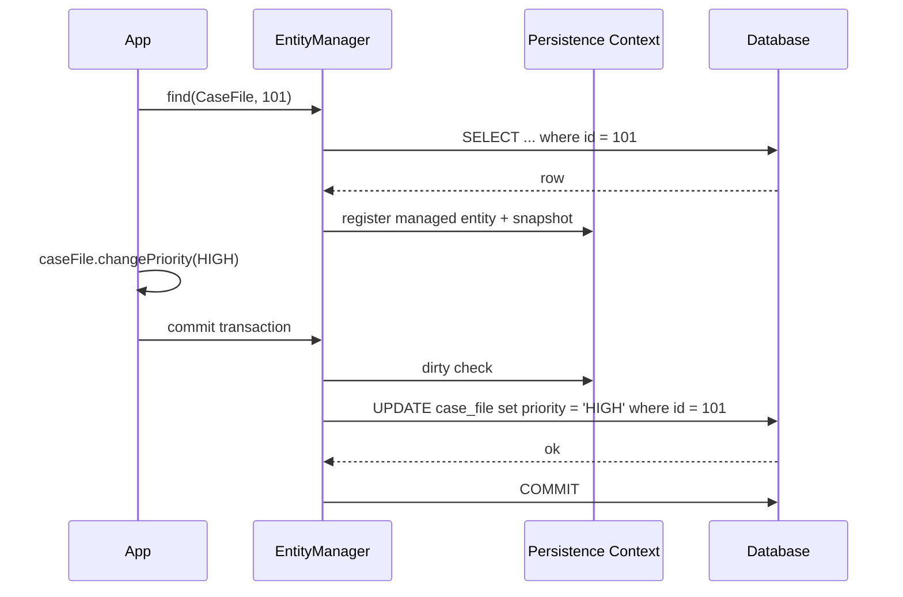
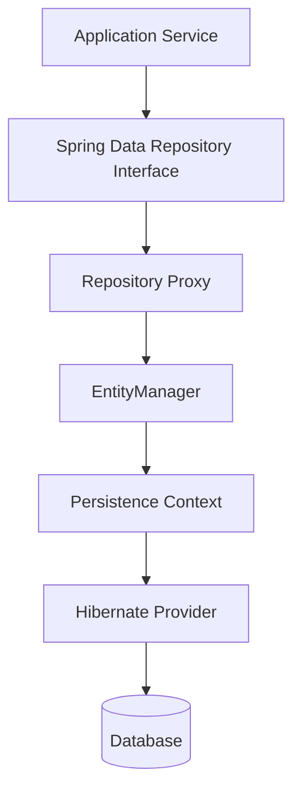
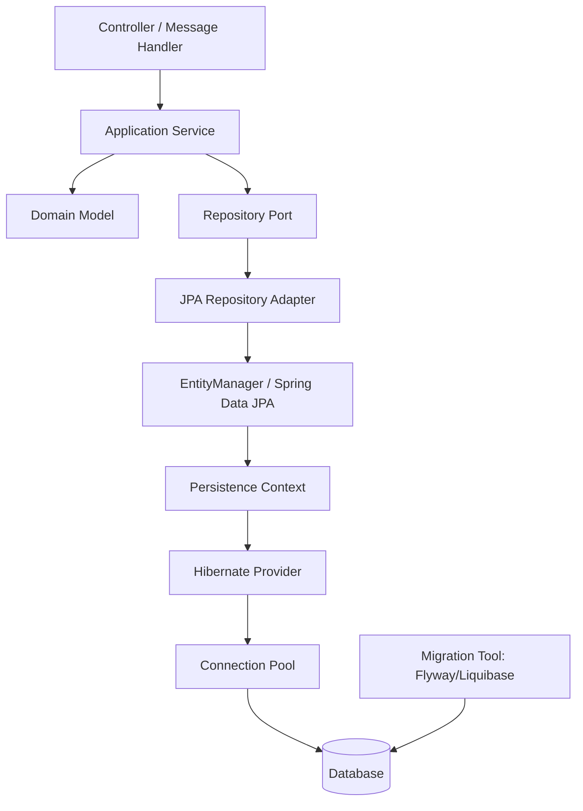

# Part 003 — JPA Architecture: EntityManager, Persistence Context, Provider

Pada tahap ini kita belum membahas annotation mapping secara detail. Kita mulai dari arsitektur karena banyak bug JPA yang tampak seperti “query error” sebenarnya berasal dari salah paham terhadap **siapa yang memegang state**, **siapa yang membuka koneksi**, **siapa yang menentukan transaksi**, dan **kapan provider mengirim SQL**.

JPA bukan sekadar cara menulis `@Entity`. JPA adalah model koordinasi antara:

1. object domain model,
2. persistence context,
3. transaction boundary,
4. provider ORM,
5. JDBC connection,
6. relational database,
7. framework aplikasi seperti Spring atau Jakarta EE container.

Kalau arsitektur ini kabur, developer biasanya jatuh ke pola berikut:

- mengira `EntityManager` sama dengan repository;
- mengira `save()` selalu langsung melakukan `INSERT`;
- mengira entity yang sudah berubah otomatis tersimpan walau tidak ada transaksi;
- mengira `@Transactional` hanya “membuka transaksi”, padahal juga mengikat persistence context;
- mengira Hibernate behavior selalu sama dengan standar JPA;
- mengira persistence context adalah cache umum, padahal scope-nya terbatas;
- mengira database constraint bisa digantikan oleh annotation Java;
- mengira lazy loading adalah fitur domain model, padahal itu perilaku runtime persistence provider.

Tujuan part ini: membangun model internal yang cukup kuat supaya ketika melihat SQL, log transaction, stack trace lazy loading, atau anomali update, kita bisa menebak bagian arsitektur mana yang salah.

---

## 1. Kaufman Deconstruction: Skill yang Sebenarnya Dipelajari

Dalam gaya Josh Kaufman, kita pecah “menguasai JPA architecture” menjadi sub-skill kecil yang bisa dipraktikkan:

| Sub-skill | Pertanyaan Diagnostik | Output yang Harus Bisa Dibuat |
|---|---|---|
| Persistence unit modelling | Entity dan konfigurasi ini milik persistence unit mana? | Diagram bootstrap JPA |
| EntityManager lifecycle | Kapan dibuat, dipakai, dan ditutup? | Timeline request/transaction |
| Persistence context reasoning | Object ini managed atau detached? | State transition table |
| Provider boundary | Mana standar JPA, mana Hibernate-specific? | Decision matrix API usage |
| Transaction integration | Siapa pemilik transaksi? Spring, JTA, atau manual? | Transaction ownership map |
| SQL emission reasoning | Kapan SQL dikirim? | Flush/commit sequence diagram |
| Failure localization | Error ini berasal dari mapping, transaction, provider, JDBC, atau DB? | Troubleshooting flow |

Kita tidak ingin “hafal API”. Kita ingin bisa melihat sebuah bug produksi dan berkata:

> “Masalahnya bukan di repository. Entity itu detached karena transaction boundary selesai sebelum lazy association diakses.”

atau:

> “`persist()` tidak gagal saat dipanggil karena SQL baru dikirim saat flush. Constraint violation muncul terlambat di commit.”

atau:

> “Repository method terlihat read-only, tapi query menyebabkan flush karena ada managed entity yang dirty di persistence context.”

Itulah skill arsitektural yang kita bangun.

---

## 2. JPA dalam Satu Diagram Besar

Diagram berikut adalah mental model utama untuk part ini.



Baca diagram ini dari bawah ke atas:

- entity class dan mapping metadata membentuk **persistence unit**;
- persistence unit diproses menjadi **EntityManagerFactory**;
- factory membuat **EntityManager**;
- `EntityManager` mengoperasikan **persistence context**;
- persistence context menyimpan entity managed dan snapshot-nya;
- provider seperti Hibernate menerjemahkan state change menjadi SQL;
- SQL dikirim lewat JDBC connection;
- transaction boundary menentukan kapan perubahan menjadi atomik dan durable.

Yang penting: aplikasi biasanya tidak langsung “menulis ke database”. Aplikasi mengubah object yang sedang dikelola persistence context. Provider kemudian menyinkronkan perubahan itu ke database pada waktu tertentu.

---

## 3. Bahasa Arsitektur: Jangan Campur Level

Dalam sistem JPA modern, ada beberapa lapisan yang sering tercampur:

| Level | Contoh | Peran | Risiko Jika Tercampur |
|---|---|---|---|
| Standard API | Jakarta Persistence / JPA | Kontrak portable untuk ORM | Menganggap semua fitur Hibernate portable |
| Provider | Hibernate ORM, EclipseLink | Implementasi runtime JPA | Bergantung ke behavior provider tanpa sadar |
| Integration Framework | Spring Framework, Jakarta EE container | Transaction, lifecycle, injection | Mengira `@Transactional` adalah fitur JPA |
| Repository Abstraction | Spring Data JPA | Mengurangi boilerplate repository | Mengira repository abstraction menghilangkan aturan persistence context |
| JDBC Layer | Driver, connection pool | Transport SQL ke database | Mengabaikan connection lifecycle dan isolation |
| Database Engine | PostgreSQL, MySQL, Oracle, SQL Server | Constraint, lock, index, query plan | Mengira ORM bisa menyelesaikan semua masalah relational |

Prinsipnya:

> JPA menentukan model persistensi. Provider menjalankannya. Framework mengikat lifecycle-nya. Database tetap menjadi sumber kebenaran untuk data, constraint, isolation, dan durability.

---

## 4. Apa Itu Persistence Unit?

**Persistence unit** adalah unit konfigurasi yang mendeskripsikan satu model persistence: entity mana yang dikelola, provider apa yang digunakan, datasource mana yang dipakai, properti apa yang aktif, dan bagaimana transaksi diintegrasikan.

Dalam aplikasi klasik Java SE atau Jakarta EE, persistence unit biasanya didefinisikan di `META-INF/persistence.xml`.

Contoh konseptual:

```xml
<persistence xmlns="https://jakarta.ee/xml/ns/persistence"
             version="3.2">
    <persistence-unit name="case-management-pu" transaction-type="RESOURCE_LOCAL">
        <provider>org.hibernate.jpa.HibernatePersistenceProvider</provider>

        <class>com.acme.casefile.CaseFile</class>
        <class>com.acme.casefile.EnforcementAction</class>
        <class>com.acme.casefile.AuditEntry</class>

        <properties>
            <property name="jakarta.persistence.jdbc.url" value="jdbc:postgresql://localhost:5432/app"/>
            <property name="jakarta.persistence.jdbc.user" value="app"/>
            <property name="jakarta.persistence.jdbc.password" value="secret"/>
            <property name="jakarta.persistence.schema-generation.database.action" value="validate"/>
        </properties>
    </persistence-unit>
</persistence>
```

Dalam Spring Boot, kita jarang menulis `persistence.xml` secara manual. Boot melakukan auto-configuration berdasarkan classpath, `DataSource`, package scanning, dan properti seperti `spring.jpa.*`. Namun secara mental, hasil akhirnya tetap sama: ada model persistence yang dibootstrap menjadi `EntityManagerFactory`.

Jangan salah paham:

- persistence unit **bukan database**;
- persistence unit **bukan schema**;
- persistence unit **bukan transaction**;
- persistence unit adalah **configuration boundary** untuk managed persistence model.

Satu aplikasi bisa punya lebih dari satu persistence unit, misalnya:

- `core-pu` untuk database utama;
- `audit-pu` untuk database audit;
- `legacy-pu` untuk sistem lama;
- `tenant-pu` untuk isolated tenant database.

Tetapi multi-persistence-unit menambah kompleksitas transaction coordination, migration, observability, dan testing. Jangan dipakai hanya karena “lebih rapi secara package”.

---

## 5. EntityManagerFactory: Runtime Factory yang Mahal

`EntityManagerFactory` adalah hasil bootstrap persistence unit. Ia membaca metadata entity, annotation, XML mapping bila ada, provider configuration, datasource, dialect database, dan menyiapkan infrastruktur internal provider.

Secara mental:



Karakteristik penting:

| Karakteristik | Implikasi Engineering |
|---|---|
| Expensive to create | Buat sekali saat aplikasi startup, bukan per request |
| Shared infrastructure | Bisa dipakai banyak thread untuk membuat `EntityManager` |
| Metadata owner | Menyimpan mapping model dan provider services |
| Integration point | Framework seperti Spring membungkusnya dalam bean singleton |
| Close at shutdown | Harus ditutup saat aplikasi berhenti untuk melepas resource |

Contoh Java SE:

```java
EntityManagerFactory emf = Persistence.createEntityManagerFactory("case-management-pu");

try {
    EntityManager em = emf.createEntityManager();
    try {
        // unit of work
    } finally {
        em.close();
    }
} finally {
    emf.close();
}
```

Dalam Spring:

```java
@Configuration
class PersistenceConfiguration {
    // Biasanya Boot sudah membuat LocalContainerEntityManagerFactoryBean
    // berdasarkan DataSource dan dependency Hibernate.
}
```

Sebagai engineer, kamu jarang menyentuh `EntityManagerFactory` langsung di service code. Tapi kamu harus tahu bahwa semua `EntityManager` berasal dari factory ini.

---

## 6. EntityManager: API untuk Mengontrol Persistence Context

`EntityManager` adalah antarmuka utama aplikasi ke persistence context.

Ia bisa:

- membuat entity menjadi managed dengan `persist()`;
- mencari entity dengan `find()`;
- membuat query JPQL, Criteria, atau native query;
- menghapus entity dengan `remove()`;
- menyinkronkan perubahan lewat `flush()`;
- melepas entity dari context dengan `detach()` atau `clear()`;
- mengakses transaction pada resource-local mode;
- mendapatkan reference/proxy;
- mengunci entity;
- melakukan refresh dari database.

Contoh:

```java
EntityManager em = emf.createEntityManager();
EntityTransaction tx = em.getTransaction();

try {
    tx.begin();

    CaseFile caseFile = em.find(CaseFile.class, caseId);
    caseFile.assignTo(officerId);

    tx.commit();
} catch (RuntimeException ex) {
    if (tx.isActive()) {
        tx.rollback();
    }
    throw ex;
} finally {
    em.close();
}
```

Pada contoh di atas, tidak ada `em.update(caseFile)`. Perubahan `caseFile.assignTo()` akan dideteksi karena object itu managed dalam persistence context.

Ini salah satu perbedaan paling besar dibanding JDBC manual:

```java
// JDBC mental model
executeUpdate("update case_file set assignee_id = ? where id = ?", assigneeId, caseId);

// JPA mental model
CaseFile caseFile = em.find(CaseFile.class, caseId);
caseFile.assignTo(assigneeId);
```

Dalam JPA, perubahan object adalah niat. SQL adalah konsekuensi sinkronisasi.

---

## 7. EntityManager Bukan Repository

`EntityManager` terlalu rendah level untuk dijadikan API domain/use case. Ia adalah persistence gateway primitive.

Repository yang baik menyembunyikan operasi persistence yang bermakna domain:

```java
public interface CaseFileRepository {
    Optional<CaseFile> findOpenCase(CaseId id);
    void add(CaseFile caseFile);
    boolean existsActiveCaseForSubject(SubjectId subjectId);
}
```

Implementasi bisa memakai `EntityManager`:

```java
@Repository
class JpaCaseFileRepository implements CaseFileRepository {

    @PersistenceContext
    private EntityManager entityManager;

    @Override
    public Optional<CaseFile> findOpenCase(CaseId id) {
        return entityManager.createQuery("""
                select c
                from CaseFile c
                where c.id = :id
                  and c.status <> com.acme.casefile.CaseStatus.CLOSED
                """, CaseFile.class)
            .setParameter("id", id)
            .getResultStream()
            .findFirst();
    }

    @Override
    public void add(CaseFile caseFile) {
        entityManager.persist(caseFile);
    }
}
```

Kenapa ini penting?

Karena `EntityManager` berbicara dalam bahasa persistence: persist, merge, remove, flush, find. Repository berbicara dalam bahasa aplikasi/domain: find open case, add case, exists active case.

Anti-pattern:

```java
@Service
class CaseService {
    @PersistenceContext
    EntityManager em;

    public void doEverything(...) {
        // query string scattered everywhere
        // no domain-oriented repository boundary
    }
}
```

Ini membuat persistence detail bocor ke seluruh aplikasi dan menyulitkan perubahan query, fetch plan, lock strategy, atau testing.

---

## 8. Persistence Context: Unit of Identity and Change Tracking

Persistence context adalah ruang kerja in-memory yang menyimpan entity managed.

Ia menjalankan beberapa fungsi penting:

1. **identity map** — satu row database direpresentasikan oleh satu instance entity dalam context yang sama;
2. **change tracking** — provider mendeteksi perubahan field entity;
3. **write-behind** — SQL bisa ditunda sampai flush/commit;
4. **relationship coordination** — association antar entity dikelola dalam object graph;
5. **first-level cache** — query by id bisa mengembalikan object yang sudah ada di context;
6. **lifecycle tracking** — transient, managed, detached, removed.

Diagram:



Misalnya:

```java
CaseFile a = em.find(CaseFile.class, 101L);
CaseFile b = em.find(CaseFile.class, 101L);

System.out.println(a == b); // true dalam persistence context yang sama
```

Ini bukan sekadar optimization. Ini identity guarantee dalam unit of work. Kalau satu row bisa memiliki dua object managed berbeda dalam context yang sama, dirty checking dan relationship consistency akan kacau.

---

## 9. Persistence Context Scope

Persistence context bisa memiliki scope berbeda tergantung environment.

### 9.1 Transaction-Scoped Persistence Context

Paling umum di aplikasi Spring web/API.



Sifatnya:

- persistence context hidup selama transaksi;
- setelah transaksi selesai, entity menjadi detached;
- lazy association yang belum ter-load bisa gagal jika diakses setelah context tertutup;
- cocok untuk stateless service layer.

### 9.2 Extended Persistence Context

Extended persistence context hidup lebih lama daripada satu transaksi. Ini biasanya muncul di stateful component, long conversation, atau UI workflow tertentu.

Risikonya tinggi:

- memory retention;
- stale data;
- konflik concurrency;
- perubahan entity tidak sengaja ikut tersimpan;
- sulit diprediksi di aplikasi stateless modern.

Untuk aplikasi backend API/microservices, transaction-scoped persistence context hampir selalu lebih masuk akal.

---

## 10. Provider: Standar JPA Tidak Menghasilkan SQL Sendiri

JPA adalah spesifikasi/API. Ia tidak menjalankan persistence sendiri. Provider-lah yang melakukan kerja runtime.

Provider umum:

- Hibernate ORM;
- EclipseLink;
- OpenJPA;
- DataNucleus.

Provider bertugas:

- membaca metadata entity;
- membangun metamodel;
- membuat proxy/lazy loading mechanism;
- melakukan dirty checking;
- menentukan SQL berdasarkan dialect;
- mengatur flush ordering;
- menjalankan query JPQL/Criteria/native;
- menerjemahkan exception database;
- mengelola second-level cache jika aktif;
- mengimplementasikan extension di luar standar.

Contoh provider-specific Hibernate:

```java
Session session = entityManager.unwrap(Session.class);
```

`unwrap()` berguna saat kita membutuhkan fitur provider-specific, tetapi harus dipakai dengan sadar.

Rule:

> Gunakan standar JPA untuk operasi umum. Gunakan Hibernate-specific API hanya ketika ada alasan engineering yang jelas: batching, custom type, fetch strategy, filter, stateless session, multi-tenancy, atau performance tuning.

---

## 11. Bootstrap Mode: Java SE, Jakarta EE, dan Spring

### 11.1 Java SE Manual Bootstrap

Cocok untuk memahami dasar.

```java
public final class JpaBootstrap {
    public static void main(String[] args) {
        EntityManagerFactory emf = Persistence.createEntityManagerFactory("case-management-pu");

        try {
            emf.runInTransaction(em -> {
                CaseFile caseFile = new CaseFile("CASE-2026-0001");
                em.persist(caseFile);
            });
        } finally {
            emf.close();
        }
    }
}
```

Pada Jakarta Persistence 3.2, `EntityManagerFactory` menyediakan convenience method seperti `runInTransaction` dan `callInTransaction` untuk Java SE-style transaction handling. Ini membantu mengurangi boilerplate transaction manual, tetapi tidak mengubah prinsip dasarnya: unit of work tetap harus punya transaction boundary.

### 11.2 Jakarta EE Container-Managed

```java
@Stateless
public class CaseFileService {

    @PersistenceContext
    private EntityManager entityManager;

    public void openCase(OpenCaseCommand command) {
        CaseFile caseFile = CaseFile.open(command.caseNumber());
        entityManager.persist(caseFile);
    }
}
```

Container mengelola:

- injection `EntityManager`;
- transaction boundary;
- persistence context lifecycle;
- JTA integration.

### 11.3 Spring-Managed

```java
@Service
public class CaseFileService {

    private final CaseFileRepository repository;

    public CaseFileService(CaseFileRepository repository) {
        this.repository = repository;
    }

    @Transactional
    public CaseId openCase(OpenCaseCommand command) {
        CaseFile caseFile = CaseFile.open(command.caseNumber(), command.subjectId());
        repository.add(caseFile);
        return caseFile.id();
    }
}
```

Spring mengelola:

- `EntityManagerFactory` sebagai bean;
- `EntityManager` proxy/injection;
- transaction boundary via AOP;
- exception translation;
- repository abstraction bila memakai Spring Data JPA.

Dalam Spring, `@PersistenceContext EntityManager` biasanya bukan raw `EntityManager` yang dibuat manual. Ia adalah proxy yang mengarahkan call ke transaction-bound `EntityManager` saat runtime.

---

## 12. Transaction Integration: Resource-Local vs JTA

JPA mendukung dua model transaction utama.

### 12.1 Resource-Local Transaction

Aplikasi mengontrol transaction lewat `EntityTransaction`.

```java
EntityManager em = emf.createEntityManager();
EntityTransaction tx = em.getTransaction();

try {
    tx.begin();
    em.persist(caseFile);
    tx.commit();
} catch (RuntimeException ex) {
    if (tx.isActive()) {
        tx.rollback();
    }
    throw ex;
} finally {
    em.close();
}
```

Cocok untuk:

- Java SE;
- aplikasi kecil;
- batch job sederhana;
- test harness tertentu;
- aplikasi tanpa container transaction manager.

Kelemahannya:

- boilerplate tinggi;
- rawan lupa rollback/close;
- sulit koordinasi multi-resource;
- tidak cocok untuk service layer besar.

### 12.2 JTA Transaction

Transaction dikelola oleh container/transaction manager. EntityManager bergabung ke transaksi tersebut.

Cocok untuk:

- Jakarta EE;
- sistem dengan distributed transaction requirement;
- integrasi beberapa transactional resource;
- container-managed services.

### 12.3 Spring Transaction

Spring sering berada di tengah:

- memakai `JpaTransactionManager` untuk satu `EntityManagerFactory`;
- bisa memakai JTA transaction manager bila diperlukan;
- transaction boundary didefinisikan dengan `@Transactional`.

Contoh:

```java
@Transactional
public void escalateCase(CaseId id, OfficerId officerId) {
    CaseFile caseFile = repository.get(id);
    caseFile.escalateTo(officerId);
}
```

Secara internal, Spring:

1. membuka atau menggunakan transaction aktif;
2. mengikat `EntityManager` ke thread;
3. menjalankan method;
4. flush sebelum commit;
5. commit atau rollback;
6. melepas persistence context.

---

## 13. The Unit of Work Pattern

JPA secara praktis mengimplementasikan pola **Unit of Work**.

Unit of Work berarti:

- kumpulkan perubahan selama satu business operation;
- lacak object yang berubah;
- sinkronkan ke database sebagai satu transaksi;
- commit kalau semua berhasil;
- rollback kalau gagal.

Diagram:



Contoh business operation:

```java
@Transactional
public void approveEnforcementAction(ActionId actionId, ReviewerId reviewerId) {
    EnforcementAction action = actionRepository.get(actionId);

    action.approveBy(reviewerId);
    action.addAuditEntry(AuditEntry.approved(reviewerId));

    // Tidak ada explicit update.
    // Unit of Work akan flush perubahan managed entity.
}
```

Hal yang harus dijaga:

- satu unit of work harus punya business meaning yang jelas;
- jangan membuat transaksi terlalu panjang;
- jangan load object graph besar tanpa kebutuhan;
- jangan melakukan network call lambat di tengah transaksi bila bisa dihindari;
- jangan mengandalkan entity detached untuk perubahan kritikal tanpa merge semantics yang jelas.

---

## 14. Persistence Context vs Database Transaction

Persistence context dan database transaction saling terkait, tetapi bukan hal yang sama.

| Konsep | Hidup di | Fungsi |
|---|---|---|
| Persistence context | Memory aplikasi/provider | Melacak entity managed dan perubahan |
| Database transaction | Database connection/engine | Menjamin atomicity, isolation, durability |

Kasus penting:

```java
@Transactional
public void example() {
    CaseFile c = repository.get(id);
    c.changePriority(Priority.HIGH);

    // Pada titik ini object memory sudah berubah.
    // Database belum tentu berubah sampai flush.
}
```

Jika method rollback:

- database tidak berubah;
- object Java yang sudah dimutasi tetap object Java yang berubah di memory sampai dibuang/detached;
- persistence context ditutup;
- jangan gunakan object itu sebagai source of truth setelah rollback.

Ini sering menyebabkan bug subtle pada application event atau response object.

Anti-pattern:

```java
@Transactional
public CaseFile approve(CaseId id) {
    CaseFile caseFile = repository.get(id);
    caseFile.approve();
    externalSystem.notify(caseFile); // network call dalam transaksi
    return caseFile;                 // entity keluar dari transaction boundary
}
```

Lebih aman:

```java
@Transactional
public ApprovalResult approve(CaseId id) {
    CaseFile caseFile = repository.get(id);
    caseFile.approve();

    return new ApprovalResult(caseFile.id(), caseFile.status());
}
```

Lalu publish event setelah commit menggunakan mekanisme yang tepat, misalnya transactional event listener atau outbox pattern.

---

## 15. Kapan SQL Dikirim?

Salah satu kesalahan terbesar: mengira setiap operasi JPA langsung menjalankan SQL.

| Operation | SQL Langsung? | Catatan |
|---|---:|---|
| `find()` | Biasanya ya jika entity belum ada di persistence context | Bisa tidak hit DB jika sudah ada di L1 cache |
| `persist()` | Belum tentu | Bisa `INSERT` segera untuk identity generator tertentu, tapi umumnya dianggap pending |
| mutate managed entity | Tidak | Dirty checking saat flush |
| `remove()` | Belum tentu | Delete dijadwalkan |
| JPQL query | Bisa trigger flush dulu | Agar query melihat perubahan pending sesuai flush mode |
| `flush()` | Ya | Sinkronisasi SQL tanpa commit |
| `commit()` | Ya, jika belum flush | Flush lalu commit transaksi |

Diagram:



Konsekuensi:

- exception constraint bisa muncul saat flush/commit, bukan saat field diubah;
- query bisa menjadi lebih mahal karena flush terjadi sebelum query;
- log SQL harus dibaca bersama timeline transaksi;
- `save()` Spring Data JPA tidak selalu berarti SQL langsung terkirim.

---

## 16. EntityManager Lifecycle dan Thread Safety

Rule praktis:

- `EntityManagerFactory` adalah shared application-level object;
- `EntityManager` adalah unit-of-work-level object;
- jangan share `EntityManager` antar thread;
- jangan simpan `EntityManager` manual sebagai singleton mutable object;
- dalam Spring, inject `EntityManager` via proxy yang context-aware, bukan membuatnya manual di service umum.

Salah:

```java
@Component
class BadRepository {
    private final EntityManager em;

    BadRepository(EntityManagerFactory emf) {
        this.em = emf.createEntityManager(); // satu EM dipakai semua request: buruk
    }
}
```

Benar di Spring:

```java
@Repository
class GoodRepository {
    @PersistenceContext
    private EntityManager em;
}
```

Atau constructor injection dengan proxy bila dikonfigurasi framework:

```java
@Repository
class GoodRepository {
    private final EntityManager em;

    GoodRepository(EntityManager em) {
        this.em = em;
    }
}
```

EntityManager harus dianggap seperti workspace per transaksi/request, bukan global database client.

---

## 17. Application-Managed vs Container-Managed EntityManager

### Application-Managed

Kamu memanggil `emf.createEntityManager()` sendiri.

Kamu bertanggung jawab atas:

- kapan dibuat;
- kapan ditutup;
- transaction begin/commit/rollback;
- exception cleanup;
- connection/resource leak prevention.

Cocok untuk:

- command line tool;
- standalone batch;
- learning;
- low-level infrastructure.

### Container/Framework-Managed

Framework/container menyediakan EntityManager.

Kamu bertanggung jawab atas:

- menandai transaction boundary dengan benar;
- tidak membocorkan entity ke luar boundary;
- tidak menyimpan reference EntityManager secara salah;
- memahami flush dan lazy loading behavior.

Cocok untuk:

- web API;
- microservice;
- Jakarta EE service;
- Spring service;
- modular monolith.

---

## 18. Spring Data JPA dalam Arsitektur

Spring Data JPA bukan pengganti JPA. Ia adalah repository abstraction di atas JPA.



Contoh:

```java
public interface CaseFileJpaRepository extends JpaRepository<CaseFile, Long> {
    List<CaseFile> findByStatus(CaseStatus status);
}
```

Spring Data JPA bisa menghasilkan query dari method name, tetapi rule persistence context tetap berlaku:

- entity hasil query menjadi managed jika berada dalam transaction-bound context;
- lazy loading tetap butuh persistence context;
- flush tetap terjadi sesuai mode;
- `save()` untuk entity baru dan detached punya semantics yang berbeda;
- repository method tidak otomatis menjadi business transaction yang benar.

Anti-pattern:

```java
public interface CaseFileRepository extends JpaRepository<CaseFile, Long> {
    // Semua query teknis ditaruh di interface tanpa boundary domain.
    List<CaseFile> findByStatusAndAssignedOfficerIdAndCreatedAtBeforeAndRiskScoreGreaterThan(...);
}
```

Lebih baik untuk domain kompleks:

```java
public interface CaseFileRepository {
    List<CaseFile> findEscalationCandidates(EscalationPolicy policy);
}
```

Lalu implementasi bisa memakai Spring Data, EntityManager, QueryDSL, Criteria, atau native SQL jika perlu.

---

## 19. Exception Boundary

JPA exception sering muncul di titik yang tidak terlihat sebagai penyebab awal.

Contoh:

```java
@Transactional
public void createCase(CreateCaseCommand command) {
    CaseFile caseFile = CaseFile.open(command.caseNumber());
    repository.add(caseFile);

    // Tidak error di sini.
    // Unique constraint violation case_number mungkin baru muncul saat commit.
}
```

Mengapa? Karena `persist()` hanya mendaftarkan entity baru. `INSERT` bisa ditunda sampai flush.

Layer exception umum:

| Layer | Contoh Error | Penyebab Umum |
|---|---|---|
| Domain | `IllegalStateException` | Invariant domain dilanggar |
| Bean Validation | `ConstraintViolationException` | Annotation validation gagal |
| JPA provider | `PersistenceException` | Mapping/query/lifecycle error |
| JDBC | `SQLException` | Driver/database communication |
| Database | unique/check/foreign key violation | Constraint database |
| Spring | `DataIntegrityViolationException` | Exception translation |

Spring melakukan exception translation ke hierarchy `DataAccessException`. Ini memudahkan aplikasi tidak bergantung langsung ke exception provider, tetapi jangan sampai menyembunyikan akar masalah.

Rule production:

- log SQL/bind value secara aman di non-production;
- log correlation id dan transaction boundary;
- klasifikasikan exception: retryable, user-correctable, system bug, data corruption;
- jangan blindly retry constraint violation;
- jangan expose raw SQL error ke user.

---

## 20. Flush, Clear, Detach: Control Surface Penting

Walau framework mengelola banyak hal, engineer senior harus memahami control surface berikut.

### 20.1 `flush()`

Memaksa sinkronisasi pending SQL ke database tanpa commit.

```java
entityManager.flush();
```

Gunakan saat:

- ingin mendeteksi constraint violation lebih awal;
- batch processing butuh mengirim SQL per chunk;
- ingin memastikan DB trigger/generated value tersedia;
- debugging SQL emission.

Jangan gunakan sebagai “magic fix” tanpa paham penyebabnya.

### 20.2 `clear()`

Melepas semua entity dari persistence context.

```java
entityManager.clear();
```

Berguna dalam batch processing agar memory tidak membengkak.

```java
for (int i = 0; i < records.size(); i++) {
    entityManager.persist(toEntity(records.get(i)));

    if (i % 1000 == 0) {
        entityManager.flush();
        entityManager.clear();
    }
}
```

### 20.3 `detach(entity)`

Melepas satu entity dari persistence context.

```java
entityManager.detach(caseFile);
```

Setelah detached, perubahan field tidak otomatis tersimpan.

### 20.4 `refresh(entity)`

Mengambil ulang state dari database dan menimpa state entity managed.

```java
entityManager.refresh(caseFile);
```

Gunakan hati-hati karena local changes bisa hilang.

---

## 21. Architecture Decision: EntityManager Langsung atau Repository?

Gunakan `EntityManager` langsung ketika:

- membuat infrastructure repository;
- membutuhkan JPQL/Criteria/custom query;
- mengatur flush/clear untuk batch;
- memerlukan lock mode khusus;
- membuat query projection kompleks;
- mengoptimasi read path tertentu.

Gunakan repository abstraction ketika:

- service layer butuh bahasa domain;
- query ingin disembunyikan;
- testing service tidak perlu tahu query detail;
- domain operation lebih penting daripada persistence mechanism.

Gunakan Spring Data JPA ketika:

- CRUD dan query sederhana cukup;
- pagination/sorting dasar;
- specification sederhana;
- tim paham batas abstraction-nya.

Jangan gunakan Spring Data JPA secara buta ketika:

- aggregate kompleks;
- query graph besar;
- write path berat;
- butuh lock/isolation spesifik;
- performance-sensitive path;
- multitenancy rumit;
- domain invariant tidak boleh bocor.

---

## 22. Architecture Smells

### Smell 1 — EntityManager Dibuat Manual di Web Service

```java
public void handleRequest() {
    EntityManager em = emf.createEntityManager();
    // no clear transaction discipline
}
```

Masalah:

- resource leak;
- transaction boundary kacau;
- tidak ikut Spring exception translation;
- connection management tidak konsisten.

### Smell 2 — Entity Keluar Sampai Controller/Serialization Layer

```java
@GetMapping("/cases/{id}")
public CaseFile get(@PathVariable Long id) {
    return service.get(id);
}
```

Masalah:

- lazy loading saat JSON serialization;
- accidental data exposure;
- infinite recursion association;
- persistence model menjadi API contract;
- transaction boundary melebar.

Gunakan DTO/read model:

```java
public record CaseFileResponse(
    Long id,
    String caseNumber,
    String status
) {}
```

### Smell 3 — Semua Service Method `@Transactional`

Tidak semua method butuh transaction write. Query read-only, command write, dan orchestration external call punya boundary berbeda.

### Smell 4 — `flush()` Dipakai untuk Menyembunyikan Model yang Salah

Kalau `flush()` tersebar di service, tanyakan:

- apakah transaction terlalu besar?
- apakah constraint harus dicek lebih awal?
- apakah batch processing tidak dipisah chunk?
- apakah ada event publish sebelum commit?

### Smell 5 — Hibernate-Specific API Tanpa Isolasi

```java
entityManager.unwrap(Session.class)
```

Boleh, tapi letakkan di infrastructure layer. Jangan bocorkan ke domain service.

---

## 23. Minimal Production Architecture

Untuk aplikasi enterprise biasa, baseline yang sehat:



Rule:

- controller tidak menerima/mengembalikan entity;
- service mendefinisikan transaction boundary;
- repository menyembunyikan persistence query;
- entity dipakai untuk domain state, bukan API response;
- migration tool mengelola schema;
- JPA schema generation hanya untuk dev/test terbatas atau validation;
- observability persistence aktif sejak awal.

---

## 24. Debugging dengan Mental Model Arsitektur

Ketika ada bug JPA, tanyakan berurutan:

### 24.1 Apakah entity managed?

```java
entityManager.contains(entity)
```

Jika `false`, perubahan tidak otomatis tersimpan.

### 24.2 Apakah ada transaksi aktif?

Tanpa transaksi, write behavior tidak valid untuk operasi mutasi database.

### 24.3 Apakah SQL sudah flush?

Cek log SQL. Error constraint bisa tertunda.

### 24.4 Apakah association lazy diakses di luar context?

Lazy loading butuh persistence context aktif.

### 24.5 Apakah query memicu flush sebelum SELECT?

Jika ada dirty entity di context, query bisa menyebabkan flush.

### 24.6 Apakah behavior provider-specific?

Bandingkan antara standar JPA dan Hibernate extension.

### 24.7 Apakah database constraint/index mendukung asumsi domain?

JPA annotation bukan pengganti constraint database.

---

## 25. Latihan 20 Jam — Part 003

Gunakan latihan berikut untuk membangun intuisi arsitektur.

### Latihan 1 — Gambarkan Runtime Path

Ambil satu endpoint write di aplikasi:

```text
POST /cases/{id}/approve
```

Gambarkan:

- controller;
- service;
- transaction boundary;
- repository;
- EntityManager;
- persistence context;
- provider;
- JDBC;
- database;
- commit/rollback.

Output wajib: diagram Mermaid sequence.

### Latihan 2 — Buktikan Identity Map

Tulis test:

```java
@Transactional
@Test
void sameIdReturnsSameObjectInsidePersistenceContext() {
    CaseFile a = entityManager.find(CaseFile.class, 1L);
    CaseFile b = entityManager.find(CaseFile.class, 1L);

    assertThat(a).isSameAs(b);
}
```

Lalu lakukan `entityManager.clear()` dan ulangi query. Amati bedanya.

### Latihan 3 — Buktikan Dirty Checking

Tulis test:

```java
@Transactional
@Test
void managedEntityMutationIsFlushed() {
    CaseFile caseFile = entityManager.find(CaseFile.class, 1L);
    caseFile.changePriority(Priority.HIGH);

    entityManager.flush();
    entityManager.clear();

    CaseFile reloaded = entityManager.find(CaseFile.class, 1L);
    assertThat(reloaded.priority()).isEqualTo(Priority.HIGH);
}
```

### Latihan 4 — Buktikan Detached Entity Tidak Auto-Saved

```java
@Test
void detachedEntityMutationIsNotAutomaticallySaved() {
    EntityManager em = emf.createEntityManager();
    CaseFile caseFile;

    em.getTransaction().begin();
    caseFile = em.find(CaseFile.class, 1L);
    em.getTransaction().commit();
    em.close();

    caseFile.changePriority(Priority.LOW);

    EntityManager verify = emf.createEntityManager();
    CaseFile reloaded = verify.find(CaseFile.class, 1L);

    assertThat(reloaded.priority()).isNotEqualTo(Priority.LOW);
    verify.close();
}
```

### Latihan 5 — Buktikan Constraint Error Muncul saat Flush

Buat unique constraint pada `case_number`, lalu persist dua entity dengan value sama. Amati kapan exception muncul.

---

## 26. Review Checklist

Sebelum lanjut ke mapping detail, pastikan bisa menjawab ini:

- Apa perbedaan persistence unit, `EntityManagerFactory`, `EntityManager`, dan persistence context?
- Mengapa `EntityManagerFactory` dibuat sekali, sedangkan `EntityManager` scoped per unit of work?
- Kenapa mutation entity managed bisa tersimpan tanpa `update()`?
- Apa bedanya persistence context dan database transaction?
- Kapan `flush()` terjadi?
- Apa risiko entity keluar sampai controller?
- Apa perbedaan JPA standard, Hibernate provider, Spring transaction, dan Spring Data JPA?
- Kapan boleh memakai Hibernate-specific API?
- Kenapa `@Transactional` lebih dari sekadar membuka database transaction?
- Bagaimana mencari root cause lazy loading failure?

---

## 27. Ringkasan

JPA architecture harus dipahami sebagai koordinasi beberapa boundary:

- **persistence unit** mendefinisikan model persistence;
- **EntityManagerFactory** adalah runtime factory hasil bootstrap;
- **EntityManager** adalah API unit-of-work;
- **persistence context** adalah identity map dan change tracker;
- **provider** seperti Hibernate menerjemahkan object state menjadi SQL;
- **transaction manager** menentukan atomicity dan commit/rollback;
- **database** tetap memegang kebenaran constraint, lock, isolation, dan durability.

Mental model terpenting:

> Aplikasi tidak langsung menyimpan object ke database. Aplikasi mengubah object managed dalam persistence context. Provider menyinkronkan perubahan itu ke database pada flush/commit dalam transaction boundary tertentu.

Setelah arsitektur ini jelas, kita bisa masuk ke Part 004: bagaimana sebuah class Java menjadi entity yang valid dan aman dipetakan ke table relational.

---

## Referensi Resmi

- Jakarta Persistence 3.2 Specification: `https://jakarta.ee/specifications/persistence/3.2/jakarta-persistence-spec-3.2`
- Jakarta Persistence 3.2 API Docs — EntityManager: `https://jakarta.ee/specifications/persistence/3.2/apidocs/jakarta.persistence/jakarta/persistence/entitymanager`
- Hibernate ORM User Guide: `https://docs.hibernate.org/stable/orm/userguide/html_single/`
- Hibernate ORM Documentation: `https://hibernate.org/orm/documentation/`
- Spring Framework ORM / Hibernate Integration: `https://docs.spring.io/spring-framework/reference/data-access/orm/hibernate.html`
- Spring Data JPA Reference: `https://docs.spring.io/spring-data/jpa/reference/`
