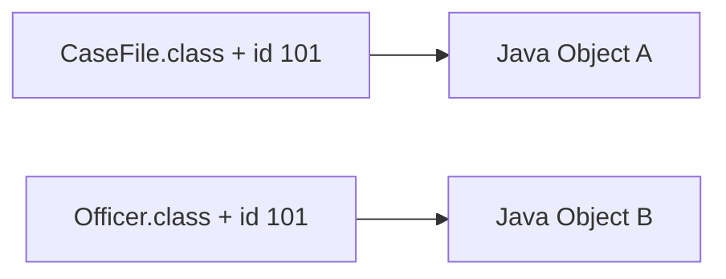
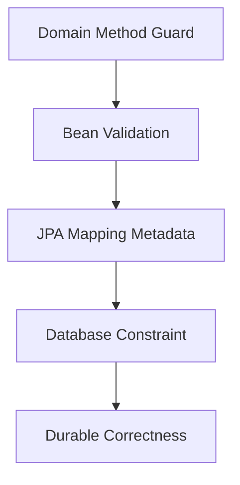

# Part 004 — Entity Mapping Foundation

Entity mapping adalah proses menjelaskan bagaimana class Java direpresentasikan sebagai struktur relational. Pada level pemula, mapping sering terlihat seperti menaruh `@Entity`, `@Id`, `@Column`, lalu selesai. Pada level engineering yang lebih serius, mapping adalah kontrak antara tiga model:

1. **Java object model** — class, field, method, encapsulation, identity;
2. **relational model** — table, column, primary key, foreign key, constraint, index;
3. **persistence runtime model** — lifecycle, dirty checking, proxy, reflection, bytecode enhancement, flush ordering.

Mapping yang buruk bukan hanya membuat kode “kurang rapi”. Mapping yang buruk bisa menyebabkan:

- update tidak terdeteksi;
- lazy loading gagal;
- `equals()`/`hashCode()` rusak;
- duplicate row;
- data corruption;
- schema migration sulit;
- query lambat;
- constraint tidak konsisten;
- entity tidak bisa diproxy;
- test lolos tetapi produksi gagal.

Part ini membahas fondasi entity mapping tanpa masuk association detail. Association akan dibahas di Part 006. Di sini kita fokus pada “bagaimana satu entity menjadi representasi satu konsep persistent yang valid”.

---

## 1. Kaufman Deconstruction: Skill Entity Mapping

Untuk menguasai mapping, jangan mulai dari daftar annotation. Mulai dari keputusan desain.

| Sub-skill | Pertanyaan | Keputusan Engineering |
|---|---|---|
| Entity qualification | Class ini benar-benar entity atau value object? | `@Entity` vs `@Embeddable` vs plain object |
| Identity design | Apa identitas stabilnya? | Surrogate key, natural key, generated id |
| Table contract | Table ini milik aggregate apa? | table name, schema, constraint |
| Column semantics | Field ini nullable, unique, bounded, immutable? | `@Column`, DB constraint, validation |
| Access strategy | Provider membaca field atau getter? | field access vs property access |
| Constructor model | Bagaimana JPA membuat instance? | protected no-arg constructor, factory method |
| Mutability policy | Field mana yang boleh berubah? | setter minim, domain method, immutable field |
| Type mapping | Java type ini dipetakan ke SQL type apa? | enum, temporal, UUID, decimal, string length |
| Correctness boundary | Constraint hidup di Java atau DB? | Bean Validation + database constraints |

Target skill:

> Kamu bisa melihat sebuah entity class dan menilai apakah mapping-nya stabil untuk produksi, aman terhadap perubahan schema, dan tidak menyembunyikan bug lifecycle.

---

## 2. Apa Itu Entity?

Entity adalah object yang memiliki identity persistent dan lifecycle yang dikelola persistence context.

Contoh domain:

```java
@Entity
@Table(name = "case_file")
public class CaseFile {

    @Id
    @GeneratedValue(strategy = GenerationType.IDENTITY)
    private Long id;

    @Column(name = "case_number", nullable = false, unique = true, length = 64)
    private String caseNumber;

    @Enumerated(EnumType.STRING)
    @Column(name = "status", nullable = false, length = 32)
    private CaseStatus status;

    protected CaseFile() {
        // Required by JPA
    }

    private CaseFile(String caseNumber) {
        this.caseNumber = caseNumber;
        this.status = CaseStatus.OPEN;
    }

    public static CaseFile open(String caseNumber) {
        return new CaseFile(caseNumber);
    }

    public void close() {
        if (this.status == CaseStatus.CLOSED) {
            throw new IllegalStateException("Case already closed");
        }
        this.status = CaseStatus.CLOSED;
    }

    public Long id() {
        return id;
    }

    public String caseNumber() {
        return caseNumber;
    }

    public CaseStatus status() {
        return status;
    }
}
```

Ciri entity:

- punya identity yang membedakan satu instance dari instance lain;
- identity tetap bermakna walau attribute berubah;
- lifecycle-nya bisa panjang;
- biasanya disimpan sebagai row table;
- bisa direferensikan entity lain;
- perubahan state-nya penting secara bisnis.

Bandingkan dengan value object:

```java
@Embeddable
public class Money {
    private BigDecimal amount;
    private String currency;
}
```

`Money` tidak memiliki identity sendiri. Dua `Money(100, "IDR")` biasanya dianggap sama secara value. `CaseFile` tidak begitu: dua case dengan field mirip tetap case berbeda.

---

## 3. Entity Bukan DTO, Bukan Table Struct, Bukan API Contract

Kesalahan umum: membuat entity sebagai class serba guna.

```java
@Entity
public class CaseFile {
    public Long id;
    public String caseNumber;
    public String status;
    public String officerName;
    public String uiDisplayLabel;
    public Boolean selectedInScreen;
}
```

Masalah:

- field UI masuk persistence model;
- tidak ada invariant;
- status bebas string;
- public mutable field;
- tidak jelas mana data persisted dan transient;
- entity bisa berubah dari mana saja;
- API response tergantung struktur database.

Entity yang baik adalah domain persistence model, bukan JSON shape.

Pisahkan:

```java
@Entity
@Table(name = "case_file")
public class CaseFile {
    // persistent state + domain behavior
}

public record CaseFileResponse(
    Long id,
    String caseNumber,
    String status,
    String displayLabel
) {}

public record CreateCaseRequest(
    String caseNumber,
    Long subjectId
) {}
```

Rule:

> Entity boleh dipakai untuk memodelkan persistent domain state. Jangan jadikan entity sebagai request body, response body, form model, cache DTO, message contract, dan database row struct sekaligus.

---

## 4. Minimal Valid Entity Class

Entity JPA memiliki aturan dasar.

Contoh minimal:

```java
@Entity
public class Officer {

    @Id
    private Long id;

    protected Officer() {
    }
}
```

Namun minimal valid belum tentu production-ready.

Production baseline:

```java
@Entity
@Table(name = "officer")
public class Officer {

    @Id
    @GeneratedValue(strategy = GenerationType.IDENTITY)
    @Column(name = "id", nullable = false, updatable = false)
    private Long id;

    @Column(name = "employee_number", nullable = false, unique = true, length = 32, updatable = false)
    private String employeeNumber;

    @Column(name = "display_name", nullable = false, length = 120)
    private String displayName;

    protected Officer() {
    }

    private Officer(String employeeNumber, String displayName) {
        this.employeeNumber = requireText(employeeNumber, "employeeNumber");
        this.displayName = requireText(displayName, "displayName");
    }

    public static Officer register(String employeeNumber, String displayName) {
        return new Officer(employeeNumber, displayName);
    }

    public Long id() {
        return id;
    }

    public String employeeNumber() {
        return employeeNumber;
    }

    public String displayName() {
        return displayName;
    }

    public void rename(String displayName) {
        this.displayName = requireText(displayName, "displayName");
    }

    private static String requireText(String value, String field) {
        if (value == null || value.isBlank()) {
            throw new IllegalArgumentException(field + " must not be blank");
        }
        return value;
    }
}
```

Perhatikan:

- constructor no-arg `protected`, bukan public API domain;
- factory method untuk membuat object valid;
- setter tidak dibuka bebas;
- field immutable secara bisnis diberi `updatable = false`;
- constraint ada di Java dan database mapping;
- nama table dan column eksplisit.

---

## 5. `@Entity`: Menandai Persistent Identity

`@Entity` memberitahu provider bahwa class ini dikelola sebagai entity.

```java
@Entity
public class CaseFile {
    // ...
}
```

Secara default, nama entity adalah nama class. Nama entity dipakai dalam JPQL.

```java
@Entity(name = "CaseFileEntity")
@Table(name = "case_file")
public class CaseFile {
}
```

JPQL:

```java
select c from CaseFileEntity c where c.status = :status
```

Perbedaan penting:

| Annotation | Mengatur | Dipakai Untuk |
|---|---|---|
| `@Entity(name = "...")` | Entity name | JPQL/entity model |
| `@Table(name = "...")` | Table name | Database table |

Rekomendasi:

- biasanya biarkan entity name sama dengan class;
- selalu eksplisitkan table name untuk produksi;
- jangan rename entity name tanpa alasan karena query JPQL bisa terdampak.

---

## 6. `@Table`: Kontrak dengan Database

`@Table` menentukan table database.

```java
@Entity
@Table(
    name = "case_file",
    uniqueConstraints = {
        @UniqueConstraint(
            name = "uk_case_file_case_number",
            columnNames = "case_number"
        )
    },
    indexes = {
        @Index(
            name = "idx_case_file_status",
            columnList = "status"
        )
    }
)
public class CaseFile {
    // ...
}
```

Catatan penting:

- definisi index/unique di annotation berguna untuk dokumentasi mapping dan schema generation;
- untuk production, schema tetap harus dikelola dengan migration tool seperti Flyway/Liquibase;
- nama constraint/index sebaiknya eksplisit agar error database mudah dilacak;
- jangan mengandalkan auto-generated constraint name di production.

Table mapping yang baik menjawab:

- table ini menyimpan entity apa?
- apakah nama table stabil?
- constraint unik apa yang merepresentasikan invariant bisnis?
- index apa yang mendukung query utama?
- apakah schema/namespace diperlukan?
- apakah table ini append-only, mutable, soft-delete, atau temporal?

---

## 7. Primary Key dan `@Id`

Setiap entity harus punya primary key.

```java
@Id
@GeneratedValue(strategy = GenerationType.IDENTITY)
@Column(name = "id", nullable = false, updatable = false)
private Long id;
```

Primary key punya dua peran:

1. database identity;
2. persistence context identity.

Dalam persistence context, key entity biasanya berupa kombinasi entity type + primary key.



Walau id sama-sama `101`, tipe entity berbeda, maka identity berbeda.

### 7.1 Surrogate Key

Surrogate key adalah key teknis seperti `BIGSERIAL`, `IDENTITY`, UUID.

Kelebihan:

- stabil walau business attribute berubah;
- sederhana untuk foreign key;
- tidak membawa makna bisnis yang bisa berubah;
- umum dipakai di aplikasi enterprise.

Kekurangan:

- tidak mencegah duplicate business data tanpa unique constraint tambahan;
- id baru mungkin belum tersedia sebelum insert tergantung strategy;
- debugging data kadang butuh natural key tambahan.

Contoh:

```java
@Id
@GeneratedValue(strategy = GenerationType.IDENTITY)
private Long id;

@Column(name = "case_number", nullable = false, unique = true, updatable = false)
private String caseNumber;
```

`id` adalah primary key. `caseNumber` adalah business key yang diberi unique constraint.

### 7.2 Natural Key

Natural key berasal dari domain, misalnya `employeeNumber`, `countryCode`, atau `caseNumber`.

```java
@Id
@Column(name = "employee_number", length = 32)
private String employeeNumber;
```

Boleh dipakai jika benar-benar:

- immutable;
- compact;
- selalu tersedia saat create;
- tidak berubah karena kebijakan organisasi;
- tidak mengandung informasi sensitif;
- cocok menjadi foreign key.

Banyak “natural key” ternyata berubah di dunia nyata. Nomor pegawai bisa berubah saat merger. Nomor registrasi bisa dikoreksi. Kode wilayah bisa dimekarkan. Karena itu surrogate key + unique business key sering lebih aman.

---

## 8. Generated Value Strategy

JPA menyediakan beberapa strategy:

```java
@GeneratedValue(strategy = GenerationType.AUTO)
@GeneratedValue(strategy = GenerationType.IDENTITY)
@GeneratedValue(strategy = GenerationType.SEQUENCE)
@GeneratedValue(strategy = GenerationType.TABLE)
@GeneratedValue(strategy = GenerationType.UUID)
```

### 8.1 `IDENTITY`

Database menghasilkan id saat insert.

```java
@Id
@GeneratedValue(strategy = GenerationType.IDENTITY)
private Long id;
```

Implikasi:

- insert mungkin harus terjadi lebih awal untuk mendapatkan id;
- batching insert bisa lebih terbatas pada beberapa database/provider;
- sederhana untuk MySQL/PostgreSQL identity style.

### 8.2 `SEQUENCE`

Provider mengambil id dari database sequence.

```java
@Id
@GeneratedValue(strategy = GenerationType.SEQUENCE, generator = "case_file_seq")
@SequenceGenerator(
    name = "case_file_seq",
    sequenceName = "case_file_seq",
    allocationSize = 50
)
private Long id;
```

Implikasi:

- cocok untuk batching;
- allocation size mempengaruhi performa dan gap id;
- sangat umum untuk PostgreSQL/Oracle.

### 8.3 `UUID`

JPA modern mendukung UUID generation.

```java
@Id
@GeneratedValue(strategy = GenerationType.UUID)
@Column(name = "id", nullable = false, updatable = false)
private UUID id;
```

Kelebihan:

- id bisa dibuat tanpa round-trip database;
- cocok untuk distributed systems;
- tidak mudah ditebak.

Trade-off:

- index lebih besar daripada numeric id;
- random UUID bisa mengganggu locality index;
- urutan data tidak natural;
- perlu strategy khusus bila butuh time-ordered UUID/ULID, biasanya provider-specific atau application-generated.

Rule praktis:

| Situation | Strategy Umum |
|---|---|
| PostgreSQL/Oracle enterprise write-heavy | `SEQUENCE` dengan allocation size tuned |
| MySQL sederhana | `IDENTITY` |
| Distributed id generation | `UUID` atau application-generated id |
| Domain key benar-benar immutable | Natural id dengan hati-hati |

---

## 9. Field Access vs Property Access

JPA bisa membaca state lewat field langsung atau getter/setter. Access type ditentukan oleh lokasi annotation mapping pertama, terutama `@Id`.

### 9.1 Field Access

```java
@Entity
public class CaseFile {

    @Id
    private Long id;

    @Column(name = "case_number")
    private String caseNumber;

    public String caseNumber() {
        return caseNumber;
    }
}
```

Provider mengakses field langsung. Getter tidak wajib mengikuti JavaBean style.

Kelebihan:

- cocok untuk domain model yang encapsulated;
- tidak butuh setter public;
- getter bisa berisi derived logic tanpa mengganggu persistence;
- lebih jelas untuk DDD-style entity.

### 9.2 Property Access

```java
@Entity
public class CaseFile {

    private Long id;
    private String caseNumber;

    @Id
    public Long getId() {
        return id;
    }

    @Column(name = "case_number")
    public String getCaseNumber() {
        return caseNumber;
    }

    protected void setId(Long id) {
        this.id = id;
    }

    protected void setCaseNumber(String caseNumber) {
        this.caseNumber = caseNumber;
    }
}
```

Provider memakai getter/setter.

Risiko:

- setter bisa membuka mutability terlalu luas;
- getter yang punya side effect bisa mengacaukan persistence;
- JavaBean naming harus konsisten;
- logic di getter bisa dieksekusi saat provider membaca state.

Rekomendasi untuk domain model modern:

> Gunakan field access secara konsisten, kecuali ada alasan kuat untuk property access.

Jangan campur tanpa sadar:

```java
@Entity
public class BrokenEntity {

    @Id
    private Long id; // field access dipilih

    private String name;

    @Column(name = "display_name")
    public String getName() { // annotation ini bisa diabaikan/menimbulkan confusion
        return name;
    }
}
```

Jika perlu override access pada attribute tertentu, lakukan secara eksplisit dan dokumentasikan.

---

## 10. Constructor Design

JPA butuh no-arg constructor dengan visibility minimal `protected` atau `public`, tergantung aturan provider/spec.

```java
protected CaseFile() {
    // for JPA only
}
```

Jangan jadikan constructor kosong sebagai public domain API:

```java
public CaseFile() { // buruk untuk domain model
}
```

Karena caller bisa membuat object tidak valid:

```java
CaseFile c = new CaseFile();
// caseNumber null, status null, invariant rusak
```

Gunakan factory method:

```java
public static CaseFile open(String caseNumber) {
    return new CaseFile(caseNumber, CaseStatus.OPEN);
}

private CaseFile(String caseNumber, CaseStatus status) {
    this.caseNumber = requireText(caseNumber, "caseNumber");
    this.status = Objects.requireNonNull(status);
}
```

Pattern ini memberi dua jalur:

- JPA constructor untuk materialization dari database;
- domain factory untuk membuat object baru yang valid.

---

## 11. Column Mapping dengan `@Column`

`@Column` menjelaskan mapping field ke column.

```java
@Column(
    name = "case_number",
    nullable = false,
    unique = true,
    length = 64,
    updatable = false
)
private String caseNumber;
```

Attribute penting:

| Attribute | Makna | Catatan |
|---|---|---|
| `name` | Nama column | Buat eksplisit untuk production |
| `nullable` | Apakah column boleh null | Harus selaras dengan DB constraint |
| `unique` | Unique constraint sederhana | Untuk constraint kompleks, pakai `@Table(uniqueConstraints=...)` |
| `length` | Panjang string | Pastikan sesuai domain dan DB |
| `precision` | Total digit numeric | Penting untuk `BigDecimal` |
| `scale` | Digit desimal | Penting untuk money/rate |
| `insertable` | Ikut INSERT? | Berguna untuk generated/default column |
| `updatable` | Ikut UPDATE? | Berguna untuk immutable field |
| `columnDefinition` | SQL fragment vendor-specific | Gunakan hemat karena mengurangi portability |

Contoh numeric:

```java
@Column(name = "risk_score", nullable = false, precision = 5, scale = 2)
private BigDecimal riskScore;
```

Contoh immutable field:

```java
@Column(name = "created_by", nullable = false, updatable = false, length = 64)
private String createdBy;
```

---

## 12. Nullability: Java, Bean Validation, dan Database

Nullability punya beberapa layer.

```java
@NotBlank
@Column(name = "case_number", nullable = false, length = 64)
private String caseNumber;
```

| Layer | Contoh | Fungsi |
|---|---|---|
| Java/domain guard | `requireText()` | Mencegah object invalid dibuat |
| Bean Validation | `@NotBlank` | Validasi declarative sebelum persist/update jika integration aktif |
| JPA mapping | `nullable = false` | Metadata ORM/schema generation |
| Database constraint | `NOT NULL` | Sumber kebenaran durability |

Rule produksi:

> Jangan hanya mengandalkan Bean Validation. Constraint penting harus ada di database.

Kenapa?

- data bisa masuk dari migration script;
- data bisa diubah tool admin;
- ada service lain;
- provider validation bisa dikonfigurasi mati;
- bug aplikasi bisa melewati guard;
- database adalah boundary terakhir.

---

## 13. String Length dan Domain Boundedness

Default length string JPA sering tidak cukup menggambarkan domain. Jangan biarkan semua `String` menjadi `varchar(255)` tanpa berpikir.

Buruk:

```java
@Column(name = "description")
private String description;
```

Lebih baik:

```java
@Column(name = "case_number", nullable = false, length = 64)
private String caseNumber;

@Column(name = "summary", nullable = false, length = 500)
private String summary;

@Lob
@Column(name = "description")
private String description;
```

Tanyakan:

- apakah field ini identifier, label, summary, atau body text?
- apakah panjangnya punya aturan regulatoris?
- apakah perlu full-text search?
- apakah perlu index? Jika ya, panjang besar bisa berdampak;
- apakah input user perlu normalisasi whitespace/case?

---

## 14. Enum Mapping

Jangan gunakan ordinal enum untuk data production yang tahan lama.

Buruk:

```java
@Enumerated(EnumType.ORDINAL)
private CaseStatus status;
```

Jika enum berubah urutan, data lama bisa berubah makna.

Lebih aman:

```java
@Enumerated(EnumType.STRING)
@Column(name = "status", nullable = false, length = 32)
private CaseStatus status;
```

Enum:

```java
public enum CaseStatus {
    OPEN,
    UNDER_REVIEW,
    ESCALATED,
    CLOSED
}
```

Trade-off `EnumType.STRING`:

- lebih readable;
- lebih aman terhadap reorder;
- rename enum constant tetap breaking change;
- perlu migration jika mengganti nama constant;
- panjang column harus cukup.

Untuk domain yang status-nya regulated, kadang lebih baik memakai explicit code:

```java
public enum CaseStatus {
    OPEN("OPEN"),
    UNDER_REVIEW("UNDER_REVIEW"),
    ESCALATED("ESCALATED"),
    CLOSED("CLOSED");

    private final String code;

    CaseStatus(String code) {
        this.code = code;
    }

    public String code() {
        return code;
    }
}
```

Lalu gunakan `AttributeConverter` di part berikutnya untuk mapping code yang stabil.

---

## 15. Temporal Field: `java.time` sebagai Default Modern

Untuk Java modern, gunakan `java.time`.

Contoh:

```java
@Column(name = "created_at", nullable = false, updatable = false)
private Instant createdAt;

@Column(name = "due_date")
private LocalDate dueDate;

@Column(name = "local_review_time")
private LocalDateTime localReviewTime;
```

Pilih type berdasarkan semantics:

| Java Type | Cocok Untuk | Contoh |
|---|---|---|
| `Instant` | Titik waktu global | created_at, submitted_at |
| `LocalDate` | Tanggal tanpa jam/timezone | birth_date, due_date |
| `LocalDateTime` | Waktu lokal tanpa zona | jadwal lokal, tapi hati-hati |
| `OffsetDateTime` | Waktu dengan offset | event timestamp dengan offset asal |
| `Duration` | Durasi | SLA duration |
| `Period` | Periode kalender | masa berlaku bulan/tahun |

Rule:

- audit timestamp umumnya gunakan `Instant`;
- hindari `java.util.Date`/`Calendar` untuk model baru;
- definisikan timezone policy aplikasi;
- jangan simpan waktu lokal jika business meaning sebenarnya global event time;
- pastikan database column type sesuai.

---

## 16. Boolean Field dan Naming

Boolean terlihat sederhana, tapi sering menyebabkan mapping ambiguity.

```java
@Column(name = "deleted", nullable = false)
private boolean deleted;
```

Lebih jelas untuk domain:

```java
@Column(name = "active", nullable = false)
private boolean active;

public boolean isActive() {
    return active;
}
```

Hati-hati dengan field nullable:

```java
private Boolean approved;
```

`Boolean` tiga state: `true`, `false`, `null`. Jangan pakai jika domain hanya dua state.

Jika butuh tri-state, beri nama eksplisit:

```java
@Column(name = "review_decision", length = 16)
@Enumerated(EnumType.STRING)
private ReviewDecision reviewDecision; // APPROVED, REJECTED, PENDING
```

Enum sering lebih jelas daripada nullable Boolean.

---

## 17. `@Transient` vs Java `transient`

JPA `@Transient` berarti field tidak dipersist.

```java
@Transient
private String displayLabel;
```

Java keyword `transient` berkaitan dengan Java serialization.

```java
private transient String cachedComputation;
```

Untuk JPA, gunakan annotation `@Transient` agar maksudnya jelas.

Namun tanyakan dulu:

- kenapa field non-persistent ada di entity?
- apakah itu derived value?
- apakah sebaiknya method saja?
- apakah field ini akan menyebabkan stale cache?

Lebih baik:

```java
public String displayLabel() {
    return caseNumber + " - " + status;
}
```

Daripada menyimpan `displayLabel` mutable di entity.

---

## 18. Basic Type Mapping

JPA mendukung banyak basic type: primitive/wrapper, `String`, numeric, enum, temporal, UUID, byte array, dan sebagainya.

Contoh field umum:

```java
@Column(name = "retry_count", nullable = false)
private int retryCount;

@Column(name = "amount", nullable = false, precision = 19, scale = 4)
private BigDecimal amount;

@Column(name = "external_reference", length = 128)
private String externalReference;

@Column(name = "correlation_id", nullable = false)
private UUID correlationId;
```

Prinsip:

- gunakan `BigDecimal` untuk money, bukan `double`;
- gunakan primitive untuk field non-null yang punya default jelas;
- gunakan wrapper untuk nullable value yang valid secara domain;
- gunakan `UUID` jika id/reference benar-benar UUID;
- jangan simpan JSON/string besar tanpa alasan query/indexing yang jelas;
- pisahkan field teknis dan field domain.

---

## 19. Encapsulation: Setter Bukan Kewajiban JPA

Dengan field access, JPA tidak membutuhkan public setter.

Buruk:

```java
public void setStatus(CaseStatus status) {
    this.status = status;
}
```

Lebih baik:

```java
public void escalate(OfficerId officerId) {
    if (this.status == CaseStatus.CLOSED) {
        throw new IllegalStateException("Closed case cannot be escalated");
    }
    this.status = CaseStatus.ESCALATED;
    this.assignedOfficerId = officerId.value();
}
```

Setter mentah melewati invariant. Domain method memberi nama aksi dan validasi transisi.

Rule:

> Entity method harus menyatakan business transition, bukan sekadar membuka field mutation.

Pengecualian:

- entity murni CRUD admin sederhana;
- generated scaffolding;
- internal infrastructure;
- legacy code.

Tetapi untuk sistem enforcement/case management, state transition hampir selalu punya invariant.

---

## 20. Field Final, Class Final, dan Proxy

JPA provider sering membutuhkan kemampuan membuat proxy atau mengisi field via reflection/bytecode enhancement. Karena itu entity yang terlalu immutable ala pure Java bisa bermasalah.

Hindari:

```java
@Entity
public final class CaseFile { // buruk untuk proxy
    @Id
    private final Long id;    // bermasalah untuk materialization
}
```

Lebih aman:

```java
@Entity
public class CaseFile {
    @Id
    private Long id;

    protected CaseFile() {
    }
}
```

Prinsip:

- jangan jadikan entity class `final`;
- jangan jadikan persistent field `final` untuk entity biasa;
- gunakan constructor/factory/domain method untuk menjaga immutability secara perilaku;
- value object/embeddable bisa lebih immutable, tergantung dukungan provider/JPA versi;
- record lebih cocok sebagai embeddable/projection, bukan entity.

---

## 21. Records dan Entity

Java record sangat menarik untuk immutable data carrier, tetapi bukan bentuk ideal untuk entity JPA karena entity membutuhkan identity, lifecycle, proxying, dan materialization khusus.

Gunakan record untuk:

- DTO;
- projection;
- command/query object;
- embeddable jika provider/spec mendukung use case;
- API response;
- value object sederhana.

Contoh projection:

```java
public record CaseSummary(
    Long id,
    String caseNumber,
    CaseStatus status
) {}
```

JPQL constructor expression:

```java
select new com.acme.casefile.CaseSummary(c.id, c.caseNumber, c.status)
from CaseFile c
where c.status = :status
```

Jangan memaksakan record sebagai entity hanya demi immutability. Entity punya model lifecycle yang berbeda dari record.

---

## 22. Naming Strategy: Explicit vs Convention

Hibernate/Spring bisa memakai physical naming strategy untuk mengubah `caseNumber` menjadi `case_number`. Ini membantu, tetapi jangan terlalu bergantung untuk domain penting.

```java
@Column(name = "case_number", nullable = false)
private String caseNumber;
```

Kelebihan explicit naming:

- migration lebih jelas;
- query native lebih mudah;
- perubahan naming strategy tidak merusak schema;
- code review mapping lebih langsung;
- constraint/index naming bisa distandarkan.

Convention tetap berguna, tetapi production schema membutuhkan stabilitas jangka panjang.

---

## 23. Mapping Constraint vs Business Invariant

Contoh:

```java
@Column(name = "risk_score", nullable = false, precision = 5, scale = 2)
private BigDecimal riskScore;
```

Ini belum menjamin `riskScore` berada antara 0 dan 100.

Tambahkan domain guard:

```java
public void updateRiskScore(BigDecimal riskScore) {
    if (riskScore == null) {
        throw new IllegalArgumentException("riskScore is required");
    }
    if (riskScore.compareTo(BigDecimal.ZERO) < 0 ||
        riskScore.compareTo(new BigDecimal("100.00")) > 0) {
        throw new IllegalArgumentException("riskScore must be between 0 and 100");
    }
    this.riskScore = riskScore;
}
```

Tambahkan Bean Validation:

```java
@DecimalMin("0.00")
@DecimalMax("100.00")
@Column(name = "risk_score", nullable = false, precision = 5, scale = 2)
private BigDecimal riskScore;
```

Tambahkan DB check constraint melalui migration:

```sql
alter table case_file
add constraint chk_case_file_risk_score_range
check (risk_score >= 0 and risk_score <= 100);
```

Layering benar:



Tidak semua invariant bisa atau harus diduplikasi di semua layer. Tetapi invariant kritikal harus mencapai database.

---

## 24. Entity Lifecycle Fields

Banyak entity butuh metadata:

```java
@Column(name = "created_at", nullable = false, updatable = false)
private Instant createdAt;

@Column(name = "created_by", nullable = false, updatable = false, length = 64)
private String createdBy;

@Column(name = "updated_at", nullable = false)
private Instant updatedAt;

@Column(name = "updated_by", nullable = false, length = 64)
private String updatedBy;
```

Jangan asal menaruh audit field tanpa policy:

- siapa yang mengisi?
- application service?
- entity listener?
- database trigger?
- Spring Data auditing?
- apakah timestamp memakai application clock atau database clock?
- bagaimana test mengontrol clock?
- bagaimana timezone disimpan?

Untuk part ini, cukup pahami bahwa audit field adalah mapping biasa tetapi punya lifecycle semantics. Detail auditing akan dibahas di part khusus.

---

## 25. Example: Production-Grade Single Entity Mapping

```java
@Entity
@Table(
    name = "case_file",
    uniqueConstraints = {
        @UniqueConstraint(
            name = "uk_case_file_case_number",
            columnNames = "case_number"
        )
    },
    indexes = {
        @Index(name = "idx_case_file_status", columnList = "status"),
        @Index(name = "idx_case_file_subject_id", columnList = "subject_id")
    }
)
public class CaseFile {

    @Id
    @GeneratedValue(strategy = GenerationType.SEQUENCE, generator = "case_file_id_seq")
    @SequenceGenerator(
        name = "case_file_id_seq",
        sequenceName = "case_file_id_seq",
        allocationSize = 50
    )
    @Column(name = "id", nullable = false, updatable = false)
    private Long id;

    @Column(name = "case_number", nullable = false, updatable = false, length = 64)
    private String caseNumber;

    @Column(name = "subject_id", nullable = false, updatable = false)
    private Long subjectId;

    @Enumerated(EnumType.STRING)
    @Column(name = "status", nullable = false, length = 32)
    private CaseStatus status;

    @Column(name = "risk_score", nullable = false, precision = 5, scale = 2)
    private BigDecimal riskScore;

    @Column(name = "created_at", nullable = false, updatable = false)
    private Instant createdAt;

    @Column(name = "updated_at", nullable = false)
    private Instant updatedAt;

    protected CaseFile() {
        // Required by JPA
    }

    private CaseFile(String caseNumber, Long subjectId, Clock clock) {
        this.caseNumber = requireText(caseNumber, "caseNumber");
        this.subjectId = Objects.requireNonNull(subjectId, "subjectId");
        this.status = CaseStatus.OPEN;
        this.riskScore = BigDecimal.ZERO;
        this.createdAt = Instant.now(clock);
        this.updatedAt = this.createdAt;
    }

    public static CaseFile open(String caseNumber, Long subjectId, Clock clock) {
        return new CaseFile(caseNumber, subjectId, clock);
    }

    public void updateRiskScore(BigDecimal riskScore, Clock clock) {
        requireOpen();
        requireRiskScore(riskScore);
        this.riskScore = riskScore;
        this.updatedAt = Instant.now(clock);
    }

    public void escalate(Clock clock) {
        requireOpen();
        this.status = CaseStatus.ESCALATED;
        this.updatedAt = Instant.now(clock);
    }

    public void close(Clock clock) {
        if (this.status == CaseStatus.CLOSED) {
            return;
        }
        this.status = CaseStatus.CLOSED;
        this.updatedAt = Instant.now(clock);
    }

    private void requireOpen() {
        if (this.status == CaseStatus.CLOSED) {
            throw new IllegalStateException("Closed case cannot be modified");
        }
    }

    private static void requireRiskScore(BigDecimal value) {
        Objects.requireNonNull(value, "riskScore");
        if (value.compareTo(BigDecimal.ZERO) < 0 ||
            value.compareTo(new BigDecimal("100.00")) > 0) {
            throw new IllegalArgumentException("riskScore must be between 0 and 100");
        }
    }

    private static String requireText(String value, String field) {
        if (value == null || value.isBlank()) {
            throw new IllegalArgumentException(field + " must not be blank");
        }
        return value;
    }

    public Long id() {
        return id;
    }

    public String caseNumber() {
        return caseNumber;
    }

    public Long subjectId() {
        return subjectId;
    }

    public CaseStatus status() {
        return status;
    }

    public BigDecimal riskScore() {
        return riskScore;
    }
}
```

Kenapa mapping ini lebih sehat?

- table dan constraint eksplisit;
- generated id memakai sequence yang batch-friendly;
- business key `caseNumber` immutable dan unique;
- status memakai enum string;
- risk score memakai `BigDecimal` dengan precision/scale;
- field audit punya mutability jelas;
- tidak ada public setter mentah;
- lifecycle transition diberi method domain;
- constructor JPA tidak menjadi API publik;
- `Clock` diinjeksi dari luar untuk testability.

---

## 26. `equals()` dan `hashCode()` Preview

Topik ini akan dibahas lebih dalam di part identity/lifecycle. Namun sejak mapping dasar, kita harus tahu bahayanya.

Jangan membuat `equals()` berdasarkan semua field mutable:

```java
// buruk
@Override
public boolean equals(Object o) {
    if (!(o instanceof CaseFile other)) return false;
    return Objects.equals(caseNumber, other.caseNumber)
        && Objects.equals(status, other.status)
        && Objects.equals(riskScore, other.riskScore);
}
```

Masalah:

- jika status berubah, hash berubah;
- entity dalam `HashSet` bisa hilang;
- transient entity belum punya id;
- proxy class bisa mengganggu comparison;
- business key bisa berubah jika tidak immutable.

Rule sementara:

- jangan generate `equals()`/`hashCode()` otomatis dari IDE untuk entity;
- pahami identity strategy dulu;
- hindari menyimpan entity mutable dalam hash-based collection sebelum identity jelas;
- gunakan business key immutable jika benar-benar stabil;
- atau gunakan pattern id-based dengan hati-hati.

Detail penuh di Part 005.

---

## 27. Mapping Smells

### Smell 1 — Semua Field Nullable

```java
@Column(name = "case_number")
private String caseNumber;
```

Jika domain mewajibkan `caseNumber`, mapping ini terlalu lemah.

### Smell 2 — Enum Ordinal

```java
@Enumerated(EnumType.ORDINAL)
private CaseStatus status;
```

Berbahaya untuk data jangka panjang.

### Smell 3 — Public Setter untuk Semua Field

```java
public void setStatus(CaseStatus status) {
    this.status = status;
}
```

Invariant state machine hilang.

### Smell 4 — Entity Final

```java
public final class CaseFile { }
```

Bisa mengganggu proxy/lazy loading provider.

### Smell 5 — Tidak Ada Table/Column Naming Eksplisit

```java
@Entity
public class CaseFile {
    private String caseNumber;
}
```

Bisa bekerja, tetapi schema contract menjadi implicit.

### Smell 6 — Business Key Tidak Diberi Unique Constraint

```java
@Column(name = "case_number", nullable = false)
private String caseNumber;
```

Kalau business rule mengharuskan unik, database harus tahu.

### Smell 7 — DTO Field Masuk Entity

```java
private boolean selected;
private String displayColor;
```

UI state bukan persistent domain state.

### Smell 8 — `columnDefinition` Berlebihan

```java
@Column(columnDefinition = "TEXT NOT NULL DEFAULT ''")
private String notes;
```

Kadang perlu, tapi membuat mapping vendor-specific dan sering bentrok dengan migration tool.

---

## 28. Migration-Aware Mapping

Mapping entity tidak boleh dipisah dari schema migration.

Jika entity berubah:

```java
@Column(name = "risk_score", nullable = false, precision = 5, scale = 2)
private BigDecimal riskScore;
```

Migration harus jelas:

```sql
alter table case_file
add column risk_score numeric(5, 2);

update case_file
set risk_score = 0.00
where risk_score is null;

alter table case_file
alter column risk_score set not null;
```

Jangan langsung deploy field non-null tanpa default/backfill ke table berisi data.

Rule:

- mapping change harus punya migration plan;
- nullable-to-not-null butuh backfill;
- enum value baru butuh compatibility check;
- rename column sebaiknya expand-migrate-contract;
- production deploy harus mempertimbangkan versi aplikasi lama dan baru berjalan bersamaan.

---

## 29. Entity Mapping Review Checklist

Gunakan checklist ini saat code review.

### Identity

- Apakah entity memang butuh identity persistent?
- Apakah `@Id` jelas?
- Apakah generated strategy cocok dengan database dan write volume?
- Apakah business key penting diberi unique constraint?
- Apakah id immutable dari sisi aplikasi?

### Table

- Apakah `@Table(name=...)` eksplisit?
- Apakah constraint/index bernama jelas?
- Apakah mapping selaras dengan migration?
- Apakah table merepresentasikan satu konsep domain yang jelas?

### Column

- Apakah nullable sesuai domain?
- Apakah length/precision/scale eksplisit?
- Apakah enum memakai `STRING` atau converter stabil?
- Apakah field immutable diberi `updatable = false`?
- Apakah field generated/default diberi `insertable/updatable` yang sesuai?

### Java Model

- Apakah no-arg constructor tidak menjadi public API?
- Apakah setter mentah dihindari?
- Apakah domain method menjaga invariant?
- Apakah entity tidak final?
- Apakah persistent field tidak final?
- Apakah access type konsisten?

### Boundary

- Apakah entity tidak dipakai sebagai DTO/API contract?
- Apakah transient/derived field masuk akal?
- Apakah audit field punya policy?
- Apakah mapping vendor-specific diisolasi?

---

## 30. Latihan 20 Jam — Part 004

### Latihan 1 — Audit Entity Legacy

Ambil satu entity lama. Buat table berikut:

| Field | Nullable? | Length? | Constraint? | Domain Method? | DB Migration Valid? |
|---|---|---|---|---|---|
| id | ... | ... | ... | ... | ... |
| status | ... | ... | ... | ... | ... |

Cari minimal 5 smell.

### Latihan 2 — Ubah DTO Entity Menjadi Domain Entity

Dari class ini:

```java
@Entity
public class Ticket {
    @Id
    public Long id;
    public String status;
    public String title;
    public Boolean approved;
}
```

Refactor menjadi:

- field private;
- enum status;
- constructor protected;
- factory method;
- domain method;
- column mapping eksplisit;
- constraint yang sesuai.

### Latihan 3 — Buat Migration untuk Mapping Baru

Untuk entity `CaseFile`, tulis migration SQL:

- create sequence;
- create table;
- primary key;
- unique constraint;
- check constraint risk score;
- index status.

### Latihan 4 — Buktikan Access Type

Buat entity dengan `@Id` di field. Tambahkan annotation mapping di getter. Amati apakah provider membaca mapping itu sesuai ekspektasi. Lalu perbaiki dengan konsistensi field access.

### Latihan 5 — Enum Rename Simulation

Persist entity dengan enum `UNDER_REVIEW`. Rename enum menjadi `REVIEWING`. Jalankan test reload data lama. Catat failure dan desain migration/converter yang aman.

---

## 31. Ringkasan

Entity mapping bukan urusan annotation saja. Mapping adalah kontrak runtime antara Java object, JPA provider, dan database.

Prinsip utama:

- entity merepresentasikan persistent identity, bukan DTO;
- table/column mapping harus eksplisit untuk schema production;
- id strategy harus dipilih berdasarkan database dan workload;
- field access biasanya lebih cocok untuk domain model encapsulated;
- no-arg constructor diperlukan untuk JPA, tetapi domain creation harus lewat factory/constructor valid;
- nullability, length, precision, uniqueness, dan mutability harus disengaja;
- enum ordinal harus dihindari untuk data tahan lama;
- constraint penting harus sampai database;
- setter mentah sering merusak invariant;
- mapping change harus disertai migration plan.

Mental model penting:

> Entity class bukan bentuk Java dari table secara pasif. Entity adalah persistent domain object yang harus valid sebagai object, valid sebagai row, dan valid sebagai peserta dalam persistence context.

Part berikutnya akan memperdalam topik identity dan lifecycle: kapan entity transient, managed, detached, removed; bagaimana `persist()` berbeda dari `merge()`; dan kenapa `equals()`/`hashCode()` entity adalah salah satu sumber bug paling mahal dalam JPA.

---

## Referensi Resmi

- Jakarta Persistence 3.2 Specification: `https://jakarta.ee/specifications/persistence/3.2/jakarta-persistence-spec-3.2`
- Jakarta Persistence 3.2 API Docs: `https://jakarta.ee/specifications/persistence/3.2/apidocs/`
- Hibernate ORM User Guide: `https://docs.hibernate.org/stable/orm/userguide/html_single/`
- Hibernate ORM Documentation: `https://hibernate.org/orm/documentation/`
- Spring Data JPA Reference: `https://docs.spring.io/spring-data/jpa/reference/`
