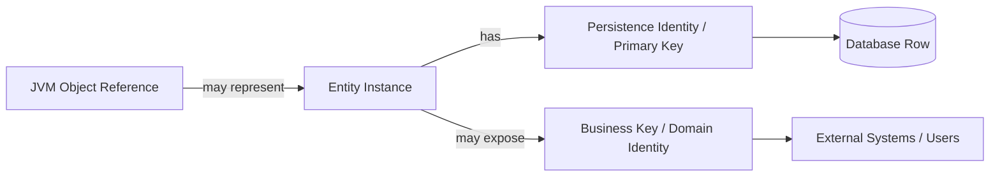
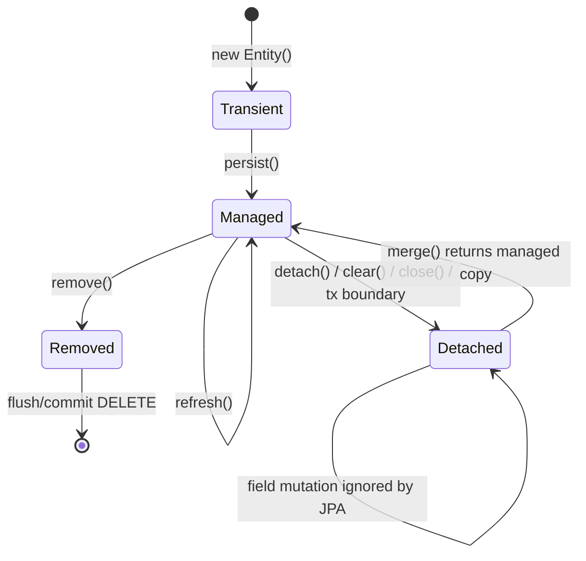
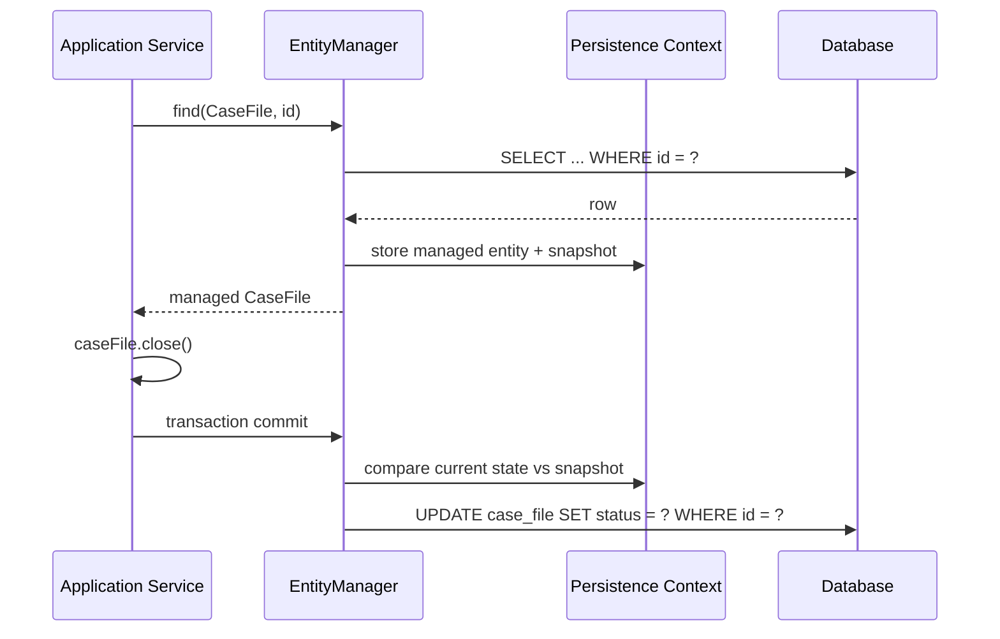
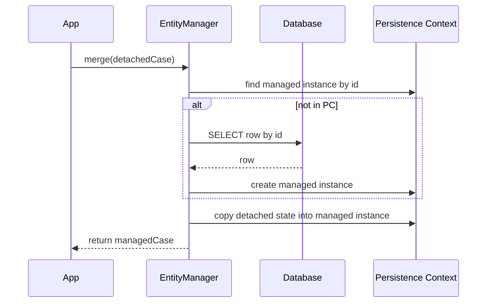
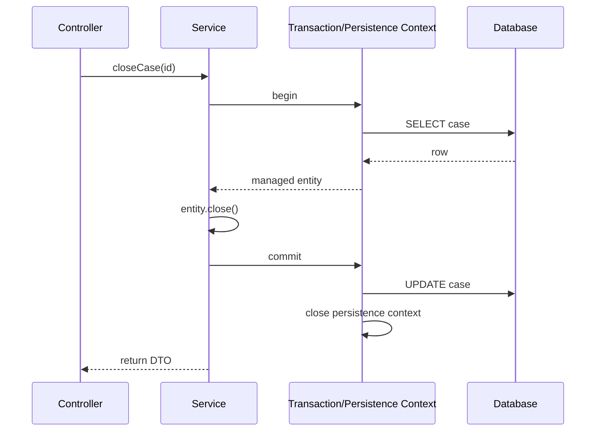

# Part 005 — Entity Identity and Lifecycle

Entity identity dan lifecycle adalah bagian JPA yang paling sering terlihat sederhana, tetapi paling sering menghasilkan bug production. Banyak engineer bisa menulis `@Entity`, `@Id`, `repository.save(entity)`, dan `@Transactional`, tetapi belum tentu bisa menjawab:

- kapan object Java menjadi managed;
- apakah `merge()` mengubah object yang sama atau membuat managed copy;
- kenapa `persist()` gagal saat diberi detached entity;
- kenapa `equals()` berbasis generated id bisa merusak `HashSet`;
- kenapa update terjadi tanpa memanggil `save()`;
- kenapa object dari request sebelumnya tidak boleh dipakai sebagai entity aktif di transaction baru;
- apa bedanya identity di memory, database, dan domain.

Part ini membahas lifecycle bukan sebagai hafalan state diagram, tetapi sebagai mental model untuk mengendalikan state, SQL emission, correctness, dan boundary aplikasi.

> Prinsip utama: JPA tidak menyimpan object karena kamu memanggil setter. JPA menyimpan perubahan pada **managed entity** yang berada di dalam **persistence context** dan kemudian di-flush ke database.

---

## 1. Kaufman Deconstruction: Skill Identity dan Lifecycle

Menurut pendekatan Josh Kaufman, skill besar harus dipecah menjadi sub-skill kecil yang bisa dilatih cepat. Untuk entity lifecycle, sub-skill-nya adalah:

| Sub-skill | Pertanyaan Praktis | Kegagalan Jika Salah |
|---|---|---|
| Identity classification | Identity object ini berasal dari JVM, DB, atau domain? | duplicate object, broken equality, cache miss |
| Lifecycle recognition | Object ini transient, managed, detached, atau removed? | update hilang, insert ganda, exception saat flush |
| Operation semantics | `persist`, `merge`, `remove`, `detach`, `refresh` melakukan apa? | salah pakai `merge`, detached entity bug |
| Transaction boundary | Managed state berlaku sampai mana? | lazy loading error, stale object, hidden write |
| Equality design | `equals()`/`hashCode()` stabil sebelum dan sesudah persist? | entity hilang dari `Set`, duplicate collection |
| Identifier timing | Kapan id tersedia? | event payload salah, batch insert lambat, id null |
| Detached reattachment | Bagaimana membawa state dari luar transaction? | overwrite data, lost update, unintended merge |
| Testing lifecycle | Bagaimana membuktikan SQL benar-benar keluar? | false confidence dari rollback test |

Target setelah part ini:

> Kamu bisa membaca alur persistence dan menentukan kapan object berubah state, kapan SQL akan dihasilkan, kapan equality aman, dan operasi mana yang benar untuk use case create, update, delete, reattach, dan read-modify-write.

---

## 2. Tiga Jenis Identity yang Harus Dipisahkan

Banyak bug JPA muncul karena semua identity dianggap sama. Dalam persistence engineering, minimal ada tiga identity:

| Identity | Contoh | Scope | Stabilitas | Digunakan Untuk |
|---|---|---|---|---|
| Java reference identity | `a == b` | JVM memory | hanya selama object hidup | pointer equality, object graph |
| Persistence identity | primary key `case_file.id` | database table | stabil setelah assigned | persistence context, foreign key |
| Domain identity | `caseNumber`, `customerNumber`, `policyNumber` | business domain | seharusnya stabil secara business | deduplication, lookup, external API |

Contoh:

```java
CaseFile a = entityManager.find(CaseFile.class, 10L);
CaseFile b = entityManager.find(CaseFile.class, 10L);

System.out.println(a == b); // true dalam persistence context yang sama
```

Di persistence context yang sama, JPA menjaga invariant:

> Untuk satu entity type dan satu primary key, hanya boleh ada satu managed instance.

Itu sebabnya persistence context sering disebut **identity map**.

Namun di transaction lain:

```java
CaseFile a = serviceA.load(10L); // transaction 1
CaseFile b = serviceB.load(10L); // transaction 2

System.out.println(a == b); // false, walaupun row sama
```

Keduanya bisa merepresentasikan row database yang sama, tetapi Java object-nya berbeda.

### 2.1 Mental Model



Aturan desain:

1. Jangan gunakan Java reference identity untuk business decision.
2. Jangan anggap generated primary key sebagai domain concept.
3. Jangan expose surrogate id ke external system jika business identity lebih tepat.
4. Jangan membuat `equals()` berubah secara drastis setelah id di-generate.

---

## 3. Entity Lifecycle State

Secara praktis, entity JPA berada dalam empat state utama:

| State | Ada di DB? | Ada di persistence context? | Perubahan auto-detected? | Contoh |
|---|---:|---:|---:|---|
| Transient / New | belum | tidak | tidak | `new CaseFile(...)` |
| Managed / Persistent | ya atau akan ya | ya | ya | hasil `find()`, object setelah `persist()` |
| Detached | biasanya ya | tidak | tidak | entity dari transaction lama |
| Removed | masih sampai flush/commit | ya, ditandai remove | delete akan di-flush | setelah `remove()` |

Diagram lifecycle:



Catatan penting:

- `persist()` mengubah object transient menjadi managed.
- `merge()` tidak membuat object detached menjadi managed secara langsung; ia menyalin state ke managed instance dan mengembalikan managed instance tersebut.
- `remove()` menandai managed entity untuk dihapus.
- `detach()` mengeluarkan entity dari persistence context.
- `clear()` mengeluarkan semua managed entities dari persistence context.
- `refresh()` menimpa state entity managed dengan state database.

---

## 4. Transient State

Entity transient adalah object Java biasa yang belum dikenal persistence context.

```java
CaseFile caseFile = CaseFile.open("CASE-2026-0001");

caseFile.close(); // hanya perubahan memory
```

Belum ada SQL. Belum ada dirty checking. Belum ada persistence identity jika id generated.

Untuk membuatnya managed:

```java
entityManager.persist(caseFile);
```

Setelah `persist()`, entity masuk persistence context. SQL `INSERT` bisa keluar saat flush atau commit, bukan selalu langsung saat `persist()`.

### 4.1 Kapan Id Tersedia?

Tergantung generation strategy dan provider behavior.

| Strategy | Kapan Id Biasanya Diketahui | Dampak Engineering |
|---|---|---|
| `IDENTITY` | setelah insert ke DB | bisa memaksa insert lebih awal, batching terbatas |
| `SEQUENCE` | sebelum insert melalui sequence call | lebih batching-friendly |
| `TABLE` | melalui table generator | biasanya lebih lambat, jarang disarankan |
| assigned/manual | sebelum persist | caller harus menjamin uniqueness |
| UUID/application-generated | sebelum persist | cocok untuk distributed id, tapi index impact perlu dipikirkan |

Contoh risiko:

```java
CaseFile caseFile = CaseFile.open("CASE-2026-0001");
domainEventPublisher.publish(new CaseOpened(caseFile.id())); // id bisa null
entityManager.persist(caseFile);
```

Lebih aman:

```java
CaseFile caseFile = CaseFile.open("CASE-2026-0001");
entityManager.persist(caseFile);

// Untuk event internal, lebih baik pakai business key jika event belum guaranteed after flush.
domainEventPublisher.publishAfterCommit(new CaseOpened(caseFile.caseNumber()));
```

---

## 5. Managed State

Entity managed adalah entity yang sedang dilacak persistence context. Ini state paling penting di JPA.

```java
@Transactional
public void closeCase(Long id) {
    CaseFile caseFile = entityManager.find(CaseFile.class, id);
    caseFile.close();
}
```

Tidak ada `save()` di akhir, tetapi update tetap terjadi karena:

1. `find()` mengembalikan managed entity;
2. `caseFile.close()` mengubah field;
3. persistence context mendeteksi perubahan melalui dirty checking;
4. perubahan di-flush sebelum commit.

Mental model:



### 5.1 Managed State Invariant

Dalam satu persistence context:

```java
CaseFile a = entityManager.find(CaseFile.class, 1L);
CaseFile b = entityManager.find(CaseFile.class, 1L);

assert a == b;
```

Implikasi:

- update pada `a` terlihat melalui `b`;
- query berikutnya bisa mengembalikan object dari persistence context, bukan row baru;
- stale state bisa bertahan dalam long-running persistence context;
- memory bisa membesar jika terlalu banyak entity managed.

---

## 6. Dirty Checking

Dirty checking adalah mekanisme provider untuk mendeteksi perubahan pada managed entity.

Secara umum, provider menyimpan snapshot state saat entity menjadi managed. Saat flush, provider membandingkan current state dengan snapshot.

```java
@Transactional
public void rename(Long id, String newTitle) {
    Document document = entityManager.find(Document.class, id);
    document.rename(newTitle);
    // no explicit update call
}
```

Kelebihan:

- kode domain lebih natural;
- tidak perlu manual SQL update;
- perubahan aggregate bisa dikumpulkan dalam satu transaction.

Risiko:

- hidden write: developer tidak sadar setter menyebabkan UPDATE;
- broad transaction bisa menghasilkan update tak terduga;
- mutable getter seperti `getItems().add(...)` bisa mengubah state tanpa terlihat jelas;
- field mutation di luar domain method membuat invariant bocor.

### 6.1 Engineering Rule

Jangan jadikan entity sebagai mutable data bag.

Kurang baik:

```java
caseFile.setStatus(CaseStatus.CLOSED);
caseFile.setClosedAt(Instant.now());
caseFile.setClosedBy(userId);
```

Lebih baik:

```java
caseFile.closeBy(userId, clock.instant());
```

Karena entity method bisa menjaga invariant:

```java
public void closeBy(String userId, Instant closedAt) {
    if (status == CaseStatus.CLOSED) {
        throw new IllegalStateException("Case already closed");
    }
    if (status == CaseStatus.UNDER_REVIEW) {
        throw new IllegalStateException("Case under review cannot be closed directly");
    }
    this.status = CaseStatus.CLOSED;
    this.closedBy = userId;
    this.closedAt = closedAt;
}
```

---

## 7. Detached State

Entity detached adalah entity yang pernah managed, tetapi persistence context yang melacaknya sudah tidak aktif.

Contoh umum:

```java
CaseFile caseFile = service.loadCase(id); // transaction selesai di sini
caseFile.close();                         // detached mutation
service.doNothing(caseFile);              // tidak otomatis update
```

Jika `caseFile.close()` dilakukan setelah transaction selesai, JPA tidak lagi melacak perubahan tersebut.

### 7.1 Detached Object Bukan DTO

Anti-pattern:

```java
@GetMapping("/cases/{id}")
public CaseFile getCase(@PathVariable Long id) {
    return caseService.load(id); // entity keluar ke API boundary
}
```

Masalah:

- lazy field bisa gagal saat serialization;
- object graph bisa bocor ke JSON;
- field internal bisa terekspos;
- client bisa mengirim balik object detached lalu di-merge secara membabi-buta;
- entity schema menjadi public API tidak resmi.

Lebih baik:

```java
@GetMapping("/cases/{id}")
public CaseFileResponse getCase(@PathVariable Long id) {
    return caseQueryService.getCaseResponse(id);
}
```

### 7.2 Detached Entity Passed to Persist

Bug klasik:

```java
CaseFile existing = new CaseFile();
existing.setId(10L); // pseudo-code; setter id sendiri sudah red flag

entityManager.persist(existing); // wrong
```

`persist()` untuk object baru. Jika object membawa id yang mereferensikan row lama, provider bisa menganggapnya detached dan menolak operasi.

Aturan:

- create baru: `persist(newEntity)`;
- update existing: load managed entity lalu ubah;
- reattach detached state: gunakan `merge()` dengan sangat hati-hati;
- referensi existing relation: gunakan `getReference()` atau `find()`, bukan membuat object palsu ber-id.

---

## 8. Merge Semantics

`merge()` sering disalahpahami. Banyak engineer mengira `merge(detached)` membuat object detached itu sendiri menjadi managed. Itu salah.

Mental model `merge()`:

```java
CaseFile detached = ...;
CaseFile managed = entityManager.merge(detached);

assert detached != managed; // secara konsep, jangan bergantung pada object lama
```

`merge()` melakukan:

1. cari managed entity dengan id yang sama di persistence context;
2. jika belum ada, load dari database atau buat managed instance baru;
3. copy state dari detached object ke managed instance;
4. return managed instance;
5. object parameter tetap detached.

Diagram:



### 8.1 Correct Usage

```java
@Transactional
public CaseFile updateFromDetached(CaseFile detached) {
    CaseFile managed = entityManager.merge(detached);
    return managed;
}
```

Tetapi untuk application service, pattern yang lebih defensible biasanya:

```java
@Transactional
public void closeCase(Long caseId, String actorId) {
    CaseFile caseFile = entityManager.find(CaseFile.class, caseId);
    caseFile.closeBy(actorId, clock.instant());
}
```

Kenapa lebih baik?

- hanya field yang memang berubah yang disentuh;
- invariant domain tetap dijalankan;
- tidak ada blind overwrite dari detached object;
- lebih mudah reasoning untuk concurrency;
- lebih aman terhadap stale client payload.

### 8.2 Merge Anti-Pattern: Blind Update dari Request Body

Sangat berbahaya:

```java
@PutMapping("/cases/{id}")
public void update(@RequestBody CaseFile caseFile) {
    entityManager.merge(caseFile);
}
```

Risiko:

- client bisa mengubah field yang tidak boleh diubah;
- null field dari payload bisa menimpa data;
- stale version bisa overwrite perubahan user lain;
- relation bisa berubah karena payload graph;
- cascade merge bisa merambat ke entity lain;
- audit field bisa rusak.

Lebih aman:

```java
@Transactional
public void updateCaseTitle(Long id, UpdateCaseTitleRequest request) {
    CaseFile caseFile = entityManager.find(CaseFile.class, id);
    caseFile.rename(request.title());
}
```

---

## 9. Removed State

`remove()` menandai entity managed untuk dihapus.

```java
@Transactional
public void deleteCase(Long id) {
    CaseFile caseFile = entityManager.find(CaseFile.class, id);
    entityManager.remove(caseFile);
}
```

DELETE biasanya dikirim saat flush/commit.

Important distinction:

| Operation | Meaning |
|---|---|
| `remove(entity)` | delete row saat flush/commit |
| soft delete | update flag seperti `deleted_at`, bukan delete row |
| orphan removal | delete child saat dilepas dari parent collection |
| database cascade delete | DB menghapus child via FK action |
| JPA cascade remove | provider memanggil remove ke child entity |

Jangan mencampur semuanya tanpa desain eksplisit.

### 9.1 Hard Delete vs Soft Delete

Hard delete cocok jika data benar-benar boleh hilang.

Soft delete cocok untuk:

- audit trail;
- regulatory record;
- user recovery;
- historical reporting;
- legal retention.

Tetapi soft delete membawa beban:

- semua query harus memfilter deleted row;
- unique constraint perlu disesuaikan;
- FK ke deleted row harus didefinisikan;
- index bisa membengkak;
- restore semantics harus jelas.

Soft delete akan dibahas lebih detail di Part 026.

---

## 10. Detach, Clear, Close

`detach(entity)` mengeluarkan satu entity dari persistence context.

```java
CaseFile caseFile = entityManager.find(CaseFile.class, id);
entityManager.detach(caseFile);
caseFile.close(); // tidak akan di-dirty-check
```

`clear()` mengeluarkan semua entity.

```java
entityManager.clear();
```

`close()` menutup EntityManager resource-local. Dalam Spring-managed transaction, kamu jarang memanggilnya langsung.

### 10.1 Batch Processing Use Case

Dalam batch processing, persistence context bisa membesar.

```java
for (int i = 0; i < records.size(); i++) {
    entityManager.persist(records.get(i));

    if (i % 100 == 0) {
        entityManager.flush();
        entityManager.clear();
    }
}
```

Tujuan:

- kirim SQL berkala;
- lepaskan managed entities;
- kurangi memory pressure;
- hindari dirty checking ribuan object terus-menerus.

Part 020 akan membahas write path engineering dan batching lebih dalam.

---

## 11. Refresh

`refresh(entity)` menimpa state managed entity dari database.

```java
CaseFile caseFile = entityManager.find(CaseFile.class, id);
caseFile.rename("Temporary Name");

entityManager.refresh(caseFile); // local change hilang
```

Gunakan dengan hati-hati.

Use case valid:

- database trigger mengubah field;
- stored procedure mengubah row;
- ingin membuang perubahan lokal sebelum flush;
- perlu membaca ulang state setelah operasi DB eksternal.

Risiko:

- perubahan domain hilang diam-diam;
- collection state bisa berubah;
- debugging sulit jika dipakai sembarangan.

---

## 12. `find()` vs `getReference()`

`find()` biasanya melakukan SELECT atau mengambil dari persistence context.

```java
CaseFile caseFile = entityManager.find(CaseFile.class, id);
```

`getReference()` mengembalikan reference/proxy tanpa langsung membaca seluruh row, selama provider bisa melakukannya.

```java
CaseFile caseFileRef = entityManager.getReference(CaseFile.class, id);
```

Use case `getReference()`:

```java
@Transactional
public void assignCase(Long caseId, Long officerId) {
    CaseFile caseFile = entityManager.getReference(CaseFile.class, caseId);
    Officer officer = entityManager.getReference(Officer.class, officerId);

    Assignment assignment = Assignment.create(caseFile, officer);
    entityManager.persist(assignment);
}
```

Jika hanya butuh foreign key reference, `getReference()` bisa menghindari SELECT tidak perlu. Tetapi jangan pakai jika kamu perlu validasi existence atau membaca state.

| Need | Better Operation |
|---|---|
| baca field entity | `find()` atau query |
| hanya set FK ke existing row | `getReference()` |
| butuh error jika row tidak ada sekarang | `find()` + explicit check |
| lazy proxy aman dalam transaction | `getReference()` bisa valid |
| dikirim keluar transaction | jangan expose entity/proxy |

---

## 13. Equality dan Hash Code

Ini salah satu topik paling berbahaya karena bug-nya tidak selalu muncul langsung.

### 13.1 Problem Generated Id

Contoh buruk:

```java
@Override
public boolean equals(Object o) {
    if (this == o) return true;
    if (!(o instanceof CaseFile other)) return false;
    return Objects.equals(id, other.id);
}

@Override
public int hashCode() {
    return Objects.hash(id);
}
```

Masalah:

```java
Set<CaseFile> set = new HashSet<>();

CaseFile caseFile = CaseFile.open("CASE-2026-0001");
set.add(caseFile);

entityManager.persist(caseFile); // id berubah dari null ke 100

System.out.println(set.contains(caseFile)); // bisa false karena hashCode berubah
```

`HashSet` mengandalkan hash code stabil selama object berada di set.

### 13.2 Business Key Equality

Jika entity punya natural/business key immutable yang benar-benar unik dan stabil, bisa digunakan:

```java
@Override
public boolean equals(Object o) {
    if (this == o) return true;
    if (!(o instanceof CaseFile other)) return false;
    return Objects.equals(caseNumber, other.caseNumber);
}

@Override
public int hashCode() {
    return Objects.hash(caseNumber);
}
```

Syarat:

- `caseNumber` tidak berubah setelah dibuat;
- unique secara database;
- tidak nullable saat object dibuat;
- benar-benar merepresentasikan identity domain.

### 13.3 Constant Hash Code Pattern

Beberapa tim memilih equality berbasis id untuk persisted entity, tetapi hash code class-constant agar tidak berubah:

```java
@Override
public boolean equals(Object o) {
    if (this == o) return true;
    if (!(o instanceof CaseFile other)) return false;
    return id != null && Objects.equals(id, other.id);
}

@Override
public int hashCode() {
    return getClass().hashCode();
}
```

Trade-off:

- aman terhadap perubahan id setelah persist;
- performa hash collection lebih buruk untuk banyak entity satu class;
- transient entities tidak equal satu sama lain;
- proxy class perlu dipertimbangkan pada provider tertentu.

### 13.4 Practical Recommendation

Untuk sistem enterprise:

1. Jika ada immutable natural key yang benar-benar kuat, pakai business-key equality.
2. Jika tidak ada, gunakan id-based equality dengan hati-hati.
3. Hindari menyimpan entity mutable dalam hash collection jangka panjang.
4. Jangan gunakan Lombok `@Data` pada entity.
5. Jangan generate `equals()`/`hashCode()` dari semua field entity.

Sangat buruk:

```java
@Data
@Entity
public class CaseFile {
    @Id
    @GeneratedValue
    private Long id;

    @OneToMany(mappedBy = "caseFile")
    private Set<CaseNote> notes = new HashSet<>();
}
```

Masalah:

- `equals()` bisa menyentuh lazy collection;
- recursion pada bidirectional association;
- hash code berubah ketika collection berubah;
- logging/toString bisa trigger lazy loading.

---

## 14. Lifecycle dalam Spring Data JPA

Spring Data JPA `save()` terlihat sederhana, tetapi di bawahnya menggunakan EntityManager. Secara konseptual:

- entity baru biasanya dipersist;
- entity existing biasanya di-merge;
- mekanisme deteksi “new” bergantung pada id/version atau implementasi `Persistable`.

Contoh:

```java
CaseFile saved = caseFileRepository.save(caseFile);
```

Engineering rule:

> Selalu gunakan return value dari `save()` jika entity mungkin detached atau mekanisme internal memanggil `merge()`.

Kurang aman:

```java
caseFileRepository.save(detachedCase);
detachedCase.close(); // object ini bisa tetap detached
```

Lebih aman:

```java
CaseFile managedOrSaved = caseFileRepository.save(detachedCase);
managedOrSaved.close();
```

Namun pattern terbaik untuk update tetap:

```java
@Transactional
public void closeCase(Long id) {
    CaseFile caseFile = caseFileRepository.findById(id)
        .orElseThrow(() -> new CaseNotFoundException(id));

    caseFile.close();
}
```

Tidak perlu `save()` eksplisit jika entity managed dan transaction aktif.

---

## 15. Lifecycle dan Transaction Boundary

Managed state hanya meaningful dalam persistence context. Dalam aplikasi Spring, persistence context biasanya terikat pada transaction.



Setelah transaction selesai, entity menjadi detached. Jangan simpan managed entity ke:

- HTTP session;
- cache aplikasi;
- static field;
- async task;
- message payload;
- UI model;
- object global.

Kirim DTO, id, atau business key.

---

## 16. Long Conversation dan Stale State

Use case: user membuka form edit, menunggu 10 menit, lalu submit.

Jangan simpan entity detached dan merge mentah-mentah.

Lebih baik:

1. saat load form, kirim DTO dengan `id` dan `version`;
2. saat submit, buka transaction baru;
3. load managed entity by id;
4. cek version/optimistic locking;
5. apply command secara eksplisit.

```java
@Transactional
public void updateCase(UpdateCaseCommand command) {
    CaseFile caseFile = caseFileRepository.findById(command.id())
        .orElseThrow(() -> new CaseNotFoundException(command.id()));

    caseFile.assertVersion(command.version());
    caseFile.rename(command.newTitle());
}
```

Optimistic locking akan dibahas di Part 021.

---

## 17. Lifecycle Callbacks

JPA mendukung callback seperti:

- `@PrePersist`
- `@PostPersist`
- `@PreUpdate`
- `@PostUpdate`
- `@PreRemove`
- `@PostRemove`
- `@PostLoad`

Contoh:

```java
@PrePersist
void beforeInsert() {
    this.createdAt = Instant.now();
    this.updatedAt = Instant.now();
}

@PreUpdate
void beforeUpdate() {
    this.updatedAt = Instant.now();
}
```

Gunakan untuk technical metadata sederhana. Jangan letakkan business workflow kompleks di callback.

Anti-pattern:

```java
@PreUpdate
void preUpdate() {
    paymentGateway.charge(...); // very bad
}
```

Kenapa buruk?

- callback dipanggil saat flush, bukan saat domain method dipanggil;
- bisa terjadi lebih dari sekali tergantung flush behavior;
- sulit dites;
- side effect eksternal tidak sejalan dengan transaction DB;
- rollback DB tidak membatalkan panggilan payment gateway.

Untuk side effect eksternal, gunakan outbox pattern. Dibahas di Part 030.

---

## 18. Common Failure Modes

### 18.1 Update Hilang Karena Entity Detached

```java
CaseFile caseFile = repository.findById(id).orElseThrow();
// transaction selesai
caseFile.close();
// tidak ada transaction, tidak ada dirty checking
```

Fix:

```java
@Transactional
public void closeCase(Long id) {
    CaseFile caseFile = repository.findById(id).orElseThrow();
    caseFile.close();
}
```

### 18.2 Blind Merge Menghapus Data

Payload:

```json
{
  "id": 10,
  "title": "New title"
}
```

Jika field lain null lalu di-merge, field database bisa tertimpa null.

Fix: apply command to managed entity, bukan merge request body.

### 18.3 Id Setter Membuat Object Ambigu

```java
CaseFile caseFile = new CaseFile();
caseFile.setId(10L);
entityManager.persist(caseFile);
```

Fix: id generated tidak perlu public setter.

### 18.4 Equals Mengakses Lazy Association

```java
@Override
public boolean equals(Object o) {
    return Objects.equals(notes, other.notes); // bad
}
```

Fix: equality hanya identity-relevant field.

### 18.5 Entity Dipakai sebagai Cache

```java
private final Map<Long, CaseFile> cache = new ConcurrentHashMap<>();
```

Fix: cache DTO/read model, atau gunakan L2 cache dengan strategi jelas.

---

## 19. Production Design Rules

Gunakan aturan ini sebagai default:

1. Entity tidak keluar dari application/service boundary.
2. Request body tidak langsung menjadi entity.
3. Update dilakukan dengan load managed entity lalu apply command.
4. `persist()` untuk create baru.
5. `merge()` hanya untuk use case reattachment yang disadari.
6. Return value `merge()`/`save()` harus digunakan.
7. Generated id tidak boleh menjadi satu-satunya dasar equality tanpa strategi hash yang aman.
8. `equals()`/`hashCode()` tidak boleh menyentuh association mutable/lazy.
9. Entity tidak disimpan di cache aplikasi biasa.
10. Long-running transaction harus dihindari kecuali benar-benar dirancang.
11. Batch processing harus flush/clear secara periodik.
12. Lifecycle callback hanya untuk state teknis lokal, bukan side effect eksternal.

---

## 20. Diagnostic Questions

Saat melihat bug persistence, tanya:

1. Object ini state-nya transient, managed, detached, atau removed?
2. Persistence context mana yang sedang melacak object ini?
3. Apakah transaction masih aktif saat field berubah?
4. Apakah perubahan terjadi pada managed instance atau detached instance?
5. Apakah `merge()` return value dipakai?
6. Apakah id sudah assigned saat object masuk collection?
7. Apakah equality menyentuh lazy association?
8. Apakah request payload di-merge langsung?
9. Apakah flush sudah terjadi saat assertion test?
10. Apakah SQL yang keluar sesuai ekspektasi?

---

## 21. Deliberate Practice

### Latihan 1 — Predict Lifecycle

Untuk setiap baris, tentukan state entity:

```java
CaseFile a = CaseFile.open("CASE-1");
entityManager.persist(a);
entityManager.flush();
entityManager.detach(a);
a.rename("Updated");
CaseFile b = entityManager.merge(a);
b.close();
```

Jawab:

| Variable | Setelah Baris Terakhir | Managed? | Auto Dirty Checked? |
|---|---|---:|---:|
| `a` | detached | no | no |
| `b` | managed | yes | yes |

### Latihan 2 — Remove Blind Merge

Refactor kode ini:

```java
@Transactional
public void update(CaseFile detachedFromApi) {
    entityManager.merge(detachedFromApi);
}
```

Menjadi command-based update:

```java
@Transactional
public void updateTitle(UpdateCaseTitleCommand command) {
    CaseFile caseFile = entityManager.find(CaseFile.class, command.caseId());
    if (caseFile == null) {
        throw new CaseNotFoundException(command.caseId());
    }
    caseFile.rename(command.title());
}
```

### Latihan 3 — SQL Expectation

Prediksi SQL:

```java
@Transactional
public void run(Long id) {
    CaseFile a = entityManager.find(CaseFile.class, id);
    CaseFile b = entityManager.find(CaseFile.class, id);
    a.rename("A");
    b.close();
}
```

Ekspektasi:

- satu SELECT;
- satu managed instance;
- satu UPDATE saat flush/commit yang membawa perubahan title dan status.

---

## 22. Review Checklist

Sebelum approve PR persistence, cek:

- [ ] Entity id tidak punya public setter kecuali ada alasan kuat.
- [ ] Create path memakai `persist()` atau repository save untuk entity baru.
- [ ] Update path load managed entity lalu apply command.
- [ ] Tidak ada blind `merge()` dari API payload.
- [ ] Entity tidak dipakai sebagai response DTO.
- [ ] `equals()`/`hashCode()` stabil dan tidak menyentuh association.
- [ ] Tidak ada Lombok `@Data` pada entity.
- [ ] Transaction boundary jelas.
- [ ] Lifecycle callback tidak memanggil external system.
- [ ] Batch write memakai flush/clear jika volume besar.

---

## 23. Ringkasan

Entity lifecycle adalah kontrak runtime antara object Java dan persistence context. Object yang sama secara database tidak selalu sama secara Java reference. Perubahan field hanya otomatis tersimpan jika entity sedang managed. `persist()` membuat entity baru menjadi managed. `merge()` menyalin state detached ke managed copy dan mengembalikan instance managed. `remove()` menandai entity untuk DELETE. `detach()` menghentikan dirty checking pada instance tersebut.

Mental model yang harus dibawa:

> Jangan tanyakan “apakah object ini punya id?”. Tanyakan “apakah object ini sedang managed oleh persistence context yang aktif?”.

Di Part 006, kita akan memakai fondasi identity dan lifecycle ini untuk membahas association mapping: owning side, foreign key, bidirectional consistency, many-to-one, one-to-many, one-to-one, many-to-many, dan pitfall relasi yang sering menghancurkan data model.

---

## Referensi

- Jakarta Persistence 3.2 Specification — EntityManager lifecycle operations and persistence context semantics.
- Hibernate ORM User Guide — entity state transitions, persistence context, associations, and dirty checking implementation behavior.
- Spring Data JPA Reference — entity persistence, `save()`, new entity detection, and `EntityManager` delegation.
