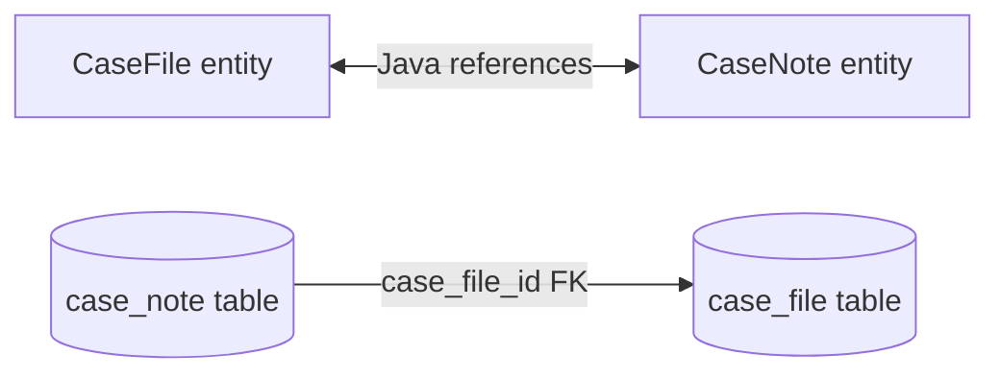

# Part 006 — Association Mapping Without Self-Deception

Association mapping adalah titik tempat object-oriented modelling bertemu relational modelling. Banyak developer menganggap association mapping sebagai translasi langsung:

- `List<OrderLine>` berarti one-to-many;
- `Customer customer` berarti many-to-one;
- `Set<Role> roles` berarti many-to-many;
- tambah `cascade = CascadeType.ALL`, selesai.

Itu cara berpikir yang berbahaya.

Association bukan sekadar “field yang menunjuk entity lain”. Association adalah kontrak tentang:

- lokasi foreign key;
- siapa owning side;
- apakah relasi wajib atau optional;
- apakah relasi bisa berubah;
- apakah child hidup-mati bersama parent;
- apakah navigation object sama dengan ownership data;
- bagaimana SQL insert/update/delete akan keluar;
- bagaimana invariant dua arah dijaga;
- apakah collection boleh besar;
- apakah mapping akan memicu N+1, Cartesian product, atau delete tidak sengaja.

Part ini fokus pada mapping association itu sendiri. Fetch strategy detail akan dibahas di Part 017. Cascade dan aggregate boundary akan diperdalam di Part 007. Di sini kita membangun fondasi: **cardinality, ownership, navigation, dan consistency**.

---

## 1. Kaufman Deconstruction: Skill Association Mapping

Untuk menguasai association mapping, pecah skill-nya menjadi keputusan kecil berikut:

| Sub-skill | Pertanyaan | Output Engineering |
|---|---|---|
| Cardinality modelling | Satu entity berhubungan dengan berapa entity lain? | one-to-one, many-to-one, one-to-many, many-to-many |
| FK placement | Column FK ada di table mana? | `@JoinColumn`, join table, shared primary key |
| Owning side | Field mana yang mengubah FK di DB? | owning side vs inverse side / `mappedBy` |
| Navigation design | Arah mana yang perlu dinavigasi dalam kode? | unidirectional vs bidirectional |
| Lifecycle coupling | Child hidup sendiri atau milik parent? | cascade, orphan removal, aggregate boundary |
| Nullability | Relasi wajib atau optional? | `nullable=false`, `optional=false`, DB FK constraint |
| Collection semantics | Duplicate/order/index dibutuhkan? | `Set`, `List`, `Map`, order column, order by |
| SQL shape | Operasi object menghasilkan SQL apa? | insert ordering, update FK, join query |
| Failure modelling | Apa yang terjadi jika sisi inverse saja diubah? | no FK update, stale in-memory graph, constraint error |

Target skill:

> Kamu bisa melihat association entity dan menentukan table mana yang memegang foreign key, field mana yang harus diubah agar database berubah, apakah relasi itu seharusnya bidirectional, dan failure mode apa yang akan muncul saat collection dimodifikasi.

---

## 2. Empat Pertanyaan Sebelum Menulis Annotation

Sebelum menulis `@OneToMany`, jawab empat pertanyaan ini:

1. **Cardinality:** berapa banyak entity di sisi kiri dan kanan?
2. **Ownership:** table mana yang punya foreign key?
3. **Navigation:** kode perlu jalan dari A ke B, B ke A, atau keduanya?
4. **Lifecycle:** apakah B boleh hidup tanpa A?

Contoh domain case management:

- `CaseFile` punya banyak `CaseNote`;
- setiap `CaseNote` wajib milik satu `CaseFile`;
- `CaseNote` tidak meaningful tanpa `CaseFile`;
- application sering load case beserta notes tertentu, tetapi note juga perlu tahu case-nya.

Relational model:

```sql
create table case_file (
    id bigint primary key,
    case_number varchar(64) not null unique
);

create table case_note (
    id bigint primary key,
    case_file_id bigint not null,
    body text not null,
    constraint fk_case_note_case_file
        foreign key (case_file_id) references case_file(id)
);
```

Mapping konseptual:

- FK ada di `case_note.case_file_id`;
- owning side adalah `CaseNote.caseFile`;
- `CaseFile.notes` hanyalah inverse collection jika bidirectional;
- kalau hanya `caseFile.getNotes().add(note)` tanpa `note.setCaseFile(caseFile)`, FK belum tentu berubah.

---

## 3. Owning Side: Konsep Paling Penting

Dalam bidirectional association, object graph punya dua pointer, tetapi database biasanya punya satu FK.



Di Java:

```java
caseFile.getNotes().add(note);
note.assignTo(caseFile);
```

Di database, hanya ada satu kolom FK:

```text
case_note.case_file_id
```

JPA perlu tahu field mana yang bertanggung jawab menulis FK itu. Itulah owning side.

Rule of thumb:

> Owning side adalah sisi yang memiliki `@JoinColumn` dan mengendalikan foreign key di database.

Untuk one-to-many bidirectional yang umum:

```java
@Entity
public class CaseNote {
    @ManyToOne(optional = false, fetch = FetchType.LAZY)
    @JoinColumn(name = "case_file_id", nullable = false)
    private CaseFile caseFile;
}
```

`CaseNote.caseFile` adalah owning side karena table `case_note` memiliki FK `case_file_id`.

Inverse side:

```java
@Entity
public class CaseFile {
    @OneToMany(mappedBy = "caseFile")
    private Set<CaseNote> notes = new HashSet<>();
}
```

`mappedBy = "caseFile"` berarti:

> Jangan buat FK atau join table baru. Relasi ini sudah dimiliki oleh field `caseFile` di entity `CaseNote`.

---

## 4. Many-to-One

`@ManyToOne` adalah association paling fundamental di JPA karena secara relational ia hampir selalu merepresentasikan FK di table child.

Contoh:

```java
@Entity
@Table(name = "case_note")
public class CaseNote {

    @Id
    @GeneratedValue(strategy = GenerationType.SEQUENCE)
    private Long id;

    @ManyToOne(fetch = FetchType.LAZY, optional = false)
    @JoinColumn(name = "case_file_id", nullable = false)
    private CaseFile caseFile;

    @Column(name = "body", nullable = false)
    private String body;

    protected CaseNote() {
    }

    private CaseNote(CaseFile caseFile, String body) {
        this.caseFile = Objects.requireNonNull(caseFile);
        this.body = Objects.requireNonNull(body);
    }

    public static CaseNote of(CaseFile caseFile, String body) {
        return new CaseNote(caseFile, body);
    }
}
```

### 4.1 `optional = false` vs `nullable = false`

| Setting | Layer | Meaning |
|---|---|---|
| `optional = false` | JPA mapping | association wajib secara object model |
| `nullable = false` | DB column metadata/schema | FK column tidak boleh null |

Gunakan keduanya untuk relasi wajib.

```java
@ManyToOne(fetch = FetchType.LAZY, optional = false)
@JoinColumn(name = "case_file_id", nullable = false)
private CaseFile caseFile;
```

Namun jangan hanya percaya annotation. Database tetap harus punya constraint nyata melalui migration.

### 4.2 Avoid Default EAGER Trap

Secara default JPA membuat `@ManyToOne` eager. Dalam sistem serius, default ini sering berbahaya.

Gunakan eksplisit:

```java
@ManyToOne(fetch = FetchType.LAZY, optional = false)
private CaseFile caseFile;
```

Fetch strategy akan dibahas dalam Part 017, tetapi rule awal:

> Jangan biarkan default fetch menentukan performance architecture.

---

## 5. One-to-Many Bidirectional

Bidirectional one-to-many umum digunakan saat parent perlu menavigasi child collection.

```java
@Entity
@Table(name = "case_file")
public class CaseFile {

    @Id
    @GeneratedValue(strategy = GenerationType.SEQUENCE)
    private Long id;

    @OneToMany(mappedBy = "caseFile", cascade = CascadeType.PERSIST, orphanRemoval = false)
    private Set<CaseNote> notes = new LinkedHashSet<>();

    public void addNote(String body) {
        CaseNote note = CaseNote.of(this, body);
        notes.add(note);
    }
}
```

```java
@Entity
@Table(name = "case_note")
public class CaseNote {

    @ManyToOne(fetch = FetchType.LAZY, optional = false)
    @JoinColumn(name = "case_file_id", nullable = false)
    private CaseFile caseFile;

    static CaseNote of(CaseFile caseFile, String body) {
        return new CaseNote(caseFile, body);
    }
}
```

### 5.1 Helper Method Wajib untuk Bidirectional Consistency

Jika association bidirectional, jangan expose raw mutation tanpa menjaga dua sisi.

Buruk:

```java
caseFile.getNotes().add(note);
```

Lebih baik:

```java
public void addNote(String body) {
    CaseNote note = CaseNote.of(this, body);
    this.notes.add(note);
}
```

Untuk relasi yang child bisa dipindahkan:

```java
public void addNote(CaseNote note) {
    notes.add(note);
    note.assignTo(this);
}

public void removeNote(CaseNote note) {
    notes.remove(note);
    note.unassign();
}
```

Di child:

```java
void assignTo(CaseFile caseFile) {
    this.caseFile = Objects.requireNonNull(caseFile);
}

void unassign() {
    this.caseFile = null;
}
```

Namun jika `case_file_id` nullable false, `unassign()` tidak boleh dipakai kecuali akan delete child.

---

## 6. One-to-Many Unidirectional

Unidirectional one-to-many terlihat menarik:

```java
@OneToMany
@JoinColumn(name = "case_file_id")
private Set<CaseNote> notes = new HashSet<>();
```

Artinya parent punya collection, child tidak punya reference ke parent.

Secara relational, FK tetap ada di child table. Tetapi karena child tidak punya field FK owner secara object model, provider harus mengelola FK dari collection parent. Ini bisa menghasilkan SQL tambahan dan mapping yang kurang natural.

Alternatif lain:

```java
@OneToMany
@JoinTable(
    name = "case_file_note",
    joinColumns = @JoinColumn(name = "case_file_id"),
    inverseJoinColumns = @JoinColumn(name = "case_note_id")
)
private Set<CaseNote> notes = new HashSet<>();
```

Ini membuat join table tambahan. Kadang valid, tetapi sering tidak perlu.

### 6.1 Practical Recommendation

Untuk relasi parent-child dengan FK di child:

- gunakan `@ManyToOne` di child sebagai minimal mapping;
- tambahkan `@OneToMany(mappedBy = ...)` hanya jika parent benar-benar perlu navigasi collection;
- hindari unidirectional `@OneToMany` untuk aggregate besar atau write-heavy path kecuali ada alasan jelas.

---

## 7. One-to-One

One-to-one sering disalahgunakan. Banyak relasi yang dikira one-to-one sebenarnya:

- many-to-one ke lookup table;
- one-to-many dengan status active;
- embedded value object;
- table split karena alasan security/performance;
- optional detail record.

Ada beberapa bentuk one-to-one.

### 7.1 Unique Foreign Key One-to-One

```sql
create table case_file (
    id bigint primary key
);

create table case_profile (
    id bigint primary key,
    case_file_id bigint not null unique,
    risk_score integer not null,
    foreign key (case_file_id) references case_file(id)
);
```

Mapping owning side:

```java
@Entity
public class CaseProfile {

    @OneToOne(fetch = FetchType.LAZY, optional = false)
    @JoinColumn(name = "case_file_id", nullable = false, unique = true)
    private CaseFile caseFile;
}
```

Inverse side:

```java
@Entity
public class CaseFile {

    @OneToOne(mappedBy = "caseFile", fetch = FetchType.LAZY)
    private CaseProfile profile;
}
```

Caveat: lazy one-to-one di inverse side bisa punya keterbatasan provider karena provider perlu tahu apakah row detail ada atau tidak.

### 7.2 Shared Primary Key One-to-One

Untuk detail yang lifecycle-nya sangat melekat pada parent, shared PK bisa lebih kuat.

```sql
create table case_file (
    id bigint primary key
);

create table case_profile (
    case_file_id bigint primary key,
    risk_score integer not null,
    foreign key (case_file_id) references case_file(id)
);
```

Mapping:

```java
@Entity
@Table(name = "case_profile")
public class CaseProfile {

    @Id
    @Column(name = "case_file_id")
    private Long id;

    @MapsId
    @OneToOne(fetch = FetchType.LAZY, optional = false)
    @JoinColumn(name = "case_file_id")
    private CaseFile caseFile;

    @Column(name = "risk_score", nullable = false)
    private int riskScore;
}
```

`@MapsId` berarti id child dipetakan dari id parent.

Shared PK cocok jika:

- child tidak meaningful tanpa parent;
- lifecycle child sangat melekat;
- cardinality benar-benar one-to-one;
- kamu ingin constraint DB sangat kuat.

---

## 8. Many-to-Many

`@ManyToMany` terlihat nyaman, tetapi sering menjadi anti-pattern production.

Contoh sederhana:

```java
@ManyToMany
@JoinTable(
    name = "user_role",
    joinColumns = @JoinColumn(name = "user_id"),
    inverseJoinColumns = @JoinColumn(name = "role_id")
)
private Set<Role> roles = new HashSet<>();
```

Valid untuk relasi murni tanpa atribut tambahan. Tetapi di sistem nyata, join table sering butuh:

- `assigned_at`;
- `assigned_by`;
- `valid_from`;
- `valid_until`;
- `source`;
- `status`;
- audit field;
- tenant id;
- soft delete.

Begitu join table punya atribut, `@ManyToMany` tidak cukup. Gunakan association entity.

### 8.1 Prefer Association Entity

Relational model:

```sql
create table user_role_assignment (
    id bigint primary key,
    user_id bigint not null,
    role_id bigint not null,
    assigned_at timestamp not null,
    assigned_by varchar(128) not null,
    unique (user_id, role_id)
);
```

Mapping:

```java
@Entity
@Table(name = "user_role_assignment")
public class UserRoleAssignment {

    @Id
    @GeneratedValue(strategy = GenerationType.SEQUENCE)
    private Long id;

    @ManyToOne(fetch = FetchType.LAZY, optional = false)
    @JoinColumn(name = "user_id", nullable = false)
    private User user;

    @ManyToOne(fetch = FetchType.LAZY, optional = false)
    @JoinColumn(name = "role_id", nullable = false)
    private Role role;

    @Column(name = "assigned_at", nullable = false)
    private Instant assignedAt;

    @Column(name = "assigned_by", nullable = false, length = 128)
    private String assignedBy;
}
```

Di `User`:

```java
@OneToMany(mappedBy = "user", cascade = CascadeType.PERSIST, orphanRemoval = true)
private Set<UserRoleAssignment> roleAssignments = new HashSet<>();
```

Ini lebih verbose, tetapi jauh lebih extensible dan auditable.

### 8.2 Rule

> Gunakan `@ManyToMany` hanya jika join table benar-benar tidak punya identity, behavior, metadata, audit, validity, atau lifecycle sendiri.

Dalam sistem regulatory/case management, hampir selalu lebih aman memakai association entity.

---

## 9. Collection Type: Set, List, Map

Collection mapping bukan hanya preferensi Java. Ia mempengaruhi SQL, duplicate behavior, ordering, dan dirty checking.

| Collection | Use Case | Risiko |
|---|---|---|
| `Set` | uniqueness di memory | butuh `equals/hashCode` aman |
| `List` tanpa order column | bag/list biasa | duplicate mungkin, order tidak guaranteed |
| `List` + `@OrderColumn` | order persistent | reorder bisa banyak UPDATE |
| `List` + `@OrderBy` | order by column/query | order tidak disimpan sebagai posisi eksplisit |
| `Map` | akses child by key | mapping lebih kompleks |

### 9.1 Set dan Equality

Jika memakai `Set<Child>`, equality child harus stabil. Jika child memakai generated id dan id belum assigned, `Set` bisa bermasalah.

Alternatif:

- gunakan business key child yang immutable;
- gunakan `List` jika duplicate diatur DB constraint;
- jangan mutate collection sebelum identity stabil tanpa helper yang jelas;
- tetap enforce uniqueness di DB.

### 9.2 Ordering

`@OrderBy`:

```java
@OneToMany(mappedBy = "caseFile")
@OrderBy("createdAt DESC")
private List<CaseNote> notes;
```

Order berdasarkan column saat query.

`@OrderColumn`:

```java
@OneToMany(mappedBy = "caseFile")
@OrderColumn(name = "position")
private List<ChecklistItem> items;
```

Order disimpan sebagai posisi. Reordering bisa menghasilkan banyak update.

---

## 10. Cascade Bukan Relationship

Cascade sering disalahgunakan untuk “membuat save child otomatis”. Tetapi cascade adalah lifecycle propagation, bukan definisi relasi.

```java
@OneToMany(mappedBy = "caseFile", cascade = CascadeType.PERSIST)
private Set<CaseNote> notes = new HashSet<>();
```

Artinya saat parent dipersist, persist operation dipropagasikan ke child.

Cascade types:

| Cascade | Meaning |
|---|---|
| `PERSIST` | persist parent ikut persist child |
| `MERGE` | merge parent ikut merge child |
| `REMOVE` | remove parent ikut remove child |
| `REFRESH` | refresh parent ikut refresh child |
| `DETACH` | detach parent ikut detach child |
| `ALL` | semua di atas |

Danger:

```java
@ManyToOne(cascade = CascadeType.ALL)
private Customer customer;
```

Jika banyak order menunjuk customer yang sama, cascade remove dari order ke customer bisa berbahaya.

Rule awal:

- cascade dari aggregate root ke owned child bisa valid;
- cascade dari child ke parent hampir selalu mencurigakan;
- cascade ke shared reference berbahaya;
- `CascadeType.ALL` bukan default yang aman.

Part 007 akan membahas aggregate boundary dan cascade lebih dalam.

---

## 11. Orphan Removal Bukan Cascade Remove Biasa

`orphanRemoval = true` berarti child dihapus jika dilepas dari parent collection.

```java
@OneToMany(mappedBy = "caseFile", cascade = CascadeType.ALL, orphanRemoval = true)
private Set<CaseAttachment> attachments = new HashSet<>();
```

Jika:

```java
caseFile.removeAttachment(attachment);
```

Maka provider akan menghapus row attachment saat flush.

Cocok untuk:

- child owned sepenuhnya oleh parent;
- child tidak boleh berpindah owner;
- child tidak meaningful tanpa parent.

Tidak cocok untuk:

- shared child;
- historical record;
- association yang perlu soft delete;
- child yang bisa dipindahkan ke parent lain.

---

## 12. Bidirectional Consistency

Bidirectional association punya dua sumber state di memory:

```java
caseFile.getNotes();
note.getCaseFile();
```

Database punya satu FK. JPA tidak otomatis menjaga dua sisi object graph untuk kamu.

Buruk:

```java
CaseNote note = CaseNote.of(null, "Investigated");
caseFile.getNotes().add(note);

// note.caseFile masih null
```

Saat flush, FK bisa null atau tidak berubah karena owning side tidak diset.

Baik:

```java
caseFile.addNote("Investigated");
```

Dengan helper:

```java
public void addNote(String body) {
    CaseNote note = CaseNote.of(this, body);
    this.notes.add(note);
}
```

Aturan:

> Untuk bidirectional association, semua mutation harus lewat helper method yang menyinkronkan dua sisi.

---

## 13. Association dan Encapsulation

Jangan expose mutable collection secara langsung.

Buruk:

```java
public Set<CaseNote> getNotes() {
    return notes;
}
```

Caller bisa:

```java
caseFile.getNotes().clear();
```

Jika `orphanRemoval = true`, ini bisa menghapus semua child.

Lebih baik:

```java
public Set<CaseNote> notes() {
    return Collections.unmodifiableSet(notes);
}

public void addNote(String body) {
    notes.add(CaseNote.of(this, body));
}
```

Untuk remove:

```java
public void removeNote(Long noteId) {
    CaseNote note = notes.stream()
        .filter(n -> n.id().equals(noteId))
        .findFirst()
        .orElseThrow(() -> new NoteNotFoundException(noteId));

    notes.remove(note);
    note.markRemovedFrom(this);
}
```

---

## 14. Database Constraint Harus Mengunci Mapping

Annotation tidak cukup. Mapping harus didukung database constraint.

Contoh mandatory many-to-one:

```java
@ManyToOne(fetch = FetchType.LAZY, optional = false)
@JoinColumn(name = "case_file_id", nullable = false)
private CaseFile caseFile;
```

Migration harus punya:

```sql
alter table case_note
    add constraint fk_case_note_case_file
    foreign key (case_file_id)
    references case_file(id);

alter table case_note
    alter column case_file_id set not null;
```

Untuk one-to-one unique FK:

```sql
alter table case_profile
    add constraint uq_case_profile_case_file unique (case_file_id);
```

Untuk many-to-many association entity uniqueness:

```sql
alter table user_role_assignment
    add constraint uq_user_role unique (user_id, role_id);
```

Rule:

> JPA mapping menjelaskan object-relational contract. Database constraint menegakkan contract saat semua aplikasi, job, script, dan integrasi menulis data.

---

## 15. Association Mapping dan SQL Shape

### 15.1 Many-to-One Insert

```java
CaseFile caseFile = entityManager.getReference(CaseFile.class, caseId);
CaseNote note = CaseNote.of(caseFile, "Initial note");
entityManager.persist(note);
```

Expected SQL shape:

```sql
insert into case_note (case_file_id, body, id)
values (?, ?, ?);
```

Tidak perlu update FK terpisah jika owning side sudah diset sebelum persist.

### 15.2 Bad Unidirectional One-to-Many Write Shape

```java
caseFile.getNotes().add(note);
entityManager.persist(note);
```

Jika FK tidak tersedia di child object, provider bisa perlu:

1. insert child tanpa FK;
2. update FK setelah parent collection diproses.

Itu lebih mahal dan rawan constraint jika FK non-null.

### 15.3 Bidirectional Incorrect Mutation

```java
caseFile.getNotes().add(note); // inverse side only
```

Expected problem:

- FK tidak berubah karena owning side tidak berubah;
- in-memory graph terlihat benar;
- database tetap salah.

Ini jenis bug yang berbahaya karena test yang tidak flush/clear bisa tertipu.

---

## 16. Testing Association Correctness

Jangan hanya assert object graph sebelum flush.

Kurang kuat:

```java
caseFile.addNote("note");
assertThat(caseFile.notes()).hasSize(1);
```

Lebih kuat:

```java
caseFile.addNote("note");
entityManager.persist(caseFile);
entityManager.flush();
entityManager.clear();

CaseFile reloaded = entityManager.find(CaseFile.class, caseFile.id());
assertThat(reloaded.notes()).hasSize(1);
```

Untuk association mapping, test harus membuktikan:

- FK benar-benar tersimpan;
- reload dari DB menghasilkan graph yang benar;
- remove child menghasilkan SQL/DB state yang benar;
- unique/nullable constraint bekerja;
- inverse-only mutation tidak dianggap valid.

---

## 17. Common Anti-Patterns

### 17.1 Bidirectional Everywhere

Tidak semua association perlu dua arah.

Buruk:

```java
Customer -> orders -> orderLines -> product -> categories -> products -> suppliers
```

Akibat:

- graph sulit dikendalikan;
- serialization recursive;
- equals/toString rawan lazy loading;
- cascade bisa melebar;
- query plan sulit diprediksi.

Rule:

> Tambahkan navigation hanya jika use case membutuhkannya.

### 17.2 Many-to-Many untuk Relasi Berperilaku

Jika relation punya metadata, buat association entity.

### 17.3 Cascade ALL ke Shared Reference

Buruk:

```java
@ManyToOne(cascade = CascadeType.ALL)
private Customer customer;
```

`Customer` biasanya shared reference, bukan child milik order.

### 17.4 Public Mutable Collection Getter

Buruk:

```java
public Set<Child> getChildren() {
    return children;
}
```

### 17.5 Mapping Mengikuti UI, Bukan Domain dan DB

UI butuh nested JSON bukan berarti entity harus punya nested bidirectional association lengkap.

Gunakan DTO/read model untuk UI.

### 17.6 Ignoring FK Nullability

Jika business rule mengatakan note wajib punya case, maka mapping dan DB harus sama-sama enforce.

### 17.7 One-to-One untuk Optional Detail yang Sering Kosong

Jika detail optional dan jarang diakses, one-to-one bisa valid. Tetapi pikirkan lazy behavior, query cost, dan apakah embedded lebih tepat.

---

## 18. Design Heuristics

Gunakan heuristic berikut:

| Scenario | Mapping Default |
|---|---|
| Child wajib punya parent | `@ManyToOne(optional=false)` di child |
| Parent perlu navigasi children kecil | bidirectional `@OneToMany(mappedBy=...)` |
| Parent tidak perlu navigasi children | cukup `@ManyToOne` di child |
| Child owned dan hidup-mati bersama parent | cascade dari parent + mungkin orphan removal |
| Child shared oleh banyak parent | jangan cascade remove/orphan removal |
| Relasi punya atribut | association entity |
| Join table murni tanpa atribut | `@ManyToMany` bisa dipertimbangkan |
| One-to-one tightly coupled | shared primary key + `@MapsId` |
| Lookup/reference table | `@ManyToOne(fetch=LAZY)` tanpa cascade |
| Collection sangat besar | jangan mapping sebagai collection aggregate biasa; gunakan query/repository |

---

## 19. Association Review Checklist

Saat review entity association, cek:

- [ ] Apakah cardinality benar secara domain dan database?
- [ ] Apakah FK placement jelas?
- [ ] Apakah owning side memiliki `@JoinColumn`?
- [ ] Apakah inverse side memakai `mappedBy` yang benar?
- [ ] Apakah relasi wajib memakai `optional=false` dan `nullable=false`?
- [ ] Apakah DB migration punya FK constraint nyata?
- [ ] Apakah bidirectional mutation lewat helper method?
- [ ] Apakah collection getter tidak expose mutable collection?
- [ ] Apakah cascade hanya ke owned child?
- [ ] Apakah `CascadeType.ALL` tidak dipakai sembarangan?
- [ ] Apakah `@ManyToMany` benar-benar tidak butuh metadata?
- [ ] Apakah collection size bounded dan masuk akal?
- [ ] Apakah test melakukan flush/clear/reload?
- [ ] Apakah association tidak didesain hanya untuk kebutuhan JSON response?

---

## 20. Deliberate Practice

### Latihan 1 — Tentukan Owning Side

Schema:

```sql
create table investigation_task (
    id bigint primary key,
    case_file_id bigint not null references case_file(id)
);
```

Pertanyaan:

- entity mana owning side?
- annotation apa yang harus ada di child?
- apakah parent perlu `@OneToMany`?

Jawaban:

- owning side: `InvestigationTask.caseFile`;
- child: `@ManyToOne(fetch = LAZY, optional = false)` + `@JoinColumn(name = "case_file_id", nullable = false)`;
- parent perlu `@OneToMany(mappedBy = "caseFile")` hanya jika use case butuh navigasi dari case ke tasks.

### Latihan 2 — Refactor Many-to-Many

Dari:

```java
@ManyToMany
private Set<Role> roles;
```

Ke:

```java
@OneToMany(mappedBy = "user", cascade = CascadeType.PERSIST, orphanRemoval = true)
private Set<UserRoleAssignment> roleAssignments;
```

Tambahkan field:

```java
private Instant assignedAt;
private String assignedBy;
```

Tujuan: membuat relation auditable dan extensible.

### Latihan 3 — Test Inverse-Only Mutation

Buat test yang membuktikan ini salah:

```java
caseFile.getNotes().add(note);
```

Test harus:

1. flush;
2. clear;
3. reload dari DB;
4. buktikan note tidak punya FK benar atau operasi gagal.

---

## 21. Ringkasan

Association mapping bukan sekadar memilih annotation. Mapping yang benar dimulai dari relational fact: **foreign key ada di mana?** Dari sana baru tentukan owning side, inverse side, navigation direction, lifecycle coupling, dan collection semantics.

Mental model utama:

> Dalam bidirectional association, Java punya dua pointer, database punya satu foreign key. Owning side adalah sisi yang mengubah foreign key.

Gunakan `@ManyToOne` sebagai fondasi child-to-parent. Tambahkan `@OneToMany(mappedBy=...)` hanya jika parent benar-benar perlu navigasi collection. Hindari `@ManyToMany` untuk relasi yang punya metadata atau audit. Jangan expose mutable collection. Jangan cascade ke shared reference. Selalu dukung mapping dengan constraint database dan test flush-clear-reload.

Di Part 007, kita akan melangkah dari association teknis ke aggregate boundary: kapan cascade valid, kapan orphan removal aman, bagaimana mencegah graph explosion, dan bagaimana mendesain persistence model yang menjaga invariant domain tanpa membuat ORM menjadi bom waktu.

---

## Referensi

- Jakarta Persistence 3.2 Specification — relationship mappings, owning side, join columns, join tables, lifecycle operations.
- Hibernate ORM User Guide — association mapping, bidirectional association ownership, collection mapping, and provider behavior.
- Spring Data JPA Reference — repository persistence behavior and EntityManager delegation.
