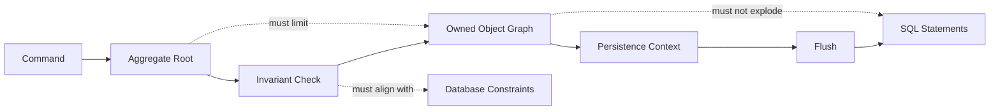
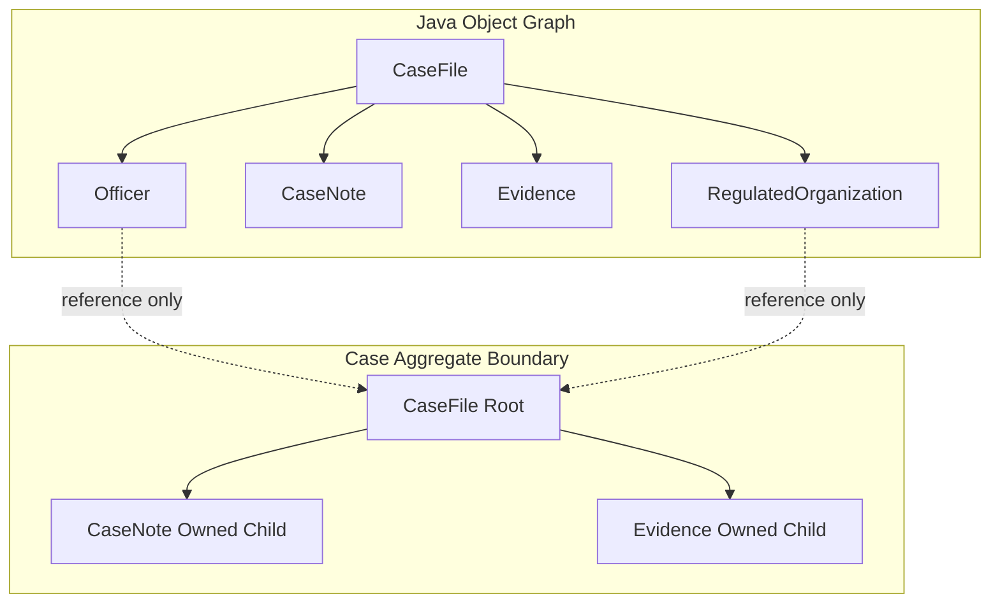
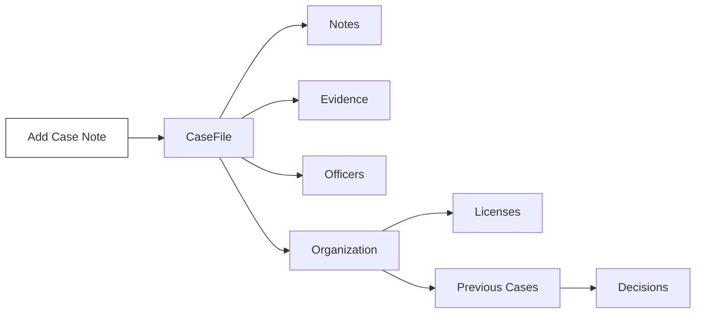
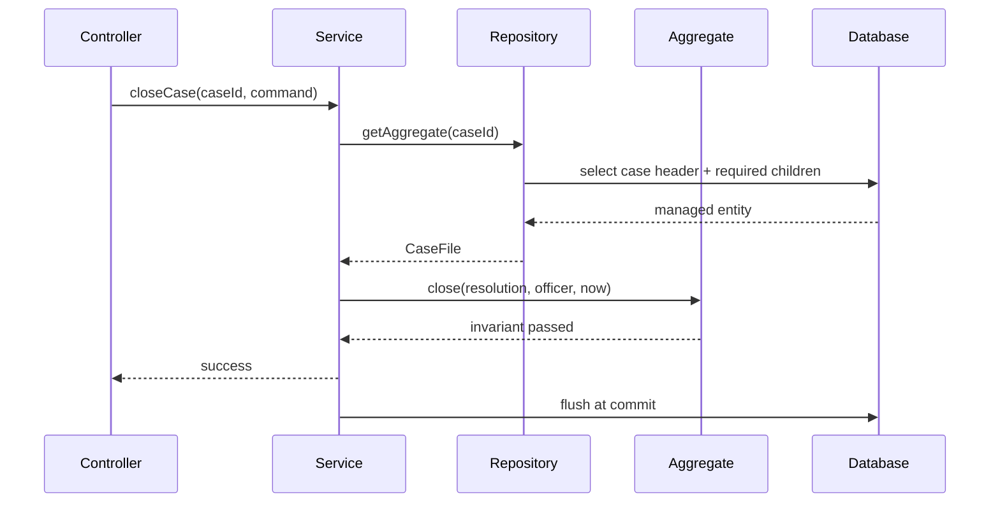
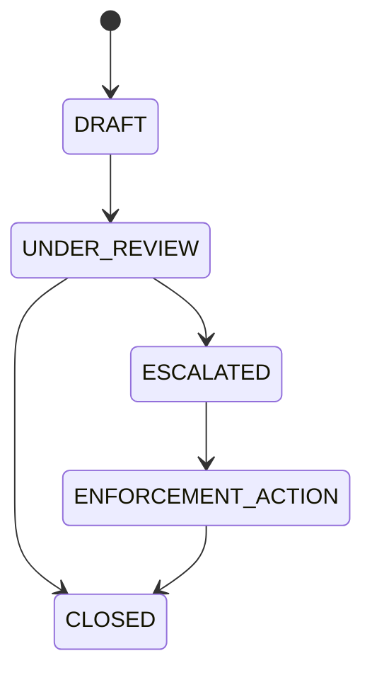

# Part 007 — Aggregate Boundaries and Object Graph Persistence

## 1. Tujuan Part Ini

Di Part 006 kita membahas association mapping: foreign key, owning side, inverse side, join table, dan relasi bidirectional.

Part ini naik satu level: **bagaimana relasi-relasi itu membentuk object graph yang aman untuk dipersist**.

Pertanyaan utamanya bukan lagi:

> Annotation apa yang harus dipakai?

Tetapi:

> Object mana yang benar-benar dimiliki oleh object lain, invariant apa yang harus dijaga bersama, dan operasi persistence apa yang boleh menyebar di dalam graph?

Ini penting karena JPA membuat developer mudah berpikir seperti ini:

```java
entityManager.persist(caseFile);
```

lalu berharap seluruh graph di bawah `caseFile` otomatis aman.

Padahal yang sebenarnya terjadi bisa salah satu dari ini:

- child ikut tersimpan padahal seharusnya tidak;
- shared reference ikut terhapus ketika parent dihapus;
- detached graph hasil JSON request menimpa data yang tidak dikirim client;
- orphan removal menghapus row karena collection diganti sembarangan;
- cascade `MERGE` memicu select besar dan stale overwrite;
- transaksi kecil berubah menjadi operasi ratusan SQL karena graph terlalu luas;
- aggregate boundary domain tidak sama dengan boundary object graph JPA.

Di level production, aggregate boundary adalah alat untuk mengendalikan **correctness**, **performance**, dan **blast radius**.



Jika boundary terlalu sempit, domain logic tercecer di service layer. Jika terlalu luas, setiap command membawa object graph besar, query membengkak, dan cascade menjadi tidak terkendali.

---

## 2. Kaufman Deconstruction: Skill yang Harus Dikuasai

Mengikuti pendekatan Josh Kaufman, skill “object graph persistence” kita pecah menjadi sub-skill kecil yang bisa dilatih:

| Sub-skill | Kemampuan yang Diharapkan |
|---|---|
| Membedakan entity, aggregate root, child entity, value object, shared reference | Tidak semua `@Entity` adalah aggregate root |
| Membaca lifecycle ownership | Tahu mana object yang hidup dan mati bersama parent |
| Mendesain cascade secara selektif | Tidak memakai `CascadeType.ALL` sebagai default malas |
| Memakai orphan removal dengan aman | Tidak menghapus data karena collection replacement |
| Membatasi graph persistence | Mencegah persist/merge/remove menyebar terlalu jauh |
| Menjaga invariant melalui method domain | Tidak membiarkan external code memodifikasi collection bebas |
| Menghindari detached graph merge | Tidak memakai `merge()` sebagai object graph upsert universal |
| Menguji boundary dengan flush-clear-reload | Membuktikan mapping benar terhadap database, bukan terhadap memory |

Target Part ini: setelah selesai, Anda harus bisa melihat sebuah model JPA dan mengatakan:

- aggregate root-nya mana;
- child mana yang owned;
- association mana yang reference-only;
- cascade mana yang valid;
- orphan removal mana yang aman;
- operasi command mana yang berpotensi mengubah graph terlalu luas;
- test apa yang diperlukan untuk membuktikan boundary itu benar.

---

## 3. Mental Model: Object Graph Bukan Aggregate Boundary

Object graph adalah struktur pointer di memory.

Aggregate boundary adalah struktur ownership dan invariant dalam domain.

Keduanya sering tumpang tindih, tetapi tidak identik.



Pada contoh di atas:

- `CaseFile` mungkin punya pointer ke `Officer`;
- `CaseFile` mungkin punya pointer ke `RegulatedOrganization`;
- tetapi itu tidak berarti `Officer` dan `RegulatedOrganization` dimiliki oleh `CaseFile`;
- `CaseNote` dan `Evidence` mungkin benar-benar child dari `CaseFile` karena lifecycle-nya bergantung pada case.

Kesalahan umum:

```java
@OneToMany(cascade = CascadeType.ALL)
private List<Officer> assignedOfficers;
```

Ini berbahaya jika `Officer` adalah master data atau user account. Menghapus case tidak boleh menghapus officer. Membuat case baru tidak boleh membuat officer baru secara implisit. Mengubah case tidak boleh merge semua officer yang kebetulan ada di graph.

Aturan mental:

> Pointer bukan ownership. Association bukan aggregate. Cascade hanya valid jika lifecycle benar-benar dimiliki.

---

## 4. Vocabulary yang Harus Tepat

### 4.1 Entity

Entity adalah object dengan identity yang bertahan melewati perubahan state.

Contoh:

```java
@Entity
class CaseFile {
    @Id
    private UUID id;
}
```

`CaseFile` tetap case yang sama walaupun status, officer, atau notes berubah.

### 4.2 Aggregate Root

Aggregate root adalah entity utama yang menjadi gerbang perubahan untuk object lain di dalam aggregate.

```java
caseFile.addNote(authorId, "Inspection completed");
caseFile.attachEvidence(evidenceId, metadata);
caseFile.close(resolution);
```

External code tidak boleh sembarangan melakukan ini:

```java
caseFile.getNotes().add(note); // buruk
```

karena itu melewati invariant.

### 4.3 Child Entity

Child entity punya identity, tetapi lifecycle dan invariant-nya bergantung pada parent.

Contoh:

- `CaseNote` punya `id`, tetapi tidak bermakna tanpa `CaseFile`;
- `EvidenceItem` punya `id`, tetapi kepemilikannya ada di case tertentu;
- `PenaltyLine` punya `id`, tetapi bagian dari `PenaltyDecision`.

### 4.4 Value Object

Value object tidak punya identity persistence sendiri. Ia didefinisikan oleh value-nya.

Contoh:

- `Money`;
- `DateRange`;
- `Address`;
- `RiskScore`;
- `ViolationCode`.

Part 008 akan membahas value object lebih dalam.

### 4.5 Shared Reference

Shared reference adalah entity yang direferensikan banyak aggregate dan lifecycle-nya tidak dimiliki oleh referencer.

Contoh:

- `Officer`;
- `RegulatedOrganization`;
- `RegulationArticle`;
- `ProductCategory`;
- `LicenseType`.

Shared reference biasanya **tidak** menerima cascade dari aggregate yang mereferensikannya.

---

## 5. Aggregate Boundary sebagai Transaction Consistency Boundary

Aggregate bukan sekadar “kelompok class”. Aggregate adalah boundary konsistensi.

Dalam satu command, invariant di dalam aggregate harus benar secara atomik.

Contoh invariant `CaseFile`:

- case tidak boleh ditutup jika masih ada mandatory evidence yang belum diverifikasi;
- case tidak boleh pindah ke `ESCALATED` tanpa escalation reason;
- note tidak boleh ditambahkan ke closed case kecuali note bertipe post-closure audit;
- evidence tidak boleh dihapus setelah enforcement decision diterbitkan;
- severity tidak boleh diturunkan tanpa reviewer approval.

Semua invariant itu lebih aman jika dijaga oleh root:

```java
public void close(CaseResolution resolution, OfficerId closedBy, Instant now) {
    if (status == CaseStatus.CLOSED) {
        throw new CaseAlreadyClosedException(id);
    }

    if (!mandatoryEvidenceComplete()) {
        throw new CaseCannotBeClosedException("Mandatory evidence is incomplete");
    }

    this.status = CaseStatus.CLOSED;
    this.resolution = resolution;
    this.closedBy = closedBy;
    this.closedAt = now;
}
```

Bukan seperti ini:

```java
caseFile.setStatus(CaseStatus.CLOSED);
caseFile.setClosedBy(userId);
caseFile.setClosedAt(now);
```

Setter publik membuat object graph mudah diubah tanpa invariant.

Persistence layer harus mendukung model ini, bukan merusaknya.

---

## 6. Mapping Aggregate Root dan Owned Children

Contoh model regulatory case:

```java
@Entity
@Table(name = "case_file")
public class CaseFile {

    @Id
    private UUID id;

    @Version
    private long version;

    @Enumerated(EnumType.STRING)
    @Column(nullable = false)
    private CaseStatus status;

    @OneToMany(
        mappedBy = "caseFile",
        cascade = CascadeType.PERSIST,
        orphanRemoval = true
    )
    private final List<CaseNote> notes = new ArrayList<>();

    protected CaseFile() {
    }

    public CaseFile(UUID id) {
        this.id = Objects.requireNonNull(id);
        this.status = CaseStatus.DRAFT;
    }

    public void addNote(OfficerId authorId, String text, Instant now) {
        if (status == CaseStatus.CLOSED) {
            throw new IllegalStateException("Closed case cannot receive ordinary notes");
        }

        CaseNote note = new CaseNote(UUID.randomUUID(), this, authorId, text, now);
        notes.add(note);
    }

    public void removeDraftNote(UUID noteId) {
        CaseNote note = notes.stream()
            .filter(n -> n.id().equals(noteId))
            .findFirst()
            .orElseThrow();

        if (!note.isDraft()) {
            throw new IllegalStateException("Only draft notes can be removed");
        }

        notes.remove(note);
        note.detachFromCase();
    }

    public List<CaseNote> notes() {
        return List.copyOf(notes);
    }
}
```

Child entity:

```java
@Entity
@Table(name = "case_note")
public class CaseNote {

    @Id
    private UUID id;

    @ManyToOne(fetch = FetchType.LAZY, optional = false)
    @JoinColumn(name = "case_file_id", nullable = false)
    private CaseFile caseFile;

    @Embedded
    private OfficerId authorId;

    @Column(nullable = false, length = 4000)
    private String text;

    @Column(nullable = false)
    private Instant createdAt;

    protected CaseNote() {
    }

    CaseNote(UUID id, CaseFile caseFile, OfficerId authorId, String text, Instant createdAt) {
        this.id = Objects.requireNonNull(id);
        this.caseFile = Objects.requireNonNull(caseFile);
        this.authorId = Objects.requireNonNull(authorId);
        this.text = requireText(text);
        this.createdAt = Objects.requireNonNull(createdAt);
    }

    UUID id() {
        return id;
    }

    boolean isDraft() {
        return true; // simplified for example
    }

    void detachFromCase() {
        this.caseFile = null;
    }
}
```

Ada beberapa keputusan penting di sini:

| Keputusan | Alasan |
|---|---|
| `CaseFile` root membuat `CaseNote` | Child lifecycle dikendalikan root |
| Constructor `CaseNote` package-private | Mencegah external code membuat child invalid |
| Collection tidak diekspos mutable | External code tidak bisa bypass invariant |
| `mappedBy = "caseFile"` | FK ada di child |
| `orphanRemoval = true` | Note yang dilepas dari aggregate dihapus dari DB |
| `cascade = PERSIST` | Saat case baru dibuat, notes baru boleh ikut tersimpan |
| Tidak langsung `CascadeType.ALL` | `MERGE`, `REMOVE`, `REFRESH`, `DETACH` harus diputuskan eksplisit |

---

## 7. Cascade Semantics: Jangan Jadikan `ALL` sebagai Refleks

JPA cascade berarti operasi persistence pada parent dipropagasikan ke associated entity.

Cascade bukan “relasi ini anak saya”. Cascade adalah “operasi persistence ini boleh menyebar ke object tersebut”.

Jenis umum:

| Cascade | Efek | Risiko |
|---|---|---|
| `PERSIST` | Child baru ikut disimpan ketika parent dipersist | Menyimpan object yang sebenarnya shared reference |
| `MERGE` | State detached child ikut disalin ke managed child | Stale overwrite, select besar, graph merge tidak terkendali |
| `REMOVE` | Child ikut dihapus ketika parent dihapus | Menghapus shared entity secara tidak sengaja |
| `REFRESH` | Child ikut di-refresh dari DB | Perubahan lokal child bisa hilang |
| `DETACH` | Child ikut dilepas dari persistence context | Bisa membuat graph detached lebih besar dari yang diharapkan |
| `ALL` | Semua operasi di atas | Terlalu agresif untuk banyak model production |

### 7.1 Cascade PERSIST

`PERSIST` valid ketika parent bertanggung jawab membuat child baru.

Contoh valid:

```java
@OneToMany(mappedBy = "caseFile", cascade = CascadeType.PERSIST)
private List<CaseNote> notes = new ArrayList<>();
```

Use case:

```java
CaseFile caseFile = new CaseFile(caseId);
caseFile.addNote(authorId, "Initial intake", now);
entityManager.persist(caseFile);
```

Expected behavior:

```sql
insert into case_file (...);
insert into case_note (..., case_file_id);
```

`PERSIST` tidak berarti setiap update child akan butuh cascade. Setelah child managed, dirty checking akan mendeteksi perubahan pada child jika child ada di persistence context.

### 7.2 Cascade MERGE

`MERGE` sering paling berbahaya.

Masalahnya: `merge()` bukan “attach object ini lagi”. `merge()` menyalin state object detached ke managed instance. Jika graph besar ikut cascade merge, provider bisa melakukan select dan copy state ke banyak object.

Contoh berbahaya:

```java
@PostMapping("/cases/{id}")
@Transactional
public CaseFile update(@RequestBody CaseFile detachedCase) {
    return entityManager.merge(detachedCase);
}
```

Ini buruk karena:

- request body menjadi persistence graph;
- field yang tidak dikirim client bisa menjadi null;
- child collection bisa dianggap authoritative replacement;
- stale client data bisa menimpa state terbaru;
- cascade merge bisa menyebar ke object yang tidak dimaksud.

Pattern yang lebih aman:

```java
@Transactional
public void addNote(UUID caseId, AddNoteCommand command) {
    CaseFile caseFile = caseRepository.getForUpdate(caseId);
    caseFile.addNote(command.authorId(), command.text(), clock.instant());
}
```

Load managed aggregate, panggil method domain, biarkan dirty checking bekerja.

### 7.3 Cascade REMOVE

`REMOVE` valid jika child tidak boleh hidup tanpa parent.

Contoh valid:

```java
@OneToMany(mappedBy = "decision", cascade = CascadeType.REMOVE)
private List<PenaltyLine> lines = new ArrayList<>();
```

Jika `PenaltyDecision` dihapus, `PenaltyLine` ikut hilang.

Contoh berbahaya:

```java
@ManyToOne(cascade = CascadeType.REMOVE)
private RegulatedOrganization organization;
```

Menghapus case tidak boleh menghapus organization.

Aturan praktis:

> Jangan cascade remove dari child ke parent atau dari aggregate ke shared reference.

### 7.4 Cascade REFRESH dan DETACH

Dua cascade ini jarang perlu di application code biasa.

`REFRESH` akan membuang perubahan lokal dan reload dari database. Jika cascade refresh menyebar ke child, perubahan lokal child juga hilang.

`DETACH` membuat object keluar dari persistence context. Di aplikasi request/transaction scoped, explicit detach jarang diperlukan kecuali untuk optimasi memory atau batch processing tertentu.

### 7.5 Cascade ALL

`CascadeType.ALL` boleh dipakai hanya jika Anda benar-benar setuju dengan semua operasi:

- persist bersama;
- merge bersama;
- remove bersama;
- refresh bersama;
- detach bersama.

Untuk owned child kecil yang lifecycle-nya sepenuhnya milik parent, `ALL` bisa masuk akal.

Tetapi default yang lebih aman untuk production adalah memilih cascade satu per satu.

---

## 8. Cascade Decision Matrix

Gunakan matrix ini saat review mapping.

| Relationship | Contoh | Cascade yang Umumnya Aman | Cascade yang Harus Dicurigai |
|---|---|---|---|
| Parent ke owned child | `CaseFile -> CaseNote` | `PERSIST`, kadang `REMOVE`, kadang `ALL` | `MERGE` jika API menerima detached graph |
| Parent ke value-like entity child | `Order -> OrderLine` | `ALL` + `orphanRemoval` sering valid | Tidak ada jika lifecycle benar-benar owned |
| Child ke parent | `CaseNote -> CaseFile` | Umumnya tidak perlu cascade | `REMOVE`, `ALL` |
| Aggregate ke shared reference | `CaseFile -> Organization` | Umumnya tidak perlu cascade | `PERSIST`, `MERGE`, `REMOVE`, `ALL` |
| Many-to-many langsung | `User -> Role` | Umumnya tidak cascade remove | `REMOVE`, `ALL` |
| Association entity | `User -> UserRoleAssignment` | `PERSIST`, orphan removal dari owner | Cascade ke `Role` |

Review question:

> Jika parent dihapus, apakah associated object boleh ikut hilang secara domain dan compliance?

Jika jawabannya “tidak yakin”, jangan pakai cascade remove.

---

## 9. Orphan Removal: Lifecycle Deletion karena Terlepas dari Parent

`orphanRemoval = true` berarti child entity yang dilepas dari relationship akan dihapus.

Contoh:

```java
@OneToMany(mappedBy = "caseFile", orphanRemoval = true)
private List<CaseNote> notes = new ArrayList<>();
```

Jika ini terjadi:

```java
caseFile.removeDraftNote(noteId);
```

maka child note yang dilepas dari collection akan menjadi orphan dan dijadwalkan untuk delete.

Perbedaan penting:

| Mechanism | Trigger | Efek |
|---|---|---|
| `CascadeType.REMOVE` | Parent dihapus | Child ikut dihapus |
| `orphanRemoval = true` | Child dilepas dari parent relationship | Child dihapus |
| DB `ON DELETE CASCADE` | Row parent dihapus di database | DB menghapus row child |

Ketiganya tidak sama.

### 9.1 Orphan Removal Valid untuk Private-Owned Child

Valid:

```java
Order -> OrderLine
CaseFile -> DraftCaseNote
PenaltyDecision -> PenaltyLine
```

Tidak valid:

```java
CaseFile -> Officer
CaseFile -> Organization
User -> Role
```

### 9.2 Collection Replacement Pitfall

Ini berbahaya:

```java
public void setNotes(List<CaseNote> notes) {
    this.notes = notes;
}
```

Dengan `orphanRemoval = true`, mengganti collection reference bisa membuat provider bingung atau menganggap old collection tidak lagi direferensikan. Di Hibernate, collection persistent wrapper punya tracking internal. Mengganti wrapper dengan collection baru bisa memicu exception atau delete yang tidak diinginkan.

Pattern aman:

```java
public void replaceDraftNotes(List<NoteDraft> drafts, OfficerId authorId, Instant now) {
    this.notes.removeIf(CaseNote::isDraft);

    for (NoteDraft draft : drafts) {
        this.addNote(authorId, draft.text(), now);
    }
}
```

Atau jika benar-benar ingin sinkronisasi by id:

```java
public void syncNotes(List<NotePatch> patches, Instant now) {
    Map<UUID, CaseNote> existing = notes.stream()
        .collect(Collectors.toMap(CaseNote::id, Function.identity()));

    Set<UUID> incomingIds = patches.stream()
        .map(NotePatch::id)
        .filter(Objects::nonNull)
        .collect(Collectors.toSet());

    notes.removeIf(note -> note.isDraft() && !incomingIds.contains(note.id()));

    for (NotePatch patch : patches) {
        if (patch.id() == null) {
            addNote(patch.authorId(), patch.text(), now);
        } else {
            existing.get(patch.id()).editText(patch.text());
        }
    }
}
```

Jangan set collection langsung dari DTO.

---

## 10. Graph Explosion

Graph explosion terjadi ketika satu operasi persistence menyentuh graph jauh lebih besar dari intensi command.

Contoh:

```java
CaseFile
  -> notes
  -> evidence
  -> assignedOfficers
  -> organization
  -> licenses
  -> previousCases
  -> decisions
```

Jika semua association diberi cascade dan eager fetch, operasi kecil seperti `addNote()` bisa berubah menjadi operasi besar.



Masalahnya bukan hanya jumlah SQL, tetapi juga blast radius:

- object yang tidak relevan masuk persistence context;
- dirty checking memeriksa lebih banyak entity;
- lock duration lebih lama;
- memory usage naik;
- transaction conflict meningkat;
- cache invalidation lebih luas;
- stale merge risk lebih besar.

Aturan:

> Command kecil harus punya graph persistence kecil.

Jika `addCaseNote` membutuhkan organization licenses dan previous cases, kemungkinan boundary Anda salah atau query Anda terlalu rakus.

---

## 11. Aggregate Boundary vs Read Model

Aggregate boundary didesain untuk write consistency, bukan untuk semua kebutuhan read.

Kesalahan umum: entity graph dibuat besar karena UI butuh layar detail lengkap.

Contoh layar detail case mungkin butuh:

- case header;
- organization profile;
- assigned officers;
- open tasks;
- latest notes;
- evidence count;
- risk timeline;
- related previous cases;
- enforcement decision history.

Itu bukan berarti semua harus masuk aggregate `CaseFile` sebagai mutable graph.

Solusi:

- aggregate kecil untuk command/write;
- projection/DTO/read model untuk layar query;
- fetch plan eksplisit untuk read use case;
- repository method terpisah untuk command load vs detail load.

```java
interface CaseRepository {
    CaseFile getAggregate(UUID caseId);
    CaseDetailView getDetailView(UUID caseId);
}
```

`getAggregate()` harus memuat graph minimal untuk menjaga invariant command.

`getDetailView()` boleh memakai projection, native query, atau join terkontrol.

---

## 12. Designing Command Methods Instead of Graph Setters

Aggregate root harus menyediakan operation yang bermakna domain.

Buruk:

```java
caseFile.setStatus(CaseStatus.ESCALATED);
caseFile.setEscalationReason(reason);
caseFile.setEscalatedBy(userId);
caseFile.setEscalatedAt(now);
```

Lebih baik:

```java
caseFile.escalate(reason, userId, now);
```

Kenapa?

Karena `escalate()` bisa menjaga invariant:

```java
public void escalate(EscalationReason reason, OfficerId officerId, Instant now) {
    if (status == CaseStatus.CLOSED) {
        throw new IllegalStateException("Closed case cannot be escalated");
    }
    if (!riskAssessment.isHighRisk()) {
        throw new IllegalStateException("Only high-risk cases can be escalated");
    }
    this.status = CaseStatus.ESCALATED;
    this.escalationReason = Objects.requireNonNull(reason);
    this.escalatedBy = Objects.requireNonNull(officerId);
    this.escalatedAt = Objects.requireNonNull(now);
}
```

JPA dirty checking akan menyimpan field yang berubah. Anda tidak perlu memanggil `save()` berkali-kali jika entity managed di dalam transaksi.

---

## 13. Helper Methods untuk Bidirectional Relationship

Untuk relationship bidirectional, helper method harus menjaga dua sisi object graph.

```java
public void addEvidence(EvidenceItem evidence) {
    requireMutableCase();
    evidence.attachTo(this);
    evidenceItems.add(evidence);
}

public void removeEvidence(UUID evidenceId) {
    EvidenceItem evidence = findEvidence(evidenceId);
    if (!evidence.canBeRemoved()) {
        throw new IllegalStateException("Evidence cannot be removed");
    }
    evidenceItems.remove(evidence);
    evidence.detachFromCase();
}
```

Child:

```java
void attachTo(CaseFile caseFile) {
    this.caseFile = Objects.requireNonNull(caseFile);
}

void detachFromCase() {
    this.caseFile = null;
}
```

Jika FK non-nullable dan orphan removal aktif, `detachFromCase()` akan diikuti oleh delete saat flush. Jika orphan removal tidak aktif, detach child dengan FK non-nullable akan gagal constraint.

Itu bagus. Database constraint menjadi safety net.

---

## 14. Private Collection, Public Read-Only View

Jangan expose mutable collection dari aggregate.

Buruk:

```java
public List<CaseNote> getNotes() {
    return notes;
}
```

External code bisa melakukan:

```java
caseFile.getNotes().clear();
```

Lebih aman:

```java
public List<CaseNote> notes() {
    return List.copyOf(notes);
}
```

Atau:

```java
public Stream<CaseNote> notes() {
    return notes.stream();
}
```

Untuk JPA, collection field tetap mutable secara internal, tetapi mutation dilakukan melalui method domain.

---

## 15. DTO Tidak Boleh Menjadi Aggregate Graph

Inbound API DTO adalah representasi request, bukan persistence graph.

Buruk:

```java
public record UpdateCaseRequest(
    UUID id,
    CaseStatus status,
    List<CaseNoteDto> notes,
    OrganizationDto organization
) {}
```

lalu:

```java
CaseFile caseFile = mapper.toEntity(request);
entityManager.merge(caseFile);
```

Ini mencampur:

- API contract;
- persistence lifecycle;
- domain invariant;
- graph ownership;
- authorization;
- concurrency semantics.

Lebih aman:

```java
public record AddCaseNoteRequest(String text) {}

@Transactional
public void addNote(UUID caseId, AddCaseNoteRequest request, User user) {
    CaseFile caseFile = caseRepository.getAggregate(caseId);
    caseFile.addNote(user.officerId(), request.text(), clock.instant());
}
```

Command kecil, aggregate load kecil, mutation eksplisit.

---

## 16. Avoiding Universal `save(entity)` Semantics

Spring Data JPA punya `save()` yang terlihat sederhana, tetapi semantics-nya bergantung pada entity baru atau existing. Di bawahnya bisa terjadi persist atau merge.

Di service command, hati-hati dengan pattern ini:

```java
caseRepository.save(caseFile);
```

Jika `caseFile` adalah managed entity hasil load dalam transaksi, explicit `save()` sering tidak diperlukan.

Pattern yang lebih jelas:

```java
@Transactional
public void closeCase(UUID caseId, CloseCaseCommand command) {
    CaseFile caseFile = caseRepository.getAggregate(caseId);
    caseFile.close(command.resolution(), command.closedBy(), clock.instant());
}
```

Tidak ada `save()` di akhir. Dirty checking menyimpan perubahan.

Untuk entity baru:

```java
@Transactional
public UUID openCase(OpenCaseCommand command) {
    CaseFile caseFile = CaseFile.open(command.organizationId(), command.openedBy(), clock.instant());
    caseRepository.add(caseFile);
    return caseFile.id();
}
```

Repository bisa menyediakan method yang semantic-nya eksplisit:

```java
void add(CaseFile caseFile);
CaseFile getAggregate(UUID id);
```

bukan hanya `save()` universal.

---

## 17. Aggregate References: Jangan Selalu Pakai Entity Association

Tidak semua relasi domain harus berupa entity association.

Contoh:

```java
@ManyToOne(fetch = FetchType.LAZY)
private RegulatedOrganization organization;
```

Alternatif:

```java
@Embedded
private OrganizationId organizationId;
```

Kapan cukup menyimpan id?

| Kondisi | Simpan ID Saja | Entity Association |
|---|---:|---:|
| Hanya butuh referensi identity | Ya | Tidak perlu |
| Tidak butuh join otomatis | Ya | Tidak perlu |
| Ingin aggregate tetap kecil | Ya | Tidak perlu |
| Sering navigasi object dalam command | Mungkin tidak | Mungkin ya |
| Butuh FK constraint database | Tetap bisa pakai column + FK | Ya |
| Butuh cascading | Tidak | Ya, jika lifecycle owned |

Contoh ID value object:

```java
@Embeddable
public record OrganizationId(
    @Column(name = "organization_id", nullable = false)
    UUID value
) {}
```

Di table:

```sql
alter table case_file
add constraint fk_case_file_organization
foreign key (organization_id)
references regulated_organization(id);
```

Anda tetap punya referential integrity tanpa memperbesar object graph.

---

## 18. Aggregate Size Heuristics

Tidak ada angka universal, tetapi ada sinyal boundary terlalu besar:

- satu command perlu load ribuan child;
- satu aggregate punya banyak collection mutable;
- delete parent menghasilkan banyak delete cascade yang tidak mudah diprediksi;
- merge parent melakukan select ke banyak table;
- UI read detail menentukan desain aggregate;
- aggregate sering diedit oleh banyak user di area berbeda dan sering conflict pada version yang sama;
- setiap perubahan kecil menaikkan latency karena dirty checking graph besar;
- test setup aggregate menjadi sulit karena harus membuat banyak object tidak relevan.

Heuristic yang berguna:

> Aggregate harus cukup besar untuk menjaga invariant kuat, tetapi cukup kecil untuk dimuat, dikunci, dimodifikasi, dan diuji secara murah.

Jika child collection bisa tumbuh tak terbatas, jangan perlakukan seluruh collection sebagai bagian yang selalu harus dimuat untuk setiap command.

Contoh `CaseFile.notes` mungkin tumbuh ribuan row. Untuk command `addNote`, Anda tidak perlu load semua notes. Anda hanya perlu:

- case exists;
- case status allow note;
- maybe note quota rule;
- create new note.

Model alternatif:

```java
@Transactional
public void addNote(UUID caseId, AddNoteCommand command) {
    CaseFile caseFile = caseRepository.getHeaderForCommand(caseId);
    caseFile.assertCanReceiveNote();

    CaseNote note = CaseNote.create(caseFile.id(), command.authorId(), command.text(), clock.instant());
    caseNoteRepository.add(note);
}
```

Ini memisahkan child repository jika collection terlalu besar untuk selalu dimuat.

Trade-off: invariant yang melibatkan seluruh collection harus dipindahkan ke query/constraint eksplisit.

---

## 19. Owned Child Besar: Collection atau Repository Terpisah?

Pertanyaan penting:

> Apakah child harus selalu dimanipulasi melalui parent collection?

Untuk `OrderLine`, sering ya.

Untuk `CaseNote`, mungkin tidak jika notes bisa sangat banyak.

Untuk `AuditEntry`, hampir pasti tidak.

| Child Type | Biasanya dalam Parent Collection? | Alasan |
|---|---:|---|
| `OrderLine` | Ya | Jumlah relatif terbatas, invariant total order membutuhkan lines |
| `PenaltyLine` | Ya | Bagian dari decision, jumlah terbatas |
| `CaseNote` | Tergantung | Bisa tumbuh besar; command add note tidak perlu load semua notes |
| `AuditEntry` | Tidak | Append-only log, volume besar |
| `DocumentAttachment` | Tergantung | Metadata mungkin collection, binary content tidak |
| `WorkflowHistory` | Tidak | Historical/event stream, bukan mutable aggregate child |

JPA mapping harus mengikuti access pattern, bukan hanya relasi konseptual.

---

## 20. Database Constraint Tetap Wajib

Aggregate invariant di Java tidak menggantikan constraint database.

Contoh:

```java
@ManyToOne(fetch = FetchType.LAZY, optional = false)
@JoinColumn(name = "case_file_id", nullable = false)
private CaseFile caseFile;
```

DDL harus mendukung:

```sql
alter table case_note
add constraint fk_case_note_case_file
foreign key (case_file_id)
references case_file(id);

alter table case_note
alter column case_file_id set not null;
```

Jika rule unik:

> Dalam satu case, hanya boleh ada satu active primary allegation.

Buat constraint:

```sql
create unique index uq_case_primary_allegation
on allegation(case_file_id)
where primary_flag = true and status = 'ACTIVE';
```

Java invariant bagus untuk error message dan flow control. Database constraint bagus untuk race condition dan data integrity final.

---

## 21. Transaction Boundary untuk Aggregate Mutation

Idealnya satu command mengubah satu aggregate root utama dalam satu transaksi.



Hal yang perlu dihindari:

```java
@Transactional
public void complexOperation(...) {
    CaseFile caseFile = caseRepository.getAggregate(caseId);
    Organization organization = organizationRepository.get(orgId);
    Officer officer = officerRepository.get(officerId);

    caseFile.modify(...);
    organization.modify(...);
    officer.modify(...);
}
```

Bisa saja valid, tetapi artinya satu transaksi mengubah beberapa aggregate. Risiko:

- lock lebih banyak;
- failure rollback lebih besar;
- invariant lintas aggregate lebih sulit;
- concurrency conflict meningkat.

Untuk perubahan lintas aggregate, pertimbangkan:

- domain event;
- outbox;
- saga/process manager;
- eventual consistency;
- database constraint bila harus synchronous.

Part 030 akan membahas outbox/inbox.

---

## 22. Merge Abuse: Anti-Pattern Object Graph Upsert

Anti-pattern:

```java
@Transactional
public CaseFile update(CaseFile requestEntity) {
    return entityManager.merge(requestEntity);
}
```

Masalah:

1. Entity menjadi API input.
2. Detached graph dianggap authoritative.
3. Missing child bisa dianggap deletion.
4. Cascade merge bisa menyebar ke object yang tidak dimaksud.
5. Optimistic locking bisa gagal terlambat atau tidak cukup melindungi field-level intent.
6. Invariant domain bisa dilewati jika mapper mengisi field langsung.

Better pattern:

```java
@Transactional
public void updateRiskRating(UUID caseId, UpdateRiskRatingCommand command) {
    CaseFile caseFile = caseRepository.getAggregate(caseId);
    caseFile.updateRiskRating(command.rating(), command.reason(), command.changedBy(), clock.instant());
}
```

Untuk patch child:

```java
@Transactional
public void editDraftNote(UUID caseId, UUID noteId, EditNoteCommand command) {
    CaseFile caseFile = caseRepository.getAggregateWithDraftNotes(caseId);
    caseFile.editDraftNote(noteId, command.text(), command.editedBy(), clock.instant());
}
```

Load what you need. Mutate intentionally. Flush managed state.

---

## 23. Aggregate Boundary dan Optimistic Locking

Aggregate root biasanya punya `@Version`.

```java
@Version
private long version;
```

Jika semua child modification harus conflict pada root version, Anda perlu memastikan root version ikut berubah ketika child berubah.

JPA tidak selalu menaikkan version parent hanya karena child collection berubah, tergantung mapping dan provider behavior. Jangan bergantung pada asumsi samar.

Pilihan:

1. Let child punya version sendiri.
2. Update parent timestamp/version field secara eksplisit saat child berubah.
3. Pakai optimistic lock force increment saat command harus conflict pada root.
4. Desain child sebagai aggregate terpisah jika conflict tidak perlu satu root.

Contoh explicit touch:

```java
private Instant lastModifiedAt;

public void addNote(OfficerId authorId, String text, Instant now) {
    requireOpen();
    notes.add(new CaseNote(UUID.randomUUID(), this, authorId, text, now));
    this.lastModifiedAt = now;
}
```

Jika regulatory audit mengharuskan case version berubah saat note ditambahkan, buat itu eksplisit.

---

## 24. Soft Delete dan Orphan Removal

Jika child harus diaudit, orphan removal fisik mungkin salah.

Contoh note regulatory mungkin tidak boleh benar-benar dihapus.

Alih-alih:

```java
@OneToMany(orphanRemoval = true)
private List<CaseNote> notes;
```

mungkin lebih tepat:

```java
public void withdrawDraftNote(UUID noteId, OfficerId withdrawnBy, Instant now) {
    CaseNote note = findNote(noteId);
    note.withdraw(withdrawnBy, now);
}
```

Child tetap row, status berubah:

```java
public void withdraw(OfficerId withdrawnBy, Instant now) {
    if (!isDraft()) {
        throw new IllegalStateException("Only draft note can be withdrawn");
    }
    this.status = NoteStatus.WITHDRAWN;
    this.withdrawnBy = withdrawnBy;
    this.withdrawnAt = now;
}
```

Di regulated systems, delete fisik sering harus dibatasi. Orphan removal cocok untuk private technical child, bukan selalu untuk audit-relevant child.

---

## 25. Review Checklist: Aggregate Boundary

Gunakan checklist ini saat review PR JPA entity.

### 25.1 Ownership

- Apakah setiap association jelas owned atau reference-only?
- Apakah child punya makna jika parent dihapus?
- Apakah shared reference bebas dari cascade remove?
- Apakah many-to-many langsung benar-benar diperlukan?

### 25.2 Mutation

- Apakah collection diekspos mutable?
- Apakah ada setter yang melewati invariant?
- Apakah method domain menjaga dua sisi bidirectional association?
- Apakah DTO langsung di-map ke entity graph?

### 25.3 Cascade

- Apakah cascade dipilih eksplisit, bukan `ALL` refleks?
- Apakah cascade merge benar-benar diperlukan?
- Apakah cascade remove aman secara domain dan compliance?
- Apakah orphan removal hanya dipakai untuk private-owned child?

### 25.4 Performance

- Apakah command kecil memuat graph kecil?
- Apakah child collection bisa tumbuh tak terbatas?
- Apakah aggregate load method berbeda dari detail read method?
- Apakah query count diuji?

### 25.5 Correctness

- Apakah DB constraint mendukung invariant penting?
- Apakah ada optimistic lock pada root atau child yang relevan?
- Apakah test melakukan flush-clear-reload?
- Apakah delete behavior diuji terhadap database sungguhan?

---

## 26. Testing Aggregate Persistence

Test persistence graph harus membuktikan behavior database, bukan sekadar object memory.

### 26.1 Test Cascade Persist

```java
@Test
void persistingCaseShouldPersistOwnedNotes() {
    CaseFile caseFile = new CaseFile(UUID.randomUUID());
    caseFile.addNote(officerId, "Initial intake", now);

    entityManager.persist(caseFile);
    entityManager.flush();
    entityManager.clear();

    CaseFile reloaded = entityManager.find(CaseFile.class, caseFile.id());

    assertThat(reloaded.notes()).hasSize(1);
}
```

### 26.2 Test Orphan Removal

```java
@Test
void removingDraftNoteShouldDeleteOwnedNote() {
    CaseFile caseFile = persistedCaseWithDraftNote();
    UUID noteId = caseFile.notes().getFirst().id();

    caseFile.removeDraftNote(noteId);

    entityManager.flush();
    entityManager.clear();

    CaseNote note = entityManager.find(CaseNote.class, noteId);
    assertThat(note).isNull();
}
```

### 26.3 Test Shared Reference Not Removed

```java
@Test
void deletingCaseShouldNotDeleteOrganization() {
    CaseFile caseFile = persistedCaseWithOrganization();
    UUID organizationId = caseFile.organizationId().value();

    entityManager.remove(caseFile);
    entityManager.flush();
    entityManager.clear();

    RegulatedOrganization organization = entityManager.find(RegulatedOrganization.class, organizationId);
    assertThat(organization).isNotNull();
}
```

### 26.4 Test No Mutable Collection Escape

```java
@Test
void notesCollectionShouldNotBeExternallyMutable() {
    CaseFile caseFile = new CaseFile(UUID.randomUUID());

    assertThatThrownBy(() -> caseFile.notes().add(fakeNote()))
        .isInstanceOf(UnsupportedOperationException.class);
}
```

Jika test ini gagal, aggregate invariant bisa dibypass.

---

## 27. Common Anti-Patterns

### 27.1 CascadeType.ALL Everywhere

```java
@OneToMany(cascade = CascadeType.ALL)
private List<Something> things;
```

Tanpa ownership analysis, ini bom waktu.

### 27.2 Entity Graph as Request Body

```java
@PostMapping
public CaseFile update(@RequestBody CaseFile caseFile) {
    return repository.save(caseFile);
}
```

Ini membuat client mengontrol persistence graph.

### 27.3 Bidirectional Association Without Helper Methods

```java
caseFile.getNotes().add(note);
```

Tapi `note.caseFile` tidak diset. Memory terlihat benar dari parent side, database tidak.

### 27.4 Orphan Removal on Shared Child

```java
@OneToMany(orphanRemoval = true)
private List<Officer> officers;
```

Jika officer shared, ini salah.

### 27.5 Huge Aggregate for UI Convenience

Aggregate dibuat besar karena UI detail page butuh semua data. Ini mencampur write model dan read model.

### 27.6 Blind Merge of Detached Collections

```java
entityManager.merge(detachedParent);
```

Dengan collection child dari request, ini bisa menjadi overwrite/delete tak disengaja.

---

## 28. Production Failure Modes

| Failure Mode | Gejala | Root Cause | Pencegahan |
|---|---|---|---|
| Accidental child delete | Data child hilang setelah update parent | Orphan removal + collection replacement | Mutate collection in-place, command method |
| Shared master deleted | User/role/org hilang saat parent dihapus | Cascade remove ke shared reference | Jangan cascade remove ke shared entity |
| Massive SQL on small update | Endpoint add note lambat | Graph terlalu besar, cascade/fetch berlebihan | Command-specific load |
| Stale overwrite | Perubahan user lain hilang | Detached merge graph | Load managed entity + command mutation |
| Constraint failure at flush | Error muncul terlambat | Object graph tidak sinkron dengan FK | Helper method dua sisi + flush test |
| Optimistic conflict terlalu sering | User conflict untuk field tidak terkait | Aggregate terlalu besar | Split aggregate atau child version |
| Audit violation | Row penting terhapus fisik | Orphan removal pada data audit | Soft delete/status transition |

---

## 29. Mini Case Study: Enforcement Case Module

Misalnya kita punya enforcement lifecycle:



Aggregate root: `EnforcementCase`.

Owned children:

- `Allegation` jika allegation hanya hidup dalam case;
- `EvidenceItem` jika metadata evidence bagian dari case;
- `CaseTask` jika task tidak hidup tanpa case.

Reference-only:

- `Officer`;
- `RegulatedOrganization`;
- `RegulationArticle`;
- `InspectionProgram`.

Mapping sketch:

```java
@Entity
@Table(name = "enforcement_case")
public class EnforcementCase {

    @Id
    private UUID id;

    @Version
    private long version;

    @Embedded
    private OrganizationId organizationId;

    @OneToMany(mappedBy = "enforcementCase", cascade = CascadeType.PERSIST, orphanRemoval = true)
    private final List<Allegation> allegations = new ArrayList<>();

    @OneToMany(mappedBy = "enforcementCase", cascade = CascadeType.PERSIST)
    private final List<EvidenceItem> evidenceItems = new ArrayList<>();

    public void addAllegation(RegulationArticleId articleId, String narrative) {
        requireDraftOrReview();
        allegations.add(Allegation.open(UUID.randomUUID(), this, articleId, narrative));
    }

    public void withdrawAllegation(UUID allegationId, OfficerId officerId, Instant now) {
        Allegation allegation = findAllegation(allegationId);
        allegation.withdraw(officerId, now);
    }
}
```

Perhatikan: `withdrawAllegation()` tidak remove dari collection jika allegation punya audit value. Ia mengubah status.

Jika allegation draft yang belum pernah dipublish boleh dihapus fisik, buat method spesifik:

```java
public void removeDraftAllegation(UUID allegationId) {
    Allegation allegation = findAllegation(allegationId);
    if (!allegation.isDraft()) {
        throw new IllegalStateException("Only draft allegation can be physically removed");
    }
    allegations.remove(allegation);
    allegation.detachFromCase();
}
```

Domain semantics menentukan persistence semantics.

---

## 30. Latihan Deliberate Practice

### Latihan 1 — Ownership Audit

Ambil satu model entity di codebase Anda. Untuk setiap association, isi table:

| Association | Owned / Reference | Cascade Saat Ini | Cascade Ideal | Risiko |
|---|---|---|---|---|
| `CaseFile.notes` | Owned | `ALL` | `PERSIST` + orphan? | Merge graph |
| `CaseFile.organization` | Reference | `MERGE` | none | Stale overwrite org |
| `CaseFile.officers` | Reference | `ALL` | none | Delete shared user |

Refactor satu mapping yang paling berisiko.

### Latihan 2 — Remove Public Collection Setter

Cari entity dengan:

```java
public void setChildren(List<Child> children)
```

Ganti dengan:

```java
public void addChild(...)
public void removeChild(...)
public List<Child> children()
```

Tambahkan invariant minimal.

### Latihan 3 — Flush-Clear-Reload Test

Buat test untuk membuktikan:

1. cascade persist child bekerja;
2. orphan removal menghapus child yang benar;
3. shared reference tidak terhapus;
4. bidirectional helper mengisi FK dengan benar.

### Latihan 4 — Split Read Model dari Aggregate

Jika ada repository method yang memuat aggregate besar untuk UI detail, buat projection method baru:

```java
CaseDetailView findDetailView(UUID caseId);
```

Lalu ubah command service agar memakai:

```java
CaseFile getAggregateForCommand(UUID caseId);
```

Bandingkan query count.

---

## 31. Ringkasan

Aggregate boundary adalah alat untuk mengendalikan object graph persistence. JPA memberi kemampuan cascade, orphan removal, dirty checking, dan relationship mapping, tetapi tidak tahu domain ownership Anda. Developer harus menentukan boundary itu secara eksplisit.

Prinsip utama:

> Cascade mengikuti lifecycle ownership, bukan arah navigasi object.

> Orphan removal hanya aman untuk private-owned child yang boleh dihapus saat dilepas dari parent.

> Command kecil harus memuat dan mengubah graph kecil.

> DTO bukan entity graph. Load managed aggregate, panggil method domain, flush perubahan yang disengaja.

> Database constraint tetap menjadi safety net untuk integrity dan race condition.

Di Part 008, kita akan membahas value object, embeddable, dan attribute converter. Fokusnya adalah mengurangi primitive obsession, membuat model lebih ekspresif, dan memahami kapan value harus menjadi column group, converter, entity, atau database-specific type.

---

## Referensi

- Jakarta Persistence 3.2 Specification — lifecycle operations, relationship mapping, cascade operations, embeddables, persistence context semantics.
- Hibernate ORM User Guide — cascade behavior, orphan removal, bidirectional association synchronization, persistent collection behavior.
- Domain-Driven Design literature — aggregate root, entity, value object, consistency boundary.
- Spring Data JPA Reference — repository abstraction, save semantics, transaction integration.
