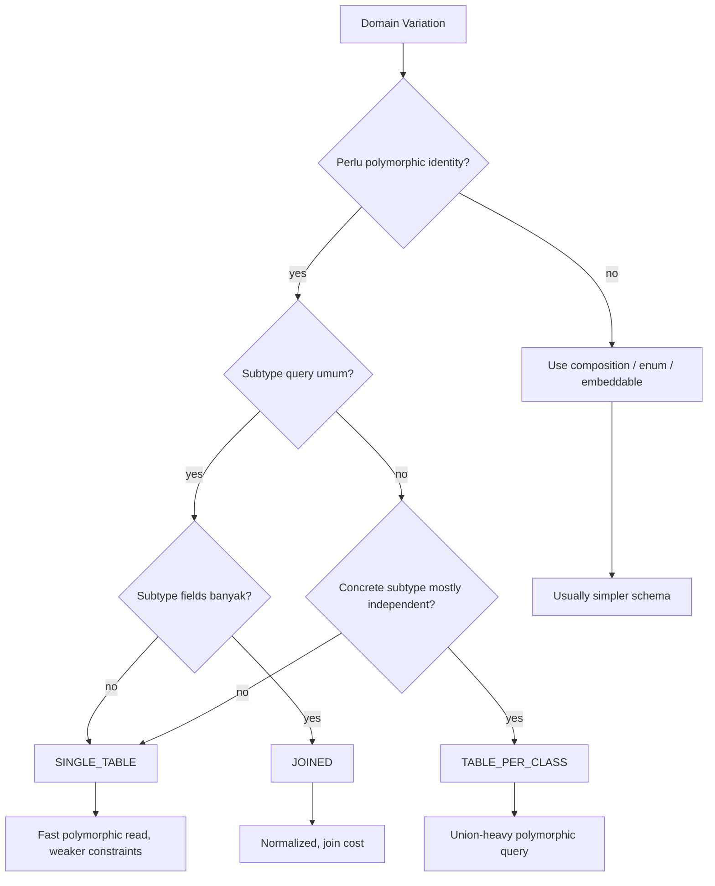
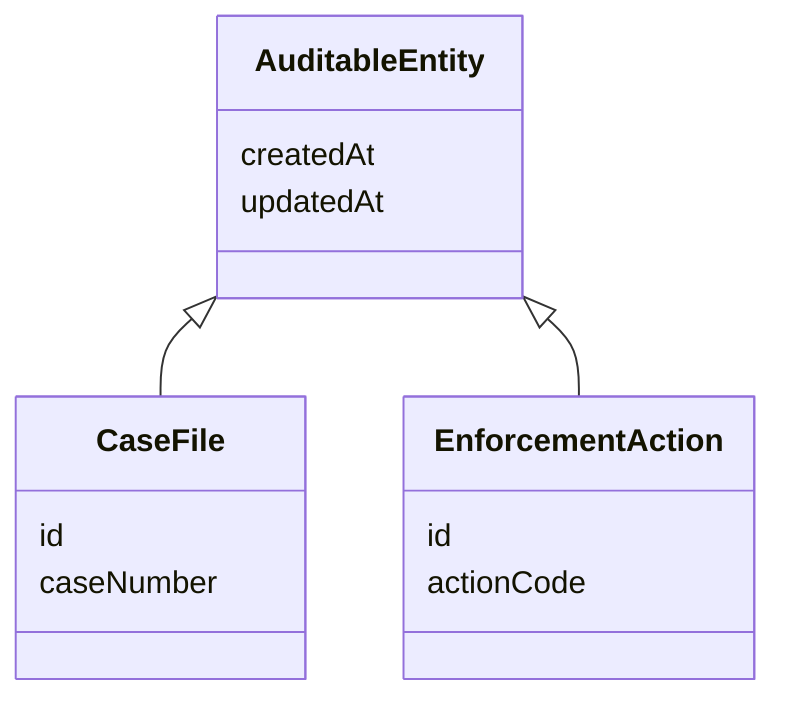
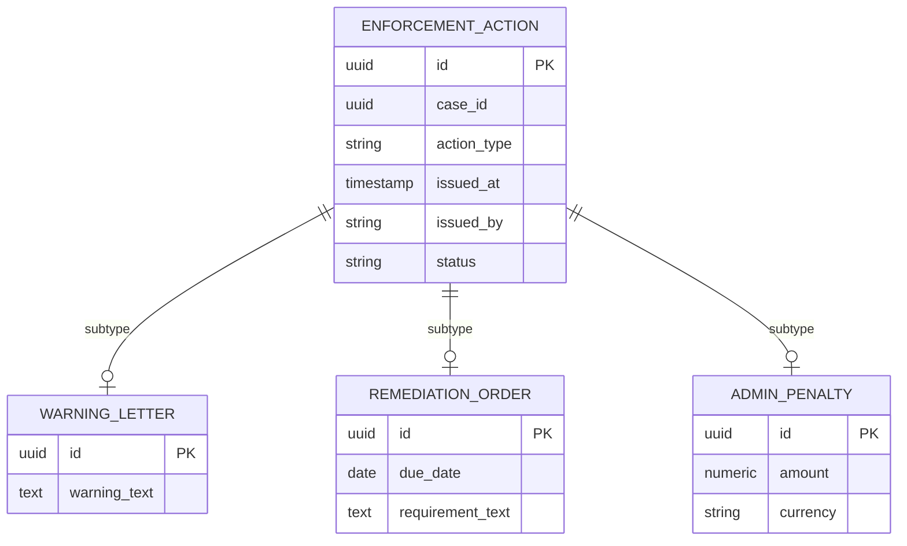
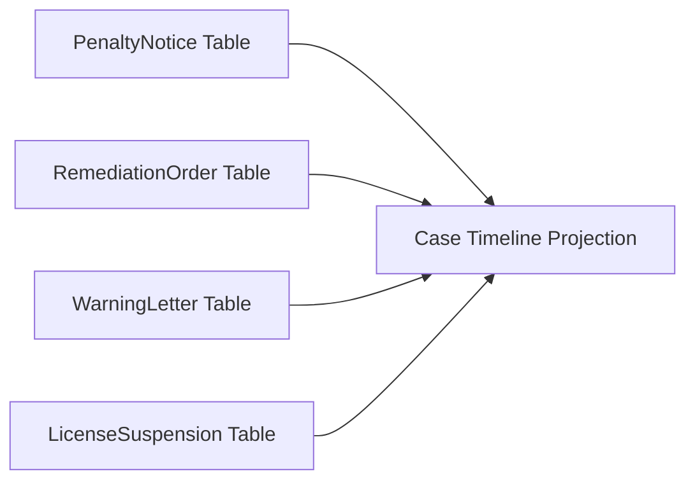

# Part 009 — Inheritance and Polymorphic Persistence

## 1. Tujuan Part Ini

Part 008 membahas value object, embeddable, dan converter. Sekarang kita masuk ke area yang sering tampak elegan di Java tetapi mahal di database: **inheritance**.

Inheritance di Java adalah mekanisme reuse dan polymorphism. Inheritance di relational database bukan konsep native. Relational database mengenal table, row, key, constraint, join, dan set operation. Ketika kita memaksa hierarchy object masuk ke schema relational, selalu ada kompromi.

Target Part ini bukan sekadar tahu annotation:

```java
@Inheritance(strategy = InheritanceType.SINGLE_TABLE)
```

Targetnya adalah bisa menjawab pertanyaan engineering:

- apakah hierarchy ini benar-benar butuh entity inheritance;
- apakah polymorphic query akan sering dipakai;
- apakah subtype punya lifecycle yang sama;
- apakah constraint bisa ditegakkan di database;
- apakah growth subtype akan merusak table;
- apakah performa query masih predictable;
- apakah model domain lebih cocok composition daripada inheritance;
- apakah reporting/query analytics akan terbebani oleh desain inheritance.



---

## 2. Kaufman Deconstruction: Skill yang Harus Dipisah

Agar inheritance persistence tidak menjadi “annotation-driven modelling”, pecah skill ini menjadi unit-unit kecil:

| Skill | Pertanyaan Praktis |
|---|---|
| Domain classification | Apakah variasi ini memang subtype, atau hanya status/type? |
| Relational modelling | Bagaimana table dan constraint akan terlihat? |
| JPA mapping semantics | Annotation mana yang mengubah SQL dan identity? |
| Query prediction | SQL apa yang keluar untuk polymorphic query? |
| Constraint reasoning | Invariant subtype bisa ditegakkan di database atau hanya aplikasi? |
| Evolution planning | Apa yang terjadi saat subtype baru ditambahkan? |
| Performance modelling | Apakah query butuh join, union, atau nullable wide table? |
| Refactoring judgement | Kapan pindah dari inheritance ke composition? |

Kaufman-style practice untuk part ini: setiap kali melihat class hierarchy, jangan mulai dari annotation. Mulai dari empat gambar:

1. gambar object hierarchy;
2. gambar table schema;
3. gambar query paling umum;
4. gambar schema evolution 12 bulan ke depan.

Jika empat gambar itu tidak masuk akal, annotation yang dipilih kemungkinan juga salah.

---

## 3. Mental Model: Java Inheritance vs Relational Shape

### 3.1 Java melihat subtype sebagai substitutability

Misalnya:

```java
abstract class PaymentMethod {
    Long id;
    String label;
}

class CardPaymentMethod extends PaymentMethod {
    String maskedPan;
    String network;
}

class BankAccountPaymentMethod extends PaymentMethod {
    String iban;
    String bankName;
}
```

Di Java, `CardPaymentMethod` dan `BankAccountPaymentMethod` bisa diperlakukan sebagai `PaymentMethod`.

```java
List<PaymentMethod> methods = repository.findAllActiveMethods(customerId);
```

Object model bertanya:

> “Apakah semua subtype bisa dipakai lewat abstraction yang sama?”

Relational model bertanya:

> “Di table mana kolom `masked_pan`, `iban`, dan `network` disimpan?”

Dua pertanyaan ini tidak sama.

---

### 3.2 Relational database tidak punya inheritance bawaan

Relational database bisa meniru inheritance melalui beberapa bentuk:

| Shape | Deskripsi |
|---|---|
| Single table | Semua subtype dalam satu table, dibedakan discriminator |
| Joined tables | Common fields di parent table, subtype fields di child table |
| Table per concrete class | Tiap concrete subtype punya table sendiri |
| No entity inheritance | Composition, enum type, JSON, embeddable, atau explicit association |

JPA menyediakan beberapa strategi standar:

- `SINGLE_TABLE`
- `JOINED`
- `TABLE_PER_CLASS`
- `@MappedSuperclass`

Hibernate juga punya fitur tambahan seperti `@DiscriminatorFormula`, `@Any`, dan mapping-specific optimization, tetapi part ini akan menjaga batas antara standard JPA dan provider-specific.

---

## 4. Jangan Mulai dari `@Inheritance`

Kesalahan umum:

```java
@Entity
@Inheritance(strategy = InheritanceType.JOINED)
public abstract class CaseActor {
    @Id
    private Long id;
}
```

Lalu setelah beberapa bulan:

- query lambat karena join berlapis;
- subtype makin banyak;
- sebagian subtype tidak punya behavior khusus;
- reporting sulit;
- foreign key ke subtype membingungkan;
- constraint berbeda tiap subtype tidak jelas;
- developer tidak tahu apakah harus repository parent atau repository subtype.

Masalahnya bukan `JOINED`. Masalahnya adalah inheritance dipilih sebelum memahami boundary.

Gunakan pertanyaan ini sebelum memilih inheritance:

1. Apakah parent adalah konsep domain nyata, bukan hanya technical base class?
2. Apakah subtype memiliki identity dan lifecycle yang sama?
3. Apakah query terhadap parent umum dan penting?
4. Apakah subtype akan sering ditambah?
5. Apakah subtype punya field berbeda yang wajib `NOT NULL`?
6. Apakah constraint subtype harus enforceable di database?
7. Apakah external API perlu tahu hierarchy ini?
8. Apakah domain lebih stabil dengan composition?

Jika sebagian besar jawabannya tidak jelas, jangan pakai entity inheritance dulu.

---

## 5. `@MappedSuperclass`: Reuse Mapping, Bukan Polymorphism

`@MappedSuperclass` sering disalahpahami sebagai inheritance persistence. Sebenarnya ini lebih dekat ke **mapping reuse**.

```java
@MappedSuperclass
public abstract class AuditableEntity {

    @Column(name = "created_at", nullable = false, updatable = false)
    private Instant createdAt;

    @Column(name = "updated_at", nullable = false)
    private Instant updatedAt;
}

@Entity
@Table(name = "case_file")
public class CaseFile extends AuditableEntity {
    @Id
    private UUID id;

    private String caseNumber;
}

@Entity
@Table(name = "enforcement_action")
public class EnforcementAction extends AuditableEntity {
    @Id
    private UUID id;

    private String actionCode;
}
```

Yang terjadi:

- tidak ada table `auditable_entity`;
- field dari superclass dipetakan ke table subclass;
- superclass tidak bisa di-query sebagai entity;
- tidak ada polymorphic association ke `AuditableEntity`;
- tidak ada repository untuk `AuditableEntity` sebagai persistent entity.



Relational shape:

```sql
create table case_file (
    id uuid primary key,
    case_number varchar(64) not null,
    created_at timestamp not null,
    updated_at timestamp not null
);

create table enforcement_action (
    id uuid primary key,
    action_code varchar(64) not null,
    created_at timestamp not null,
    updated_at timestamp not null
);
```

### 5.1 Kapan cocok?

Gunakan `@MappedSuperclass` untuk:

- audit fields;
- tenant fields;
- version field;
- technical id jika benar-benar seragam;
- common mapping metadata;
- lifecycle callbacks yang aman dibagi.

### 5.2 Kapan tidak cocok?

Jangan gunakan jika Anda butuh:

- query `select a from AuditableEntity a`;
- association ke parent;
- foreign key ke parent;
- polymorphic collection;
- shared parent table;
- constraint lintas subtype.

### 5.3 Pitfall: Base entity terlalu kaya

Anti-pattern:

```java
@MappedSuperclass
public abstract class BaseEntity {
    @Id
    @GeneratedValue
    private Long id;

    @Version
    private long version;

    private Instant createdAt;
    private Instant updatedAt;
    private String createdBy;
    private String updatedBy;
    private Boolean deleted;
    private String tenantId;

    // equals/hashCode, domain events, soft delete, etc.
}
```

Ini membuat semua entity dipaksa punya lifecycle yang sama. Dalam sistem besar, tidak semua table cocok dengan:

- generated id yang sama;
- soft delete;
- tenant discriminator;
- audit semantics;
- optimistic locking;
- mutable lifecycle.

Lebih aman pecah menjadi base class kecil atau interface marker domain-level yang tidak selalu menjadi mapping inheritance.

---

## 6. `SINGLE_TABLE`: Satu Table untuk Semua Subtype

### 6.1 Bentuk mapping

```java
@Entity
@Table(name = "payment_method")
@Inheritance(strategy = InheritanceType.SINGLE_TABLE)
@DiscriminatorColumn(name = "method_type", discriminatorType = DiscriminatorType.STRING)
public abstract class PaymentMethod {

    @Id
    private UUID id;

    @Column(name = "customer_id", nullable = false)
    private UUID customerId;

    @Column(name = "label", nullable = false)
    private String label;
}

@Entity
@DiscriminatorValue("CARD")
public class CardPaymentMethod extends PaymentMethod {

    @Column(name = "masked_pan")
    private String maskedPan;

    @Column(name = "network")
    private String network;
}

@Entity
@DiscriminatorValue("BANK_ACCOUNT")
public class BankAccountPaymentMethod extends PaymentMethod {

    @Column(name = "iban")
    private String iban;

    @Column(name = "bank_name")
    private String bankName;
}
```

Relational shape:

```sql
create table payment_method (
    id uuid primary key,
    method_type varchar(32) not null,
    customer_id uuid not null,
    label varchar(255) not null,
    masked_pan varchar(32),
    network varchar(32),
    iban varchar(64),
    bank_name varchar(255)
);
```

### 6.2 Apa yang bagus dari `SINGLE_TABLE`?

`SINGLE_TABLE` biasanya paling cepat untuk polymorphic read karena semua data berada dalam satu table.

Query parent:

```java
select p from PaymentMethod p where p.customerId = :customerId
```

SQL konseptual:

```sql
select *
from payment_method
where customer_id = ?;
```

Tidak perlu join ke table subtype. Tidak perlu union. Untuk read path yang sering mengambil berbagai subtype bersama-sama, ini sangat praktis.

### 6.3 Trade-off utama

Kelemahannya:

- table melebar seiring subtype bertambah;
- banyak nullable column;
- constraint subtype sulit diekspresikan;
- data model terlihat kurang normalized;
- column subtype bisa membingungkan reporting;
- index design bisa menjadi campuran antara common dan subtype-specific query.

Masalah terbesar adalah constraint.

Misalnya untuk card, `masked_pan` wajib. Untuk bank account, `iban` wajib. Tetapi satu table membuat `masked_pan` nullable karena row bank account tidak punya `masked_pan`.

Solusi database-level bisa berupa check constraint:

```sql
alter table payment_method add constraint chk_payment_method_card
check (
    method_type <> 'CARD'
    or (masked_pan is not null and network is not null)
);

alter table payment_method add constraint chk_payment_method_bank
check (
    method_type <> 'BANK_ACCOUNT'
    or (iban is not null and bank_name is not null)
);
```

Jika database dan migration discipline mendukung, `SINGLE_TABLE` bisa tetap kuat. Jika tidak, invariant subtype hanya hidup di aplikasi.

---

## 7. `SINGLE_TABLE` Decision Framework

Gunakan `SINGLE_TABLE` jika:

- subtype relatif sedikit;
- common fields dominan;
- polymorphic query sering;
- subtype fields tidak terlalu banyak;
- constraint subtype bisa diterima lewat check constraint atau application validation;
- latency read penting;
- hierarchy cukup stabil.

Hindari `SINGLE_TABLE` jika:

- subtype bertambah terus;
- tiap subtype punya puluhan field;
- subtype constraint sangat berbeda;
- data ownership/lifecycle berbeda;
- security visibility berbeda per subtype;
- table akan menjadi “god table”.

### 7.1 Example cocok

```java
sealed interface CaseNote permits ManualNote, SystemNote, ImportedNote {
}
```

Jika semua note punya common fields besar:

- `case_id`
- `message`
- `created_at`
- `created_by`
- `source_type`

Dan subtype field kecil, `SINGLE_TABLE` bisa bagus.

### 7.2 Example tidak cocok

`RegulatoryInstrument` dengan subtype:

- `InspectionWarrant`
- `PenaltyNotice`
- `RemediationOrder`
- `LicenseSuspension`
- `CourtReferral`
- `AdministrativeWarning`

Masing-masing punya lifecycle, approval, effective date, legal text, evidence references, appeal rules, dan reporting yang berbeda. `SINGLE_TABLE` akan cepat menjadi table yang terlalu luas dan constraint-nya sulit dijaga.

---

## 8. `JOINED`: Parent Table + Subtype Table

### 8.1 Bentuk mapping

```java
@Entity
@Table(name = "regulatory_action")
@Inheritance(strategy = InheritanceType.JOINED)
@DiscriminatorColumn(name = "action_type")
public abstract class RegulatoryAction {

    @Id
    private UUID id;

    @Column(name = "case_id", nullable = false)
    private UUID caseId;

    @Column(name = "issued_at", nullable = false)
    private Instant issuedAt;
}

@Entity
@Table(name = "penalty_notice")
@DiscriminatorValue("PENALTY_NOTICE")
public class PenaltyNotice extends RegulatoryAction {

    @Column(name = "amount", nullable = false)
    private BigDecimal amount;

    @Column(name = "currency", nullable = false)
    private String currency;
}

@Entity
@Table(name = "remediation_order")
@DiscriminatorValue("REMEDIATION_ORDER")
public class RemediationOrder extends RegulatoryAction {

    @Column(name = "due_date", nullable = false)
    private LocalDate dueDate;

    @Column(name = "requirement_text", nullable = false)
    private String requirementText;
}
```

Relational shape:

```sql
create table regulatory_action (
    id uuid primary key,
    action_type varchar(64) not null,
    case_id uuid not null,
    issued_at timestamp not null
);

create table penalty_notice (
    id uuid primary key references regulatory_action(id),
    amount numeric(19, 2) not null,
    currency char(3) not null
);

create table remediation_order (
    id uuid primary key references regulatory_action(id),
    due_date date not null,
    requirement_text text not null
);
```

### 8.2 Apa yang bagus dari `JOINED`?

`JOINED` lebih normalized:

- common fields ada di parent table;
- subtype fields ada di subtype table;
- `NOT NULL` subtype lebih mudah;
- subtype table lebih jelas untuk reporting;
- perubahan subtype tidak selalu melebar parent table;
- subtype bisa diberi index/constraint khusus.

### 8.3 Trade-off utama

Biayanya adalah join.

Query subtype:

```java
select p from PenaltyNotice p where p.caseId = :caseId
```

SQL konseptual:

```sql
select ra.*, pn.*
from regulatory_action ra
join penalty_notice pn on pn.id = ra.id
where ra.case_id = ?;
```

Query parent polymorphic bisa lebih mahal:

```java
select a from RegulatoryAction a where a.caseId = :caseId
```

Provider bisa perlu join ke subtype table, atau melakukan SQL yang lebih kompleks, tergantung kebutuhan data dan provider.

### 8.4 Kapan cocok?

Gunakan `JOINED` jika:

- parent adalah konsep domain nyata;
- subtype punya field wajib yang berbeda;
- subtype table butuh constraint kuat;
- polymorphic query ada tetapi tidak ekstrem high-throughput;
- normalisasi lebih penting daripada read simplicity;
- hierarchy cukup stabil;
- reporting membutuhkan table subtype yang jelas.

### 8.5 Kapan berbahaya?

Hindari `JOINED` jika:

- read path selalu mengambil list parent berukuran besar;
- hierarchy punya banyak level;
- subtype sangat banyak;
- latency budget ketat;
- query parent sering disortir/filter berdasarkan field subtype;
- tim tidak rutin membaca execution plan.

---

## 9. `TABLE_PER_CLASS`: Table Per Concrete Entity

### 9.1 Bentuk mapping

```java
@Entity
@Inheritance(strategy = InheritanceType.TABLE_PER_CLASS)
public abstract class NotificationTarget {

    @Id
    protected UUID id;

    @Column(name = "case_id", nullable = false)
    protected UUID caseId;
}

@Entity
@Table(name = "email_notification_target")
public class EmailNotificationTarget extends NotificationTarget {

    @Column(name = "email", nullable = false)
    private String email;
}

@Entity
@Table(name = "sms_notification_target")
public class SmsNotificationTarget extends NotificationTarget {

    @Column(name = "phone_number", nullable = false)
    private String phoneNumber;
}
```

Relational shape:

```sql
create table email_notification_target (
    id uuid primary key,
    case_id uuid not null,
    email varchar(255) not null
);

create table sms_notification_target (
    id uuid primary key,
    case_id uuid not null,
    phone_number varchar(32) not null
);
```

Tidak ada shared parent table.

### 9.2 Query subtype bagus

```java
select e from EmailNotificationTarget e where e.caseId = :caseId
```

SQL:

```sql
select *
from email_notification_target
where case_id = ?;
```

Sederhana.

### 9.3 Query parent mahal

```java
select n from NotificationTarget n where n.caseId = :caseId
```

SQL konseptual:

```sql
select id, case_id, email as address, 'EMAIL' as target_type
from email_notification_target
where case_id = ?
union all
select id, case_id, phone_number as address, 'SMS' as target_type
from sms_notification_target
where case_id = ?;
```

`TABLE_PER_CLASS` membuat polymorphic query menjadi union. Itu bisa mahal, sulit dioptimasi, dan makin buruk saat subtype bertambah.

### 9.4 Kapan cocok?

Gunakan dengan sangat selektif:

- subtype hampir independen;
- query selalu spesifik subtype;
- parent jarang di-query;
- tidak butuh shared foreign key ke parent table;
- schema concrete subtype lebih penting daripada polymorphic query;
- jumlah subtype kecil dan stabil.

### 9.5 Kapan tidak cocok?

Hindari jika:

- repository parent sering dipakai;
- perlu pagination parent;
- perlu sorting lintas subtype;
- subtype terus bertambah;
- identity generation perlu konsisten lintas table;
- banyak foreign key mengarah ke parent abstraction.

---

## 10. `@Inheritance` dan `@DiscriminatorColumn`

Discriminator adalah column yang memberi tahu provider subtype mana yang harus dibuat.

```java
@DiscriminatorColumn(
    name = "action_type",
    discriminatorType = DiscriminatorType.STRING,
    length = 64
)
```

### 10.1 Gunakan string yang stabil

Baik:

```java
@DiscriminatorValue("PENALTY_NOTICE")
```

Buruk:

```java
@DiscriminatorValue("PenaltyNotice")
```

Kenapa? Karena class name bisa berubah. Discriminator adalah data contract. Perlakukan seperti enum database yang stabil.

### 10.2 Jangan jadikan discriminator sebagai domain field tanpa sadar

Kadang developer menambahkan field:

```java
@Column(name = "action_type")
private String actionType;
```

Padahal column itu sudah dipakai provider sebagai discriminator. Ini bisa menimbulkan mapping conflict atau semantic duplication.

Jika domain butuh type, biasanya cukup pakai polymorphism:

```java
public abstract ActionType type();
```

Atau method di subtype:

```java
@Override
public ActionType type() {
    return ActionType.PENALTY_NOTICE;
}
```

---

## 11. Polymorphic Query: Hidden Cost

### 11.1 Query parent berarti query seluruh hierarchy

```java
select a from RegulatoryAction a
```

Ini bukan “select dari parent class” secara Java. Ini query terhadap semua entity dalam hierarchy.

Konsekuensinya tergantung strategi:

| Strategy | Query parent |
|---|---|
| `SINGLE_TABLE` | select dari satu table dengan discriminator |
| `JOINED` | parent table + subtype resolution/join |
| `TABLE_PER_CLASS` | union antar concrete table |

### 11.2 `type()` di JPQL

JPA mendukung filtering berdasarkan entity type:

```java
select a
from RegulatoryAction a
where type(a) = PenaltyNotice
```

Atau:

```java
select a
from RegulatoryAction a
where type(a) in (PenaltyNotice, RemediationOrder)
```

Ini berguna, tetapi jangan dipakai untuk menutupi desain yang salah. Jika setiap query parent selalu difilter ke subtype tertentu, mungkin repository subtype lebih tepat.

### 11.3 `treat()` untuk downcast

JPQL mendukung `treat` untuk memperlakukan expression sebagai subtype.

```java
select a
from RegulatoryAction a
where treat(a as PenaltyNotice).amount > :minimumAmount
```

Masalahnya: query seperti ini bisa menghasilkan SQL yang kompleks, terutama pada `JOINED` dan `TABLE_PER_CLASS`. Gunakan untuk kebutuhan yang jelas, bukan sebagai default modelling style.

---

## 12. Repository Design untuk Inheritance

### 12.1 Parent repository

```java
public interface RegulatoryActionRepository
        extends JpaRepository<RegulatoryAction, UUID> {

    List<RegulatoryAction> findByCaseId(UUID caseId);
}
```

Cocok jika use case memang polymorphic:

- timeline semua action;
- audit log semua action;
- search semua action;
- count semua action per case;
- display summary lintas subtype.

### 12.2 Subtype repository

```java
public interface PenaltyNoticeRepository
        extends JpaRepository<PenaltyNotice, UUID> {

    List<PenaltyNotice> findByCaseId(UUID caseId);
}
```

Cocok jika use case subtype-specific:

- issue penalty notice;
- calculate penalty total;
- amend penalty notice;
- export penalty-specific report.

### 12.3 Jangan campur command model secara sembarangan

Buruk:

```java
public void updateAction(RegulatoryAction action) {
    repository.save(action);
}
```

Ini membuat command terlalu generic. Regulatory action yang berbeda biasanya punya invariant berbeda.

Lebih baik:

```java
public void issuePenaltyNotice(IssuePenaltyNotice command) {
    CaseFile caseFile = caseRepository.getForUpdate(command.caseId());
    PenaltyNotice notice = PenaltyNotice.issue(...);
    penaltyNoticeRepository.save(notice);
}
```

Parent abstraction lebih aman untuk read model dan timeline. Subtype lebih aman untuk command behavior.

---

## 13. Inheritance vs Composition

Banyak inheritance di JPA sebenarnya bisa menjadi composition.

### 13.1 Inheritance-heavy design

```java
@Entity
@Inheritance(strategy = InheritanceType.SINGLE_TABLE)
public abstract class CaseParticipant {
    @Id
    private UUID id;
}

@Entity
public class IndividualParticipant extends CaseParticipant {
    private String firstName;
    private String lastName;
}

@Entity
public class OrganizationParticipant extends CaseParticipant {
    private String registrationNumber;
    private String legalName;
}
```

### 13.2 Composition alternative

```java
@Entity
@Table(name = "case_participant")
public class CaseParticipant {

    @Id
    private UUID id;

    @Enumerated(EnumType.STRING)
    @Column(name = "participant_kind", nullable = false)
    private ParticipantKind kind;

    @Embedded
    private PersonName personName;

    @Embedded
    private OrganizationIdentity organizationIdentity;
}
```

Atau explicit association:

```java
@Entity
public class CaseParticipant {
    @Id
    private UUID id;

    @ManyToOne(fetch = FetchType.LAZY)
    private Party party;

    @Enumerated(EnumType.STRING)
    private ParticipantRole role;
}
```

Inheritance cocok jika subtype benar-benar punya behavior dan identity polymorphic. Composition cocok jika variasi hanyalah data shape atau role.

---

## 14. Regulatory Domain Example: Enforcement Action

Bayangkan sistem enforcement lifecycle punya beberapa action:

- warning letter;
- remediation order;
- administrative penalty;
- license suspension;
- prosecution referral.

### 14.1 Pertanyaan domain

Apakah semua ini `EnforcementAction`?

Mungkin iya untuk timeline:

```java
caseFile.actions();
```

Tetapi untuk command:

- issue warning;
- issue penalty;
- suspend license;
- refer prosecution;

semuanya punya invariant berbeda.

### 14.2 Mapping pilihan

Jika action timeline sangat penting dan fields common cukup besar, `JOINED` bisa masuk akal:



Jika action subtype punya lifecycle sangat berbeda dan jarang di-query bersama, lebih baik separate aggregate/table + timeline projection:



Ini penting: kebutuhan read polymorphism tidak selalu harus diselesaikan dengan entity inheritance. Bisa diselesaikan dengan projection table, event-sourced timeline, atau read model.

---

## 15. Sealed Classes dan JPA

Java modern punya sealed classes:

```java
public sealed abstract class RegulatoryAction
        permits PenaltyNotice, RemediationOrder {
}
```

Secara domain, sealed hierarchy menarik karena subtype terbatas dan eksplisit.

Namun untuk JPA, hati-hati:

- entity biasanya perlu constructor no-arg minimal protected;
- provider perlu membuat proxy/enhanced class;
- sealed class dapat berinteraksi buruk dengan proxying tergantung provider dan konfigurasi;
- lazy loading subclass/proxy bisa menjadi isu.

Prinsip praktis:

- gunakan sealed class untuk pure domain model jika persistence dipisah;
- untuk JPA entity, validasi compatibility provider sebelum menjadikannya standar;
- jangan mengorbankan persistence behavior hanya demi syntax modern.

---

## 16. Equality dan Inheritance

Entity equality sudah sulit. Dengan inheritance, makin sulit.

Anti-pattern:

```java
@Override
public boolean equals(Object o) {
    if (!(o instanceof RegulatoryAction other)) return false;
    return Objects.equals(id, other.id);
}
```

Masalah:

- dua subtype berbeda bisa dianggap equal jika id sama;
- proxy class bisa membuat `getClass()` comparison gagal;
- generated id null pada transient entity membuat equality unstable.

Pendekatan aman:

- gunakan identity database hanya setelah assigned;
- jangan masukkan mutable fields ke equality entity;
- pertimbangkan business key hanya jika benar-benar immutable dan globally unique;
- hati-hati dengan `getClass()` pada proxy;
- jangan pakai entity sebagai key di hash collection sebelum id stabil.

Untuk hierarchy, pastikan apakah equality bersifat:

- same root identity;
- same concrete subtype identity;
- same natural key.

Tidak ada jawaban universal. Yang penting invariant-nya eksplisit.

---

## 17. Foreign Key ke Hierarchy

### 17.1 FK ke parent table mudah pada `JOINED`

Dengan `JOINED`, table lain bisa reference parent:

```sql
create table action_attachment (
    id uuid primary key,
    action_id uuid not null references regulatory_action(id),
    file_id uuid not null
);
```

Ini cocok jika attachment bisa dimiliki semua subtype.

### 17.2 FK pada `SINGLE_TABLE`

FK ke root table juga mudah:

```sql
create table payment_token (
    id uuid primary key,
    payment_method_id uuid not null references payment_method(id)
);
```

Tetapi jika token hanya valid untuk card, database perlu constraint tambahan untuk memastikan referenced row `method_type = 'CARD'`. Foreign key biasa tidak cukup.

### 17.3 FK pada `TABLE_PER_CLASS`

Tidak ada parent table. FK polymorphic sulit.

Pilihan buruk:

```sql
target_type varchar(32),
target_id uuid
```

Ini bukan foreign key sejati. Integrity pindah ke aplikasi.

Karena itu, `TABLE_PER_CLASS` tidak cocok untuk model yang banyak di-reference secara polymorphic.

---

## 18. Migration Cost per Strategy

### 18.1 Menambah subtype di `SINGLE_TABLE`

Perubahan:

- tambah nullable columns;
- tambah discriminator value;
- tambah check constraint;
- tambah index subtype-specific jika perlu.

Risiko:

- table makin lebar;
- migration table besar bisa mahal;
- constraint baru harus kompatibel dengan existing rows.

### 18.2 Menambah subtype di `JOINED`

Perubahan:

- tambah subtype table;
- tambah discriminator value;
- tambah repository/use case;
- mungkin tambah join path.

Risiko:

- parent query makin kompleks;
- subtype table lifecycle perlu migration sendiri;
- query parent perlu diuji ulang.

### 18.3 Menambah subtype di `TABLE_PER_CLASS`

Perubahan:

- tambah concrete table;
- polymorphic query union bertambah;
- ID generator harus tetap aman.

Risiko:

- parent pagination dan sorting makin mahal;
- analytics lintas subtype makin sulit.

---

## 19. Query Plan Consequence

Inheritance bukan hanya mapping. Ia memengaruhi query planner.

| Use Case | SINGLE_TABLE | JOINED | TABLE_PER_CLASS |
|---|---|---|---|
| Find by id parent | Sangat sederhana | Parent + subtype | Union / subtype lookup |
| List all parent | Satu table | Join/subtype resolution | Union all |
| List subtype | Filter discriminator | Join parent-subtype | Satu table |
| Constraint subtype | Sulit tanpa check | Baik | Baik per table |
| Add subtype | Tambah columns | Tambah table | Tambah table |
| Wide subtype fields | Buruk | Baik | Baik |
| Reporting common fields | Baik | Baik | Perlu union/view |
| Reporting subtype fields | Campuran | Baik | Baik per subtype |

Praktik production:

- capture generated SQL;
- lihat execution plan;
- ukur query parent dan subtype;
- uji pagination;
- uji index selectivity dengan discriminator;
- jangan mengandalkan intuition Java.

---

## 20. Anti-Pattern: Abstract Base Entity Sebagai Domain Dumping Ground

```java
@Entity
@Inheritance(strategy = InheritanceType.SINGLE_TABLE)
public abstract class WorkflowItem {
    @Id
    private UUID id;

    private String status;
    private String assignedTo;
    private Instant dueAt;
    private Instant completedAt;
    private String rejectionReason;
    private String approvalComment;
    private String escalationLevel;
}
```

Lalu subtype:

```java
class InspectionTask extends WorkflowItem {}
class LegalReview extends WorkflowItem {}
class PaymentApproval extends WorkflowItem {}
class EvidenceRequest extends WorkflowItem {}
```

Masalah:

- parent punya fields yang tidak berlaku untuk semua subtype;
- status semantics berbeda;
- workflow transition berbeda;
- nullable columns makin banyak;
- service layer penuh `instanceof`;
- invariant bocor ke if/else.

Alternatif:

- model workflow as state machine separate;
- subtype-specific aggregate;
- common read model untuk task inbox;
- domain event untuk timeline.

---

## 21. Anti-Pattern: Inheritance untuk Role

Buruk:

```java
@Entity
@Inheritance(strategy = InheritanceType.SINGLE_TABLE)
public abstract class User {
    @Id
    private UUID id;
}

@Entity
public class Investigator extends User {}

@Entity
public class Supervisor extends User {}

@Entity
public class Admin extends User {}
```

Role bukan subtype identity. Role biasanya assignment dinamis.

Lebih baik:

```java
@Entity
public class UserAccount {
    @Id
    private UUID id;

    @ElementCollection
    @Enumerated(EnumType.STRING)
    private Set<Role> roles;
}
```

Atau table role:

```sql
create table user_account (...);
create table user_role (
    user_id uuid not null references user_account(id),
    role_code varchar(64) not null,
    primary key (user_id, role_code)
);
```

Jika seseorang bisa berubah dari investigator ke supervisor, itu bukan inheritance. Itu state/role assignment.

---

## 22. Anti-Pattern: Inheritance untuk Status

Buruk:

```java
abstract class CaseFile {}
class DraftCaseFile extends CaseFile {}
class OpenCaseFile extends CaseFile {}
class ClosedCaseFile extends CaseFile {}
```

Status adalah state machine, bukan subtype, kecuali state benar-benar mengubah representation dan lifecycle secara fundamental.

Lebih baik:

```java
@Entity
public class CaseFile {
    @Enumerated(EnumType.STRING)
    private CaseStatus status;

    public void assignInvestigator(...) {
        if (status != CaseStatus.OPEN) {
            throw new InvalidCaseTransition(...);
        }
    }
}
```

Untuk state machine kompleks, gunakan explicit transition model, bukan entity inheritance.

---

## 23. Provider-Specific Notes: Hibernate

Hibernate mendukung strategi standar JPA dan memiliki beberapa tambahan.

Yang sering muncul:

- discriminator formula;
- implicit discriminator handling;
- bytecode enhancement;
- proxy behavior;
- lazy loading detail;
- union-subclass strategy behavior;
- batch fetching pada inheritance hierarchy.

Prinsip:

- gunakan fitur Hibernate-specific jika memberi value nyata;
- dokumentasikan portability cost;
- tulis integration test yang mengunci SQL behavior penting;
- jangan campur provider feature ke domain model tanpa alasan.

Contoh feature-specific yang perlu hati-hati:

```java
@org.hibernate.annotations.DiscriminatorFormula("case when deleted = false then 'ACTIVE' else 'DELETED' end")
```

Ini powerful, tetapi data classification sekarang tergantung SQL expression. Pastikan semua developer paham consequence-nya.

---

## 24. Decision Matrix

| Kondisi | Pilihan Awal |
|---|---|
| Hanya reuse audit/id fields | `@MappedSuperclass` |
| Parent tidak perlu di-query | Hindari entity inheritance; pakai mapped superclass/composition |
| Banyak polymorphic read, subtype field sedikit | `SINGLE_TABLE` |
| Butuh subtype constraint kuat, common parent nyata | `JOINED` |
| Subtype independen, parent query jarang | `TABLE_PER_CLASS` atau no inheritance |
| Role/status variasi | Enum/state machine/composition |
| Subtype sering bertambah | Hindari `SINGLE_TABLE` wide table; evaluasi separate aggregate + read model |
| Reporting lintas subtype dominan | `SINGLE_TABLE`, `JOINED`, atau explicit projection/view |
| Command behavior sangat berbeda | Subtype repository/service atau separate aggregate |

---

## 25. Production Checklist

Sebelum merge inheritance mapping, review checklist ini:

### Domain

- [ ] Parent adalah konsep domain nyata.
- [ ] Subtype benar-benar substitutable.
- [ ] Variasi bukan sekadar role/status/type.
- [ ] Lifecycle subtype compatible.
- [ ] Command behavior tidak dipaksa terlalu generic.

### Schema

- [ ] Table shape digambar jelas.
- [ ] Constraint subtype dipahami.
- [ ] Index strategy jelas.
- [ ] Migration untuk subtype baru dipahami.
- [ ] FK polymorphic aman.

### Query

- [ ] Query parent SQL sudah dilihat.
- [ ] Query subtype SQL sudah dilihat.
- [ ] Pagination diuji.
- [ ] Sorting/filtering subtype diuji.
- [ ] Execution plan dibaca dengan data realistis.

### Runtime

- [ ] Lazy/proxy behavior diuji.
- [ ] equals/hashCode aman.
- [ ] Serialization/API tidak membocorkan entity hierarchy mentah.
- [ ] Repository boundary jelas.
- [ ] Testcontainers test mencakup real database behavior.

---

## 26. Latihan Deliberate Practice

### Latihan 1 — Pilih strategy

Modelkan `NotificationTarget`:

- email;
- SMS;
- push notification;
- postal letter.

Tentukan apakah memakai:

- `SINGLE_TABLE`;
- `JOINED`;
- `TABLE_PER_CLASS`;
- composition;
- separate tables + projection.

Tulis alasan berdasarkan:

- query paling umum;
- constraint;
- subtype growth;
- reporting;
- migration.

### Latihan 2 — Reverse engineering SQL

Ambil hierarchy kecil, lalu tulis SQL konseptual untuk:

```java
findById(parentId)
findAllByCaseId(caseId)
findAllPenaltyNoticeByCaseId(caseId)
countByCaseId(caseId)
```

Bandingkan SQL untuk setiap strategy.

### Latihan 3 — Constraint review

Untuk `SINGLE_TABLE`, tulis check constraint agar field subtype wajib sesuai discriminator.

### Latihan 4 — Refactor inheritance ke composition

Ambil hierarchy role/status. Refactor ke enum, embeddable, atau association table.

---

## 27. Ringkasan

Inheritance persistence adalah alat yang powerful tetapi mahal.

Mental model utama:

- Java inheritance menyelesaikan substitutability;
- relational database butuh table shape dan constraint;
- JPA inheritance menjembatani keduanya dengan kompromi;
- setiap strategy mengoptimalkan hal berbeda;
- polymorphic query punya biaya nyata;
- inheritance sering kalah dari composition untuk role, status, dan variasi data sederhana;
- production-grade ORM design harus memprediksi SQL, constraint, migration, dan query plan.

Rule of thumb:

- gunakan `@MappedSuperclass` untuk reuse mapping;
- gunakan `SINGLE_TABLE` untuk hierarchy kecil dengan polymorphic read tinggi;
- gunakan `JOINED` untuk subtype constraint dan normalized schema;
- gunakan `TABLE_PER_CLASS` dengan sangat hati-hati;
- hindari inheritance untuk role/status;
- pertimbangkan projection/read model untuk kebutuhan polymorphic read yang tidak harus menjadi polymorphic entity.

Part berikutnya akan membahas **schema generation and migration boundaries**: kapan JPA boleh membuat schema, kapan harus berhenti, bagaimana mengelola Flyway/Liquibase, dan bagaimana melakukan schema evolution production-safe tanpa merusak data.

---

## 28. Referensi

- Jakarta Persistence 3.2 Specification — Object/relational mapping and persistence management.
- Jakarta EE Tutorial — Entity inheritance mapping strategies.
- Hibernate ORM User Guide — Domain model and inheritance mapping.
- Martin Fowler — Patterns of Enterprise Application Architecture, khususnya inheritance mapping patterns.
- Vlad Mihalcea — High-Performance Java Persistence, terutama bagian inheritance dan query performance.
