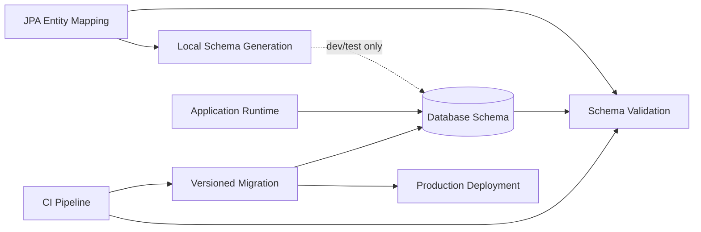
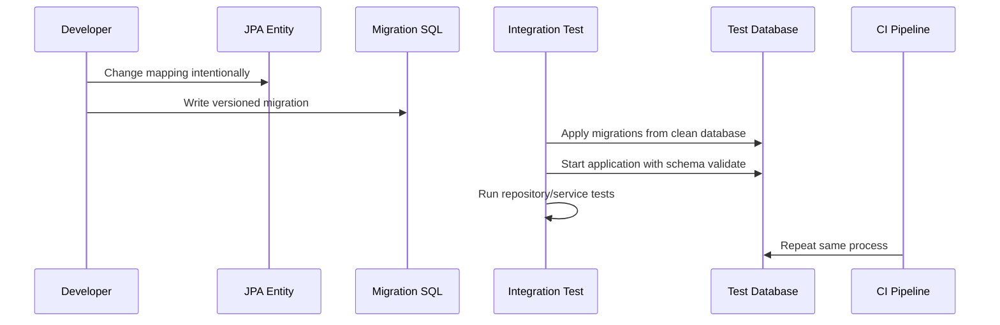
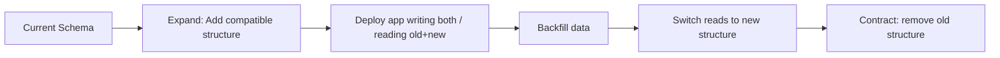

# Part 010 — Schema Generation and Migration Boundaries

## 1. Tujuan Part Ini

Part 009 membahas inheritance dan polymorphic persistence. Semua mapping itu pada akhirnya menghasilkan satu hal yang sangat konkret: **schema database**.

Di level basic, banyak developer memakai:

```properties
spring.jpa.hibernate.ddl-auto=update
```

atau:

```xml
<property name="jakarta.persistence.schema-generation.database.action" value="drop-and-create" />
```

Lalu aplikasi terlihat cepat jalan. Entity dibuat, table muncul, kolom bertambah. Tetapi di production, schema bukan detail teknis. Schema adalah **contract durable** antara aplikasi, database, data historis, migration pipeline, analytics, integration, backup/restore, replication, dan operational tooling.

Target Part ini: Anda mampu menentukan boundary yang benar antara:

- JPA mapping;
- schema generation;
- migration tool;
- production deployment;
- backward-compatible change;
- data migration;
- rollback strategy;
- zero-downtime rollout.



Prinsip inti:

> JPA boleh membantu memahami schema. Migration tool harus menjadi sumber kebenaran perubahan schema production.

---

## 2. Kaufman Deconstruction: Skill yang Harus Dipisah

Schema evolution bukan satu skill. Pecah menjadi skill kecil:

| Skill | Kemampuan yang Dilatih |
|---|---|
| Mapping-to-schema reasoning | Memprediksi DDL dari entity mapping |
| Migration authoring | Menulis migration idempotent secara konseptual dan versioned secara teknis |
| Compatibility modelling | Memastikan app version lama dan baru bisa hidup bersama saat rollout |
| Constraint timing | Menambah `NOT NULL`, FK, unique, check constraint tanpa merusak existing data |
| Data backfill | Mengisi data lama aman, terukur, dan restartable |
| Rollback reasoning | Membedakan rollback code vs rollback schema |
| Validation | Menjadikan JPA validate schema, bukan mengubah diam-diam |
| Observability | Mendeteksi migration lambat, lock, error, dan drift |

Kaufman-style target performance untuk part ini:

Anda tidak hanya bisa menulis `ALTER TABLE`. Anda bisa menjelaskan:

- apa yang terjadi ke existing rows;
- apakah query lama masih jalan;
- apakah app lama bisa membaca schema baru;
- apakah app baru bisa membaca data lama;
- apakah migration mengambil table lock;
- bagaimana rollback jika deployment gagal;
- bagaimana membuktikan schema sesuai entity.

---

## 3. Schema adalah Contract, Bukan Output Sampingan

Entity Java mudah berubah:

```java
@Column(nullable = false)
private String status;
```

Tapi database menyimpan data lama. Jika table sudah berisi 50 juta row, menambah non-null column bukan operasi abstrak.

```sql
alter table case_file add column status varchar(32) not null;
```

Pertanyaannya:

- nilai existing rows apa?
- apakah database mengunci table?
- apakah default value aman?
- apakah aplikasi lama tahu column ini?
- apakah query index terdampak?
- apakah replication lag meningkat?
- apakah rollback bisa dilakukan?

JPA annotation menyatakan desired mapping. Migration menyatakan operational change.

Keduanya tidak boleh dicampur secara naif.

---

## 4. JPA Schema Generation: Apa Fungsinya?

Jakarta Persistence mendefinisikan property untuk schema generation. Provider dapat membuat atau menghapus database artifact berdasarkan mapping.

Secara konseptual, schema generation bisa melakukan:

- create schema;
- drop schema;
- drop-and-create;
- generate SQL script;
- apply DDL ke database;
- validate mapping terhadap schema tergantung provider/config.

Di Hibernate/Spring Boot, konfigurasi populer adalah `ddl-auto`:

```properties
spring.jpa.hibernate.ddl-auto=none
spring.jpa.hibernate.ddl-auto=validate
spring.jpa.hibernate.ddl-auto=update
spring.jpa.hibernate.ddl-auto=create
spring.jpa.hibernate.ddl-auto=create-drop
```

Walaupun nama property Spring/Hibernate berbeda dari property Jakarta Persistence standar, mental modelnya sama: provider diberi hak untuk memperlakukan mapping sebagai sumber schema.

---

## 5. `ddl-auto` Mode Decision

| Mode | Apa yang Dilakukan | Cocok untuk | Bahaya |
|---|---|---|---|
| `none` | Tidak mengubah/validasi schema | Production jika validasi dilakukan terpisah | Drift tidak terdeteksi runtime |
| `validate` | Memeriksa schema sesuai mapping | Production/CI | Tidak memperbaiki schema, hanya fail fast |
| `update` | Mencoba menyesuaikan schema | Prototype lokal | Perubahan tidak versioned, tidak reviewable |
| `create` | Drop/create atau create fresh | Test/dev ephemeral | Menghapus data jika salah environment |
| `create-drop` | Create saat start, drop saat stop | Integration test ephemeral | Fatal jika kena database persistent |

Rule praktis:

- production: `validate` atau `none` + external validation;
- CI integration test: migration + validate;
- local throwaway: `create-drop` boleh;
- prototype cepat: `update` boleh sementara;
- shared dev database: hindari `update`;
- production: jangan gunakan `update`, `create`, atau `create-drop`.

---

## 6. Kenapa `ddl-auto=update` Berbahaya?

`update` tampak nyaman karena otomatis menambah column/table. Tetapi production-grade system membutuhkan perubahan yang:

- eksplisit;
- reviewable;
- versioned;
- repeatable;
- reversible secara operasional;
- diuji di CI;
- dipahami lock dan performance impact-nya.

`update` tidak cukup untuk itu.

### 6.1 Tidak punya intent

Entity berubah:

```java
@Column(name = "case_status")
private String status;
```

Provider mungkin melihat ini sebagai column baru, bukan rename dari `status`.

Akibat:

```sql
alter table case_file add column case_status varchar(255);
```

Data lama tetap di `status`. Aplikasi baru membaca `case_status` null.

Migration manual bisa menyatakan intent:

```sql
alter table case_file rename column status to case_status;
```

atau untuk zero-downtime:

```sql
alter table case_file add column case_status varchar(32);
update case_file set case_status = status where case_status is null;
```

### 6.2 Tidak mengelola data backfill

Tambah field:

```java
@Column(nullable = false)
private String riskLevel;
```

Provider tidak tahu business rule untuk mengisi existing rows:

- default `LOW`?
- derive dari score?
- lookup dari table lain?
- unknown state?
- perlu manual review?

Hanya domain/migration yang tahu.

### 6.3 Tidak versioned

Ketika schema berubah otomatis, review PR kehilangan artifact penting: SQL migration.

Akibat:

- sulit audit;
- sulit reproduce environment;
- sulit debug drift;
- sulit rollback;
- sulit membandingkan staging dan production.

### 6.4 Tidak cukup aman untuk destructive change

Drop column, alter type, rename, split table, merge table, constraint tightening — semua ini butuh rencana. Auto-update tidak bisa memahami konsekuensi bisnis.

---

## 7. Migration Tool sebagai Source of Truth

Di sistem production-grade, perubahan schema harus lewat migration tool seperti Flyway atau Liquibase.

### 7.1 Prinsip versioned migration

Migration file harus:

- punya urutan versi;
- disimpan di version control;
- dijalankan konsisten antar environment;
- memiliki checksum/deteksi perubahan;
- gagal cepat jika ada drift;
- menjadi audit trail perubahan database.

Contoh Flyway naming:

```text
V001__create_case_file.sql
V002__add_case_status.sql
V003__create_enforcement_action.sql
V004__add_case_file_risk_level.sql
```

Contoh migration:

```sql
create table case_file (
    id uuid primary key,
    case_number varchar(64) not null unique,
    status varchar(32) not null,
    created_at timestamp not null,
    updated_at timestamp not null
);
```

### 7.2 JPA mapping mengikuti migration

Entity:

```java
@Entity
@Table(name = "case_file")
public class CaseFile {

    @Id
    private UUID id;

    @Column(name = "case_number", nullable = false, unique = true, length = 64)
    private String caseNumber;

    @Enumerated(EnumType.STRING)
    @Column(name = "status", nullable = false, length = 32)
    private CaseStatus status;
}
```

Mapping dan migration harus konsisten. Tetapi ketika conflict, production truth adalah database schema yang dikelola migration.

---

## 8. Development Workflow yang Aman

Recommended workflow:



Langkah praktis:

1. ubah entity mapping;
2. tulis migration;
3. jalankan database clean via Testcontainers;
4. apply semua migration;
5. start JPA dengan `validate`;
6. jalankan persistence tests;
7. review generated SQL dan execution plan jika query berubah;
8. deploy migration sesuai pipeline.

---

## 9. Schema Validation sebagai Guardrail

Gunakan provider validation untuk mendeteksi mismatch.

Spring Boot example:

```properties
spring.jpa.hibernate.ddl-auto=validate
```

Jika column hilang, type mismatch, atau table tidak sesuai, aplikasi gagal start.

Ini bagus karena fail fast. Tetapi jangan menganggap validate sebagai pengganti migration test. Validate biasanya tidak membuktikan semua hal:

- index sesuai;
- check constraint sesuai;
- FK action sesuai;
- collation sesuai;
- partitioning sesuai;
- trigger sesuai;
- performance aman;
- data valid.

Validation adalah guardrail, bukan full verification.

---

## 10. Entity Annotation Bukan Migration Contract Lengkap

Annotation bisa menulis:

```java
@Column(nullable = false, length = 64, unique = true)
```

Tetapi production DDL perlu lebih kaya:

```sql
create table case_file (
    id uuid primary key,
    case_number varchar(64) not null,
    status varchar(32) not null,
    created_at timestamp not null,
    updated_at timestamp not null,
    constraint uq_case_file_case_number unique (case_number),
    constraint chk_case_file_status check (status in ('DRAFT', 'OPEN', 'CLOSED'))
);

create index idx_case_file_status_created_at
on case_file (status, created_at desc);
```

JPA annotation sering tidak cukup untuk:

- partial index;
- functional index;
- database-specific enum;
- check constraint detail;
- partitioning;
- tablespace/storage option;
- concurrently created index;
- trigger;
- generated column;
- row-level security;
- advanced FK behavior.

Jadi migration harus tetap explicit.

---

## 11. Safe Schema Evolution Pattern

Perubahan schema production sebaiknya backward-compatible. Gunakan pola **expand → migrate → contract**.



### 11.1 Expand

Tambahkan struktur baru tanpa merusak aplikasi lama.

```sql
alter table case_file add column risk_level varchar(32);
```

Jangan langsung `not null` jika existing rows belum punya nilai.

### 11.2 Dual write atau compatible write

Aplikasi baru bisa mulai mengisi column baru:

```java
caseFile.setRiskLevel(calculateRiskLevel(caseFile));
```

Jika rename column, aplikasi transisi mungkin menulis old dan new column.

### 11.3 Backfill

Isi data lama:

```sql
update case_file
set risk_level = 'LOW'
where risk_level is null;
```

Untuk table besar, jangan selalu single massive update. Bisa perlu batch:

```sql
update case_file
set risk_level = 'LOW'
where id in (
    select id
    from case_file
    where risk_level is null
    limit 10000
);
```

Syntax batch berbeda antar database. Prinsipnya: kecil, restartable, observable.

### 11.4 Enforce

Setelah semua row valid:

```sql
alter table case_file alter column risk_level set not null;
```

Tambahkan check constraint:

```sql
alter table case_file add constraint chk_case_file_risk_level
check (risk_level in ('LOW', 'MEDIUM', 'HIGH'));
```

### 11.5 Contract

Hapus struktur lama hanya setelah semua aplikasi tidak memakainya.

```sql
alter table case_file drop column old_risk_score;
```

Contract biasanya migration terpisah dan dilakukan jauh setelah expand.

---

## 12. Example: Menambah Non-Null Column

### 12.1 Buruk

Entity:

```java
@Column(nullable = false)
private String priority;
```

Migration:

```sql
alter table case_file add column priority varchar(32) not null;
```

Ini bisa gagal jika table punya existing rows.

### 12.2 Aman

Migration 1:

```sql
alter table case_file add column priority varchar(32);
```

Deploy aplikasi yang mengisi `priority` untuk row baru.

Backfill:

```sql
update case_file
set priority = 'NORMAL'
where priority is null;
```

Migration 2:

```sql
alter table case_file alter column priority set not null;

alter table case_file add constraint chk_case_file_priority
check (priority in ('LOW', 'NORMAL', 'HIGH', 'URGENT'));
```

Entity final:

```java
@Enumerated(EnumType.STRING)
@Column(name = "priority", nullable = false, length = 32)
private CasePriority priority;
```

---

## 13. Example: Rename Column Tanpa Downtime

Rename langsung:

```sql
alter table case_file rename column status to lifecycle_status;
```

Ini bisa memutus aplikasi lama.

Zero-downtime pattern:

### Step 1 — Expand

```sql
alter table case_file add column lifecycle_status varchar(32);

update case_file
set lifecycle_status = status
where lifecycle_status is null;
```

### Step 2 — Bridge application

Aplikasi versi transisi:

- membaca `lifecycle_status` jika ada;
- fallback ke `status`;
- menulis keduanya.

```java
@Column(name = "status")
private String legacyStatus;

@Column(name = "lifecycle_status")
private String lifecycleStatus;
```

Ini mungkin tidak ingin muncul di domain entity utama. Bisa gunakan temporary migration adapter atau SQL trigger tergantung arsitektur.

### Step 3 — Switch read

Aplikasi baru hanya membaca `lifecycle_status`, tetapi masih mungkin menulis `status` jika rollback dibutuhkan.

### Step 4 — Contract

Setelah aman:

```sql
alter table case_file drop column status;
```

Entity final:

```java
@Column(name = "lifecycle_status", nullable = false, length = 32)
private String status;
```

---

## 14. Example: Split Table

Table awal:

```sql
create table case_file (
    id uuid primary key,
    case_number varchar(64) not null,
    respondent_name varchar(255),
    respondent_registration_number varchar(64),
    respondent_address text
);
```

Domain berkembang. Respondent menjadi entity reusable.

### 14.1 Jangan langsung drop columns

Migration aman:

```sql
create table respondent (
    id uuid primary key,
    name varchar(255) not null,
    registration_number varchar(64),
    address text
);

alter table case_file add column respondent_id uuid;
```

Backfill:

```sql
insert into respondent (id, name, registration_number, address)
select gen_random_uuid(), respondent_name, respondent_registration_number, respondent_address
from case_file
where respondent_name is not null;
```

Lalu update FK. Detail tergantung database dan cara generate mapping id.

### 14.2 Application transition

Selama transisi:

- old columns masih ada;
- new association mulai dipakai;
- backfill diverifikasi;
- constraint ditambah setelah data valid;
- old columns dihapus belakangan.

Final entity:

```java
@ManyToOne(fetch = FetchType.LAZY, optional = false)
@JoinColumn(name = "respondent_id", nullable = false)
private Respondent respondent;
```

---

## 15. Constraint Evolution

Constraint sering lebih berbahaya daripada column.

### 15.1 Unique constraint

Tambah unique constraint pada data existing bisa gagal.

Sebelum migration:

```sql
select case_number, count(*)
from case_file
group by case_number
having count(*) > 1;
```

Jika ada duplicate, putuskan business resolution:

- merge;
- suffix;
- reject migration;
- create exception table;
- manual cleanup.

Baru tambahkan:

```sql
alter table case_file add constraint uq_case_file_case_number unique (case_number);
```

### 15.2 Foreign key

Tambah FK bisa gagal jika orphan rows ada.

```sql
select c.assigned_officer_id
from case_file c
left join officer o on o.id = c.assigned_officer_id
where c.assigned_officer_id is not null
  and o.id is null;
```

Jangan tambah FK tanpa orphan check.

### 15.3 Check constraint

Check constraint adalah cara bagus menjaga enum/string domain.

```sql
alter table case_file add constraint chk_case_file_status
check (status in ('DRAFT', 'OPEN', 'SUSPENDED', 'CLOSED'));
```

Tetapi setiap enum baru butuh migration. Itu bagus: enum domain menjadi explicit schema contract.

---

## 16. Index Migration

JPA punya `@Index`, tetapi production index harus dirancang berdasarkan query.

```java
@Table(
    name = "case_file",
    indexes = {
        @Index(name = "idx_case_file_status", columnList = "status")
    }
)
```

Ini bisa dokumentatif, tetapi migration tetap harus membuat index dengan cara yang sesuai database.

Contoh:

```sql
create index idx_case_file_status_created_at
on case_file (status, created_at desc);
```

Untuk database tertentu, mungkin butuh online/concurrent index creation agar tidak mengunci write terlalu lama.

Pertanyaan sebelum tambah index:

- query mana yang dibantu;
- cardinality column cukup tinggi atau tidak;
- apakah composite index urutannya benar;
- apakah index memperlambat write path;
- apakah partial index lebih tepat;
- apakah index dipakai planner;
- apakah migration index mengambil lock.

---

## 17. Data Migration Bukan Selalu DDL

Data migration bisa lebih sulit daripada schema migration.

Contoh:

```sql
update enforcement_action
set severity = case
    when penalty_amount >= 100000 then 'HIGH'
    when penalty_amount >= 10000 then 'MEDIUM'
    else 'LOW'
end
where severity is null;
```

Masalah:

- business rule bisa berubah;
- data lama bisa tidak lengkap;
- update besar bisa membuat lock/WAL/redo besar;
- rollback data tidak sederhana;
- perlu audit hasil;
- perlu restartable batching.

Untuk data besar, pertimbangkan:

- background job aplikasi;
- batch worker;
- migration dengan chunk;
- progress table;
- idempotent script;
- verification query;
- metrics.

---

## 18. Idempotency dan Repeatability

Versioned migration biasanya tidak diubah setelah diterapkan. Jika salah, buat migration baru.

Buruk:

```text
V012__add_priority.sql
```

sudah diterapkan di staging, lalu diedit ulang.

Akibat checksum mismatch.

Lebih baik:

```text
V013__fix_priority_constraint.sql
```

Repeatable migration cocok untuk object yang bisa direcreate, seperti view atau stored procedure, tergantung tool.

Tetapi untuk table schema/data migration, gunakan versioned migration agar sejarah jelas.

---

## 19. Rollback Reality

Banyak tim berkata “migration harus reversible”. Secara teori bagus. Secara production, rollback schema tidak selalu aman.

Contoh drop column:

```sql
alter table case_file drop column legacy_status;
```

Rollback tidak bisa mengembalikan data tanpa backup.

Karena itu, strategi lebih realistis:

- prefer forward fix;
- jangan lakukan destructive change dalam migration yang sama dengan app rollout;
- gunakan expand-contract;
- delay drop column;
- backup sebelum destructive migration;
- pastikan app rollback compatible dengan expanded schema.

### 19.1 Rollback code vs rollback schema

Jika deploy app gagal setelah expand migration, app lama harus tetap bisa jalan.

Itulah kenapa expand harus backward-compatible.

Jika deploy app gagal setelah contract migration, rollback jauh lebih sulit karena schema lama sudah hilang.

Maka contract migration harus dilakukan setelah confidence tinggi.

---

## 20. Multi-Service Database Ownership

Dalam arsitektur microservices, satu service idealnya memiliki schema-nya sendiri. Tetapi real world sering punya shared database atau shared reporting.

Pertanyaan ownership:

- service mana yang boleh mengubah table;
- siapa consumer schema;
- apakah ada ETL/reporting downstream;
- apakah ada stored procedure legacy;
- apakah ada CDC/event pipeline;
- apakah perubahan column memutus dashboard.

Jangan treat migration sebagai internal implementation jika database punya external consumer.

Schema bisa menjadi integration contract.

---

## 21. JPA Entity Drift dan Migration Drift

### 21.1 Entity lebih maju dari migration

Entity punya field:

```java
@Column(name = "risk_level", nullable = false)
private RiskLevel riskLevel;
```

Database belum punya column.

Dengan `validate`, app gagal start. Ini bagus.

### 21.2 Migration lebih maju dari entity

Database punya column baru, entity belum memakainya. Ini sering normal pada expand phase.

Jangan selalu anggap drift sebagai error. Bedakan:

- intentional forward-compatible schema;
- accidental unused column;
- deprecated column waiting for contract;
- dead schema.

Butuh schema ownership document atau migration comment.

---

## 22. Naming Convention

Schema naming harus konsisten.

Rekomendasi:

| Artifact | Convention |
|---|---|
| Table | `snake_case`, singular atau plural konsisten |
| Column | `snake_case` |
| Primary key | `pk_<table>` jika named constraint dipakai |
| Foreign key | `fk_<from_table>__<to_table>` |
| Unique | `uq_<table>__<columns>` |
| Check | `chk_<table>__<rule>` |
| Index | `idx_<table>__<columns>` |

Contoh:

```sql
constraint fk_case_file__organization
foreign key (organization_id) references organization(id)
```

Jangan mengandalkan generated constraint names dari provider untuk production migration. Nama constraint yang stabil memudahkan rollback, debugging, dan observability.

---

## 23. Environment Strategy

### 23.1 Local development

Pilihan:

- `create-drop` untuk eksperimen cepat;
- migration + validate untuk workflow serius;
- local container database.

Recommended untuk seri ini:

```properties
spring.jpa.hibernate.ddl-auto=validate
spring.flyway.enabled=true
```

Local dev tetap apply migration agar tidak ada kejutan di CI.

### 23.2 Test

Integration test harus menjalankan migration dari nol.

Dengan Testcontainers:

```java
@Testcontainers
class CaseRepositoryTest {
    @Container
    static PostgreSQLContainer<?> postgres = new PostgreSQLContainer<>("postgres:16");
}
```

Test flow:

1. start database kosong;
2. apply migration;
3. start JPA validate;
4. run tests.

### 23.3 Staging

Staging harus mirip production:

- migration history real;
- volume data representative;
- lock behavior diuji;
- rollback simulation;
- query plan checked.

### 23.4 Production

Production migration harus:

- logged;
- monitored;
- time-bounded;
- punya owner;
- punya rollback/forward-fix plan;
- dipisah dari risky app change jika perlu.

---

## 24. Spring Boot Integration Pattern

Contoh konfigurasi production-like:

```properties
spring.jpa.hibernate.ddl-auto=validate
spring.jpa.open-in-view=false
spring.flyway.enabled=true
spring.flyway.locations=classpath:db/migration
```

Untuk Liquibase:

```properties
spring.jpa.hibernate.ddl-auto=validate
spring.liquibase.enabled=true
spring.liquibase.change-log=classpath:db/changelog/db.changelog-master.yaml
```

Prinsip:

- migration tool jalan sebelum JPA validate;
- jika migration gagal, app tidak start;
- jika validate gagal, app tidak start;
- failure lebih baik di startup daripada corrupt runtime.

---

## 25. Migration Review Checklist

Setiap migration PR harus menjawab:

### Structure

- [ ] Apakah migration versioned dan namanya jelas?
- [ ] Apakah SQL sesuai database target?
- [ ] Apakah constraint diberi nama stabil?
- [ ] Apakah index benar-benar dibutuhkan?
- [ ] Apakah entity mapping sudah sinkron?

### Data

- [ ] Apakah existing rows valid?
- [ ] Apakah backfill diperlukan?
- [ ] Apakah backfill idempotent/restartable?
- [ ] Apakah ada verification query?
- [ ] Apakah data migration bisa dirollback secara logis?

### Compatibility

- [ ] Apakah aplikasi lama bisa berjalan setelah migration?
- [ ] Apakah aplikasi baru bisa berjalan sebelum semua instance lama mati?
- [ ] Apakah rollback code aman?
- [ ] Apakah migration destructive ditunda?

### Operations

- [ ] Apakah migration mengambil lock besar?
- [ ] Apakah table besar terdampak?
- [ ] Apakah index dibuat dengan mode online jika perlu?
- [ ] Apakah observability/logging cukup?
- [ ] Apakah ada runbook jika gagal?

---

## 26. Common Pitfalls

### 26.1 Mengubah enum tanpa migration

Entity:

```java
enum CaseStatus {
    DRAFT,
    OPEN,
    UNDER_REVIEW,
    CLOSED
}
```

Jika database punya check constraint, tambah enum value butuh migration:

```sql
alter table case_file drop constraint chk_case_file_status;

alter table case_file add constraint chk_case_file_status
check (status in ('DRAFT', 'OPEN', 'UNDER_REVIEW', 'CLOSED'));
```

Tanpa migration, insert value baru gagal.

### 26.2 Mengganti type tanpa data audit

```java
private Integer score;
```

menjadi:

```java
private BigDecimal score;
```

DDL type change bisa punya rounding, cast, atau invalid data issue.

Selalu cek existing data.

### 26.3 Drop column terlalu cepat

Column terlihat unused di code, tapi mungkin dipakai:

- report;
- ETL;
- support query;
- old app version;
- audit export;
- external integration;
- manual operations.

Drop adalah contract change, bukan cleanup kecil.

### 26.4 Menambah index terlalu banyak

Index mempercepat read tertentu tetapi memperlambat write dan menambah storage. Jangan jadikan `@Index` sebagai reflex setiap ada query.

### 26.5 Migration lokal tidak sama dengan production

Jika dev memakai H2 tetapi production PostgreSQL/MySQL/Oracle, schema behavior bisa berbeda:

- type mapping;
- constraint syntax;
- index behavior;
- transaction DDL;
- lock semantics;
- case sensitivity;
- timestamp precision.

Gunakan database yang sama via container untuk test penting.

---

## 27. Generated DDL sebagai Learning Tool

Meskipun production tidak memakai auto-DDL, generated DDL tetap berguna.

Gunakan untuk:

- memahami mapping result;
- membandingkan entity dengan desired schema;
- bootstrap prototype;
- dokumentasi awal;
- review annotation effect.

Tetapi jangan copy mentah tanpa review.

Generated DDL sering kurang ideal untuk:

- naming convention;
- index design;
- storage-specific options;
- check constraint;
- online migration;
- performance-oriented design.

---

## 28. Baseline Existing Database

Jika project sudah punya database existing sebelum Flyway/Liquibase, perlu baseline.

Strategi:

1. capture current schema sebagai baseline;
2. set baseline version;
3. migration baru dimulai setelah baseline;
4. jangan mencoba recreate seluruh historical change jika tidak tersedia;
5. pastikan clean environment bisa dibangun dari baseline + migrations.

Risiko baseline:

- schema existing mungkin punya drift antar environment;
- hidden objects seperti trigger/view/index bisa terlupakan;
- data constraint tidak terdokumentasi.

Lakukan schema diff dan audit.

---

## 29. Testing Migration

Testing repository saja tidak cukup. Migration perlu diuji.

### 29.1 Clean migration test

```text
empty database -> apply all migrations -> start app validate -> run tests
```

Mendeteksi migration rusak dari nol.

### 29.2 Upgrade migration test

```text
old schema + old data -> apply new migration -> start new app -> verify data
```

Mendeteksi masalah data lama.

### 29.3 Compatibility test

```text
old app + expanded schema
new app + old-compatible data
mixed version scenario
```

Penting untuk rolling deployment.

### 29.4 Performance migration test

Untuk table besar:

- ukur durasi;
- cek lock;
- cek replication lag;
- cek disk usage;
- cek index build time.

---

## 30. Observability untuk Migration

Migration failure harus terlihat.

Minimal:

- log migration version;
- log duration;
- log failed statement;
- expose app startup failure;
- dashboard deployment status;
- alert jika migration melebihi threshold;
- runbook lock investigation.

Untuk migration besar:

- progress table;
- batch counter;
- rows processed;
- error rows;
- retry state;
- verification metrics.

---

## 31. Practical Runbook: Add New Field to Entity

Misalnya menambah `riskLevel` ke `CaseFile`.

### Step 1 — Domain decision

Apakah `riskLevel`:

- required untuk semua case?
- derived atau user-entered?
- mutable?
- enum stabil?
- perlu history?

### Step 2 — Migration expand

```sql
alter table case_file add column risk_level varchar(32);
```

### Step 3 — Entity update sementara

```java
@Enumerated(EnumType.STRING)
@Column(name = "risk_level", length = 32)
private RiskLevel riskLevel;
```

### Step 4 — New write path

Pastikan case baru mengisi value.

### Step 5 — Backfill

```sql
update case_file
set risk_level = 'LOW'
where risk_level is null;
```

Atau background job jika logic kompleks.

### Step 6 — Verify

```sql
select count(*)
from case_file
where risk_level is null;
```

Harus nol.

### Step 7 — Enforce

```sql
alter table case_file alter column risk_level set not null;

alter table case_file add constraint chk_case_file_risk_level
check (risk_level in ('LOW', 'MEDIUM', 'HIGH'));
```

### Step 8 — Entity final

```java
@Enumerated(EnumType.STRING)
@Column(name = "risk_level", nullable = false, length = 32)
private RiskLevel riskLevel;
```

---

## 32. Decision Matrix

| Situation | Recommended Boundary |
|---|---|
| Prototype lokal cepat | JPA create/update boleh sementara |
| Local serious dev | Migration + validate |
| CI | Clean DB + migrations + validate + tests |
| Production | Versioned migration only, JPA validate/none |
| Add nullable column | Single expand migration usually safe |
| Add non-null column | Expand, backfill, enforce |
| Rename column | Add new, dual read/write, backfill, switch, drop old later |
| Drop column | Contract migration after consumers removed |
| Add index on large table | Online/concurrent strategy if supported |
| Add FK/unique/check | Pre-validate data first |
| Split table | Expand, backfill, transition app, enforce, contract |

---

## 33. Anti-Pattern Summary

Hindari:

- `ddl-auto=update` di production;
- migration tanpa review SQL;
- annotation dianggap cukup sebagai schema contract;
- rename column sebagai drop/add tanpa data plan;
- tambah `NOT NULL` tanpa backfill;
- tambah FK tanpa orphan check;
- tambah unique tanpa duplicate check;
- drop column dalam rollout yang sama dengan code change;
- test memakai database yang berbeda jauh dari production;
- mengedit migration yang sudah applied;
- tidak memonitor migration durasi/lock.

---

## 34. Latihan Deliberate Practice

### Latihan 1 — Mapping to DDL

Ambil entity:

```java
@Entity
@Table(name = "inspection")
class Inspection {
    @Id UUID id;
    String referenceNumber;
    LocalDate scheduledDate;
    InspectionStatus status;
}
```

Tulis migration production-grade lengkap:

- table;
- length;
- nullability;
- unique;
- check constraint;
- index.

### Latihan 2 — Safe non-null migration

Tambahkan field `priority` wajib ke table existing. Tulis tiga migration:

1. expand;
2. backfill;
3. enforce.

### Latihan 3 — Rename without downtime

Rename `assigned_user_id` menjadi `assigned_officer_id`. Buat rollout plan minimal 4 step.

### Latihan 4 — Review migration berbahaya

Analisis migration ini:

```sql
alter table case_file add column risk_level varchar(32) not null;
alter table case_file drop column old_risk_score;
create index idx_case_file_status on case_file(status);
```

Tulis semua failure mode.

---

## 35. Ringkasan

Schema generation adalah alat bantu. Migration adalah governance.

Mental model utama:

- entity mapping adalah desired object-relational contract;
- database schema adalah durable operational contract;
- production schema change harus versioned, reviewable, tested, dan observable;
- JPA auto-DDL cocok untuk dev/test ephemeral, bukan production;
- `validate` adalah guardrail penting;
- perubahan aman mengikuti expand → migrate → contract;
- data migration sering lebih sulit daripada DDL;
- rollback schema tidak selalu realistis, jadi backward compatibility lebih penting;
- migration harus diuji dengan database nyata dan data realistis.

Part berikutnya akan membahas **transaction semantics**: resource-local vs JTA vs Spring transaction, propagation, rollback rules, transaction ownership, dan mengapa `@Transactional` bukan sekadar annotation kenyamanan.

---

## 36. Referensi

- Jakarta Persistence 3.2 Specification — Schema generation and persistence management.
- Hibernate ORM User Guide — Schema tooling and ORM mapping behavior.
- Flyway Documentation — Versioned migrations, checksums, and migration ordering.
- Liquibase Documentation — Database changelog and changeset-based migration.
- Martin Fowler — Evolutionary Database Design.
- Expand/Contract pattern for zero-downtime database changes.
